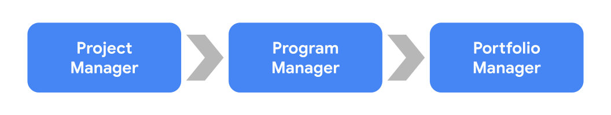
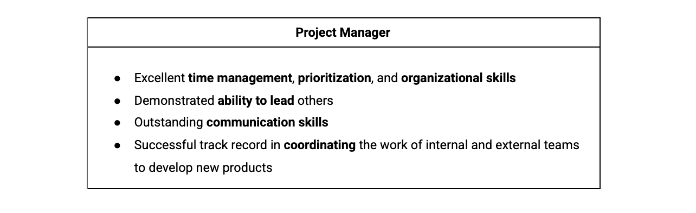
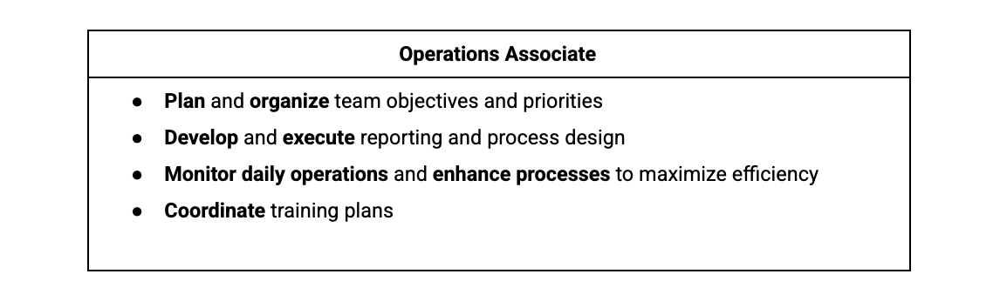

> Embacking-开始 on career-职业生涯 in project management
>
> 开始项目管理职业生涯

You will learn how the program is structured, what project management is and what a project manager does, how to apply your skills from previous work experience-经验 to project management roles, what types of project management roles you could pursue-追求 after completing this certificate, and how to search for those positions-位置,定位.

> 你将了解项目的结构，项目管理是什么，项目经理是做什么的，如何将你以前的工作经验中的技能应用到项目管理角色中，完成本证书后你可以从事哪些类型的项目管理角色，以及如何寻找这些职位。

**学习目标**

- Relate the skills and responsibilities-责任,职责 of a project manager necessary-必要的,必需的 to achieve-达到 success on the job.

	> 将项目经理在工作中取得成功所必需的技能和职责联系起来。

- Define project management and describe what constitutes-组成,构成 a project.

	> 定义项目管理并描述项目的构成。

- Explain project management roles and responsibilities-责任,职责 across a variety-多样化 of industries-行业.

	> 解释不同行业的项目管理角色和职责。

- Detail-详情,细节 and relate project management skills to project management and its value to business.

	> 将项目管理技能与项目管理及其商业价值联系起来。

- Determine how this program will help prepare-使...做好准备 you for a career in project management.

	> 确定这个项目将如何帮助你为项目管理的职业生涯做好准备。

- Explain the Project Management certificate program structure and course functionality-功能.

	> 解释项目管理证书课程结构和课程功能。

# Getting started with the program

## Welcome to the Google Project Management Certificate

> 欢迎来到 Google 项目管理证书

Hi! We're so excited that you're here.

> 嗨！你能来我们太兴奋了。

I'm Emilio, and I'm a **Program Manager**-项目经理 on the Responsible-负责任的 Innovation-创新 team here at Google, and I'd like to officially-正式的 welcome you to Google's Certificate Program-课程 in Project Management.

> 我是 Emilio，我是 Google 负责任创新团队的项目经理，我想正式欢迎您参加 Google 项目管理证书课程。

---

Let's start with a simple exercise-练习.

> 让我们从一个简单的练习开始。

Take a moment and think about some of the different tasks that you've completed in your life.

> 花点时间，想想你一生中完成的一些不同的任务。

Maybe you planned your wedding-婚礼 or a birthday party, or you filed-申请 your annual-年度的 tax returns-申报表.

> 也许你计划了你的婚礼或生日聚会，或者你提交了年度纳税申报表。

Maybe you moved from one state-州 to another, or maybe you're the family member who, somehow-不知何故, every year, is tasked with organizing-组织 the annual family reunion-聚会.

> 也许你从一个州搬到了另一个州，或者你是一个家庭成员，不知何故，每年都要组织一年一度的家庭聚会。

Believe it or not, you've been developing **all kinds of skills**-各种技能 through these tasks that'll help you become a successful project manager for any organization or your own business.

> 信不信由你，你已经通过这些任务发展了各种各样的技能，这些技能将帮助你成为任何组织或自己企业的成功项目经理。

---

With this program in project management by Google, we've put together a set of courses, activities, quizzes, and exercises that'll teach you the fundamentals-基本的,基本原理 of project management, and of course, help you get a job or advance-进步 in your career. 

> 有了谷歌的这个项目管理项目，我们整理了一套课程、活动、测验和练习，教你项目管理的基础知识，当然，帮助你找到工作或在你的职业生涯中取得进步。

Wondering-想知道 how I started my own career in project management?

> 想知道我是如何开始自己的项目管理职业生涯的吗?

Well, in college-大学, I always gravitated-被吸引到 towards things that were more hands-on-实际操作的,动手的 and action-oriented-行动向导 and less theoretical-理论的.

> 嗯，在大学里，我总是被那些更注重实践和行动的东西所吸引，而不是理论。

I wanted to make an impact-巨大影响 in whichever-无论哪个 career-职业 I took on.

> 无论我从事什么职业，我都想有所作为。

My first job out of college was as a Spanish-西班牙语 and leadership-领导力 teacher in Los Angeles, California.

> 我大学毕业后的第一份工作是在加州洛杉矶教西班牙语和领导力。

My main objective-目标,目的 in guiding the student leadership team at the school was to identify, mobilize-组织,调动, and inspire-激励,鼓励 the student leaders-领袖.

> 我在学校指导学生领导团队的主要目标是识别、动员和激励学生领袖。

After two years of teaching, I realized-意识到 that the moments-片刻 when I felt-觉得 the most energized-使活跃 were when I was building a vision-愿景 for how to get a big project done or when I was working to bring different groups together around a common goal. 

> 经过两年的教学，我意识到，当我为如何完成一个大项目建立一个愿景时，或者当我努力将不同的团队聚集在一起实现一个共同的目标时，我感到最充满活力。

That's when I realized-认识到,意识到 I had a lot of core project management skills, and I could **focus on**-专注于 growing and developing them in the business world.

> 那时我意识到我有很多核心的项目管理技能，我可以专注于在商业世界中成长和发展它们。

I'm grateful-感谢的,感激的 that I get to be here for the start of your journey-旅程,历程,过程.

> 我很感激能在这里见证你们旅程的开始。

When I was first starting to think about my career, project management wasn't even-甚至 on my radar-直觉感知能力.

> 当我第一次开始考虑我的职业生涯时，项目管理甚至不在我的考虑范围之内。

It was one of those professions-职业 that I didn't even know existed until-直到...为止 I entered-进入 the business world and experienced how great of a need there is for folks-人们 who are organized, action-oriented, diligent-勤奋的,细致的, and strategic-战略（性）的,策略（上）的.

> 这是一种我甚至不知道存在的职业，直到我进入商业世界并体验到对那些有组织、以行动为导向、勤奋和有战略的人的巨大需求。

I hope that by the end of this program-课程, you'll be as excited-激动的,兴奋的 as I am about the prospects-前景,展望 of a career in project management.

> 我希望在本课程结束时，你们会像我一样对项目管理职业的前景感到兴奋。

---

Let's get into it. 

> 让我们开始吧。

We'll start with an important question.

> 我们从一个重要的问题开始。

What exactly-究竟,到底 is project management?

> 项目管理到底是什么?

Project management is the application of knowledge, skills, tools, and techniques to meet-满足,应付 the project requirements and achieve-达到,取得 the desired-期望得到的,希望实现的 outcome-结果,效果.

> 项目管理是对知识、技能、工具和技术的应用，以满足项目需求并实现预期的结果。

It's possible that you've been project managing every day on some-某种 level-程度 without even knowing it.

> 你可能每天都在某种程度上进行项目管理，但你自己都不知道。

In this course, you'll learn how to hone-磨练,训练 those skills to become a truly-真实地,真正的 great-伟大的,著名的 project manager.

> 在本课程中，你将学习如何磨练这些技能，成为一个真正伟大的项目经理。

The awesome-让人惊叹的,令人敬畏的 thing about project management is that it spans-跨越,贯穿 a lot of industries-行业,实业公司 and company types, and it doesn't require deep, technical knowledge.

> 项目管理最棒的地方在于，它跨越了许多行业和公司类型，而且不需要深入的技术知识。

This means that any job or life experience you've gained **so far**-迄今为止 will help you in building those skills to become successful in a project management career.

> 这意味着到目前为止你获得的任何工作或生活经验都将帮助你建立这些技能，从而在项目管理职业中取得成功。

There are a lot of people around the world like you who are hoping to learn the skills to get a project management role.

> 世界上有很多人和你一样，希望学习项目管理的技能。

---

Whatever your reason for being here, we're glad-高兴的,非常愿意的 you've joined us. 

> 不管你来这里的原因是什么，我们都很高兴你能加入我们。

This program is rooted in a belief-信心,信念 that a strong-坚固的 foundation-基础 in project management can help anyone start a great career as a project manager.

> 该计划植根于这样一种信念，即在项目管理方面打下坚实的基础可以帮助任何人开始一个伟大的项目经理职业生涯。

This program includes six **industry-relevant**-行业相关 courses that focus on topics like project management fundamentals-基础,基本原理; goals-目标, objectives-目的, and deliverables-可交付成果; risk-风险 management; team dynamics-动态; project management methodologies-方法论; data-driven decision-决定,抉择 making; and more. 

> 该计划包括六个行业相关课程，重点关注项目管理基础；目标、目的和可交付成果；风险管理；团队动态；项目管理方法；数据驱动的决策；和更多。

Each course is made up of personal-个人的 anecdotes-轶事,趣闻, reading materials-材料, quizzes, and case studies, and you can go through the program at your own pace-节奏,速度, skip the sections-部分 that you might already know, and review-审查,检查 the videos again if you need a refresher-补习课程.

> 每门课程都由个人轶事、阅读材料、小测验和案例研究组成，你可以按照自己的节奏完成课程，跳过你可能已经知道的部分，如果你需要复习，可以再看一遍视频。

You will be doing a lot of **hands-on**-实际操作的 learning.

> 你将会做很多实际的学习。

You'll build project plans and timelines-时间线.

> 你将制定项目计划和时间表。

You'll learn how to manage budgets-预算,计划,安排 and **meet the needs of**-满足...的需求 the people involved-参与的 in the project, and you'll learn different project methodologies-方法论 like Agile-敏捷的, Scrum-敏捷, and Waterfall-瀑布.

> 你将学习如何管理预算和满足参与项目的人员的需求，你将学习不同的项目方法，如敏捷、Scrum和瀑布。

You'll use tools like Kanban and learn about project management software like Asana.

> 你将使用像看板这样的工具，学习像 Asana 这样的项目管理软件。

You also develop your soft skills, some of which you likely already have. 

> 你还可以发展你的软技能，其中一些你可能已经具备了。

Don't worry, even if you aren't quite-十分,完全地 sure how to **tap into**-利用 them yet, we'll explore-探讨,探究 which skills are transferable-可转移的 to a project management role.

> 不要担心，即使您还不太确定如何利用它们，我们将探索哪些技能可以转移到项目管理角色中。

---

 **Above all**-尤其,首先, this program will help get you ready for a new job.

> 最重要的是，这个课程将帮助你为新工作做好准备。

But we're taking it one step further.

> 但我们要更进一步。

When you complete this program, you'll have the opportunity-时机,机会 to share your work with Google and other top employers-雇主 **aiming-目的 to**-为了 hire-聘用 project management professionals, and the best part is, you'll have professional work examples you can share with them to showcase-展示,展现 what you've learned.

> 当你完成这个项目，你将有机会与谷歌和其他顶级雇主分享你的工作，目的是聘请项目管理专业人员，最好的部分是，你将有专业的工作实例，你可以与他们分享，以展示你学到的东西。

 **Along the way**-沿途, you'll hear from Google employees like me.

> 在这个过程中，你会听到像我这样的谷歌员工的声音。

We'll share personal stories about how we became project managers and how our foundations in project management launched-发动,发起 our careers-终身生涯,职业,事业.

> 我们将分享我们如何成为项目经理的个人故事，以及我们在项目管理方面的基础如何开启了我们的职业生涯。

We'll also share what we do at work every day and give you tips for job interviews-面试.

> 我们也会分享我们每天在工作中所做的事情，并给你一些面试的建议。

---

We've got a truly amazing group of course instructors-导师 for you to learn from.

> 我们有一群非常棒的课程导师供你学习。

Ready to meet them? 

> 准备好见他们了吗?

Hi, I'm JuAnne, a Senior-资深的 Program Manager on Cloud Security Programs.

> 大家好，我是JuAnne，云安全项目的高级项目经理。

I'm your instructor for Course 2, where we'll learn more about what's needed to **set the stage for**-为...做好准备 a successful project. 

> 我是课程2的指导老师，我们会学到更多关于为一个成功的项目做准备所需要的东西。

---

Hey there.

> 嘿。

My name's Rowena, a Senior Program Manager in Google Cloud.

> 我叫Rowena，是 Google Cloud 的高级项目经理。

I'm your instructor for Course 3, Project Planning, Putting It All Together, where we'll learn about the importance of thorough project planning, identifying key milestones-里程碑,重要事件 and dependencies, documenting project plans, scheduling-调度, budgeting-预算, and risk management. 

> 我是课程3的讲师，项目规划，把它放在一起，在那里我们将了解彻底的项目规划的重要性，确定关键里程碑和依赖关系，记录项目计划，调度，预算和风险管理。

---

I'm Elita, a Senior Engineering Program Manager at Google, and I'm your instructor for Course 4, Project Execution-执行,实施: Running a Project.

> 我是Elita，谷歌的高级工程项目经理，我是你们课程4，项目执行:运行一个项目的导师。

Where we'll learn about communicating-通讯 effectively-有效地, managing risks, understanding team dynamics, using data to inform-通知,告知 decision-making-决策, and tracking-追踪 progress-进展. 

> 在这里，我们将学习如何有效地沟通，管理风险，理解团队动态，使用数据来通知决策，并跟踪进度。

---

Hi, I'm Sue.

> 嗨，我是苏。

I'm a Technical Program Manager for Google Support Platform.

> 我是谷歌支持平台的技术项目经理。

I'm your instructor for Course 5, Agile-敏捷的 Project Management.

> 我是你们课程5敏捷项目管理的指导老师。

Where we'll gain a deeper-更深 understanding of Agile project management, including principles and practices-实践, the benefits and costs of Agile transformations-转变, the dynamics of Agile teams, and the process of running Sprints and Releases. 

> 在这里，我们将对敏捷项目管理有更深的理解，包括原则和实践，敏捷转换的收益和成本，敏捷团队的动态，以及运行sprint和release的过程。

---

And I'm Dan, a Program Manager in Google Research.

> 我是 Dan，谷歌研究院的项目经理。

I'm really excited to be your instructor for Course 6, Applying Project Management in the Real World, where we'll take all the knowledge, skills, and understanding you've built up throughout this certificate and apply it to an advanced-高级的 project scenario. 

> 我很高兴能成为你们课程6的讲师，在现实世界中应用项目管理，在那里我们将把所有的知识，技能和理解你在这个证书中建立起来，并将其应用到一个高级项目场景中。

Ready to get started?

> 准备好开始了么？

Let's go.

> 现在开始吧。

## Program and course overview-概述 

> 项目和课程概述

Hello!

Welcome to the first of the six courses in the Google Project Management Certificate program.

> 欢迎来到 Google 项目管理证书项目六门课程中的第一门。

In this reading, you will learn about the program structure and course functionality-功能.

> 在本阅读材料中，您将了解程序结构和课程功能。

We’ve specifically designed the program you’re about to explore-探讨,探究 to help every type of learner successfully finish the certificate and get ready for a role in project management.

> 我们特别设计了您即将探索的课程，以帮助各种类型的学习者成功完成证书并为项目管理角色做好准备。

No previous experience is required.

> 没有工作经验要求。

In the first course, you will learn the fundamentals-基础原理 of project management and how this program will prepare you for project management roles in numerous-众多的,许多的 types of industries-行业,产业.

> 在第一门课程中，您将学习项目管理的基础知识，以及该课程将如何为您在众多类型的行业中的项目管理角色做好准备。

You will explore-探讨,探究 the different types of career paths-道路 you might pursue-追求,从事, the responsibilities-职责,责任 and essential-基本的,必不可少的,非常重要的 skills of a project manager, the importance of the project life cycle, common-常见的 project management methodologies, and how organizational structure and culture-文化 impact-巨大影响 project management.

> 在第一门课程中，您将学习项目管理的基础知识，以及该课程将如何为您在众多类型的行业中的项目管理角色做好准备。

In this course, and throughout the program, you will get a rare-少见的,稀罕的 inside look at project management within Google. 

> 在这个过程中，并在整个程序，你会得到一个罕见的内部看在谷歌的项目管理。

Current Google project managers will offer-提供 a multi-dimensional-多维 educational-教育的 experience that will provide you with tools you can apply on the job.

> 目前的谷歌项目经理将提供多维度的教育经验，为你提供可以在工作中应用的工具。

**Become job-ready**

> 做好工作准备

Throughout the [Google Project Management Certificate program](https://www.coursera.org/professional-certificates/google-project-management), you will learn the foundations of traditional-传统的 project management and **gain insight into**-深入了解 Agile project management.

> 在整个 [Google项目管理证书课程](https://www.coursera.org/professional-certificates/google-project-management) 中，您将学习传统项目管理的基础知识，并深入了解敏捷项目管理。

According-根据,相应的 to the Project Management Institute-协会, the project management labor-工作 force in seven project-oriented sectors-行业 is expected-期待,预计 to grow by 33 percent, or nearly 22 million new jobs, by 2027.

> 根据项目管理协会的数据，到2027年，七个项目导向行业的项目管理劳动力预计将增长33%，即近2200万个新工作岗位。

We are excited to join you on this journey as you learn the skills to begin a career in one of today’s most in-demand-非常受欢迎 professions-职业.

> 我们很高兴能加入您的旅程，因为您将学习在当今最受欢迎的职业之一开始职业生涯的技能。

Course 1 covers four weeks of material-材料.

> 课程 1 包括四周的材料。

Each week includes a series of lessons with many types of learning opportunities-机会, such as:

> 每周包括一系列课程，提供多种学习机会，例如:

- **Videos** with a Google employee as your instructor. 

	> 视频与谷歌员工作为你的教练。

- **Readings** to introduce new ideas and case studies-研究 and to **build on**-以...为基础 the concepts-概念,观念 from the videos.  

	> 介绍新想法和案例研究的阅读材料，并以视频中的概念为基础。

- **Discussion forums**-讨论区 to explore course topics for better understanding and chat-聊天 with peers-同龄人 in the program.

	>  讨论论坛，探讨课程主题，以便更好地理解，并与项目中的同龄人聊天。

- **In-video questions**-视频问题 that will pop up from time to time. They’re designed-设计 for you to check your learning as you go! 

	> 视频中的问题会不时出现。它们是为你在学习过程中检查你的学习而设计的!

- **Practice quizzes**-练习测验 to check your understanding and give you valuable feedback. 

	> 练习测验来检查你的理解并给你有价值的反馈。

- **Practice activities**-实践活动 will provide you with a hands-on opportunity to apply skills you are working to master-掌握. You will assess-评价,评定 your work by answering quiz questions about it or by comparing it to an exemplar-模范 built by our course team. *Note: these activities will not count towards-关于 your final course grade, but you are strongly-坚定地 encouraged-鼓励 to complete them as they will help prepare you for the graded quizzes and peer reviews.*

	> 实践活动将为你提供一个实践的机会来应用你正在努力掌握的技能。你将通过回答关于它的测试问题或将其与我们的课程团队建立的范例进行比较来评估你的工作。
	>
	> 注意：这些活动不会计入你的期末成绩，但我们强烈建议你完成这些活动，因为它们将帮助你为评分测验和同行评议做准备。

- **Graded quizzes**-分级测验 on video and reading content to measure-衡量 your progress-进展. 

	> 通过视频和阅读内容的评分测验来衡量你的进步。

- Ungraded-没有分等级的,不合格的,不标准的 **peer-review activities**-同行评议活动 on video and reading content that provide you the opportunity to practice applying skills you are working to master. Other learners in your course will see the work you submit and give you feedback based on a rubric-标题,说明. 

	> 通过视频和阅读内容进行不评分的同行评议活动，为您提供练习应用您正在努力掌握的技能的机会。您课程中的其他学习者将看到您提交的作业，并根据标题给您反馈。

- **Graded-分级 peer-review activities** on video and reading content that assess-评价,评估 your ability to apply skills you are working to master. Other learners in your course will grade-评分 your work and give you feedback based on a rubric.

	> 通过视频和阅读内容进行分级的同行评议活动，评估你应用你正在努力掌握的技能的能力。您课程中的其他学习者将根据评分标准对您的作业进行评分并给出反馈。

Everyone learns differently, so we designed this program to let you work at your own pace-节奏.

> 每个人学习的方式都不一样，所以我们设计了这个项目，让你按照自己的节奏学习。

Although your personalized-个性化 deadlines-最后期限,截止日期 start when you enroll-参加,登记, they’re just a guide.

> 虽然你的个性化截止日期从你注册时就开始了，但它们只是一个指导。

**Feel free**-随意 to move through the program however it works **best for**-最适合 you.

> 你可以随意选择最适合自己的方法。

**Keep in mind**-记住, you can always reset your deadlines by clicking the blue **reset my deadlines** button.

> 记住，你可以通过点击蓝色的“重置我的截止日期”按钮来重置你的截止日期。

There’s no penalty-处罚 for late assignments-作业.

> 迟交作业不会被扣分。

To earn-获得,赢得 your certificate, all you have to do is complete all of the work.

> 要获得证书，你所要做的就是完成所有的工作。

**Tips**

- We strongly recommend you take all six courses—and complete the items in each lesson—in the order they appear-出现,呈现, as new information and concepts-概念,观念 **build on**-以...为基础 previous ones. 

	> 我们强烈建议你学习所有的六门课程，并按照它们出现的顺序完成每一课的项目，因为新的信息和概念是建立在前一门课程的基础上的。

- Make the most of the readings and additional resources throughout the program. They’re designed to support your learning.

	> 在整个课程中充分利用阅读材料和其他资源。它们是用来支持你的学习的。

- If something is confusing-令人费解的, don’t hesitate-犹豫 to re-watch a video, go through a reading again, or ask your classmates for advice-建议 in the discussion forum. 

	> 如果有什么让人困惑的地方，不要犹豫，重新看一遍视频，再看一遍阅读材料，或者在论坛上向你的同学寻求建议。

- **Take part in**-参加 all learning opportunities to gain as much knowledge and experience possible. 

	> 参加所有的学习机会，以获得尽可能多的知识和经验。

Congratulations on choosing to take this first step toward becoming a part of the wonderful-绝妙的 world of project management.

> 祝贺你选择迈出第一步，成为项目管理这个奇妙世界的一部分。

Enjoy the journey!

> 享受旅途！

**Source: PMI (2017). Project Management Job Growth and Talent-人才 Gap-缺口 2017–2027.*

> 资料来源：PMI(2017)。2017-2027年项目管理岗位增长与人才缺口。

## Introduction to Course 1

> 介绍课程1

So far, we've previewed-预览 what you can expect-预计,期待 throughout-贯穿 this program.

> 到目前为止，我们已经预览了您在整个节目中可以期待的内容。

In this video, we'll discuss the details of this course.

> 在这个视频中，我们将讨论这门课程的细节。

And you'll have a greater-较大的 understanding for which types of jobs are suitable-适宜的,合适的 for learners like you.

> 这样你就能更好地了解哪些类型的工作适合像你这样的学习者。

We'll cover some key project management terms-术语 and the roles and responsibilities-责任 of any **entry level**-入门级 project manager.

> 我们将介绍一些关键的项目管理术语，以及任何入门级项目经理的角色和职责。

Plus-而且, we'll discuss the kinds of jobs you can pursue-从事,追求 after you complete this program.

> 另外，我们将讨论你完成这个项目后可以从事的工作类型。

One thing you'll learn soon is that there are other roles and jobs, **outside of**-在...之外 project manager, that this program will prepare you for.

> 你很快就会知道，除了项目经理之外，还有其他的角色和工作，这门课程将为你做好准备。

Later in this course, we'll have a video on how to search for those roles and how to view project management as both a position-职位 and a skill.

> 在本课程的后期，我们将有一个关于如何搜索这些角色以及如何将项目管理视为职位和技能的视频。

For now, we'll start by going even deeper into what a project is, what a project manager is, and what kinds of skills they have. 

> 现在，我们将开始更深入地了解什么是项目，什么是项目经理，以及他们拥有什么样的技能。

We'll provide real life examples to help illustrate-说明,阐明 that you probably-大概,或许 already have learned some of the skills required to become a successful project manager.

> 我们将提供现实生活中的例子来帮助说明，您可能已经学会了成为一名成功的项目经理所需的一些技能。

Then you'll learn more about adding value to projects and **tips on**-关于...的建议 being a successful project manager from real life Googlers. 

> 然后，你将从现实生活中的谷歌人那里学到更多关于为项目增加价值的知识，以及成为一名成功的项目经理的建议。

Pretty-相当,颇 exciting, right?

> 很令人兴奋，对吧?

We'll also cover the project's life cycle.

> 我们还将介绍项目的生命周期。

You'll learn all about a project's different phases-阶段, the corresponding-相应的,相关的 tasks in each phase, different methodologies for completing tasks and which is effective-有效的 for a given project.

> 您将了解项目的不同阶段，每个阶段对应的任务，完成任务的不同方法以及对给定项目有效的方法。

Finally, you will learn about different types of organizational structures and cultures-文化 and how they impact-巨大影响 project management.

> 最后，您将了解不同类型的组织结构和文化，以及它们如何影响项目管理。

Coming up, we'll start exploring the concept of a project and the project management field-域 as a whole-整体.

> 接下来，我们将开始探索项目的概念以及整个项目管理领域。

Are you ready to crank-把 things up a notch-等级,档次?

> 你准备好再来一次了吗?

See you soon.

## Helpful resources to get started

The Google Project Management Certificate will provide you with new lessons every week. As you’ve learned, each lesson includes a series of videos, readings, activities, in-video questions, practice quizzes, and graded quizzes. In this reading, you’ll learn about providing feedback on course content, obtaining the Google Project Management Certificate, and acquiring-获得,习得 helpful habits-习惯 for successfully completing this certificate program. 

**Providing feedback on course content**

Please remember to give feedback on videos, readings, and materials. Just open the resource and look for the thumbs-up-翘拇指 and thumbs-down-责备,反对 symbols. 

- Click thumbs-up for materials that are helpful. 
- Click thumbs-down for materials that are not helpful.

If you want to flag-标记 a specific issue with the item-项目,一条, click the flag icon, select a category-种类, and then optionally-可选择的,随意的 type an explanation-解释,说明 in the text box.

This feedback goes to the course developers-开发者, not other learners, and helps create even better programs in the future. 

For technical help, visit the [Learner Help Center](https://learner.coursera.help/hc/en-us). 

**Obtaining the Google Project Management Certificate**

You can review videos, readings, discussion forums, in-video questions, and practice quizzes in the program **for free**-免费. However, to access-访问 graded assignments and be eligible-符合条件的,合格的 to receive your official Google Project Management Certificate, you must:

- Pay the [course certificate fee](https://www.coursera.support/s/article/209818963-Payments-on-Coursera?language=en_US), or apply and be approved for [Coursera Financial Aid](https://www.coursera.support/s/article/209819033-Apply-for-Financial-Aid-or-a-Scholarship?language=en_US).

AND

- Pass all graded assignments in all six courses or meet-满足 the course-passing threshold. Each graded-分级,评分 assignment is part of a cumulative-积累的 graded score for the course, and the passing grade for each course is 80%. 

**Helpful habits-习惯 to successfully complete the certificate**

As a learner, you’re bringing all of your past experiences and best learning practices to this program. The designers of this course have also put together a list of helpful habits that they believe will help you to be successful: 

1. **Plan your time:** Setting regular-规则的 study times and sticking-坚持 with them each week can help you make learning a part of your routine-常规,惯例. Use a calendar or timetable to create a schedule-计划表,时间表, and list what you plan to do each day **in order to**-为了 break your work down into achievable-可完成的 goals. Create a quiet-安静的 place to watch the videos, review-复习 the readings, and complete the activities so you can really focus on the material.
2. **Be curious-好奇的:** If you find an idea that gets you excited, act on it! Ask questions, search for more details online, **check out**-查看 the links that interest you, and **take notes**-做笔记 on your discoveries. The little things you do to support your learning along the way will take your knowledge even further, open more doors-大门,入口 in this high-growth-高成长性 field, and help you qualify-取得资格 for jobs. 
3. **Take notes:** Notes are useful-to-remember information that you think might be important in the future, especially-特别,尤其 as you’re preparing to enter a new job field. In addition, taking notes is an effective way to make connections between topics and gain a better understanding of those topics.
4. **Chat (responsibly) with other learners**: If you have a question, chances are, you’re not alone. **Reach out**-主动联系 in the [discussion forum](https://www.coursera.org/learn/project-management-foundations/discussions) to ask for help from other learners taking this program. You can also visit Coursera’s[ Global Online Community-社区](https://coursera.community/). Other important things to know while you’re making friends can be found in the [Coursera Honor Code](https://learner.coursera.help/hc/en-us/articles/209818863-Coursera-Honor-Code) and [Code of Conduct](https://learner.coursera.help/hc/en-us/articles/208280036-Coursera-Code-of-Conduct).
5. **Update your profile**: Consider-考虑 [updating your profile](https://www.coursera.org/account/profile) on Coursera. This link appears in the menu when you click on your name at the top-right corner of this screen. When classmates find you in the discussion forums, they can click on your name to view your profile and get to know you more.

**Finding more information**

Throughout this course, you will learn the basics of project management. We will provide a lot of information through videos and readings. But sometimes, you may need to look things up on your own for additional learning. Things change fast in this growing field, so it is critical-关键的 to do your own research-研究 so you can **stay up-to-date**-与时俱进 on what is new. 

Here are some helpful project management resources available online:

- The [Project Management Institute-研究所,协会](https://www.pmi.org/) is the leading association-协会 for those in project, program-计划, or portfolio-投资组合 management professions-专业. Their website provides guides, **industry standards**-行业标准, articles-文章,论文, templates, **job boards**-招聘公告板, certifications, and more to help support professionals in these careers.
- The [Scrum Guide](https://www.scrumguides.org/index.html) defines Scrum, a technique used in Agile project management. You’ll learn about this framework later in the program. This guide describes Scrum’s roles, events, artifacts, and the rules that bind them together. You can also find hundreds of free resources to learn more about Scrum at [Scrum.org Resources](https://www.scrum.org/resources).

**Glossary-术语表**

This course will cover a lot of terms and concepts, some of which you may already know and some of which will be new. To remind yourself about what a term means, refer to this [Glossary](https://www.coursera.org/learn/project-management-foundations/resources/R9Ijr).

---

## Program surveys-调查,考察

During-在...期间 this certificate program, you will be asked to complete a few short surveys. These are part of a research-研究,探索 study-研究 **being conducted**-正在开展 to understand how effectively-有效地,实际上 the certificate meets-满足 your career training-培训,训练 needs. Keep reading for a summary-摘要 of what each survey will cover.

Your survey participation-参加,参与 is optional but extremely-极度,非常 helpful in making this program as effective-有效的,其作用的 as possible. All data is kept-保持,处于 confidential-机密的,保密的 and is aggregated-聚合的,合计的 for review-审查 in accordance-按照,依据 with [Coursera’s privacy-隐私 policy](https://www.coursera.org/about/privacy). Your name is separated-分离,隔开 from your data when it is stored.

There are no right or wrong answers. Your responses or personal data:

- Won’t affect your program experience, scores, or ability to receive a certificate or job offer.
- Won’t be shared outside of our research-研究 team, unless-除非 you give permission-同意,许可 to share your contact-联系 information with hiring-招聘,雇用,租用 partners.

Thanks for your consideration-考虑,斟酌 and time! 

**Entry survey**

First, you will have an opportunity to answer a brief-短暂的,简短的 survey to help researchers understand why you enrolled in this certificate program. If you don’t **fill out**-填写 the survey now, you will receive an invitation to fill it out after completing your first video or activity.

The survey asks about your experiences **leading up to**-在...之前 this program and the goals you hope to achieve. This is critical-关键的 information to ensure your needs as a learner are met and that this program will continue to be offered-提供的,提议的 in the future. 

**Individual-单独的,个别的 course feedback**

After you complete the last graded assignment within an individual course, you might be asked to complete a survey. This survey will revisit questions from the previous survey and ask what you have learned up to that point in the program. Again, filling out this information is voluntary-主动的 but extremely-极度,非常 beneficial to the program and future learners.

**Certificate completion survey**

After you complete the last graded assignment in the final course of the certificate program, you will be asked to complete a survey that revisits some earlier questions and asks what you have learned throughout the duration-持续,持续时间 of the program. This survey also asks whether you would like to share your contact information with prospective-潜在的 employers. Filling out the survey and sharing your contact information with prospective-潜在的 employers is completely-完全地,彻底地 optional and will not affect your course experience, scores, or ability to receive a certificate or job offer in any way.

# Understanding the basics of project management

> 了解项目管理的基本知识

## What is project management?

> 什么是项目管理?

Hey, again!

Let's get back into it. 

> 让我们回到正题。

In this video, we'll define-定义 a project, define-定义 project management, and explain its value to an organization.

> 在本视频中，我们将定义项目，定义项目管理，并解释其对组织的价值。

---

Let's start by defining exactly-精确地,确切地 what a project is. 

> 让我们从定义项目开始。

A project, is a unique endeavor-尽力,努力, and usually-通常地,经常地 includes a set of unique deliverables.

> 一个项目是一个独特的努力，通常包括一组独特的可交付成果。

It's also a temporary pursuit-追求.

> 这也是一种暂时的追求。

It has a defined-明确 beginning and an end.

> 它有明确的开始和结束。

To put it another way, a project is a series of tasks that need to be completed to reach a desired-期望得到的 outcome-结果,效果. 

> 换句话说，项目是一系列需要完成的任务，以达到预期的结果。

Reaching that desired-期望得到的 outcome takes collaboration-合作,协作 and careful planning that keeps the project on track and on budget. 

> 达到预期的结果需要协作和仔细的计划，以保持项目的轨道和预算。

That's where project management comes in. -这就是项目管理的用武之地。

> 这就是项目管理的用武之地。

---

Project management is critical-关键的 to the success of projects both big and small.

> 项目管理对于大小项目的成功都是至关重要的。

Let's break it down into the what, the why, and the how. 

> 让我们把它分解成“是什么”、“为什么”和“如何”。

What is project management? 

> 什么是项目管理?

Why is project management an important part of an organization? 

> 为什么项目管理是组织的重要组成部分?

How is it vital-至关重要的,必不可少的 to a project's success? 

> 它对项目的成功有何重要意义?

As I mentioned-提到,谈到, project management is the application of knowledge, skills, tools, and techniques to meet the project requirements and achieve the desired-期望得到的 outcome.

> 正如我所提到的，项目管理是知识、技能、工具和技术的应用，以满足项目需求并实现预期的结果。

Project management is valuable to businesses because it helps ensure that a project delivers the expected-预料的,预期的 outcomes, both on time and within budget.

> 项目管理对企业是有价值的，因为它有助于确保项目按时并在预算范围内交付预期的结果。

---

To demonstrate-证明 what I mean I'll take you through a real-life example of project management. 

> 为了演示我的意思，我将带您通过一个现实生活中的项目管理示例。

Imagine a **school district**-学区 **signs a deal**-签订协议 with a telehealth-远程医疗 company to make sure students don't have to miss school for simple health issues, like fevers-发烧,发热 or headaches-头痛,头疼.

> 想象一下，一个学区与一家远程医疗公司签署了一项协议，以确保学生不必因为发烧或头痛等简单的健康问题而缺课。

The deal-交易 will be completed by the end of the school year.

> 这项交易将在本学年结束前完成。

The students can now interact-相互交流 with the doctor through a tablet, smartphone-智能手机, or a computer, while they're at school.

> 学生们现在可以在学校里通过平板电脑、智能手机或电脑与医生互动。

Implementing-执行,贯彻 this technology into the school's procedures-程序 is the project.

> 将这项技术应用到学校的程序中就是这个项目。

It's got a clear outcome and start and end date. 

> 它有一个明确的结果，开始和结束的日期。

---

So, how is that project managed? 

> 那么，这个项目是如何管理的呢?

Well, this project has several-几个,数个 tasks, and each one has to be carefully planned out and tracked, or managed, **in order for**-为了 the project to be completed.

> 嗯，这个项目有几个任务，为了完成项目，每一个任务都必须仔细地计划和跟踪，或管理。

For example, to start you can organize training-培训,训练 sessions for faculty-全体教员 to get them better acquainted-使熟悉 with the technology, policies, and procedures-程序.

> 例如，一开始你可以为教师组织培训课程，让他们更好地熟悉技术、政策和程序。

You can budget for tablets, computers, and other vital-必不可少的 equipment-设备 to facilitate-使便利,促进,推动 the virtual-虚拟的 checkups-审查,检查.

> 你可以为平板电脑、电脑和其他重要设备做预算，以方便虚拟检查。

You can maintain-保持,维护 strong communication with doctors, the telehealth-远程医疗 company, and school **staff-全体员工 members**-工作人员 and so much more.

> 您可以与医生、远程医疗公司和学校工作人员等保持良好的沟通。

To successfully launch-发动,发起 the product in the schools all of those things need to get done. 

> 要想在学校成功推出产品，所有这些事情都需要完成。

That is project management.

> 这就是项目管理。

---

Seems pretty-相当,颇 important to an organization's success, right? 

> 似乎对一个组织的成功很重要，对吧?

More and more companies are starting to understand how project management can save-节省 them lots of money and time. 

> 越来越多的公司开始了解项目管理如何为他们节省大量的金钱和时间。

Poor-劣质的 project management can lead to trillions-万亿 of wasted-浪费掉的 dollars every year for organizations around the world.

> 糟糕的项目管理每年会给世界各地的组织造成数万亿美元的浪费。

More specifically, poor project management can lead to 48 percent-百分之 of projects missing delivery dates, 43 percent missing budget targets, and 31 percent failing-未能做到 to meet an organization's goals. 

> 更具体地说，糟糕的项目管理可能导致48%的项目错过交付日期，43%的项目错过预算目标，31%的项目未能达到组织的目标。

As a company that serves so many different purposes-目的,目标 in communities-社区, it's no surprise that project management's a huge-庞大的,极大的 part of Google. 

> 作为一家在社区中服务于多种不同目的的公司，项目管理是谷歌的重要组成部分也就不足为奇了。

But here, many of our project managers are described as "program managers," because they manage multiple projects for specific products, teams, or programs.

> 但是在这里，我们的许多项目经理被描述为“规划经理”，因为他们为特定的产品、团队或规划管理多个项目。

There are thousands-数千 of people here with the job of keeping projects and programs running smoothly-平稳地. 

> 这里有成千上万的人负责保持项目和程序的顺利运行。

People like me.

> 像我

I'm a responsible-负责的 innovation-革新,创新 program manager.

> 我是一个负责任的创新项目经理。

My team is responsible for ensuring that the technology we produce, the research we pursue-追求,致力于, and the publications-出版物 we put out are all done with Google's artificial-人造的,人工的 intelligence-智力,才智 principles in mind. 

> 我的团队负责确保我们生产的技术、我们进行的研究和我们发表的出版物都是基于谷歌的人工智能原则完成的。

I review the processes for each of these types of technologies, and I give ideas for how to continue innovating-革新,改革 responsibly-认真负责地 to meet our organizational goals. 

> 我回顾了每一种技术的过程，并给出了如何继续负责任地创新以实现我们组织目标的想法。

My job adds value to Google through the core aspects-方面 of project management we've mentioned-提及,说起, planning and organizing, managing tasks, and budgeting and controlling costs. 

> 我的工作是通过我们提到的项目管理的核心方面为谷歌增加价值，包括计划和组织、管理任务、预算和控制成本。

Hopefully you have a better sense-理解力 of what a project is, what project management is, and why project management is an important part of every company, and how it's vital to a project's success. 

> 希望你对什么是项目，什么是项目管理，为什么项目管理是每个公司的重要组成部分，以及它对项目成功的重要性有了更好的理解。

Next up, we'll learn more about what a project manager does.

> 接下来，我们将学习更多关于项目经理的工作。

## What does a project manager do?

> 项目经理是做什么的?

Hey, so we've covered what project management is and why it's important to organizations.

> 嘿，我们已经介绍了什么是项目管理以及为什么它对组织很重要。

Now, let's learn more about what project managers do on a **day-to-day basis**-日常. 

> 现在，让我们更多地了解项目经理在日常工作中都做些什么。

Project managers usually follow a process that involves-牵涉,涉及 planning and organizing, managing tasks, budgeting, controlling costs and other factors-因素,要素.

> 项目经理通常遵循一个过程，包括计划和组织、管理任务、预算、控制成本和其他因素。

Everything they do helps make sure the project can be completed on time and on budget.

> 他们所做的一切都有助于确保项目能够按时按预算完成。

**In broad-广泛的 terms**-大体上, a project manager also needs to make sure that the project outcome is bringing value to the company. 

> 从广义上讲，项目经理还需要确保项目成果为公司带来价值。

A project manager can add value in many different ways.

> 项目经理可以通过许多不同的方式增加价值。

Whether that's creating a new service for customers or modifying an old service so it's more tailored-特制的,专门的 to the customer's needs.

> 无论是为客户创建新服务，还是修改旧服务，使其更适合客户的需求。

**No matter**-无论如何 what the task is, a successful project will always add value.

> 无论任务是什么，一个成功的项目总是会增加价值。

And it's the project manager's job to make sure that project is both valuable and successful. 

> 项目经理的工作是确保项目既有价值又成功。

---

You may be asking yourself, well, if I'm a project manager, how do I add value to an organization every day?

> 你可能会问自己，如果我是一个项目经理，我如何每天为一个组织增加价值?

What does the day-to-day life of a project manager look like?

> 项目经理的日常生活是怎样的?

Well, a project manager's responsibilities can vary-不同的,呈现差异, depending on the project, the industry-行业,领域, and the company they're working in. 

> 嗯，项目经理的职责可能会有所不同，这取决于项目、行业和他们所在的公司。

Are you constructing a new building-楼房? 

> 你们正在建造一座新楼吗?

Are you project managing a renewable-可再生的 energy-能源 product in a startup-初创公司? 

> 你是否在一家初创公司管理可再生能源产品的项目?

Or are you setting up your own event-活动 management company? 

> 或者你正在建立自己的活动管理公司?

Your tasks will be different in each scenario, but here's a general-总体的 overview of what a typical-典型的,有代表性的,一贯的 day might look like.

> 你的任务在每种情况下都是不同的，但这里有一个典型的一天的总体概述。

A project manager's daily responsibilities always include some version of the following, planning and organizing.

> 项目经理的日常职责通常包括以下内容：计划和组织。

An example of that might be gathering-收集,采集 requirements from teammates or customers.

> 这方面的一个例子可能是从队友或客户那里收集需求。

This means **figuring out**-弄清楚,理解 what exactly-究竟,到底 your project's trying to accomplish.

> 这意味着要弄清楚你的项目到底想要完成什么。

You might have a kickoff-开始 meeting or send a survey.

> 你可能会开一个启动会议或发送一份调查。

From here you may also work on creating project plans.

> 从这里开始，您还可以创建项目计划。

Creating project plans is a key part of project management.

> 制定项目计划是项目管理的重要组成部分。

It helps set the tone-风格 of the project, keeps everyone on pace-速度,节奏 and aligned-使一致, and helps move tasks along-向前. 

> 它有助于确定项目的基调，使每个人都保持步调一致，并有助于推进任务。

---

Which leads me to my second point, managing tasks.

> 这就引出了我的第二点，管理任务。

Once-一旦 the project is underway-在进行中的, the project manager helps manage tasks for the team members and communicates-传达,传递 key milestones-里程碑 to the larger team or customers.

> 一旦项目开始进行，项目经理就会帮助团队成员管理任务，并向更大的团队或客户传达关键的里程碑。

This helps keep team members, and customers updated on how the project is progressing-进步,进展. 

> 这有助于保持团队成员和客户对项目进展情况的更新。

---

The third piece-部分 is budgeting and controlling costs and other factors.

> 第三部分是预算和控制成本和其他因素。

Managing the budget and controlling costs is a common responsibility that project managers have to understand to keep the project on track-轨道 and within-在...范围内 budget. 

> 管理预算和控制成本是项目经理必须了解的共同责任，以保持项目在轨道上并在预算范围内。

This is a **full-time**-专职的,全日制的 job because the plan you've created and managed may change causing unexpected costs to come up.

> 这是一份全职工作，因为你制定和管理的计划可能会发生变化，从而产生意想不到的成本。

And that's just to **name a few**-列举几个.

> 这只是其中的几个例子。

I could go on for days.

> 我可以一连讲好几天。

But the most important thing to know about the day to day of a project manager is this: 

> 但是关于项目经理的日常工作，最重要的是要知道:

You'll use different tools, techniques and methodologies every single day.

> 你每天都会使用不同的工具、技术和方法。

There's never a dull-枯燥无聊的 moment. 

> 从来没有沉闷的时刻。

Personally-就个人而言, my favorite part about being a project manager is that I get to watch the project's growth from start to finish. 

> 就我个人而言，作为一个项目经理，我最喜欢的部分是我可以从头到尾观察项目的发展。

It's really special to create something from nothing, working from the **ground up**-从零开始. 

> 从无到有，从零开始，真的很特别。

It's a really satisfying-令人满意的,令人满足的 feeling. 

> 这是一种非常令人满足的感觉。

As a project manager, you'll use a variety of skills every day, and a lot of these skills you might already have, and we'll discuss this more coming up. 

> 作为一名项目经理，您每天都会使用各种各样的技能，其中许多技能您可能已经拥有，我们将在后面讨论更多。

See you there.

## Transferable可转让的,可转移的 project management skills

> 可转移的项目管理技能

Welcome back.

Let's get right into it and explore the variety of skills you'll use. 

> 让我们直接进入并探索您将使用的各种技能。

Have you ever-曾经 been tasked with planning a loved one's surprise-惊喜,惊讶 birthday party? 

> 你是否曾经被要求为心爱的人策划惊喜生日派对?

There's usually a lot of pressure-压力 and responsibility, but when you get it right, it feels amazing.

> 通常会有很多压力和责任，但当你做对了，感觉很棒。

That's still true even if there were **a couple of**-几个 issues.

> 即使存在一些问题，这仍然是正确的。

Maybe the guest-客人 of honor-尊敬 arrived home earlier than expected-预料的,预期的 and nearly-几乎,差不错 ruined-毁坏,破坏,毁灭 the surprise.

> 也许贵宾比预期提前到家，差点毁了这个惊喜。

But if you made someone feel special on their birthday you probably planned a successful project.

> 但是如果你让某人在他们的生日感到特别，你可能计划了一个成功的项目。

As you chose a venue-场所,地点, sent out invitations, and calculated your budget based on your number of guests, you were using several-几个,数个,不同的 project management skills, like planning and organizing, managing tasks, budgeting, and controlling costs, and more.

> 当你选择场地，发出邀请，并根据你的客人数量计算预算时，你正在使用一些项目管理技能，如计划和组织，管理任务，预算和控制成本等等。

Or maybe you've never planned a party. 

> 或者你从来没办过派对。

Have you ever worked in the retail-零售 space-场所, or in the service industry? 

> 你曾在零售业或服务业工作过吗?

Then you might have experience that'll translate into the project management field, too.

> 那么你的经验可能也会转化为项目管理领域。

For example, you might have been **in charge of**-负责 managing several-几个,数个,不同的 employees' schedules.

> 例如，你可能负责管理几个员工的日程安排。

To do that, you had to plan and organize which employees' work styles would complement-补充,补足 each other in a productive-多产的 way.

> 要做到这一点，你必须计划和组织哪些员工的工作风格能够以一种富有成效的方式相互补充。

You also had to make sure that all duties-职责 and responsibilities would be covered during-在...期间 each shift-轮班.

> 你还必须确保每个班次都能承担所有的职责和责任。

Plus, you had to be aware-知道的,明白的 of all employees' availability. 

> 另外，你必须了解所有员工的可用性。

Doesn't sound familiar-熟悉的? 

> 听起来不熟悉吗?

Well, have you ever-曾经 had to relocate-调动,搬迁,迁移 for a new job and planned a big move? 

> 那么，你是否曾经为了一份新工作而搬迁，并计划了一次大的搬家?

To successfully move all of your belongings, you may have coordinated-协调,配合 friends and family to help.

> 为了成功地移动你所有的物品，你可能已经协调了朋友和家人的帮助。

You would have had to budget and control costs for moving companies, boxes, and miscellaneous-各种各样的 expenses-费用.

> 你必须预算和控制搬家公司、箱子和杂项费用的成本。

You probably packed-充满的,装满的 your boxes one room at a time and clearly-清楚地,清晰地 labeled the boxes so that you knew what each box was when you arrived at the new place.

> 你可能一次打包一个房间的箱子，并清楚地贴上标签，这样当你到达新地方时，你就知道每个箱子是什么了。

You had to manage all of these tasks simultaneously-同时地.

> 你必须同时处理所有这些任务。

You've likely handled several tasks like these in your lifetime.

> 在你的一生中，你可能已经处理过很多这样的任务。

In studying project management, you'll learn to further advance-前进,进步 and sharpen-改善,提高 these skills so that you'll be equipped-装备,配备 to manage even bigger, more daunting-使人畏惧的 tasks.

> 在学习项目管理的过程中，你将学习进一步提升和提高这些技能，这样你就有能力管理更大、更艰巨的任务。

The abilities that helped you complete these past projects are a great **selling point**-卖点 for yourself as a future project manager. 

> 帮助你完成这些过去项目的能力是你作为未来项目经理的一个很好的卖点。

So be sure to bring up these examples in job interviews-面试,访谈 to demonstrate-证明 your skills. 

> 所以一定要在面试中提到这些例子来展示你的技能。

For instance, if you're asked questions like, "Tell me about a time when you had to juggle-平衡,尽力应付 several tasks at once", or "Tell me about a time when you had to influence-影响,作用 a customer or a teammate." 

> 例如，如果你被问到这样的问题，“告诉我一个你必须同时处理几项任务的经历”，或者“告诉我一个你必须影响客户或队友的经历”。

It's good to have examples that demonstrate-证明 your skills with time management and leadership-领导才能 in both your everyday life and previous workplaces. 

> 有一些例子来展示你在日常生活和以前工作中的时间管理和领导能力是很好的。

Are you thinking about all of the skills that you already have and can use in your future project management role?

>  你是否考虑过所有你已经拥有并可以在未来的项目管理角色中使用的技能?

Perfect.

Up next, we'll learn more about the types of project management roles that you'll be qualified-有资格的 for after this program. 

> 接下来，我们将学习更多项目管理角色的类型，在这个项目之后，你将有资格获得这些角色。

We'll also discuss how to start exploring the various job opportunities **out there for you**-等着你.

> 我们还将讨论如何开始寻找各种工作机会。

See you soon.

## X: Path-途径 to becoming a project manager

Hey everyone, my name is X. Yes, just the letter-字面确切含义. 

At Google, I'm a Program Manager for a department-部门 called Responsible Innovation-革新,创新. Most of us, in our everyday life, use program management. When you have only a couple-几个 hours left-剩余的 in a day and you have to **figure-理解 out**-弄清楚, well, do I clean-清洁,打扫 my house or do I go to the grocery-食品杂货店 store? 

How long will each of those task takes? Those are just different elements or variations-变化,变动 of program management and project management. My path-道路,途径 to program management is pretty non-traditional-非传统的. I didn't go graduate-大学毕业 from a great college-大学. In fact, I **dropped out of**-退学 high school and I dropped out of college. So a GED-普通教育开发 is the highest credential that I have. After I dropped out of high school, I taught myself how to code. I built a whole bunch-大量 of websites, but realized, like, I didn't have the responsible skills to make me a "**mature adult**-成熟的成年人." So I ended up joining the military-军方. After spending eight years in the Army-陆军,军队, I traveled the world building apps for really big companies and governments-政府 around the world. When I came into Google, I realized-意识到 I could still be technical, but then I'm just using the skills I already have. 

So how can I grow myself as a person by learning new skills? 

That's when I heard about the program manager role. The program manager role at Google is super cool because it varies-不同,改变 **depending on**-取决于 which team you're on. If you're a program manager on Google Cloud, that could look very different than being a program manager in YouTube. That switch up and that change from coding all day long in front of a computer screen was something that was really, really attractive-吸引人的 to me. Some of the biggest skills from my past and my history that helped me become a program manager and make that transition from somebody who was managed by program and project managers, to actually-实际上,事实上 becoming one myself, was taking a little bit more accountability-责任,责任心 in my personal life. There's lots of things I want to learn in life. I started doing things like making schedules to practice, like, different instruments-乐器, like the **bass guitar**-贝斯吉他. 

Each of my roles, whenever-每当 I worked with a project or program manager, I also made sure to **check in**-登记,记录 with them about why they were doing what they were doing. I'm someone who doesn't really learn from books if you can't tell by me dropping out of school. So I always found somebody who was willing to teach me why they were doing what they were doing, because that's how I learn. I tend-倾向于 to be more kinetic-运动的,活跃的. I learn as I go. Program management to me was a natural-自然的 calling-召唤. Not because I like to run around and tell everybody what to do, but because I have a real personal passion-激情,热情 for bringing people together and getting everybody on the same page to move towards the same goal. Whether that's convincing-说服,劝服 all my friends to go to my favorite vegan-严格素食的 spot-地点,场所 in downtown-市中心的 LA, like four times a week, or whether that's getting us all together to resolve conflict-争执,争论 or to work on an idea and collaborate on projects on the side together. Those skills that you use in your everyday life to keep your task together can apply to program and project management very easily. You just have to be a little bit more intentional-故意的,蓄意的 around them and there's a lot more paperwork-文书工作 involved-忙于...的.

# Learning about careers in project management

> 学习项目管理方面的职业

## From certificate to career success

> 从证书到事业成功

Welcome back.

Now that you have a general understanding of what a project manager does, let's focus on the types of jobs that you may be qualified-胜任的 for after completing this program. 

> 现在你对项目经理的工作有了一个大致的了解，让我们把重点放在你完成这个项目后可能胜任的工作类型上。

To start, I've got a question for you.

> 首先，我有个问题要问你。

How many open roles do you think are out there for project managers? 

> 你认为项目经理有多少空缺职位?

Hint-提示,暗示: The answer is a very big number.

> 提示:答案是一个非常大的数字。

---

Project managers are in high demand-需要,需求. 

> 项目经理的需求量很大。

In 2017, a study by the Project Management Institute found that by the year 2027, employers will need 87.7 million people filling-填补 project management-aligned roles.

> 2017年，项目管理协会的一项研究发现，到2027年，雇主将需要8770万人填补项目管理相关的职位。

According-相应的,相符的 to that same study, the industries-行业 with the most growth are manufacturing-制造,制造业 and construction-建造业, information services and publishing, management and professional services, finance and insurance, utilities-实用工具, and oil-石油 and gas-天然气. 

> 根据同一项研究，增长最快的行业是制造业和建筑业、信息服务和出版、管理和专业服务、金融和保险、公用事业以及石油和天然气。

Project management plays **a big part**-很大的作用 in helping all of these industries-行业 grow. 

> 项目管理在帮助所有这些行业的发展中起着重要作用。

In some industries-行业, you will find the term-术语 "project manager" grouped with a more industry-specific-特定的 qualifying-限定 word.

> 在某些行业，你会发现术语“项目经理”与一个更特定于行业的限定词组合在一起。

For example: "construction project manager" or "IT project manager," or "engineering-工程 project manager."

> 例如:“建筑项目经理”或“IT项目经理”或“工程项目经理”。

Don't worry.

These are all still-仍然 project manager roles—they're just specific-特定于 to an industry.

> 这些仍然是项目经理的角色——他们只是特定于一个行业。

And it's important to **keep in mind**-牢记 that the skills you learn in one industry can be applied to another industry.

> 重要的是要记住，你在一个行业学到的技能可以应用到另一个行业。

New projects are **popping up**-弹出 every single day.

> 每天都有新项目涌现。

Across-遍及 all industries, we noticed that new technology is introduced-引进, which **leads to**-导致 processes-流程 changing and a need to manage those processes.

> 在所有行业中，我们都注意到新技术的引入，这导致了流程的变化，并且需要管理这些流程。

So all **kinds of**-各种 companies need people like you who can tackle-应付,解决 a variety of projects from start to finish, to help them navigate-处理,引路 these changes. 

> 所以所有的公司都需要像你这样能够从头到尾处理各种项目的人，来帮助他们应对这些变化。

By now, you might have noticed-注意到 that you already have some of those skills, like organizing or planning an event, problem-solving, or even managing a budget, and you use them effectively-有效地,实际上 in your everyday life.

> 到目前为止，你可能已经注意到你已经拥有了一些技能，比如组织或计划一个事件，解决问题，甚至管理预算，并且你在日常生活中有效地使用它们。

Reflect-反映 on **some of those skills**-其中的一些技能 we mentioned-提及,说到 earlier and ask yourself, what are some of the parts of project management that **you're drawn-绘制 to**?-你被吸引到 

> 反思一下我们之前提到的一些技能，问问自己，项目管理中有哪些部分吸引你?

While you may not have the answer just yet, thinking about these things can help you find suitable-适宜的,合适的 roles later.

> 虽然你可能现在还没有答案，但考虑这些事情可以帮助你在以后找到合适的职位。

As you keep going in this program, try to keep **track of**-跟踪 the lessons and activities you prefer and the ones you didn't like as much.

> 当你继续参加这个项目时，试着记录下你喜欢的课程和活动，以及你不太喜欢的课程和活动。

This will help you narrow-缩小 your choices as you search through job boards later.

> 这将帮助你在之后的求职页面上缩小选择范围。

The beauty of project management is that you don't need to be an expert-专家 on a focused-集中,关注 technical topic— you just need to be able to manage projects.

> 项目管理的美妙之处在于，你不需要成为某个技术领域的专家——你只需要能够管理项目。

You could be a construction or technology project manager, or you could enter the healthcare-医疗保健服务 industry and work in patient-病人,患者 management.

> 你可以成为一名建筑或技术项目经理，也可以进入医疗保健行业，从事患者管理工作。

You could also enter the energy-能源 sector-部门 and act-担任 as an environmental project manager.

> 你也可以进入能源部门，担任环境项目经理。

The possibilities-可能性 are almost-几乎,差不多 endless-无止境的,无穷尽的. 

> 可能性几乎是无穷无尽的。

---

What's equally-同样地 exciting is that you could even **end up**-最终 with a completely-完全地,彻底地 different title altogether-总之.

> 同样令人兴奋的是，你甚至可能最终得到一个完全不同的游戏。

For instance, there are roles that entail-需要 a sequence of ongoing projects that are considered programs or operations in the industry.

> 例如，有些角色需要一系列正在进行的项目，这些项目被认为是行业中的计划或操作。

In this case, the role may not be described as a project manager, but instead something a little more evergreen-经久不衰的, like "operations manager" or "program manager."

> 在这种情况下，这个角色可能不会被描述为项目经理，而是一些更常青树的东西，比如“运营经理”或“项目经理”。

Other titles that might make sense-有意义的 for you can include "operations assistant-助理," "project assistant," "project coordinator," and "program assistant."

> 其他可能对你有意义的头衔包括“运营助理-助理”、“项目助理”、“项目协调员”和“项目助理”。

When it **comes to**-涉及 job duties, your responsibilities-职责 might change depending on the type of company you choose. 

> 当涉及到工作职责时，你的职责可能会根据你选择的公司类型而变化。

For example, the workload-工作量 and specific-具体的 tasks at a small agency-机构 will be different from those at Google.

> 例如，小型机构的工作量和具体任务将与谷歌不同。

It's also important to **keep in mind**-牢记 that as the world continues to change and evolve-进化,演化, so do industries and the job opportunities you'll find there.

> 同样重要的是要记住，随着世界的不断变化和发展，行业和你在那里找到的工作机会也在不断变化。

So be sure to cast-撒 a wide-广泛的,宽的 net.

> 所以一定要撒一张大网。

You'll be able to find more and more jobs you're qualified for.

> 你就能找到越来越多你能胜任的工作。

---

**In addition to**-除此之外 being qualified for project management-related jobs, there's plenty-富裕,充裕 of other roles or paths that may interest you.

> 除了有资格从事项目管理相关的工作外，还有很多其他的角色或道路可能会让你感兴趣。

Internships-实习 can sometimes be a good place to start. 

> 实习有时是一个很好的开始。

An internship is a short-term-短期的 way to get hands-on-动手的,实际操作的 experience in an industry.

> 实习有时是一个很好的开始。实习是一种获得行业实践经验的短期途径。

Plus-外加,而且, internships are a great way to help boost-推动,促进 your resume-简历 and set yourself apart-与众不同的 from other candidates-候选人,申请者.

> 此外，实习是一个很好的方式来帮助提升你的简历，让你从其他候选人中脱颖而出。

One of the key benefits of internships is that you get real work experience while simultaneously-同时地 networking-建立人脉 with people in that industry.

> 实习的主要好处之一是，你在获得实际工作经验的同时，还能与业内人士建立联系。

It's a win-win-双赢的,互利互惠的. 

> 这是双赢。

Now some internships in your field might not technically be project manager roles, but a lot of roles are easily transferable.

> 从技术上讲，你所在领域的一些实习可能不是项目经理的角色，但很多角色是很容易转换的。

For example, something like an "events manager intern-实习生" role can become a full-time project manager position **later on**-过后.

> 例如，像“活动经理实习生”这样的角色可以在以后成为全职项目经理。

Internships aren't great for everyone's lifestyle-生活方式, but if you can make them work, they're a fantastic-极好的 option. 

> 并不是每个人的生活方式都适合实习，但如果你能让实习发挥作用，这是一个很好的选择。

---

Another path you can take is contract work.

> 你可以采取的另一种方式是合同工作。

Working for companies on a contract means you'll work with them on a project-by-project basis, but you won't be a full-time employee.

> 在合同公司工作意味着你将在一个项目接一个项目的基础上与他们合作，但你不会成为全职员工。

This kind of work is a great way to get your **foot in the door**-成功的第一步 and build your portfolio-投资组合.

> 这种工作是一个很好的方式，让你的第一步，建立你的投资组合。

Plus, it gives you the flexibility-灵活性,弹性 to try your hand at a few different projects at once, depending on the commitment-投入 level-程度 required-需要 for that. 

> 另外，它给了你灵活性，让你可以一次尝试几个不同的项目，这取决于你所需要的投入程度。

Another benefit of contracting-订立合同 is that it lets you explore different kinds of companies and project types.

> 承包的另一个好处是，它可以让你探索不同类型的公司和项目类型。

Since-由于 it's a temporary position-职位, you can explore what type of company is the best fit-适合 for you.

> 由于这是一个临时职位，你可以探索哪种类型的公司最适合你。

Maybe you find you like working with a large or a small team, or you find you enjoy specific types of projects.

> 也许你发现你喜欢和一个大或小的团队一起工作，或者你发现你喜欢特定类型的项目。

And if you find a situation-工作,职位 that suits-使适合 you and the organization, your contract position might just lead to a full-time position. 

> 如果你找到了适合你和公司的工作，你的合同职位可能会变成全职职位。

As you keep charging-冲锋 forward, try thinking about the type of job you might be interested in going after when we're done here.

> 当你继续前进的时候，试着想想当我们完成工作后你可能感兴趣的工作类型。

Every new topic you discover brings you one step closer-靠近的 to your first role in project management, and one step closer to where you want to be. 

> 你发现的每一个新话题都会让你离你在项目管理中的第一个角色更近一步，也会让你离你想要达到的目标更近一步。

In the next video, we'll learn how to identify and search for job titles best-suited-最合适的 for a project manager.

> 在下一个视频中，我们将学习如何识别和搜索最适合项目经理的职位。

We'll see you there.

> 我们在那儿见。

## Explore-考察,探索 project management roles

> 探索项目管理的角色

You are about to start on your path to securing-获得,得到 a high-demand-高需求 position as a project manager.

> 你即将踏上通往高需求职位—项目经理的道路。

One of the greatest-最好的 benefits of the project management field is that it encompasses-包含,包括 a wide variety of positions across-遍及 numerous-许多的 industries.

> 项目管理领域最大的好处之一是它涵盖了许多行业的各种职位。

As you complete this certification, you will acquire-获得 skills that will qualify-取得资格 you for various-各种各样的 job titles.

> 当你完成这个认证，你将获得技能，使你有资格从事各种工作。

Here, we will discuss some different project management job categories-类别 and some common-常见的 roles within those categories.

> 在这里，我们将讨论一些不同的项目管理工作类别以及这些类别中的一些常见角色。

We’ll also describe the great potential-潜在的,可能的 for career progression-发展 in project management, from entry-level positions to senior-较高的,高级的 program management roles, and the many opportunities in between! 

> 我们还将描述项目管理职业发展的巨大潜力，从初级职位到高级项目管理职位，以及两者之间的许多机会!

---

**Project management job categories and common roles**

> 项目管理工作类别和常见角色

**Introductory-入门的,初步的-level project management roles**

> 入门级的项目管理角色

Entry-level project management positions are a great opportunity to get your foot in the door and **learn the ins and outs of**-学习的来龙去脉 how a company operates and manages projects.

> 入门级项目管理职位是一个很好的入门机会，可以让你了解公司运作和管理项目的来龙去脉。

The lessons you learn from these experiences are extremely valuable to your growth in project management.

> 您从这些经验中学到的教训对您在项目管理方面的成长是非常有价值的。

Some entry-level project management positions include:

> 一些初级项目管理职位包括:

- **Junior-低的，资历较浅的 Project Manager:** Performs-执行 all aspects-方面 of being a project manager alongside-与...一起 a more experienced professional.

	> 初级项目经理：与更有经验的专业人员一起执行项目经理的所有方面。

- **Project Administrator-管理者:** Assists-协助,帮助,促进 the **rest of**-剩下的 the project team with administrative-行政的 tasks. 

  协助项目团队的其他成员完成行政工作。

  > 项目管理员：协助项目团队的其他成员完成管理任务。

- **Project/Program Assistant-助理,助手**: Supports team members working on a project and offers-提供 administrative support. May perform-执行 research-研究 or create training-训练,培训 documents **along with**-连同,伴随 other jobs as assigned by program leaders.

  > 项目/项目助理：支持团队成员在项目中工作，并提供行政支持。可能进行研究或创建培训文件以及项目领导分配的其他工作。

- **Project/Program Coordinator:** Participates-参加,参与 in hands-on-实际操作的 project work and administrative tasks. Works under a project manager to make sure projects are completed on time and within budget.

	> 项目/项目协调员：参与实际项目工作和管理任务。在项目经理的指导下工作，确保项目在预算范围内按时完成。

- **Project Support Specialist-专家:** Works alongside a project manager and team members to oversee-监管,监督 assigned projects. May also be responsible for training and developing-发展 employees to perform designated-任命,指定 tasks.

	> 项目支持专员：与项目经理和团队成员一起监督指定的项目。也可能负责培训和发展员工执行指定的任务。

**Traditional-传统的 project management roles**

> 传统的项目管理角色

Once you have gained some experience in introductory-level positions, you can explore traditional project management roles, such as:

> 一旦你在入门级职位上获得了一些经验，你就可以探索传统的项目管理角色，例如:

- **Project Manager:** Responsible for the initiating-开始实施,发起, planning, executing, monitoring, and closing of a project. Includes industry-specific-特定行业的 titles like IT project manager, construction project manager, or engineering project manager, which utilize-利用,使用 skills that are transferable-可转移的 among-在...当中 industries.

	> 项目经理：负责项目的启动、计划、执行、监控和结束。包括特定行业的头衔，如IT项目经理、建筑项目经理或工程项目经理，这些头衔利用的技能可以在不同行业之间转移。

- **Project Analyst-分析者:** Moves a project along by sharing information, providing support through data analysis-分析, and contributing to strategy and performance-性能. 

  > 项目分析师：通过共享信息、通过数据分析提供支持以及为策略和性能做出贡献来推动项目。

- **Project Leader/Director-项目组长/主管:** Drives-驱动 core decision-making-决策 and sets the direction-方向 for the project. Usually-通常地,经常地 knowledgeable-知识渊博的 about the product or deliverable-可交付成果. 

  > 项目负责人/总监：推动核心决策并为项目设定方向。通常对产品或可交付产品非常了解。

- **Project Controller-项目主管:** Primarily-主要地 responsible for project planning. You are likely to see this job title in industries like engineering and construction.

  > 项目负责人：主要负责项目规划。你可能会在工程和建筑等行业看到这个职位。

- **Technical Project Manager:** Conducts-实施 project planning and management for identified goals within a company. Ensures that projects are completed to the requirements within a defined time frame and budget.

  > 技术项目经理：为公司内确定的目标进行项目计划和管理。确保项目在规定的时间和预算内按要求完成。

- **Project Management Office (PMO) Analyst:** Manages the progress-进展 of complex-复杂的 projects to ensure timely-及时的,适时的 execution and completion. 

	> 项目管理办公室(PMO)分析师：管理复杂项目的进度，以确保及时执行和完成。

**Program and portfolio-投资组合 management roles**

> 计划和投资组合管理角色

As you have learned, project managers are responsible for the day-to-day-日常的 management of projects.

> 正如您所了解的，项目经理负责项目的日常管理。

They shepherd-带领,引领 projects from start to finish and serve as a guide-向导 for their team.

> 他们从头到尾管理项目，并作为团队的向导。

Project managers must apply the right tools, techniques, and processes to complete the project successfully, on time, and within budget. 

> 项目经理必须运用正确的工具、技术和过程来成功地、按时地、在预算范围内完成项目。

After you have **carried out**-执行,实施 projects successfully and feel you are ready for a **step up**-加快,提高 in responsibility, a program manager position may be the next step for you.

> 当你成功地完成了一些项目，并且觉得自己已经准备好承担更多的责任后，项目经理的职位可能是你的下一步。

While a project is one single-focused endeavor-努力,尽力, a **program** is a collection of projects.

> 项目是一个单一焦点的努力，而程序是项目的集合。

Program managers are responsible for managing many projects.

> 项目经理负责管理许多项目。

At Google, all project managers are called program managers because they manage multiple projects simultaneously-同时地. 

> 在Google，所有的项目经理都被称为项目经理，因为他们同时管理多个项目。

Successfully implementing programs as a program manager can eventually-最终,结果 make you **a great fit-适合 for**-非常适合 more senior positions, such as a senior program manager or a portfolio manager.

> 作为一个项目经理成功地实施项目，最终会使您非常适合更高级的职位，例如高级项目经理或投资组合经理。

A **portfolio** is a collection of projects and programs across an entire-全部的,整个的 organization.

> 投资组合是横跨整个组织的项目和计划的集合。

Portfolio managers are responsible for portfolios of projects or programs for one client.

> 投资组合经理负责一个客户的项目或计划的投资组合。

Over the course of your career, you might progress-进步 from project manager to program manager to portfolio manager roles.

> 在您的职业生涯中，您可能从项目经理晋升到项目经理，再到项目组合经理。

While project, program, and portfolio managers hold different types and levels of responsibility, they are all project managers.

> 虽然项目、规划和投资组合经理拥有不同类型和级别的责任，但他们都是项目经理。

In Course 4 of this certificate program, you will learn more about differentiating projects, programs, and portfolios.

> 在本证书课程的课程4中，您将了解更多关于区分项目，计划和投资组合的信息。

- **Program managers:** Manage a group of projects that are related or similar to one another and handle the coordination of these projects. They facilitate-促进,推动 effective-有效的,起作用的 communication-交流,通讯 between individual-单独的 project managers and provide support where necessary-必要的,必需的. They also help create and manage **long-term**-长期的 goals for their organization.

  > 规划经理：管理一组彼此相关或相似的项目，并处理这些项目的协调。他们促进各个项目经理之间的有效沟通，并在必要时提供支持。他们还帮助创建和管理组织的长期目标。

- **Portfolio managers**: Responsible for managing a group of related programs within the same organization. They coordinate various programs **in order to**-为了 ensure they are on track and that the organization is meeting-满足 its strategic-战略（性）的,策略（上）的 initiatives-积极性,主动权. Portfolio managers look at all projects and programs within the organization and prioritize-按优先顺序列出,优先考虑 work as necessary. 

	> 项目组合经理：负责管理同一组织内的一组相关的项目。他们协调各种计划，以确保它们在轨道上，并确保组织满足其战略计划。项目组合经理查看组织内的所有项目和规划，并根据需要对工作进行优先排序。

**Operational management roles** 

> 运营管理角色

In operational management roles, you will get the opportunity to experience several different departments and how they interact-相互交流 and operate-运行,运营.

> 在运营管理岗位上，你将有机会体验几个不同的部门，以及它们是如何相互作用和运作的。

Operational management roles allow you to work alongside-在旁边 peers and management from various business segments, giving you an appreciation-理解 for what each segment does on a daily basis.

> 运营管理角色允许您与来自不同业务部门的同事和管理层一起工作，让您了解每个部门每天的工作情况。

Key elements-要素,元素 of project management include making sure a project is on budget and on schedule.

> 项目管理的关键要素包括确保项目按预算和进度进行。

This course, and your experience as a project manager, will give you the tools to be able to apply those skills to running a business.

> 本课程和您作为项目经理的经验将为您提供能够将这些技能应用于经营业务的工具。

Some operational management positions include:

> 一些运营管理职位包括：

- **Operations Analyst:** Manages and coordinates research, investigates-调查,研究 workflows, creates business procedures-步骤,程序, and recommends changes to improve-改善 the project and company. 

  > 运营分析师：管理和协调研究，调查工作流程，创建业务流程，并建议更改以改进项目和公司。

- **Operations Manager:** Oversees-监管,监督 strategic-战略（性）的,策略（上）的 decision-making-决策 and rolls out plans of action based on financial-财政的, schedule-进度, and resource reporting. 

  > 运营经理：监督战略决策，并根据财务、进度和资源报告推出行动计划。

- **Chief-首席的 Operating Officer - 首席运营官:** Responsible for overseeing the day-to-day administrative-管理的,行政的 and operational functions-职责 of a business.

	> 首席运营官：负责监督企业的日常行政和运营职能。

**Agile roles**

> 敏捷的角色

We will discuss the Agile project management approach-方法 in depth later, but here are a couple of the positions you may see that are related to that approach:

> 我们将在后面深入讨论敏捷项目管理方法，但这里有一些你可能会看到的与该方法相关的职位：

- **Scrum Master-敏捷教练:** Coordinates and guides the Scrum team. Knowledgeable-知识渊博的 in Agile framework and Scrum and is able to teach others about the Scrum values and principles. May also be listed as a Technical Program Manager or Technical Project Manager. 

  > 敏捷教练：协调和指导Scrum团队。熟悉敏捷框架和Scrum，能够向他人传授Scrum的价值和原则。也可能被列为技术项目经理或技术项目经理。

- **Product Owner:** Drives-驱动 the direction-目标 of product development and progress. 

	> 产品负责人：推动产品开发和进步的方向。

**Industry-specific management roles**

> 特定行业的管理角色

As you search for project management roles, you may see positions with titles like “engineering project manager” or “construction project manager.”

> 当你搜索项目管理职位时，你可能会看到诸如“工程项目经理”或“建筑项目经理”之类的职位。

Keep in mind that the skills you learn in one industry can be applied to another industry.

> 记住，你在一个行业学到的技能可以应用到另一个行业。

For example, you may have experience as a software engineer but are interested in pursuing-追求 a career in project management.

> 例如，你可能有软件工程师的经验，但对项目管理方面的职业感兴趣。

You will be able to apply what you’ve learned working in a technical field, as well as with the skills you have **picked up**-拾起 in this certification course, to a project manager position in multiple industries.

> 您将能够将您在技术领域学到的知识以及在本认证课程中获得的技能应用于多个行业的项目经理职位。

Having experience working on a team to achieve a task and understanding how to execute an effort-努力 on schedule and on budget are aspects of your professional experience—combined with your project management knowledge—that make it possible for you to move between industries.

> 拥有在团队中完成任务的工作经验，以及了解如何在时间表和预算内执行工作，这些都是你专业经验的方面，加上你的项目管理知识，使你有可能在不同行业之间移动。

---

**Key takeaway-要点**

> 关键要点

Project management is a career path with a great deal of potential-潜在的,可能的! 

> 项目管理是一条极具潜力的职业道路!

With each step along your career path, you are building yourself up to be a significant-重要的 contributor to any company.

> 在你职业道路上的每一步，你都在把自己塑造成对任何公司都有重要贡献的人。

We have discussed a number of possible job titles for you to search for when you start exploring project management roles. 

> 当你开始探索项目管理角色时，我们已经讨论了一些可能的职位名称供你搜索。

Regardless-不管怎样 of the industry in which you currently work, you have gained **transferable skills**.

> 无论你目前在哪个行业工作，你都获得了可转移的技能。

Transferable skills are abilities that can be used in many different jobs and career paths.

> 可转移技能是指可以在许多不同的工作和职业道路上使用的能力。

Your transferable skills can likely-很可能 be utilized in project management roles in many other industries. 

> 你的可转换技能很可能在许多其他行业的项目管理角色中得到利用。

## Finding the perfect-完美的 role

> 寻找完美的角色

Hi again!

Let's discuss how to search for a job in the project management field.

> 让我们讨论一下如何在项目管理领域找工作。

It's no secret that job searching can be a challenge.

> 众所周知，找工作是一项挑战。

Even the most detailed, specific job listings can leave you wondering-想知道 what the company is really seeking-寻找,寻求 in a candidate-候选人,申请者.

> 即使是最详细、最具体的职位列表也会让你想知道公司到底想从候选人身上得到什么。

Don't worry, we've all been there, and we're here to help you **sort through**-整理,筛选 the lingo-行话,术语 and the confusion-困惑,不明确.

> 别担心，我们都有过这种经历，我们是来帮你理清行话和困惑的。

The more job listings-列表,清单 you find, the more buzzwords-流行行话 you'll likely notice-注意,察觉, too— words like "data-driven," "team player," "self-starter-积极主动."

> 你找到的工作清单越多，你可能也会注意到更多的流行语— 比如"数据驱动" "团队合作" "积极主动"。

Understanding all the buzzwords in job listings will help **figure out**-理解,弄清楚 if a job is right for you.

> 了解招聘清单上的所有流行语将有助于确定一份工作是否适合你。

Up to now, we've discussed project management as a role, but many companies actually list it as a skill.

> 到目前为止，我们把项目管理作为一个角色来讨论，但实际上很多公司把它列为一种技能。

Here's some more good news.

> 这里还有一些好消息。

You'll soon be qualified for a position as a project manager, and a position that lists-把……列入名单 project management as a skill. 

> 你很快就能胜任项目经理的职位，而且这个职位将项目管理列为一项技能。

Here's the even better news.

> 这里有一个更好的消息。

If you have the skills to manage projects, you'll be qualified for program manager or operational roles that require-需要 you to manage an end-to-end-端对端的 system or department, too, which asks for the same skill set. 

> 如果你有管理项目的技能，你将有资格担任项目经理或操作角色，这些角色也需要你管理端到端系统或部门，这也需要同样的技能集。

---

Now, let's check out different types of jobs that use your project management skills.

> 现在，让我们来看看不同类型的工作，使用你的项目管理技能。

When job hunting-搜寻,搜索, keep your options open.

> 找工作时，要留有余地。

As I just mentioned-提到,说起, you don't have to limit yourself to just project manager titles.

> 正如我刚才提到的，你不必把自己限制在项目经理的头衔上。

There's lots of other titles you're qualified for, too.

> 还有很多其他的头衔你也能胜任。

You'll know what's a good fit-适合 for you by reading the job descriptions, so cast-将（视线，目光）投向 a wide net. 

> 通过阅读职位描述，你会知道什么是最适合你的，所以要广泛撒网。

Depending on the field you choose, you might find roles like Operations Manager, Program Manager, Operations Associate, or Project Assistant.

> 根据您选择的领域，您可能会找到像运营经理、项目经理、运营助理或项目助理这样的角色。

All of these could be a great fit for your skills.

> 所有这些都可能非常适合你的技能。

For example, let's say you're searching a job board for project management roles when you notice a Community-社区,社会 Operations Manager role for a small city open up.

> 例如，假设您正在招聘板上搜索项目管理职位，这时您注意到一个小城市的社区运营经理职位空缺。

The job title isn't project manager, but you'll notice that the job functions-功能,职责 match your skill set, and your years of experience also match the job requirements.

> 这个职位的头衔不是项目经理，但你会注意到工作职能与你的技能相匹配，你多年的经验也符合工作要求。

The job description may include a list of required-必需的,需要的 skills like organizational management, strong-健壮的 planning and communication skills, budget preparation-准备 and monitoring. 

> 职位描述可能包括一系列所需的技能，如组织管理、强大的计划和沟通技巧、预算准备和监督。

Sound familiar-熟悉的,常见的?

> 听起来是不是很熟悉？

Maybe you'll even start to notice that the job's responsibilities seem-似乎,看来 like tasks you've covered in this course, like creating monthly status reports, helping to implement new and necessary technologies, tracking work plans and performance-业绩 metrics, assisting-协助 other members of the operations team on given projects, and ensuring timely-及时的,适时的 responses to requests for information.

> 也许你甚至会开始注意到，这份工作的职责看起来就像你在本课程中所涉及的任务，比如创建月度状态报告，帮助实施新的和必要的技术，跟踪工作计划和绩效指标，协助运营团队的其他成员完成给定的项目，并确保及时响应信息请求。

These duties are nearly a perfect-完美的,无瑕的 match for your project management skills, and there are plenty-富裕,充裕 more listings like these, too. 

> 这些职责几乎与你的项目管理技能完美匹配，而且还有很多类似的清单。

How great-很棒地 is that? 

> 这有多棒啊?

The skills that go into project management are used in all kinds of roles and professions-职业.

> 项目管理的技能适用于各种角色和职业。

Believe it or not, we've all worked with or learned from a project manager at some point in the past. 

> 信不信由你，在过去的某个时候，我们都和项目经理一起工作过，或者从项目经理那里学过东西。

Can you guess who that is? 

> 你能猜到那是谁吗?

It's your teachers! Think about it.

> 是你的老师!想想看。

---

Everything that goes into being a teacher takes project management skills: 

> 作为一名教师，一切都需要项目管理技能:

Designing a curriculum-课程 that's accessible-可以理解的 to students with unique-独特的 needs; managing a budget; communicating with others like parents, department heads, or school admins; developing processes to make things run efficiently-高效地 in the classroom; and so on. 

> 设计适合有特殊需求的学生可以理解的课程；管理预算；与他人沟通，如家长、部门主管或学校管理人员；制定流程，使课堂高效运行；等等。

For example, when I went-去,过去 for my first interview-面试,面谈 at Google, I highlighted my experience as the founder-创立者 and advisor-顾问,导师 to a student leadership group.

> 例如，当我第一次去谷歌面试时，我强调了我作为一个学生领导小组的创始人和顾问的经历。

I told them about how I assembled-聚集 and led-领导 a team of 20 students to plan and execute events like fundraisers-资金筹集人, community gatherings-聚会, and academic-学业的,学术的 assemblies-集会 for over 300 students during the academic-学校的 year.

> 我告诉他们，我如何组织并领导一个由20名学生组成的团队，在学年期间为300多名学生策划和执行筹款活动、社区聚会和学术集会等活动。

I even kind of surprised myself, looking back at how much relevant-有关的 project management experience I had. 

> 我甚至有点惊讶自己，回顾我有这么多相关的项目管理经验。

Now, I'm sure you'll think back on your own experiences and feel the same thing.

> 现在，我相信你会回想起自己的经历，并有同样的感觉。

One more thing to **call out**-呼喊 is networking-建立人脉.

> 还有一点需要注意的是人际关系。

Networking is when you meet-满足,应付 other people in a professional setting with the goal of learning, sharing knowledge, and creating new business connections.

> 人际关系是指你在一个专业的环境中与他人见面，目的是学习、分享知识，并建立新的业务关系。

This plays a big role in job hunting-搜寻,搜索, so it is a great tool to start learning and perfecting-完美,完善.

> 这在找工作中起着很大的作用，所以这是一个开始学习和完善的好工具。

The skills you learn here will prepare you for all kinds of project management jobs.

> 你在这里学到的技能将为你从事各种项目管理工作做好准备。

Knowing how to search for jobs will make it even easier to match those skills with the best opportunities for you.

> 知道如何寻找工作将使你更容易将这些技能与最好的机会相匹配。

## Gilbert: Project management skills in my role

My name is Gilbert, and I'm a talent-人才 outreach-拓展 specialist-专家 here at Google. Talent-天赋 can mean many things; it can mean folks-人们 that have never envisioned-想象,预想 themselves at Google. And so part of our team's remit-职权范围 is to identify talent that Google or other companies may not necessarily reach out to, or consider for roles in the past and helping them navigate-导航,引路 the interview process. That could also mean candidates-候选人,申请者 that are already interested or have expressed interest in opportunities at Google in the past, and engaging-吸引 them to support them through the interview process today. 

> 我叫吉尔伯特，是谷歌的一名人才拓展专家。天赋可以意味着很多东西;它可能意味着那些从未想过自己会在谷歌工作的人。因此，我们团队的职责之一就是找出谷歌或其他公司过去不一定会接触或考虑的人才，并帮助他们顺利度过面试过程。这也可能意味着候选人过去已经对谷歌的机会感兴趣或表示有兴趣，并在今天的面试过程中与他们接触，以支持他们。

At Google you have to wear-穿,戴 the program and project management hat, regardless-不论怎样 of what role you're in. And that's definitely-肯定地,明确地 been the case for me. So in my role I've had to practice skills such as: communicating to stakeholders-利益相关者, managing a budget, managing a project timeline in many different projects within my role. 

> 在谷歌，不管你是什么角色，你都必须戴上项目和项目管理的帽子。这对我来说绝对是这样。所以在我的角色中，我必须练习一些技能，比如：与利益相关者沟通，管理预算，管理我角色中许多不同项目的项目时间表。

---

An example of this could be organizing events for university students that come to Google's campus-校园. And hear from guest-特邀嘉宾 speakers-演讲者 about the projects we work on, the roles and their career journeys. And so as you can imagine this can be a complex-复杂的,难懂的 project. My first job out of college was completely-完全地,彻底地 unrelated-无关的,不相干的 to what I'm doing now. I was an assistant manager at a big box retailer-零售店. And so a lot of the skills that I actually learned in that role have translated to support me in my role and allowed me to have success. 

> 这方面的一个例子就是为来到谷歌校园的大学生组织活动。并听取客座演讲者关于我们正在进行的项目，角色和他们的职业生涯。所以你可以想象这是一个复杂的项目。我大学毕业后的第一份工作和我现在的工作完全无关。我是一家大型零售商的副经理。因此，我在这个角色中学到的很多技能都转化为支持我的角色并使我取得成功。

So some of these skills are **being able to**-能够 talk to and have difficult-困难的 conversations-谈话,交谈, being able to manage a budget, managing resources, and managing your time. These are especially important in the retail-零售 setting. I started applying a lot of these project management frameworks or practices, even into the smallest projects. Maybe it's related to my goals for the next three months, setting up project plan based around that, right? I was the only stakeholder, I was the only one reviewing this documentation. But the practice of being able to do this really helped me so that when I had to do it for a project at Google with multiple stakeholders, with multiple timelines, competing-竞争,对抗 priorities-优先权. It was already second nature-天性 to me, because I even applied it just in my day to day. 

> 这些技能包括能够与人交谈，进行困难的交谈，能够管理预算，管理资源，管理时间。这在零售业尤为重要。我开始大量应用这些项目管理框架或实践，甚至应用到最小的项目中。也许这与我未来三个月的目标有关，并以此为基础制定项目计划，对吧？我是唯一的利益相关者，我是唯一审查这个文档的人。但是能够做到这一点的实践确实帮助了我，所以当我不得不在谷歌的一个项目中与多个利益相关者，多个时间表，竞争的优先级一起做这件事时。这已经成为我的第二天性，因为我甚至把它应用到我的日常生活中。

So I think one of the biggest support that I had **as far as**-直到 working through imposter-骗子,冒名顶替者 syndrome-综合征, or lack-缺乏,不足 of confidence-自信,信心 as I stepped into a lot of these skills is really just practice. And you can practice it in many different ways, in your personal life, in your professional-职业的,专业的 life, and anything in between. 

> 所以我认为我最大的支持之一就是克服冒名顶替综合症，或者当我开始学习这些技能时缺乏信心，这就是练习。你可以用很多不同的方式来练习它，在你的个人生活中，在你的职业生活中，以及介于两者之间的任何事情上。

So that was really important for me as I've gone through this journey of up-skilling as a program and project manager. I'd say that by joining-参加 this course and stepping-采取行动 into this, you're already taking the first step. And I think that's just as important, right? Not letting fear-恐惧,害怕,畏惧,担心, or fear of failure get **in the way**-阻碍 of new opportunities for you. And the second piece is don't be afraid-担心的 to ask for help. I think that folks-人们 are generally-通常 willing-愿意的,乐意的 to help and support you. 

> 所以这对我来说非常重要，因为我作为一个项目和项目经理经历了这段提升技能的旅程。我想说，通过参加这门课程，你已经迈出了第一步。我觉得这也很重要，对吧？不要让恐惧或对失败的恐惧阻碍你获得新机会。第二点是不要害怕寻求帮助。我认为人们通常都愿意帮助和支持你。

So the biggest thing that you can do is **reach out**-伸出援手, and not be afraid to ask questions. Not be afraid to do an informational interview, to ask for resume-简历 tips-技巧, to ask for advice from people that are maybe already in the role that you're hoping to step into, or in the field that you're looking to work in. Just reach out to them, ask them questions. I think people like to connect-建立良好关系 with folks that are intuitive-直觉的, that are curious-好奇的 and are just eager-渴望的,渴求的 to learn. And so if you can leverage-充分利用 those two pieces, I think that you're going to have success in whatever you do.

> 所以你能做的最重要的事情就是伸出援手，不要害怕问问题。不要害怕进行信息面试，向那些可能已经在你希望进入的职位上或在你希望从事的领域工作的人寻求建议。去找他们，问他们问题。所以如果你能利用这两点，我认为你无论做什么都会成功。

## Using buzzwords-流行行话 in your job search

> 在求职中使用流行语

You now know how to start searching for project management jobs!

> 现在您知道如何开始搜索项目管理工作了！

Job searching can be a time of self-reflection-反省, growth, and excitement.

> 找工作可以是自我反省、成长和兴奋的时刻。

Add a career path change into the mix, and it can also seem intimidating-吓人的.

> 再加上职业道路的变化，这看起来也很吓人。

We are about to give you some tips to help you in your job search efforts, including introducing you to some common buzzwords and skills that commonly-通常 appear in job descriptions.

> 我们将给你一些帮助你求职的建议，包括向你介绍一些经常出现在职位描述中的常见流行语和技能。

**Using buzzwords and skills in your job search**

> 在求职中使用流行语和技能

In an earlier video, we mentioned **buzzwords**—words or phrases-短语 that are popular-受欢迎的 for a period-周期 of time or in a particular industry-行业.

> 在之前的视频中，我们提到了流行语——在一段时间内或在特定行业中流行的词汇或短语。

In today’s job market-市场, buzzwords like data-driven, **team player**-团队合作者, and self-starter-做事主动的人 are common.

> 在当今的就业市场上，像数据驱动型、团队合作型和自我激励型这样的流行语很常见。

You may see terms like these show up throughout your searches. 

> 你可能会在搜索过程中看到这些术语。

Similarly, many job descriptions list the specific skills they require candidates to have.

> 同样，许多职位描述都列出了他们要求候选人具备的具体技能。

These skills can become some of the terms that you use in your job search. 

> 这些技能可以成为你在找工作时用到的一些术语。

Examples of these skills include: 

> 这些技能的例子包括:

- **Coordination-协调,配合**, or getting people and teams to work together.

  > 协调，或让人们和团队一起工作。

  You may see responsibilities in job descriptions such as “coordination of efforts to achieve project deliverable” or “coordinate internal resources to ensure successful project completion.”

  > 您可能会在职位描述中看到诸如“协调努力以实现项目可交付”或“协调内部资源以确保成功完成项目”之类的职责。

  Being a project manager is essentially-本质上,根本上 managing the coordination of resources to achieve your end goal. 

  > 作为一个项目经理，本质上是管理资源的协调，以实现你的最终目标。

  Coordination is one of the top skills a project manager should have, so searching for this term can lead you to appropriate-合适的,相称的 positions. 

  > 协调是项目经理应该具备的最重要的技能之一，所以搜索这个词可以帮你找到合适的职位。

- **Organization**, or the ability to stay focused on different tasks.

  > 组织能力，或者专注于不同任务的能力。

  You may come across phrases like “solid-牢固的 organizational skills, including attention-注意力 to detail-细节 and multitasking skills” or something as simple as “highly organized.”

  > 你可能会遇到像“扎实的组织能力，包括对细节的关注和多任务处理能力”这样的短语，或者像“高度组织性”这样简单的短语。

  Organization is key to being a great project manager.

  > 组织是成为一名优秀项目经理的关键。

  We will discuss many ways to sharpen-改善,提高 this skill in the upcoming-即将来临的 lessons.

  > 在接下来的课程中，我们将讨论许多提高这种技能的方法。

- **Leadership**, or being able to lead a group of people.

	> 领导力，或者能够领导一群人。
	
	You may see phrases like “strong leadership qualities” or “ability to lead” in job descriptions.
	
	> 你可能会在职位描述中看到“强大的领导能力”或“领导能力”这样的短语。
	
	A project manager needs to display leadership in a number of ways, including effective-有效的 planning, efficient-高效的 task coordination, inspiring-激励,鼓舞 team members, and key **decision-making**-决策.
	
	> 项目经理需要在很多方面展示领导力，包括有效的计划、高效的任务协调、激励、团队成员和关键决策。
	
	You are working on many of the skills needed to become a great leader in this program!
	
	> 在这个项目中，你正在学习成为一名优秀领导者所需的许多技能!

Take a look at the skills required for this position.

> 看看这个职位所要求的技能。

The job description lists each of the terms that we talked about or a variation-变体,变化,变动 of these terms.

> 职位描述列出了我们讨论过的每个术语或这些术语的变体。

You may also come across positions in your search that do not include the title “Project Manager” or any of the job titles we previously discussed, but you shouldn’t rule these positions out.

> 你也可能会在搜索过程中遇到不包括“项目经理”或我们之前讨论过的任何职位头衔的职位，但你不应该排除这些职位。

In many cases, the job description will include project management experience and expectations-期待,预期, but the position may be called something else entirely-完全地,完整地. 

> 在许多情况下，职位描述将包括项目管理经验和期望，但该职位可能完全被称为其他东西。

Look at some of the job responsibilities required for a position titled “Operations Associate-副手.”

> 看看“运营助理”职位所要求的一些工作职责。

This position is a type of project manager.

> 这个职位属于项目经理的范畴。

You will find that most project management-related job descriptions call for the **ability to plan**, **organize**, **monitor**, and **execute tasks**—all skills you will be able to do once you complete this certification.

> 你会发现，大多数项目管理相关的工作描述都要求你具备计划、组织、监控和执行任务的能力——一旦你完成了这个认证，你就能掌握所有的技能。

**Common project management buzzwords**

> 常见的项目管理术语

Including buzzwords and skills in your job search can help you find jobs that are ideal-理想的 for you and your skill set.

> 在求职中加入流行语和技能可以帮助你找到最适合你和你的技能的工作。

Once you have found a position you want to apply for, listing buzzwords and skills that are relevant to the position can also help recruiters-招聘人员 and hiring-雇用 managers identify you as a qualified and knowledgeable candidate-候选人，申请者. 

> 一旦你找到了你想申请的职位，列出与该职位相关的流行语和技能也可以帮助招聘人员和招聘经理确定你是一个合格的、知识渊博的候选人。

Some common project management-related buzzwords and skills you could include on your resume-简历 are:

> 你可以在简历中加入一些与项目管理相关的常见术语和技能:

- Analytical-善于分析的
- Assertive-果断的
- Assessing outcomes-评估结果
- Assessing progress - 评估进展
- Attention to detail - 关注细节
- Conflict resolution - 冲突解决
- Collaborative - 合作的,协作的
- Coordination - 协调,配合
- Communication - 沟通
- Development - 发展
- Evaluation - 评估,评价
- Executing plans - 执行计划
- Financial analysis - 金融分析
- Impact assessment - 影响评估
- Leadership engagement - 领导接触
- Managing meetings - 管理会议
- Managing client expectations - 管理客户期望
- Managing conflicts - 解决冲突
- Managing relationships with stakeholders - 管理与利益相关者的关系
- Managing vendors - 管理供应商
- Meeting deadlines - 遵守截止日期
- Monitoring - 监控
- Multitasking - 多任务处理 
- Planning - 计划
- Prioritizing - 按重要性排序
- Problem-solving - 解决问题
- Process development - 过程开发
- Process improvement - 过程改善,流程改进
- Project coordination - 项目协调
- Project implementation - 项目实施
- Project initialization - 项目初始化
- Project planning - 项目计划
- Project reporting - 项目报告
- Quality control - 质量控制
- Risk assessment - 风险评估
- Risk management - 风险管理
- Solution development - 解决方案开发
- Strategic planning - 战略规划
- Strong interpersonal skills - 良好的人际交往能力
- Strong verbal communication - 语言沟通能力强
- Strong written communication - 良好的书面沟通能力

**Key takeaway-要点**

> 关键要点

Job searching for your first (or next) project management position can be easier if you enter the right search terms.

> 如果你输入了正确的搜索词，那么找第一份(或下一份)项目管理职位会更容易。

Search for the skills you’re learning throughout this project management certificate program or skills you’ve acquired in your current or previous positions.

> 搜索你在项目管理证书课程中学习的技能，或者你在当前或以前的职位中获得的技能。

These terms will help you determine-决定 if you have found a potential-潜在的,可能的 match.

> 这些条件将帮助你确定你是否找到了潜在的匹配对象。

As you start your project management career, don’t let the requirement for project management experience stop you from applying for project management-adjacent-相邻的 roles.

> 当你开始你的项目管理职业生涯时，不要让项目管理经验的要求阻止你申请与项目管理相关的职位。

Once you have completed this certification course, you'll see how many skills you already have that can be translated and correlated-有相互关系的 to a project management role. 

> 一旦你完成了这个认证课程，你就会看到你已经拥有了多少技能，这些技能可以转化为项目管理角色。

# Review: Embarking on a career in project management

## Wrap-up

> 小结

And just like that, you're done with the first module.

> 就这样，第一讲就讲完了。

Congrats on hitting this exciting milestone.

> 祝贺你达到了这个激动人心的里程碑。

You're one step closer to becoming a rockstar in project management.

> 你离成为项目管理的明星又近了一步。

Let's revisit the concepts we've learned so far.

> 让我们回顾一下到目前为止学过的概念。

---

We started by discussing how project management is the application of knowledge, skills, tools, and techniques to meet the project requirements and achieve the desired outcome.

> 我们首先讨论了项目管理是如何应用知识、技能、工具和技术来满足项目需求并实现预期结果的。

Then we learned that project management is alive in nearly every industry and company.

> 然后我们了解到，项目管理几乎在每个行业和公司都很活跃。

So you're working on an incredibly useful and versatile-多用途的,多功能的 certification.

> 因此，您正在开发一个非常有用和通用的认证。

---

We also learned what a project is: 

> 我们还学习了什么是项目:

A unique endeavor-努力,尽力 and temporary pursuit, carefully planned out to achieve a particular goal.

> 一个独特的努力和暂时的追求，精心策划，以实现一个特定的目标。

Hopefully by now, you're familiar with the idea that every project has a defined time frame, cost, scope, and dedicated-专用的 resources. 

> 希望到目前为止，您已经熟悉了每个项目都有明确的时间框架、成本、范围和专用资源的概念。

We've covered some broad concepts and key terms that will help you become a successful project manager, and we've gone over how to search for jobs when that time comes.

> 我们已经介绍了一些广泛的概念和关键术语，这些将帮助你成为一名成功的项目经理，我们还讨论了如何在那个时候找工作。

We've also discussed how to effectively translate your past experiences into talking points for why you'll be a successful project manager.

> 我们还讨论了如何有效地将你过去的经历转化为你将成为一名成功项目经理的谈话要点。

We talked about how you can transfer skills from your previous job into your new project management role, and how that'll really set you apart-与众不同地,独特地.

> 我们讨论了如何将上一份工作中的技能转移到新的项目管理角色中，以及这将如何让你脱颖而出。

Everything from juggling a to-do list to budgeting for a loved one's birthday party demonstrates that you probably already have some of the skills to be a phenomenal-非凡的,杰出的 project manager.

> 从处理待办事项清单到为爱人的生日派对做预算，一切都表明你可能已经具备了成为一名杰出项目经理的一些技能。

But no worries if you don't.

> 但如果你不喜欢也没关系。

---

We're starting from scratch here.

> 我们从头开始。

By the end of this course, you'll have the skills, but also the experience, and knowledge to find the role you want.

> 在本课程结束时，您将拥有找到您想要的角色的技能，经验和知识。

Whether that's contract work, internships-实习生,实习期, or general project management positions, you'll be able to figure out what's the best fit for you.

> 无论是合同工作、实习还是一般的项目管理职位，你都能找到最适合自己的。

And as we go forward, I want to encourage you to keep thinking about what kind of work you might like to do in the future. 

> 在我们继续学习的过程中，我想鼓励你们不断思考自己将来想做什么样的工作。

And let's not forget the most exciting news we learned about project management: just about everyone needs a project manager. 

> 让我们不要忘记我们了解到的关于项目管理最令人兴奋的消息:几乎每个人都需要一个项目经理。

This position's in high demand, and that demand just keeps growing.

> 这个职位需求量很大，而且需求量还在不断增长。

---

Wow, okay.

That's a lot of ground-知识领域 we covered, and we've just barely scratched the surface-表面.

> 我们涵盖了很多领域，而我们仅仅触及了表面。

I hope you've enjoyed the course so far because it's about to get even more fun.

> 我希望到目前为止你们喜欢这门课，因为它会变得更加有趣。

Coming up, we have your first graded assignment, and I know you'll ace it.

> 接下来，我们有你们的第一份评分作业，我知道你们会拿高分的。

Remember, take your time and relax.

> 记住，慢慢来，放轻松。

Trust yourself.

> 相信你自己。

You've got this.

> 你可以的。

Don't forget, you can always review your notes and readings or go back and rewatch some of the videos if you're unsure about an answer.

> 别忘了，如果你不确定答案，你可以随时复习笔记和阅读材料，或者回去重新看一些视频。

Good luck, and I'll see you again soon.

> 祝你好运，我们很快再见。

