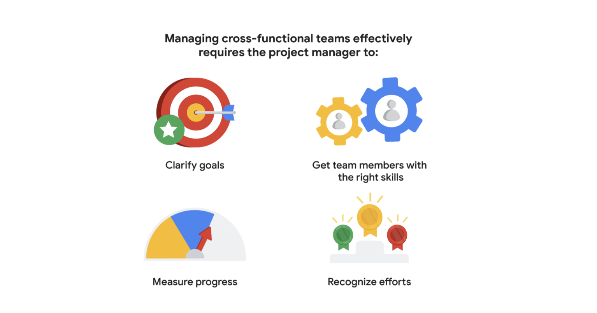

You will learn how project managers add value to organizations and to their teams, what the role and responsibilities of a project manager entail-使必要,需要, and what core skills a project manager needs to be successful.

> 您将学习项目经理如何为组织和团队增加价值，项目经理的角色和职责是什么，以及项目经理需要哪些核心技能才能取得成功。

### 学习目标

------

- Detail-详情说明 the core skills to be a successful project manager.

	详细说明成为一名成功的项目经理的核心技能。

- Describe-描述,形容 the role and day-to-day responsibilities of a project manager.

	描述项目经理的角色和日常职责。

- Discuss when and why it is necessary to have a project manager.

	讨论什么时候以及为什么需要一个项目经理。

# Exploring how a project manager adds value

> 探索项目经理如何增加价值

## Introduction: Becoming an effective project manager

> 简介：成为一个有效的项目经理

Welcome back.

Let's start by reviewing what we've discussed so far.

> 欢迎回来。让我们先回顾一下目前为止讨论过的内容。

Earlier, you were introduced to project management as a career path.

> 早些时候，你被介绍到项目管理作为职业道路。

We discussed how this course can help you advance-推进,进步,改善 your career goals with a project management certification.

> 我们讨论了这门课程如何帮助你通过项目管理认证来推进你的职业目标。

We also discussed some of the basics of project management, like how to define a project and its different components.

> 我们还讨论了项目管理的一些基础知识，比如如何定义项目及其不同的组件。

Then, we went over some distinct-不同的,有区别的 project management careers, roles, and responsibilities.

> 然后，我们讨论了一些不同的项目管理职业、角色和责任。

---

Now it's time to gain a deeper understanding of a project manager's role.

> 现在是时候深入了解项目经理的角色了。

By the end of this module, you'll **be able to**-会,能够 explain the unique-独特的 value a project manager brings to their team.

> 在本模块结束时，您将能够解释项目经理为其团队带来的独特价值。

You'll also be able to describe a project manager's roles and responsibilities, and list their core skills.

> 你还可以描述项目经理的角色和职责，并列出他们的核心技能。

This course will help you continue to recognize-认识,辨别出 the skills that you already have that will help you become a successful project manager.

> 本课程将帮助你继续认识你已经拥有的技能，这些技能将帮助你成为一名成功的项目经理。

It will also help you identify new skills that you may need to learn in preparation for your new career.

> 它还可以帮助你发现你可能需要学习的新技能，为你的新职业做准备。

Ready? Let's get started.

> 准备好了吗？让我们开始吧。

~~~
项目经理为团队带来的独特价值是什么？Explain the unique-独特的 value a project manager brings to their team
项目经理的角色和责任是什么？Describe a project manager's roles and responsibilities.
列举项目经理的核心技能？List a project manager's core skills

承上启下：
复习以前的内容：
1.介绍了项目管理作为一种职业路径的相关信息
2.探讨了这个课程如何通过项目管理认证来帮助你实现职业目标
3.项目管理的一些概念，例如如何定义项目及其不同的组成部分
4.深入了解了一些独特的项目管理职业、角色和责任

引出新学习的内容：
1.理解项目经理为团队带来的独特价值
2.描述项目经理的角色和责任
3.列出他们的核心技能

此外，这个课程将帮助你继续发掘你已有的，有助你成为成功的项目经理的技能。同时帮助你认识到可能需要学习的新技能，以便为你的职业生涯做好准备。
~~~

## The value of a project manager

Earlier in this course, we introduced you to the world of project management.

> 在本课程的早些时候，我们向您介绍了项目管理的世界。

We discussed how project management spans-贯穿 industries-行业 and companies of all kinds, from large corporations-公司 to small businesses-企业.

> 我们讨论了项目管理如何跨越各种行业和公司，从大公司到小企业。

---

Now let's define what a project manager is and describe how they add value to their teams and organizations. 

> 现在让我们定义一下什么是项目经理，并描述一下他们是如何为团队和组织增加价值的。

Let's start with the definition-定义.

> 让我们从定义开始。

Project managers shepherd-带领,引领 projects from start to finish and serve as guides for their team, using their impeccable-无瑕疵的 organizational-组织的 and interpersonal-人际关系的,人际的 skills every step of the way.

> 项目经理从头到尾管理项目，并作为团队的向导，在每一步都运用他们无可挑剔的组织和人际关系技巧。

As you learned earlier, project managers usually follow a process that involves-牵涉,包含 planning and organizing, managing tasks, budgeting, and controlling costs **so that**-所以,以便 the project can be completed within the approved-认可的,批准 timeframe-时间表.

> 正如您前面所了解的，项目经理通常遵循一个过程，包括计划和组织、管理任务、预算和控制成本，以便项目能够在批准的时间框架内完成。

We'll dig-搜寻,寻找 deeper into these topics throughout this program.

> 我们将在整个节目中深入探讨这些话题。

What you need to know right now is that project managers play a crucial-至关重要的,决定性的 role in their organizations.

> 您现在需要知道的是，项目经理在他们的组织中扮演着至关重要的角色。

Project managers add value to their teams and organizations in key ways that include prioritization-优先次序, delegation-授权,委派, and effective-有效的 communication. 

> 项目经理通过关键的方式为他们的团队和组织增加价值，包括优先级、授权和有效的沟通。

So let's **break these down**-把这些进行分解.

> 我们来分析一下。

---

First, we'll discuss prioritization-优先级. 

> 首先，我们将讨论优先级。

Project managers add value to their teams and organizations through effective prioritization of tasks required to complete a project. 

> 项目经理通过有效地安排完成项目所需任务的优先级，为他们的团队和组织增加价值。

They're experts-专家 at helping team members identify and break down large tasks into smaller steps. 

> 他们是帮助团队成员识别并将大任务分解成小步骤的专家。

There'll be times when a project manager may not know which task to prioritize. 

> 有时候，项目经理可能不知道该优先处理哪个任务。

To determine which ones are the most critical-严重的,关键的 to the success of the project, they'll connect with their teams and with stakeholders to gather-收集 information and make a plan. 

> 为了确定哪些是对项目成功最关键的，他们将与他们的团队和利益相关者联系，收集信息并制定计划。

Stakeholders are people who are interested-利益相关的 in and affected by the project's completion and success, like the leader of an organization.

> 利益相关者是对项目的完成和成功感兴趣并受其影响的人，就像组织的领导者一样。

You've probably used prioritization to complete work in the past. 

> 在过去，你可能已经使用了优先级来完成工作。

In any kind of project, personal or professional, there are tasks with different levels of priority. 

> 在任何类型的项目中，无论是个人的还是专业的，都有不同优先级的任务。

For example, let's imagine that you've decided to rent-租用,租借 a house and plan to repaint-重新粉刷 the rooms.

> 例如，让我们想象一下，你决定租一所房子，并计划重新粉刷房间。

You've picked-挑选,采摘 out your paint-油漆,涂料 and you're eager-渴望的,渴求的 to get started. 

> 你已经选好了你的颜料，你渴望开始。

While it may be tempting-引诱 to start painting-粉刷 right away, you'll need to prioritize tasks like laying-布置 out drop cloths to protect-保护 the floors and furniture-家具, applying blue tape-胶带 to the rooms' edges-边缘, and much more. 

> 虽然马上开始粉刷可能很诱人，但你需要优先考虑一些任务，比如铺好防水布来保护地板和家具，在房间边缘贴上蓝色胶带，等等。

Those preliminary-初步的 steps are critical-极其重要的 and need to come before painting. 

> 这些初步步骤是至关重要的，需要在绘画之前。

Other related steps, like choosing new **face plates**-面板 for your light-灯 switches-开关, can come later in the process or be switched out of the project entirely-完全地 if you run out of time or money. 

> 其他相关的步骤，比如为你的电灯开关选择新的面板，可以在稍后的过程中进行，或者如果你没有时间或金钱，可以完全退出这个项目。

When you choose to **take care of**-照顾,照料 these preliminary-初步的 steps before wedging-楔入 open the **paint can**-油漆罐, you're prioritizing the tasks or steps of your project. 

> 当你选择在打开油漆罐之前处理好这些初步步骤时，你就是在对项目的任务或步骤进行优先排序。

You're also increasing the likelihood-可能,可能性 that you'll be satisfied-满意的,满足的 with your newly-painted rooms. 

> 你也增加了你对新粉刷的房间感到满意的可能性。

This process is similar for professional projects.

> 这个过程与专业项目类似。

When you effectively prioritize important tasks, you set up your team and yourself for a better project outcome-结果,效果.

> 当你有效地对重要任务进行优先排序时，你就能让你的团队和你自己获得更好的项目成果。

---

Now, let's discuss delegation-委托,授权. 

> 现在，我们来讨论委托。

Project managers use delegation to add value to their teams and organizations by matching tasks to individuals who can best complete the work. 

> 项目经理通过将任务分配给最能完成工作的个人，来为团队和组织增加价值。

Let's return to our house painting example for a second here. 

> 让我们暂时回到粉刷房子的例子。

Painting multiple rooms can be a time-consuming-耗时的 project, so it's possible that you might enlist-争取 a few friends to help you get it done. 

> 粉刷多个房间可能是一项耗时的工程，所以你可能会找几个朋友来帮你完成。

Maybe one friend has professional painting experience. 

> 也许有一个朋友有专业的粉刷经验。

Now, with that in mind, you might ask her to handle the more challenging-挑战 aspects-方面 of the project, like painting the ceiling-天花板 or the detailed-详细的 molding-模具. 

> 现在，考虑到这一点，你可以让她处理项目中更具挑战性的方面，比如粉刷天花板或详细的模具。

You might also schedule-安排 her to paint the molding before another friend paints the walls. 

> 你也可以安排她在另一个朋友粉刷墙壁之前粉刷模具。

So by delegating this task to the person with the right skills to complete the work and ordering the task appropriately-适当地,恰当地, you're applying knowledge of your team's strengths-优势,长处 to the planning of your project. 

>因此，通过将这项任务委派给具有合适技能的人来完成这项工作，并对任务进行适当的排序，您可以将团队优势的知识应用到项目规划中。

That makes sense-道理, right?

> 这很有道理，对么？

---

Finally, let's talk about effective communication. 

> 最后，让我们谈谈有效的沟通。

Project managers deliver-交付 value through effective communication, both with their team and with key stakeholders. 

> 项目经理通过与他们的团队和关键利益相关者的有效沟通来交付价值。

This **refers to**-指的是 being transparent-透明的, which means being up front with plans and ideas and making information readily-轻而易举地,迅速地 available. 

> 这指的是透明，这意味着在计划和想法的前面，使信息随时可用。

Project managers keep in regular-频繁的 contact-联系 with their team about the progress-进展 of the work and help identify areas-领域 where a teammate-队友 may need support. 

> 项目经理与他们的团队保持定期联系，了解工作的进展，并帮助确定团队成员可能需要支持的领域。

In our house painting example, this might involve-牵涉,涉及 checking in with your friends periodically-定期地 to ask if they have enough paint or supplies-物资 left to complete their tasks. 

> 在我们粉刷房子的例子中，这可能涉及到定期与你的朋友联系，询问他们是否有足够的油漆或用品来完成他们的任务。

Checking in regularly-定期地 means you'll know if you need to buy more paint before the can-罐子 is empty, which ensures that the project stays-维持, on track-轨道. 

> 定期检查意味着你会知道你是否需要在罐子空之前买更多的油漆，这可以确保项目保持在正轨上。

**In addition to**-除了 keeping up with teammates, project managers keep in regular-频繁的 contact with people outside of the team, like company leaders who are invested-投资 in the project outcomes. 

> 除了与团队成员保持联系外，项目经理还与团队以外的人保持定期联系，比如对项目成果有兴趣的公司领导。

For example, you might **reach out**-主动联系 to your landlord-房东,老板 to get permission to paint and to share the days you'll be working on this project. 

> 例如，你可以联系你的房东，获得油漆的许可，并分享你将在这个项目上工作的日子。

Though-虽然 your landlord isn't directly involved-涉及 in the project's execution, the outcomes will affect-影响 her property-财产,地产 and so it's important to keep her informed-了解. 

> 虽然你的房东不直接参与项目的执行，但结果会影响到她的财产，所以让她知道是很重要的。

Without-没有 your project management skills, you might **run out of**-用完,耗尽 paint halfway through the project, your walls might get painted without drop cloths-布料 to protect the floors, and your landlord could be **caught off guard**-措手不及 about your plans. 

> 如果没有你的项目管理技能，你可能会在项目进行到一半的时候用光油漆，你的墙壁可能会在没有掉落布保护地板的情况下被粉刷，你的房东可能会对你的计划措手不及。

So it's a good thing you're here to keep the project running smoothly-平稳地 and efficiently-高效地. 

> 所以你在这里保持项目顺利高效地运行是件好事。

---

Great.

> 很好地,很棒地

Now you should be able to define what a project manager is and explain-解释,说明 how they use prioritization, delegation, and effective communication to deliver value to their organizations. 

> 现在您应该能够定义什么是项目经理，并解释他们如何使用优先级、授权和有效的沟通来为他们的组织交付价值。

**Coming up**-即将到来, you'll hear about the career path of a real life project manager at Google. Their journey to me is fascinating-深深吸引,迷住 and we can't wait to share it with you.

> 接下来，你将听到现实生活中谷歌项目经理的职业道路。他们的旅程对我来说是迷人的，我们迫不及待地想和你分享。

~~~
How：项目经理如何增加价值
1.优先级：找到对项目最关键影响的内容优先完成。- 重要
2.授权：将任务分配给最适合做的人。
3.高效沟通：对上、对下、组间、组外、内部、普通人、专家；围绕项目目标有效沟通

5min 内容分为四块（使用了给墙刷油漆的例子）：
1.回顾和简介
深入探讨项目经理的角色及其对团队和组织的增值方式。
- 项目管理适用于各种各业和公司类型。
- 项目经理运用其优秀的组织能力和人际交往技巧，从头到尾引导项目。
- 项目经理通过优先排序、任务委派和有效沟通，为团队和组织创造价值。

2.如何安排优先级
3.如何授权
4.如何高效沟通

~~~

## JuAnne: Path to becoming a project manager

> 乔安妮：成为项目经理的途径

My name is JuAnne. 

> 我的名字是乔安妮。

I'm a Senior Program Manager at Google.

> 我是谷歌的高级项目经理。

I'm a first-generation Chinese American. 

> 我是第一代美籍华人

My family and I came to the United States when I was young. 

> 我和我的家人在我很小的时候就来到了美国。

My parents worked really hard when I was growing up and I spent a lot of time by myself, basically-基本上 just having to take care of myself; planning my meals-进餐, doing my homework, taking care of chores-家庭杂务.

> 在我成长的过程中，我的父母非常努力，所以我有很多时间都是一个人度过的，基本上我必须照顾好自己;做饭，做作业，做家务。

I feel like I got a little bit of my program management skills from just being really-真正地 organized-组织,安排, having to be really organized all the time.

> 我觉得我的项目管理技能是从非常有条理中获得的，我必须一直非常有条理。

My path to being a project manager really started as a business systems analyst-分析者. 

> 我成为项目经理的道路实际上是从业务系统分析师开始的。

I was writing requirements or gathering-收集,采集 requirements for our customers and translating-翻译,解释 them into documentation for our engineers-工程师 so that they could implement it. 

> 我正在为我们的客户编写需求或收集需求，并将它们翻译成文档，以便我们的工程师能够实现它。

Through that process, I became a project manager. 

> 通过这个过程，我成为了一名项目经理。

I started to manage the timelines, manage the tasks, understand all the pieces, and who needed to be involved-参与的. 

> 我开始管理时间表，管理任务，理解所有的部分，以及谁需要参与其中。

There you go, you have a project manager. 

> 好了，你有了一个项目经理。

I think the funnest-最有趣的 part about being a project manager is really working with people. 

> 我认为作为项目经理最有趣的部分是与人合作。

You get to meet all different kinds of people, different personalities-性格. 

> 你可以遇到各种各样的人，不同的性格。

Sometimes you get to travel to places to meet-结识 them but even when you don't, just meeting new people and understanding how we interact-相互交流, how people interact and behave-行为 is fascinating-深深吸引. 

> 有时你会去一些地方去认识他们，但即使你没有去，只是认识新朋友，了解我们如何互动，人们如何互动和行为，这很有趣。

I think if you build a relationship, focus on the relationship, and really understand what their style, where they're coming from, what their concerns-担心,忧虑 are, it will help your working relationship much better. 

> 我认为如果你建立一种关系，专注于这种关系，并真正了解他们的风格，他们来自哪里，他们关心的是什么，这将有助于你的工作关系更好。

You can communicate-沟通 with them in the style that's necessary.

> 你可以用必要的方式与他们交流。

You can work with them in the style that's more receptive-乐于接受的,可以接受的 to them and that would just make the project better all around.

> 你可以以一种更容易接受他们的方式与他们合作，这将使项目变得更好。

## How project managers impact-影响 organizations

> 项目经理如何影响组织

You have learned that project managers can prioritize, delegate, and effectively communicate to deliver value to their projects. 

> 您已经了解到，项目经理可以确定优先级、委托和有效沟通，从而为他们的项目交付价值。

This reading will focus on the main ways that project managers can add value to projects and impact organizations, which include: 

> 本阅读将集中于项目经理为项目增加价值和影响组织的主要方式，包括:

- Focusing-使聚焦 on the customer - 以客户为中心
- Building a great team - 打造一支伟大的团队
- Fostering-培养 relationships and communication - 培养关系和沟通
- Managing the project - 管理项目
- **Breaking down**-打碎 barriers-障碍 - 打破障碍

Customers are always a key element to success in any business. 

> 在任何企业中，客户都是成功的关键因素。

There is no exception-例外,除外 to that in the field of project management.

> 在项目管理领域也不例外。

In project management, the word “customer” refers to a person or an organization that defines the requirements of the project and sets important guidelines-指导方针, such as budget and deadlines-截止日期. 

> 在项目管理中，“客户”一词指的是定义项目需求并设定重要指导方针(如预算和截止日期)的个人或组织。

In projects, customers can be internal or external. 

> 在项目中，客户可以是内部的，也可以是外部的。

Internal customers are stakeholders within your organization, such as management, project team members, resource managers, and other organizational departments-部门. 

> 内部客户是组织中的利益相关者，例如管理层、项目团队成员、资源经理和其他组织部门。

External customers are customers outside of your organization, such as clients, contractors-承包商，立约人, suppliers-供应商,供应者, and consumers-顾客,使用者.

> 外部客户是组织之外的客户，例如客户、承包商、供应商和消费者。

---

To successfully deliver a project, it has to meet the customer’s standards-标准,规范. 

> 为了成功地交付一个项目，它必须满足客户的标准。

To meet the customer’s standards, you have to make sure you clearly understand their expectations-预期,期望. 

> 为了达到客户的标准，你必须确保你清楚地了解他们的期望。

The customer is at the center of a successful project. 

> 客户是一个成功项目的中心。

Project managers can add a lot of value to the project by building relationships with customers and taking the time to make sure the **customer is heard**-听取顾客意见 and satisfied-满意的,满足的 with the result. 

> 项目经理可以通过与客户建立关系，花时间确保客户的意见被听取并对结果感到满意，从而为项目增加很多价值。

**Asking the customer questions**

> 向客户提问

Let’s discuss how you can focus on the customer in a project. 

> 让我们讨论一下如何在项目中关注客户。

First, sit-坐,坐下 with the customer and ask what problem they are trying to solve. 

> 首先，和客户坐在一起，询问他们想要解决什么问题。

You might ask if they have a specific vision-愿景 of the final outcome they would like delivered. 

> 你可能会问他们是否对他们想要交付的最终结果有一个具体的愿景。

Sometimes, customers will **lean on**-依靠 project managers to find the solution to their problem.

> 有时，客户会依靠项目经理来找到问题的解决方案。

It’s your job to ask questions like:

> 你的工作是问这样的问题:

- What is the problem you would like us to help solve? Example response: The customer wants help developing a new process that would allow their company to be more efficient-高效的.

	> 你想让我们帮你解决什么问题？示例回答：客户需要帮助开发一个新的流程，使他们的公司更有效率。

- How is the problem impacting your organization? Example response: The customer states-陈述 that they are losing clients because of their current inefficient-效率低的 processes since clients are sometimes receiving their orders late.

	> 这个问题是如何影响你的组织的？示例响应：客户表示，由于当前流程效率低下，客户有时收到订单较晚，因此正在失去客户。

- What prompted-促使,提示 you to ask for help now? Example response: The customer says that they may lose department funding-资金 if they do not improve-改善 efficiency. 

	> 是什么促使你现在寻求帮助？示例响应：客户说，如果他们不提高效率，他们可能会失去部门的资金。

- What is your hope for the outcome of this project? Example response: The customer states that their ultimate-最终的 goal is to increase the speed at which they **fill orders**-处理订单 without sacrificing-牺牲 quality-质量. 

	> 你对这个项目的结果有什么希望？示例响应：客户声明他们的最终目标是在不牺牲质量的情况下提高完成订单的速度。

Taking the time to dig-搜寻,寻找 a little deeper into the “why” behind-在...背后 the project can help a project manager better support and understand the customer. 

> 花点时间深入挖掘项目背后的“为什么”可以帮助项目经理更好地支持和理解客户。

The more you understand the customer’s goals, the more likely you will be able to produce what the customer is seeking-寻求,谋求.

> 你对客户的目标了解得越多，你就越有可能满足客户的需求。

The team is a project’s biggest asset-资产,财产. 

> 团队是项目最大的资产

A successful project manager knows that and takes the time to understand each person’s motivations-动力, strengths-优势, and weaknesses-劣势.

> 一个成功的项目经理知道这一点，并且会花时间去了解每个人的动机、优点和缺点。

Project managers add value to the project by identifying-确认 the right team for the project and enabling the team to be successful and make decisions-决定. 

> 项目经理通过为项目确定合适的团队，并使团队成功并做出决策，从而为项目增加价值。

---

When you work to build a great team, you have to consider the skills needed for the project, as well as the resources available. 

> 当你努力建立一个伟大的团队时，你必须考虑项目所需的技能，以及可用的资源。

Understanding the customer’s requirements helps shape-塑造 the skills needed for your team. 

> 了解客户的需求有助于塑造团队所需的技能。

If you are working on a project that requires people with medical-医学的 expertise-专门技能 and you hire people who do not have a medical background, no matter how hard that team works, they will not have the right skill set to complete the project. 

> 如果你在做一个项目，需要有医学专业知识的人，而你雇佣了没有医学背景的人，无论这个团队多么努力，他们都不会有完成项目的合适技能。

As project manager, you should bring on people with the right skills and ensure the team knows that each individual-个人的 is valued-重视, trusted-信任, and appreciated-欣赏. 

> 作为项目经理，你应该聘用具备合适技能的人，并确保团队知道每个人都受到重视、信任和赞赏。

You can demonstrate-展示 how you feel-感受 about the team’s value by allowing them to have input and ask questions, and by addressing-设法解决 their needs as soon as possible. 

> 您可以通过允许他们输入并提出问题，以及通过尽快解决他们的需求来展示您对团队价值的看法。

Maintaining-维持,保持 customer satisfaction-满意,满足 and building a great team are two ways that you, as a project manager, can add value to a project. 

> 作为项目经理，保持客户满意度和建立一个伟大的团队是为项目增加价值的两种方式。

Both of these skills are built on the foundation of relationships and communication. 

> 这两种技能都建立在人际关系和沟通的基础上。

The project managers who add the most value are the ones who take the time to build relationships, communicate, and treat-对待,看待 others with consideration-考虑,斟酌 and respect-尊敬,敬重.

> 增加最大价值的项目经理是那些花时间建立关系，沟通，并以考虑和尊重的态度对待他人的人。

---

Project managers can set the tone-基调,风格 for a project and build relationships within their teams and with stakeholders.

> 项目经理可以为项目定下基调，并在团队内部以及利益相关者建立关系。

Taking the time to check in daily with your team, see how they’re doing, and ask if there is anything they need help with can go a long way towards making them feel valued-重视 and heard. 

> 每天花点时间检查一下你的团队，看看他们做得怎么样，问问他们是否有什么需要帮助的地方，这会让他们感到被重视和被倾听。

When you build teams, each person is generally-通常,大概 assigned specific project tasks. 

> 当您构建团队时，每个人通常被分配特定的项目任务。

Once each task is done, the person responsible for that task hands that part of the project over to the next person. 

> 一旦每个任务完成，负责该任务的人将项目的这一部分交给(hands over)下一个人。

Your team members don’t always see the whole picture and how they impact others in a project. 

> 你的团队成员并不总是看到全局，也不知道他们在项目中是如何影响其他人的。

A successful project manager sees the impacts of each process within the project and communicates-传达,传递 those impacts to the team. 

> 一个成功的项目经理会看到项目中每个过程的影响，并将这些影响传达给团队。

This ensures that everyone working on the project understands their task goal as well as the big picture goal for the finished product. 

> 这确保了参与项目的每个人都理解他们的任务目标以及最终产品的总体目标。

For example, if a **graphic designer**-平面设计师 working on marketing-营销 materials-布料,材料 for your project doesn't understand the customer’s overall goal to appeal-吸引力 to educators-教育工作者, they may not be able to fully capture-俘获,捕获 the vision for the campaign-活动. 

> 例如，如果为你的项目设计营销材料的平面设计师不了解客户吸引教育工作者的总体目标，他们可能无法完全捕捉到活动的愿景。

Helping this team member understand **the big picture**-大局观 allows them to tailor-调整 their tasks to meet the needs of the project end goal.

> 帮助该团队成员了解全局，使他们能够调整自己的任务，以满足项目最终目标的需要。

---

Managing a project can be busy, but if you take the time to build relationships and maintain open lines of communication, you will increase the chances of the project’s success as well as the customer’s and your team members’ satisfaction-满意. 

> 管理一个项目可能会很忙，但如果你花时间建立关系并保持开放的沟通渠道，你将增加项目成功的机会，以及客户和团队成员的满意度。

Sometimes, when you ask why something is being done a certain-确定的 way, the response you get is, “Because we’ve always done it this way.” 

> 有时候，当你问为什么某件事是这样做的，你得到的回答是:“因为我们一直是这样做的。”

A project manager adds value to a project when they break down barriers, allow their team to innovate-革新,创新 new ways to do things, and empower-授权 them to share ideas. 

> 当项目经理打破障碍，允许他们的团队创新做事的新方法，并授权他们分享想法时，他们就会为项目增加价值。

As a project manager, you have to model-榜样 ingenuity-聪明才智 and collaboration-合作,协作, and encourage-鼓励,激励 your team to do the same.

> 作为一个项目经理，你必须树立聪明才智和协作的榜样，并鼓励你的团队也这样做。

---

How can you break down barriers on a project? 

> 你如何打破项目中的障碍?

You can provide support for your team as they try new approaches-方法 to find solutions, and you can advocate-拥护,提倡 for additional resources for your team.

> 当团队尝试新方法寻找解决方案时，您可以为他们提供支持，还可以为团队争取额外的资源。

If your team is having a hard time getting an answer from another organization, you can **reach out**-主动联系 to the organization yourself in order to keep the team on track-轨道 and on schedule. 

> 如果您的团队很难从其他组织获得答案，您可以亲自联系该组织，以使团队保持正轨并按计划进行。

**Key takeaway**

You have now learned some of the ways that project managers can add value to projects and impact organizations. 

> 您现在已经了解了项目经理为项目增加价值和影响组织的一些方法。

By focusing on the customer, building a great project team, fostering- relationships and communication, managing the project, and breaking down barriers, you can overcome-克服,解决 obstacles-障碍,阻碍 and find solutions to succeed. 

> 通过关注客户，建立一个伟大的项目团队，培养关系和沟通，管理项目，打破障碍，你可以克服障碍，找到成功的解决方案。

# Learning more about project manager roles and responsibilities

> 学习更多关于项目经理角色和职责的知识

## Key-主要的 project manager roles and responsibilities

> 主要项目经理的角色和职责

Welcome back. 

> 欢迎回来。

I hope you enjoyed that last story because for me, it's always helpful to hear about **someone else's**-别人的 career path.

> 我希望你喜欢最后一个故事，因为对我来说，听听别人的职业道路总是很有帮助的。

Maybe you even noticed-注意到 a few parallels-相似的,平行的,并行的 between their career path and your own, or you felt-感受到 inspired-受启发的 to pursue-追求,致力于 a specific area of project management. 

> 也许你甚至注意到他们的职业道路和你自己的有一些相似之处，或者你受到了启发，想要从事项目管理的某个特定领域。

So far we've discussed the types of project management roles you'll be qualified for, and how to search for them. 

> 到目前为止，我们已经讨论了您将能够胜任的项目管理角色类型，以及如何搜索它们。

---

Earlier, we discussed the value that project managers bring to their teams and their organizations. 

> 前面，我们讨论了项目经理给他们的团队和组织带来的价值。

Now let's learn more about the roles and responsibilities of a project manager. 

> 现在让我们进一步了解项目经理的角色和职责。

Earlier you learned that project management is the application of knowledge, skills, tools, and techniques to meet the project requirements and achieve the desired-期望得到的 outcome. 

> 前面，您了解到项目管理是知识、技能、工具和技术的应用，以满足项目需求并实现预期的结果。

How does that actually happen? That's where you come in. 

> 这到底是怎么发生的呢？这就是你的用武之地。

Project managers usually follow a process that involves planning and organizing, managing tasks, budgeting, and controlling costs, and other factors-因素, so that the project can be completed within the approved budget and timeframe. 

> 项目经理通常遵循一个过程，包括计划和组织、管理任务、预算、控制成本和其他因素，以便项目能够在批准的预算和时间范围内完成。

---

Let's break these down into examples of responsibilities that you might find in a job listing for a project management role. 

> 让我们将这些分解为您可能在项目管理角色的工作列表中找到的职责示例。

We'll start with planning and organizing. 

> 我们将从计划和组织开始。

One responsibility that falls-属于 under the umbrella-保护伞,总体 of planning and organizing is making use of productivity-生产率,生产力 tools and creating processes. 

> 在计划和组织的保护伞下的一个责任是利用生产力工具和创建流程。

During-在...期间 the planning and execution of a project, you might need to use certain tools and develop processes to improve-改善 information sharing across-遍及 the team; 

> 在项目的规划和执行过程中，您可能需要使用某些工具和开发流程来改善整个团队的信息共享;

you may also need to create plans, timelines, schedules, and other forms of documentation to track project completion, and you'll usually need to maintain-维护,维持,保持 those documents throughout the entirety of the project. 

> 您可能还需要创建计划、时间表、进度表和其他形式的文档来跟踪项目的完成，并且您通常需要在整个项目中维护这些文档。

---

The next task is budgeting and controlling costs, and other factors. 

> 下一个任务是预算和控制成本，以及其他因素。

As the project is underway-在进行中的, changes to the plan and budget are bound-必然的,肯定的 to **come up**-出现. 

> 由于项目正在进行中，计划和预算必然会发生变化。

Believe me. This will require you to monitor and manage the budget, track issues and risks as they arise-产生, and manage quality-质量,品质 by mitigating-减轻,缓解 those issues and risks. 

> 相信我。这将要求您监视和管理预算，跟踪问题和风险，并通过减轻这些问题和风险来管理质量。

One way to do this is by removing unforeseen-无法预料的 barriers that come up. 

> 做到这一点的一种方法是消除出现的不可预见的障碍。

Now, by barriers, we mean things that can get **in the way of**-妨碍 project progress. 

> 现在，我们所说的障碍是指可能阻碍项目进展的东西。

For example, if your teammates lack-缺乏,不足 the resources needed to complete a task, you might identify that issue, or barrier upfront-位置的, escalate-升级 the issue to a stakeholder, and work to secure-确保 the resource so your team can move forward. 

> 例如，如果您的团队成员缺乏完成任务所需的资源，您可能会预先识别该问题或障碍，将问题升级到利益相关者，并努力确保资源，以便您的团队可以继续前进。

---

Another huge piece of the project manager's role is managing tasks.

> 项目经理角色的另一个重要部分是管理任务。

A project task is an activity-活动 that needs to be accomplished-完成 within a set-固定的 period of time by you, your team, or your stakeholders. 

> 项目任务是需要你、你的团队或你的利益相关者在一定时间内完成的活动。

Keeping track of tasks is a great way to help manage the team's workload-工作量,工作负荷 and ensure that things are getting done. 

> 跟踪任务是帮助管理团队工作量并确保事情完成的好方法。

Keeping track of tasks is also a great tool for demonstrating-证明,示范 progress-进展 to people outside the immediate-直接的team, like your stakeholders. 

> 跟踪任务也是一个很好的工具，可以向直接团队以外的人展示进度，比如你的利益相关者。

Back when I was a program manager in Student Development here at Google, one of our goals was to create pathways-道路,途径 for students who identify-认同 with communities-社区 that are underrepresented-未被充分代表的 in the technology industry. 

> 当我还是谷歌学生发展部的项目经理时，我们的目标之一就是为那些认同科技行业中代表性不足的社区的学生创造途径。

A large part of my day-to-day responsibilities involved working with two separate engineering teams to create our technical curriculum-课程.

> 我日常工作的很大一部分是与两个独立的工程团队一起创建我们的技术课程。

To manage the tasks associated-有关联的,相关的 with this project, I created separate project trackers-追踪者 for each team that outline-概述 the vision for the curriculum-课程. 

> 为了管理与该项目相关的任务，我为每个团队创建了单独的项目跟踪者，以概述课程的远景。

These trackers kept both teams in the loop-循环 about the timeline for delivery, the categories-类别,种类 and subcategories for work, and the team members assigned to each task, I also made sure to update our stakeholders every step of the way. 

> 这些跟踪者使两个团队都处于关于交付的时间线、工作的类别和子类别以及分配给每个任务的团队成员的循环中，我也确保每一步都更新给我们的利益相关者。

By actively managing tasks throughout the project lifecycle, I was able to **keep tabs**-密切关注 on everyone's work and efficiently inform-通知,告知 stakeholders, which allowed us to achieve our project goal with minimal-极小的,极少的 issues.

> 通过在整个项目生命周期中积极地管理任务，我能够密切关注每个人的工作，并有效地通知利益相关者，这使我们能够以最小的问题实现我们的项目目标。

---

Nice job. 

> 不错的工作。

Now you should be able to describe the roles and responsibilities of a project manager. 

> 现在你应该能够描述项目经理的角色和职责了。

Coming up, we'll discuss a project manager's role within the extended-扩展了的 team, including how to work alongside-与...一起 the people tasked with executing the project. 

> 接下来，我们将讨论项目经理在扩展团队中的角色，包括如何与负责执行项目的人员一起工作。

Catch you in a bit.

> 一会儿见。

## Responsibilities that utilize-使用,利用 interpersonal-人际关系的 skills

> 运用人际交往能力的职责

**What are the core job responsibilities of project managers?**

> 项目经理的核心工作职责是什么？

Let’s recap-摘要说明 what we learned in the previous video.

> 让我们回顾一下上一节视频的内容。

The project manager is responsible for planning, organizing, managing tasks, budgeting, controlling costs, and other factors to help keep the project within budget and on time. 

> 项目经理负责计划、组织、管理任务、预算、控制成本和其他因素，以帮助保持项目在预算范围内并按时完成。

---

What does that mean? 

> 这个是什么意思？

Basically, as the project manager, you will be responsible for tracking the day-to-day details of the project, but you will also have an opportunity to step back and see the bigger picture of the overall project.

> 基本上，作为项目经理，您将负责跟踪项目的日常细节，但您也将有机会退后一步，看到整个项目的大局。

---

Depending on the project and organization, you may also have responsibilities that utilize your interpersonal-人际关系的 skills. 

> 根据项目和组织的不同，你也可能有责任利用你的人际交往能力。

**Interpersonal skills** are the behaviors you use to interact with others, such as communication, active listening, and leadership.

> 人际交往能力是你用来与他人互动的行为，比如沟通、积极倾听和领导能力。

Let's review these responsibilities.

> 让我们回顾一下这些职责。

**Teaching and mentoring**

> 教学与辅导

As a project manager, you can **serve as**-作为 a mentor to your team. 

> 作为项目经理，你可以作为团队的导师。

When you take the time to fully explain the expectations-期待,期望, you eliminate-剔除,排除 rework-重做,反工, confusion-困惑, and frustration-懊恼,挫败. 

> 当你花时间充分解释期望时，你就消除了返工、困惑和沮丧。

Mentoring and teaching others the lessons that you, as a project manager, have learned allows your team to make better choices and build on your experience. 

> 作为一个项目经理，指导和教授别人你所学到的经验可以让你的团队做出更好的选择，并以你的经验为基础。

Mentoring also involves supporting each individual-个人 on your team in meeting expectations and helping them to exceed-超过,超出 their own sense-方向 of personal potential-潜力.

> 指导还包括支持团队中的每个人满足期望，帮助他们超越自己的个人潜力。

**Building relationships** 

> 建立关系

Relationships are everything! 

> 关系就是一切

Getting to know your team members lets them know that you care about them as people, not just as employees. 

> 了解你的团队成员，让他们知道你关心的是他们，而不仅仅是员工。

Taking the time to build relationships with your customers, clients, vendors-供应商, and other stakeholders is equally important. 

> 花时间与你的顾客、客户、供应商和其他利益相关者建立关系同样重要。

Dedicate-致力于,献身于 time to check in with people. 

> 花时间和别人交流。

Pay attention-注意,注意力 to the insights-洞悉,了解 they offer you about their work style since their actions can inform how to most effectively-有效地,实际上 interact-相互交流 with them. 

> 注意他们提供给你的关于他们工作风格的见解，因为他们的行为可以告诉你如何最有效地与他们互动。

Ask about their lives beyond-除…之外 the project, and then follow up on those discussions later on to show your interest. 

> 询问他们在项目之外的生活，然后在这些讨论之后继续跟进，以显示你的兴趣。

When you foster-促进,培养 these relationships, you are all more invested-投资,花费 in the success of your project.

> 当你培养了这些关系，你就会对项目的成功投入更多。

**Controlling change**

> 控制变化

The American novelist-小说家 Louis L’Amour wrote-写, “The only thing that never changes is that everything changes.” 

> 唯一不变的是，一切都在变。

This applies to projects as well. 

> 这也适用于项目。

Projects change as you continue to understand the expectations and the needs of your stakeholders. 

> 当您继续了解利益相关者的期望和需求时，项目就会发生变化。

As a project manager, you need to remain-保持不变 flexible-灵活的 and adjust to the stakeholders’ needs. 

> 作为项目经理，您需要保持灵活性，并根据利息相关者的需求进行调整。

However, it is also important to protect your team from constant-经常发生的 change and rework. 

> 然而，保护你的团队不受不断变化和返工的影响也很重要。

A good way to do this is by documenting the initial expectations of the project and clearly identifying the changes being requested. 

> 要做到这一点的一个好方法是记录项目的初始期望，并清楚地确定所请求的更改。

It is also helpful to understand the budget and schedule impact of the changes and make sure that the stakeholders understand those impacts. 

> 了解变更的预算和进度影响并确保利益相关者理解这些影响也是有帮助的。

As the project manager, you are responsible for protecting your team. 

> 作为项目经理，你有责任保护你的团队。

**Empowering-授权 your team**

> 授权你的团队

We all enjoy **being heard and appreciated**-被倾听和被欣赏 in our careers. 

> 在我们的职业生涯中，我们都喜欢被倾听和被欣赏。

Giving your team the ability to work directly with the stakeholders and their teams lets them know that you trust and believe in their skills! 

> 让你的团队能够直接与利益相关者和他们的团队合作，让他们知道你信任并相信他们的技能!

One of the best things about empowering your team is getting fresh-新的,不同的 ideas and passionate-热情的 employees willing-愿意的,乐意的 to help find solutions to problems. 

> 授权给你的团队最好的事情之一是获得新的想法和热情的员工愿意帮助找到问题的解决方案。

Another way you can empower your team is by delegating-授权,把……委托给 responsibilities to them, allowing them to make some decisions for the project, and using their input in the planning and execution of the project. 

> 另一种授权团队的方法是将职责委派给他们，允许他们为项目做一些决定，并在项目的计划和执行中使用他们的意见。

Effective mentoring often leads to more empowered teams.

> 有效的指导通常会带来更强大的团队。

**Communicating status and concerns**

> 沟通状态和关注点

As a project manager, communication is everything-一切. 

> 作为一个项目经理，沟通就是一切。

With effective communication, you can work together with your team to find solutions to challenges. 

> 通过有效的沟通，你可以与你的团队一起找到解决挑战的方法。

The project manager sets the tone-基调,风格 for the project. 

> 项目经理为项目定下基调。

Maintaining-保持,维持 an open door policy and building trust within your team and among-在...当中 stakeholders—**all while**-同时 staying positive-乐观的—will help the success of the project.

> 保持开放的政策，在你的团队和利益相关者之间建立信任——同时保持积极的态度——将有助于项目的成功。

**Key takeaway**

> 关键要素

You have learned that project managers may be responsible for teaching and mentoring project team members, building relationships with the team and various-各种各样的 stakeholders, controlling change and the impact to the project, empowering team members to make decisions, and communicating status and potential-潜在的,可能的 concerns. 

> 您已经了解到，项目经理可能负责教导和指导项目团队成员，与团队和各种利益相关者建立关系，控制变更和对项目的影响，授权团队成员做出决策，并沟通状态和潜在的关注点。

These interpersonal-人际关系的 responsibilities can be just as important to the success of your projects as your more concrete-确实的，具体的 responsibilities, like scheduling and budgeting.

> 对于项目的成功，这些人际关系的责任和你更具体的责任(比如计划和预算)一样重要。

---

As you continue through this course, you will learn more about how these project manager responsibilities are embedded-嵌入 into the different phases-阶段 of a project. 

> 当你继续通过本课程，你将了解更多关于这些项目经理的职责是如何嵌入到一个项目的不同阶段。

## A project manager’s role within a team

> 项目经理在团队中的角色

Hey and welcome back. 

> 大家好，欢迎回来。

Earlier-早些时候的 you learned more about the responsibilities of a project manager. 

> 前面，您了解了更多关于项目经理的职责。

And while-虽然,尽管 it might seem like a lot to keep track of, it's important to know that you, as the project manager won't need to do everything on your own. 

> 虽然看起来要跟踪的事情很多，但重要的是要知道，作为项目经理，你不需要自己做所有的事情。

Let's discuss the role of the project manager and how that role relates to other roles within the project team. 

> 让我们讨论一下项目经理的角色，以及这个角色是如何与项目团队中的其他角色联系起来的。

It's easier-更简单 to hear the term-专有名词 manager and immediately-立刻,马上 think of your boss. 

> 听到“经理”这个词，你更容易立刻想到你的老板。

But a project manager is not often the direct manager-管理者 of the people working on a project team. 

> 但是项目经理通常不是项目团队工作人员的直接管理者。

---

Here, we're discussing the project manager as someone who manages the tasks of a project. 

> 在这里，我们将项目经理作为管理项目任务的人来讨论。

But what does that really mean, right?

> 但这到底是什么意思呢?

Well, although-虽然,尽管,但是,然而 you might have a few teammates working with you on a project, you're probably not their day-to-day boss. 

> 好吧，虽然你可能有几个队友和你一起做一个项目，但你可能不是他们的日常老板。

With the help of your team, you can get a lot more done together. 

> 在团队的帮助下，你们可以一起完成更多的工作。

Everyone on your team will have their own set of roles and responsibilities.

> 团队中的每个人都有自己的角色和责任。

And you'll come together to ensure that everyone is able to do their part to advance-促进,推动 the project. 

> 你们将聚在一起，确保每个人都能尽自己的一份力量来推进项目。

Each person will be an expert-专家 on their portion-一部分 of the project, but no one will be an expert on every aspect of the project, and honestly, **neither will**-你也不会 you. 

> 每个人都是自己那部分项目的专家，但没有人会是项目的每个方面的专家，老实说，你也不会。

For instance, the graphic-平面 designer will focus on graphic design, but probably won't be an expert on copywriting-写作,公关文案. 

> 例如，平面设计师将专注于平面设计，但可能不会是文案专家。

Similarly, you'll be an expert on project management, but may not be an expert on marketing-营销. 

> 同样，你可能是项目管理方面的专家，但可能不是市场营销方面的专家。

---

Here's another way to think about it. 

> 这是另一种思考方式。

Imagine that you're organizing a camping-露营 trip-旅行. 

> 想象一下，你正在组织一次露营旅行。

You might be the person in charge-使……承担责任 of planning the trip, but that doesn't mean you have to be a camping expert. 

> 你可能是负责计划旅行的人，但这并不意味着你必须是一个露营专家。

Maybe you've never been camping-露营 before, but your partner grew up spending every summer by the campfire-营火会. 

> 也许你以前从来没有露营过，但你的伙伴每个夏天都在篝火旁度过。

In that case, you might assign them the task of picking out the right number and style of tents-旅游帐篷 for your group. 

> 在这种情况下，你可以让他们为你的团队挑选合适数量和样式的帐篷。

So, in this example, you are planning the trip by giving your partner the job of finding the right number of tents-旅游帐篷 and the right size tents to make sure everyone is covered. 

> 所以，在这个例子中，你正在计划旅行，让你的伴侣找到合适数量和大小的帐篷，以确保每个人都被覆盖。

You aren't doing the research or the task yourself, but you're making sure that things are getting done. 

> 你不是自己做研究或任务，但你要确保事情被完成。

---

It's similar in the workplace. 

> 在工作场所也是一样。

As the project manager, you won't be an expert in every project role, and **that's okay**-没关系. 

> 作为项目经理，你不可能成为每个项目角色的专家，这没关系。

As we said, your job isn't to be the expert on everything. 

> 正如我们所说，你的工作不是成为每件事的专家。

Instead-反而 you're responsible for guiding your team and making sure that they have the support that they need in order to complete the project.

> 相反，你有责任指导你的团队，并确保他们得到完成项目所需的支持。

So how does a project manager go about doing that?

> 那么，项目经理是如何做到这一点的呢?

Let's discuss using a few more examples of the required responsibilities you might find in a job listing. 

> 让我们用更多的例子来讨论你可能在工作清单中找到的必要职责。

---

First, you'll need to hold all team members accountable-负有责任的,可理解的 for their assigned tasks. 

> 首先，你需要让所有团队成员对分配给他们的任务负责。

Managing tasks will help you hold your team members accountable by giving them ownership-所有权 over specific pieces of the project. 

> 管理任务将通过赋予团队成员对项目特定部分的所有权来帮助他们负责。

Second, you'll need to ensure that issues and risks are tracked and visible, and be able to establish-建立 escalation-升级 paths.

> 其次，您需要确保问题和风险被跟踪和可见，并且能够建立升级路径。

Now by escalation-升级 paths, I mean that you should know how you will communicate risks to the right people at the right time. 

> 现在，我所说的升级路径是指你应该知道如何在正确的时间将风险传达给正确的人。

Third, you'll need to understand and help teammates adopt-接受 the right workflows and project management styles. 

> 第三，你需要理解并帮助团队成员采用正确的工作流程和项目管理风格。

As the project manager, you'll likely-很可能 have the best idea of which style is best for the work. 

> 作为项目经理，您可能对哪种风格最适合工作有最好的想法。

It's your job to ensure that the team adheres-坚持 to that style and the other systems in place. 

> 你的工作是确保团队坚持这种风格和其他适当的系统。

And fourth, you'll need to collaborate-合作,协作 with other teams at the organization to meet the requirements based on project, scope, schedule, and budget. 

> 第四，您需要与组织中的其他团队合作，以满足基于项目、范围、进度和预算的需求。

In other words, a project may affect-影响 not only your team, but other teams at an organization, as well as, say, the marketing or the finance team. 

> 换句话说，一个项目可能不仅会影响您的团队，还会影响组织中的其他团队，以及市场营销或财务团队。

So you'll need to work with those teams to ensure that everyone is happy with the project outcomes. 

> 因此，您需要与这些团队合作，以确保每个人都对项目结果感到满意。

---

You'll learn more about working with other stakeholders in a later course. 

> 在以后的课程中，您将了解更多关于与其他利益相关者合作的信息。

Catch all that? 

> 听懂了吗?

Let's recap-摘要说明.

> 让我们摘要说明

You learned that a project manager isn't always the direct manager of each member of the project team. 

> 您了解到项目经理并不总是项目团队每个成员的直接经理。

Rather, they're responsible for guiding those people and ensuring they have the support they need to complete the project. 

> 相反，他们有责任指导这些人，并确保他们得到完成项目所需的支持。

Now that you have a good sense of the way that a project manager fits into the project team, let's move a little bit ahead-朝前面, where we'll discuss the types of skills that a project manager needs to succeed. 

> 现在您已经很好地了解了项目经理融入项目团队的方式，让我们向前推进一点，我们将讨论项目经理成功所需的技能类型。

Meet you there.

> 那儿见。

## Working with cross-functional-跨部门的 teams

> 与跨职能团队合作

As a project manager, you will likely-很可能 work with **cross-functional teams**.

> 作为项目经理，你可能会与跨职能团队合作。

A cross-functional team includes team members who have different backgrounds, types of expertise-专长,专业知识, and job functions-功能,函数,职能. 

> 跨职能团队包括具有不同背景、专业知识类型和工作职能的团队成员。

**Even though**-尽管,即使 these team members have different skill sets, occupy-扮演 different roles, and may even work in different departments-部门, they are all working towards-朝着 a common goal: the successful completion of your project. 

> 尽管这些团队成员拥有不同的技能，担任不同的角色，甚至可能在不同的部门工作，但他们都朝着一个共同的目标努力：成功完成您的项目。

---

Sometimes the members of a cross-functional team are **referred to**-被称为 as “T-shaped professionals.” 

> 有时，跨职能团队的成员被称为“t型专业人员”。

They are skilled in how to collaborate and innovate-革新,创新 with those in different job functions and across different departments, but they also contribute their own specific areas-区域,领域 of expertise-专门技能. 

> 他们擅长于如何与不同工作职能和不同部门的人合作和创新，但他们也贡献了自己特定领域的专业知识。

Each member of a cross-functional team has their own unique perspective-视角,观点 and experience, bringing different ideas and strategies-策略 to the project. 

> 跨职能团队的每个成员都有自己独特的视角和经验，为项目带来不同的想法和策略。

Let’s explore each of these ideas in more detail.

> 让我们更详细地探讨这些想法。

**Clarify-阐明 goals**

> 明确目标

When working with cross-functional teams, it is important to ensure that each member of the team understands their role, how they support each other, and the common goals of the project. 

> 当与跨职能团队一起工作时，重要的是要确保团队的每个成员都理解他们的角色，他们如何相互支持，以及项目的共同目标。

It is vital-至关重要的 to set clear goals for the team and make sure that the team understands those goals. 

> 为团队设定明确的目标并确保团队理解这些目标是至关重要的。

Be direct-直接的 and concise-简明的, avoiding-避免,防止 extraneous-外来的,没有关联的 details and explanations-解释,说明. 

> 要直接和简洁，避免多余的细节和解释。

When communicating task or project goals, make sure you define key items, such as budget, deadlines, quality requirements-要求,必要条件, or important resources. 

> 在沟通任务或项目目标时，请确保您定义了关键项，例如预算，截止日期，质量要求或重要资源。

Ensure your team members understand task and project goals by encouraging-鼓励,激励 them to ask questions and clarify-澄清,阐明 information.

> 通过鼓励团队成员提出问题和澄清信息，确保他们理解任务和项目目标。

It will be up to you to continuously-连续不断地 check in with your team to make sure they’re all moving towards their goals, staying on track, and completing quality work. 

> 你需要不断地检查你的团队，以确保他们都朝着目标前进，保持正轨，并完成高质量的工作。

Cross-functional teams may work in different departments, be in different physical locations, and have different leadership-领导, but all team members work together with the project manager to support the current project. 

> 跨职能团队可能在不同的部门工作，在不同的物理位置，并有不同的领导，但所有团队成员与项目经理一起工作，以支持当前的项目。

Your project may be competing-竞争 against-与……竞争 other priorities, so communicating-交流 clearly and often with your team—and **vice versa**-反之亦然—helps you identify any potential-潜在的,可能的 issues or concerns-担心,忧虑 before they arise-产生,出现.

> 您的项目可能会与其他优先级竞争，因此与团队进行清晰而频繁的沟通(反之亦然)可以帮助您在潜在问题出现之前识别它们。

**Get team members with the right skills**

> 让团队成员具备合适的技能

Making sure you have team members with the correct skill sets for each of the project functions is critical-极其重要的,关键的. 

> 确保团队成员具备每个项目职能所需的正确技能是至关重要的。

If you are building an airplane-飞机 and you’ve got five engineers but no mechanics-机械部件,机械师, you are missing a key element of your cross-functional team. 

> 如果你正在建造一架飞机，你有五个工程师，但没有机械师，你就错过了跨职能团队的一个关键元素。

As the project manager, you must help ensure that your team has the right people with the right skill sets needed for the project to succeed. 

> 作为项目经理，您必须帮助确保您的团队拥有拥有项目成功所需的正确技能集的正确人员。

Later in this program, we will discuss some tools you can use to help you identify the skill sets needed to accomplish-完成,实现 your project tasks.

> 在本节目的后面，我们将讨论一些工具，你可以使用它们来帮助你确定完成项目任务所需的技能集。

**Measure progress**

> 评估进展

Showing your team how much they have accomplished helps keep them motivated-积极的,主动的. 

> 向你的团队展示他们取得了多少成就有助于保持他们的积极性。

Take the time to measure-评估 and communicate the project’s progress-进展 across the cross-functional team.

> 花时间在跨职能团队中度量和沟通项目的进展。

This helps everyone see the full picture and recognize-认识,辨别出 their impact on the project. 

> 这有助于每个人看到全貌，并认识到他们对项目的影响。

You can measure-评估 progress-进展 in many ways, including meeting-满足 key milestones-里程碑, completing project tasks, and meeting满足 project goals on time and within budget.

> 您可以用许多方法度量进度，包括满足关键里程碑，完成项目任务，以及在预算范围内按时满足项目目标。

Regularly-定期地 communicate with your team members to check on their progress. 

> 定期与团队成员沟通，检查他们的进度。

Ask them if they anticipate-预期,预料 being finished on time.

> 问他们是否期望按时完成。

If not, ask how you can help them succeed. 

> 如果没有，问问自己怎样才能帮助他们成功。

Keep track of the team’s progress throughout the project by documenting when tasks and goals are completed, and let your team members know if the project is on track or not. 

> 通过记录任务和目标何时完成来跟踪团队在整个项目中的进展，并让团队成员知道项目是否在正轨上。

Make sure you communicate successes, delays-延迟,延期, or issues, to the team so they know how the project is progressing. 

> 确保与团队沟通成功、延迟或问题，以便他们了解项目的进展情况。

Keeping everyone informed is essential-非常重要的 to the project’s success.

> 让每个人都了解情况对项目的成功至关重要。

**Recognize-认识,辨别出 efforts**

> 认识到努力

Sometimes, when you work with cross-functional teams, there are certain-某几个 skills that get recognized-认可,承认 more than others. 

> 有时候，当你与跨职能团队合作时，某些技能比其他技能更容易得到认可。

A mechanic-机械工 could get accolades-荣誉,称赞 for coming up with the solution to a problem within the project, while the finance member who sourced the funding-为……提供资金 might be forgotten-忘记. 

> 机械师可能会因为在项目中提出问题的解决方案而受到赞扬，而提供资金的财务成员可能会被遗忘。

As a project manager, it is your job to make sure that each member of your cross-functional team recognizes the value of their efforts each step of the way. 

> 作为一个项目经理，你的工作是确保你的跨职能团队的每个成员认识到他们每一步努力的价值。

You have learned the importance of building relationships with stakeholders, and building relationships with your cross-functional team members is just as important. 

> 您已经了解了与利益相关者建立关系的重要性，并且与跨职能团队成员建立关系也同样重要。

Learning what makes your team members feel supported, giving and taking feedback, and being mindful-留心的,记住的 of each individual's-个人的 background, personal identifiers, and work style can help mediate-调解 some of the differences among team members. 

> 了解是什么让你的团队成员感到被支持，给予和接受反馈，注意每个人的背景、个人标识符和工作风格，可以帮助调解团队成员之间的一些差异。

**Key takeaway**

Being able to communicate clearly with team members, clarify-澄清,阐明 the goals of the project, get team members with the right skills, measure-评估 team progress-进展, and recognize-认可,承认 team members’ efforts is an important part of your role as the project manager, and is key to your project’s success.

> 能够与团队成员进行清晰的沟通，明确项目的目标，让团队成员拥有正确的技能，衡量团队进展，并认可团队成员的努力，是您作为项目经理角色的重要组成部分，也是项目成功的关键。

## Elita: A day in the life of a project manager

> 伊莉塔:项目经理的一天

A great project manager is some funky-时髦的 combination-结合 of EMT, ninja, and jazz musician. 

> 一个优秀的项目经理是EMT、忍者和爵士音乐家的混合体。

An EMT who can show up on a scene that's full of chaos-混乱, figure out what needs to happen now, triage-分类 all of the things **on site**-现场, and then develop a plan of action while also participating-参加,参与 in that action. 

> 一个EMT可以出现在一个充满混乱的现场，找出现在需要发生什么，对现场的所有事情进行分类，然后制定一个行动计划，同时也参与行动。

A ninja, because you have to be stealth-秘密 about how you go about influencing-影响,作用 other people. 

> 一个忍者，因为你在影响别人的时候必须保持秘密。

Overt-公开的,不隐瞒的 action or pushing people too hard isn't necessarily received well. 

> 公开的行为或太过逼迫别人不一定会被接受。

A jazz musician, particularly a jazz drummer-鼓手, who keeps a steady-平稳的 beat-敲,打 as a lot of things are happening around you. 

> 一个爵士音乐家，尤其是一个爵士鼓手，当你周围发生了很多事情时，他会保持稳定的节奏。

On a team, you're going to be surrounded-被……环绕着的 by a bunch of talented-有天资的,有才能的 people. 

> 在一个团队中，你会被一群有才华的人包围。

A trombone-长号 player, a bass-低音 player, a trumpet-小号 player, a pianist-钢琴家, and you, keeping the beat and making sure that everybody is working in time.

> 一个长号手，一个贝斯手，一个小号手，一个钢琴家，还有你，保持节奏，确保每个人都按时工作。

I spend most of my days with my product and engineering counterparts-相当的人 talking a lot about strategy, updating status to key stakeholders, and trying to figure out what comes next for our product. 

> 我花了大部分时间和我的产品和工程同行谈论很多关于战略，向关键利益相关者更新状态，并试图找出我们产品的下一步是什么。

Some things about my job never change from this day to my very first day. 

> 我工作中的一些事情从今天到第一天都不会改变。

The fact that I communicate with a lot of people in a day, a lot of different types of people, from engineers to product managers to partnerships-合伙人, to sales and marketing, all of that's the same. 

> 事实上，我每天都要和很多人交流，很多不同类型的人，从工程师到产品经理到合作伙伴，再到销售和营销，所有这些都是一样的。

The biggest difference is the number of people that I communicate with, and the complexity of the topics I cover-涉及.

> 最大的不同是我交流的人的数量，以及我所涉及的话题的复杂性。

The most important thing for you to keep in mind is staying organized-有条理的. 

> 你要记住的最重要的事情是保持条理。

The more organized-有条理的 you are in your actions, the more organized your team is in their thinking and their actions. 

> 你的行动越有条理，你的团队的思想和行动就越有条理。

What I do to stay organized is lists, all day long.

> 我为了保持条理所做的就是列出清单，一整天都是。

I have **post-it**-便利贴 notes, I have electronic-电子的 lists, I have lists in e-mails, and those lists help me stay on top of what actions need to happen now, what actions need to happen next, and which I can **put off**-推迟 for a few more days. 

> 我有便利贴，我有电子清单，我有电子邮件清单，这些清单帮助我了解现在需要做的事情，接下来需要做的事情，以及我可以推迟几天的事情。

I do use lists to help manage my time. 

> 我确实用清单来管理我的时间。

I think one of the things my lists are most important for is making sure I know what needs to be done today. 

> 我认为我的清单中最重要的一件事就是确保我知道今天需要做什么。

Then, once my list is made and I'm sure of what needs to be done today, I budget time for those things.

> 然后，一旦我列出了清单，我确定了今天需要做什么，我就为这些事情预算时间。

A stand-up-站立的 is a quick meeting, usually at the start of the day, but you can have them at any time. 

> 站立式会议是一种快速会议，通常在一天的开始，但你可以在任何时候举行。

My stand-ups usually happened in the morning around 9:30 or 10:00 o'clock, depending on when the engineering team got in. 

> 我的站会通常发生在早上9:30或10:00左右，这取决于工程团队什么时候到。

They lasted-持续 for about 15 minutes so that we were clear on what had gotten done the day before and what was on the docket-摘要 to get done today.

> 会议持续了大约15分钟，这样我们就清楚了前一天做了什么，今天要做什么。

Then we usually checked in again quickly around lunch to make sure that people were still on track or ran into any technical issues that might require a longer time to finish the task. 

> 然后，我们通常会在午餐前后迅速再次检查，以确保人们仍在正轨上，或者遇到任何可能需要更长时间才能完成任务的技术问题。

I think the thing that makes me a great project manager is a bias-偏爱 to action and resilience-适应力. 

> 我认为让我成为一名优秀项目经理的是对行动和适应力的偏爱。

One of my favorite phrases, is pick it and stick it. 

> 我最喜欢的一句话是，“挑它，粘它”。

In part because I think it's important to make a decision to get yourself unstuck-松开的, to follow through on that action, learn some things and decide to take a new action once you've learned something. 

> 部分原因是我认为重要的是要做出一个决定，让自己摆脱困境，坚持到底，学习一些东西，一旦你学到了一些东西，就决定采取新的行动。

The latter half of that is resilience-适应力. 

> 后半部分是弹性。

I'm resilient-韧性 and my teams are resilient.

> 我有韧性，我的团队也有韧性。

If we've taken a bad action, we've learned that we can learn and change our mind-意愿 with new information. 

> 如果我们做了一件坏事，我们知道我们可以通过新的信息来学习和改变我们的想法。

I'm Elita, a Senior Engineering Program Manager at Google.

> 我是Elita，谷歌的高级工程项目经理。

# Acquiring-获得,习得 the core skills of a successful project manager

> 获得一个成功项目经理的核心技能

## The core skills of a project manager

> 项目经理的核心技能

Hey, and welcome back. 

Now that you've learned about the roles and responsibilities of a project manager, let's discuss the core skill sets that a project manager should bring to the role. 

> 既然您已经了解了项目经理的角色和职责，那么让我们讨论一下项目经理应该为这个角色带来的核心技能。

While there are lots of different skills a project manager can bring to their role, there are four specific skill sets that we think can help a project manager be successful. 

> 虽然项目经理可以为他们的角色带来许多不同的技能，但我们认为有四种特定的技能可以帮助项目经理取得成功。

Those are enabling decision-making, communicating and escalating-升级,逐步增强, flexibility, and strong organizational skills.

> 这些能力包括决策、沟通和升级、灵活性和强大的组织能力。

---

First, let's talk about enabling-授权的 decision-making. 

> 首先，让我们谈谈授权决策。

The ability to enable decision-making on the team, or gathering-搜集,采集 decisions-决策 from the appropriate-合适的 leader, is crucial-至关重要的,决定性的 to keep projects on task and achieve their goals. 

> 在团队中进行决策的能力，或者从合适的领导者那里收集决策的能力，对于保持项目在任务上并实现其目标是至关重要的。

Lots of the day-to-day decisions within a project will likely-大概,很可能 fall-落在 to you and your teammates to discuss and agree on. 

> 项目中的许多日常决策可能会落在你和你的团队成员讨论并达成一致。

You'll ensure that projects stay on schedule by gathering-搜集,采集 information from teammates and using those insights-深刻见解,洞悉,了解 to help the team make informed-明智的 decisions. 

> 您将通过从团队成员那里收集信息并使用这些见解来帮助团队做出明智的决策，从而确保项目按计划进行。

You'll also make sure that those decisions are communicated-传达,通信 to the necessary coworkers-同事,合作者, whether that's the immediate-目前的,直接的 team or company leaders. 

> 你还要确保这些决定传达给必要的同事，无论是直接的团队还是公司的领导。

For example, you might provide relevant data or feedback to help your teammates make an informed-明智的 decision between choice A and choice B. 

> 例如，你可以提供相关的数据或反馈，帮助你的队友在选择A和选择B之间做出明智的决定。

---

The second skill is communicating and escalating. 

> 第二个技巧是沟通和升级。

As a project manager, you'll use your communication skills in just about everything you do. 

> 作为一个项目经理，你将在你所做的每件事上使用你的沟通技巧。

This might look like documenting-记录,记载 plans, sending emails about the status of the project, or holding a meeting to escalate risks or issues to stakeholders. 

> 这可能看起来像记录计划，发送关于项目状态的电子邮件，或者召开会议向涉众升级风险或问题。

---

The third skill is flexibility.

> 第三个技巧是灵活性。

As a project manager, knowing how to be flexible when changes are needed is key. 

> 作为一个项目经理，知道如何在需要改变时灵活变通是关键。

Plans definitively-决定性地,最后地 will change, even with careful upfront-在前面,预先 planning. 

> 计划肯定会改变，即使事先有仔细的计划。

For example, maybe the goals of your company change, or maybe a member of your team unexpectedly-出乎意料地,意外地 takes a new position at another company. 

> 例如，也许你的公司的目标改变了，或者你的团队成员意外地在另一家公司担任了一个新的职位。

A good project manager knows that unpredictable moments like these are almost-几乎,差不多 always guaranteed-担保. 

> 一个好的项目经理知道像这样不可预测的时刻几乎总是不可避免的。

A quote-引用,引文,引语 we love here at Google is, "The only constant is change," and that's true. 

> 我们在谷歌喜欢的一句话是，“唯一不变的是变化”，这是真的。

By staying cool under pressure-压力, you'll be able to adjust while helping your team stay calm-冷静,平静的, too. 

>通过在压力下保持冷静，你可以在帮助你的团队保持冷静的同时进行调整。

---

Finally, a successful project manager needs strong organizational skills. 

> 最后，一个成功的项目经理需要很强的组织能力。

As you learned earlier, the role of a project manager requires using a lot of different processes to keep the project on track. 

> 正如您前面所了解的，项目经理的角色需要使用许多不同的过程来保持项目的正轨。

Having strong organizational skills means having the ability to organize these processes and the core elements of a project to ensure nothing gets lost or overlooked-忽视,忽略, which trust me, can and does happen. 

> 拥有强大的组织能力意味着有能力组织这些过程和项目的核心元素，以确保没有丢失或被忽视，相信我，这可能而且确实会发生。

To prevent-阻止,阻碍 this, you might decide to track daily tasks in a spreadsheet-电子数据表 or send frequent-频繁的 status updates or reminders-提醒. 

> 为了防止这种情况，你可以决定在电子表格中跟踪每天的任务，或者经常发送状态更新或提醒。

There are many ways to stay organized-有条理的 and hone-磨练,训练 your organizational skills, and we'll talk more about them throughout the program. 

> 有很多方法可以保持条理，磨练你的组织能力，我们将在整个节目中详细讨论它们。

---

To recap-摘要说明, decision-making, communicating and escalating, flexibility, and strong organizational skills are four core skill sets that are essential-必不可少的 to successful project management. 

> 综上所述，决策、沟通和升级、灵活性和强大的组织技能是成功的项目管理所必需的四个核心技能。

You can continue to build on these skills by becoming familiar-熟悉的,常见的 with industry knowledge that **applies to**-适用于 most project management roles. 

> 您可以通过熟悉适用于大多数项目管理角色的行业知识来继续构建这些技能。

Knowledge of helpful tools and templates and familiarity with popular-受欢迎的 project management styles like Waterfall-瀑布 and Agile, can help you organize and document the project throughout its lifecycle. 

> 了解有用的工具和模板，熟悉流行的项目管理风格，如瀑布式和敏捷式，可以帮助您在整个生命周期中组织和记录项目。

We'll learn about these throughout this program. 

> 我们将在整个节目中了解这些。

Hopefully, you feel better equipped-使能够胜任 to explain the core skills a project manager should bring to the role. 

> 希望你能更好地解释项目经理应该为这个角色带来的核心技能。

These skills really help enforce-实施,执行 team morale-士气,精神面貌 and accountability-负有责任的,可以理解的 for the tasks of a project.

> 这些技能确实有助于提高团队的士气和对项目任务的责任感。

We'll discuss this coming up. See you soon.

> 我们稍后再讨论这个问题。再见。

## Key competencies-能力,本领: Flexibility and handling ambiguity-歧义,不明确

> 关键能力:灵活性和处理歧义

In the previous video, we discussed the four key competencies of a project manager: **enabling decision-making**, **communicating and escalating**, **strong organizational skills**, and **flexibility**. 

> 在之前的视频中，我们讨论了项目经理的四个关键能力:**能够做出决策**，**沟通和升级**，**强大的组织能力**和**灵活性**。

With time and practice, you will master-精通,掌握 these skills to help you become successful in a project management role. 

> 随着时间的推移和实践，你将掌握这些技能，帮助你在项目管理中取得成功。

In this reading, we’ll dig-搜寻,寻找,挖掘 deeper into why **flexibility** is essential-必不可少的,非常重要的 for effective project management and how you can help your team **deal with**-处理,应对 **ambiguity-模糊性,歧义**. 

> 在本文中，我们将深入探讨为什么灵活性对于有效的项目管理至关重要，以及如何帮助您的团队处理模糊性。

---

First, let’s review-回顾 the other project management competencies you’ve learned about so far.

> 首先，让我们回顾一下到目前为止您所学到的其他项目管理能力。

**Enabling decision-making**

> 决策

You can help team members feel empowered-获得授权的 from the start of your project by making the decision-making process collaborative-合作的，协作的. 

>  通过使决策过程具有协作性，您可以帮助团队成员从项目一开始就感受到授权。

For example, state-陈述,说明 the goals of specific deliverables and elicit-引出,得到 input from your team on how to achieve those goals. 

> 例如，陈述具体可交付成果的目标，并从团队中获取关于如何实现这些目标的输入。

You may have an idea of how you would like certain tasks to be accomplished, but your team members may have more creative-有想象力的 or efficient-效率高的 approaches-方法. 

> 你可能对如何完成某些任务有自己的想法，但你的团队成员可能有更有创意或更有效率的方法。

Empowering your team to express their opinions-意见,看法 and make their own decisions allows you to focus on the overarching-总体 management tasks and prioritize them in order of importance.

>授权你的团队表达他们的意见，并做出自己的决定，这样你就可以专注于总体管理任务，并根据重要性对它们进行优先排序。

Additionally-另外, when you allow team members to have a voice-发言权 in decisions, it helps foster an environment of responsibility, accountability-负有责任的,可理解的, and team closeness-亲密,接近. 

>此外，当你允许团队成员在决策中有发言权时，它有助于培养一种责任、问责和团队亲密的环境。

**Communicating and escalating**

> 交流和升级

Project management requires clearly communicating project goals and expectations, team member roles and responsibilities, and constructive-建设性的 feedback. 

> 项目管理需要清楚地沟通项目目标和期望，团队成员的角色和责任，以及建设性的反馈。

Knowing how to effectively communicate and when to escalate issues to management-管理层 is key to keeping you, your team, and your organization on the path to success. 

> 知道如何有效地沟通以及何时将问题升级到管理层是保持你、你的团队和你的组织走上成功之路的关键。

When escalation is required, try to approach-接近 management with both the problem and the potential-潜在的,可能的 solution or suggestions.

> 当需要升级时，试着向管理层提出问题和潜在的解决方案或建议。

 This will show that you’re taking initiative-主动性,积极性 as a project manager. 

> 这将显示出你作为项目经理的主动性。

**Strong organizational skills**

> 强大的组织能力

If you demonstrate-证明,示范,表露 that it is important for you, as a leader, to stay organized through efficient-效率高的 tracking and communications, your team will **follow suit**-跟着做. 

> 如果你表现出，作为一个领导者，通过高效的跟踪和沟通保持组织有序是很重要的，你的团队也会效仿。

One way to do this is by utilizing-利用,使用 the abundance-大量,丰富 of organizational tools available, such as:

> 一种方法是利用大量可用的组织工具，例如:

- Planning and scheduling software (templates, workflows, calendars)

	> 计划和调度软件(模板、工作流、日历)

- Collaboration-合作,协作 tools (email, collaboration software, dashboards)

	> 协作工具(电子邮件、协作软件、仪表板)

- Documentation (files, plans, spreadsheets)

	> 文档(文件、计划、电子表格)

- Quality assurance-保证,确保 tools (evaluations, productivity trackers, reports)

	> 质量保证工具(评估、生产力跟踪、报告)

You may need to experiment-尝试,实践 with different organizational approaches to determine-确定,决定 what works best for you and your team.

> 你可能需要尝试不同的组织方式，以确定哪种方式最适合你和你的团队。

**Flexibility**

> 灵活性

All project managers need the ability-能力,能够 to adapt and overcome-克服,解决 changes and challenges. 

> 所有的项目经理都需要有适应和克服变化和挑战的能力。

Let’s further-进一步 explore why flexibility is such a critical-极其重要的 project management skill and discuss how it can help prepare your team for change, mitigate-减轻,缓和 risks, and handle ambiguity-歧义. 

> 让我们进一步探讨为什么灵活性是一项如此重要的项目管理技能，并讨论它如何帮助您的团队为变革做好准备，减轻风险，并处理歧义。

**Flexible planning**

> 灵活的计划

Change is inevitable-必然发生的,不可避免的, and the more flexible you are as a project manager, the more successful you will be throughout your career.

> 变化是不可避免的，作为一个项目经理，你越灵活，你在整个职业生涯中就会越成功。

These flexible planning strategies can help you manage your project during-在……期间 times of unpredictability-不可预测性,不可预知性: 

> 这些灵活的计划策略可以帮助你在不可预测的情况下管理你的项目。

- **Assess-评价,评定 external constraints-限制,束缚**. 

	>评估外部约束

	When planning your project, take external events **into account**-考虑到, such as national-国家的 holidays and team member vacations-假期 and sick-生病的 leave-离开. 

	>在计划你的项目时，要把外部事件考虑进去，比如国家假日和团队成员假期以及病假。

	Leaving extra-额外的 time in the schedule for these inevitable-必然发生的,不可避免的 events **up front**-预先 can help minimize the impact to your project.

	>提前为这些不可避免的事件留出额外的时间可以帮助最小化对项目的影响。

- **Plan for risks and challenges**. 

	>计划风险和挑战

	If you consider the risks that may occur-发生,存在,产生, you may be able to find solutions for them **in advance**-提前. 

	>如果你考虑到可能发生的风险，你可能会提前找到解决方案。

	For example, what if someone on your team gets sick-生病的 or decides to quit-辞职? 

	> 例如，如果你的团队中有人生病或决定辞职怎么办?

	Are you able to replace them within the company? 

	> 你能在公司内部找人代替他们吗?

	If not, can you hire-租用,租借 an independent-独立的 contractor-承包商,立约人? 

	> 如果没有，你能雇佣一个独立的承包商吗?

	**Come up with**-列出 a list of people who may be able to join your team if one of your team members becomes unavailable. 

	> 列出一份名单，如果你的团队成员中有一个人不能加入你的团队，他们可能会加入你的团队。

	You can also assess risks by looking at historical data. 

	> 您还可以通过查看历史数据来评估风险。

	Review your past projects and examine-检查,调查,审视 the challenges you faced. 

	> 回顾你过去的项目，审视你所面临的挑战。

	Then evaluate-评价,评估 if similar challenges could occur-发生,产生 in this project and prepare accordingly-相应地. 

	> 然后评估在这个项目中是否会发生类似的挑战，并做好相应的准备。

	We will discuss risk management at length later in this program.

	> 我们将在本节目后面详细讨论风险管理。

- **Calculate “float” in your schedule-计划,进度表,时间表**. 

	> 计算“浮动”在你的时间表

	Float, or slack-懈怠, refers to the amount of time you can wait to begin a task before it impacts the project schedule and threatens-威胁,对…构成威胁 the project outcome. 

	> 浮动，或懈怠(懈)，指在任务影响项目进度并威胁到项目结果之前，您可以等待开始任务的时间量。

	Identifying float in your schedule can help with resource management, scheduling, and keeping your project on track. 

	> 在日程安排中确定浮动可以帮助资源管理、日程安排和保持项目的正轨。

	You will learn more about calculating float in a later course, when we discuss creating a critical-极其重要的 path for your project tasks.

	> 当我们讨论为项目任务创建关键路径时，您将在后面的课程中了解更多关于计算float的信息。

**Handling ambiguity**

> 处理歧义

Ambiguity-歧义 can be a big challenge in managing projects. 

> 歧义——歧义是管理项目的一大挑战。

Project managers often face ambiguity in goals, requirements, schedules, vision, or other areas related to the project. 

> 项目经理经常面临目标、需求、进度、愿景或与项目相关的其他领域的模糊性。

Your team will look to you to lead during times of ambiguity and change, and flexibility is especially-尤其,特别 important during these instances. 

> 你的团队会指望你在形势不明朗和变化的时候发挥领导作用，在这种情况下，灵活性尤为重要。

Here are some different ways to help your team **deal with**-处理,应对 ambiguity: 

> 这里有一些不同的方法可以帮助你的团队处理歧义:

- **Keep calm.** 

	> 保持冷静

	In uncertain-不确定的 times, handling ambiguity with grace-优美,优雅 and poise-沉着,镇定 will help inspire-激励,鼓舞 the members of your team to do the same. 

	> 在不确定的时期，优雅而沉着地处理模棱两可的问题将有助于激励你的团队成员也这样做。

- **Express empathy-共鸣,同情**. 

	> 表达同理心

	As a project manager, it is important to try to understand what your team is thinking and feeling, especially during times of ambiguity. 

	> 表达同理心作为一个项目经理，试着理解你的团队的想法和感受是很重要的，尤其是在模棱两可的时候。

	Let your team members know that you care about the challenges they are facing and are there to support them.

	> 让你的团队成员知道你关心他们所面临的挑战，并随时支持他们。

- **Communicate-传达 what you know clearly**. 

	> 清楚地传达你所知道的

	Define the aspects of the project that are confirmed and will not change. 

	> 定义项目中已确认且不会更改的方面。

	This helps your team get a better sense of what to expect-期待, regardless-无论如何 of any aspects of the project that are still unknown or changing.

	> 这可以帮助您的团队更好地了解项目中仍然未知或正在变化的任何方面的期望。

- Make decisions and **stick to them**-坚持下去. 

	> 做出决定并坚持下去

	Try not to second-guess-事后劝告 your decisions in front of your team since-自...以后 this can lead to greater uncertainty-不确定性. 

	> 尽量不要在你的团队面前质疑你的决定，因为这可能会导致更大的不确定性。

	If you need to change course-方针,总方向, clearly explain why you have chosen to do so to your team. 

	> 如果你需要改变方向，向你的团队清楚地解释为什么你选择这样做。

- **Trust the expertise-专家的意见 of your team**. 

	> 相信你团队的专业知识

	Increase clarity by having everyone on your team discuss what they already know or believe to be true about components-部件,组件 of your project, such as what is involved in specific tasks or resources needed, based on their areas of expertise. 

	> 通过让团队中的每个人讨论他们已经知道或相信的关于项目组成部分的内容来增加清晰度，例如根据他们的专业领域，特定任务或所需资源所涉及的内容。

	Then, discuss what you still don’t know and brainstorm-集体讨论 ways to gather-收集,采集 more information.

	> 然后，讨论你仍然不知道的事情，集思广益，收集更多的信息。

**Key takeaway**

As a project manager, having the flexibility and ability to handle ambiguity in a rapidly-changing-快速变化 business setting gives you an advantage. 

> 作为一名项目经理，在瞬息万变的商业环境中拥有处理模糊性的灵活性和能力会给你带来优势。

Mastering-精通,掌握 these competencies-能力,本领, along with enabling decision-making, effective communication skills, and strong organizational skills, will allow you to innovate-革新,创新 and grow-成长 as a project manager and leader.

> 掌握这些能力，再加上有利的决策、有效的沟通技巧和强大的组织能力，将使你作为一名项目经理和领导者能够创新和成长。

## Rachel: My journey to becoming a project manager

> 瑞秋:我成为项目经理的历程

My name is Rachel, I'm a Senior Program Manager in Google, New York. 

> 我叫瑞秋，是谷歌纽约公司的高级项目经理。

Google hired-雇用,租用 me out of a bar-酒吧 in the East Village about 12 years ago. 

> 大约12年前，谷歌从东村的一家酒吧里雇佣了我。

For about three years, a group of NY Ops and SRE, drank at my bar. 

> 大约有三年的时间，一群纽约特工和SRE在我的酒吧喝酒。

Like everyone at the bar, they asked the bartender-酒保 for advice. 

> 和酒吧里的每个人一样，他们向酒保寻求建议。

I gave them advice and helped them through a lot of problems, and I also became friends with them. 

> 我给他们建议，帮助他们解决很多问题，我也和他们成为了朋友。

I really admired-被赞美的 them, they were incredibly-难以置信地,非常地 smart and charming-富有魅力的 and really good drinkers, and tippers-给小费的人. 

> 我真的很钦佩他们，他们非常聪明、迷人，非常会喝酒，也很会给小费。

Eventually-最终,结果, I wanted something different for my life.

> 最后，我想要一些不一样的生活。

I've been standing behind a bar all night long, and there was an opportunity to apply for an admin role in their team. 

> 我整晚都站在酒吧后面，有机会申请他们团队的管理职位。

So, I joined Google in 2008. 

> 所以，我在2008年加入了谷歌。

They hired me first as an Administrator for Site-站点 Reliability-可靠性,可信度 and Engineering Ops in New York City. 

> 他们雇用我的第一份工作是在纽约市担任站点可靠性和工程运营的管理员。

After about two years, I transferred-转移的 into Program Management. 

> 大约两年后，我转到项目管理部门。

Google's hiring is a little more conventional-依照惯例的 now, but the skills that I polished while being a bartender-酒保 informed my everyday work.

> 谷歌现在的招聘方式更传统一些，但我在做调酒师时磨练出来的技能影响了我的日常工作。

A wise-明智的,睿智的 old bartender-调酒师 that I knew in the lower East side once told me that, "A bar was a room full of tables and chairs and some beer, and a meeting room was the same, a room full of tables and chairs. People come into a bar like they come into a meeting room wanting to leave feeling something else." 

> 我在下东区认识的一位睿智的老酒保曾经告诉我:“酒吧就是一间摆满了桌椅和啤酒的房间，会议室也是一样，一间摆满了桌椅的房间。人们走进酒吧，就像走进会议室一样，想要离开时感受到一些不同。”

As a program manager, my job was to help people through that experience-体验, the aesthetic-审美的,艺术的 experience-体验 of meeting with each other, making decisions, and coming to conclusions-结论 together.

> 作为一名项目经理，我的工作是帮助人们通过这种体验，通过彼此见面、做出决定和得出结论的审美体验。

Very similar to bartending and helping people have a better night. 

> 就像酒保一样，帮助人们度过一个美好的夜晚。

My role as a program manager started by someone taking a risk on me.

> 我作为项目经理的角色是由某人在我身上冒险开始的。

My engineering partner picked-挑选 me out of the admin pool because he knew that I could build a community-社区,社会 with these engineers. 

> 我的工程伙伴从管理人员中选中了我，因为他知道我可以和这些工程师一起建立一个社区。

When you work in a bar, you have to talk to anyone who comes into the bar.

> 当你在酒吧工作时，你必须和任何进入酒吧的人交谈。

Anyone who walks through that door is your customer. 

> 任何走进那扇门的人都是你的顾客。

You have to understand what they want, what they want to drink, whether they can continue drinking, whether they might be done drinking, all of these things.

> 你必须了解他们想要什么，他们想喝什么，他们是否可以继续喝，他们是否可以喝完，所有这些事情。

When you are working with a **subject matter expert**-主题专家, an engineer, a product designer, a UX person, the same things apply.

> 当你与主题专家、工程师、产品设计师、用户体验人员一起工作时，同样的事情也适用。

You have to be able to talk to any engineer on your team, any product manager you need to work with, and you have to understand their unique needs.

> 你必须能够与团队中的任何工程师，任何你需要合作的产品经理交谈，你必须了解他们的独特需求。

Program Management isn't just about the process and the artifacts-人工制品 that you create, it's about how you relate to people. 

> 项目管理不仅仅是关于你创建的过程和工件，它是关于你如何与人联系。

Understanding what you've learned in other parts of your life, whether it was in a bar or art school, these are the experiences that you bring into the job that make your work unique.

> 了解你在生活的其他部分所学到的东西，无论是在酒吧还是在艺术学校，这些都是你带入工作的经验，使你的工作与众不同。

Your skills, talking to people or de-escalating-缩小规模,减少 conflict-冲突,争执 or understanding what people need.

> 你的技能，与人交谈或缓和冲突或了解人们的需求。

This is what makes you a great program manager.

> 这就是你成为一名优秀项目经理的原因。

## Common-常见的 myths-错误的观点 about project managers

> 关于项目经理常见的误解

We have talked about the skills that project managers need to be successful in their role. 

> 我们已经讨论了项目经理在他们的角色中取得成功所需要的技能。

Now, let’s debunk-揭穿…的真相 some of the common myths about what is needed to be an effective project manager. 

> 现在，让我们揭穿一些关于成为一名有效的项目经理所需要的一些常见的误解。

**Myth: You have to be an expert in the field and have a lot of technical knowledge about the project.** 

> 误解：你必须是该领域的专家，对项目有丰富的技术知识

**Reality-实际经历:** 

There are benefits to the project manager *not* having a lot of technical knowledge about a project.

> 对于项目经理来说，没有太多关于项目的技术知识是有好处的。

Rather than getting caught up-捕捉 in the technical details when communicating with management and stakeholders, the project manager can look at all of the different pieces that the cross-functional team is working on and assess-评价,评定 how they each contribute to the success of the project.

> 在与管理层和利益相关者沟通时，项目经理不必纠结于技术细节，而是可以查看跨职能团队正在处理的所有不同部分，并评估它们各自如何为项目的成功做出贡献。

As a project manager, you bring on the right team members—with their differing areas of expertise—and trust them to be able to focus on the technical aspects of the project.

> 作为一名项目经理，您将引入合适的团队成员(尽管他们的专业领域不同)，并相信他们能够专注于项目的技术方面。

Your job is to handle the communication, documentation-文档,记载,记录, and organization necessary to get the project successfully to the finish line. 

> 你的工作是处理必要的沟通，文档和组织，使项目成功地到达终点线。

**Scenario:**

> 设想,场景

Jamar just landed-降落 his first project management job with a construction-建造,建筑 company.

> 贾马尔刚刚在一家建筑公司找到了他的第一份项目管理工作。

He’s been tasked-给…委派任务 with managing the construction-建造 of a new elementary-小学的 school in his city.

> 他受命管理他所在城市的一所新小学的建设。

He isn’t expected-期待,预计 to know how to do all of the technical skills, like engineering, construction, plumbing-管路系统, and electrical-电路; he hires the right people for the job.

> 他不需要知道如何做所有的技术技能，比如工程、建筑、管道和电气;他雇用合适的人来做这项工作。

He communicates-传达 the needs, timelines, and expectations of the project to his team members and stakeholders and helps break down any barriers to completing the project on time.

> 他向他的团队成员和利益相关者传达项目的需求、时间表和期望，并帮助打破按时完成项目的任何障碍。

Jamar helps the engineers and construction workers communicate with one another to ensure that they are all on the same page regarding-看待,认为 the requirements.

> Jamar帮助工程师和建筑工人相互沟通，以确保他们在需求方面达成一致。

He makes sure that the materials-材料,原料 are **in place**-在适当的位置 as needed for the plumbers-水管工人,水电工 and electricians-电工,电气技师. 

> 他要确保水管工和电工所需的材料到位。

**The bottom line:** 

> 底线

Project managers hire the experts and help put all the pieces of the project together.

> 项目经理雇佣专家，帮助把项目的各个部分整合在一起。

Project managers don’t need to be experts in every field.  

> 项目经理不需要成为每个领域的专家。

**Myth: Only people with a lot of experience within an organization can manage projects successfully.** 

> 误解：只有在组织中有丰富经验的人才能成功地管理项目

**Reality:** 

It is a common-常见的 misconception-错误想法,误解 that anyone who has significant-显著的,重要的 experience and success in an organization can manage projects there. 

> 这是一个常见的误解，认为任何在组织中有重要经验和成功的人都可以管理那里的项目。

In order to successfully manage projects in any organization, you must acquire-学到,获得,得到 the necessary skills, knowledge, tools, and techniques and be able to apply them. 

> 为了在任何组织中成功地管理项目，你必须获得必要的技能、知识、工具和技术，并能够应用它们。

You don’t necessarily need to have worked in previous roles at that organization. 

> 你不需要在该公司以前的职位上工作过。

In taking this certification, you are learning and practicing how to be an effective-给人深刻印象的 project manager before taking on a position.

> 在获得此认证后，您将学习和实践如何在担任职位之前成为一名有效的项目经理。

**Scenario:** 

Sofia is a supervisor-主管,监督者,管理者 at a large customer service call center. 

> 索菲亚是一家大型客户服务呼叫中心的主管。

She has been recognized-公认的,认可的 by leadership as a top performer-执行者,表演者,演出者. 

> 她已被领导认可为优秀的员工。

To reward her, management has offered her the role of project manager for the implementation-实施,执行 of a new call center software program. 

> 为了奖励她，管理层给了她一个项目经理的角色，负责实施一个新的呼叫中心软件程序。

It will be her job to oversee-监管,监督 the installation-安装,设置, training-训练,培训, and implementation of the new process.

> 她的工作将是监督新流程的安装、培训和实施。

Sofia tries to manage the project, but she has no idea how to create a project plan, manage the various members of her team, identify risks, or handle any of the other major-重大的,主要的 project management tasks. 

> Sofia 试图管理项目，但她不知道如何创建项目计划，管理她的团队中的各种成员，识别风险，或处理任何其他主要的项目管理任务。

She lets her manager know that she does not have the appropriate-合适的,相称的 training-培训 to manage the project but that she would like to build those skills. 

> 她让她的经理知道，她没有适当的培训来管理这个项目，但是她想培养这些技能。

Sofia’s manager enrolls-参加,登记 her in a project management training course so that she will have the necessary skills to manage projects in the future. 

> 索菲亚的经理为她报名了一个项目管理培训课程，这样她就能掌握将来管理项目所必需的技能。

**The bottom line:** 

> 底线

To be a successful project manager at any organization—regardless-不管怎样,无论如何 of whether you have worked there previously—it is essential-必不可少的,非常重要的 to master-精通,掌握 the skills, tools, and techniques of project management.

> 要在任何组织中成为一名成功的项目经理，无论你以前是否在那里工作过，掌握项目管理的技能、工具和技巧都是至关重要的。

**Myth: You have to know every single detail about the project at all times.** 

> 误解:你必须时刻了解项目的每一个细节。

**Reality:** 

Details matter-问题,事态,情况 in project execution, but as a project manager, you must also focus on the big picture and strategy for the project. 

> 细节在项目执行中很重要，但作为项目经理，您还必须关注项目的大局和战略。

What is the end goal? Do you and your team have a clear direction-方向?

> 最终目标是什么？你和你的团队有明确的方向吗？

If the whole-全部的,整个的 team understands their objectives-目标,目的 and has what they need to be successful in their tasks, they can work on the individual-个人的,单独的,个别的 details and provide you space to supervise-监督 the overall-总的,全面的 project goals. 

> 如果整个团队都理解他们的目标，并且拥有他们在任务中取得成功所需要的东西，他们就可以在个人细节上工作，并为您提供监督整个项目目标的空间。

Open lines of communication will help ensure that your team members share any possible risks to the budget or schedule with you. 

> 开放的沟通渠道将有助于确保您的团队成员与您分享预算或进度方面的任何可能风险。

**Scenario:** 

Yui is a project manager working for a clothing-服装 company.

> Yui是一家服装公司的项目经理。

The company is developing a new line of winter sleepwear that is set to launch-上市,发行 in late October. 

> 该公司正在开发一种新的冬季睡衣系列，预计将于10月下旬上市。

Yui meets-会面 with the key stakeholders to determine their goals and timeline for the project.

> Yui与关键利益相关者会面，确定他们的项目目标和时间表。

She recruits-招聘,招收 employees from the merchandising-推销, exports-出口, marketing, materials, production, and quality control departments to be a part of the project team. 

> 她从销售部门、出口部门、营销部门、材料部门、生产部门和质量控制部门招聘员工，让他们成为项目团队的一部分。

Yui meets with her team at the start of the project to clarify the objectives for the product line and checks in with them regularly-定期的,频繁的 to remove any barriers and find out where they need additional support.

> Yui在项目开始时与她的团队会面，以澄清产品线的目标，并定期与他们进行检查，以消除任何障碍，并找出他们需要额外支持的地方。

When a team member from the materials department informs Yui that the fabric-布料 they were planning on using for a particular style of pajamas-睡衣,宽长裤 has increased in price, Yui works with the team member to find a new supplier so that the overall project budget is not impacted. 

> 当物料部的一名团队成员通知Yui，他们计划使用的某款睡衣的面料价格上涨时，Yui就会与该团队成员一起寻找新的供应商，这样整个项目的预算就不会受到影响。

**The bottom line:** 

Your role as a project manager is to communicate with your stakeholders, clarify objectives, and set expectations.

> 作为项目经理，你的角色是与利益相关者沟通，明确目标，设定期望。

Trust your team to handle the details of each project task and communicate with you when there’s an issue.

> 相信你的团队能够处理好每个项目任务的细节，并在出现问题时与你沟通。

Through your direct communication and strategic approach to problem-solving, you can provide solutions and help remove barriers for your team. 

> 通过你的直接沟通和解决问题的战略方法，你可以为你的团队提供解决方案并帮助消除障碍。

This is where you add value! 

> 这就是你增加价值的地方!

---

We have just busted-打破 three project management myths! 

> 我们刚刚打破了三个项目管理错误的观点!

Recognizing-认识,承认 these truths-真理,事实,真相 will help you be more confident-充满信心的,坚信的 and successful as you pursue-追求,致力于 your project manager career.

> 认识到这些事实将帮助你在追求项目经理的职业生涯中更加自信和成功。

## Leadership and team dynamics-动力,动态

> 领导能力和团队动力

Earlier, you learned about the role of the project manager and the core skills you'll need to be successful in that role.

> 前面，您了解了项目经理的角色以及成功担任该角色所需的核心技能。

You've also learned more about your role within the project team.

> 您还了解了更多关于您在项目团队中的角色。

---

Now let's discuss a few key skills that you'll use to build relationships-关系 with your teammates and stakeholders.

> 现在让我们来讨论一些关键技能，你将使用这些技能与你的队友和利益相关者建立关系。

Using your interpersonal skills is key to building relationships with the people involved in your project.

> 运用你的人际交往技巧是与参与你项目的人建立关系的关键。

By developing these relationships, you'll learn about the needs and concerns of the team.

> 通过发展这些关系，您将了解团队的需求和关注点。

This will help you determine the priorities of the project and motivate-激励,激发 your team throughout the process.

> 这将帮助你确定项目的优先级，并在整个过程中激励你的团队。

Possessing-拥有,持有 strong interpersonal skills is a huge part of good leadership.

> 拥有强大的人际交往能力是优秀领导力的重要组成部分。

Even if you've never held a formal leadership-领导 position-职务, having these skills will help you when you need to guide a team.

> 即使你从未担任过正式的领导职务，掌握这些技能也会在你需要指导团队时对你有所帮助。

This is called influencing without authority, which refers to a project manager's ability to guide teammates to complete their assigned work without acting as their direct managers.

> 这被称为无权限影响，指的是项目经理指导队友完成分配工作的能力，而不是作为他们的直接管理者。

There's a few key interpersonal skills that you can use to accomplish this and guide the project outcomes, even without the authority of being your teammates' boss.

> 你可以使用一些关键的人际交往技巧来完成这个任务，并指导项目的结果，即使你没有成为队友的老板的权力。

---

These skills include communication, negotiation-谈判,协商, conflict-冲突 mediation-调解,仲裁, and understanding motivations.

> 这些技能包括沟通、谈判、冲突调解和理解动机。

Let's break these down.

> 让我们来分析一下。

First step is a key skill we've mentioned a few times now, communication.

> 第一步是我们提到过几次的关键技能，沟通。

In the context of leading a team, communication can include checking in with teammates to understand how they're progressing on a task and providing clear feedback on the quality of a teammate's work.

> 在领导团队的背景下，沟通可以包括检查队友，了解他们在任务中的进展情况，并对队友的工作质量提供明确的反馈。

---

Next is negotiation.

> 接下来是谈判。

Negotiation might include working with a teammate to compromise-折中,妥协 on a new deadline when they tell you that they won't be able to complete their work on time.

> 谈判可能包括当队友告诉你他们无法按时完成工作时，与他们在新的截止日期上妥协。

Now, trust me, I know this can be frustrating-挫败,受挫, but you'll need to use your negotiation skills often with your teammates and stakeholders to balance their needs and what is best for the project.

> 现在，相信我，我知道这可能会令人沮丧，但你需要经常与你的队友和利益相关者使用你的谈判技巧来平衡他们的需求和什么对项目是最好的。

---

Another important skill is conflict mediation-调解,仲裁.

> 另一个重要的技能是调解冲突

As we mentioned, project plans can change and issues will arise-产生,出现.

> 正如我们提到的，项目计划可能会改变，问题也会出现。

This can sometimes lead to tension-紧张,焦虑 and conflict-争论,冲突 within the team.

> 这有时会导致团队内部的紧张和冲突。

Conflict mediation is a great skill to practice and develop to ensure the project does not suffer-经受,遭受 as a result.

> 冲突调解是一项很好的技能，需要练习和发展，以确保项目不会因此受到影响。

This might involve setting up a meeting with two teammates who are struggling-奋斗,努力 to agree upon the best way to handle a shared task.

> 这可能包括与两个正在努力就处理共同任务的最佳方式达成一致的队友召开会议。

---

Finally, there's understanding motivations.

> 最后是理解动机。

This means getting to know your teammates and figuring out what pushes them to do their best work.

> 这意味着你要了解你的队友，弄清楚是什么促使他们把工作做到最好。

Understanding motivations might also include learning how your teammates prefer to receive feedback, and how they like to receive recognition-认可 for doing a great job.

> 理解动机可能还包括了解你的队友喜欢如何接受反馈，以及他们喜欢如何因出色的工作而获得认可。

You would use that individualized-有个性的 information to motivate and encourage each person on your team.

> 您可以使用这些个性化信息来激励和鼓励团队中的每个人。

---

To recap, communication, negotiation, conflict mediation and understanding motivations are all interpersonal skills that will help you influence without authority.

> 综上所述，沟通、谈判、冲突调解和理解动机都是人际交往技巧，可以帮助你在没有权威的情况下发挥影响力。

During job interviews for project management positions, you might be asked to discuss a time when you influenced without authority, and it's possible that you've already noticed ways that you've used these skills in your personal life without even realizing it.

> 在项目管理职位的面试中，你可能会被要求讨论一个你在没有权威的情况下施加影响的时间，很可能你已经注意到你在个人生活中使用这些技能的方式，甚至没有意识到。

For example, let's say you have a coworker who's constantly late to every meeting and I mean, every meeting, while you can't force them to arrive on time, it's likely that you've thought about ways to motivate them to want to be on time.

> 例如，假设你有一个同事每次会议都迟到，我的意思是每次会议，虽然你不能强迫他们准时到达，但很可能你已经想过激励他们准时到达的方法。

In doing so, you might have also wondered how to change the way you communicate with your coworker, to influence them to be on time.

> 在这样做的过程中，你可能也想知道如何改变你与同事沟通的方式，以影响他们准时。

Maybe you've tried asking them to arrive 15 minutes earlier than the rest of the group or maybe you've told them how this behavior impacts the rest of the team.

> 也许你已经试着要求他们比团队其他成员早到15分钟，或者你已经告诉他们这种行为是如何影响团队其他成员的。

Both of these strategies are examples of influencing without authority, and they **serve to**-用来,起...作用 encourage specific behavior.

> 这两种策略都是没有权威的影响的例子，它们的作用是鼓励特定行为。

Influencing without authority is one of the most critical and one of the most challenging aspects of project management.

> 没有权威的影响是项目管理中最关键和最具挑战性的方面之一。

As you've just learned, you'll need to leverage-充分利用 your interpersonal skills in order to do it effectively.

> 正如你刚刚学到的，你需要利用你的人际交往能力来有效地做到这一点。

In later courses, we'll review and learn more about using your interpersonal skills to manage various projects.

> 在以后的课程中，我们将复习和学习如何运用人际交往技巧来管理各种项目。

We'll see you in the next video.

> 我们下个视频见。

## Ellen: Traits of a successful project manager

I'm Ellen and I'm a director of technical program management. That means I lead a team of program managers at Google. I love project management because I really like this idea that you can do more together as a team with a group of people than you could do alone. By bringing in a bunch of people together and getting organized, getting aligned around a common goal, We can do some pretty amazing things. I think a successful project manager is somebody who really knows how to pull together a group of people. To me, there's really two parts of project management. One is this laser-like focus on executing on this goal, but then the other part is the people. So a successful project manager can do both. When I first started managing project managers, it was really about everyone works on their own project. How do I just guide them, give them guidance and help them with their projects. Over the years, I've shifted to mentoring on project management, to mentoring project managers. What I mean by that is, it's different. I'm no longer saying, "Here's what you should do on your project." I'm really trying to help them think about how to think about their projects. One of the things that I think about a lot as I'm building a project management team is having a really diverse set of folks with different backgrounds, different experiences. We're a global company, so we're really trying to make sure we are a global team as well. When I talk about diversity of background and experience, it really is about working in different types of environments with different types of teams. When I chat with new project managers and they say like, "How do I continue to grow as a project manager?" My answer is, work on different projects, work on as many projects as you can, but don't be afraid to try different areas, different domains, work with different people. With every project you work on, you're going to really learn something.

# Review: Becoming an effective project manager

## Wrap-up

Nice work.

So far, you've started learning all about project managers and the value they bring to their teams.

> 到目前为止，您已经开始了解项目经理以及他们为团队带来的价值。

We also introduced you to a few program managers here at Google, who spoke about their own experiences working in the field. 

> 我们还向你介绍了谷歌的几位项目经理，他们讲述了自己在这个领域的工作经历。

You also learned more about the day-to-day responsibilities of a project manager and how they guide their teammates to do their best work.

> 您还了解了项目经理的日常职责，以及他们如何指导团队成员将工作做到最好。

And you learned about the types of skills you'll need to succeed in a program management role.

> 并且您了解了在项目管理角色中成功所需的技能类型。

As we move forward, you'll develop and hone-磨练,训练 lots of the skills needed for the daily tasks of a project manager.

> 随着课程的推进，你将发展和磨练项目经理日常工作所需的许多技能。

And hopefully, you've also identified the skills you already have that can help you become a great project manager and an asset to employers.

> 希望你也已经确定了你已经拥有的技能，这些技能可以帮助你成为一名优秀的项目经理和雇主的资产。

---

Next up, we'll discuss the project life cycle.

> 接下来，我们将讨论项目生命周期。

You'll learn more about the different phases of a project and the tasks associated with each phase.

> 您将更多地了解项目的不同阶段以及与每个阶段相关的任务。

You'll also learn more about some of the most popular project management methodologies used across industries today, and how to choose the best one for your project.

> 您还将更多地了解当今跨行业使用的一些最流行的项目管理方法，以及如何为您的项目选择最佳方法。

See you soon.

