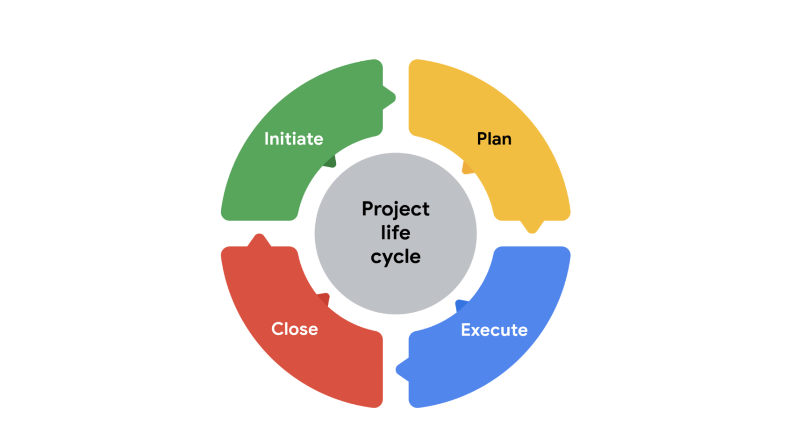
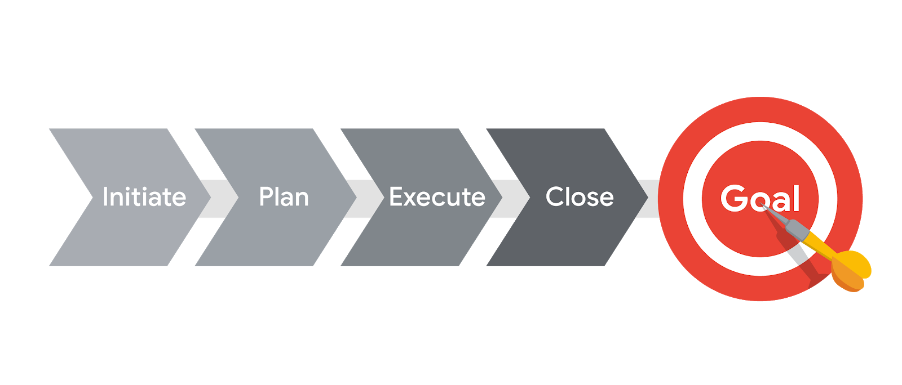
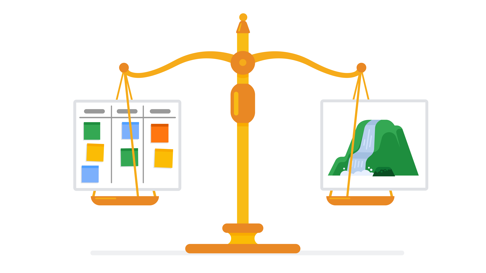
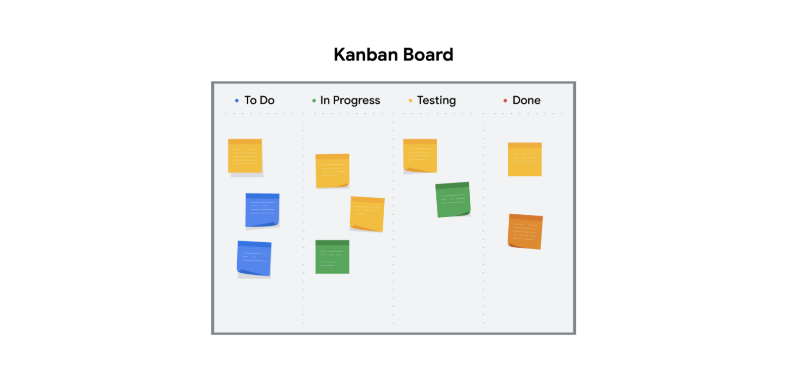

You will learn about the phases-阶段,时期 of the project life cycle, what tasks they involve, and why it is important to complete them. 

> 您将了解项目生命周期的各个阶段，它们涉及哪些任务，以及为什么完成它们很重要。

You will also learn about the different project management methodologies-方法论 and approaches-途径,路径 and which is most effective for a given project.

> 您还将了解不同的项目管理方法和方法，以及哪种方法对给定项目最有效。

**学习目标**

- Explain why it is important to understand and follow-遵循 the life cycle of a project.

	> 解释为什么理解和遵循项目的生命周期很重要。

- Define and outline-概述,大纲,草图 a project’s phases and each phase’s tasks.

	> 定义和概述项目的阶段和每个阶段的任务。

- Compare different program management methodologies and determine which is most effective for a given project.

	> 比较不同的计划管理方法，并确定哪一种对给定的项目最有效。

# Understanding the project life cycle 07.17

> 了解项目生命周期

## Introduction: The project management life cycle and methodologies

> 简介:项目管理生命周期和方法论

Welcome back. 

> 欢迎回来

Before we move on, let's recap-摘要说明 what's already been covered.

> 在我们继续之前，让我们回顾一下已经涵盖的内容。

You learned how to define project management, what a project is, what it isn't, and how to explain its value to businesses-企业.

> 你学习了如何定义项目管理，什么是项目，什么不是项目，以及如何向企业解释它的价值。

You also discussed when and why it's necessary to have a project manager, the role in day-to-day responsibilities of a project manager, and the core skills needed to be a successful project manager.

> 您还讨论了何时以及为什么需要项目经理，项目经理在日常职责中的角色，以及成为一名成功的项目经理所需的核心技能。

Now is a good time to stop and recognize-认出,辨别出 how much you've learned.

> 现在是时候停下来看看你学到了多少了。

By now you're familiar-熟悉的,常见的 with the job of project management, and you've started learning what it takes to be an effective project manager.

> 到目前为止，你已经熟悉了项目管理的工作，并且你已经开始学习如何成为一名有效的项目经理。

Now you'll go a little further, and learn some of **the ins and outs of the job**-工作的来龙去脉, and before you know it, you'll be ready to guide any project successfully.

> 现在，您将更进一步，了解一些工作的来龙去脉，在您了解它之前，您将准备好成功地指导任何项目。

Are you ready?

> 你准备好了吗？

Well, coming up, I'll introduce you to the two most popular-流行的,受大众喜爱的,受欢迎的 approaches to project management, Waterfall and Agile.

> 接下来，我将介绍两种最流行的项目管理方法：瀑布式和敏捷式。

We'll also cover the project management life cycle and phases, and you'll learn about the different styles, scenarios-场景, and factors-因素,要素 that can impact a project and its tasks at any given phase.

> 我们还将介绍项目管理生命周期和阶段，您将了解在任何给定阶段可能影响项目及其任务的不同风格、场景和因素。

When we're done, you'll be able to explain and follow-遵循 the life cycle of a project, define and outline-概述,大纲,草图 a project's phases, and each phase's tasks, compare different project management methodologies to determine which methodology is most effective for a project, and finally, organize how a project is run, according-依据,根据,相符的,相应的 to different program management methodologies.

> 当我们完成后，您将能够解释并遵循项目的生命周期，定义和概述项目的阶段，以及每个阶段的任务，比较不同的项目管理方法，以确定哪种方法对项目最有效，最后，根据不同的项目管理方法组织项目的运行方式。

Ready? Let's get started.

> 准备好了么？让我们开始吧。

## Exploring the phases of the project life cycle

> 探索项目生命周期的各个阶段

No two projects are exactly-恰好,完全 the same, which means there are many different ways to manage them. 

> 没有两个项目是完全相同的，这意味着有许多不同的管理方法。

Each project comes with its own needs and factors that impact how you'll take action and achieve-实现,达到,取得 your goals.

> 每个项目都有自己的需求和影响你如何采取行动和实现目标的因素。

There are many ways to manage projects and not always one right way to do so.

> 管理项目的方法有很多，但并不总是一种正确的方法。

Picture-想象 this, you're project managing a political-政府的 campaign for a local candidate-候选人,申请者.

> 想象一下，你正在为当地候选人管理政治竞选活动。

To make it happen, you need to think about things like your available resources, the people you'll be working with, the election-选举,当选 date, and the location.

> 要做到这一点，你需要考虑一些事情，比如你的可用资源，你将与之合作的人，选举日期和地点。

You need to be aware-知道的,明白的 of lots of details to successfully complete your project.

> 为了成功完成项目，你需要了解很多细节。

Because so many different things can impact a project, it's important to understand its basic structure.

> 因为很多不同的事情会影响一个项目，所以了解它的基本结构是很重要的。

We call this structure the project life cycle.

> 我们把这个结构称为项目生命周期。

The life cycle is a great way to guide your project in the right direction-方向 so that you and your project stay on track and end up in the right place.

> 生命周期是引导项目走向正确方向的好方法，这样你和你的项目就能保持正轨，并最终到达正确的位置。

Most project life cycles have four major phases, each with their own set of tasks and concerns-关注点.

> 大多数项目生命周期有四个主要阶段，每个阶段都有自己的一组任务和关注点。

Check it out.

> 看过来。

The main phases of a project are initiate-开始实施,发起 the project, make a plan, execute and complete tasks, and finally, close the project.

> 项目的主要阶段是启动项目，制定计划，执行和完成任务，最后结束项目。

---

Let's talk about the first phase, initiate the project.

> 让我们谈谈第一阶段，启动项目。

This is the launchpad-启动平台 for the entire process of your project.

> 这是项目整个过程的启动平台。

In this phase, you'll define project goals and deliverables, identify the budget and resources you'll need, the people involved in your project, and any other details that can impact the successful completion of your project.

> 在此阶段，您将定义项目目标和可交付成果，确定所需的预算和资源，项目中涉及的人员以及可能影响项目成功完成的任何其他细节。

You'll document-记录,记载 all this information in one place to showcase the project's value, and hopefully get approval to move forward with it.

> 您将在一个地方记录所有这些信息，以展示项目的价值，并希望获得批准以继续进行项目。

Once the project is approved, it's time to **get rolling**-开始行动.

> 项目一经批准，就该开始工作了。

---

Next, you'll make a plan for how you will meet the goals of your project.

> 接下来，你要制定一个如何实现项目目标的计划。

There are all kinds of ways to plan your project, and we'll get into some different methods and techniques later on.

> 有各种各样的方法来计划你的项目，我们将在后面介绍一些不同的方法和技术。

Right now, the important thing to know is that for every single project, creating a plan of how you're going to meet your goals is absolutely-绝对地,完全地 100 percent essential-必不可少的,非常重要的.

> 现在，重要的是要知道，对于每一个项目，制定一个如何实现目标的计划是绝对百分之百必要的。

Think about it.

> 考虑一下。

You can't hire a contractor-承包商,立约人 to build a house without planning what it'll look like or how much you have to spend. 

> 你不可能在没有规划好房子的样子或者你要花多少钱的情况下就雇一个承包商来盖房子。

These same considerations-考虑,斟酌 apply to any project that you manage.

> 这些同样的考虑，也适用于你管理的任何项目。

To be effective, your plan needs to include a lot of things.

> 为了有效，你的计划需要包括很多东西。

For example, a budget, a breakdown-细目,分解 of all the tasks that you need to be completed, ways to communicate team roles and responsibilities, a schedule, resources, and what to do in case your project encounters-遭遇,经历,体验 problems or needs to change.

> 例如，预算，需要完成的所有任务的细分，沟通团队角色和职责的方法，时间表，资源，以及在项目遇到问题或需要更改时该怎么做。

That's just to **name a few**-列举几个.

> 这只是其中的几个例子。

Once you have your plan in place, it's time to execute and complete those tasks.

> 一旦你有了你的计划，是时候执行和完成这些任务了。

It's important to point out that your project team has the job of completing the project tasks.

> 需要指出的是，您的项目团队有完成项目任务的职责。

As a project manager, your role's a little different.

> 作为一个项目经理，你的角色有点不同。

While you might be **in charge of**-负责 completing certain-某些,某几个,必然的,确定的 tasks in the project, your primary tasks as the project manager are to monitor progress and keep your team motivated-积极性,激励,激发.

> 虽然你可能负责完成项目中的某些任务，但作为项目经理，你的主要任务是监督进度并保持团队的积极性。

You also remove any obstacles-障碍,阻碍,障碍物 that might come up so that the tasks are executed well and on time.

> 你还要消除任何可能出现的障碍，这样任务才能按时顺利地完成。

---

Finally, when all the tasks have been completed, all the resources have been **accounted for**-解释,说明 and the project has crossed-超过,越过 the finish line, it's time to close the project.

> 最后，当所有的任务都完成了，所有的资源都得到了解释，项目已经越过了终点线，是时候结束项目了。

Why is it important to close?

> 为什么关闭很重要？

One big reason is so your team has a moment to celebrate-庆祝,庆贺 all of their hard work.

> 一个重要的原因是让你的团队有时间庆祝他们的辛勤工作。

Closing the project is also a chance to evaluate-评价,评估 how the project went.

> 结束项目也是一个评估项目进展情况的机会。

You can make note of what worked and what didn't so you can plan better for next time.

> 你可以记下什么有效，什么没有，这样你就可以更好地计划下一次。

Even if the project was a massive-大规模的 success, it's helpful to take time to reflect-反思,反省.

> 即使项目取得了巨大的成功，花时间反思也是有帮助的。

Closing the project is also a great way to connect with anyone outside your team who may have had interest in the project's goal. 

> 结束项目也是与团队外可能对项目目标感兴趣的人建立联系的好方法。

You can let everyone know what was completed and what you accomplished-完成,实现.

> 你可以让每个人都知道你完成了什么和你完成了什么。

Some projects like the campaign example will have a firm-确切的 end date.

> 一些项目，如活动的例子将有一个确定的结束日期。

Once the project is finished, that's it.

> 一旦项目完成，就可以了。

There's no more work to do.

> 没有更多的工作要做。

Other projects have different finish lines.

> 其他项目有不同的终点线。

For example, a project where you're implementing a new ordering system at a restaurant-餐馆,饭店 is complete after the system is set up and the employees know how it works.

> 例如，在一个项目中，您要在餐厅实现一个新的点菜系统，在系统设置好并且员工知道它是如何工作之后，这个项目就完成了。

At that point, your goals are completed.

> 到那时，你的目标就完成了。

It's time to **hand over**-移交,交出 the project to another group whose job it is to provide support and make sure the system stays running on a day-to-day basis.

> 是时候把这个项目交给另一个小组了，他们的工作是提供支持，并确保系统每天都在运行。

Another example of this is, I once project managed the creation of a dashboard that would be used by various stakeholders in my organization.

> 另一个例子是，我曾经管理过一个仪表板的创建，该仪表板将由我的组织中的各种利益相关者使用。

This dashboard-仪表板 would show pertinent-切题的,相关的 information to each stakeholder, depending on the team that they were a part of in our broader-更广泛,广大的 organization.

> 这个仪表板将向每个利益相关者显示相关的信息，这取决于他们在我们更广泛的组织中属于哪个团队。

I project managed the beginning, from writing up the vision for the project to the end where we delivered the dashboard.

> 我负责项目的开始，从撰写项目愿景到最后交付仪表板。

Once I passed off the final product, I transitioned-转换,转变 the continued update of each team's data and the corresponding-相一致,符合 dashboard page to the respective-分别的,各自的 teams.

> 一旦我完成了最终产品，我就把每个团队数据的持续更新和相应的仪表板页面转移到各自的团队。

Think of it like **turning over**-移交 the keys of a newly built house to its new owner.

> 这就像把新房的钥匙交给新主人一样。

The project of building the house is complete and now it's up to the owner to take care of the house's maintenance-维护,保养 and the upkeep-保养,维持,维修费.

> 房子的建造工程已经完成，现在由业主来负责房子的维护和保养。

There you have it.

> 就是这样。

The project life-cycle.

> 项目生命周期。

The exact-精确的 name for each phase might change **depending on**-取决于 the type of project or organization you work for.

> 每个阶段的确切名称可能会根据您所在的项目或组织的类型而更改。

The general idea stays the same.

> 总的思路是一样的。

Following the project processes you will learn in this course will **set you up for**-为你做准备 project management success.

> 在本课程中学习的项目流程将为您的项目管理成功奠定基础。

Next, we'll **take a closer look**-仔细观察 into what happens during each phase of the traditional-传统的 project life cycle.

> 接下来，我们将深入了解在传统项目生命周期的每个阶段会发生什么。

## Case study: The significance-重要性 of each project phase

> 案件学习：每个项目阶段的重要性

**The consequences-结果,后果,重要性 of rushing-仓促,催促 through a project phase**

> 匆忙完成一个项目阶段的后果

It’s Friday night when Jason, a project manager at a company that specializes-专门研究 in virtual-虚拟的 reality-现实 software, receives an urgent-紧急的 call from his manager, Mateo.

> 一个周五的晚上，Jason，一家虚拟现实软件公司的项目经理，接到了经理Mateo的紧急电话。

Mateo tells Jason that he needs a cost and timeline for a virtual reality training-培训,训练 program for Flight Simulators-模拟器, Inc., a company that does aircraft-飞机,航空器 maintenance-维护,保养, by the end of the weekend.

> 马特奥告诉杰森，他需要一个成本和时间表的虚拟现实培训计划飞行模拟器公司，一家公司做飞机维修，在周末结束。

---

Jason spends the weekend working through a proposal-提议,建议 for Flight Simulators, Inc. 

> Jason 花了一个周末的时间来完成飞行模拟器公司的提案。

He quickly throws together a proposal estimating-估计,估价 that it will cost $200,000 and take six weeks to develop the course.

> 他很快就提出了一个方案，估计这门课程将花费20万美元，需要6周的时间来开发。

This is the standard-标准,规范 cost and time frame for developing training on his company’s platform-平台.

> 这是在他的公司平台上开发培训的标准成本和时间框架。

He sends the proposal **over to**-转交给 Flight Simulators, Inc.

> 他把提案寄给飞行模拟公司。

so that he can meet their deadline. 

> 这样他就能赶上最后期限了。

---

When Jason walks into the office on Monday morning, Mateo tells him that he got reprimanded-谴责,训斥 for not following the company’s process for building out a proposal and including the engineers in the process.

> 周一早上，杰森走进办公室，马特奥告诉他，他因为没有按照公司的流程来制定提案，也没有让工程师参与其中，而受到了训斥。

The engineers take a look at the information presented-提供 by Flight Simulators, Inc. and realize-了解,意识到 that the company’s software won’t work with their platform.

> 工程师们看了看 Flight Simulators, Inc. 提供的信息，意识到该公司的软件无法与他们的平台兼容。

It will take six months to develop their platform to meet the needs of the organization’s software and another six months to test the software and platform integration.

> 这将需要6个月的时间来开发他们的平台，以满足组织的软件需求，另外6个月的时间来测试软件和平台的集成。

The cost to develop and test this software will be over a million dollars. 

> 开发和测试这个软件的费用将超过一百万美元。

---

This project has failed before it even started.

> 这个项目还没开始就失败了。

There’s no way to complete the request from Flight Simulators-模拟器, Inc. without impacting the budget, quality, and timeline. 

> 没有办法在不影响预算、质量和时间的情况下完成飞行模拟器公司的要求。

**What should have happened**

> 应该发生什么？

When his manager calls, Jason tells him that while he understands that Mateo wants to make the customer happy by getting them a proposal promptly-迅速地,立即,马上, he would like to take a little more time to get the proposal right.

> 当他的经理打电话给他时，Jason 告诉他，虽然他理解Mateo想要通过及时向客户提交提案来让他们满意，但他想要多花一点时间来把提案做好。

Jason tells Mateo that he will draft-起草,草拟 up an email to Flight Simulators, Inc. and request additional time to develop an accurate-准确的,精确的 and reasonable-有道理的,合情理的 proposal.

> 杰森告诉马特奥，他将起草一封电子邮件给飞行模拟器公司，并要求额外的时间来制定一个准确和合理的建议。

Mateo is hesitant-犹豫的,不愿的 but agrees. 

> 马特奥有些犹豫，但还是同意了。

---

On Monday morning, Jason sees that Flight Simulators, Inc. has responded to his request.

> 周一早上，杰森看到飞行模拟器公司回应了他的请求。

They appreciate-欣赏,理解,明白 the fact that he communicated his concerns about the quick turnaround-转变,转向 on the proposal request.

> 他们赞赏他转达了他对提案请求迅速处理的关切。

They say they will give him a week to work with his team to provide an estimate-估计,估价 for the project. 

> 他们说，他们将给他一周的时间与他的团队合作，为这个项目提供一个估计。

---

Now Jason has the time to get all of the key players involved in estimating the effort it will take to complete the project, including the cost, schedule, and resources. 

> 现在Jason有时间让所有关键人员参与到估算完成项目所需的工作量中，包括成本、进度和资源。

---

Let’s apply the project life cycle to this project. 

> 让我们将项目生命周期应用到这个项目中。

**Initiating the project**

> 启动项目

This is the phase Jason rushed-仓促,催促 through in the first scenario.

> 这是 Jason 在第一个场景中匆匆经历的阶段。

Ideally-理想地,观念上地, in this phase, Jason discusses project goals with Flight Simulators, Inc. to gain a clear understanding of what they are asking for.

> 理想情况下，在此阶段，Jason与飞行模拟器公司讨论项目目标，以清楚地了解他们的要求。

Once Jason has defined the project goals, he can gather-召集,聚集 the stakeholders and project team members to define what needs to be done to successfully create this training for Flight Simulators, Inc.

> 一旦 Jason 定义了项目目标，他就可以召集利益相关者和项目团队成员来定义需要做什么才能成功地为 Flight Simulators, Inc 创建这个培训。

Jason identifies-确认 the skill sets required, the timeline, and the cost to develop the training.

> Jason 确定了开发培训所需的技能集、时间表和成本。

He identifies-识别 and documents the value that this project creates for the company.

> 他识别并记录这个项目为公司创造的价值。

He presents-提供 all of the information he has put together to his company’s leadership team, who approves Jason’s proposal.

> 他把收集到的所有信息提交给公司的领导团队，领导团队批准了杰森的提议。

Jason then submits the proposal to Flight Simulators, Inc., and they accept it. 

>  Jason 随后将提案提交给飞行模拟公司，他们接受了提案。

**Making a plan**

> 制定计划

Now that Jason has the green light to work on the project, he makes a project plan to get from start to finish.

> 既然Jason已经获准从事这个项目，他就制定了一个从头到尾的项目计划。

Having a plan in place ensures that all team members and stakeholders are prepared to complete their tasks.

> 制定计划可以确保所有团队成员和利益相关者都准备好完成他们的任务。

Jason outlines-概述,轮廓,大纲 the important deadlines-截止日期 and tasks for the project to be successful.

> Jason概述了项目成功的重要截止日期和任务。

He creates a schedule to **account for**-说明 all resources, materials, and tasks needed to complete the project. 

> 他创建一个时间表来说明完成项目所需的所有资源、材料和任务。

**Executing and completing tasks**

> 执行并完成任务

During this project phase, Jason’s project team **puts his plan in motion**-让他的计划付诸实施 by executing the work.

> 在这个项目阶段，Jason的项目团队通过执行工作来启动他的计划。

Jason monitors his team as they complete project tasks.

> Jason 在团队完成项目任务时监视他们。

His role as the project manager is not to complete the individual-单独的,个别的 tasks but to help break down any barriers that would slow or stop the team from completing their tasks.

> 作为项目经理，他的角色不是完成单个任务，而是帮助打破任何可能减缓或阻止团队完成任务的障碍。

It is also Jason’s responsibility to communicate schedule and quality expectations-期待.

> 沟通进度和质量期望也是 Jason 的责任。

Jason uses his communication skills to keep Flight Simulators, Inc. up to date on the project status and gather feedback from them.

> Jason运用他的沟通技巧使Flight Simulators, Inc.了解最新的项目状态，并从他们那里收集反馈。

This keeps the project on schedule and within budget.

> 这使项目按计划进行并在预算范围内。

**Closing the project**

> 关闭项目

Jason’s team has successfully completed the training, and he delivers it to Flight Simulators, Inc.

> Jason的团队已经成功地完成了培训，他将其交付给飞行模拟器公司。

They are very pleased-高兴的,满意的 with how it turned out!

> 他们对结果非常满意!

Jason is now ready to close this project and move on to the next one.

> Jason现在准备结束这个项目，继续下一个项目。

Before he closes this chapter, Jason and his team discuss and document the lessons-经验,教训 learned from the project.

> 在结束本章之前，Jason和他的团队讨论并记录了从项目中吸取的经验教训。

What worked well, and what could work better next time?

> 哪些工作做得很好，哪些工作下次可以做得更好?

Jason also puts together a small lunch gathering-聚会 for his team to celebrate-庆祝,庆贺 and recognize-表彰 their hard work. 

> Jason 还为他的团队组织了一个小型午餐聚会，以庆祝和表彰他们的辛勤工作。

**Key takeaway**

> 关键要点

It may seem like a lot of work to go through an entire project life cycle, but the long-term impact it will have on your project is huge!

> 在整个项目生命周期中，这似乎需要做很多工作，但它对项目的长期影响是巨大的!

It is your job as the project manager to make sure that your leadership truly understands the risk of not properly preparing for a project.

> 作为项目经理，你的工作是确保你的领导真正理解没有为项目做好适当准备的风险。

Making assumptions that are incorrect can put your company at risk.

> 做出不正确的假设会让你的公司处于危险之中。

Instead-反而, taking the time to carefully initiate, plan, execute, and close your project leads to project success and good working relationships-关系 with customers. 

> 相反，花时间仔细地启动、计划、执行和结束项目会导致项目的成功，并与客户建立良好的工作关系。

# Analyzing-对…进行分析,分解 the different project phases 07.18～07.19

> 分析不同的项目阶段

## Phases in action: Initiating and planning

> 行动阶段： 启动和计划

Now that we've discussed the project life cycle, we're going to explore-探索,探究,考察 some of the different tasks that match up with each life cycle phase.

> 既然我们已经讨论了项目生命周期，我们将探索与每个生命周期阶段相匹配的一些不同任务。

But first, let's review the phases.

> 但首先，让我们回顾一下这些阶段。

The project life cycle phases are initiate the project, make a plan, execute and complete tasks, and close out the project.

> 项目生命周期阶段包括:启动项目、制定计划、执行并完成任务、结束项目。

Great.

> 很好。

Let's get back to the tasks that need to be accomplished during each phase.

> 让我们回到每个阶段需要完成的任务。

For this video, we're going to focus on the first two project life cycle phases, initiating the project and making a plan.

> 在本视频中，我们将重点关注项目生命周期的前两个阶段，启动项目和制定计划。

It's important to **call out**-揭露,指出 that the name or tasks for each phase might change, or may be a little different depending on the type of project or the organization where you work.

> 重要的是要指出，每个阶段的名称或任务可能会发生变化，或者根据项目类型或您工作的组织可能略有不同。

At Google, we use a mix-混合,组合 of different project management methods, which you'll learn more about later in the course.

> 在谷歌，我们使用不同的项目管理方法的组合，你将在课程的后面了解更多。

But regardless-不顾,不管怎样 of the method, all projects share a lot of the same tasks needed to get the job done.

> 但是，无论采用何种方法，所有项目都需要共享完成工作所需的许多相同任务。

So, let's get into it.

> 那么，让我们开始吧。

---

The first step of the project life cycle is to initiate the project.

> 项目生命周期的第一步是启动项目。

During initiation, you'll organize all of the information you have available to you about your project.

> 在启动过程中，您将组织有关项目的所有可用信息。

This way, when you're ready to continue on, you'll be prepared for the next phase when you can create your plan.

> 这样，当你准备好继续工作时，你就可以为下一阶段制定计划做好准备。

Defining project goals makes the details of your project clear so that you and your team can successfully complete the project. 

> 定义项目目标使项目的细节变得清晰，以便您和您的团队能够成功地完成项目。

For example, if the project goal is to manage a political-政治的 campaign, then some deliverables, which are specific tasks or outcomes, might be to raise-筹集 $5,000 or get 500 signatures in support of your candidate's cause-事业.

> 例如，如果项目的目标是管理一场政治竞选，那么一些可交付成果，即具体的任务或结果，可能是筹集5000美元或获得500个签名来支持你的候选人的事业。

With this in mind, you'll need to do some research to come up with ideas that will help you meet your goals.

> 考虑到这一点，你需要做一些研究来想出能帮助你实现目标的想法。

You'll also need to find out what resources are available.

> 您还需要找出可用的资源。

Resources can include people, equipment-设备, software programs, vendors, physical space or locations, and more.

> 资源可以包括人员、设备、软件程序、供应商、物理空间或位置等等。

Anything you need to actually-实际上,事实上 complete the project is considered-认为,视为 a resource.

> 实际完成项目所需的任何东西都被视为资源。

Now as a project manager, you'll record all of these details in your project proposal and then get them approved by a decision maker or group of decision makers at your company so that you can move ahead with your project plans.

> 现在作为一个项目经理，你要在你的项目提案中记录所有这些细节，然后让你公司的决策者或一组决策者批准它们，这样你就可以继续你的项目计划了。

Now in some cases, you may be the decision maker so be sure to consider the same set of factors when initiating your project before moving to the next stage-阶段,时期.

> 现在，在某些情况下，您可能是决策者，所以在进入下一阶段之前，请确保在启动项目时考虑相同的因素集。

No worries, you will learn all the details about how to create a project proposal.

> 不用担心，您将学习有关如何创建项目提案的所有细节。

We will be getting into more detail of what this is and how to create one later in the course.

> 我们将更详细地了解这是什么以及如何在课程的后面创建一个。

Voila, once your project is approved, you'll move into the second step of the project life cycle, which is to make a plan.

> 瞧，一旦你的项目被批准，你就进入了项目生命周期的第二步，也就是制定计划。

---

In this phase, you'll create a budget and set-设置 the project schedule.

> 在此阶段，您将创建预算并设置项目时间表。

You'll establish-设立,建立 the project team and determine each person's roles and responsibilities.

> 你将建立项目团队，并确定每个人的角色和职责。

Let's pause-暂停,停顿 for a second.

> 让我们暂停一下。

You may be thinking, "Why can't we just get started?", but that's the thing with project management, deliberate-仔细考虑 planning is critical-极其重要的,关键的 to a project's success.

> 你可能会想，“为什么我们不能开始呢?”，但这就是项目管理的问题，深思熟虑的计划对项目的成功至关重要。

A crucial-至关重要的,决定性的 part of project management is planning for risk and change.

> 项目管理的一个关键部分是对风险和变更进行计划。

An experienced project manager knows that plans always change.

> 经验丰富的项目经理知道计划总是在变化。

This ability to adapt-适应,调整 is all about thinking and planning ahead.

> 这种适应能力就是提前思考和计划。

Scheduling delays, budget changes, technology and software requirements, legal issues, quality control, and access to resources are just some of the more common types of risks and changes that a project manager needs to consider.

> 计划延迟、预算变更、技术和软件需求、法律问题、质量控制和资源访问只是项目经理需要考虑的一些更常见的风险和变更类型。

So, it's important to keep in mind that planning is key to reducing-减少,降低 those risks.

> 所以，重要的是要记住，计划是减少这些风险的关键。

But don't worry, if the idea of risks seems a little overwhelming-压垮 right now, in later courses, we'll teach you all about understanding risks.

> 但别担心，如果现在对风险这个概念有点难以理解，在后面的课程中，我们会教你们如何理解风险。

Just know that it's really important not to skip this step and to always make a plan.

> 要知道不要跳过这一步，制定一个计划是非常重要的。

Again, the success of your project **depends on**-取决于 it.

> 同样，你的项目的成功取决于它。

Once you have a plan, you'll communicate-传达,传递,通讯 all of this information to your team.

> 一旦你有了一个计划，你就会把所有这些信息传达给你的团队。

That way, each member will know which tasks they'll own and what to do if they have questions or if they run into problems. 

> 这样，每个成员都知道他们应该承担哪些任务，如果他们有问题或遇到问题该怎么做。

You'll also communicate your plan with others who have an interest in the project success, so that they are aware-知道的,明白的 of your plans and your progress as the project continues to move forward.

> 你也要与其他对项目成功感兴趣的人交流你的计划，这样他们就会知道你的计划和项目的进展。

Nice job, we've made it halfway-在中间,在中途 through the steps of a project life cycle.

> 干得好，我们已经完成了项目生命周期的一半步骤。

Up next, we'll check out the remaining-剩余 two phases, executing and completing tasks and closing the project.

> 接下来，我们将检查剩余的两个阶段，执行和完成任务以及结束项目。

Catch you in a bit.

> 一会儿见。

## Phases in action: Executing and closing

> 行动阶段： 执行和关闭

Welcome back.

> 欢迎回来

We just learned about the core tasks that need to be completed in the first two phases of the project life cycle, initiating the project and making plans.

> 我们只了解了项目生命周期的前两个阶段需要完成的核心任务，启动项目和制定计划。

Now, it's time to put your plans into action.

> 现在，是时候把你的计划付诸行动了。

Remember, it's not your job to actually do all the tasks.

> 记住，你的工作不是完成所有的任务。

Your primary job as the project manager is to manage the progress of the project as a whole.

> 作为项目经理，你的主要工作是从整体上管理项目的进度。

This means you'll oversee-监管,监督 your team's efforts and make sure everyone understands what's expected-期待 of them, what tasks need to be done, and how and when to complete those tasks.

> 这意味着你要监督团队的工作，确保每个人都明白对他们的期望，需要完成哪些任务，以及如何以及何时完成这些任务。

It's also your job to help remove any obstacles-障碍,阻碍 and to alert the right people if it looks like there might-可能 be a delay to the project. 

> 你的工作还包括帮助消除任何障碍，并在项目看起来可能会延迟时提醒合适的人。

This means you'll need to communicate with your team, and **anyone else**-其他人 involved in your project through meetings, written communications like memos-备忘录, emails or internal chat tools, and other working documents like task reports.

> 这意味着你需要通过会议、书面沟通(如备忘录、电子邮件或内部聊天工具)以及其他工作文档(如任务报告)与团队和项目中涉及的任何人进行沟通。

Quick pro-专业的,支持,赞成 tip, if in doubt-怀疑,不确定, err on the side of overcommunication-过度沟通.

> 快速的专业提示，如果有疑问，那就过度沟通吧。

As your project progresses-进步,进展 you'll make adjustments to the schedule, budget, and allocation-分配,分派 of resources, clearly communicating updates all along the way.

> 随着项目的进展，你将调整进度、预算和资源分配，并在整个过程中清楚地传达最新情况。

When all the tasks are complete and you've met the project goal, it's time to close the project.

> 当所有的任务都完成了，你已经达到了项目目标，是时候结束项目了。

This phase is usually overlooked-忽视,忽略 because it's easy to assume-认为,做出 that once the project goal has been delivered, everyone can move on.

> 这个阶段通常被忽略，因为很容易认为一旦项目目标已经交付，每个人都可以继续前进。

But hold up, there's still a lot that needs to be done.

> 但是等等，还有很多事情需要做。

First, check to make sure all tasks have been completed, including any work that was added along the way.

> 首先，检查以确保所有任务都已完成，包括在此过程中添加的任何工作。

Be sure any outstanding-未完成的 invoices-账单 have been paid, resources are returned and accounted for, and project documentation has been submitted.

> 确保所有未付的发票都已支付，资源已归还并入账，项目文件已提交。

Next, and this is very important, get confirmation that the final outcome of your project is acceptable to the people you're delivering it to.

> 接下来，这是非常重要的，确认你的项目的最终结果对于你的交付对象是可以接受的。

It is crucial-至关重要的,决定性的 to your project's success that the person who asked you to manage the project is satisfied-令人满意 with the end result.

> 要求你管理项目的人对最终结果感到满意，这对项目的成功至关重要。

Once your project has been accepted as meeting its goals, take some time to reflect-深思,反省 on what went well and maybe what didn't go so well.

> 一旦你的项目被接受为达到了它的目标，花点时间来反思哪些进展顺利，哪些进展不太顺利。

This reflection-深思,反省 is usually called a retrospective-回顾的,回想的, and it's a chance to note best practices and learn how to manage your project more effectively-有效地,实际上 next time, even if everything went great.

> 这种反思通常被称为回顾，这是一个记录最佳实践并学习下一次如何更有效地管理项目的机会，即使一切都很顺利。

The notes from your retrospective-回顾 are also valuable to the people or organization receiving the end result of the project.

> 回顾中的记录对于接收项目最终结果的人员或组织也很有价值。

That's because they can use that information to inform-了解 decisions-决定,抉择 about their business the next time they consider a project.

> 这是因为他们可以在下次考虑项目时使用这些信息来为他们的业务决策提供信息。

Now it's time to collect all the project documentation that you created or collected along the way, including all of your plans and reflections-深思,反省, and share the final results of your project with your stakeholders.

> 现在是时候收集您一路上创建或收集的所有项目文档，包括您的所有计划和思考，并与您的涉众分享您的项目的最终结果。

Remember, stakeholders are people who are interested in and affected-影响 by the project's completion and success.

> 记住，利益相关者是对项目的完成和成功感兴趣并受其影响的人。

Depending on the type of project, stakeholders could include a department-部门 or organization's management team, clients or customers of your product or service, users of your new tool or process, or even the community-社区,社会 at large if you're planning a community town hall-市政厅,市政府 meeting.

> 根据项目的类型，利益相关者可能包括一个部门或组织的管理团队、你的产品或服务的客户或顾客、你的新工具或流程的用户，如果你正在计划一个社区市政厅会议，甚至可能包括整个社区。

Pro tip, stakeholders play a huge role in the development, and success of your project.

> 专业提示，利益相关者在项目的开发和成功中扮演着巨大的角色。

You'll learn a lot more about these key players later on.

> 稍后您将了解更多关于这些关键人物的信息。

But for now, just know that they're like the VIPs of your project.

> 但现在，只要知道他们就像你项目的vip。

Next, take some time to celebrate-庆祝,庆贺 the effort your team invested-投资,投入 in the project.

> 接下来，花一些时间来庆祝团队在项目中投入的努力。

Celebrations-庆祝活动 help people feel good about the work they've done, and think of the work as uplifting-振奋,鼓舞 and rewarding-值得 because it truly is.

> 庆祝活动帮助人们对自己所做的工作感觉良好，并认为工作是令人振奋和值得的，因为它确实是。

Some ideas for small celebrations are a company or team-wide-团队范围内的 email, thanking the team and acknowledging-承认,认可,感谢 individual-个人的 efforts. 

> 小型庆祝活动的一些想法是在公司或团队范围内发送电子邮件，感谢团队并认可个人的努力。

Now for big projects, you may even consider a company party to celebrate the team and the project success.

> 对于大项目，你甚至可以考虑开一个公司派对来庆祝团队和项目的成功。

To wrap up, you and your team can formally-正式地 move on from the project so that you can pursue-追求,致力于 new projects in the future.

> 总结一下，你和你的团队可以正式离开这个项目，这样你就可以在未来追求新的项目。

Well, as you can see, being a project manager is a lot of work, but it's very rewarding-值得, and it's all, well, manageable when you follow through with the project life cycle.

> 嗯，正如你所看到的，作为一个项目经理是很多工作，但它是非常有益的，当你遵循项目生命周期时，这一切都是可控的。

You can see how the organization, communication, and improvements-改善,改进之处 you add to various areas of a project can make the entire team more effective-有效的 and efficient-效率高的, and you can have an impact on many areas of a project in a way that's **greater than**-大于 if you focused on any one task on the project.

> 您可以看到，您在项目各个领域中添加的组织、沟通和改进如何使整个团队更加有效和高效，并且您可以对项目的许多领域产生影响，这种影响比您专注于项目中的任何一项任务都要大。

Similar to a coach-教练 with a sports team, even though you aren't actually playing a direct role in the game, your guidance-指导,指引, your communication, and your team-building can make the difference in a happy, high-performing, and successful team.

> 与运动队的教练类似，即使你在比赛中没有直接的作用，你的指导、你的沟通和你的团队建设可以使一个快乐、高效和成功的团队变得不同。

In later courses we'll discuss each of these project phases, and you'll learn methods, techniques, and tools to help you.

> 在以后的课程中，我们将讨论每个项目阶段，您将学习方法，技术和工具来帮助您。

For now, we just want you to become familiar-熟悉的 with the general project management process, and we'll share some of the terms and concepts used in the field that you'll need to know as you develop your project management skills.

> 现在，我们只想让你熟悉一般的项目管理过程，我们将分享一些在该领域使用的术语和概念，当你发展你的项目管理技能时，你需要知道这些术语和概念。

Up next, we'll introduce you to two of the more popular project methodologies, Waterfall and Agile. See you soon.

> 接下来，我们将向您介绍两种更流行的项目方法，瀑布和敏捷。再见。

## Summary of the project phases 

> 项目阶段总结

The **project life cycle** is the path for your project from start to finish.

> 项目生命周期是项目从开始到结束的路径。

Each project phase builds toward the subsequent-随后的,接着的 phase and helps to create a structure for the project.

> 每个项目阶段都建立在后续阶段的基础上，并帮助创建项目的结构。

To recap, the main phases of the project life cycle are: initiating the project, making a plan, executing and completing tasks, and closing the project. 

> 总而言之，项目生命周期的主要阶段是:启动项目，制定计划，执行和完成任务，结束项目。

In this reading, we will summarize each phase of the project life cycle. 

> 在本文中，我们将总结项目生命周期的每个阶段。

**The project life cycle**

> 项目生命周期

**Initiate the project**

> 启动项目

In this phase, ask questions to help set the foundation-基础 for the project, such as:

> 在这个阶段，问一些问题来帮助为项目奠定基础，例如:

- Who are the stakeholders?

	> 谁是利益相关者？

- What are the client’s or customer’s goals?

	> 客户或顾客的目标是什么？

- What is the purpose-目的,目标 and mission-使命,职责 of the project?

	> 项目的目的和使命是什么？

- What are the measurable-可测量的,显著的,有明显影响的 objectives-目的,目标 for the team?

	> 团队的可度量目标是什么？

- What is the project trying to improve-改善,变得更好? 

	> 这个项目想要改进什么？

- When does this project need to be completed? 

	> 这个项目需要什么时候完成？

- What skills and resources will the project require? 

	> 项目需要什么技能和资源？

- What will the project cost? What are the benefits?

	> 这个项目要花多少钱？有什么好处？

**Make a plan**

> 制作计划

In this phase, make a plan to get your project from start to finish. 

> 在这个阶段，制定一个从头到尾完成项目的计划。

- Create a detailed project plan. What are the major milestones? What tasks or deliverables **make up**-构成,组成 each milestone?

	> 制定详细的项目计划。主要的里程碑是什么?每个里程碑由哪些任务或可交付成果组成?

- Build out the schedule so you can properly-正确地,适当地 manage the resources, budget, materials, and timeline. Here, you will create an itemized-逐条列记 budget.

	> 制定计划，这样你就可以合理地管理资源、预算、材料和时间。在这里，您将创建一个分项预算。

**Execute the project**

> 执行项目

In this phase, put all of your hard work from the first two phases into action. 

> 在这个阶段，把你前两个阶段的努力付诸行动。

- Monitor your project team as they complete project tasks. 

	> 在项目团队完成项目任务时监控他们。

- Break down any barriers that would slow or stop the team from completing tasks. 

	> 打破任何阻碍团队完成任务的障碍。

- Help keep the team aware-了解,知道的,明白的 of schedule and deliverable expectations.

	> 帮助团队了解进度和可交付的期望。

- Address-提出,处理,设法解决 weaknesses-缺点,不足 in your process or examine-检查,调查 places where your team may need additional training-培训,训练 to meet the project’s goals.

	> 指出过程中的弱点，或者检查团队可能需要额外培训以满足项目目标的地方。

- Adapt to changes in the project as they arise-产生,出现.

	> 适应项目中出现的变化。

**Close the project**

> 关闭项目

In this phase, close out the project.

> - 在这个阶段，结束项目。

- Identify-确定 that your team has completed all of the requested outcomes. 

	> 确定您的团队已经完成了所有要求的结果。

- Release-释放,放走 your team so they can support other projects within the company.

	> 释放你的团队，这样他们就可以支持公司内的其他项目。

- Take time with your team to celebrate your successes! 

	> 花点时间和你的团队一起庆祝你的成功!

- Pass off all remaining-剩余,遗留 deliverables and get stakeholder approval.

	> 通过所有剩余的可交付成果并获得利益相关人的批准。

- Document the lessons you and your team learned during the project.

	> 记录你和你的团队在项目中学到的经验教训。

- Reflect-深思,反省 on ways to improve-改善,变得更好 in the future.

	> 反思未来改进的方法。

**Key takeaway**

> 关键要点

Each phase of the project life cycle has its own significance-重要性,意义 and reason for existing.

> 项目生命周期的每个阶段都有其存在的意义和理由。

By following the project life cycle, you’re ensuring that you are: 

> 通过遵循项目生命周期，您可以确保:

- Capturing-捕获 the expectations of your customer

	> 捕捉客户的期望

- Setting your project up for success with a plan

	> 用一个计划为你的项目成功做好准备

- Executing project tasks and addressing-处理,设法解决 any issues that arise-产生,出现 

	> 执行项目任务并处理出现的任何问题

- Closing out your project to capture-吸取,记录,捕获 any lessons learned 

	> 结束你的项目，吸取任何经验教训

As you continue through this course, we will walk through each project phase in more detail.

> 当您继续完成本课程时，我们将更详细地介绍每个项目阶段。

# Comparing project management methodologies and approaches-路径 07.19～07.22

> 比较项目方法论和路径

## Introduction to project management methodologies

> 介绍项目管理方法论

Welcome back, as we've already discussed, not all projects are alike-相似的,相像的.

> 欢迎回来，正如我们已经讨论过的，不是所有的项目都是一样的。

Different types of projects will benefit from applying different project management approaches or methodologies.

> 不同类型的项目将受益于应用不同的项目管理方法或方法论。

A project management methodology is a set of guiding principles and processes for owning a project through its life cycle.

> 项目管理方法是一套指导原则和过程，用于在项目的整个生命周期中拥有项目。

Project management methodologies help guide project managers throughout a project with steps to take, tasks to complete, and principles for managing the project overall-全部,总共.

> 项目管理方法帮助指导项目经理在整个项目中采取的步骤、完成的任务和全面管理项目的原则。

We will talk through two different types, linear-直线的,线性的 and iterative-迭代的,重复的.

> 我们将讨论两种不同的类型，线性和迭代。

---

Linear means the previous phase or task has to be completed before the next can start.

> 线性意味着前一阶段或任务必须在下一阶段或任务开始之前完成。

A linear approach would work well for a project like building a house.

> 线性方法适用于像建造房屋这样的项目。

You'd need the blueprint-设计图,规划 created before you can begin laying-放置 the foundation-地基,基础.

> 在开始奠定基础之前，您需要创建蓝图。

You've got to know exactly-究竟,到底 what the house will look like, its dimensions-范围,规模, and what type and how many resources you'll need. 

> 你必须确切地知道房子的样子，它的尺寸，以及你需要什么类型和多少资源。

Then you've got to finish the foundation before you **put up**-搭建 the walls and the walls before you put up the roof-屋顶,车顶 and so on before you have the finished project, which is a bungalow-style-平房式的 home.

> 然后你要先打好地基，然后再砌墙，然后再砌屋顶，等等，然后你才能完成这个平房式的房子。

There's also a clear goal, you know exactly-精确地,确切地 what the house will look like.

> 还有一个明确的目标，你确切地知道房子会是什么样子。

It's unlikely-不大可能发生的 that in the middle of building the house, your client is going to decide they'd rather have a multi-level Victorian instead of a single-level bungalow-平房,小屋.

> 在建造房子的过程中，你的客户不太可能决定他们宁愿要一个多层的维多利亚式别墅，而不是单层平房。

What's more, even if they wanted to change, it's too late, you already laid-铺设 the foundation and built the walls for the bungalow-平房,小屋, done and done.

> 而且，即使他们想改变，也太迟了，你已经为平房打好了地基，筑好了墙，就这样完了。

A bungalow is what they wanted, and a bungalow is what they'll get.

> 平房是他们想要的，他们会得到的。

Using this type of linear project management approach, completing each step in order and **sticking to**-坚持 the agreed upon-在…上 specific results and being able to deliver just what the client ordered.

> 使用这种类型的线性项目管理方法，按顺序完成每个步骤，并坚持商定的具体结果，并能够交付客户订购的内容。

---

For a project like producing a new show for a television-电视,电视机 company, **on the other hand**-另一方面, it might be more effective to use a methodology that uses an iterative, more flexible-灵活的 approach where some of the phases in tasks will overlap-部分相同 or happen at the same time that other tasks are being worked on.

> 另一方面，对于像为电视公司制作新节目这样的项目，使用一种迭代的、更灵活的方法可能会更有效，在这种方法中，任务中的某些阶段将重叠，或者与其他任务同时进行。

Your team **comes up with**-提出,想出 an idea for a show and films-电影,影片 a pilot-试播节目.

> 你的团队想出了一个节目的创意，并拍摄了试播集。

You ran several-数个,不同的,各自的 tests of the pilot-试验 in different locations and **time slots**-时间段.

> 你在不同的地点和时间段对飞行员进行了多次测试。

As your team gathers feedback about the pilot--试验, adjustments to the show are made.

> 当你的团队收集关于试播集的反馈时，就会对节目进行调整。

At the same time, you're able to make decisions and start working on other parts of the project, like hiring permanent-固定的 actors-演员, starting film-录制,拍摄电影 production-影片, and working on advertising even while the final version of the show is being worked on.

> 与此同时，你可以做出决定，开始做项目的其他部分，比如雇佣固定演员，开始电影制作，甚至在节目的最终版本正在制作时也可以做广告。

And even though the overall-全部,总共 goal is clear, produce a new show, the type of show could end up being different from the original idea.

> 即使总体目标很明确，制作一个新的节目，节目的类型最终也可能与最初的想法不同。

Your team may have started out creating a one-hour show, but during testing they realized-意识到 a half-hour show would actually be more popular-流行的,受大众喜欢的.

> 您的团队可能已经开始创建一个一小时的节目，但在测试过程中，他们意识到一个半小时的节目实际上更受欢迎。

Or maybe a **supporting character**-配角 got a lot of positive-积极的 feedback, so you want to make them one of the main characters-特征.

> 或者也许一个配角得到了很多积极的反馈，所以你想让他们成为主角之一。

What's more important is that you produce a show that audiences-观众 are going to watch.

> 更重要的是你制作了一个观众愿意看的节目。

Because of the iterative approach, plans remain-保持不变 flexible and you're able to make adjustments as you go along.

> 由于迭代方法，计划保持灵活，并且您可以在进行过程中进行调整。

Each of these projects, benefits from a different approach to how tasks will be carried out-执行,实施, in order to best meet the project's goals.

> 这些项目中的每一个都受益于执行任务的不同方法，以最好地满足项目的目标。

Linear projects don't require many changes during development and have a clear sequential-连续的,按顺序的 process.

> 线性项目在开发过程中不需要太多的更改，并且具有清晰的顺序过程。

If you **stick to**-坚持 the plan, it's likely you'll finish your tasks within the time schedule and all other criteria-标准,准则. 

> 如果你坚持计划，你很可能会在时间表和所有其他标准内完成任务。

Iterative projects allow for more flexibility and anticipate-预期,期望 changes.

> 迭代项目允许更多的灵活性和预期的变化。

You're able to test out parts of the project to make sure they work before the final result is delivered, and you can deliver parts of the project as they are completed, **rather than**-而不,而不是 waiting for the entire project to be done.

> 您可以在交付最终结果之前测试项目的某些部分，以确保它们能够正常工作，并且您可以在项目完成时交付项目的某些部分，而不是等待整个项目完成。

Over the years, the field of project management has developed many different methods that project managers can choose from that will help them manage most effectively-有效地,实际上.

> 多年来，项目管理领域已经发展出许多不同的方法，项目经理可以从中选择，以帮助他们最有效地进行管理.

Google takes a hybrid-混合的 approach to project management.

> 谷歌采用混合方法进行项目管理。

We mix and match from different methods depending on the type of project.

> 根据项目的类型，我们采用不同的方法进行混合搭配。

Our project managers are encouraged-鼓励,激励 to adapt their own style to what makes the most sense-意义 to their project and their team.

> 我们鼓励项目经理调整自己的风格，使其对项目和团队最有意义。

So are you starting to see how different approaches might benefit the projects you'll be working on now?

> 那么，您是否开始看到不同的方法可能对您现在正在从事的项目有什么好处?

Pretty soon you'll become a pro-专业的 at picking an approach or combining approaches to fit-适合 with your project.

> 很快你就会成为选择一种方法或结合方法来适合你的项目的专家。

Up next, we'll learn about the most **well known**-众所周知的,出名的 and most used project management methods that you can add to your project management tool box.

> 接下来，我们将学习最著名的和最常用的项目管理方法，你可以将它们添加到你的项目管理工具箱中。

## Overview-概述,综述 of Waterfall and Agile

> 瀑布和敏捷概述

Two of the most popular project management methodologies are Waterfall and Agile.

> 两种最流行的项目管理方法是瀑布和敏捷。

Each of these methods has a rich-丰富的 and complex-复杂的 history.

> 每一种方法都有着丰富而复杂的历史。

In fact, you could take an entire certificate on just one of these methods alone.

> 事实上，您可以在其中一个方法上获得整个证书。

You'll have a chance-机会 to learn more about Waterfall and Agile methods in the upcoming courses of this certificate.

> 您将有机会在即将到来的证书课程中了解更多关于瀑布和敏捷方法的信息。

Be sure to **check those out**-看看这些 after completing this one to learn more.

> 一定要在完成这篇文章后查看这些内容以了解更多信息。

For now, I'll just give you a brief-简短的 introduction and provide you with some examples that illustrate-说明,阐明 how different types of projects can be more successful or easier to manage when you consider which method to use.

> 现在，我将给你一个简短的介绍，并提供一些例子，说明当你考虑使用哪种方法时，不同类型的项目如何更成功或更容易管理。

---

First, let's take a look at the Waterfall approach.

> 首先，让我们看看瀑布方法。

Waterfall as a methodology was created in the 70s, and **refers to**-指的是 the sequential-连续的,按顺序的 ordering of phases.

> 瀑布法作为一种方法论诞生于70年代，它指的是阶段的顺序。

You complete one at a time down the line like a waterfall starting at the top of a mountain-高山 and traveling to the bottom. 

> 你一次完成一个，就像瀑布从山顶开始，一直流到山脚下。

Remember the definition and example of linear from that last video?

> 还记得上次视频中线性的定义和例子吗?

Well, Waterfall has a linear approach.

> 瀑布流采用线性方法。

At first, Waterfall was used in the physical engineering disciplines-学科 like manufacturing-制造业 and construction-建造业, then software emerged-浮现,出现 as an important field of engineering and Waterfall was applied to those projects as well.

> 首先，瀑布法被用于物理工程学科，如制造业和建筑业，然后软件作为一个重要的工程领域出现，瀑布法也被应用到这些项目中。

It still used a lot in engineering-工程,工程学 fields including product feature design and application, also **known as**-被称为 app design.

> 它在工程领域仍然有很多应用，包括产品功能设计和应用，也被称为应用程序设计。

**Over time**-随着时间的推移, other industries like event-活动 planning and retail-零售的 have adapted Waterfall phases to fit-适合,适应 their projects.

> 随着时间的推移，其他行业，如活动策划和零售已经适应了瀑布阶段，以适应他们的项目。

There are now many styles of Waterfall, and each style has its own specific set of steps.

> 现在有许多风格的瀑布，每种风格都有自己特定的一套步骤。

What they all have in common, though, is that they follow an ordered set of steps that are directly linked to clearly-明确提出 defined expectations, resources, and goals that are not likely to change.

> 然而，它们都有一个共同点，那就是它们遵循一套有序的步骤，这些步骤与明确定义的期望、资源和不太可能改变的目标直接相关。

Let's take a closer look.

> 让我们仔细看看。

The phases of a Waterfall project life cycle follow the same standard-标准 project life cycle flow that you learned about earlier. 

> 瀑布式项目生命周期的各个阶段遵循您之前了解的相同的标准项目生命周期流程。

Initiating, planning, executing, which includes managing and completing tasks, and closing.

> 启动、计划、执行，包括管理和完成任务，以及结束。

When would you want to use a Waterfall approach to project management?

> 什么时候你想使用瀑布方法进行项目管理?

Well, when the phases of the project are clearly defined or when there are tasks to complete before another can begin, or when changes to the project are very expensive to implement once it's started.

> 嗯，当项目的各个阶段都明确定义时，或者当在另一个任务开始之前有任务需要完成时，或者当项目开始后对项目的更改实施起来非常昂贵时。

For example, if you are catering an event for a client on a very tight-紧张的 budget you might want to use Waterfall methodology.

> 例如，如果你正在为一个预算非常紧张的客户举办活动，你可能想要使用瀑布方法。

This way, you could confirm the number of guests-客人 first, then very clearly define the menu, get approval and agreement on the menu items and costs, order the unreturnable-不能返回的 ingredients-要素,因素, and successfully feed-为…提供食物 the guests.

> 通过这种方式，你可以先确认客人的人数，然后非常清楚地定义菜单，对菜单项目和成本获得批准和同意，订购不可退货的食材，并成功地为客人提供食物。

Because the budget is limited, you can't afford-承担得起 to make changes or waste food.

> 因为预算有限，你不能做出改变或浪费食物。

The traditional-传统的 method won't allow for the client to make changes to the menu once the order has been placed.

> 传统方法不允许客户在下订单后更改菜单。

You can also reserve-预订,保留 tables, chairs, and dishes because you know exactly-精确地 how much and what kind of food is being prepared.

> 你也可以预定桌子、椅子和盘子，因为你确切地知道要准备多少和什么样的食物。

A well-thought-out-深思熟虑出来的 traditional approach to managing a project can help you reach-到达,抵达 your desired-渴望 outcome with as little pain-痛苦 as possible during the project implementation.

> 一个经过深思熟虑的管理项目的传统方法可以帮助您在项目实施过程中以尽可能少的痛苦达到预期的结果。

By spending extra-额外的 effort thinking through the entire project upfront-预先的, you'll set yourself up for success.

> 通过花费额外的精力预先考虑整个项目，你将为自己的成功做好准备。

In an ideal-理想的 world, following this approach will help you identify the right people and tasks, plan accordingly-相应地 to avoid-避免,防止 any hiccups along the way, create room-空间 for documenting your plans and progress, and enable-使能够 you to hit-实现 that goal.

> 在理想情况下，遵循这种方法将帮助您确定合适的人员和任务，相应地制定计划以避免途中出现任何问题，为记录您的计划和进度创造空间，并使您能够实现目标。

However, plans don't always go according-一致的 to plan.

> 然而，计划并不总是按计划进行。

In fact, they rarely-罕有,很少 do.

> 事实上，他们很少这样做。

The Waterfall method has some risk management practices to help avoid and deal with-处理,应对 project changes.

> 瀑布方法有一些风险管理实践来帮助避免和处理项目变更。

Luckily, there are other methodologies that are entirely-完全地 built for change and flexibility-灵活性.

> 幸运的是，还有其他的方法完全是为了变化和灵活性而建立的。

---

One of these is Agile, another popular project management approach.

> 其中之一是敏捷，这是另一种流行的项目管理方法。

The term agile means being able to move quickly and easily-轻松地.

> 敏捷这个术语意味着能够快速而轻松地移动。

It also refers to flexibility, which means being willing-愿意的,乐意的 and able to change and adapt.

> 它也指灵活性，这意味着愿意和能够改变和适应。

Projects that use an Agile approach often have many tasks being worked on at the same time, or in various-各种各样的 stages-阶段 of completion which makes it an iterative approach.

> 使用敏捷方法的项目通常同时处理许多任务，或者处于不同的完成阶段，这使得它成为一种迭代方法。

The concepts-概念,观念 that shaped-形成 Agile methodology began to emerge-浮现,出现 in the 90s as a response to the **growing demand**-日益增长的需求 for faster delivery of products, mainly software applications at that time.

> 形成敏捷方法的概念在90年代开始出现，作为对快速交付产品(当时主要是软件应用程序)需求的回应。

But it wasn't officially-官方地,正式地 named Agile until-直到…为止 2001.

> 但是直到2001年它才被正式命名为Agile。

The phases of an Agile project also follow the project life cycle stages we described earlier, **generally speaking**-一般来说.

> 敏捷项目的各个阶段也遵循我们前面描述的项目生命周期阶段，一般来说是这样的。

However, rather than-而不,而不是 having to always go in order or wait for one phase to end before starting the next, Agile project phases overlap-重叠部分 and tasks are completed in iterations, which in Scrum, are called sprints-冲刺.

> 然而，敏捷项目的各个阶段是重叠的，任务是在迭代中完成的，而不是总是按顺序进行，或者等待一个阶段结束才开始下一个阶段，这在Scrum中被称为sprint。

Scrum-敏捷开发 is a form-形式 of Agile that you'll learn more about in the course focused entirely on Agile, and by sprint, we do not mean running a race as fast as possible.

> Scrum是敏捷的一种形式，您将在完全专注于敏捷的课程中了解更多，而我们所说的冲刺并不是指尽可能快地进行比赛。

In this case, sprints are short chunks-块,切分,切割 of time usually one to four weeks where a team works together to focus on completing specific tasks.

> 在这种情况下，冲刺通常是一到四周的短时间块，团队一起工作，专注于完成特定任务。

What's important to understand is that Agile is more of a mindset-观念模式,思维倾向 than just a series of steps or phases.

> 重要的是要理解敏捷不仅仅是一系列步骤或阶段，而是一种思维方式。

It's concerned-关注点 with building an effective, collaborative-合作的,协作的 team that seeks-寻找,寻求 regular-定期的,频繁的 feedback from the client so that they can deliver the best value as quickly as possible and adjust as changes emerge-出现.

> 它关注的是建立一个有效的、协作的团队，定期从客户那里寻求反馈，这样他们就可以尽快交付最佳价值，并在出现变化时进行调整。

Projects that are best suited-适合,适宜 for an Agile approach are those where the client has an idea of what they want but doesn't have a concrete-确实的,具体的 picture **in mind**-在心中, or they have a set of qualities they'd like to see in the end result, but aren't as concerned with exactly-精确地,确切地 what it looks like.

> 最适合敏捷方法的项目是那些客户对他们想要的东西有一个想法，但在脑海中没有一个具体的画面，或者他们有一组他们希望在最终结果中看到的品质，但并不关心它到底是什么样子的项目。

Another indicator-指标,标志,迹象 that a project may benefit from Agile is the level of high uncertainty-不确定性,拿不定的事 and risk involved with the project.

> 项目可能从敏捷中受益的另一个指标是项目所涉及的高不确定性和风险水平。

We'll talk more about those things later.

> 我们稍后会详细讨论这些。

An example of a project that would work well with an Agile approach might be building a website.

> 一个项目的例子，将工作与敏捷方法可能是建立一个网站。

Your team would-将,将会 build the different parts of the website in sprints and deliver each part to the client as they are built.

> 您的团队将在sprint中构建网站的不同部分，并在构建时将每个部分交付给客户。

This way, the website can be launched-启动 with some parts, say the main homepage that are complete and ready for public-公众 view-查看, while-与…同时 other parts, maybe the company blog or the ability-能够 to book-预订,预约 online appointments-约定, continue to get built-建造 out over time.

> 通过这种方式，网站可以通过一些部分启动，比如主主页已经完成并准备好供公众查看，而其他部分，可能是公司博客或在线预约功能，随着时间的推移会继续构建。

This allows the team to get feedback early on about what works and what doesn't, make adjustments **along the way**-沿途, and reduce wasted efforts.

> 这允许团队尽早获得关于什么有效什么不有效的反馈，在此过程中进行调整，并减少浪费的努力。

This same website example, the Waterfall method will plan for and require the whole website to be complete before it can launch-启动.

> 同样的网站的例子，瀑布方法将计划和要求整个网站是完整的，然后才能启动。

Having a basic understanding of Waterfall and Agile will help you figure out an effective way to organize and **plan out**-详细规划 your project.

> 对瀑布和敏捷有一个基本的了解将帮助你找到一个有效的方法来组织和计划你的项目。

Knowing about these two methodologies will come in handy-有用的,方便的 during-在...期间 future job interviews-面试,面谈, because you'll be able to demonstrate-证明,示范 a solid-扎实的 understanding of the project management landscape-形势,情形.

> 了解这两种方法将在未来的工作面试中派上用场，因为你将能够展示出对项目管理领域的深刻理解。

Waterfall and Agile are two of the more common-常见的 and well-known project management methodologies, but they're by no means the only or the best ones.

> 瀑布和敏捷是两种更常见、更知名的项目管理方法，但它们绝不是唯一的或最好的。

In the next videos, you'll learn about Lean Six Sigma, another way to approach-处理 projects.

> 在接下来的视频中，你将学习 Lean Six Sigma，这是另一种处理项目的方法。

Here at Google, believe it or not, we select from many of these methodologies for project management.

> 信不信由你，在Google，我们从这些项目管理方法中选择了很多。

~~~
任务2:Waterfall和Agile的概览
Overview of Waterfall and Agile

瀑布模型方法论 (Waterfall Methodology)
	顺序进行各个阶段的任务。
	起源于70年代，最初应用于物理工程领域，后来扩展到软件项目等领域。
	适用于制造业、建筑业、活动策划和零售等多个行业。
	优势在于清晰的顺序过程、明确的预期结果和适用于变更较少的项目。
敏捷方法论 (Agile Methodology)
	着重灵活性和适应性。
	概念起源于90年代，最初是为了满足更快交付软件应用的需求。
	适用于需要灵活性和迭代开发的项目。
	优势在于灵活适应变化、迭代开发和能够快速交付高价值成果。
比较:
	瀑布模型强调顺序和事先规划，适用于项目阶段明确定义、任务有先后依赖关系或变更成本较高的情况。
	敏捷方法注重灵活性和快速交付，适用于客户对项目具有一定想法但没有具体画面的情况，以及涉及高不确定性和风险的项目。
~~~

## Comparing Waterfall and Agile approaches

> 比较瀑布和敏捷方法

Now that you know more about some of the different approaches and frameworks associated-有关联的,相关的 with project management, let's compare specific aspects of **Waterfall** (also commonly called **traditional**) and **Agile** approaches. 

> 现在你已经更多地了解了一些与项目管理相关的不同方法和框架，让我们比较一下瀑布方法(通常也称为传统方法)和敏捷方法的具体方面。

Understanding the fundamentals-基本原理 of—and differences between—these common project management approaches can help you demonstrate-展示,证明,示范 your project management knowledge during an interview.

> 了解这些常见项目管理方法的基本原理以及它们之间的区别可以帮助你在面试中展示你的项目管理知识。

It can also help you evaluate-评价,评估 a project to determine the right approach when working on the job.

> 它还可以帮助你评估一个项目，在工作时确定正确的方法。

---

Waterfall and Agile are implemented in many different ways on many different projects, and some projects may use aspects of each.

> 瀑布和敏捷在许多不同的项目中以许多不同的方式实现，有些项目可能会使用它们的各个方面。

The chart-图表 below-在…下面 briefly describes and compares Waterfall and Agile approaches.

> 下面的图表简要地描述和比较了瀑布方法和敏捷方法。

You can use it as a quick reference tool, but **be aware that**-请注意 in practice, the differences between these two approaches may not always be clearly defined.

> 您可以将其用作快速参考工具，但请注意，在实践中，这两种方法之间的差异可能并不总是明确定义的。

**Waterfall and Agile Comparison**

|                            | Waterfall                                                    | Agile                                                        |
| :------------------------- | :----------------------------------------------------------- | :----------------------------------------------------------- |
| **Project manager's role** | Project manager serves as an active leader by prioritizing-按优先顺序列出,优先考虑 and assigning tasks to team members. 项目经理作为一个积极的领导者，为团队成员确定优先级并分配任务。 | Agile project manager (or Scrum Master) acts primarily as a facilitator-促进者, removing any barriers the team faces.   敏捷项目经理(或Scrum Master)主要扮演促进者的角色，消除团队面临的任何障碍。Team shares more responsibility in managing their own work. 团队在管理自己的工作时分担更多的责任。 |
| **Scope**                  | Project deliverables and plans are well-established-得到确认的,固定下来的 and documented in the early stages of initiating and planning.   在启动和计划的早期阶段，项目可交付成果和计划已经建立并形成文件。 Changes go through a formal change request process. 变更要经过正式的变更请求流程。 | Planning happens in shorter iterations and focuses on delivering value quickly.   计划发生在较短的迭代中，并专注于快速交付价值。 Subsequent-随后的,接着的 iterations are adjusted in response to feedback or unforeseen-无法预料的,意料之外的 issues. 随后的迭代将根据反馈或不可预见的问题进行调整。 |
| **Schedule**               | Follows a mostly linear path through the initiating, planning, executing, and closing phases of the project. 遵循项目启动、计划、执行和结束阶段的线性路径。 | Time is organized into phases called Sprints.  时间被组织成称为“冲刺”的阶段。 Each Sprint has a defined duration-持续,持续时间, with a set list of deliverables planned at the start of the Sprint. 每个Sprint都有一个确定的持续时间，并在Sprint开始时计划了一组可交付成果列表。 |
| **Cost**                   | Costs are kept under control by careful estimation up front and close monitoring throughout the life cycle of the project. 在项目的整个生命周期中，通过预先的仔细估算和密切监控，成本得以控制。 | Costs and schedule could change with each iteration. 成本和进度可能随着每次迭代而改变。 |
| **Quality**                | Project manager makes plans and clearly defines criteria-标准,准则 to measure-衡量 quality at the beginning of the project. 项目经理在项目开始时制定计划并明确定义衡量质量的标准。 | Team solicits-征求 ongoing stakeholder input and user feedback by testing products in the field and regularly-有规律地,定期地 implementing improvements-改进,改善. 团队通过现场测试产品并定期实施改进来征求利益相关者的持续意见和用户反馈。 |
| **Communication**          | Project manager continually communicates progress toward milestones and other key indicators-指标 to stakeholders, ensuring that the project is on track to meet the customer’s expectations. 项目经理不断地与利益相关者沟通里程碑和其他关键指标的进展，确保项目在轨道上满足客户的期望。 | Team is customer-focused, with consistent communication between users and the project team. 团队以客户为中心，在用户和项目团队之间保持一致的沟通。 |
| **Stakeholders**           | Project manager continually-不断地,频繁地 manages and monitors stakeholder engagement-密切关系 to ensure the project is on track. 项目经理持续管理和监督利益相关者的参与，以确保项目步入正轨。 | Team frequently-经常地,频繁地 provides deliverables to stakeholders throughout the project. Progress-进展 toward milestones is dependent-取决于 upon stakeholder feedback. 团队在整个项目中经常向涉众提供可交付成果。实现里程碑的进度取决于利益相关者的反馈。 |

Now that you better understand the differences between Waterfall and Agile project management approaches, you can use this understanding to determine which is most effective for your projects.

> 既然您已经更好地理解了瀑布式和敏捷式项目管理方法之间的差异，那么您就可以利用这种理解来确定哪种方法对您的项目最有效。

## Introduction to Lean and Six Sigma

> Lean 和 Six Sigma 介绍

Hey again.

> 嘿。

Now, you've got Waterfall and Agile methodologies in your project manager toolbox-工具箱, Lean Six Sigma is one more you can add.

> 现在，你的项目经理工具箱里已经有了瀑布和敏捷方法，精益六西格玛是你可以添加的另一个方法。

It's a combination of two parent methodologies, Lean and Six Sigma.

> 它是两种基本方法的结合，精益和六西格玛。

The uses for Lean Six Sigma are common in projects that have goals to save-节省 money, improve-改善,变得更好 quality, and move through processes quickly.

> 精益六西格玛在以省钱、提高质量和快速完成流程为目标的项目中很常见。

It also focuses on team collaboration-合作,协作 which promotes-促进 a positive-乐观的 work environment.

> 它还注重团队合作，促进积极的工作环境。

The idea is that when your team feels valued-重要的, motivation-积极性,动力 and productivity-生产力 increases and the whole process functions more smoothly-顺利地,平稳地.

> 这个想法是，当你的团队感到受到重视时，积极性和生产力就会提高，整个过程也会更加顺利。

There are five phases in the Lean Six Sigma approach.

> 精益六西格玛方法有五个阶段。

They are define, measure-测量, analyze, improve-改善,变得更好, and control, commonly-通常 known as DMAIC.

> 它们是定义、测量、分析、改进和控制，通常称为DMAIC。

DMAIC is a strategy for process improvement, meaning you're trying to figure out where the problems are in the current process and fix them so that everything runs more smoothly.

> DMAIC是一种流程改进策略，这意味着您要尝试找出当前流程中的问题所在，并对其进行修复，以便一切都能更顺利地运行。

The goal of each step is to ensure the best possible results for your project.

> 每个步骤的目标都是确保项目获得最好的结果。

Just like with Waterfall and Agile, there're more specific details for using DMAIC and the Lean Six Sigma approach.

> 就像瀑布和敏捷一样，使用DMAIC和精益六西格玛方法有更具体的细节。

But what's great about the DMAIC process is that it can be used to solve any business problem.

> 但是DMAIC流程的伟大之处在于它可以用来解决任何业务问题。

Let's break it down.

> 让我们来分析一下。

---

The first phase is to define the project goal and what it will take to meet it.

> 第一个阶段是定义项目目标，以及需要做些什么来实现它。

This first phase is very similar to the initiation phase of traditional project management.

> 这第一个阶段与传统项目管理的初始阶段非常相似。

Let's take a real scenario to illustrate-说明,阐明.

> 让我们以一个真实的场景来说明。

Imagine that you are brought-带来 on as a project manager for a large travel company to help streamline-精简 and minimize-使减少到最低限度 customer service wait times that have been surging-激增 due to a recent-最近的,最新的 sales promotion-促销.

> 想象一下，你被一家大型旅游公司任命为项目经理，帮助简化和减少由于最近的促销活动而激增的客户服务等待时间。

Before you begin working on tackling-应付,解决 the issue, you're going to need to define the project goal and talk to stakeholders about expectations for the project.

> 在您开始处理这个问题之前，您需要定义项目目标，并与涉众讨论项目的期望。

In this case, the goal is to take average-平均 wait times down to less than 10 minutes on average compared to 30 minutes.

> 在本例中，目标是将平均等待时间从30分钟减少到平均不到10分钟。

Next, it's time to measure-度量,衡量 how the current process is performing-执行,履行.

> 接下来，是时候度量当前流程的执行情况了。

In order to improve-改善,变得更好 processes, DMAIC focuses on data.

> 为了改进流程，DMAIC专注于数据。

Here you want to map out the current process and locate exactly where the problems are and what kind of effect-影响 the problems have on the process.

> 在这里，您需要绘制出当前流程，并准确定位问题所在以及问题对流程的影响。

Using our example, you're trying to figure out why it's taking so long for the travel company to address-设法解决 a customer service issue. 

> 用我们的例子，你试图弄清楚为什么旅游公司花了这么长时间来解决客户服务问题。

To do this, you look at company data like average wait times, number of customers per-每 day, and seasonal-季节性的 variations-变化.

> 要做到这一点，您需要查看公司数据，如平均等待时间、每天的客户数量和季节变化。

Then you'll set a plan for how you'll get that data and how often to measure it.

> 然后，你要制定一个计划，说明如何获得这些数据，以及多久测量一次。

This could look something like having the company generate reports on a weekly, monthly, quarterly-季度的,每季的 basis.

> 这看起来类似于让公司每周、每月、每季度生成报告。

In other situations-情况,形势, you might have employees or customers **fill out**-填写 surveys or look at inventory-库存,详细目录,清单, shipping-运输,运费, and tracking records, things like that.

> 在其他情况下，您可能会让员工或客户填写调查问卷或查看库存、运输和跟踪记录，诸如此类。

Once you have the data and measurements-测量, you can move on to the next phase which is analyze-分析.

> 一旦你有了数据和测量，你就可以进入下一个阶段，也就是分析。

---

Here, you'll begin to identify gaps and issues.

> 在这里，您将开始识别差距和问题。

In our example, after mapping out the process and data points, you may see that staffing-人员配置,安置职工 is inadequate-不足的,不够好的 on days where customers are the highest-最高的.

> 在我们的示例中，在绘制出流程和数据点之后，您可能会看到在客户最多的日子里人员配备不足。

Data analysis is important for project managers regardless-无论如何,不顾,不管怎样 of which method you choose and we will learn more about that in an upcoming-即将来临的 course.

> 无论您选择哪种方法，数据分析对项目经理都很重要，我们将在即将到来的课程中了解更多有关数据分析的信息。

From your data, you'll have a strong understanding of causes and solutions to get to the next stage, improve-改善,改进,变得更好.

> 从你的数据中，你会对原因和解决方案有一个深刻的理解，从而进入下一个阶段，改进。

---

Oftentimes-时常地,经常地, project managers may want to leap-跳跃 straight-直接的 to this phase but really projects in process improvements should only be made after a careful analysis.

> 通常情况下，项目经理可能想要直接跳到这个阶段，但是真正的项目过程改进应该在仔细分析之后进行。

This is the point where you present your findings-发现,结果 and get ready to start making improvements.

> 这是你展示你的发现并准备开始改进的时候。

In our example, this could be modifying-修改,改进 staffing-人员配置 to address-设法解决 customer needs.

> 在我们的示例中，这可能是修改人员配置以满足客户需求。

---

The last step of this cycle is control.

> 这个循环的最后一步是控制。

You've gotten-得到,达到 the process and project to a good place, and now it's time to implement it and keep it there.

> 您已经使流程和项目达到了一个良好的位置，现在是时候实现它并保持它了。

Controlling is all about learning from the work you did up front to put new processes and documentation in place and continue to monitor so the company doesn't revert-回复,恢复 back to the old, inefficient-效率低的,能力差的,浪费的 way of doing things.

> 控制就是从你之前所做的工作中学习，把新的流程和文件放在适当的位置，并继续监控，这样公司就不会回到旧的、低效的做事方式。

**To sum it all up**-总而言之, you can remember DMAIC like this, defining tells you what to measure, measuring tells you what to analyze, analyzing tells you what to improve, and improving tells you what to control.

> 总而言之，您可以这样记住DMAIC，定义告诉您要测量什么，测量告诉您要分析什么，分析告诉您要改进什么，改进告诉您要控制什么。

Lean Six Sigma and the DMAIC approach are ideal-理想的,最佳的 when the project goal includes improving the current process to fix complex or high risk problems like improving sales, conversions-转变,转换, or eliminating-排除,剔除 a bottleneck-障碍物, which is when things get **backed up**-备份 during a process.

> 精益六西格玛和DMAIC方法是理想的，当项目目标包括改进当前流程，以解决复杂或高风险的问题，如提高销售，转换，或消除瓶颈，这是当事情在一个过程中被备份。

Following the DMAIC process prevents-阻止,阻碍 the likelihood-可能,可能性 of skipping important steps and increases the chances-机会 of a successful project.

> 遵循DMAIC流程可以防止跳过重要步骤的可能性，并增加项目成功的机会。

As a way for your team to discover-发现,找到 best practices that your client can use going forward, it uses data and focuses on the customer or end-user to solve problems in a way that builds on previous learning so that you can discover effective permanent-永久的,长期的 solutions for difficult problems.

> 作为您的团队发现客户可以使用的最佳实践的一种方式，它使用数据并关注客户或最终用户，以建立在以前学习的基础上的方式解决问题，以便您可以为困难问题找到有效的永久解决方案。

There are many ways out there that break the flow of project management into digestible-易消化的 phases and approaches, all with the same end goal of accomplishing the desired outcome as smoothly as possible and delivering the best value.

> 有许多方法可以将项目管理流程分解为易于理解的阶段和方法，所有这些方法都具有相同的最终目标，即尽可能顺利地完成预期的结果并交付最佳价值。

Like I said earlier, at Google we follow a lot of different approaches.

> 就像我之前说的，在谷歌，我们遵循很多不同的方法。

For instance, an engineering team releasing-发布 a customer-focused product may primarily use Agile when creating the product, but decide to **plug in**-插入 some of the aspects of Waterfall project management for planning and documentation.

> 例如，一个发布以客户为中心的产品的工程团队在创建产品时可能主要使用敏捷，但决定在计划和文档编制中插入瀑布项目管理的某些方面。

A customer service team might focus on using Lean Six Sigma to improve an experience-体验 for our users like offering-提供,给予 new features based on a recent-最近的,最新的 analysis.

> 客户服务团队可能会专注于使用精益六西格玛来改善用户的体验，比如根据最近的分析提供新功能。

But the team might develop parts of the code and **roll out**-推出,展开 the features using Agile iterations and sprints to allow for change.

> 但是团队可能会开发部分代码，并使用敏捷迭代和sprint推出特性，以允许更改。

Or one of our internal education-教育,培养 and training teams may focus solely-单独地 on Waterfall project management to achieve a targeted goal of having all employees complete an annual-年度的 compliance-合规,服从,遵守 training.

> 或者我们的一个内部教育和培训团队可能只专注于瀑布项目管理，以实现让所有员工完成年度合规培训的目标。

Here, Waterfall makes sense-有意义的 since-因为 the requirements of the training program are fixed-固定的 and so is the deadline -最后期限 and goal.

> 在这里，瀑布是有意义的，因为培训计划的要求是固定的，最后期限和目标也是固定的。

The biggest takeaway is to know the various methods and tools to be able to confidently-自信地,安心地 apply what works best for you, your team, and the end goal.

> 最大的收获是了解各种方法和工具，从而能够自信地运用最适合你、你的团队和最终目标的方法和工具。

There is no real prescription-解决方法,诀窍 for how to execute a project perfectly because there're always pieces-部分 you can't 100 percent control. 

> 对于如何完美地执行一个项目，没有真正的处方，因为总有一些事情你不能百分之百地控制。

But the good news is, you can get pretty-非常,颇,相当 close with the skill sets you develop through learning about these different frameworks.

> 但好消息是，通过学习这些不同的框架，您可以非常接近您所开发的技能集。

## Lean and Six Sigma methodologies

Previously you learned about Agile and Waterfall project management approaches. Now, we will define some key concepts from Lean and Six Sigma methodologies. We will learn how these methodologies can be used to organize and manage your projects, and we will discuss which is the most effective for different kinds of projects.  

**Lean**

**Lean** methodology is often referred to as Lean Manufacturing because it originated in the manufacturing world. The main principle in Lean methodology is the removal of waste within an operation. By optimizing process steps and eliminating waste, only value is added at each phase of production. 

Today, the Lean Manufacturing methodology recognizes eight types of waste within an operation: defects, excess processing, overproduction, waiting, inventory, transportation, motion, and non-utilized talent. In the manufacturing industry, these types of waste are often attributed to issues such as: 

- Lack of proper documentation
- Lack of process standards
- Not understanding the customers’ needs
- Lack of effective communication
- Lack of process control
- Inefficient process design
- Failures of management

These same issues create waste in project management. 

Implement Lean project management when you want to use limited resources, reduce waste, and streamline processes to gain maximum benefits. 

You can achieve this by using the pillars of the Lean 5S quality tool. The term 5S refers to the five pillars that are required for good housekeeping: sort, set in order, shine, standardize, and sustain. Implementing the 5S method means cleaning up and organizing the workplace to achieve the smallest amount of wasted time and material. The 5S method includes these five steps: 

1. **Sort:** Remove all items not needed for current production operations and leave only the bare essentials. 
2. **Set in order:** Arrange needed items so that they are easy to use. Label items so that anyone can find them or put them away. 
3. **Shine:** Keep everything in the correct place. Clean your workspace every day.
4. **Standardize:** Perform the process in the same way every time. 
5. **Sustain:** Make a habit of maintaining correct procedures and instill this discipline in your team.

Within the Lean methodology, 5S helps you boost performance. 

The final concept of Lean uses a **Kanban** scheduling system to manage production. The Kanban scheduling system, or Kanban board, is a visualization tool that enables you to optimize the flow of your team’s work. It gives the team a visual display to identify what needs to be done and when. The Kanban board uses cards that are moved from left to right to show progress and help your team coordinate the work. 

Kanban boards and 5S are core methods of the Lean methodology. They can help you successfully manage your project. Now let’s analyze the Six Sigma method and learn when is the best time to use it. 

**Six Sigma**

**Six Sigma** is a methodology used to reduce variations by ensuring that quality processes are followed every time. The term “Six Sigma” originates from statistics and generally means that items or processes should have 99.9996% quality.

The seven key principles of Six Sigma are:

1. Always focus on the customer.
2. Identify and understand how the work gets done. Understand how work really happens.
3. Make your processes flow smoothly.
4. Reduce waste and concentrate on value.
5. Stop defects by removing variation.
6. Involve and collaborate with your team.
7. Approach improvement activity in a systematic way.

Use this methodology to find aspects of the product or process that are *measurable* like time, cost, or quantity. Then inspect that measurable item and reject any products that do not meet the Six Sigma standard. Any process that created unacceptable products has to be improved upon. 

Now that you understand both Lean and Six Sigma, let's see how they come together to improve the performance of your project!

**Lean Six Sigma** 

After both Lean and Six Sigma were put into practice, it was discovered that the two methodologies could be combined to increase benefits. The tools used in Lean, such as Kanban boards and 5S, build quality in processes from the beginning. Products developed using Lean methods are then inspected or tested using Six Sigma standards. The products that do not meet these standards are rejected. 

The largest difference between these methodologies is that Lean streamlines processes while Six Sigma reduces variation in products by building in quality from the beginning and inspecting products to ensure quality standards are met. You may find that one of these two methods—or using them both together—can improve the efficiency of your projects. 

## Common project management approaches and how to select one

You have been learning a lot about different project management approaches and when to use them. In this reading, we will briefly recap some of the most common ones and recommend a couple of articles with supporting information. You’ll continue to learn more about these approaches throughout this certificate program. 

**Popular project management approaches**

Below is a brief recap of some of the project management approaches you’ve been introduced to so far:

**Waterfall** is a traditional methodology in which tasks and phases are completed in a linear, sequential manner, and each stage of the project must be completed before the next begins. The project manager is responsible for prioritizing and assigning tasks to team members. In Waterfall, the criteria used to measure quality is clearly defined at the beginning of the project.

**Agile** involves short phases of collaborative, iterative work with frequent testing and regularly-implemented improvements. Some phases and tasks happen at the same time as others. In Agile projects, teams share responsibility for managing their own work. Scrum and Kanban are examples of Agile frameworks, which are specific development approaches based on the Agile philosophy.

**Scrum** is an Agile framework that focuses on developing, delivering, and sustaining complex projects and products through collaboration, accountability, and an iterative process. Work is completed by small, cross-functional teams led by a Scrum Master and is divided into short Sprints with a set list of deliverables.

**Kanban** is a tool used in both Agile and Lean approaches that provides visual feedback about the status of the work in progress through the use of Kanban boards or charts. With Kanban, project managers use sticky notes or note cards on a physical or digital Kanban board to represent the team’s tasks with categories like “To do,” “In progress,” and “Done.”

**Lean** uses the 5S quality tool to eliminate eight areas of waste, save money, improve quality, and streamline processes. Lean’s principles state that you can do more with less by addressing dysfunctions that create waste. Lean implements a Kanban scheduling system to manage production.

**Six Sigma** involves reducing variations by ensuring that quality processes are followed every time. The Six Sigma method follows a process-improvement approach called DMAIC, which stands for define, measure, analyze, improve, and control.

**Lean Six Sigma** is a combination of Lean and Six Sigma approaches. It is often used in projects that aim to save money, improve quality, and move through processes quickly. Lean Six Sigma is also ideal for solving complex or high-risk problems. The 5S organization framework, the DMAIC process, and the use of Kanban boards are all components of this approach. 

Despite their differences, all of these project management methodologies require communication and collaboration among various teams and aim to deliver projects on time and within budget. 

**Selecting a project management approach**

With so many methodologies available, there are many options that would work well for your project. Since projects and the organizations in which you will execute them vary greatly, the approach you choose to implement for each project will vary. At Google, we often use a hybrid of approaches and frameworks to efficiently meet the project goal! All approaches can be combined with others, depending on the needs of your project. 

Choosing an approach that works best for the project, the organization, and the team takes time and practice. You’ll learn more about how to choose a project management approach throughout this certificate program. In the meantime, take a look at how this article breaks down common methodologies and when (or when not) to use them: [Which project management methodologies should you use?](https://www.teamwork.com/project-management-guide/project-management-methodologies/)

# Review: The project management life cycle and methodologies 07.23

## Wrap-up

Congrats on completing this module on the project life cycle and project management methodologies. So what did you think? Hopefully, this introduction to a few of the core project management methodologies and hearing from a Googler about the way we approach project management here at Google has you interested and excited to keep on learning. One of the great things about project management is that it can be really creative and present you with challenging problems to solve that have a rewarding impact. You get to work with teams full of interesting, skilled, and dedicated people who help with the problem-solving and idea-generating process. Every project is an opportunity to learn and try something new. Waterfall, Agile, and Lean Six Sigma are solid foundations from which to build your understanding of project management. Each methodology has its own set of rules, values, and processes. There is no such thing as a right or a wrong methodology. There is no one-size-fits-all approach to take, and there is almost no limit to the number of ways you can blend different approaches to fit the needs of your project. Your goal in choosing a methodology is to maximize the use of resources and time. The method, or combination of methods, will help you reach your goal in the most efficient and effective way. This might feel like choice overload right here, but hang in there. With time and practice, you will become more comfortable with the benefits and limits of different methodologies, and you'll be able to approach your project assignments with confidence. Next, you'll build on these foundations by learning how an organization structure and culture can impact the way you manage your project. See you soon.

