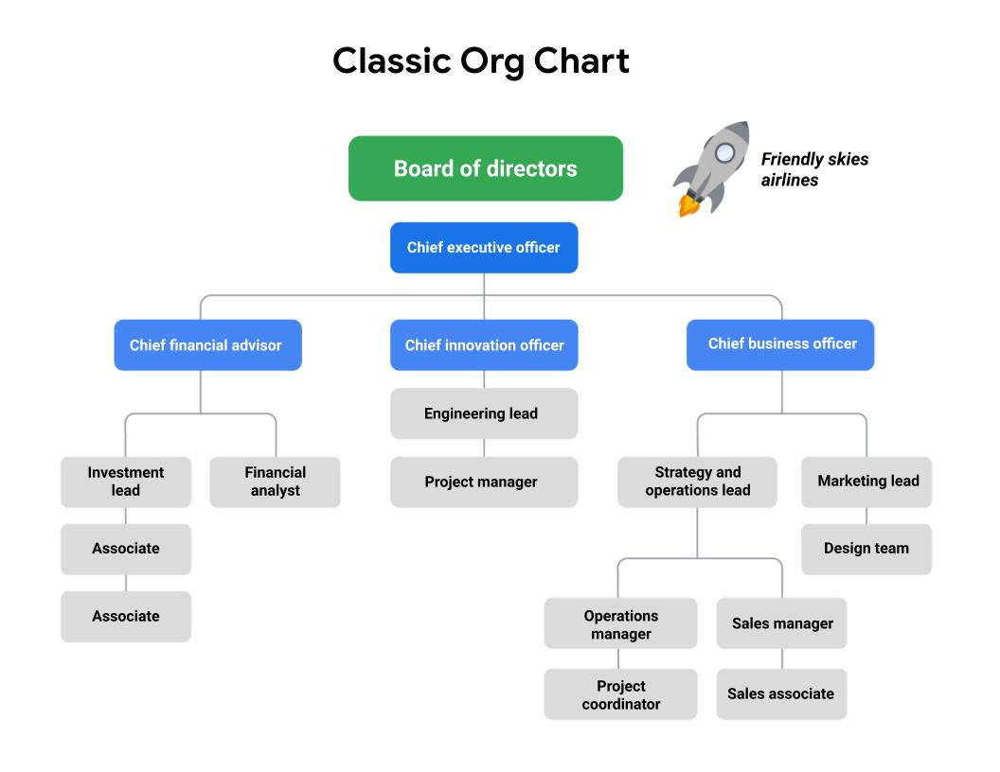
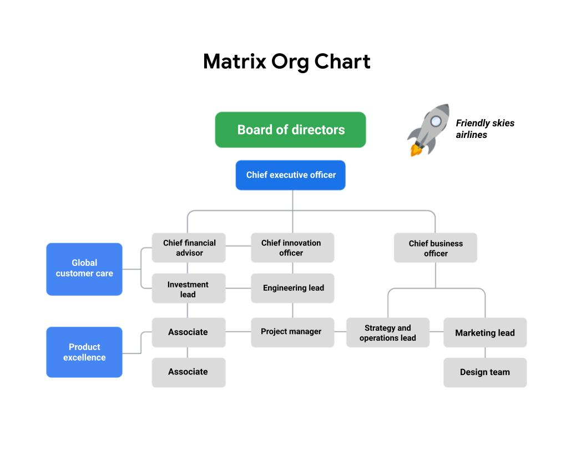

You will learn about common-常见的 organizational-组织的 structures-结构,构造 and how they impact project management, how organizational culture-文化,文明 impacts project management, and how a project manager contributes-贡献 to the change management process.

> 您将了解常见的组织结构以及它们如何影响项目管理，组织文化如何影响项目管理，以及项目经理如何为变更管理过程做出贡献。

Optionally-随意地, you can start to develop your strategy and professional network to help you prepare for your job search.

> 或者，你可以开始制定你的策略和专业网络来帮助你为找工作做准备。

**学习目标**

- Define change management and summarize its relationship to the project management role.

	> 定义变更管理并总结其与项目管理角色的关系。

- Define organizational culture and explain how it impacts project management.

	> 定义组织文化并解释它如何影响项目管理。

- Identify common types of organizational structures.

	> 确定常见的组织结构类型。

- Define organizational structure and explain how it impacts project management.

	> 定义组织结构并解释它如何影响项目管理。

# Understanding organizational structure

> 了解组织结构

## Introduction-引言: Organizational structure and culture - 1min

> 引言：组织结构和文化

Hey there, how are you feeling so far? We're nearing the end of this course.

> 嘿，到目前为止你感觉怎么样?这门课快结束了。

And honestly, you've done a great job.

> 老实说，你做得很好。

Previously-以前地,先前地, we talked about the life cycle of a project, the task breakdown of phases, and some different methodologies you can use as a project manager to help ensure your project success.

> 前面，我们讨论了项目的生命周期、阶段的任务分解，以及作为项目经理可以使用的一些不同的方法，以帮助确保项目成功。

You also heard from my colleagues-同事,同僚 about some of the ways we manage projects at Google.

> 你们也从我的同事那里听到了我们在谷歌管理项目的一些方法。

Here, you'll learn about organizational structure and culture and how they impact the way you set up and execute your project. 

> 在这里，您将了解组织结构和文化，以及它们如何影响您设置和执行项目的方式。

I'll describe some common types of structures that you're likely-可能 to encounter-经历,体验 during your project management career.

> 我将描述您在项目管理职业生涯中可能遇到的一些常见类型的结构。

You'll also learn about change management, which refers to the way you present-展示 the final project to the organization and get them to accept and implement your project outcome.

> 您还将学习变更管理，它指的是您向组织展示最终项目并让他们接受和实施您的项目结果的方式。

These are important elements to ensure that your project is adopted-采取,采纳 and lives on-继续存在.

> 这些都是确保您的项目被采用并继续存在的重要元素。

Are you ready? Let's get into these concepts.

> 你准备好了吗?让我们深入了解这些概念。

## Overview of Classic-典型的,有代表的 and Matrix-矩阵 structures - 5min

> 经典和矩阵结构概述

Welcome back.

> 欢迎回来

In this video, I'm going to talk about the concept-概念 of organizational structure and the project manager's role within a given structure.

> 在这个视频中，我将讨论组织结构的概念和项目经理在给定结构中的角色。

Keep in mind that your role won't be the same for every team or organization, because many companies are structured differently.

> 记住，你的角色在每个团队或组织中都是不一样的，因为许多公司的结构是不同的。

But this overview will serve as a foundation for wherever you work.

> 但无论您在哪里工作，这个概述都可以作为基础。

So what is organizational structure?

> 那么什么是组织结构呢?

Organizational structure refers to the way a company or organization is arranged-安排,布置 or structured.

> 组织结构是指公司或组织的安排或结构方式。

This structure also tells you how job tasks are divided-分配 and coordinated-协调 and how all the different members of the organization relate to one another.

> 此结构还告诉您工作任务是如何划分的(和协调的)，以及组织的所有不同成员之间是如何相互关联的。

In other words, organizational structure gives you a sense of who reports to who.

> 换句话说，组织结构给你一种谁向谁报告的感觉。

But organizational structure is much more than that.

> 但组织结构远不止于此。

Understanding the different types of organizational structures can serve as a map to help you determine where you fit in, who you should communicate with, and how frequently to communicate with them.

> 了解不同类型的组织结构可以作为一个地图，帮助您确定您适合的位置，您应该与谁沟通，以及与他们沟通的频率。

Now that we have a basic overview of the definition of organizational structure, let's look at the various organizational hierarchies-层级, 分类 that you may encounter-经历,体验 at work.

> 现在我们对组织结构的定义有了一个基本的概述，让我们来看看你在工作中可能遇到的各种组织层次结构。

An organization's structure is most commonly mapped out using a reporting chart or "org chart," which is short for "organizational chart."

> 一个组织的结构通常是用报告图表或“组织结构图”来绘制的，组织结构图是“组织结构图”的缩写。

Reporting charts show the relationship between people and groups within the organization, and details who each person or group reports to.

> 报告图表显示了组织内人员和组之间的关系，以及每个人或组向谁报告的详细信息。

There are a few different types of organizational structures.

> 有几种不同类型的组织结构。

But for this course, we're going to focus on two of the more popular ones: Classic-经典的 and Matrix-矩阵.

> 但在本课程中，我们将重点关注两个更受欢迎的:经典和矩阵。

---

Let's start with Classic.

> 让我们从经典开始。

The Classic grouping includes what are usually called "functional-功能性" or "top-down-自顶向下" structures.

> 经典的分组包括通常被称为“功能性”或“自上而下”的结构。

The Classic grouping follows a typical-典型的,有代表性的 chain of command-命令 where the Chief-首席的 Executive Officer-军官, also known as CEO, and other executives-高管 are at the top, followed by directors-董事 or managers, then their direct reports and so on.

> 经典组遵循一个典型的命令链，其中首席执行官(也称为CEO)和其他高管在顶部，其次是董事或经理，然后是他们的直接报告，等等。

Each of these directors or managers typically-一般,通常 oversee teams within their function-职责 of the organization, like marketing, sales, or human resources.

> 这些主管或经理中的每一个通常都在组织的职能范围内监督团队，比如市场营销、销售或人力资源。

You can see this type of structure in effect by looking at a branch of the military-军队的.

> 你可以通过观察军队的一个分支来看到这种结构的效果。

Take the Army-军队, for example.

> 以军队为例。

You may enter-进入 the Army as a private-二等兵, and report up to a sergeant-中士 who oversees multiple people in your squad-分队, and that sergeant-中士 ultimately-最终,最后 reports up to a lieutenant-中尉 and so on.

> 你可以以列兵的身份进入军队，向一个中士汇报，这个中士负责监督你所在小队的多人，而这个中士最终向中尉汇报，以此类推。

If your organization works in this structure, as the project manager, you might communicate regularly with your manager, the person directly above-高于 you, and also with your peers who work on the same types of projects as you.

> 如果您的组织在这种结构中工作，作为项目经理，您可能会定期与您的经理(您的直接上级)以及与您从事相同类型项目的同事进行沟通。

---

There isn't always a straightforward-直接的,简单的,易懂的, top-down approach.

> 并不总是有一种直接的、自上而下的方法。

There are other factors at play that make organizational structures a bit more complicated-使复杂化 than we can see on paper.

> 还有其他因素在起作用，使组织结构比我们在纸上看到的要复杂一些。

For instance, you may have project teams that sit across-跨越,遍及 different functions-职责.

> 例如，您可能有跨多个不同职能部门的项目团队。

This is common-常见的 in many companies, Google included, and is usually referred to as the Matrix structure.

> 这在包括谷歌在内的许多公司都很常见，通常被称为矩阵结构。

You might think of a Matrix structure as a grid-网格 where you still have people above-高于 you, but you also have people in adjacent-邻近的 departments-部门 who expect-期待,预计 to hear updates on your work progress-进步,进展.

> 您可能会认为矩阵结构是一个网格，在这个网格中，您的上级仍然有人，但您也有相邻部门的人希望听到您的工作进度的更新。

These people may not be your direct bosses, but you are responsible for communicating with them, since they may inform changes to your work.

> 这些人可能不是你的直接上司，但你有责任与他们沟通，因为他们可能会通知你工作中的变化。

For example, at Google, we have the major-主要的 functions-职能 of marketing, sales, and more, with the traditional reporting chain.

> 例如，在谷歌，我们有市场营销、销售等主要职能，还有传统的报告链。

But we also have programs for our products, like Google Search, where project teams consist-由……组成 of program managers, engineers, user experience-体验 or "UX" designers, and so on, and each team member reports to their own management chains.

> 但是我们也为我们的产品制定了程序，比如Google Search，其中的项目团队由程序经理、工程师、用户体验或“UX”设计师等组成，每个团队成员向他们自己的管理链报告。

Another example is my organization.

> 另一个例子是我的组织。

It's called Global-全球的 Affairs-事务.

> 它叫做全球事务。

I have a direct manager who oversees the work I do and my core role and who is responsible for delivering my **performance-业绩,工作情况,表现 reviews**-绩效评估.

> 我有一个直接的经理，他监督我所做的工作和我的核心角色，并负责提交我的绩效评估。

But because I work with multiple people across-遍及 other teams and specialties-专业,专长, I often-常常,时常 get asked to manage projects where I'm informally working with lead program managers in other organizations.

> 但是因为我与其他团队和专业的多人一起工作，我经常被要求管理我与其他组织的主要项目经理非正式合作的项目。

Similar to my own manager, I provide updates to that program manager, seek-寻找,寻求 their approval, and solicit-征求,索求 feedback on our partnership and progress-进展.

> 与我自己的经理类似，我向项目经理提供最新情况，寻求他们的批准，并征求关于我们的伙伴关系和进展的反馈。

So to recap, the Classic structure follows a traditional, top-down system of reporting, and the Matrix structure has direct higher-ups-上级,上司 to report to and stakeholders from other departments or programs.

> 综上所述，经典结构遵循传统的，自上而下的报告系统，矩阵结构有直接的上级报告和其他部门或项目的利益相关者。

Knowing which kind of organizational structure you're working in plays a major role in how you prepare for and **carry out**-执行,实施 your project or even in an interview-面试.

> 了解你所处的组织结构对你如何准备和执行你的项目，甚至在面试中都起着重要的作用。

During an interview, you can ask about the type of organizational structure the company uses and where your role will fit in.

> 在面试中，你可以询问公司采用的组织结构类型以及你的角色适合在哪里。

This will help you and the interviewer communicate clearly about the people you will engage with daily, and the expectations-期待,预期 for the role.

> 这将有助于你和面试官清楚地沟通你每天要接触的人，以及对这个职位的期望。

In the next course, you'll hear from a Googler about a third type of structure, Project Management Office, which you might see in some of the organizations where you work or interview. Enjoy.

> 在接下来的课程中，你会听到一位谷歌员工讲述第三种结构，项目管理办公室，你可能会在你工作或面试的一些组织中看到这种结构。享受。

## A project manager's role within different organizational structures - 20min 阅读资料

> 项目经理在不同组织结构中的角色

In the last video, you learned about the way a company is arranged-安排,布置, which is called **organizational structure**.

> 在上一个视频中，你学习了公司的组织方式，也就是所谓的组织结构。

You also learned that two of the most common organizational structures are **Classic** and **Matrix**. 

> 您还了解了两种最常见的组织结构是Classic和Matrix。

---

Understanding the differences in Classic and Matrix organizational structures can help you ask questions during a job interview to fully-充分地,完全地 understand the role and responsibilities you are considering.

> 了解经典组织结构和矩阵式组织结构的区别可以帮助你在面试中提出问题，充分了解你正在考虑的角色和责任。

This will also help you understand which skills will be most important for you to have if you get the position. 

> 这也会帮助你了解如果你得到这个职位，哪些技能对你来说是最重要的。

---

Once you are hired into a role, knowing a company’s organizational structure can help you identify key points of communication and key stakeholders.

> 一旦你被录用，了解公司的组织结构可以帮助你确定沟通的关键点和关键的利益相关者。

It can also help you navigate-导航,引路 within the organization when you need support or need to determine who has authority-权利,权限 in a certain situation-情况,形势.

> 当您需要支持或需要确定在特定情况下谁拥有权力时，它还可以帮助您在组织中导航。

Let’s examine-检查,调查 the characteristics-特征,特点 of each of these organizational structures in greater depth so you can identify the type of structure an organization has and how to navigate-驾驭 it as a project manager. 

> 让我们更深入地检查每一个组织结构的特征，这样您就可以确定组织结构的类型，以及作为项目经理如何驾驭它。

---

**Classic organizational structures**

> 典型的组织结构

The **Classic organizational structure** is a top-down hierarchy-等级体系 system, where a Chief Executive Officer (CEO) has direct authority-权利,权限 over several-不同的 department managers.

> 经典的组织结构是自上而下的等级制度，其中首席执行官(CEO)对几个部门经理有直接的权力。

The department manager has direct authority over several other sections-部分 of employees.

> 部门经理直接管理其他几个部门的员工。

This system requires communication both up and down the ladder-阶梯.

> 这个系统需要上下级的沟通。

In a Classic structure, authority comes from the top and filters to the bottom.

> 在一个经典的结构中，权威来自于上层，然后向下过滤。

Frequent reporting of project status updates may be required to **pass up**-把……向上递 through management levels to keep higher leaders informed. 

> 可能需要频繁报告项目状态更新，以便通过管理层向上级领导通报情况。

---

Classic organizations are also referred to as **functional** **organizations** because the organization is divided-划分,分配,分割 into departments based on function.

> 经典组织也被称为职能组织，因为组织根据职能划分为部门。

Each department is led-领导 by a **functional manager**, and employees are grouped **according to**-根据,依据 the functions of their role.

> 每个部门由一名职能经理领导，员工根据其角色的职能进行分组。

For example, the main function of Friendly Skies Airlines, an airline-航空公司 company, is to fly-操纵,驾驶 airplanes.

> 例如，友好天空航空公司(Friendly Skies Airlines)是一家航空公司，其主要职能是驾驶飞机。

There are typically-典型的 departments logically-逻辑上,合乎逻辑 arranged-安排,整理,布置 to fulfill-履行,实现,满足 other important company functions, such as Marketing, Human Resources, and Strategy.

> 有一些典型的部门按照逻辑安排来履行其他重要的公司职能，如市场营销、人力资源和战略。

Employees usually have a specialty-专业,专长,特产 within the organization and may not work within other areas during normal everyday operations. 

> 员工通常在组织中有一个专业，在正常的日常运作中可能不会在其他领域工作。

**Managing a project in a Classic organization**

> 在一个经典组织中管理一个项目

Friendly Skies Airlines has a Classic organizational structure, as indicated-表明,指示,指出 by its reporting or “org” chart.

> 友好天空航空公司有一个经典的组织结构，如其报告或“组织”图所示。

Imagine that the Friendly Skies Airlines Board of Directors-董事 approves an initiative-措施,倡议 to retrofit-改进,更新 existing airplanes to carry-携带 more passengers-乘客,旅客.

> 想象一下，友好天空航空公司董事会批准了一项改造现有飞机以运载更多乘客的倡议。

The CEO sponsors-赞助,促成 a project team to redesign-重新设计 the airplanes.

> 首席执行官赞助了一个项目团队来重新设计飞机。

The project will be led by a project manager from the Engineering and Innovation-革新,创新 department and will require representatives-代表 from Finance, Marketing, Strategy, and Operations, **along with**-连同,伴随 several other team members from the Design department, to successfully complete the project. 

> 该项目将由来自工程和创新部门的项目经理领导，并需要来自财务、营销、战略和运营的代表，以及来自设计部门的其他几名团队成员，以成功完成该项目。

---

The project team will typically-一般,通常,典型的 remain-保持不变 in their reporting lines but act-行动 as their own assembled-组装,集合,聚集 team.

> 项目团队通常保持在他们的报告线中，但作为他们自己的组装团队。

They do not fall under any of the existing functional departments.

> 它们不属于任何现有的职能部门。

In the Classic organizational structure, the project builds from already existing departments to form teams. 

> 在经典的组织结构中，项目从已经存在的部门构建成团队。

---

If you are a project manager in this type of structure, you may need to consult-咨询,请教 with functional managers to understand your resources and the capacity-能力,才能 of each teammate, as well as to familiarize-使了解,使熟悉 yourself with each function’s internal processes and approval structure.

> 如果您是这种类型结构中的项目经理，您可能需要咨询职能经理，以了解您的资源和每个团队成员的能力，以及熟悉每个职能的内部流程和批准结构。

Your authority-权利,权限 may be slightly-稍微,轻微地 limited **due to**-由于 competing-竞争 priorities, approval chains, and other complexities-复杂性, but setting expectations up front will enable you to navigate-驾驭,处理,导航 the organization and execute your project successfully.

> 由于竞争的优先级、批准链和其他复杂性，您的权限可能会受到轻微的限制，但是预先设定期望将使您能够驾驭组织并成功地执行项目。

**Matrix organizational structures**

> 矩阵组织结构

The **Matrix** structure differs-不同于 from the Classic structure in that the employees have two or more managers.

> 矩阵结构与经典结构的不同之处在于，员工有两个或两个以上的管理者。

In Matrix structures, you still have people above-高于 you, but you also have people in adjacent-邻近的 departments with whom you will need to communicate on your work progress.

> 在矩阵式结构中，你仍然有人在你的上面，但你也有相邻部门的人，你需要与他们就工作进展进行沟通。

Functional areas tend to cross-穿越,交叉 paths more frequently, and depending on the nature of the work, the responsible manager for each area has the most authority-权利. 

> 职能区域往往更频繁地交叉路径，并且根据工作的性质，每个区域的负责经理拥有最大的权力。

---

As a project manager in a Matrix organization, a team will essentially-本质上,根本上 have **at least**-至少 two chains of command, or managers.

> 作为一个矩阵式组织中的项目经理，一个团队本质上至少有两个命令链，或者经理。

You can think of the project manager as being a temporary manager while assigned to the team.

> 您可以将项目经理视为分配给团队的临时经理。

The functional manager is consistent-始终如一的,一贯的 regardless-不管怎样,无论如何 of the project a project manager is supporting.

> 无论项目经理支持哪个项目，职能经理都是一致的。

The visual-视觉资料,视觉的,视力的 below-在下面 illustrates-阐明 what the Friendly Skies Airlines would look like if it had a Matrix organizational structure.

> 下图展示了友好天空航空公司如果采用矩阵式组织结构会是什么样子。

**Managing a project in a Matrix organization**

> 在矩阵式组织中管理项目

Imagine that Friendly Skies Airlines is organized in a Matrix structure.

> 想象一下友好天空航空公司是按矩阵结构组织的。

Their Product Excellence-杰出,卓越 team develops a new amenity-便利设施 kit-成套设备 for long-haul-长途的 flights-航班.

> 他们的产品卓越团队为长途航班开发了一种新的便利套件。

They ask the Project Manager to help gather marketing materials that present research data about how this product fulfills-履行,实现,满足 passenger-乘客,旅客 desires-欲望,渴望.

> 他们要求项目经理帮助收集市场营销材料，提供有关该产品如何满足乘客需求的研究数据。

The Project Manager is working **on behalf of**-代表 the Product Excellence team, but they are able to work in partnership-合伙 with the Marketing team to create these materials. 

> 项目经理代表产品卓越团队工作，但他们能够与营销团队合作创建这些材料。

---

You can read more about an overview of Matrix organizations in this [PMI article](https://www.pmi.org/learning/library/matrix-organization-structure-reason-evolution-1837).

> 您可以在这篇[PMI文章](https://www.pmi.org/learning/library/matrix-organization-structure-reason-evolution-1837)中阅读更多关于矩阵式组织的概述。

**Key takeaway**

> 关键要点

In both Classic and Matrix organizations, project managers must clearly define roles and responsibilities in order to work effectively.

> 在经典组织和矩阵组织中，项目经理必须清楚地定义角色和职责，以便有效地工作。

However, within most Matrix organizations, some project managers or department leads may have the same level of authority-权利 as the functional managers and operate more directly.

> 然而，在大多数矩阵组织中，一些项目经理或部门领导可能拥有与职能经理相同级别的权力，并且更直接地操作。

---

Now you know how to identify Classic and Matrix organizational structures, how project managers fit into them, and how an organization’s structure may affect projects.

> 现在您知道了如何识别Classic和Matrix组织结构，项目经理如何适应它们，以及组织结构如何影响项目。

You are well on your way to becoming a great project manager in any organizational structure! 

> 在任何组织结构中，你都有可能成为一名出色的项目经理!

## How organizational structure impacts project management

> 组织结构如何影响项目管理

Hey again, ready to keep going?

> 嘿，准备好继续了吗?

The previous videos explained that knowing what kind of organizational structure you're working in plays a major role in how you prepare for and **carry out**-执行,实施 your project.

> 前面的视频解释了了解你所处的组织结构对你如何准备和执行你的项目起着重要的作用。

An organization's structure provides the framework for accountability and communication.

> 组织的结构为责任和沟通提供了框架。

As the project manager, it's vital-至关重要的,必不可少的 that you understand who you're reporting to on each project, and **just as**-正如 importantly, who the members of your team report to.

> 作为项目经理，了解在每个项目中你向谁报告是至关重要的，同样重要的是，你的团队成员向谁报告。

Knowing the organizational structure also tells you how and where to get the resources you'll need so you can get the project done efficiently.

> 了解组织结构还可以告诉您如何以及从哪里获得所需的资源，从而有效地完成项目。

When you understand the organization's structure, you'll be able to identify how it impacts the way you manage the project.

> 当您了解组织的结构时，您将能够确定它如何影响您管理项目的方式。

One way organizational structure can impact the way you manage a project is by the amount of authority given to the project manager.

> 组织结构影响项目管理方式的一种方式是通过授予项目经理的权限。

Authority has to do with your ability to make decisions for the project that impact the organization.

> 权限与您为影响组织的项目做出决策的能力有关。

In some cases, you might have the authority to do things like select the vendors who provide services or goods-商品 for the project. 

> 在某些情况下，您可能有权做一些事情，比如选择为项目提供服务或商品的供应商。

Other times, you might have a set of vendors selected for you.

> 其他时候，您可能会有一组为您选择的供应商。

Your level of authority and responsibility will vary-不同,呈现差异,改变,变化 from project to project.

> 您的权限和责任级别将因项目而异。

Another way organizational structures can impact project management is through resource availability.

> 组织结构影响项目管理的另一种方式是通过资源可用性。

Managing a project is a lot easier when you know how to access-获取,访问 the people, equipment-设备,用具, and budget that you need.

> 当你知道如何获得所需的人员、设备和预算时，管理一个项目会容易得多。

---

Let's explore how different structures can affect the way you manage a project.

> 让我们来探讨不同的结构如何影响您管理项目的方式。

In a Classic structure, you might find yourself with less authority and a tighter-更紧的,更严格的 scope.

> 在Classic结构中，您可能会发现自己的权限更少，范围更紧。

You may need to rely-相信,依靠 on getting approval-批准,许可 from the appropriate-合适的,相称的 managers, directors, and department heads in order to move forward and complete certain tasks.

> 你可能需要得到适当的经理、主管和部门主管的批准，才能向前推进并完成某些任务。

In this case-具体情况, it's likely-大概,很可能 that these people are in charge-使…承担责任 of the people on your team and the resources you need.

> 在这种情况下，这些人很可能负责管理团队中的人员和所需的资源。

As a project manager working in a Classic structure, you may depend on the managers in your organization to approve resources.

> 作为在典型的结构中工作的项目经理，您可能依赖于组织中的经理来批准资源。

In other words, the amount of people working on your project or the budget that you have allocated-分配,分派 to your project is decided by the leaders of your department or function.

> 换句话说，在你的项目中工作的人数或你分配给项目的预算是由你的部门或职能部门的领导决定的。

In a Classic structure, you may have to **go through**-经历 a chain of approvals and advocate-拥护,提倡 for more resources if you need them.

> 在经典的结构中，如果需要的话，您可能必须经过一连串的审批，并要求提供更多的资源。

For example, if you need a budget increase, you would report this to your manager.

> 例如，如果你需要增加预算，你会向你的经理报告。

Then your manager might escalate-升级,迅速增加 this up to their management chain to get approval.

> 然后，你的经理可能会把这个问题上报给他们的管理链，以获得批准。

That's the Classic structure; a traditional top-down arrangement-安排,筹备 of employees and authority.

> 这是经典结构;传统的自上而下的员工和权力安排。

---

Now, let's explore the Matrix structure.

> 现在，我们来研究一下矩阵结构。

The main difference with a Matrix structure is that employees often have two or more managers or leaders they'll need to work with and update.

> 与矩阵式结构的主要区别在于，员工通常有两个或更多的经理或领导，他们需要与之合作和更新。

Your team members will have their functional manager and you, the project manager.

> 你的团队成员将有他们的职能经理和你，项目经理。

If members are working on multiple projects, they may have even more managers.

> 如果成员在多个项目上工作，他们可能会有更多的经理。

This can affect your authority as a project manager, as you will need to cooperate-合作,协作 with more than one leader in the organization. 

> 这可能会影响您作为项目经理的权威，因为您需要与组织中的多个领导者合作。

You may need to share resources and negotiate-解决,商定 priorities.

> 你们可能需要共享资源和协商优先事项。

The key is to make sure you know who your stakeholders are and who controls what since the chain of command isn't always as clearly defined as in the Classic structure.

> 关键是要确保你知道谁是你的利益相关者，谁控制着什么，因为命令链并不总是像在经典结构中那样清晰地定义。

Because there isn't always a clear chain of command in a Matrix structure, you need to make sure you have identified and communicated with anyone you might need to report to and get approval from well before the project begins.

> 因为在矩阵结构中并不总是有一个清晰的命令链，所以您需要确保在项目开始之前就已经确定并与您可能需要报告的任何人进行沟通并获得批准。

Once this is established-建立,设立 though, your project within a Matrix structure should be able to run efficiently.

> 一旦建立了这一点，您的项目在矩阵结构应该能够有效地运行。

Matrix structures emphasize-强调,着重 a strong project focus from the team and the organization.

> 矩阵结构强调团队和组织对项目的强烈关注。

You as the project manager, generally have more autonomy-独立自主,自主权 to make decisions and gather resources as needed.

> 作为项目经理，你通常有更多的自主权来做决定和收集所需的资源。

As I hope you've noticed, the way an organization is structured can have a big impact on the planning and execution of your project.

> 正如我希望您已经注意到的那样，组织的结构方式对项目的计划和执行有很大的影响。

Understanding all of this will help you run and manage a project much more efficiently.

> 了解所有这些将有助于您更有效地运行和管理项目。

Next, I'll tell you about organizational culture, another factor that impacts how you manage your project. Catch you in a bit.

> 接下来，我将告诉您组织文化，这是影响您如何管理项目的另一个因素。一会儿见。

## The role of a Project Management Office

> 项目管理办公室的角色

In this lesson, you are learning about different types of organizational structures.

> 在这节课中，你将学习不同类型的组织结构。

Project managers serve-提供 key functions in both Classic and Matrix organizations.

> 项目经理在经典组织和矩阵式组织中都发挥着关键作用。

Within both of these types of structures, there is sometimes-有时 a group devoted-献身,致力 specifically-专门地 to program-规划 management with the organization: the **Project Management Office.**

> 在这两种类型的结构中，有时会有一个专门负责组织规划管理的小组：项目管理办公室。

In this reading, we will discuss the purpose-目的,目标 and functions of a Project Management Office.

> 在这篇文章中，我们将讨论项目管理办公室的目的和功能。

**What is a PMO?**

> 什么是项目管理办公室？

A Project Management Office, or PMO, is a group within an organization that defines, sets-设置, and helps maintain-保持,维持 project management standards-标准,水平 and processes throughout that organization.

> 项目管理办公室(PMO)是组织内定义、设置并帮助维护整个组织的项目管理标准和过程的一个小组。

It often acts-表现,行动 as a coordinated center for all of the organization’s projects, helping them run more smoothly and efficiently.

> 它经常作为组织所有项目的协调中心，帮助它们更顺利、更有效地运行。

---

An organization’s project managers may operate-工作 within the PMO itself or within other departments.

> 组织的项目经理可以在项目管理办公室内部工作，也可以在其他部门内部工作。

At Google, for example, there are project managers who work in a PMO focused on operational-运营的 excellence-杰出,卓越, but there are numerous-众多的,许多的 project and program managers in other departments throughout the organization, as well.

> 例如，在Google，有项目经理在PMO工作，专注于卓越的运营，但在整个组织的其他部门也有大量的项目和计划经理。

**What are the functions of a PMO?**

> 项目管理办公室的职能是什么?

PMOs offer-提供,给予 guidance-指导,指引 and support to their organization’s project managers.

> PMO 为组织的项目经理提供指导和支持。

They share best practices, project statuses, and direction-方向,趋势,动向 for all of the organization’s projects while often **taking on**-承担 strategic-重要的,战略性的 projects themselves.

> 他们分享组织所有项目的最佳实践、项目状态和方向，同时经常自己承担战略项目。

---

The main functions of a PMO include:

> 项目管理办公室的主要职能包括:

**Strategic-重要的,战略的 planning and governance-管理方法**

> 策略规划及管治

This is the most important function of a PMO.

> 这是项目管理办公室最重要的功能。

This involves defining project criteria-标准,尺度, selecting projects **according to**-根据,依据 the organization’s business goals, and then providing a business case for those projects to management-管理层. 

> 这包括定义项目标准，根据组织的业务目标选择项目，然后为这些项目提供业务案例给管理层。

**Best practices**

> 最佳实践

PMOs help implement best practices and processes within their organization.

> PMO 帮助在其组织内实现最佳实践和过程。

They also share lessons-经验,教训 learned from previous successful projects.

> 他们还分享了从以往成功项目中吸取的经验教训。

They help ensure consistency among-彼此间 their organization’s projects by providing guidance about processes, tools, and metrics-度量.

> 他们通过提供关于过程、工具和量度的指导来帮助确保组织项目之间的一致性。

**Common project culture** 

> 共同项目文化

PMOs help set common project culture practices by training employees about optimal-最佳的,最适的 approaches and best practices.

> PMO 通过培训员工关于最佳方法和最佳实践来帮助建立共同的项目文化实践。

This helps keep project management practices consistent and efficient-有效的,生效的 across-遍及 the entire organization. 

> 这有助于在整个组织中保持项目管理实践的一致性和有效性。

**Resource management**

> 资源管理

PMOs are often responsible for managing and allocating resources—such as people and equipment—across projects throughout the organization based on budget, priorities, schedules, and more.

> PMO 通常负责管理和分配资源——比如人员和设备——基于预算、优先级、时间表等，跨整个组织的项目。

They also help define the roles and responsibilities needed on any given project.

> 它们还有助于定义任何给定项目所需的角色和职责。

PMOs provide training, mentoring-指导, and coaching to all employees, but project managers **in particular**-尤其,特别. 

> PMO 为所有员工提供培训、指导和指导，但项目经理尤其如此。

**Creation of project documentation, archives-存档材料, and tools**

> 创建项目文档、档案和工具

PMOs invest-投资,投入 in and provide templates, tools, and software to help manage projects.

> PMO 投资并提供模板、工具和软件来帮助管理项目。

They also play an important role in maintaining their organization’s project history.

> 他们在维护组织的项目历史中也扮演着重要的角色。

Once a project closes, they archive all of the documents created during the project for future reference and to capture-获取,捕获 lessons learned.

> 一旦项目结束，他们将在项目期间创建的所有文档存档，以备将来参考和获取经验教训。

**Key takeaway**

> 关键要点

To recap, the key purposes of a PMO include: strategic-战略的 planning and governance-管理方法, implementing project management best practices, establishing-建立,设立 common project culture, resource management, and creating project documentation, archives, and tools. 

> 概括地说，PMO的主要目的包括：战略计划和治理，实现项目管理最佳实践，建立公共项目文化，资源管理，以及创建项目文档、档案和工具。

PMOs support their organizations in managing large numbers of projects and help keep all employees working in the same direction-目标,方向 towards the organization’s goals. 

> PMO 支持他们的组织管理大量项目，并帮助所有员工朝着组织目标的同一方向工作。

## Lan: Working in a Project Management Office - 3min

> 伊恩:在项目管理办公室工作

Hi, I'm Lan. I'm a Director of Program Management at Google. A program management director has a team of project managers to help execute and bring products to our users. I work on the project management team or the PMO team for a group called "Geo." And in Geo we bring geospatial products to our users. Things like Google Maps and Google Earth. And the team that I'm a part of actually works on all of the data and imagery that powers all of those products. A Project Management Office is a team of project managers. We are a group that coordinates all of the different parts of a project together, including folks who work on our product, engineers, and many business functions, and we help bring all of those ideas to life. My role specifically in working in a PMO is ensuring that we're connecting all of the different parts that are associated with projects to ensure that they are all connected together. Sometimes we find out when projects are happening, there's a piece of it here and a piece of it there, and they may not even know about each other. One of the most critical things that Project Managers get to do is they get to have a bird's eye view of everything that's happening in a project. So that's a lot of my role, and what I'm working on with my team is ensuring that all of the pieces that need to connect together actually do connect together. I've had many different roles inside of many different PMOs inside my career. All the way from taking just a piece of a part of a project when I was really early in my career, and then expanded that into taking a full end-to-end project which were smaller. And then building up my career and then moving it to really large, complex projects. And at each stage of these I have loved every piece of it. So even from the time that I had only a part of a project, I got to go really deep inside of some of those technologies and have really deep and meaningful relationships with the teams that I have been working with. And that's not always possible when you're working on a really large project that has hundreds of people. You won't be able to develop deep relationships across that large group. On the flip side, when you're working on a large, complex project, you get to see all of the different gears turning inside of a large ecosystem of things that are happening. But that took a long time in my career to build up, but at each phase of it, I realized I was learning a little bit more. And I was learning how to work a little bit more broadly and think a little bit more differently. But really ensuring how do you continue to keep the execution and rigor of a project to ensure that ideas were coming to life. One of the biggest benefits I see in working in a PMO is that you get to share a lot of best practices with each other. One of the downsides, I think for project management, is typically we don't get to work with each other because we're working with a lot of client teams and we're working with other disciplines. But a huge benefit of working in a PMO is that you get to connect with other project managers, where you can share your challenges and see how somebody else had gotten through it. Or you can share templates or tools that you may take time to develop on your own, but somebody else already has handy, so you can borrow or just steal their tool for your own use. But the best part is you have a community of people who think the same way about problems in a very methodical, in a very task-oriented, in a very action-oriented and goal-oriented way, which is not typically true if you're working across all other disciplines all the time.

# Understanding the impact of organizational culture

> 了解组织文化的影响

## Introduction to organizational culture - 6min

> 介绍组织文化

Hey again, let's begin with two **quick questions**-简短问题.

> 再一次，让我们以两个简短的问题开始。

What do you know about culture, and how do you define culture?

> 你对文化了解多少？你是如何定义文化的？

When I hear the term culture, the first things that **come to mind**-浮现在心头 are things like languages, food, clothing-服装, and types of dress-服装.

> 当我听到文化这个词时，我首先想到的是语言、食物、服装和服装类型。

It's important to note-注意 that there are other, maybe less obvious-明显的, but just as impactful-有效的,有影响力的 parts of culture like beliefs-信念,观点, traditions-传统,惯例, and customs-风俗,习俗.

> 重要的是要注意，还有其他可能不太明显，但同样有影响力的文化部分，如信仰、传统和习俗。

When we learn about someone's culture, we gain a much deeper-更深 insight-洞悉,了解 and more **complete picture**-完整画面 into who they are and how they navigate-驾驭,驾驶 the world.

> 当我们了解一个人的文化时，我们就能更深入、更全面地了解他们是谁，以及他们是如何驾驭世界的。

The same can be true for organizations.

> 这同样适用于组织。

An organization's culture provides context-背景,环境 and acts-行为,行动 as a guide for what their people value-重视, how they operate on a daily basis, how they relate to one another, and how they can be expected-期待 to perform-执行,履行,表现.

> 一个组织的文化提供了背景，并作为指导，指导他们的员工重视什么，他们如何在日常基础上运作，他们如何相互联系，以及他们如何被期望执行。

There are many ways to define organizational culture.

> 定义组织文化的方法有很多。

Some definitions emphasize-强调,着重 teamwork-团队合作 and innovation-革新,创新, while others **focus on**-专注于 attention-注意,注意力 to detail and achievement-成绩,成就.

> 一些定义强调团队合作和创新，而另一些则强调对细节和成就的关注。

Entire thesis-论文 papers, workshops-研讨会, and conferences-会议 are dedicated-致力于,献身于 to defining and analyzing organizational culture.

> 整个论文、研讨会和会议都致力于定义和分析组织文化。

We only have a few minutes here, so I'll do my best to sum-概括,总结 it up.

> 我们只有几分钟的时间，所以我会尽量总结一下。

---

Organizational culture is **in part the values**-在某种程度上 employees share, **as well as**-以及,也,和 the organization's values, mission-职责,使命, history, and so on.

> 组织文化在某种程度上是员工共享的价值观，以及组织的价值观、使命、历史等等。

In other words, organizational culture can **be thought-想法,看法 of**-被认为 as the company's personality-魅力,品格,特色.

> 换句话说，组织文化可以被认为是公司的个性。

Understanding an organization's culture will help you navigate your team more effectively toward achieving the project's goal.

> 了解组织的文化将帮助您更有效地引导团队实现项目目标。

It also impacts the way you plan your project.

> 它还会影响你计划项目的方式。

You'll need to be familiar-熟悉的,常见的 with an organization's culture, so that you can minimize-使最小化 conflict-冲突,抵触 and complete the project with as much support and harmony-和睦,和谐 as possible.

> 你需要熟悉一个组织的文化，这样你才能最大限度地减少冲突，并在尽可能多的支持和和谐的情况下完成项目。

An organization's mission-使命,职责 and values can provide clues-线索,理解 to its culture.

> 一个组织的使命和价值观可以为其文化提供线索。

If you can demonstrate-证明,示范 how the project supports the company's mission or how the project aligns-使一致,调整 with the company's values, you'll have more support from executives-主管,经理 and stakeholders to get the approvals and resources you need.

> 如果你能证明项目是如何支持公司的使命，或者项目是如何与公司的价值观相一致的，你就会从高管和利益相关者那里得到更多的支持，从而获得所需的批准和资源。

Pay attention-注意,注意力 to what leaders in the organization value when conducting-实施,进行 business.

> 在开展业务时，要注意组织中的领导者看重什么。

Does the management team care about **speed over perfection-完美,完善**-速度重于完美?

> 管理团队是否更看重速度而不是完美?

How do people within the organization make decisions?

> 组织中的人是如何做决定的?

Do they thoroughly-完全地,彻底地 examine-检查,调查 every option for every decision?

> 他们是否对每个决定的每个选项都进行了彻底的检查?

This will help inform-告知,了解,熟悉 which values are the most important to them and how you can approach your decision-making-决策.

> 这将有助于告知哪些价值观对他们来说是最重要的，以及你如何进行决策。

If you're ever-一直,始终 stuck-无所变化的 in your project and need guidance about making a certain decision, or are unsure how to communicate with someone in the organization, reviewing the mission and values may help direct you toward the right way to handle that situation-情况,形势. 

> 如果你曾经在你的项目中陷入困境，需要指导来做某个决定，或者不确定如何与组织中的某人沟通，回顾任务和价值观可能会帮助你找到正确的方法来处理这种情况。

Here's an example.: if the company values stability-稳定性,坚定,恒心 and user feedback, it might encourage-鼓励,激励 expanding-扩大,扩展 the project timeline to allow for testing and then making decisions based on those testing results.

> 这里有一个例子。如果公司重视稳定性和用户反馈，它可能会鼓励扩展项目时间表，以便进行测试，然后根据这些测试结果做出决策。

If the company values innovation-革新,创新 and revenue-收入,收益 growth, it might encourage a shorter timeline to get the product out faster, and taking some risks to try out new ideas.

> 如果公司重视创新(即创新)和收入(即增长)，它可能会鼓励缩短时间以更快地推出产品，并承担一些风险来尝试新想法。

As a project manager, when you understand the different types of values, and what to prioritize, you'll have an idea of how you can better prepare for conversations-谈话,交谈 within the organization.

> 作为一个项目经理，当你理解了不同类型的价值，以及优先考虑什么时，你就会知道如何更好地为组织内的对话做准备。

Ideally-理想地, you'll want to have a good sense of an organization's culture before you start the first phase of your project.

> 理想情况下，在开始项目的第一阶段之前，您将希望对组织的文化有一个很好的了解。

If you are interviewing-面试 for a project management position, asking about the culture is a great way to get more information about the company.

> 如果你面试的是一个项目管理职位，询问公司文化是获得更多公司信息的好方法。

It also shows the interviewer that you're knowledgeable-有见识的,知识渊博的 about the impact culture can have on a project.

> 这也向面试官表明你了解文化对项目的影响。

---

To help you gain a better sense of an organization's culture, consider the following questions.

> 为了帮助你更好地了解一个组织的文化，请考虑以下问题。

How do people prefer-更喜爱 to communicate?

> 人们喜欢怎样交流?

Is it primarily-主要地 through scheduled-预先安排的 meetings, via-借助于 email, over the phone?

> 主要是通过预定的会议、电子邮件还是电话?

How are decisions made, majority-大多数 vote-投票 or top down approvals?

> 决策是如何做出的，多数投票还是自上而下的批准?

What kinds of rituals-习惯,仪式 are in place when someone new comes to the office?

> 当新员工来到办公室时，会有什么样的仪式?

Are they taken out to lunch, given a tour-观光,参观 of the building or introduced to the staff-全体员工?

> 他们会被带出去吃午饭、参观大楼或被介绍给员工吗?

How are projects typically-通常 run?

> 项目通常是如何运行的?

Do they prefer-更喜爱 a Classic, do they prefer Matrix, or some other style of project management?

> 他们更喜欢“经典”、“矩阵”还是其他风格的项目管理?

And finally, what kinds of practices, behaviors, and values are reflected-反映 by the people in the organization?

> 最后，组织中的人反映了什么样的实践、行为和价值观?

Is overtime-加班 or weekend work an expectation-期望,期待?

> 加班或周末加班是你的期望吗?

Are there company sanctioned-许可,批准,制裁 social-社交的,社会的 events?

> 是否有公司批准的社交活动?

Finding out what the company values, will tell you a lot about the culture.

> 了解这家公司的价值观，可以让你了解这家公司的文化。

And how to handle communication, manage expectations, and identify potential-潜在的,可能的 conflicts-抵触,冲突 as you work through your project.

> 以及在你的项目中如何处理沟通、管理期望和识别潜在的冲突。

Once you begin working on a project, here are some ways to navigate company culture that will help you **get the most out of**-充分利用 your team, and ensure that your project is supported.

> 一旦你开始一个项目，这里有一些方法来引导公司文化，将帮助你从你的团队中获得最大的收益，并确保你的项目得到支持。

As I just discussed, make sure to ask questions.

> 就像我刚才说的，一定要问问题。

As you observe-注意到,观察到 the culture, try asking your peers what they think is going well and what they would change.

> 当你观察公司文化时，试着问问你的同事，他们认为哪些进展顺利，哪些需要改变。

Your peers may have the same opinion-意见,看法 as you, and if not you may learn something new you didn't learn in the interview process. 

> 你的同事可能和你有相同的观点，如果没有，你可能会学到一些你在面试过程中没有学到的新东西。

Either-无论 way, you'll be in a better place to assess-评价,评定 risk, adjust your current project, or be more prepared for projects in the future.

> 无论哪种方式，您都可以更好地评估风险，调整当前项目，或者为未来的项目做好准备。

It's also a good idea to make observations.

> 观察也是个好主意。

It's important to understand how things work, and what people like and respect about the company's culture.

> 重要的是要了解事情是如何运作的，以及人们喜欢和尊重公司文化的哪些方面。

When working in different geographies-地理环境, it's also important to **be aware-知道的,明白的 of established-建立,设立 customs-习惯**-了解既定的习俗, like bowing-鞠躬, shaking hands, or wearing head coverings.

> 在不同地区工作时，了解当地的风俗习惯也很重要，比如鞠躬、握手或戴头巾。

This will help you gain understanding and form respectful-尊敬的 relationships.

> 这将有助于你获得理解并建立相互尊重的关系。

Lastly, it's important to understand your impact.

> 最后，了解你的影响力很重要。

Be aware of your role as a change-变化,变革 agent.

> 要意识到你作为变革推动者的角色。

A change agent is someone who helps the organization transform by focusing on improving-改善,变得更好 organizational effectiveness and development-发展.

> 变革代理人是通过专注于提高组织效率和发展来帮助组织变革的人。

You and your project will most likely affect the organization in some way.

> 你和你的项目很可能会以某种方式影响组织。

Sometimes just the presence-出席,出现 of a project manager creates changes in the office environment or employee dynamics-动力,活力.

> 有时候，仅仅是项目经理的出现就会改变办公室环境或员工的动态。

If your project requires major changes that the organization must adapt to, be mindful-记住的,警觉的 of how extreme-极端,极大的,极度的 those changes **could be**-有可能 and seek-寻找,寻求 feedback and approval early on.

> 如果您的项目需要组织必须适应的重大更改，请注意这些更改可能有多极端，并尽早寻求反馈和批准。

The company may not agree with certain kinds of changes-变革 that don't seem to fall in line with their mission, vision, or culture.

> 公司可能不同意某些似乎不符合其使命、愿景或文化的变革。

It's important to recognize-认识,辨别出 the limits or boundaries of changes to implement and understand what would be the most beneficial for the project and the company overall.

> 重要的是要认识到实施变更的限制或边界，并了解什么对项目和公司整体来说是最有益的。

As you can see, organizational culture has a strong influence over how decisions are made about the project.

> 正如您所看到的，组织文化对如何做出有关项目的决策有很大的影响。

The way an organization is structured usually influences the type of culture that exists.

> 组织的结构方式通常会影响存在的文化类型。

So it's important to consider both structure and culture when planning and **carrying out**-执行 your project.

> 所以在计划和执行项目时，同时考虑结构和文化是很重要的。

Coming up, we'll talk about the way your project can create change in the workplace and how to get stakeholders and employees on board-登上 with implementing-贯彻,实行 your project.

> 接下来，我们将讨论你的项目如何在工作场所创造变化，以及如何让利益相关者和员工参与到你的项目中来。

## Learning about an organization’s culture - 20min 阅读资料

> 了解一个组织的文化

It is important to learn about the culture of the organization where you work or want to work.

> 了解你工作或想要工作的公司的文化是很重要的。

Understanding the company’s culture can help you navigate-带领,引路 your team through a project.

> 了解公司的文化可以帮助你带领团队完成一个项目。

Consider this quote-引用,引述 from Peter Drucker, an expert-专家,能手 on management: ”Culture eats strategy-策略,战略 for breakfast.”

> 想想管理专家彼得•德鲁克(Peter Drucker)的话:“文化把战略当早餐吃掉。”

Drucker is implying-暗示,暗指 that the culture of a company always influences-影响,对…起作用 its success, regardless-不顾,不管怎样,无论如何 of how effective the company’s business model may be.

> 德鲁克的意思是，一家公司的文化总是影响着它的成功，而不管这家公司的商业模式有多有效。

Organizational culture is critical-极其重要的,关键的,严重的 to the health of a company, the people who work there, and the customers it serves.

> 组织文化对公司、员工和客户的健康发展至关重要。

**The importance of organizational culture** 

> 组织文化的重要性

- **Identity-身份,个性,特性:** 

	An organization’s culture defines its identity-身份.

	> 一个组织的文化定义了它的身份。

	Its identity essentially-本质上,根本上 describes the way the company conducts-实施,进行 business, both internally and externally.

	> 它的身份本质上描述了公司在内部和外部开展业务的方式。

	A company’s values and organizational culture go hand-in-hand-亲密的,并进的; its values are part of its identity.

	> 公司的价值观和组织文化是相辅相成的；它的价值观是它身份的一部分。

	You can almost-几乎 think of an organization’s culture as its personality-品格,个性.

	> 你几乎可以把一个组织的文化想象成它的个性。

	That is why it is important to learn your company’s (or target company’s) mission and value statements-声明,陈述.

	> 这就是为什么了解你的公司(或目标公司)的使命和价值声明是很重要的。

	The mission and value statements will help you understand why the company exists and will give you insight-洞察力,洞悉 into what the company believes-信仰 in and how it will behave-行为. 

	> 使命和价值陈述将帮助你了解公司存在的原因，并让你深入了解公司的信念和行为方式。

- **People:** 

	Strong, positive-乐观的,积极的 organizational culture helps retain-保持,保留 a company’s best employees.

	> 强大、积极的组织文化有助于留住公司最优秀的员工。

	People who feel valued, engaged-投入, and challenged are more likely to give their best and want to drive for success.

	> 那些感到被重视、投入和挑战的人更有可能全力以赴，并想要获得成功。

	An organization’s culture can help keep talented-有天资的,有才能的 employees at a company, and it can attract-吸引,有吸引力 great people too!

	> 一个组织的文化可以帮助公司留住有才华的员工，也可以吸引优秀的人才!

	On the other hand, a toxic-令人极不愉快的,极其有害的 culture can have the opposite-完全相反的,截然不同的 effect-影响,效果.

	> 另一方面，有毒的文化会产生相反的效果。

	It is important to find an organization with a culture that fits your personality.

	> 找到一个适合你个性的公司文化是很重要的。

	One way to find out more about an organization's culture is to talk to the people who work there.

	> 了解一个组织文化的一个方法是与在那里工作的人交谈。

	You can also take note-留意,注意 of the current employees’ attire-着装, expressions-表情,表达, and overall-总的,全面的 behavior.

	> 你还可以注意当前员工的着装、表情和整体行为。

- **Processes-过程,进程:** 

	Organizational culture can have direct impacts on a company's processes, and ultimately-最终,根本上, its productivity-生产率,生产力.

	> 组织文化可以直接影响公司的流程，并最终影响其生产力。

	The organization’s culture is instilled-徐徐滴入,逐渐灌输 throughout the company—from its employees to how its employees do their job.

	> 组织的文化渗透到整个公司——从员工到员工的工作方式。

	For example, a company that values feedback and employee involvement-参与,介入,投入 might have that reflected-反映,照出 in their processes by including many opportunities for employees to comment-评论,意见.

	> 例如，一个重视反馈和员工参与的公司可能会在他们的流程中反映出来，为员工提供许多发表意见的机会。

	By allowing employees to feel their voices are heard, this company is adhering-附着,粘附性的 to its culture. 

	> 通过让员工感到他们的声音被倾听，这家公司坚持了自己的文化。

**Understanding an organization’s culture**

> 了解组织的文化

As a project manager, it is important to understand your company’s culture, especially-特别,尤其 because it could affect the projects you work on.

> 作为一名项目经理，了解公司的文化是很重要的，尤其是因为它可能会影响到你所从事的项目。

Some aspects of an organization’s culture that are directly related to how you will manage projects are communication, decision-making, rituals-仪式,典礼, previous management styles, and values.

> 组织文化的一些方面与你将如何管理项目直接相关，包括沟通、决策、仪式、以前的管理风格和价值观。

To learn more about a company’s culture and how it applies to you as a project manager, you can: 

> 想要更多地了解一家公司的文化，以及它如何适用于你作为项目经理，你可以：

**Ask questions**

问问题

You can learn about an organization's culture by asking questions of management and peers.

> 你可以通过向管理层和同事提问来了解一个组织的文化。

It can be helpful to ask these questions in the interview phase to better understand the company’s culture before accepting a position.

> 在接受职位之前，在面试阶段问这些问题可以帮助你更好地了解公司的文化。

You might want to ask questions about:

> 你可能想问以下问题:

**Atmosphere-环境,气氛**

- What is the company’s **dress code**-着装要求? 

	> 公司的着装要求是什么?

- How do people typically-通常,典型地,一般 share credit-荣誉 at this company? 

	> 在这家公司，人们通常是如何分享荣誉的?

- Is risk-taking encouraged-鼓励,激励, and what happens when people fail?

	> 是否鼓励冒险?当人们失败时会发生什么?

- How do managers support and motivate-激励,激发 their team?

	> 经理们如何支持和激励他们的团队?

- How do people in this role interact-相互交流,互动 with customers and users?

	> 这个角色中的人员如何与客户和用户进行交互?

- When and how do team members give feedback to one another?

	> 团队成员何时以及如何相互提供反馈?

- What are some workplace traditions-传统,惯例?

	> 有哪些职场传统?

- What are some of the ways the company celebrates success?

	> 公司庆祝成功的一些方式是什么?

**Policies-政策**

- What are the policies around sick-生病的 days and vacation?

	> 病假和假期有什么规定?

- Does the company allow for employee flexibility-灵活性 (e.g., working from home, flexible-灵活的 working hours)?

	> 公司是否允许员工弹性工作(例如，在家工作，弹性工作时间)?

- What policies are in place that support employees sharing their identity in the workplace?

	> 有什么政策支持员工在工作场所分享自己的身份?

**Processes-审核,过程,进程**

- What is the company’s onboarding-入职 process?

	> 公司的入职流程是怎样的?

- How do employees measure-衡量,措施,办法 the impact of their work?

	> 员工如何衡量他们工作的影响?

**Values-价值观**

- What are the company’s mission and value statements?

	> 公司的使命和价值宣言是什么?

- How might the person in this role contribute to the organization’s mission?

	> 这个角色的人如何为组织的使命做出贡献?

- How does the organization support professional development-发展,成长 and career growth?

	> 组织如何支持专业发展和职业成长?

**Listen to people’s stories**

> 倾听别人的故事

Listening to what current employees have to say and how they portray-描绘,描写,描述,刻画 the company will give you great insight-洞悉,了解,洞察力.

> 听听现在的员工是怎么说的，以及他们是如何描述公司的，这将给你带来深刻的见解。

- What were employees' experiences-经历,阅历 with similar projects in the past? 

	> 员工过去参与类似项目的经历是什么?

- What can they tell you about key stakeholders and customers? 

	> 他们能告诉你关于关键利益相关者和客户的什么信息?

**Take note of company rituals-仪式,典礼**

> 注意公司礼仪

Rituals can be powerful drivers-驱动力,推动力 of culture.

> 仪式可以成为文化的强大驱动力。

They engage-参与,投入 people and help instill-徐徐滴入,逐渐灌输 a sense of shared purpose and experience. 

> 他们让人们参与进来，并帮助灌输一种共同的目标和经历。

- How are birthdays and holidays celebrated? 

	> 生日和节日是怎么庆祝的?

- Do employees generally eat lunch at the same time and in the same place? 

	> 员工一般都在同一时间同一地点吃午饭吗?

- Watch employee interactions-交互作用,相互作用**:** Observing how employees interact can help you tailor-调整,迎合,使合适 your interaction style to the company norm-规范,基准. 

	> 观察员工互动：观察员工如何互动可以帮助你根据公司规范调整你的互动方式。

- Are employee interactions more formal-正式的 or informal in nature-特点,类型? 

	> 员工之间的互动是正式的还是非正式的?

- Are ideas-意见 solicited-征求 from employees in different roles? 

	> 是否从不同职位的员工那里征求意见?

**Understand your impact**

> 了解你的影响

As a project manager, you become a **change-变化,变革 agent-推动者,施动者**.

> 作为项目经理，您将成为变革推动者。

Remember: a change agent is a person from inside an organization who helps the organization transform by focusing on improving-改善,提高 organizational effectiveness-有效性 and development-发展.

> 记住：变革代理人是一个来自组织内部的人，他通过专注于提高组织的有效性和发展来帮助组织进行变革。

When you begin a new role, sit down with management to better understand what is expected of you and how you can **make the most of**-充分利用 the opportunity.

> 当你开始一个新职位时，和管理层坐下来，更好地了解他们对你的期望，以及你如何充分利用这个机会。

**Sharpen-改善,提高 your communication skills**

> 提高你的沟通技巧

Interpersonal-人际关系的,人际的 communication skills are a major part of project management.

> 人际沟通技巧是项目管理的重要组成部分。

How a company communicates is directly **tied to**-与.....紧密相连 its organizational culture.

> 一个公司如何沟通直接关系到它的组织文化。

You will **most likely**-最有可能,大概,也许 have interactions with various departments and management levels while executing projects.

> 在执行项目时，您很可能会与不同的部门和管理级别进行交互。

To communicate effectively, you will need to understand how to navigate the different channels in your company.

> 为了有效地沟通，你需要了解如何在公司的不同渠道中导航。

Ask questions about communication practices when you start a new role such as: Is it customary-依惯例的,习惯的 to sign emails from the team **rather than**-而不,而不是 from you individually-个人地,以个人身份地?

> 当你开始一个新角色时，问一些关于沟通实践的问题，比如：习惯上签名来自团队而不是你个人的电子邮件吗?

Should presentations-演示 include team members or be solely-单独地,仅有地 presented by the project manager?

> 演示应该包括团队成员还是只由项目经理演示?

This can help you make sure you are adhering-附着,粘附性的 to expectations.

> 这可以帮助你确保自己符合预期。

---

Approaching-方法,方式 projects differently from how similar projects were managed in the past may be met with some resistance-阻力.

> 以不同于过去管理类似项目的方式来处理项目可能会遇到一些阻力。

Although-虽然,尽管 some projects may **call for**-需要 you to break the status quo, when you show an appreciation-理解,领会 of your organization’s culture, you may help your team members accept any improvements-改善,改进之处 you are implementing.

> 虽然有些项目可能需要你打破现状，但当你表现出对组织文化的欣赏时，你可能会帮助你的团队成员接受你正在实施的任何改进。

**Key takeaway**

> 关键要点

Organizational culture is important because it has a direct impact on you as a project manager, and learning how to navigate organizational culture gives you a great advantage-有利条件,优势 when you are executing projects.

> 组织文化很重要，因为它对作为项目经理的你有直接的影响，当你执行项目时，学习如何驾驭组织文化会给你带来很大的优势。

Being able to navigate departmental-部门的 interactions, communicate effectively, and plan your project in line with the organization’s culture will help set you up for success in your project management career path.

> 能够驾驭部门互动，有效沟通，并根据组织文化规划项目，将有助于你在项目管理职业道路上取得成功。

## Amar: Project management in life and in the organization

> 阿玛：生活和组织中的项目管理

Hi, I'm Amar.

I'm a Senior Engineering Program Manager at Google Shopping.

> 我是谷歌购物的高级工程项目经理。

On a day-to-day basis, I drive programs which spans-横跨,跨越,贯穿 across-遍及 multiple products at Google.

> 在日常工作中，我负责谷歌多个产品的项目。

The way I look at program management, it's more like, life is program management.

> 我看待项目管理的方式，更像是，生活就是项目管理。

Everything in life is program; having kids, building a house, buying car.

> 生活中的一切都是程序;生孩子，盖房子，买车。

Everything we do there's a start and end deal-约定,对付,对待.

> 我们做的每件事都有开始和结束的约定。

What we see across-遍及 the board in anything and everything we do, there's a tremendous-极大的,巨大的 amount of friction-分歧,摩擦 in the system.

> 我们看到，在我们所做的所有事情中，系统中存在着大量的摩擦。

In the decision-making, in the budgeting, everything in life.

> 在决策中，在预算中，在生活中的一切。

That applies equally-相当地,同样地 to software program management, or even if you are in the construction industry.

> 这同样适用于软件程序管理，甚至适用于建筑行业。

If you see right from starting the construction project, to really getting the bids-投标,竞标 and all the stuff-东西,材料.

> 如果你看到从开始建设项目，到真正得到投标和所有的东西。

There's a tremendous-极大的,巨大的 amount of chaos-混乱,混沌 from the perspective-视角,观点 of that you know, are the right people connected-有联系的?

> 从这个角度来看，有大量的混乱你知道，合适的人有联系吗?

Are the right decision-making people in the meeting?

> 会议中是否有正确的决策人?

Are there the right number of approvals-批准,认可 that we have in a timely-适时的,及时的 basis-基础,主要成分?

> 我们是否及时获得了正确数量的批准?

There are many of these things that I had witnessed-见证 during my career and the previous companies and even at Google, that those were not efficient-效率高的 and those were really adding a huge risk or exposing-暴露 the risk late in the development cycle.

> 在我的职业生涯中，在之前的公司，甚至在谷歌，我目睹了很多这样的事情，这些事情都是低效的，它们确实增加了巨大的风险，或者在开发周期的后期暴露了风险。

That is what I had seen as a chaotic-混乱的,无秩序的 world.

> 这就是我所看到的混乱的世界。

I really felt-觉得,感受到,体会到 that you know what?

> 我真的觉得你知道吗?

I can really help out in solving some of that chaos.

> 我真的可以帮你解决一些混乱。

On a day-to-day basis, I work on bringing order into chaos.

> 每天，我都在努力使混乱中恢复秩序。

There's chaotic world out there in the software program development, so we as a program manager, make sure that we bring that together.

> 在软件开发中有一个混乱的世界，所以我们作为一个项目经理，要确保我们把这些都整合在一起。

When I started my program management journey, one of the main thing, what I was looking for, (and thanks to the mentors-导师,指导者, I really cherish-怀念 the mentors) one of the thing they taught me, that you know what?

> 当我开始我的项目管理之旅时，我所寻找的最主要的东西之一，(感谢导师，我真的很珍惜导师)他们教会我的一件事，你知道吗?

"Amar, when you're coming to work every day, ask what are the top three challenges that you want to solve today?" To date, I follow... I always follow... think about what are the top three things that I want to address today?

> “阿玛尔，你每天来上班的时候，问问自己今天最想解决的三大挑战是什么?”到目前为止，我遵循……我总是遵循……想想我今天最想说的三件事是什么?

Big ones, impactful-有效的,有力的 ones, **as well as**-也,和 I also look at and also help my team understand on a weekly basis, how success looks like. 

> 大的，有影响力的，每周我都会观察并帮助我的团队理解，成功是什么样子的。

Every Monday morning, I'll have meeting with the strategy folks-人们,大伙儿.

> 每周一早上，我都会和战略部门的人开会。

Very strategic-战略的,策略的 discussions on how the success looks like in this week.

> 这周将会讨论如何取得成功。

How would we define the week is successful?

> 我们如何定义成功的一周?

That is how I start my week.

> 我就是这样开始新的一周的。

It works miracles-奇迹,神奇的 in the program delivery and overall in life.

> 它在项目交付和整体生活中创造了奇迹。

I love those aspects.

> 我喜欢这些方面。

## Case study: Balancing company culture and strategic goals - 20min

> 案例研究：平衡公司文化和战略目标

As you’ve learned, **organizational culture** refers to the values employees share and an organization’s values, mission, history, and more.

> 正如你所了解的，组织文化指的是员工共享的价值观和组织的价值观、使命、历史等等。

In other words, organizational culture can **be thought of**-被认为 as a company's personality-个性,性格.

> 换句话说，组织文化可以被认为是一个公司的个性。

A company’s organizational culture can help drive-驱动,推动 its internal and external success.

> 公司的组织文化可以帮助推动其内部和外部的成功。

When a company’s culture is aligned-使一致 with its corporate-公司的 strategy and goals, the level at which it can perform-表现,执行,履行 is impressive-给人印象深刻的，令人钦佩的.

> 当一家公司的文化与其公司战略和目标相一致时，它的表现水平就会令人印象深刻。

When researching a company for a possible new job, understanding the company’s culture can help you decide if it is a good fit for you and your priorities.

> 在为一份可能的新工作调查一家公司时，了解这家公司的文化可以帮助你决定这家公司是否适合你，以及你的优先事项。

Also, understanding a company's culture as a project manager can help you make informed-明智的,了解,熟悉 choices about when you want your actions and decisions to fit within the culture or when you might choose to intentionally-故意地,有意地 push back against-反对 the culture to effect change or create improvements-提高,改进.

> 此外，作为一个项目经理，了解一个公司的文化可以帮助你做出明智的选择，知道什么时候你想要你的行动和决定符合这种文化，或者什么时候你可能会选择有意地抵制这种文化，以实现变革或创造改进。

Let’s explore an example of a positive-乐观的,积极的 organizational culture and how a project manager fits into that culture.

> 让我们来探讨一个积极的组织文化的例子，以及项目经理如何融入这种文化。

**The Family Java culture** 

> Java 家族的文化

The Family Java coffeehouse has over 2,000 stores worldwide-世界范围的,全世界的.

> Java 家族咖啡馆在全球拥有2000多家门店。

The Family-家庭的,家族的 Java’s culture is closely linked to their strategy and capabilities—this is what they feel sets them apart-相隔,相距 from other coffee shops.

> Family Java 的文化与他们的策略和能力紧密相连——这是他们觉得自己与其他咖啡店不同的地方。

The company has invested-投资,投入 in a relationship-driven, employees-first approach.

> 该公司投资于关系驱动、员工至上的方法。

Their culture establishes-证实,建立,设计 that the employees are what makes the company unique.

> 他们的文化表明，员工是公司的独特之处。

This helps foster-促进,培养 a warm-暖和的,温暖的, comfortable-令人舒适的,感到舒服的, and calm-平静的,稳定的 environment for both employees and customers alike.

> 这有助于为员工和客户营造一个温暖、舒适和平静的环境。

Because The Family Java’s organizational culture has cultivated-培养,栽培,培育 employees who genuinely-真诚地,的确 care about the company and their jobs, those employees create the same environment for their customers to enjoy. 

> 因为The Family Java的组织文化培养了真正关心公司和工作的员工，这些员工为他们的客户创造了同样的享受环境。

The Family Java’s mission and values speak-表明 to this approach directly:

> Java家族的使命和价值观直接说明了这种方法:

**Mission**

> 使命

- To provide a welcoming environment where our employees become our family and our guests become our friends

	> 提供一个温馨的环境，让员工成为我们的家人，让客人成为我们的朋友

**Values**

> 价值观

- To create a place where everyone is welcome

	> 创造一个欢迎所有人的地方

- To always give our best and hold ourselves-我们自己 accountable for the results

	> 总是尽我们最大的努力，并对结果负责

- To treat-招待,对待 others with respect and kindness-友好,善良

	> 以尊重和善意对待他人

The Family Java has worked hard to be able to create the structure to put their mission and values into practice daily.

> Java家族一直在努力工作，以便能够创建将他们的使命和价值观付诸实践的结构。

They practice these values, all while achieving new levels-水平,标准 in sales and growth.

> 他们实践这些价值观，同时在销售和增长方面达到新的水平。

For example, The Family Java believes in expressing their employees-first value by spending more on employee healthcare than on coffee beans-豆类,豆子!

> 例如，The Family Java相信通过在员工医疗保健上的花费比在咖啡豆上的花费更多来表达他们员工第一的价值!

Each employee is crucial-至关重要的,决定性的 to the success of the company and their ability to fulfill-履行,实现 their mission and adhere-遵守,遵循 to their values.

> 每个员工对公司的成功以及他们完成使命和坚持价值观的能力都至关重要。

In turn, the company makes their employees feel valued-重视 by offering substantial-大量的,重要的 training, education-教育,培训 scholarships-奖学金, assistance-帮助,援助 with daycare-日托,日间照管儿童, and growth within the company.

> 反过来，公司通过提供大量的培训、教育奖学金、日托援助以及公司内部的发展机会，让员工感到自己受到重视。

---

The Family Java is able to capitalize-提供资金 on the critical link between culture and strategic goals to achieve optimal-最佳的,最适的 performance-性能.

> Java家族能够利用文化和战略目标之间的关键联系来实现最佳性能。

When evaluating-评价,评估 their organizational culture, the company focuses on their positive-积极的,乐观的 attributes-属性,特质 and adapts to what works and has proven-证明,证实 to be beneficial.

> 在评估他们的组织文化时，公司会关注他们的积极属性，并适应那些有效且已被证明是有益的。

By taking the time to perfect-无瑕的,完好的 what the company does well, The Family Java has created a culture that drives out negativity-否定性,消极性, empowers-授权 employees to be their best selves, and aligns-使一致 with their strategic goals.

> 通过花时间完善公司所做的事情，the Family Java创造了一种文化，这种文化可以驱除消极情绪，使员工成为最好的自己，并与他们的战略目标保持一致。

**A project manager’s relationship to organizational culture** 

> 项目经理与组织文化的关系

**Learning the company’s values**

> 了解公司的价值观

Avi was excited to begin his role as a project manager at The Family Java.

> Avi很高兴能开始在The Family Java担任项目经理。

He had asked questions about the organization’s culture during his job interview and was told about the company’s people-first approach.

> 在求职面试中，他问了一些关于公司文化的问题，并被告知该公司以人为本的做法。

Avi’s previous company prioritized profitability-盈利能力,收益性 over teamwork-团队合作,协力 and mentorship-导师制.

> Av 之前的公司将盈利置于团队合作和指导之上。

While his previous company was very successful, it was difficult-困难的,不随和的 for Avi to engage-参与,投入 meaningfully-有意义地,有目的地,意味深长地 in his work because the culture was so focused on financial-金融的 results rather than on their employees’ job satisfaction-满意,称心.

> 虽然他之前的公司非常成功，但 Avi 很难有意义地投入到工作中，因为公司文化过于关注财务结果，而不是员工的工作满意度。

Avi felt like The Family Java’s approach better aligned-使一致 with his own values.

> Avi 觉得 The Family Java 的方法更符合他自己的价值观。

**Clarifying the company’s expectations**

> 明确公司的期望

Avi’s manager at The Family Java said that his role would involve a substantial-大量的,重要的 emphasis-强调,重要性,重点强调 on team building and keeping morale-士气,精神面貌 high.

> 阿维在The Family Java的经理说，他的角色将包括强调团队建设和保持士气高涨。

When he began, Avi asked his manager to clarify the time investment-投资,投入 expected-期待,预计 by the company in order to accomplish team- and morale-building goals.

> 当他开始时，阿维要求他的经理澄清公司期望投入的时间，以完成团队和士气建设的目标。

He also asked for suggestions-建议,意见 and guidance based on what had been done at the company in the past.

> 他还根据公司过去的做法征求了建议和指导。

If Avi had made incorrect-错误的 assumptions-假定,假设 about the company’s culture and tried to manage projects with his previous company’s culture **in mind**-在心中, he might have emphasized-强调,着重 speed over collaboration and communication.

> 如果阿维对公司文化做出了错误的假设，并试图用他以前公司的文化来管理项目，他可能会强调速度而不是协作和沟通。

Avi now knew that he would need to carefully balance expectations related to The Family Java’s culture with the project workload-工作量,工作负荷 in order to meet project timelines and achieve the desired-期望得到的,希望实现的 outcome.

> Avi 现在知道他需要仔细地平衡与The Family Java文化相关的期望和项目工作量，以满足项目时间表并实现预期的结果。

**Applying organizational culture to a project**

> 将组织文化应用于项目

Before beginning his first project, Avi planned a team lunch to get to know everyone at The Family Java.

> 在开始他的第一个项目之前，Avi计划了一次团队午餐，以了解The Family Java的每个人。

Then, he scheduled one-on-one meetings with each of his team members to learn more about their working style and professional-职业的 goals.

> 然后，他安排了与每个团队成员一对一的会议，以了解他们的工作方式和职业目标。

He also asked how he could help support and remove any barriers for them.

> 他还询问如何帮助他们并为他们消除障碍。

One of Avi’s team members, Miguel, said that he needed to start his workday early because he picked his children up from school at 3:00.

> 阿维的团队成员米格尔(Miguel)说，他需要早点开始一天的工作，因为他3点就去学校接孩子。

After hearing this, Avi avoided-避免 scheduling team meetings in the late afternoon.

> 听到这个消息后，Avi避免将团队会议安排在下午晚些时候。

Another team member, Elisa, told Avi that she preferred face-to-face or phone conversations-谈话,交谈 to email since she felt like she communicated better verbally-口头上地.

> 另一位团队成员Elisa告诉阿维，她更喜欢面对面或电话交谈，而不是电子邮件，因为她觉得口头交流更好。

When Avi needed to discuss something with Elisa, he made sure that he talked with her in person as much as possible.

> 当阿维需要和艾丽莎讨论一些事情时，他会尽可能地亲自和她交谈。

Avi continued to check in with all of his team members regularly as the project progressed.

> 随着项目的进展，Avi继续定期与他的所有团队成员进行检查。

He also scheduled weekly “Coffee Chats” with his team, since he had learned that this was company tradition.

> 他还安排每周与团队进行“咖啡聊天”，因为他知道这是公司的传统。

Avi’s efforts to align-使一致 his project management style to The Family Java’s organizational culture were noticed by executives-主管,经理 and stakeholders, and he was given a lot of support in getting the resources he needed.

> Avi 努力使他的项目管理风格与 The Family Java 的组织文化保持一致，这引起了主管和涉众的注意，在获得所需资源方面，他得到了很多支持。

**Key takeaway**

> 关键要点

The culture of each organization you encounter-偶遇,经历 will be different and can change over time.

> 你遇到的每个组织的文化都是不同的，并且会随着时间的推移而改变。

Like Avi, it is worth-值得,作用 your time as a project manager to learn about your company's culture because it directly relates to your projects’ success.

> 和阿维一样，作为项目经理，你值得花时间去了解公司的文化，因为它直接关系到项目的成功。

# Understanding change management

> 了解变更管理

## Introduction to change management

> 介绍变更管理

Welcome back.

> 欢迎回来

Let's talk about change management.

> 让我们谈谈变更管理。

Sometimes the deliverable of a project is a new tool or new process that must be adopted-采取,采纳 by the organization.

> 有时，项目的可交付成果是组织必须采用的新工具或新过程。

You've just-刚刚 learned that understanding organizational structure and culture will help you plan for and manage your project.

> 您刚刚了解到，了解组织结构和文化将有助于您计划和管理您的项目。

It will also help you **roll out**-推出,展开 changes from your project to an organization.

> 它还将帮助您将更改从项目推出到组织。

In project management, the process of delivering your completed project and getting people to adopt it is called change management.

> 在项目管理中，交付完成的项目并让人们采用它的过程称为变更管理。

Understanding change management can ensure that a project is completed successfully and that the organization accepts and adopts the recommendations-正式建议,推荐,介绍 from the project.

> 理解变更管理可以确保项目成功完成，并且组织接受并采用来自项目的建议。

For example, if you are launching-发动,发起 a new time tracking system for employees, the project wouldn't be successful if the employees didn't adopt the new system.

> 例如，如果你正在为员工推出一个新的时间跟踪系统，如果员工不采用这个新系统，这个项目就不会成功。

When you understand change management and your role in the process, it can ensure a smooth **roll out**-推出,展开 of changes and easier-更简单,容易些 adoption.

> 当您了解变更管理和您在流程中的角色时，它可以确保顺利地推出变更并更容易地采用。

Adoption is often the first step to your project having the desired-期望得到的,希望实现的 impact once it goes live.

> 采用通常是项目上线后产生预期影响的第一步。

---

Let's get started.

> 让我们开始吧。

As a new project manager, you may not be responsible for planning all of the required change management for your project.

> 作为一个新的项目经理，您可能不负责为您的项目规划所有必需的变更管理。

But regardless-不管怎样,无论如何, you can help the success of the project by understanding your role in the process and how your organization may react-反应 to that change.

> 但是无论如何，您都可以通过了解您在过程中的角色以及您的组织如何对该变化做出反应来帮助项目的成功。

It's important to recognize-认识,辨别出 that it's the people in an organization who are directly impacted by any changes in the workplace. 

> 重要的是要认识到，受到工作场所任何变化直接影响的是组织中的员工。

Implementing a new project can mean changes to processes, budgets, schedules, and employee roles and responsibilities.

> 实施一个新项目可能意味着对流程、预算、时间表以及员工角色和职责的变更。

Even aesthetic-审美的,美学的 changes, like building a new wing-侧翼, renovating-修复,翻新 the lobby-大堂,大厅, or switching to a new company logo, means employees will have to adjust-适应,调整 to something new and different.

> 即使是美学上的改变，比如建造一个新的侧翼，翻新大厅，或者换一个新的公司标志，都意味着员工必须适应一些新的和不同的东西。

Something as simple as adding a new logo can lead to a major headache-头疼,难题 for the employees, who have to swap-交换,替换,换成 out all the old stationery-文具,信纸,信笺 and make sure everyone in the office is using the new logo correctly.

> 添加一个新标志这样简单的事情可能会让员工非常头疼，他们必须换掉所有的旧文具，并确保办公室里的每个人都正确使用新标志。

When you consider the success of your project, it's important to keep in mind the changes that people will need to implement as a result.

> 当你考虑项目的成功时，记住人们需要实现的改变是很重要的。

Thinking through these changes will set you up for success in getting your project accepted and adopted.

> 仔细考虑这些变化会让你的项目成功地被接受和采用。

There are many change management models and strategies and a quick internet search will provide you with more explanations-解释,说明 and examples than you will probably ever-非常 need.

> 有很多变革管理模式和策略，快速上网搜索一下，你会得到比你可能需要的更多的解释和例子。

While we have additional readings on change management coming up, feel free to read on any articles-文章,论文 on the topic from well respected-尊敬,敬重 project management organizations to keep learning.

> 当我们有更多关于变更管理的阅读材料时，请随意阅读任何来自受人尊敬的项目管理组织的关于该主题的文章，以保持学习。

Though-虽然,尽管 there are lots of different models, they all share the same general concepts.

> 虽然有很多不同的模型，但它们都有相同的一般概念。

---

Change management in project management is centered around three core concepts and best practices.

> 项目管理中的变更管理围绕着三个核心概念和最佳实践。

The first core concept is creating a sense of ownership-所有权,物主身份 and urgency-紧急,迫切 around the project.

> 第一个核心概念是围绕项目创造一种所有权和紧迫感。

Ownership means getting others to feel they are empowered-获得授权的,被赋予权力的 to take responsibility for the successful completion of their tasks. 

> 主人翁意味着让别人觉得他们被授权为成功完成任务承担责任。

Urgency means getting them to understand that the project is important and to identify what actions need to be taken to move the project along.

> 紧急意味着让他们了解项目的重要性，并确定需要采取哪些行动来推动项目。

When team members feel a sense of ownership and urgency around a project, it increases interest, motivation-动力,积极性, and engagement-参加,从事 with the project outcome.

> 当团队成员感受到项目的所有权和紧迫感时，它会增加对项目结果的兴趣、动力和参与。

---

Another core concept is to figure out the right combination-结合体,联合体 of skills and personalities when selecting the people who will work on your team.

> 另一个核心概念是，在选择团队成员时，要找出技能和个性的正确组合。

Find people whose knowledge and skills complement-补充,补足 one another.

> 寻找知识和技能互补的人。

If your team is selected for you, see if you're able to choose who gets assigned which tasks.

> 如果你的团队是为你挑选的，看看你是否能够选择谁被分配哪些任务。

If that's not possible, then it's extra-特别,格外,额外的 important for you to find ways to connect with your team.

> 如果这是不可能的，那么对你来说，找到与你的团队联系的方法就显得尤为重要了。

This will get them excited about the project so then they can be advocates-拥护,提倡 for change when it's needed.

> 这会让他们对项目感到兴奋，这样他们就可以在需要的时候成为变革的倡导者。

One effective way of motivating-激励,激发 your team is to communicate clearly your vision-愿景 and approach for the project.

> 激励团队的一种有效方法是清楚地传达您对项目的愿景和方法。

Then you can share how you see everyone working together as a team to make it happen.

> 然后你可以分享你如何看待每个人作为一个团队一起工作来实现它。

Communicating this idea clearly allows others to share in your vision and take ownership-所有权,物主身份 in bringing-带来 it to life.

> 清楚地传达这个想法可以让其他人分享你的愿景，并把它变成现实。

---

The final core concept is the ever-非常 important one, effective communication.

> 最后一个最重要的核心概念是有效的沟通。

And I can't stress-强调,着重 this enough: communication is key.

> 我再怎么强调也不为过：沟通是关键。

Having effective communication with your team means being transparent-透明的,清澈的 and **up front**-坦率 with your plans and ideas and making information available.

> 与你的团队进行有效的沟通意味着你的计划和想法要透明、坦率，并使信息可用。

Make sure your team, along with the rest-剩余部分 of the organization, is kept up-to-date on your progress-进步,进展.

> 确保你的团队以及组织的其他成员了解你的最新进展。

This will allow everyone to feel like they're included and part of the project.

> 这会让每个人都觉得自己是项目的一部分。

Once your project is complete, you may experience-经历,体会到,感受到 some resistance-反对,抵制 or a few roadblocks-路障,障碍物.

> 一旦你的项目完成了，你可能会遇到一些阻力或障碍。

Remember, change doesn't happen overnight-突然,一夜之间, so don't give up on it yet.

> 记住，改变不会在一夜之间发生，所以不要放弃。

If you do get some push-back-阻力,撤退,撤回, you can move the process along by helping folks adjust, rewarding their efforts, and reminding-提醒 them of the overall value the project is providing long-term-长期的.

> 如果您确实遇到了一些阻力，您可以通过帮助人们调整、奖励他们的努力并提醒他们项目提供的长期总体价值来推动过程。

Understanding the change process can help you determine how you can support a successful response to your project.

> 了解变更过程可以帮助您确定如何支持对项目的成功响应。

For example, understanding the importance of communication will help you be mindful-留心的,记住的,警觉的 of clearly communicating project plans to your team, as well as communicating the expected-期待,预计 impact of the project with the rest of the organization.

> 例如，理解沟通的重要性将帮助您注意清楚地与团队沟通项目计划，以及与组织的其他成员沟通项目的预期影响。

Remember learning about Agile Project Management?

> 还记得学习敏捷项目管理吗?

Since it's a popular methodology that you'll probably use at some point, I wanted to point out that many of the principles of Agile Project Management align-使一致 with successful change management.

> 由于敏捷项目管理是一种流行的方法，您可能会在某些时候使用它，因此我想指出，敏捷项目管理的许多原则与成功的变更管理是一致的。

How might an Agile team approach change management, you ask?

> 你会问，敏捷团队的方法会如何改变管理?

Being receptive-能容纳的 to change is a core value in Agile teams.

> 接受变化是敏捷团队的核心价值。

You will often find that they are in a state of evolution-演变,发展 or are constantly-总是,经常地 adapting to change.

> 你会经常发现它们处于进化的状态，或者不断地适应变化。

If this seems like a lot to remember, no stress-压力.

> 如果这看起来有很多东西要记住，不要有压力。

We'll continue learning more about these concepts throughout the course.

> 我们将在整个课程中继续学习更多关于这些概念的知识。

Just know, as the project manager, you can enact-制定,通过 effective change management approaches in all of your interactions-相互作用,相互影响.

> 要知道，作为项目经理，您可以在所有的交互中制定有效的变更管理方法。

In the next video, we'll discuss the differences between managing and participating-参加,参与 in the process.

> 在下一个视频中，我们将讨论管理和参与流程之间的区别。

See you soon.

> 再见

## A project manager’s role in change management

> 项目经理在变更管理中的角色

In this lesson, you’re learning about how to support the **change management** process for your project.

> 在本课中，您将学习如何支持项目的变更管理过程。

To review, change management is the process of delivering your completed project and getting other people in the organization to adopt it.

> 回顾一下，变更管理是交付您完成的项目并让组织中的其他人采用它的过程。

In this reading, we will discuss strategies for approaching change management as a project manager.

在这篇阅读中，我们将讨论作为项目经理接近变更管理的策略。

---

Your project’s success depends on the adoption and acceptance of your project—whether that entails-使必要,需要 the launch-发动,发起 of a new external-外部的,外面的 tool or a process that will change operations-操作 at a production facility-设施,设备.

> 您的项目的成功取决于您的项目的采用和接受——无论这需要启动一个新的外部工具还是一个将改变生产设施操作的过程。

In both cases, the greatest impact of the change will be on the people who use and interact with the product or process that is changing. 

> 在这两种情况下，变化的最大影响将是使用并与正在变化的产品或流程交互的人。

---

For example, if your website’s user interface-界面 changes, the major impact of that change affects the user.

> 例如，如果你的网站的用户界面发生了变化，这个变化的主要影响是影响用户。

The user must learn how the website has been reorganized-重组,整理,整顿 and adapt to the new way to navigate it.

> 用户必须了解网站是如何重组的，并适应新的导航方式。

If part of the website’s interface update includes a new brand logo, the major impact of that change impacts your organization’s employees.

> 如果网站的部分界面更新包括一个新的品牌标志，那么这个变化的主要影响是影响你的组织的员工。

They must be made aware-意识到的 of the new logo and measures-措施,办法,衡量,估量 must be taken to ensure that all company communications include the new logo, not the old one.

> 他们必须知道新的标志，必须采取措施，以确保所有的公司沟通包括新的标志，而不是旧的。

---

You can help ensure your project’s success by embracing-拥抱,涉及 changes as they come and by convincing-说服,劝服 the wider-更宽的,更广阔的 audience-观众,听众, whether that is the end user or members of the organization, to embrace changes, too.

> 您可以通过在变更到来时接受变更，并通过说服更广泛的受众(无论是最终用户还是组织成员)也接受变更来帮助确保项目的成功。

When you implement a careful-谨慎的 approach to change management, you can address issues that might occur-发生,存在 in the later stages-阶段,时期 of your project.

> 当您实现一种谨慎的变更管理方法时，您可以处理在项目的后期阶段可能出现的问题。

**Integrating project management and change management**

> 整合项目管理和变更管理

Change management is a major undertaking-任务 and a project in and of itself.

> 变更管理本身就是一项重要的任务和项目。

When it **comes to**-涉及,达到 change management, you may not always be responsible for leading and planning the entire end-to-end process.

> 当涉及到变更管理时，您可能并不总是负责领导和计划整个端到端流程。

There will be times when your manager, a team member, or another senior leader might be responsible for **taking on**-承担 that transition-转变,转换 and successfully implementing the changes.

> 有时候，你的经理、团队成员或其他高级领导可能会负责过渡并成功实施变革。

However, just because you're not the one directly leading the change, there are still ways in which you can support and participate-参与 in the successful adoption of your project. 

> 然而，仅仅因为您不是直接领导变革的人，您仍然可以通过一些方式支持和参与项目的成功采用。

---

As a project manager, you can think of change management as necessary for the successful outcome of your project.

> 作为项目经理，您可以将变更管理视为项目成功的必要条件。

Both change management and project management aim-目标,目的 to increase the likelihood-可能,可能性 of project success.

> 变更管理和项目管理都旨在增加项目成功的可能性。

They also incorporate-结合,包含,混合 tools and processes to accomplish-完成,实现 that goal.

> 它们还结合了实现该目标的工具和过程。

The most effective way to achieve a project goal is to integrate project management and change management, and it is your responsibility as a project manager to do so. 

> 实现项目目标最有效的方法是整合项目管理和变更管理，作为项目经理，你有责任这样做。

---

When you are thinking about change management as it relates to your project, begin by asking yourself the following questions:

> 当你在考虑与项目相关的变更管理时，首先问自己以下问题:

- How will the organization react to change?

	> 组织将如何应对变化?

- Which influencers-有影响力者,有影响力的人 can affect change?

	> - 哪些影响者可以影响变革?

- What are the best means-方法,手段 of communication? 

	> 最好的交流方式是什么?

- What change management practices will lead to the successful implementation-实施,执行 of my project? 

	> 哪些变更管理实践将导致项目的成功实施?

The answers to these questions will help you prepare for a variety of possible scenarios-场景,设想 and allow you to craft-精心制作 solutions to effectively support the adoption of your project. 

> 这些问题的答案将帮助您为各种可能的场景做好准备，并允许您制定解决方案，以有效地支持项目的采用。

---

Let’s look at some best practices for approaching change management on your projects:

> 让我们来看看在项目中进行变更管理的一些最佳实践:

**Be proactive-积极主动的,前瞻性.**

> 采取主动

Proactive-前瞻性 and inclusive-包容广阔的,包括的 change management planning can help keep any potentially-可能地,潜在地 impacted stakeholders aware-明白的,意识到的 of the upcoming-即将来临的 changes.

> 前瞻性和包容性的变更管理计划可以帮助任何潜在受影响的利益相关者意识到即将到来的变更。

- Incorporate-包含,合并 change management into your project management steps. For example, you can schedule time during team meetings or create a feedback document to ensure that your team members know there is a place to voice-表达 their suggestions and concerns. 

	> 将变更管理纳入您的项目管理步骤。例如，您可以在团队会议期间安排时间或创建反馈文档，以确保您的团队成员知道有一个地方可以表达他们的建议和关注。

- You can also plan steps towards the end of your project to introduce the deliverable to stakeholders in **the form of**-形式 demonstrations-演示,展示, question and answer forums-论坛,讨论会, or marketing videos. You can factor all of these decisions into your plan so that any potential-潜在的,可能的 changes are less likely to impact your timeline. If these steps have not been built into your plan, you can escalate-升级 and stress the importance of a change management plan to your stakeholders. 

	> 你还可以在项目结束前计划步骤，以演示、问答论坛或营销视频的形式向利益相关者介绍可交付成果。你可以把所有这些决定都考虑到你的计划中，这样任何潜在的变化都不太可能影响你的时间表。如果您的计划中没有包含这些步骤，您可以升级并强调变更管理计划对您的涉众的重要性。

**Communicate about upcoming changes.**

>沟通即将到来的变化

Communication should occur-发生,存在 regularly among impacted stakeholders, the change management team, and the project team.

> 受影响的涉众、变更管理团队和项目团队之间应该定期进行沟通。

Check in and communicate throughout the project about how the changes will provide a better experience-体验 for end users of the project deliverables.

> 在整个项目中，检查并沟通变更将如何为项目可交付成果的最终用户提供更好的体验。

In this way, you support the process by providing everyone with the information they need to feel prepared to adjust-适应,调整,调节 to changes once the project is ready to launch-发动,发起. 

> 通过这种方式，您可以通过向每个人提供他们需要的信息来支持该过程，以便在项目准备启动时做好调整以适应变化的准备。

**Follow a consistent process.**

> 遵循一致的流程

Following a clear change management process helps maintain-保持,维持 consistency each time there is a change.

> 遵循清晰的变更管理过程有助于在每次发生变更时保持一致性。

The change management process should be established-建立,设立 and documented early on in your project to guide how the project will handle change.

> 应该在项目的早期建立并记录变更管理过程，以指导项目如何处理变更。

Your organization may also have an overarching-总体 change management plan that can be adopted for your project.

> 您的组织也可能有一个可以为您的项目采用的总体变更管理计划。

This may include when the promotion-促进 of the change should happen, when training should occur-发生,出现, when the launch-发动,发起 or release will occur, and corresponding-相一致,符合 steps for each phase of the process. 

> 这可能包括什么时候应该促进变更，什么时候应该进行培训，什么时候启动或发布，以及过程的每个阶段的相应步骤。

**Practice empathy-共鸣,同情.** 

> 实践同理心

Changes are inevitable-必然发生的,不可避免的, but we are often resistant-抵制的,反抗的 to them.

> 变化是不可避免的，但我们常常抗拒它们。

By being empathetic-同感的 to the challenges and anxiety-渴望 change can bring, you can support the process in subtle-微妙的,灵活的 ways. 

> 通过对变化可能带来的挑战和焦虑感同身受，你可以以微妙的方式支持这个过程。

**Use tools.**

> 使用工具

Incorporating-结合,合并 tools to assist-帮助,协助 in the adoption of a change can be very helpful.

> 结合工具来帮助采用变更是非常有用的。

Here are a few examples you can use on your next project:

> 这里有一些例子，你可以在你的下一个项目中使用:

- **Feedback mechanisms-机制**, such as surveys, can capture-吸引 input from stakeholders.

	> 反馈机制，如调查，可以从利益相关者那里获取输入。

- [**Flowcharts**](https://www.lucidchart.com/pages/what-is-a-flowchart-tutorial) can visualize-使形象化,使显现 the project's development process.

	> 流程图可以可视化项目的开发过程。

- [**Culture mapping**](https://www.strategyzer.com/blog/posts/2015/10/13/the-culture-map-a-systematic-intentional-tool-for-designing-great-company-culture) can illustrate-阐明,说明 the company's culture and how the company's values, norms-标准,规范, and employees behavior may be affected by the change.

	> 文化映射可以说明公司的文化，以及公司的价值观、规范和员工行为如何受到变化的影响。

As the project manager, you are responsible for successfully delivering projects.

> 作为项目经理，您有责任成功交付项目。

As you hone-磨练,训练 the skill set you acquire-获得,得到 throughout this program, you will find that change management is essential-必不可少的 to your projects’ success.

> 当你磨练你在整个项目中获得的技能时，你会发现变更管理对你的项目的成功是至关重要的。

For more on how to participate-参加,参与 in the change management process, check out the following resources:

> 有关如何参与变更管理过程的更多信息，请查看以下资源:

- [Change Management at the Project Level](https://www.prosci.com/resources/articles/change-management-at-the-project-level)
- [5 Steps to Successful End-User Adoption](https://www.citrix.com/content/dam/citrix/en_us/documents/reference-material/5-steps-to-successful-end-user-adoption.pdf)
- [Change Management Framework](https://docs.google.com/presentation/d/1YMVERX1vBsknCjbCtsKFmHgWWZxFcO5A3urvWbWXKbs/template/preview?resourcekey=0-_V7hj-KwQu75EI2Y9qpsTw)

If you don't have a Google account, you can download this file directly from the attachment below:

Change Management Framework

https://d3c33hcgiwev3.cloudfront.net/EcO9Op-aTUGDvTqfms1BCg_22992a0fc216492c830c65c38b2610f1_Change-Management-Framework.pptx?Expires=1690761600&Signature=EWmhdhCJcUw9XTy-KeYJkqRGn-gB8jgaS9J0PMIEM00UeooCXvKXtEiMHhHzac7s2Ztj0lCHz1yoQwO-pkHOiLZEr~xuh0msf2uqwfrD4Vnlg7i5y6du4HiG9L8eSVZ8mQS9qcpfy0zS5UpVlig4PiRpR9Ch3iqB~96hB4pgiwY_&Key-Pair-Id=APKAJLTNE6QMUY6HBC5A

PPTX File

## Participating in change management - 5min

> 

Hey, welcome back. In the previous video, we talked about the process of change management. Change management is actually a huge undertaking and a project in itself. As mentioned, you may not always be responsible for leading and planning the entire end-to-end change management process. Instead, you may ask a member of the project team, your manager, or another senior leader to help take on that transition. If you are participating in change management, then someone else is responsible for successfully implementing the changes. Let's say you just completed the project of creating the new check-in system. The project is now at the point where it needs to be installed and adopted by the organization, but you don't have the formal authority or influence to enact this change. Your role as a project manager then doesn't include getting employees to use the new system, that's someone else's job. But just because you're not the one directly calling for, or leading the change, there's still ways in which you can and should participate. And that's what this section is about, the process of handing off the project, and the ways in which you, as the project manager who created the new system, can stay involved. Being empathetic to the challenges of change management can help you support the process in subtle ways. In this case, participating in change management might mean communicating with employees throughout the project about how the system will provide a better experience for their customers. You support the process by providing employees with information so they feel prepared to adjust to changes once the system is ready to launch. Since participating in change management is such a big part of being a successful project manager, I want to take you through a few examples so you can see how this might play out in different types of organizations. You'll see how to combine your knowledge of organizational structure and culture to make decisions about planning for the change management process. Let's explore the same pharmacy check-in project in two different organizational structures and with different team cultures to understand how these ideas are applied. Say the pharmacy chain is a Classic organizational structure and has an informal corporate culture. The final project requires a name change from the old check-in system called "Speedy Care" to the new system called "Speedy Check-in." Getting this change implemented, is an example of change management. As the project manager, you need to participate in the change management process by communicating the project needs through the appropriate channels. In this case, the chief executive officer or CEO, sends an email to the C-suite, now these are all the chief level officers in an organization. The CEO lets them know that the name must be changed and to please inform their teams to implement the name change. Since this is a Classic structure within a hierarchical organization, the budgets are managed separately, and the marketing department needs to request an extra $10,000 to change all of their printed posters for the stores. This request goes back up to the Chief Financial Officer or CFO. There may be other cost adjustments and process changes that need to happen across the organization to ensure a successful system name change. In this instance, you may need to have multiple meetings with others to help them understand what is changing, and why. Now suppose that the pharmacy chain is a Matrix organization structure and has a formal corporate culture. What does change management look like in this scenario? Well, you might meet with representatives from marketing and technology to explain the overall budget impact for all the necessary changes. With the formal culture, you might write a document that describes all budget, timeline, and training impacted by the name change. Then you might circulate that document to get feedback and alignment from all the stakeholders and share that feedback with the CEO so they can understand the full scope of the name change. The feedback and alignment from the stakeholders will tell the CEO how the change management process went. Did everyone agree on the implications? Was the feedback positive, or was there resistance? Then, when the CEO needs to communicate the name change to the entire organization, she may have someone on her team write up a formal memo that describes why the name change needs to happen and share out the memo to her staff and their teams. Keep in mind these are just examples and every organization's structure, team culture, and change management processes are going to be different. But understanding this framework can help you navigate how to effectively participate in and support change management. This understanding can allow you to ask yourself questions that will inform change management, such as how will the organization react to change? Which influencers can affect change? What are the best means of communication? What change management practices will lead to the successful implementation of my project and so on? The answers to these questions will help you prepare for a variety of possible scenarios, and craft solutions to effectively support the adoption of your project. They will also help you navigate possible challenges along the way and lead your project through a successful change management process. I know this is a lot, but you're doing a great job. We'll continue to talk about these concepts throughout the course. So no sweat if you're still processing all this new information. See you in a bit.

## Corporate and project governance - 20min 阅读资料

**Governance** in business is the management framework within which decisions are made and accountability and responsibility are determined. In simple terms, governance is understanding who is in charge. In this reading, we will discuss corporate governance and project governance. It is important to learn how corporate and project governance are related since you may have to speak about governance in an interview. Additionally, you will need to understand how your project relates to the governance structure of the organization.

**Corporate governance**

Each organization is governed by its own set of standards and practices that direct and control its actions. Those standards and practices are called **corporate governance**, and they will influence your projects. Corporate governance is the framework by which an organization achieves its goals and objectives. Corporate governance is also a way to balance the requirements of the various corporate entities, such as stakeholders, management, and customers. Corporate governance affects every part of an organization, including action plans, internal and external controls, and performance measurements.

Governance and change management go hand-in-hand. Think back to the previous videos on change management. To successfully implement change management, it is essential that you understand the structure and culture of the organization. Effective governance in change management provides clearly defined roles and responsibilities during change. This enables the people within the organization to have a precise understanding of who makes decisions and of the relationship between those managing and participating in the change management process. 

Another example of governance within an organization is the creation and use of **steering committees**. Steering committees decide on the priorities of an organization and manage the general course of its operations. The steering committee essentially acts as an advisory board or council to help the project manager and the company make and approve strategic decisions that affect both the company and the project. 

**Project governance**

As a project manager, you will be responsible for **project governance**. Project governance is the framework for how project decisions are made. Project governance helps keep projects running smoothly, on time, and within budget. Project governance involves all the key elements that make a project successful. It tells you what activities an organization does and who is responsible for those activities. Project governance covers policies, regulations, functions, processes, procedures, and responsibilities. 

**How project and corporate governance intersect**

Project governance needs to be tailored to your organization's specific needs. These needs will influence how you implement and monitor the governance framework on your project. Project governance concerns those areas of corporate governance that are specifically related to project activities. Effective project governance ensures that an organization’s projects are aligned to the organization’s larger objectives, are delivered efficiently, and are sustainable. This includes:

- Considering the long- and short-term interests of your organization
- Making thoughtful decisions about which projects to take on and avoiding projects if you do not have sufficient resources
- Providing timely, relevant, and reliable information to the board of directors and other major stakeholders 

- Eliciting the input and buy-in of senior managers since they are the decision-makers 
- During the initiation phase, prioritizing clear, reachable, and sustainable goals in order to reduce confusion and conflict
- During the planning phase, assigning ownership and accountability to an experienced team to deliver, monitor, and control the process 
- During the execution phase, learning from mistakes and adapting to new or improved knowledge

Corporate governance can involve clearing many hurdles before making decisions. These decisions can influence not only a single project, but the entire corporation. 

At the same time, corporate governance can help support project governance, as it provides oversight on compliance and mitigating risk and offers guidance and direction for project managers. Good corporate governance can also help project managers secure resources, get issues addressed, avoid delays in decision-making, get buy-in from stakeholders, and achieve visibility for projects on the executive level.

**Key takeaway**

You should think about an organization’s culture and structure when you are interviewing for a new role and as you begin a new role or project. You should consider an organization’s governance processes and practices in the same way. This will help you understand how decisions are made, who is responsible for what, and what are the potential issues and areas of concern. 

# Optional - Pursuing your new career

## Preparing for your job search

Hi. I'm Lan Haarmann and I'm a Program Management Director here at Google. During my career journey here, I've supported products like Google Maps and Google Earth and I've had a ton of fun creating maps for our users. Earlier in my career, I held many different roles that were not project management jobs; bussing tables at a chain restaurant, interning at the Forest Service, and working as a business analyst. I was even a software engineer. My journey into project management has not been the most straightforward, but it has been fulfilling. Your career journey will be a unique one as well. Once you complete the project management program, you'll have a new set of skills and knowledge that hiring managers look for in project managers. Deciding what you'd like to do with all that new knowledge is an exciting prospect. The great thing about project management is that it's a life skill that's useful at almost any organization. Wherever your interests lie, whether that's gaming or biotech or something totally different, there's a good chance that your desired industry needs project managers. Finding the right job takes effort, consistency, and a little expert advice to help you along the way. That's why I'm here. Throughout the program, there will be a collection of career-based videos included to help you find your next opportunity in project management. We'll cover some basics, such as building a resume and interviewing. We'll also include additional tips for creating an online professional presence through sites like LinkedIn, as well as tips on communicating and interviewing remotely. While you can find a lot of general job search and career information online, the purpose of these videos is to give you insight into specific industry relevant information as it relates to project management. In addition to what you have already learned about searching for these types of roles, I'll offer some of my own tips and best practices on how to take it a step further to help you navigate through the job search process, breeze through the interview, and land your next opportunity. Sounds exciting, right? Enjoy the rest of the content, and I'll see you soon.

## How to uncover job opportunities

Starting a new career means not only developing a new skill set but also learning how to relate your previous experience and skills to the new role you’re pursuing. If you’re ready to start your journey on a new career path, this reading will help you position yourself for success in your job search. You’ll learn how to understand what your potential employer is looking for and how to connect your background to their needs. The strategies outlined below are designed to help you become a strong job candidate, even if you don’t have directly relevant experience. 

The first step is to fully understand the role you’re targeting.

**Understand your target role**

One of the primary challenges for anyone looking to launch a new career is how to stand out against candidates who already have experience in the field. Overcoming this challenge begins with developing a comprehensive understanding of the role you’re targeting. You'll need to understand the role in the context of any company you’re applying to, and more broadly as well. Having a holistic understanding of what it takes to succeed in your target role will help you determine your suitability for the role, and identify any steps you can take to improve your chances of getting hired.

To understand everything from minimum must-have requirements to skills that might help you stand out from the crowd, you can begin by researching and analyzing job descriptions across different organizations. 

Below you’ll find our recommended strategy for how to approach this process effectively.

**Analyze job listings**

The first part of the process is to gather information from multiple job listings:

- **Pull up ten job descriptions for your target role**. To do this, you can use job boards like Indeed, Glassdoor, and LinkedIn. Make sure the roles you select come from different companies, share similar titles, and are roles you would actually apply for. In each job description, you should be able to identify a section listing requirements for the role. 
- **Combine all the job requirements**. To do this, create a new Google document and copy over all the required responsibilities from all ten job descriptions. 
- **Order requirements based on appearance frequency.** Certain requirements will likely appear in multiple descriptions. The more commonly they appear, the more likely it is that they’re essential for the role. Put the most frequently appearing requirements at the top of your list. For example, a requirement that appears in all ten descriptions would go at the very top.

After completing these steps, you should have a clearer picture of which requirements are most common and important for the role. You may also have questions:

- **Why do requirements differ across job descriptions?** One of the most common reasons for this has to do with overly general job titles, or job titles that don’t necessarily communicate the specific scope of a given role at a particular company. For example, a program manager at one company might be focused on customer management, while at another company, the emphasis might be on project management. A Data Analyst might primarily use SQL at one company and Python at another. Because of these differences, it’s important to look beyond job titles. This is why we recommend the process outlined above—to help ensure you’re targeting the exact roles that are right for you—and that you understand the requirements for those exact roles.

- **Why are some requirements higher on my list than I thought they would be, while others I expected to see barely show up at all?** If you’re surprised by your results, you may need to spend more time learning what the role really entails, as you may have some preconceptions about the role that require adjusting. You might also need to do additional research to ensure you’re targeting the right roles in your job search. 

- **How do I know if I’m really right for my target role?** It’s perfectly normal to experience self-doubt at this stage of the process. Remember, this is a new career for you. You’re not expected to know everything about the role, and it’s likely that your existing skills and experience won’t line up perfectly. The more you learn about the role, the better you’ll understand what’s required for success, and the more you’ll know about how to prepare yourself for that success.

**Create your professional inventory**

For this next step, you can temporarily set aside the master list of role requirements you previously created. The focus here will be on your existing professional qualifications, and any other skills or experience you possess that might be relevant to your target role and of value to a potential employer. 

To begin, assemble a comprehensive list of the following:

- **Technical (hard) skills**. These are skills relating to a specific task or situation such as programming, technical writing, project management, and more.

- **Non-technical (interpersonal) skills.** These are the skills that enable people to navigate their environment, work well with others, perform well, and achieve their goals. They include skills like communication, leadership, team management, and more.

- **Personal qualities.** These are positive attributes and personality traits such as being honest, having a good sense of humor, and being dependable. You can also include your professional interests on this list.

- **Education.** This includes any post-secondary education, certifications, or independent classes completed online or offline.

**Tip**: You do not need to limit your professional inventory to skills and qualities developed through professional experience. Consider any volunteer, extracurricular, or personal experiences that might help a hiring manager understand your capabilities. 

Once you’ve created your inventory of skills and experience, you’re ready to line these up against your requirements list.

**Match your profile to the job requirements**

The concluding step in this process is to match your profile to the job requirements. The goal here is to make it easy for any hiring manager to see why you’re a great fit for their role. You’ll accomplish this by learning what to emphasize and focus on in your search, on your resume, and during interviews.

To begin, go through your professional inventory of skills and experience, highlighting each item in green, orange, or red, depending on its relevance to your target role. Relevance is determined by whether a given skill appears on your role requirements list, how high it appears on your list, and how directly it aligns with your list. 

For example, let’s say you’re interested in a program manager role. If you’re skilled at using project management software, and project management software skills are high on your job requirements list, then highlight that item in green. If you have some experience with tools that do not consistently show up on job descriptions but could still be relevant, highlight these skills in orange. 

- **Green** should be used for skills that are directly relevant to your target role. You should look for roles that emphasize these skills. You should also highlight these skills on your resume, and be prepared to discuss them in an interview.
- **Orange** should be used to identify those skills and experiences that are relevant for the role but not necessarily in a direct way. These are generally your transferable skills—skills that you bring with you from past experiences that can help you succeed in your new role. Plan to have to explain these to recruiters and hiring managers, as their relevance may not be immediately evident.
- **Red** should be used for items that are not relevant for your job search. De-prioritize these skills, and steer clear of highlighting them on your resume and focusing on them during interviews.

Of these three categories, the orange items are where you’ll need to focus extra attention. When it comes to transferable skills, you have to do the convincing, as you can’t count on a recruiter or hiring manager making the connection. For example, no job description for a project manager role calls for waitstaff experience. However, that project manager job description will likely mention excellent communication skills—which you would have developed during your hospitality career. When applying for the project manager role, make sure your resume specifically mentions excellent communication in addition to listing “waiter” or “waitress” as your previous occupation. Once you’ve categorized your skills and experience based on how well they align with the requirements for your target role, you’re ready to move your job search forward.

