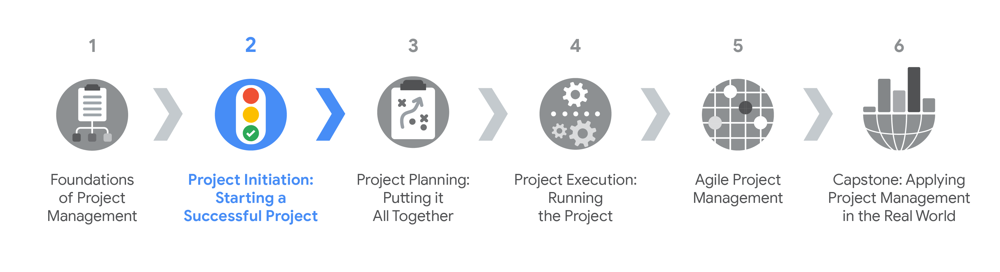

- Understand the significance-重要性,意义 of the initiation-初始 phase of the project life cycle.

	> 了解项目生命周期初始阶段的重要性

- Understand the key components of project charters-章程,许可证 and develop a project charter for project initiation.

	> 了解项目章程的关键组成部分，并为项目启动制定项目章程。

- Complete a stakeholder analysis and utilize RACI charts-图表 to define and communicate project team member responsibilities.

	> 完成利益相关者分析，并利用RACI图表来定义和沟通项目团队成员的职责。

- Evaluate-评价,评估 various project management tools to meet project needs. 

	> 评估各种项目管理工具以满足项目需求

You will learn how the program-计划,规划 is structured, understand the significance of a project’s initiation phase and describe its key components, and understand how to determine a project’s benefits and costs.

> 您将学习该计划是如何构建的，了解项目启动阶段的重要性，描述其关键组成部分，并了解如何确定项目的收益和成本。

**学习目标**

- Explain the Project Management Certificate program structure and course functionality-功能.

	> 解释项目管理证书课程结构和课程功能

- Explain the significance of the initiation phase.

	> 解释起始阶段的意义

- Describe the key components of the initiation phase.

	> 描述启动阶段的关键组成部分

- Determine a project’s benefits and costs.

---

# Getting started with the course

> 开始课程

## Introduction to Course 2

> 课程介绍

Hi there, welcome.

This course is all about initiating a project successfully.

> 这门课程是关于如何成功地启动一个项目。

If you haven't gone through our foundational course yet, we recommend checking it out.

> 如果你还没有完成我们的基础课程，我们建议你去看看。

It covers the foundations of project management and contains lots of helpful information for anyone wanting to start a career in this field.

> 它涵盖了项目管理的基础，并为任何想在这个领域开始职业生涯的人提供了许多有用的信息。

There are lots of people around the world like you who are hoping to learn the skills to get a project management role.

> 世界上有很多人和你一样，希望学习获得项目管理职位的技能。

Maybe you **prefer to**-宁愿,更喜欢 take a specialized certification rather than a four-year degree.

> 也许你更愿意拿一个专业证书，而不是一个四年的学位。

Maybe you're looking for an affordable-便宜的 way to **stand out**-突出,显眼 among-在...当中 competition-竞争.

> 也许你正在寻找一种经济实惠的方式来在竞争中脱颖而出。

Maybe you are interested in changing your career.

> 也许你想换工作。

Whatever your reason for being here, we're glad-乐意的,高兴的 you've joined us.

> 不管你来这里的原因是什么，我们都很高兴你能加入我们。

This program is rooted in the belief that a strong foundation in project management can help anyone start a great career as a project manager.

> 该计划植根于这样一种信念，即在项目管理方面打下坚实的基础可以帮助任何人开始一个伟大的项目经理职业生涯。

---

Before we begin this course, let me introduce myself.

> 在我们开始这门课程之前，让我先自我介绍一下。

My name is JuAnne, and I'll be your instructor-导师 for this course.

> 我叫JuAnne，我将是你们这门课的指导老师。

As a Senior Program Manager at Google for the past eight years, I have worked on cross-functional projects involving product managers, software engineers, user experience designers, network operations, customer support, and more to build software used at Google and used by Google Cloud customers.

> 设计师作为谷歌的高级项目经理，在过去的八年里，我参与了跨职能项目，包括产品经理、软件工程师、用户体验设计师、网络运营、客户支持等，以构建谷歌和谷歌云客户使用的软件。

I began my career working as a liaison-联络人 between customers and engineers, documenting requirements on software development projects.

> 我的职业生涯开始时是客户和工程师之间的联络人，负责记录软件开发项目的需求。

As I became involved-参与的 in larger projects, I started to manage the timelines of the projects and coordinate the work of the different teams that had to get involved to finish the project.

> 当我开始参与更大的项目时，我开始管理项目的时间表，并协调必须参与完成项目的不同团队的工作。

Before I knew it, I was the de facto-实际上地 project manager.

> 在我意识到这一点之前，我已经是事实上的项目经理了。

I have accumulated-积累,积攒 my knowledge through formal and informal training, finding practical-真实的,实际的 application in finance-金融, insurance-保险, and tech-科技,技术 companies.

> 我通过正式和非正式的培训积累了知识，并在金融、保险和科技公司找到了实际的应用。

I'm super excited to be sharing with you more about the project management discipline-学科.

> 我非常高兴能与大家分享更多关于项目管理学科的知识。

During this course, you'll learn all the steps for **kicking off**-开始,启动 a project.

> 在本课程中，您将学习启动项目的所有步骤。

We'll start with an overview of initiation, which is the phase that allows ideas to come together and form-形成 the beginnings of a plan for a project.

> 我们将从启动的概述开始，这是一个允许想法聚集在一起并形成项目计划开端的阶段。

You identify-确定 the individual-各个 components of initiation like the project scope, goals, and deliverables.

> 您确定了初始化的各个组成部分，如项目范围、目标和可交付成果。

You'll also learn how to measure the success of a project.

> 您还将学习如何衡量项目的成功。

This is a super important piece-块 of the puzzle-拼图.

> 这是拼图中非常重要的一块。

After all, you want to **be able to**-能够 meet or exceed all of the requirements for a successful project, right?

> 毕竟，您希望能够满足或超过一个成功项目的所有要求，对吗?

Later, we'll talk about how to identify stakeholders.

> 稍后，我们将讨论如何识别利益相关者。

Stakeholders have a direct interest in the project's completion and success.

> 利益相关者对项目的完成和成功有着直接的兴趣。

We'll teach you about some really helpful tools you can use to define project roles and responsibilities and more tools and resources you typically-通常,一般 need to complete the work of a project.

> 我们将教您一些非常有用的工具，您可以使用它们来定义项目角色和职责，以及完成项目工作通常需要的更多工具和资源。

Finally, we'll introduce documentation that can help your team prepare for project kickoff.

> 最后，我们将介绍可以帮助您的团队为项目启动做准备的文档。

Exciting, right?

> 令人兴奋的,对吧?

The skills you learn in this course will help you start projects of your own.

> 你在本课程中学到的技能将帮助你开始你自己的项目。

We can't wait to get into these topics with you.

> 我们迫不及待地想和你一起探讨这些话题。

So let's get started. Meet me in the next video.

> 让我们开始吧。下个视频见。

## Course 2 overview	10 min

Hello! Welcome to the second of the six courses in the [Google Project Management Certificate program. ](https://www.coursera.org/professional-certificates/google-project-management)

This course will teach you how to **set the stage for**-为…打好基础 a successful project.

> 本课程将教你如何为一个成功的项目奠定基础。

You will learn about stakeholders, their level of influence-影响,作用, and how to mobilize-组织,动员 and manage them, as well as tackle-应付,解决 tasks to identify project scope, goals, deliverables, and success criteria-标准,准则.

> 您将了解利益相关者，他们的影响力水平，以及如何动员和管理他们，以及解决任务，以确定项目范围，目标，可交付成果和成功标准。

You will learn how to use tools like RACI (Responsible, Accountable, Consulted-咨询,请教, and Informed) charts, stakeholder analysis, and project charters-章程 to help you set project expectations.

> 您将学习如何使用RACI(负责任、可问责、咨询和知情)图表、利益相关者分析和项目章程等工具来帮助您设定项目期望。

You will also familiarize-使了解,使熟悉 yourself with setting SMART (Specific, Measurable, Attainable, Relevant, and Time-bound) goals to help you see the full scope of a project, determine its feasibility-可行性,可能性, and clearly define what project success will look like in concrete-具体的 terms.

> 你还将熟悉如何设定SMART(具体的、可衡量的、可实现的、相关的和有时间限制的)目标，以帮助你看到项目的全部范围，确定其可行性，并清楚地定义项目成功的具体情况。

Current Google project managers will continue to instruct-指导 and provide you with hands-on-动手的,实际操作的 approaches for accomplishing these tasks, while implementing the right tools and resources for the job.

> 当前的Google项目经理将继续指导并为您提供完成这些任务的实际方法，同时为工作实施正确的工具和资源。

---

In this reading, you will learn about the Project Management Certificate program structure and course functionality-功能.

> 在本阅读材料中，您将了解项目管理证书课程的结构和课程功能。

If you already read this in the last course and don't need a refresher, feel free to skip it.

> 如果你在上一节课中已经读过了，不需要复习，可以跳过它。

If you’re new to the program, welcome! 

We’ve specifically designed the program you’re about to explore to help every type of learner successfully finish the certificate and get ready for a role in project management.

No previous experience is required.

**Become job-ready**

In this Google Project Management Certificate program, you will learn the foundations of traditional project management and gain insight into Agile project management. According to the Project Management Institute, the project management labor force in seven project-oriented sectors is expected to grow by 33 percent, or nearly 22 million new jobs, by 2027*. We are excited to join you on this journey as you learn the skills to begin a career in one of today’s most in-demand professions.

Course 2 covers four weeks of material. Each week includes a series of lessons with many types of learning opportunities, such as:

- **Videos** with a Google employee as your instructor. 
- **Readings** to introduce new ideas and case studies and to build on the concepts from the videos. 
- **Discussion forums** to explore course topics for better understanding and chat with peers in the program. 
- **In-video questions** that will pop up from time to time. They’re designed for you to check your learning as you go! 
- **Practice quizzes** to check your understanding and give you valuable feedback. **Practice activities** will provide you with a hands-on opportunity to apply skills you are working to master. You will assess your work by answering quiz questions about it or by comparing it to an exemplar built by our course team. *Note: these activities will not count towards your final course grade, but you are strongly encouraged to complete them as they will help prepare you for the graded quizzes and peer reviews.*
- **Graded quizzes** on video and reading content to measure your progress. 
- Ungraded **peer-review activities** on video and reading content that provide you the opportunity to practice applying skills you are working to master. Other learners in your course will see the work you submit and give you feedback based on a rubric. 
- **Graded peer-review activities** on video and reading content that assess your ability to apply skills you are working to master. Other learners in your course will grade your work and give you feedback based on a rubric.

Everyone learns differently, so we designed this program to let you work at your own pace. Although your personalized deadlines start when you enroll, they’re just a guide. Feel free to move through the program however it works best for you. Keep in mind, you can always reset your deadlines by clicking the blue **reset my deadlines** button. There’s no penalty for late assignments. To earn your certificate, all you have to do is complete all of the work.

**Tips**

- We strongly recommend you take all six courses—and complete the items in each lesson—in the order they appear, as new information and concepts build on previous ones. 
- Make the most of the readings and additional resources throughout the program. They’re designed to support your learning. 
- If something is confusing, don’t hesitate to rewatch a video, go through a reading again, or ask your classmates for advice in the discussion forum. 
- Take part in all learning opportunities to gain as much knowledge and experience possible. 

Congratulations on choosing to take this first step toward becoming a part of the wonderful world of project management. Enjoy the journey!

**Source: PMI (2017). Project Management Job Growth and Talent Gap 2017–2027.*

## Helpful resources to get started

> 有用的入门资源

The Google Project Management Certificate will provide you with new lessons every week. As you’ve learned, each lesson includes a series of videos, readings, activities, in-video questions, practice quizzes, and graded quizzes. In this reading, you’ll learn about providing feedback on course content, obtaining the Google Project Management Certificate, and acquiring helpful habits for successfully completing this certificate program. 

**Providing feedback on course content**

Please remember to give feedback on videos, readings, and materials. Just open the resource and look for the thumbs-up and thumbs-down symbols. 

- Click thumbs-up for materials that are helpful. 
- Click thumbs-down for materials that are not helpful.

If you want to flag a specific issue with the item, click the flag icon, select a category, and then optionally type an explanation in the text box.

This feedback goes to the course developers, not other learners, and helps create even better programs in the future. 

For technical help, visit the [Learner Help Center](https://learner.coursera.help/hc/en-us). 

**Obtaining the Google Project Management Certificate**

You can review videos, readings, discussion forums, in-video questions, and practice quizzes in the program for free. However, to access graded assignments and be eligible to receive your official Google Project Management Certificate, you must:

- Pay the [course certificate fee](https://www.coursera.support/s/article/209818963-Payments-on-Coursera?language=en_US), or apply and be approved for [Coursera Financial Aid](https://www.coursera.support/s/article/209819033-Apply-for-Financial-Aid-or-a-Scholarship?language=en_US).

AND

- Pass all graded assignments in all six courses or meet the course-passing threshold. Each graded assignment is part of a cumulative graded score for the course, and the passing grade for each course is 80%. 

**Helpful habits to successfully complete the certificate**

As a learner, you’re bringing all of your past experiences and best learning practices to this program. The designers of this course have also put together a list of helpful habits that they believe will help you to be successful: 

1. **Plan your time:** Setting regular study times and sticking with them each week can help you make learning a part of your routine. Use a calendar or timetable to create a schedule, and list what you plan to do each day in order to break your work down into achievable goals. Create a quiet place to watch the videos, review the readings, and complete the activities so you can really focus on the material.
2. **Be curious:** If you find an idea that gets you excited, act on it! Ask questions, search for more details online, check out the links that interest you, and take notes on your discoveries. The little things you do to support your learning along the way will take your knowledge even further, open more doors in this high-growth field, and help you qualify for jobs. 
3. **Take notes:** Notes are useful-to-remember information that you think might be important in the future, especially as you’re preparing to enter a new job field. In addition, taking notes is an effective way to make connections between topics and gain a better understanding of those topics.
4. **Chat (responsibly) with other learners**: If you have a question, chances are, you’re not alone. Reach out in the [discussion forum](https://www.coursera.org/learn/project-initiation-google/discussions) to ask for help from other learners taking this program. You can also visit Coursera’s[ Global Online Community](https://coursera.community/). Other important things to know while you’re making friends can be found in the [Coursera Honor Code](https://learner.coursera.help/hc/en-us/articles/209818863-Coursera-Honor-Code) and [Code of Conduct](https://learner.coursera.help/hc/en-us/articles/208280036-Coursera-Code-of-Conduct).
5. **Update your profile**: Consider [updating your profile](https://www.coursera.org/account/profile) on Coursera. This link appears in the menu when you click on your name at the top-right corner of this screen. When classmates find you in the discussion forums, they can click on your name to view your profile and get to know you more.

**Finding more information**

Throughout this course, you will learn the basics of project management. We will provide a lot of information through videos and readings. But sometimes, you may need to look things up on your own for additional learning. Things change fast in this growing field, so it is critical to do your own research so you can stay up-to-date on what is new. 

Here are some helpful project management resources available online:

- The [Project Management Institute](https://www.pmi.org/) is the leading association for those in project, program, or portfolio management professions. Their website provides guides, industry standards, articles, templates, job boards, certifications, and more to help support professionals in these careers.
- The [Scrum Guide](https://www.scrumguides.org/index.html) defines Scrum, a technique used in Agile project management. You’ll learn about this framework later in the program. This guide describes Scrum’s roles, events, artifacts, and the rules that bind them together. You can also find hundreds of free resources to learn more about Scrum at [Scrum.org Resources](https://www.scrum.org/resources).

**Digital documents, spreadsheets, and presentations** 

You will complete activities using a variety of digital documents, spreadsheets, and presentation templates. These templates align with the document types that project managers often use to create, edit, and collaborate with their team and organization. Digital documents make it easy to collaborate in real time and stay organized.

If you’re not familiar with these types of tools, check out the course [Resources](https://www.coursera.org/learn/project-initiation-google/resources/VQqFi). 

**Glossary**

This course will cover a lot of terms and concepts, some of which you may already know and some of which will be new. To remind yourself about what a term means, refer to this [Glossary](https://www.coursera.org/learn/project-initiation-google/resources/r3bQY).

**Accessibility guidelines**

When you create written or visual content or plan a meeting or event, follow these [Accessibility Tips](https://www.coursera.org/learn/project-initiation-google/resources/THuGv) to make it more accessible to everyone, including people with disabilities.

---

# Understanding the key components of project initiation

> 了解项目启动的关键组成部分

## Why is project initiation essential-必要的,必不可少的?

> 为什么项目启动是必要的?

Welcome back! 

In the last course, you learned that initiation is the first phase within the project life cycle, followed by planning, executing, and closing.

Makes sense-道理, right?

> 很有道理，对吧?

Regardless-不管怎样,无论如何 of your chosen-挑选出来的 methodology, all projects have to start somewhere.

> 无论您选择何种方法，所有项目都必须从某个地方开始。

Let's talk more about initiation and why it's important for the success of a project.

---

Because initiation is the first phase of the project, it's really important to get it right.

> 因为启动是项目的第一个阶段，所以把它做好是非常重要的。

A well-planned initiation results in a strong foundation for your project, and sets it up for success.

> 一个计划良好的启动会为您的项目奠定坚实的基础，并为成功奠定基础。

---

Initiation begins after a problem or opportunity has been identified within an organization.

> 在组织内部发现问题或机会后，启动就开始了。

---

Often, stakeholders like senior leaders at a company will initiate-发起 a project to address-设法解决 a specific need for the business.

> 通常，像公司高层领导这样的利益相关者会启动一个项目来解决业务的特定需求。

For example, perhaps-可能 the company would like to **roll out**-推出,展开 a new product, improve-改善,变得更好 employee **well being**-幸福感, or reduce costs in a certain-某些 department.

例如，也许公司想要推出一种新产品，提高员工的福利，或者降低某个部门的成本。

---

It's your responsibility as the project manager to help identify the project goals, resources, and other details based on initial discussions with the project stakeholders.

Even though someone else might **come up**-提出 with an idea for the project, it's still your job to **figure out**-弄清楚,理解 all the important pieces that need to come together **in order to**-为了 get the work done.

> 即使其他人可能会为项目提出一个想法，你的工作仍然是找出所有需要整合在一起以完成工作的重要部分。

---

The initiation phase is a crucial-至关重要的,决定性的 time for asking stakeholders the right questions, performing research-进行研究, determining resources, and clearly documenting the key components of a project.

> 启动阶段是向利益相关者提出正确问题、进行研究、确定资源和清楚地记录项目关键组成部分的关键时期。

Doing this will help you solidify-巩固 the scope, or the boundary-界限,范围, of the project.

> 这样做可以帮助你巩固项目的范围或边界。

If this seems a bit overwhelming-使受不了,令人不知所措的, don't worry.

> 如果这看起来有点难以应付，不要担心。

We'll talk more about project scope later on in this course.

If the project isn't initiated properly, things can go wrong pretty-相当 fast.

> 如果项目没有正确启动，事情可能很快就会出错。

For example, without sufficient-充足的 understanding of the project's goals, you might underestimate-低估 what resources you need or how long the project might take.

> 例如，如果没有对项目目标的充分理解，您可能会低估您需要的资源或项目可能花费的时间。

Or, without agreeing with stakeholders on what success looks like, you might think the project was completed successfully, while the stakeholders might think it didn't accomplish their goals.

Getting on the same page and gaining clarity during the initiation phase can save-节省 a lot of time and extra-额外的 work for everyone throughout the project.

> 在初始阶段达成一致并获得清晰度可以为整个项目中的每个人节省大量时间和额外的工作。

Proper-适当的 initiation also helps ensure that the benefits of the project outcomes will outweigh-超过 the costs of the project.

> 适当的启动还有助于确保项目成果的收益将超过项目的成本。

To determine this, you'll do what's called a cost benefit analysis, which is the process of adding up the expected-预料的 value of a project (the benefits) and comparing them to the dollar costs.

> 为了确定这一点，您将进行所谓的成本效益分析，这是将项目的预期价值(收益)加起来并将其与美元成本进行比较的过程。

To do this, you will work with stakeholders to consider a few questions.

To determine the benefits of a project, those questions might include: 

What value will this project create?

How much money could this project save our organization?

How much money will it bring in from existing customers?

How much time will be saved?

How will the user experience be improved?

And to determine the costs of the project, those questions might include:

How much time will people have to spend on this project?

What will be the one-time costs?

> 一次性费用是多少?

Are there any ongoing costs?

> 是否有任何持续的成本?

What about long-term costs?

> 那么长期成本呢?

The benefits of a project should always outweigh the costs, so it's really important that you consider these questions early on. 

Coming up, we'll talk more about the initiation phase and explore the key components of initiating a project.

---

Bye for now!

## Key components of project initiation	4 min

> 项目启动关键组件

Hello and welcome back.

You just learned about the initiation phase of the project life cycle and why it's so important to get it right.

Next, I'll teach you about the key components that **make up**-组成 initiation, and how these pieces **lead to**-导致 the planning phase of a project.

---

There are several-几个 key components of initiation that you need to consider in order for your project to be successful: goals, scope, deliverables, success criteria, stakeholders and resources. 

First you need to consider the goals of the project, the goal is what you've been asked to do and what you're trying to achieve.

All projects should have clear goals and often those will be determined by senior company leaders, with your help.

---

From there, you will begin to consider the project scope.

This is the process to define the work that needs to happen to complete the project.

---

You also need to think about project deliverables.

They're the products and services that you will create for your customer, client or project sponsor-主办者.

Deliverables can be anything from product features and functionalities to documentation, processes and more, anything that enables-使能够 the goal of your project to be achieved.

Deliverables are submitted to help you reach-影响,达到 your project goals.

Also, it's important to keep in mind that the deliverables can be tangible-切实的 or intangible-无形的.

An example of a tangible deliverable might be submitting a chapter of a manuscript-手稿.

If the goal is to publish a textbook.

Or if your project goal is to finish implementation of a new point of sale software at a retail store, scheduling staff-职员的 training sessions could be an intangible deliverable.

---

Once the goals, scope and deliverables are determined, you need to consider success criteria.

Success criteria are the standards by which you measure how successful a project was in reaching its goals.

---

Another important consideration is your stakeholders.

Stakeholders are key to making informed decisions at every step of the project, including the initiation phase.

They're the people who both have an interest in and are affected by the completion and success of a project.

As a result, they're often instrumental-起作用的 in determining the goals, objectives, deliverables and success criteria of the project, from coming up with the idea to outlining-概括 the expectations-期待,预期 of its results.

> 因此，他们经常在确定项目的目标、目的、可交付成果和成功标准方面发挥重要作用，从提出想法到概述对结果的期望。

As you move through the initiation phase, it's your job to ensure that you understand the needs of the project stakeholders early on.

> 当您进入启动阶段时，您的工作是确保您尽早了解项目利益相关者的需求。

It's also your role to ensure that all stakeholders are in agreement on the goals and overall-总的,全面的 mission-任务,职责,天职 of the project before moving on to the next phase.

> 在进入下一阶段之前，确保所有利益相关者对项目的目标和总体任务达成一致也是您的职责。

---

Now, let's talk about resources, resources generally refer to the budget, people, materials, and other items-项目 that you will have at your disposal-安排.

> 现在，我们来谈谈资源，资源通常指的是预算、人员、材料和其他可供你支配的项目。

It's super important to think carefully about these pieces early on.

> 在早期仔细考虑这些部分是非常重要的。

No one wants to get started on a project, only to realize-了解,意识到 halfway-在中途 through that they don't have enough money or enough people to complete the work.

> 没有人想要开始一个项目，只在中途意识到他们没有足够的资金或足够的人来完成这项工作。

That would be a mess-杂乱,困境.

> 那将是一团糟。

---

Finally, once you've established-确定,建立,设立 your goals, scope, deliverables, success criteria, stakeholders, and resources, it's time to create a project charter-章程.

> 最后，一旦您确定了目标、范围、可交付成果、成功标准、涉众和资源，就该创建项目章程了。

A project charter is a document that contains all the details of the project.

Project charters clearly define the project and its goals and outline-概述 what is needed to accomplish them.

> 项目章程清楚地定义了项目及其目标，并概述了完成这些目标所需的条件。

A project charter allows you to get organized-组织, set up a framework for what needs to be done and communicate those details to others.

> 项目章程允许您组织起来，为需要完成的工作建立一个框架，并将这些细节与他人沟通。

Once you've drafted-起草,草拟 the charter, you would then review the document with key stakeholders to get their approval to move into the planning stage.

Coming up, you learn more about project charters and even get the chance to create one yourself.

> 接下来，你会学到更多关于项目章程的知识，甚至有机会自己创建一个。

Hopefully you're starting to see how the key components of initiation help lay the foundation of a solid-牢固的 project.

> 希望你已经开始明白开始的关键组成部分是如何为一个坚实的项目奠定基础的。

---

To quickly recap, you gather information about your goals, scope, deliverables, success criteria, stakeholders, and resources, and you document that information in the project charter.

> 为了快速概括，您收集有关目标、范围、可交付成果、成功标准、涉众和资源的信息，并将这些信息记录在项目章程中。

During the rest of this course, we'll talk more about each of the components outlined-概述 so far.

> 在本课程的其余部分中，我们将更多地讨论到目前为止概述的每个组件。

You've come so far and learned so much, keep up the great work.

> 你已经走了这么远，学到了这么多，继续努力吧。

## Afsheen: Listening to learn

> 阿夫辛：倾听学习

Hi, my name is Afsheen.

I'm the Director-负责人,董事 of Core Capacity-能力,职位 at Google, where we support some of our key products such as Google Maps, Google Photos, Google Search, and many more.

> 我是Google的核心容量主管，我们在这里支持我们的一些关键产品，比如Google地图、Google照片、Google搜索等等。

Ultimately-最终,根本上, what we're doing is we're managing the supply and demand-需求 for our products in the resource space, so specifically: compute, storage, machine learning, and networking resources.

> 最终，我们正在做的是管理我们产品在资源领域的供应和需求，具体来说就是:计算、存储、机器学习和网络资源。

Ultimately, our goal is to provide the fuel-燃料 for these products so we can support our billions of users.

> 最终，我们的目标是为这些产品提供燃料，这样我们就可以支持我们数十亿的用户。

I often look at establishing the project goals, and **tied to**-与......紧密相连 the goals is discussing the criteria.

> 我经常着眼于建立项目目标，并与目标联系在一起讨论标准。

What's a successful project?

What are the measurables-显著的,可测量的 involved-牵涉,涉及 in the project space?

> 什么是项目空间中涉及的可测量指标?

And lastly, I always want to look at the stakeholders that are involved—maybe our clients, our key stakeholders, and so on—and make sure that they're thought-考虑,想法,看法 of during the formation-构成,形成 of the project.

> 最后，我总是想看看相关的利益相关者——也许是我们的客户，我们的关键利益相关者，等等——并确保在项目形成过程中考虑到他们。

I'm meeting with the stakeholders, I'm trying to understand what they're trying to achieve, what we're trying to achieve, and the goal, if you will, is a critical-关键的 aspect of setting the scope.

> 我和利益相关者会面，我试图理解他们想要达到的目标，我们想要达到的目标，如果你愿意的话，目标是设定范围的一个关键方面。

When I'm trying to set the goals of a project, I apply very in depth, active-积极的 listening-倾听.

> 当我试图为一个项目设定目标时，我会非常深入、积极地倾听。

I'm doing a lot of socializing-社交,交往,交际 with other stakeholders.

> 我正在与其他利益相关者进行大量的社交活动。

I'm meeting a lot of players to understand what's the landscape-形势,情形 like.

> 我会见了很多玩家，了解他们的情况。

It's an active listening experience-体验.

> 这是一种积极倾听的体验。

I have a recent-最近的,最新的 example of a project that in my view did not do the proper-适当的,合适的 initiation phase.

> 我最近有一个项目的例子，在我看来，这个项目没有进行适当的启动阶段。

Last week, in fact, a group approached-接近,靠近 me with a process or a feature that they were going to launch-发起,发动.

> 事实上，上周，一个团队找到我，告诉我他们要推出的一个流程或一个功能。

I reviewed it and immediately-立即,马上 realized-了解,意识到 that they were **so far off**-离得很远.

> 我重新看了一遍，立刻意识到他们相差太远了。

They had not discussed the topic with any of my team members or myself, and they were **day minus one**-第一天 from launching the feature.

> 他们没有和我的任何团队成员或我自己讨论过这个话题，而且他们是在发布这个功能的第一天。

It was a total miss.

> 这完全是失误。

It really illustrates-说明,阐明 the point about when you initiate a project, you can't invest-投资,投入 enough time in meeting with stakeholders, meeting with your colleagues-同事,同僚, listening to them—actively listening.

> 这确实说明了当你启动一个项目时，你不能投入足够的时间与利益相关者会面，与你的同事会面，倾听他们的意见——积极地倾听。

Someone taught me recently-最近,不久前 the value of building that "listening to learn" muscle-肌肉.

> 最近有人教会了我建立“倾听学习”肌肉的价值。

And in the project initiation phase, to me, that is such a valuable-宝贵的 talent-天赋,才能, there are those that have it, there are those that have learned it, and there those who will never do it.

> 在项目启动阶段，对我来说，这是一种非常宝贵的才能，有些人拥有它，有些人学会了它，有些人永远不会这样做。

And I believe it's a trainable-可训练的 skill, but it requires you to really slow down and look at the landscape-风景,形势,情形 in front of you.

> 我相信这是一种可以训练的技能，但它需要你真的慢下来，看看你面前的风景。

## Performing-执行,履行 a cost-benefit analysis

> 执行成本效益分析

Previously, you learned that a **cost-benefit analysis** is the process of adding up the expected-期待,预计 value of a project—the benefits—and comparing them to the dollar costs.

> 前面，您了解到成本-收益分析是将项目的预期价值(收益)加起来并将其与美元成本进行比较的过程。

In this reading, we will discuss the benefits of conducting-实施,进行,指挥 a cost-benefit analysis, guiding questions to help you and your stakeholders conduct one, and how to calculate **return on investment (ROI)**-投资回报.

> 在这篇阅读中，我们将讨论进行成本效益分析的好处，指导问题以帮助您和您的利益相关者进行成本效益分析，以及如何计算投资回报率(ROI)。

**The benefits-好处 of a cost-benefit analysis**

> 成本效益分析的好处

A cost-benefit analysis can minimize-使最小化 risks and maximize-使最大化 gains-收益 for projects and organizations.

> 成本效益分析可以使项目和组织的风险最小化，收益最大化。

It can help you communicate clearly with stakeholders and executives-主管,经理 and keep your project **on track**-按计划进行.

> 它可以帮助您与利益相关者和执行人员进行清晰的沟通，并使您的项目保持正轨。

Because this type of analysis uses objective-客观的,目的,目标 data, it can help reduce biases-偏见,成见 and keep stakeholder self-interest from influencing-影响,作用 decisions. 

> 因为这种类型的分析使用客观数据，它可以帮助减少偏见，并使利益相关者的自身利益不影响决策。

---

Comparing a project’s benefits to its costs can help you make a strong business case to stakeholders and leadership and ensure your organization pursues-追求 the most profitable-盈利的 or useful projects.

> 比较一个项目的收益和成本可以帮助你向利益相关者和领导提出一个强有力的商业案例，并确保你的组织追求最有利可图或最有用的项目。

Organizations use cost-benefit analysis to reduce waste and invest-投资,投入 their resources responsibly.

> 组织使用成本效益分析来减少浪费和负责任地投资资源。

**Guiding questions for a cost-benefit analysis**

> 成本效益分析的指导性问题

When you’re pursuing-追求,执行 a project, the benefits should outweigh-超过 the costs.

> 当你在进行一个项目时，收益应该大于成本。

It’s important for you and your stakeholders to consider questions like the ones that follow early on, while you prepare the proposal.

> 当你准备提案的时候，你和你的利益相关者考虑这些问题是很重要的。

To determine-确定,决定 the benefits of a project, you might ask:

> 要确定一个项目的好处，你可能会问:

- What value will this project create? 

- How much money could this project save-节省 our organization? 

	> 这个项目能为我们公司节省多少钱?

- How much money will it bring in from existing customers?

- How much time will it save? 

	> 它能节省多少时间?

- How will it improve the customer experience?

And to determine the costs of a project, consider questions such as:

- How much time will people have to spend on this project?

- What are the one-time costs?

	> 一次性费用是多少?

- Are there any ongoing costs?

	> 是否有任何持续的成本?

- What about long-term costs? 

	> 那么长期成本呢?

You might also consider questions about **intangible-不可捉摸的,难以确定的 benefits**.

> 你可能还会考虑有关“无形利益”的问题。

These are gains-收益 that are not quantifiable-可以计量的, such as:

> 这些是无法量化的收益，例如:

- **Customer satisfaction-满意**. Will the project increase customer retention-保持,保留, causing them to spend more on the company’s products or services? 

	> 客户满意度。该项目是否会增加客户留存率，使他们在公司的产品或服务上花费更多?

- **Employee satisfaction**. Is the project likely to improve employee morale-士气,精神面貌, reducing-减少,降低 turnover-人员流动率? 

	> 员工满意。这个项目是否有可能提高员工士气，减少人员流动率?

- **Employee productivity-生产力**. Will the project reduce employee’s overtime hours, saving the company money?

	> 员工生产力。项目是否会减少员工的加班时间，为公司节省资金?

- **Brand perception**. Is the project likely to improve the company’s brand perception-看法,认识 and recognition-识别, attracting-吸引 more customers or providing a competitive-竞争的 advantage-有利条件,优势?

	> 品牌认知。项目是否有可能提高公司的品牌认知和认知度，吸引更多的客户或提供竞争优势?

You can also flip-快速翻转 these questions to consider **intangible** ***costs***.

> 你也可以把这些问题反过来考虑无形成本。

These are costs that are not quantifiable.

> 这些成本是无法量化的。

For example, might the project put customer retention, employee satisfaction, or brand perception at risk?

> 例如，项目是否会将客户保留、员工满意度或品牌认知置于风险之中?

---

When assigning values to tangible-明确的 or intangible costs and benefits, you can reference-参考 similar past projects, conduct-实施,进行 industry-行业,产业 research, or consult-咨询,请教 with experts.

> 在为有形或无形的成本和收益赋值时，您可以参考类似的过去项目，进行行业研究或咨询专家。

**Calculating costs and benefits**

> 计算成本和收益

The process of calculating costs and benefits is also called calculating **return on investment**, or **ROI**.

> 计算成本和收益的过程也称为计算投资回报率(ROI)。

There are many ways to determine a project’s ROI, but the easiest way is to compare the upfront-预付的,预交的 and ongoing costs to its benefits over time.

> 有许多方法可以确定项目的ROI，但最简单的方法是将前期和持续的成本与长期收益进行比较。

One common ROI formula-公式,方程式 is:

In this formula, **G** represents-代表 the financial-财政的 gains-收益 you expect-期待,预计 from the project, and **C** represents the upfront and ongoing costs of your investment-投资 in the project.

> 在这个公式中，**G**代表项目的财务收益，**C**代表你在项目中投资的前期和持续成本。

---

For example, imagine your project costs $6,000 up front plus $25 per month for 12 months.

This equals $300 per year, but you estimate that the project will bring in $10,000 in revenue-收入,收益 over the course of that year.

> 这相当于每年300美元，但你估计这个项目将在那一年带来1万美元的收入。

Using the formula above, you calculate the ROI as: ($10,000 - $6,300) ÷ $6,300 = 0.58 = 58%

---

The ROI comes to 0.58, or 58%. 

You consider this to be a strong ROI, so you decide to pursue-执行,追求,致力于 the project.

> 您认为这是一个强大的ROI，因此您决定继续这个项目。

**Key takeaway**

> 关键要点

Performing a cost-benefit analysis can help you and your stakeholders determine if it **makes sense to**-对......有意义 **take on**-承担 a new project by evaluating-评估 if its benefits outweigh its costs.

> 执行成本-收益分析可以帮助您和您的利益相关者通过评估收益是否大于成本来确定是否有意义接受一个新项目。

When conducting-实施,进行 cost-benefit analyses for your prospective-潜在的,预期的 projects, you can use the guiding questions and ROI formula provided in this reading as a reference. 

> 在为您的预期项目进行成本效益分析时，您可以使用本阅读中提供的指导性问题和ROI公式作为参考。

To learn more about performing a cost-benefit analysis, check out these articles:

- [Cost Benefit Analysis for Projects – A Step-by-Step Guide](https://www.projectmanager.com/blog/cost-benefit-analysis-for-projects-a-step-by-step-guide)
- [Cost Benefit or Benefit Cost Analysis](https://pmstudycircle.com/cost-benefit-or-benefit-cost-analysis/#:~:text=Cost-benefit analysis is a,during the project selection analysis)

---

# Review: The fundamentals of project initiation

> 回顾:项目启动的基础

## Wrap-up

> 总结

Nice work!

You're on your way to becoming a great candidate-候选人,申请者 for roles in project management.

We're so glad you've stuck with us, and we hope you're proud-自豪的 of the progress-进步,进展 you've made so far.

> 我们很高兴你们一直和我们在一起，我们希望你们为你们目前取得的进步感到自豪。

---

In the last few videos, we've given you a primer-入门指南 on **kicking off**-开始,启动 a project successfully.

> 在过去的几个视频中，我们已经向你介绍了如何成功启动一个项目。

To recap, you learned more about initiation,the first phase of the project life cycle.

> 回顾一下，您了解了更多关于初始化的知识，即项目生命周期的第一阶段。

Hopefully, you're starting to see how important this phase is for the overall health of a project.

> 希望您开始看到这个阶段对于项目的整体健康是多么重要。

As we talked about earlier, a lack-缺乏,不足 of preparation during the initiation stage can lead to problems later on in the project life cycle, like a budget shortage-短缺,不足, a missed deadline, or too few teammates to complete the work.

> 正如我们前面所讨论的，在初始阶段缺乏准备可能会导致项目生命周期后期的问题，如预算短缺、错过最后期限或团队成员太少而无法完成工作。

But with early planning, you can set your team up for success.

> 但有了早期的计划，你可以让你的团队走向成功。

We also introduced you to the major factors you should consider during the initiation phase, including goals, scope, deliverables, success criteria, stakeholders and resources.

All of these come together in the early plans for a project and are documented in a project charter-章程.

> 所有这些都汇集在项目的早期计划中，并记录在项目章程中。

Now that you understand the basic elements of initiation, let's dive-潜水 deeper-更深.

> 既然你已经了解了启动的基本要素，让我们再深入一点。

Next up, we'll talk about identifying goals and deliverables and learn more about measurement and success criteria.

> 接下来，我们将讨论确定目标和可交付成果，并了解更多关于度量和成功标准的信息。

You're doing great, and we'll see you soon.

