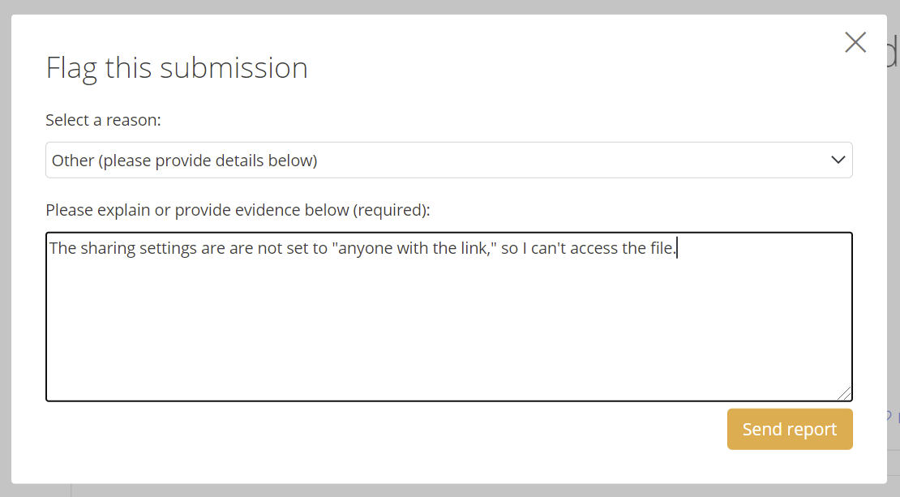
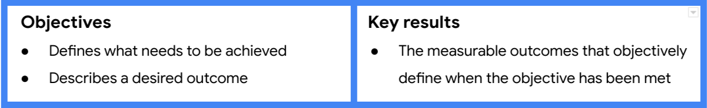
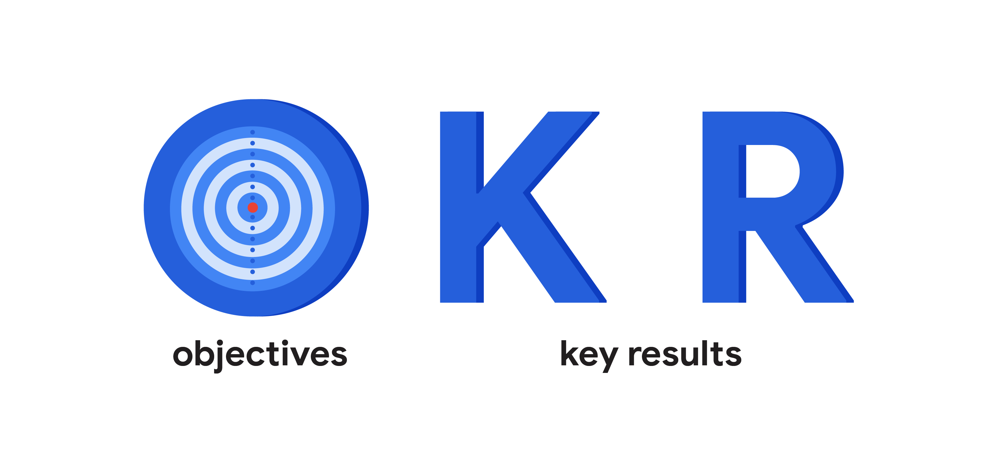

You will learn how to define and create measurable-可衡量的,可测量的 project goals and deliverables; how to define project scope, differentiate-区别 among-在…当中 tasks that are in-scope and out-of-scope, and avoid-避免 scope creep-蔓延; and how to define and measure a project’s success criteria.

**学习目标**

- Define and create measurable project goals and deliverables.

	> 定义并创建可度量的项目目标和可交付成果。

- Define project scope and differentiate among tasks that are in-scope and out-of-scope.

	> 定义项目范围，区分范围内和范围外的任务。

- Explain how to manage scope creep to avoid impacting project goals

	> 解释如何管理范围蔓延以避免影响项目目标

- Define and measure a project’s success criteria.

	> 定义并度量项目的成功标准

# Identifying project goals

> 确定项目目标

## Introduction: Defining project goals, scope, and success criteria

> 引言:定义项目目标、范围和成功标准

Welcome back.

By now you should have a better sense of how the different parts of the initiation come together to form-形成 the beginnings of a project.

> 到目前为止，您应该更好地了解了初始化的不同部分是如何结合在一起形成项目的开始的。

So far, you've outlined-概述 the key components of project initiation and, most importantly, you've learned that a lack-缺乏,不足 of preparation during this stage can lead to problems later on.

> 到目前为止，您已经概述了项目启动的关键组成部分，最重要的是，您已经了解到在此阶段缺乏准备可能会导致以后的问题。

We're going to continue honing-磨练,训练 your project preparation skills.

> 我们将继续磨练你的项目准备技能。

Once we're done here, you'll be able to define and create project goals and deliverables, the guiding-指导,引导 stars of your project.

> 一旦我们完成了这里，你将能够定义和创建项目目标和可交付成果，你的项目的指路之星。

You'll also be able to define project scope, the boundaries-边界,界限 of your project, that state-说明,陈述 what is and is not part of your project.

> 你还可以定义项目范围，项目的边界，说明什么是项目的一部分，什么不是项目的一部分。

You'll be able to identify what's in-scope and out-of-scope for a project and you'll be able to recognize scope creep, something you'll need to **keep a close eye on**-密切关注 to help you reach your project goal.

> 你将能够识别项目的范围内和范围外，你将能够识别范围蔓延，你需要密切关注的东西，以帮助你实现项目目标。

Finally, you'll be able to explain different ways of defining and measuring your project's success criteria.

> 最后，你将能够解释定义和衡量项目成功标准的不同方法。

Before we get started, I'd like to talk through an example that we'll follow-遵循 for the rest of this course.

> 在我们开始之前，我想通过一个例子，我们将遵循这门课程的其余部分。

Imagine that you're the lead project manager at Office Green, a commercial-商业的 landscaping-景观美化 company that specializes-专门从事 in plant-植物 decor-装饰,布置 for offices and other businesses.

> 假设你是Office Green的首席项目经理，这是一家商业景观美化公司，专门从事办公室和其他企业的植物装饰。

The Director-总监 of Product at Office Green has an idea for a new service called Plant Pals to offer-提供 **high-volume**-大批量 customers small, low-maintenance-低维护 plants, like little cacti-仙人掌 and leafy-多叶的 ferns-蕨类植物, for their desks.

> “绿色办公室”的产品总监想出了一个名为“植物伙伴”的新服务，为大批量的客户提供小型、低维护成本的植物，比如小仙人掌和多叶蕨类植物，放在他们的办公桌上。

As the project manager, you've been tasked with managing **the roll out of**-推出 this new service.

> 作为项目经理，您的任务是管理这个新服务的推出。

As we **go through**-完成 this course, we'll return to your role as the project manager at Office Green, to help teach you about project goals, deliverables, and success criteria.

> 当我们完成本课程时，我们将回到您作为Office Green项目经理的角色，以帮助您了解项目目标，可交付成果和成功标准。

You'll also see the role your team and stakeholders play in creating and following-遵循 these three important components.

> 您还将看到您的团队和利益相关者在创建和遵循这三个重要组件时所扮演的角色。

At the end, you'll compile-汇编 everything you've learned into a shared document that you can use as a portfolio-作品集 to share with future employers.

> 最后，你将把你所学到的一切汇编成一份共享文件，你可以作为作品集与未来的雇主分享。

After this course, you'll move on to the next phases of the project life cycle, and so will your Office Green project.

> 本课程结束后，您将进入项目生命周期的下一个阶段，您的办公室绿色项目也是如此。

Enjoy.

## Determining project goals and deliverables

> 确定项目目标和可交付成果

Welcome back.

In this video, I'll define project goals and deliverables and explain why they're important.

Then-然后,因此 I'll teach you how to determine whether a goal or deliverable has been well-defined, which means it's got enough detail and information to guide you towards-接近 success.

> 然后，我将教你如何确定目标或可交付成果是否已经定义明确，这意味着它有足够的细节和信息来引导你走向成功。

---

**First things first**-先做重要的事, to **set up**-建立 a project for success, and to make your job easier, you want to **figure out**-弄清楚,理解 what needs to be done before you actually get started.

> 首先，要建立一个成功的项目，并使你的工作更容易，你想要弄清楚在你真正开始之前需要做什么。

You need to define exactly-精确地,确切地 what your goals and deliverables are, so that you'll be able to tell your team members what to do.

> 您需要准确地定义您的目标和可交付成果是什么，以便您能够告诉您的团队成员该做什么。

You need a clear-清楚的 picture of what you're trying to accomplish, how you're going to accomplish it, and how you know when it has been accomplished.

> 你需要清楚地知道你想要完成什么，你将如何完成它，以及你如何知道它何时完成。

Let's define project goals **so that**-以便 you can start to figure out what your project team needs to reach it.

> 让我们定义项目目标，这样您就可以开始弄清楚您的项目团队需要什么来实现它。

The project goal is the desired-期望,渴望 outcome of the project.

> 项目目标是项目期望的结果。

It's what you've been asked to do and what you're trying to achieve.

> 这是你被要求去做的事情，也是你想要达到的目标。

For example, your goal could be to improve the response time to customer inquiries-询问 via-通过 email by 20 percent.

> 例如，您的目标可以是将通过电子邮件对客户查询的响应时间提高20%。

The goal of your Office Green project might be to increase revenue-收益 by five percent through a new service called Plant Pals that offers-提供 desk plants to top customers by the end of the year.

> 你的“绿色办公室”项目的目标可能是通过一项名为“植物伙伴”的新服务，在年底前为顶级客户提供桌上植物，从而使收入增加5%。

Goals are important because they give you a roadmap-路线图,计划,策略 to your destination-目的地,终点,目标.

> 目标很重要，因为它们为你提供了通往目的地的路线图。

Without a clear goal in mind, how can you know where to go or how to get there?

> 没有一个明确的目标，你怎么知道要去哪里或如何到达那里?

Now, one of the biggest differences between what makes a good goal and a not-so-good goal is how well it's defined.

> 好的目标和不太好的目标之间最大的区别之一就是如何定义它。

Meaning: how clear and specific is the goal.

> 意义：目标有多清晰和具体。

If the goal is your destination-目的地,终点,目标, are you confident-自信的,充满信心的 you'll know when you've arrived?

> 如果目标是你的目的地，你有信心知道你什么时候到达了吗?

The examples I mentioned-提到,谈到 before, to improve the response time to customer inquiries-询问 via-通过 email by 20 percent, and to increase the Office Green revenue by five percent are two well-defined goals because they tell you what you're trying to achieve.

> 我之前提到的例子，将客户通过电子邮件询问的响应时间提高20%，以及将办公室绿色收入提高5%，这是两个明确的目标，因为它们告诉你要实现什么。

But wait, there's more.

> 但是等等，还有更多。

These goals also tell you how to do what you've been asked to do.

> 这些目标也会告诉你如何去做你被要求做的事情。

In this case-具体情况, it's via-通过 email and through-通过 a new service offering, and that's not all.

> 在这种情况下，它是通过电子邮件和一个新的服务提供，而这还不是全部。

These goals clarify-澄清,阐明 the goal even further-推进 by saying "to improve by 20 percent and increase by five percent."

> 这些目标通过说“提高20%和增加5%”来进一步明确目标。

Now we know where we're going.

> 现在我们知道我们要去哪里了。

Well-defined goals are both specific and measurable.

> 良好定义的目标既具体又可衡量。

They give you a clear sense of what you are trying to accomplish.

> 它们会让你清楚地知道你想要完成什么。

Really great goals have even more detail, but I'll get to that soon.

> 真正伟大的目标有更多的细节，但我很快就会讲到。

When you start a project, take time to review your goals and make sure they're well-defined.

> 当你开始一个项目时，花点时间回顾你的目标，确保它们是明确的。

To do this, you might need to get more information from your stakeholders.

> 要做到这一点，您可能需要从利益相关者那里获得更多信息。

Talk to them about their vision for the project.

> 和他们谈谈他们对项目的愿景。

Ask how this aligns-使一致 to the company's larger goals and mission-使命.

> 问问自己这与公司更大的目标和使命是如何一致的。

By the end of that conversation-谈话,交谈, you and your stakeholders should agree to support the project goals in order to avoid-避免 running into issues later on.

> 在对话结束时，您和您的利益相关者应该同意支持项目目标，以避免以后遇到问题。

---

Here's an example from my own experience as a project manager.

> 以下是我作为项目经理的一个亲身经历。

Our team had finished a new product feature-功能.

> 我们的团队完成了一个新的产品功能。

Our stated-规定 goal was to deliver-发布,交付 an early version of this feature and collect user feedback.

> 我们的目标是发布这个功能的早期版本并收集用户反馈。

When we delivered the feature to one of our key customers for user feedback, the customer didn't have anyone available-可用的 to try it out.

> 当我们将这个特性交付给我们的一个主要客户以征求用户反馈时，客户没有人可以试用它。

Our team debated-讨论,辩论 whether or not we had met the goal if we hadn't collected user feedback.

> 如果我们没有收集用户反馈，我们的团队就会争论我们是否达到了目标。

Some felt-觉得,相信 that we hadn't achieved the stated goal while-然而 others thought we did.

> 有些人觉得我们没有达到既定的目标，而另一些人则认为我们做到了。

The customer was satisfied-满意的,满足的 with our team's ability to deliver a feature in the timeline stated-规定的.

> 客户对我们团队在规定的时间内交付特性的能力感到满意。

But our internal team, wasted-浪费 valuable-宝贵的,重要的 time **going back and forth**-来来回回 about it.

> 但是我们的内部团队浪费了宝贵的时间来来回回地讨论这个问题。

That said, make sure that before you start your project, you, your stakeholders, and your team are all clear on the project goals so that you know you're making the right kind of progress.

> 也就是说，确保在你开始项目之前，你、你的涉众和你的团队都清楚项目目标，这样你就知道你正在取得正确的进展。

I'll teach you a process for how to do this coming up.

> 接下来我会教你怎么做。

---

Once you have the goals **nailed-钉住 down**-确定,明确, it's time to examine-检查,调查 the project deliverables.

> 一旦你确定了目标，就该检查项目可交付成果了。

Project deliverables are the products or services that are created for the customer, client, or project sponsor-赞助者.

> 项目可交付成果是为客户、客户或项目发起人创建的产品或服务。

In other words, a deliverable is what gets produced-产生,制作,造出 or presented-展示 at the end of a task, event, or process.

> 换句话说，可交付成果是在任务、事件或过程结束时产生或呈现的内容。

Take the goal to improve customer response time.

> 以改善客户响应时间为目标。

the deliverable for that goal could be the creation of email templates for responding-回应 to typical-典型的 questions.

> 实现这一目标的成果可以是创建用于回答典型问题的电子邮件模板。

Your Office Green project goal to increase revenues could have these two deliverables: launching-启动,上市 the plant service and a finished website that highlights-突出,强调 the new kinds of plants being offered.

> 您的办公室绿色项目的目标是增加收入，可以有以下两个可交付成果:启动植物服务和一个完成的网站，突出提供的新植物种类。

These are considered-认为 deliverables because they describe tangible-明确的 outputs that show stakeholders how additional revenues-收益 will be generated.

> 这些被认为是可交付成果，因为它们描述了向利益相关者展示如何产生额外收入的有形产出。

There are all sorts-种类 of project deliverable examples.

> 有各种各样的项目可交付的例子。

A pretty common one is a report.

> 一个很常见的是报告。

When a goal is reached, you can visibly-明显地 see the results documented-记录 in the chart, graph, or presentation.

> 当达到目标时，您可以看到记录在图表、图形或演示文稿中的结果。

Deliverables help us quantify-量化 and realize-实现 the impact of the project.

> 可交付成果帮助我们量化和实现项目的影响。

Just like needing well-defined goals, you need well-defined deliverables for pretty much the same reasons.

> 就像需要定义明确的目标一样，出于几乎相同的原因，您需要定义明确的可交付成果。

Deliverables are usually decided upfront-预付的 with the stakeholders or clients involved in the project.

> 可交付成果通常是与项目利益相关者或客户事先决定的。

They hold everyone accountable and are typically-通常 a big part of achieving the goal.

> 他们让每个人都负起责任，通常是实现目标的重要组成部分。

Make sure to ask questions about what the deliverable should be and have everyone share their vision and expectations of the deliverables so that you're all **on the same page**-达成共识.

> 一定要问清楚可交付成果应该是什么，让每个人都分享他们对可交付成果的看法和期望，这样你们就能达成一致。

Coming up, you'll practice the art-艺术 of defining your goals even further following the SMART method. 

> 接下来，你将按照SMART方法进一步练习定义目标的艺术。

Enjoy.

## Explore: Project Plant Pals: Initiation

**Refine-改善 goals with stakeholders**

> 与利益相关者一起完善目标

First, you will meet with the Director of Product (the project sponsor) to discuss their aims-目标,目的 for the project.

> 首先，您将与产品总监(项目发起人)会面，讨论他们的项目目标。

To clarify-澄清,阐明 these goals and keep the project on track, you’ll turn them into SMART goals.

> 为了明确这些目标并保持项目在正轨上，你将把它们变成SMART目标。

**Assess-评价,评定 stakeholder power and influence**

> 评估利益相关者的权力和影响

Next, you’ll get to know some of your stakeholders and find out how they **fit into**-融入 the project.

> 接下来，您将了解一些利益相关者，并了解他们如何融入项目。

A stakeholder analysis and power grid-网格 will help you decide how best—and how often—to communicate with team members, investors-投资者, and more.

> 利益相关者分析和电网将帮助您决定如何最好地与团队成员、投资者等进行沟通。

**Assign roles and responsibilities to promote the service**

> 分配角色和职责以促进服务

To promote-推广 Plant Pals, you’ll assemble-组装 teams to plan the marketing and sales strategy and redesign the website.

> 为了推广Plant Pals，你将组建团队来计划营销和销售策略，并重新设计网站。

You’ll use RACI charts to determine who should be responsible, accountable, consulted-咨询, and informed about various project tasks.

> 您将使用RACI图表来确定谁应该对各种项目任务负责、负责、咨询和通知。

**Create a charter for the next stage of the project**

> 为项目的下一阶段创建一个章程

As you **wrap up**-总结 the initiation phase, your focus will **shift to**-转向 internal operations.

> 当您结束启动阶段时，您的重点将转移到内部操作上。

You’ll create a project charter to guide your team as they plan training, fulfillment-履行,实行, and delivery procedures for Plant Pals.

> 您将创建一个项目章程，以指导您的团队计划Plant Pals的培训，履行和交付程序。

## How to set SMART goals

> 如何设定明智的目标

Welcome back, by now you know that goals are important to the success of your project, and you know that they need to be well-defined in order to help keep your project on track.

> 欢迎回来，现在你知道目标对项目的成功是很重要的，你也知道它们需要被明确定义，以帮助你的项目保持正轨。

Since-由于 your deliverables depend on your goals, it's in your best interest-利息 to get those goals as well-defined as possible.

> 由于您的可交付成果取决于您的目标，因此尽可能明确这些目标符合您的最大利益。

Lucky for you, I've got an easy method for doing just that: setting SMART goals.

> 幸运的是，我有一个简单的方法来做到这一点：设定明智的目标。

I already mentioned that goals should be specific and measurable.

> 我已经提到，目标应该是具体的和可衡量的。

The SMART method to evaluate-评价,评估 goals add three more considerations-考虑因素 for success.

> 评估目标的 SMART 方法为成功增加了三个考虑因素。

Be attainable-可以达到的,可以获得的, be relevant-有关的, and be time-bound-有时限的.

> 要可实现，要相关，要有时间限制。

Put them all together, and what do you have?SMART goals.

> 把它们放在一起，你会得到什么？聪明的目标。

As an entry-level-初级的 project manager, you may or may not be setting the project's main goals, but you will need to be able to identify and clarify-澄清,阐明 them as needed, and that's where the SMART method can be a valuable-宝贵的 tool.

> 作为一个入门级的项目经理，你可能会也可能不会设定项目的主要目标，但你需要能够根据需要识别和澄清它们，这就是SMART方法可以成为一个有价值的工具的地方。

Let's take a closer look at each term.

> 让我们仔细看看每个术语。

As I've already mentioned, if your goal is not specific, you'll have trouble figuring out how long it should take to complete and whether or not you've accomplished it.

> 正如我已经提到过的，如果你的目标不具体，你就很难计算完成它需要多长时间，以及你是否完成了它。

For example, if the goal is simply-仅仅 to improve customer service response time, that's not very specific.

> 例如，如果目标仅仅是改善客户服务响应时间，那就不是很具体。

It does tell you what you want to achieve in general, but it doesn't say anything else.

> 它会告诉你你想要达到的目标，但它没有说明其他任何东西。

If you improve response time by one percent, is that enough?

> 如果您将响应时间提高1%，这就足够了吗?

If after five years response time finally **goes up**-上升, is that enough?

> 如果五年后响应时间终于增加了，那就够了吗?

How about if only half of your staff-全体员工 improves their response times, but the other half stays the same.

> 如果只有一半的员工改善了他们的响应时间，而另一半保持不变，情况又会如何呢?

Specific goals should answer at least two of the questions I'm about to ask.

> 具体目标应该至少回答我将要问的两个问题。

What do I want to accomplish?

> 我想完成什么?

Why is this a goal?

> 为什么这是一个目标?

Does it have a specific reason, purpose, or benefit?

> 它是否有特定的原因、目的或益处?

Who is involved?

> 谁牵涉其中?

Who is the recipient-接受者?

> 收件人是谁?

Employees, customers, **the community at large**-整个社会?

> 员工，客户，整个社会?

Where should the goal be delivered?

> 目标应该在哪里实现?

Finally, to what degree-程度?

> 最后，到什么程度?

In other words, what are the requirements and constraints-限制,约束?

> 换句话说，需求和约束是什么?

Next, we want to set goals that are measurable, meaning we can determine that they were objectively-客观地 met.

> 接下来，我们要设定可衡量的目标，这意味着我们可以确定它们是否客观地实现了。

Measuring is not only a way for people to track progress, but also a tool to help people stay motivated-积极的,主动的.

> 衡量不仅是人们跟踪进度的一种方式，也是帮助人们保持动力的一种工具。

You can tell the goal is measurable by asking how much, how many, and how will I know when it's accomplished?

> 你可以通过问多少，多少，以及我如何知道什么时候完成，来判断目标是可衡量的。

Sometimes the success of a goal can be measured with a simple yes or no.

> 有时候一个目标的成功可以用一个简单的“是”或“不是”来衡量。

Did you learn to play the guitar-吉他, yes or no?

> 你学过弹吉他吗，是还是不是?

You will need to measure most of the goals you have with metrics-指标.

> 你需要用指标来衡量你的大多数目标。

Metrics, what you use to measure something like numbers or figures-数值.

> 指标，你用来衡量数字或数字之类的东西。

For example, if your goal was to run a five kilometer race-赛跑, then distance-距离 in kilometers is your metric.

> 例如，如果您的目标是跑5公里的比赛，那么距离(以公里为单位)就是您的度量标准。

At Office Green, the project goal is to increase revenue by five percent.

> 在绿色办公室，项目目标是增加5%的收入。

In this case, revenue is the metric-衡量标准.

> 在这种情况下，收益就是衡量标准。

Lastly, consider benchmarks-基准点 or points of reference-参考 to make sure you're choosing accurate-准确的,精确的 metrics.

> 最后，考虑基准或参考点，以确保你选择了准确的指标。

For instance, if your overall goal is to increase revenue, you can look **at last year's**-在去年的 data as a benchmark for deciding how much to increase revenue this year.

> 例如，如果你的总体目标是增加收入，你可以把去年的数据作为基准来决定今年增加多少收入。

If last year's revenue increased by three percent, then an increase by five percent in a booming-飞速发展的 economy-经济 would be a reasonable-适度的,合适的 goal for this year.

> 如果去年财政收入增长了3%，那么在经济繁荣的情况下，今年财政收入增长5%将是一个合理的目标。

Ok, so the goal is specific and measurable, but is it attainable-可以达到的,可以获得的?

> 好的，所以目标是具体的和可测量的，但它是可以实现的吗?

Can it reasonably be reached based on the metrics?

> 是否能够基于参数合理地达到目标?

Typically, you want goals that are a little challenging to encourage-鼓励,激励 growth, otherwise, what's the point of the goal if nothing's going to change?

> 通常情况下，你想要一些具有挑战性的目标来鼓励成长，否则，如果什么都不会改变，目标的意义是什么?

However, you don't want it to be too extreme-极端 or you'll never reach it.

> 然而，你不希望它太极端，否则你永远也达不到它。

You'll have failed before you **even started**-甚至还没有开始.

> 你还没开始就已经失败了。

Aim-目的,目标 to find a balance between the two extremes.

> 目标是在这两个极端之间找到平衡。

For example, let's take the goal to run a 5K.

> 例如，让我们以跑5公里为目标。

Say-假设 you regularly-定期 run 2.5 kilometers, three times a week.

> 假设你定期跑2.5公里，每周三次。

An attainable-可达到的,可以获得的 goal will be to go from running 2.5 kilometers to running five kilometers within four weeks.

> 一个可以实现的目标是在四周内将跑步里程从2.5公里提高到5公里。

An unattainable goal might be earning-赢得 first-place-第一名 in the 5K.

> 一个无法实现的目标可能是在5公里赛跑中获得第一名。

I mean, it could happen, but it's not likely, especially-尤其,特别 if you've never run a race-比赛 before.

> 我的意思是，这可能会发生，但不太可能，尤其是如果你以前从未参加过比赛。

But how can you know if a goal is attainable, if it's unfamiliar-不熟悉的,没有经验的?

> 但你怎么知道一个目标是可以实现的，如果它是不熟悉的?

A clue-线索,提示 to helping you figure out if your goal is attainable, is to ask: how can it be accomplished?

> 帮助你弄清楚你的目标是否可以实现的一个线索是问：它是如何实现的?

Break down the goal into smaller parts and see if it makes sense-意义.

> 把目标分解成更小的部分，看看它是否有意义。

Going from 2.5 kilometers to five kilometers over four weeks means increasing your distance by a little over half a kilometer each week.

> 在四周内从2.5公里增加到5公里意味着每周增加半公里多一点的距离。

That's not so bad, use the same process on your Office Green project goal.

> 这并不是很糟糕，在你的 Office Green 项目目标中使用相同的过程。

Businesses-企业,生意,商务 usually conduct-实施,进行 quarterly-季度的 reviews-审查,检查.

> 企业通常进行季度审查。

So let's assume-假定,假设 that increase is expected-预计 to occur-发生 over the course-过程 of a year or four quarters.

> 因此，让我们假设增长预计将在一年或四个季度的过程中发生。

In order to meet the goal, you need to see an increase of at least 1.25 percent each quarter, seems pretty reasonable-合适的 to me.

> 为了达到这个目标，你需要看到每季度至少增长1.25%，这在我看来是相当合理的。

What wouldn't be reasonable is setting a goal of increasing revenues by 50 percent or 100 percent, unless-除非 your research showed that business was improving that quickly.

> 设定一个收入增长50%或100%的目标是不合理的，除非你的研究表明业务正在迅速改善。

Your goal is specific, measurable, and attainable-可获得的,可达到的.

> 你的目标是明确的、可衡量的、可实现的。

---

Now let's see if it's relevant.

> 现在我们来看看是否相关。

In other words, does it **make sense**-有意义 to try and reach this goal?

> 换句话说，尝试和达到这个目标有意义吗?

Think about how the goal lines up with other goals, priorities and values.

> 想想这个目标是如何与其他目标、优先事项和价值观联系起来的。

Ask whether the goal seems worthwhile-值得做的.

> 问问自己这个目标是否值得。

Does the effort involved balance out the benefits?

> 付出的努力是否抵消了收益?

Does it match your organizations' other needs and priorities?

> 它是否符合组织的其他需求和优先事项?

Everyone, from the client, the project team, and the people who will ultimately-最终,最后 use the product, need to feel like the goal is worth-值得的 supporting.

> 从客户、项目团队到最终使用产品的人，每个人都需要觉得这个目标值得支持。

---

Also-此外, consider the timing.

> 此外，还要考虑时机。

Both the amount of time the project will take, as well as the larger economic-经济的 and social-社会的 contexts-背景 can have big impacts.

> 项目所需的时间以及更大的经济和社会背景都可能产生重大影响。

There might be a budget to complete the project now, but will the company be able to sustain-维持 the project over time?

> 现在可能有预算来完成这个项目，但公司能长期维持这个项目吗?

Is there an audience-听众,读者 that will continue to use the product or service once it's delivered?

> 一旦产品或服务发布，是否有受众会继续使用?

Once you've got the answers to these questions, you should have a clear goal to help steer-指导 the project.

> 一旦你得到了这些问题的答案，你就应该有一个清晰的目标来帮助引导项目。

If you still don't feel confident-自信的 about the project's goals, keep digging-挖掘.

> 如果你仍然对项目的目标没有信心，那就继续挖掘。

It's okay to ask questions if you have doubts-怀疑,不确定.

> 如果你有疑问，可以问问题。

Communicate your concerns with the project senior stakeholders and your direct supervisor if you have one.

> 与项目的高级利益相关者和你的直接主管(如果你有的话)沟通你的担忧。

They should be able to address-设法解决 some of your concerns so that you can feel confident-自信的 about moving forward.

> 他们应该能够解决你的一些担忧，这样你就会有信心继续前进。

If you're feeling good about the project being relevant and attainable, and you've made sure it's measurable, and has the specifics to keep you and your team focused the final item on the checklist is to make sure it's time-bound.

> 如果你对项目的相关性和可实现性感觉良好，并且你已经确保它是可测量的，并且有细节来保持你和你的团队专注于清单上的最后一项是确保它是有时间限制的。

---

Time-bound means your goal has a deadline.

> Time-bound的意思是你的目标有一个截止日期。

Deadlines give you a way to track your progress, otherwise, you may never reach your goal or never even get started.

> 截止日期给了你一个跟踪进度的方法，否则，你可能永远不会达到你的目标，甚至永远不会开始。

Time and metrics often go hand in hand, because time can also be used as a metric.

> 时间和度量标准通常是齐头并进的，因为时间也可以用作度量标准。

Making your goal time-bound gives you a way to break down how much needs to be accomplished over time.

> 给你的目标设定时间限制可以让你分解出需要在一段时间内完成多少任务。

For example, if you need to increase revenues by the end of the year, you can break down how much you need to increase each quarter, month, and week, and there you have it.

> 例如，如果你需要在年底之前增加收入，你可以分解每个季度、每个月、每个星期需要增加多少，这样你就知道了。

Specific, measurable, attainable, relevant, and time-bound: a nearly-几乎 foolproof-万无一失的 method to create and evaluate project goals.

> 具体的、可测量的、可实现的、相关的和有时限的：一种几乎万无一失的创建和评估项目目标的方法。

You know what they say, work smarter, not harder.

> 俗话说得好，工作要聪明，不要辛苦。

As we continue in this module, you'll learn about project scope and see how having clear goals supports all other decisions-决策 that come up during a project.

> 随着我们继续学习本模块，您将了解项目范围，并了解明确的目标如何支持项目期间出现的所有其他决策。

## SMART goals: Making goals meaningful-有意义的

> 明智的目标：制定有意义的目标

In this lesson you are learning to define and create measurable project goals and deliverables.

> 在本课中，您将学习定义和创建可度量的项目目标和可交付成果。

Now, let's focus on SMART goals.

**Specific, Measurable, Attainable, Relevant,** and **Time-bound (SMART)** goals are very helpful for ensuring project success.

> 具体的、可衡量的、可实现的、相关的、有时限的(SMART)目标对确保项目成功非常有帮助。

As you start your career in project management, you may not directly set the project goals, but you should be able to clarify and understand them.

SMART goals help you see the full scope of a goal, determine its feasibility-可行性,可能性, and clearly define project success in concrete-具体的,确实的 terms. 

> 聪明的目标可以帮助你看到目标的全部范围，确定其可行性，并以具体的方式清楚地定义项目的成功。

---

Let’s recap what we discussed in the previous video by taking a look at a breakdown-细目,分类 of the criteria for SMART goals below: 

> 让我们回顾一下我们在上一个视频中讨论过的内容，看看下面SMART目标标准的细分:

- **Specific:** The objective has no ambiguity-模棱两可,不明确 for the project team to misinterpret-曲解,误解. 

	> **具体：**目标没有歧义，以免项目团队误解。

- **Measurable:** Metrics help the project team determine when the objective is met.

	> **可度量的:**度量可以帮助项目团队确定目标何时实现。

- **Attainable:** The project team agrees the objective is realistic-现实的.

	> **可实现的:**项目团队同意目标是现实的。

- **Relevant:** The goal fits the organization’s strategic plan and supports the project charter.

	> **相关:**目标符合组织的战略计划并支持项目章程。

- **Time-bound:** The project team documents a date to achieve the goal.

	> **时限:**项目团队记录实现目标的日期。

You may see variations on what each letter in the “SMART” acronym **stands for**-代表. (For example, you may see “actionable” or “achievable” instead of “attainable” or “realistic” instead of “relevant.”) 

> 你可能会看到“SMART” 首字母缩略词中代表的每个字母的变化。(例如，你可能会看到“可操作的”或“可实现的”而不是“可实现的”或“现实的”而不是“相关的”。)

However, the general intent-意图,目的 of each of these terms—to make sure the goal is within reach-实现—is always similar.

> 然而，这些术语的一般意图——确保目标是可以实现的——总是相似的。

**Focusing on the "M" in SMART**

> 专注于 SMART 中的 “M”

Let’s take a moment to zoom-放大 in on the **M** in SMART, which stands for **measurable**.

> 让我们花点时间放大一下SMART中的**M**，它代表**可测量**。

Having measurable goals allows you to assess-评价,评定 the success of your project based on quantifiable-可量化的 or tangible-明确的 metrics, such as dollar amounts, number of outputs, quantities, etc.

> 有了可衡量的目标，你就可以根据可量化的或有形的指标来评估项目的成功，比如金额、产出数量、数量等。

Measurable goals are important because they leave-留下 little room-空间 for confusion-困惑,不明确 around expectations from stakeholders. 

> 可度量的目标很重要，因为它们不会给涉众的期望留下混乱的空间。

---

Not every metric will have value, so you will have to determine which metrics make sense for the project.

For example, measuring how many meetings the software engineers on your project attend-参加 on a weekly basis may not be the most valuable metric for a productivity goal.

> 例如，衡量项目中的软件工程师每周参加多少次会议可能不是实现生产力目标的最有价值的度量。

Alternatively-要不,或者, you might measure other aspects of the engineers’ productivity, such as a particular number of features created per engineer or a specific number of issues flagged per day.

> 或者，您可以度量工程师生产力的其他方面，例如每个工程师创建的特定数量的特性，或者每天标记的特定数量的问题。

**Defining a SMART goal**

> 定义一个明智的目标

Let’s explore an example related to making a personal goal measurable.

> 让我们来探索一个与使个人目标可衡量相关的例子。

Imagine you are **looking to**-期待,寻求 make a career change, and you set a goal to complete a Google Career Certificate.

> 想象一下，你想换一份工作，你的目标是完成谷歌职业证书。

You can **measure** the success of this goal because after completing the entire program, you will receive a certificate—a tangible-明确的 outcome.

> 您可以衡量这个目标的成功，因为在完成整个计划后，您将获得证书-一个有形的成果。

---

Now, let’s determine how to make the remaining-遗留,剩余 elements of this goal SMART.

> 现在，让我们决定如何使这一目标的其余要素变得明智。

In this example, your **specific** goal is to attain-获得,实现,达到 a Google Career Certificate.

You can make this goal **attainable** by deciding that you will complete one course per month.

This goal is **relevant** because it supports your desire-渴望,期望 to make a career change.

Finally, you can make this goal **time-bound** by deciding that you will complete the program within six months.

---

After defining each of these components, your SMART goal then-接下来,随后 becomes: Obtain a Google Career Certificate by taking one course per month within the next six months.

**Key takeaway**

Determining metrics can be extremely-极度,非常 helpful in capturing-捕获 statuses, successes, delays, and more in a project.

> 确定指标对于捕获项目中的状态、成功、延迟等非常有帮助。

As a project manager, identifying meaningful metrics can help move the project toward its goal.

Additionally, by defining each element-元素 of a project goal to make it SMART, you can determine what success means for that goal and how to achieve it. 

> 此外，通过定义项目目标的每个元素使其 SMART，您可以确定该目标的成功意味着什么以及如何实现它。

## Navigating-浏览 Peer/Self Reviews 5min

> 浏览同伴/自我评价

Hello again.

Throughout the program, you have the chance to practice project management skills in a few different ways.

> 在整个课程中，你有机会以几种不同的方式练习项目管理技能。

In addition to multiple choice and short answer quizzes, you complete **hands on**-实践操作 activities to apply what you've learned.

> 除了多项选择和简答题外，你还要完成实践活动来应用你所学到的知识。

You'll solve common-常见的 project problems in real world situations-突发情况 and create the kinds of artifacts project managers use every day. 

> 您将解决现实世界中常见的项目问题，并创建项目经理每天使用的工件类型。

Completing these hands on activities is really-十分 important to your success in this program.

> 完成这些实践活动对你在这个项目中取得成功真的很重要。

They'll give you practical-真实的,实际的 experience that can help you describe your skills in interviews or use them to manage projects more effectively in your personal or professional-职业的 life.

> 他们会给你提供实践经验，帮助你在面试中描述你的技能，或者在你的个人或职业生活中更有效地管理项目。

To help you prepare, I'll introduce you to two different types of hands on activities that we prepared for you.

> 为了帮助你们做好准备，我将向你们介绍我们为你们准备的两种不同类型的动手活动。

I'll also share some tips and tricks-窍门,技巧 that will let you get the most out of them.

> 我还将分享一些技巧和诀窍，让你最大限度地利用它们。

And one type of activity, you review-回顾 a project management scenario and follow step by step instructions-指示,指导 to move the project forward.

> 一种类型的活动，你回顾一个项目管理场景，并按照一步一步的指示来推进项目。

Your job could be to learn about stakeholders, assigned task owners or organized documents, so they're easy to find.

> 您的工作可能是了解利益相关者、分配的任务所有者或有组织的文档，以便于找到它们。

You can recognize these exercises as quizzes with activity in the title.

> 你可以把这些练习看作是标题中带有活动的小测验。

When you finish an activity, we'll take you through an exemplar-范例 of the completed assignment that you can compare to your own work.

> 当你完成一个活动时，我们会带你看一个完成作业的范例，你可以把它和你自己的作业进行比较。

Be sure to review these exemplars carefully, so you know what you did well and how you can improve next time.

> 一定要仔细复习这些例子，这样你就知道你做得好，下次如何改进。

Keep in mind that some activities can have more than one right answer, just like real problems can have more than one solution. 

> 请记住，有些活动可能有不止一个正确答案，就像实际问题可能有不止一个解决方案一样。

The exemplars for these activities explain one way of doing things, but they also point out where you could do things differently. 

> 这些活动的范例解释了做事的一种方式，但它们也指出了你可以用不同的方式做事的地方。

This helps you check your approach to an assignment, not just your answers.

> 这可以帮助你检查你做作业的方法，而不仅仅是你的答案。

Certain-某些,某几个 activities also include quiz questions that help you check your work.

> 某些活动还包括测验问题，帮助你检查你的工作。

These quizzes can be graded or ungraded and give you another way to measure your progress and expand-扩展 your knowledge. 

> 这些测验可以分级或不分级，给你另一种方法来衡量你的进步和扩展你的知识。

---

Another type of hands on activity is the peer review or peer graded assignment.

> 另一种实践活动是同行评审或同行评分作业。

These activities follow a similar format to the first, you will review of project management scenario and complete a set of step by step instructions.

> 这些活动遵循与第一个类似的格式，您将回顾项目管理场景并完成一组一步一步的说明。

But there's one major difference, your classmates will grade your assignment and you'll grade theirs.

> 但有一个主要的区别，你的同学会给你的作业打分，而你会给他们的作业打分。

For each peer review, you need to grade at least two submissions-意见, but you can grade more if you want.

> 对于每次同侪评议，你需要给至少两份提交的论文打分，但如果你愿意，你也可以给更多的论文打分。

This peer grading process is a key part of the learning experience for this program.

> 这个同伴评分过程是这个项目学习经验的关键部分。

That's because it gives you objective-客观的 feedback on your work and let you know how others are approaching-处理 the same challenges. 

> 这是因为它能给你客观的工作反馈，让你知道其他人是如何处理同样的挑战的。

Peer grading gives you the chance to learn not just from us, the instructors but from each other as well.

> 同学评分让你有机会不仅向我们学习，也向老师学习。

To grade each other's work, you will use what's known as a rubric-评分标准, a rubric as a checklist of items your assignment must include, with each item worth a certain number of points.

> 为了给彼此的作业打分，你们会使用所谓的评分标准，这个评分标准是你们的作业必须包括的项目清单，每个项目都有一定的分数。

You typically need to score at least 80% correct to pass a peer graded assignment.

> 你通常需要至少得到80%的正确率才能通过同龄人评分的作业。

So for example if a rubric has 10 points, you need a minimum of 8 points to pass.

> 例如，如果一个题目有10分，你至少需要8分才能通过。

In addition to using these rubrics to grade your peers, you can review-复习 them before you submit your own assignments, so you understand how you'll be graded.

> 除了使用这些标准来给你的同学评分，你还可以在提交自己的作业之前复习一下，这样你就知道自己将如何评分了。

Peer grading is also important because it lets you give and receive qualitative-定性的,质量的 feedback.

> 同伴评分也很重要，因为它可以让你给出和接受定性反馈。

For example, if a peer does well, you could tell them they did a great job refining-精炼,改进,改善 a goal or that you like their creative-有创造力的 solution to a problem.

> 例如，如果一个同事做得很好，你可以告诉他们，他们在细化目标方面做得很好，或者你喜欢他们对问题的创造性解决方案。

Positive-乐观的,积极的 feedback helps you and your peers learn about your strength-优势 and motivates-激励 you to do your best work.

> 积极的反馈可以帮助你和你的同事了解你的优势，并激励你把工作做到最好。

On the other hand, it's just as important if not more so to learn from your mistakes.

> 另一方面，从错误中吸取教训也同样重要。

If a peer get something wrong, be sure to leave-留下 thoughtful-深思熟虑的, constructive-建设性的 feedback, so they understand why they didn't get full credit-赞扬,信誉.

> 如果同事做错了什么，一定要留下深思熟虑的、建设性的反馈，这样他们就能理解为什么自己没有得到满分。

That way, they'll know what to review and how to improve, so they can become better project managers.

> 这样，他们就会知道要检查什么，如何改进，这样他们就能成为更好的项目经理。

And don't worry, we'll give you some tips on how to leave constructive-建设性的 feedback for each activity.

> 别担心，我们会给你一些建议，教你如何在每次活动中留下建设性的反馈。

Peer review is a valuable-有价值的 tool, but unlike other assessments-评估,评价 in the program, it may take some time to receive your grades. 

> 同行评议是一个很有价值的工具，但与项目中的其他评估不同，它可能需要一些时间来收到你的成绩。

Remember that real people aren't as fast as computers, so we can take up to 10 days for grades to appear.

> 记住，真人没有电脑那么快，所以我们可能需要10天的时间才能看到成绩。

Additionally, it can take some time before there are assignments available for you to grade.

> 另外，要给作业打分还需要一段时间。

Be patient-有耐心的, your peers may be working through the course at a different pace-速度 and remember you can always move on to other items in the course and come back if you need to.

> 要有耐心，你的同学可能会以不同的速度完成课程，记住你可以继续学习课程中的其他项目，如果需要的话，可以回来。

If for any reason you aren't able to access-访问 a peer submission-提交 or if a submission is incomplete-不完整的,未完成, you can skip it and go to a different one.

> 如果由于任何原因您无法访问同行提交或提交不完整，您可以跳过它并转到另一个。

To learn how to do this, continue onto the optional reading.

> 要学习如何做到这一点，请继续阅读选读。

This reading will also tell you more about the peer review process and link you to helpful resources on topics like where to find your feedback and how to change your sharing settings and google docs.

> 这篇文章还会告诉你更多关于同行评议的过程，并为你提供一些有用的资源，比如在哪里找到你的反馈，如何改变你的分享设置和谷歌文档。

So be sure to **check it out**-看看这个.

Great.

Now that you know more about some of the hands on activities to find throughout the program, you're ready to get started.

> 现在，您已经了解了更多关于整个课程的动手活动，您已经准备好开始了。

## Optional: What to know about peer-graded assignments

Throughout this course, you will complete a few different types of hands-on activities that let you apply your project management skills in “real-world” situations. These assignments ask you to think through common project management problems, find solutions, and create essential project management artifacts.

For some of these assignments, you’ll need to submit your work for other learners to grade. This peer review process is a central part of the learning experience. It allows you to assess activities objectively against a set rubric, and compare your approach with those of your peers. It also gives you the option to give and receive qualitative feedback.

You’ll need to complete peer-graded assignments in each course, so here’s what you need to know:

**How peer-grading works**

Before submitting the activity, you can check your work against a list of required items it should contain. Review this list carefully and revise your work before submitting, if necessary. This list matches the rubric your peers will use to grade your assignment (and that you will use to grade theirs). 

You should receive grades from at least two peers for each peer-graded assignment you complete. As a grader, you can review as many submissions as you like, but you must mark at least two assignments to move on in the course. 

**Optional feedback**

When grading a peer’s assignment, you will have the option to give qualitative feedback. We encourage you to leave thoughtful comments about what they did well and where they can improve. This feedback can help you and your peers understand why you lost points for certain rubric items, so you can do better next time. Each assignment includes tips and examples of good feedback to help you write constructive comments.

**Submitting your work**

Most assignments involve submitting documents or spreadsheets for review. You have the option to submit your peer-graded assignments as either a URL (to a shared Google doc for example) or as a downloadable file (like a .docx file). To grade your work, your peer reviewers will access the shared doc or download the file you submitted.

Coursera automatically assigns you a personalized deadline for each assignment in the course. Make note of this date and aim to submit your work on time—the earlier, the better. You are more likely to get timely feedback if you turn in your assignment a day or two *before* the deadline.

**What to do if you don’t receive a grade**

If you submitted your assignment as a URL, and no one has reviewed it after a few days, check your Google sharing settings to ensure “view” access is enabled. (Visit [this resource](https://www.coursera.org/learn/project-initiation-google/resources/FOW2Z) to learn more about file sharing.) 

If your share settings are correct and you still haven’t received a grade (or if you need assignments to grade yourself), you have two options:

1. Check when you submitted your assignment. It can take up to a week for grades to appear, so you may need to wait a little longer. New graders and assignments should be available within a few days.
2. Ask for reviewers (or items to review) in the discussion forums. Posts like this are common, so you can post your submission link for peers to review, or skim through forum posts to find items to grade.

**What to do if you need a new assignment to grade**

Sometimes, while you’re grading your peers, you may find you aren’t able to access or open a file. If you can’t grade an assignment for any reason, you can skip it and move on to a different submission. To do this, select *Flag this submission* (located at the upper-right corner of the prompt box in the grading pane):

A link to "flag this submission," with an image of a flag.

You will be prompted to select a reason for the flag and provide an explanation in the text box:

A "flag this submission" modal. The selected reason for the flag is "Other (please provide details below)." The explanation given is, 'The sharing settings are not set to "anyone with the link," so I can't access the file.

Once you select *Send report*, you'll receive a confirmation message and a different submission will appear below. 

***Note:*** *Flagging a learner's submission as inaccessible will not affect their grade.*

**Need more help?**

If you have questions on peer-graded assignments as you move through the courses, take a look at these Coursera Learner support articles: 

- [Submit peer reviewed assignments](https://www.coursera.support/s/article/208279926-Submit-peer-reviewed-assignments)

- [Submit feedback and grades for peer reviewed assignments](https://learner.coursera.help/hc/en-us/articles/208279946-See-feedback-and-grades-for-peer-reviewed-assignments)

## Activity Exemplar: Define and determine SMART project goals

Here is a completed exemplar along with an explanation of how the exemplar fulfills the expectations for the activity. 

## Completed Exemplar

To view the exemplar for this course item, click the link below and select “Use Template.”

Link to exemplar: [SMART goals](https://docs.google.com/document/d/1nf1ovLM9cHUJAgd6pD7CL3ZF2JRZNfRn1X3eeValy24/template/preview)

OR

If you don’t have a Google account, you can download the exemplar directly from the attachment below.

## Assessment of Exemplar

Compare the exemplar to your completed SMART goals activity. Review your work using each of the criteria in the exemplar. What did you do well? Where can you improve? Use your answers to these questions to guide you as you continue to progress through the course. 

***Note:*** *Your SMART goals may differ from the exemplar in some ways. That’s okay—what’s important is that your goals meet as many of the SMART criteria as possible.*

Let’s review each SMART goal:

**SMART goal one**

The original goal indicates that Office Green will boost its overall brand awareness through Plant Pals, but it doesn’t indicate how they will do it, whether it's possible, why it’s important, or when they will get it done. The SMART goal addresses all these questions, which increases Office Green’s chances of reaching their aim:

*“Office Green will boost brand awareness with a new marketing and sales strategy and website update that will increase page views by 2K per month by the end of the year.”*

- **Specific:** Office Green will update their website and launch a new marketing and sales strategy to boost awareness of their brand.
- **Measurable:** The goal includes a metric of 2K new page views per month.
- **Attainable:** They have a year to reach this goal and the target of 2K new page views per month is in line with prior marketing campaigns.
- **Relevant:** Greater brand awareness can mean new customers, which supports the overall project goal of a 5% revenue increase.
- **Time-bound:** The deadline is at the end of the year.

**SMART goal two**

The original goal indicates that Office Green will raise their customer retention rate, but it doesn’t indicate how they will do it, whether it's possible, why it’s important, or when they will get it done. The SMART goal addresses all these questions, which increases Office Green’s chances of reaching their aim:

*“Office Green will raise their overall customer retention rate by 10% by the end of the year by implementing a new Operations & Training plan for the Plant Pals service.”*

- **Specific:** Office Green will implement an Operations & Training plan that will improve on existing customer service standards and boost efficiency. 
- **Measurable:** The goal includes a metric of a 10% increase in retention. 
- **Attainable:** They have a year to reach this goal and many former and existing customers are interested in the new service. It has the potential to help them keep customers who may be thinking about leaving for a landscaper with more services.
- **Relevant:** Increasing customer retention can lead to more sales, which supports the overall project goal of a 5% revenue increase.
- **Time-bound:** The deadline is at the end of the year.

## Introduction to OKRs

> OKRs 简介 6min

Hi there.

So far you've been learning to define and create measurable project goals and deliverables.

As you broaden-增长 your understanding-理解,了解 of project management and the different tools available to help you succeed, I want to teach you about a popular-受欢迎的 tool used in many organizations and here at Google: objectives and Key results, or OKRs.

> 随着你对项目管理和帮助你成功的不同工具的理解的扩大，我想教你一个在许多组织和谷歌这里使用的流行工具:目标和关键结果，或 OKRs。

In this video, I'll discuss what OKRs are, how they are used by organizations, and how they help focus a team's time and effort on activities that drive success.

> 在本视频中，我将讨论okr是什么，组织如何使用它们，以及它们如何帮助团队将时间和精力集中在推动成功的活动上。

You've just learned about, and practiced, the SMART method for defining project goals.

> 您刚刚学习并实践了定义项目目标的SMART方法。

Like the SMART method, OKRs help establish and clarify-澄清,阐明 goals or objectives for an organization, department, project or person. 

> 与SMART方法一样，OKRs 帮助组织、部门、项目或个人建立和澄清目标或目的。

OKRs take SMART goals a step further-再往前地,进一步 by combining a goal and more detailed metrics to determine a measurable outcome.

> OKRs 通过结合目标和更详细的指标来确定可测量的结果，从而使SMART目标更进一步。

They not only state clearly-清楚地 what the goal is, they provide specific details that allow you to measure the success of the goal.

> 它们不仅清楚地说明了目标是什么，还提供了具体的细节，让你能够衡量目标的成功。

One way to think about OKRs is that they separate-分开 the different components of SMART goals and clarify them even-甚至,更加 further, rather than grouping everything into one statement-生命,报告.

> 考虑 OKRs 的一种方式是，它们将SMART目标的不同组成部分分开，并进一步澄清，而不是将所有内容分组到一个声明中。

---

Let's break this down.

The O stands for objective, and defines what needs to be achieved.

It describes the desired result or outcome, such as an increase in customer retention-保留, or an improvement on the employee onboarding-入职培训 process.

> 它描述了期望的结果或结果，例如客户保留率的增加，或员工入职流程的改进。

KR stands for key results.

These are the measurable outcomes that define when the objective has been met.

> 这些是可测量的结果，定义了目标何时实现。

For example, if your objective is to improve customer retention, then the key result might be to have 90 percent customer satisfaction rating by the end of the first quarter.

> 例如，如果你的目标是提高客户保留率，那么关键的结果可能是在第一季度末拥有90%的客户满意度。

Recall that one of the SMART criteria is attainability, which means it's practical-真实的,实际的 to achieve the goal.

> 回想一下，SMART标准之一是可达性，这意味着实现目标是可行的。

Key results, however, should be a little more ambitious-有抱负的,野心勃勃的.

> 然而，关键的结果应该更加雄心勃勃。

Here at Google, we actually use OKRs to set stretch-扩展 goals as a way to challenge ourselves-我们自己 to do something we haven't accomplished before.

> 在谷歌，我们实际上使用 OKRs 来设定扩展目标，作为一种挑战自己的方式，去做一些我们以前没有完成的事情。

If we actually accomplish all of our key results, we may have made our OKRs a bit too easy.

> 如果我们真的完成了所有的关键结果，我们可能让 OKRs 变得有点太容易了。

Let's review quickly.

Objectives define what needs to be achieved and describe a desired outcome.

Key results define how you'll know whether or not you've met your objective.

> 关键结果定义了你如何知道你是否达到了你的目标。

How do OKRs work in practice?

> OKRs 在实践中是如何工作的?

How do you use them to manage a project?

Organizations often set OKRs at different levels, such as the company level, department or team level, and project level. 

> 组织通常在不同的级别设置 OKRs，例如公司级别、部门或团队级别以及项目级别。

Company-level OKRs are commonly-通常 shared across-遍及 an organization so that everyone is clear on the company's goals.

> 公司级 OKRs 通常在整个组织中共享，以便每个人都清楚公司的目标。

They are usually updated on an annual-年度的 basis-基础 to help drive the organization in the direction it wants to go.

> 它们通常每年更新一次，以帮助推动组织朝着它想要去的方向发展。

These high-level OKRs support the mission of the organization.

> 这些高级 OKRs 支持组织的使命。

Project-level OKRs should support and be aligned with company-level OKRs.

> 项目级 OKRs 应该支持并与公司级 OKRs 保持一致。

An example of a company-level objective at Office Green is increase customer retention by adapting to the changing workplace environment.

> Office Green 的一个公司层面目标是通过适应不断变化的工作环境来提高客户保留率。

This is a big, aspirational-有雄心壮志的 goal that **applies to**-适用于 the entire company and all of its endeavors-努力.

> 这是一个宏大的、鼓舞人心的目标，适用于整个公司及其所有努力。

In order to focus their efforts to reach-实现 this objective, Office Green might develop key results that include 95 percent of phone, chat, and email customer support tickets are resolved during the first contact.

> 为了集中精力实现这一目标，Office Green可能会开发出关键结果，其中包括95%的电话、聊天和电子邮件客户支持问题在第一次联系时得到解决。

Top three most-最多 requested-请求 **new offerings**-新产品 for distributed-分散式的 office environments are in pilot-试验 by the end of the second quarter, and sales and support channels are available 24/7 by the end of the year.

> 到第二季度末，分布式办公环境中最受欢迎的三大新产品将进入试点阶段，到年底，销售和支持渠道将全天候开放。

Some of these company-level key results could become the basis for projects.

> 其中一些公司级别的关键结果可能成为项目的基础。

For example, the key result, "top three most requested new offerings for distributed office environments that are in pilot by the end of the second quarter," could become the Plant Pals project.

> 例如，关键的结果，“分布式办公环境中最受欢迎的三个新产品，将在第二季度末试用”，可以成为Plant Pals项目。

Team or department-level OKRs, support the company's broader-广大的 OKRs and help drive team performance-绩效.

> 团队或部门级okr，支持公司更广泛的okr并帮助推动团队绩效。

Departments may develop OKRs that are more specific to their job function as well.

> 部门也可以制定更具体于其工作职能的 OKRs。

For example, the company-level key result "sales and support channels are available 24/7 by the end of the year," could lead to a related sales department objective like: increase the sales team presence-存在 nationwide-全国性的.

> 例如，公司级别的关键结果“到年底销售和支持渠道全天候可用”可能导致相关的销售部门目标，如:增加全国销售团队的存在。

And the key result: new sales offices are open in 10 cities by the end of the year.

> 关键的结果是:到今年年底，新的销售办事处将在10个城市开业。

Project-level OKRs are set during the initiation phase to help define measurable project goals.

> 在启动阶段设置项目级 OKRs，以帮助定义可度量的项目目标。

They're tracked throughout the planning and execution stages to measure project success.

> 它们在整个计划和执行阶段被跟踪，以衡量项目的成功。

Project-level OKRs need to align with and support both company and department-level OKRs.

> 项目级 OKRs 需要与公司级和部门级 OKRs 保持一致并提供支持。

For example, in order to align with Office Green's company-wide objective to increase customer retention by adapting to the changing workplace environment, a project objective for Plant Pals might be to enroll-注册,参加 existing customers in the Plant Pals service. 

> 例如，为了与Office Green的全公司目标保持一致，即通过适应不断变化的工作环境来增加客户保留率，Plant Pals的项目目标可能是将现有客户注册到Plant Pals服务中。

A key result for this objective might be 25 percent of existing customers sign up for the Plant Pals pilot-试验.

> 实现这一目标的关键结果可能是25%的现有客户注册Plant Pals试点项目。

Let's recap.

OKR stands for objectives and key results.

They combine a goal and a metric to determine a measurable outcome.

Objectives define what needs to be achieved and describe a desired outcome.

Key results define how you will measure the outcome of your objective.

Company-level OKRs are shared across an organization so that everyone can align and focus their efforts to help the company reach its goals.

> 公司级别的 OKRs 在整个组织中共享，这样每个人都可以统一并集中精力帮助公司实现其目标。

Project-level OKRs help define measurable project goals.

They need to align with and support both company and departmental-level OKRs.

Great.

Now that you have a better idea of what OKRs are and how they function-工作, you can practice creating OKRs on your own.

> 现在您已经更好地了解了 OKRs 是什么以及它们是如何工作的，您可以练习自己创建okr。

## Creating OKRs for your project

> 为你的项目创建 OKRs

In this lesson, you are learning to define and create measurable project goals and deliverables.

This reading will focus on creating effective **objectives and key results (OKRs)** and how to implement them into your project.

---

**What are OKRs?**

OKR stands for objectives and key results.

They combine a goal and a metric to determine a measurable outcome. 

Objectives: Defines what needs to be achieved; describes a desired outcome.

Key results: The measurable outcomes that objectively-客观地 define when the objective has been met

> 关键结果:客观地定义何时达到目标的可测量结果

Company-wide OKRs are used to set an ultimate-最终的,最后的 goal for an entire organization, whole team, or department.

Project-level OKRs describe the focused results each group will need to achieve in order to support the organization.

> 项目级 OKRs 描述了每个小组为了支持组织而需要实现的重点结果。

**OKRs and project management**

As a project manager, OKRs can help you expand-扩展 upon project goals and further-进一步 clarify the deliverables you’ll need from the project to accomplish those goals.

> 作为项目经理，okr可以帮助您扩展项目目标，并进一步澄清您需要从项目中完成这些目标的可交付成果。

Project-level OKRs help establish the appropriate-合适的 scope for your team so that you can say “no” to requests that may **get in the way**-妨碍,阻碍 of them meeting their objectives.

> 项目级okr有助于为您的团队建立适当的范围，以便您可以对可能妨碍他们实现目标的请求说“不”。

You can also create and use project-level OKRs to help motivate-激励 your team since-因为 OKRs are intended-准备 to challenge you to push past what’s easily achievable. 

> 您还可以创建和使用项目级别的okr来帮助激励您的团队，因为okr旨在挑战您超越容易实现的目标。

**Creating OKRs for your project**

**Set your objectives**

Project objectives should be aspirational--有雄心壮志的, aligned with organizational goals, action-oriented-行动导向, concrete-具体的, and significant-重要的,意义重大的.

> 项目目标应该是理想的、与组织目标一致的、面向行动的、具体的和重要的。

Consider the vision you and your stakeholders have for your project and determine what you want the project team to accomplish in 3–6 months.

> 考虑一下你和你的利益相关者对项目的愿景，并确定你希望项目团队在3-6个月内完成什么。

**Examples:**

- Build the most secure-牢固的 data security software 

	> 打造最安全的数据安全软件

- Continuously-连续不断地 improve web analytics and conversions-转换

	> 持续改进网络分析和转换

- Provide a top-performing service

- Make a universally-available app

	> 制作一个普遍可用的应用程序

- Increase market reach

	> 扩大市场覆盖面

- Achieve top sales among-在……当中 competitors-竞争者,对手 in the region

	> 在本区域竞争对手中取得最高销量

Strong **objectives** meet the following criteria-标准. They are:

> 强大的**目标**符合以下标准。它们是:

- Aspirational-有雄心壮志的
- Aligned with organizational goals
- Action-oriented
- Concrete
- Significant--重要的,意义重大的

To help shape-塑造 each objective, ask yourself and your team:

> 为了帮助塑造每个目标，问问你自己和你的团队:

- Does the objective help in achieving the project’s overall goals?

- Does the objective align with company and departmental OKRs?

- Is the objective inspiring-启发,激励 and motivational-激发性的?

	> 目标是否具有启发性和激励性?

- Will achieving the objective make a significant impact?

	> 实现目标是否会产生重大影响?

**Develop key results**

Next, add 2–3 key results for each objective.

Key results should be time-bound.

They can be used to indicate-指示,表明 the amount-达到 of progress-进步,进展 to achieve within a shorter period or to define whether you’ve met your objective at the end of the project.

> 它们可以用来指示在较短的时间内要实现的进度，或者定义你是否在项目结束时达到了你的目标。

They should also challenge you and your team to stretch-使竭尽所能 yourselves to achieve more.

> 他们还应该挑战你和你的团队，让他们发挥自己的能力，取得更多的成就。

**Examples:**

- X% new signups within first quarter post launch

	> 在发布后的第一季度内获得X%的新注册用户

- Increase advertiser-广告客户 spend-花费,消耗 by X% within the first two quarters of the year

	> 在今年的前两个季度增加X%的广告费

- **New feature**-新功能 adoption-采用 is at least X% by the end of the year

	> 到今年年底，新功能的采用率至少达到X%

- Maximum 2 critical-关键的,严重的 bugs are reported monthly by customers per Sprint

	> 每个Sprint的客户每月最多报告2个关键错误

- Maintain-保持,维持 newsletter-时事通讯 unsubscribe rate at X% this calendar year

	> 在本日历年保持时事通讯退订率在X%

Strong **key results** meet the following criteria-标准:

- Results-oriented—**not** a task
- Measurable and verifiable-可证实的
- Specific and time-bound
- Aggressive-积极进取的 yet realistic-逼真的

To help shape-塑造 your key results, ask yourself and your team the following:

- What does success mean?

- What metrics would prove-证明 that we’ve successfully achieved the objective?

	> 什么指标可以证明我们已经成功实现了目标?

**OKR development best practices**

> OKR开发最佳实践

Here are some best practices to keep in mind when writing OKRs:

- Think of your objectives as being motivational-激发性的,动机的 and inspiring-启发,激励 and your key results as being tactical-策略的 and specific. The objective describes what you want to do and the key results describe how you’ll know you did it. 

	> 把你的目标想成是具有激励性和启发性的，把你的关键结果想成是有策略的和具体的。目标描述你想做什么，关键结果描述你如何知道你做到了。

- As a general rule, try to develop around 2–-3 key results for each objective.

	> 一般来说，你应该为每个目标创造2 -3个关键结果。

- Be sure to document your OKRs and link to them in your project plan.

	> 一定要记录okr，并在项目计划中链接它们。

**OKRs versus-与…相比 SMART goals**

Earlier in this lesson, you learned how to craft-精心制作 SMART goals for your project.

> 在本课的早些时候，你学习了如何为你的项目制定聪明的目标。

While SMART goals and OKRs have some similarities, there are key differences, as well.

> 虽然SMART目标和okr有一些相似之处，但也有一些关键的区别。

The following article-文章 describes how SMART goals and OKRs are similar, how they differ, and when you might want to use one or the other: [Understanding the Unique Utility of OKRs vs. SMART Goals](https://www.smartsheet.com/content/okr-vs-smart-goals)

To learn more how OKRs work to help project managers define and create measurable project goals and deliverables, check out the following resources:

- [Google’s OKR playbook](https://www.whatmatters.com/resources/google-okr-playbook/)
- [Planning company goals](https://asana.com/guide/examples/project-management/goals-okrs-planning)
- [OKRs and SMART goals: What's the difference?](https://www.whatmatters.com/resources/okrs-smart-goals-difference-between/)
- [OKRs and KPIs: What They Are and How They Work Together](https://www.reflektive.com/blog/okrs-and-kpis-what-they-are-and-how-they-work-together/)
- [How OKR and project management work together](https://www.perdoo.com/resources/okr-and-project-management/)
- [OKR Examples](https://www.workfront.com/strategic-planning/goals/okr/okr-examples)
- [OKR TED Talk](https://www.whatmatters.com/articles/ted-talk/) video (John Doerr, the founder of OKRs, explains why the secret to success is setting the right goals.)

## Optional Activity: Create OKRs for your project

> 这是一个作业，下边是范例

## Optional Activity Exemplar: Create OKRs for your project

> 老师总结的文档已过

Here is a completed exemplar along with an explanation of how the exemplar fulfills the expectations for the activity.  

**Completed Exemplar**

Click the link to create a copy of the exemplar. If you don’t have a Google account, download the exemplar directly from the attachment below.

Link to exemplar: [Activity Exemplar: Project OKRs](https://docs.google.com/document/d/1Ap5bR3jNVYVuwAqVGcPjTIu7yFe5id-cOBD62sYib2c/template/preview)

OR

If you don’t have a Google account, you can download the exemplar directly from the attachment below.

**Assessment of Exemplar**

Compare the exemplar to your completed OKRs. Review your work using each of the criteria in the exemplar. What did you do well? Where can you improve? Use your answers to these questions to guide you as you continue to progress through the course. 

***Note:*** *The exemplar gives three key results for each objective, but there are many more you could develop. Because you can measure success in various ways, your lists of key results may differ. The important thing to keep in mind is that your OKRs should help you expand upon your project goals and further clarify the deliverables you’ll need from the project in order to accomplish those goals.*

Let’s review each OKR in the exemplar:

**OKR #1: Actively and meaningfully engage the public to generate buy-in and project support**

Each key result uses measurable data to define success for the objective. For example, *“400 attendees to 12 public meetings focused on transit talks”* measures engagement in the number of attendees at public meetings about transit.

**OKR #2: Make it easy to get around the greater Wonder City area via public transportation.**

Each key result uses measurable data to define success for the objective. For example, *“New ridership increases by 25% within three months”* measures the increase in bus ridership in the city in response to the community’s improved ability to get around the city with ease. 

**OKR #3: Promote public transportation as a convenient alternative to driving.**

Each key result uses measurable data to define success for the objective. For example, *“80% click-through rate from banner ads on social media”* measures the success of the promotional campaign in public engagement with social media ads.

**OKR #4: Provide a reliable and consistent public transportation service.**

Each key result uses measurable data to define success for the objective. For example, *“100% of new buses meet government safety standards at monthly inspections”* measures the reliability and consistency of buses that pass regular safety inspections.

# Defining project scope

## Determining a project's scope

> 确定项目的范围 4min

Welcome back.

Project scope is a really important concept-概念,观念 that I want to tell you about.

> 项目范围是我想告诉你们的一个非常重要的概念。

You'll hear it come up time and time again-再一次 throughout each phase of the project life cycle.

> 你会在项目生命周期的每个阶段一次又一次地听到这个词。

In fact, you may even find yourself defending it, so let's get acquainted-使熟悉,使了解 with scope.

> 事实上，你甚至会发现自己在为它辩护，所以让我们来熟悉一下作用域。

In this video, you will learn how to define and determine scope.

Simply put, your project scope includes the boundaries of a project.

> 简单地说，您的项目范围包括项目的边界。

The way we define it at Google is "**an agreed upon**-一致同意的 understanding as to what is included or excluded from a project."

> 在谷歌，我们对它的定义是“对项目中包含或排除的内容达成一致的理解”。

Scope helps ensure that your project is clearly defined and **mapped out**-规划,绘制.

> 范围有助于确保您的项目得到清晰的定义和规划。

That means knowing exactly-精确地,确切地 who the project will be delivered to and who will be using the end result of the project.

> 这意味着要确切地知道项目将交付给谁，以及谁将使用项目的最终结果。

You also need a firm-坚定的 understanding of the project's complexity.

> 您还需要对项目的复杂性有一个坚定的理解。

Is it straightforward-简单的,易懂的,直截了当地 with an easily manageable list of tasks?

> 它是否具有易于管理的任务列表?

Or will it require extensive-广泛的 research, multiple rounds of approvals, and a large-scale-大规模的 production process that will take years to complete?

> 还是需要广泛的研究、多轮的批准，以及需要数年才能完成的大规模生产过程?

Scope also includes the project timeline, budget, and resources.

You need to clearly define these so that you can make sure you're working within those boundaries and what's actually possible for the project to work.

> 你需要清楚地定义这些，这样你就可以确保你在这些界限内工作，以及什么是项目真正可行的。

Poorly-defined-不充分地定义 scope or major changes to your scope can cause-导致,引起 changes to the budget, timeline, or even final outcome of the project.

> 定义不清的范围或对范围的重大变更可能导致预算、时间线甚至项目的最终结果发生变化。

Let's look at the scope of your Office Green project as an example.

As a reminder, the new Plant Pals service offers-提供,给予 customers small, low-maintenance, plants like cacti and leafy ferns-蕨类植物 that they can place on their desks.

> 值得一提的是，新的“植物伙伴”服务为顾客提供仙人掌和叶蕨等小型、低维护成本的植物，他们可以把它们放在桌子上。

Customers can order them online or from a print-印刷 catalog-目录, and Office Green will ship-运送,推出 the plants straight-直接的 to the customer's work address.

> 客户可以在网上订购，也可以从印刷目录中订购，“绿色办公室”将把这些植物直接运送到客户的工作地址。

Things to consider for your scope, then, might be whether or not to provide replacement-代替,更换 plants;

> 那么，考虑您的范围的事情可能是是否提供替代植物;

which customer segments-部分,片段 will be offered the service;

> 将向哪些客户群提供服务;

whether or not the online catalog is an app, a website, or both;

> 无论在线目录是一个应用程序，一个网站，还是两者兼而有之;

and how to ensure customers can purchase from the online catalog, whether by phone, PC, Mac, iPhone, or Android.

> 以及如何确保客户可以从在线目录中购买，无论是通过电话，PC, Mac, iPhone还是Android。

You might also consider the dimensions-尺寸,范围 of the paper catalog and whether it needs to be in color or black and white and on what kind of paper.

> 您还可以考虑纸质目录的尺寸，是否需要使用彩色或黑白，以及使用哪种纸张。

Now, how do you actually-实际上,事实上 figure out the scope of your project?

> 那么，你如何确定项目的范围呢?

It's simple: talk to your sponsors and stakeholders, understand what their goals are, and find out what is, and this is really important, what is not included in the project.

> 这很简单:与你的赞助者和涉众交谈，了解他们的目标是什么，并找出什么是，这是非常重要的，什么不包括在项目中。

We've covered a number of different ways to help you determine scope.

> 我们已经介绍了许多不同的方法来帮助您确定范围。

Here are a few more helpful questions to add to the list.

> 这里有一些更有用的问题可以添加到列表中。

Where did the project come from?

> 这个项目是从哪里来的?

Why is it needed?

What is the project expected to achieve?

What does the project sponsor have in mind?

> 项目发起人的想法是什么?

Who approves the final results?

> 谁批准最终结果?

Now you'll really be set.

> 现在你真的准备好了。

As for timing, defining project scope should happen during the initial planning stage.

> 至于时间，确定项目范围应在初始规划阶段进行。

You want to start figuring out the scope early on so that everyone can agree to the same set of expectations.

> 您希望尽早开始确定范围，以便每个人都同意相同的期望集。

It will help mitigate-减轻,缓和 the risks of big changes down the line.

> 这将有助于降低未来发生重大变化的风险。

Although you can always adjust the scope as planning continues, if you need to.

> 如果需要的话，您可以在计划继续进行时随时调整范围。

Once you understand your project scope, you want to document all the details so that anyone can refer-提到,参考,引用, back to it throughout the life cycle of the project.

> 一旦你了解了你的项目范围，你就会想要记录所有的细节，这样任何人都可以在项目的整个生命周期中引用它。

We'll talk about some best practices for that at the end of this module.

> 我们将在本模块最后讨论一些最佳实践。

Let's recap: a clearly defined scope describes all the details of a project and regulates-控制,管理 what can be added or removed as it progresses.

> 让我们回顾一下:明确定义的范围描述了项目的所有细节，并规定了随着项目的进展可以添加或删除的内容。

While-尽管,虽然 it's ultimately-最终,最后 the project manager's responsibility to monitor the project and make sure all the work and resources fall within its scope, team members and stakeholders can be encouraged to do their part by focusing on the task that are the most important to reaching the project's goal.

> 虽然监督项目并确保所有工作和资源都在其范围内是项目经理的最终责任，但可以鼓励团队成员和利益相关者通过关注对实现项目目标最重要的任务来完成他们的职责。

The next video talks about the concepts of "in-scope" and "out-of-scope" and the phenomenon-现象 called "scope creep."

All three will help with ensuring your project stays on track and within budget. 

Stay tuned.

> 继续收看

## Gathering information to define scope

> 收集信息以定义范围 10min

In this lesson, you are learning to define project scope status and differentiate-区别,区分 in-scope, out-of-scope, and scope creep factors that affect reaching the project goal.

> 在本课中，您将学习定义项目范围状态，并区分影响达到项目目标的范围内、范围外和范围蔓延因素。

Let’s focus here on how to identify vital-至关重要的 elements of a project’s scope and examine-检查,调查 the right questions to ask in order to define it. 

> 让我们在这里关注如何识别项目范围的重要元素，并检查为了定义它而提出的正确问题。

**Asking scope-defining questions**

Imagine that while working in a restaurant-餐馆,饭店 management group, your manager calls and asks you to “update the dining space,” then quickly **hangs up**-挂断 the phone without providing further instruction.

> 想象一下，当你在一家餐厅管理团队工作时，你的经理打电话给你，让你“更新餐厅空间”，然后迅速挂断电话，没有提供进一步的指示。

In this initial handoff-交接,传送 from the manager, you are missing a lot of information. How do you even know what to ask?

> 在经理最初的交接中，你遗漏了很多信息。你怎么知道该问什么?

---

Let’s quickly recap the concept-概念,观念 of scope.

> 让我们快速回顾一下作用域的概念。

The scope provides the boundaries for your project.

You define the scope to help identify necessary resources, resource costs, and a schedule-计划表,进度表,时间表 for the project. 

> 您定义了范围，以帮助确定项目的必要资源、资源成本和进度。

In the situation-情况 we just-刚刚 described, here are some questions you might ask your manager in order to get the information you need to define the scope of the project:

> 在我们刚刚描述的情况下，为了获得定义项目范围所需的信息，你可以问你的经理以下一些问题:

**Stakeholders**

- How did you arrive at the decision to update the dining space? 

	> 你是如何决定更新餐厅空间的?

- Did the request originate-起源,产生 from the restaurant-餐馆,饭店 owner, customers, or other stakeholders? 

	> 请求是来自餐厅老板、顾客还是其他利益相关者?

- Who will approve the scope for the project? 

	> 谁来批准这个项目的范围?

**Goals**

- What is the reason for updating the dining space? 

	> 更新用餐空间的原因是什么?

- What isn't working in the current dining space? 

	> 在目前的餐饮空间里，什么是行不通的?

- What is the end goal of this project? 

	> 这个项目的最终目标是什么?

**Deliverables**

- Which dining space is being updated? 

- What exactly-究竟,到底 needs to be updated? 

	> 到底什么需要更新?

- Does the dining space need a remodel-改造,改变? 

	> 餐厅需要重新装修吗?

**Resources**

- What materials, equipment, and people will be needed? 

- Will we need to hire contractors-承包商? 

	> 我们需要雇佣承包商吗?

- Will we need to attain-实现,达到 a **floor plan**-平面图 and building-建筑 permits-批准,许可? 

	> 我们是否需要获得平面图和建筑许可证?

**Budget**

- What is the budget for this project? Is it fixed or flexible-灵活的? 

**Schedule**

- How much time do we have to complete the project? 
- When does the project need to be completed? 

**Flexibility-灵活性**

- How much flexibility is there? 

- What is the highest priority: hitting-达到 the deadline, sticking-坚持 to the budget, or making sure the result meets all the quality targets? 

	> 什么是最优先的:赶上最后期限，坚持预算，还是确保结果达到所有的质量目标?

**Key takeaway**

Taking the time to ask questions and ensure that you understand the scope of the project will help reduce expenses-费用,开销, rework, frustration-挫败, and confusion-困惑.

> 花点时间问问题，确保你了解项目的范围，这将有助于减少开支、返工、挫折和困惑。

Make sure you understand the *who*, *what*, *when*, *where*, *why*, and *how* as it applies to the scope.

> 确保你理解了“谁”、“什么”、“何时”、“何地”、“为什么”和“如何”，因为它们适用于范围。

If you are missing any of that information, focus your questions on those elements.

> 如果你遗漏了这些信息，把你的问题集中在这些元素上。

The initiation phase of the project sets the foundation for the project, so ensuring that you understand the scope and expectations during this stage is essential-必不可少的，非常重要的. 

> 项目的初始阶段为项目奠定了基础，因此确保您在此阶段了解范围和期望是至关重要的。

## Monitoring and maintaining-维护,保持 a project's scope

> 监控和维护项目的范围 6min

Hi there.

As you now know, an important part of project management is **keeping an eye on**-密切关注 your project scope and knowing which tasks are truly part of the plan and which aren't.

> 正如你现在所知道的，项目管理的一个重要部分是密切关注你的项目范围，知道哪些任务是计划的一部分，哪些不是。

Tasks that are included in the project and contribute to the project's overall goal are considered to be in-scope.

> 包括在项目中并有助于项目总体目标的任务被认为是在范围内的。

Tasks that aren't included are called out-of-scope.

> 未包含的任务称为范围外任务。

It's your job as a project manager to set and maintain-维护 firm-严格的,牢固的 boundaries for your project so that your team can stay on track.

> 作为一个项目经理，你的工作是为你的项目设定和维护严格的界限，这样你的团队才能保持按计划进行。

For example, if the copywriters-广告文字撰稿人 or designers-设计师 of the Plant Pals catalog, came up with the idea to expand-扩展 the type of plants being offered to top customers, you would have to point out that their suggestion-建议 is out-of-scope and would take extra-额外的 time and add to your budget costs.

> 例如，如果Plant Pals目录的文案或设计师提出了扩大提供给顶级客户的植物类型的想法，你就必须指出他们的建议超出了范围，并且会花费额外的时间并增加你的预算成本。

As you progress through the project life cycle, you're going to encounter-遭遇 unexpected-想不到的,意外的 challenges or have new details or ideas brought to your attention-注意 that could impact your project's success.

> 随着您在项目生命周期中的进展，您将遇到意想不到的挑战，或者有可能影响项目成功的新细节或想法引起您的注意。

Changes, growth, and uncontrolled factors that affect a project scope at any point after the project begins are referred to as "scope creep."

> 在项目开始后的任何时候影响项目范围的变化、增长和不受控制的因素被称为“范围蔓延”。

Scope creep is a common problem, and it's not always easy to control.

It's one that we struggle-奋斗,努力 with on every single project.

> 这是我们在每个项目中都会遇到的问题。

It can happen on any project, in any industry.

Imagine you're working in a tech company and your project involves working with designers and engineers to update the language icons' design on a mobile keyboard app for a smartphone.

> 想象一下，你在一家科技公司工作，你的项目涉及与设计师和工程师一起更新智能手机移动键盘应用程序上的语言图标设计。

While the team is making the update, they realize that the search icon and the voice-语音 input icon also need a design refresh.

> 当团队进行更新时，他们意识到搜索图标和语音输入图标也需要更新设计。

These are very small features, and while technically not in-scope, the team feels it would take minimal effort and provide lots of value.

> 这些都是非常小的特性，虽然技术上不在范围内，但团队认为这将花费最少的努力并提供很多价值。

So they **go ahead**-继续进行 and make the updates.

> 所以他们继续进行更新。

During a stakeholder review, it's pointed out that there is a keyboard in English, but no keyboards for other languages, and the suggestion is made to design additional keyboards.

> 在利益相关者审查期间，有人指出有一个英语键盘，但没有其他语言的键盘，并建议设计额外的键盘。

At this point, the project's scope is in danger-风险 of expanding from a fairly-相当地 simple icon update to a complex rollout of multiple keyboard layouts.

> 在这一点上，项目的范围有可能从一个相当简单的图标更新扩展到多个键盘布局的复杂推出。

Adding the keyboards would impact the team's timelines, causing-导致,引起 the project to take longer to finish.

> 添加键盘会影响团队的时间表，导致项目需要更长的时间才能完成。

It would-将会 also impact resourcing, because you would need to hire more people or existing team members would have to work overtime.

> 这也会影响资源配置，因为你需要雇佣更多的人，或者现有的团队成员不得不加班。

And it would increase the budget, since the team did not anticipate-预期,预料 costs for extra working hours or keyboard translations-翻译.

> 而且这会增加预算，因为团队没有考虑额外工作时间或键盘翻译的成本。

This is just one example of scope creep.

Sometimes it's subtle-不易察觉的 ("Just design one or two more icons!") or more obvious-明显的 ("Hey, can you tack on designing keyboards for other languages?")

> 有时它很微妙(“只要再设计一两个图标就行了!”)或更明显(“嘿，你能再设计一下其他语言的键盘吗?”)

By identifying scope creep and being proactive-积极主动的, you protect-保护,防护 your project and your project team.

> 通过识别范围蔓延并积极主动，您可以保护您的项目和项目团队。

To help you combat-与……作斗争,防止,减轻 scope creep, it's good to know that there are two major sources from which it comes: external and internal.

> 为了帮助你对抗范围蔓延，最好知道它有两个主要来源:外部和内部。

External sources of scope creep are easier to recognize.

For example, if you're working on a project with one main customer, the customer might request changes, or the business environment around you might shift, or the underlying-底层的 technology you're using might change.

> 例如，如果您正在与一个主要客户一起处理一个项目，那么客户可能会请求更改，或者您周围的业务环境可能会发生变化，或者您正在使用的底层技术可能会发生变化。

While-尽管,虽然 you can't control everything that happens, there are some useful tips to keep in mind.

> 虽然你不能控制发生的每件事，但有一些有用的建议要记住。

First, make sure the stakeholders have visibility-可见性 into the project.

> 首先，确保利益相关者对项目具有可视性。

You want them to know the details of what's going to be produced, what resources are required, how much it will cost, and how much time it'll take.

Also, get clarity on the requirements and ask for constructive-建设性的 criticism-批评,意见 of the initial product proposal.

> 此外，明确需求，并要求对最初的产品建议提出建设性的批评。

It's important to get this information before any contracts are signed.

> 在签订任何合同之前了解这些信息是很重要的。

Be sure to set **ground rules**-基本规则 and expectations for stakeholder involvement-参与 once the project gets started.

> 确保在项目开始后为利益相关者的参与制定基本规则和期望。

Come to an agreement-一致 on each of your roles and responsibilities during execution and status reviews.

> 在执行和状态审查期间，对你的每个角色和责任达成一致。

Once you're clear on the project scope, come up with a plan for how to deal-对付,对待 with out-of-scope requests.

> 一旦你清楚了项目的范围，想出一个如何处理超出范围的请求的计划。

Agree on who can make formal-正式的 change requests and how those requests will be evaluated-评价,评估, accepted, and performed-执行,履行.

> 就谁可以提出正式的变更请求以及如何评估、接受和执行这些请求达成一致。

And finally, be sure to get these agreements-协议 in writing.

> 最后，一定要把这些协议写成书面形式。

This way, you'll always have documentation to point if you, a stakeholder, or the customer have a disagreement-分歧,不一致 down the line. 

> 这样，如果您、涉众或客户在最后出现分歧，您将始终有文档可以指出。

One of the leading causes-导致,引起 of external scope creep is not being clear on the requirements before defining the scope and getting formal approval to move forward with the project.

> 外部范围蔓延的主要原因之一是在定义范围和获得正式批准以推进项目之前不清楚需求。

This is where those specific and measurable goals and deliverables **come into play**-开始起作用.

> 这就是那些具体的、可衡量的目标和可交付成果发挥作用的地方。

If the requirements aren't specific and if you haven't agreed on the project's processes, deliverables, and milestones, then you're almost guaranteed-保证,担保 to be **dealing with**-处理,对待 scope creep once the project begins.

> 如果需求不具体，如果您还没有就项目的过程、可交付成果和里程碑达成一致，那么一旦项目开始，您几乎肯定要处理范围蔓延问题。

Internal sources of scope creep are trickier-难对付的 to spot-发现 and harder to control.

> 范围蔓延的内部来源更难发现，也更难控制。

This kind of creep comes from members of the project team who suggest or even insist-坚持,坚称 on process or product changes or improvements.

> 这种蔓延来自建议甚至坚持过程或产品更改或改进的项目团队成员。

It's possible that a product developer will justify a decision on the grounds of making the product better, **even though**-尽管,即使 it's going to cost more, or a team lead might decide that a certain process is more efficient-搞笑 without realizing-了解,意识到 the impact the change in process will have on other team members tasked with different parts of the project.

> 产品开发人员可能会以使产品更好为理由来证明一个决定是正确的，即使它将花费更多，或者团队领导可能会决定某个过程更有效，而没有意识到过程中的更改将对负责项目不同部分的其他团队成员产生影响。

What you need to make clear to your team is that any change outside of the project scope comes off the bottom line, threatens-恐吓 the schedule, and increases risk.

> 您需要向您的团队明确的是，任何超出项目范围的变更都会超出底线，威胁到进度，并增加风险。

There are no small impacts to project scope.

> 对项目范围的影响不小。

Any time a team member takes on an unplanned task, more is lost than just the time spent working on that task.

> 每当团队成员承担计划外的任务时，损失的不仅仅是完成该任务所花费的时间。

It's your responsibility as the project manager to maintain the limits of the project.

> 作为项目经理，你有责任保持项目的限制。

The best defense-防御 is to know the details of your project in and out so you're always prepared with the most appropriate-合适的,相称的 response to a new idea or request.

> 最好的防御方法是对项目的细节了如指掌，这样你就能随时准备好对新想法或新要求做出最合适的回应。

Let's recap.

Monitor your project's scope and protect it at all costs.

> 监控项目的范围并不惜一切代价保护它。

Even the most minor-较小的 change can mean major risk to your project's success.

Coming up, I'll tell you about the triple-三重的 constraint-限制,束缚 model and how you can use it to help determine how your project changes affect scope. 

> 即将到来，我将告诉您三重约束模型，以及如何使用它来帮助确定项目更改如何影响范围。

Stay tuned.

> 继续收看

## Strategies for controlling scope creep

> 控制范围蔓延的策略 10min

In this lesson, we have discussed the importance of defining and documenting a project’s scope and how to identify scope creep factors that can affect reaching a project’s goal.

> 在这节课中，我们讨论了定义和记录项目范围的重要性，以及如何识别影响项目目标实现的范围蔓延因素。

In this reading, we will focus on how to control scope creep.

**Scope management best practices**

The scope of a project can get out of control quickly—so quickly that you may not even notice it.

> 项目的范围可能会很快失去控制——快到你可能都没有注意到。

**Scope creep** is when a project’s work starts to **grow beyond**-超越,发展超越 what was originally agreed upon during the initiation phase.

> 范围蔓延是指项目的工作开始超出最初在启动阶段商定的范围。

Scope creep can put stress-压力 on you, your team, and your organization, and it can put your project at risk.

The effects of scope creep can hinder-阻碍,妨碍 every aspect of the project, from the schedule to the budget to the resources, and ultimately-最终,最后, its overall-整体,全面的 success. 

> 范围蔓延的影响可能会阻碍项目的各个方面，从进度到预算到资源，并最终阻碍项目的整体成功。

---

Here are some best practices for scope management and controlling scope creep: 

- **Define your project’s requirements.** Communicate with your stakeholders or customers to find out exactly what they want from the project and document those requirements during the initiation phase. 

- **Set a clear project schedule.** Time and task management are essential-必不可少的,非常重要的 for sticking-坚持 to your project’s scope. Your schedule should outline all of your project’s requirements and the tasks that are necessary to achieve them.

	> **制定清晰的项目时间表。**时间和任务管理对于坚持项目范围至关重要。你的日程表应该列出项目的所有需求以及实现这些需求所必需的任务。

- **Determine what is out of scope.** Make sure your stakeholders, customers, and project team understand when proposed-提议,建议,提出 changes are out of scope. Come to a clear agreement-协议 about the potential-潜在的,可能的 impacts to the project and document your agreement. 

	> **确定哪些超出了范围。**确保你的利益相关者、客户和项目团队明白什么时候提议的变更超出了范围。就项目的潜在影响达成明确的协议，并将协议记录下来。

- **Provide** **alternatives-备选的.** Suggest alternative solutions to your customer or stakeholder. You can also help them consider how their proposed changes might create additional risks. Perform a cost-benefit analysis, if necessary.

	> 提供替代品.向您的客户或利益相关者建议替代解决方案。您还可以帮助他们考虑他们提出的变更如何可能产生额外的风险。如有必要，进行成本效益分析。

- **Set up a change control process.** During the course of your project, some changes are inevitable-不可避免的. Determine the process for how each change will be defined, reviewed, and approved (or rejected) before you add it to your project plan. Make sure your project team is aware-知道的 of this process.

	> 建立变更控制流程。在你的项目过程中，一些变化是不可避免的。在将每个变更添加到项目计划之前，确定如何定义、审查和批准(或拒绝)每个变更的过程。确保你的项目团队了解这个过程。

- **Learn how to say no.** Sometimes you will have to say no to proposed changes. Saying no to a key stakeholder or customer can be uncomfortable-令人不舒服的, but it can be necessary to protect your project’s scope and its overall quality. If you are asked to take on additional tasks, explain how they will interfere with the budget, timeline, and/or resources defined in your initial project requirements. 

	> 学会说“不”。有时候你不得不对提议的改变说不。对关键的利益相关者或客户说“不”可能会让人不舒服，但这对于保护项目的范围和整体质量是必要的。如果你被要求承担额外的任务，解释它们将如何影响你最初项目需求中定义的预算、时间和/或资源。

- **Collect** **costs for out-of-scope work.** If out-of-scope work is required, be sure to document all costs incurred-带来. That includes costs for work indirectly-间接地 impacted by the increased scope. Be sure to indicate-表明,指出 what the charges-费用 are for. 

	> **收取范围外工作费用。**如果需要进行范围外的工作，请确保记录所有发生的费用。这包括受扩大范围间接影响的工作费用。一定要注明收费的用途。

**Key takeaway**

You can only avoid scope creep if everyone involved in the project understands and agrees on responsibilities, boundaries, and timelines.

> 只有当项目中的每个人都理解并同意责任、边界和时间表时，才能避免范围蔓延。

Avoiding scope creep also requires clear communication, expectation management, and a well-defined path to your desired outcome.

> 避免范围蔓延还需要清晰的沟通、期望管理和达到预期结果的良好定义的路径。

Following the strategies discussed here can help you proactively-主动地 manage scope creep before it creeps into your project! 

> 遵循这里讨论的策略可以帮助您在范围蔓延到项目之前主动管理它!

## Managing changes to a project's scope

> 管理项目范围的改变 6min

Hi, and welcome back.

In this video, we're going to talk about managing project scope.

Managing scope **goes hand in hand**-紧密联系 with goal-setting.

For example, redefining the scope can change the goal, and a revision-修改,修订 of the goal can change the scope.

The concept-概念,观念 of project scope is important throughout the project.

While your project will have its own specific goals, the overall goal for you as the project manager is to deliver the project **according to**-根据 the scope agreements-协议,契约,同意.

This includes delivering the project within the given deadline and the approved-批准,通过 budget.

You'll quickly find that this is easier said-说,讲 than done.

> 你很快就会发现这说起来容易做起来难。

As you progress-进展 through your project, you will continually-不断地,频繁地 need to make compromises-折中,妥协 and weigh-认真考虑,权衡 trade-offs-平衡,协调 as new challenges and changes and factors present themselves.

> 随着项目的进展，随着新的挑战、变化和因素的出现，您将不断地需要做出妥协和权衡。

Any time a team member takes on an unplanned task, more is lost than just the time spent working on that task.

> 每当团队成员承担计划外的任务时，损失的不仅仅是完成该任务所花费的时间。

In order to decide if a scope change is acceptable and what impact it will have, project managers usually refer to the triple constraint-限制,束缚 model.

> 为了决定范围变更是否可以接受，以及它将产生什么影响，项目经理通常参考三重约束模型。

The triple constraint-约束,限制,束缚 model is the combination of the three most significant-显著的,意义重大的 restrictions-限制,约束,制约因素 of any project: scope, time, and cost. 

> 三重约束模型结合了任何项目的三个最重要的限制:范围、时间和成本。

We've talked a bit about what scope is, so let's focus now on time and cost.

Time refers to the project schedule and deadlines.

Cost includes the budget, and it also covers resources and the people who will work on the project.

> 成本包括预算，也包括资源和参与项目的人员。

Both-…和…都 time and budget have to be carefully managed alongside-与…一起 scope.

> 时间和预算都必须与范围一起仔细管理。

All three of these are linked; you can't change one without having an impact on the others.

> 这三者是相互联系的;你不可能改变一个而不影响其他的。

For example, a decrease-减少,降低 in cost means a change in time or scope.

> 例如，成本的降低意味着时间或范围的变化。

An increase in time means a change in scope or cost, or both.

Understanding how changing one impacts the other two constraints-限制,束缚 is key.

It's important to consider what trade-offs-权衡,协调,拖鞋 you're willing to make as the project progresses.

> 重要的是要考虑随着项目的进展，你愿意做出哪些权衡。

To do this successfully, you need a clear understanding of the project priorities.

You have to know what is most important when it **comes to**-涉及,达到 scope, time, and cost.

If there's a specific deadline that must be met, then you need to limit any changes to the scope that might cause-导致,引起 the project to go past the deadline.

> 如果有一个必须满足的特定截止日期，那么您需要限制任何可能导致项目超过截止日期的范围更改。

---

If the product must look or function in a certain way, then the requirements are a priority-优先事项, and you could justify-证明合法,对…作出解释 changes in cost or time in order to meet the scope requirements.

> 如果产品必须以某种方式外观或功能，那么需求是优先级，并且您可以证明在成本或时间上的更改是合理的，以满足范围需求。

But just because you can make a change, that doesn't mean you necessarily should make a change.

And even though the limits of scope, time, and costs have been set, you can still make changes if there's a good reason to do so. 

> 即使已经设置了范围、时间和成本的限制，如果有充分的理由，您仍然可以进行更改。

Don't worry, you won't-不会,将不 have to decide on these changes all by yourself.

If there are scope decisions that need to be made, the project manager will likely-大概,很可能 need to consult with the project sponsor and stakeholders to get their approvals.

> 如果需要做出范围决策，项目经理可能需要咨询项目发起人和干系人，以获得他们的批准。

Let's go through a few scenarios, so you can get familiar-熟悉的,常见的 with weighing the value of a trade-off and understanding the impacts of any changes.

> 让我们来看几个场景，这样您就可以熟悉权衡取舍的价值，并理解任何更改的影响。

---

In the first scenario, a request has been made to improve the Plant Pals product features-特性,特点,特征.

> 在第一个场景中，提出了改进Plant Pals产品特性的请求。

The Director-总监,负责人 of Product at Office Green wants to use pots that indicate-指示 when the plants need to be watered.

> 绿色办公室的产品总监想要使用指示植物何时需要浇水的花盆。

Making changes to the product is a scope change.

You know that you can't change the budget, but you can extend-延长 the timeline.

> 你知道你不能改变预算，但你可以延长时间。

So you can accept the scope change requests and extend the timeline, **as long as**-只要 the budget doesn't increase.

Here's another possible scenario.

A request has been made to reduce the budget without making any changes to the scope.

> 有人要求在不改变预算范围的情况下减少预算。

The final outcome of Plant Pals still needs to look-外观 and function as you all originally agreed.

> 植物伙伴的最终结果仍然需要像你们所有人最初同意的那样外观和功能。

If you're going to reduce the budget and keep the scope, you may need to extend the timeline.

Okay, here's another scenario.

There's a request to tighten-紧缩 up the timeline and finish early, but you can't increase the budget.

> 有人要求缩短时间，提前完成，但你不能增加预算。

In order to do this, you need to make changes to the scope, like limiting shipping-运输 options.

> 为了做到这一点，您需要对范围进行更改，比如限制运输选项。

Doing this will give your project more time, because you'll have one less shipping contract to negotiate-达成协议.

> 这样做会给你的项目更多的时间，因为你会少一份运输合同来谈判。

The end result won't be exactly what was originally agreed on, but it means getting it out earlier as requested and within budget. 

> 最终的结果不会完全是最初商定的，但这意味着按照要求提前完成，并在预算范围内完成。

Let's try one more.

In this last scenario, the Director-总监,负责人,董事 of Product informs you that the project deadline must be met— it's the most important thing.

In this case, your stakeholders are willing to increase the budget and make any necessary changes to the scope requirements in order to meet the deadline.

> 在这种情况下，您的利益相关者愿意增加预算，并对范围需求进行任何必要的更改，以满足最后期限。

In the end, it's all about prioritizing which element of the triangle-三角形 **matters-有重大影响 the most**-最重要的是 in the project.

> 最后，最重要的是确定三角形中哪个元素在项目中最重要。

---

Are you getting the hang of trade-offs?

Keeping in mind scope, time, and cost as you manage your project will help you navigate-处理 different conditions-状况,条件 while still achieving your goals.

> 在管理项目时牢记范围、时间和成本将帮助您在实现目标的同时应对不同的情况。

Remember, change is inevitable-不可避免的 when managing projects, and understanding this framework can set you up to plan and communicate accordingly-相应地 so your project will succeed.

> 记住，在管理项目时，变化是不可避免的，理解这个框架可以帮助你制定相应的计划和沟通，这样你的项目就会成功。

---

When you understand the triple constraint model, you'll have the tools to evaluate scope changes.

Understanding how changes will be evaluated, accepted, and performed-执行,履行 is key to scope management.

Don't worry if you still have questions.

We'll be sure to talk more about this concept in Course 4.

Up next, we'll talk more about successfully launching and landing your project.

> 接下来，我们将讨论如何成功发布和登陆你的项目。

See you soon!

## Torie: The importance of staying within scope

> 托里:保持在范围内的重要性

Hi, I'm Torie, and I'm an education program manager at Google.

Specifically, I work on our digital literacy-素养 curriculum-课程, called Applied Digital Skills, that helps learners of all ages learn the practical-真实的,实际的 digital skills needed for the jobs of today and tomorrow.

> 具体来说，我负责我们的数字素养课程，名为“应用数字技能”，帮助所有年龄段的学习者学习当今和未来工作所需的实用数字技能。

So scope is important because if you have a well-defined scope at the beginning of a project, it'll help make sure that your team members, your stakeholders are all aligned and on the same page right from the start, and you can avoid any issues down the line that may come up that you might not have been aware of.

> 所以范围是很重要的，因为如果你在项目开始时就有一个明确的范围，这将有助于确保你的团队成员，你的利益相关者都是一致的，从一开始就在同一个页面上，你可以避免任何可能出现的问题，你可能没有意识到。

Some challenges of staying within scope could be what we like to call "scope creep," and these things can happen if, for example, you have some stakeholders that have some certain-特定的,确定的 needs, desires, or requests that may actually-实际上 end up changing the scope. 

> 保持在范围内的一些挑战可能是我们所称的“范围蔓延”，这些事情可能发生，例如，如果您有一些利益相关者，他们有一些特定的需求、愿望或请求，这些需求、愿望或请求可能最终会改变范围。

Scope creep is when the scope changes after you've already started the project.

> 范围蔓延是指在您已经开始项目之后，范围发生了变化。

And this can be really-真正地 challenging to manage if you don't keep an eye on it from the beginning.

> 如果你没有从一开始就注意到这一点，这真的很难管理。

I was recently-最近,不久前 working on a project where we were hoping to actually reach underserved-服务不周到的 communities-社区 with our digital literacy curriculum, and the initial project scope started off focusing on middle and high school students.

> 我最近在做一个项目，我们希望通过我们的数字扫盲课程，接触到服务不足的社区，最初的项目范围主要是针对初高中学生。

But at some point **down the line**-彻底的,完全地 after the project started, there were some stakeholders who actually wanted to expand the audience-观众,听众 to adult-成年人 learners.

> 但在项目开始后的某个时候，有一些利益相关者实际上想把受众扩大到成人学习者。

And so we had some trouble trying to figure out how we were going to manage that.

Were we going to change the scope?

Were we going to keep it the same?

And ultimately, we decided to keep the scope the same and referenced-参考 back to our original goal in the beginning.

> 最终，我们决定保持范围不变，并参考我们最初的目标。

Because if you think about it, changing the audience would make the project goals and our strategies for reaching those audiences drastically-大幅度的,极其,非常 different.

> 因为如果你想一下，改变受众会使项目目标和我们达到这些受众的策略发生巨大的变化。

So ultimately, we ended up keeping the scope and communicating that to our stakeholders.

> 所以最终，我们保持了这个范围，并与我们的利益相关者进行了沟通。

Some best practices for managing scope is just make sure you document everything in the beginning and share it with all of your stakeholders and team members, and make sure everybody's in agreement on that scope.

> 管理范围的一些最佳实践是确保在开始时记录所有内容，并与所有涉众和团队成员共享，并确保每个人都同意该范围。

There are times where the scope may need to change, and that's okay.

But you have to be able to make sure that you can also change and potentially-可能地,潜在地 change your timeline, your resources, or even the budget to accommodate-容纳,适应 that scope change.

> 但你必须确保你也可以改变你的时间表，你的资源，甚至预算，以适应范围的变化。

## Optional: Reviewing the Triple Constraint

As you’ve just learned, project managers may refer to the **triple constraint model** to manage scope and control scope creep. It can serve as a valuable tool to help you negotiate priorities and consider trade-offs.

For further reading on utilizing-利用 the triple constraint model in real-life scenarios as a project manager and how the triple constraint model has evolved-进化,演化 **over time**-随着时间的推移, we recommend **checking out**-查看 this article: [A Project Management Triple Constraint Example & Guide](https://thedigitalprojectmanager.com/triple-constraint/).

# Measuring a project's success

## Launching and landing-降落 a project

> 启动和结束一个项目 3min

Welcome back.

At this point, you've learned a bit about setting SMART goals, along with defining and managing the scope.

It may be tempting-引诱,诱惑 to think that you're ready to kick off this project with these two important pieces, but there is one common element that ensures you'll achieve these goals within scope.

> 你可能很容易认为你已经准备好用这两个重要的部分开始这个项目了，但是有一个共同的元素可以确保你在范围内实现这些目标。

And that key element is knowing when your project is delivered and you can call it a success.

> 这个关键因素是知道你的项目什么时候交付，你可以称之为成功。

Many people think the time to decide if a project is successful is when you've produced the final outcome and presented it to the client.

> 许多人认为决定一个项目是否成功的时间是当你产生最终结果并将其呈现给客户的时候。

That's getting close-接近地.

> 很接近了。

Delivering the final result of your project to the client or user is what's called a project launch.

> 将项目的最终结果交付给客户或用户就是所谓的项目启动。

---

You finish building or creating a project, the tasks are completed, and the deliverables are done.

You've hit-达到 your goal.

> 你达到了你的目标。

The project is successful and considered complete in that sense-意义, but does it work well?

> 从这个意义上说，这个项目是成功的，并且被认为是完整的，但是它运行得好吗?

Did it achieve your desired outcome?

The real deciding factor of project success is when you put the final outcome to the test.

> 项目成功的真正决定因素是当你把最终结果付诸实践时。

Landing is when you actually measure the success of your project using the success criteria established at the outset-开始,开端 of the project.

> 着陆是指您使用在项目开始时建立的成功标准实际衡量项目的成功。

---

This is a crucial-至关重要的,决定性的 part of goal setting that is often overlooked-忽略,忽视 in the initiation phase.

> 这是目标设定的关键部分，在启动阶段经常被忽视。

For example, think about taking a trip-旅行,旅游 on an airplane.

> 例如，想象一下乘坐飞机旅行。

It's not enough for the pilot-飞行员,实验 to be able to get the plane off the ground.

> 飞行员仅仅能让飞机飞离地面是不够的。

To arrive safely at your destination-目的地,终点, they've got to know how to land.

> 为了安全到达目的地，它们必须知道如何着陆。

---

Your success has to continue-继续 beyond-涵盖,包括 the point of delivering the final project.

> 你的成功必须持续到交付最终项目之后。

You need to be able to measure whether the project functions-运转 as intended-预期的 once it's put into practice.

> 一旦项目付诸实践，您需要能够衡量项目是否按预期运行。

---

Let's take the example of your project Plant Pals.

> 让我们以您的项目Plant Pals为例。

You've managed to launch the new service with success, the website has launched, the catalogs have been printed and delivered, orders have been received, and revenue-收益 is starting to go up.

> 你已经成功地推出了新服务，网站已经上线，目录已经打印并交付，订单已经收到，收入开始上升。

It would be easy to call this a win and move on.

> 说这是一场胜利然后继续前进是很容易的。

But what happens if the customers are unhappy once the plants are delivered?

What if the plants start to wilt-枯萎 and discolor-褪色 after a couple of weeks?

Just because launching the project and getting it out the door looks like success **on paper**-理论上, that doesn't mean the project has managed to land.

> 仅仅因为项目的启动和推出在纸面上看起来是成功的，这并不意味着项目成功了。

For most projects, a launch itself isn't a meaningful-有意义的,重要的 measure of success.

> 对于大多数项目来说，发布本身并不是衡量成功的有意义的标准。

It's what comes after the launch that really counts-重要.

> 真正重要的是发布之后的内容。

Launches are only a means-方法,手段 to an end, and **looking beyond**-超越眼前 the launch is important to ensure the launch achieves your overall goals.

> 发布只是达到目的的一种手段，要确保发布达到你的总体目标，重要的是要超越发布。

---

If you start off looking beyond the launch to the landing, you're more likely-很可能 to get where you're trying to go.

> 如果你从发射到着陆开始，你更有可能到达你想去的地方。

Since landing is a concept and not a finite-限定的 definition-定义, it's important to define what a successful landing looks like for a particular project.

> 因为登陆是一个概念，而不是一个有限的定义，所以定义一个特定项目的成功登陆是很重要的。

Luckily, we have a way to measure and help you ensure the success of your project.

> 幸运的是，我们有一种方法来衡量并帮助您确保项目的成功。

It's called success criteria, and if you can manage to follow it through the life cycle of your project, you'll ultimately have a smooth landing.

> 这就是所谓的成功标准，如果你能够在项目的整个生命周期中遵循它，你将最终顺利着陆。

---

The success criteria includes all the specific details of your goals and deliverables, and it can be a guide so you know whether you've accomplished what you **set out**-出发,开始 to do.

> 成功标准包括你的目标和可交付成果的所有具体细节，它可以作为一个指南，让你知道你是否完成了你开始做的事情。

---

Success criteria will set standards-标准 for how your project will be judged-评判,判断.

> 成功标准将为如何判断您的项目设定标准。

---

In the next video, I'll outline-概述 what you need to know about defining success criteria and communicating project success.

> 在下一个视频中，我将概述你需要知道的关于定义成功标准和沟通项目成功的内容。

See you in a bit.

## Don't forget to land: Measuring project success

> 不要忘记着陆：衡量项目成功 20min

In this lesson, you are learning to distinguish-区别,分清 the difference between a project launch and a project landing.

> 在本课中，您将学习区分项目启动和项目着陆之间的区别。

Let’s focus here on the difference between launches and landings and how to ensure that your project will be completed successfully.

> 让我们将重点放在启动和着陆之间的区别，以及如何确保您的项目成功完成。

---

You will often hear companies celebrating the launch of a new product, service, or initiative-倡议,主动性, and it is important to remember-记牢 that even when your project is out in the world, your work isn’t complete.

> 你会经常听到公司庆祝新产品、新服务或新计划的推出，记住这一点很重要，即使你的项目已经推出，你的工作也没有完成。

When working on a project, the goal isn’t simply to launch it, but to land it.

> 当致力于一个项目时，我们的目标不是简单地启动它，而是让它落地。

Landings occur-发生,存在 once your project achieves a measure of success.

> 当你的项目取得一定程度的成功时，就会出现落地。

As project managers, landings are what we strive-努力,斗争 for and what we celebrate.

> 作为项目经理，着陆是我们努力的目标，也是我们庆祝的目标。

They are the ultimate reward-奖励,回报 for all of our efforts. 

> 它们是我们所有努力的最终回报。

**Launching vs. landing a project**

> 启动项目vs.登陆项目

In project management, a project “launching” means you have delivered the final results of the project to the client or user.

You can’t solely-单独地,仅有地 base project success on when the client accepts the project, though.

> 但是，你不能仅仅把项目的成功建立在客户接受项目的时间上。

Your work on a project won’t be complete until-直到…为止 you “land” it by thoroughly-完全地 measuring the results.

> 你在一个项目上的工作直到你通过彻底测量结果“落地”才算完成。

This is when the **success criteria** and the metrics you defined initially when setting SMART goals will **come in handy**-派上用场. 

> 这就是你在设定SMART目标时定义的成功标准和指标派上用场的时候。

---

Teams should be clear on what they are trying to accomplish, beyond just launching something to users.

> 团队应该清楚他们想要完成的是什么，而不仅仅是向用户发布一些东西。

Will your project increase retention?

> 你的项目会提高用户留存率吗?

Will your project **speed up**-加速 a product feature-特性?

> 你的项目会加速产品特性吗?

Depending on the product and situation-情况,形势, the answers will differ, but it is important that your team aligns and works toward the same measurable goal. 

> 根据产品和情况的不同，答案会有所不同，但重要的是，您的团队要团结一致，朝着同一个可衡量的目标努力。

**Launch first, land later**

> 先发射，后降落

Let’s consider an example: imagine you are a project manager for an eco-friendly-对生态环境友好的 organization.

> 让我们考虑一个例子:假设你是一个环保组织的项目经理。

Your organization asks you to create a training program for middle school students in your county to teach them about the impacts of recycling-回收利用.

> 你的组织要求你为你们县的中学生创建一个培训项目，向他们传授回收的影响。

The county's-县城 goal is to increase recycling by 20% over the next five years.

> 该县的目标是在未来五年内将回收率提高20%。

You gather your team and start developing the learning content to build out this training program.

> 你召集你的团队，开始开发学习内容，以建立这个培训计划。

It takes you and your team one year to complete the research, development, and production of this training.

> 你和你的团队需要一年的时间来完成这个培训的研究、开发和生产。

When you **hand over**-移交,交出 the training to the school district-区域, you are launching the project.

> 当你把培训交给学区时，你就启动了这个项目。

In order to know your project actually landed at the intended-预期的 goal, you need to check back in periodically-定期地,周期性地 over the next five years to see if the training program is on target to produce a 20% increase in recycling in the county. 

> 为了知道你的项目实际上达到了预期目标，你需要在未来五年内定期检查，看看培训计划是否达到了使该县的回收利用率增加20%的目标。

**Launch and forget**

> 发布和遗忘

A common mistake of many project teams is to “launch and forget” the results.

> 许多项目团队的一个常见错误是“启动并忘记”结果。

This happens when a project manager delivers the project to the client and the client accepts the project delivery, but the project manager doesn’t assess if the project deliverables satisfy the customer or user.

> 当项目经理将项目交付给客户，客户接受了项目交付，但项目经理没有评估项目可交付成果是否令客户或用户满意时，就会发生这种情况。

In the example above-之上, if you didn’t check back periodically over five years to assess the results, you would have only launched—but not landed—the project.

> 在上面的例子中，如果您没有在五年内定期检查以评估结果，那么您只是启动了项目，而不是完成了项目。

Launching and landings work in tandem-协同地 to ensure true success. 

> 发射和着陆协同工作以确保真正的成功。

---

A project landing shouldn’t create more hurdles-障碍.

> 一个项目的落地不应该制造更多的障碍。

If done correctly, a landing creates greater alignment within the teams on the end results you all desire, and it gives everybody on the team better visibility on how to achieve success. 

> 如果做得正确，落地会在团队中创造出更大的一致性，让团队中的每个人都能更好地了解如何取得成功。

**Key takeaway**

Launching your project to the client can be a very big moment for you.

> 向客户启动您的项目对您来说可能是一个非常重要的时刻。

You handed over the project to your client and now you can take a step back and breathe.

> 你把项目交给了你的客户，现在你可以退一步，喘口气了。

But make sure you land your project, as well.

> 但也要确保你的项目落地。

Look over your notes, talk with your team, meet with the client, and remember to return to your intended-预期的 deliverables and metrics to help you measure success. 

> 查看你的笔记，与你的团队交谈，与客户会面，并记得回到你的预期交付成果和指标，以帮助你衡量成功。

## Defining success criteria

> 定义成功标准 8min

Hello again.

We've learned about the differences between launching and landing, and we've also learned about the differences between delivering your project and **finding out**-查明,弄清楚 if the outcome performs-执行,履行 as expected.

> 我们已经了解了发布和着陆之间的区别，我们也了解了交付项目和发现结果是否如预期执行之间的区别。

But how exactly do you know that your project is a success?

> 但是你怎么知道你的项目成功了呢?

How do you know if you've actually landed?

At the beginning of the project, you defined goals and deliverables that are measurable—meaning that you can determine if they were met.

> 在项目开始时，您定义了可度量的目标和可交付成果——这意味着您可以确定它们是否得到满足。

Similarly, you need to define success criteria that can also be measured so you'll know whether they were met.

The success criteria will tell you whether or not the project as a whole was successful.

They are the specific details of your goals and deliverables that tell you whether you've accomplished what you set out to do. 

> 它们是你的目标和可交付成果的具体细节，告诉你是否完成了你要做的事情。

They are the standards-标准,规范 by which the project will be judged-评判,判断 once it's been delivered to stakeholders and customers.

> 一旦项目交付给利益相关者和客户，它们就是对项目进行评判的标准。

Defining success criteria also clarifies for your team what they're trying to accomplish beyond-除…之外 just launching something to users. 

> 定义成功标准还能让你的团队明白，除了向用户发布产品之外，他们还想完成什么。

Is it to increase customer satisfaction with the service so they can continue to purchase more products?

> 是为了提高顾客对服务的满意度，让他们继续购买更多的产品吗?

Enhance an existing feature to retain customers? 

> 增强现有功能以留住客户?

Depending on the project, the answers will be different.

> 根据项目的不同，答案也会有所不同。

But, it's important that a team is aligned and working towards a shared goal.

> 但是，重要的是一个团队要团结一致，朝着共同的目标努力。

Sometimes forcing the conversation-谈话,交谈 and clarifying-澄清 what the end result looks like can bring to light questions and areas of disagreement-分歧,争论,不一致.

> 有时候，强迫对话和澄清最终结果会让问题和分歧变得清晰。

There isn't a set process for determining success criteria, but I'll break down a couple of key points to consider.

> 没有一个确定成功标准的固定过程，但我将分解几个需要考虑的关键点。

---

Remember the measurable part of your SMART goals?

One of the questions to ask when making your goals measurable is: How will I know when it is accomplished?

> 在设定可衡量的目标时，要问的一个问题是：我怎么知道什么时候完成了?

The same question applies to your project: How will you know when it's done?

> 同样的问题也适用于你的项目:你怎么知道它什么时候完成?

Only in this case-情况, you want to ask: How will I know when it's successfully accomplished?

> 只有在这种情况下，你才应该问：我怎么知道它什么时候成功完成了?

You can measure to determine your project success in a similar way to measuring a goal.

> 您可以用与衡量目标类似的方法来衡量项目的成功。

So go through your project goals and deliverables, review the scope, and identify the measurable aspects of your project.

> 因此，仔细检查您的项目目标和可交付成果，检查范围，并确定项目的可度量方面。

These are going to be any of the metrics used in the goals and deliverables, along with your budget and schedule details.

> 这些将是目标和可交付成果中使用的任何指标，以及您的预算和时间表细节。

Another thing you'll need to do is get clarity from stakeholders on the project requirements and expectations.

> 您需要做的另一件事是从利益相关者那里获得项目需求和期望的清晰度。

This is key!

There are lots of people involved with any project, and that means lots of ideas about what success looks like to each person. 

> 任何项目都有很多人参与，这意味着每个人对成功的看法都很多。

You'll want to ask questions, such as: Who ultimately says whether or not the project is successful?

> 你会想问这样的问题:项目是否成功最终由谁说了算?

What criteria will be measured to determine success?

What's the success of this project based on?

Once you've collected clarifying-澄清 information, document and share all of it so that you, your team, and your stakeholders can refer to it later.

> 一旦你收集了澄清信息，将其归档并共享，这样你、你的团队和利益相关者以后就可以参考它了。

Let's try creating success criteria with the Office Green project.

For example, the goal is to increase revenue by 5% by the end of the year.

One of the deliverables is a website with a gallery-画廊 of the different plant selections that are offered.

> 其中一个可交付成果是一个网站，上面有不同植物选择的画廊。

It's not enough just to make a list of criteria; you need a process for measuring success from start to finish throughout the entire project life cycle.

> 仅仅列一张标准清单是不够的;您需要一个在整个项目生命周期中从头到尾衡量成功的过程。

This way, you can make adjustments and ensure success by the time you're ready to land.

> 这样，你就可以在准备着陆时做出调整，确保成功。

There are many metrics you can use, and for some products, it will make sense-意义 to use more than one.

> 您可以使用许多度量标准，对于某些产品，使用多个度量标准是有意义的。

The metrics you choose should be as **closely aligned**-紧密联合的 to your project's goal as possible.

> 您选择的度量标准应该尽可能与您的项目目标紧密相关。

For example, "happiness-快乐,幸福 metrics" measure user attitudes-态度,看法 and satisfaction, or perceived-认为,理解,意识到 ease-容易 of use, and you can measure these through surveys.

> 例如，“幸福指标”衡量用户的态度和满意度，或者感知到的易用性，你可以通过调查来衡量这些。

For the Plant Pals project, we may consider a customer satisfaction rate of 85% within the first three months of launching as a way to measure success.

> 对于Plant Pals项目，我们可以考虑在启动后的前三个月内客户满意率达到85%作为衡量成功的一种方式。

You can also consider customer adoption-采用,接受 and engagement-参加,从事 metrics, along-一起,一道 with more business-oriented metrics that track things like sales and growth.

> 您还可以考虑客户采用和参与指标，以及跟踪销售和增长等更多面向业务的指标。

Adoption refers to how the customer uses and adopts-采用 a product or service without any issues.

> 采用是指顾客如何毫无问题地使用和采用产品或服务。

Engagement-参加,从事 refers to how often or meaningful customer interaction-互动,交流 and participation-参加,参与 is over time.

> 粘性指的是随着时间的推移，客户互动和参与的频率或意义。

---

Adoption metrics might include launching a new product to a group of users and having a high amount of them use or adopt it. 

> 采用指标可能包括向一组用户发布新产品，并让大量用户使用或采用该产品。

Engagement metrics might include increasing the daily usage of a design feature or increasing orders and customer interactions. 

> 用户粘性指标可能包括增加设计功能的日常使用或增加订单和客户交互。

Using the Office Green example, tracking how many customers initially-开始,最初 sign up for and use to Plant Pals service is an adoption metric.

> 以Office Green为例，跟踪最初注册并使用Plant Pals服务的客户数量是一种采用指标。

Tracking how many customers renew-更新,重新开始,恢复 their Plant Pals service, post-帖子 about it, or share feedback are engagement metrics.

> 跟踪有多少客户更新他们的Plant Pals服务，发布关于它的帖子，或分享反馈是粘性指标。

---

Once you've defined the metrics that you'll be measuring, think about how you track these metrics.

> 一旦你定义了要衡量的指标，就要考虑如何跟踪这些指标。

Evaluate which tools can help you collect the data you need to ensure you're staying on track.

> 评估哪些工具可以帮助您收集所需的数据，以确保您保持在正轨上。

For example, if you're measuring business metrics like revenue, consider tracking that in a spreadsheet-电子数据表 or dashboard-仪表板, where you can easily spot-看见,注意到 gaps-差距 and trends-趋势,动态.

> 例如，如果你正在衡量像收入这样的业务指标，可以考虑在电子表格或仪表板中跟踪它，这样你可以很容易地发现差距和趋势。

If you're measuring customer satisfaction, you can think of a way to incentivize-有奖鼓励,激励 customers to participate in regular email surveys and create a system to measure their responses when they participate-参加,参与.

> 如果你在衡量客户满意度，你可以想办法激励客户参与定期的电子邮件调查，并创建一个系统来衡量他们参与时的反应。

You can also utilize your project management tools to check on efficiency-效率,效能 metrics, like what percent of tasks are completed or whether the project is progressing alongside-沿着…的边 the planned timelines.

> 你也可以利用你的项目管理工具来检查效率指标，比如完成任务的百分比，或者项目是否按照计划的时间表进行。

---

It's smart to measure success with your team as a project or product is in progress.

> 当项目或产品正在进行时，衡量团队的成功是明智的。

For example, you can hold a project review once a month, have team members complete task checklists by certain deadlines, or hold live-实时的 feedback sessions with your users or customers.

> 例如，您可以每月进行一次项目审查，让团队成员在特定期限内完成任务清单，或者与用户或客户进行实时反馈会议。

---
There are many different ways to measure success.

The key is to pick the methods that work best for your success criteria.

> 关键是要选择最适合你的成功标准的方法。

It's a good idea that, along with each success criteria on your list, to also include the methods for how success will be measured, how often it's measured, and who's responsible for measuring it.

> 这是一个好主意，除了你列出的每一个成功标准之外，还包括衡量成功的方法，衡量成功的频率，以及谁负责衡量成功。

Share your success criteria document with your stakeholders and ask if they agree with how the project's success will be determined.

> 与你的利益相关者分享你的成功标准文档，并询问他们是否同意如何确定项目的成功。

It's also a good idea to have the appropriate-合适的,相称的 stakeholders **sign off on**-批准 the success criteria.

> 让适当的利益相关者在成功标准上签字也是一个好主意。

This way, everyone will be clear on who is responsible for which tasks, and you'll all thoroughly-完全地,彻底地 understand what the path to success entails-使必要,需要.

> 这样，每个人都将清楚谁负责哪些任务，并且你们都将彻底了解通往成功的道路需要什么。

Keep this documentation visible throughout the duration-持续,持续时间 of the project and clearly清楚地,清晰地 communicate it with your team every step of the way.

> 在整个项目过程中保持文档的可见性，并在项目的每一步都与团队进行清晰的沟通。

They're the ones who will be attempting-尝试,试图 to meet all the different requirements, so don't keep them in the dark-黑暗,暗处 about what they're supposed to do or how they're supposed to do it.

> 他们是那些试图满足所有不同要求的人，所以不要让他们不知道他们应该做什么或者他们应该如何做。

If done correctly, defining your success criteria should create greater-较大的 alignment within the team and give everybody better visibility into how to achieve success.

> 如果做得正确，定义你的成功标准应该在团队中创造更大的一致性，并让每个人更好地了解如何取得成功。

Clarity-清晰,清楚 around success metrics also helps teams prioritize which efforts are most impactful to their users.

> 对成功指标的明确也有助于团队优先考虑哪些工作对用户影响最大。

---

Defining project success is a complex but crucial-至关重要的,决定性的 part of project management.

With more and more practice, this process will come more naturally to you in the planning stages and throughout your project. 

We'll continue exploring and talking more about these concepts throughout the course.

Nice job!

You're almost done with Module 2.

I'll see you in a bit to review what we've covered.

> 我们一会儿再来复习我们学过的内容。

## Tracking and communicating success criteria

> 跟踪和沟通成功标准

We recently-最近,不久前 covered the topic about launching and landing projects, and now we will turn our focus to ensuring that our landings are successful. 

> 我们最近讨论了关于发射和着陆项目的话题，现在我们将把重点转向确保我们的着陆成功。

Recall-回忆,回想起 that SMART goals are **S**pecific, **M**easurable, **A**ttainable, **R**elevant, and **T**ime-bound and help keep a project on track for success. 

We can also determine the success of a project by the quality of the product, the ability to fulfill-履行,满足 the needs of your customers, and the need to meet the expectations of your stakeholders.

> 我们还可以通过产品的质量、满足客户需求的能力以及满足利益相关者期望的需要来确定项目的成功。

For this reading, we will discuss these particular success criteria, the metrics we use to track them, and how and why we communicate-传达,通讯 our findings. 

> 在这篇阅读中，我们将讨论这些特定的成功标准，我们用来跟踪它们的指标，以及我们如何以及为什么要传达我们的发现。

**Product quality** 

> 产品质量

The product, or final result, of a project has its own set of attributes-属性,标志 that define success.

The product attributes that are necessary for the product’s success include completeness-完整,完全 in features, quality of features, unit-单位 cost, usability-可用性, etc.

> 产品成功所必需的产品属性包括功能的完整性、功能的质量、单位成本、可用性等。

The extent-程度,范围 that a product is complete will contribute to the product’s success.

> 产品的完整程度将有助于产品的成功。

This can apply to any project in which you deliver a product or tangible outcome at the end.

> 这可以适用于任何你最终交付产品或有形成果的项目。

To keep us on track for success, we can create a list of product requirements to ensure that you do not miss anything.

> 为了让我们走上成功的轨道，我们可以创建一个产品需求列表，以确保您不会错过任何东西。

For example, if the project produces word processing software, you need basic features like text entry, formatting, saving, and printing.

> 例如，如果项目产生文字处理软件，则需要文本输入、格式化、保存和打印等基本功能。

Since-因为 you require each feature to have a functional word processor by today’s standards, you include these features on your checklist. 

> 因为按照今天的标准，你需要每个特性都有一个功能性的文字处理器，所以你要把这些特性包括在你的清单上。

---

To measure the success of a product, consider including these metrics on your checklist: 

- Track if you implemented the product’s priority requirements

	> 跟踪你是否实现了产品的优先级需求

- Track and assess the product’s number of technical issues or defects-缺陷

	> 跟踪和评估产品的技术问题或缺陷数量

- Measure the percentage of features you delivered or released at the end of the project

	> 在项目结束时衡量你交付或发布的特性的百分比

**What is important to the customers or stakeholders** 

We have to pay attention-注意 to product metrics, but we also have to be mindful of stakeholder and customer additional expectations for features and objectives.

> 我们必须注意产品参数，但我们也必须注意利益相关者和客户对功能和目标的额外期望。

In the word processor example, a stakeholder may want to add an additional functionality to easily create tables in a document with text.

> 在文字处理程序示例中，利益相关者可能希望添加一个附加功能，以便在带有文本的文档中轻松创建表。

Additionally-另外,此外, a strategic goal of the organization could be to create word processor software with more collaborative-合作的,协作的 ability than the word processors currently on the market.

> 此外，组织的战略目标可能是创建比目前市场上的文字处理软件具有更强协作能力的文字处理软件。

Each component is necessary in order to meet customer and stakeholder expectations.

Think about what needs the project satisfies-使满足 for your stakeholders or customers.

> 考虑一下项目满足了你的利益相关者或客户的哪些需求。

These strategic goals tie-联系 back to the business case and the reason you initiated the project in the first place.

> 这些战略目标与业务案例以及您最初启动项目的原因联系在一起。

Often, you can measure the fulfillment-履行,实行 of strategic goals via-通过 user or customer metrics.

> 通常，您可以通过用户或客户指标来衡量战略目标的实现情况。

Metrics to consider include:

- Evaluating user engagement with the product 

	> 评估用户对产品的参与度

- Measuring stakeholder and customer satisfaction via surveys

	> 通过调查测量利益相关者和客户满意度

- Tracking user adoption of the product by using sales data

	> 通过使用销售数据跟踪用户对产品的采用情况

**Document, align-调整, and communicate success**

> 记录、调整和沟通成功

Understanding where we are and where we are going helps the project team determine if they are on track.

> 了解我们所处的位置和我们将要去的位置有助于项目团队确定他们是否在轨道上。

As you learned in the video on this topic, you need to get clarity from stakeholders on the project requirements and expectations. 

There are many people involved with any project, and success will look different for each of them.

You want to ask questions, such as: Who ultimately says whether or not the project is successful?

What criteria will be measured to determine success?

What is the success of this project based on?

It is best practice to get the key stakeholders or the **steering committee**-指导委员会 to review and approve your success criteria.

> 最好的做法是让关键的利益相关者或指导委员会来审查和批准你的成功标准。

This becomes a mutual-相互的,彼此的 agreement on how all parties define the success of the project. 

> 这成为各方如何定义项目成功的共同协议。

**Key takeaway**

Remember, all projects encounter-遭遇 change.

All parties must have continuous access and alignment to the success criteria agreed upon to avoid scope creep (uncontrolled change of the project’s scope) or failed expectations at the end of the project.

> 所有参与方都必须能够持续地访问并与商定的成功标准保持一致，以避免范围蔓延(项目范围的不受控制的变更)或在项目结束时失败的期望。

It’s important to document success criteria upfront and continue to report on it throughout the project.

You can [make a copy of this document](https://docs.google.com/document/d/1E3OwXHMb25DpWHeJXzff9wqjuJSO6KH9aijNUAIUNpQ/template/preview?resourcekey=0-vgOO8PhLm_19ztOHb4eLJw) to help you get alignment or download it here:

[Success Criteria Template - DOCX File](https://d3c33hcgiwev3.cloudfront.net/e66BTMl6SuKugUzJeorihA_c1b85f2576504c929dc0ee0d7386bf84_Success-Criteria-Template.docx?Expires=1691971200&Signature=ij47bIhML7MpHWklKcQFa2U6clP3J9fcsEa9VgtI-uIIBFfXz3-TyWSw0GmBurTEe4WQjGeZZOiVgsjwQ60StNS-fHlRl94RIe4Pvx6YoyaMyIYx0cYWXrtHX57gwVk8BHN5DN-SXE5L8xkpHvcCgXxThwvZ9sd3-nwRN0WaDwE_&Key-Pair-Id=APKAJLTNE6QMUY6HBC5A)

Check out the attached article about how to manage the expectations of stakeholders when defining success criteria.

[Same Project, Different Perspectives, PMI.pdf	- PDF File](https://d3c33hcgiwev3.cloudfront.net/tZL2CKGDTGmS9gihg9xpFw_6243c50ecb7a476eb772e17540d4f6ef_Same-Project-Different-Perspectives-PMI.pdf?Expires=1691971200&Signature=DkLtd8g0FuE0RM6PlrAXxo~R-9bAnRsghUTLJNG6ksC3fKePyUuSh-5sE9D3p3EfutPagcPz67yt05bUsJodZXUFyp10-3A74RwGFbfKg-Lf9RL2fKNibHR7FN3hW74QHu4UYhHoEStBT8p5UOmrVfw2Hi5gLRr5613vrdLxbpM_&Key-Pair-Id=APKAJLTNE6QMUY6HBC5A)

## Using OKRs to evaluate progress-进展

> 使用 OKRs 来评估进度

In this lesson, you are learning to define a project’s **success criteria**, the measurable attributes project managers use to determine whether or not a project was successful as a whole.

> 在本课中，您将学习定义项目的成功标准，项目经理使用可测量的属性来确定项目是否作为一个整体成功。

This reading will focus on using **OKRs** to evaluate a project’s progress.

**Objectives and Key Results (OKRs)**

You have learned that OKRs—Objectives and Key Results--combine a goal and a metric to determine a measurable outcome. 

Setting OKRs is a technique-技巧,技术 that can help project teams define, communicate, and measure shared success criteria. 

> 设置 OKRs 是一种可以帮助项目团队定义、交流和度量共享成功标准的技术。

Objectives: Defines what needs to be achieved; describes a desired outcome.

Key results: The measurable outcomes that objectively define when the objective has been met

**Communicating-沟通 and tracking OKRs**

> 沟通和跟踪 OKRs

Conducting regular-定期 check-ins and actively-积极地 tracking progress with your team can help ensure that objectives are being met and that any issues are resolved as soon as possible. 

> 与您的团队一起进行定期检查和积极跟踪进度可以帮助确保实现目标，并尽快解决任何问题。

**Share your OKRs with your team.**

Once you’ve created OKRs for your project, it’s important to communicate them to your team so that everyone knows how to focus and align-调整 their efforts.

> 一旦您为您的项目创建了OKRs，将它们传达给您的团队是很重要的，这样每个人都知道如何集中精力并协调他们的努力。

You can do this by sharing a digital document, presenting-呈现 them in a meeting, or adding them to an internal website.

> 您可以通过共享数字文档、在会议中展示或将其添加到内部网站来实现这一点。

OKRs can help your project team **stick to**-坚持 its goals, monitor which are **falling short**-未达到预期, and be continuously-连续不断地 motivated-积极的 to meet project objectives. 

> OKRs 可以帮助您的项目团队坚持其目标，监视不足之处，并不断受到激励以达到项目目标。

**Assign-指派,分派 owners.**

> 分配所有者

Assign an owner to every key result so that everybody knows who’s responsible for what.

> 为每个关键结果指定一个所有者，这样每个人都知道谁对什么负责。

This helps add clarity and increases accountability.

> 这有助于增加清晰度并增加责任。

**Measuring progress**

> 测量进展

Measuring your OKRs is an important part of tracking and sharing your progress.

One shortcut-捷径 to determining the status of a project is to score or grade your OKRs.

> 确定项目状态的一个快捷方式是对 OKRs 进行评分或分级。

While scores or grades don’t provide a complete assessment-评估,评价 of a project’s success, they’re helpful tools for determining how close-接近地 you came to achieving your objectives.

> 虽然分数或等级不能提供对项目成功的完整评估，但它们是确定你离实现目标有多近的有用工具。

You can then share your OKR scores with project stakeholders and team members as part of your overall project updates.

> 然后，您可以与项目涉众和团队成员分享您的OKR分数，作为整个项目更新的一部分。

**Determine how you will score your OKRs.**

> 决定如何给 OKRs 打分。

OKRs can be scored in different ways.

You can score based on a percentage of the objective completed, the completion of certain-某些 milestones, or a scale-等级 of 1 to 10, for example.

> 例如，你可以根据目标完成的百分比、某些里程碑的完成程度或1到10的等级来评分。

You can also use a “traffic light” scoring approach, where red means you didn’t make any progress, yellow means you made some progress, and green means you completed your objective.

> 你也可以使用“交通灯”评分方法，红色表示你没有取得任何进展，黄色表示你取得了一些进展，绿色表示你完成了目标。

The simplest approach to scoring OKRs is the “yes/no” method, with “yes” meaning you achieved your objective and “no” meaning you didn’t.

> 最简单的 OKRs 评分方法是“是/否”方法，“是”意味着你达到了目标，“否”意味着你没有达到目标。

Using this approach, a key result such as “Launch a new widget-小部件 marketing campaign” might be graded a 1 or 0 depending on whether it was launched (1) or not (0). 

> 使用这种方法，一个关键的结果，如“启动一个新的小部件营销活动”可能会被评为1或0，这取决于它是否被启动(1)或(0)。

A more advanced-先进的,高级的 scoring approach is to grade your key results on a scale.

> 一个更高级的评分方法是对你的关键结果进行评分。

With this method, if a key result was to “Launch six new features” and only three new features were launched, the OKR might be graded 0.5.

> 使用这种方法，如果一个关键的结果是“推出六个新功能”，而只有三个新功能被推出，那么OKR可能会被分级为0.5。

Generally, if the KR helped you achieve the objective, your OKR should receive a higher score; if it didn't, your OKR should receive a lower score.

> 一般来说，如果KR帮助你实现了目标，你的OKR应该得到更高的分数;如果没有，你的OKR应该得到较低的分数。

At Google, OKRs are usually-通常地,经常地 graded on a scale of 0.0 to 1.0, with 1.0 meaning the objective was fully achieved.

> 在Google, okr 通常在0.0到1.0之间进行评分，1.0意味着目标已经完全实现。

Each individual-单独的 key result is graded and then the grades are averaged to determine the score for that OKR.

> 每个单独的关键结果都被评分，然后将分数平均以确定该OKR的分数。

**Set your scoring expectations.**

With Google’s 0.0–1.0 scale, the expectation is to set ambitious-野心勃勃的,有抱负的 OKRs and aim-目标,目的 to achieve an average of at least 0.6 to 0.7 across all OKRs.

> 在Google的0.0-1.0范围内，期望设定雄心勃勃的 OKRs，目标是在所有 OKRs 中实现至少0.6至0.7的平均水平。

For OKRs graded according-相符的,相应的 to percentage achieved, the **sweet spot**-最佳点 is somewhere in the 60–70% range.

> 对于按照完成百分比进行评分的 OKRs，最佳点在60-70%的范围内。

Scoring lower may mean the team is not achieving what it could be.

> 得分较低可能意味着团队没有达到预期目标。

Scoring higher may mean the aspirational-有雄心壮志的 goals are not being set high enough. 

> 得分较高可能意味着理想的目标设定得不够高。

**Schedule checkpoints.**

> 安排检查点

It’s important to regularly communicate the status of project OKRs with your team and senior managers.

> 定期与您的团队和高级经理沟通项目 OKRs 的状态非常重要。

For example, it can be helpful to have monthly check-ins on the progress of OKRs to give both individuals and your team a sense of where they are.

> 例如，每月检查 OKRs 的进度可以帮助个人和团队了解他们所处的位置。

Typically, at the end of the quarter, you’ll grade each of your OKRs to evaluate how well the team did to achieve its goals.

> 通常，在学期结束时，你会给每个 OKRs 打分，以评估团队实现目标的情况。

**Key takeaway**

OKRs can help you define and measure your project’s success criteria.

In order for OKRs to be used to effectively meet your project’s success criteria, it’s important to share them with your team, assign owners to each key result to ensure accountability, measure your OKRs’ progress by scoring them, and track your OKRs’ progress by scheduling regular check-ins with your team.

> 为了使用okr来有效地满足项目的成功标准，与团队共享它们是很重要的，为每个关键结果分配所有者以确保责任，通过评分来衡量OKRs 的进展，并通过安排与团队的定期检查来跟踪okr的进展。

To help you get started practicing writing your own OKRs, check out the templates below. To use the templates, click the links below and select “Use Template.” 

- [OKR Scorecard Template Doc](https://docs.google.com/document/d/1sLyiU71HEUpAp6YrwC-JHanhVbiFlwN8RRop9lSDVyA/template/preview?resourcekey=0-heMO9l_aBbAYg_-SRAA9_Q)
- [OKR Scorecard Template Sheet](https://docs.google.com/spreadsheets/d/1S8nUtc2jfmoXEWoooTIcRBWN3DFvmqqYJABp659Rh-8/template/preview)

If you don’t have a Google account, you can download the templates directly from the attachments below.

OKR Scorecard Doc	-	DOCX File

OKRs Scorecard Spreadsheet	-	XLSX File

# Review: Defining project goals, scope, and success criteria

## Wrap-up

You're doing great! You've completed this module and have set yourself up for success.

Way to go!

Defining goals and managing scope and ensuring a successful landing might seem tricky-难对付的,棘手的 to master-掌握,精通 at first, but the SMART method and the triple constraint triangle, tools, and methods for measuring success criteria and clear communication will help you every step of the way.

> 定义目标、管理范围、确保成功落地，一开始似乎很难掌握，但SMART方法、三重约束三角、衡量成功标准的工具和方法，以及清晰的沟通，将帮助你走好每一步。

---

In the next module, we will talk about the roles and responsibilities that come along with each project so that everyone knows how they contribute to reaching the project's goals.

> 在下一个模块中，我们将讨论每个项目中的角色和责任，以便每个人都知道他们如何为实现项目目标做出贡献。

