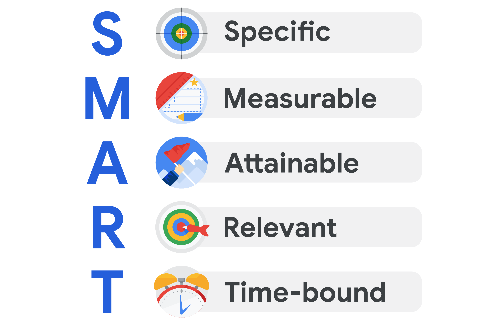

You will learn how to define and create measurable project goals and deliverables; how to define project scope, differentiate among tasks that are in-scope and out-of-scope, and avoid scope creep; and how to define and measure a project’s success criteria.

**学习目标**

- Define and create measurable project goals and deliverables.
- Define project scope and differentiate among tasks that are in-scope and out-of-scope.
- Explain how to manage scope creep to avoid impacting project goals
- Define and measure a project’s success criteria.

# Identifying project goals

## Introduction: Defining project goals, scope, and success criteria

Welcome back. By now you should have a better sense of how the different parts of the initiation come together to form the beginnings of a project. So far, you've outlined the key components of project initiation and, most importantly, you've learned that a lack of preparation during this stage can lead to problems later on. We're going to continue honing your project preparation skills. Once we're done here, you'll be able to define and create project goals and deliverables, the guiding stars of your project. You'll also be able to define project scope, the boundaries of your project, that state what is and is not part of your project. You'll be able to identify what's in-scope and out-of-scope for a project and you'll be able to recognize scope creep, something you'll need to keep a close eye on to help you reach your project goal. Finally, you'll be able to explain different ways of defining and measuring your project's success criteria. Before we get started, I'd like to talk through an example that we'll follow for the rest of this course. Imagine that you're the lead project manager at Office Green, a commercial landscaping company that specializes in plant decor for offices and other businesses. The Director of Product at Office Green has an idea for a new service called Plant Pals to offer high-volume customers small, low-maintenance plants, like little cacti and leafy ferns, for their desks. As the project manager, you've been tasked with managing the roll out of this new service. As we go through this course, we'll return to your role as the project manager at Office Green, to help teach you about project goals, deliverables, and success criteria. You'll also see the role your team and stakeholders play in creating and following these three important components. At the end, you'll compile everything you've learned into a shared document that you can use as a portfolio to share with future employers. After this course, you'll move on to the next phases of the project life cycle, and so will your Office Green project. Enjoy.

## Determining project goals and deliverables

Welcome back. In this video, I'll define project goals and deliverables and explain why they're important. Then I'll teach you how to determine whether a goal or deliverable has been well-defined, which means it's got enough detail and information to guide you towards success. First things first, to set up a project for success, and to make your job easier, you want to figure out what needs to be done before you actually get started. You need to define exactly what your goals and deliverables are, so that you'll be able to tell your team members what to do. You need a clear picture of what you're trying to accomplish, how you're going to accomplish it, and how you know when it has been accomplished. Let's define project goals so that you can start to figure out what your project team needs to reach it. The project goal is the desired outcome of the project. It's what you've been asked to do and what you're trying to achieve. For example, your goal could be to improve the response time to customer inquiries via email by 20 percent. The goal of your Office Green project might be to increase revenue by five percent through a new service called Plant Pals that offers desk plants to top customers by the end of the year. Goals are important because they give you a roadmap to your destination. Without a clear goal in mind, how can you know where to go or how to get there? Now, one of the biggest differences between what makes a good goal and a not-so-good goal is how well it's defined. Meaning: how clear and specific is the goal. If the goal is your destination, are you confident you'll know when you've arrived? The examples I mentioned before, to improve the response time to customer inquiries via email by 20 percent, and to increase the Office Green revenue by five percent are two well-defined goals because they tell you what you're trying to achieve. But wait, there's more. These goals also tell you how to do what you've been asked to do. In this case, it's via email and through a new service offering, and that's not all. These goals clarify the goal even further by saying "to improve by 20 percent and increase by five percent." Now we know where we're going. Well-defined goals are both specific and measurable. They give you a clear sense of what you are trying to accomplish. Really great goals have even more detail, but I'll get to that soon. When you start a project, take time to review your goals and make sure they're well-defined. To do this, you might need to get more information from your stakeholders. Talk to them about their vision for the project. Ask how this aligns to the company's larger goals and mission. By the end of that conversation, you and your stakeholders should agree to support the project goals in order to avoid running into issues later on. Here's an example from my own experience as a project manager. Our team had finished a new product feature. Our stated goal was to deliver an early version of this feature and collect user feedback. When we delivered the feature to one of our key customers for user feedback, the customer didn't have anyone available to try it out. Our team debated whether or not we had met the goal if we hadn't collected user feedback. Some felt that we hadn't achieved the stated goal while others thought we did. The customer was satisfied with our team's ability to deliver a feature in the timeline stated. But our internal team, wasted valuable time going back and forth about it. That said, make sure that before you start your project, you, your stakeholders, and your team are all clear on the project goals so that you know you're making the right kind of progress. I'll teach you a process for how to do this coming up. Once you have the goals nailed down, it's time to examine the project deliverables. Project deliverables are the products or services that are created for the customer, client, or project sponsor. In other words, a deliverable is what gets produced or presented at the end of a task, event, or process. Take the goal to improve customer response time. the deliverable for that goal could be the creation of email templates for responding to typical questions. Your Office Green project goal to increase revenues could have these two deliverables: launching the plant service and a finished website that highlights the new kinds of plants being offered. These are considered deliverables because they describe tangible outputs that show stakeholders how additional revenues will be generated. There are all sorts of project deliverable examples. A pretty common one is a report. When a goal is reached, you can visibly see the results documented in the chart, graph, or presentation. Deliverables help us quantify and realize the impact of the project. Just like needing well-defined goals, you need well-defined deliverables for pretty much the same reasons. Deliverables are usually decided upfront with the stakeholders or clients involved in the project. They hold everyone accountable and are typically a big part of achieving the goal. Make sure to ask questions about what the deliverable should be and have everyone share their vision and expectations of the deliverables so that you're all on the same page. Coming up, you'll practice the art of defining your goals even further following the SMART method. Enjoy.

## How to set SMART goals

Welcome back, by now you know that goals are important to the success of your project, and you know that they need to be well-defined in order to help keep your project on track. Since your deliverables depend on your goals, it's in your best interest to get those goals as well- defined as possible. Lucky for you, I've got an easy method for doing just that: setting SMART goals. I already mentioned that goals should be specific and measurable. The SMART method to evaluate goals add three more considerations for success. Be attainable, be relevant, and be time-bound. Put them all together, and what do you have? SMART goals. As an entry-level project manager, you may or may not be setting the project's main goals, but you will need to be able to identify and clarify them as needed, and that's where the SMART method can be a valuable tool. Let's take a closer look at each term. As I've already mentioned, if your goal is not specific, you'll have trouble figuring out how long it should take to complete and whether or not you've accomplished it. For example, if the goal is simply to improve customer service response time, that's not very specific. It does tell you what you want to achieve in general, but it doesn't say anything else. If you improve response time by one percent, is that enough? If after five years response time finally goes up, is that enough? How about if only half of your staff improves their response times, but the other half stays the same. Specific goals should answer at least two of the questions I'm about to ask. What do I want to accomplish? Why is this a goal? Does it have a specific reason, purpose, or benefit? Who is involved? Who is the recipient? Employees, customers, the community at large? Where should the goal be delivered? Finally, to what degree? In other words, what are the requirements and constraints? Next, we want to set goals that are measurable, meaning we can determine that they were objectively met. Measuring is not only a way for people to track progress, but also a tool to help people stay motivated. You can tell the goal is measurable by asking how much, how many, and how will I know when it's accomplished? Sometimes the success of a goal can be measured with a simple yes or no. Did you learn to play the guitar, yes or no? You will need to measure most of the goals you have with metrics. Metrics, what you use to measure something like numbers or figures. For example, if your goal was to run a five kilometer race, then distance in kilometers is your metric. At Office Green, the project goal is to increase revenue by five percent. In this case, revenue is the metric. Lastly, consider benchmarks or points of reference to make sure you're choosing accurate metrics. For instance, if your overall goal is to increase revenue, you can look at last year's data as a benchmark for deciding how much to increase revenue this year. If last year's revenue increased by three percent, then an increase by five percent in a booming economy would be a reasonable goal for this year. Ok, so the goal is specific and measurable, but is it attainable? Can it reasonably be reached based on the metrics? Typically, you want goals that are a little challenging to encourage growth, otherwise, what's the point of the goal if nothing's going to change? However, you don't want it to be too extreme or you'll never reach it. You'll have failed before you even started. Aim to find a balance between the two extremes. For example, let's take the goal to run a 5K. Say you regularly run 2.5 kilometers, three times a week. An attainable goal will be to go from running 2.5 kilometers to running five kilometers within four weeks. An unattainable goal might be earning first-place in the 5K. I mean, it could happen, but it's not likely, especially if you've never run a race before. But how can you know if a goal is attainable, if it's unfamiliar? A clue to helping you figure out if your goal is attainable, is to ask: how can it be accomplished? Break down the goal into smaller parts and see if it makes sense. Going from 2.5 kilometers to five kilometers over four weeks means increasing your distance by a little over half a kilometer each week. That's not so bad, use the same process on your Office Green project goal. Businesses usually conduct quarterly reviews. So let's assume that increase is expected to occur over the course of a year or four quarters. In order to meet the goal, you need to see an increase of at least 1.25 percent each quarter, seems pretty reasonable to me. What wouldn't be reasonable is setting a goal of increasing revenues by 50 percent or 100 percent, unless your research showed that business was improving that quickly. Your goal is specific, measurable, and attainable. Now let's see if it's relevant. In other words, does it make sense to try and reach this goal? Think about how the goal lines up with other goals, priorities and values. Ask whether the goal seems worthwhile. Does the effort involved balance out the benefits? Does it match your organizations' other needs and priorities? Everyone, from the client, the project team, and the people who will ultimately use the product, need to feel like the goal is worth supporting. Also, consider the timing. Both the amount of time the project will take, as well as the larger economic and social contexts can have big impacts. There might be a budget to complete the project now, but will the company be able to sustain the project over time? Is there an audience that will continue to use the product or service once it's delivered? Once you've got the answers to these questions, you should have a clear goal to help steer the project. If you still don't feel confident about the project's goals, keep digging. It's okay to ask questions if you have doubts. Communicate your concerns with the project senior stakeholders and your direct supervisor if you have one. They should be able to address some of your concerns so that you can feel confident about moving forward. If you're feeling good about the project being relevant and attainable, and you've made sure it's measurable, and has the specifics to keep you and your team focused the final item on the checklist is to make sure it's time-bound. Time-bound means your goal has a deadline. Deadlines give you a way to track your progress, otherwise, you may never reach your goal or never even get started. Time and metrics often go hand in hand, because time can also be used as a metric. Making your goal time-bound gives you a way to break down how much needs to be accomplished over time. For example, if you need to increase revenues by the end of the year, you can break down how much you need to increase each quarter, month, and week, and there you have it. Specific, measurable, attainable, relevant, and time-bound: a nearly foolproof method to create and evaluate project goals. You know what they say, work smarter, not harder. As we continue in this module, you'll learn about project scope and see how having clear goals supports all other decisions that come up during a project.

## SMART goals: Making goals meaningful	20min

In this lesson you are learning to define and create measurable project goals and deliverables. Now, let's focus on SMART goals.

**Specific, Measurable, Attainable, Relevant,** and **Time-bound (SMART)** goals are very helpful for ensuring project success. As you start your career in project management, you may not directly set the project goals, but you should be able to clarify and understand them. SMART goals help you see the full scope of a goal, determine its feasibility, and clearly define project success in concrete terms. 

Let’s recap what we discussed in the previous video by taking a look at a breakdown of the criteria for SMART goals below: 

- **Specific:** The objective has no ambiguity for the project team to misinterpret. 
- **Measurable:** Metrics help the project team determine when the objective is met.
- **Attainable:** The project team agrees the objective is realistic.
- **Relevant:** The goal fits the organization’s strategic plan and supports the project charter.
- **Time-bound:** The project team documents a date to achieve the goal.

You may see variations on what each letter in the “SMART” acronym stands for. (For example, you may see “actionable” or “achievable” instead of “attainable” or “realistic” instead of “relevant.”) However, the general intent of each of these terms—to make sure the goal is within reach—is always similar.

**Focusing on the "M" in SMART**

Let’s take a moment to zoom in on the **M** in SMART, which stands for **measurable**. Having measurable goals allows you to assess the success of your project based on quantifiable or tangible metrics, such as dollar amounts, number of outputs, quantities, etc. Measurable goals are important because they leave little room for confusion around expectations from stakeholders. 

Not every metric will have value, so you will have to determine which metrics make sense for the project. For example, measuring how many meetings the software engineers on your project attend on a weekly basis may not be the most valuable metric for a productivity goal. Alternatively, you might measure other aspects of the engineers’ productivity, such as a particular number of features created per engineer or a specific number of issues flagged per day.

**Defining a SMART goal**

Let’s explore an example related to making a personal goal measurable. Imagine you are looking to make a career change, and you set a goal to complete a Google Career Certificate. You can **measure** the success of this goal because after completing the entire program, you will receive a certificate—a tangible outcome.

Now, let’s determine how to make the remaining elements of this goal SMART. In this example, your **specific** goal is to attain a Google Career Certificate. You can make this goal **attainable** by deciding that you will complete one course per month. This goal is **relevant** because it supports your desire to make a career change. Finally, you can make this goal **time-bound** by deciding that you will complete the program within six months.

After defining each of these components, your SMART goal then becomes: Obtain a Google Career Certificate by taking one course per month within the next six months.

**Key takeaway**

Determining metrics can be extremely helpful in capturing statuses, successes, delays, and more in a project. As a project manager, identifying meaningful metrics can help move the project toward its goal. Additionally, by defining each element of a project goal to make it SMART, you can determine what success means for that goal and how to achieve it. 

## Navigating Peer/Self Reviews

Hello again. Throughout the program, you have the chance to practice project management skills in a few different ways. In addition to multiple choice and short answer quizzes, you complete hands on activities to apply what you've learned. You'll solve common project problems in real world situations and create the kinds of artifacts project managers use every day. Completing these hands on activities is really important to your success in this program. They'll give you practical experience that can help you describe your skills in interviews or use them to manage projects more effectively in your personal or professional life. To help you prepare, I'll introduce you to two different types of hands on activities that we prepared for you. I'll also share some tips and tricks that will let you get the most out of them. And one type of activity, you review a project management scenario and follow step by step instructions to move the project forward. Your job could be to learn about stakeholders, assigned task owners or organized documents, so they're easy to find. You can recognize these exercises as quizzes with activity in the title. When you finish an activity, we'll take you through an exemplar of the completed assignment that you can compare to your own work. Be sure to review these exemplars carefully, so you know what you did well and how you can improve next time. Keep in mind that some activities can have more than one right answer, just like real problems can have more than one solution. The exemplars for these activities explain one way of doing things, but they also point out where you could do things differently. This helps you check your approach to an assignment, not just your answers. Certain activities also include quiz questions that help you check your work. These quizzes can be graded or ungraded and give you another way to measure your progress and expand your knowledge. Another type of hands on activity is the peer review or peer graded assignment. These activities follow a similar format to the first, you will review of project management scenario and complete a set of step by step instructions. But there's one major difference, your classmates will grade your assignment and you'll grade theirs. For each peer review, you need to grade at least two submissions, but you can grade more if you want. This peer grading process is a key part of the learning experience for this program. That's because it gives you objective feedback on your work and let you know how others are approaching the same challenges. Peer grading gives you the chance to learn not just from us, the instructors but from each other as well. To grade each other's work, you will use what's known as a rubric, a rubric as a checklist of items your assignment must include, with each item worth a certain number of points. You typically need to score at least 80% correct to pass a peer graded assignment. So for example if a rubric has 10 points, you need a minimum of 8 points to pass. In addition to using these rubrics to grade your peers, you can review them before you submit your own assignments, so you understand how you'll be graded. Peer grading is also important because it lets you give and receive qualitative feedback. For example, if a peer does well, you could tell them they did a great job refining a goal or that you like their creative solution to a problem. Positive feedback helps you and your peers learn about your strength and motivates you to do your best work. On the other hand, it's just as important if not more so to learn from your mistakes. If a peer get something wrong, be sure to leave thoughtful, constructive feedback, so they understand why they didn't get full credit. That way, they'll know what to review and how to improve, so they can become better project managers. And don't worry, we'll give you some tips on how to leave constructive feedback for each activity. Peer review is a valuable tool, but unlike other assessments in the program, it may take some time to receive your grades. Remember that real people aren't as fast as computers, so we can take up to 10 days for grades to appear. Additionally, it can take some time before there are assignments available for you to grade. Be patient, your peers may be working through the course at a different pace and remember you can always move on to other items in the course and come back if you need to. If for any reason you aren't able to access a peer submission or if a submission is incomplete, you can skip it and go to a different one. To learn how to do this, continue onto the optional reading. This reading will also tell you more about the peer review process and link you to helpful resources on topics like where to find your feedback and how to change your sharing settings and google docs. So be sure to check it out. Great. Now that you know more about some of the hands on activities to find throughout the program, you're ready to get started.

## Optional: What to know about peer-graded assignments

Throughout this course, you will complete a few different types of hands-on activities that let you apply your project management skills in “real-world” situations. These assignments ask you to think through common project management problems, find solutions, and create essential project management artifacts.

For some of these assignments, you’ll need to submit your work for other learners to grade. This peer review process is a central part of the learning experience. It allows you to assess activities objectively against a set rubric, and compare your approach with those of your peers. It also gives you the option to give and receive qualitative feedback.

You’ll need to complete peer-graded assignments in each course, so here’s what you need to know:

**How peer-grading works**

Before submitting the activity, you can check your work against a list of required items it should contain. Review this list carefully and revise your work before submitting, if necessary. This list matches the rubric your peers will use to grade your assignment (and that you will use to grade theirs). 

You should receive grades from at least two peers for each peer-graded assignment you complete. As a grader, you can review as many submissions as you like, but you must mark at least two assignments to move on in the course. 

**Optional feedback**

When grading a peer’s assignment, you will have the option to give qualitative feedback. We encourage you to leave thoughtful comments about what they did well and where they can improve. This feedback can help you and your peers understand why you lost points for certain rubric items, so you can do better next time. Each assignment includes tips and examples of good feedback to help you write constructive comments.

**Submitting your work**

Most assignments involve submitting documents or spreadsheets for review. You have the option to submit your peer-graded assignments as either a URL (to a shared Google doc for example) or as a downloadable file (like a .docx file). To grade your work, your peer reviewers will access the shared doc or download the file you submitted.

Coursera automatically assigns you a personalized deadline for each assignment in the course. Make note of this date and aim to submit your work on time—the earlier, the better. You are more likely to get timely feedback if you turn in your assignment a day or two *before* the deadline.

**What to do if you don’t receive a grade**

If you submitted your assignment as a URL, and no one has reviewed it after a few days, check your Google sharing settings to ensure “view” access is enabled. (Visit [this resource](https://www.coursera.org/learn/project-initiation-google/resources/FOW2Z) to learn more about file sharing.) 

If your share settings are correct and you still haven’t received a grade (or if you need assignments to grade yourself), you have two options:

1. Check when you submitted your assignment. It can take up to a week for grades to appear, so you may need to wait a little longer. New graders and assignments should be available within a few days.
2. Ask for reviewers (or items to review) in the discussion forums. Posts like this are common, so you can post your submission link for peers to review, or skim through forum posts to find items to grade.

**What to do if you need a new assignment to grade**

Sometimes, while you’re grading your peers, you may find you aren’t able to access or open a file. If you can’t grade an assignment for any reason, you can skip it and move on to a different submission. To do this, select *Flag this submission* (located at the upper-right corner of the prompt box in the grading pane):

A link to "flag this submission," with an image of a flag.

You will be prompted to select a reason for the flag and provide an explanation in the text box:

A "flag this submission" modal. The selected reason for the flag is "Other (please provide details below)." The explanation given is, 'The sharing settings are not set to "anyone with the link," so I can't access the file.

Once you select *Send report*, you'll receive a confirmation message and a different submission will appear below. 

***Note:*** *Flagging a learner's submission as inaccessible will not affect their grade.*

**Need more help?**

If you have questions on peer-graded assignments as you move through the courses, take a look at these Coursera Learner support articles: 

- [Submit peer reviewed assignments](https://www.coursera.support/s/article/208279926-Submit-peer-reviewed-assignments)

- [Submit feedback and grades for peer reviewed assignments](https://learner.coursera.help/hc/en-us/articles/208279946-See-feedback-and-grades-for-peer-reviewed-assignments)

## Introduction to OKRs

Hi there. So far you've been learning to define and create measurable project goals and deliverables. As you broaden your understanding of project management and the different tools available to help you succeed, I want to teach you about a popular tool used in many organizations and here at Google: objectives and Key results, or OKRs. In this video, I'll discuss what OKRs are, how they are used by organizations, and how they help focus a team's time and effort on activities that drive success. You've just learned about, and practiced, the SMART method for defining project goals. Like the SMART method, OKRs help establish and clarify goals or objectives for an organization, department, project or person. OKRs take SMART goals a step further by combining a goal and more detailed metrics to determine a measurable outcome. They not only state clearly what the goal is, they provide specific details that allow you to measure the success of the goal. One way to think about OKRs is that they separate the different components of SMART goals and clarify them even further, rather than grouping everything into one statement. Let's break this down. The O stands for objective, and defines what needs to be achieved. It describes the desired result or outcome, such as an increase in customer retention, or an improvement on the employee onboarding process. KR stands for key results. These are the measurable outcomes that define when the objective has been met. For example, if your objective is to improve customer retention, then the key result might be to have 90 percent customer satisfaction rating by the end of the first quarter. Recall that one of the SMART criteria is attainability, which means it's practical to achieve the goal. Key results, however, should be a little more ambitious. Here at Google, we actually use OKRs to set stretch goals as a way to challenge ourselves to do something we haven't accomplished before. If we actually accomplish all of our key results, we may have made our OKRs a bit too easy. Let's review quickly. Objectives define what needs to be achieved and describe a desired outcome. Key results define how you'll know whether or not you've met your objective. How do OKRs work in practice? How do you use them to manage a project? Organizations often set OKRs at different levels, such as the company level, department or team level, and project level. Company-level OKRs are commonly shared across an organization so that everyone is clear on the company's goals. They are usually updated on an annual basis to help drive the organization in the direction it wants to go. These high-level OKRs support the mission of the organization. Project-level OKRs should support and be aligned with company-level OKRs. An example of a company-level objective at Office Green is increase customer retention by adapting to the changing workplace environment. This is a big, aspirational goal that applies to the entire company and all of its endeavors. In order to focus their efforts to reach this objective, Office Green might develop key results that include 95 percent of phone, chat, and email customer support tickets are resolved during the first contact. Top three most requested new offerings for distributed office environments are in pilot by the end of the second quarter, and sales and support channels are available 24/7 by the end of the year. Some of these company-level key results could become the basis for projects. For example, the key result, "top three most requested new offerings for distributed office environments that are in pilot by the end of the second quarter," could become the Plant Pals project. Team or department-level OKRs, support the company's broader OKRs and help drive team performance. Departments may develop OKRs that are more specific to their job function as well. For example, the company-level key result "sales and support channels are available 24/7 by the end of the year," could lead to a related sales department objective like: increase the sales team presence nationwide. And the key result: new sales offices are open in 10 cities by the end of the year. Project-level OKRs are set during the initiation phase to help define measurable project goals. They're tracked throughout the planning and execution stages to measure project success. Project-level OKRs need to align with and support both company and department-level OKRs. For example, in order to align with Office Green's company-wide objective to increase customer retention by adapting to the changing workplace environment, a project objective for Plant Pals might be to enroll existing customers in the Plant Pals service. A key result for this objective might be 25 percent of existing customers sign up for the Plant Pals pilot. Let's recap. OKR stands for objectives and key results. They combine a goal and a metric to determine a measurable outcome. Objectives define what needs to be achieved and describe a desired outcome. Key results define how you will measure the outcome of your objective. Company-level OKRs are shared across an organization so that everyone can align and focus their efforts to help the company reach its goals. Project-level OKRs help define measurable project goals. They need to align with and support both company and departmental-level OKRs. Great. Now that you have a better idea of what OKRs are and how they function, you can practice creating OKRs on your own.

## Creating OKRs for your project

In this lesson, you are learning to define and create measurable project goals and deliverables. This reading will focus on creating effective **objectives and key results (OKRs)** and how to implement them into your project.

**What are OKRs?**

OKR stands for objectives and key results. They combine a goal and a metric to determine a measurable outcome. 

Objectives: Defines what needs to be achieved; describes a desired outcome. Key results: The measurable outcomes that objectively define when the objective has been met

Company-wide OKRs are used to set an ultimate goal for an entire organization, whole team, or department. Project-level OKRs describe the focused results each group will need to achieve in order to support the organization.

**OKRs and project management**

As a project manager, OKRs can help you expand upon project goals and further clarify the deliverables you’ll need from the project to accomplish those goals. Project-level OKRs help establish the appropriate scope for your team so that you can say “no” to requests that may get in the way of them meeting their objectives. You can also create and use project-level OKRs to help motivate your team since OKRs are intended to challenge you to push past what’s easily achievable. 

**Creating OKRs for your project**

**Set your objectives**

Project objectives should be aspirational, aligned with organizational goals, action-oriented, concrete, and significant. Consider the vision you and your stakeholders have for your project and determine what you want the project team to accomplish in 3–6 months.

**Examples:**

- Build the most secure data security software 
- Continuously improve web analytics and conversions
- Provide a top-performing service
- Make a universally-available app
- Increase market reach
- Achieve top sales among competitors in the region

Strong **objectives** meet the following criteria. They are:

- Aspirational
- Aligned with organizational goals
- Action-oriented
- Concrete
- Significant

To help shape each objective, ask yourself and your team:

- Does the objective help in achieving the project’s overall goals?
- Does the objective align with company and departmental OKRs?
- Is the objective inspiring and motivational?
- Will achieving the objective make a significant impact?

**Develop key results**

Next, add 2–3 key results for each objective. Key results should be time-bound. They can be used to indicate the amount of progress to achieve within a shorter period or to define whether you’ve met your objective at the end of the project. They should also challenge you and your team to stretch yourselves to achieve more.

**Examples:**

- X% new signups within first quarter post launch
- Increase advertiser spend by X% within the first two quarters of the year
- New feature adoption is at least X% by the end of the year
- Maximum 2 critical bugs are reported monthly by customers per Sprint
- Maintain newsletter unsubscribe rate at X% this calendar year

Strong **key results** meet the following criteria:

- Results-oriented—**not** a task
- Measurable and verifiable
- Specific and time-bound
- Aggressive yet realistic

To help shape your key results, ask yourself and your team the following:

- What does success mean?
- What metrics would prove that we’ve successfully achieved the objective?

**OKR development best practices**

Here are some best practices to keep in mind when writing OKRs:

- Think of your objectives as being motivational and inspiring and your key results as being tactical and specific. The objective describes what you want to do and the key results describe how you’ll know you did it. 
- As a general rule, try to develop around 2–-3 key results for each objective.
- Be sure to document your OKRs and link to them in your project plan.

**OKRs versus SMART goals**

Earlier in this lesson, you learned how to craft SMART goals for your project. While SMART goals and OKRs have some similarities, there are key differences, as well. The following article describes how SMART goals and OKRs are similar, how they differ, and when you might want to use one or the other: [Understanding the Unique Utility of OKRs vs. SMART Goals](https://www.smartsheet.com/content/okr-vs-smart-goals)

To learn more how OKRs work to help project managers define and create measurable project goals and deliverables, check out the following resources:

- [Google’s OKR playbook](https://www.whatmatters.com/resources/google-okr-playbook/)
- [Planning company goals](https://asana.com/guide/examples/project-management/goals-okrs-planning)
- [OKRs and SMART goals: What's the difference?](https://www.whatmatters.com/resources/okrs-smart-goals-difference-between/)
- [OKRs and KPIs: What They Are and How They Work Together](https://www.reflektive.com/blog/okrs-and-kpis-what-they-are-and-how-they-work-together/)
- [How OKR and project management work together](https://www.perdoo.com/resources/okr-and-project-management/)
- [OKR Examples](https://www.workfront.com/strategic-planning/goals/okr/okr-examples)
- [OKR TED Talk](https://www.whatmatters.com/articles/ted-talk/) video (John Doerr, the founder of OKRs, explains why the secret to success is setting the right goals.)

# Defining project scope

## Determining a project's scope

Welcome back. Project scope is a really important concept that I want to tell you about. You'll hear it come up time and time again throughout each phase of the project life cycle. In fact, you may even find yourself defending it, so let's get acquainted with scope. In this video, you will learn how to define and determine scope. Simply put, your project scope includes the boundaries of a project. The way we define it at Google is "an agreed upon understanding as to what is included or excluded from a project." Scope helps ensure that your project is clearly defined and mapped out. That means knowing exactly who the project will be delivered to and who will be using the end result of the project. You also need a firm understanding of the project's complexity. Is it straightforward with an easily manageable list of tasks? Or will it require extensive research, multiple rounds of approvals, and a large-scale production process that will take years to complete? Scope also includes the project timeline, budget, and resources. You need to clearly define these so that you can make sure you're working within those boundaries and what's actually possible for the project to work. Poorly-defined scope or major changes to your scope can cause changes to the budget, timeline, or even final outcome of the project. Let's look at the scope of your Office Green project as an example. As a reminder, the new Plant Pals service offers customers small, low-maintenance, plants like cacti and leafy ferns that they can place on their desks. Customers can order them online or from a print catalog, and Office Green will ship the plants straight to the customer's work address. Things to consider for your scope, then, might be whether or not to provide replacement plants; which customer segments will be offered the service; whether or not the online catalog is an app, a website, or both; and how to ensure customers can purchase from the online catalog, whether by phone, PC, Mac, iPhone, or Android. You might also consider the dimensions of the paper catalog and whether it needs to be in color or black and white and on what kind of paper. Now, how do you actually figure out the scope of your project? It's simple: talk to your sponsors and stakeholders, understand what their goals are, and find out what is, and this is really important, what is not included in the project. We've covered a number of different ways to help you determine scope. Here are a few more helpful questions to add to the list. Where did the project come from? Why is it needed? What is the project expected to achieve? What does the project sponsor have in mind? Who approves the final results? Now you'll really be set. As for timing, defining project scope should happen during the initial planning stage. You want to start figuring out the scope early on so that everyone can agree to the same set of expectations. It will help mitigate the risks of big changes down the line. Although you can always adjust the scope as planning continues, if you need to. Once you understand your project scope, you want to document all the details so that anyone can refer back to it throughout the life cycle of the project. We'll talk about some best practices for that at the end of this module. Let's recap: a clearly defined scope describes all the details of a project and regulates what can be added or removed as it progresses. While it's ultimately the project manager's responsibility to monitor the project and make sure all the work and resources fall within its scope, team members and stakeholders can be encouraged to do their part by focusing on the task that are the most important to reaching the project's goal. The next video talks about the concepts of "in-scope" and "out-of-scope" and the phenomenon called "scope creep." All three will help with ensuring your project stays on track and within budget. Stay tuned.

# Measuring a project's success

# Review: Defining project goals, scope, and success criteria

