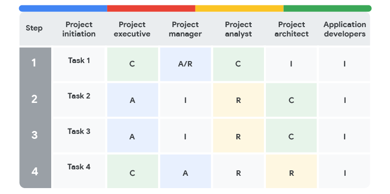

You will learn how to define project roles and responsibilities, complete a stakeholder analysis, and utilize RACI charts to define and communicate project team member responsibilities.

**学习目标**

- Define project roles and responsibilities.
- Complete a stakeholder analysis and explain its significance-重要性.
- Utilize RACI charts to define and communicate project team member responsibilities.

# Exploring project team roles and responsibilities

> 探索项目团队的角色和职责

## Introduction: Working effectively with stakeholders

> 引言:有效地与利益相关者合作	1min

Welcome back.

In this module, we'll learn all about stakeholders and their importance to a project.

>  在这个模块中，我们将学习所有关于利益相关者及其对项目的重要性。

In the last set of videos, you learned the ins and outs of project scope.

> 在上一组视频中，您了解了项目范围的来龙去脉。

While exploring how a project can be in-scope or out-of-scope, you learned about setting SMART goals.

> 在探索项目如何在范围内或范围外时，您了解了如何设置聪明的目标。

We also discussed launching a project (getting it started) versus landing a project (whether or not it was successful).

> 我们还讨论了启动一个项目(启动它)和落地一个项目(是否成功)。

And there are a lot more exciting topics to come!

In this module you'll learn more about stakeholders.

Remember that stakeholders play a pivotal-关键的 role.

> 记住，利益相关者扮演着关键的角色。

They are people who are interested in and affected by the project's completion and success.

> 他们是对项目的完成和成功感兴趣并受其影响的人。

You'll see that each person involved has a set role and set responsibilities to help bring the project to a landing.

> 你会看到每个参与的人都有一个固定的角色和责任，以帮助项目落地。

Those roles include project sponsors, customers, team members, and of course, you, the project manager.

> 这些角色包括项目发起人、客户、团队成员，当然还有您，项目经理。

You will also find out about things like stakeholder mapping and analysis and RACI charts.

> 您还将了解诸如利益相关者映射和分析以及RACI图表之类的内容。

These are tools that help clarify roles and responsibilities and prevent-阻止,阻碍 confusion-困惑,不明确 on who takes ownership of which tasks. 

> 这些工具有助于明确角色和职责，并防止在谁承担哪些任务的所有权方面出现混乱。

Throughout this module, you'll have plenty-十分 of hands-on activities, discussion prompts-提示, and readings to really help you master how to start a project.

> 在整个模块中，你将有大量的实践活动、讨论提示和阅读来真正帮助你掌握如何开始一个项目。

As we go through each new skill, imagine checking off a to-do list.

> 当我们学习每一项新技能时，想象一下检查待办事项清单。

There's almost nothing more satisfying than **crossing off**-划掉 a to-do!

> 几乎没有什么比划掉待办事项更令人满意的了!

## Accessibility for project managers

> 项目经理的可访问性

Hello, nice to meet you.

My name is Holly and I will be your accessibility instructor-导师,教练 for this course.

Accessibility should be incorporated-合并的,混合 into every role at a company, whether-无论 a product designer, communicator, developer or yes, project manager.

> 可访问性应该融入到公司的每个角色中，无论是产品设计师、沟通者、开发人员还是项目经理。

In my role of accessibility-无障碍 education program manager at Google, I help ensure all Googlers are educated on accessibility, from building accessible products for the entire world, to communicating accessibility with you throughout this course.

> 作为谷歌无障碍教育项目经理，我帮助确保所有谷歌员工都接受无障碍教育，从为全世界打造无障碍产品，到在整个课程中与你交流无障碍。

I'm deaf-聋人 myself, so I am able to share my experiences as a person with a disability-残疾,缺陷 too and help others understand that having a disability isn't a barrier in itself.

> 我自己是聋人，所以我也可以分享我作为一个残疾人的经历，并帮助其他人理解残疾本身并不是一种障碍。

It's the world around us that we must strive-努力 to make it accessible-可到达的 for everyone.

> 这是我们周围的世界，我们必须努力使它对每个人都开放。

Accessibility can be defined in a number of different ways.

> 可访问性可以用许多不同的方式定义。

To me, it means actively removing any barriers that might prevent-阻止,阻碍 persons with disabilities-残疾 from being able to access-获得 technology, information, or experiences, and leveling in the playing field so everyone has an equal chance of enjoying life and being successful.

> 对我来说，这意味着积极消除任何可能阻止残疾人获得技术、信息或经验的障碍，并在竞争环境中保持公平，使每个人都有平等的机会享受生活和成功。

A disability is often defined as a physical or mental-精神的,思想的,智力的 condition-疾病 that substantially-基本上 limits a major-严重的 life activity, such as walking, talking, seeing, hearing, or learning.

> 残疾通常被定义为一种身体或精神状况，严重限制了主要的生活活动，如走路、说话、看、听或学习。

Over one billion people in the world have a disability, 1 billion.

> 世界上有超过10亿人身患残疾，10亿人。

That's more than the population-人口 of the United States, Canada, France, Italy, Japan, Mexico, and Brazil combined.

> 这比美国、加拿大、法国、意大利、日本、墨西哥和巴西的人口加起来还要多。

Disability is diverse-不同的,各式各样的 and intersectional-交点的,区间的.

> 残疾是多样和交叉的。

Someone can be born-天生的 with a condition-疾病 or acquire-患上 it later in life.

> 有些人可能天生就患有某种疾病，也可能在以后的生活中患上这种疾病。

Disability can affect us all in some way, whether directly or indirectly, and at any time, from permanent-永久性, like deafness-聋,听力不佳, to temporary-暂时的,临时的, like a broken leg-腿, to situational-环境形成的, like trying to operate a TV remote control-遥控的 in the dark.

> 残疾可以在某种程度上影响我们所有人，无论是直接的还是间接的，在任何时候，从永久性的，比如耳聋，到暂时性的，比如腿断了，再到情景性的，比如在黑暗中试图操作电视遥控器。

When you create solutions for persons with disabilities, you are not only serving the critical-关键的 audience-观众,听众 of people with permanent-永久性 disabilities, you are also unlocking secondary-次要的 benefits for everyone who may move in and out of disability **over time**-随着时间的推移.

> 当您为残疾人创建解决方案时，您不仅是在为永久性残疾人的关键受众服务，而且还为每个可能随着时间的推移进入和摆脱残疾的人提供了次要利益。

As you progress through this course, it's also important to keep in mind your fellow-同学 classmates.

> 在你学习这门课程的过程中，记住你的同学也很重要。

Setting the expectation that you'll be interacting-相互作用 with others that learn and work differently is a key strength-优势 of working with accessibility in mind.

> 设定期望，你将与其他学习和工作方式不同的人互动，这是在工作中牢记可访问性的关键优势。

Asking others what they need from you to learn and communicate and also sharing what you need if you have a disability yourself is important to working well together as a team.

> 询问别人需要你做什么来学习和交流，如果你自己有残疾，也要分享你需要什么，这对团队合作很重要。

In project management, you, yourself, people on your project team, or people highly invested-投资,花费 in your project may have a disability, whether visible or invisible.

> 在项目管理中，您，您自己，您的项目团队中的人，或者高度投资于您的项目的人可能有残疾，无论是可见的还是不可见的。

As a project manager, you are responsible for making sure a group of people can come together to achieve a common goal using shared tools and systems.

> 作为一个项目经理，你有责任确保一群人能够聚在一起，使用共享的工具和系统来实现共同的目标。

In order to be successful, you need to make sure the infrastructure-基础设施,基础建设 and culture you set up works for everyone.

> 为了取得成功，你需要确保你所建立的基础设施和文化适合每个人。

Knowing this is a key element of project management.

> 了解这一点是项目管理的关键要素。

I'll teach you how to make your work and content accessible.

> 我会教你如何让你的工作和内容可访问。

I'll also help you become a better project manager by considering accessibility in your future projects.

I'll offer tips and best practices throughout the program, starting with this one.

> 我将在整个程序中提供技巧和最佳实践，从这个开始。

Did you know that many technologies that we all enjoy-喜欢 **started out**-开始,着手 as an accessibility feature?

> 你知道吗，许多我们都喜欢的技术最初都是作为一种可访问性功能的吗?

Think about the Google Assistant-助理,助手, which allows you to control your home with your voice, or close captioning-字幕, which makes it possible-可能的 to watch the TV **above-高于 a crowded**-在拥挤的, noisy bar.

> 想想谷歌助手，它可以让你用声音控制你的家，或者关闭字幕，它可以让你在拥挤嘈杂的酒吧上看电视。

By considering accessibility, you can impact everyone's lives for the better.

> 通过考虑可访问性，你可以让每个人的生活变得更好。

I'm excited to share more with you throughout the program where you'll learn more about project management and prepare for a career in this field.

> 我很高兴能在整个课程中与大家分享更多信息，在这里你们将学到更多关于项目管理的知识，并为在这个领域的职业生涯做好准备。

See you later.

## Choosing a project team

> 选择一个项目团队	5min

In this video, I'll take you through-经历,度过 the process-过程 of choosing roles and responsibilities of all the people on your project team.

> 在这个视频中，我将带你经历选择项目团队中所有人的角色和职责的过程。

In order to decide who does what on a project, we have to consider and outline-概述 our needs.

> 为了决定谁在一个项目中做什么，我们必须考虑并概述我们的需求。

Choosing the right people for a team is a big task, and one every project manager should take seriously-严肃地,认真地.

> 为团队选择合适的人是一项艰巨的任务，每个项目经理都应该认真对待。

After all, these are the people who do the work on the project, so we want to make sure we have the right people lined up.

> 毕竟，这些人是在项目中工作的人，所以我们要确保我们有合适的人选。

When identifying people resources, we need to carefully consider the project needs and use that info to guide our decision-making-决策.

> 在确定人员资源时，我们需要仔细考虑项目需求，并使用这些信息来指导我们的决策。

First, a project manager will make a list of roles that they'll need on their team to complete each task.

> 首先，项目经理会列出团队中完成每项任务所需要的角色。

In the same way that a project manager is accountable for the overall initiation, planning, execution, and completion of a project, the person in each role is accountable for specific tasks within the project life cycle.

> 就像项目经理对项目的启动、计划、执行和完成负责一样，每个角色中的人对项目生命周期中的特定任务负责。

For example, a home construction-建筑 project team might include roles on their lists like an architect-建筑师, a site manager, and multiple construction workers.

> 例如，一个家庭建筑项目团队可能在他们的列表中包含像架构师、站点管理员和多个建筑工人这样的角色。

Once the tasks are clearly **laid out**-摆放,布置, the project manager decides how many people they'll need on their team.

> 一旦明确了任务，项目经理就会决定他们的团队需要多少人。

This can vary greatly depending on the project size.

> 这取决于项目的大小。

For small projects, a team may only need three or four people to complete the deliverables on time, and for larger projects, a team might include dozens.

> 对于小项目，一个团队可能只需要三到四个人就可以按时完成交付，而对于较大的项目，一个团队可能包括几十个人。

At Google, we sometimes have hundreds of Googlers working on the same project.

> 在谷歌，我们有时会有数百名谷歌员工在同一个项目上工作。

Getting the team size right is important for **a bunch of**-很多 reasons.

> 合理的团队规模非常重要，原因有很多。

For example, when there's a lot of people on a project, communication sometimes becomes difficult.

> 例如，当一个项目有很多人参与时，沟通有时会变得困难。

That makes it more likely-很可能 for someone to miss important details.

> 这使得人们更有可能错过重要的细节。

But if your team is too small, there might not be enough people to finish all the tasks.

> 但是如果你的团队太小，可能没有足够的人来完成所有的任务。

Once you know how many people you need on your team, you have to think about who does what.

> 一旦你知道你的团队需要多少人，你就必须考虑谁做什么。

To decide on the right person for each role, a project manager needs to think carefully about skills.

> 为了决定每个角色的合适人选，项目经理需要仔细考虑技能。

Makes sense, right?

If you're managing the construction of a house, you want to note-注意 that the construction workers who are building the frame or installing-安装 the drywall-干式墙 have the skills needed to do it properly-正确地,适当地.

> 如果你正在管理一所房子的建造，你要注意那些建造框架或安装干墙的建筑工人拥有正确完成这些工作所需的技能。

It's on the project manager to ensure that everyone on the team has the right skills to do the job, but it's also important to remember that skills can be taught-教授.

> 项目经理有责任确保团队中的每个人都有合适的技能来完成这项工作，但同样重要的是要记住，技能是可以传授的。

If someone doesn't have a certain-某种 skill initially-开始,最初, they might still be a great fit-适合 for the team.

> 如果有人一开始没有某种技能，他们可能仍然非常适合团队。

Maybe this person brings a positive-乐观的,积极的 attitude-态度 and attention-关注,注意,注意力 to detail— perfectly-完美地 good reasons to have them on your team.

> 也许这个人会带来积极的态度和对细节的关注——这是让他们加入你的团队的绝佳理由。

Just keep in mind that if a teammate doesn't have the necessary skills, it's important that they are trained **in time**-及时 so as not to cause-导致,引起 project delays.

> 只要记住，如果一个团队成员没有必要的技能，及时培训他们是很重要的，这样就不会导致项目延迟。

When choosing teammates, a project manager also has to factor in each person's availability and whether-是否 they'll feel motivated to complete their assigned tasks.

> 在选择队友时，项目经理还必须考虑每个人的可用性，以及他们是否有动力完成分配的任务。

For example, you might know a fantastic-极好的 site-网站 manager who would make a great asset-资产,有价值的人或物 to the team, but if they're already **staffed on**-是…的职员 another big project, they might not have the time to commit-承担义务 to yours.

> 例如，您可能认识一位出色的网站经理，他对团队来说是一笔巨大的财富，但如果他们已经在另一个大项目中工作，他们可能没有时间来承担您的项目。

Or even if they do have the time, they may not feel like this project will give them the visibility-知名度 they need for a promotion-提拔,晋升. 

> 或者，即使他们有时间，他们也可能觉得这个项目不会给他们带来推广所需的知名度。

Motivation is a key ingredient-要素,因素 to great work.

> 动机是伟大工作的关键因素。

It's a good idea to pick people who are excited to get involved, but of course, we don't always get to choose our resources. 

> 选择那些乐于参与的人是个好主意，但当然，我们并不总是能够选择我们的资源。

Sometimes another manager or team lead might just assign people to roles.

> 有时，另一位经理或团队领导可能只是给人们分配角色。

When this happens, it's the project manager's challenge to deliver-交付 the best work with what we're given.

> 当这种情况发生时，项目经理面临的挑战是如何在给定的条件下交付最好的工作。

Let's check in on our project at Office Green, where we're **rolling out**-推出 a new service.

> 让我们看看我们在Office Green的项目，我们正在推出一项新服务。

As a project manager, it's up to you to decide who you need on your team.

You have to ask yourself questions on things like staff-职员的 experience, availability, the workspace, team member workload-工作量 on other projects, and more.

> 您必须问自己一些问题，比如员工经验、可用性、工作空间、团队成员在其他项目上的工作量等等。

For example, who on the team has office landscaping-景观美化 experience?

> 例如，团队中谁有办公室景观美化的经验?

Who's local to the city where the launch will happen?

> 谁是发射地点所在城市的本地人?

Who can be fully dedicated-致力于,献身于 to this project for the next eight weeks?

> 谁能在接下来的八周里全身心地投入到这个项目中?

There's no exact-确切的,精确的 formula-计划,方案 for putting together the right team, which makes it a little tricky-难对付的,棘手的.

> 没有确切的计划来组建合适的团队，这使得它有点棘手。

Every situation-情况,形势 is different and **calls for**-需要 a different set of skills, experience, and perspectives-观点.

> 每个情况都是不同的，需要不同的技能、经验和观点。

It can be helpful to look deeper into each task on the project.

> 深入了解项目中的每个任务可能会有所帮助。

Always ask yourself these key questions: how many people do I need on my team each step of the way?

> 经常问自己这些关键问题：我的团队每一步需要多少人?

Which team members do I need and when?

> 我需要哪些团队成员，什么时候需要?

Are those experts already busy on other projects?

> 这些专家已经在忙于其他项目了吗?

Who makes the final decisions on project resources?

> 谁对项目资源做出最终决定?

So there's a lot to think about when putting together your dream team.

> 所以在组建梦之队的时候有很多事情需要考虑。

Up next, we'll learn more about all the different roles on a project.

> 接下来，我们将学习更多关于项目中不同角色的知识。

See you there!

## Review: The building blocks-块 of a project dream team

> 回顾:项目梦之队的基石

In the previous video, we explored some considerations-考虑因素 for choosing your project team and assigning their roles and responsibilities.

> 在上一个视频中，我们探讨了选择项目团队和分配他们的角色和职责的一些考虑因素。

Let’s recap what you learned and expand upon what to think about when building your project team. 

> 让我们回顾一下您所学到的知识，并扩展一下在构建项目团队时应该考虑的问题。

**Too big, too small, or just right?**

> 太大，太小，还是刚刚好?

Once you lay-奠定 the foundation for your project by outlining-概述 your goals and expectations, it is time to build your dream team! 

> 一旦你通过概述你的目标和期望为你的项目奠定了基础，是时候建立你的梦之队了!

Though-虽然,尽管,不过 before we can build our dream team, we need to figure out how many people we need.

> 尽管在我们组建梦之队之前，我们需要弄清楚我们需要多少人。

This number will largely-很大程度上,主要地 depend on the size-规模 of the project itself.

> 这个数字很大程度上取决于项目本身的规模。

Complex projects with large divisions-分配 of work will usually require larger project teams.

> 具有大分工的复杂项目通常需要更大的项目团队。

Simple projects with straightforward-简单的,易懂的 expectations may only require a few people on the project team.

> 具有直接期望的简单项目可能只需要项目团队中的几个人。

As a project manager, it is your job to help find the right balance based on what is needed.

> 作为一名项目经理，你的工作是根据需求找到适当的平衡。

**The right skills and abilities to fill-充满,占满,担任,充任 the role**

> 符合职位要求的技能和能力

Multiple roles exist in every project.

> 每个项目中都存在多个角色。

On smaller teams, multiple roles may be filled by one person.

> 在较小的团队中，多个角色可能由一个人担任。

To meet the needs of more specialized-专业的,专门的 projects, project managers might require people who have the necessary **technical skills.**

> 为了满足更专业化项目的需要，项目经理可能需要具有必要技术技能的人员。

Technical skills are the skills specific to the task that needs to be performed-执行,履行.

> 技术技能是特定于需要执行的任务的技能。

For example, on the Office Green project, necessary technical skills may include indoor-室内的,户内的 landscaping-景观美化 design for the layout-布局,设计 of the plants within the offices and **floral design**-花卉设计 of plant arranging-布置. 

> 例如，在办公室绿化项目中，必要的技术技能可能包括办公室内植物布局的室内景观设计和植物布置的花卉设计。

---

Technical skills are highly-高度地 valued-重要的,宝贵的, but they are not the only skills that are important for high functioning teams.

> 技术技能受到高度重视，但它们并不是高功能团队唯一重要的技能。

Interpersonal-人际关系的,人际的 skills, also known as people skills or soft skills, such as patience-耐性,忍耐力 and conflict-冲突,争执,分歧 mediation-调解,仲裁, can help team members. 

> 人际交往能力，也被称为人际交往能力或软技能，如耐心和冲突调解，可以帮助团队成员。

This allows the team to blend-融合,协调,融合 their technical expertise-专长,专门技能 with collaborative-合作的,协作的 skills in order to get the job done.

> 这允许团队将他们的技术专长与协作技能相结合，以完成工作。

When a team applies their interpersonal-人际关系的,人际的 skills, they can minimize team-related issues. 

> 当一个团队运用他们的人际交往技巧时，他们可以最小化与团队相关的问题。

---

**Problem-solving skills** are a must for all team members, especially when it comes to large, complex projects.

> 解决问题的能力是所有团队成员必须具备的，尤其是在大型、复杂的项目中。

As a project manager, you will not be able to solve every problem for your team.

> 作为一个项目经理，你不可能为你的团队解决所有的问题。

At some point-观点,见解, they will need to use their own judgment-判断,看法 to problem-solve and get the work done. 

> 在某种程度上，他们需要用自己的判断来解决问题并完成工作。

---

An underrated-低估 skill set for project team members are **leadership skills.**

> 一个被低估的项目团队成员的技能是领导技能。

Strong leadership skills help team members navigate-绕过,跨过 organizational boundaries and effectively-有效地 communicate with stakeholders to generate buy-in-认同,支持,买进. 

> 强大的领导技能有助于团队成员跨越组织边界，并有效地与利益相关者沟通以获得支持。

**Who is available?**

In projects, the availability of your team is always a big concern.

> 在项目中，团队的可用性始终是一个大问题。

This is especially true in Matrix-矩阵 organizations, where team members have multiple bosses.

> 在矩阵式组织中尤其如此，因为团队成员有多个老板。

It is not uncommon-不寻常的,罕有的 to pull a team member onto another project before your project is complete.

> 在项目完成之前将团队成员拉到另一个项目中是很常见的。

In a perfect-完美的 world, you only pick those who can stay on the project for its entire life cycle.

> 在一个完美的世界里，你只选择那些能够在项目的整个生命周期中都留在项目中的人。

You may find that you don’t get to pick certain-某些 members of your team **at all**-根本,全然, which is called a pre-assignment-预指定.

> 你可能会发现你根本无法选择团队中的某些成员，这被称为预先分配。

In these cases, the sponsor assigns team members to your project.

> 在这些情况下，发起人为您的项目分配团队成员。

---

Keep in mind that you need to value-重视 diversity-多样性,多样化 early on when building your team.

> 请记住，在组建团队的早期，你需要重视多样性。

On diverse-不同的,各式各样的 teams, everyone is able to use their unique professional and personal experiences to contribute to a more successful project.

> 在不同的团队中，每个人都能够利用他们独特的专业和个人经验为更成功的项目做出贡献。

Diversity-多样性,多样化 is best leveraged-杠杆作用,手段,影响力 when it is acknowledged-承认,认可 and highlighted-突出,强调 as an asset-有利条件,资产.

> 当多样性作为一种资产得到认可和强调时，它就能得到最好的利用。

Many people avoid discussing their differences, but if you encourage those conversations-谈话,交谈, you will find a richer-更富有的 understanding and greater-较大的 creativity-创造力 that **comes from**-来自 people working together across-跨越 identity-身份 differences.

> 许多人避免讨论他们的分歧，但如果你鼓励这些对话，你会发现人们在跨越身份差异的情况下一起工作，会获得更丰富的理解和更大的创造力。

To do this effectively, it is important to dedicate-投入,致力于,献身于 time early on in the team building process to develop trust between team members.

> 为了有效地做到这一点，在团队建设过程的早期投入时间来培养团队成员之间的信任是很重要的。

Team members who understand one another are more likely-大概,很可能 to trust each other and feel safe sharing different points of view or offer a competing-相互竞争的 perspective-视角,观点.

> 相互理解的团队成员更有可能相互信任，并且在分享不同观点或提供竞争性观点时感到安全。

This will also allow them to more easily offer constructive-建设性的 feedback or be supportive if the team dynamics face challenges at any point.

> 这也将使他们更容易提供建设性的反馈，或者在团队动态面临挑战时提供支持。

---

**What motivates them?**

> 他们的动机是什么?

Be sure to take note of the motivation-积极性 level of your team members and the impact it may have on your project.

> 一定要注意你的团队成员的积极性，以及它对你的项目可能产生的影响。

Just because a person is pre-assigned to a project, doesn’t necessarily mean they have low interest in it, but a person who proactively-主动地 volunteered-自愿做… for it may have additional motivation to do the work.

> 仅仅因为一个人被预先分配到一个项目中，并不一定意味着他们对这个项目没有兴趣，但是一个主动自愿参与这个项目的人可能有额外的动力去做这项工作。

---

As a project manager, it is your responsibility to engage-参加 your team and keep them motivated.

> 作为一个项目经理，你有责任让你的团队参与进来，并保持他们的积极性。

This is where your influence-影响,作用 as a leader is required to keep the team engaged and ready to overcome-克服,解决 any obstacles-障碍,阻碍 that may appear.

> 这就是需要你作为领导者的影响力来保持团队参与并准备好克服任何可能出现的障碍的地方。

Engaging in a respectful-表示敬意的 manner-态度 and maintaining a positive-乐观的,积极的 outlook-态度 with your team during times of adversity-逆境,厄运 are simple ways to keep your team motivated. 

> 在逆境中与你的团队保持尊重的态度和积极的态度是保持团队动力的简单方法。

**Key takeaway** 

In summary, team size, skills, availability, and motivation are the building blocks to creating your very own dream team.

> 总之，团队规模、技能、可用性和积极性是创建自己的梦之队的基石。

Always keep in mind that a project manager does not just select dream teams, they create dream teams through collaboration under great leadership.

> 始终记住，项目经理不只是选择梦之队，他们通过在优秀领导下的合作来创建梦之队。

This is the leadership-领导力 that you will provide as a project manager. 

> 这就是你作为项目经理的领导能力。

## Defining project roles

As we mentioned-提到,谈起 in the last video, when you're managing a project to meet certain goals, having the right team around you is a must.

> 正如我们在上个视频中提到的，当你在管理一个项目以实现某些目标时，拥有合适的团队是必须的。

Why is it so important?

It's because there could be so many moving-活动 parts on a project.

> 这是因为在一个项目中可能有太多的活动部分。

That means you really-真的,真正地 need to have confidence-自信,信心 and trust that the people around you have the skills and motivation to do the work well.

> 这意味着你真的需要有信心，相信你周围的人有能力和动力把工作做好。

---

To feel confident-自信的,充满信心的 in your team, you need to know each person's role from the start.

> 要对你的团队充满信心，你需要从一开始就了解每个人的角色。

Clearly laying-布置 out the responsibilities for each role helps everyone know what project tasks they're accountable for.

> 清楚地列出每个角色的职责有助于每个人了解他们负责的项目任务。

Odds-可能性,机会 are, you can't complete this project on your own, even if you're the best project manager of **all time**-有史以来, which we know you will be.

> 即使你是有史以来最好的项目经理(我们知道你会是)，你也不可能独自完成这个项目。

Before we jump into the specific roles on a project, we want to **call out**-揭露 that some roles aren't fixed.

> 在我们进入项目中的特定角色之前，我们想要指出一些角色不是固定的。

Sometimes team members need to adapt and **take on**-承担 more than one role at a time.

> 有时团队成员需要适应并同时扮演多个角色。

This usually happens if the company is small or resources are limited.

> 这种情况通常发生在公司规模小或资源有限的情况下。

For example, at a small firm-公司, you might be the project manager, designer, and marketer.

> 例如，在一家小公司，你可能是项目经理、设计师和营销人员。

Whether they're fixed or not, we always have these project roles.

> 不管它们是否固定，我们总是有这些项目角色。

Project sponsors, team members, customers or users, stakeholders, and of course, the project manager.

> 项目发起人、团队成员、客户或用户、涉众，当然还有项目经理。

Let's learn more about each of them.

> 让我们更多地了解它们。

A project sponsor is the person who is accountable for the project and who ensures the project delivers the agreed upon value to the business.

> 项目发起人是对项目负责并确保项目向业务交付商定价值的人。

They play a vital-至关重要的,必不可少的 leadership role throughout the process.

> 他们在整个过程中起着至关重要的领导作用。

Sometimes they fund-为…提供资金 the project.

> 有时他们会资助这个项目。

---

The sponsor will probably communicate directly with managers and key stakeholders.

> 发起人可能会直接与经理和关键利益相关者沟通。

Team members are the heart-心脏,核心 of the operation-行动.

> 团队成员是整个行动的核心。

They're the people doing the day to day work and making the project happen.

> 他们是做日常工作并使项目发生的人。

The customers are the people who will get some sort-种类,品种 of value from a successfully landed project.

> 客户是从一个成功落地的项目中获得某种价值的人。

Since the project aims-旨在,目标 to deliver something useful to the customers, the customer's needs usually define the project's requirements.

> 由于项目旨在向客户交付有用的东西，因此客户的需求通常定义了项目的需求。

You can think of them as the buyers of the project.

> 你可以把他们想象成项目的买家。

---

In some situations-情况, we have both customers and users for a project, and we need to differentiate between the two.

> 在某些情况下，我们在一个项目中同时拥有客户和用户，我们需要区分这两者。

Simply put, users are the people that ultimately use the product that your project will produce.

> 简单地说，用户是最终使用您的项目将产生的产品的人。

To make the distinction-区分,卓越 nice and clear for you, think of it this way: a software company has created a type of software that allows teams to communicate with each other in an instant-紧急的 message application.

> 为了让您更清楚地了解这种区别，可以这样考虑:一家软件公司创建了一种软件，允许团队在即时消息应用程序中相互通信。

The software is purchased by corporation-社团,公司 ABC; they are the customer.

> 该软件由ABC公司购买;他们是顾客。

But the users are everyone within corporation-公司 ABC that will be using the instant-即时的 message application every day.

> 但是用户是ABC公司每天都会使用即时消息应用程序的每个人。

Stakeholders are anyone involved in the project; those who have a **vested interest**-既得利益 in the project's success.

> 利益相关者是任何参与项目的人;那些对项目的成功有既得利益的人。

Primary stakeholders are people who expect to benefit directly from the project's completion, while secondary stakeholders play an intermediary-中间的,过渡的 role and are indirectly impacted by the project.

> 主要利益相关人是期望从项目的完成中直接受益的人，而次要干系人则扮演中介角色，间接受到项目的影响。

---

Secondary stakeholders may be contractors-承包商,立约人 or members of a partner-伙伴 organization, but both primary and secondary stakeholders help project managers define project goals and outcomes.

> 次要干系人可能是承包商或伙伴组织的成员，但是主要和次要干系人都帮助项目经理定义项目目标和结果。

And finally, we can't forget the project manager: the person who plans, organizes and oversees-监管,监督 the whole project.

That's you.

---

Let's now plug-插入,补足 these roles into our Office Green project.

> 现在让我们将这些角色插入到Office Green项目中。

Recall-记起,回想起 that Office Green is a commercial-商业的,商务的 plant company that does interior-国内的 landscaping-景观美化 and plant design for offices and other commercial businesses-企业.

> 回想一下，Office Green是一家商业植物公司，为办公室和其他商业企业进行室内景观美化和植物设计。

---

We're launching our new plant service, so if you recall our SMART goal— which must be specific, measurable, attainable, relevant, and time bound— is to **roll out**-推出,推广或展开 a new service to provide office plants to top clients by the end of the year.

> 我们正在推出新的植物服务，所以如果你还记得我们的SMART目标——必须是具体的、可衡量的、可实现的、相关的和有时间限制的——就是在年底推出一项新的服务，为顶级客户提供办公室植物。

---

There's a lot to do when launching a new service.

> 推出一项新服务有很多事情要做。

Plants need to be ordered-订购 and delivered-运送 every few days.

> 植物需要每隔几天订购和运送一次。

New clients will need to be familiarized-使了解,使熟悉 with Office Green and its procedures.

> 新客户需要熟悉Office Green及其操作程序。

And there will be ongoing updates to the website and app.

> 网站和应用程序也会不断更新。

For Office Green's launch, our project sponsor is the Director of Product.

> 对于Office Green的发布，我们的项目发起人是产品总监。

They approve the project's budget and ensure that everything stays aligned to the vision, which in this case, is that inexpensive-便宜的 and easy-to-maintain live plants are provided in order to improve the employees' work environments.

> 他们批准项目的预算，并确保一切都与愿景保持一致，在这种情况下，提供廉价且易于维护的活植物，以改善员工的工作环境。

The team's **made up**-由...组成 of people from across departments, and they're all working together to support the project.

> 这个团队是由来自不同部门的人组成的，他们都在一起工作来支持这个项目。

For example, the marketing department has assigned some people to the team because they'll need to tell customers about this new service.

> 例如，市场营销部门给团队分配了一些人，因为他们需要告诉客户这项新服务。

On this project, the landscape designer is also the website designer.

> 在这个项目中，景观设计师也是网站设计师。

This is an example of where a team member plays more than one role. And you?

You're the project manager.

You're the one managing the information, people, and schedule to carry this project to a successful landing.

> 您负责管理信息、人员和日程安排，以使该项目成功着陆。

Our customers for this project are buyers at offices who might be interested in Office Green's services, such as the office managers or procurement-采购,购买 teams.

> 这个项目的客户是办公室的买家，他们可能对Office Green的服务感兴趣，比如办公室经理或采购团队。

However, the users are the employees who work at the offices because they're the ones who enjoy the plants.

> 然而，使用者是在办公室工作的员工，因为他们是喜欢这些植物的人。

---

And finally, all of these people are project stakeholders.

> 最后，所有这些人都是项目的利益相关者。

---
Secondary stakeholders won't play active roles-作用 throughout all phases of the project but still need to be informed as they are a component of what the project needs to succeed.

> 次要利益相关者不会在项目的所有阶段都发挥积极作用，但仍然需要被告知，因为他们是项目成功所需的一个组成部分。

For example, these include Office Green's investors-投资者,投资机构, who are helping to fund the new service launch, and the Office Green receptionist-接待员, who will answer a lot of customer questions about the new service once it's launched.

> 例如，这些人包括Office Green的投资者，他们为新服务的推出提供资金，以及Office Green的接待员，他们将在新服务推出后回答许多客户的问题。

---

So, now that we know why it's so important to decide on these roles early on and how these roles work within a project, let's put them into action!

> 所以，现在我们知道了为什么在早期决定这些角色是如此重要，以及这些角色如何在项目中工作，让我们把它们付诸行动吧!

## Essential-必不可少的,必须的,至关重要 project roles

> 重要的项目角色

In this lesson, you are learning to define project roles and responsibilities.

Let’s now build on what you have learned about building your project team and focus on how to further identify the core roles and responsibilities that are critical to any project.  

> 现在，让我们以您已经了解的关于构建项目团队的知识为基础，并将重点放在如何进一步确定对任何项目都至关重要的核心角色和职责上。

**The project manager**

Although-虽然,尽管 all team members are responsible for their individual-单独的 parts of the project, the project manager is responsible for the overall success of the team, and ultimately, the project as a whole.

> 虽然所有的团队成员都对他们各自的项目负责，但项目经理对团队的整体成功负责，并最终对整个项目负责。

A project manager understands that paying close-紧密相关的 attention to team dynamics is essential to successfully completing a project, and they use team-building techniques, motivation-激励,积极性, influencing-影响,作用, decision-making, and coaching-指导,辅导 skills, to keep their teams strong. 

>  项目经理明白密切关注团队动态是成功完成项目的关键，他们使用团队建设技术、激励、影响、决策和指导技巧来保持团队的强大。

---

Project managers integrate-整合的 all project work by developing the project management plan, directing-指引,引导 the work, documenting reports, controlling change, and monitoring quality. 

> 项目经理通过制定项目管理计划、指导工作、编制报告、控制变更和监控质量来整合所有项目工作。

In addition, project managers are responsible for balancing the scope, schedule, and cost of a project by managing engagement-参加,从事,约定,密切关系 with stakeholders.

> 此外，项目经理还负责通过管理利益相关者的参与来平衡项目的范围、进度和成本。

When managing engagement with stakeholders, project managers rely-依靠,依赖 on strong communication skills, political-政治（上）的 and cultural awareness-意识,感悟能力, negotiation-谈判,协商, trust-building, and conflict-冲突 management skills.

> 在管理与利益相关者的接触时，项目经理依赖于强大的沟通技巧、政治和文化意识、谈判、建立信任和冲突管理技能。

**Stakeholders**

Have you ever heard the phrase-短语 “the stakes-赌注 are high"?

> 你听过“赌注很高”这句话吗?

When we talk about “stakes-利害关系,” we are referring to the important parts of a business, situation-情况,形势, or project that might be at risk if something goes wrong.

> 当我们谈论“利害关系”时，我们指的是业务、情况的重要部分，如果出现问题，可能会面临风险的项目。

To hold stake-股份 in a business, situation, or project means you are invested-投资,花费 in its success.

> 在一个企业、情况或项目中持有股份意味着你投资于它的成功。

There will often be several-几个 parties-参加者 that will hold stake in the outcome of a project.

> 在一个项目的结果中，通常会有几个参与方持有股份。

Each group’s level of investment-投资 will differ based on how the outcome of the project may impact them**.**

> 每个小组的投资水平将根据项目结果对他们的影响程度而有所不同。

Stakeholders are often divided-分开,分割 into two groups: **primary stakeholders,** also known as key stakeholders, and **secondary stakeholders.**

> 利益相关者通常分为两组:**主要利益相关者，**也称为关键利益相关者，和**次要利益相关者**。

A primary stakeholder is directly affected-影响 by the outcome of the project, while a secondary stakeholder is indirectly affected by the outcome of the project. 

> 主要利益相关者直接受到项目结果的影响，而次要干系人则间接受到项目结果的影响。

---

Primary stakeholders usually include team members, senior leaders, and customers.

> 主要利益相关者通常包括团队成员、高层领导和客户。

For example, imagine that you are a project manager for a construction company that is commissioned-委任,委托 to build out a new event-活动 space for a local catering-提供餐饮服务,承办酒席 company.

> 例如，假设您是一家建筑公司的项目经理，该公司被委托为当地一家餐饮公司建造一个新的活动空间。

On this project, the owners of the catering company would be primary stakeholders since they are paying for the project.

> 在这个项目中，餐饮公司的所有者将是主要的利益相关者，因为他们为这个项目买单。

---

Another primary stakeholder could be the CEO of your construction company.

> 另一个主要利益相关者可能是你的建筑公司的首席执行官。

If the CEO likes to be directly involved-参加,加入 with projects for local businesses like the catering company, that would make them a primary stakeholder. 

> 如果首席执行官喜欢直接参与餐饮公司等当地企业的项目，那么他们就会成为主要利益相关者。

---

An example of a secondary stakeholder might be the project’s point of contact-联系,联络 in legal.

> 二级利益相关者的一个例子可能是项目的法务联络点。

While the project outcome might not affect them directly, the project itself would impact their work when they process the contract.

> 虽然项目结果可能不会直接影响他们，但项目本身会在他们处理合同时影响他们的工作。

Each project will have a different set of stakeholders, which is why it’s important for the project manager to know who they are, what they need, and how to communicate with them.

> 每个项目都有一组不同的干系人，这就是为什么项目经理知道他们是谁，他们需要什么，以及如何与他们沟通是很重要的。

**Project team members** 

Every successful team needs strong leadership and membership-会员身份,会籍, and project management is no exception-例外,除外!

> 每个成功的团队都需要强有力的领导和成员，项目管理也不例外!

Project team members are also considered primary stakeholders, since they play a crucial role in getting the job done.

> 项目团队成员也被认为是主要利益相关者，因为他们在完成工作中起着至关重要的作用。

Your team members will vary-变化,改变 depending on the type, complexity, and size of the project.

> 您的团队成员将根据项目的类型、复杂性和规模而变化。

It’s important to consider these variables-变量 as you select your project team and begin to work with them.

> 在选择项目团队并开始与他们合作时，考虑这些变量是很重要的。

Remember that choosing teammates with the right technical skills and interpersonal-人际关系的 skills will be valuable as you work to meet your project goals.

> 请记住，选择具有正确技术技能和人际交往能力的团队成员将在您努力实现项目目标时很有价值。

If you are not able to select your project team, be sure to champion-支持,捍卫,拥护 diversity-多样性,多样化 and build trust to create harmony-融洽,和谐 within the team. 

> 如果你不能选择你的项目团队，一定要支持多样性，建立信任，在团队中创造和谐。

**Sponsor**

The **project sponsor** is another primary stakeholder.

A sponsor initiates the project and is responsible for presenting-提出 a business case for its existence, signing the project charter, and releasing resources to the project manager.

> 发起人发起项目，并负责提出项目存在的商业案例，签署项目章程，并向项目经理释放资源。

The sponsor is very important to the project, so it’s critical to communicate with them frequently throughout all project phases.

> 发起人对项目非常重要，因此在整个项目阶段经常与他们沟通是至关重要的。

In our construction company example, the CEO could also be the project sponsor.

> 在我们的建筑公司示例中，CEO也可以是项目发起人。

**Key takeaway** 

Although the roles involved in each project will vary-改变,变化, all projects will include a project manager and primary stakeholders who are directly impacted by the project’s outcome, such as team members, senior leaders, the customer, and the project sponsor. 

> 尽管每个项目中涉及的角色会有所不同，但所有项目都将包括一个项目经理和直接受项目结果影响的主要涉众，例如团队成员、高级领导、客户和项目发起人。

Secondary stakeholders, whose work less directly impacts the project, may also play a role-作用.

> 次要干系人，其工作对项目的直接影响较小，也可能发挥作用。

Keep these roles in mind as we take a closer look at the importance of stakeholders.

> 当我们仔细研究利益相关者的重要性时，请记住这些角色。

## John: The importance of a project team

My name is John Fyle, and I'm a technical program manager for Google in the Chicago office.

> 我叫John Fyle，是谷歌芝加哥办公室的技术项目经理。

I've worked a couple different companies.

> 我在几家不同的公司工作过。

I've worked at startups-创业公司, I've worked at grocery-食品杂货店 companies, and I've worked at Google.

And what I've found is at some companies, what you find is that there's engineers that come in and what they're looking for is direction-方向.

> 我发现在一些公司，你会发现有些工程师进来他们寻找的是方向。

They want to be told what to do; they want to be handed the task and just execute on it.

> 他们希望别人告诉他们该做什么;他们希望被交给任务，然后执行它。

At Google, people are really invested in their product.

> 在谷歌，人们真的在他们的产品上投资。

We call Google a bottom-up-自底向上的 kind of culture.

> 我们称谷歌是一种自下而上的文化。

You know, a lot of companies, you have this directive-指示,指令 from the top saying "This is what we're gonna-即将,将要 do," but at Google, people are so passionate-热诚的,狂热的 about the industry-行业 and what they're working on, that the ideas really come up and bubble up from the bottom. 

> 你知道，很多公司，你都有来自高层的指令，说“这就是我们要做的”，但在谷歌，人们对这个行业和他们正在做的事情充满热情，想法真的是从底层冒出来的

What I always tell folks is that the technical and hard skills of program management, you can **pick up**-学会 in a book.

> 我经常告诉人们的是，项目管理的技术和硬技能，你可以从书中学习。

You can learn about Agile, and you can learn about Extreme Programming-设计,规划,编制程序.

> 你可以学习敏捷，也可以学习极限编程。

You can learn about all these things: planning, retrospectives, all these great terms and tools and stuff like that.

> 你可以学习所有这些东西:计划、回顾、所有这些伟大的术语和工具等等。

At the end of the day, that's all they are, though.

> 然而，在一天结束的时候，这就是他们的全部。

They're just a tool, and you can't use a hammer-锤子 for a screw-螺丝钉.

> 它们只是一种工具，你不能用锤子做螺丝钉。

It's the same thing with program management; you can't use the same tools for every project.

> 项目管理也是一样;你不可能对每个项目都使用相同的工具。

You have to learn what's going on in a given team, in a given project, and a given group of people.

> 你必须了解一个给定的团队、一个给定的项目和一群人的情况。

And so at the end of the day, really the challenge is understanding the dynamics of the people that you work with.

> 所以在一天结束的时候，真正的挑战是理解与你一起工作的人的动态。

I like to say that the key about program management is people and contexts-背景,环境,上下文.

> 我想说的是，项目管理的关键是人和环境。

You have to understand the people that you're working with, you have to understand the context, and only then can you apply the skills that you learned.

> 你必须了解和你一起工作的人，你必须了解环境，只有这样你才能运用你所学到的技能。

You won't always have the opportunity to pick and choose what people you want to work on a project, and that's okay, because you can just use those tools that you've gained in the past to understand the backgrounds and the style and the personalities of the people that you're working with.

> 你不会总是有机会去挑选你想在项目中合作的人，这没关系，因为你可以使用你过去获得的那些工具来了解你正在合作的人的背景、风格和个性。

The most important part about program management is understanding the personalities of the people you work with so that you can tailor-迎合,使适应 your approach to make sure that you're working effectively with them.

> 项目管理最重要的部分是了解与您一起工作的人的个性，这样您就可以调整您的方法，以确保您与他们有效地一起工作。

Think about it this way.

> 这样想吧。

You might be working with an introverted-性格内向的 person.

> 你可能和一个内向的人一起工作。

That person needs different types of attention that an extroverted person.

> 这种人和外向的人需要不同类型的关注。

An extroverted person wants to talk about their ideas and their product plans in a meeting.

> 外向的人希望在会议上谈论他们的想法和产品计划。

An introverted person, you might want to get their feedback offline or to have an async kind of forum opportunity for them to voice their opinion.

> 对于一个内向的人来说，你可能想要在线下得到他们的反馈，或者有一个异步的论坛机会让他们表达自己的意见。

It's really not going to be cut and dry every time you work on a project, and that's why it's really, really important that you're flexible-灵活的 in your approach.

> 你不可能每次做一个项目都一成不变，这就是为什么灵活的方法非常非常重要。

You want to have people that are challenging the choices that we make.

> 你希望有人挑战我们做出的选择。

But at the end of the day, we all need to agree on a common goal and a common vision so that we can move forward.

> 但归根结底，我们都需要就一个共同的目标和愿景达成一致，这样我们才能向前迈进。

We don't want distractions-使人分心的事物,干扰 because that's the thing that the one thing that can slow things down.

> 我们不想要分心，因为那是唯一会拖慢进度的事情。

At the end of the day, technical problems aren't that hard.

> 归根结底，技术问题并没有那么难。

People problems are really hard.

> 人的问题真的很难。

And making sure that your team is sold and bought-买 in on a vision and the project is super, super important.

> 确保你的团队在愿景和项目上被买卖，这是非常非常重要的。

It's your goal and your job role as a program manager to motivate-激励,激发 the team and make sure that everyone's on the same page.

> 作为项目经理，你的目标和工作职责是激励团队，并确保每个人都在同一页上。

# Evaluating stakeholders

## Completing a stakeholder analysis

> 完成利益相关者分析

We just saw-理解,领会 how important stakeholders are to the project and how both primary and secondary stakeholders help project managers define project goals and outcomes.

> 我们刚刚看到了利益相关者对项目的重要性，以及主要和次要利益相关者是如何帮助项目经理定义项目目标和结果的。

As a quick refresher, primary stakeholders are people who will benefit directly from the project's success, while secondary stakeholders are indirectly impacted by the project's success.

> 作为快速复习，主要利益相关者是将直接从项目成功中受益的人，而次要利益相关者则间接受到项目成功的影响。

Having all these different people involved on a project can get confusing, and that's where a stakeholder analysis **comes in handy**-派上用场. 

> 让所有这些不同的人参与到一个项目中会让人感到困惑，这就是利益相关人分析派上用场的地方。

This is a visual-可视化,视觉的,视力的 representation-表现,表示 of all the stakeholders.

> 这是所有利益相关者的可视化表示。

It helps you avoid surprises, build necessary partnerships, and ensure you're involving the right people at the right time.

> 它可以帮助你避免意外，建立必要的伙伴关系，并确保你在正确的时间让正确的人参与进来。

When done well, your stakeholder analysis helps you see all the opportunities for success and the potential-潜在的,可能的 risks, it illustrates-说明,阐明 which stakeholders are taking on which responsibilities, and it can help you include the right people in important conversations-谈话,交谈, which is key to getting the support you need throughout the project.

> 如果做得好，您的涉众分析可以帮助您看到所有成功的机会和潜在的风险，它说明了哪些涉众承担哪些责任，它可以帮助您在重要的对话中包括合适的人，这是在整个项目中获得所需支持的关键。

There are three key steps to kicking off a stakeholder analysis.

> 启动利益相关者分析有三个关键步骤。

---

First, make a list of all the stakeholders that the project impacts.

> 首先，列出项目影响的所有利益相关者。

Then determine the level of interest-利益,好处 and influence for each stakeholder.

> 然后确定每个利益相关者的利益和影响程度。

And finally, assess their ability-能力,才能 to participate-参加,参与, and find ways to involve them.

> 最后，评估他们参与的能力，找到让他们参与的方法。

In the second step, we talk about influence and interests.

> 第二步，我们讨论影响和利益。

What do those terms mean here?

> 这些术语在这里是什么意思?

Influence measures how much power a stakeholder has and how much the stakeholder's actions affect the project outcome.

> 影响度量利益相关者的权力有多大，以及利益相关者的行为对项目结果的影响有多大。

In our Office Green example, the Director of Product, who first initiated the project and oversees new products and services, has a huge amount of influence, while the vendor providing the greenery-绿色植物,温室 has less influence.

> 在我们的绿色办公室的例子中，最先发起项目并监督新产品和服务的产品总监具有巨大的影响力，而提供绿色产品的供应商则具有较小的影响力。

Interest is pretty much what it sounds like: How much are the needs of the stakeholder affected by the project operations and outcomes?

> 利益就像它听起来的那样：利益相关者的需求在多大程度上受到项目运作和结果的影响?

For example, Office Green's human resources department may not have as much interest in the product launch as a sales department does.

> 例如，Office Green的人力资源部门可能不像销售部门那样对产品发布感兴趣。

The power grid-网格 is a super useful two-by-two grid used for conducting-进行,实施,指挥 a stakeholder analysis.

> 权利网格是一个非常有用的2乘2网格，用于进行利益相关者分析。

We use the power grid to assign-分配,指派 each stakeholder's level of importance to the project, measuring their interest and influence.

> 我们使用电网来分配每个利益相关者对项目的重要程度，衡量他们的兴趣和影响力。

The position of the stakeholder on the grid usually determines their active-积极 role-作用 in the project.

> 利益相关者在网格上的位置通常决定了他们在项目中的积极作用。

The higher the interest and influence, the more important the stakeholder is to the project's success.

> 利益相关者的利益和影响力越高，对项目的成功就越重要。

Without their support, it's unlikely-不大可能发生的 that the project will successfully land.

> 没有他们的支持，这个项目不太可能成功着陆。

These people are our key stakeholders.

> 这些人是我们的主要利益相关者。

Now that you have a better idea-理解,了解 of each stakeholder's position on the team, you can plan how to best manage everyone.

> 现在您对团队中每个涉众的位置有了更好的了解，您可以计划如何最好地管理每个人。

There are four different techniques you can use for managing stakeholders.

> 有四种不同的技术可以用于管理利益相关者。

---

The first group of stakeholders are the key players, or key stakeholders.

> 第一组利益相关者是关键参与者，或关键利益相关者。

You'll find these people in the top right corner of the grid.

> 你会在网格的右上角找到这些人。

To best manage key stakeholders, you'll want to closely partner-成为搭档,合伙 with them to reach the desired outcomes.

> 为了最好地管理关键利益相关者，您需要与他们密切合作，以达到预期的结果。

Of course, not everyone's a key stakeholder, but each role, even the non-key stakeholder, gets a spot on the grid.

> 当然，并不是每个人都是关键干系人，但是每个角色，甚至是非关键干系人，都在网格上占有一席之地。

---

You'll find stakeholders with higher influence but lower interest in the top left corner of the grid.

> 你会在网格的左上角找到影响力较大但兴趣较低的利益相关者。

To manage these stakeholders, you'll want to consult-咨询,请教,商讨 with them and meet their needs.

> 要管理这些涉众，您需要与他们协商并满足他们的需求。

Their opinions-意见,看法 and input-投入 are important to the project.

> 他们的意见和投入对项目很重要。

The Director of Product has high influence, but may not be vested-赋予,给予 into day-to-day activities, and therefore-因此,所以 will have a lower interest.

> 产品总监具有很高的影响力，但可能不参与日常活动，因此兴趣较低。

---

Stakeholders with lower influence but high interest are in the right bottom corner of the grid.

> 影响力较低但兴趣较高的利益相关者位于网格的右下角。

For these stakeholders, you'll want to show consideration-关心,体贴 for them by keeping them up-to-date-包含最新信息的,最新的 on the project.

> 对于这些涉众，您需要通过让他们了解项目的最新情况来表示对他们的关心。

It's unlikely they'll need a say-表达 in what's going on, but keeping them informed-了解 is important.

> 他们不太可能需要对正在发生的事情发表意见，但让他们了解情况很重要。

For example, the customer success team may have lower influence but high interest since-因为 they'll work directly with clients on the new product.

> 例如，客户成功团队可能影响力较低，但兴趣很高，因为他们将直接与客户合作开发新产品。

---

**Last up**-最新更新, we have stakeholders with low influence and low interest.

> 最后，我们有低影响力和低兴趣的利益相关者。

You'll find these in the bottom left corner.

> 你会在左下角找到这些。

They're the least important of the stakeholders, but this doesn't mean that they don't matter-要紧,重要.

> 他们是涉众中最不重要的，但这并不意味着他们不重要。

It might just be that for this particular project, they aren't as integral-必需的,必要的.

> 可能只是在这个特定的项目中，它们不是不可分割的。

So for this project, you mainly want to monitor them, keeping them in the know.

> 所以在这个项目中，你主要要监控他们，让他们知道。

Creating a grid like this is an effective way to track who should be communicated with and when.

> 创建这样的网格是跟踪应该与谁以及何时沟通的有效方法。

This grid here is an example of how that might play out, depending on the project and the stakeholders.

> 这里的网格是如何发挥作用的一个例子，这取决于项目和利益相关者。

You may also want to create **a steering committee**-指导委员会 made up of a high influence and high interest stakeholders.

> 您可能还需要创建一个由高影响力和高利益相关者组成的指导委员会。

These people will be the most senior **decision-making body**-决策机构 on any project.

> 这些人将是任何项目中最高级别的决策机构。

They have the authority to make changes to budget and approve updates to timeline or scope.

> 他们有权更改预算并批准更新时间表或范围。

The project manager isn't a member of the committee, but they're responsible for bringing the right project information to the steering committee so that decisions can be quickly made.

> 项目经理不是委员会的成员，但他们负责向指导委员会提供正确的项目信息，以便能够快速做出决策。

How you engage your stakeholders from this point on depends on your particular situation.

> 从这一点开始，你如何与利益相关者互动取决于你的具体情况。

There are different ways to involve each stakeholder, and you have to be strategic to get helpful and relevant input from the right people at the right time.

> 每个利益相关者都有不同的参与方式，你必须有策略地在正确的时间从正确的人那里获得有用的和相关的输入。

You'll want to meet-见面,会面 with some stakeholders every single day, and others you'll just send periodic-阶段性的,定期的 updates to.

> 你可能希望每天都与一些利益相关者会面，而你只需要定期向他们发送更新信息。

Stakeholder buy-in is the process of involving these people in decision-making to hopefully reach a broader-广大的,更广泛 consensus-一致看法,共识 on the organization's future.

> 利益相关者参与是让这些人参与决策的过程，希望能就组织的未来达成更广泛的共识。

To get stakeholders to buy in on the project, you'll have to pay particular attention to your high-impact stakeholders and make sure they feel looped in.

> 为了让利益相关者参与到项目中来，你必须特别关注你的高影响力利益相关者，并确保他们感到参与其中。

You'll want to explain to them how the project will help them achieve their goals, and you want to have their support later on if any issues come up.

> 你要向他们解释这个项目将如何帮助他们实现目标，并且你希望在以后出现任何问题时得到他们的支持。

Here are some important things to keep in mind when communicating with stakeholders: If you have one main stakeholder, that stakeholder is likely to be highly influential and needs constant-持续不断的 communication.

> 在与干系人沟通时，要记住以下几点:如果你有一个主要的干系人，那么这个干系人可能非常有影响力，需要经常沟通。

But if you're on a larger project with numerous stakeholders, they won't be quite as involved in the day-to-day tasks.

> 但是如果你在一个有很多利益相关者的大项目上，他们就不会参与到日常的任务中来。

For stakeholders who need time to make decisions about the project, **over-communicate**-过度沟通 early on.

> 对于需要时间对项目做出决策的干系人来说，尽早进行过度沟通。

For example, hold frequent meetings and send daily end-of-day progress-进步,进展 emails.

> 例如，经常召开会议，每天发送工作进度邮件。

This way, they have enough time to weigh-认真考虑,权衡 the options and make decisions.

> 这样，他们就有足够的时间权衡各种选择并做出决定。

Think about the level of project details each stakeholder needs.

> 考虑每个涉众需要的项目细节级别。

You don't want to spend time diving deep with stakeholders that just need a project summary.

> 你不会想花时间深入研究那些只需要项目总结的利益相关者。

For example, the facilities-设施,设备 team that delivers the product doesn't need daily updates on vendor pricing or website issues.

> 例如，交付产品的设备团队不需要每天更新供应商定价或网站问题。

On the flip side, do spend time updating key members that need frequent updates.

> 另一方面，一定要花时间更新需要频繁更新的关键成员。

The sales team will need to know pricing and availability changes, so a weekly check-in might make sense here.

> 销售团队需要了解价格和可用性的变化，因此每周检查一次可能是有意义的。

Great work.

You just completed your own stakeholder analysis.

Up next, we'll **check out**-检查 another tool, RACI charting.

> 接下来，我们将检查另一个工具，RACI图表。

See you there.

## Prioritizing stakeholders and generating their buy-in

> 确定利益相关者的优先级并获得他们的支持

In this lesson, you are learning to complete a stakeholder analysis and explain its significance-重要性,意义.

> 在这节课中，你将学习如何完成利益相关者分析并解释其重要性。

Let’s focus here on how to prioritize the various types of stakeholders that can exist on a project, generate stakeholder buy-in, and manage their expectations. 

> 让我们在这里关注如何对项目中可能存在的各种类型的涉众进行优先排序，产生涉众的参与，并管理他们的期望。

**Conducting a stakeholder analysis** 

> 进行利益相关者分析

**Stakeholders** are an essential-必不可少的,至关重要的,基本的 part of any project.

>  **利益相关者**是任何项目的重要组成部分。

A project manager’s ability to balance stakeholder requirements, get their buy-in, and understand when and how to involve参加,加入 them is key to successfully fulfilling-履行,实现 a project. 

> 项目经理平衡干系人需求的能力，获得他们的支持，并理解何时以及如何让他们参与进来，是成功完成项目的关键。

---

It is key to keep stakeholders organized in order to understand when and how to involve them at the right time.

> 关键是要保持利益相关者的组织，以便了解何时以及如何在适当的时候让他们参与进来。

In an earlier video, we introduced the **stakeholder analysis,** a useful tool that project managers use to understand stakeholders’ needs and help minimize hiccups during your project life cycle. 

> 在之前的视频中，我们介绍了干系人分析，这是项目经理用来了解干系人需求并帮助最小化项目生命周期中的小问题的有用工具。

Let’s review-回顾 the key steps in the stakeholder analysis:

> 让我们回顾一下利益相关者分析的关键步骤:

1. Make a list of all the stakeholders the project impacts. When generating this list, ask yourself: Who is invested in the project? Who is impacted by this project? Who contributes to this project? 

	> 列出项目影响的所有干系人。在生成这个列表时，问问自己:谁投资了这个项目?谁会受到这个项目的影响?谁对这个项目有贡献?

2. Determine the level of interest and influence for each stakeholder—this step helps you determine who your key stakeholders are. The higher the level of interest and influence, the more important it will be to prioritize-优先考虑 their needs throughout the project. 

	> 确定每个利益相关者的兴趣和影响程度——这一步可以帮助你确定谁是你的关键利益相关者。兴趣和影响力越高，在整个项目中优先考虑他们的需求就越重要。

3. Assess stakeholders’ ability to participate and then find ways to involve them. Various types of projects will yield-产生 various types of stakeholders—some will be **active stakeholders** with more opinions and touchpoints-参考点 and others will be **passive-被动的 stakeholders,** preferring only high-level updates and not involved in the day-to-day. That said, just because a stakeholder does not participate as often as others does not mean they are not important. There are lots of factors that will play a role in determining a stakeholder’s ability to participate in a project, like physical distance from the project and their existing workload. 

	> 评估利益相关者的参与能力，然后找到让他们参与的方法。不同类型的项目会产生不同类型的干系人——有些是主动干系人，有更多的意见和接触点，有些是被动干系人，只喜欢高层次的更新，不参与日常工作。也就是说，仅仅因为利益相关者不像其他人那样经常参与并不意味着他们不重要。有很多因素会决定涉众参与项目的能力，比如与项目的物理距离和他们现有的工作量。

**Pro tip:** You might want to form-组织,建立 a **steering committee** during some projects.

> 小贴士:在一些项目中，你可能想要组建一个指导委员会。

A steering committee is a collection of key stakeholders who have a high level of power and interest in a project.

> 指导委员会是一群对项目有高度权力和兴趣的关键干系人的集合。

A steering committee can influence multiple departments within the organization, which means that they have the potential-潜在的,可能的 to release-释放 a greater number of resources to the project manager. 

> 指导委员会可以影响组织内的多个部门，这意味着他们有可能向项目经理释放更多的资源。

**Visualizing your analysis**

> 可视化分析

A **power grid** shows stakeholder interest *in* the project versus-与……相对 their influence *over* the project.

> 权利网显示了利益相关者对项目的兴趣和对项目的影响。

This four-quadrant-四象限 tool helps project managers evaluate how to manage their stakeholders.

> 这个四象限工具帮助项目经理评估如何管理他们的涉众。

It is used to determine the appropriate-合适的,相称的 level of engagement-约定,从事,参加 required by the project team needed to gain the stakeholders’ trust and buy-in.

> 它用于确定项目团队所需的适当参与水平，以获得涉众的信任和支持。

The upper half of the grid represents higher influence, and the lower half of the grid represents lower influence.

> 网格的上半部分表示较大的影响，网格的下半部分表示较小的影响。

Meanwhile, the left half of the grid represents lower interest, and the right half of the grid represents higher interest.

> 同时，网格的左半部分表示较低的兴趣，而网格的右半部分表示较高的兴趣。

With that in mind, you'll find the upper left quadrant to be labeled "meets their needs," the upper right quadrant "manage closely," the bottom left quadrant is labeled "monitor," and the bottom right quadrant is labeled "show consideration."  

> 记住这一点，您会发现左上象限被标记为“满足他们的需求”，右上象限被标记为“密切管理”，左下象限被标记为“监控”，右下象限被标记为“显示考虑”。

Take the time at the start of the project to establish your stakeholder approach.

> 在项目开始时花点时间来建立您的涉众方法。

List the stakeholders and then place them into the appropriate places on the grid.

> 列出涉众，然后将它们放在网格上适当的位置。

Being able to visualize their placement-位置 will help you manage communications and expectations.

> 能够想象他们的位置将有助于你管理沟通和期望。

Having a quick reference tool to drive your communication actions will also allow you to have the ability to spend more time doing other tasks on your project. 

> 有一个快速的参考工具来驱动你的沟通行动，也会让你有能力花更多的时间在项目的其他任务上。

**Pro tip:** While these tools help organize information, they do not necessarily make the difference between successful and unsuccessful stakeholder engagement.

> **专业提示:** 虽然这些工具有助于组织信息，但它们并不一定能区分利益相关者参与的成功与否。

What will make for successful stakeholder engagement is the project manager’s ability to know their stakeholders’ motivations and inspirations-灵感.

> 使干系人参与成功的是项目经理了解干系人动机和灵感的能力。

This takes time, interpersonal skills, and insight-洞察力,洞悉,了解 into the organization’s internal political workings.

> 这需要时间、人际关系技巧和对组织内部政治运作的洞察力。

Remember, each project is different, and your project may need tweaks-微调 along the way as you grow as a project manager.

> 记住，每个项目都是不同的，在你成长为项目经理的过程中，你的项目可能需要调整。

Making necessary changes means you are doing something right.

> 做出必要的改变意味着你在做正确的事情。

Just make sure to check in and ensure that you are well on track, engaging-吸引,引起 your stakeholders successfully, and delivering on your project!

> 只要确保签到并确保你在正确的轨道上，成功地吸引你的利益相关者，并交付你的项目!

**Generating stakeholder buy-in** 

Once you organize and assess your stakeholders, it is time to start making some decisions on whose buy-in is absolutely-绝对地,完全地 necessary for success, whose requirements deserve-值得,应受 the most attention, and what level of communication each stakeholder will require.

> 一旦你组织和评估了你的涉众，是时候开始做一些决定了，决定谁的参与对成功是绝对必要的，谁的需求最值得关注，以及每个涉众需要什么级别的沟通。

Gaining key stakeholder buy-in is essential to ensuring that your project is not deprioritized-降低优先级 or deprived of resources. 

> 获得关键涉众的支持对于确保您的项目不会被剥夺优先级或资源是至关重要的。

Tips for gaining key stakeholder buy-in include: 

> 获得关键利益相关者支持的建议包括:

- Clearly mapping the work of the project to the goals of the stakeholder.

	> 清晰地将项目工作映射到干系人的目标。

- Describing how the project aligns with the goals of the stakeholder's department or team.

	> 描述项目如何与干系人所在部门或团队的目标一致。

- Listening to feedback from the stakeholder and finding ways to incorporate-合并 their feedback into the project's charter where appropriate-合适的,相称的.

	> 听取来自涉众的反馈，并找到合适的方法将他们的反馈合并到项目章程中。

Manage your stakeholders’ expectations by presenting-提出,陈述 a realistic-实际的 view of your team’s abilities.

> 通过对你的团队能力提出一个现实的看法来管理涉众的期望。

Do not over-promise-承诺过多 and under-deliver-兑现太少! 

> 不要承诺太多，兑现太少!

**Optional reading**

This article, titled [Roll Call: We Asked the Project Management Community: What Steps Do You Take To Identify and Prioritize All Stakeholders at the Start of a Project?](https://www.pmi.org/learning/library/identify-prioritize-stakeholders-11408), describes additional strategies for identifying stakeholders to further increase your understanding.

## Activity: Complete a stakeholder analysis and power grid

> 活动：完成利益相关者分析和电网

Compare the exemplar-模范,标本 to your completed stakeholder analysis and power grid.

Review your work using each of the criteria in the exemplar.

> 使用范例中的每个标准检查您的工作。

What did you do well?

Where can you improve?

Use your answers to these questions to guide you as you continue to progress through the course. 

***Note:*** *Some of the information in your stakeholder analysis and power grid may differ from these exemplars. Some variation is to be expected.* 

> ***注:*** 您的利益相关者分析和电网中的一些信息可能与这些示例不同。预计会有一些变化

Let’s review the stakeholder analysis table:

- The **Stakeholder** column includes the titles of the five stakeholders (and stakeholder groups) from the scenario. 

	> **Stakeholder**列包括场景中的五个干系人(和干系人组)的标题。

- Each stakeholder’s role is in the **Role** column.

- Each stakeholder’s involvement (including helpful tools, knowledge, or relationships) is recorded in the **Involvement** column.

	> 每个利益相关者的参与(包括有用的工具、知识或关系)记录在**参与**栏中。

- The project’s impact on each stakeholder’s needs (along with any potential resistance ) is described in the **Impact** column. 

- Each stakeholder’s level of power or influence is classified as high (H), medium (M), or low (L) in the **Power or Influence** column.

- Each stakeholder’s level of interest is classified as high (H), medium (M), or low (L) in the **Interest** column.

- The level and type of engagement determined for each stakeholder is recorded in the **Engagement** column.

Let’s review the power grid:

- As the project sponsor, the **Director of Product** has a **high** level of influence on the project. They are invested in the project’s success, but not involved on a day-to-day basis, so their interest is **medium**. You should communicate with them regularly, but not daily, to ensure they are satisfied with project progress.
- The **Landscape Designer/Web Designer** has a **high** level of both influence and interest, which means you should manage them closely. You should communicate with them daily to discuss project tasks and to ensure you have their buy-in. If you have them on your side, they can help you manage relationships with other Office Green employees.
- **Existing** **clients and their employees** are the core customer base for Plant Pals, so you need to make sure you’re building something they want to buy. Their feedback can help you measure project success, but you don’t need to communicate with them frequently. Occasional check-ins to gauge their satisfaction are appropriate. This is a large group of people with varying priorities and concerns, so their interest and influence are both marked as **medium**. 
- **Office Green’s investors** will not be directly involved in the project, so their interest in daily operations is **low**. However, their influence level is **medium**, since you need to protect their investment to keep their financial support. Giving them periodic updates on project milestones and performance would be appropriate.
- The **Office Green receptionist**’s influence and interest in the project are both relatively **low**. You don’t need to communicate with them often until the project nears completion. They are not part of the project team, and you do not need to discuss the details with them until later in the process. 

# Assigning project team roles and responsibilities

> 分配项目团队的角色和责任

## Elements of a RACI chart

> RACI图表的元素

In the last video, we saw how a stakeholder analysis shows us how to best work with stakeholders and when to communicate with all the different people involved in the project.

> 在上一个视频中，我们看到了干系人分析如何向我们展示如何最好地与干系人合作，以及何时与项目中涉及的所有不同人员进行沟通。

In this video, we're going to check out another handy-方便的 tool called a RACI chart.

> 在这个视频中，我们将学习另一个方便的工具，叫做RACI图表。

A RACI chart helps to define roles and responsibilities for individuals-个人,个体,单独的,个别的 or teams to ensure work gets done efficiently.

> RACI图表有助于定义个人或团队的角色和职责，以确保有效地完成工作。

It creates clear roles and gives direction-方向,说明 for each team member.

> 它创建了明确的角色，并为每个团队成员提供了方向。

There are four types of participation-参加,参与 included in a RACI chart.

> RACI图表中包含四种类型的参与。

These are: responsible, accountable, consulted, and informed.

> 它们是：负责人、问责任、咨询者和被通知者。

Let's take a look at each.

Responsible refers to those doing the work to complete the task.

> 负责的人是指那些为完成任务而工作的人。

Accountable refers to those making sure the work gets done.

> 问责人指的是那些确保工作完成的人。

Consulted includes those giving feedback, like subject-主题 matter experts or decision-makers-决策者.

> 咨询包括那些提供反馈的人，比如主题专家或决策者。

And lastly, we have informed, which includes those just needing to know the final decisions or that a task is complete.

> 最后，我们提到了被通知者，包括那些只需要知道最终决定或任务已经完成的人。

---

Here's an image of how this breaks down in a chart form.

> 这是一个图表形式的图像，它是如何分解的。

When creating your RACI chart, you need to write down each task or deliverable for your project, and then assign it the appropriate-合适的,相称的 role for each stakeholder.

> 在创建RACI图表时，您需要写下项目的每个任务或可交付成果，然后为每个涉众分配适当的角色。

To do this, first think about who's involved in the project.

Write the roles or people's names in a row across-遍及,在...上 the top of your chart.

> 在你的图表的顶部，把角色或人名排成一行。

Pro-tip: use roles **rather than**-而不是 names if some people might take on more than one role.

> 专业提示：如果有些人可能承担多个角色，请使用角色而不是名称。

Next, write down the tasks or deliverables in a column on the left.

> 接下来，在左边的一栏中写下任务或可交付成果。

Try not to get too specific here.

> 尽量不要说得太具体。

You want the chart to be simple and easy to read.

After that, go through each task and deliverable and ask:

Who's responsible for doing this?

Who's accountable if it doesn't get done?

Who will have strong opinions to add, and therefore, should be consulted-咨询,请教 about how this gets done?

> 谁会有强烈的意见要补充，因此，应该咨询如何做到这一点?

And who needs to be informed of the progress or decisions made about this?

Assign the letters R, A, C, and I based on your answers.

> 根据你的答案分配字母R, A, C和I。

For example, as a project manager on Office Green's new service launch, one of your tasks is to create different price points for different packages and delivery frequencies-频繁,频率.

> 例如，作为Office Green新服务发布的项目经理，您的任务之一是为不同的包和交付频率创建不同的价格点。

The Head of Finance will be accountable because the project needs to stay in budget and make money, but it's the Financial-金融的 Analyst-分析者 who's responsible, as they're the person doing the work in determining optimal-最佳的 pricing.

> 财务主管将负责，因为项目需要保持在预算之内并赚钱，但负责的是财务分析师，因为他们是确定最佳定价的人。

The Director of Product will be consulted on the matter as they oversee the product offerings-提供,供应.

> 在产品总监监督产品供应时，将咨询他们的意见。

And finally, team members, like those on the sales team, need to be informed of the final pricing.

> 最后，团队成员，比如销售团队的成员，需要被告知最终的定价。

It's possible there are several roles that fall into the "informed" and "consulted" categories.

> 可能有几个角色属于“知情”和“咨询”类别。

One thing that will always remain-保持不变,遗留 constant-不变的,不变的事物 is there will never be more than one person designated-任命,指定 as "accountable."

> 有一件事将永远保持不变，那就是永远不会有一个以上的人被指定为“负责任”。

This prevents-阻止,阻碍,防止 confusion-困惑, because having one person accountable clearly defines ownership.

> 这可以防止混淆，因为由一个人负责清楚地定义了所有权。

However, the same person that is "accountable" may also be "responsible."

> 然而，“负责任”的同一个人也可能是“负责任的”。

There are several-几个 other factors that can cause role confusion-混淆.

> 还有其他几个因素会导致角色混淆。

For example, there might be unbalanced workloads, which means some people might be doing more work or less work than others on the team.

> 例如，可能存在不平衡的工作量，这意味着团队中的一些人可能比其他人做更多的工作或更少的工作。

Or there could be an unclear hierarchy-等级制度 when people aren't sure who to seek-寻求,谋求 help from if a task doesn't get done or unclear ownership of decisions where people aren't sure who makes the final call on a project.

> 或者，如果一项任务没有完成，人们不确定应该向谁寻求帮助，那么就可能存在不明确的等级制度;或者，如果人们不确定谁对一个项目做出最终决定，那么就可能存在不明确的决策权。

Another issue could be overlapping-重叠部分 work.

> 另一个问题可能是工作重叠。

This is when teams or individuals feel that they're responsible for the same work.

> 这是指团队或个人觉得他们对同一项工作负责。

When this happens, things can get confusing fast.

> 当这种情况发生时，事情很快就会变得混乱。

And the same goes for excessive-过度的,过多的 communication.

> 过度的交流也是如此。

While communication is usually a good thing, too much communication can actually make things more complicated-使复杂化.

> 虽然交流通常是一件好事，但过多的交流实际上会使事情变得更加复杂。

It can cause-导致,引起 information overload-过载,超载 where people don't know what to pay attention to, and so they miss something important. 

> 它会导致信息过载，人们不知道该注意什么，所以他们错过了一些重要的东西。

Wow, there's a lot of things that might cause confusion, but all these issues can be resolved or even prevented-防止,预防 with a RACI analysis.

> 哇，有很多事情可能会导致混乱，但所有这些问题都可以通过RACI分析来解决甚至防止。

Be proactive-积极主动的 and do this work upfront-在前面,先期的, and you'll help ensure the success of your project.

> 积极主动，提前做好这些工作，你就能确保项目的成功。

## Building out a RACI chart

> 建立一个RACI图表

A **RACI chart** can be an extremely-极度,非常 effective way to define project roles, give direction-方向 to each team member and stakeholder, and ensure work gets done efficiently.

> RACI图表是一种非常有效的方法，可以定义项目角色，为每个团队成员和涉众提供方向，并确保有效地完成工作。

Having a RACI chart available throughout the duration of your project as a quick visual can be invaluable-极有用的,极宝贵的.

> 在项目的整个过程中，RACI图表可以作为一个快速的视觉效果，这是非常宝贵的。

In this reading, we will cover the function of a RACI chart and its components and explore-探究,探索 how project managers use RACI charts to define and document project roles and responsibilities. 

> 在本文中，我们将介绍RACI图表及其组件的功能，并探讨项目经理如何使用RACI图表来定义和记录项目角色和职责。

**Elements of a RACI chart**

> RACI图表的元素

A RACI chart creates clear roles and gives direction to each team member and stakeholder.

> RACI图表创建了清晰的角色，并为每个团队成员和涉众提供了方向。

Over your career, you may hear a RACI chart **referred to**-被称为 as a Responsibility Assignment Matrix (RAM), RACI diagram, or RACI matrix.

> 在您的职业生涯中，您可能会听到RACI图表被称为责任分配矩阵(RAM)、RACI图或RACI矩阵。

The ultimate goal of this chart is to clarify each person’s role on your project. 

---

First, let’s break down each of the roles people can be assigned:

**R**: Responsible: who gets the work done

**A**: Accountable: who makes sure the work is done

**C**: Consulted: who gives input or feedback on work

**I**: Informed: who needs to know the outcome

Note that RACI charts can be organized in different ways, depending on personal preference, number of tasks being assigned, and number of people involved.

> 注意，RACI图表可以以不同的方式组织，这取决于个人偏好、分配的任务数量和参与的人员数量。

In the previous video, we showed you one RACI chart format.

The template below shows another way a typical RACI chart might be organized.

> 下面的模板显示了一个典型的RACI图表的另一种组织方式。

Let’s further-进一步 examine-检查,调查 each of the roles and how to determine which team member should be assigned to which role.

> 让我们进一步检查每个角色，以及如何确定应该将哪个团队成员分配到哪个角色。

**Responsible**

Individuals who are assigned the “responsible” role for a task are the ones who are actually doing the work to complete the task. 

> 被分配为任务“负责”角色的个人是实际完成任务的人。

Every task needs at least one responsible party.

> 每项任务至少需要一个负责人。

It’s a best practice to try to limit the number of team members assigned to a task’s responsible role, but in some cases, you may have more than one. 

> 最佳实践是尽量限制分配给任务负责角色的团队成员的数量，但在某些情况下，您可能有多个成员。

A couple of questions to ask yourself when determining which person or people should be placed in the responsible role for a given task are:

> 在决定哪些人应该担任某项任务的负责人时，你可以问自己以下几个问题:

- What department does the work **fall under**-属于?

	> 这项工作属于哪个部门?

- Who will perform-执行,履行 the work?

	> 谁来完成这项工作?

It is helpful to evaluate the people on your team to determine the role that suits-适合 them.

> 评估团队成员以确定适合他们的角色是很有帮助的。

Remember that you may need to list roles rather than names, if some people take on more than one role. 

> 请记住，如果有些人担任多个角色，则可能需要列出角色而不是名称。

---

Let’s dig-挖掘 deeper into our example with Office Green.

> 让我们深入研究一下Office Green的例子。

Our task is to develop-开发 price points for the project, and the Financial Analyst will complete the work for this task.

> 我们的任务是开发项目的价格点，金融分析师将完成这项任务的工作。

Therefore-因此,所以, we will list “Financial Analyst” in the responsible role for this task in the RACI chart.

> 因此，我们将在RACI图中列出负责此任务的角色为“Financial Analyst”。

**Accountable**

The “accountable” person is responsible for making sure the task gets done.

> “负责任”的人负责确保任务完成。

It is important to have only one individual accountable for each task.

> 每项任务只有一个人负责是很重要的。

This helps clarify ownership of the task.

> 这有助于明确任务的所有权。

The accountable person ultimately has the authority to approve the deliverable-可交付成果 of the responsible party. 

> 责任人最终有权批准责任方的交付成果。

In order to determine who should be tagged-标记的 as the accountable team member, consider:

> 为了确定谁应该被标记为负责任的团队成员，请考虑:

- Who will delegate-代表,授权 the task to be completed?

	> 谁将委托完成这项任务?

- Who will review the work to determine if the task is complete?

	> 谁来检查工作以确定任务是否完成?

You may encounter-遭遇 a situation where the responsible party is also accountable, but where possible, it is helpful to separate these roles.

> 您可能会遇到这样的情况：负责的一方也要负责，但是在可能的情况下，将这些角色分开是有帮助的。

Ensuring that accountability is not shared ensures that there is no confusion on who the ownership belongs to.

> 确保责任不被共享，可以确保所有权归属不存在混淆。

---

Continuing with our Office Green example, you have assigned the “accountable” role to the Head of Finance.

> 继续我们的绿色办公室的例子，你已经把“负责任”的角色分配给了财务主管。

The Head of Finance has to make sure the project stays in budget and makes a profit, so they have the ultimate authority-权利,授权 over the price points for the product.

> 财务主管必须确保项目在预算范围内并盈利，所以他们对产品的价格点有最终决定权。

Therefore, they will need to approve-同意,批准 the Financial Analyst’s work on the task. 

> 因此，他们需要批准财务分析师在任务上的工作。

**Consulted**

Team members or stakeholders who are placed-放置 in the “consulted” role have useful information to help complete the task.

> 处于“被咨询”角色的团队成员或涉众拥有帮助完成任务的有用信息。

There is no maximum or minimum number of people who can be assigned a “consulted” role, but it’s important that each person has a reason for being there.

> 可以担任“顾问”角色的人数没有上限或下限，但重要的是，每个人都有自己的理由。

Here are a few ways you can help identify who is appropriate for the role:

> 这里有一些方法可以帮助你确定谁适合这个角色:

- Who will the task impact?

	> 这项任务将影响谁?

- Who will have input or feedback for the responsible person to help the work be completed?

	> 谁将为负责人提供输入或反馈以帮助完成工作?

- Who are the subject matter experts (SMEs) for the task?

	> 谁是该任务的主题专家(sme) ?

The consulted people will be in frequent, two-way-双向的 communication with the responsible party, so it is key to make sure that the right people are in this role to help accomplish the task efficiently and correctly.

> 被咨询的人员将与责任方进行频繁的双向沟通，因此确保合适的人员担任此角色以帮助有效和正确地完成任务是关键。

Back to the project at Office Green, we’ve got a “responsible” Financial Analyst and an “accountable” Head of Finance.

> 回到Green办公室的项目，我们有一位“负责任的”财务分析师和一位“负责任的”财务主管。

Who else would need to provide input on the product’s price points?

> 还有谁需要提供关于产品价格点的信息?

Whose decisions and feedback will directly affect the task?

> 谁的决定和反馈会直接影响任务?

The Director of Product will need to be consulted on the matter, as they oversee all product offerings-提供,供应.

> 在这个问题上需要咨询产品总监，因为他们监督所有的产品供应。

This person will have information about potential changes to the product and how these changes might affect price points.

> 此人将了解产品的潜在变化以及这些变化如何影响价格点。

**Informed**

Individuals who are identified as needing to be “informed” need to know the final decisions that were made and when a task is completed.

> 被确定为需要“知情”的个人需要知道所做的最终决定以及任务何时完成。

It is common to have many people assigned to this category and for some team members to be informed on most tasks.

> 通常会有很多人被分配到这个类别，并且一些团队成员会被告知大多数任务。

Team members or stakeholders here will not be asked for feedback, so it is key to make sure people who are in this group only require status updates and do not need to provide any direct feedback for the completion of the effort. 

> 这里的团队成员或涉众不会被要求反馈，因此确保该组中的人员只需要状态更新，而不需要为完成工作提供任何直接反馈是很关键的。

---

Key questions to ask yourself in order to ensure that you have appropriately captured-俘获,捕获 individuals in the “informed” role are:

> 为了确保你恰当地捕捉到“知情”角色中的个人，你需要问自己以下几个关键问题:

- Who cares about this task’s completion?

	> 谁在乎这个任务的完成?

- Who will be affected by the outcome?

	> 谁会受到结果的影响?

Now that you’ve determined who is responsible, accountable, and consulted on the Office Green project task, it is time to determine who needs to be informed about the task.

> 既然您已经确定了谁对Office Green项目任务负责、负责并咨询了谁，那么是时候确定谁需要被告知这项任务了。

Your Financial Analyst has set the price points with input from the Director of Product, and the Head of Finance has approved. 

> 您的财务分析师已经根据产品总监的输入设定了价格点，并且财务主管已经批准了。

You will now need to inform the Sales Team about the final price points, as they will need this information to sell the product. 

> 您现在需要通知销售团队关于最终的价格点，因为他们将需要这些信息来销售产品。

**Pro tip**: You could end up with a large number of team members and stakeholders who are placed in the “informed” role.

> **专业提示**:您最终可能会有大量团队成员和利益相关者被置于“知情”角色。

If so, make sure that you have a plan to keep them informed that is not labor-intensive-劳动密集型的.

> 如果是这样，确保你有一个计划让他们知道，这不是劳动密集型的。

Something as easy as view-only access to your project plan or meeting notes could prevent-阻碍,防止,预防 you from having to create separate-单独的 communications along the way. 

> 像只查看项目计划或会议记录这样简单的功能可以防止您在此过程中创建单独的通信。

**Key takeaway**

The RACI chart is a valuable tool.

> RACI图表是一个很有价值的工具。

It can help you define and document project roles and responsibilities, give direction to each team member and stakeholder, and ensure work gets done efficiently-高效地.

> 它可以帮助您定义和记录项目角色和职责，为每个团队成员和涉众提供指导，并确保工作高效完成。

A RACI chart can also help you analyze and balance the workload of your team.

While it may take many revisions-修改,修订 to make sure that your team members and stakeholders are being placed into the right roles in your RACI chart, doing this work up front helps save time and prevent miscommunications-错误传达 later on. 

> 虽然可能需要进行多次修改才能确保团队成员和涉众在RACI图表中被置于正确的角色中，但提前完成这项工作有助于节省时间并防止以后的误解。

## Exemplar: Set project roles and responsibilities in a RACI chart

> 范例：在RACI图表中设置项目角色和职责

**Assessment-评估,评价 of Exemplar**

> 范例评估

Compare the exemplar to your completed RACI chart.

Review your work using each of the criteria-标准 in the exemplar.

> 使用范例中的每个标准检查您的工作。

What did you do well? Where can you improve? Use your answers to these questions to guide you as you continue to progress through the course. 

> 你做得好吗？你在哪些方面可以改进？用你对这些问题的回答来指导你在课程中继续进步。

***Note:*** *Your answers may vary (particularly for Consulted and Informed individuals), depending how you interpreted-解释,说明 each stakeholder’s responsibilities.*

> ***注:*** 您的答案可能会有所不同(特别是对于咨询和知情的个人)，这取决于您如何解释每个利益相关者的责任

In the exemplar for the Plant Pals service, each role has a RACI designation-指定,委任 for each task or deliverable.

> 在Plant Pals服务的示例中，每个角色对于每个任务或交付物都有一个RACI指定。

Let’s review each of the tasks:

> 让我们回顾一下每个任务:

**Create a marketing-营销 plan for the new service.**

> 为新服务制定营销计划

- The Marketing Coordinator reports to the Marketing Manager and is **responsible** for creating the marketing plan.

	> 市场协调员向市场经理汇报工作，负责制定市场计划。

- The Marketing Manager is **accountable** for marketing efforts, including the marketing concept. They have the final say in launching and advertising-宣扬,为…做广告 the Plant Pals service. 

	> 营销经理负责营销工作，包括营销理念。他们在启动和宣传“植物伙伴”服务方面拥有最终决定权。

- The Copywriter-广告文字撰稿人 writes and edits the promotional-促销的,推广的 copy-原稿,素材,广告文字, therefore they are **consulted** on the marketing plan.

	> 文案撰写和编辑宣传文案，因此他们被咨询营销计划。

- The Director of Product and Head of Sales are **consulted** on marketing campaigns since they understand customer needs and buying behaviors. 

	> 由于产品总监和销售主管了解客户的需求和购买行为，因此他们会在市场营销活动中咨询他们。

- The Sales Manager can be kept **informed** of marketing efforts since they need to convey-传送,运输 that information to the Sales Team. 

	> 销售经理可以随时了解市场营销工作的情况，因为他们需要将这些信息传达给销售团队。

**Write promotional-促销的,推广的 copy.**

> 撰写宣传文案

- The Copywriter is **responsible** for drafting-起草,草拟 and editing promotional copy.

	> 文案负责起草和编辑宣传文案。

- The Marketing Manager is **accountable** for the Copywriter’s work. 

	> 市场经理对文案的工作负责。

- The Marketing Coordinator is **consulted** on the promotional and sales copy as they create the marketing plan. 

	> 营销协调员在制定营销计划时，就促销和销售文案进行咨询。

- All other members of the team can be kept **informed** about the status of the promotional copy. 

	> 团队的所有其他成员都可以随时了解促销文案的状态。

**Design marketing assets.**

> 设计营销资产

- The Marketing Manager delegates-授权,把…委托给 tasks to the Marketing Coordinator, who is **responsible** for producing assets.

	> 市场经理将任务委托给市场协调员，后者负责生产资产。

- The Marketing Manager is **accountable** for marketing efforts because they make the final decisions.

	> 营销经理对营销工作负责，因为他们做最后的决定。

- The Copywriter is **consulted** about the marketing assets by the Marketing Coordinator. 

	> 营销协调员就营销资产向文案人员咨询。

- All other team members can be kept **informed** about marketing design matters.

	> 所有其他团队成员都可以随时了解营销设计事宜。

**Create a customer outreach and onboarding plan**

> 制定客户拓展和入职计划

- The Sales Manager is **responsible** for customer outreach and onboarding plan. 

	> 销售经理负责客户拓展和入职计划。

- The Head of Sales oversees the Sales Manager, so they are **accountable** for the customer outreach and onboarding plan.

	> 销售主管监督销售经理，因此他们负责客户拓展和入职计划。

- The Director of Product is **consulted** on questions about customer needs, while the Marketing Manager is **consulted** about the marketing plan.

	> 有关客户需求的问题咨询产品总监，而营销经理则咨询营销计划。

- All other team members can be kept **informed** about customer outreach.

	> 所有其他团队成员都可以随时了解客户拓展情况。

## Certificate completers: Staying motivated in the program

> 证书完成者：在项目中保持积极性

If something is stumping-使困惑 you or you feel stuck-被困住 at a certain aspect, there's always someone else who's going through the same thing.

> 如果有什么事难倒了你，或者你在某一方面感到被困住了，那么总有其他人也在经历同样的事情。

---

Anytime I started to feel overwhelmed-打败,击垮 by information or like I just wasn't getting it.

> 每当我开始被信息压垮，或者我就是不明白。

I wasted-浪费 so much time being unsure of myself that I should have just listened to my friends and family when they said just do it, you can do it.

> 我浪费了太多的时间对自己不确定，我应该听我的朋友和家人说，只要去做，你就能做到。

---

One of the greatest things that help me to get back motivated is the accessibility-易使用性,易懂性 of the course on my phone.

> 帮助我找回动力的最伟大的事情之一就是我手机上的课程。

I was just able to go into the app and listen to a few videos, because I can learn a lot on the go.

> 我只能打开应用程序，听一些视频，因为我可以在旅途中学到很多东西。

---

Having a network of people that motivates-激励,激发 you—it's so fundamental.

> 拥有一个能激励你的人际网络是非常重要的。

Even if it's a friend or if it's a family member that you can get from the beginning, and he can be there for you on your corner like a coach-教练.

> 即使是朋友或家人，你可以从一开始就找到他，他可以像教练一样在你身边。

---

And don't be afraid to ask for help, whether it be from your peers, from your coaches, friends, family.

> 不要害怕寻求帮助，不管是来自你的同龄人、教练、朋友还是家人。

There's always someone who knows more, and you can learn from them. 

> 总有人比你懂得多，你可以向他们学习。

## **Getting the most out of**-充分利用 a RACI chart

> 充分利用RACI图表

In the previous video, you learned how critical-极其重要的,关键的,严重的 a **RACI chart** is for creating clear roles and giving direction to each team member on a project.

> 在前面的视频中，您了解了RACI图表对于创建清晰的角色和为项目中的每个团队成员提供方向是多么重要。

In this reading, we will further explore the function and components of RACI charts and how to use them to communicate responsibilities to project teams. 

> 在本文中，我们将进一步探讨RACI图表的功能和组成部分，以及如何使用它们与项目团队沟通责任。

---

**Definition and structure**

> 定义和结构

Determining who is **R**esponsible, **A**ccountable, **C**onsulted and **I**nformed on your projects allows you to keep control of the stakeholders roles on your project. 

> 确定谁负责，谁负责，谁向谁咨询，谁向谁告知，这样你就可以控制项目中利益相关者的角色。

**Workload balance** 

> 工作负载平衡

Are there too many tasks assigned to one stakeholder?

> 是否给一个涉众分配了太多的任务?

When you complete your chart, it is a good idea to go back through and tally-计算,合计,记录,得分 the number of Rs assigned to each stakeholder.

> 当你完成你的图表时，回顾并计算分配给每个涉众的r的数量是一个好主意。

This can help you identify potentially overloading one team member with work.

> 这可以帮助您识别可能超负荷工作的团队成员。

Using a RACI chart to determine responsibility for tasks can help mitigate-减轻,缓和 single points of failure (known as creating **silos**, where the knowledge and responsibility for a task falls on one person) and allow you, as the project manager, to delegate tasks and avoid burnout-精疲力竭.

> 使用RACI图表来确定任务的责任可以帮助减少单点故障(称为创建竖井，其中任务的知识和责任落在一个人身上)，并允许您作为项目经理委派任务并避免倦怠。

Maintaining workload balance is a critical part of project management.

> 维护工作负载平衡是项目管理的关键部分。

It is easy to **fall into**-陷入,开始 the pattern-模范,典范 of relying-依赖,信任 on your top performers-执行者 to keep the project moving forward.

> 我们很容易陷入依赖最优秀的员工来推动项目前进的模式。

But this isn’t always healthy for the project or your team.

> 但这对项目或团队来说并不总是有益的。

If you find that you don’t have the right people to assign responsibilities to, take a step back and evaluate your team. 

> 如果你发现你没有合适的人来分配责任，退后一步，评估你的团队。

**Put your RACI into practice**

> 将RACI付诸实践

Once you have created your RACI chart, it is time to put it into practice.

> 一旦创建了RACI图表，就该付诸实践了。

You will first need to share your RACI chart with your sponsors and stakeholders to get buy-in and sign-off.

> 首先，您需要与赞助商和利益相关者分享您的RACI图表，以获得支持和签署。

When you get stakeholder buy-in, you will be able to set clear expectations for your team and ensure that everyone is aligned on their responsibilities. 

> 当你得到利益相关者的支持时，你将能够为你的团队设定明确的期望，并确保每个人都在他们的责任上保持一致。

---

You can document your team and stakeholders’ acknowledgment-承认,承认书 of these expectations through the project charter, meeting notes, and in the RACI chart itself.

> 您可以通过项目章程、会议记录和RACI图表本身记录团队和涉众对这些期望的确认。

Think back to a time when you were expected-要求 to do something you did not agree with, or weren’t clear on.

> 回想一下当你被要求做一些你不同意或不清楚的事情的时候。

That disagreement-分歧,争论 or lack-缺乏 of clarity made it difficult to do your best work, right?

> 这种分歧或缺乏明确性让你很难把工作做到最好，对吗?

Getting buy-in and continually-不断地,频繁地 checking in with your stakeholders and your team is the way to avoid this potential pitfall-隐患,陷阱! 

> 获得支持并不断与利益相关者和团队进行检查是避免这种潜在陷阱的方法!

---

As you take the time to ensure that each task has an owner identified with the appropriate-合适的,相称的 level of engagement-参加,从事,约定, you are streamlining-精简 your communication and decision-making process over the life cycle of your project. 

> 当您花时间确保每个任务都有一个具有适当参与水平的所有者时，您正在简化项目生命周期中的沟通和决策过程。

**When should you use a RACI chart?**

> 什么时候应该使用RACI图表?

If you are wondering-想知道 if you should use a RACI chart on your project, it is a good idea to evaluate the complexity of the effort.

> 如果您想知道是否应该在您的项目中使用RACI图表，那么评估工作的复杂性是一个好主意。

For example, if you have a very small project team with a small number of stakeholders, clearly defined roles, and a short timeline, introducing a RACI chart could possibly **slow down**-减速 the project.

> 例如，如果您有一个非常小的项目团队，有少量的涉众、明确定义的角色和较短的时间线，那么引入RACI图表可能会减慢项目的进度。

However, larger projects, or even projects that involve a large number of stakeholders, could greatly benefit from a RACI chart.

> 然而，更大的项目，甚至涉及大量涉众的项目，可以从RACI图中受益匪浅。

It is always a good idea to work through the creation of a RACI chart and evaluate the outcome.

> 创建RACI图表并评估结果总是一个好主意。

Even if you do not end up using the RACI chart, you will have a better understanding of the project, and your effort will contribute to your project management experience overall.

> 即使您最终没有使用RACI图表，您也将对项目有更好的理解，并且您的努力将对您的项目管理经验有所贡献。

## Activity Exemplar: Assign project roles and responsibilities in a RACI chart

> 活动范例：在RACI图表中分配项目角色和职责

**Assessment-评估,评价 of Exemplar**

> 范例评估

Compare the exemplar to your completed RACI chart.

Review your work using each of the criteria in the exemplar.

What did you do well?

Where can you improve?

Use your answers to these questions to guide you as you continue to progress through the course. 

***Note:*** *Your answers may vary (particularly for Consulted and Informed individuals), depending how you interpreted-解释,说明 each stakeholder’s responsibilities.*

> 注:您的答案可能会有所不同(特别是对于咨询和知情的个人)，这取决于您如何解释每个利益相关者的责任

Let’s review the six tasks in the RACI chart.

The exemplar includes RACI assignments-作业,任务,分配 for each task and role:

> 范例包括每个任务和角色的RACI分配:

**Design a landing-登陆 page** 

> 设计一个登陆页面

- The Web Manager has the final say on many aspects of the project. They are **accountable** for most tasks, including the initial design of the page. 

	> Web Manager对项目的许多方面有最终决定权。他们负责大多数任务，包括页面的初始设计。

- The Web Designer is **responsible** for designing the landing page, which they submit to the Web Manager for approval.

	> 网页设计师负责设计登陆页面，并将其提交给网站经理审批。

- The **Graphic Designer**-平面设计师 is **consulted** on the landing page design.

	> 在登陆页设计上咨询平面设计师。

- The Web Developer, Quality Assurance-把握,确保 Tester, and Content Writer can all be kept **informed** on the state of the design throughout the process. 

	> 在整个过程中，Web开发人员、质量保证测试人员和内容编写人员都可以随时了解设计的状态。

**Create landing page mockup-模型**

> 创建登陆页面模型

- The Web Designer is **responsible** for creating the landing page mockup and incorporating-合并,合成一体的 it into the Office Green website.

	> 网页设计师负责创建登陆页面模型，并将其纳入办公绿色网站。

- The Web Manager signs off on the mockup, making them **accountable**.

	> Web Manager在模型上签字，使他们负责。

- The Graphic Designer, Web Developer, and Content Writer are all **consulted** on the mockup because they contribute content and design elements to the landing page. 

	> 平面设计师、网页开发人员和内容撰写人员都会在模型设计中进行咨询，因为他们为登陆页面提供内容和设计元素。

- The Quality Assurance tester can be kept **informed**. 

	> 可以随时通知质量保证测试人员。

**Design image-形象 assets**

> 设计形象资产

- The Graphic Designer is **responsible** for creating the image assets for the landing page. 
- The Web Designer signs off on the image assets, making them **accountable.** 
- All other stakeholders can be kept **informed.**

**Write content**

- The Content Writer is **responsible** for writing the landing page content.
- The Web Manager signs off on the content, making them **accountable**.
- All other stakeholders can be kept **informed.**

**Code the landing page**

- The Web Developer is **responsible** for writing the code that powers the landing page. 

	> Web开发人员负责编写支持登陆页面的代码。

- The Web Manager makes sure the Web Developer produces functional code, making them **accountable**.

- All other stakeholders can be kept **informed**. 

**Test the landing page**

- The Quality Assurance tester is **responsible** for running quality tests for the landing page. 

- The Web Developer should be **consulted** about coding requirements. 

	> 应该向Web开发人员咨询编码需求。

- The Web Manager signs off on the final product, making them **accountable**.

- All other stakeholders can be kept **informed**. 

# Review: Working effectively with stakeholders

> 回顾:与利益相关者有效合作

## Why projects fail: Initiation missteps-失足,过失,失策

> 项目失败的原因：启动失误

You have been learning the necessary planning steps to take in order to set a project up for success.

> 你一直在学习必要的计划步骤，以使项目成功。

But despite-尽管,即使 your best efforts, projects can still fail.

> 但是，尽管你尽了最大的努力，项目仍然可能失败。

Sometimes the factors that lead to project failure are out of your control.

> 有时候导致项目失败的因素是你无法控制的。

The technology to complete the project is unavailable, for example, or a stakeholder decides to drastically-力度大地,非常,极其 change the goals of the project.

> 例如，完成项目的技术是不可用的，或者一个涉众决定彻底改变项目的目标。

However, there are factors that can lead to failure that are more in your control, such as being unable to complete the project deliverables within the agreed upon time or being unable to fulfill the stakeholder’s vision for the project.

> 然而，有一些因素可能导致失败，这些因素在您的控制范围内，例如无法在约定的时间内完成项目可交付成果，或者无法实现涉众对项目的愿景。

---

In this reading, we will explore a few key reasons why projects fail and examine-检查,调查 how missteps during the initiation phase can lead to project failure. 

> 在本文中，我们将探讨项目失败的几个关键原因，并检查启动阶段的失误如何导致项目失败。

**Unclear expectations** 

> 不清楚的预期

You may remember the questions you need to answer at the start of the initiation phase of the project, including: 

> 您可能还记得在项目启动阶段开始时需要回答的问题，包括:

- What is the end goal? 

- What are the expected deliverables and schedule? 

	> 预期的可交付成果和进度是什么?

- What is the budget? 

- Who are the stakeholders? 

Not taking the time at the beginning of a project to ask essential questions, document decisions, and understand the true scope of the project may lead to failure.

> 在项目开始时没有花时间问一些重要的问题，记录决策，了解项目的真正范围可能会导致失败。

**After all**-毕竟,终究,到底, without directions-方向, you can never reach your destination-目的地,终点,目标. 

> 毕竟，没有方向，你永远无法到达目的地。

**Unrealistic-不切实际的 expectations**

We all like to impress-使留下深刻印象,使意识到 our managers, but sometimes, we accidentally-意外地,偶然地 agree to unrealistic expectations and set our projects up for failure from the start.

> 我们都喜欢给经理留下深刻印象，但有时，我们会不小心同意不切实际的期望，从一开始就把项目设置为失败。

For example, if a project is expected to take two weeks **due to**-由于,因为 the level of detail and effort required but we try to complete it in one week, we will not have the resources available to meet the consolidated-合并,统一 schedule.

> 例如，如果一个项目由于需要的细节和努力的程度，预计需要两周的时间，但我们试图在一周内完成它，我们将没有可用的资源来满足合并时间表。

This will likely result-导致,造成 in quality issues.

> 这可能会导致质量问题。

It’s important to understand the requirements of a project before agreeing to any deadlines.

> 在同意任何截止日期之前，了解项目的需求是很重要的。

As a best practice, don't commit-承诺 to firm-确切的 dates when initiating the project to avoid setting unrealistic expectations.

> 作为最佳实践，在启动项目时不要承诺确定的日期，以避免设定不切实际的期望。

You will have more information and will be able to better manage expectations in the planning phase.

> 您将获得更多信息，并能够在计划阶段更好地管理期望。

**Miscommunication-错误传达**

Clear communication is key.

If information is not communicated in a timely-及时的,适时的 manner-方式, does not include pertinent-切题的,相关的 information (risks, decisions made, scope changes, etc.), or is not sent to the correct stakeholders, then you may be setting yourself up for failure.

> 如果信息没有及时沟通，不包括相关信息(风险、决策、范围变更等)，或者没有发送给正确的涉众，那么您可能会让自己陷入失败的境地。

Conducting-执行 a stakeholder analysis and then utilizing a RACI chart to understand which stakeholders should be kept informed or consulted is a great start to creating an effective communication strategy.

> 进行利益相关者分析，然后利用RACI图表来了解哪些利益相关者应该被告知或咨询，这是创建有效沟通策略的一个很好的开始。

---

As a project manager, you do not necessarily have to cater-满足,迎合 to everyone’s unique communication styles, but you do have to set expectations about how communication will occur.

> 作为一个项目经理，你不一定要迎合每个人独特的沟通风格，但你必须对如何进行沟通设定预期。

As you are kicking off a project, make sure you take some time to understand the communication needs of your team and stakeholders.

> 当您开始一个项目时，请确保您花一些时间来了解团队和涉众的沟通需求。

Some people dislike-不喜欢 emails and would **prefer to**-更喜欢 have a phone conversation, some prefer to have communication in writing, and some prefer face-to-face meetings.

> 有些人不喜欢电子邮件，更喜欢电话交谈，有些人更喜欢书面交流，有些人更喜欢面对面的会议。

A strong communication system incorporates all of these methods.

> 一个强大的通信系统包含了所有这些方法。

Set expectations for your communication approach early so that you, your team members, and your stakeholders have a clear understanding of how you will all communicate.

> 尽早为你的沟通方式设定期望，这样你、你的团队成员和你的利益相关者就能清楚地了解你将如何沟通。

**Lack of resources**

Resources include your team members, budget, and materials.

Unfortunately-不幸地, without proper-正确的,合适的 planning, your resources can quickly be over-tasked or depleted-耗尽的,耗尽的.

> 不幸的是，如果没有适当的计划，您的资源可能很快就会超负荷或耗尽。

Sometimes project managers **don’t account for**-没有考虑 the fact that team members are juggling-尽力同时应付 multiple tasks and may not be able to devote-献身,致力 the time necessary to complete all of their assigned tasks correctly and on time.

> 有时，项目经理没有考虑到团队成员同时处理多个任务的事实，可能无法投入必要的时间来正确和按时完成所有分配给他们的任务。

Or, project managers may not realize-了解,意识到 that a specific skill set is required to complete certain tasks.

> 或者，项目经理可能没有意识到完成某些任务需要特定的技能集。

Ensuring that the right team members are available at the right time is crucial-至关重要的,决定性的.

> 确保正确的团队成员在正确的时间可用是至关重要的。

---

Another common error is to incorrectly-错误地,不适当地 calculate your project expenses-费用.

> 另一个常见的错误是错误地计算项目费用。

For example, imagine you have a project budget of $10,000.

If your project requires $10,000 for materials and you also have to ship-运输 and install those materials, then you will not have enough money to complete your project.

> 如果你的项目需要1万美元的材料，你还必须运输和安装这些材料，那么你将没有足够的钱来完成你的项目。

Clarify your resource needs and confirm their availability with leadership up front to avoid delays or issues further along in the project. 

> 明确你的资源需求，并事先与领导确认他们的可用性，以避免项目的延误或进一步的问题。

**Scope creep** 

The scope provides an overarching-首要的,总体的 framework of what is and is not included in the project’s work and deliverables.

> 范围为项目工作和可交付成果中包含和不包含的内容提供了一个总体框架。

Defining the scope in the initiation phase helps identify the resources needed, the cost associated-有关联的,相关的 with those resources, and the schedule required to complete the work.

> 在启动阶段定义范围有助于确定所需的资源、与这些资源相关的成本以及完成工作所需的时间表。

Sometimes projects fail because the scope of the project grows and impacts to the scope are not captured-捕获. 

> 有时项目失败是因为项目的范围扩大了，而对范围的影响没有被捕捉到。

---

For example, imagine that you are given a project that originally includes three deliverables.

> 例如，假设您有一个最初包含三个可交付成果的项目。

During the course of the project, a stakeholder requests that two additional deliverables be included, but no changes are made to the schedule, budget, or team members to reflect-反映 the impact of the increased number of deliverables.

> 在项目的过程中，涉众要求包括两个额外的可交付成果，但是没有对进度、预算或团队成员做出任何更改，以反映可交付成果数量增加的影响。

As a project manager, when deliverables change, you have to make sure that you are capturing the potential impact of those changes to the schedule, budget, and quality.

> 作为一名项目经理，当可交付成果发生变化时，您必须确保捕捉到这些变化对进度、预算和质量的潜在影响。

This is why it is so important to make sure that everything is documented in the initiation phase.

> 这就是为什么确保在初始阶段记录所有内容是如此重要的原因。

Have a plan for how to handle-处理,应对 scope creep if it occurs, and clarify who has the authority to approve scope changes.

> 如果发生范围蔓延，有一个如何处理的计划，并明确谁有权批准范围变更。

**Key takeaway** 

Taking the time to clarify-澄清,阐明 expectations—particularly around communication methods, resources available, and scope—during the initiation phase will increase the chances of your project’s success.

> 在启动阶段花时间澄清期望——特别是围绕沟通方法、可用资源和范围的期望——将增加项目成功的机会。

Even if you follow these best practices, you may still encounter-遭遇 failure.

> 即使您遵循了这些最佳实践，您仍然可能遇到失败。

Remember that in every failure, there is the opportunity to learn, grow, and do better the next time.

> 记住，在每一次失败中，都有学习、成长和下次做得更好的机会。

---

For additional reading on lessons that can be learned from projects that have failed, check out this article: [Seven Lessons to Learn from a Failed Project](https://project-management.com/7-lessons-to-learn-from-a-failed-project/)

## Wrap-up

Kudos! 

You finished another module.

That was a fun one!

We covered a lot of topics that were likely new to you.

> 我们涵盖了很多你可能不熟悉的话题。

So let's recap.

In our first video, we checked out each individual role associated-相关的,相称的 with projects.

> 在我们的第一个视频中，我们检查了与项目相关的每个单独的角色。

You learned that as a project manager, you'll have to ask yourself key questions to make sure you build a successful team.

> 你学到了作为一个项目经理，你必须问自己一些关键问题，以确保你建立了一个成功的团队。

You have to consider things like team size, necessary skills, availability, and motivation.

> 你必须考虑团队规模、必要技能、可用性和积极性等因素。

---

Then you completed a stakeholder analysis.

This helps you understand how you might manage communication with each person on the project.

Next came the RACI chart, which defined rules and responsibilities for individuals-个人,个体 or teams.

> 接下来是RACI图表，它定义了个人或团队的规则和责任。

This helps people get work done efficiently, and it creates clear lanes-线路,跑道 and instruction-指导 for each team member to operate within.

> 这有助于人们高效地完成工作，并为每个团队成员的工作创造了清晰的路线和指导。

It does this by assigning which roles are responsible, accountable, informed, and consulted.

Overall, you learned some really useful concrete-具体的 tools to help you stay organized throughout the project.

> 总的来说，您学到了一些非常有用的具体工具来帮助您在整个项目中保持组织。

You can use these charts-图表 as you work with your stakeholders.

> 您可以在与涉众合作时使用这些图表。

And if your project is ever-evolving-不断发展的,循环的, as some are, stakeholder mapping and RACI charting will help you stay on top of the tasks and communicate effectively.

> 如果您的项目是不断发展的，就像有些项目一样，涉众映射和RACI图表将帮助您保持在任务的顶端并有效地进行沟通。

In the next module, you'll learn about other useful resources for managing projects and discover how to know which tool to use when.

> 在下一个模块中，您将了解其他用于管理项目的有用资源，并了解如何知道何时使用哪个工具。

See you soon.

