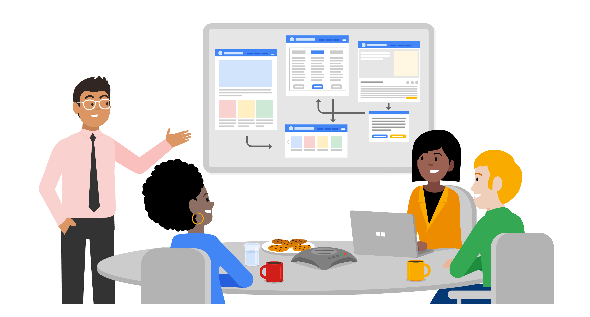
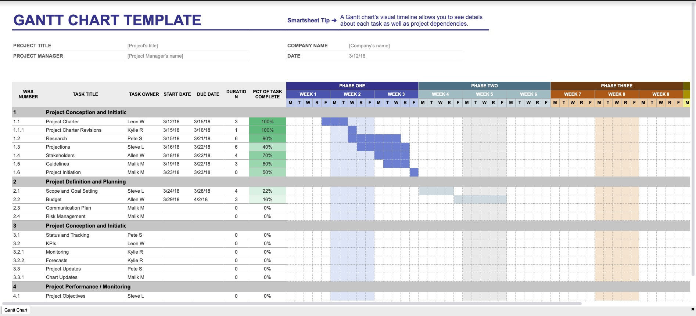
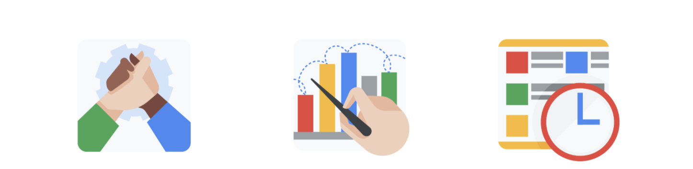

> **Utilizing resources and tools for project success**
>
> 为项目成功利用资源和工具

You will learn the typical resources needed to manage a project, recognize the importance of clear and consistent-一致的 project documentation, understand the key components of project proposals-提案 and charters and develop a project charter, and evaluate various project management tools to meet project needs.

> 您将学习管理项目所需的典型资源，认识到清晰一致的项目文件的重要性，了解项目提案和章程的关键组成部分，并制定项目章程，并评估各种项目管理工具以满足项目需求。

**学习目标**

- Outline the typical resources needed to manage a project.

	> 概述管理项目所需的典型资源

- Identify the key components of project charters and develop a project charter for project initiation.

	> 确定项目章程的关键组成部分，并为项目启动制定项目章程。

- Evaluate various project management tools to meet project needs.

	> 评估各种项目管理工具以满足项目需求。

# Understanding project resource needs

> 了解项目资源需求

## Introduction: Utilizing resources and tools for project success

> 引言：利用资源和工具来实现项目的成功

Welcome back, and congrats-祝贺 on completing that graded-给…评分,评分 assessment-评估.

> 欢迎回来，祝贺你们完成了评分评估。

In the previous module, you learned all about project roles and responsibilities, and we introduced you to some tools that you can use to ensure team accountability, like stakeholder analyses and RACI charts.

> 在前面的模块中，你学习了所有关于项目角色和职责的知识，我们向你介绍了一些可以用来确保团队责任的工具，比如利益相关者分析和RACI图表。

Coming up, we'll talk about project tools and resources, and the value of documentation.

> 接下来，我们将讨论项目工具和资源，以及文档的价值。

By the end of this module, you'll understand the types of resources available to a project manager, you'll be able to document information in a formal-正式的,正规的 project charter, and you'll be able to compare and use various project management tools.

> 在本模块结束时，您将了解项目经理可用的资源类型，您将能够在正式的项目章程中记录信息，并且您将能够比较和使用各种项目管理工具。

Ready to get started? Meet me in the next video.

> 准备好开始了吗?下个视频见。

## Essential project resources

> 必要的项目资源

So far, you''ve learned how to determine project goals and scope, and how to identify the right stakeholders for a project.

> 到目前为止，您已经学习了如何确定项目目标和范围，以及如何为项目确定正确的涉众。

Now it''s time to add another important ingredient-要素,因素: resources.

> 现在是时候加入另一个重要因素了：资源。

As a project manager, understanding your resource needs is crucial to achieving your goals.

> 作为项目经理，了解您的资源需求对于实现您的目标至关重要。

So during the initiation phase, it''s important to ask yourself what are the things we still-还,仍然 need to acquire-获得,得到 in order to complete our project?

> 因此，在启动阶段，重要的是要问自己，为了完成项目，我们还需要获得哪些东西?

Project resources usually include budget, people, and materials.

You'll use tools to manage all those resources.

As you think about the goals and the scope of the project, you figure out the different resources you''ll need to meet those goals. 

> 当您考虑项目的目标和范围时，您会找出实现这些目标所需的不同资源。

It''s important to figure out your resources before the project **gets rolling**-开始.

> 在项目开始之前弄清楚你的资源是很重要的。

This makes it easy for everyone on your team to get their work done, and that''s your job as a project manager.

> 这使得团队中的每个人都能很容易地完成工作，这是你作为项目经理的工作。

You won''t be doing the work directly, but you''ll support the people who do.

> 你不会直接做这项工作，但你会支持那些做这项工作的人。

Figuring out resources early on also helps you avoid accidentally-意外的 understaffing-人员配备不足 your project, which can seriously-严重地,恶劣地 **slow down**-减速 team progress and eat away at the overall timeline.

> 尽早弄清楚资源还可以帮助你避免意外的项目人员不足，这可能会严重减缓团队进度并占用整体时间。

Even worse-更糟的, if you''re not careful with your resource planning, you could wind up underestimating-低估 the budget.

> 更糟糕的是，如果你不仔细规划你的资源，你可能会低估预算。

Meaning, you might not have enough money to purchase necessary materials, hire vendors, or support overtime requests. 

> 也就是说，你可能没有足够的钱来购买必要的材料，雇佣供应商，或者支持加班请求。

Planning your resources early is a great way to set your team up for success.

> 尽早规划你的资源是让你的团队走向成功的好方法。

Because when your teammates have what they need to do their work on time and on budget, they are better set up to meet the project''s goals.

> 因为当你的团队成员拥有了按时、按预算完成工作所需的东西时，他们就能更好地完成项目目标。

Now, let''s break down some of the resources that project managers typically-典型的,通常,一般 work with.

> 现在，让我们来分析一下项目经理通常使用的一些资源。

---

First, let''s talk about budgets.

A budget is an estimate of the amount of money a project will cost to complete.

> 预算是对一个项目完成所需费用的估计。

Almost-几乎,差不多 all projects have budgets because they need funding for expenses-费用, like buying the right materials or software, hiring vendors to complete jobs, or doing marketing-营销 once the project''s done.

> 几乎所有的项目都有预算，因为他们需要资金来支付费用，比如购买合适的材料或软件，雇佣供应商来完成工作，或者在项目完成后进行营销。

During the initiation phase, you''ll talk to the stakeholders and the people working on the project to figure out the tasks needed to get the project done.

> 在启动阶段，您将与涉众和从事项目的人员进行交谈，以确定完成项目所需的任务。

Here, you might ask questions to help uncover hidden costs.

> 在这里，你可以问一些问题来帮助发现隐藏的成本。

For example, are there any taxes on products that you need to account for?

> 例如，您是否需要对产品缴纳任何税款?

What about extra-额外的,另外收费的 fees?

> 额外费用呢?

All this information will help you create a budget, which you can use to source-获得 and compare proposals-提议,建议 from vendors, figure out upcoming costs, and track all the money moving in and out of your project.

> 所有这些信息将帮助您创建一个预算，您可以使用它来查找和比较供应商的提案，计算出即将到来的成本，并跟踪项目的所有资金进出。

You''ll often include the budget in the project charter, and the stakeholders review it for approval.

> 您通常会在项目章程中包含预算，并由干系人审查以获得批准。

We''ll talk more about what goes into creating a project budget and creating a project charter later on.

> 稍后我们将更多地讨论创建项目预算和创建项目章程的内容。

---

When we talk about resources, we''re also talking about the team of people who help execute the tasks of a project.

> 当我们谈论资源时，我们也在谈论帮助执行项目任务的团队。

For example, you, as the project manager are a resource.

So is the marketing manager who might create advertisements-广告 for this new product.

> 为新产品做广告的营销经理也是如此。

Other resources can include people outside of your company who have unique-独一无二的,独特的 skills and can do certain-某些 tasks that people in your organization can't do personally.

> 其他资源可以包括公司以外的人，他们拥有独特的技能，可以完成公司内部人员个人无法完成的某些任务。

---

Then, you have materials.

These are items-项目,条款 you need to help get the project done.

> 这些都是你需要帮助完成项目的项目。

For example, project materials might include the lumber-木材 needed to complete a construction project, okay?

> 例如，项目材料可能包括完成建筑项目所需的木材。

So you know that project resources include budget, people, and materials.

How do you organize these resources?

That''s actually a nice transition-过渡,转变 into our next topic which is: tools.

> 这实际上是我们下一个话题的一个很好的过渡，那就是:工具。

Tools are aids-帮助,援助 that make it easier for a project manager or team to manage resources and organize work.

> 工具是使项目经理或团队更容易管理资源和组织工作的辅助工具。

They help you do things like track tasks, manage budgets, and collaborate-合作,协作 with teammates.

> 它们可以帮助你完成诸如跟踪任务、管理预算以及与队友协作之类的事情。

There are all kinds of tools **out there**-在那里 including productivity-生产率,生产力 tools like Google Docs and work management software like Asana. 

> 现在有各种各样的工具，包括像Google Docs这样的生产力工具和像Asana这样的工作管理软件。

We''ll talk more about these tools later in this program.

Tools are essential for tracking progress, so you want to keep them top of mind at all phases of your project.

> 工具对于跟踪进度是必不可少的，因此您希望在项目的所有阶段都将它们放在首位。

Let''s talk about how you might determine your resources during the initiation phase of your project at Office Green.

> 让我们谈谈在Green办公室项目启动阶段如何确定资源。

As a reminder, the Plant Pal Service offers customers small low maintenance plants like cacti and leafy ferns-蕨类 that they can place on their desks.

> 作为提醒，植物伙伴服务公司为客户提供仙人掌和叶蕨等低维护成本的小型植物，他们可以把它们放在桌子上。

Customers can order them online or from a print catalogue-目录, and Office Green will ship the plant straight-直接的 to the customer''s work address.

> 客户可以在网上订购，也可以从印刷目录中订购，“绿色办公室”将把植物直接运送到客户的工作地址。

The project goal is to increase revenue by 5%.

So how do you get started?

Well, you might do some research to figure out the cost of launching the new plant service.

> 嗯，你可以做一些调查，弄清楚启动新工厂服务的成本。

That might include the estimated prices of developing a new website, a new promotional-促销的,推广的 materials, as well as shipping and delivery costs.

> 这可能包括开发一个新网站的估计价格，一个新的宣传材料，以及运输和配送成本。

You also might want to budget for specific tools, like a project management software that will help you track progress on this complex project.

> 您可能还想为特定的工具做预算，比如项目管理软件，它将帮助您跟踪这个复杂项目的进度。

With that information, you can start to build a realistic budget and you''ll also need to figure out who''s working on this project with you.

> 有了这些信息，你就可以开始建立一个现实的预算，你还需要弄清楚谁和你一起做这个项目。

To do this, you might make a list of people and external vendors who will help complete all the projects'' tasks.

> 要做到这一点，您可能会列出将帮助完成所有项目任务的人员和外部供应商。

For example, the person who manages client communications with customers or a new plant supplier-供应商,供应者 that can provide you with your product.

> 例如，管理客户与客户沟通的人员或可以为您提供产品的新工厂供应商。

Great, hopefully, you''re getting more comfortable-令人舒适的,感到舒服的 with the types of resources you''ll need not only to get stuff done, but to achieve your projects goals, too.

> 很好，希望您对这些类型的资源越来越熟悉，这些资源不仅可以帮助您完成工作，还可以帮助您实现项目目标。

In the next video, we''ll talk about documentation, another important topic for anyone who manages projects professionally-专业地.

> 在下一个视频中，我们将讨论文档，这是任何专业管理项目的人的另一个重要话题。

## Managing resources to get the job done

> 管理资源以完成工作

As we continue learning the tools and techniques that will help you succeed in project management, let’s consider the importance of **project resources**.

Project resources are who and what you depend on to complete a project, including budget, materials, and people.

While each resource is a separate-单独的,独立的 entity-实体,独立存在体, they all depend on one another—your team cannot do the work without materials, and you cannot purchase materials without a budget.

> 虽然每个资源都是独立的实体，但它们都依赖于彼此——没有材料，您的团队就无法完成工作，没有预算，您就无法购买材料。

In this reading, we will discuss some key project resources and tips-秘诀,技巧 for managing them.

> 在这篇阅读中，我们将讨论一些关键的项目资源和管理它们的技巧。

**Budget**

Have you ever-曾经 created a budget for yourself or your family?

> 你曾经为自己或家人做过预算吗?

If you have, you know that a budget includes a wide variety of expenses.

> 如果你有，你知道预算包括各种各样的费用。

For example, a monthly personal budget can contain items that include anything from food to transportation-交通方式 costs to rent-租用,租借.

> 例如，每月的个人预算可以包含从食物到交通费用到租金的任何项目。

With only a certain amount of funding to cover each expense, it is important to closely monitor your spending to avoid going over budget.

> 只有一定数量的资金来支付每一笔支出，密切监控你的支出以避免超出预算是很重要的。

If you go over in one category of your budget, you will impact the others and will need to make adjustments.

> 如果你超出了预算的一个类别，你就会影响到其他类别，需要做出调整。

As a project manager, you will take the same general approach with your project budget. 

> 作为项目经理，您将采用相同的一般方法来处理项目预算。

Common aspects of your project budget will include:

> 项目预算的常见方面包括:

- Team: the cost of the people performing the work

	> 团队:执行工作的人员的成本

- Services: any outside vendors helping your project

	> 服务:任何帮助您的项目的外部供应商

- Materials: any tangible-明确的 items purchased to complete the project

	> 材料:为完成项目而购买的任何有形物品

Throughout your project management career, you will encounter various types of projects with a wide range of budgets.

> 在你的项目管理生涯中，你会遇到各种类型的项目，预算范围很广。

Some budgets will have no margin-盈余,利润,余地 for error, whereas-但是,然而 other budgets may be more flexible.

> 有些预算将没有犯错的余地，而其他预算可能更加灵活。

Regardless-不管怎样,无论如何 of this variability-可变性,变化性, budget issues will inevitably-不可避免地 arise-产生,出现, so it is important to make sure that the budget is aligned with the project scope and the stakeholders’ asks. 

> 不考虑这种可变性，预算问题将不可避免地出现，因此确保预算与项目范围和涉众的要求保持一致是很重要的。

**People**

People are a vital-至关重要的,必不可少的 resource on your project; you cannot complete your project on your own!

You will need to rely-相信,信赖 on a strong team of people with a variety of skill sets and specialties-专业,专长 to get the job done.

> 你需要依靠一个拥有各种技能和专长的强大团队来完成工作。

As a project manager, make sure that you have commitment-承诺 and buy-in on the number of hours it will take for your resources to complete their tasks.

> 作为一名项目经理，确保你有承诺，并在完成任务所需的时间上投入资源。

Additionally, you will find the best partners on a project are people who are aligned to the goals of the project or who are most interested in the project's work.

> 此外，你会发现项目中最好的合作伙伴是那些与项目目标一致或对项目工作最感兴趣的人。

**Materials**

Materials can be different on every project.

For example, if you were working on an IT project, materials could include hard drives and computers to handle the coding efforts.

> 例如，如果您在一个IT项目中工作，材料可能包括硬盘驱动器和处理编码工作的计算机。

You can also have materials that are intangible-无形的.

For example, on the same IT project, online storage, software programs, or employee training may also be considered materials. 

> 例如，在同一个IT项目中，在线存储、软件程序或员工培训也可以被视为材料。

It is important to account for any and all potential materials in order to execute a successful project with the right people and within budget. 

> 重要的是要考虑到任何和所有潜在的材料，以便与合适的人在预算内执行一个成功的项目。

**Key takeaway**

Your project resources include things like the budget, people, and materials.

As a project manager, remembering that your resources are dependent on one another is key to understanding the function of each resource and determining how to manage all of them.

> 作为一个项目经理，记住你的资源是相互依赖的，这是理解每个资源的功能和决定如何管理它们的关键。

Take the time to interview stakeholders and potential team members about what resources they think they will need in order to deliver the project.

> 花点时间去采访涉众和潜在的团队成员，了解他们认为为了交付项目需要哪些资源。

They may have an idea of materials they require that you may not have accounted for within the budget, for example, or can identify people with expertise-专长,专门技能 that would make them an asset to the project team. 

> 例如，他们可能对所需的材料有一个想法，而您可能没有在预算中考虑到这一点，或者可以识别出具有专业知识的人，使他们成为项目团队的资产。

---

Next, we will discuss project charters, which are important tools that project managers use to gain clarity on the resources that they will need for a project. 

> 接下来，我们将讨论项目章程，这是项目经理用来明确项目所需资源的重要工具。

# Developing documentation for project kick-off

> 开发项目启动文件

## The value of project documentation

> 项目文档的价值

By now, you've probably noticed that a big part of project management is guiding decision-making.

> 到目前为止，您可能已经注意到项目管理的很大一部分是指导决策。

Even if you're not the one making final decisions on major aspects of the project, it's still your job to keep track of every new decision and use those decisions to create a plan.

> 即使你不是对项目的主要方面做出最终决定的人，你的工作仍然是跟踪每一个新的决定，并利用这些决定来制定一个计划。

As you've learned, there are a lot of important decisions to keep track of.

> 正如你所了解的，有很多重要的决定需要跟踪。

That includes everything from identifying project goals and deliverables to choosing the right people to add to a team.

> 这包括从确定项目目标和可交付成果到选择合适的人员加入团队的所有事情。

It's way too much for any one person to mentally-精神上,思想上 keep track of.

> 这对任何一个人来说都是太多了。

It's also important information for everyone on the team to be aware-察觉到的,意识到的 of; not just the project manager.

>  这也是团队中每个人都需要了解的重要信息;不仅仅是项目经理。

If a decision affects a member of the team's tasks, they'll need to know about it, right?

> 如果一个决定影响到团队的某个成员的任务，他们就需要知道，对吧?

That's why documentation is such-如此的,这么,如此 an important part of a project manager's role.

> 这就是为什么文档是项目经理角色中如此重要的一部分。

While your team may work deeply on specific areas of the project, you might be the only person on the team who is aware of and communicating across-跨越 all the different areas of the project.

> 虽然您的团队可能在项目的特定领域深入工作，但您可能是团队中唯一了解并跨项目所有不同领域进行沟通的人。

Clear and consistent-一致的 documentation can ensure transparency-透明,透明性 and clear communication.

> 清晰一致的文档可以确保透明度和清晰的沟通。

Documentation helps **set the stage**-为某事做好准备 for the project.

> 文档有助于为项目搭建舞台。

It communicates-传达 the answers to key questions.

> 它传达了关键问题的答案。

For example, what problem are you trying to solve?

What are the project goals?

What are the scope and deliverables, and who are the project's stakeholders?

Lastly, what resources does the team need to complete their work?

This is all crucial information for anyone who's working on a project, regardless-不管怎样,无论如何 of their role.

> 这对于任何致力于项目的人来说都是至关重要的信息，无论他们的角色是什么。

Documentation also helps preserve-保存,保护,维护,保持 decisions made early on in the project and can serve as a reference point for team members who might join later in the project life cycle.

> 文档还有助于保存项目早期所做的决策，并且可以作为可能在项目生命周期后期加入的团队成员的参考点。

It's your job to ensure that this information is easily accessible through some kind of formal documentation, like an e-mail, a presentation-演示文稿, or a digital document.

> 您的工作是确保这些信息可以通过某种正式文档(如电子邮件、演示文稿或数字文档)轻松访问。

Also, documenting decisions can help you uncover-揭露,发现 tasks, timelines, or costs you hadn't previously considered.

> 此外，记录决策可以帮助您发现以前没有考虑过的任务、时间表或成本。

And lastly, this process provides a historical record that can be reviewed at the end of your project.

> 最后，这个过程提供了一个历史记录，可以在项目结束时进行回顾。

You can apply the lessons-经验教训 you've learned in the future.

> 你可以在将来运用你所学到的经验。

Ok, let's get into different types of documentation.

Up next, we'll look at project proposals and project charters, two types of documents that can set you up for success early on.

> 接下来，我们来看看项目提案和项目章程，这两种类型的文件可以帮助你在早期取得成功。

See you soon!

## Project proposals and charters 101

> 项目建议书和章程

Hello, and welcome back.

Earlier, we discussed the value of documentation in effective project management.

> 前面，我们讨论了文档在有效项目管理中的价值。

Now let's talk about two common types of documentation you could use to keep track of details and keep your stakeholders informed-了解情况的.

> 现在让我们讨论两种常见的文档类型，您可以使用它们来跟踪细节并让涉众了解情况。

---

These are: the project proposal-建议书 and the project charter.

> 它们是:项目建议书和项目章程。

A project proposal is a form-形式 of documentation that comes at the very-最 beginning of the project.

> 项目建议书是项目开始时出现的一种文档形式。

This document's purpose is to persuade-说服,劝服 stakeholders that a project should begin.

> 该文档的目的是说服涉众应该开始一个项目。

And typically, a senior organizational leader creates the proposal.

> 通常，组织的高级领导会创建提案。

So you might not need to worry about creating the proposal, but you will have to keep track of the proposal's progress.

> 因此，您可能不需要担心创建提案，但您必须跟踪提案的进度。

The project proposal is a great starting point to help you understand the desired goals and impact.

> 项目提案是一个很好的起点，可以帮助您了解期望的目标和影响。

A proposal may be a formal document, a presentation, or even a simple email to get others on board-同意 with the idea.

> 提案可以是一份正式的文件，一个演示文稿，甚至是一封简单的电子邮件，让其他人同意你的想法。

Then, we have the project charter: a formal document that clearly defines the project and outlines the necessary details to reach-达到,实现 its goals.

> 然后，我们有了项目章程:一个正式的文件，它清楚地定义了项目，并概述了实现其目标所需的细节。

A project charter helps you get organized, set up a framework for what needs to be done, and communicate those details to others.

> 项目章程帮助您组织起来，为需要完成的工作建立一个框架，并将这些细节传达给其他人。

So how do these documents differ?

> 那么这些文档有什么不同呢?

A project proposal is created earlier in the project life cycle than the project charter.

> 在项目生命周期中，项目建议书比项目章程创建得更早。

The proposal kicks off the initiation phase by influencing and persuading-说服,劝服 the company to move forward with the project.

> 提案通过影响和说服公司继续推进项目，从而开启了启动阶段。

---

The project charter serves-提供 a similar purpose and often comes at the end of the initiation phase.

> 项目章程具有类似的目的，通常在启动阶段结束时出现。

However, its goal is to more clearly define the key details of the project.

> 然而，它的目标是更清楚地定义项目的关键细节。

Another difference between these two documents is that a charter will often serve as a point of reference throughout the life of a project.

> 这两个文件之间的另一个区别是，章程在整个项目生命周期中经常作为参考点。

The proposal is only used at the earlier stages.

Now that you know the difference between these two documents, let's take a closer look at the project charter, which you'll learn more about in this module.

> 现在您已经了解了这两个文档之间的区别，让我们来仔细看看项目章程，您将在本模块中了解更多有关项目章程的信息。

The project charter makes clear that the benefits of the project outweigh-超过 the costs.

> 项目章程明确指出，该项目的收益大于成本。

As you learned earlier in this course, there are a few questions you might ask yourself when performing a cost benefit analysis. 

> 正如您在本课程前面所学到的，在执行成本效益分析时，您可能会问自己几个问题。

That includes questions like:

What value will this project create?

And how much money could this project save my organization?

How much time will people have to spend on this project?

You'll include the answers to these questions in your charter.

> 你将把这些问题的答案包含在你的章程中。

Including this type of information ensures that you and your stakeholders agree on the project value.

> 包括这种类型的信息可以确保您和您的涉众在项目价值上达成一致。

The charter also helps ensure that you and your stakeholders agree on the details of the project.

> 章程还有助于确保您和您的利益相关者就项目的细节达成一致。

Project charter approval-批准,许可 means that management-管理层 is supportive-支持的,拥护的, and it's also a key step to ensure that the project matches the needs of the organization.

> 项目章程的批准意味着管理层的支持，这也是确保项目符合组织需求的关键步骤。

After the stakeholders and project sponsor have reviewed and approved the project charter, you now have the authority to move forward with the project.

> 在涉众和项目发起人审查并批准了项目章程之后，您现在就有权推进项目了。

Project charters can be formatted in a few ways and can contain different information depending on the project and the organization.

> 项目章程可以用几种方式格式化，并且可以根据项目和组织包含不同的信息。

The information in a charter might also be tailored-调整,定做,使适应 to its audience-受众,观众,听众,读者 or the needs of specific stakeholders.

> 章程中的信息也可以根据其受众或特定利益相关者的需要进行调整。

For example, if you're writing a project charter for a stakeholder who is a marketing executive-主管,经理, the charter might include information about how the project will impact the organization's brand.

> 例如，如果您正在为一个营销主管的利益相关者编写项目章程，章程可能包括有关项目将如何影响组织品牌的信息。

Or if the stakeholder is a chief-首要的,主要的 technology officer-军官, the charter might include information on the cost of engineering resources needed to maintain the project.

> 或者，如果涉众是首席技术官，章程可能包括维护项目所需的工程资源成本的信息。

Regardless of the format or the audience-受众, creating a project charter is a best practice for ensuring that everyone agrees on how to move forward before entering-进入 the planning phase.

> 无论形式或受众如何，创建项目章程是确保每个人在进入计划阶段之前就如何向前推进达成一致的最佳实践。

The project charter is a living document.

> 项目章程是一份活的文件。

This means that it can evolve-进化,演化,逐渐演变 as the project progresses.

> 这意味着它可以随着项目的进展而发展。

As the project manager, you'll review and refine-改进,改善 the charter throughout the process.

> 作为项目经理，您将在整个过程中审查和完善章程。

Now that you know more about the value of a project charter, it's time to learn how to create one.

Meet me in the next video to get started!

## Project charters: Elements and formats

> 项目章程：元素和格式

A **project charter** clearly defines the project and outlines the necessary details for the project to reach its goals.

> 项目章程清楚地定义了项目，并概述了项目实现其目标所需的细节。

A well-documented project charter can be a project manager’s secret weapon-武装,装备 to success.

> 文件完备的项目章程可能是项目经理成功的秘密武器。

In this reading, we will **go over**-复习 the function, key elements, and significance of a project charter and learn how to create one. 

> 在这篇阅读中，我们将回顾项目章程的功能、关键要素和意义，并学习如何创建一个项目章程。

---

The charter is the formal way that the project’s goals, values, benefits, and details are captured-俘获,捕获.

> 章程是获取项目目标、价值、利益和细节的正式方式。

You can think of the charter as the compass-指南针 for your project since you will use it throughout the life cycle of the project.

> 您可以将章程视为项目的指南针，因为您将在项目的整个生命周期中使用它。

Many stakeholders will look to your project charter to ensure that you are indeed-确实,的确 aligned with strategic goals and set up for achieving the desired end goal.

> 许多涉众将查看您的项目章程，以确保您确实与战略目标保持一致，并为实现预期的最终目标而设置。

Since the project charter carries so much importance, it is important to incorporate **the right amount of**-适量的 detail while omitting-省略 miscellaneous-混杂的,各种各样的 elements.

> 由于项目章程非常重要，因此在省略杂项的同时纳入适量的细节是很重要的。

---

As with any of your project documents, it is a good idea to collaborate with your team and stakeholders early and often. 

> 与任何项目文档一样，尽早并经常地与团队和涉众协作是一个好主意。

Developing the project charter in collaboration with both-双方,两者,两...,双... groups can help you make sure that your project charter addresses-设法解决 your key stakeholders’ most important concerns-担忧,忧虑,关心 and keeps your team aligned.

> 与两个团队合作制定项目章程可以帮助您确保您的项目章程处理了关键干系人最重要的关注点，并使您的团队保持一致。

Be sure to use the business case—the reason for initiating the project—as the guiding direction to your project charter.

> 一定要使用商业案例——启动项目的原因——作为项目章程的指导方向。

Project charters can vary-变化,改变 from organization to organization and from project to project.

> 项目章程可能因组织和项目而异。

It is key for a project manager to identify the best type of charter for the project in order to capture the relevant information and set your project up for success. 

> 对于项目经理来说，确定项目的最佳章程类型是关键，以便获取相关信息并为项目的成功奠定基础。

Project charters will vary but usually include some combination-结合,联合,组合 of the following key information:

> 项目章程会有所不同，但通常包括以下关键信息的一些组合:

- introduction/project summary

	> 介绍/项目总结

- goals/objectives 

	> 目标/目的

- business case/benefits and costs

	> 商务案例/收益和成本

- project team

	> 项目团队

- scope

	> 范围

- success criteria

	> 成功标准

- major requirements or key deliverables

	> 主要需求或关键交付物

- budget

	> 预算

- schedule/timeline or milestones

	> 计划表/时间线 或 里程碑

- constraints-限制,束缚 and assumptions-假定，假设

	> 约束和假设

- risks

	> 风险

- OKRs

	> 目标关键成果

- approvals

	> 批准；认可

You will likely use many different project charter formats throughout your project management career.

> 在您的项目管理生涯中，您可能会使用许多不同的项目章程格式。

One example is a condensed-浓缩,压缩, simplified document, like the one you'll learn about in the upcoming video and the one linked in the activities.

> 一个例子是一个浓缩、简化的文档，就像你将在即将到来的视频中学习的文档和活动中链接的文档一样。

A short and simple project charter can be used on smaller projects that are not very complex. 

> 一个简短的项目章程可以用于不太复杂的小型项目。

For more complex projects, you may link to additional analysis or documents.

> 对于更复杂的项目，您可以链接到其他分析或文档。

You can house these items in the appendix-附录. 

> 你可以把这些项目放在附录里。

---

Your organization may have a unique template for you to use, or you may have the flexibility to leverage-充分利用 one you come across in your career.

> 你的公司可能有一个独特的模板供你使用，或者你可以灵活地利用你在职业生涯中遇到的一个模板。

As your project progresses, you may also encounter revisions-修改,修订 to your project charter—and that is okay.

> 随着项目的进展，您可能还会遇到对项目章程的修订——这没关系。

Remember, it is a living document; let it grow with your project, and **review and revisit it often** to ensure you are aligned. 

> 记住，这是一份活的文件;让它与你的项目一起成长，并经常回顾和重新审视它，以确保你是一致的。

## Developing a project charter

> 制定项目章程

Hi again.

Let's talk about how to create a project charter.

In the last video we discussed how project charters, are a valuable document for project managers.

> 在上一个视频中，我们讨论了项目章程如何成为项目经理的宝贵文件。

Project charters are key for securing-获得,得到 approval from stakeholders and moving forward.

> 项目章程是获得利益相关者批准并向前推进的关键。

Project charters can also be formatted in many different ways and there are many different templates available online for you to choose from.

> 项目章程也可以用许多不同的方式格式化，网上有许多不同的模板供您选择。

Here, we'll use a template that's similar to one that program managers often use at google and to fill in each section will use details from your project at Office Green, ready?

> 在这里，我们将使用一个模板，类似于项目经理在谷歌经常使用的模板，填写每个部分将使用你在Office Green项目中的细节，准备好了吗?

Let's take a look!

At the top of your charter, you'll want to add in the name of your project.

Let's add in the name of your project at Office Green, it's called: Project Plant Pals.

> 让我们加上你在绿色办公室的项目名称，它叫做：植物伙伴项目。

---

You also want to add in a brief summary, let's type that in.

> 你还想添加一个简短的总结，让我们输入它。

Our plan is to offer high volume-大量的 customers, small, low maintenance plants that can thrive-茁壮成长 in an office environment.

> 我们的计划是提供大批量客户，小型，低维护，可以在办公环境中茁壮成长的植物。

---

Next up, let's fill in the section labeled "project goals."

Remember that goals should be smart.

> 记住，目标应该是明智的。

Let's add in the goal for Project Plant Pals which is to increase revenue by five percent by **rolling out**-推出 a new service that provides office plants to top clients by the end of the year.

> 让我们加上“植物伙伴计划”的目标，即在年底前推出一项新服务，向顶级客户提供办公室植物，从而使收入增加5%。

---

Great, now let's add in the project deliverable.

Remember that a deliverable is a tangible outcome from a project.

As you learned earlier, our deliverables for this project are to send 1000 plants to 100 customers and to launch a new website for orders and customer support.

> 正如你之前所了解到的，我们这个项目的可交付成果是向100个客户发送1000个植物，并启动一个新的网站，用于订单和客户支持。

---

Okay, now let's add in the business case, which captures the reasoning for initiating this project.

Let's type in: "this is a top requested service from our customers and it will also improve customer satisfaction-满意度 and retention-保持,保留."

> 让我们输入:“这是我们客户要求最高的服务，它也会提高客户满意度和保留率。”

---

The business case is supported by the cost benefit analysis and we'll add that in now.

> 业务案例是由成本效益分析支持的，我们现在将把它添加进去。

We'll start with the benefits.

The benefits or expected gains-收益 of the project, include improving customer satisfaction and an increase in revenue.

> 项目的收益或预期收益，包括提高客户满意度和增加收入。

---

Now, we'll move on to the costs.

The costs include the price of the sourcing products, developing a website and marketing materials.

> 成本包括采购产品的价格，开发网站和营销材料。

Let's type in: "$250,000" for the estimated budget.

> 我们输入“25万美元”作为估计预算。

---

Nice, we've now outlined some of the benefits and costs of this project.

> 很好，我们现在已经概述了这个项目的一些收益和成本。

Keep in mind that these are simple examples to teach you the basics of **filling out**-填写 a charter.

> 请记住，这些都是简单的例子，教你填写章程的基础知识。

When running a real project, you'll perform a more detailed analysis to determine the benefits and costs.

> 在运行实际项目时，您将执行更详细的分析以确定收益和成本。

The key takeaway here is that benefits should always outweigh the cost.

---

Fantastic-极好的,非常棒的, let's keep going.

Next, we're going to add in the project scope as well as what's considered out of scope for this project.

> 接下来，我们将添加项目范围以及被认为超出该项目范围的内容。

Remember scope is an agreed upon understanding of what is included or excluded from a project.

> 记住，范围是对项目包括或不包括什么的共识。

An item that is in scope, includes creating a service to deliver-运送 small plants to last year's top clients.

> 其中一个项目包括创建一项服务，向去年的顶级客户运送小型植物。

An item that is out of scope, and therefore-因此,所以 not available to customers, includes plant care after they're delivered.

> 超出范围的项目，因此客户无法获得，包括交付后的植物护理。

Amazing.

Hopefully you can see how stating what's in scope and what's out of scope helps everyone working on the project understand where they should focus their efforts.

> 希望你能明白，说明什么在范围内，什么不在范围内，是如何帮助每个参与项目的人理解他们应该把精力集中在哪里。

---

Great, now let's add in your project team.

Let's see here.

The project sponsor is Office Green's director of product.

> 项目发起人是Office Green的产品总监。

So let's add that in.

Who is the project lead?

Well, that's you.

The project team may include marketing associates-同事, website developers and external plant vendors and more, so we can add in a few important project team members here.

> 项目团队可能包括营销人员、网站开发人员和外部工厂供应商等，因此我们可以在这里添加一些重要的项目团队成员。

Awesome.

> 让人惊叹的，令人敬畏的；非常棒的，极佳的

Let's move on to additional-附加的,额外的 stakeholders.

Additional stakeholders may include the vice-副的 president-总裁 of customer success, who is accountable for customer feedback and corresponding-相应的,相关的 product requests.

> 其他干系人可能包括负责客户成功的副总裁，他负责客户反馈和相应的产品请求。

We can also add in the account manager who will leverage-充分利用 their existing relationships with top clients.

> 我们还可以添加客户经理，他们将利用与顶级客户的现有关系。

And let's also add in the fulfillment-履行,实行,满足 manager, who will help acquire-获得,得到 the plants needed to launch the service.

> 我们还可以添加执行经理，他将帮助获取启动服务所需的植物。

---

We're almost done, let's add in how we'll measure success.

> 我们几乎完成了，让我们加入我们如何衡量成功。

Here we will type in that we want to see a five percent increase in revenue by the end of the year.

Let's also type in that we want to hit a customer satisfaction rate of 95 percent, three months after launch.

> 我们还可以输入，我们希望在发布3个月后达到95%的客户满意度。

---

That's it.

The project charter is filled in and now it's ready to be reviewed by your stakeholders.

Now you're done.

You've seen how documentation helps form the roots of a project and how it contributes to the project's ultimate success.

> 您已经看到了文档如何帮助形成项目的基础，以及它如何有助于项目的最终成功。

Like nurturing a plant, you're learning to nurture-培育 a project to ensure its the best it can be.

> 就像培育一株植物一样，你正在学习培育一个项目，以确保它能做到最好。

Up next, we'll talk about the tools that project managers rely on to guide their teams and ensure that they complete their tasks. 

See you soon.

# Evaluating tools to meet project needs

> 评估工具以满足项目需求

## Utilizing tools for effective project management

> 利用工具进行有效的项目管理

As a project manager, tools are some of the most helpful resources you have at your disposal-安排.

> 作为一个项目经理，工具是你所拥有的最有用的资源。

They're essential for tracking progress, so it's important to keep them top of mind throughout the entire project.

> 它们对于跟踪进度至关重要，因此在整个项目中始终牢记它们是非常重要的。

Let's talk more about why tools are so useful and why it's important to choose the right ones for your needs.

> 让我们更多地讨论为什么工具如此有用，以及为什么选择适合您需求的工具很重要。

There are lots of different tools out there, and you'll learn more about them later.

> 市面上有很多不同的工具，稍后您将了解更多。

As a reminder, tools are aids-帮助,援助,辅助设施 that make it easier for a project manager or team to manage resources and organize work.

> 提醒一下，工具是使项目经理或团队更容易管理资源和组织工作的辅助工具。

They're useful because they can help you track detailed information about all kinds of tasks, and they make it easy to communicate with lots of different people.

And remember, effective communication and tracking are huge parts of a project manager's day-to-day responsibilities.

> 记住，有效的沟通和跟踪是项目经理日常职责的重要组成部分。

Just **think about**-考虑,思考,思索 how much tougher-较艰苦的 your job would be without help from collaboration tools like e-mail or digital documents created in Google Docs or Microsoft Word.

> 试想一下，如果没有电子邮件或谷歌文档或微软Word中创建的数字文档等协作工具的帮助，你的工作将会变得多么困难。

Let's imagine this in the context-背景,环境,上下文 of our project at Office Green.

> 让我们在绿色办公室的项目中想象一下。

As lead project manager, you have tons-大量,许多 of information about the company's plan to provide office-friendly plants to top clients. 

> 作为首席项目经理，你对公司为顶级客户提供适合办公的工厂的计划有很多了解。

But what would happen if you wrote every project detail on a whiteboard instead of a shared online document?

> 但是，如果你把每个项目细节都写在白板上，而不是共享的在线文档上，会发生什么呢?

Well, every member of your team would have to stop by your desk to get the latest information, and that's definitely not the most efficient use of anyone's time.

> 嗯，你团队的每个成员都必须在你的办公桌前停下来获取最新的信息，这绝对不是对任何人时间的最有效利用。

But if you store this information in easily-accessible online documents, you save everyone on the team time, energy-精力, and a major headache.

> 但是，如果您将这些信息存储在易于访问的在线文档中，则可以节省团队中的每个人的时间和精力，并避免令人头痛的问题。

Today's tools have made it so much easier to share information with teammates.

Even-甚至 better with project management tools, information sharing goes both ways.

> 有了项目管理工具，信息共享就更好了。

That means team members can also easily update you on their progress without the need for extra meetings or phone calls.

> 这意味着团队成员也可以很容易地向你汇报他们的进展，而不需要额外的会议或电话。

How great is that?

When you choose the right tool for a project, you make it easy for teammates to let you know if a task is on schedule or if it's delayed, which lets you quickly see how any changes might affect the rest of the project.

> 当您为项目选择正确的工具时，您可以让团队成员轻松地让您知道任务是否按计划进行或是否延迟，这使您可以快速查看任何更改如何影响项目的其余部分。

Project management tools increase visibility and transparency-透明性 for everyone, including stakeholders.

> 项目管理工具增加了每个人(包括涉众)的可见性和透明度。

You can use a variety of tools to accomplish many different things, like tracking progress on tasks, deliverables, and milestones. 

> 您可以使用各种工具来完成许多不同的事情，比如跟踪任务进度、交付成果和里程碑。

Tools can also help you manage a budget, build helpful charts-图表 and diagrams, manage contracts and licenses-许可,执照, and keep stakeholders informed.

> 工具还可以帮助你管理预算，构建有用的图表和图表，管理合同和许可证，并让利益相关者了解情况。

Tools can be straightforward-简单的, like digital spreadsheets-电子表格 or documents, or they can be more sophisticated-复杂的, like scheduling and work management software.

> 工具可以很简单，比如电子表格或文档，也可以更复杂，比如日程安排和工作管理软件。

It's important to think about the needs of the project when choosing which to use.

> 在选择使用哪种工具时，考虑项目的需求是很重要的。

One thing to keep in mind is that if you choose a more sophisticated-复杂的 tool, your teammates and stakeholders will need some time to get familiar with it.

> 要记住的一件事是，如果您选择更复杂的工具，您的团队成员和涉众将需要一些时间来熟悉它。

For small projects, that might be more trouble than it's worth-价值,价格,重要性,值得的.

> 对于小项目来说，这可能比它的价值更麻烦。

So for small projects, a straightforward tool might be more effective.

But if a project has a big scope, then it might be worth-值得的 the team's time to learn and ultimately work with a more sophisticated project management tool.

> 但是，如果一个项目的范围很大，那么可能值得团队花时间学习并最终使用更复杂的项目管理工具。

You should also keep in mind that sometimes you won't have a choice about the types of tools you use.

> 您还应该记住，有时您无法选择所使用的工具类型。

If an organization has already decided to use a specific tool, then you will need to work with what they give you.

It's all about remaining-保持不变 flexible.

> 关键是要保持灵活性。

Are you starting to see-理解,了解 how you can use tools to keep projects on track?

> 您是否开始了解如何使用工具来保持项目的正轨?

Whether they're straightforward or sophisticated, tools have the power-能力 to help you communicate and manage more effectively. 

> 无论它们是简单的还是复杂的，工具都有能力帮助你更有效地沟通和管理。

Next up, we'll cover some of the most common types of tools for effective project management.

See you there!

## Introducing new tools to a team

> 向团队介绍新工具

Project management tools and processes are always evolving-进化,演化,逐步发展.

> 项目管理工具和过程总是在不断发展。

In this reading, we will discuss the importance of choosing the right tools for a project and the implications-含义,牵连,涉及 of introducing new tools to your team. 

> 在本文中，我们将讨论为项目选择正确工具的重要性，以及向您的团队引入新工具的含义。

---

As a project manager, it is important to be open to implementing-执行,贯彻 new tools that may be beneficial-有益的 to a project's outcome.

> 作为项目经理，重要的是要开放地实现可能对项目结果有益的新工具。

You will experience change in lots of forms throughout your project’s life cycle, and navigating-驾驭,操纵 change is essential.

> 在项目的整个生命周期中，您将经历多种形式的变化，而驾驭变化是至关重要的。

But if you choose to implement a tool that your team is unfamiliar with—especially if you decide to **roll it out**-推出 midway-中途的 through a project—your team may be hesitant-不愿的.

> 但是，如果您选择实现一个团队不熟悉的工具——特别是如果您决定在项目中途推出它——您的团队可能会犹豫不决。

People embrace-乐意采纳 change differently, particularly-尤其,特别是 if the change will directly impact their routine-常规的,例行的 and the way they work. 

> 人们接受改变的方式不同，尤其是当改变会直接影响到他们的日常生活和工作方式时。

Simply put: Change can be met with resistance-抵抗,阻力.

> 简单地说：改变可能会遇到阻力。

---

Before you introduce a new tool to your team, you should be sure that this change is actually going to benefit the project, and ensure that those involved in your project understand the benefits of this change.

> 在您向您的团队引入一个新工具之前，您应该确保这个更改实际上会使项目受益，并确保项目中涉及的人员理解这个更改的好处。

Demonstrating-证明,示范,演示 to your teammates and stakeholders that you understand the tool and have evaluated its competency-能力,本领 will help build trust, especially if this new tool is replacing an existing tool.

> 向你的团队成员和涉众展示你理解了这个工具，并且已经评估了它的能力，这将有助于建立信任，特别是当这个新工具正在取代现有的工具时。

Taking the time to introduce the new tool to your team members will also demonstrate-证明 that you have the best interest of the team in mind—not just the success of the project. 

> 花时间向您的团队成员介绍新工具还将证明您考虑的是团队的最大利益，而不仅仅是项目的成功。

Here are some important considerations and keys to successfully introducing new tools:

> 以下是成功引入新工具的一些重要考虑因素和关键:

- **Discuss the tool early and often, if possible.** The team should not feel blindsided-出其不意 by a new change. Make sure they know the change is coming as early as possible. This will help them prepare for an introduction or migration to the new tool.

	> 如果可能的话，尽早并经常讨论这个工具。团队不应该对新的变化感到措手不及。确保他们尽早知道变化即将到来。这将帮助他们为引入或迁移到新工具做好准备。

- **Ask for feedback from key stakeholders.** You could get great feedback on features that you may have overlooked-忽视,忽略 without asking for their expertise. You can solicit-请求,索求 this feedback by requesting their input about functionality or have them list features in order of priority. The key is to create an opportunity for stakeholders to provide their feedback and allow you to incorporate their feedback into next steps.

	> 询问关键利益相关者的反馈。你可以在不询问他们的专业知识的情况下，就你可能忽略的功能得到很好的反馈。您可以通过请求他们对功能的输入或让他们按优先顺序列出功能来征求他们的反馈。关键是要创造一个机会，让利益相关者提供他们的反馈，并允许你将他们的反馈纳入下一步。

- **Involve the key stakeholders in demonstrations-演示,展示 as you get closer to making the final decision on the project tracking tool.** You will be able to leverage-充分利用 key stakeholders' acceptance by letting them test the product or sign up for a trial run. It is also important to make sure that the tool is actually going to meet the mark and provide a meaningful-有意义的,重要的 change for the project. You may want to pull in key users from your team to test and familiarize themselves with the tool prior-先前的,事先的 to rolling it out. This will allow the team to get on board with your plans or discuss their concerns beforehand-事先,预先. This will also highlight in-house-内部的 experts for future training, assistance-帮助,援助, and implementation-实施,执行.

	> 在您接近于对项目跟踪工具做出最终决定时，让关键涉众参与演示。您将能够通过让关键利益相关者测试产品或注册试运行来利用他们的接受度。同样重要的是，要确保工具实际上能够满足要求，并为项目提供有意义的更改。在推出工具之前，您可能希望从团队中引入关键用户来测试和熟悉工具。这将允许团队了解你的计划或事先讨论他们的担忧。这也将为未来的培训、协助和实施突出内部专家。

- **Ensure the tool is fully functional** **before** **the team is introduced to it.** Whenever possible, **hold off**-推迟行动 from introducing the tool if it still has any issues. Make sure the tool is accessible for all users. Keep in mind, your team members may resist-抵制,抵抗 a tool that **doesn’t live up to**-没有达到 how it is supposed to function. This will impact implementation and acceptancep-接纳 fairly-相当地 significantly-意味深长地,别有含意地, so put your best tool forward!

	> 在向团队介绍该工具之前，确保该工具具有完整的功能。只要有可能，如果该工具仍然存在任何问题，就不要引入它。确保所有用户都可以访问该工具。请记住，您的团队成员可能会抵制不符合预期功能的工具。这将对实现和验收产生相当大的影响，因此请提出您最好的工具!

- **Set up training for the tool as needed** **before** **you ask the team to actually use it.** Everyone has different levels of comfort-适应 with different tools. It is your job as the project manager to ensure that each team members’ needs are addressed-设法解决. Setting up training also helps create positive-乐观的,积极的 first impressions-影响,作用, which will lead to higher productivity-生产力 and quicker, more successful implementation and acceptance.

	> 在要求团队实际使用该工具之前，根据需要对其进行培训。每个人对不同的工具都有不同的适应程度。作为项目经理，确保每个团队成员的需求得到满足是你的工作。设置培训也有助于创造积极的第一印象，这将导致更高的生产力和更快，更成功的实施和接受。

Remember, some pushback-抗拒,反对 is normal, but successful project managers should **take the steps**-采取措施 to prepare and mitigate-减轻,缓和 any friction-不和,分歧 for their team when possible. 

 >请记住，有些阻力是正常的，但是成功的项目经理应该采取措施，尽可能地为团队准备和减轻任何摩擦

**Pro tip:**

If time allows, plan for a period-一段时间,时期 of transition-过渡,转变 if you are replacing an existing tool.

> 如果时间允许，如果您要替换现有的工具，请计划一段时间的过渡。

It is common to allow both tools to operate during this period.

> 在此期间，通常允许两种工具同时使用。

You will need to “sunset-定期废止的,” or retire-退休, the existing tool eventually-最终,结果, but allowing for a period of transition between using the old tool and the new tool can help stakeholders and team members feel more at ease and give them time to gain familiarity with the new tool.

> 您最终将需要“日落”或退休现有的工具，但是在使用旧工具和新工具之间允许一段时间的过渡可以帮助涉众和团队成员感到更轻松，并给他们时间来熟悉新工具。

Be prepared for productivity to be impacted as the team transitions from one tool to another.

> 当团队从一种工具过渡到另一种工具时，要做好生产力受到影响的准备。

## Exploring types of project management tools

> 探索项目管理工具的类型

Hi there.

So, you've learned about how tools can make you more effective.

Now let's learn more about the different types of tools used in project management.

These include scheduling and work management software and tools for productivity and collaboration-合作,协作.

Let's get started.

One common tool type is scheduling-调度,计划表,时间表,进度表 and work management software.

> 一种常见的工具类型是调度和工作管理软件。

There are lots of different types of work management software on the market, including popular tools like these.

> 市场上有很多不同类型的工作管理软件，包括这些流行的工具。

Certain tools may work better for your project depending on **a bunch of**-一堆 things; for example, the project methodology you're running or the number of tasks and people involved.

> 某些工具可能更适合你的项目，这取决于一些事情;例如，您正在运行的项目方法学或涉及的任务和人员的数量。

So, why would you choose to use scheduling and work management software?

> 那么，为什么你会选择使用日程安排和工作管理软件呢?

Well, it can be really useful for assigning tasks to multiple teammates and for tracking progress on that work.

It can also help you visualize-可视化 your team's progress.

For example, if you're using work management software to assign and track tasks, you're more likely to notice if your team completes 50 tasks one week and just three tasks the **following week**-下一周.

> 例如，如果你使用工作管理软件来分配和跟踪任务，你更有可能注意到你的团队是否一周完成了50项任务，而下一周只完成了3项任务。

That's a clear sign-信号 that you need to check in to see if there's a problem that's blocking progress.

> 这是一个明确的信号，表明你需要检查是否存在阻碍进展的问题。

If you hadn't been tracking their tasks, you might not have noticed-注意到 the issue.

> 如果你没有跟踪他们的任务，你可能不会注意到这个问题。

That's part of the reason why work management software is so useful.

It provides an overview of how the project is going so you know when you need to check in with your teams to get tasks back on track.

> 它提供了一个项目进展情况的概览，这样你就知道什么时候需要和你的团队一起检查，让任务回到正轨。

Another type of project management tool we'll discuss is tools for productivity.

Productivity tools can be very helpful for you and your team.

This includes word processing-处理 tools, like Microsoft Word or Google Docs.

> 这包括文字处理工具，如微软word或谷歌文档。

You can use these to create shared documents with the team, like the project charter we taught you how to **fill out**-填写 earlier.

> 您可以使用它们与团队创建共享文档，例如我们之前教您如何填写的项目章程。

You can also use these tools to build documents like meeting agendas-待议事项 and status updates, and we'll talk more about these in a later course.

> 您还可以使用这些工具来构建会议议程和状态更新等文档，我们将在后面的课程中详细讨论这些。

Spreadsheets are another useful productivity tool.

They're versatile, and you can use them to make documents, like RACI charts and project plans, as well as other helpful charts you'll learn more about in a later course.

And presentations-演示文稿,报告 created in tools, like Microsoft PowerPoint, Keynote, or Google Slides can be a great way to package your project in a visual-可视化, easily-digestible-易消化的 way.

> 用微软的PowerPoint、Keynote或谷歌的幻灯片等工具制作的演示文稿可以很好地将你的项目包装成可视化的、易于理解的方式。

Now, let's discuss collaboration tools, which you'll probably rely on to work closely-紧密地 with your teammates.

> 现在，让我们讨论一下协作工具，您可能会依赖这些工具与您的团队成员紧密合作。

These include tools you're probably familiar with, like email and chat.

> 这些工具包括你可能很熟悉的工具，比如电子邮件和聊天。

Tools like this can help you quickly and efficiently check in with each other on questions, comments-评论, and other topics related to the project.

> 像这样的工具可以帮助您快速有效地在与项目相关的问题、评论和其他主题上相互签入。

Productivity tools like documents and spreadsheets, and collaboration tools like email and chat, are all pretty simple, which means they're great for smaller projects with fewer tasks and teammates to keep track of.

> 像文档和电子表格这样的生产力工具，以及像电子邮件和聊天这样的协作工具都非常简单，这意味着它们非常适合任务较少、需要跟踪的团队成员较少的小型项目。

Scheduling and work management software is better for bigger projects with a larger number of tasks and a bigger team of people to manage.

Cool.

You've learned more about the types of tools available to you, including scheduling and work management software, productivity tools, and collaboration tools.

> 您已经了解了更多可用的工具类型，包括日程安排和工作管理软件、生产力工具和协作工具。

We'll spend the next video diving-潜水,跳水 a bit deeper on some of the most popular project management tools out there.

> 我们将在下一个视频中更深入地探讨一些最流行的项目管理工具。

Meet you there.

## Common project management tools

> 常用的项目管理工具

Earlier, you learned about different types of project management tools, from scheduling-调度 and work management software, to tools for productivity and collaboration.

Now let's discuss a few popular tools you might be expected to use, or at least be familiar with.

> 现在让我们讨论一些您可能会使用或至少熟悉的流行工具。

There are many different types of work management software that automatically-自动地 make project planning and tracking a lot easier and that are much more efficient-效率高的 than manual-手工的,手动的 project tracking.

> 有许多不同类型的工作管理软件可以自动使项目计划和跟踪变得更加容易，并且比手动项目跟踪更有效。

One tool that we'll focus on in this program is Asana.

Asana is a work management platform that helps teams plan and coordinate their work from daily tasks to strategic initiatives-措施. 

> Asana 是一个工作管理平台，可以帮助团队计划和协调他们的工作，从日常任务到战略计划。

Asana provides a living system and a source of truth-事实,真相 where everyone's work lives.

> Asana为每个人的工作提供了一个有生命的系统和真理的来源。

With Asana, everyone can see, discuss, and manage team priorities, giving teams clarity on who is doing what by when.

> 有了Asana，每个人都可以看到、讨论和管理团队的优先级，让团队清楚地知道谁在什么时候做什么。

It's great for building project plans, assigning tasks, automating workflows, tracking progress, and communicating with stakeholders.

> 它非常适合于构建项目计划、分配任务、自动化工作流、跟踪进度以及与涉众沟通。

As a project manager, you can use Asana to create **a log of**-很多,大量的 tasks, like gathering cost estimates from external vendors, and assign a task to people on the team.

> 作为项目经理，您可以使用Asana创建任务日志，例如从外部供应商收集成本估算，并将任务分配给团队中的人员。

All tasks are visible and organized in the format of the project manager's choice—like in a list or on a calendar—and **designed to**-旨在 drive transparency-透明度,清晰度 and connection with all the tasks related to the overall goal.

> 所有任务都是可见的，并按照项目经理选择的格式进行组织——比如在列表中或在日历中——旨在推动与总体目标相关的所有任务的透明度和联系。

It's easy to use with external stakeholders as well, because within Asana, you can share status updates and other communications with people outside your company.

> 它也很容易与外部利益相关者一起使用，因为在Asana中，你可以与公司外部的人分享状态更新和其他通信。

---

Another great tool we'll focus on throughout this program is the spreadsheet.

Spreadsheets are extremely-极度,非常 versatile-多功能的, and you can use them for a wide range of tasks, from creating timelines and billing-账单 charts to managing budgets and tracking tasks.

> 电子表格是非常通用的，你可以用它们来完成各种各样的任务，从创建时间表和账单图表到管理预算和跟踪任务。

You can add and view project information in a variety of formats, depending on what you need in the moment.

> 您可以添加和查看各种格式的项目信息，这取决于您当前的需要。

For example, let's say you enter-登记,输入 a list of tasks, due-到期的,预期的 dates, completion statuses, and task owners into a spreadsheet. 

> 例如，假设您在电子表格中输入任务列表、截止日期、完成状态和任务所有者。

From there, it's very simple to sort the list by due date to see what's due next.

You can then filter the list of tasks by task owner, so that you only see the things you're responsible for.

> 然后，您可以按任务所有者筛选任务列表，以便您只看到您负责的事情。

You can also highlight the rows of the sheet in different colors to visually illustrate-说明,阐明 the tasks with the least progress.

> 还可以用不同的颜色突出显示工作表的行，以直观地说明进度最少的任务。

With spreadsheets, you can easily transform, visualize, and manipulate-操作 information.

> 使用电子表格，您可以轻松地转换、可视化和操作信息。

Spreadsheets and more comprehensive-综合性的,全面的 tools like Asana are just two options for effective project management, and it's a good idea to get a basic understanding of the variety of software options out there.

> 电子表格和像Asana这样更全面的工具只是有效项目管理的两种选择，对各种各样的软件选择有一个基本的了解是一个好主意。

Then, if your company doesn't have a standard-标准 software tool, you can choose the right one for the project needs.

> 然后，如果您的公司没有标准的软件工具，您可以根据项目需要选择合适的软件工具。

Being able to recommend the right tool for the job can be a great way to add value to your team at the beginning of a project. 

> 能够为工作推荐正确的工具是在项目开始时为团队增加价值的好方法。

Keep in mind, however, that software options are constantly-总是,经常地,不断地 changing.

> 但是，请记住，软件选项是不断变化的。

From the addition of new features to the launch of new tools, there's no way for you to know every software available, and no company would expect that of you.

> 从添加新功能到发布新工具，您不可能了解所有可用的软件，也没有公司会期望您这样做。

Many of these tools have similar functionality, like task tracking and task assignment, so if you understand one tool deeply, you should be able to easily adapt to a new tool on the job.

> 这些工具中的许多都具有类似的功能，例如任务跟踪和任务分配，因此，如果您深入了解一个工具，您应该能够轻松地在工作中适应新工具。

Now that you've learned a bit more about Asana and the power-能力 of spreadsheets, take some time to explore these tools, since we'll be working with them later in the program.

> 现在您已经了解了更多关于Asana和电子表格的功能，请花一些时间来探索这些工具，因为我们将在稍后的节目中使用它们。

Coming up, you'll hear from a project manager who will tell you all about their experience using tools during their day-to-day role at Google.

> 接下来，你将听到一位项目经理向你讲述他在谷歌日常工作中使用工具的经历。

Stay tuned.

> 继续收看

## Using Google Sheets for project management

> 使用Google表格进行项目管理

### **Essential Sheets features for project management**

> 用于项目管理的基本表单功能

#### **Collaborate with your team**

> 与你的团队合作

Google Sheets makes it easy to collaborate and share information. This is useful for remote workgroups-工作组 or working with teams that have different schedules. 

> 谷歌表格使协作和共享信息变得容易。这对于远程工作组或与具有不同时间表的团队一起工作非常有用。

When you share your Sheet, you can select from the following permissions-同意,许可,许可证:

> 共享工作表时，可以从以下权限中进行选择：

- **editing**, which allows others to make direct edits and changes to the file;
- **commenting**, which allows others to add comments and make suggestions; or 
- **view only**, which allows others to view the file but not edit, comment, or suggest. This is a good choice if you don’t want any changes to be made to the file.

Once you’ve shared your Sheet with your team and given them either-要么 editing or commenting permissions, you can all collaborate directly in the Sheet by leaving comments.

> 一旦你与你的团队共享了你的工作表，并给了他们编辑或评论的权限，你就可以通过留下评论直接在工作表中进行协作。

You can also assign a task or action item through comments.

> 您还可以通过注释来分配任务或操作项。

***Check out these resources from the Google Help Center to learn more:***  [Share and collaborate on files](https://support.google.com/a/users/answer/9305987?hl=en)

#### **Format your spreadsheet** 

> 设置电子表格的格式

**Create lists**

To create any list in Sheets, simply label each list—for example, Name, Date, Notes, or other criteria-标准,准则—in the **header row**.(The header row is the top row in the spreadsheet.)

> 若要在工作表中创建任何列表，只需在标题行中标记每个列表(例如，名称、日期、备注或其他标准)。(标题行是电子表格的第一行。)

Then, add a different list item in each cell-单元格 underneath the list title.

Most lists are arranged vertically-垂直地, but you might prefer a horizontal-水平的 list depending on the types of items.

> 大多数列表是垂直排列的，但根据项目的类型，您可能更喜欢水平列表。

*Note: You’ll learn how to build out a full project plan and prioritize tasks later in this course.* 

**Display and hide content**

**Freeze rows or columns**

Freezing the header row (or column for horizontal lists) and formatting headers is a great way to make the list titles **stand out**-脱颖而出. 

> 冻结标题行(或水平列表的列)和格式化标题是使列表标题脱颖而出的好方法。

Freezing a header row keeps the row in place when you scroll down the list, so you can always see what the list titles are.

Format the headers just like you would text in a document by changing the font, style, size, or color.

> 通过更改字体、样式、大小或颜色来格式化标题，就像在文档中设置文本一样。

**Group and hide related content**

Grouping rows and columns allows you to expand-扩展 and collapse-折叠 larger categories of data or information with a single click.

> 对行和列进行分组允许您通过一次单击展开和折叠较大类别的数据或信息。

This makes your spreadsheet easier to read and manage by hiding the grouped data when it’s not needed, or quickly ungroup-取消组 and show when it is needed.

> 通过在不需要分组数据时隐藏分组数据，或者在需要时快速取消分组并显示分组数据，这使电子表格更易于阅读和管理。

***Check out these resources from the Google Help Center to learn more:*** 

- [Freeze or merge rows and columns; Group, ungroup, or hide rows or columns](https://support.google.com/docs/answer/9060449?hl=en&ref_topic=9055295)
- [Google Sheets cheat sheet](https://support.google.com/a/users/answer/9300022?hl=en)

**Add checkboxes**

Checkboxes provide a quick and highly-visual way to track progress on a task or indicate-表明,指出 whether certain criteria have been met. 

***Check out these resources from the Google Help Center to learn more:***  [Add checkboxes to spreadsheets](https://support.google.com/a/users/answer/9308622?hl=en&ref_topic=9326428)

#### **Organize data**

**Create dropdown lists**

> 创建下拉列表

If you’re working with others on a shared Sheet, you might end up with inconsistent responses or descriptions of data.

> 如果您与他人一起使用共享的工作表，您可能会得到不一致的响应或数据描述。

For example, one teammate may list their task as “done” while another notes it as “complete.”

Adding a dropdown list (also referred to as **data validation**) ensures the data entered into your spreadsheet is exactly-精确地 what you specify-明确指出.

> 添加下拉列表(也称为数据验证)确保输入到电子表格中的数据正是您指定的数据。

It also makes it much faster for others to add data since they’re selecting from a predetermined-预先确定 list of options.

> 这也使得其他人添加数据的速度更快，因为他们是从预先确定的选项列表中进行选择的。

***Check out these resources from the Google Help Center to learn more:*** [Restrict data entry with lists](https://support.google.com/a/users/answer/9604139?hl=en#zippy=%2Clearn-how)

**Add color coding**

Sometimes it’s helpful to change the color of cells and text so you can quickly see how your project is progressing.

You can add color coding to your spreadsheet by applying **conditional-条件的 formatting**.

> 您可以通过应用条件格式在电子表格中添加颜色编码。

Conditional formatting formats cells in a certain way if they contain specific information.

> 条件格式在单元格包含特定信息时以某种方式对其进行格式化。

For example, track progress status as “Not started” in red, “In progress” in orange, and “Complete” in green. 

> 例如，跟踪进度状态为红色的“未开始”、橙色的“进行中”和绿色的“完成”。

***Check out these resources from the Google Help Center to learn more:*** [See data changes with conditional formatting](https://support.google.com/a/users/answer/9308962?hl=en&ref_topic=9327402)

**Sort and filter data**

Large sets of data can be difficult to manage.

Sheets helps you sort and filter data to limit what is visible and find specific types of data within your spreadsheet.

> 表格可以帮助您对数据进行排序和筛选，以限制可见的内容，并在电子表格中查找特定类型的数据。

**Sorting** data allows you to arrange-排列 data in exactly the order you want it to appear in, like alphabetical-按字母顺序的, by date, or progress level. 

> 排序数据允许您按照希望的顺序排列数据，例如按字母顺序、按日期或按进度级别排列。

**Filtering** limits what data gets displayed and shows you only the data you are interested in, such as tasks that have not yet been started, or budget items within a certain value range.

> 过滤限制显示的数据，只显示您感兴趣的数据，例如尚未启动的任务，或某个值范围内的预算项目。

***Check out these resources from the Google Help Center to learn more:*** [Filter data in a spreadsheet](https://support.google.com/a/users/answer/9308952?hl=en)

**Add links** 

It can be helpful to link to other project documentation or even external websites in your spreadsheet.

This provides your team easy, centralized-使集中 access-访问,获取 to all relevant data they might need.

For example, you could add a link to your project charter document from your project plan spreadsheet.

***Check out these resources from the Google Help Center to learn more:*** 

- [Use links](https://support.google.com/docs/answer/45893?co=GENIE.Platform%3DDesktop&hl=en#zippy=%2Ccreate-a-link)
- [Link to data in a spreadsheet](https://support.google.com/a/users/answer/9308662?hl=en)

#### **Visualize data**

**Create a pivot-核心 table**

> 创建数据透视表

A **pivot table** is a basic data analysis tool.

Pivot tables summarize your data and can help show the relationships between data points, making it easier to understand all the information contained in your spreadsheet.

> pointsPivot表总结了您的数据，并有助于显示数据点之间的关系，从而更容易理解电子表格中包含的所有信息。

You’ll learn more about how to create and use a pivot table later in this course.

Or, check out the Help Center article below.

***Check out these resources from the Google Help Center to learn more:*** [Create and edit pivot tables](https://support.google.com/a/users/answer/9308944?hl=en)

**Make a chart or graph**

Presenting data in charts and graphs is a great way to quickly and effectively summarize important information about your project to stakeholders and make reports and presentations more engaging-迷人的,吸引人的.

> 用图表和图形展示数据是一种快速有效地向利益相关者总结项目重要信息的好方法，并使报告和演示更具吸引力。

Sheets enables you to automatically create different kinds of charts and graphs using the data in your spreadsheet.

***Check out these resources from the Google Help Center to learn more:***  [Insert and edit charts](https://support.google.com/a/users/answer/9308981?hl=en)

#### **Perform calculations**

**Use functions** 

**Functions** can be used to manipulate data and perform calculations.

Google Sheets has **a wide array of**-大量的,广泛的 functions that are already built in, which means they will automatically perform the calculations you specify-明确指出.

> Google表格有一系列已经内置的功能，这意味着它们会自动执行你指定的计算。

Use functions to quickly calculate sums or averages, automatically determine start or end dates, generate financial reports, and much more.

***Check out these resources from the Google Help Center to learn more:*** 

- [Add formulas and functions](https://support.google.com/docs/answer/46977?hl=en&ref_topic=9054531)
- [Google Sheets cheat sheet](https://support.google.com/a/users/answer/9300022?hl=en)

### **Useful spreadsheet templates**

**Using spreadsheet templates for project management**

Creating the same types of spreadsheets **over and over**-一遍又一遍 can be time-consuming.

> 一遍又一遍地创建相同类型的电子表格非常耗时。

You can save time by using templates such as those available from the [Google Sheets template gallery](https://docs.google.com/spreadsheets/u/0/?ftv=1&folder=0AKrj08N1UHZqUk9PVA&tgif=c).

Choose from a variety of pre-made spreadsheets for budgets, schedules, and trackers, or create your own!

Some of the more common templates are described and linked below.

> 下面描述和链接了一些更常见的模板。

To use the templates for these course items, click the links below and select “Use Template”: 

> 要使用这些课程项目的模板，请点击以下链接并选择“使用模板”:

- [**Project Timeline**](https://docs.google.com/spreadsheets/d/1Us-j-BAG3kiIJENBt3SqRXkJQL_TZh-yejJyZzq9L60/template/preview#gid=1709744959)**:** A project timeline template is useful if you want to track an entire project from conception-概念,观念 to close. This example includes a visual timeline that lays out the life cycle of a project and the major activities that need to happen during each phase. You’ll learn more about creating and tracking a project timeline later in the course and get to experience working with your own project timeline templates.
- [**Project Tracking**](https://docs.google.com/spreadsheets/d/12AK5slxygSxj8nmjS39SCnEFkCy8WZDbgN0vSQh2xwg/template/preview?resourcekey=0-__sqaWcGZavYWgXz-WD4jQ#gid=1161341563)**:** A project tracking template is useful for tracking your project’s budget, deliverables, and other data. This example includes columns for tracking costs and time, as well as a column with dropdown lists for tracking tasks’ priority levels. Other features include formulas for calculating hours, costs, and percentage of deliverables completed, which allow you to track your spending and progress on a project. 
- [**Gantt Chart**](https://docs.google.com/spreadsheets/d/1Yc1KA_7DMwBqyt2Zcx68HAV3oEp1FnUt-undm0XHgqM/template/preview?resourcekey=0-y-3VgQEbmAVaiEGfeyeJ-g#gid=1115838130)**:** A Gantt chart combines many of the aspects of other types of project management spreadsheets into one. It organizes tasks by day and is useful for showing the relationships between the many moving parts of a project. It’s also helpful for managing a project with multiple collaborators. Gantt charts often include conditional formatting that makes cells change color based on how far along the project is so you can immediately determine how much progress you have made on a particular task.

- [**Event Marketing Timeline**](https://docs.google.com/spreadsheets/d/10GindXMsW6z0pFvd5Ymjz_PS0dXJ5eCkl3KDKEPO9qY/template/preview#gid=541890420): A timeline template is useful for creating a schedule, tracking events, and visualizing the tasks and milestones involved in a project. You might use this template to manage a project that involves a lot of marketing or public-facing tasks. You can track social media posts, market research, and coordinate content across multiple platforms.

***Check out these resources from the Google Help Center to learn more:***  [Create document templates](https://support.google.com/a/users/answer/9308885?hl=en)

## Demonstrating your knowledge of project management tools

> 展示你对项目管理工具的了解

During an interview for a project manager position, the interviewer may ask you to discuss the project management tools you are familiar with or have used in the past.

There are many types of project management tools that you will come across-遍及 during your career.

> 在你的职业生涯中，你会遇到许多类型的项目管理工具。

These tools will continue to grow and change as technology improves.

> 随着技术的进步，这些工具将继续发展和变化。

Being able to talk about these tools, and how you use them, will be crucial to landing the role.

> 能够谈论这些工具，以及如何使用它们，对于获得这个职位至关重要。

---

In addition to the interviewer asking general questions about tools, they may ask more specific questions, like “How do you know if a project is off track?”

> 除了面试官会问一些关于工具的一般性问题，他们可能会问一些更具体的问题，比如“你怎么知道一个项目是否偏离了轨道?”

It’s important to tie this answer back to the types of scheduling-调度 tools you have learned about in this course.

> 将这个答案与你在本课程中学到的调度工具类型联系起来是很重要的。

If you haven’t had experience working with certain scheduling tools, like Smartsheet or digital spreadsheets—try to leverage-充分利用 real-life experience. 

> 如果你没有使用某些日程安排工具的经验，比如智能表或数字电子表格，试着利用现实生活中的经验。

---

For example, have you ever-曾经,从来 planned for a move?

> 例如，你曾经计划过搬家吗?

If so, you can discuss how you planned your timeline and scheduled-安排 vendors so that you could meet your move date.

> 如果是这样，你可以讨论一下你是如何计划你的时间表和安排供应商的，这样你就可以满足你的搬家日期。

Did you use a spreadsheet to keep track of your budget, schedule, and belongings-所有物,财产?

> 你是否使用电子表格来记录你的预算、日程安排和财产?

This experience demonstrates-证明,示范 you understand how to use tools.

> 这段经历说明您理解如何使用工具。

It also demonstrates that you know the importance of creating, monitoring, and managing the project schedule to deliver results at project completion. 

> 它还表明您知道创建、监视和管理项目进度以在项目完成时交付结果的重要性。

---

Another related question the interviewer may ask could be, “How do you execute-执行,完成 tasks within your timeline?”

> 面试官可能会问的另一个相关问题是，“你是如何在你的时间表内完成任务的?”

This is a great opportunity to demonstrate your ability to be productive by sharing your experience with tools, such as digital documents or spreadsheets.

> 这是一个很好的机会，通过分享你使用工具的经验来展示你的生产力，比如数字文档或电子表格。

These tools help you create project artifacts-人工制品, track tasks, and store project details in one place!

> 这些工具可以帮助您创建项目工件，跟踪任务，并在一个地方存储项目详细信息!

You can also use them as a collaboration tool because they are easily shareable with teammates and stakeholders and allow for real-time updates. 

> 您还可以将它们用作协作工具，因为它们很容易与团队成员和涉众共享，并允许实时更新。

---

Finally, there are special project management tools, also called work management tools, that put all the benefits discussed above-上面 into one place.

> 最后，还有一些特殊的项目管理工具，也称为工作管理工具，它们把上面讨论的所有好处集中在一起。

Project management tools such as Asana, Monday.com, Basecamp, and Trello are among some of the top ranked-排名 tools for managing projects.

> 项目管理工具，如Asana、Monday.com、Basecamp和Trello都是管理项目的顶级工具。

These tools help you plan, track, and complete work across many project phases.

They often have visually-形象化地,外表上 appealing-吸引人的 layouts-布局,设计 and automated features that save time and create efficiency-效率,效能 in a project manager’s day-to-day tasks.

> 它们通常具有视觉上吸引人的布局和自动化功能，可以节省时间并提高项目经理日常任务的效率。

Explaining your knowledge of these tools—and how they benefit the project manager, team, and company—in an interview is a great way to demonstrate that you are qualified-胜任的 for the role.

> 在面试中解释你对这些工具的了解，以及它们如何给项目经理、团队和公司带来好处，是证明你能胜任这个职位的好方法。

**Pro tip:** 

Learn more by trying free tutorials-教程 or trial versions of popular project management tools.

> 通过尝试免费教程或流行项目管理工具的试用版来了解更多信息。

By navigating-操纵 project management software, you will be able to explain the uses and functionality of these types of tools firsthand-直接地.

> 通过导航项目管理软件，您将能够解释这些工具类型的用途和功能。

Here are some examples to get started:

- [Asana](https://asana.com/) and [Asana Guide](https://asana.com/guide)
- [Basecamp](https://basecamp.com/)
- [Trello](https://trello.com/en-US)
- [Jira](https://www.atlassian.com/software/jira)
- [ClickUp](https://www.clickup.com/)
- [Monday.com](https://monday.com/)
- [Microsoft Project](https://www.microsoft.com/en-us/microsoft-365/project/project-management-software) or [Project Libre](https://www.projectlibre.com/) (open source)
- [Smartsheet](https://www.smartsheet.com/) ([Demo](https://www.youtube.com/watch?v=quGpnXiCUms))

## Build a project management tool tracker

As you progress through this course, you will learn about different types of tools used by project managers and the organizations that hire them. Tools can include software applications like Adobe, Google, and Microsoft and specific work management tools like Jira and Asana. They can also include methodologies, techniques, formulas and concepts, and technologies related to project management. 

This reading provides step-by-step instructions for creating a tracker for all of these types of tools. You can use your tracker to list the different tools you learn about, their descriptions and links, their features and benefits, and your level of experience with each. This way, you can easily identify the tools required for different roles and can determine where you might want to focus your professional development efforts.

**Developing your tool tracker spreadsheet**

Follow these steps to begin creating your project management tool tracker:

**Step 1: Create a new spreadsheet**

Start by opening a new spreadsheet using your preferred method. If you have a Google account, click the link to open a [Project Management Tool Tracker Template](https://docs.google.com/spreadsheets/d/1HyBhk8e1w7N_MIlLBvFtPTOy4-I_6Ig_MA1nd5LqYQE/template/preview?resourcekey=0-_cR_r4OEpzHxfJzpCEUNrQ#gid=0).

OR

If you don’t have a Google account, you can download the template directly from the attachment below.

Template_ Project Management Tool Tracker

XLSX File

Some of the information has already been filled in for you as an example. Feel free to modify your Tracker in the way that works best for you.

**Step 2: Add column headers**

Consider the different types of information you’d like to track about each tool, and add these as **column headers** in your tracker. (The header is the top cell or cells in a column in the spreadsheet.)

Here are some example column headers:

- Tool Name
- Description/Benefits
- Link to product website
- Link to course content in Coursera
- Cost to use
- Requirements (training/equipment)
- Your current experience with the tool 
- Notes

**Step 3: Add tools and relevant information**

Review some of the course videos, readings, and activities so far that discuss project management tools. Select three or four tools and add the names to the tracker. Add any information you have about each tool to the different columns. To help you get started, the template has several tools listed that have already been mentioned in this course. Feel free to edit the list to include the tools that are most relevant to your progress.

You might not be able to fill in all the columns with information just from this course, so do your own research if necessary.

For example, we discuss the work management tool Asana in the video [Common project management tools](https://www.coursera.org/learn/project-initiation-google/lecture/T12Jz/common-project-management-tools), but we only cover some of the features and benefits. You can look up the Asana website online and add more information about what features are offered, along with pricing and system requirements.

**Step 4: Format your sheet**

After you’ve added a few tools and some initial information, format your sheet by bolding column headers and adding drop-down lists, conditional formatting, or web links. Try out other formatting options like bolding, highlighting, or colors to make important text stand out. [Google Sheets training and help](https://support.google.com/a/users/answer/9282959#zippy=) contains articles with step-by-step directions for how to use all of these features and more.

**Step 5: Continue adding tools**

Continue to add more tools and information that’s relevant to your career goals. Search job listings and add tools, software, or specific knowledge needed for jobs you’re interested in. 

**Key takeaway**

If you’ve followed the steps laid out in this reading, you'll be able to develop a tracker that is useful to you as you continue on your project manager journey. Knowing what tools are available, what their benefits are, which ones are used for certain types of projects, and which ones you're skilled at will build your confidence. You'll be able to demonstrate to employers that you have an understanding of the industry, even if you're applying for your first project management role.

## Amar: Tools are our best friends

Hi, I'm Amar. I'm a Senior Engineering Program Manager at Google Shopping, and on a day-to-day basis, I drive programs which span across multiple products at Google. As a Project Manager, tools are our best friends. Tools and the tools which will help us drive the execution—those should be near and dear to us, and those are near and dear to me. What I look at is what tools will help me create the body of work. There are a lot of open source tools as free tools, like Google Spreadsheets are there, Google Docs is there. Many of these tools are out there, and there are some other supporting tools also, like JIRA and ALM. These will help you create the body of work. This will help you define that what needs to be delivered and when. This will help you create the timeline. There are timeline tools, like Gantt Chart, Gantt tools, that you will find out. Then there are tools which will help you drive the visibility across the board and that drive the dependent ecosystem. We want to make sure when we are starting the project, we look at the available toolset so that we are not defragging the system that much, we are not really kind of adding too many complexities on new tools in the ecosystems. We want make sure that, ok, what are the current tools which are out there? Have a look at this toolset. Find out, are those supported? Find out what's the current adoption rate, and look at what are the gaps. If there are gaps, go for new tools. Propose new tools to improve productivity. But if there's an existing toolset which our team is following, which your team is following, try to learn those tools because those are the tools which will get quick adoption, and those will be an amazing toolset to have with you.

# Course review: Project Initiation: Starting a successful project

## Course wrap-up

## Course 2 glossary

