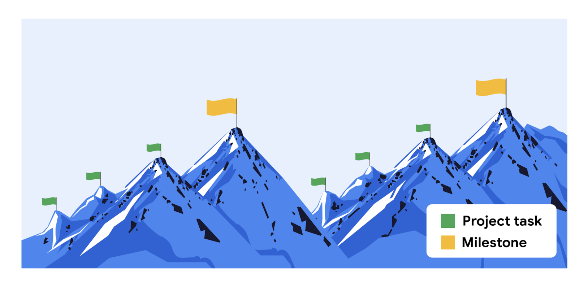

> Beginning the planning phase

You will learn how the course is structured, the benefits of planning and key components of the planning phase, the difference between tasks and milestones, and how to set milestones.

> 您将了解课程的结构，规划的好处和规划阶段的关键组成部分，任务和里程碑之间的区别，以及如何设置里程碑。

------

**学习目标**

- Explain the Project Management Certificate program structure and course functionality.

	> 解释项目管理证书课程结构和课程功能。

- Explain why milestones are important and how to set them.

	> 解释为什么里程碑很重要，以及如何设定它们。

- Explain the difference between tasks and milestones and how they are related.

	> 解释任务和里程碑之间的区别，以及它们之间的联系。

- Describe the components of the planning phase and their significance.

	> 描述计划阶段的组成部分及其重要性。

# Getting started with the course

> 开始课程

## Introduction-简介,介绍 to Course 3

> 课程三简介

Hello!

Welcome to this course called "Planning: Putting It All Together."

> 欢迎来到这门叫做“计划:把它全部放在一起”的课程。

If you've already completed our previous courses, then you have a great foundation for what it takes to initiate a project and kick off the planning phase.

Before we get started, let me introduce myself.

My name is Rowena, and I'll be your instructor for this course.

I work as a senior program manager in Google Cloud on a variety of projects.

> 我在Google Cloud担任高级项目经理，负责多个项目。

I mostly-主要地,几乎全部 focus on systems and productivity enhancements-增强,改善 for my team, which consists-由…组成，由…构成 of around 100 full time employees and more than 300 contractors-承包商，立约人 around the world.

> 我主要关注我的团队的系统和生产力增强，我的团队由全球约100名全职员工和300多名承包商组成。

Some of the largest-scale projects that I work on impact Google Cloud sales and global sales support teams, which are made up of a thousands of people.

> 我参与的一些规模最大的项目影响了谷歌云销售和全球销售支持团队，这些团队由数千人组成。

But I didn't **start out**-开始,着手 building solutions for thousands of people at a global company.

> 但我一开始并没有为一家全球公司的数千人构建解决方案。

I left school at the age of 17 with no college degree and no real plan.

> 我17岁离开学校，没有大学学位，也没有真正的计划。

Before Google, I worked in retail-零售, hospitality, and even in the airline industry as a crew-当空乘人员 member.

> 在加入谷歌之前，我在零售业、酒店业工作过，甚至在航空业做过机组人员。

When I joined the corporate world, I noticed something.

> 当我进入企业界时，我注意到了一些事情。

The processes were just as messy-凌乱的 as the stock rooms of the retail stores where I'd worked.

> 这个过程就像我工作过的零售店的储藏室一样混乱。

There was so much room-地方 to improve.

> 还有很多需要改进的地方。

I came to realize that every business is complicated-复杂的,难处理的 and that there's always room-空间 to create order-秩序.

> 我开始意识到，每一项业务都是复杂的，总有创造秩序的空间。

So I started thinking about ways to automate-使自动化 my day-to-day tasks.

> 所以我开始思考如何让我的日常工作自动化。

I was emailing ideas to my manager and colleagues-同事,同僚, working with teams across the company, brainstorming-集思广益,头脑风暴 solutions to problems, coordinating training for my coworkers-同事,合作者, and so much more.

> 我通过电子邮件向经理和同事发送想法，与公司各个团队合作，集思广益解决问题，为同事协调培训，等等。

That's when it became clear— I was project managing.

> 那时我才明白—我是项目经理。

I transferred into a role focused entirely on program management at Google's headquarters-总部 in Mountain View, California.

> 我转到位于加州山景城的谷歌总部，担任一个完全负责项目管理的职位。

In my job interview, I focused on examples of how I applied these transferable-可转移的 skills from my previous roles, and how I could leverage-充分利用 the knowledge I gained from my experience.

> 在我的工作面试中，我着重于举例说明我如何应用这些从我以前的工作中获得的可转移技能，以及我如何利用我从我的经验中获得的知识。

Four years later, I'm here and I'm so excited to be partnering with you on this learning journey.

> 四年后，我来到这里，我很高兴能与你们一起踏上这段学习之旅。

From the outside, big, global companies can seem as though they have it all figured out.

> 从外部看来，大型跨国公司似乎万事俱备。

But there's always room for new processes, and you likely have the skills and insights-洞察力,了解 from your previous experiences that can be useful.

> 但新流程总是有发展的空间，而且你可能从以前的经验中获得了有用的技能和见解。

So keep going— you're heading-朝（某方向）行进 in the right direction.

> 所以继续前进吧——你正朝着正确的方向前进。

This course is focused on the planning phase.

I'll share the tools and techniques to complete this phase.

> 我将分享完成这一阶段的工具和技术。

First up, I'll demonstrate how to kick off the planning phase.

> 首先，我将演示如何开始计划阶段。

Then we'll explore the importance of setting and reaching milestones.

> 然后我们将探讨设定和达到里程碑的重要性。

For every milestone, there'll be a set of tasks to complete, so I'll teach you some tips for breaking down and distributing-分配 the workload.

> 对于每个里程碑，都会有一组任务需要完成，所以我将教你一些分解和分配工作量的技巧。

Later, we'll discuss the budget and how the overall budgeting process works.

> 稍后，我们将讨论预算以及整个预算流程的工作原理。

We'll learn about people or companies outside of your organization that may play a role in determining the budget, and we'll discuss the importance of sufficiently-充分地,足够地 documenting your budget.

> 我们将了解组织之外可能在确定预算方面发挥作用的人员或公司，我们将讨论充分记录预算的重要性。

Then we'll discuss the various risks and the possible impact-巨大影响 those risks can have on the project.

> 然后我们将讨论各种风险以及这些风险对项目可能产生的影响。

Nothing ever goes quite as planned, but risk management is a great way to make sure you know what could go wrong and how you'll address it.

> 任何事情都不会完全按照计划进行，但风险管理是确保你知道什么可能出错以及如何解决它的好方法。

This includes communicating possible risks to your stakeholders, creating a mitigation-减轻,缓和 plan, and then keeping an eye on those risks to make sure they don't stall-拖延 your projects.

> 这包括与你的利益相关者沟通可能的风险，创建缓解计划，然后密切关注这些风险，以确保它们不会拖延你的项目。

Last but not least, documentation ties-连结 it all together.

> 最后但并非最不重要的是，文档将它们联系在一起。

Keeping all your project plans documented and organized not only helps you, but it also helps those involved knowing their responsibilities.

> 把你所有的项目计划记录下来并组织起来，不仅对你有帮助，也有助于那些参与其中的人了解他们的职责。

Documentation also provides stakeholders with a window into the development of the project.

> 文档还为干系人提供了一个了解项目开发的窗口。

It has always been important to the success of my own projects at Google, and I'm excited to explore this topic with you.

> 这对我自己在谷歌的项目的成功一直很重要，我很高兴能和你一起探讨这个话题。

Ready to get started?

Meet you in the next video.

# Understanding the planning phase components

> 了解计划阶段的组成部分

## The benefits of project planning

> 项目计划的好处

Hi again.

In the previous course, you learned about the initiation phase.

During the initiation phase, the project manager is gathering all of the necessary preliminary-初步的,预备的 information needed to get stakeholder approval and plan the project.

> 在启动阶段，项目经理收集所有必要的初步信息，以获得干系人的批准并规划项目。

A few key things need to happen during this time.

> 在这段时间里需要做一些关键的事情。

First, the project manager gets assigned—that's you!

> 首先，项目经理被分配——那就是你!

Then, the goals of the project have to be approved, as well as the scope of the project and its deliverables.

> 然后，必须批准项目的目标，以及项目的范围及其可交付成果。

A number of people will need to be assigned to the project, and you'll have a good sense of their individual-单独的,个人的 roles and responsibilities.

> 许多人需要被分配到这个项目中，你将对他们的个人角色和责任有一个很好的认识。

You'll also need stakeholder sign off on your project charter.

> 你还需要利益相关者在你的项目章程上签字。

If all of these criteria-标准 have been met, then you're set to begin planning.

> 如果满足了所有这些标准，那么您就可以开始计划了。

Planning is a significant part of ensuring a project's success, so let's take some time to discuss why it's so important.

> 计划是确保项目成功的重要组成部分，所以让我们花一些时间来讨论为什么它如此重要。

Planning is important for any project, large or small.

While planning your project, you and other members of the team will determine the processes-过程,步骤 and workflows needed to meet your goals and put together ideas about how to make the project a success.

> 在规划项目时，您和团队的其他成员将确定实现目标所需的流程和工作流程，并将如何使项目成功的想法整合在一起。

While planning, you might **draw from**-借鉴 previous project experience, but don't be afraid to think of new ways to get results.

> 在制定计划时，您可能会借鉴以前的项目经验，但不要害怕考虑获得结果的新方法。

Every project is different, so new and different approaches may be just the thing you need.

> 每个项目都是不同的，所以新的和不同的方法可能正是你需要的。

Planning has many benefits.

As we've discussed, planning helps you **map out**-规划,制定 the full project.

It helps you understand the work needed to achieve your goals. 

Planning also helps coordinate efforts and timelines with other teams, contractors-承包商,立约人, and vendors.

Another huge benefit of planning is that it gives you time to identify and prepare for risks that could impact your project.

> 计划的另一个巨大的好处是，它给了你时间来识别和准备可能影响项目的风险。

Those might include things like a delay in the timeline, the departure-背离,离开,启程 of a critical-极其重要的,关键的,严重的 team member, or a change in project direction from a primary stakeholder.

> 这些可能包括时间上的延迟，关键团队成员的离开，或者主要利益相关者对项目方向的改变。

Planning also gives you the chance to brainstorm ways to mitigate-缓解,缓和,减轻 or address those risks.

> 计划也让你有机会集思广益，减轻或解决这些风险。

There are less-较小 obvious-明显的,显然的 benefits too.

> 还有一些不太明显的好处。

For example, the planning phase can help you get "buy-in" from key members of the project team.

> 例如，计划阶段可以帮助您从项目团队的关键成员那里获得“支持”。

Getting buy-in means that you've gained their support for your plans.

Planning also demonstrates to stakeholders that the team is taking care to start the project with a detailed plan.

> 计划还向涉众表明，团队正在小心翼翼地以详细的计划开始项目。

But one of the most significant benefits of planning is teamwork-团队合作,协力, which will help you push your project across the finish line.

> 但计划最重要的好处之一是团队合作，这将帮助你推动项目越过终点线。

By working together in the planning phase, individuals assigned to the project can become a strong team by the time the planning is done and the work is about to start.

> 通过在计划阶段一起工作，分配到项目中的个人可以在计划完成和工作即将开始时成为一个强大的团队。

Planning together creates a shared understanding among all parties involved in the project.

> 共同规划在项目的所有参与方之间建立了共同的理解。

So to recap, planning has many benefits from helping the team to understand the work needed to achieve their goals, to providing project plans to the stakeholders.

> 综上所述，从帮助团队理解实现其目标所需的工作，到向涉众提供项目计划，计划有很多好处。

Now that you know a bit more about planning, we'll learn how to launch the planning phase.

> 现在您对计划有了更多的了解，我们将学习如何启动计划阶段。

Meet you in the next video.

## Launching the planning phase

> 启动规划阶段

Hello again.

In the last video, we discussed the importance of planning.

Now let's get into the details of how to launch the planning phase.

As you learned earlier, the planning phase is the second phase of a project's life cycle.

This can be a challenging time-时刻,时期 for a project manager because there's so much to consider.

> 对于项目经理来说，这可能是一个具有挑战性的时期，因为有太多的事情要考虑。

But it's important to know that project plans don't have to be perfect the very first time.

> 但重要的是要知道，项目计划不必在第一次就完美无缺。

And, even if you do a great job with your plans the first time around, it's likely that the plan will change as the project evolves-进化,演化,逐步发展.

> 而且，即使你的计划第一次做得很好，随着项目的发展，计划也很可能会发生变化。

The planning phase may differ from project to project, but generally-通常,大概 three big things are **worked out**-解决 during this stage: the schedule, the budget, and the risk management plan.

> 计划阶段可能因项目而异，但通常在此阶段会制定出三件大事:进度、预算和风险管理计划。

We'll discuss each of these in greater-更多的 detail later on in the course. 

> 我们将在后面的课程中更详细地讨论每一个。

But for now, here's some general-一般的 information so you can understand why these three elements are so crucial to planning.

> 但现在，这里有一些一般的信息，这样你就可以理解为什么这三个元素对计划如此重要。

---

Let's start with the schedule.

The schedule is basically-基本上,大体上 a timeline of the project.

> 日程表基本上是项目的时间表。

It includes the start date, the end date, and the dates for things that will happen in between.

> 它包括开始日期、结束日期，以及在此期间发生的事情的日期。

You will use time estimation techniques to determine these dates.

> 您将使用时间估计技术来确定这些日期。

Let's imagine scheduling in our example project at Office Green.

> 让我们想象一下在Office Green的示例项目中的日程安排。

As a reminder, you are the lead project manager for project Plant Pals, a new service that will provide top clients with desk-friendly plants.

> 提醒一下，你是Plant Pals项目的首席项目经理，这是一项为顶级客户提供适合办公桌的植物的新服务。

You want to launch the service by the end of the year, so the planning phase for this effort should include a number of key dates. 

> 您希望在年底之前启动该服务，因此这项工作的计划阶段应该包括一些关键日期。

Those dates might include when you'll request proposals from plant vendors.

> 这些日期可能包括你向植物供应商提出建议的时间。

They might also include the date you'll kick off with the web designers and developers who are creating a new website for the service.

> 它们可能还包括你将开始与为该服务创建新网站的网页设计师和开发人员的日期。

It should also include important dates during the project execution phase, like when the plants need to be ready for delivery-交付,递送 or when the new webpage design needs to be approved, and you'll need to include the target date for the launch of the service. 

> 它还应该包括项目执行阶段的重要日期，比如植物需要准备交付的时间，或者新的网页设计需要批准的时间，你还需要包括服务发布的目标日期。

---

Another part of the planning phase is setting the budget.

The budget will account-解释,说明 for the total cost to complete the project.

> 预算将包括完成该项目的全部费用。

The total cost needs to be broken down to determine how much has to be spent on different elements of the project.

> 需要对总成本进行分解，以确定在项目的不同要素上需要花费多少。

For project Plant Pals, the budget will need to include items like the cost of designing and launching a webpage, the cost of hiring your plant vendor, and much more.

> 对于Plant Pals项目，预算需要包括设计和发布网页的成本，雇佣植物供应商的成本等等。

---

The third component of the planning phase is risk management, which means searching for possible problems and planning ahead-在前面 to mitigate these risks.

> 计划阶段的第三个组成部分是风险管理，这意味着寻找可能出现的问题并提前计划以减轻这些风险。

Let's face it, risk is inevitable-必然发生的,不可避免的 in every project.

What's not inevitable is how the risk impacts your project.

> 并非不可避免的是风险如何影响您的项目。

Good project planning means searching for places where trouble might occur.

> 好的项目计划意味着寻找可能出现问题的地方。

Where might the schedule get off track?

> 日程安排可能在哪里偏离轨道?

Where might the budget exceed-超过,超出 your estimates?

> 预算在哪些方面可能超出你的估计?

You'll work with your team to consider answers to these questions and prepare a risk management plan based on whatever you discover.

> 您将与您的团队一起考虑这些问题的答案，并根据您的发现准备风险管理计划。

Let's go back to the Office Green example.

While putting together the initial schedule, you may realize that your estimates from your developers put you way beyond-晚于,迟于 your launch date.

> 在制定初始计划时，你可能会意识到开发者的估算超出了发布日期。

To manage that risk, you might try to reduce or adjust the project's scope to still meet your deadline or even negotiate-谈判,磋商 a new launch date with your stakeholders.

> 为了管理这种风险，您可能会尝试减少或调整项目的范围，以满足您的最后期限，甚至与您的涉众协商一个新的启动日期。

These are two simple examples of how you might mitigate a scheduling risk.

> 这两个简单的例子说明了如何降低调度风险。

---

So to recap, you'll spend the planning phase building your schedule, setting your budget, and preparing your risk management plan, but first you need to get the whole team on board.

> 综上所述，您将在计划阶段构建日程安排，设置预算并准备风险管理计划，但首先您需要让整个团队参与进来。

Next, we'll discuss the project kick-off meeting, which is where the project really gets going.

Meet you there.

## Facilitating-促进,推动 a project kick-off meeting

> 促进项目启动会议

Hello again.

In this video, you will learn how to schedule a kickoff meeting, once you're ready to shift into planning mode.

> 在这个视频中，你将学习如何安排一个启动会议，一旦你准备好进入计划模式。

It's important to schedule-安排 a meeting that will **serve as**-作为 a formal-正式的,规范的 start to project planning.

> 安排一个会议作为项目计划的正式开始是很重要的。

You might be wondering-想知道,好奇 what a kickoff meeting is and how it differs from other types of meetings.

> 你可能想知道什么是启动会议，它与其他类型的会议有什么不同。

That's a great question.

A project kickoff meeting is the first meeting in which a project team comes together to ground everyone in a shared vision, gain a shared understanding of the project's goals and scope, and to understand each person's individual roles within the team.

> 项目启动会议是项目团队聚集在一起的第一次会议，在这个会议上，每个人都有一个共同的愿景，获得对项目目标和范围的共同理解，并了解每个人在团队中的个人角色。

So who's invited to the kickoff meeting?

Well, that would be the team members identified in a RACI chart, created during the initiation phase.

As a reminder, a RACI chart helps to define roles and responsibilities for individuals or teams to ensure that the work gets done efficiently.

During the kickoff meeting, team members will learn more about how they'll contribute to the project and how they'll gain a deeper understanding of how the team will work together to reach the project's goals.

> 在启动会议期间，团队成员将更多地了解他们将如何为项目做出贡献，以及他们将如何更深入地了解团队将如何共同努力以实现项目目标。

You should also invite your stakeholders and your sponsor to the meeting, so that they have a chance to understand the high-level plan for the project, can share their perspective-观点, and you can ensure that everyone is on the same page.

> 您还应该邀请您的涉众和发起人参加会议，这样他们就有机会了解项目的高层计划，可以分享他们的观点，并且您可以确保每个人都在同一页上。

Now, you might be wondering, why do I need a kickoff meeting?

Can't my team learn everything they need to know from the project charter?

> 我的团队不能从项目章程中学到他们需要知道的一切吗?

We get it.

> 我们明白了。

Meetings can be time-consuming, and there are definitely-明确地,确定地 situations-情况,形势 when a quick email or a chat to a teammate will suffice-足够,满足…的需求.

> 会议可能会很耗时，而且在某些情况下，快速发送电子邮件或与队友聊天就足够了。

But when you're kicking off a project, especially larger projects with multiple people involved, it's important to get together to establish-建立,设立 a shared vision, align on the scope, and build team rapport-和谐,和睦,融洽（关系）.

> 但当你开始一个项目时，尤其是涉及多人的大型项目，聚集在一起建立一个共同的愿景，在范围上保持一致，并建立团队关系是很重要的。

This is also an opportunity for teammates to ask questions and offer insights, and it's a great time for you to set expectations with the team about how each person will individually contribute to the project.

> 这也是团队成员提出问题和提供见解的机会，也是你与团队设定期望的好时机，了解每个人将如何为项目做出贡献。

---

Now, let's discuss how to plan and run a kickoff meeting.

> 现在，让我们讨论一下如何计划和运行一个启动会议。

There are lots of templates for kickoff meeting agendas-会议议程,待议事项 online, but most follow a similar structure and last-持续,持久 about an hour.

> 网上有很多启动会议议程的模板，但大多数都遵循类似的结构，持续大约一个小时。

Keep in mind that this is just a suggestion, and you should feel free to schedule **as much or as little time**-时间或多或少 for each agenda item according-相符的,相应的 to the needs of your project and the team.

> 请记住，这只是一个建议，您可以根据项目和团队的需要为每个议程项目安排尽可能多或少的时间。

Most meetings start with brief introductions.

You can allocate-分配,分派 about 10 minutes for everyone in the group to introduce themselves and their roles, and if time allows, share a fun fact to help build team rapport.

> 你可以为小组中的每个人分配大约10分钟的时间来介绍他们自己和他们的角色，如果时间允许，分享一个有趣的事实来帮助建立团队关系。

Then you'll spend about five minutes giving an overview of the background of the project.

> 然后，你将花大约五分钟的时间概述这个项目的背景。

This covers details like how the project came to be and why the project matters-重要.

> 这涵盖了项目是如何形成的以及项目为什么重要等细节。

You'll also use this time to set a shared-共有的,分享的 vision.

> 你们还可以利用这段时间来设定一个共同的愿景。

Next, spend about five minutes sharing the goals and the scope, which refers to the boundaries-边界,界限 around a project.

> 接下来，花大约五分钟分享目标和范围，这指的是项目的边界。

That includes making it clear what work is considered in-scope, and what work is considered out-of-scope.

> 这包括明确哪些工作被认为是范围内的，哪些工作被认为是范围外的。

This is also a good place to share the target launch date and highlight-突出,强调 any important milestones the team needs to be aware of. 

> 这也是一个分享目标发布日期和强调团队需要了解的任何重要里程碑的好地方。

Once you've covered goals and scope, it's time to discuss everyone's roles.

It's a good idea to spend about five minutes making sure that everyone is clear on what work they'll be responsible for throughout the duration of the project.

> 花大约五分钟的时间来确保每个人都清楚自己在整个项目期间负责的工作是一个好主意。

Next, it's time to address collaboration, which is how the team will work together on the project.

> 接下来，是讨论协作的时候了，协作是指团队如何在项目中一起工作。

This is a great time to **go over**-复习 tools that will serve as a communal-公共的 source of information for the team, like a project plan created in a spreadsheet or work management software tool like Asana.

> 这是一个很好的时间来复习将作为团队公共信息来源的工具，如在电子表格中创建的项目计划或像Asana这样的工作管理软件工具。

It's also a great time to determine how the team will communicate with one another, like through daily email updates, a team chat room, and weekly team check-in meetings.

> 这也是决定团队如何相互沟通的好时机，比如通过每日电子邮件更新、团队聊天室和每周团队签到会议。

You should spend about 10 minutes on this topic.

---

When that's all set, it's time to discuss what comes next.

> 当这一切都准备好了，是时候讨论下一步了。

Now that you've discussed the details of the project **thus far**-迄今,现在为止, you should spend about 10 minutes setting expectations with your teammates for what's coming up.

> 到目前为止，您已经讨论了项目的细节，您应该花大约10分钟的时间与您的团队成员一起设定即将发生的事情的期望。

You'll also use this time to make clear to each teammate what actions they will need to take next.

> 你还可以利用这段时间向每个队友明确他们接下来需要采取的行动。

Finally, it's really important to set aside-留出 about 15 minutes for questions from the group.

> 最后，留出15分钟的时间给小组提问，这一点非常重要。

This is your team's chance to gain clarity on any of the topics you've discussed so far.

> 这是你的团队清楚了解到目前为止讨论过的任何主题的机会。

It's also your chance to hear from the team and ensure that the project is benefiting from diversity-多样性,不同,差异 of thoughts-想法,主意, experiences, and ideas.

> 这也是你听取团队意见的机会，确保项目受益于各种各样的想法、经验和想法。

For example, **in addition to**-除了…之外 **fielding questions out**-回答问题 loud-大声的,响亮的 in the meeting, I might invite teammates to input their questions or feedback in a shared document.

> 例如，除了在会议上大声回答问题之外，我可能会邀请队友在共享文档中输入他们的问题或反馈。

This practice-实践,做法 can help create space for collaboration.

> 这种做法可以帮助创造协作的空间。

I also like to poll-调查 my teammates for confidence-信心 on the topics discussed that day.

> 我也喜欢调查我的队友对当天讨论的话题的信心。

I ask what their confidence level is on a scale of one to five: one being "I'm not confident at all," and five being "I'm extremely confident-自信的,充满信心的."

> 我问他们的自信程度，从1到5分:1分代表“我一点都不自信”，5分代表“我非常自信”。

If they're not confident, I ask them what I can do to help change that.

This practice can give the team a stronger sense of support, because they know I'm there to help them through roadblocks-路障,障碍物.

> 这种做法可以给团队一种更强的支持感，因为他们知道我在那里帮助他们度过难关。

If you try this practice in your meetings, be sure to deliver-兑现 on any promises-承诺,允诺 you make there.

> 如果你在会议上尝试这种做法，一定要兑现你在会议上做出的任何承诺。

Your reputation-名誉,名声 as a project manager to get things done and remove roadblocks is critical to building and maintaining relationships.

> 作为一个项目经理，你能把事情做好，消除障碍，这对建立和维持关系至关重要。

So to recap, the kickoff meeting will cover introductions, project background, goals and scope, roles, collaboration, and what comes next, and the meeting will leave time for questions from the group at the end.

> 所以总结一下，启动会议将涵盖介绍、项目背景、目标和范围、角色、协作以及下一步的内容，会议将在结束时为小组提问留出时间。

Once you've finalized-敲定,完成协议 the meeting agenda-议事日程,待议事项, document this information into a meeting agenda template, and send it to attendees-出席者,在场者 a day or two ahead of the meeting.

> 一旦你确定了会议议程，将这些信息记录到会议议程模板中，并在会议前一两天将其发送给与会者。

As the project manager, you'll be leading the majority-大多数 of this meeting, and when you're presenting, it's difficult to take notes and present at the same time.

> 作为项目经理，你将领导这次会议的大多数人，当你做报告时，很难同时做笔记和报告。

So, at the start of the meeting, ask a teammate to take notes on key points you discussed throughout the session and to record each teammate's action items.

> 因此，在会议开始时，让一个队友记下你们在整个会议中讨论的关键点，并记录每个队友的行动项目。

In some cases, it may be beneficial to record this meeting so that attendees-出席者,在场者 can revisit it later, especially if you have a large or dispersed-分散的 team.

> 在某些情况下，记录这次会议可能是有益的，这样与会者可以稍后重新访问它，特别是如果您有一个大型或分散的团队。

Just be sure to get each attendee's permission to record ahead of time.

> 只要确保提前得到每位与会者的许可就可以录音。

After the meeting, don't forget to send a follow-up email to the group, summarizing key points and outcomes from the meeting, as well as any action items to the attendees.

> 会议结束后，别忘了给小组发一封后续邮件，总结会议的要点和结果，以及向与会者提出的任何行动计划。

In your follow-up email, be sure to also invite attendees to reach out if they have any additional questions.

> 在你的后续邮件中，一定要邀请与会者联系，如果他们有任何其他问题。

While there's a lot that goes into the kickoff meeting, remember that this is an exciting moment for the team and especially for you as the project manager.

> 虽然在启动会议上有很多事情要做，但请记住，这对团队来说是一个激动人心的时刻，尤其是对作为项目经理的你来说。

All of the careful thinking and hard work that you've done during the initiation phase comes together to form the foundation of your project.

> 您在初始阶段所做的所有仔细思考和辛勤工作汇集在一起，形成了项目的基础。

Coming up, we'll learn about milestones, tasks, and how they differ.

Meet you in the next video.

## Tips for leading a successful kick-off meeting

> 成功领导启动会议的技巧

In the previous video, you learned what a project **kick-off meeting** is and what it involves.

> 在前面的视频中，你学习了什么是项目启动会议以及它包括什么。

As a reminder, a kick-off meeting is the first meeting among-在…当中 the project team, stakeholders, and the project sponsor at the start of a new project or new project phase.

> 提醒一下，启动会议是在新项目或新项目阶段开始时项目团队、涉众和项目发起人之间的第一次会议。

The purpose of a kick-off meeting is to ground everyone in a shared vision, ensure they understand the project’s goals and scope, and make sure that they are all on the same page about their roles and responsibilities on the project.

> 启动会议的目的是让每个人都有一个共同的愿景，确保他们理解项目的目标和范围，并确保他们都对自己在项目中的角色和责任有一致的认识。

The kick-off meeting is critical to a project’s overall success.

It gets the team together to align on goals and visions for the project and sets the project up for success.

> 它使团队在项目的目标和愿景上保持一致，并为项目的成功奠定了基础。

---

This reading will provide you with some tips for running an effective kick-off meeting. 

**Kick-off meeting best practices**

- **Set the right time.** Choose a meeting time that works for everyone. Be mindful-留心的,记住的 of time zone differences. 

	> 设定合适的时间。选择一个适合每个人的会议时间。注意时区差异。

- **Set the right length.** Choose an appropriate-合适的,相称的 meeting length—no more than one hour. You don’t want to waste people’s time, but you also don’t want to run out of time. Kick-off meetings work best when you first share key information and then spend any additional time on questions and team building.

	> 设置合适的长度。选择合适的会议时间——不要超过一个小时。你不想浪费别人的时间，但你也不想把时间用完。当你首先分享关键信息，然后把额外的时间花在问题和团队建设上时，启动会议的效果最好。

- **Invite the right people.** Be strategic about including the appropriate people. The goal is to invite attendees-出席者,在场者 who play a role in the development and execution of the project, such as all team members, stakeholders, and the project sponsor. You don’t want to leave anyone out, but you also don’t want to invite people who shouldn’t be there.

	> 邀请合适的人。要有策略地选择合适的人。目标是邀请在项目的开发和执行中发挥作用的参与者，例如所有团队成员、涉众和项目发起人。你不想把任何人排除在外，但你也不想邀请不应该在那里的人。

- **Designate a notetaker.** The discussion that takes place during the meeting is important. It is critical that you document any feedback, changes, or questions asked by attendees. If you are leading the meeting, designate-任命,指定 someone else to take notes before the meeting starts. You can also use tools like Chorus Notetaker, Google Keep, Google Docs, or Microsoft OneNote. 

	> 指定一个记录员。会议期间的讨论很重要。记录与会者提出的任何反馈、更改或问题是至关重要的。如果你主持会议，在会议开始前指定其他人做笔记。你也可以使用像Chorus Notetaker、Google Keep、Google Docs或Microsoft OneNote这样的工具。

- **Set the agenda-议事日程.** To recap what we discussed in the video, a kick-off meeting agenda should generally include: introductions, the project background and purpose, project goals and scope, roles and responsibilities, the collaboration process and project tools, what comes next (expectations and action items), and time for questions and discussion.

	> 设定议程。回顾一下我们在视频中讨论的内容，启动会议议程通常应该包括：介绍、项目背景和目的、项目目标和范围、角色和职责、协作过程和项目工具、下一步是什么(期望和行动项)，以及提问和讨论的时间。

- **Share the agenda**. Prior-先前的,事先的 to the meeting, share the agenda with attendees via email and identify speakers for each topic. By sending the agenda in advance, everyone will have an idea of what to expect, time to prepare for anything they may need to present or discuss, and time to generate questions or ideas.

	> 分享议程。在会议之前，通过电子邮件与与会者分享议程，并确定每个主题的发言人。通过提前发送议程，每个人都知道会发生什么，有时间准备他们可能需要展示或讨论的任何事情，也有时间提出问题或提出想法。

- **Stick to the agenda**. During meetings, discussions can sometimes go off topic or take longer than expected. As a project manager, it is your job to keep the meeting on track by redirecting discussions to the items on the agenda. 

	> 坚持议程。在会议期间，讨论有时会偏离主题或花费比预期更长的时间。作为项目经理，你的工作是通过将讨论重新导向议程上的项目来保持会议的轨道。

- **Follow up after the meeting**. After the meeting, make sure to send out a meeting summary featuring the meeting notes and any action items. 

	> 会后跟进。会议结束后，确保发送一份会议总结，包括会议记录和任何行动项目。

# Defining tasks and milestones

> 定义任务和里程碑

## Understanding tasks and milestones

> 理解任务和里程碑

Hi again.

As we've discussed throughout this program, the project manager is responsible for assigning work to the team and keeping track of the project's progress.

When we discuss assigning work, we'll use a few key terms, project milestones, and project tasks.

> 当我们讨论分配工作时，我们将使用一些关键术语，项目里程碑和项目任务。

Let's break these down.

A project milestone is an important point within the project schedule that indicates-表明,标示 progress-进步,进展 and usually signifies-表示 the completion of a deliverable or phase of the project.

> 项目里程碑是项目进度表中的一个重要点，它表明项目的进展，通常表示项目的一个可交付成果或阶段的完成。

---

These are significant checkpoints in your project, and keeping track of them helps ensure that your project is on schedule to meet its goals.

> 这些是项目中重要的检查点，跟踪它们有助于确保项目按计划实现目标。

For example, a milestone might include completing the first draft-草案 of a report, and the goal may be to ultimately publish the report.

> 例如，里程碑可能包括完成报告的初稿，目标可能是最终发布报告。

Another example of a milestone is receiving **sign off**-签字, or approval from your customer on a major deliverable.

> 里程碑的另一个例子是收到客户对主要可交付成果的签字或批准。

Let's discuss how milestones differ from project tasks.

A project task is an activity that needs to be accomplished within a set period of time.

> 项目任务是需要在规定的时间内完成的活动。

The work of a project is broken down into many different tasks.

> 一个项目的工作被分解成许多不同的任务。

In order to reach a milestone, you and your team must complete multiple tasks.

> 为了达到一个里程碑，你和你的团队必须完成多个任务。

For example, if a milestone is completing the first draft of a report, the tasks required to get to that milestone might include hiring a writer, conducting-实施,进行 research, and drafting different sections of the report.

> 例如，如果一个里程碑是完成一份报告的初稿，那么达到这个里程碑所需的任务可能包括雇佣一个作家、进行研究和起草报告的不同部分。

Let's imagine milestones and tasks in the context of Project Plant Pals at Office Green.

> 让我们想象一下绿色办公室植物伙伴项目背景下的里程碑和任务。

---

One of your project deliverables is to launch a website for your new service, where customers will be able to place orders and get customer support.

> 您的项目可交付成果之一是为您的新服务启动一个网站，客户可以在其中下订单并获得客户支持。

Some of the milestones leading up to that launch will include securing-获得,得到 approval on the website design and implementing-执行,贯彻 feedback from user testing.

> 在发布之前的一些里程碑将包括确保网站设计的批准和执行用户测试的反馈。

To achieve those milestones, your team needs to complete multiple project tasks.

For example, in order to reach the design milestone, your website designer will need to create initial mockups of the proposed website design.

> 例如，为了达到设计的里程碑，你的网站设计师需要创建最初的网站设计模型。

---

You'll need to review those mockups, and the designer will need to implement your feedback.

> 你需要审查这些模型，设计师需要执行你的反馈。

Each of these items is a project task, and you won't reach your milestone until-直到…为止 they're complete.

> 这些项目中的每一个都是一个项目任务，在它们完成之前，你不会达到你的里程碑。

To review, milestones are important points within the project schedule, and project tasks are activities that need to be accomplished within a set period of time to help reach those milestones.

> 回顾一下，里程碑是项目进度表中的重要点，项目任务是需要在设定的时间内完成的活动，以帮助达到这些里程碑。

Milestones and project tasks are interconnected-互相联系.

> 里程碑和项目任务是相互关联的。

Tasks ladder up to milestones, which are crucial for project tracking.

> 任务逐步上升到里程碑，这对项目跟踪至关重要。

Now that you know more about milestones, project tasks, and how the two differ, we'll learn more about the importance of milestones in the next video.

I'll meet you there.

## The importance of setting milestones

> 设定里程碑的重要性

Great to see you again.

So you've learned that a milestone is an important point within the project schedule that highlights progress and usually marks the completion of a deliverable or phase in the project.

> 因此，您已经了解到，里程碑是项目进度表中的一个重要点，它突出了进度，通常标志着项目中可交付成果或阶段的完成。

But now, let's talk about why setting milestones within your project is so important.

> 但是现在，让我们谈谈为什么在项目中设置里程碑如此重要。

While it might seem-似乎,看来 tempting-引诱,诱惑 to make a quick to-do list and get on with the project, it's really important that you take the time and effort to break your project down piece by piece.

> 虽然快速列一个任务清单并开始项目似乎很诱人，但花时间和精力一点一点地分解你的项目真的很重要。

---

Here's why.

> 以下是原因

First, setting milestones gives you a clear understanding of the amount of work your project will require.

> 首先，设定里程碑可以让你清楚地了解项目所需的工作量。

The act of setting milestones forces-强迫 you to break your project down into more manageable chunks-组块.

> 设定里程碑的行为迫使你把项目分解成更容易管理的小块。

The further you go, the better you'll be able to see how much work will be needed to meet the project goals.

> 你走得越远，你就越能看到需要做多少工作才能达到项目目标。

At first glance-一瞥, it might seem simple to launch a new website, but it might be more work than you think.

> 乍一看，启动一个新网站似乎很简单，但它可能比你想象的要复杂得多。

If you break that deliverable down into milestones and those milestones into tasks, you will have a better sense of the true amount of work that needs to be done.

> 如果你把可交付成果分解成里程碑，这些里程碑又分解成任务，你就能更好地了解真正需要完成的工作量。

This will help you better manage the project workload.

Another reason milestones are so great is that they can help keep your project on track.

When you set a milestone, you assign clear deadlines for when certain project deliverables need to be completed.

> 当你设定一个里程碑时，你为某些项目可交付成果需要完成的时间分配了明确的截止日期。

Then, as you work through the execution phase, you can look back at these deadlines to make sure that the project is progressing at the right pace-速度.

> 然后，当您完成执行阶段时，您可以回顾这些截止日期，以确保项目以正确的速度进行。

A third reason you'll want to set milestones is that they help you uncover-揭露,发现 areas where you might need to adjust scope, timelines, or resources to meet your goals.

> 设定里程碑的第三个原因是，它们可以帮助你发现可能需要调整范围、时间表或资源来实现目标的领域。

For example, if you realize that reaching a milestone will require more tasks than you'd anticipated-预期,预料, you might ask a stakeholder for permission to reduce the scope of the project and cut down on the number of tasks.

> 例如，如果您意识到达到一个里程碑将需要比预期更多的任务，您可能会请求涉众允许缩小项目的范围并减少任务的数量。

And finally, there's one more reason milestones are so important.

> 最后，里程碑如此重要还有一个原因。

Actually reaching milestones can seriously-严重地 motivate-激励,激发 your team and illustrate-说明,阐明 real progress to your stakeholders.

> 真正达到里程碑可以激励你的团队，并向你的利益相关者展示真正的进展。

With big projects that go on for months, you'll want to keep the team's motivation-积极性 high.

> 对于持续数月的大项目，你需要保持团队的积极性。

A milestone signifies-表示,意味着 the completion of an important chunk of work and provides a moment-瞬间,某一时刻 of celebration for the team, even if there's more work ahead.

> 里程碑标志着一项重要工作的完成，为团队提供了一个庆祝的时刻，即使还有更多的工作要做。

Milestones also **serve as**-作为,充当 a great check-in point to highlight your progress to stakeholders.

> 里程碑还可以作为一个很好的签到点，向涉众突出您的进度。

It gives them the opportunity to see the work that's been completed so far and lets them see everything is on track and **up to**-达到 their standards-标准.

> 这让他们有机会看到到目前为止已经完成的工作，让他们看到一切都在正轨上，达到了他们的标准。

It's also important to remember that milestones must be completed on time and in sequential order because, usually, reaching the next milestone is dependent on completing a previous milestone.

> 同样重要的是要记住，里程碑必须按时按顺序完成，因为通常情况下，达到下一个里程碑依赖于完成前一个里程碑。

Think about this in terms of Project Plant Pals at Office Green.

> 想想绿色办公室的植物伙伴项目吧。

As we discussed earlier, in order to launch a website for a new plant service, there are a few milestones you need to hit, like securing-获得,得到 approval of a website design, completing development of the website, and implementing-实现,贯彻,执行 user feedback.

> 正如我们前面所讨论的，为了启动一个新工厂服务的网站，需要达到几个里程碑，比如确保网站的安全、网站设计的批准、完成网站的开发以及实现用户反馈。

These milestones must happen in this order.

> 这些里程碑必须按照这个顺序发生。

Here's why.

The web developer can't build the website if the design hasn't been approved by stakeholders, and you can't implement feedback from user testing if there's no website to test.

> 如果设计没有得到利益相关者的认可，web开发人员就无法构建网站，如果没有网站可以测试，你就无法实现用户测试的反馈。

So we know it's important to reach milestones in sequential order, but it's **just as**-与…同样 important that you reach them on time.

> 所以我们知道按顺序达到里程碑很重要，但准时达到同样重要。

If the team misses the mark to complete a deliverable tied to a specific milestone, it could set back your project schedule, meaning your team might need to work overtime or add additional resources to catch up.

> 如果团队没有完成与特定里程碑相关的可交付成果，可能会推迟您的项目进度，这意味着您的团队可能需要加班或添加额外的资源来赶上进度。

For example, if you need to secure stakeholder approval on a website design by Friday but the web designer hasn't completed the design yet, you might have to wait until after the weekend to secure stakeholder approval.

> 例如，如果你需要在周五之前获得利益相关者对网站设计的批准，但网页设计师还没有完成设计，你可能要等到周末之后才能获得利益相关者的批准。

This will delay the start of the development phase, giving your team less time to build the website.

> 这将延迟开发阶段的开始，给你的团队更少的时间来建立网站。

Even worse-更糟的,更坏的, this delay could affect the project budget if completing this deliverable directly ties-结,连结 to a payment from the client.

> 更糟糕的是，如果完成这个可交付成果与客户的付款直接相关，这种延迟可能会影响项目预算。

If you miss the deadline, you will likely delay receipt of that payment.

> 如果你错过了截止日期，你可能会延迟收到付款。

You might even risk losing the payment altogether-完全地,总之.

> 你甚至有可能完全失去这笔钱。

Though deadlines are sometimes flexible, it's important to be extra-特别,格外 mindful-留心的,记住的 of milestones where the deadline is non-negotiable-不可协商的. 

> 虽然截止日期有时是灵活的，但重要的是要特别注意那些截止日期不可商量的里程碑。

And that's that!

> 如此而已

Hopefully, you understand why milestones are important to any project.

> 希望您理解为什么里程碑对任何项目都很重要。

Coming up, we'll discuss how to set milestones for your project.

See you there.

## How to set milestones

> 如何设定里程碑

Hi again.

Okay, so you know that milestones are pretty important.

They help give you a clear picture of **the amount of work**-工作量 required.

> 它们可以帮助您清楚地了解所需的工作量。

They help your project stay on track, uncover areas where you might need additional resources, motivate your teammates, and show progress to your stakeholders.

> 他们帮助您的项目保持正轨，发现您可能需要额外资源的领域，激励您的团队成员，并向您的涉众展示进度。

So now, let's talk about identifying milestones within your project and how you can set deadlines for each one.

> 那么现在，让我们来谈谈如何确定项目中的里程碑，以及如何为每个里程碑设定最后期限。

The first step to setting a milestone is to evaluate your project as a whole.

> 设定里程碑的第一步是从整体上评估你的项目。

It helps to refer-提到,参考 back to your project charter to remind-提醒,使想起 yourself of the project goal.

> 回顾你的项目章程来提醒自己项目目标是有帮助的。

Then, make a list of what your team needs to do to achieve that goal.

The big items that indicate-指示 progress are your milestones.

> 指示进展的大项目是你的里程碑。

These are the key points within the project schedule that signify-意味着,象征 the completion of a project deliverable or a phase in the project. 

> 这些是项目进度表中的关键点，它们标志着项目可交付成果或项目阶段的完成。

Smaller-较小,更小的 items-项目,条目, like any item that a stakeholder wouldn't need to review, for example, are tasks.

> 较小的项目，例如涉众不需要审查的任何项目，都是任务。

You'll plan for these once you've separated them out from the milestones.

> 一旦你把它们从里程碑中分离出来，你就可以为它们做计划了。

So let's go back to our Office Green example.

One of the project deliverables is a new website.

And as we determined earlier, some milestones through our Office Green website scenario include securing approval of website design, completing development of the website, and implementing user feedback.

> 正如我们之前所确定的，通过我们的绿色办公网站场景的一些里程碑包括确保网站设计的批准，完成网站的开发，以及实现用户反馈。

Mocking up initial designs or building a landing-登陆 page are smaller items on your list, so those are marked as tasks.

> 模拟初始设计或构建登陆页面在你的列表中是较小的项目，所以它们被标记为任务。

Try to keep in mind that some projects might have many milestones, while others might just have two or three.

> 请记住，有些项目可能有许多里程碑，而其他项目可能只有两三个。

There's no one right number of milestones to set —the number will vary from project to project.

> 没有一个正确的里程碑数量，这个数字会因项目而异。

Once you've determined your milestones, the next step is to assign each one a deadline.

> 一旦你确定了你的里程碑，下一步就是给每个里程碑分配一个截止日期。

Reaching each of your milestones is dependent on the completion of multiple project tasks.

> 达到每个里程碑取决于多个项目任务的完成。

So to make sure you give your team a fair-公平的,合理的 amount of time to complete each of those tasks, you'll need to space-把…分隔开 your milestones out accordingly-相应地.

> 因此，为了确保你给团队足够的时间来完成每项任务，你需要相应地划分你的里程碑。

For a larger, months-long project like Project Plant Pals, you shouldn't expect to meet multiple milestones in the span of a week. 

> 对于一个更大的、长达数月的项目，比如project Plant Pals，你不应该期望在一周的时间内完成多个里程碑。

Mocking up website designs and collecting insights from user testing are big tasks that take time.

> 模拟网站设计和从用户测试中收集见解是需要时间的大任务。

You need to space milestones out to give your team room-空间 to complete their work.

> 你需要把里程碑分开，给你的团队空间来完成他们的工作。

To get a good sense of timing, you can connect with teammates to discuss the tasks required to reach each milestone and get their estimates for how long these tasks will take.

> 为了更好地了解时间，您可以与团队成员联系，讨论达到每个里程碑所需的任务，并获得他们对这些任务需要多长时间的估计。

With those estimates in mind, you can make an informed-明智的 decision about reasonable deadlines for each milestone.

> 有了这些估计，您就可以对每个里程碑的合理截止日期做出明智的决定。

When you set deadlines for milestones, you will also want to consider the needs of your stakeholders.

> 当你为里程碑设定最后期限时，你还需要考虑涉众的需求。

Ask yourself when they'll expect to see a certain project deliverable, and consider the answer when choosing a deadline.

> 问问自己，他们希望什么时候看到某个项目的交付成果，并在选择截止日期时考虑这个答案。

Your stakeholders will want to see regular indications-指示,标示 that the team is making progress, and milestones are a great way to show that progress.

> 您的涉众将希望看到团队正在取得进展的定期指示，而里程碑是显示进展的好方法。

So to recap, you set milestones by looking at your project as a whole and pulling out important checkpoints that show progress. 

> 综上所述，您可以通过将项目视为一个整体并提取显示进度的重要检查点来设置里程碑。

Then you assign deadlines to each milestone while keeping the needs of your stakeholders top of mind.

> 然后你为每个里程碑分配最后期限，同时把利益相关者的需求放在首位。

Next up, we'll discuss a helpful tool for breaking down the tasks that ladder up to each milestone.

> 接下来，我们将讨论一个有用的工具来分解每个里程碑的任务。

See you there.

## Setting milestones: Best practices

> 设定里程碑:最佳实践

You have learned what milestones and tasks are and when, where, and how you will use them as a project manager.

> 您已经了解了里程碑和任务是什么，何时、何地以及如何作为项目经理使用它们。

In this reading, we will explore best practices for setting milestones.

But first, let’s revisit the definitions of tasks and milestones. 

> 但首先，让我们回顾一下任务和里程碑的定义。

- A **project task** is an activity that needs to be accomplished within a set period of time and is assigned to one or more individuals for completion. The work of a project is broken down into many different project tasks. 

	> 项目任务是需要在规定的时间内完成的活动，并分配给一个或多个个人完成。一个项目的工作被分解成许多不同的项目任务。

- A **project** **milestone** is an important point within the project schedule that usually signifies the completion of a major deliverable. Milestones are significant checkpoints in your project, and keeping track of them helps ensure that your project is on schedule to meet its goals.

	> 项目里程碑是项目进度表中的一个重要节点，通常标志着主要可交付成果的完成。里程碑是项目中重要的检查点，跟踪它们有助于确保项目按计划实现其目标。

**Set tasks to identify milestones**

> 设定任务以确定里程碑

Setting tasks can help you clearly define milestones.

You can do this in two ways:

1. **Top-down scheduling:** In this approach, the project manager **lays out**-安排,规划 the higher-level milestones, then works to break down the effort into project tasks. The project manager works with their team to ensure that all tasks are captured-捕获,俘获.

	> 自顶向下调度：在这种方法中，项目经理列出更高级别的里程碑，然后将工作分解为项目任务。项目经理与他们的团队合作，以确保捕获所有任务。

2. **Bottom-up scheduling:** In this approach, the project manager looks at all of the individual tasks that need to be completed and then rolls-卷 those tasks into manageable-可管理的 chunks that lead to a milestone. 

	> 自底向上调度:在这种方法中，项目经理查看所有需要完成的单独任务，然后将这些任务卷成可管理的块，从而形成里程碑。

Most projects have many tasks that lead to milestones.

> 大多数项目都有许多导致里程碑的任务。

For instance, if your milestone is to receive approval on the first draft of an article that you are writing, you might complete tasks such as “develop outline-大纲,” “write first draft,” and “send to the editor.”

> 例如，如果你的里程碑是你正在写的一篇文章的初稿得到批准，你可能会完成诸如“拟定大纲”、“写初稿”和“发送给编辑”这样的任务。

Then, you may have another set of tasks to achieve before reaching the milestone of revising-修改,修订 the article.

> 然后，在达到修改文章的里程碑之前，你可能有另一组任务要完成。

Milestones serve as check-in points along your project to make sure that you are headed in the right direction toward the end goal.

> 里程碑作为项目的签到点，以确保您朝着最终目标的正确方向前进。

Milestones also make projects more manageable.

> 里程碑也使项目更易于管理。

**Integrate milestones into your project schedule**

> 将里程碑集成到您的项目时间表中

There is not a consistent number of milestones in every project.

> 在每个项目中，里程碑的数量并不一致。

Some projects will have a few milestones, while others may have dozens-大量,许多.

> 一些项目将有几个里程碑，而其他项目可能有几十个。

Rather than aiming-目标,目的,瞄准,对准 to hit a certain number of milestones, try to set milestones for the most important events in your project. 

> 试着为项目中最重要的事件设定里程碑，而不是以达到一定数量的里程碑为目标。

Review your project schedule and identify important moments or checkpoints.

> 回顾你的项目时间表，确定重要的时刻或检查点。

In other words, pinpoint-精准确定 where in your project you will achieve major goals and make those points your milestones. 

> 换句话说，在你的项目中找出你将实现主要目标的地方，并将这些点作为你的里程碑。

**Milestone-setting pitfalls-隐患,陷阱**

Here are some things to avoid when setting milestones: 

- **Don’t set too many milestones**. When there are too many milestones, their importance is downplayed-淡化,低估. And, if milestones are too small or too specific, you may end up with too many, making the project look much bigger than it really is to your team and stakeholders. 

	> 不要设定太多的里程碑。当有太多的里程碑时，它们的重要性就被低估了。而且，如果里程碑太小或太具体，您最终可能会有太多的里程碑，使项目看起来比您的团队和利益相关者的实际情况大得多。

- **Don’t mistake tasks for milestones**. Remember that milestones should represent moments in time, and in order to map out how you will get to those moments, you need to assign smaller tasks to each milestone.

	> 不要把任务误认为是里程碑。记住，里程碑应该代表时间上的某个时刻，为了规划出你将如何达到这些时刻，你需要为每个里程碑分配更小的任务。

- **Don’t list your milestones and tasks separately-单独地,分别地.** Make sure that tasks and milestones can be visualized together in one place, such as a project plan. This will help ensure that you are hitting your deadlines and milestones. 

	> 不要把里程碑和任务分开列出。确保任务和里程碑可以在一个地方可视化，比如项目计划。这将有助于确保你按时完成任务。

**Key takeaways**

Your approach to setting milestones may differ from project to project, but most projects will have at least one milestone and several smaller tasks associated with each milestone.

> 您设置里程碑的方法可能因项目而异，但大多数项目至少有一个里程碑和与每个里程碑相关联的几个较小的任务。

Setting clearly-defined, distinct tasks, and milestones, integrating them into your project schedule, and using a tool that visualizes them together will help organize your project and drive it forward. 

> 设定明确的、不同的任务和里程碑，将它们整合到你的项目时间表中，并使用一种工具将它们可视化，这将有助于组织你的项目并推动它向前发展。

## Creating a work breakdown structure

> 创建工作分解结构

So we've discussed how to set milestones.

Now we'll learn how to account-解释 for the many tasks that ladder up to each milestone.

> 现在，我们将学习如何解释通往每个里程碑的许多任务。

You can do this by creating a work breakdown structure.

> 您可以通过创建工作分解结构来做到这一点。

---

Let's start with a definition.

> 让我们从定义开始。

A work breakdown structure, often abbreviated-使简短,缩写 to WBS, is a tool that sorts the milestones and tasks of a project in a hierarchy-等级制度,等级体系, **in the order**-按顺序 they need to be completed.

> 工作分解结构，通常缩写为WBS，是一种按照需要完成的顺序对项目的里程碑和任务进行层次排序的工具。

This is a helpful tool because it helps break down the sometimes intimidating-令人紧张不安的,令人胆怯的 challenges of a project into more manageable chunks.

> 这是一个有用的工具，因为它有助于将项目中有时令人生畏的挑战分解为更易于管理的块。

Big projects like publishing a report or organizing a conference-会议,研讨会 seem a lot less daunting-使人畏惧的,使人气馁的 when the work required to get there is broken down step-by-step with a clear pathway from the beginning of the project to the end.

> 像发表报告或组织会议这样的大项目，如果从项目开始到结束都有清晰的路径，那么完成这些工作所需的工作就会逐步分解，看起来就不那么令人生畏了。

---

Let's look at an example of a basic work breakdown structure.

> 让我们看一个基本工作分解结构的例子。

There are lots of different ways to design a work breakdown structure, but one common way is to create a tree diagram of project tasks.

> 有许多不同的方法来设计工作分解结构，但一种常见的方法是创建项目任务的树状图。

Let's say that we're creating a work breakdown structure for the Project Plant Pals website launch.

> 假设我们正在为Project Plant Pals网站创建一个工作分解结构。

At the top of the diagram is the name of the project.

The second level of our diagram breaks the project down into three milestones.

> 图表的第二级将项目分解为三个里程碑。

These include securing design approval, developing the site and implementing user feedback.

> 这些包括确保设计批准，开发网站和实现用户反馈。

At the third level of the chart, we can see each of those milestones gets further broken down into a series of project tasks.

> 在图表的第三层，我们可以看到每个里程碑被进一步分解为一系列项目任务。

For example, tasks listed beneath-在下面,在底下 your design approval milestone include mocking up designs and collecting feedback.

> 例如，在设计批准里程碑下面列出的任务包括模拟设计和收集反馈。

This is a very simple example of a work breakdown structure.

Here, we've only created a work breakdown structure for a new website, which is just one of the Project Plant Pals deliverables. 

> 在这里，我们只为一个新网站创建了一个工作分解结构，这只是Plant Pals项目的可交付成果之一。

Keep in mind that in future project management roles, you'll likely create a WBS that outlines-概述 the tasks for an entire project.

> 请记住，在未来的项目管理角色中，您可能会创建一个概述整个项目任务的WBS。

It's also important to know that while creating a work breakdown structure is a helpful exercise for visualizing the tasks of the project, you wouldn't typically-一般,通常 include this type of diagram in your official-正式的,官方的 project plan.

> 同样重要的是要知道，虽然创建工作分解结构对于可视化项目任务是一个很有帮助的练习，但您通常不会在正式的项目计划中包含这种类型的图表。

Instead, you'd input the tasks identified through this exercise into a spreadsheet or your chosen work management software, where you can more easily assign owners to each task.

> 相反，您可以将通过此练习确定的任务输入到电子表格或您选择的工作管理软件中，在那里您可以更容易地为每个任务分配所有者。

---

Okay.

So after completing a work breakdown structure and organizing those tasks in a spreadsheet, a few things should be clearer to you.

> 因此，在完成工作分解结构并在电子表格中组织这些任务之后，有些事情对你来说应该更清楚了。

First, you should have a set of discrete-分离的,各别的 project tasks that ladder up to each of your milestones.

> 首先，你应该有一组离散的项目任务，这些任务可以达到你的每个里程碑。

You and your teammates will know exactly-确切地 what needs to happen to reach your first milestone and the milestones after that. 

> 你和你的队友会清楚地知道要达到第一个里程碑和之后的里程碑需要做些什么。

Second, you're now in a good position to assign those tasks to members of the project team.

> 其次，您现在处于一个很好的位置，可以将这些任务分配给项目团队的成员。

Each person should have a clear understanding of the tasks they own and the order in which they need to complete them.

> 每个人都应该清楚地了解自己的任务以及完成任务的顺序。

---

Let's break down how to assign tasks.

> 让我们来分析一下如何分配任务。

Tasks are typically assigned according to a person's role in the project.

> 任务通常是根据个人在项目中的角色来分配的。

For example, in our Office Green scenario, the web designer is assigned to the task of **mocking up**-模拟 the initial website design, you are assigned to the task of reviewing that design and providing feedback, and the designer is assigned to the task of implementing your feedback.

> 例如，在我们的Office Green场景中，网页设计师的任务是模拟最初的网站设计，你的任务是审查设计并提供反馈，而设计师的任务是实现你的反馈。

A web developer will be assigned to the next task of developing the site itself.

> 网站开发人员将被分配到开发网站本身的下一个任务。

Sometimes, your team will have multiple teammates working in the same type of role.

> 有时，您的团队将有多个队友在同一类型的角色中工作。

To assign tasks between two or more team members with the same roles, you might take into consideration each person's familiarity with the tasks at hand.

> 要在两个或多个具有相同角色的团队成员之间分配任务，您可以考虑每个人对手头任务的熟悉程度。

For example, if you have multiple web developers working on the new website, you might task one developer with creating the landing page and task the other developer with creating the "contact us" page.

> 例如，如果你的新网站有多个web开发人员，你可以让一个开发人员创建登陆页面，让另一个开发人员创建“联系我们”页面。

When assigning tasks, you should also consider each teammate's workload.

> 在分配任务时，您还应该考虑每个队友的工作量。

Think about how much time they're meant to be spending on the project compared to work outside the project that they may also be responsible for.

> 考虑一下他们应该在项目上花费多少时间，与他们可能负责的项目之外的工作相比。

It's important to keep everyone's workloads balanced.

> 保持每个人的工作量平衡是很重要的。

You'll want to make sure that a single teammate isn't assigned more work than others.

> 你会想要确保某个队友没有比其他人分配更多的工作。

You'll also want to make sure that no one is assigned more work than they can handle.

> 你还需要确保没有人被分配到超出他们能力范围的工作。

When people feel overloaded, the quality of their work may suffer-受折磨 or they might need more time to complete the number of tasks, putting the timeline and the overall project schedule at risk.

> 当人们感到超负荷时，他们的工作质量可能会受到影响——或者他们可能需要更多的时间来完成任务，从而使时间线和整个项目进度处于危险之中。

As the project manager, you will ensure that your teammates are clear on their assigned tasks.

> 作为项目经理，你要确保你的团队成员清楚他们分配的任务。

You can do this by assigning tasks with help from project management tools like Asana, which I use a lot in my day-to-day role at Google.

> 你可以在Asana等项目管理工具的帮助下分配任务，我在谷歌的日常工作中经常使用Asana。

When you manage a project in Asana, you'll add tasks to represent actionable-可行动 pieces of work needed to complete the project.

> 当您在Asana中管理一个项目时，您将添加任务来表示完成项目所需的可操作的工作片段。

As a best practice, it's good to start each task with a verb.

> 作为最佳实践，最好在每个任务开始时使用一个动词。

For example, instead of just typing "website," make clear the task is to "mock up the website" or "add images to the website." 

> 例如，不要只是输入“网站”，而要明确任务是“模拟网站”或“为网站添加图像”。

Another thing to think about when assigning tasks is timeline.

> 分配任务时要考虑的另一件事是时间。

Be sure to add an assignee-代理人,受托人 and a due-到期的,预期的 date to each task so it's clear who's doing what by when.

> 一定要给每项任务加上一个指定人员和截止日期，这样就能清楚地知道谁在什么时候做什么。

Finally, be sure to include as much detail surrounding the task as possible to avoid miscommunication-误解.

> 最后，确保包含尽可能多的关于任务的细节，以避免误解。

In Asana, you can click into the task details to add helpful information.

> 在Asana中，您可以单击进入任务详细信息以添加有用的信息。

Here, you can add a description, link to corresponding files or attachments, or even comment on the work related to the task. 

> 在这里，您可以添加描述，链接到相应的文件或附件，甚至对与任务相关的工作进行评论。

There's so many benefits to assigning tasks, but the biggest one is that it frees you up to focus on managing a project.

> 分配任务有很多好处，但最大的好处是它可以让你专注于管理一个项目。

This way, you can feel confident-自信的,充满信心的 in the knowledge that your teammates are responsible for specific work.

> 这样，你就可以自信地知道你的队友负责具体的工作。

But there's also some less obvious-明显的 benefits of assigning tasks.

> 但分配任务也有一些不太明显的好处。

---

Let's explore these more now.

One less obvious benefit of assigning tasks is that it creates a sense of personal responsibility for members of the team.

> 分配任务的一个不太明显的好处是，它为团队成员创造了一种个人责任感。

When you assign a teammate to a task, you enter into an agreement with that person that they'll own the task until it's completed.

> 当你给一个队友分配一项任务时，你与那个人达成了一项协议，他们将拥有这项任务，直到任务完成。

Creating a sense of ownership for members of the team is important because it makes them feel more invested-投资 in the project.

> 为团队成员创造一种主人翁意识是很重要的，因为这会让他们觉得自己在项目中投入了更多。

It also gives them space for personal growth.

Plus, it supports your own skill-building as a manager who's a supportive-支持的,拥护的 delegator-代表.

> 此外，它还能帮助你提高自己的技能，让你成为一个乐于助人的管理者。

And on top of that, it keeps your team motivated and invested in completing their work on time.

> 最重要的是，这会让你的团队保持动力，并投入到按时完成工作中。

While each team member should have a sense of responsibility for their assigned task, a complete sense of ownership might feel overwhelming-令人不知所措的 for some teammates.

> 虽然每个团队成员都应该对分配给他们的任务有责任感，但对于一些团队成员来说，完全的所有权意识可能会让他们感到不知所措。

If that's the case, it's a good idea for a project manager to encourage teammates to support one another on their tasks.

> 如果是这样的话，项目经理鼓励团队成员在他们的任务上相互支持是一个好主意。

This is also great for building overall team rapport-和谐（关系）.

> 这对建立整体团队关系也很有帮助。

Got all that?

Great.

So to recap, you've learned about work breakdown structures and how to assign tasks to people on your team.

> 综上所述，你已经学习了工作分解结构以及如何将任务分配给团队中的人。

Meet us in the next video for a recap on what we've covered over the past few videos.

> 下个视频再见，我们将回顾过去几期视频的内容。

## Breaking down the work breakdown structure

> 分解工作分解结构

In the previous video, you were introduced to a major component of the planning phase: the creation of a **work breakdown structure** (WBS).

> 在前面的视频中，向您介绍了计划阶段的一个主要组成部分:创建工作分解结构(WBS)。

A WBS is a deliverable-oriented breakdown of a project into smaller components.

> WBS是以可交付为导向，将项目分解为更小的组件。

It’s a tool that sorts the milestones and tasks of a project into a hierarchy, in the order they need to be completed. 

> 它是一种工具，可以将项目的里程碑和任务按需要完成的顺序分类。

---

A thorough-彻底的,全面的 WBS gives you a visual representation of a project and the tasks required to deliver each milestone.

> 完整的WBS为您提供了项目和交付每个里程碑所需的任务的可视化表示。

It makes it easier to understand all of the essential-基本的 project tasks, such as estimating costs, developing a schedule, assigning roles and responsibilities, and tracking progress.

> 它使理解所有基本的项目任务变得更加容易，例如估算成本、制定时间表、分配角色和职责，以及跟踪进度。

Think of each piece of information as part of the overall project puzzle—you can’t successfully navigate-浏览 through the tasks without understanding how they all fit together.

> 将每条信息视为整个项目难题的一部分——如果不了解它们是如何组合在一起的，就无法成功地浏览任务。

For instance, many smaller tasks may ladder up to a larger task or milestone.

> 例如，许多较小的任务可能逐步升级为较大的任务或里程碑。

**Steps to build a WBS**

As a reminder, here are three main steps to follow when creating a WBS: 

- **Start with the high-level, overarching-首要的 project picture. Brainstorm-集体讨论,集思广益 with your team to list the major deliverables and milestones.** Example: Imagine you are planning a company event. Your major milestones might include categories like “secure-安全的 venue-场所,” “finalize guest logistics,” and “establish agenda.”

	> 从高层次的、全局性的项目图开始。头脑风暴——和你的团队一起列出主要的可交付成果和里程碑。例子:假设你正在策划一个公司活动。您的主要里程碑可能包括诸如“安全-场地”，“确定客人后勤”和“确定议程”之类的类别。

- **Identify the tasks that need to be performed in order to meet those milestones.** Example: You could break a milestone like “secure venue” down into tasks like “research venues,” “tour-参观,观光 and decorate space,” “make down payment,” and so on. 

	> **确定为达到这些里程碑需要执行的任务。**例子:你可以把“安全场地”这样的里程碑分解成“研究场地”、“参观和装饰空间”、“支付首付”等任务。

- **Examine-检查,调查 those tasks and break them down further into sub-tasks.** Example: You could break down a task like “tour and decorate space” further into sub-tasks like “organize decorating committee-委员会,” “purchase decorations,” “assign decorating responsibilities,” and so on. 

	> **检查这些任务并将它们进一步分解为子任务。**例子:你可以将“参观和装饰空间”这样的任务进一步分解成“组织装饰委员会”、“购买装饰”、“分配装饰职责”等子任务。

**Further reading**

For further learning on best practices for developing a WBS, check out this article:

- [How to Create a Work Breakdown Structure and Why You Should](https://www.lucidchart.com/blog/how-to-create-a-work-breakdown-structure-and-why-you-should)

# Review: Beginning the planning phase

## Wrap-up

Hi again.

Over the past few videos, we've discussed how to launch the planning phase of the project life cycle.

---

This is where you'll build your schedule, set your budget, and prepare your risk management plan.

You also learned about an important part of the planning phase: the project kickoff meeting.

This is a key moment where you can meet with your team and stakeholders to establish a shared vision, align on scope, build rapport, ask questions, and set expectations.

We also discussed milestones, which are important points within the project schedule that indicate progress.

And we also learned about tasks, which are activities that need to be accomplished within a set period of time.

Then you learned about the value of milestones and how to set them.

And you learned how to take those milestones, break them down into tasks, and record that information in a work breakdown structure.

Next, we'll explore estimating time and setting a schedule.

See you soon.

## Clennita: How planning creates a sense of team

> 克莱尼塔:计划是如何创造团队意识的

Hi.

My name's Clennita, and I'm a Senior Engineering Program Manager at Google.

So the planning phase of project management, is essentially-本质上,根本上 the time where you take a step back and you reflect on what's the scope of the project.

> 所以项目管理的计划阶段，本质上是你退后一步思考项目范围的时候。

So what are the problems that we need to solve?

> 那么我们需要解决的问题是什么呢?

When you look at planning for projects, it's critical to understanding what you're building, who you're building for, and how long you have to build it.

> 当您考虑项目规划时，了解您在构建什么，为谁构建以及需要多长时间来构建是至关重要的。

We look at our risk, to make sure that we know what potentially could derail-脱轨,破坏 the project.

> 我们审视我们的风险，以确保我们知道什么可能会破坏这个项目。

And if possible, create mitigation-减轻,缓和,缓解 that will circumvent-规避,回避 any risk that we may come in contact with.

> 如果可能的话，创造缓解措施，规避我们可能接触到的任何风险。

Or, just **be aware of**-意识到,知道 things like scope.

> 或者，只需要注意范围之类的东西。

We also look at timing.

Is there a deadline that we need to hit?

> 我们需要在最后期限前完成吗?

And if so, do we have enough time to hit that deadline?

> 如果是这样，我们有足够的时间赶上最后期限吗?

We assess the work that needs to be done, to understand if the work that needs to be done in order to meet the requirements fits into the timeline that we have.

> 我们评估需要完成的工作，以了解为了满足需求而需要完成的工作是否符合我们的时间表。

We also look at testing—what the testing plan looks like, what is success going to look like—so we know what the target is so that when we hit the target and we validate it, we already know what metrics we expect to get.

> 我们还关注测试——测试计划是什么样的，成功是什么样的——这样我们就知道目标是什么，这样当我们达到目标并验证它时，我们就知道我们期望得到什么指标。

I'm a planner—it's just in my nature.

> 我是个有计划的人——这是我的天性。

Planning sets a tone for what we're actually doing together.

> 计划为我们一起做的事情定下基调。

It creates a sense of team.

> 它创造了一种团队意识。

The planning also aligns everybody, to understand what it is we're all shooting for, what it is our goals are, what success is going to look like.

> 计划还能让每个人都明白我们的目标是什么，我们的目标是什么，成功会是什么样子。

It really is the place where we come together to ensure that we're all on the same page, and we're all going in the same direction. 

> 在这里，我们聚在一起，确保大家意见一致，朝着同一个方向前进。

When you don't have that, things get lost.

> 当你没有这些的时候，事情就会丢失。

You're not talking to the right people, you have miscommunications, things get delayed and you don't really understand why, people aren't comfortable-自信的 communicating what progress is happening, they really aren't comfortable in communicating when their problem comes up.

> 你没有和正确的人交谈，你有沟通不畅，事情被推迟，你不明白为什么，人们不愿意沟通正在发生的进展，当他们的问题出现时，他们真的不愿意沟通。

So you want to just set a tone of "We're all in this together, we're all going to be successful together, and we are going to run into roadblocks-路障,障碍物, we are going to run into problems, but we're going to work it out and figure it out as a team."

> 所以你要定下这样的基调:“我们都在一起，我们都会一起成功，我们会遇到障碍，我们会遇到问题，但我们会像一个团队一样解决问题。”

