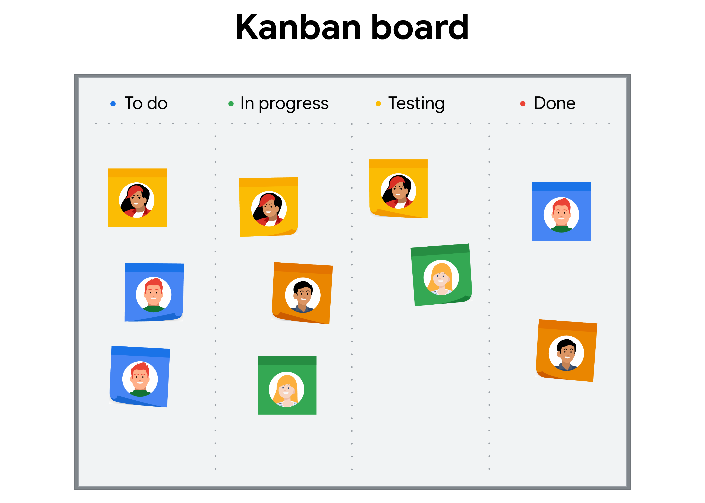

> Building a project plan

You will learn why a project plan is necessary and what components it contains, how to create accurate-准确的,精确的 time estimates and why they are important, and which tools and best practices to use to build a project plan.

> 您将了解为什么项目计划是必要的，它包含哪些组件，如何创建准确的时间估计以及为什么它们很重要，以及使用哪些工具和最佳实践来构建项目计划。

显示学习目标

- Examine tools and best practices to build a project plan.
- Learn how to make accurate time estimates and describe techniques for acquiring them from team members.
- Explain why a project plan is necessary and what components it contains.

# Getting started with a project plan

> 从项目计划开始

## Introduction: Building a project plan	1min

> 引言：建立一个项目计划

Hi.

Welcome back.

In the previous section, we learned more about the planning phase which is the second phase of the project life cycle.

We introduced you to kickoff meetings, which is the first meeting for the project team.

We also discussed milestones, tasks, and how to set these within a project.

Coming up, we'll explain why it is necessary to create and manage a project plan.

We'll discuss the definition of a project plan, and we'll learn what typically goes into one.

> 我们将讨论项目计划的定义，并学习项目计划的典型内容。

This includes the project schedule, which will help guide your team to the finish line.

> 这包括项目时间表，这将有助于指导你的团队到达终点。

We'll also share how to use time estimation methods to prevent-预防,防止 project failure.

> 我们还将分享如何使用时间估计方法来防止项目失败。

We'll introduce you to a few time estimation techniques which can help you build an accurate project schedule.

> 我们将向您介绍一些时间估计技术，这些技术可以帮助您构建准确的项目时间表。

Finally, we'll examine tools and best practices you can use to build out a project plan.

> 最后，我们将检查可用于构建项目计划的工具和最佳实践。

Ready to get started?

Meet me in the next video.

## Components of a project plan 2min

> 项目计划的组成部分

A project plan can be useful for any project, big or small, since it helps you document the scope, tasks, milestones, and overall activities of the project.

> 项目计划对任何项目都很有用，无论大小，因为它可以帮助您记录项目的范围、任务、里程碑和总体活动。

At the center of the project plan is the project schedule.

> 项目计划的核心是项目进度。

The project schedule can help you estimate the amount of time it'll take to complete the project, and it can provide the team with a way to track the project's progress against your goals.

> 项目进度表可以帮助您估计完成项目所需的时间，并且可以为团队提供一种根据您的目标跟踪项目进度的方法。

---

What goes into a project plan may vary-（使）不同,变化,改变 from company to company, but most plans contain these five basic elements.

> 项目计划的内容可能因公司而异，但大多数计划都包含这五个基本要素。

These are: tasks, milestones, people, documentation, and time.

Let's break those down.

A project plan will include tasks and milestones, two topics we discussed before.

Tasks are activities that need to be accomplished within a set period of time.

They're assigned to different members of the team according to their roles and skills.

And milestones are important points within the schedule that indicate progress.

They usually signify the completion of a deliverable or phase of the project.

> 它们通常表示项目的可交付成果或阶段的完成。

---

A project plan will also include the people working on your team and their roles.

> 项目计划还将包括在您的团队中工作的人员及其角色。

It's important that each team member understands their role and the tasks they're responsible for completing.

> 重要的是，每个团队成员都了解他们的角色和他们负责完成的任务。

Ensuring that everyone is clear on their assigned tasks frees-使可用于 you up to focus on managing the project and creates a sense of personal responsibility for members of the team.

> 确保每个人都清楚自己分配的任务，这样你就可以专注于管理项目，并为团队成员创造一种个人责任感。

A project plan is a good place to link to relevant documentation.

> 项目计划是链接到相关文档的好地方。

This includes documents like your RACI chart, which helps to define roles and responsibilities for individuals on your team.

> 这包括像RACI图表这样的文档，它有助于定义团队中个人的角色和职责。

You can also link to your charter, which clearly defines the project and outlines the details needed to reach your goals.

> 您还可以链接到您的章程，其中清楚地定义了项目并概述了实现目标所需的细节。

Relevant documentation can also include documents like your budget and risk management plan.

> 相关文件还可以包括预算和风险管理计划等文件。

We'll discuss more about those later on in the course.

Lastly, a project plan should include the estimated time that will be spent on the project.

> 最后，项目计划应该包括预计将花费在项目上的时间。

This forms the basis of the schedule, which is the anchor-锚,支柱 of your project plan.

> 这构成了时间表的基础，它是项目计划的锚点。

---

The estimated time includes dates on which tasks should be started and completed and the dates when you hope to reach various milestones.

> 估计的时间包括任务应该开始和完成的日期，以及你希望达到各种里程碑的日期。

It also includes the start and end dates of the project, which are important in determining which resources you'll need and when you'll need them.

> 它还包括项目的开始和结束日期，这对于确定您将需要哪些资源以及何时需要它们非常重要。

---

So, how exactly do you estimate how long these things will take?

> 那么，你如何准确地估计这些事情需要多长时间呢?

Meet me in the next video to find out.

> 我们下个视频见吧。

## Putting together the pieces of a project plan 20min

> 将项目计划的各个部分组合在一起

Every project plan is a living artifact-手工艺品 that serves as your team’s roadmap throughout the project.

> 每个项目计划都是一个活生生的工件，在整个项目中充当团队的路线图。

We have covered some common elements of project plans, including tasks, milestones, people, documentation, and time.

> 我们已经介绍了项目计划的一些常见元素，包括任务、里程碑、人员、文档和时间。

Let’s look at how these elements intersect-相交,交叉 with other important components to create a comprehensive-综合性的,全面的 plan for your project. 

> 让我们来看看这些元素如何与其他重要组件相交，从而为您的项目创建一个全面的计划。

**How project plan components are connected**

> 项目计划组件如何连接

You have learned that at the center of the project plan is the project schedule, which helps you estimate the amount of time it will take to complete the project and provides the team with a way to track the project’s progress against your goals.

> 您已经了解到，项目计划的中心是项目时间表，它可以帮助您估计完成项目所需的时间，并为团队提供一种根据您的目标跟踪项目进度的方法。

In addition to the schedule, you should also include the following components in your project plan: 

> 除了时间表，你还应该在你的项目计划中包括以下部分:

- Scope and goals
- Work Breakdown Structure (WBS)
- Budget 
- Management plans

**Project scope and goals**

> 项目范围和目标

Both the project scope and goals will be captured initially in your **project charter**, the document that clearly defines the key details of your project.

> 项目范围和目标都将在项目章程中得到体现，该文件清楚地定义了项目的关键细节。

You can link your project charter in your project plan.

> 您可以将项目章程链接到项目计划中。

Having details about the project’s scope and goals easily accessible can help remind-提醒,使想起 your team of the objectives they are trying to accomplish and if anything is asked of them that goes beyond-超出（范围） what was initially agreed upon in order to achieve those objectives. 

> 有关于项目范围和目标的详细信息可以帮助提醒你的团队他们正在努力完成的目标，如果他们被要求做任何超出最初同意的事情来实现这些目标。

**Work Breakdown Structure (WBS)**

As a reminder, a **Work Breakdown Structure** is a tool that sorts the milestones and tasks of a project in a hierarchy, in the order they need to be completed.

> 提醒一下，工作分解结构是一种工具，它按照需要完成的顺序，将项目的里程碑和任务按层次进行分类。

The WBS is key to your project plan since-因为 it breaks the work down into more manageable pieces.

> WBS是项目计划的关键，因为它将工作分解为更易于管理的部分。

In your project plan, the tasks should be visible in one place with clear descriptions, owners, and due dates.

> 在你的项目计划中，任务应该在一个地方清晰可见，有清晰的描述、所有者和截止日期。

This will allow you and your team to understand who is responsible for which tasks and when each task is **supposed to**-应该,被期望 be completed.

> 这将使你和你的团队了解谁负责哪些任务，以及每个任务应该在什么时候完成。

Your project plan should also contain detailed milestones and statuses related to these tasks, which will help you and your team members visualize project progress. 

> 您的项目计划还应该包含与这些任务相关的详细里程碑和状态，这将帮助您和您的团队成员可视化项目进度。

---

**In addition to**-除了…之外 the WBS, further documentation—such as a RACI chart—will help define roles and responsibilities and would be useful to add to your project plan.

> 除了WBS之外，进一步的文档(例如RACI图表)将有助于定义角色和职责，并且可以将其添加到项目计划中。

Keeping this documentation stored or linked in one place is a best practice for transparency-透明性 and effective communication.

> 将此文档存储或链接在一个地方是实现透明度和有效沟通的最佳实践。

**Budget**

Throughout the life cycle of your project, the budget will need to be managed and monitored.

> 在项目的整个生命周期中，需要对预算进行管理和监控。

The project budget is often linked to the project plan because it is heavily-在很大程度上 dependent on key elements of the project.

> 项目预算经常与项目计划联系在一起，因为它在很大程度上依赖于项目的关键要素。

Linking these components allows for smoother management and visibility. 

---

Depending on the size of your project and your organization, you may not be the primary person responsible for managing the project budget.

> 根据项目和组织的规模，您可能不是负责管理项目预算的主要人员。

For instance, if your project is at a large organization and the funds are managed by another department, you may not have as much autonomy-自主权 or insight into all of the budget elements.

> 例如，如果您的项目是在一个大型组织中，并且资金由另一个部门管理，那么您可能没有那么多的自主权或对所有预算元素的洞察力。

As a result, you may not be able to monitor the budget closely.

> 因此，你可能无法密切监控预算。

If someone in another department is managing the budget, make sure to have regular check-ins with them to ensure that you are aware of how you are tracking.

> 如果是其他部门的人在管理预算，一定要定期与他们联系，以确保你知道自己是如何跟踪的。

**Management plans**

Management plans—such as the change management plan, risk management plan, and communication plan—are all integral-必需的,必要的 to keeping a project organized and on track and should be linked in your project plan.

> 管理计划——例如变更管理计划、风险管理计划和沟通计划——都是保持项目组织和正常进行的必要因素，应该与项目计划联系起来。

These plans will be discussed in detail in the coming lessons of this course. 

> 这些计划将在本课程的后续课程中详细讨论。

**Key takeaway**

Project scope and goals, the Work Breakdown Structure (WBS), the budget, and management plans are all important components of your project plan.

> 项目范围和目标、工作分解结构(WBS)、预算和管理计划都是项目计划的重要组成部分。

They help define how basic project plan elements—including tasks, milestones, people, documentation, and time—will be structured-组织 and utilized in your project.

> 它们有助于定义基本的项目计划元素——包括任务、里程碑、人员、文档和时间——如何在项目中组织和利用。

However, no one project plan will be the same.

At Google, we work with a variety of different tools and templates to create and manage project plans.

> 在谷歌，我们使用各种不同的工具和模板来创建和管理项目计划。

It is important to know your end goals and what is essential to you and your team in order to pull the relevant pieces of the project together. 

> 了解你的最终目标以及对你和你的团队至关重要的是什么，以便将项目的相关部分整合在一起。

# Using estimation to set project timelines

> 使用评估来设置项目时间表

## Making realistic-实际的 time estimates

> 做出切合实际的时间估计

As the project manager, you aren't responsible for completing every task.

What you are responsible for is identifying and helping assign those tasks, and then estimating how long they'll take to complete. 

> 你要负责的是识别和帮助分配这些任务，然后估计完成这些任务需要多长时间。

These estimates come together to determine the overall project schedule.

> 这些评估一起决定了整个项目的进度。

So, how do you estimate the amount of time a given task will take?

> 那么，您如何估计给定任务所需的时间呢?

You do this with the help of your team.

> 你需要团队的帮助。

Time estimation is a prediction-预测（行为） of the total amount of time required to complete a task.

> 时间估计是对完成一项任务所需总时间的预测。

Effort estimation is a prediction of the amount and difficulty of active work required to complete a task.

> 工作量估算是对完成一项任务所需的工作量和难度的预测。

Effort estimation differs from time estimation in that effort quantifies-量化 the amount of time it will take a person to complete work on a task.

> 工作量评估不同于时间评估，因为工作量量化了一个人完成一项任务所需的时间。

**On the flip side**-相反地,另一方面, time refers to the overall duration of the task from start to finish.

> 另一方面，时间是指任务从开始到结束的总持续时间。

That includes inactive time.

> 这包括不活动的时间。

Here's an example.

The effort estimation for painting a wall might be 30 minutes, but time estimation might be 24 hours.

> 粉刷一面墙的工作量估计可能是30分钟，但时间估计可能是24小时。

That's because **in addition to**-除了…之外 the 30 minutes of active painting time, there are also 23 and a half hours of inactive drying-变干 time.

> 这是因为除了30分钟的主动喷漆时间外，还有23个半小时的非主动干燥时间。

It's important to understand the difference between time estimation and effort estimation, because it can help you be more efficient with your available resources.

> 理解时间估计和工作量估计之间的区别非常重要，因为它可以帮助您更有效地利用可用资源。

If there's idle空闲的 time baked into a given task, your teammate is effectively free to do other things.

> 如果在给定的任务中有空闲时间，你的队友实际上可以自由地做其他事情。

A painter can do other tasks while the wall is drying, like painting the mailbox or the window trim-装饰.

> 在墙壁干燥的时候，油漆工可以做其他工作，比如粉刷邮箱或窗户装饰。

An unrealistic effort estimate can negatively-消极地,否定地 impact a project schedule.

> 不切实际的工作量估计会对项目进度产生负面影响。

Generally, this happens when you underestimate-低估,对…估计不足 the amount of time it will take to complete a task.

> 通常，当你低估了完成一项任务所需的时间时，就会发生这种情况。

Often, the culprit-罪犯,过失者,问题的起因 for under estimating effort is optimism-乐观,乐观主义.

> 通常，低估努力的罪魁祸首是乐观。

And listen, optimism is a wonderful trait-品质,特征,特点 for a project manager to possess-拥有,持有.

> 听着，乐观对项目经理来说是一个很好的品质。

But too much optimism can lead you to overlook potential risks that could set your plans behind schedule.

> 但是过于乐观会导致你忽视潜在的风险，这些风险可能会使你的计划落后于计划进度。

Though it might be tempting-诱人的,吸引人的 to make the optimistic assumption that tasks will be executed exactly according to plan, there is always a possibility that there will be setbacks-挫折,阻碍.

> 尽管人们很容易乐观地认为任务会完全按照计划执行，但总是有可能出现挫折。

So, how do you try to avoid making unrealistic effort estimates?

> 那么，如何避免做出不切实际的工作量估计呢?

You can do this by communicating with teammates assigned to each task.

> 您可以通过与分配给每个任务的队友进行通信来实现这一点。

Your teammates will have the most realistic understanding of the amount of work required to complete a task and should be able to provide you with the best estimate.

> 您的团队成员将对完成任务所需的工作量有最实际的了解，并且应该能够为您提供最佳估计。

Let's imagine this scenario in the context of our Plant Pals project at Office Green.

> 让我们在绿色办公室的植物伙伴项目的背景下想象这个场景。

---

As a reminder, you're launching a new service to provide top office green customers with small, low-maintenance plants that they can place on their desks.

> 提醒一下，你们正在推出一项新服务，为顶级办公环保客户提供小型、低维护成本的植物，他们可以把它们放在办公桌上。

You might assume-假定,假设 that creating a contact-联系,联络 list of top customers is relatively-相当地,相对地 straightforward-简单的,易懂的 and can be completed in a single day. 

> 您可能认为创建顶级客户的联系人列表相对简单，可以在一天内完成。

But it's important to really consider certain sub-tasks required to complete work in your planning.

> 但重要的是要真正考虑完成计划中工作所需的某些子任务。

Sub-tasks refer to smaller tasks that are required to complete a larger task.

> 子任务是指完成大任务所需的小任务。

For example, this might include meeting with the global sales team to identify clients gathering contact information, determining client language preferences, and building a spreadsheet to house this information.

> 例如，这可能包括与全球销售团队会面，以确定客户，收集联系信息，确定客户的语言偏好，并构建电子表格来存储这些信息。

Asking the teammate assigned to the task for their estimate is likely to yield-产生 a more accurate estimation since they'll have a deeper understanding of the work and the nuances-细微差别 of what's required to complete the task.

> 要求分配给任务的团队成员进行评估可能会产生更准确的评估，因为他们将对工作和完成任务所需的细微差别有更深入的了解。

You might learn that creating the contact list may take two days to complete, which could be double the time you originally expected.

> 您可能会发现，创建联系人列表可能需要两天时间才能完成，这可能是您最初预期时间的两倍。

Of course, you can usually ask follow-up questions, or even gently-渐进地,平缓地 push back on their estimate, as needed.

> 当然，根据需要，您通常可以问一些后续问题，甚至可以轻轻地推迟他们的估计。

Later on, we'll discuss more of the techniques you can use to get more accurate estimates from your teammates.

> 稍后，我们将讨论更多的技术，您可以使用这些技术从您的团队获得更准确的评估。

Now, **even though**-尽管,虽然 task owners tend to have the strongest sense of how much time they'll need to complete a task, the fact is that effort estimates are just that, estimates, meaning that sometimes those estimates won't be accurate.

> 现在，尽管任务所有者倾向于对他们需要多少时间来完成一项任务有强烈的感觉，但事实是工作量估计只是估计，这意味着有时这些估计并不准确。

For example, in our Plant Pals scenario, your teammate estimates that it will take two days to create a contact list of top customers.

But, let's say that the Sales team is out of the office for a team-building exercise and unable to meet about the client list until after the weekend.

> 但是，假设销售团队不在办公室进行团队建设练习，并且直到周末之后才能开会讨论客户名单。

This will create a task delay, and as a result, the original estimate is no longer accurate.

> 这将造成任务延迟，因此，最初的估计不再准确。

Luckily, there's a helpful tool called a buffer-缓冲 that you can use during the planning phase to protect against-防备,抵御 inaccurate effort estimates.

> 幸运的是，有一种叫做缓冲的有用工具，您可以在计划阶段使用它来防止不准确的工作量估计。

A buffer is extra time added to the end of a task or a project to account for unexpected slowdowns or delays in work progress. 

> 缓冲区是在任务或项目结束时添加的额外时间，用于解释工作进度中的意外减速或延迟。

Buffers are important because they can provide some leeway-余地, just in case your time and effort estimates turn out to **fall a bit short**-差了一点.

> 缓冲很重要，因为它们可以提供一些余地，以防你的时间和精力估计少了一点。

With a buffer, you can add extra time into your schedule, and your project shouldn't fall off track when task delays inevitably-不可避免地 arise-产生,出现.

> 有了缓冲时间，你就可以在计划中增加额外的时间，当任务不可避免地出现延迟时，你的项目也不会偏离轨道。

There are two types of buffers you can use when planning your schedule: task buffers and project buffers.

> 在计划日程时，有两种类型的缓冲区可以使用:任务缓冲区和项目缓冲区。

First, we have task buffers, which refer to extra time **tacked on**-添加 to a specific task.

> 首先，我们有任务缓冲区，它指的是附加到特定任务上的额外时间。

Task buffers should be used primarily for tasks that are out of the project team's control.

> 任务缓冲区应该主要用于项目团队无法控制的任务。

For example, you might ask a potential plant vendor to provide you with a cost estimate by Monday.

> 例如，您可能要求潜在的设备供应商在周一之前为您提供成本估算。

You might assign them this deadline, knowing that you won't actually need the estimate until Thursday.

> 你可能会给他们分配这个截止日期，因为你知道你在周四之前实际上并不需要估计。

The time between Monday and Thursday is your buffer, and it provides your team with extra time just in case the vendor sends their estimates to you a day or two late.

> 周一到周四之间的时间是你的缓冲时间，它为你的团队提供了额外的时间，以防供应商晚一两天向你发送他们的评估。

Task buffers should be used more sparingly-一点点,俭省地 for tasks within the project team's control.

> 任务缓冲区应该更少地用于项目团队控制范围内的任务。

For example, you might choose to add buffers only to tasks that are difficult to complete or that have an element of unpredictability-不可预测性, like the length of time it will take plants to grow.

> 例如，您可以选择仅为难以完成的任务或具有不可预测性的任务添加缓冲区，例如植物生长所需的时间长度。

---

Adding a buffer to every task could lengthen-延长,变长 your project schedule unnecessarily, leaving you, your team, and your stakeholders with an unrealistic timeline.

> 为每个任务添加缓冲可能会不必要地延长您的项目时间表，使您，您的团队和您的利益相关者面临不切实际的时间表。

This is where project buffers **come in handy**-派上用场.

> 这就是项目缓冲区派上用场的地方。

Project buffers differ from task buffers in that they provide extra time to the overall project schedule.

> 项目缓冲与任务缓冲的不同之处在于，它们为整个项目时间表提供额外的时间。

Rather than adding a buffer to every task, you can add extra time as a buffer towards the end of your project schedule.

> 与其为每个任务都添加缓冲时间，不如在项目计划结束时添加额外的时间作为缓冲。

Then you can use that extra time, two to three days, for example, as needed throughout the project.

> 然后你可以利用额外的时间，比如两到三天，根据项目的需要。

For instance, if a teammate misses a deadline here and there, the project buffer gives you space in the overall schedule to **make up**-弥补,弥合 for lost time.

> 例如，如果一个队友错过了最后期限，项目缓冲会给你在整个时间表中提供空间来弥补失去的时间。

I use buffers often in my day-to-day role at Google.

> 我在谷歌的日常工作中经常使用缓冲区。

For example, on a recent-最近的,最新的 project at Google, I was working with a new hire who was great at coding but kept missing deadlines.

> 例如，在谷歌最近的一个项目中，我和一个新员工一起工作，他很擅长编码，但总是赶不上截止日期。

I realized they weren't giving themselves enough buffer time to do testing.

> 我意识到他们没有给自己足够的缓冲时间来做测试。

I started to ask questions about their current workload and the complexity of their tasks, and based on their answers to those questions, I was able to gather insights about their work and determine where I needed to add buffer to their tasks.

> 我开始询问他们当前的工作量和任务的复杂性，根据他们对这些问题的回答，我能够收集他们工作的见解，并确定我需要在他们的任务中添加缓冲。

Ultimately, my goal is to ensure that I'm setting a realistic timeline for the project.

> 最终，我的目标是确保我为项目设定了一个现实的时间表。

After all, if you hit your project goal two months later than expected, your organization may not consider the project a success. 

> 毕竟，如果您比预期晚两个月实现了项目目标，您的组织可能不会认为项目成功。

Time estimation, effort estimation, and buffers can help you build realistic plans for reaching the project goal.

> 时间估计、工作量估计和缓冲可以帮助您构建实现项目目标的实际计划。

## Case study: Run fast, pay later

> 案例研究：跑得快，晚付钱 / 心急吃不了热豆腐

**Time estimation** is used to predict-预言,预计 the amount of time that will be required to complete a task.

> 时间估计用于预测完成任务所需的时间量。

We have talked about how a central-最重要的,主要的 part of being a project manager involves planning.

> 我们已经讨论了作为项目经理的核心部分是如何包括计划的。

Carefully performing key steps of your planning process, such as time estimation, can have a big impact on the success of your project.

> 仔细执行计划过程的关键步骤，例如时间估计，会对项目的成功产生重大影响。

Conversely-相反地,反过来说, flawed-缺陷,瑕疵 time estimation is the root cause of many failed projects.

> 相反，有缺陷的时间估计是许多项目失败的根本原因。

That means many projects fail because project managers and teams **fail to**-未能,没有 accurately estimate the time that it will take to complete tasks. 

> 这意味着许多项目失败，因为项目经理和团队没有准确地估计完成任务所需的时间。

Let’s discuss the following case study, which discusses how inaccurate time estimation can affect a project.

> 让我们讨论下面的案例研究，它讨论了不准确的时间估计如何影响项目。

---

**Run fast, pay later: A case study on time estimation**

> 跑得快，付得晚:时间估计的案例研究

Kendra just scored a project manager role on a new project.

> 肯德拉刚刚在一个新项目中获得了项目经理的职位。

It was a highly competitive-竞争的 bid-投标,竞标, and the company and Kendra are eager-渴望的,渴求的 to do a great job.

> 这是一次竞争激烈的竞标，该公司和肯德拉都渴望把工作做好。

---

Kendra realized immediately-立即,马上 that the timeline for the project would be almost-几乎,差不多 impossible-不可能的,办不到的 to execute.

> 肯德拉立刻意识到，这个项目的时间表几乎不可能执行。

However, this was the first big project she was asked to manage.

> 然而，这是她被要求管理的第一个大项目。

Therefore-因此,所以, instead of letting management-管理层 know about the project’s impossible timeline, Kendra kept quiet-安静的 and was determined to make it work.

> 因此，肯德拉没有让管理层知道这个项目不可能完成的时间表，而是保持沉默，决心让它成功。

She rushed-仓促的,草率的 through the planning phase to get the team moving since time was ticking towards the project completion date. 

> 她匆忙地完成了计划阶段，让团队行动起来，因为时间紧迫，接近项目完成日期。

Kendra created all of the planning documents without input from her team or other stakeholders, with the sole-唯一的,仅有的 intention-意图,目的 of reaching the deadline.

> Kendra在没有她的团队或其他利益相关者参与的情况下创建了所有的规划文件，唯一的目的是在截止日期前完成。

---

During the team meeting, Kendra presented her project plan to the team.

> 在团队会议上，Kendra向团队展示了她的项目计划。

**Right away**-立即,马上,毫不犹豫地, team members expressed-表达 their concerns with the timeline.

> 团队成员立即表达了他们对时间表的担忧。

They felt like there wasn’t enough time to complete their work, and they worried that the timeline didn’t incorporate enough time for reviews.

> 他们觉得没有足够的时间来完成他们的工作，他们担心时间表没有足够的时间进行审查。

Kendra documented the team’s concerns, but instructed-指示,吩咐 them to simply work faster and make it happen.

> 肯德拉记录了团队的担忧，但指示他们只需加快工作速度并实现目标。

---

As the project went on, the project faced schedule delays and other issues due to rework-重做,修订, previously unaccounted-未说明解释的 for tasks, stressed-焦虑 team members, and concerned stakeholders.

> 随着项目的进行，由于返工、之前未解释的任务、团队成员的压力以及相关的利益相关者，项目面临着进度延迟和其他问题。

Ultimately, the project missed its deadline.

> 最终，这个项目错过了最后期限。

Later, the company did a retrospective-回顾的 to determine where things went wrong, and Kendra learned a lot of important lessons.

> 后来，公司进行了一次回顾，以确定问题出在哪里，Kendra从中吸取了很多重要的教训。

**Analysis of the case study**

> 案例分析研究

Let’s break down the project planning process Kendra took and identify any missteps and corrective-纠正的,矫正的 actions that would have helped set her team up for success.

> 让我们来分析一下Kendra的项目规划过程，找出任何可能帮助她的团队走向成功的失误和纠正措施。

**Escalating-升级,迅速增加 concerns**

> 不断升级的问题

Kendra sensed the project timeline was problematic-有问题的,成问题的,未确定的 right from the start of the project.

> Kendra从项目一开始就意识到项目时间表存在问题。

Instead of gathering information to support her concerns and sharing it with management, she decided to keep the issue to herself.

> 她没有收集信息来支持她的担忧，也没有与管理层分享，而是决定把这个问题留给自己。

She moved faster towards the goal instead of slowing down and planning the project thoroughly-认真地,彻底地. 

> 她朝着目标前进得更快，而不是慢下来，彻底地计划项目。

**Working carefully** 

> 工作认真

If Kendra had taken the time to work carefully through the planning process, she may have been able to build a more realistic project plan to deliver the best product to the customer.

> 如果Kendra花时间仔细完成计划过程，她可能已经能够建立一个更现实的项目计划，向客户交付最好的产品。

She might also have identified potential time-saving activities that could have helped her team meet the project deadline. 

> 她也可能已经确定了潜在的节省时间的活动，这些活动可以帮助她的团队完成项目的最后期限。

Thorough-彻底的,全面的 and careful planning with her team could have helped Kendra identify problems and solutions in advance, such as:

> 与她的团队进行周密的计划可以帮助Kendra提前发现问题和解决方案，例如:

- **Elimination-消除,排除 of tasks**. It is possible that all of the tasks initially listed didn’t need to be completed. There may have been unnecessary work added in, and the team could have completed the project without it.

	> **消除任务**。有可能最初列出的所有任务都不需要完成。可能会添加一些不必要的工作，而团队可以在没有这些工作的情况下完成项目。

- **Increased team size**. Kendra could have addressed the potential schedule risk by requesting more resources early on in the project rather than trying to execute without the necessary resources.

	> **增加团队规模**。Kendra本可以通过在项目早期请求更多资源而不是在没有必要资源的情况下执行来解决潜在的进度风险。

- **Streamlining of activities**. There may have been some tasks that could have been done in parallel, or at least-至少 not in sequential order. 

	> **精简活动**。可能有一些任务是可以并行完成的，或者至少不是按顺序完成的。

**Gathering input from the team**

> 收集团队的意见

Kendra should have brought together team members, peers, and management to help build and review her project plan, especially given the challenges of meeting the proposed-提议,建议 project timeline.

> Kendra应该把团队成员、同事和管理层聚集在一起，帮助建立和审查她的项目计划，特别是考虑到满足提议的项目时间表的挑战。

Kendra also didn’t take action to address the concerns of the team members who were responsible for completing the tasks within the estimated time. 

> Kendra也没有采取行动来解决负责在预计时间内完成任务的团队成员的担忧。

---

In this case study, the project manager faced the repercussions-反响,影响 of careless-粗心大意的,疏忽的 time estimates that resulted in rework and unplanned work.

> 在这个案例研究中，项目经理面临着粗心的时间估计的后果，这导致了返工和计划外的工作。

Most times, you can take a pain-疼痛 point in a project—like concerns about timelines—and turn it into an opportunity to be flexible and modify the plan to steer-引导,指导 the project in a better direction. 

> 大多数时候，你可以抓住项目中的痛点——比如对时间表的担忧——把它变成一个灵活的机会，修改计划，使项目朝着更好的方向发展。

**Key takeaway**

Be realistic when estimating time and effort for a project.

> 在估算项目的时间和精力时要现实一些。

Take the time to carefully evaluate potential risks and the impact on the work, and talk to your team members about these challenges.

> 花时间仔细评估潜在的风险和对工作的影响，并与您的团队成员讨论这些挑战。

Don’t be afraid to escalate potential concerns to management.

> 不要害怕向管理层提出潜在的担忧。

Optimism-乐观,乐观主义 is a trait of a great project manager and leader, but it can adversely-不利地,有害地 affect your projects when it comes to time estimation. 

> 乐观是一个伟大的项目经理和领导者的特质，但是当涉及到时间估计时，它会对你的项目产生负面影响。

## Overcoming-克服 the planning fallacy-谬误,谬论,谬见

> 克服计划谬误

It is human nature-秉性 to underestimate-低估 the amount of time and effort it takes to complete a task—from anything as simple as walking the dog to something as complex as completing a project.

> 低估完成一项任务所需的时间和精力是人类的天性——从简单的遛狗到复杂的完成一个项目。

People generally want to remain-保持不变,剩余,遗留 hopeful about a positive-积极的 outcome, and this is a great quality to have as a person.

> 人们通常希望对积极的结果保持希望，这是作为一个人的一种很好的品质。

But as a project manager, this kind of optimism can also be a deficiency-缺陷,瑕疵, especially during the planning phase of a project.

> 但是作为一个项目经理，这种乐观也可能是一种缺陷，尤其是在项目的计划阶段。

Let’s examine a theory-理论,观点 known as the **planning fallacy** to better understand how to set yourself up for success in the planning phase. 

> 让我们来研究一个被称为计划谬误的理论，以更好地理解如何在计划阶段为自己的成功做好准备。

**The planning fallacy and optimism bias-偏见,成见**

> 计划谬误和乐观偏见

The idea of the planning fallacy was first introduced in a 1977 paper written by Daniel Kahneman and Amos Tversky, two foundational figures-人物 in the field of behavioral-行为的 economics-经济的,经济学的.

> 计划谬误的概念最早是在丹尼尔·卡尼曼(Daniel Kahneman)和阿莫斯·特沃斯基(Amos Tversky) 1977年的一篇论文中提出的，他们是行为经济学领域的两位奠基人。

The planning fallacy describes our tendency-倾向,偏好 to underestimate-低估,轻视 the amount of time it will take to complete a task, as well as the costs and risks associated with that task, **due to**-由于,因为 **optimism bias**.

> 计划谬误描述了由于乐观偏见，我们低估完成一项任务所需的时间，以及与该任务相关的成本和风险的倾向。

Optimism bias is when a person believes-相信,认为 that they are less likely to experience-经历 a negative-负面的 event.

> 乐观偏见是指一个人认为他们不太可能经历负面事件。

For example, when you are planning to walk your dog in between meetings, you might think that you can do it faster than you actually can.

> 例如，当你计划在会议间隙遛狗时，你可能会认为你可以比实际做得更快。

Optimism bias is what tells you that you are going to be able to walk your dog without being late for your next meeting.

> 乐观偏见告诉你，你可以遛狗而不会在下次会议上迟到。

If you don’t consider things that might affect the time it will take you to walk your dog—the weather-天气, the chance of them running into another dog and wanting to play, or the fact that they frequently get distracted-使分心,使转移注意力 while sniffing-嗅探 around—you might be late for your next meeting, or you might miss it altogether! 

> 如果你没有考虑到一些可能影响你遛狗时间的因素——天气、它们遇到另一只狗并想要玩耍的可能性，或者它们在周围嗅来嗅去时经常分心的事实——你可能会在下次会议上迟到，或者你可能会完全错过会议!

---

The planning fallacy can happen to anyone, regardless of whether or not they have experience completing similar tasks.

> 计划谬误可能发生在任何人身上，不管他们是否有完成类似任务的经验。

Whether this is your first time walking your dog or your hundredth, you still have to consider the different factors that can affect how long it will take you to complete the walk.

> 无论这是你第一次遛狗还是第一百次遛狗，你都要考虑不同的因素，这些因素会影响你完成遛狗所需的时间。

This same principle applies in project management.

> 同样的原则也适用于项目管理。

You may be brand-铭刻,铭记 new to this kind of project or you may have managed tons-大量,许多 of similar projects before; **either way**-不管怎样, you still need to be careful not to underestimate the time it will take to complete each task on this particular project.

> 你可能对这类项目是全新的，或者你可能之前管理过大量类似的项目;无论哪种方式，您仍然需要小心，不要低估完成这个特定项目中每个任务所需的时间。

As a project manager, you should aim to balance being **aware of**-意识到 the planning fallacy with keeping an optimistic-乐观的 attitude-态度,看法 about the project, even as things change.

> 作为一个项目经理，你的目标应该是在意识到计划谬误和保持对项目的乐观态度之间取得平衡，即使事情发生了变化。

Be optimistically realistic: Push for the best outcomes while planning for the proper-合适的,合理的 time it may take to accomplish each task.

> 保持乐观现实：争取最好的结果，同时为完成每项任务可能需要的适当时间做计划。

**Avoiding the planning fallacy: A case study**

> 避免计划谬误：一个案例研究

Think about the planning fallacy in relation to yourself as a project manager.

> 考虑一下作为项目经理的你自己的计划谬误。

If you have planned massive efforts in your project plan with an optimism bias, this planning fallacy could have a major impact on your project execution.

> 如果您在项目计划中以乐观的态度规划了大量的工作，那么这种规划谬误可能会对您的项目执行产生重大影响。

You could set your team up for failure by not giving them enough time to complete their tasks, causing work to have to be redone-重做,重新装潢 or missing opportunities to execute the project more efficiently.

> 如果你没有给团队足够的时间来完成任务，你可能会让他们失败，导致工作不得不重做，或者失去更有效地执行项目的机会。

---

Let’s examine how this happens.

> 让我们来看看这是如何发生的。

David is a project manager responsible for a home construction project.

> 大卫是一个项目经理，负责一个住宅建设项目。

Let’s check out his Work Breakdown Structure (WBS): 

> 让我们看看他的工作分解结构(WBS):

Working through his plan, David knows that certain things need to happen for the house to be completed.

> 通过他的计划，大卫知道要完成房子需要做一些事情。

He has to order materials, the materials have to be delivered, the contractor has to actually build the house, and there needs to be time for completing finishing touches-润色 and adjustments.

> 他必须订购材料，材料必须交付，承包商必须实际建造房子，并且需要时间完成最后的润色和调整。

The time estimations for those major tasks might break down like this:

> 这些主要任务的时间估计可能如下所示:

| **Task**     | **Estimated Duration** |
| :----------- | :--------------------- |
| Foundation   | 2 weeks                |
| Construction | 4 weeks                |
| Adjustments  | 4 weeks                |

After creating a WBS and a time estimation chart, David estimates that the construction project will take a total of ten weeks.

> 在创建了WBS和时间估计图之后，David估计建设项目总共需要十周的时间。

This sounds perfect because it meets his delivery requirement.

> 这听起来很完美，因为它符合他的交货要求。

If David is unaware-未察觉到的,未意识到的 of the planning fallacy, he may think his plan is solid-可靠的 and that his team is on their way to building the house within the target timeline!

> 如果David没有意识到计划谬误，他可能会认为他的计划是可靠的，他的团队正在目标时间内建造房子的路上!

---

Fortunately-幸运地, David is mindful of the planning fallacy.

> 幸运的是，大卫注意到了计划谬误。

He examines the time estimates more carefully.

> 他更仔细地检查了时间估计。

He considers risks like weather delays or crew members calling out sick-生病的, which could set the project’s completion date back.

> 他考虑了天气延误或船员请病假等风险，这可能会推迟项目的完工日期。

He meets with his team members and other stakeholders to help him uncover-揭露,发现 other possible risks that could affect the project timeline.

> 他与他的团队成员和其他涉众会面，以帮助他发现可能影响项目时间表的其他可能的风险。

After carefully gathering information, he adjusts the time estimates, adding **task buffers** to some of the project tasks to account for the potential risks.

> 在仔细收集信息后，他调整时间估计，在一些项目任务中添加任务缓冲区，以考虑潜在风险。

**Key takeaways**

Being on the lookout for “what-ifs” is a key project management skill.

> 留心“假设”是一项关键的项目管理技能。

Considering situations-情况,形势 that could affect whether or not the project is completed on time can help you overcome-克服,解决 the planning fallacy.

> 考虑可能影响项目是否按时完成的情况可以帮助你克服计划谬误。

Also, you will always have a project team in your corner, so make sure you use them as resources to help uncover possible risks. 

> 此外，您将始终拥有一个项目团队，因此请确保使用他们作为帮助发现潜在风险的资源。

Remember to be “optimistically realistic” and push for the best outcome while still planning for the proper-适当的 time to accomplish each task.

> 记住要“乐观现实”，争取最好的结果，同时计划好完成每项任务的适当时间。

## Capacity-容量,能力,才能 planning and the critical path - 8min

> 容量规划和关键路径

Hi again.

Okay, so we've discussed time estimation, which is a prediction of the total amount of time that will be required to complete a task.

> 好的，我们已经讨论了时间估计，它是对完成一项任务所需的总时间的预测。

And we've also discussed effort estimation, which is a prediction of the amount, and difficulty of active work required to complete a task.

> 我们还讨论了工作量估计，这是对完成一项任务所需的工作量和难度的预测。

These techniques can help you estimate the length of time it will take to complete a task.

> 这些技巧可以帮助你估计完成一项任务所需的时间。

Once you have that information you'll need to determine, if you have the right number of people to get the work done.

> 一旦你有了这些信息，你就需要确定，你是否有合适的人数来完成这项工作。

To figure this out you can use a technique called capacity planning.

> 要解决这个问题，您可以使用一种称为容量规划的技术。

First, let's define capacity.

> 首先，让我们来定义容量。

Capacity refers to the amount of work that the people or resources assigned to the project can reasonably-合理的 complete in a set period of time.

> 能力是指分配给项目的人员或资源在规定的时间内能够合理完成的工作量。

---

A person can only do so much, and it's important to keep in mind each person's capacity when assigning work.

> 一个人只能做这么多，分配工作时牢记每个人的能力是很重要的。

This is where capacity planning comes in.

> 这就是容量规划的用武之地。

Capacity planning refers to the act-行动,举动 of allocating people, and resources to project tasks.

> 能力规划是指为项目任务分配人员和资源的行为。

And determining whether or not you have the necessary resources required to complete the work on time.

> 确定你是否有必要的资源来按时完成工作。

During this process, you might find that you need more resources to speed-加速,促进 up the project timeline, like a second web developer, or a third writer.

> 在这个过程中，你可能会发现你需要更多的资源来加快项目进度，比如第二个web开发人员，或者第三个作家。

Let's imagine capacity planning in the context of our Plant Pals project at Office Green.

> 让我们以绿色办公室的植物伙伴项目为背景来想象产能规划。

If you know that you'll need to deliver plants to 100 customers over a period of five days.

> 如果你知道你需要在5天内将植物交付给100个客户。

Then you'll need to determine if you've hired enough delivery drivers-司机,驾驶员 to meet that deadline.

> 然后你需要确定你是否雇佣了足够的送货司机来满足最后期限。

If one driver averages-平均数 four deliveries-交付,交货 within an eight-hour workday, then you know you'll need to hire at least five drivers to complete the work on time.

> 如果一名司机平均在8小时工作日内送4件货物，那么你就知道你需要雇佣至少5名司机来按时完成这项工作。

Even if a person on your project team is spending 100% of their time at work on your project, they'll have limited capacity for the amount of work they should be expected to complete each day.

> 即使你项目团队中的一个人把100%的时间都花在了你的项目上，他们每天应该完成的工作量也是有限的。

Between meetings, unexpected-想不到的,意外的 urgent-紧急的,急迫的 tasks, and other elements of a typical work day, there's only so much each person can complete.

> 在会议、意外的紧急任务和其他典型工作日的元素之间，每个人只能完成这么多。

So how do you decide where a teammate should focus their priorities, and make the most of their capacity?

> 那么，你如何决定一个团队应该把重点放在哪里，并充分发挥他们的能力呢?

You can prioritize their time by plotting-绘制 the critical path of your project timeline.

> 您可以通过绘制项目时间表的关键路径来优先考虑他们的时间。

The critical path refers to the list of project milestones that you must reach in order to meet the project goal **on schedule**-按时.

> 关键路径指的是为了按时完成项目目标，您必须达到的项目里程碑列表。

As well as the mandatory-强制性的 tasks that contribute to the completion of each milestone.

> 以及有助于完成每个里程碑的强制性任务。

Anything else is considered off the critical path.

> 其他的都被认为不在关键路径上。

For example, tasks on the critical path for launching Project Plant Pals might include hiring plant vendors, developing a new website, and fulfilling-完成,履行,执行 deliveries.

> 例如，启动Project Plant Pals的关键路径上的任务可能包括雇用工厂供应商、开发新网站和完成交付。

A task like adding flowers to your product lineup-阵容, is nice to have, but might not have much impact on the overall success of your project, because this task isn't crucial to your launch.

> 像在你的产品阵容中添加鲜花这样的任务是很好的，但可能不会对你的项目的整体成功产生太大影响，因为这项任务对你的发布并不重要。

These tasks aren't part of the critical path.

> 这些任务不是关键路径的一部分。

To summarize, your critical path includes the bare-仅最基本的 minimum number of tasks and milestones you need to reach your project goal.

> 总而言之，您的关键路径包括达到项目目标所需的最少数量的任务和里程碑。

If your team is unable to complete any of those tasks on time, that might result in a project delay.

> 如果您的团队无法按时完成这些任务，可能会导致项目延迟。

To determine the critical path of a project, you'd start by listing all the tasks required to complete the project and the milestones they feed-提供 into.

> 要确定项目的关键路径，首先要列出完成项目所需的所有任务以及它们所提供的里程碑。

This is a perfect time to think back to your work breakdown structure, or WBS, which is a chart that sorts all the milestones, and tasks of a project into a hierarchy **according to**-根据 the order in which they need to be completed.

> 这是一个完美的时间来回想你的工作分解结构，或WBS，这是一个根据需要完成的顺序将项目的所有里程碑和任务分类成层次结构的图表。

This includes a detailed overview of every project task.

> 这包括每个项目任务的详细概述。

Then, you determine which tasks on the list absolutely can't begin until another task is complete.

> 然后，确定列表上的哪些任务绝对不能开始，直到另一个任务完成。

This is called a dependency, and we'll discuss this topic in more detail later on.

> 这被称为依赖项，我们将在后面更详细地讨论这个主题。

Next, you'll work with your team to make time estimates for each task, and map each task from start to finish.

> 接下来，您将与您的团队一起对每个任务进行时间估计，并从头到尾映射每个任务。

The longest path is your critical path.

> 最长的路径就是关键路径。

There are a few factors that can impact capacity, and capacity planning.

> 有几个因素会影响容量和容量规划。

First you need to be able to identify which task can happen in parallel, which means they can happen at the same time as other tasks.

> 首先，您需要能够识别哪些任务可以并行发生，这意味着它们可以与其他任务同时发生。

You will also need to identify which task can happen sequentially, meaning they must happen in a specific order.

> 您还需要确定哪些任务可以按顺序发生，这意味着它们必须以特定的顺序发生。

When you identify which task can happen in parallel, it helps you create efficiencies-效率 within your project schedule, by demonstrating-证明,示范,演示 where you can complete multiple tasks at the same time.

> 当您确定哪些任务可以并行发生时，通过演示您可以同时完成多个任务的位置，它可以帮助您在项目计划中提高效率。

Identifying sequential tasks, helps you identify the tasks that you need to prioritize early on in the project.

> 确定顺序任务，可以帮助您在项目早期确定需要优先考虑的任务。

For example, a sequential task for your Plant Pals project may include needing budget approval before hiring a vendor.

> 例如，Plant Pals项目的顺序任务可能包括在雇用供应商之前需要预算批准。

And two parallel tasks might include hiring delivery drivers, and the development of a website.

> 两个并行的任务可能包括雇佣送货司机和开发网站。

These tasks have no relationship to one another, as they focus on different portions of the project, and can be completed by different members of the team.

> 这些任务彼此之间没有关系，因为它们关注于项目的不同部分，并且可以由团队的不同成员完成。

That means that one task can begin even if the other task hasn't been completed.

> 这意味着一个任务可以开始，即使另一个任务还没有完成。

And so the work to complete these tasks can happen at the same time.

> 因此，完成这些任务的工作可以同时发生。

You also need to determine which project tasks have a fixed start date.

> 您还需要确定哪些项目任务具有固定的开始日期。

A fixed start date refers to the date on which you must start work on your task in order to achieve your goal.

> 固定的开始日期是指你必须开始工作的日期，以实现你的目标。

Identifying whether or not your tasks have a fixed start dates can help with capacity planning.

> 确定任务是否有固定的开始日期有助于进行容量规划。

Because it helps ensure that you'll have the right number of people available to complete tasks on time.

> 因为这有助于确保你有足够的人手来按时完成任务。

---

For example, let's imagine that your contract says you'll need to deliver 100 plants on a specific date.

> 例如，假设您的合同规定您需要在特定日期交付100株植物。

That means that the task of picking up those plants has a fixed start day of one day prior to delivery.

> 这意味着提取这些植物的任务有一个固定的开始日期，即交货前一天。

Alternatively-要不,或者, some tasks might have an earliest start date.

> 另外，有些任务可能有最早的开始日期。

An earliest start date refers to the earliest date in which you can begin working on a task.

> 最早开始日期是指您可以开始处理任务的最早日期。

Identifying an earliest start date can set accurate expectations for when vendors, and team members will be up and running on the project.

> 确定最早的开始日期可以为供应商和团队成员何时启动并运行项目设定准确的预期。

This can help you plan your work, and prioritize your work accordingly.

> 这可以帮助你计划你的工作，并相应地优先考虑你的工作。

For example, if you're working with a new vendor, you need to wait until contracts are signed, and the purchase order is approved, and created before the vendor can start.

> 例如，如果您正在与一个新的供应商合作，您需要等待，直到合同签署，采购订单被批准，并在供应商开始之前创建。

Let's say that at Office Green this process can take about three weeks.

> 假设在Green办公室，这个过程需要大约三周的时间。

Based on this information, you can determine that the earliest start date for your vendor will be three weeks from the kick off meeting with your vendor.

> 根据这些信息，您可以确定您的供应商的最早开始日期将是与您的供应商开始会议后的三周。

Another best practice for capacity planning, and creating a critical path includes identifying if a task has float-浮动, also sometimes known as slack-空闲的.

> 容量规划和创建关键路径的另一个最佳实践包括确定任务是否有浮动，有时也称为空闲。

Float refers to the amount of time you can wait to begin a task before it impacts the project schedule, and threatens-威胁,危及 the project outcome.

> 浮动是指在任务影响项目进度并威胁到项目结果之前，您可以等待开始任务的时间量。

These are high priority tasks that have low to no **wiggle room**-回旋余地.

> 这些都是高优先级的任务，几乎没有回旋余地。

This helps reinforce-加强,强化 what is, and what is not on your critical path.

> 这有助于强化什么在关键路径上，什么不在关键路径上。

For instance, tasks on the critical path should have zero float, meaning there is no room for delays.

> 例如，关键路径上的任务应该为零浮点数，这意味着没有延迟的余地。

And tasks that do have float are not a part of the critical path.

> 有浮动的任务不属于关键路径。

For example, the shipment-运输,运送 of plants to a priority customer who has requested their delivery on a specific date is a task that has zero float.

> 例如，向要求在特定日期交付的优先级客户运送植物是一个浮动为零的任务。

Great, you've now learned a bit more about how to define capacity, capacity planning, and critical path.

> 很好，您现在已经了解了更多关于如何定义容量、容量规划和关键路径的知识。

We also discussed the techniques used to identify critical path in a project, and the various factors that can impact capacity, and capacity planning.

> 我们还讨论了用于确定项目中关键路径的技术，以及可能影响容量和容量规划的各种因素。

In the next video, we'll continue learning how to create viable-可行的 estimates in a project plan.

> 在下一个视频中，我们将继续学习如何在项目计划中创建可行的估计。

You will also find out how your soft skills can help the effectiveness-效率 of your team.

> 你还会发现你的软技能如何帮助你的团队提高效率。

Meet you there.

## Creating a critical path

> 创建关键路径

As you’ve just learned, the **critical path** refers to the list of required project milestones you must reach to complete the project schedule, as well as the mandatory tasks that contribute-有助于,贡献,捐助 to the completion of each milestone.

> 正如您刚刚了解到的，关键路径指的是完成项目时间表必须达到的项目里程碑列表，以及有助于完成每个里程碑的强制性任务。

You can think of the critical path as a framework that tells you, the project manager, where you are, where you are headed-朝向,走在…的前头 and when you will get there. 

> 你可以把关键路径想象成一个框架，它告诉你，项目经理，你在哪里，你要去哪里，你什么时候会到达那里。

**Why the critical path is critical**

> 为什么关键路径是关键的

The critical path helps you determine the essential tasks that need to be completed on your project to meet your end goal and how long each task will take.

> 关键路径可以帮助您确定项目中需要完成的基本任务，以实现最终目标，以及每个任务需要多长时间。

The critical path also provides a quick-迅速的,快的 reference for critical tasks by revealing-揭示,透露 which tasks will impact your project completion date negatively-消极地,否定地 if their scheduled finish dates are late or missed.

> 关键路径还为关键任务提供了一个快速参考，它揭示了哪些任务在计划完成日期延迟或错过时将对项目完成日期产生负面影响。

A critical path can help you define the resources you need, your project baselines, and any flexibility you have in the schedule. 

> 关键路径可以帮助您定义所需的资源、项目基线以及时间表中的任何灵活性。

**How to create a critical path**

Each project you work on will be different, but there are some general steps for creating a critical path that are applicable-适用的,适当的 to most projects.

> 您处理的每个项目都会有所不同，但是有一些创建关键路径的通用步骤适用于大多数项目。

**Step 1: Capture all tasks** 

> 步骤1：捕获所有任务

When you first start working on your project schedule, you will capture all of the tasks associated with the completion of the effort.

> 当您第一次开始处理您的项目进度表时，您将捕获与完成工作相关的所有任务。

Remember to use the key planning documents you have created to get you to this point, such as your **work breakdown structure (WBS).**

> 记住使用你已经创建的关键计划文档来达到这一点，比如你的工作分解结构(WBS)

The main goal in this step is to make sure that you aren’t missing a key piece of work that is required to complete your project. 

> 这一步的主要目标是确保你没有错过完成项目所需的关键工作。

When creating a critical path, focus on the essential, “need to do” tasks, rather than the “nice to do” tasks that aren’t essential for the completion of the project.

> 当创建一个关键路径时，把重点放在必要的、“需要做”的任务上，而不是那些对完成项目来说不是必不可少的“应该做”的任务上。

Here is an example of critical tasks for building the structure of a house:

> 下面是一个建造房屋结构的关键任务的例子:

| **Task**                                                     |
| :----------------------------------------------------------- |
| A) Excavation - 挖掘,开凿                                    |
| B) Foundation                                                |
| C) Framing - 框架                                            |
| D) Roof - 屋顶                                               |
| E) Plumbing - 管路系统                                       |
| F) Heating-供暖，暖气供应, ventilation-通风，通风系统, and air conditioning-空调系统 (HVAC) |
| G) Electrical                                                |
| H) Insulation - 隔音,隔热                                    |
| I) Drywall-干式墙 + Paint-油漆,涂料                          |
| J) Flooring-地板,地板材料                                    |

**Step 2: Set dependencies** 

> 步骤2:设置依赖项

Now that you have captured all of your critical tasks in list form, arrange those tasks in order of completion by identifying dependencies.

> 现在，您已经以列表的形式捕获了所有关键任务，通过确定依赖关系，按完成顺序排列这些任务。

To determine **dependencies**, figure out which tasks must be completed before other tasks can start.

> 为了确定依赖关系，要弄清楚哪些任务必须在其他任务开始之前完成。

For example, you can’t paint the outside of a house before the house is built, so the task of framing the walls must come before the task of painting them.

> 例如，在房子建成之前，你不能粉刷房子的外面，因此，在粉刷墙壁之前，必须先做框架的工作。

Identifying dependencies is key to a successful project schedule. 

> 确定依赖关系是成功的项目进度表的关键。

To figure out dependencies for each task, ask:

> 要弄清楚每个任务的依赖关系，可以问:

- Which task needs to take place before this task?

	> 在此任务之前需要执行哪个任务?

- Which task can be finished at the same time as this task?

	> 哪个任务可以和这个任务同时完成?

- Which task needs to happen right after this task?

	> 在这个任务之后需要执行哪个任务?

Once you have answered these questions, you can list these dependencies next to your list of tasks:

> 一旦你回答了这些问题，你就可以在你的任务列表旁边列出这些依赖项:

| **Task**                                                     | **Dependency**                      |
| :----------------------------------------------------------- | :---------------------------------- |
| A) Excavation                                                |                                     |
| B) Foundation                                                | A) Excavation                       |
| C) Framing                                                   | B) Foundation                       |
| D) Roof                                                      | C) Framing                          |
| E) Plumbing - 管路系统                                       | C) Framing                          |
| F) Heating-供暖，暖气供应, ventilation-通风，通风系统, and air conditioning-空调系统 (HVAC) | C) Framing                          |
| G) Electrical                                                | C) Framing                          |
| H) Insulation - 隔音,隔热                                    | E) Plumbing, F) HVAC, G) Electrical |
| I) Drywall + Paint                                           | H) Insulation                       |
| J) Flooring                                                  | I) Drywall + Paint                  |

**Step 3: Create a network diagram**

> 步骤3：创建网络图

One common way to visualize the critical path is by creating a **network diagram**.

> 可视化关键路径的一种常用方法是创建一个网络图。

Network diagrams, like the example below, sequence tasks in the order in which they need to be completed, based on their dependencies.

> 网络图，就像下面的例子，根据它们的依赖关系，按照需要完成的顺序排列任务。

These diagrams help visualize:

> 这些图表有助于可视化:

- The path of the work from the start of the project (excavation) to the end of the project (flooring)

	> 从工程开始(开挖)到工程结束(铺地)的工作路径

- Which tasks can be performed in parallel (e.g., HVAC and plumbing) and in sequence (e.g., plumbing then insulation)

	> 哪些任务可以并行执行(例如，暖通空调和管道)，哪些任务可以顺序执行(例如，管道然后是绝缘)

- Which non-essential tasks are NOT on the critical path

	> 哪些非必要的任务不在关键路径上

**Step 4: Make time estimates**

> 第四步：估算时间

After determining tasks and dependencies, consult key stakeholders to get accurate time estimates for each task.

> 在确定任务和依赖关系之后，咨询关键涉众以获得每个任务的准确时间估计。

This is a crucial step in determining your critical path.

> 这是确定关键路径的关键步骤。

If your time estimates are significantly-显著地 off, it may cause the length of your critical path to change.

> 如果您的时间估计明显偏离，则可能导致关键路径的长度发生变化。

Time estimates can be reviewed and updated throughout the project, as necessary. 

> 如果有必要，可以在整个项目中审查和更新时间估计。

| **Task**           | **Duration** | **Dependency**                      |
| :----------------- | :----------- | :---------------------------------- |
| A) Excavation      | 1 Day        |                                     |
| B) Foundation      | 3 Days       | A) Excavation                       |
| C) Framing         | 15 Days      | B) Foundation                       |
| D) Roof            | 3 Days       | C) Framing                          |
| E) Plumbing        | 4 Days       | C) Framing                          |
| F) HVAC            | 3 Days       | C) Framing                          |
| G) Electrical      | 3 Days       | C) Framing                          |
| H) Insulation      | 2 Days       | E) Plumbing, F) HVAC, G) Electrical |
| I) Drywall + Paint | 15 Days      | H) Insulation                       |
| J) Flooring        | 7 Days       | I) Drywall + Paint                  |

**Step 5: Find the critical path** 

> 第五步：找到关键路径

Now that you have your estimated durations for each task, add that information to your network diagram:

> 现在你有了每个任务的估计持续时间，将这些信息添加到你的网络图中：

If you add up the durations for all of your “essential” tasks and calculate the longest possible path, you can determine your critical path.

> 如果你把所有“重要”任务的持续时间加起来，并计算出最长的可能路径，你就可以确定你的关键路径。

In your calculation, only include the tasks that, if they go unfinished, will impact the project’s finish date.

> 在您的计算中，只包括那些如果未完成，将会影响项目完成日期的任务。

In this example, if the “non-essential” tasks—like landscaping and driveway pavement-人行道—are not completed, the house structure completion date will not be impacted. 

> 在这个例子中，如果“非必要”的任务——如景观美化和车道铺设——没有完成，房屋结构完工日期不会受到影响。

---

You can also calculate the critical path using two common approaches: the **forward pass** and the **backward pass**.

> 您还可以使用两种常见方法来计算关键路径:**向前传递**和**向后传递**。

These techniques are useful if you are asked to identify the **earliest and latest start dates** (the earliest and latest dates on which you can begin working on a task) or the **slack** (the amount of time that task can be delayed past its earliest start date without delaying the project).

> 如果你被要求确定最早和最晚的开始日期(你可以开始工作的最早和最晚的日期)或空闲时间(任务可以推迟到最早开始日期之后而不会延迟项目的时间)，这些技巧是有用的。

- The **forward pass** refers to when you start at the beginning of your project task list and add up the duration of the tasks on the critical path to the end of your project. When using this approach, start with the first task you have identified that needs to be completed before anything else can start. 

	> **forward pass** 指的是当您从项目任务列表的开始处开始，并将关键路径上的任务持续时间加起来，直到项目结束。当使用这种方法时，从你确定的第一个任务开始，这个任务需要在其他任何事情开始之前完成。

- The **backward pass** is the opposite-完全相反的—start with the final task or milestone and move backwards through your schedule to determine the shortest path to completion. When there is a hard-严格的 deadline, working backwards can help you determine which tasks are actually critical. You may be able to cut some tasks—or complete them later—in order to meet your deadline. 

	> “向后传递”则相反——从最后的任务或里程碑开始，通过你的时间表向后移动，以确定完成任务的最短路径。当有一个严格的截止日期时，向后看可以帮助你确定哪些任务是真正重要的。为了在截止日期前完成任务，你可能会削减一些任务，或者推迟完成它们。

You can read more about each of these concepts and critical path calculation methods in the following articles:

- [How to Use the Critical Path Method for Complete Beginners](https://www.workamajig.com/blog/critical-path-method)
- [Critical Path Method: A Project Management Essential](https://www.wrike.com/blog/critical-path-is-easy-as-123/)

## Getting accurate time estimates from your team

> 从您的团队获得准确的时间估计

Hi again.

Ready to get back into it?

> 准备好重新开始了吗?

Let's go.

---

Time estimation, effort estimation, and capacity planning are all helpful techniques for creating your project schedule.

> 时间估计、工作量估计和能力计划都是创建项目进度表的有用技术。

At the center of all this planning is your team.

> 所有这些计划的中心是你的团队。

Throughout the schedule-planning process, you're working with teammates to gather estimates, and you're taking into account each person's capacity when building the project schedule.

> 在整个进度计划过程中，您与团队成员一起收集评估，并且在构建项目进度时考虑到每个人的能力。

It makes sense to involve your teammates at this stage.

> 在这个阶段让你的队友参与进来是有意义的。

After all, the person assigned to the given task is likely to have the best sense of how long it will take to complete that task.

> 毕竟，被分配到给定任务的人可能最清楚完成这项任务需要多长时间。

They'll also have the best sense of their own capacity for taking on the work.

> 他们也会对自己承担工作的能力有最好的感觉。

But these conversations-谈话，交谈 are a two-way discussion, and you'll need to tap-发掘,利用 into your soft skills to get the most accurate estimate from your team.

> 但是这些对话是双向的讨论，你需要利用你的软技能，从你的团队那里得到最准确的估计。

Soft skills are personal characteristics that help people work effectively with others.

> 软技能是帮助人们有效地与他人合作的个人特征。

These include crucial communication and interpersonal-人际关系的,人际的 skills we've discussed over the course of this program.

> 这些包括我们在本课程中讨论过的关键的沟通和人际关系技巧。

Soft skills can be important when trying to understand what might be blocking someone's ability to do their best work.

> 在试图理解是什么阻碍了某人把工作做到最好时，软技能是很重要的。

Let's go over three ways to use soft skills and gather accurate estimates from your teammates.

> 让我们来看看三种使用软技能的方法，并从你的队友那里收集准确的评估。

These are asking the right questions, negotiating-磋商,洽谈 effectively, and practicing-练习 empathy-共鸣,同情心.

> 这些是问正确的问题，有效的谈判和练习同理心。

Let's start with asking the right questions.

> 让我们从问正确的问题开始。

Think of conversations around the time estimation as a kind of interview.

> 把关于时间估计的对话看作是一种面试。

You're connecting with your teammates to learn more about how they work on specific tasks, and you'll use this information to build your schedule.

> 你与你的队友联系，了解他们是如何完成特定任务的，你将利用这些信息来制定你的时间表。

To aim to get the most relevant information from these conversations, you'll want to be certain that you're asking effective-有效的, **open-ended**-开放式的 questions that lead-引领,引导 to the answers you're seeking-寻找.

> 为了从这些谈话中获得最相关的信息，你需要确定你问的是有效的、开放式的问题，这些问题会引导你找到你想要的答案。

An open-ended question is a question that cannot be answered with a yes or a no.

> 开放式问题是一个不能用是或否来回答的问题。

The answer provides the relevant details of what you need to know.

> 答案提供了您需要知道的相关细节。

Let's imagine this in the context of your project at Office Green.

> 让我们想象一下，在你的绿色办公室项目的背景下。

You've discussed the design of the new website with your web designer, and you'd like to know how long it will take them to mock up designs for your review.

> 你已经和你的网页设计师讨论了新网站的设计，你想知道他们需要多长时间来模拟设计供你审查。

Now let's say you start the conversation by asking a question like, can you complete the mock-ups in one week?

> 现在让我们假设你通过问这样的问题开始对话，你能在一周内完成模型吗?

This is a closed-ended question and might elicit-引出,得到 a simple yes or no answer, which doesn't tell you much about the task of designing a website or about your teammate's working style.

> 这是一个封闭式的问题，可能会引出一个简单的“是”或“不是”的答案，这并不能告诉你很多关于设计网站的任务或你的队友的工作风格。

Now, imagine if you had started this conversation with an open-ended question.

> 现在，想象一下，如果你以一个开放式的问题开始这个对话。

For example, you might ask the web designer something like, how long does it typically take you to mock up a website design like this one?

> 例如，你可能会问网页设计师这样的问题，你通常需要多长时间来模拟这样一个网站设计?

This is an open-ended question and is more likely to elicit-引出,得到 a more detailed response.

> 这是一个开放式的问题，更有可能引出更详细的回答。

From there, you can ask follow up questions like, how complex are the steps to complete this task?

> 在此基础上，你可以问一些后续问题，比如，完成这项任务的步骤有多复杂?

What are the risks associated with this task?

> 与此任务相关的风险是什么?

And, when do you think you can have this ready?

> 你觉得什么时候可以准备好?

By asking your teammates effective-有效的,实际的, open-ended questions about their assigned tasks, you can learn more about how they work and what they do.

> 通过问你的队友关于他们分配的任务的有效的、开放式的问题，你可以更多地了解他们是如何工作的，他们做什么。

As you have more of these conversations, you will develop a better sense of your teammates roles and their tasks, and you will be able to rely less on your team to make accurate estimates.

> 当您有更多这样的对话时，您将对您的团队成员的角色和他们的任务有更好的认识，并且您将能够更少地依赖于您的团队来做出准确的估计。

---

Another way to use soft skills to gather estimates from teammates is to negotiate-谈判,磋商,洽谈,商定 effectively.

> 使用软技能从队友那里收集评估的另一种方法是进行有效的谈判。

Part of your job as the project manager is to bridge-桥梁,消除,弥合 the gap between high-level goals of the project and the day-to-day perspective-观点,视角 of your team.

> 作为项目经理，你的部分工作是在项目的高层目标和团队的日常观点之间架起桥梁。

While your project might be your number one priority, it's possible that people on your project team have competing priorities on other teams to keep track of, as well.

> 虽然你的项目可能是你的第一优先级，但你的项目团队中的人也有可能在其他团队中有竞争的优先级要跟踪。

Negotiating effectively can help you influence a team member to make your project their priority, by collaborating to find an outcome that works for everyone.

> 有效的谈判可以帮助你影响团队成员，让他们优先考虑你的项目，通过合作找到一个对每个人都有效的结果。

For example, let's imagine that the website designer estimates it will take them two weeks to mock up the website design for review.

> 例如，让我们想象一下，网站设计师估计他们需要两周的时间来模拟网站设计以供审查。

But perhaps-可能,假定,猜想 you were hoping that the estimate might be closer to one week.

> 但也许你希望估计时间更接近一周。

To arrive at an estimate that works for both you and the designer, you might gently-渐进地,平缓地 challenge the estimate by asking follow-up questions.

> 为了得到一个对你和设计师都有效的估计，你可以通过问一些后续问题来质疑这个估计。

Perhaps you'd ask if their estimate includes mocking up designs for multiple pages.

> 也许你会问他们的估计是否包括多个页面的模拟设计。

If so, you might ask if the designer is able to share one or two pages with you sooner-更快地,更早地 than their proposed-提议,建议 deadline.

> 如果是这样，你可以问设计师是否可以在他们提出的截止日期之前与你分享一到两页。

By asking questions, you can determine if their estimate is flexible, or if you need to bring in an additional designer to support the schedule.

> 通过提问，您可以确定他们的估计是否灵活，或者您是否需要引入额外的设计师来支持日程安排。

By negotiating effectively with your teammates, you can create a sense of shared ownership over the project outcomes and create a schedule that aligns with everyone's workload.

> 通过与团队成员进行有效的协商，您可以创建一种共享项目成果的感觉，并创建一个与每个人的工作量相一致的时间表。

---

Now let's discuss the value of practicing empathy-同理心.

> 现在我们来讨论练习同理心的价值。

Empathy refers to a person's ability to relate to the thoughts and feelings of others.

> 同理心是指一个人与他人的想法和感受相联系的能力。

Practicing empathy at work can be a very effective way to build trust with your team.

> 在工作中练习同理心是与团队建立信任的一种非常有效的方式。

Your teammates are humans, and each person can only do so much.

> 你的队友也是人，每个人只能做这么多。

When you're discussing estimates with the team, you might practice empathy by asking each person about their workload, including work outside of your project and the overall work-life balance.

> 当你与团队讨论评估时，你可以通过询问每个人的工作量来练习同理心，包括项目之外的工作和整体的工作与生活平衡。

You might also ask if they've scheduled vacation-休假,假期 or leave during the duration-持续,持续时间 of the project, or if there are crucial holidays in which they won't be working.

> 你也可以问他们是否安排了假期或在项目期间离开，或者是否有重要的假期他们不工作。

This can help you avoid assigning tasks when teammates are unable to complete them on time.

> 这可以帮助您避免在队友无法按时完成任务时分配任务。

For example, the web designer might tell you that they're also designing a website for another team at Office Green, and that the timeline for both projects overlap-重叠.

> 例如，网页设计师可能会告诉你，他们也在为Office Green的另一个团队设计一个网站，而这两个项目的时间安排是重叠的。

So, to avoid overloading-超载 your designer with work, you might work with the other project manager to balance workloads across the teams.

> 因此，为了避免设计师的工作负担过重，您可以与其他项目经理合作，以平衡团队之间的工作量。

People like to feel their work is valued, so part of empathy is remembering to always be appreciative-欣赏的,赞赏的 of the work, collaboration, and support that you're getting from the team.

> 人们喜欢感觉自己的工作受到重视，所以移情的一部分是要记住永远感激你从团队中得到的工作、合作和支持。

So, to recap, asking the right questions, negotiating effectively, and practicing empathy can help you get viable-可行的,可实施的, accurate estimates from your teammates about project tasks.

> 所以，总结一下，问正确的问题，有效的谈判，练习同理心可以帮助你从你的团队成员那里得到关于项目任务的可行的，准确的估计。

Coming up, we will discuss putting these estimates to good use in the project plan.

> 接下来，我们将讨论如何在项目计划中充分利用这些评估。

## Angel: The value of interpersonal skills in time estimation

> Angel：人际交往能力在时间估计中的价值

Hi, my name is Angel, and I'm a Program Manager at Google.

I'm a mechanical engineer by degree.

> 我的学位是机械工程师。

My first boss out of school said, "You're an okay engineer, but your people skills are off the charts."

> 我毕业后的第一个老板对我说:“你是个不错的工程师，但你的人际交往能力超乎常人。”

Having a technical background and having really good people skills is hard to find.

> 拥有技术背景和良好的人际交往能力是很难找到的。

Soft skills to me have a lot to do with emotional-情感的,情绪的 intelligence-智慧—being able to read other people and then ultimately really knowing yourself—and being able to read the team, read what they need, but then at the same time, what am I doing?

> 对我来说，软技能与情商有很大关系——能够读懂别人，最终真正了解自己——能够读懂团队，了解他们需要什么，但同时，我在做什么?

Either-或者,要么 influencing the team in a good way, in a bad way, or just a different way.

> 要么以好的方式影响团队，要么以坏的方式影响团队，或者只是以不同的方式影响团队。

Just asking, sometimes, people that don't usually raise-举起 their hand-手 to give input goes a long way, because a lot of times the folks-人们 that are maybe a little more quiet-轻声的,安静的 are genuinely-真诚地,的确 thinking about the problem and may have a lot of insights that if you didn't catch on that or ask them, you could miss out.

> 只是问问，有时候，那些通常不举手给出意见的人会有很长的路要走，因为很多时候，那些可能更安静的人是真正在思考这个问题，可能有很多见解，如果你没有抓住或者问他们，你可能会错过。

And so, to me, soft skills just means, just really understanding the emotional-情感的,情绪的 needs of the team.

> 所以，对我来说，软技能就是真正理解团队的情感需求。

That can really help with, whether it's estimations or costs, whether it be labor-劳动,工作 or dollar-wise, get the full view from the team of what that might look like.

> 这真的很有帮助，无论是估算还是成本，无论是劳动力还是美元，从团队那里得到完整的视图。

When it **comes to**-涉及,达到 task estimation and time estimations, the other thing is just asking good questions.

> 当涉及到任务估计和时间估计时，另一件事就是提出好的问题。

Not just, "I need you to go faster," but really saying, "Hey, how much faster could you go if I gave you this?

> 不只是“我需要你开得快一点”，而是真正地说:“嘿，如果我给你这个，你能开得快多少?”

What is stopping-阻止,妨碍 you from going faster?

> 是什么阻碍了你走得更快?

What teams would you need to get involved to help this?" or "Hey, we have an issue, are there similar issues in other parts of this project, and do we need to get together in a larger group to bring that together?"

> 或者“嘿，我们有一个问题，这个项目的其他部分是否也有类似的问题，我们是否需要组成一个更大的团队来解决这个问题?”

I think as a Program Manager that's really your role is to see patterns in a project and see where things are either slowing-放慢,减速 down or at a complete stop, and having those soft skills to be able to bring the team together to solve that problem, and to even just see it.

> 我认为作为一个项目经理，你的角色就是要看到项目中的模式，看到事情在哪里放缓或完全停止，并拥有这些软技能，能够将团队聚集在一起解决问题，甚至只是看到问题。

Just to acknowledge-承认,认可 that there is a problem, and instead of blaming-责备,谴责 is really just digging-挖掘 in, and how do we learn from this?

> 承认问题的存在，而不是一味的指责，我们如何从中吸取教训呢?

How do we fix this?

How do we move on?

> 我们该如何继续?

Some of the things that also help is just relating to your team members.

> 与你的团队成员建立联系也是有帮助的。

If you've either been in a similar situation or just trying to understand what their process is.

> 如果你遇到过类似的情况，或者只是想了解他们的流程。

Sometimes just having people walk through the estimate out loud-大声的,响亮的 can sometimes come up with realizations of, we can save more time or could improve this just by talking it out.

> 有时，让人们大声地进行评估有时会意识到，我们可以节省更多的时间，或者可以通过大声说出来来改进。

I've been a Project Manager for machines that make labels-标签 to locomotive-机车,火车头 engines-发动机 to how you make plywood-胶合板.

> 我曾是一个项目经理，负责制造机车引擎标签的机器，以及制造胶合板的机器。

Project management skills don't necessarily need to be all about the field that you're in.

> 项目管理技能并不一定要与你所在的领域有关。

It's really more about the method and the process and how you structure-组织,安排 a team and get people to work together.

> 更重要的是方法和过程，以及你如何组织一个团队，让人们一起工作。

# Utilizing tools to build a project plan

> 利用工具制定项目计划

## Developing a project schedule

> 制定项目进度表

Hi again.

In the previous videos, we took you through a few different time estimation methods.

> 在之前的视频中，我们介绍了几种不同的时间估计方法。

Now you can relate-理解,涉及,联系 how to use time estimation methods to prevent-阻止,阻碍 project failure.

> 现在您可以了解如何使用时间估计方法来防止项目失败。

---

Let's discuss how to pull all of this information into a project plan to help you and your team stay on track to meet your goals. 

> 让我们讨论一下如何将所有这些信息纳入项目计划中，以帮助您和您的团队保持在实现目标的轨道上。

Even the simplest projects can benefit from a clear plan, and an anchor-锚点,支柱 of a good project plan is a clear schedule containing all the tasks of a project, their owners, and when they need to be completed.

> 即使是最简单的项目也可以从一个清晰的计划中受益，一个好的项目计划的锚点是一个清晰的时间表，包括项目的所有任务，它们的所有者，以及它们需要完成的时间。

Once you have your project schedule, you can build a solid-可靠的 plan around that schedule using tools like spreadsheets and Asana.

> 一旦你有了你的项目时间表，你就可以使用电子表格和Asana等工具围绕这个时间表建立一个可靠的计划。

---

We'll explain these tools **in a few moments**-稍后.

> 稍后我们将解释这些工具。

But first, let's discuss building a project schedule.

> 但首先，让我们讨论一下如何制定项目进度表。

---

There are many helpful tools that you can use to create a project schedule, but let's focus on one that we sometimes use here at Google called a Gantt chart.

> 有许多有用的工具可以用来创建项目时间表，但让我们专注于我们有时在谷歌使用的甘特图。

A Gantt chart is a horizontal-水平的 bar-条纹 chart that maps out a project schedule.

> 甘特图是一种显示项目进度的水平条形图。

**Fun fact**-趣闻轶事: the chart gets its name from American engineer, Henry Gantt, who helped popularize-宣传,推广 the chart in the early 1900s.

> 有趣的事实：这个图表得名于美国工程师亨利·甘特，他在20世纪初帮助推广了这个图表。

So, why did people working in project management find this chart useful?

> 那么，为什么项目管理人员会发现这个图表很有用呢?

Well, it's a highly visual representation-表示,象征 of a projects tasks with clear breakdowns of who's responsible for the work and when those tasks are due.

> 嗯，它是一个项目任务的高度可视化的表示，有明确的分工，谁负责这项工作，这些任务什么时候到期。

For many people, a visual aid-帮助,辅助 that builds upon written directions can be a helpful way to understand and synthesize-综合,结合 the work they need to do, when they need to complete it, and how their individual tasks connect to the other tasks in a project.

> 对许多人来说，建立在书面指示上的视觉辅助可以帮助他们理解和综合他们需要做的工作，什么时候需要完成它，以及他们的个人任务如何与项目中的其他任务联系起来。

Gantt charts are almost like calendars.

> 甘特图很像日历。

They feature the start and end dates of each task, and the bars align with how much time is devoted-献身,致力 to each of those tasks.

> 它们以每项任务的开始和结束日期为特色，条形图与每项任务投入的时间保持一致。

For example, let's say that your teammate, Leon, is tasked with creating a project charter and another teammate, Kylie, is tasked with reviewing and editing the charter when Leon is finished.

> 例如，假设您的队友Leon的任务是创建一个项目章程，而另一个队友Kylie的任务是在Leon完成后检查和编辑章程。

---

Using a Gantt chart, you'll use colored bars to illustrate the days that they'll be working on these tasks.

> 使用甘特图，您将使用彩色条形图来说明他们将在这些任务上工作的日子。

With this method, you and the rest of your team can determine that Leon has Friday, Monday, and Tuesday to work on the chart, and Kylie has Wednesday to complete any revisions-修改,修订.

> 使用此方法，您和团队的其他成员可以确定Leon有周五、周一和周二的时间来处理图表，而Kylie有周三的时间来完成任何修改。

The bars cascade down to illustrate the passing of time and the blocks of time in which the tasks are completed.

> 这些条形图向下显示时间的流逝和任务完成的时间块。

Gantt charts can be a helpful tool for tracking schedules, but what kinds of tools can you use to make a Gantt chart?

> 甘特图可能是跟踪日程安排的有用工具，但是您可以使用哪些工具来制作甘特图呢?

There are a few options, but we're going to focus on a straightforward-简单的,易懂的 spreadsheet.

> 有几个选项，但我们将专注于一个简单的电子表格。

Creating a Gantt chart in a spreadsheet is pretty simple.

You can organize your left columns by items like task title, task owner, start date, due date, duration, and percent of task complete.

> 您可以按任务标题、任务所有者、开始日期、截止日期、持续时间和任务完成百分比等项目组织左侧列。

This is a great place to list the tasks and milestones previously identified in a work breakdown structure.

> 这是列出之前在工作分解结构中确定的任务和里程碑的好地方。

You'll include relevant-有关的,切题的 information in the rows below, organized by start date.

> 你将在下面的行中包括相关信息，按开始日期组织。

On the right side of your sheet, you'll order your columns by the weeks estimated to complete the project from start to finish.

> 在你的表格的右边，你将按照从开始到结束预计完成项目的周数对你的专栏进行排序。

In the rows below that, you'll include bars representing the dates when certain tasks will take place.

> 在下面的行中，您将包括表示某些任务发生的日期的条形图。

Kind of neat-简洁的, right? 

> 很简洁，对吧?

Spreadsheets are helpful here, because they can hold more information than just the Gantt chart.

> 电子表格在这里很有帮助，因为它们可以比甘特图包含更多的信息。

Though the project schedule serves as the central component of the project plan, you can use separate tabs on your spreadsheet to house or link to other documents you want to include in your plan, like a RACI chart or a project charter.

> 虽然项目进程表是项目计划的中心组成部分，但您可以在电子表格上使用单独的选项卡来存放或链接到您希望包含在计划中的其他文档，如RACI图表或项目章程。

You may also opt-选择,作出抉择 to include your plans for risk management and communication here too.

> 你也可以选择在这里包括你的风险管理和沟通计划。

With a spreadsheet, you can simply add a tab for your documents.

Keeping every document for the project in one spreadsheet saves time, helps everyone stay organized, and reduces the burden-负担 of having to search through emails for information.

> 将项目的所有文档保存在一个电子表格中可以节省时间，帮助每个人保持组织性，并减少在电子邮件中搜索信息的负担。

Alternatively-要不,或者, you can also opt to use a digital document to link out all the relevant documents.

> 另外，你也可以选择使用数字文档链接出所有相关文档。

While Gantt charts are a useful tool, they are far-远,遥远地 from the only option for your project plan, and there are plenty-富裕,充裕 of reasons why this form-形式 of documentation might not work for you or your project team.

> 虽然甘特图是一个有用的工具，但它们远不是项目计划的唯一选择，并且有很多原因可以解释为什么这种形式的文档可能不适合您或您的项目团队。

For a simple project, you might find that your team responds-响应 better to a digital document that features a list of tables or tasks, their owners, due dates, and links to other relevant planning documents.

> 对于一个简单的项目，您可能会发现您的团队对数字文档的响应更好，该文档以表或任务列表、其所有者、截止日期以及指向其他相关计划文档的链接为特征。

Or perhaps-可能,也许 your team works best with Kanban boards, which uses cards to track and visualize the progress of your tasks.

> 或者也许你的团队最擅长使用看板，它使用卡片来跟踪和可视化任务的进度。

Regardless of your chosen tool, if your plan includes the project's goals, its tasks, owners, start and end dates, and relevant planning documentation, then you'll be able to keep everyone on the same page.

> 不管你选择什么工具，如果你的计划包括项目的目标、任务、所有者、开始和结束日期，以及相关的计划文档，那么你就能让每个人都在同一个页面上。

Now you know a bit more about the tools that can be used to create a project schedule.

> 现在您对用于创建项目时间表的工具有了更多的了解。

Up next, we'll discuss best practices for building a project plan.

Meet you in the next video.

## Project plan best practices

> 项目计划最佳实践

Hi again.

Earlier, you learned about creating a project plan based on a project schedule that lists all of the milestones, tasks, and deadlines for the project and that clearly outlines the people responsible for each task.

> 前面，您了解了如何根据项目进度表创建项目计划，该进度表列出了项目的所有里程碑、任务和截止日期，并清楚地概述了负责每个任务的人员。

You also learned about Gantt charts, which are simple visual ways to create your schedule.

> 您还了解了甘特图，这是创建日程安排的简单可视化方法。

So, how can you help make sure that your plan works for you and your team?

> 那么，你如何帮助确保你的计划对你和你的团队有效呢?

---

Let's discuss five best practices for building a great project plan that will remain-保持不变,逗留,留下 useful throughout the execution and closing phases of your project.

> 让我们来讨论五个最佳实践，以建立一个伟大的项目计划，这将在整个项目的执行和结束阶段保持有用。

Those include: ensuring careful review of project deliverables, milestones, and tasks; giving yourself time to plan; recognizing and planning for the inevitable-必然发生的,不可避免的 (things will go wrong); staying curious-好奇的,求知欲强的; and championing-捍卫,拥护,支持 your plan.

> 这包括:确保仔细审查项目可交付成果、里程碑和任务;给自己时间做计划;认识到不可避免的事情并做好计划(事情会出错);保持好奇;支持你的计划。

First, you'll want to ensure that you've carefully reviewed the project's deliverables, milestones, and tasks.

> 首先，您需要确保您已经仔细检查了项目的可交付成果、里程碑和任务。

During the initiation phase, you'll recall-回想起 that you created a project charter with important information regarding-关于 your project, like your goal, scope, and deliverables.

> 在启动阶段，您将回忆起您创建了一个包含有关项目的重要信息的项目章程，例如您的目标、范围和可交付成果。

When a project enters-进入,报名,登记,输入 the planning phase, your plans become more granular-颗粒的,粒状的.

> 当项目进入计划阶段时，您的计划变得更加细化。

Let's discuss this in the context of your project at Office Green.

In your plan, you need to break this information down further.

> 在你的计划中，你需要进一步分解这些信息。

You're creating a new website for the service, so you'll need to break that deliverable down into smaller milestones, like kicking off a meeting with the web developer and gaining stakeholder approval.

> 你正在为这项服务创建一个新的网站，所以你需要将可交付成果分解成更小的里程碑，比如开始与网络开发人员开会并获得利益相关者的批准。

And those milestones will break down into smaller tasks, like mocking up a design of a new website and developing a landing page.

> 这些里程碑会分解成更小的任务，比如模拟一个新网站的设计，开发一个登陆页面。

Each of these tasks will be assigned to a teammate and given a start and end date.

> 每个任务都将分配给一个队友，并给出开始和结束日期。

Now, a new website isn't the only Project Plant Pals deliverable.

> 现在，一个新网站并不是“植物伙伴”项目唯一的成果。

You'll need to break down every deliverable into milestones and tasks to ensure that you and you team have a clear picture of what need to be done to meet your project's goals.

> 你需要将每个可交付成果分解成里程碑和任务，以确保你和你的团队清楚地了解需要做什么来实现项目目标。

Your plan **revolves-旋转 around**-以…为中心 completing each and every tiny-极小的,微小的 task, so you should take your time to get this piece right.

> 你的计划围绕着完成每一个小任务，所以你应该花时间把这部分做好。

---

This brings me to my second tip: give yourself time to plan.

> 这就引出了我的第二条建议：给自己时间做计划。

There's a reason that planning is its own-自己的,属于自己的 phase of the project life cycle.

> 计划是项目生命周期的一个独立阶段，这是有原因的。

It's a time-intensive-时间密集的 process, especially for larger projects with multiple deliverables.

> 这是一个时间密集的过程，特别是对于具有多个可交付成果的大型项目。

Planning gives you and your team some time to think realistically about what your team can and cannot accomplish within a certain time frame.

> 计划给你和你的团队一些时间来现实地思考你的团队在一定的时间框架内能完成什么，不能完成什么。

You're not a machine, and neither-也不 are your teammates.

> 你不是机器，你的队友也不是。

There are limits to the amount of work any one person can do in a given time frame.

> 每个人在给定的时间内所能完成的工作量都是有限的。

Using the strategies that we've shared earlier, like effort estimation and capacity planning, can help you and your team get a realistic sense of how long the project will take and when you'll be able to hit your milestones.

> 使用我们之前分享的策略，如工作量估算和容量计划，可以帮助您和您的团队对项目需要多长时间以及何时能够达到里程碑有一个现实的认识。

It's also important to allow for buffer time, since projects rarely-罕有,很少 go exactly-完全 as planned.

> 留出缓冲时间也很重要，因为项目很少完全按计划进行。

Later in the project, you'll be grateful-庆幸,感谢的,感激的 that you initially planned for some built-in flexibility around timing.

> 在项目的后期，您会庆幸最初计划了一些内置的时间灵活性。

---

That leads nicely into my third tip: recognize and plan for the inevitable—things will go wrong.

> 这很好地引出了我的第三个建议：认识到不可避免的事情并为之做好计划——事情会出错。

Even with thorough-彻底的,全面的 planning, your projects will still experience-遭遇,经历 unexpected setbacks-挫折,阻碍 and bumps-碰撞 in the road.

> 即使有了周密的计划，你的项目仍然会遇到意想不到的挫折和颠簸。

You can't plan for every problem, but the team can identify the risks that will most likely occur and create plans to prevent or mitigate those risks.

> 您不可能为每个问题制定计划，但是团队可以识别最有可能发生的风险，并制定计划来预防或减轻这些风险。

As we mentioned-提到,谈到 before, buffer is a helpful tool for mitigating issues related to slowdowns in progress.

> 正如我们之前提到的，缓冲区是一种有用的工具，可以缓解与进程减速相关的问题。

You'll learn more about how to create a risk management plan that **goes into**-进入 your project plan later on in this course.

> 您将在本课程中了解更多关于如何创建风险管理计划的信息，该计划将进入您的项目计划。

---

Onto my fourth tip: stay curious.

> 关于我的第四个建议：保持好奇心。

Though you may be the sole-唯一的,仅有的 expert-专家 on your project overall, it's extremely-极度,非常 unlikely that you're an expert on every task of the project.

> 虽然你可能是整个项目的唯一专家，但你不太可能对项目的每一项任务都了如指掌。

That's why it's so important to sit down with your teammates during a planning phase and ask lots and lots of questions.

> 这就是为什么在计划阶段和你的队友坐下来问很多很多问题是如此重要。

As we mentioned-提到,提及 earlier, asking your teammates questions about their work can give you deeper insights into their tasks for the project.

> 正如我们之前提到的，向你的队友询问他们的工作可以让你更深入地了解他们在项目中的任务。

Their input will help you build a stronger plan, and the **back and forth**-来回 dialogue-对白,对话 will help you build trust between you and your teammates.

> 他们的意见将帮助你建立一个更强大的计划，来回的对话将帮助你在你和你的队友之间建立信任。

To keep the project running smoothly, it's also important to understand the expectations, priorities, risk assessments, and communication styles of your stakeholders and vendors.

> 为了保持项目顺利运行，理解涉众和供应商的期望、优先级、风险评估和沟通风格也很重要。

For example, you might ask stakeholders how to best keep them in the loop on the project's plans, and you might ask your vendors about their availability to complete work for the project. 

> 例如，您可能会询问涉众如何最好地让他们了解项目计划，您可能会询问供应商是否有能力完成项目的工作。

---

Now onto my fifth tip: champion your plan.

> 现在是我的第五个建议：支持你的计划。

While deciding how to organize your plan, you'll want to ask yourself a few questions. 

> 在决定如何组织你的计划时，你会想问自己几个问题。

Like, can your teammates use the tool you used to build your plan?

Is the information clear enough for your stakeholders?

> 这些信息对利益相关者来说是否足够清晰?

Will using this plan as a single source of truth-事实,真相 save-节省 your team and stakeholders the time and energy when they need to find information on the project?

> 当团队和涉众需要查找项目信息时，将此计划作为事实的单一来源是否会节省他们的时间和精力?

If the answer to each of these questions is a strong yes, then you're on the right track.

> 如果这些问题的答案都是肯定的，那么你就走上了正确的道路。

To achieve buy-in from your teammates and stakeholders on your project plan, champion it!

> 为了获得团队成员和利益相关者对项目计划的支持，支持它!

Tell your team why it benefits them to stay on top of the plan.

> 告诉你的团队，为什么保持在计划的顶端对他们有利。

By doing so, you may influence your teammates to stay on track and update the plan regularly.

> 通过这样做，你可能会影响你的队友，使他们保持正轨，并定期更新计划。

So to recap, you can set your project plan up for success if you review your deliverables, milestones, and tasks; give yourself time to plan; prepare for things to go wrong; stay curious; and champion your plan once it's finalized-完成,敲定.

> 综上所述，如果你回顾了可交付成果、里程碑和任务，你就可以为成功制定项目计划;给自己时间做计划;为事情变糟做好准备;保持好奇;一旦你的计划敲定，你就会支持它。

Coming up, we'll recap what you've learned over the past few videos.

> 接下来，我们将回顾一下你在过去几个视频中学到的东西。

See you there.

## Creating a project plan: Tools and templates

> 创建项目计划：工具和模板

**Project plans** are critical because they are used to capture the scope and time it takes to complete a project.

> 项目计划是至关重要的，因为它们用于捕获完成项目所需的范围和时间。

The project plan is essentially the project’s blueprint-蓝图,设计图—it lays out all of the activities and milestones that your team needs to achieve in order to successfully complete the project.

> 项目计划本质上是项目的蓝图——它列出了你的团队为了成功完成项目所需要实现的所有活动和里程碑。

Project plans come in various shapes, sizes, and forms.

> 项目计划有各种各样的形状、大小和形式。

Depending on the project you are managing, the template you use may vary, and some companies even have standard templates they require their project managers to use. 

> 根据您正在管理的项目，您使用的模板可能会有所不同，有些公司甚至有要求其项目经理使用的标准模板。

---

In the previous videos, you learned about various tools and techniques to create a project plan.

But how do you know which tools and techniques to use and when?

As a general rule, it is best to use a spreadsheet for a simple project and project management software for a more complex project.

Regardless of what tool you use, be sure to include this key information: 

- **Task ID numbers** or **task names**: You might end up with dozens, hundreds, or even thousands of tasks in a project. Assigning a task ID or name makes it easy to find and reference a task when communicating with team members and stakeholders. 

- **Task durations:** A task duration is the amount of time you estimate that task should take. Adding task durations to your project plan helps you organize and prioritize the tasks in the project to help ensure you hit your goal on time. 

	> **任务持续时间：**任务持续时间是您估计该任务应该花费的时间量。将任务持续时间添加到项目计划中可以帮助您组织项目中的任务并确定优先级，以确保您按时实现目标。

- **Start and finish dates:** Including start and finish dates for each task helps you track whether you are progressing on time or not. 

- **Who is responsible for what:** Including each team member’s role and responsibilities helps promote-促进,提高 clarity and efficiency. As a best practice, assign an owner to each task, as well.

	> 包括每个团队成员的角色和职责有助于提高清晰度和效率。作为最佳实践，还应该为每个任务分配一个所有者。

**Using a spreadsheet to build a project plan**

Spreadsheets are an excellent-极好的,卓越的 tool to use for project plans, particularly for projects that are less complex and that have a clear assignment of tasks.

> 电子表格是用于项目计划的极好工具，特别是对于那些不太复杂且任务分配明确的项目。

Spreadsheets can require a lot of manual-手工的,手动的 input of information, but as a project manager, you may find that you like the control that spreadsheets provide.

> 电子表格可能需要大量的手工信息输入，但作为一个项目经理，你可能会发现你喜欢电子表格提供的控制。

Spreadsheets are also customizable-可定制的, so you can tailor-迎合,使适应 them to your project’s needs. 

> 电子表格也是可定制的，因此您可以根据项目的需要定制它们。

The graphic-图表 below shows what a project plan for a website launch might look like in a simple spreadsheet.

> 下面的图表显示了一个网站发布的项目计划在一个简单的电子表格中可能是什么样子。

**Pro tip:** It is important to incorporate-包含,合并 your **Work Breakdown Structure (WBS)** numbers into your project plan. In this example, the ID numbers directly relate to the WBS numbers, which is a helpful way to maintain consistency. 

> 专业提示:将你的工作分解结构(WBS)数字纳入你的项目计划是很重要的。在本例中，ID号与WBS号直接相关，这有助于保持一致性。

**Spreadsheet templates**

It is helpful to try online tutorials-教程,学习指南 so that you can get used to the different functionalities-功能,函数性 and user interfaces-界面 of each tool. We have included links to some project plan templates below:

> 尝试在线教程是很有帮助的，这样您就可以习惯每个工具的不同功能和用户界面。我们在下面提供了一些项目计划模板的链接:

[Smartsheet: Project Plan Templates for Microsoft Word](https://www.smartsheet.com/content/project-plan-templates)

[Smartsheet: Project Plan Templates for Google Sheets](https://www.smartsheet.com/free-google-docs-templates-google-timeline-templates)

[Google Project Plan Timeline Template](https://docs.google.com/spreadsheets/d/1TauRTFipsWDWGqaw6tmqJeknKhVI5IjR5jJvBfVzfGw/template/preview)

[Microsoft Gantt Chart Template](https://create.microsoft.com/en-us/template/simple-gantt-chart-4bf6b793-490f-4623-84ca-c9c6251a91fc)

**Work management tools**

There are many work management tool options available for you to utilize when planning your project. We covered some of these in previous videos, but as a refresher-补习课程, it is important to keep in mind that every company, project manager, and customer has a work management tool preference. You may come across tools like [Smartsheet](https://www.smartsheet.com/), [Asana](https://asana.com/guide/videos/anatomy-of-projects-and-tasks-chapter), [Jira](https://www.atlassian.com/software/jira/guides/getting-started/basics), [Trello](https://blog.trello.com/press-play-the-trello-tutorial-video-series-is-here), and many more**.** These tools allow for collaboration and communication at a task level. 

**Key takeaway**

The tool you use to create your project plan should help you collect and track project details, manage your schedule, and visualize how your project is progressing.

A clear, thorough-彻底的,全面的, and organized project plan can help create the recipe-诀窍 for project management success.

> 一个清晰、彻底、有组织的项目计划可以帮助创造项目管理成功的秘诀。

## Introduction to Kanban boards

> 看板简介

**Kanban boards** are a visual tool used to manage tasks and workflows.

> 看板是一种用于管理任务和工作流程的可视化工具。

Kanban boards can be created on whiteboards, magnetic-磁性的 boards, poster-海报 boards, computer programs, and more.

> 看板可以创建在白板、磁板、海报板、计算机程序等上。

Tasks associated with the project are written on cards.

> 与项目相关的任务写在卡片上。

These cards are placed in columns, which represent-代表 the progress made. 

> 这些卡片排成一列，代表取得的进展。

---

Although-虽然,尽管 Kanban boards are useful for all kinds of projects, they are typically most suitable-适宜的,合适的 for project teams working in an **Agile** project management approach.

> 尽管看板对所有类型的项目都有用，但它们通常最适合采用敏捷项目管理方法的项目团队。

You may remember that Agile project management is an iterative approach to managing projects that focuses on continuous releases and incorporates-包含,合并 customer feedback with every iteration.

> 您可能还记得敏捷项目管理是一种管理项目的迭代方法，它关注于持续发布，并在每次迭代中合并客户反馈。

Once you become a project manager and have created your project plan, you can decide whether a Kanban board is right for your project. 

> 一旦你成为项目经理并制定了项目计划，你就可以决定看板是否适合你的项目。

**Purposes of a Kanban board**

> 看板的目的

Kanban boards are used to:

- Give a quick visual understanding of work details and provide critical task information.

- Facilitate-促进,推动 handoffs-交接,传递 between stakeholders, such as between development and testing resources or between team members who work on related tasks.

	> 促进涉众之间的交接，例如开发和测试资源之间的交接，或者处理相关任务的团队成员之间的交接。

- Help with capturing metrics and improving workflows.

	> 帮助捕获度量标准和改进工作流。

**Using a Kanban board**

Before creating a board, it is best practice to gather the necessary information and lay out key elements, such as tasks, status, dates, and durations.

> 在创建板子之前，最好的做法是收集必要的信息并列出关键元素，如任务、状态、日期和持续时间。

That information is useful when building your board. 

Let’s turn our focus to an example of a Kanban board below.

Each colored rectangle-矩形,长方形 is associated with a task.

> 每个彩色矩形都与一个任务相关联。

The tasks are represented horizontally-水平地,地平地 across the effort timeline.

> 任务在工作时间线上水平地表示。

Each column represents where the task is in relation to its completion.

> 每一列表示任务相对于其完成的位置。

So as a task is started, it will move from *to do*, to *in progress*.

When the project is almost ready to be released or complete, it will move to *testing*, and when it is tested and approved, it will move to *done*.

Note that this is just one example of a Kanban board, and depending on the tool you use—such as software or a physical board—you can customize-订制,改制 your board using various columns and cards. The board can also have rows for resources (team or person), to help visualize who is actively working on what.

**Creating cards**

Cards will vary in style—you can even use sticky-黏性的 notes on a whiteboard—but most cards will contain a few key details about the task that they represent.

When using physical-物理的 cards, teams often use both sides. Here is what both sides of the card should include:

> 当使用实体卡时，团队通常使用两面。以下是卡片的两面应该包括的内容:

**Front**

- **Title and unique identifier:** Make sure you have a quick reference for tasks and ID numbers.

- **Description of work:** Briefly describe the task to be accomplished. Remember that this is intended-打算,想要,意思是 to be captured on something no larger than an index card.

	> **工作描述:**简要描述要完成的任务。请记住，这是在不大于索引卡的东西上捕获的。

- **Estimation of effort:** Estimate the amount of work it will take to complete the task. For example, you can write “small,” “medium,” or “large” to indicate the level of effort you think that task will involve. 

- **Who is assigned to the task:** Indicate who is responsible for completing the task; ideally-理想地,观念上地, one person per card.

**Back** 

- **Start date:** Include the start date of the task for use in metrics, tracking, and ensuring that your time estimate is accurate.
- **Blocked days:** Indicate which days your task may be halted-停止,中止. A task can become blocked if it can’t continue to be worked on. For example, if you were supposed to receive a deliverable and it hasn’t been delivered yet, then your day may be blocked for this particular task.
- **Finish date:** As with any plan, it is important to track when the task is supposed to be finished. This allows you to ensure that your project is still on track to reach the end goal.

**Kanban board software**

If you opt to use a software tool rather than a physical board, you have a few options. [Asana](https://asana.com/campaign/fac/do?&utm_campaign=Brand--NAMER--EN--Core--Desktop--Exact&utm_source=google&utm_medium=pd_cpc_br&gclid=CjwKCAiA_eb-BRB2EiwAGBnXXgSNmZBNteYCx_qCSNCrwIX88E1-ylvrWVp2Eo1v40T-_zJlrRJMLhoC_rAQAvD_BwE&gclsrc=aw.ds) and [Trello](https://trello.com/?&aceid=&adposition=&adgroup=105703214328&campaign=9843285532&creative=437184392320&device=c&keyword=trello&matchtype=e&network=g&placement=&ds_kids=p53016490704&ds_e=GOOGLE&ds_eid=700000001557344&ds_e1=GOOGLE&gclid=CjwKCAiA_eb-BRB2EiwAGBnXXu8rFvvUGLWv9hf9VmEdhuDwsBvv6vGL87E3W6ooJyfhEo6HjHYqBxoC06sQAvD_BwE&gclsrc=aw.ds) are both great software tools to use if you are looking to introduce Kanban to your project. There are many options, so take the time to evaluate which is best for you and your project.

# Review: Building a project plan

## Wrap-up

Nice work! Let's recap what we've just covered. First, we took you through why it's necessary to create and manage a project plan. At the center of the project plan is a project schedule, and we discussed methods for determining realistic time and effort estimates for each task. You also learned more about the power of soft skills to help you gather time and effort estimates from members of your team. We also introduced you to a Gantt chart, which is a useful tool for visualizing a project schedule. And, I shared my best practices for creating a project plan that will serve as a useful source of information throughout the planning phase and execution phase. Coming up, we'll take you through managing costs and budgets. See you soon.

