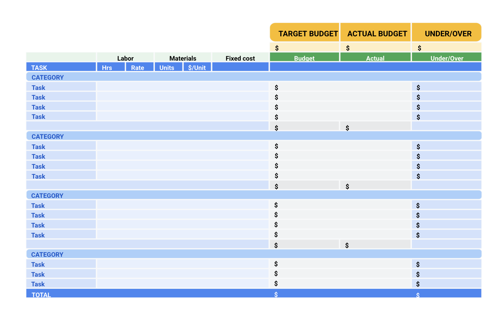

> Managing budgeting and procurement-采购
>
> 管理预算和采购

You will learn what the components of a project budget are, how the budgeting process-处理,加工 works, and how to manage a project budget.

> 您将了解项目预算的组成部分是什么，预算编制过程是如何工作的，以及如何管理项目预算。

You will also explore how the procurement process works, what documentation is necessary, and how to obtain support and avoid ethical-道德的 conflicts-争执,矛盾 during the process-过程.

> 您还将探索采购过程是如何工作的，哪些文件是必要的，以及如何在此过程中获得支持和避免道德冲突。

**学习目标**

- Examine how to obtain support for legal and compliance-合规,服从,遵守 issues and avoid ethical-道德的 conflicts during the procurement process.

	> 检查如何获得法律和合规问题的支持，并避免在采购过程中的道德冲突。

- Explain the procurement process and identify key procurement documentation.

	> 解释采购流程，识别关键的采购文件。

- Describe how to estimate, track, and maintain-保持,维持 a budget.

	> 描述如何评估、跟踪和维护预算。

- Identify the components of a project budget and how the budgeting process works.

	> 确定项目预算的组成部分以及预算编制过程的工作方式。

# Understanding project budgets

> 了解项目估算

## Introduction: Managing budgeting and procurement

> 介绍：管理估算和采购

Welcome back.

Previously, we learned about creating and managing a project plan and using time estimation to prevent-阻止,妨碍 project failure.

**Coming up**-即将到来, we're going to shift the discussion to the inner-内部的 workings of a project budget.

> 即将到来,接下来，我们将把讨论转移到项目预算的内部运作。

Let's discuss money.

As mentioned before, a lot of project management skills may overlap-重叠 with common skills that you already use in your everyday life, and you may already have some budgeting experience.

> 如前所述，许多项目管理技能可能与您在日常生活中已经使用的普通技能重叠，并且您可能已经有一些预算经验。

Budgeting in the project management world is a complex process involving many different parties-参加者,人,一方 and documentation.

> 在项目管理领域，预算是一个复杂的过程，涉及许都不同的方和文件。

I'm going to teach you how to create and manage a real-world project budget.

> 我将教你如何创建和管理现实世界的项目预算。

We'll discuss the many components of a budget and how stakeholders play a role in the budgeting process.

> 我们将讨论预算的许多组成部分，以及利益相关者如何在预算过程中发挥作用。

You'll learn about the importance of procurement-采购 in project management.

> 您将了解采购在项目管理中的重要性。

If you don't know what that means yet, **sit tight**-耐心等待.

> 如果你还不知道这是什么意思，请耐心等待。

You will understand that concept soon enough.

> 你很快就会理解这个概念。

You will also learn about vendor management and procurement in both the Agile and the traditional methodology settings.

> 您还将了解在敏捷和传统方法设置下的供应商管理和采购。

There will be several-不同的,几个 new concepts around legal and contractual-合同规定的,合同性的,契约性的 documentation introduced throughout, such as NDAs, RFPs, and SoWs.

> 在整个过程中，将引入一些关于法律和合同文件的新概念，如nda、rfp和sow。

You'll learn that project managers are fluent-熟练的,流畅的 in acronyms-首字母缩略词, and soon you will be too.

> 你将了解到项目经理对首字母缩略词很熟练，很快你也会。

I will explain each of these acronyms coming up.

> 我将解释这些首字母缩略词。

We'll also teach you about the role that legal teams and ethics play in procurement.

> 我们还会教你法律团队和道德在采购中扮演的角色。

I'll give you a hint-暗示,提示: it's a big one.

> 我给你一个提示:这是一个大问题。

Starting a new project and sourcing materials and vendors without considering the ethical implications-可能的影响 can get project managers into **hot water**-困境.

> 启动一个新项目，采购材料和供应商，而不考虑道德影响会让项目经理陷入困境。

You'll learn more about legal teams and ethics to help you avoid these tricky-难对付的,棘手的 situations.

> 你会学到更多关于法律团队和道德的知识，以帮助你避免这些棘手的情况。

The best part, you'll get pretty hands-on-实际操作的 here since you'll create your own documentation using our templates.

> 最好的部分是，您将在这里获得非常实际的操作，因为您将使用我们的模板创建自己的文档。

Are you ready?

We'll get started in the next video.

## The importance of budget setting

> 预算设定的重要性

Let's get back to budgeting.

You may already set a budget to help you stay on track with your monthly expenses-花费,开销 in your personal life.

> 你可能已经制定了一个预算，以帮助你在个人生活中保持每月的支出。

Many people do because it allows them to feel prepared and in control of their finances.

> 很多人这样做是因为这样可以让他们感觉做好了准备，并能控制自己的财务状况。

The same is true about project budgeting.

> 项目预算也是如此。

Project budgeting is a little more complex than your personal budget.

> 项目预算比个人预算要复杂一些。

We'll help you understand and go a little deeper into what a project budget entails-需要,使必要.

> 我们将帮助您了解并深入了解项目预算需要什么。

A project budget is the estimated monetary-货币的,金融的 resources needed to achieve the project's goals and objectives.

> 项目预算是实现项目目标和目的所需的估计货币资源。

When reviewing a project budget, you need to consider all of the potential and projected-计划,规划,预计 costs needed to complete the project.

> 在审查项目预算时，您需要考虑完成项目所需的所有潜在成本和预计成本。

You break the budget down by milestones, which are important points within the project schedule that indicate progress and usually signifies-表示 the completion of a deliverable or phase of the project, and list activities and tasks alongside their associated costs.

> 你按里程碑来划分预算，里程碑是项目进度表中的重要节点，表明项目进度，通常表示项目的可交付成果或阶段的完成，并列出活动和任务及其相关成本。

This ensures that you calculate the correct-正确的,无误的 expenses for a particular period of time.

> 这可以确保你计算出特定时期的正确费用。

This is considered-认为,视为 a forecast-预测,预报.

> 这被认为是一种预测。

A forecast for your project budget is a cost estimate or a prediction-预测 over a period of time.

> 项目预算的预测是对一段时间的成本估计或预测。

You'll frequently review your project budget and it will evolve-进化,演化,逐步发展 throughout the project life cycle.

> 您将经常检查您的项目预算，它将在整个项目生命周期中不断发展。

These budgets usually contain items such as labor-劳工, operating-运营 costs and costs associated with obtaining necessary materials like hardware, software, or equipment.

> 这些预算通常包括人工、运营成本以及与获取必要材料(如硬件、软件或设备)相关的成本。

The importance of a project budget focuses on more than just saving money.

> 项目预算的重要性不仅仅在于省钱。

In project management, a budget is considered-认为,视为 a deliverable.

> 在项目管理中，预算被认为是可交付的。

It is a success metric.

> 这是一个成功的衡量标准。

The project budget is a tool to communicate exactly-精确地,确切地 what is needed and when it is needed with stakeholders.

> 项目预算是一种工具，用于准确地与干系人沟通需要什么以及何时需要。

The budget will have a direct effect-作用,影响 on the company's financial viability-可行性.

> 预算将对公司的财务生存能力产生直接影响。

So, as you can probably tell by now, it's an integral-必需的,必要的,作为组成部分的 part of project management.

> 所以，正如你现在可能知道的，这是项目管理的一个组成部分。

Budget creation takes place in the initiation phase of your project.

> 预算创建发生在项目的启动阶段。

Keep in mind that the budget will be adjusted as needed throughout the lifecycle of the project.

> 请记住，预算将在项目的整个生命周期中根据需要进行调整。

Depending on your role in the company, you won't always be the sole creator of the budget.

> 根据你在公司的角色，你不会总是唯一的预算创造者。

Your ownership-所有权 over things like budget and vendor relationship may vary-不同 depending on factors such as size of the company or support team or the team organizational chart.

> 你在预算和供应商关系等方面的所有权可能会因公司规模、支持团队或团队组织结构图等因素而有所不同。

Although you may not always manage the budget from start to finish, budget and milestones **go hand in hand**-齐头并进.

> 虽然你可能并不总是从头到尾管理预算，但预算和里程碑是齐头并进的。

So it's important for you to know the ins and outs of the budget throughout the project.

> 所以在整个项目中了解预算的来龙去脉是很重要的。

As a project manager, you may be tasked-派给…任务,分配的 with obtaining approvals for spending.

> 作为项目经理，您的任务可能是获得支出批准。

Most companies have a signing or spending policy.

> 大多数公司都有签约或支出政策。

This usually outlines who has the authority to commit resources or incur-承担,带来 costs or other obligations-义务,责任 **on behalf of**-代表 the company.

> 这通常概述了谁有权代表公司投入资源或承担成本或其他义务。

This is important because you won't be able to continue with some of your deliverables or action-行动 items-项目,条款, if you don't know how much certain activities will cost, and whether you have the necessary funds available.

> 这一点很重要，因为如果你不知道某些活动将花费多少，以及你是否有必要的可用资金，你将无法继续进行某些可交付成果或行动项目。

It wouldn't make any sense to rent a property-房地产 without checking on the rental-租金 cost first, right?

> 不先检查租金成本就租房子是没有任何意义的，对吧?

That's especially-非常 true if the rental-租金 price is higher than your budget.

> 如果租金高于你的预算，更是如此。

The same thinking is applicable-适用的,适当的 for your project budgeting.

> 同样的想法也适用于你的项目预算。

The budgeting process usually happens in conjunction-结合,同时发生 with the scheduling process because the steps of the scheduling process are highly dependent on the costs.

> 预算编制过程通常与调度过程同时进行，因为调度过程的步骤高度依赖于成本。

The project manager will collaborate-合作,协作 with people on the project to create their estimations.

> 项目经理将与项目人员合作，创建他们的评估。

For the most part, after the cost estimating process has been completed, it's common for the project sponsor or another key stakeholder to review and approve estimation costs, and if necessary adjust and reallocate-重新安排 funds for the project.

> 在大多数情况下，在成本估算过程完成后，项目发起人或其他关键涉众通常会审查并批准估算成本，并在必要时为项目调整和重新分配资金。

This could mean that either the CEO or the COO are the ones giving the okay or the final sign-off.

> 这可能意味着首席执行官或首席运营官是给予批准或最终签字的人。

For example, in our Office Green project, the director-总监,董事 of product has sign-off approval.

> 例如，在我们的Office Green项目中，产品总监有签字批准。

As we mentioned before, the project manager will most likely need some kind of sign-off from the finance department.

> 正如我们前面提到的，项目经理很可能需要财务部门的某种批准。

This may vary from company to company.

So just make sure you're aware-知道的,明白的,意识到的 of your company's processes.

> 所以要确保你了解公司的流程。

Project budgeting is never a one-size-fits-all operation.

> 项目预算从来不是放之四海而皆准的操作。

As the project manager, you will have to prioritize where you allocate funds within the project to ensure maximum output.

> 作为项目经理，您必须优先考虑在项目中分配资金的地方，以确保最大的产出。

Ultimately, most projects are created to improve workforce-劳动力 productivity-生产率,生产力, increase revenue-收入,收益, or attempt-努力,尝试 to save costs within an organization.

> 最终，大多数项目的创建都是为了提高工作效率，增加收入，或者试图节省组织内的成本。

Budgeting is one of the most important aspects of project management, and when you start, to stay on budget is one of the trickiest-狡猾的,复杂的 tasks.

> 预算是项目管理中最重要的方面之一，当你开始时，保持预算是最棘手的任务之一。

It's important not to go over budget and cost-使损失 the company extra money, and it's equally important not to be under budget either since-因为 that might affect-影响 the company's budget for the next year.

> 重要的是不要超出预算，给公司带来额外的钱，同样重要的是不要低于预算，因为这可能会影响公司明年的预算。

When it comes to high-profile-高调的,备受瞩目的 businesses, such as publicly **traded companies**-上市公司 like Google, or public sector-部门 organizations such as your local education department, they may have a requirement-要求 to report on their financial performance-业绩 to shareholders or auditors-审计员.

> 当涉及到高知名度的企业时，比如像谷歌这样的上市公司，或者像你当地的教育部门这样的公共部门组织，他们可能会要求向股东或审计师报告他们的财务业绩。

Going too far over or under budget will change the way the company budgets for the next year, potentially leaving-让…处于 you with less money to work with in the future.

> 超出预算或低于预算会改变公司下一年的预算方式，可能会让你未来的工作资金减少。

In other words, a project manager must show the requested amount of money was used in order to secure-获得,得到 enough budget for future projects.

> 换句话说，项目经理必须表明所要求的资金数额已被使用，以便为未来的项目获得足够的预算。

For smaller businesses, there may be a tighter-更紧的 budget, in which case it's especially critical-关键的,严重的 to be careful about spending too much money on a project than initially allocated.

> 对于小型企业来说，预算可能会比较紧张，在这种情况下，要特别小心，不要在一个项目上花太多钱，而不是最初分配的钱。

It's really helpful to your overall-全面的 success as a project manager to understand budgeting.

> 作为一个项目经理，理解预算对你的全面成功非常有帮助。

So in the next video, we're going to learn the specific ins and outs of what's included in a budget.

> 在下一集视频中，我们将学习预算中包含的具体内容。

See you soon.

## Key components of a project budget

> 项目预算的关键组成部分

Now that you have an understanding of what a budget is, let's discuss some specific components in a budget.

There are so many **things to factor-因素**-需要考虑的因素 into project budgeting.

> 在项目预算中有很多因素需要考虑。

Unfortunately-不幸地,遗憾地, it's not quite-相当,很 as simple as a company saying, "We have $5,000, so that's our budget."

> 不幸的是，这并不像公司说的那么简单，“我们有5000美元，这就是我们的预算。”

When you go to the grocery-食品杂货店 store, in the same way that you don't determine how much apples-苹果 will cost, businesses can't just decide that they want to spend $200 on a project if the **market rate-价格**-市场价格 for a project of the same caliber-口径,质量 is $2,000.

> 当你去杂货店的时候，就像你不能决定苹果的价格一样，如果相同口径的项目的市场价格是2000美元，企业就不能决定他们想在一个项目上花200美元。

Instead-反而, project managers must account for understanding stakeholder needs, budgeting for surprise expenses, maintaining-保持 adaptability-适应性,可变性, and reviewing and reforecasting-重新预测,重新预估 throughout the entire project.

> 相反，项目经理必须理解涉众的需求，为意外费用做预算，保持适应性，并在整个项目中审查和重新预测。

These are only-只是,不过 some examples of what you need to **take into account**-考虑到.

> 这些只是你需要考虑的一些例子。

Let's imagine some of these factors in our Office Green project.

> 让我们想象一下我们的Office Green项目中的一些因素。

**In terms of**-就…而言 understanding stakeholder needs, it's important to know exactly-准确的,精确的,究竟,到底 what stakeholders expect from this project **in order to**-为了,以便 deliver.

> 就理解涉众的需求而言，准确地了解涉众对项目的期望是很重要的，以便交付。

As a company, the ultimate goal is typically to make a profit-盈利,赢利,获利 and to save money and time.

> 作为一家公司，最终目标通常是盈利，节省金钱和时间。

The project sponsor—the Director of Product, in this case—needs the project to come in at a certain cost in order to make profit. 

> 项目发起人—在本例中是产品总监—需要项目以一定的成本进入，以获得利润。

As the project manager, you will also need to budget for surprise expenses.

> 作为项目经理，你还需要为意外开支做预算。

Let's say several-几个 planters-花盆 arrive-送达,到达,抵达 from the vendor broken-损坏的,破碎的 and cracked-破裂的.

> 比方说，从供应商那里运来的几个花盆都碎了。

Maybe the planter is cracked during delivery-运送的 process, and it isn't the vendor's fault-错误,责任.

> 也许花盆在运输过程中破裂了，这不是供应商的错。

In that case, you will have to order-订购 some additional planters to fulfill-履行,实现orders-订单, and that may be an added cost.

> 在这种情况下，你将不得不订购一些额外的种植机来完成订单，这可能是一个额外的成本。

As your project continues along, you'll have to review your budget and sometimes reforecast-重新预测, which means creating a separate revised-修改,修订 budget based on how your project is tracking.

> 随着项目的继续，你必须审查你的预算，有时还要重新预测，这意味着要根据项目的跟踪情况创建一个单独的修订预算。

Keeping on top of the budget will help you stay organized-有条理的, and reforecasting is a way to recalibrate-重新校准,再校准 the budget, if necessary.

> 掌握预算将帮助你保持条理，如果有必要，重新预测是重新调整预算的一种方式。

As the project manager Office Green, you might find that you need to shift-转移 costs to different resources and categories within your project budget.

> 作为项目经理Office Green，您可能会发现需要将成本转移到项目预算中的不同资源和类别。

Maybe you initially-开始,最初 overestimated-过高估计 the cost of plants from the vendor and underestimated the costs of marketing-营销 your new launch.

> 也许你一开始高估了供应商的工厂成本，而低估了新产品的营销成本。

You can reallocate-重新分配,再指派 these dollars as necessary.

> 你可以根据需要重新分配这些钱。

That's a great example of how to review and reforecast.

> 这是如何回顾和重新预测的一个很好的例子。

There are several factors to consider when creating a budget, including resource cost rates, reserve-储备 analysis, contingency-应急储备,应急开支 budget, and cost of quality.

> 在创建预算时，有几个因素需要考虑，包括资源成本率、储备分析、应急预算和质量成本。

You'll need to determine resource cost rates.

Resource cost rates are exactly what they sound like, the cost of a resource.

> 资源成本率顾名思义就是资源的成本。

Some examples of resources are labor, tools, equipment, materials, and software.

> 资源的一些例子是劳动力、工具、设备、材料和软件。

You'll want to ask yourself, how much will each of these resources cost the company?

> 你要问自己，每一种资源会给公司带来多少成本?

Sometimes a project can be derailed-脱轨,出轨 because the project manager didn't adequately-充分地,足够地 include funds for reserves or buffers. 

> 有时候，一个项目可能会因为项目经理没有充分考虑储备或缓冲资金而偏离轨道。

Performing a reserve analysis will help you account for any buffer funds you may need.

> 进行储备分析将帮助你对可能需要的任何缓冲资金进行核算。

A reserve analysis is a method to check for remaining project resources.

> 储备分析是检查剩余项目资源的一种方法。

In performing a reserve analysis, you'll review all potential risks to your project and determine if you need to add buffer funds. 

> 在执行储备分析时，您将审查项目的所有潜在风险，并确定是否需要添加缓冲资金。

These funds are necessary because new costs that you didn't originally-起初,原来 foresee will arise-产生,出现.

> 这些资金是必要的，因为你最初没有预见到的新成本将会出现。

This is also known-称为,号称 as contingency-可能性,意外,应急开支 budget.

> 这也被称为应急预算。

Contingency budget in the context of project management, is money that is included to cover potentially unforeseen-意料之外的 events that aren't accounted for in a cost estimate.

> 在项目管理的背景下，应急预算是包括在成本估算中未考虑的潜在不可预见事件的资金。

The purpose is to compensate-赔偿,偿付 for the uncertainty-不确定 that occurs-发生,出现 in cost and time estimates, as well as unpredictable-无法预测的 risk exposure-暴露,曝光. 

> 其目的是补偿成本和时间估计中出现的不确定性，以及不可预测的风险暴露。

The cost of quality refers to all of the costs that are incurred-带来（成本、花费等）,引发,招致,遭受 to prevent issues with products, processes, or tasks.

> 质量成本是指为防止产品、过程或任务出现问题而产生的所有成本。

The cost of quality includes prevention costs, appraisal-评估,估价 costs, internal failure costs, and external failure costs.

> 质量成本包括预防成本、评估成本、内部失效成本和外部失效成本。

Once you've applied these factors, resource cost rates, reserve-储备 analysis, contingency-应急开支 budget, and the cost of quality into your budget, you can estimate what your project might cost.

> 一旦您将这些因素、资源成本率、储备分析、应急预算和质量成本应用到您的预算中，您就可以估计您的项目可能花费多少。

Remember, your budget will most likely change, starting with an initial estimate is one way to ensure that you're at least on track and it's okay if your budget does change, that's why we review and reforecast.

> 记住，你的预算很可能会发生变化，从初步估计开始是确保你至少在轨道上的一种方法，如果你的预算发生变化也没关系，这就是我们审查和重新预测的原因。

Hopefully, you're starting to notice the framework for creating a budget.

> 希望你已经开始注意到创建预算的框架。

In the next lesson, we'll begin to piece-拼合,拼装 a budget together.

> 下一课，我们将开始拼凑预算。

Let's put all of your notes and newly acquired-学到,习得,获得,得到 knowledge to use.

> 让我们把你所有的笔记和新学到的知识都用起来。

See you soon.

## Project budgeting 101

> 项目预算101

A **project budget** is the estimated monetary-货币的,金融的 resources needed to achieve a project's goals and objectives.

> 项目预算是实现项目目标和目的所需的估计货币资源。

In previous lessons, we covered a wide range of information related to project budgets.

> 在前面的课程中，我们涵盖了与项目预算相关的广泛信息。

Let’s recap to make sure you have the information and tools you need to create and manage your project’s budget.

> 让我们回顾一下，以确保您拥有创建和管理项目预算所需的信息和工具。

---

Budgets are typically created in the **initiation** and **planning phases** of your project.

> 预算通常是在项目的启动和计划阶段创建的。

As with any other project management document, you need to continue to review and control the budget throughout the life cycle of your project.

> 与任何其他项目管理文档一样，您需要在项目的整个生命周期中继续审查和控制预算。

Your budget is more than just how much it will cost to complete the project—it is a helpful tool to reference-参考,引用 when communicating with stakeholders and can double as a tracker for your project’s progress.

> 你的预算不仅仅是完成项目的成本——它是一个有用的参考工具，可以在与利益相关者沟通时参考，也可以作为项目进度的跟踪器。

Budgets also help control your costs and act as the baseline-基线,底线 for the financial portion-一部分 of the project. 

> 预算还有助于控制成本，并作为项目财务部分的基准。

**Project budgeting best practices**

Here are a few tips to consider when creating your project budget:

> 以下是在制定项目预算时需要考虑的一些建议:

- **Reference-参考 historical data:** Your project may be similar to a previous project your organization has worked on. It is important to review how that project’s budget was handled, find out what went well, and learn from any previous mistakes.

	> **参考历史数据:**您的项目可能与您所在组织以前从事的项目相似。回顾项目的预算是如何处理的，找出哪些是好的，并从之前的错误中吸取教训是很重要的。

	- **Utilize your team, mentors-导师,指导者, or manager:** **Get into the habit-习惯**-养成习惯 of asking for your team to double check your work to give you additional sets of eyes on your documents.

		> **利用你的团队、导师或经理:**养成一种习惯，让你的团队仔细检查你的工作，让你对你的文件有更多的了解。

- **Time-phase** **your budget**: Time-phased budgeting allows you to allocate costs for project tasks over the projected timeline in which those expenses-费用 are planned to take place. By looking at your tasks against-与…相比 a timeline, you can track and compare planned versus actual costs over time and manage changes to your budget as necessary.

	> **时间阶段** **您的预算**:时间阶段预算允许您在计划的时间内分配项目任务的成本，其中这些费用计划发生。通过对照时间表查看任务，您可以跟踪并比较一段时间内的计划成本与实际成本，并在必要时管理预算变更。

- **Check, check, and double check:** Make sure that your budget is accurate and error-free. Your budget will likely require-需要 approval from another department, such as finance or senior management, so do your best to ensure that it is as straightforward to understand as possible and that all of your calculations are correct.

	> **检查，检查，再检查:**确保你的预算准确无误。你的预算可能需要其他部门的批准，比如财务或高级管理层，所以你要尽力确保它尽可能简单易懂，并且你所有的计算都是正确的。

**Categorize different types of costs**

> 对不同类型的成本进行分类

There are different types of costs that your project will incur-带来（成本、花费等）.

> 您的项目将产生不同类型的成本。

For example, you may need to account for both **direct costs** and **indirect costs** in your project budget.

> 例如，您可能需要在项目预算中同时考虑直接成本和间接成本。

Categorize these different types of costs in your budget so that you can ensure you are meeting the requirements of your organization and customer. 

> 在预算中对这些不同类型的成本进行分类，以确保满足组织和客户的要求。

**Direct costs**

These are costs for items that are necessary in order to complete your project. These costs can include:

> 这些是为了完成你的项目所必需的项目的成本。这些费用包括:

- Wages-工资,报酬 and salaries-薪金,薪水 of employees and contractors-承包商,立约人 

	> 雇员和承包商的工资和薪金

- Materials costs

- Equipment rental-租费,租金 costs

- Software licenses 

- Project-related travel and transportation-运输工具 costs

	> 与项目相关的差旅和交通费用

- Staff-全体员工,全体雇员 training

**Indirect costs**

These are costs for items which do not directly lead to the completion of your project but are still essential for the project team to do their work.

> 这些成本并不直接导致项目的完成，但对于项目团队的工作来说仍然是必不可少的。

They are also referred to as **overhead costs-间接成本**.

> 它们也被称为间接成本。

These costs can include:

- Administrative costs - 行政费用
- Utilities -实用工具
- Insurance - 保险,保险费
- General office equipment - 一般办公设备
- Security - 保护措施

**Develop a baseline budget**

> 制定基准预算

A **baseline budget** is an estimate of project costs that you start with at the beginning of your project.

> 基线预算是在项目开始时对项目成本的估计。

Once you have created a budget for your project and gotten it approved, you should publish this baseline and use it to compare against-与…相比 actual performance progress.

> 一旦你为你的项目创建了预算并获得批准，你就应该发布这个基线，并用它来与实际的性能进度进行比较。

This will give you insight into how your project budget is doing and allow you to make informed-明智的 adjustments.

> 这将使您深入了解项目预算的情况，并允许您做出明智的调整。

---

It is important to continually monitor your project budget and make changes if necessary.

Be aware that budget updates can require the same approvals as your initial budget.

> 请注意，预算更新可能需要与初始预算相同的批准。

Also, you should “re-baseline” your budget if you make significant-重大的 changes.

> 此外，如果你做了重大的改变，你应该“重新设定”你的预算。

Re-baselining-重新设定基线 refers to when you update or modify a project's baseline as a result of any approved change to the schedule, cost, or deliverable content.

> 重新制定基线是指当您更新或修改项目的基线时，这是对进度、成本或可交付内容的任何批准更改的结果。

For example, if you have a significant change in your project scope, your budget will likely be impacted.

In this instance, you would need to re-baseline in order to **adhere-遵守,遵循 to**-坚持 a realistic budget.

> 在这种情况下，您需要重新设定基线，以坚持一个现实的预算。

**Perform a reserve-储备 analysis**

> 进行储备分析

A reserve analysis will help you account for any buffer funds you may need.

> 储备分析将帮助你计算你可能需要的任何缓冲资金。

First, review all potential risks to your project and determine if you need to add buffer funds, also **referred to**-被称为 as a contingency-应急开支 budget.

> 首先，审查项目的所有潜在风险，并确定是否需要增加缓冲资金，也称为应急预算。

These funds are necessary because new costs that you did not expect are likely to happen throughout the project.

> 这些资金是必要的，因为您没有预料到的新成本可能会在整个项目中发生。

You may also want to account for cost of quality in your overall project budget.

> 您可能还想在整个项目预算中考虑质量成本。

The cost of quality refers to all of the costs that are incurred-招致,遭受 to deliver a quality product or service, which can **extend beyond**-超越,超出 material resources.

> 质量成本是指为提供高质量的产品或服务而产生的所有成本，这些成本可能超出物质资源。

This includes preventing-预防,防止 or addressing issues with products, processes, or tasks, & internal and external failure costs.

> 这包括预防或解决产品、流程或任务的问题，以及内部和外部故障成本。

One example would be having to redesign a product or service **due to**-由于,因为 defects-缺点,缺陷.

> 一个例子是由于缺陷而不得不重新设计产品或服务。

A defect could mean refunds-退款,退还 to customers, time and money required to create a new product or service, and multiple other potential costs affecting the client.

> 影响缺陷可能意味着向客户退款，创建新产品或服务所需的时间和金钱，以及影响客户的多种其他潜在成本。

**Key takeaways**

Budgeting in the project management world is a complex process involving many different parties and documentation, but following the best practices described in this reading can help break it down.

> 项目管理领域的预算是一个复杂的过程，涉及许多不同的团体和文件，但是遵循本文中描述的最佳实践可以帮助分解预算。

Remember to use historical data and time-phasing, and reach out to your team for support.

> 记住使用历史数据和时间分阶段，并向您的团队寻求支持。

Make sure you are capturing all of the components of your budget, including direct and indirect costs.

Finally, be sure to baseline your budget so you know where your money is being used and when.

These tips can help set you up for budget management success.

> 这些建议可以帮助你成功地管理预算。

# Managing a project budget

> 管理一个项目估算

## Creating a project budget

> 创建项目预算

Now that we've learned about budgeting, let's find out how it all works together.

> 既然我们已经了解了预算，让我们来看看它们是如何一起工作的。

By now, we know that project budgets helped to control costs throughout the duration of the project.

> 到目前为止，我们知道项目预算有助于控制整个项目期间的成本。

They help project managers establish the main objectives of their project and keep them within a reasonable-合理的,有道理的,合情理的 framework to ensure that the project makes financial sense for the company.

> 他们帮助项目经理建立项目的主要目标，并将其保持在合理的框架内，以确保项目对公司具有财务意义。

What's the best way to start making a project budget?

> 开始做项目预算的最好方法是什么?

You'll find that as you get further-更远的 along in the process, there are various resources and tactics-策略,战术 that you can use to make sure you aren't overestimating or underestimating.

> 你会发现，随着你在这个过程中走得更远，你可以使用各种资源和策略来确保你不会高估或低估。

You'll use techniques like researching historical data, leveraging-充分利用 experts, the bottom-up approach, confirming accuracy-准确性,精确性, and setting your baseline.

> 您将使用诸如研究历史数据、利用专家、自下而上的方法、确认准确性和设置基线之类的技术。

For starters-初学者, you can always review past projects that are similar to yours to get an idea of what your project could entail-使必要,需要.

> 对于初学者来说，你可以回顾过去与你的项目相似的项目，以了解你的项目可能需要什么。

We refer to that as referring to historical data.

> 我们指的是参照历史数据。

This way, you can find out what past project managers did right and wrong.

The more experienced-经历,经验 you become as a project manager, the more historical data you will have to **draw upon**-利用,借鉴, and the better your estimations will be.

> 作为项目经理，您的经验越丰富，您需要利用的历史数据就越多，您的评估也就越好。

**In a similar vein**-同样地, you can leverage-充分利用 experts in the field.

> 同样，你可以利用该领域的专家。

To leverage something means to use it to its maximum advantage-有利条件,优势.

> 杠杆是指最大限度地利用它。

Leveraging experts means gathering their insights to do something more effectively.

> 利用专家意味着收集他们的见解来更有效地做某事。

Reaching out to colleagues-同事,同僚 who worked on a similar project in the past will be a great resource for you as an entry-level project manager.

> 作为一个初级项目经理，向过去从事过类似项目的同事寻求帮助将是一个很好的资源。

If you're asking someone outside of your company for advice, be sure to avoid sharing any confidential-机密的,保密的 company information with them.

> 如果你向公司以外的人寻求建议，一定要避免与他们分享任何公司的机密信息。

Another approach to take is the bottom-up approach.

> 另一种方法是自底向上的方法。

This means thinking about all the parts of a project from the beginning to the end, including making a list of every material, resource, contract worker, or anything that comes with an associated cost, and adding all of that together.

> 这意味着从头到尾考虑项目的所有部分，包括列出每一种材料、资源、合同工或任何与成本相关的东西，并将所有这些加在一起。

You should also ask the vendors you are thinking of working with for quotes-开价,报价, so you can get a rough-粗略的,大致的 estimate of how much their work will cost.

> 你还应该向你正在考虑合作的供应商询问报价，这样你就可以大致估计他们的工作成本。

After you've created your budget with these resources, you'll want to double-check everything to confirm accuracy.

> 在你用这些资源创建了预算之后，你会想要仔细检查每一件事以确保准确性。

Of course, the work doesn't stop once you've created the budget.

> 当然，一旦你制定了预算，工作就不会停止。

Next, you'll have to set the baseline.

Your baseline is the dollar amount that you'll use to measure against, to find out if you're on track or not, and to measure the success of your project.

> 你的基线是你用来衡量的金额，以确定你是否在正轨上，并衡量你的项目是否成功。

Once you've set your baseline, you'll have to revisit-再访问 that number and adjust it to match where the project is currently.

> 一旦你设定了基线，你就必须重新审视这个数字，并调整它以匹配项目当前的情况。

Making adjustments in real-time-实时的 is something you have to do a lot as a project manager.

> 作为项目经理，实时调整是你必须做的事情。

The size of the project and company will determine how often you should re-examine and update the budget.

> 项目和公司的规模将决定你应该多久重新检查和更新预算。

Creating a thorough-全面的 budget is important to the success of your project.

> 制定全面的预算对项目的成功非常重要。

With Project Plant Pals, we suggest breaking the project down into tasks.

> 对于植物伙伴项目，我们建议将项目分解为任务。

That's the bottom-up approach.

From there, we estimate the cost of each item, add those estimates together, add contingency-应急开支 and tax, and seek-寻找,寻求 overall approval on our budget from our key stakeholders.

> 从那里，我们估计每个项目的成本，把这些估计加在一起，加上偶然性和税收，并从我们的主要利益相关者那里寻求对我们预算的总体批准。

Since we're creating a new service, we'll need to hire-聘用 designers and developers to build out the website and develop the app for our customers.

> 因为我们正在创建一个新的服务，我们需要聘请设计师和开发人员建立网站和开发应用程序为我们的客户。

Once these tasks are **laid out**-布置好的, you'll have to negotiate-磋商,洽谈,商定 employee allocations, contractor-承包商,立约人 rates-费率, and **shop around**-货比三家 for vendors and delivery services.

> 一旦安排好了这些任务，你就必须协商员工分配、承包商费率，并在供应商和交付服务中货比三家。

This will help you assign cost estimates to each task.

Now that the tasks have been broken down and assigned, you'll need to account for material costs.

> 既然任务已经分解并分配好了，你就需要考虑材料成本。

Do your team members and stakeholders need equipment?

Maybe an employee with a disability-残疾,缺陷 requires modifications-修改 to accommodate-适应 or enhance-提高,改善 their workplace.

> 也许残疾员工需要修改以适应或改善他们的工作场所。

Maybe some remote workers need the hardware and accessories-配件 necessary to work from home.

> 也许一些远程工作者需要在家工作所需的硬件和配件。

This is where you will include everything from computers to software related to the launch.

> 在这里，你将包括从计算机到与发布相关的软件的所有内容。

Will you need storage space for miscellaneous-各种各样的 plants or supplies-物资,日常用品?

> 你需要储存各种植物或用品的空间吗?

"Miscellaneous" is a term that we use to represent-代表 additional items that are not included in any of the other areas-领域.

> “杂项”是一个术语，我们用来表示不包括在任何其他领域的额外项目。

Usually, they are minor-次要的 items or items where there are only one or two of them, and that they are not a major budget line.

> 通常，它们是次要项目或只有一两个项目的项目，并且它们不是主要的预算线。

Be sure to add these items to your expenses.

You will also need a few more line items.

> 您还需要更多的行项目。

Start with the fixed cost that won't change over the course-过程 of the project.

> 从固定成本开始，固定成本在项目过程中不会改变。

Let's say you're paying to advertise-广告 the web developer role to a job-招聘 board.

> 比方说，你花钱在招聘板上发布招聘网页开发人员的广告。

It may cost you about $50 to post that job description.

> 发布职位描述可能要花费你50美元左右。

That's an example of a fixed, one-time cost.

> 这是一个固定的一次性成本的例子。

Next, you'll need a line item for things like travel expenses and meals-餐费.

> 接下来，你需要一个行项目，比如差旅费和餐费。

Finally, we want to account for buffers and reserves-储备.

You'll need to factor-把…作为因素计入 in unexpected costs that may come up later on.

> 你需要考虑到以后可能出现的意外成本。

Be sure to leave-留下 yourself with some buffer room.

> 一定要给自己留一些缓冲空间。

We've chosen to account for five percent of the overall project budget as our buffer.

> 我们选择占整个项目预算的百分之五作为我们的缓冲。

This is a standard practice and depending upon how much detail you know about the project already, you can raise or lower your percentage for reserves.

> 这是一种标准做法，根据你对项目的了解程度，你可以提高或降低储备金的百分比。

The client needs to be aware of this buffer in case spending-花费,开销 starts to become-变得,变成,成为 excessive-过度的,过多的.

> 客户端需要意识到这个缓冲，以防支出开始变得过度。

In which case, you need to problem-solve with the client and agree to adjust the scope.

> 在这种情况下，您需要与客户解决问题，并同意调整范围。

You'll want to include a planned cost versus actual cost column too.

> 您还需要包括计划成本与实际成本的对比。

This way, you can keep track of your cost every step of the way.

> 这样，你就可以跟踪每一步的成本。

We'll provide you with concrete-具体的 budget templates in the readings associated with this section so you can fully immerse-使沉浸（于）,使深陷（于） yourself in the process.

> 我们将在与本节相关的阅读材料中为你提供具体的预算模板，这样你就可以完全沉浸在这个过程中。

Remember, every project will have an estimated cost and a final cost.

Your goal is to get your estimated cost as close to the final cost as possible.

You may have to recalibrate-重新校准 your estimations during the project.

That's when the estimated cost to complete the project comes in.

> 这就是完成项目的估计成本。

The final cost of your project differs from the forecasted or estimated cost if you weren't exactly on target with your budget. 

> 如果您的预算没有完全达到目标，则项目的最终成本与预测或估计成本不同。

Remember, while your goal is to get as close to the original estimate as possible, that won't always be the case.

> 请记住，虽然您的目标是尽可能接近最初的估计，但情况并非总是如此。

Each time you're placed on a new project, it will be helpful to look back on the final costs of previous projects and see how close you came to your goal.

> 每当你开始一个新项目时，回顾一下以前项目的最终成本，看看你离目标有多近，这将会很有帮助。

Now you know the best way to create a project budget.

Up next, we're going to talk about maintaining-维护,保养 a budget.

See you there.

## Helpful budget templates

> 有用的预算模板

In the previous lessons, you learned that projects come in all shapes-形式 and sizes—and so do their budgets.

> 在前面的课程中，您了解到项目有各种形式和规模，它们的预算也是如此。

Budgets can be created in a simple spreadsheet or with more complex software programs.

> 预算可以在一个简单的电子表格或更复杂的软件程序中创建。

Determining which tool is right for you and your project will require input from your organization and your customer. 

> 确定哪个工具适合您和您的项目将需要您的组织和客户的输入。

**Budget spreadsheet templates**

Budget templates are a useful tool for helping you estimate, track, and maintain a project budget.

Below, you will find a few different budget templates that you can use for future projects.

Each of these templates is formatted in a digital spreadsheet. 

> 这些模板中的每一个都在电子表格中格式化。

[Microsoft Excel Budget Templates](https://templates.office.com/en-us/budgets)	微软的网站的模版

[Microsoft Excel Website Budget Template](https://create.microsoft.com/en-us/template/website-budget-142337c5-35f0-4e42-ab85-0643840d738c) *(applicable to any project)* - 这是一个网站

[Google Sheets Budget Template](https://docs.google.com/spreadsheets/d/1DuY4viZtcjPzhdC1EotnJMxLd61v0eYNkRtJwHGww8U/template/preview) *(Note: You will need to be signed in to a Google account in order to make a copy of the template.)* - 这是个excel

**Spreadsheet skills for budgeting**

> 编制预算的电子表格技能

When using a spreadsheet to track a budget, there are basic skills you will need to learn.

Understanding how to use SUM and AVERAGE formulas-公式, tables, and filters are just a few of the spreadsheet skills that will make your job as a project manager much easier.

> 了解如何使用SUM和AVERAGE公式、表格和过滤器只是电子表格技能中的一小部分，这些技能将使您作为项目经理的工作更容易。

Make sure to check the [course resources on spreadsheets](https://www.coursera.org/learn/project-planning-google/resources/E0vc0) for an introduction to these skills.

> 请务必查看[电子表格上的课程资源](https://www.coursera.org/learn/project-planning-google/resources/E0vc0)，了解这些技能的介绍。

## Maintaining a project budget

> 维护项目预算

Now that you have an idea of how to create a budget, we're going to discuss how you'll manage that budget and explore some challenges that you might face, like being under or over budget.

> 既然你已经知道了如何制定预算，我们将讨论如何管理预算，并探讨你可能面临的一些挑战，比如低于或超过预算。

As mentioned previously, you'll want to check in on your budget regularly, but what exactly-究竟,到底 does that mean?

> 如前所述，你会想要定期检查你的预算，但这到底是什么意思呢?

What are you checking for?

> 你在查什么?

How can you tell if you're staying within your budget or not?

> 你怎么知道你是否在预算之内呢?

Monitoring the budget is crucial for a project manager to **enforce accountability**-强化问责制 in terms-方面 of spending.

> 监控预算对于项目经理在支出方面加强问责制至关重要。

---

By monitoring your budget regularly, you'll be able to tell if the plans you set into action are actually being implemented-实施,执行 on both a financial and operational level.

> 通过定期监控你的预算，你就能知道你制定的计划是否在财务和运营层面上得到了实施。

As you may recall-回想起 from a previous video, a milestone is an important point within the project schedule that indicates progress and usually signifies-表示 the completion of a deliverable or phase of the project.

> 从之前的视频中，您可能还记得，里程碑是项目时间表中的一个重要点，表示进度，通常表示项目的可交付成果或阶段的完成。

Milestones are a metric-衡量标准 for tracking progress in the project.

> 里程碑是跟踪项目进展的一个度量标准。

Milestones are a great opportunity to re-review the budget to identify if anything needs to be reset or revisited throughout the project.

> 里程碑是重新审查预算的好机会，以确定在整个项目中是否需要重新设置或重新访问任何内容。

That said, milestones can **act as**-作为,充当 a checkpoint for budget management and payment.

> 也就是说，里程碑可以作为预算管理和支付的检查点。

You may have agreed in your contract that you get paid at certain milestones **rather than**-而不是 at the end of the project.

> 你可能已经在合同中同意在某个里程碑而不是项目结束时获得报酬。

Fixed contracts are usually paid for when certain milestones are reached, whereas-但是,然而 time and materials' contracts are usually paid for monthly based on the hours worked and other fees associated with the work, like travel and meals.

> 固定合同通常在达到某些里程碑时支付，而时间和材料合同通常根据工作时间和与工作相关的其他费用(如差旅费和餐费)按月支付。

As you monitor your budget, you'll want to be on top of cost control.

> 当你监控你的预算时，你会想要控制成本。

Cost control is a practice where a project manager identifies factors that might impact their budget and then creates effective actions to minimize variances-差异.

> 成本控制是一种实践，项目经理识别可能影响其预算的因素，然后创建有效的行动以最小化差异。

---

Think of it this way: it's proactive-积极主动的,主动地 budget management.

> 你可以这样想：这是一种主动的预算管理。

It is much better to be proactive with your budget than to be reactive-反应的 with your budget.

> 积极主动地做预算比被动被动地做预算要好得多。

If you are reacting instead of anticipating-预期,预料, then you may already have some kind of problem with the budget.

> 如果你只是反应而不是预期，那么你的预算可能已经出现了一些问题。

In order to control costs, you should establish a sign-off plan and inform the appropriate stakeholders of any changes that occur.

> 为了控制成本，您应该建立一个签署计划，并将发生的任何更改通知相应的涉众。

---

You'll have to ask yourself which stakeholders or sponsor will be approving the contractor or vendor time sheets.

> 你必须问问自己，哪些利益相关者或赞助商将批准承包商或供应商的时间表。

What about invoices?

> 发票呢?

You'll also need to make sure any changes within the project budget are **agreed upon**-达成一致的.

> 你还需要确保在项目预算范围内的任何变化都得到一致同意。

For example, you shouldn't approve a new cost or item if it hasn't been agreed upon or if it isn't within the scope, and you shouldn't be spending money if it's not pre-approved by your stakeholder or project sponsor.

> 例如，你不应该批准一个新的成本或项目，如果它没有达成一致意见，或者它不在范围内，如果它没有得到你的利益相关者或项目发起人的预先批准，你不应该花钱。

---

It is also important to make sure there's good business case before bringing it to the stakeholder.

> 同样重要的是，在将其提交给涉众之前，确保有好的商业案例。

You'll also need to manage changes as they're made.

> 您还需要管理所做的更改。

This involves updating forecasts or estimates and tracking everything.

> 这包括更新预测或估计以及跟踪一切。

You never-永不 want to be surprised by budget changes, and you don't want to have to keep asking stakeholders for more money.

> 你永远不想对预算变化感到惊讶，你也不想一直向利益相关者要更多的钱。

You can prevent that by revisiting these numbers on a regular basis.

> 你可以通过定期回顾这些数字来防止这种情况的发生。

You'll also want to accept that budget misses-失败 will happen.

> 你也要接受预算不达标的事实。

It's your job to bring the expected cost overruns-超支 within acceptable limits.

> 把预期的成本超支控制在可接受的范围内是你的工作。

Before the project starts, collaborate with the project sponsors and key stakeholders to determine an acceptable limit.

> 在项目开始之前，与项目发起人和关键干系人合作，确定可接受的限制。

Is it 1%, 10%?

You'll decide together.

> 你们一起决定。

In a previous video, we talked briefly about what happens when a project goes over or under budget.

> 在之前的视频中，我们简要地讨论了当项目超出或低于预算时会发生什么。

Having a project go over budget may mean that the company will have less funds for other areas within the business, so let's dig a little deeper into the effects on a company when a project goes under budget.

> 项目超出预算可能意味着公司在其他业务领域的资金会减少，所以让我们更深入地研究一下项目低于预算对公司的影响。

Even though it seems like going under budget would be a project manager's dream, it actually isn't.

> 尽管低于预算似乎是项目经理的梦想，但实际上并非如此。

If you go under budget, it's an indicator-表明,标志 of less than satisfactory-令人满意的,合适的 project management.

> 如果你的预算低于预算，这表明你的项目管理不够令人满意。

Going under budget indicates-表明 that you may not have done a good job at initially estimating.

> 低于预算表明你可能没有做好最初的估算工作。

Going under budget could also indicate that you could have spent more money on the project, meaning that you could have possibly had extra resources or better quality output, and it may mean that the budget for future projects will be slashed-削减.

> 低于预算也可能意味着你可以在项目上花更多的钱，这意味着你可能有额外的资源或更高质量的产出，这可能意味着未来项目的预算将被削减。

The company may figure that since you did this project under budget, you'll be able to do future projects under budget too, so that's not a totally-完全地 desirable-令人向往的 situation to be **in either**-无论哪种情况下.

> 公司可能会认为，既然你在预算内完成了这个项目，你将来也能在预算内完成项目，所以这也不是一个完全理想的情况。

The best option is to adequately-充分地,足够地 account for, adapt-调整, and manage your budget with that risk in mind.

> 最好的选择是充分考虑、调整和管理你的预算，并考虑到这种风险。

Later on, we'll cover other strategies more in depth that you could use to save the company money and time.

> 稍后，我们将更深入地讨论其他可以用来节省公司金钱和时间的策略。

You will also learn the ins and outs of identifying and managing risks a little later on in the course.

> 您还将学习识别和管理风险的来龙去脉，稍后在课程中。

In the next lesson, we'll learn about procurement.

See you in a bit.

## Overcoming-克服,解决,征服 budgeting challenges

> 克服预算挑战

As you have learned, effective budgeting can set you up for success as a project manager.

>  正如你所学到的，有效的预算可以让你成为一个成功的项目经理。

This reading will discuss some of the most common budgeting challenges you may encounter-遭遇,经历 as a project manager and how to manage them.

> 本文将讨论你作为项目经理可能遇到的一些最常见的预算挑战，以及如何管理它们。

**Challenge 1: Budget pre-allocation**

> 挑战1：预算预分配

You may encounter situations where your budget is already set before you even start the project.

> 你可能会遇到预算在项目开始之前就已经设定好的情况。

This is known as **budget pre-allocation**.

Some organizations follow strict-严格的,严谨的,精确的 budgeting cycles-循环,周期, which can lead to cost estimations taking place before the scope of the project is completely defined. 

> 一些组织遵循严格的预算周期，这可能导致在项目范围完全定义之前进行成本估算。

---

If you are given a pre-allocated budget, it is important to work with your customer to set expectations-期望,期待 on scope and deliverables within the allocated budget.

> 如果您得到了预先分配的预算，那么与您的客户合作，在分配的预算内设定范围和可交付成果的期望是很重要的。

To deliver a great product within your allocated budget will require detailed planning.

> 要在分配的预算范围内交付出色的产品，需要详细的计划。

A pre-allocated budget should also be routinely-常规地,惯常地 monitored-监控,监视 to ensure the amounts-金额 you have budgeted are sufficient-足够的,充足的 to meet your costs.

> 预先分配的预算也应该定期监控，以确保预算的金额足以满足您的成本。

Be sure to carefully track-追踪 all expenses in your budget.

> 一定要仔细记录预算中的所有开支。

Regularly match these expenses against your pre-allocated budget to ensure you have sufficient-足够的,充足的 funds for the remainder-剩余部分,其余 of your project.

> 定期将这些费用与你预先分配的预算相匹配，以确保你有足够的资金用于项目的剩余部分。

Part of that planning includes making sure that you are tracking fixed and time- and materials-based expenses.

> 计划的一部分包括确保你跟踪固定的、时间的和材料的费用。

**Fixed contracts** are usually paid for when certain milestones are reached.

> 固定合同通常在达到某些里程碑时支付。

**Time and materials contracts** are usually paid for monthly, based on the hours worked and other fees associated with the work, such as travel and meal expenses. 

> 时间和材料合同通常按月支付，根据工作时间和其他与工作相关的费用，如差旅费和餐费。

**Challenge 2: Inaccurately-不准确地,不正确地 calculating TCO**

> 挑战2:TCO 计算不准确

Another budgeting pitfall-隐患,陷阱 you should try to avoid is underestimating the **total cost of ownership-所有权 (TCO)** for project resources. 

> 你应该避免的另一个预算陷阱是低估项目资源的总拥有成本(TCO)。

TCO **takes into account**-考虑到,顾及到 multiple elements that contribute to the cost of an item.

> TCO考虑了影响产品成本的多个因素。

It factors in the expenses associated with a product or service over its lifetime, rather than just upfront costs. 

> 它考虑了产品或服务在其生命周期内的相关费用，而不仅仅是前期成本。

Let’s relate TCO to something more common, like owning a vehicle.

> 让我们把TCO和更常见的东西联系起来，比如拥有一辆车。

Let’s say you buy a vehicle for a certain price, but then you also pay for things related to the vehicle, such as license-牌照 fees, registration fees, and maintenance-维修,维护,保持.

> 比方说，你以一定的价格买了一辆车，但你还要支付与这辆车相关的费用，比如牌照费、注册费和维修费。

If you add all of this up, you have your TCO for that vehicle.

> 如果你把这些加起来，你就得到了这个车辆的的TCO。

So now that you know what your TCO is, you may consider those fees before you buy your next vehicle.

> 所以现在你知道了你的TCO是多少，你可以在购买下一辆车之前考虑这些费用。

For example, you might opt for a vehicle with fewer maintenance requirements than one that requires more frequent service, since you know that will save you money overall. 

> 例如，你可能会选择一辆维修需求较少的车，而不是需要更频繁维修的车，因为你知道这将节省你的钱。

The same concept applies to budgeting on a project.

> 同样的概念也适用于项目预算。

If you have a service requirement for a software technology that your team is using, for example, then it is important to budget for the costs of maintenance for that service.

> 例如，如果您对团队正在使用的软件技术有服务需求，那么对该服务的维护成本进行预算是很重要的。

Additional types of costs you may need to account for when calculating TCO include warranties, supplies-供应, required add-on-附加装置 costs, and upgrade costs.

> 在计算TCO时，您可能需要考虑的其他类型的成本包括保修、供应、所需的附加成本和升级成本。

**Challenge 3: Scope creep**

**Scope creep** is when changes, growth, and other factors affect the project’s scope at any point after the project begins.

> 范围蔓延是指在项目开始后的任何时候，变化、增长和其他因素影响了项目的范围。

Scope creep causes additional work that wasn’t planned for, so scope creep can also impact your budget. 

> 范围蔓延会导致超出计划的额外工作，因此范围蔓延也会影响您的预算。

There are several factors that can lead to scope creep, such as: 

> 有几个因素会导致范围蔓延，例如:

- A vague-不明确的,不清楚的 Statement-陈述,声明,报告 of Work (SoW)

	> 模糊的工作陈述(SoW)

- Conversations-谈话,交谈 and agreements-协议 about the project that aren’t officially-官方地,正式地 documented-记录

	> 没有正式记录的关于项目的对话和协议

- Unattainable-做不到的,难到达的 timeframes-时间表 and deadlines

	> 无法实现的时间表和最后期限

- Last-minute asks from priority stakeholders

	> 优先利益相关者在最后一刻提出要求

Addressing these factors as you plan your project can help prevent scope creep from impacting your budget.

> 在计划项目时处理这些因素有助于防止范围蔓延影响预算。

**Key takeaway**

There can be many challenges to face when planning and managing a budget.

Budget pre-allocation, underestimating the TCO of project resources, and scope creep are some of the most common.

> 预算预分配、低估项目资源的TCO和范围蔓延是最常见的一些问题。

As you continue your career as a project manager, awareness-认识,意识 of these challenges can help you avoid and overcome them.

> 当你继续作为项目经理的职业生涯时，意识到这些挑战可以帮助你避免和克服它们。

