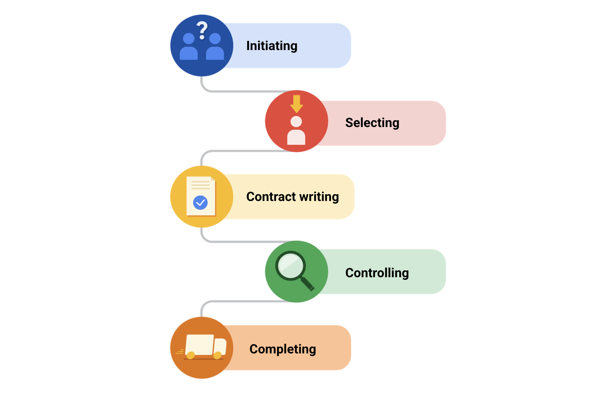

> Managing budgeting and procurement-采购
>
> 管理预算和采购

You will learn what the components of a project budget are, how the budgeting process-处理,加工 works, and how to manage a project budget.

> 您将了解项目预算的组成部分是什么，预算编制过程是如何工作的，以及如何管理项目预算。

You will also explore how the procurement process works, what documentation is necessary, and how to obtain support and avoid ethical-道德的 conflicts-争执,矛盾 during the process-过程.

> 您还将探索采购过程是如何工作的，哪些文件是必要的，以及如何在此过程中获得支持和避免道德冲突。

**学习目标**

- Examine how to obtain support for legal and compliance-合规,服从,遵守 issues and avoid ethical-道德的 conflicts during the procurement process.

	> 检查如何获得法律和合规问题的支持，并避免在采购过程中的道德冲突。

- Explain the procurement process and identify key procurement documentation.

	> 解释采购流程，识别关键的采购文件。

- Describe how to estimate, track, and maintain-保持,维持 a budget.

	> 描述如何评估、跟踪和维护预算。

- Identify the components of a project budget and how the budgeting process works.

	> 确定项目预算的组成部分以及预算编制过程的工作方式。

# Understanding project budgets

> 了解项目估算

## Introduction: Managing budgeting and procurement

> 介绍：管理估算和采购

Welcome back.

Previously, we learned about creating and managing a project plan and using time estimation to prevent-阻止,妨碍 project failure.

**Coming up**-即将到来, we're going to shift the discussion to the inner-内部的 workings of a project budget.

> 即将到来,接下来，我们将把讨论转移到项目预算的内部运作。

Let's discuss money.

As mentioned before, a lot of project management skills may overlap-重叠 with common skills that you already use in your everyday life, and you may already have some budgeting experience.

> 如前所述，许多项目管理技能可能与您在日常生活中已经使用的普通技能重叠，并且您可能已经有一些预算经验。

Budgeting in the project management world is a complex process involving many different parties-参加者,人,一方 and documentation.

> 在项目管理领域，预算是一个复杂的过程，涉及许都不同的方和文件。

I'm going to teach you how to create and manage a real-world project budget.

> 我将教你如何创建和管理现实世界的项目预算。

We'll discuss the many components of a budget and how stakeholders play a role in the budgeting process.

> 我们将讨论预算的许多组成部分，以及利益相关者如何在预算过程中发挥作用。

You'll learn about the importance of procurement-采购 in project management.

> 您将了解采购在项目管理中的重要性。

If you don't know what that means yet, **sit tight**-耐心等待.

> 如果你还不知道这是什么意思，请耐心等待。

You will understand that concept soon enough.

> 你很快就会理解这个概念。

You will also learn about vendor management and procurement in both the Agile and the traditional methodology settings.

> 您还将了解在敏捷和传统方法设置下的供应商管理和采购。

There will be several-不同的,几个 new concepts around legal and contractual-合同规定的,合同性的,契约性的 documentation introduced throughout, such as NDAs, RFPs, and SoWs.

> 在整个过程中，将引入一些关于法律和合同文件的新概念，如nda、rfp和sow。

You'll learn that project managers are fluent-熟练的,流畅的 in acronyms-首字母缩略词, and soon you will be too.

> 你将了解到项目经理对首字母缩略词很熟练，很快你也会。

I will explain each of these acronyms coming up.

> 我将解释这些首字母缩略词。

We'll also teach you about the role that legal teams and ethics play in procurement.

> 我们还会教你法律团队和道德在采购中扮演的角色。

I'll give you a hint-暗示,提示: it's a big one.

> 我给你一个提示:这是一个大问题。

Starting a new project and sourcing materials and vendors without considering the ethical implications-可能的影响 can get project managers into **hot water**-困境.

> 启动一个新项目，采购材料和供应商，而不考虑道德影响会让项目经理陷入困境。

You'll learn more about legal teams and ethics to help you avoid these tricky-难对付的,棘手的 situations.

> 你会学到更多关于法律团队和道德的知识，以帮助你避免这些棘手的情况。

The best part, you'll get pretty hands-on-实际操作的 here since you'll create your own documentation using our templates.

> 最好的部分是，您将在这里获得非常实际的操作，因为您将使用我们的模板创建自己的文档。

Are you ready?

We'll get started in the next video.

## The importance of budget setting

> 预算设定的重要性

Let's get back to budgeting.

You may already set a budget to help you stay on track with your monthly expenses-花费,开销 in your personal life.

> 你可能已经制定了一个预算，以帮助你在个人生活中保持每月的支出。

Many people do because it allows them to feel prepared and in control of their finances.

> 很多人这样做是因为这样可以让他们感觉做好了准备，并能控制自己的财务状况。

The same is true about project budgeting.

> 项目预算也是如此。

Project budgeting is a little more complex than your personal budget.

> 项目预算比个人预算要复杂一些。

We'll help you understand and go a little deeper into what a project budget entails-需要,使必要.

> 我们将帮助您了解并深入了解项目预算需要什么。

A project budget is the estimated monetary-货币的,金融的 resources needed to achieve the project's goals and objectives.

> 项目预算是实现项目目标和目的所需的估计货币资源。

When reviewing a project budget, you need to consider all of the potential and projected-计划,规划,预计 costs needed to complete the project.

> 在审查项目预算时，您需要考虑完成项目所需的所有潜在成本和预计成本。

You break the budget down by milestones, which are important points within the project schedule that indicate progress and usually signifies-表示 the completion of a deliverable or phase of the project, and list activities and tasks alongside their associated costs.

> 你按里程碑来划分预算，里程碑是项目进度表中的重要节点，表明项目进度，通常表示项目的可交付成果或阶段的完成，并列出活动和任务及其相关成本。

This ensures that you calculate the correct-正确的,无误的 expenses for a particular period of time.

> 这可以确保你计算出特定时期的正确费用。

This is considered-认为,视为 a forecast-预测,预报.

> 这被认为是一种预测。

A forecast for your project budget is a cost estimate or a prediction-预测 over a period of time.

> 项目预算的预测是对一段时间的成本估计或预测。

You'll frequently review your project budget and it will evolve-进化,演化,逐步发展 throughout the project life cycle.

> 您将经常检查您的项目预算，它将在整个项目生命周期中不断发展。

These budgets usually contain items such as labor-劳工, operating-运营 costs and costs associated with obtaining necessary materials like hardware, software, or equipment.

> 这些预算通常包括人工、运营成本以及与获取必要材料(如硬件、软件或设备)相关的成本。

The importance of a project budget focuses on more than just saving money.

> 项目预算的重要性不仅仅在于省钱。

In project management, a budget is considered-认为,视为 a deliverable.

> 在项目管理中，预算被认为是可交付的。

It is a success metric.

> 这是一个成功的衡量标准。

The project budget is a tool to communicate exactly-精确地,确切地 what is needed and when it is needed with stakeholders.

> 项目预算是一种工具，用于准确地与干系人沟通需要什么以及何时需要。

The budget will have a direct effect-作用,影响 on the company's financial viability-可行性.

> 预算将对公司的财务生存能力产生直接影响。

So, as you can probably tell by now, it's an integral-必需的,必要的,作为组成部分的 part of project management.

> 所以，正如你现在可能知道的，这是项目管理的一个组成部分。

Budget creation takes place in the initiation phase of your project.

> 预算创建发生在项目的启动阶段。

Keep in mind that the budget will be adjusted as needed throughout the lifecycle of the project.

> 请记住，预算将在项目的整个生命周期中根据需要进行调整。

Depending on your role in the company, you won't always be the sole creator of the budget.

> 根据你在公司的角色，你不会总是唯一的预算创造者。

Your ownership-所有权 over things like budget and vendor relationship may vary-不同 depending on factors such as size of the company or support team or the team organizational chart.

> 你在预算和供应商关系等方面的所有权可能会因公司规模、支持团队或团队组织结构图等因素而有所不同。

Although you may not always manage the budget from start to finish, budget and milestones **go hand in hand**-齐头并进.

> 虽然你可能并不总是从头到尾管理预算，但预算和里程碑是齐头并进的。

So it's important for you to know the ins and outs of the budget throughout the project.

> 所以在整个项目中了解预算的来龙去脉是很重要的。

As a project manager, you may be tasked-派给…任务,分配的 with obtaining approvals for spending.

> 作为项目经理，您的任务可能是获得支出批准。

Most companies have a signing or spending policy.

> 大多数公司都有签约或支出政策。

This usually outlines who has the authority to commit resources or incur-承担,带来 costs or other obligations-义务,责任 **on behalf of**-代表 the company.

> 这通常概述了谁有权代表公司投入资源或承担成本或其他义务。

This is important because you won't be able to continue with some of your deliverables or action-行动 items-项目,条款, if you don't know how much certain activities will cost, and whether you have the necessary funds available.

> 这一点很重要，因为如果你不知道某些活动将花费多少，以及你是否有必要的可用资金，你将无法继续进行某些可交付成果或行动项目。

It wouldn't make any sense to rent a property-房地产 without checking on the rental-租金 cost first, right?

> 不先检查租金成本就租房子是没有任何意义的，对吧?

That's especially-非常 true if the rental-租金 price is higher than your budget.

> 如果租金高于你的预算，更是如此。

The same thinking is applicable-适用的,适当的 for your project budgeting.

> 同样的想法也适用于你的项目预算。

The budgeting process usually happens in conjunction-结合,同时发生 with the scheduling process because the steps of the scheduling process are highly dependent on the costs.

> 预算编制过程通常与调度过程同时进行，因为调度过程的步骤高度依赖于成本。

The project manager will collaborate-合作,协作 with people on the project to create their estimations.

> 项目经理将与项目人员合作，创建他们的评估。

For the most part, after the cost estimating process has been completed, it's common for the project sponsor or another key stakeholder to review and approve estimation costs, and if necessary adjust and reallocate-重新安排 funds for the project.

> 在大多数情况下，在成本估算过程完成后，项目发起人或其他关键涉众通常会审查并批准估算成本，并在必要时为项目调整和重新分配资金。

This could mean that either the CEO or the COO are the ones giving the okay or the final sign-off.

> 这可能意味着首席执行官或首席运营官是给予批准或最终签字的人。

For example, in our Office Green project, the director-总监,董事 of product has sign-off approval.

> 例如，在我们的Office Green项目中，产品总监有签字批准。

As we mentioned before, the project manager will most likely need some kind of sign-off from the finance department.

> 正如我们前面提到的，项目经理很可能需要财务部门的某种批准。

This may vary from company to company.

So just make sure you're aware-知道的,明白的,意识到的 of your company's processes.

> 所以要确保你了解公司的流程。

Project budgeting is never a one-size-fits-all operation.

> 项目预算从来不是放之四海而皆准的操作。

As the project manager, you will have to prioritize where you allocate funds within the project to ensure maximum output.

> 作为项目经理，您必须优先考虑在项目中分配资金的地方，以确保最大的产出。

Ultimately, most projects are created to improve workforce-劳动力 productivity-生产率,生产力, increase revenue-收入,收益, or attempt-努力,尝试 to save costs within an organization.

> 最终，大多数项目的创建都是为了提高工作效率，增加收入，或者试图节省组织内的成本。

Budgeting is one of the most important aspects of project management, and when you start, to stay on budget is one of the trickiest-狡猾的,复杂的 tasks.

> 预算是项目管理中最重要的方面之一，当你开始时，保持预算是最棘手的任务之一。

It's important not to go over budget and cost-使损失 the company extra money, and it's equally important not to be under budget either since-因为 that might affect-影响 the company's budget for the next year.

> 重要的是不要超出预算，给公司带来额外的钱，同样重要的是不要低于预算，因为这可能会影响公司明年的预算。

When it comes to high-profile-高调的,备受瞩目的 businesses, such as publicly **traded companies**-上市公司 like Google, or public sector-部门 organizations such as your local education department, they may have a requirement-要求 to report on their financial performance-业绩 to shareholders or auditors-审计员.

> 当涉及到高知名度的企业时，比如像谷歌这样的上市公司，或者像你当地的教育部门这样的公共部门组织，他们可能会要求向股东或审计师报告他们的财务业绩。

Going too far over or under budget will change the way the company budgets for the next year, potentially leaving-让…处于 you with less money to work with in the future.

> 超出预算或低于预算会改变公司下一年的预算方式，可能会让你未来的工作资金减少。

In other words, a project manager must show the requested amount of money was used in order to secure-获得,得到 enough budget for future projects.

> 换句话说，项目经理必须表明所要求的资金数额已被使用，以便为未来的项目获得足够的预算。

For smaller businesses, there may be a tighter-更紧的 budget, in which case it's especially critical-关键的,严重的 to be careful about spending too much money on a project than initially allocated.

> 对于小型企业来说，预算可能会比较紧张，在这种情况下，要特别小心，不要在一个项目上花太多钱，而不是最初分配的钱。

It's really helpful to your overall-全面的 success as a project manager to understand budgeting.

> 作为一个项目经理，理解预算对你的全面成功非常有帮助。

So in the next video, we're going to learn the specific ins and outs of what's included in a budget.

> 在下一集视频中，我们将学习预算中包含的具体内容。

See you soon.

## Key components of a project budget

> 项目预算的关键组成部分

Now that you have an understanding of what a budget is, let's discuss some specific components in a budget.

There are so many **things to factor-因素**-需要考虑的因素 into project budgeting.

> 在项目预算中有很多因素需要考虑。

Unfortunately-不幸地,遗憾地, it's not quite-相当,很 as simple as a company saying, "We have $5,000, so that's our budget."

> 不幸的是，这并不像公司说的那么简单，“我们有5000美元，这就是我们的预算。”

When you go to the grocery-食品杂货店 store, in the same way that you don't determine how much apples-苹果 will cost, businesses can't just decide that they want to spend $200 on a project if the **market rate-价格**-市场价格 for a project of the same caliber-口径,质量 is $2,000.

> 当你去杂货店的时候，就像你不能决定苹果的价格一样，如果相同口径的项目的市场价格是2000美元，企业就不能决定他们想在一个项目上花200美元。

Instead-反而, project managers must account for understanding stakeholder needs, budgeting for surprise expenses, maintaining-保持 adaptability-适应性,可变性, and reviewing and reforecasting-重新预测,重新预估 throughout the entire project.

> 相反，项目经理必须理解涉众的需求，为意外费用做预算，保持适应性，并在整个项目中审查和重新预测。

These are only-只是,不过 some examples of what you need to **take into account**-考虑到.

> 这些只是你需要考虑的一些例子。

Let's imagine some of these factors in our Office Green project.

> 让我们想象一下我们的Office Green项目中的一些因素。

**In terms of**-就…而言 understanding stakeholder needs, it's important to know exactly-准确的,精确的,究竟,到底 what stakeholders expect from this project **in order to**-为了,以便 deliver.

> 就理解涉众的需求而言，准确地了解涉众对项目的期望是很重要的，以便交付。

As a company, the ultimate goal is typically to make a profit-盈利,赢利,获利 and to save money and time.

> 作为一家公司，最终目标通常是盈利，节省金钱和时间。

The project sponsor—the Director of Product, in this case—needs the project to come in at a certain cost in order to make profit. 

> 项目发起人—在本例中是产品总监—需要项目以一定的成本进入，以获得利润。

As the project manager, you will also need to budget for surprise expenses.

> 作为项目经理，你还需要为意外开支做预算。

Let's say several-几个 planters-花盆 arrive-送达,到达,抵达 from the vendor broken-损坏的,破碎的 and cracked-破裂的.

> 比方说，从供应商那里运来的几个花盆都碎了。

Maybe the planter is cracked during delivery-运送的 process, and it isn't the vendor's fault-错误,责任.

> 也许花盆在运输过程中破裂了，这不是供应商的错。

In that case, you will have to order-订购 some additional planters to fulfill-履行,实现orders-订单, and that may be an added cost.

> 在这种情况下，你将不得不订购一些额外的种植机来完成订单，这可能是一个额外的成本。

As your project continues along, you'll have to review your budget and sometimes reforecast-重新预测, which means creating a separate revised-修改,修订 budget based on how your project is tracking.

> 随着项目的继续，你必须审查你的预算，有时还要重新预测，这意味着要根据项目的跟踪情况创建一个单独的修订预算。

Keeping on top of the budget will help you stay organized-有条理的, and reforecasting is a way to recalibrate-重新校准,再校准 the budget, if necessary.

> 掌握预算将帮助你保持条理，如果有必要，重新预测是重新调整预算的一种方式。

As the project manager Office Green, you might find that you need to shift-转移 costs to different resources and categories within your project budget.

> 作为项目经理Office Green，您可能会发现需要将成本转移到项目预算中的不同资源和类别。

Maybe you initially-开始,最初 overestimated-过高估计 the cost of plants from the vendor and underestimated the costs of marketing-营销 your new launch.

> 也许你一开始高估了供应商的工厂成本，而低估了新产品的营销成本。

You can reallocate-重新分配,再指派 these dollars as necessary.

> 你可以根据需要重新分配这些钱。

That's a great example of how to review and reforecast.

> 这是如何回顾和重新预测的一个很好的例子。

There are several factors to consider when creating a budget, including resource cost rates, reserve-储备 analysis, contingency-应急储备,应急开支 budget, and cost of quality.

> 在创建预算时，有几个因素需要考虑，包括资源成本率、储备分析、应急预算和质量成本。

You'll need to determine resource cost rates.

Resource cost rates are exactly what they sound like, the cost of a resource.

> 资源成本率顾名思义就是资源的成本。

Some examples of resources are labor, tools, equipment, materials, and software.

> 资源的一些例子是劳动力、工具、设备、材料和软件。

You'll want to ask yourself, how much will each of these resources cost the company?

> 你要问自己，每一种资源会给公司带来多少成本?

Sometimes a project can be derailed-脱轨,出轨 because the project manager didn't adequately-充分地,足够地 include funds for reserves or buffers. 

> 有时候，一个项目可能会因为项目经理没有充分考虑储备或缓冲资金而偏离轨道。

Performing a reserve analysis will help you account for any buffer funds you may need.

> 进行储备分析将帮助你对可能需要的任何缓冲资金进行核算。

A reserve analysis is a method to check for remaining project resources.

> 储备分析是检查剩余项目资源的一种方法。

In performing a reserve analysis, you'll review all potential risks to your project and determine if you need to add buffer funds. 

> 在执行储备分析时，您将审查项目的所有潜在风险，并确定是否需要添加缓冲资金。

These funds are necessary because new costs that you didn't originally-起初,原来 foresee will arise-产生,出现.

> 这些资金是必要的，因为你最初没有预见到的新成本将会出现。

This is also known-称为,号称 as contingency-可能性,意外,应急开支 budget.

> 这也被称为应急预算。

Contingency budget in the context of project management, is money that is included to cover potentially unforeseen-意料之外的 events that aren't accounted for in a cost estimate.

> 在项目管理的背景下，应急预算是包括在成本估算中未考虑的潜在不可预见事件的资金。

The purpose is to compensate-赔偿,偿付 for the uncertainty-不确定 that occurs-发生,出现 in cost and time estimates, as well as unpredictable-无法预测的 risk exposure-暴露,曝光. 

> 其目的是补偿成本和时间估计中出现的不确定性，以及不可预测的风险暴露。

The cost of quality refers to all of the costs that are incurred-带来（成本、花费等）,引发,招致,遭受 to prevent issues with products, processes, or tasks.

> 质量成本是指为防止产品、过程或任务出现问题而产生的所有成本。

The cost of quality includes prevention costs, appraisal-评估,估价 costs, internal failure costs, and external failure costs.

> 质量成本包括预防成本、评估成本、内部失效成本和外部失效成本。

Once you've applied these factors, resource cost rates, reserve-储备 analysis, contingency-应急开支 budget, and the cost of quality into your budget, you can estimate what your project might cost.

> 一旦您将这些因素、资源成本率、储备分析、应急预算和质量成本应用到您的预算中，您就可以估计您的项目可能花费多少。

Remember, your budget will most likely change, starting with an initial estimate is one way to ensure that you're at least on track and it's okay if your budget does change, that's why we review and reforecast.

> 记住，你的预算很可能会发生变化，从初步估计开始是确保你至少在轨道上的一种方法，如果你的预算发生变化也没关系，这就是我们审查和重新预测的原因。

Hopefully, you're starting to notice the framework for creating a budget.

> 希望你已经开始注意到创建预算的框架。

In the next lesson, we'll begin to piece-拼合,拼装 a budget together.

> 下一课，我们将开始拼凑预算。

Let's put all of your notes and newly acquired-学到,习得,获得,得到 knowledge to use.

> 让我们把你所有的笔记和新学到的知识都用起来。

See you soon.

## Project budgeting 101

> 项目预算101

A **project budget** is the estimated monetary-货币的,金融的 resources needed to achieve a project's goals and objectives.

> 项目预算是实现项目目标和目的所需的估计货币资源。

In previous lessons, we covered a wide range of information related to project budgets.

> 在前面的课程中，我们涵盖了与项目预算相关的广泛信息。

Let’s recap to make sure you have the information and tools you need to create and manage your project’s budget.

> 让我们回顾一下，以确保您拥有创建和管理项目预算所需的信息和工具。

---

Budgets are typically created in the **initiation** and **planning phases** of your project.

> 预算通常是在项目的启动和计划阶段创建的。

As with any other project management document, you need to continue to review and control the budget throughout the life cycle of your project.

> 与任何其他项目管理文档一样，您需要在项目的整个生命周期中继续审查和控制预算。

Your budget is more than just how much it will cost to complete the project—it is a helpful tool to reference-参考,引用 when communicating with stakeholders and can double as a tracker for your project’s progress.

> 你的预算不仅仅是完成项目的成本——它是一个有用的参考工具，可以在与利益相关者沟通时参考，也可以作为项目进度的跟踪器。

Budgets also help control your costs and act as the baseline-基线,底线 for the financial portion-一部分 of the project. 

> 预算还有助于控制成本，并作为项目财务部分的基准。

**Project budgeting best practices**

Here are a few tips to consider when creating your project budget:

> 以下是在制定项目预算时需要考虑的一些建议:

- **Reference-参考 historical data:** Your project may be similar to a previous project your organization has worked on. It is important to review how that project’s budget was handled, find out what went well, and learn from any previous mistakes.

	> **参考历史数据:**您的项目可能与您所在组织以前从事的项目相似。回顾项目的预算是如何处理的，找出哪些是好的，并从之前的错误中吸取教训是很重要的。

	- **Utilize your team, mentors-导师,指导者, or manager:** **Get into the habit-习惯**-养成习惯 of asking for your team to double check your work to give you additional sets of eyes on your documents.

		> **利用你的团队、导师或经理:**养成一种习惯，让你的团队仔细检查你的工作，让你对你的文件有更多的了解。

- **Time-phase** **your budget**: Time-phased budgeting allows you to allocate costs for project tasks over the projected timeline in which those expenses-费用 are planned to take place. By looking at your tasks against-与…相比 a timeline, you can track and compare planned versus actual costs over time and manage changes to your budget as necessary.

	> **时间阶段** **您的预算**:时间阶段预算允许您在计划的时间内分配项目任务的成本，其中这些费用计划发生。通过对照时间表查看任务，您可以跟踪并比较一段时间内的计划成本与实际成本，并在必要时管理预算变更。

- **Check, check, and double check:** Make sure that your budget is accurate and error-free. Your budget will likely require-需要 approval from another department, such as finance or senior management, so do your best to ensure that it is as straightforward to understand as possible and that all of your calculations are correct.

	> **检查，检查，再检查:**确保你的预算准确无误。你的预算可能需要其他部门的批准，比如财务或高级管理层，所以你要尽力确保它尽可能简单易懂，并且你所有的计算都是正确的。

**Categorize different types of costs**

> 对不同类型的成本进行分类

There are different types of costs that your project will incur-带来（成本、花费等）.

> 您的项目将产生不同类型的成本。

For example, you may need to account for both **direct costs** and **indirect costs** in your project budget.

> 例如，您可能需要在项目预算中同时考虑直接成本和间接成本。

Categorize these different types of costs in your budget so that you can ensure you are meeting the requirements of your organization and customer. 

> 在预算中对这些不同类型的成本进行分类，以确保满足组织和客户的要求。

**Direct costs**

These are costs for items that are necessary in order to complete your project. These costs can include:

> 这些是为了完成你的项目所必需的项目的成本。这些费用包括:

- Wages-工资,报酬 and salaries-薪金,薪水 of employees and contractors-承包商,立约人 

	> 雇员和承包商的工资和薪金

- Materials costs

- Equipment rental-租费,租金 costs

- Software licenses 

- Project-related travel and transportation-运输工具 costs

	> 与项目相关的差旅和交通费用

- Staff-全体员工,全体雇员 training

**Indirect costs**

These are costs for items which do not directly lead to the completion of your project but are still essential for the project team to do their work.

> 这些成本并不直接导致项目的完成，但对于项目团队的工作来说仍然是必不可少的。

They are also referred to as **overhead costs-间接成本**.

> 它们也被称为间接成本。

These costs can include:

- Administrative costs - 行政费用
- Utilities -实用工具
- Insurance - 保险,保险费
- General office equipment - 一般办公设备
- Security - 保护措施

**Develop a baseline budget**

> 制定基准预算

A **baseline budget** is an estimate of project costs that you start with at the beginning of your project.

> 基线预算是在项目开始时对项目成本的估计。

Once you have created a budget for your project and gotten it approved, you should publish this baseline and use it to compare against-与…相比 actual performance progress.

> 一旦你为你的项目创建了预算并获得批准，你就应该发布这个基线，并用它来与实际的性能进度进行比较。

This will give you insight into how your project budget is doing and allow you to make informed-明智的 adjustments.

> 这将使您深入了解项目预算的情况，并允许您做出明智的调整。

---

It is important to continually monitor your project budget and make changes if necessary.

Be aware that budget updates can require the same approvals as your initial budget.

> 请注意，预算更新可能需要与初始预算相同的批准。

Also, you should “re-baseline” your budget if you make significant-重大的 changes.

> 此外，如果你做了重大的改变，你应该“重新设定”你的预算。

Re-baselining-重新设定基线 refers to when you update or modify a project's baseline as a result of any approved change to the schedule, cost, or deliverable content.

> 重新制定基线是指当您更新或修改项目的基线时，这是对进度、成本或可交付内容的任何批准更改的结果。

For example, if you have a significant change in your project scope, your budget will likely be impacted.

In this instance, you would need to re-baseline in order to **adhere-遵守,遵循 to**-坚持 a realistic budget.

> 在这种情况下，您需要重新设定基线，以坚持一个现实的预算。

**Perform a reserve-储备 analysis**

> 进行储备分析

A reserve analysis will help you account for any buffer funds you may need.

> 储备分析将帮助你计算你可能需要的任何缓冲资金。

First, review all potential risks to your project and determine if you need to add buffer funds, also **referred to**-被称为 as a contingency-应急开支 budget.

> 首先，审查项目的所有潜在风险，并确定是否需要增加缓冲资金，也称为应急预算。

These funds are necessary because new costs that you did not expect are likely to happen throughout the project.

> 这些资金是必要的，因为您没有预料到的新成本可能会在整个项目中发生。

You may also want to account for cost of quality in your overall project budget.

> 您可能还想在整个项目预算中考虑质量成本。

The cost of quality refers to all of the costs that are incurred-招致,遭受 to deliver a quality product or service, which can **extend beyond**-超越,超出 material resources.

> 质量成本是指为提供高质量的产品或服务而产生的所有成本，这些成本可能超出物质资源。

This includes preventing-预防,防止 or addressing issues with products, processes, or tasks, & internal and external failure costs.

> 这包括预防或解决产品、流程或任务的问题，以及内部和外部故障成本。

One example would be having to redesign a product or service **due to**-由于,因为 defects-缺点,缺陷.

> 一个例子是由于缺陷而不得不重新设计产品或服务。

A defect could mean refunds-退款,退还 to customers, time and money required to create a new product or service, and multiple other potential costs affecting the client.

> 影响缺陷可能意味着向客户退款，创建新产品或服务所需的时间和金钱，以及影响客户的多种其他潜在成本。

**Key takeaways**

Budgeting in the project management world is a complex process involving many different parties and documentation, but following the best practices described in this reading can help break it down.

> 项目管理领域的预算是一个复杂的过程，涉及许多不同的团体和文件，但是遵循本文中描述的最佳实践可以帮助分解预算。

Remember to use historical data and time-phasing, and reach out to your team for support.

> 记住使用历史数据和时间分阶段，并向您的团队寻求支持。

Make sure you are capturing all of the components of your budget, including direct and indirect costs.

Finally, be sure to baseline your budget so you know where your money is being used and when.

These tips can help set you up for budget management success.

> 这些建议可以帮助你成功地管理预算。

# Managing a project budget

> 管理一个项目估算

## Creating a project budget

> 创建项目预算

Now that we've learned about budgeting, let's find out how it all works together.

> 既然我们已经了解了预算，让我们来看看它们是如何一起工作的。

By now, we know that project budgets helped to control costs throughout the duration of the project.

> 到目前为止，我们知道项目预算有助于控制整个项目期间的成本。

They help project managers establish the main objectives of their project and keep them within a reasonable-合理的,有道理的,合情理的 framework to ensure that the project makes financial sense for the company.

> 他们帮助项目经理建立项目的主要目标，并将其保持在合理的框架内，以确保项目对公司具有财务意义。

What's the best way to start making a project budget?

> 开始做项目预算的最好方法是什么?

You'll find that as you get further-更远的 along in the process, there are various resources and tactics-策略,战术 that you can use to make sure you aren't overestimating or underestimating.

> 你会发现，随着你在这个过程中走得更远，你可以使用各种资源和策略来确保你不会高估或低估。

You'll use techniques like researching historical data, leveraging-充分利用 experts, the bottom-up approach, confirming accuracy-准确性,精确性, and setting your baseline.

> 您将使用诸如研究历史数据、利用专家、自下而上的方法、确认准确性和设置基线之类的技术。

For starters-初学者, you can always review past projects that are similar to yours to get an idea of what your project could entail-使必要,需要.

> 对于初学者来说，你可以回顾过去与你的项目相似的项目，以了解你的项目可能需要什么。

We refer to that as referring to historical data.

> 我们指的是参照历史数据。

This way, you can find out what past project managers did right and wrong.

The more experienced-经历,经验 you become as a project manager, the more historical data you will have to **draw upon**-利用,借鉴, and the better your estimations will be.

> 作为项目经理，您的经验越丰富，您需要利用的历史数据就越多，您的评估也就越好。

**In a similar vein**-同样地, you can leverage-充分利用 experts in the field.

> 同样，你可以利用该领域的专家。

To leverage something means to use it to its maximum advantage-有利条件,优势.

> 杠杆是指最大限度地利用它。

Leveraging experts means gathering their insights to do something more effectively.

> 利用专家意味着收集他们的见解来更有效地做某事。

Reaching out to colleagues-同事,同僚 who worked on a similar project in the past will be a great resource for you as an entry-level project manager.

> 作为一个初级项目经理，向过去从事过类似项目的同事寻求帮助将是一个很好的资源。

If you're asking someone outside of your company for advice, be sure to avoid sharing any confidential-机密的,保密的 company information with them.

> 如果你向公司以外的人寻求建议，一定要避免与他们分享任何公司的机密信息。

Another approach to take is the bottom-up approach.

> 另一种方法是自底向上的方法。

This means thinking about all the parts of a project from the beginning to the end, including making a list of every material, resource, contract worker, or anything that comes with an associated cost, and adding all of that together.

> 这意味着从头到尾考虑项目的所有部分，包括列出每一种材料、资源、合同工或任何与成本相关的东西，并将所有这些加在一起。

You should also ask the vendors you are thinking of working with for quotes-开价,报价, so you can get a rough-粗略的,大致的 estimate of how much their work will cost.

> 你还应该向你正在考虑合作的供应商询问报价，这样你就可以大致估计他们的工作成本。

After you've created your budget with these resources, you'll want to double-check everything to confirm accuracy.

> 在你用这些资源创建了预算之后，你会想要仔细检查每一件事以确保准确性。

Of course, the work doesn't stop once you've created the budget.

> 当然，一旦你制定了预算，工作就不会停止。

Next, you'll have to set the baseline.

Your baseline is the dollar amount that you'll use to measure against, to find out if you're on track or not, and to measure the success of your project.

> 你的基线是你用来衡量的金额，以确定你是否在正轨上，并衡量你的项目是否成功。

Once you've set your baseline, you'll have to revisit-再访问 that number and adjust it to match where the project is currently.

> 一旦你设定了基线，你就必须重新审视这个数字，并调整它以匹配项目当前的情况。

Making adjustments in real-time-实时的 is something you have to do a lot as a project manager.

> 作为项目经理，实时调整是你必须做的事情。

The size of the project and company will determine how often you should re-examine and update the budget.

> 项目和公司的规模将决定你应该多久重新检查和更新预算。

Creating a thorough-全面的 budget is important to the success of your project.

> 制定全面的预算对项目的成功非常重要。

With Project Plant Pals, we suggest breaking the project down into tasks.

> 对于植物伙伴项目，我们建议将项目分解为任务。

That's the bottom-up approach.

From there, we estimate the cost of each item, add those estimates together, add contingency-应急开支 and tax, and seek-寻找,寻求 overall approval on our budget from our key stakeholders.

> 从那里，我们估计每个项目的成本，把这些估计加在一起，加上偶然性和税收，并从我们的主要利益相关者那里寻求对我们预算的总体批准。

Since we're creating a new service, we'll need to hire-聘用 designers and developers to build out the website and develop the app for our customers.

> 因为我们正在创建一个新的服务，我们需要聘请设计师和开发人员建立网站和开发应用程序为我们的客户。

Once these tasks are **laid out**-布置好的, you'll have to negotiate-磋商,洽谈,商定 employee allocations, contractor-承包商,立约人 rates-费率, and **shop around**-货比三家 for vendors and delivery services.

> 一旦安排好了这些任务，你就必须协商员工分配、承包商费率，并在供应商和交付服务中货比三家。

This will help you assign cost estimates to each task.

Now that the tasks have been broken down and assigned, you'll need to account for material costs.

> 既然任务已经分解并分配好了，你就需要考虑材料成本。

Do your team members and stakeholders need equipment?

Maybe an employee with a disability-残疾,缺陷 requires modifications-修改 to accommodate-适应 or enhance-提高,改善 their workplace.

> 也许残疾员工需要修改以适应或改善他们的工作场所。

Maybe some remote workers need the hardware and accessories-配件 necessary to work from home.

> 也许一些远程工作者需要在家工作所需的硬件和配件。

This is where you will include everything from computers to software related to the launch.

> 在这里，你将包括从计算机到与发布相关的软件的所有内容。

Will you need storage space for miscellaneous-各种各样的 plants or supplies-物资,日常用品?

> 你需要储存各种植物或用品的空间吗?

"Miscellaneous" is a term that we use to represent-代表 additional items that are not included in any of the other areas-领域.

> “杂项”是一个术语，我们用来表示不包括在任何其他领域的额外项目。

Usually, they are minor-次要的 items or items where there are only one or two of them, and that they are not a major budget line.

> 通常，它们是次要项目或只有一两个项目的项目，并且它们不是主要的预算线。

Be sure to add these items to your expenses.

You will also need a few more line items.

> 您还需要更多的行项目。

Start with the fixed cost that won't change over the course-过程 of the project.

> 从固定成本开始，固定成本在项目过程中不会改变。

Let's say you're paying to advertise-广告 the web developer role to a job-招聘 board.

> 比方说，你花钱在招聘板上发布招聘网页开发人员的广告。

It may cost you about $50 to post that job description.

> 发布职位描述可能要花费你50美元左右。

That's an example of a fixed, one-time cost.

> 这是一个固定的一次性成本的例子。

Next, you'll need a line item for things like travel expenses and meals-餐费.

> 接下来，你需要一个行项目，比如差旅费和餐费。

Finally, we want to account for buffers and reserves-储备.

You'll need to factor-把…作为因素计入 in unexpected costs that may come up later on.

> 你需要考虑到以后可能出现的意外成本。

Be sure to leave-留下 yourself with some buffer room.

> 一定要给自己留一些缓冲空间。

We've chosen to account for five percent of the overall project budget as our buffer.

> 我们选择占整个项目预算的百分之五作为我们的缓冲。

This is a standard practice and depending upon how much detail you know about the project already, you can raise or lower your percentage for reserves.

> 这是一种标准做法，根据你对项目的了解程度，你可以提高或降低储备金的百分比。

The client needs to be aware of this buffer in case spending-花费,开销 starts to become-变得,变成,成为 excessive-过度的,过多的.

> 客户端需要意识到这个缓冲，以防支出开始变得过度。

In which case, you need to problem-solve with the client and agree to adjust the scope.

> 在这种情况下，您需要与客户解决问题，并同意调整范围。

You'll want to include a planned cost versus actual cost column too.

> 您还需要包括计划成本与实际成本的对比。

This way, you can keep track of your cost every step of the way.

> 这样，你就可以跟踪每一步的成本。

We'll provide you with concrete-具体的 budget templates in the readings associated with this section so you can fully immerse-使沉浸（于）,使深陷（于） yourself in the process.

> 我们将在与本节相关的阅读材料中为你提供具体的预算模板，这样你就可以完全沉浸在这个过程中。

Remember, every project will have an estimated cost and a final cost.

Your goal is to get your estimated cost as close to the final cost as possible.

You may have to recalibrate-重新校准 your estimations during the project.

That's when the estimated cost to complete the project comes in.

> 这就是完成项目的估计成本。

The final cost of your project differs from the forecasted or estimated cost if you weren't exactly on target with your budget. 

> 如果您的预算没有完全达到目标，则项目的最终成本与预测或估计成本不同。

Remember, while your goal is to get as close to the original estimate as possible, that won't always be the case.

> 请记住，虽然您的目标是尽可能接近最初的估计，但情况并非总是如此。

Each time you're placed on a new project, it will be helpful to look back on the final costs of previous projects and see how close you came to your goal.

> 每当你开始一个新项目时，回顾一下以前项目的最终成本，看看你离目标有多近，这将会很有帮助。

Now you know the best way to create a project budget.

Up next, we're going to talk about maintaining-维护,保养 a budget.

See you there.

## Helpful budget templates

> 有用的预算模板

In the previous lessons, you learned that projects come in all shapes-形式 and sizes—and so do their budgets.

> 在前面的课程中，您了解到项目有各种形式和规模，它们的预算也是如此。

Budgets can be created in a simple spreadsheet or with more complex software programs.

> 预算可以在一个简单的电子表格或更复杂的软件程序中创建。

Determining which tool is right for you and your project will require input from your organization and your customer. 

> 确定哪个工具适合您和您的项目将需要您的组织和客户的输入。

**Budget spreadsheet templates**

Budget templates are a useful tool for helping you estimate, track, and maintain a project budget.

Below, you will find a few different budget templates that you can use for future projects.

Each of these templates is formatted in a digital spreadsheet. 

> 这些模板中的每一个都在电子表格中格式化。

[Microsoft Excel Budget Templates](https://templates.office.com/en-us/budgets)	微软的网站的模版

[Microsoft Excel Website Budget Template](https://create.microsoft.com/en-us/template/website-budget-142337c5-35f0-4e42-ab85-0643840d738c) *(applicable to any project)* - 这是一个网站

[Google Sheets Budget Template](https://docs.google.com/spreadsheets/d/1DuY4viZtcjPzhdC1EotnJMxLd61v0eYNkRtJwHGww8U/template/preview) *(Note: You will need to be signed in to a Google account in order to make a copy of the template.)* - 这是个excel

**Spreadsheet skills for budgeting**

> 编制预算的电子表格技能

When using a spreadsheet to track a budget, there are basic skills you will need to learn.

Understanding how to use SUM and AVERAGE formulas-公式, tables, and filters are just a few of the spreadsheet skills that will make your job as a project manager much easier.

> 了解如何使用SUM和AVERAGE公式、表格和过滤器只是电子表格技能中的一小部分，这些技能将使您作为项目经理的工作更容易。

Make sure to check the [course resources on spreadsheets](https://www.coursera.org/learn/project-planning-google/resources/E0vc0) for an introduction to these skills.

> 请务必查看[电子表格上的课程资源](https://www.coursera.org/learn/project-planning-google/resources/E0vc0)，了解这些技能的介绍。

## Maintaining a project budget

> 维护项目预算

Now that you have an idea of how to create a budget, we're going to discuss how you'll manage that budget and explore some challenges that you might face, like being under or over budget.

> 既然你已经知道了如何制定预算，我们将讨论如何管理预算，并探讨你可能面临的一些挑战，比如低于或超过预算。

As mentioned previously, you'll want to check in on your budget regularly, but what exactly-究竟,到底 does that mean?

> 如前所述，你会想要定期检查你的预算，但这到底是什么意思呢?

What are you checking for?

> 你在查什么?

How can you tell if you're staying within your budget or not?

> 你怎么知道你是否在预算之内呢?

Monitoring the budget is crucial for a project manager to **enforce accountability**-强化问责制 in terms-方面 of spending.

> 监控预算对于项目经理在支出方面加强问责制至关重要。

---

By monitoring your budget regularly, you'll be able to tell if the plans you set into action are actually being implemented-实施,执行 on both a financial and operational level.

> 通过定期监控你的预算，你就能知道你制定的计划是否在财务和运营层面上得到了实施。

As you may recall-回想起 from a previous video, a milestone is an important point within the project schedule that indicates progress and usually signifies-表示 the completion of a deliverable or phase of the project.

> 从之前的视频中，您可能还记得，里程碑是项目时间表中的一个重要点，表示进度，通常表示项目的可交付成果或阶段的完成。

Milestones are a metric-衡量标准 for tracking progress in the project.

> 里程碑是跟踪项目进展的一个度量标准。

Milestones are a great opportunity to re-review the budget to identify if anything needs to be reset or revisited throughout the project.

> 里程碑是重新审查预算的好机会，以确定在整个项目中是否需要重新设置或重新访问任何内容。

That said, milestones can **act as**-作为,充当 a checkpoint for budget management and payment.

> 也就是说，里程碑可以作为预算管理和支付的检查点。

You may have agreed in your contract that you get paid at certain milestones **rather than**-而不是 at the end of the project.

> 你可能已经在合同中同意在某个里程碑而不是项目结束时获得报酬。

Fixed contracts are usually paid for when certain milestones are reached, whereas-但是,然而 time and materials' contracts are usually paid for monthly based on the hours worked and other fees associated with the work, like travel and meals.

> 固定合同通常在达到某些里程碑时支付，而时间和材料合同通常根据工作时间和与工作相关的其他费用(如差旅费和餐费)按月支付。

As you monitor your budget, you'll want to be on top of cost control.

> 当你监控你的预算时，你会想要控制成本。

Cost control is a practice where a project manager identifies factors that might impact their budget and then creates effective actions to minimize variances-差异.

> 成本控制是一种实践，项目经理识别可能影响其预算的因素，然后创建有效的行动以最小化差异。

---

Think of it this way: it's proactive-积极主动的,主动地 budget management.

> 你可以这样想：这是一种主动的预算管理。

It is much better to be proactive with your budget than to be reactive-反应的 with your budget.

> 积极主动地做预算比被动被动地做预算要好得多。

If you are reacting instead of anticipating-预期,预料, then you may already have some kind of problem with the budget.

> 如果你只是反应而不是预期，那么你的预算可能已经出现了一些问题。

In order to control costs, you should establish a sign-off plan and inform the appropriate stakeholders of any changes that occur.

> 为了控制成本，您应该建立一个签署计划，并将发生的任何更改通知相应的涉众。

---

You'll have to ask yourself which stakeholders or sponsor will be approving the contractor or vendor time sheets.

> 你必须问问自己，哪些利益相关者或赞助商将批准承包商或供应商的时间表。

What about invoices?

> 发票呢?

You'll also need to make sure any changes within the project budget are **agreed upon**-达成一致的.

> 你还需要确保在项目预算范围内的任何变化都得到一致同意。

For example, you shouldn't approve a new cost or item if it hasn't been agreed upon or if it isn't within the scope, and you shouldn't be spending money if it's not pre-approved by your stakeholder or project sponsor.

> 例如，你不应该批准一个新的成本或项目，如果它没有达成一致意见，或者它不在范围内，如果它没有得到你的利益相关者或项目发起人的预先批准，你不应该花钱。

---

It is also important to make sure there's good business case before bringing it to the stakeholder.

> 同样重要的是，在将其提交给涉众之前，确保有好的商业案例。

You'll also need to manage changes as they're made.

> 您还需要管理所做的更改。

This involves updating forecasts or estimates and tracking everything.

> 这包括更新预测或估计以及跟踪一切。

You never-永不 want to be surprised by budget changes, and you don't want to have to keep asking stakeholders for more money.

> 你永远不想对预算变化感到惊讶，你也不想一直向利益相关者要更多的钱。

You can prevent that by revisiting these numbers on a regular basis.

> 你可以通过定期回顾这些数字来防止这种情况的发生。

You'll also want to accept that budget misses-失败 will happen.

> 你也要接受预算不达标的事实。

It's your job to bring the expected cost overruns-超支 within acceptable limits.

> 把预期的成本超支控制在可接受的范围内是你的工作。

Before the project starts, collaborate with the project sponsors and key stakeholders to determine an acceptable limit.

> 在项目开始之前，与项目发起人和关键干系人合作，确定可接受的限制。

Is it 1%, 10%?

You'll decide together.

> 你们一起决定。

In a previous video, we talked briefly about what happens when a project goes over or under budget.

> 在之前的视频中，我们简要地讨论了当项目超出或低于预算时会发生什么。

Having a project go over budget may mean that the company will have less funds for other areas within the business, so let's dig a little deeper into the effects on a company when a project goes under budget.

> 项目超出预算可能意味着公司在其他业务领域的资金会减少，所以让我们更深入地研究一下项目低于预算对公司的影响。

Even though it seems like going under budget would be a project manager's dream, it actually isn't.

> 尽管低于预算似乎是项目经理的梦想，但实际上并非如此。

If you go under budget, it's an indicator-表明,标志 of less than satisfactory-令人满意的,合适的 project management.

> 如果你的预算低于预算，这表明你的项目管理不够令人满意。

Going under budget indicates-表明 that you may not have done a good job at initially estimating.

> 低于预算表明你可能没有做好最初的估算工作。

Going under budget could also indicate that you could have spent more money on the project, meaning that you could have possibly had extra resources or better quality output, and it may mean that the budget for future projects will be slashed-削减.

> 低于预算也可能意味着你可以在项目上花更多的钱，这意味着你可能有额外的资源或更高质量的产出，这可能意味着未来项目的预算将被削减。

The company may figure that since you did this project under budget, you'll be able to do future projects under budget too, so that's not a totally-完全地 desirable-令人向往的 situation to be **in either**-无论哪种情况下.

> 公司可能会认为，既然你在预算内完成了这个项目，你将来也能在预算内完成项目，所以这也不是一个完全理想的情况。

The best option is to adequately-充分地,足够地 account for, adapt-调整, and manage your budget with that risk in mind.

> 最好的选择是充分考虑、调整和管理你的预算，并考虑到这种风险。

Later on, we'll cover other strategies more in depth that you could use to save the company money and time.

> 稍后，我们将更深入地讨论其他可以用来节省公司金钱和时间的策略。

You will also learn the ins and outs of identifying and managing risks a little later on in the course.

> 您还将学习识别和管理风险的来龙去脉，稍后在课程中。

In the next lesson, we'll learn about procurement.

See you in a bit.

## Overcoming-克服,解决,征服 budgeting challenges

> 克服预算挑战

As you have learned, effective budgeting can set you up for success as a project manager.

>  正如你所学到的，有效的预算可以让你成为一个成功的项目经理。

This reading will discuss some of the most common budgeting challenges you may encounter-遭遇,经历 as a project manager and how to manage them.

> 本文将讨论你作为项目经理可能遇到的一些最常见的预算挑战，以及如何管理它们。

**Challenge 1: Budget pre-allocation**

> 挑战1：预算预分配

You may encounter situations where your budget is already set before you even start the project.

> 你可能会遇到预算在项目开始之前就已经设定好的情况。

This is known as **budget pre-allocation**.

Some organizations follow strict-严格的,严谨的,精确的 budgeting cycles-循环,周期, which can lead to cost estimations taking place before the scope of the project is completely defined. 

> 一些组织遵循严格的预算周期，这可能导致在项目范围完全定义之前进行成本估算。

---

If you are given a pre-allocated budget, it is important to work with your customer to set expectations-期望,期待 on scope and deliverables within the allocated budget.

> 如果您得到了预先分配的预算，那么与您的客户合作，在分配的预算内设定范围和可交付成果的期望是很重要的。

To deliver a great product within your allocated budget will require detailed planning.

> 要在分配的预算范围内交付出色的产品，需要详细的计划。

A pre-allocated budget should also be routinely-常规地,惯常地 monitored-监控,监视 to ensure the amounts-金额 you have budgeted are sufficient-足够的,充足的 to meet your costs.

> 预先分配的预算也应该定期监控，以确保预算的金额足以满足您的成本。

Be sure to carefully track-追踪 all expenses in your budget.

> 一定要仔细记录预算中的所有开支。

Regularly match these expenses against your pre-allocated budget to ensure you have sufficient-足够的,充足的 funds for the remainder-剩余部分,其余 of your project.

> 定期将这些费用与你预先分配的预算相匹配，以确保你有足够的资金用于项目的剩余部分。

Part of that planning includes making sure that you are tracking fixed and time- and materials-based expenses.

> 计划的一部分包括确保你跟踪固定的、时间的和材料的费用。

**Fixed contracts** are usually paid for when certain milestones are reached.

> 固定合同通常在达到某些里程碑时支付。

**Time and materials contracts** are usually paid for monthly, based on the hours worked and other fees associated with the work, such as travel and meal expenses. 

> 时间和材料合同通常按月支付，根据工作时间和其他与工作相关的费用，如差旅费和餐费。

**Challenge 2: Inaccurately-不准确地,不正确地 calculating TCO**

> 挑战2:TCO 计算不准确

Another budgeting pitfall-隐患,陷阱 you should try to avoid is underestimating the **total cost of ownership-所有权 (TCO)** for project resources. 

> 你应该避免的另一个预算陷阱是低估项目资源的总拥有成本(TCO)。

TCO **takes into account**-考虑到,顾及到 multiple elements that contribute to the cost of an item.

> TCO考虑了影响产品成本的多个因素。

It factors in the expenses associated with a product or service over its lifetime, rather than just upfront costs. 

> 它考虑了产品或服务在其生命周期内的相关费用，而不仅仅是前期成本。

Let’s relate TCO to something more common, like owning a vehicle.

> 让我们把TCO和更常见的东西联系起来，比如拥有一辆车。

Let’s say you buy a vehicle for a certain price, but then you also pay for things related to the vehicle, such as license-牌照 fees, registration fees, and maintenance-维修,维护,保持.

> 比方说，你以一定的价格买了一辆车，但你还要支付与这辆车相关的费用，比如牌照费、注册费和维修费。

If you add all of this up, you have your TCO for that vehicle.

> 如果你把这些加起来，你就得到了这个车辆的的TCO。

So now that you know what your TCO is, you may consider those fees before you buy your next vehicle.

> 所以现在你知道了你的TCO是多少，你可以在购买下一辆车之前考虑这些费用。

For example, you might opt for a vehicle with fewer maintenance requirements than one that requires more frequent service, since you know that will save you money overall. 

> 例如，你可能会选择一辆维修需求较少的车，而不是需要更频繁维修的车，因为你知道这将节省你的钱。

The same concept applies to budgeting on a project.

> 同样的概念也适用于项目预算。

If you have a service requirement for a software technology that your team is using, for example, then it is important to budget for the costs of maintenance for that service.

> 例如，如果您对团队正在使用的软件技术有服务需求，那么对该服务的维护成本进行预算是很重要的。

Additional types of costs you may need to account for when calculating TCO include warranties, supplies-供应, required add-on-附加装置 costs, and upgrade costs.

> 在计算TCO时，您可能需要考虑的其他类型的成本包括保修、供应、所需的附加成本和升级成本。

**Challenge 3: Scope creep**

**Scope creep** is when changes, growth, and other factors affect the project’s scope at any point after the project begins.

> 范围蔓延是指在项目开始后的任何时候，变化、增长和其他因素影响了项目的范围。

Scope creep causes additional work that wasn’t planned for, so scope creep can also impact your budget. 

> 范围蔓延会导致超出计划的额外工作，因此范围蔓延也会影响您的预算。

There are several factors that can lead to scope creep, such as: 

> 有几个因素会导致范围蔓延，例如:

- A vague-不明确的,不清楚的 Statement-陈述,声明,报告 of Work (SoW)

	> 模糊的工作陈述(SoW)

- Conversations-谈话,交谈 and agreements-协议 about the project that aren’t officially-官方地,正式地 documented-记录

	> 没有正式记录的关于项目的对话和协议

- Unattainable-做不到的,难到达的 timeframes-时间表 and deadlines

	> 无法实现的时间表和最后期限

- Last-minute asks from priority stakeholders

	> 优先利益相关者在最后一刻提出要求

Addressing these factors as you plan your project can help prevent scope creep from impacting your budget.

> 在计划项目时处理这些因素有助于防止范围蔓延影响预算。

**Key takeaway**

There can be many challenges to face when planning and managing a budget.

Budget pre-allocation, underestimating the TCO of project resources, and scope creep are some of the most common.

> 预算预分配、低估项目资源的TCO和范围蔓延是最常见的一些问题。

As you continue your career as a project manager, awareness-认识,意识 of these challenges can help you avoid and overcome them.

> 当你继续作为项目经理的职业生涯时，意识到这些挑战可以帮助你避免和克服它们。

## Optional: Introduction to budgeting terms

> 可选：预算术语介绍

Now that you have learned how to create a project budget, let’s discuss some of the common terms you will use when you are estimating, tracking, and maintaining it. 

> 既然您已经学习了如何创建项目预算，那么让我们来讨论一些您在评估、跟踪和维护项目预算时将使用的常用术语。

**Cash flow**

**Cash flow** is the inflow-流入 and outflow-流出 of cash on your project.

> **现金流量**是指项目中现金的流入和流出。

As a project manager, this is important to understand because you need **funding** (cash into your project) to keep your project running. 

> 作为一个项目经理，理解这一点很重要，因为你需要资金来维持项目的运行。

Cash that comes into your project allows you to maintain and compensate-补偿 resources and pay invoices for materials or outside services.

> 进入项目的现金可以让你维持和补偿资源，支付材料或外部服务的发票。

In some cases, a project may **start out with**-以…开始 all of the cash it will receive until the end.

> 在某些情况下，一个项目可能会以它将收到的所有现金开始，直到结束。

If this is the case, it is important to monitor your outflow to ensure that you have enough funding to complete the project.

> 如果是这种情况，重要的是监控你的资金流出，以确保你有足够的资金来完成项目。

Monitoring cash flow allows you to have a reference point for your project’s health.

> 监控现金流可以为项目的运行状况提供一个参考点。

For example, if the cash flow coming into your project is lower than your outflow, you will need to adjust your budget.

> 例如，如果项目的现金流入低于流出，你就需要调整预算。

Planning and tracking the cash flow for your project is a key component of budget management.

> 计划和跟踪项目的现金流是预算管理的关键组成部分。

---

**CAPEX-资本支出 and OPEX-运营支出**

Organizations have a number of different types of expenses, from the wages-工资,报酬 they pay their employees to the cost of materials for their products.

> 组织有许多不同类型的费用，从他们支付给员工的工资到他们产品的材料成本。

These expenses can be organized into different categories.

> 这些费用可以分成不同的类别。

Two of the most common are **CAPEX (capital expenses)** and **OPEX (operating expenses)**.

- CAPEX (capital expenses) are an organization's major, **long-term**-长期的, upfront-前期的 expenses, such as buildings, equipment, and vehicles. They are generally for assets-资产,财产 that the company will own and keep. The company incurs these expenses because they believe they will create a benefit for the company in the future. 

	> CAPEX(资本支出)是一个组织的主要的、长期的、前期的支出，如建筑物、设备和车辆。它们通常用于公司将拥有和保留的资产。公司产生这些费用是因为他们相信这些费用将在未来为公司创造利益。

- OPEX (operating expenses) are the short-term expenses that are required for the day-to-day tasks involved in running the company, such as wages, rent-租金, and utilities. They are often recurring-反复出现. 

	> OPEX(运营费用)是公司日常运营所需的短期费用，如工资、租金和水电费。它们经常反复出现。

You may need to account for both OPEX and CAPEX on your projects.

For example, a major software acquisition-获取,购买,添置 as part of an IT project could be treated-把…视为 by your organization as a capital expense.

> 例如，作为IT项目一部分的主要软件获取可能被您的组织视为资本支出。

The monthly wages paid to a contractor to help deploy the software would be an operating expense.

> 每月支付给承包商帮助部署软件的工资将成为运营费用。

It’s a good idea to talk to your finance or accounting department when you start working on your project budget to see how they determine the difference between OPEX and CAPEX.

> 当你开始制定项目预算时，最好与财务或会计部门谈谈，看看他们是如何确定运营成本和资本支出之间的差异的。

This will guide you in properly-正确地,适当地 allocating capital-资本 and operating expenses for your projects.

> 这将指导您为您的项目合理分配资金和运营费用。

---

**Contingency reserves**

> 应急储备

Sometimes, a project hits a snag-障碍 and incurs additional expenses.

> 有时候，一个项目会遇到障碍，并产生额外的费用。

One way to prepare for unplanned costs is by using **contingency reserves**.

> 为计划外费用做准备的一种方法是使用应急储备。

Contingency reserves are funds added to the estimated project cost to cover identified risks.

> 应急准备金是增加到项目估计成本中的资金，用于应付已发现的风险。

These are also referred to as **buffers**.

> 这些也被称为缓冲区。

To determine the amount of your contingency reserves, you will need to go through the risk management process and identify the risks that are most likely to occur.

> 为了确定应急储备的数额，你需要通过风险管理流程，识别最有可能发生的风险。

We will go into more detail on risk management later in the course, but it is important to understand that risks to your project can have an impact on your budget.

> 我们将在后面的课程中更详细地介绍风险管理，但重要的是要了解项目的风险会对您的预算产生影响。

Contingency reserves can also be used to cover areas where actual costs turn out to be higher than estimated costs.

> 应急储备也可用于支付实际成本高于估计成本的领域。

For example, you may estimate a certain amount for labor costs, but if a contracted worker on your team gets a raise, then the actual costs will be higher than you estimated. 

> 例如，您可能估计了一定数量的劳动力成本，但如果团队中的合同工加薪了，那么实际成本将高于您的估计。

---

**Management reserves**

> 管理储备

While contingency reserves are used to cover the costs of identified risks, **management reserves** are used to cover the costs of unidentified risks.

> 应急储备用于支付已识别风险的成本，而管理储备则用于支付未识别风险的成本。

For example, if you were managing a construction project and a meteor-流星,大气现象 hit your machinery, you could use management reserves to cover the costs of the damage-损坏,损害. 

> 例如，如果你正在管理一个建筑项目，流星击中了你的机器，你可以使用管理储备金来支付损失的费用。

Contingency reserves are an estimated amount, whereas-然而 management reserves are generally a percentage of the total cost of the project.

> 应急储备是一个估计的数额，而管理储备通常是项目总成本的一个百分比。

To determine a project’s management reserves, you can estimate a percentage of the budget to set aside.

> 要确定项目的管理储备，您可以估计要预留的预算的百分比。

This estimate is typically between 5–10%, but the amount is based on the complexity-复杂性,复杂程度 of the project.

> 这个估计通常在5-10%之间，但是数量取决于项目的复杂程度。

A project with a more complex scope may require higher management reserves.

> 范围更复杂的项目可能需要更高的管理储备。

Note that the project manager will generally need approval from the project sponsor in order to use management reserves.

> 请注意，项目经理通常需要获得项目发起人的批准才能使用管理储备。

# Introduction to procurement

> 采购简介

## Understanding procurement

> 了解采购

In the past, we've compared-把…比作 project management to starting a new hobby.

> 过去，我们把项目管理比作开始一种新的爱好。

Let's say you're trying to **take up**-开始学习 painting.

> 假设你想学画画。

In order to paint, you'll need to purchase, or in other words, procure-采购,获得,取得 paint supplies-物资 and materials.

> 为了绘画，你需要购买，或者换句话说，采购油漆用品和材料。

So first, you ask yourself, what supplies will you need?

What kind of paint will you start with?

> 你打算先用什么样的油漆?

Do you want to try oil paint, watercolor or acrylic-丙烯酸的?

> 你想试试油画、水彩还是丙烯?

Will you paint on canvas-帆布,画布,油画, wood, or paper?

> 你会在帆布上、木头上还是纸上画画?

You need to research these choices before you procure-采购,获得,取得 your materials.

> 在购买材料之前，你需要研究这些选择。

Once your research is done, you can start procuring materials, scheduling-安排 courses, watching tutorials-教程, and voila-瞧,可不是 —you're on your way to becoming the next Frida Kahlo!

> 一旦你的研究完成，你就可以开始采购材料，安排课程，观看教程，瞧，你正在成为下一个弗里达·卡罗的路上!

So as you may have guessed by now, procurement means obtaining all of the materials, services, and supplies-供应品 required-需要 to complete the project.

> 因此，正如您现在可能已经猜到的那样，采购意味着获得完成项目所需的所有材料，服务和供应品。

You'll need to procure vendors as well.

> 你还需要找到供应商。

Vendors are individuals or businesses who provide essential goods and services. 

> 供应商是提供基本商品和服务的个人或企业。

Therefore, think of vendor management as procurement for individuals or businesses.

> 因此，将供应商管理视为个人或企业的采购。

Vendor management covers the activities included in researching and sourcing vendors.

> 供应商管理包括研究和寻找供应商的活动。

**Instead of**-而不是 materials, vendor management is often a matter of sourcing for a specific service or talent-人才 and then managing that relationship.

> 供应商管理通常是采购特定的服务或人才，然后管理这种关系，而不是材料。

Sourcing talent includes researching and obtaining estimated costs from different partner companies you may use on a project. 

> 寻找人才包括从你可能在项目中使用的不同合作伙伴公司中研究和获得估计成本。

You'll typically use vendors when they provide specialized skills that aren't available within your company.

> 当供应商提供的专业技能在你的公司中是不具备的，你通常会使用他们。

Vendor management entails-使必要,需要 sourcing vendors, getting quotes-报价 for their work, deciphering-辨认 which vendors will best fulfill-满足,履行,实现 your needs, negotiating-磋商,洽谈,商定 their contracts, setting deadlines for them, evaluating performance, and ensuring payments are made.

> 供应商管理需要寻找供应商，获得他们的工作报价，破译哪个供应商最能满足您的需求，谈判他们的合同，为他们设定最后期限，评估绩效，并确保付款。

It also entails familiarizing yourself with regulations-法规 like the Americans with Disabilities Act-法案, if you're working in the US, for example.

> 例如，如果你在美国工作，你还需要熟悉美国残疾人法案等法规。

And if you were somewhere else, being aware of similar regulations in that country.

> 如果你在别的地方，要知道在那个国家也有类似的规定。

Keep in mind that not every project will require vendors or contractors, and so every project won't require vendor management. 

> 请记住，并非每个项目都需要供应商或承包商，因此每个项目都不需要供应商管理。

Let's revisit the example of contract workers in the context of Project Plant Pals at Office Green.

> 让我们回顾一下绿色办公室植物伙伴项目中合同工的例子。

Like many companies, Office Green doesn't have a copywriting department, so for the launch of Project Plant Pals, you'll need to use external resources to supply a contracted copywriter.

> 和很多公司一样，Office Green没有文案部门，所以在启动Plant Pals项目时，你需要使用外部资源来提供签约文案。

This person is a necessary team member on the project because Office Green doesn't have copywriters or internal employee resources required to finish this task.

> 这个人是项目中必不可少的团队成员，因为Office Green没有完成这项任务所需的文案或内部员工资源。

This contractor or team of contractors will draft-起草,草拟 copy for the website for a slated amount of time, and then their work on this particular project will be complete.

> 这个承包商或团队的承包商将起草副本的网站为预定的时间，然后他们的工作在这个特定的项目将完成。

Awesome-让人惊叹的,令人敬畏的.

Now that you know about procurement, in the next video, we'll discuss the different phases of the procurement process and how procurement differs depending on your approach to project management.

> 既然你已经了解了采购，在下一个视频中，我们将讨论采购过程的不同阶段，以及采购如何根据你的项目管理方法而有所不同。

See you then.

## The procurement process

> 采购流程

While not every single project will require procurement, it's important to be prepared for it if and when procurement does come up.

> 虽然不是每个项目都需要采购，但重要的是要做好准备。

How do you get started?

> 如何开始呢?

There are typically five steps that **make up**-构成,组成 the procurement process.

> 采购过程通常有五个步骤。

Let's **go over**-复习,检查,温习 them.

> 我们来复习一下。

First is initiating, which is the planning process of defining what help you may need outside of your current resources to hit the project goals.

> 首先是启动，这是一个计划过程，定义在当前资源之外您可能需要哪些帮助来实现项目目标。

In this step, you will also make a case for getting extra resources via-通过 the procurement process.

> 在此步骤中，您还将通过采购流程说明获得额外资源的情况。

Second is selecting, which entails-使必要,需要 deciding what supplies you need and which vendors you'll **go through**-通过,经受.

> 其次是选择，这需要决定你需要什么供应品，以及你要通过哪些供应商。

The third step is contract writing, which is where the contracts are developed, reviewed, and signed.

> 第三步是撰写合同，即拟定、审查和签署合同。

The fourth step is control, which is when you make payments, set up logistics-物流 and requirements to maintain quality, and ensure the service agreement is being met.

> 第四步是控制，这是当你付款，建立物流和要求，以保持质量，并确保服务协议得到满足。

The fifth and final step is completing, which is where you measure the success of the procurement.

> 第五步也是最后一步是完成，这是你衡量采购成功的地方。

That's a quick overview-概述,综述 of the procurement process.

> 这是对采购过程的快速概述。

This **high-level**-高水平的 cycle of procurement will make more sense as we continue on through this course.

> 随着我们继续学习这门课程，这种高水平的采购周期将更有意义。

One thing to note is the procurement process can seem a little different depending on the project management methodology. 

> 需要注意的一点是，采购过程可能会因项目管理方法的不同而略有不同。

There are differences in procurement in the context of Agile versus traditional.

> 在敏捷和传统的环境下，采购是有区别的。

Agile procurement management is often more collaborative, with both the project team and the end supplier-供应商,供应者 than traditional approaches.

> 与传统方法相比，敏捷采购管理通常更注重项目团队和最终供应商之间的协作。

There is a heavy emphasis-重要性,强调 on the relationship between these parties.

> 这些当事人之间的关系是非常重要的。

The whole project team plays a larger role-作用 in identifying what needs to be procured.

> 整个项目团队在确定需要采购什么方面发挥着更大的作用。

Rather than featuring contracts that are based on fixed deliverables, Agile procurement management tends-倾向于,照顾 to have a living contract that can be adapted based on the evaluation-评价,评估 of the project.

> 敏捷采购管理倾向于拥有一个可以根据项目评估进行调整的活合同，而不是基于固定可交付成果的合同。

If you think of the word "agility," which means to move easily and quickly, you'll be able to remember that Agile procurement can change more easily than traditional procurement methods.

> 如果您想到“敏捷”这个词，它的意思是轻松快速地移动，那么您将能够记住敏捷采购比传统采购方法更容易改变。

In this process, the team reviews the project or deliverables on a reoccurring-重新发生,重新出现 basis-基础,理由,要素 and consistently addresses-处理,设法解决 feedback.

> 在这个过程中，团队在重复出现的基础上审查项目或可交付成果，并一致地处理反馈。

This way of working is important to communicate to your suppliers so they understand this style of working and agree to maintain flexibility.

> 这种工作方式对于与供应商沟通很重要，这样他们就能理解这种工作方式，并同意保持灵活性。

Again, it is so important to have a positive relationship with the procurement supplier.

> 再次强调，与采购供应商建立积极的关系是非常重要的。

This is critical since the contract may need to be renegotiated at multiple points during the project.

> 这是至关重要的，因为合同可能需要在项目期间的多个点上重新谈判。

On the other hand, traditional procurement management tends-倾向于,趋向 to focus on standard contracts with clear terms and deliverables. 

> 另一方面，传统的采购管理往往侧重于具有明确条款和可交付物的标准合同。

When it comes to traditional approaches, the project manager may be responsible for end-to-end procurement instead of the entire team providing input.

> 当涉及到传统方法时，项目经理可能负责端到端的采购，而不是整个团队提供输入。

The contracts may feature lengthy-冗长的 and extensive-广阔的,广泛的 documentation that includes fixed requirements and comprehensive-综合性的,全面的 detail of the services and deliverables.

> 合同可能具有冗长和广泛的文件，其中包括固定需求和服务和可交付成果的全面细节。

While this may appear more rigid-严格死板的,精确的, the benefit is you've outlined clearer workstreams and deadlines.

> 虽然这看起来更死板，但好处是你勾勒出了更清晰的工作流程和截止日期。

This way, you're much more protected from unforeseen circumstances-情况 and may not have to pay for unpredictable-无法预测的 changes.

> 这样，您就可以免受不可预见的情况的影响，也不必为不可预测的变化买单。

In traditional approaches, the negotiation-谈判,协商 process can be a little bit trickier-难对付的,棘手的.

> 在传统方法中，谈判过程可能会有点棘手。

You won't necessarily have the room to renegotiate contracts if something changes, so you may have to start the whole process over again.

> 如果有什么变化，你不一定有重新谈判合同的空间，所以你可能不得不重新开始整个过程。

That's why being as detailed as possible and spending more time in the negotiation phase is incredibly-难以置信地,非常地 important in a more traditional project management approach.

> 这就是为什么在更传统的项目管理方法中，尽可能详细并在谈判阶段花费更多时间是非常重要的。

As you may have guessed, procurement can become pretty complex, but there are some official documents that can help guide you through-完成 the procurement process.

> 正如你可能已经猜到的那样，采购可能会变得相当复杂，但有一些官方文件可以帮助指导你完成采购过程。

In the next video, you'll learn more about those documents and processes.

See you there.

## Tips for the procurement process

> 采购过程的提示

As you have learned, **procurement** means obtaining all of the materials, services, and supplies required to complete the project.

> 如您所知，**采购**意味着获得完成项目所需的所有材料、服务和供应品。

You have just learned about the procurement process in project management.

> 您刚刚了解了项目管理中的采购流程。

To recap, there are five steps in the typical procurement process:

> 综上所述，典型的采购过程有五个步骤:

1. **Initiating:** planning what you need to meet your project goals
2. **Selecting:** deciding which suppliers and vendors to use
3. **Contract writing:** developing, reviewing, and signing contracts
4. **Controlling:** making payments and maintaining and ensuring quality
5. **Completing:** measuring your success

During each step of the procurement process, there are some tips that can help you save time and money while ensuring your project’s success. 

**Tips for initiating** 

While planning your project, figure out which materials, resources, and supplies you will need to get the job done.

During this step, you will decide which items will be internally procured and which items will be externally outsourced.

> 在这一步骤中，您将决定哪些项目将由内部采购，哪些项目将由外部外包。

Once you’ve decided which items you need to outsource, compare each of those items specifications-规格,规范, components, quality measurements, standards, and characteristics with your project’s requirements.

> 一旦你决定了哪些项目需要外包，将每一个项目的规格、组件、质量度量、标准和特征与你的项目需求进行比较。

You may find that some of the items have features you don’t need.

> 您可能会发现有些项目具有您不需要的功能。

If you can identify those unnecessary features, you will know exactly what you want and don’t want in an item, possibly reducing your total cost. 

> 如果你能识别出那些不必要的功能，你就会确切地知道你想要什么，不想要什么，这可能会降低你的总成本。

**Tips for selecting** 

Now that you have outlined what you need for your project, you need to determine vendors to source these items.

> 既然您已经概述了项目所需的东西，那么您需要确定提供这些物品的供应商。

Research and assess various vendors and suppliers, and try to find out if your preferred vendors have a reputation-名誉,名声 for delivering quality work on time.

> 研究和评估不同的供应商和供应商，并尝试找出你喜欢的供应商是否有按时交付高质量工作的声誉。

After you’ve identified your preferred vendors and suppliers, interview them to learn more about their products and services.

If possible, make site-地点,现场 visits to see exactly how each vendor runs their business in person. 

> 如果可能的话，实地考察一下每个供应商是如何亲自经营他们的业务的。

**Tips for contract writing**

Contract writing requires excellent attention to detail, so pay close-密切的 attention to the inclusions and exclusions in the vendor’s offer. 

> 合同写作需要非常注意细节，因此要密切注意供应商报价中的包含和排除内容。

There may be some items included in the vendor’s price that you can provide in-house at low or no additional cost.

> 可能有一些项目包含在供应商的价格中，您可以以低成本或无需额外成本在内部提供。

For example, the vendor’s offer may include charges-费用 for storing materials, using certain equipment, or labor.

> 例如，供应商的报价可能包括储存材料、使用某些设备或人工的费用。

These are all things that you may be able to provide from your organization’s resources, so you can opt to save costs with the vendor on those items by using in-house-内部的 materials and resources. 

> 这些都是您可以从组织的资源中提供的东西，因此您可以选择通过使用内部材料和资源来节省供应商在这些项目上的成本。

Sometimes, the vendor may write the contract.

In this case, checking carefully for clarity and accuracy ensures that you know exactly what you are getting from the vendor. 

> 在这种情况下，仔细检查以确保清晰和准确，以确保您确切地知道您从供应商那里得到了什么。

Whether the contract is written by you or by the vendor, you will almost always want to consult with a legal and compliance-合规,服从,遵守 team to ensure that everything in the contract is ethical-道德的 and legal.

> 无论合同是由您还是由供应商撰写的，您几乎总是希望咨询法律和合规团队，以确保合同中的所有内容都是道德和合法的。

**Tips for controlling**

The procurement process isn’t over when the contracts are signed.

The next step is to ensure that the work is being done according to the terms of the contract.

You will need to periodically-定期地,周期性地 review the performance-性能 and quality of each vendor.

> 您需要定期审查每个供应商的性能和质量。

When communicating with vendors, remain professional but firm-坚定地 to ensure that all project requirements are being fulfilled and that all major milestones are being met on time and at cost. 

> 当与供应商沟通时，保持专业但坚定，以确保所有项目要求都得到满足，所有主要里程碑都按时按成本完成。

Building and maintaining a good relationship with your vendors benefits the team and the overall project.

> 与供应商建立并保持良好的关系对团队和整个项目都有好处。

This relationship will make it easier to make adjustments and contract revisions if the need arises-产生,出现.

> 这种关系将使在需要时更容易进行调整和修改合同。

Taking certain measures-措施,办法, like conducting regular check-in meetings, will ensure that the work is being completed according to plan. 

> 采取某些措施，如定期召开签到会议，将确保工作按计划完成。

**Tips for completing**

In the completing step of the procurement process, you will measure the success of your procurements.

Ask yourself:

- Were the materials created good quality? 
- Were there any issues with labor contracts? 
- How were your relationships with vendors? 

During this step, it is also important to document any lessons learned.

> 在此步骤中，记录吸取的任何经验教训也很重要。

It is likely that you will be involved in another project similar to this one in the future.

> 在未来，你很可能会参与另一个类似的项目。

Take notes about how the procurement process went so you can use this information on a future project. 

> 记下采购过程是如何进行的，这样你就可以在未来的项目中使用这些信息。

**Key takeaways**

Procurement is an ongoing process that can be repeated-重复 during the life cycle of a project.

> 采购是一个持续的过程，可以在项目的生命周期中重复。

You may initiate the procurement process several times over if you need additional deliverables.

> 如果您需要额外的可交付成果，您可以多次启动采购流程。

To do so, you will likely evaluate your current vendors—or select new ones if necessary.

> 为此，您可能会评估当前的供应商，或者在必要时选择新的供应商。

If you change vendors or contract terms, you will have to write new contracts.

It is important to periodically review the quality of each vendor during the controlling phase and, once everything is finished, document the lessons you learned during the completion phase. 

> 在控制阶段定期审查每个供应商的质量是很重要的，一旦一切完成，记录在完成阶段学到的经验教训。

## Common procurement documentation

> 通用采购文件

There are a few important documents that help a project manager navigate through each phase of procurement.

> 有一些重要的文件可以帮助项目经理在采购的每个阶段进行导航。

For instance, in the initiating phase, a project manager will create a nondisclosure-保密的,不泄露的 agreement, otherwise known as an NDA.

> 例如，在初始阶段，项目经理将创建一个保密协议，也称为NDA。

In the selecting phase, a project manager creates a request for proposal, or an RFP.

> 在选择阶段，项目经理创建一个提案请求，或RFP。

In the contracting phase, a statement of work or an SOW is created.

> 在签约阶段，将创建工作声明或工作状态表。

Now let's learn more about these acronyms-缩略词 and documents.

> 现在让我们进一步了解这些缩写词和文档。

The first important document is a nondisclosure agreement, also known as an NDA.

NDA is a standard within a lot of companies, and it's best practice to ask external contract workers to sign an NDA.

> 保密协议是很多公司的标准，最好的做法是让外部合同工签署保密协议。

The purpose of an NDA is to keep confidential-机密的,保密的 information within the organization.

> 保密协议的目的是在组织内部保密信息。

So for instance, if a company is using some kind of proprietary-专利的 technology on a project or preparing for a sensitive-敏感的 product launch, they want to ensure that any conversations or information surrounding that technology doesn't leak-泄露 out to competitors-竞争者,对手 or to the public before the company is ready to launch.

> 例如，如果一家公司在一个项目中使用某种专有技术或准备发布敏感产品，他们希望确保在公司准备发布之前，围绕该技术的任何对话或信息不会泄露给竞争对手或公众。

For example, in Project Plant Pals, vendors might be required to sign an NDA because the project is new to market and hasn't been made public yet.

> 例如，在项目Plant Pals中，供应商可能需要签署保密协议，因为该项目是市场上的新项目，尚未公开。

Then we have a request for proposal or an RFP, a document that outlines the details and requirements of an organization's project to be passed on to vendors.

> 然后，我们有一个提案请求或RFP，一个概述组织项目的细节和需求的文档，将传递给供应商。

RFPs are used to solicit-请求,索求 bids-投标,竞标 from vendors so that you can then select which vendor might be the best for your project.

> RFP 用于向供应商征求投标，以便您可以选择最适合您项目的供应商。

An RFP is widely used within different departments in a company and across various industries.

> RFP在公司的不同部门和不同行业中广泛使用。

An RFP typically includes an overview of the project, the desired outcomes, and goals, budget, deadlines, milestones, and contact information so each vendor can get back to you with a detailed proposal of how they plan to tackle-应付,解决 the job.

> RFP 通常包括对项目的概述、期望的结果、目标、预算、截止日期、里程碑和联系信息，以便每个供应商可以向您反馈他们计划如何解决工作的详细建议。

When creating an RFP, make sure to add the following headers to your document.

> 在创建RFP时，请确保在文档中添加以下标题。

The overview.

Treat-把…视为 this section like a general summary.

> 把这一部分当作一个总结性的总结。

What is the purpose of this project?

What problems will it solve?

What new doors-大门 will it open for the company?

> 它将为公司打开哪些新的大门?

Your goals.

What are some measurable results you can aim to achieve throughout the process?

> 在整个过程中，你可以达到哪些可衡量的结果?

Next is the scope of work.

What are the specifics-具体的 of the project?

How are you going to achieve those goals and make sure the project launches successfully?

Then include milestones.

Make sure to highlight the key milestones your project will include.

Lastly, include submission requirements, like, "Please submit the RFP as a presentation-报告 and include three prototypes-原型," as well as the questions you'd like the vendor to answer as part of the process.

> 最后，包括提交要求，如“请将RFP作为演示文稿提交，并包括三个原型”，以及您希望供应商回答的问题，作为流程的一部分。

This helps you properly-正确地，适当地 assess potential vendors.

> 这有助于您正确地评估潜在的供应商。

For instance, you might want to know what issues a contractor sees up front or how the costs will break down.

> 例如，你可能想知道承包商预先看到了什么问题，或者成本将如何分解。

After the RFP is sent out, various vendors will review it, and if they feel they can fulfill your project's needs, they'll provide a proposal.

> 在RFP发出后，不同的供应商将对其进行审查，如果他们认为他们可以满足您的项目需求，他们将提供提案。

For example, you may create an RFP for Project Plant Pals to source plant providers.

In this case, you want to send out RFPs to all possible plant providers to ensure that you're getting the best price, quality, and overall value.

> 在这种情况下，您希望向所有可能的工厂供应商发送rfp，以确保您获得最佳价格、质量和整体价值。

You may hear RFP being used as a verb, as in, "Has this been RFP'd yet?"

> 您可能听到RFP被用作动词，例如，“这个已经被RFP了吗?”

That's really a way of asking if an RFP has been sent out to vendors yet.

> 这实际上是一种询问RFP是否已经发送给供应商的方式。

It's important to note that both the NDA and the RFP are fixed and remain the same throughout the process.

> 需要注意的是，NDA和RFP都是固定的，并且在整个过程中保持不变。

This means that there's not a lot of room for customization, and it won't be changed once it's submitted.

> 这意味着没有太多的定制空间，并且一旦提交就不会更改。

Lastly, there's a third important document called a Statement of Work, or an SOW.

An SOW is sent after the vendor is selected and evolves-逐步发展,进化 as the project goes on.

> 在选择供应商之后发送工作状况，并随着项目的进行而发展。

We'll continue discussing these concepts and further explore the importance of a statement of work in the next video.

> 我们将在下一个视频中继续讨论这些概念，并进一步探讨功的陈述的重要性。

I'll see you there.

## Creating a Statement of Work

> 创建一个工作说明书

Let's continue learning about the necessary documents required for successful project.

After you've sent a request for proposal to clients and you've selected the vendor, client, or contractor you want to work with, you will also send them an SoW or Statement of Work.

A statement of work is a document that clearly lays out the products and services a vendor or contractor will provide for the organization.

> 工作说明书是一份文件，它清楚地列出了供应商或承包商将为组织提供的产品和服务。

An SoW also provides a description of the contractor's needs and requirements to properly perform the agreed-upon services. 

> 工作状况还提供了承包商的需求和要求的描述，以正确执行商定的服务。

Although the SoW covers the customer's needs, it's equally as important to include the organization's needs and the vendor's needs too.

> 尽管工作状态涵盖了客户的需求，但包括组织的需求和供应商的需求同样重要。

It's critical that all parties involved understand what is expected from each of them in order to deliver the best possible products or services.

> 为了提供最好的产品或服务，所有相关方都必须了解对每个人的期望。

The project manager is tasked with developing the SoW but often asks for input from subject-主题 matter experts or SMEs for technical expertise-专门技能 that the project manager may not have.

> 项目经理的任务是开发工作状况，但经常要求主题专家或中小企业提供项目经理可能没有的技术专业知识。

Your organization's legal advisors-顾问 will review this document with you and may even be crafting-精心制作 it alongside you.

> 你公司的法律顾问会和你一起审阅这份文件，甚至可能和你一起起草。

Let's discuss how to create an SoW in the example of Project Plant Pals.

You'll want to start by including page headers with your company name, project, and creation date on them.

> 首先，您需要包含带有公司名称、项目和创建日期的页面标题。

At the top of the page, make sure to include important stakeholders like yourself as the project manager and the name of the sponsor, which in this case is the Director of Product.

> 在页面的顶部，确保包括重要的利益相关者，如您作为项目经理和发起人的名字，在这种情况下是产品总监。

Next, you'll construct a table for revisions.

> 接下来，您将构造一个修订表。

The SoW will likely go through a few rounds of revisions because several stakeholders may review it and suggest changes.

> SoW可能会经过几轮修订，因为几个涉众可能会审查它并提出更改建议。

You'll detail those changes in this box here.

> 您将在这个方框中详细说明这些更改。

Next, you'll create a purpose section where you will go into detail about exactly what the desired outcomes are.

> 接下来，您将创建一个目的部分，详细说明期望的结果是什么。

Make sure to include a section regarding-涉及 your target audience-听众 and make sure it's inclusive of everyone.

> 确保包含一个关于你的目标受众的部分，并确保它包括每个人。

For instance, in this case, the purpose of the project is to launch a new service that provides desk plants to offices and commercial-商业的 businesses-企业.

> 例如，在本例中，该项目的目的是推出一项新服务，为办公室和商业企业提供桌面植物。

If you have more specific goals, you can list them here too.

Next is the scope section, where you will include what the service entails.

> 接下来是作用域部分，您将在其中包含服务需要的内容。

You may write that the service includes providing customers with small, low-maintenance plants that they can place on their desks.

Customers can order plants online or from a print catalog.

Office Green will ship-运送,运输 the plants to the customer's work address.

The types of plants in scope includes six-inch leafy ferns, small cacti, and five-inch bonsai trees.

> 范围内的植物类型包括6英寸的叶蕨，小仙人掌和5英寸的盆景树。

Keeping this vendor in mind, some major activities may be: storing the plants in a warehouse, maintaining the health of the plants by providing them with water and light, sourcing-采购 the vases-花瓶 and ensuring that the vases are in near-perfect-近乎完美的 condition upon delivery.

> 记住这个供应商，一些主要的活动可能是:将植物储存在仓库中，通过为它们提供水和光来保持植物的健康，采购花瓶并确保花瓶在交付时处于近乎完美的状态。

You will also want to mention-提到,谈到 what's out-of-scope, or in other words, what the project doesn't include.

This will eliminate-排除 any potential room for confusion-混淆,困惑 and help set expectations with the vendor.

> 这将消除任何潜在的混淆空间，并有助于与供应商设定期望。

For instance, you may write that the project doesn't include annual-年度的 reporting or custom-定做的 plant orders that are not mentioned in the scope.

> 例如，您可能会写道，该项目不包括年度报告或范围中未提及的定制工厂订单。

This helps draw clear lines and sets the right expectations with the vendor.

> 这有助于划出清晰的界限，并与供应商设定正确的期望。

For deliverables, you'll want a concise-简明的,简洁的 statement about what your project will deliver.

> 对于可交付成果，你需要一个关于你的项目将交付什么的简明陈述。

For example, your Office Green project deliverables could include the vendor providing maintenance guides on how to take care of the plants or that the vendor will be responsible for developing a support page on Office Green's website to address any questions or concerns.

> 例如，您的Office Green项目可交付成果可能包括供应商提供如何照顾工厂的维护指南，或者供应商将负责在Office Green网站上开发一个支持页面，以解决任何问题或疑虑。

Since milestones are such an integral-必需的,必要的 part of tracking progress, budget, and scope, they'll need to be included here too.

> 因为里程碑是跟踪进度、预算和范围的一个组成部分，所以它们也需要包含在这里。

Examples of milestones in Project Plant Pals could be: to fulfill the first quarter of plant orders, deliver to all of the top customers, launch customer satisfaction surveys, collect and report on any insights from customer feedback.

> 工厂伙伴项目中的里程碑可以是:完成第一季度工厂订单，交付给所有顶级客户，开展客户满意度调查，收集并报告客户反馈的任何见解。

You'll want to make it really clear on how many hours are needed for the completion of this project here, and you will want to designate-任命,指定 a particular date that you need their services performed by here.

> 你需要明确完成这个项目需要多少小时，你需要指定一个特定的日期，你需要他们在这里提供服务。

At the bottom, you'll typically add terms and conditions and any other disclaimers-免责声明.

> 在底部，您通常会添加条款和条件以及任何其他免责声明。

It's good to have a disclaimer stating that revisions may take place as the project goes on.

> 最好有一个免责声明，说明随着项目的进行可能会进行修订。

This is important to include **just in case**-以防万一 the scope changes because of unforeseen issues.

> 这一点很重要，以防范围因不可预见的问题而发生变化。

It's a good idea to add revisions into the disclaimer because as project manager, it's best not to over-promise-承诺过多 and under-deliver-交付不足. 

> 在免责声明中添加修订是一个好主意，因为作为项目经理，最好不要承诺过多而交付不足。

You always want to be clear that you intend-打算,想要 to stick to the schedule unless-除非 circumstances-条件,情况 outside of your control intervene-干预,干涉. 

> 你总是想要清楚，你打算坚持时间表，除非你无法控制的情况介入。

Another part of your SoW is payment terms-条件.

> SoW 的另一部分是付款条件。

This outlines when your suppliers need to be paid.

> 这概述了何时需要向供应商付款。

Ensuring that supplies are paid on time will promote-促进 strong relationships.

> 确保按时支付物资将促进牢固的关系。

Generally, good procurement practice would be to pay your vendors and contractors upon delivery of goods and service, not before, unless a circumstantial-依照情况的 agreement has been made.

> 一般来说，良好的采购做法是在货物和服务交付时付款给你的供应商和承包商，而不是在此之前付款，除非已达成间接协议。

For instance, if Office Green's plant provider requested to be paid when each milestone was completed instead of after the entire project is finished.

> 例如，如果Office Green的工厂供应商要求在每个里程碑完成时付款，而不是在整个项目完成后付款。

Great job.

Now you know more about SoWs.

Next up, we'll discuss the importance of partnering-同…合作 with your legal team during the procurement process.

> 接下来，我们将讨论在采购过程中与您的法律团队合作的重要性。

See you there.

# Navigating-应对 procurement challenges

> 应对采购挑战

## Obtaining procurement support

> 获得采购支持

Now that you have a better understanding about NDAs, RFPs and SOWs, let's discuss how you can get support from other departments and team members as procurement **goes forward**-发生,前进.

> 既然您对nda、rfp和sow有了更好的了解，那么让我们讨论一下在采购进行中如何从其他部门和团队成员那里获得支持。

The procurement process doesn't end after you've selected vendors and signed contracts.

You'll use performance trackers-跟踪装置 and meetings like quarterly business reviews to track and evaluate overall performance to ensure that both parties are living up to their initial agreement, and when there are contracts and paperwork-文书工作 with terminology-术语 that you may not be familiar with, you will enlist-争取,谋取 the help of a legal team.

> 你可以使用绩效跟踪器和季度业务回顾之类的会议来跟踪和评估整体绩效，以确保双方都履行了最初的协议。当合同和文书中有你可能不熟悉的术语时，你可以寻求法律团队的帮助。

Depending on the company size, the legal situation may vary.

> 根据公司的规模，法律情况可能会有所不同。

Some companies (usually well-established-历史悠久且享有盛誉的 and larger businesses) will have a legal team.

> 一些公司(通常是建立良好的大型企业)会有一个法律团队。

Some businesses may outsource-外包 their legal team.

> 一些企业可能会外包他们的法律团队。

Some startups or smaller companies may not have a legal team, but they might reach out to legal advisors-顾问,指导教师 as needed.

> 一些初创公司或较小的公司可能没有法律团队，但他们可能会在需要时联系法律顾问。

Again, this all depends on the company where you work.

> 同样，这完全取决于你工作的公司。

Laws surrounding **manufacturing products**-制造产品 and consumerism-消费主义 will vary from country to country,but there will nearly always be laws in place that you'll need to follow around topics like fair and ethical-道德的 trade.

> 关于制造产品和消费主义的法律因国家而异，但几乎总是有一些你需要遵循的法律，比如公平和道德贸易。

Most companies have a mission-使命 or value statement-声明.

> 大多数公司都有自己的使命或价值宣言。

Sometimes, a team of people in the ethics-行为准则,道德规范 and compliance-服从,遵守 departments are tasked with ensuring that the day to day operations are adhering-秉承 to their value statement and governmental policies.

> 有时，道德和合规部门的一组人员的任务是确保日常操作遵守其价值声明和政府政策。

These team members will also be tasked with duties like working to prevent discrimination-歧视 and making sure that the company is practicing adequate-充分的 corporate-公司的 social-社会的 responsibility.

> 这些团队成员还将承担诸如防止歧视和确保公司履行充分的企业社会责任等职责。

Also, as a project manager, you need to ensure that the various stakeholders who are representing-代表 the business are adhering-秉承 to these policies-政策,方针 and processes too.

> 此外，作为项目经理，您需要确保代表业务的各种涉众也遵守这些策略和流程。

You'll all need to be aware of any pertinent-相关的 meetings regarding-涉及 legal or compliance-合规,服从,遵守 issues, and you as a project manager will have to remind-提醒,使想起 the team about when those meetings are **being held**-举行.

> 你们都需要了解任何有关法律或合规问题的相关会议，作为项目经理，你必须提醒团队这些会议的召开时间。

Looping-循环 in the appropriate-合适的,相称的 stakeholders is especially-尤其,特别 critical if there's some kind of necessary approval since it'll have an impact on the project one way or another.

> 如果有某种必要的批准，那么在适当的利益相关者中循环尤为重要，因为它将以某种方式对项目产生影响。

Like most projects for Project Plant Pals, looping in legal and compliance-合规 for review and approvals is really important.

> 像“植物伙伴计划”的大多数项目一样，在法律和合规方面进行审查和批准是非常重要的。

For instance, let's say some of the offices where you're delivering plants are pet-friendly-宠物准入的.

> 例如，假设你送植物的一些办公室是宠物友好的。

In your contract-合同 with the supplier, you've specified that you want to offer non-toxic-无毒的 plants only.

> 在你们与供应商的合同中，你们明确规定你们只提供无毒植物。

Unfortunately-不幸地,遗憾地, the supplier provided a plant with leaves-叶子 that are harmful-有害的,造成伤害的 to animals.

> 不幸的是，供应商提供了一种叶子对动物有害的植物。

Office Green could potentially be liable-有责任的,有义务的 and in legal trouble because this critical detail was missed.

> 由于遗漏了这个关键的细节，“绿色办公室”可能要承担责任并陷入法律纠纷。

Pretty crucial consideration, right?

> 非常重要的考虑，对吧?

So, regardless-不管怎样 of your future company's legal team or advisory-顾问的, having contracts reviewed in some capacity makes good business sense-意义 and should be a priority for you as a project manager.

> 所以，不管你未来公司的法律团队或顾问是谁，以某种身份审查合同是很有商业意义的，应该是你作为项目经理的优先事项。

Now you're on your way to becoming your own lawyer.

> 现在你正在成为自己的律师的路上。

Only kidding-开玩笑!

But you hopefully have a better grasp-握紧,掌握 of the importance of your legal team and having them review your contracts. 

> 但你应该已经更好地掌握了法律团队的重要性，并让他们审查你的合同。

Next up, we'll discuss the importance of checking in with your vendors, and we'll find out what compliance-合规 has to do with the procurement process.

> 接下来，我们将讨论与供应商协商的重要性，并了解合规与采购过程的关系。

We'll see you soon.

## Ethics in the procurement process

> 采购过程中的道德规范

Welcome back.

We've learned a bit about the ins and outs of contracting with vendors, so let's learn more about the importance of ethics when partnering with vendors.

> 我们已经了解了与供应商签订合同的来龙去脉，所以让我们更多地了解与供应商合作时道德的重要性。

Failing to be mindful when choosing vendors can lead to significant-重要的,严重的 consequences-结果,后果.

> 在选择供应商时不注意可能会导致严重的后果。

If you've seen a company in the news that's been entangled-卷入 in a scandal-丑行,丑闻, that usually means that the team probably should have done more research in the procurement process.

> 如果你在新闻中看到一家公司卷入了丑闻，这通常意味着该团队可能应该在采购过程中做更多的研究。

What does that entail-使必要,需要?

> 这意味着什么?

There's a lot that can be done to ensure that businesses are operating in an ethical way.

> 要确保企业以合乎道德的方式经营，有很多事情可以做。

Project managers have a big job when deciphering-破译,辨认 whether or not every aspect of their project is sourced ethically.

> 项目经理在解读项目的每个方面是否都符合道德标准时，有一项艰巨的工作。

It helps if the project manager thoroughly-完全地 oversees-监管,监督 the project to make sure the safety, economic-经济的, and environmental ethical risks are mitigated-减轻,缓和; in other words, doing a lot of research.

> 如果项目经理对项目进行彻底监督，以确保降低安全、经济和环境伦理风险，这将有所帮助;换句话说，做了大量的研究。

Monitoring and evaluating throughout the project is a project manager's job.

> 监控和评估整个项目是项目经理的工作。

---

There are a couple of steps to safeguard-保障条款,保护措施 ethical procurement.

> 有几个步骤来保障合乎道德的采购。

The first is knowing your business' legal requirements.

> 首先是了解企业的法律要求。

You'll want to have a deep understanding of what is required of you legally as a project manager for your business.

> 你需要对你作为项目经理的法律要求有一个深刻的理解。

You can also **seek out**-寻找并发现 **the code of ethics**-道德规范 for your profession, which in this case is for project managers.

> 你也可以为你的职业寻找道德准则，在这种情况下是针对项目经理的。

For instance, the Project Management Institute-研究所,协会, also known as PMI, has a code of ethics that you can access-访问 as a member or credential-资格,证明 holder-持有者.

> 例如，项目管理协会(也称为PMI)有一个道德规范，您可以作为会员或证书持有人访问。

This will help you understand some parameters for how to assess ethical versus unethical procurement.

> 这将帮助您了解如何评估道德采购与不道德采购的一些参数。

According to the PMI's Code of Ethics, honesty, responsibility, respect-尊敬,敬重, and fairness-公平,公正 are the values that drive ethical conduct-行为,举止 for the project management profession.

> 根据 PMI 的道德准则，诚实、责任、尊重和公平是推动项目管理职业道德行为的价值观。

When you become a project manager, if you aren't totally sure if something is ethical, first try to use your best judgment-判断,看法 based on what you believe those words mean, and continue to do the required research.

> 当你成为一名项目经理时，如果你不完全确定某件事是否合乎道德，首先试着根据你所相信的这些词的含义，使用你最好的判断，并继续做必要的研究。

If you still aren't sure, don't hesitate-犹豫,不愿意 to ask a subject matter expert, such as someone from the legal team.

> 如果你仍然不确定，不要犹豫，去咨询相关领域的专家，比如法律团队的人。

As a starting point, some unethical issues or risks you may run into may include bribery-贿赂,受贿 or corruption-贪污,腐败.

> 首先，你可能遇到的一些不道德的问题或风险可能包括贿赂或腐败。

Some regulations-规定,规章制度,规则 in other countries may not be the same as regulations in your country.

> 其他国家的规定可能和你们国家的规定不一样。

For example, you'll want to make sure laborers-劳动者,工人 involved in production are treated-对待,看待 fairly, working in good conditions, and are compensated-赔偿,补偿 adequately-充分地,足够地 for their work.

> 例如，你要确保参与生产的劳动者得到公平对待，在良好的条件下工作，并为他们的工作获得足够的补偿。

It is a good idea to consult your legal team to ensure that you don't run into these situations and to be aware of the regulations-规章制度,规则 surrounding your processes.

> 最好咨询您的法律团队，以确保您不会遇到这些情况，并了解围绕您的流程的法规。

You will also want to be aware of possible issues with sole-supplier-独家供应商 sourcing-采购.

> 您还需要了解独家供应商采购可能出现的问题。

In some scenarios, you may need to perform non-competitive-非竞争性的 procurement, which is when a company restricts-约束 the bidding process to one supplier.

> 在某些情况下，您可能需要执行非竞争性采购，即公司将招标过程限制在一个供应商。

This may be common for companies who are more cautious-小心的,谨慎的 about exposing-揭露,曝光 trade-商业 secrets.

> 对于那些对泄露商业机密更为谨慎的公司来说，这可能很常见。

But regardless of your reasoning, you will need to be able to justify-证明合法,对齐 exactly why you are choosing to restrict-限制,控制 bidding to one supplier.

> 但不管你的理由是什么，你都需要能够准确地证明为什么你选择将竞标限制在一家供应商。

There's also interaction-相互影响,互动 with state-owned-国有的 entities.

> 还有与国有实体的互动。

You'll want to be vigilant-警觉的,警惕的 when dealing-交往,交易 with government agencies-机构 and officials-官员.

> 在与政府机构和官员打交道时，你要保持警惕。

Government agencies may have tighter-更紧的,更严格的 restrictions-限制规定,限制法规 and regulations-规章制度,规则 in regard-涉及 to sourcing, and you don't want to do anything unethical without even knowing it.

> 政府机构可能对采购有更严格的限制和规定，你不想在不知情的情况下做任何不道德的事情。

A project manager monitors the project's ethics throughout the whole process.

> 项目经理在整个过程中监督项目的道德规范。

In the initiating phase, you'll need to decide whether the project is ethical in the first place.

> 在初始阶段，您首先需要确定项目是否符合道德标准。

Does it meet your business' Code of Ethics?

> 它是否符合你的商业道德准则?

Does the project meet environmental ethics **laid out**-规定 by governmental agencies?

> 项目是否符合政府机构制定的环境伦理?

Is the labor going to be ethically sourced?

> 劳动力的来源是否符合道德规范?

You'll need to review government regulations-法规,规定 and policies, assess potential risks, and put together a diverse-不同的,各式各样的 team that you trust to be ethical.

> 你需要审查政府的法规和政策，评估潜在的风险，并组建一个多元化的团队，你相信他们是有道德的。

Before the contracts are signed, you'll want to figure out whether the suppliers you're thinking of hiring are ethical.

> 在签订合同之前，你要弄清楚你想雇佣的供应商是否有道德。

You'll want to make sure that you're procuring them in an ethical way and are paying them a fair rate-价格.

> 你要确保你是以一种合乎道德的方式采购他们，并支付给他们一个公平的价格。

You'll also want to completely understand the supply chain if there is one.

> 如果有供应链的话，你还需要完全了解它。

After the contracts have been signed by your contractors, make sure to carry out your assurance-担保 duties-责任,义务.

> 在你的承包商签订合同后，确保履行你的担保职责。

This may include things like auditing-审计,审查 each task and cost, executing quality control, or even approving invoices.

> 这可能包括审核，每个任务和成本，执行质量控制，甚至批准发票。

During the production of your service or product, focus on the day-to-day relationships with vendors to make sure they're aware of and meeting your deliverables and keeping you informed-了解 of any potential **road blocks**-路障,障碍.

> 在您的服务或产品的生产过程中，关注与供应商的日常关系，以确保他们了解并满足您的可交付成果，并让您了解任何潜在的障碍。

After you've done all the research that you possibly can on whether your project is ethical, remember to trust yourself.

> 在你做了所有关于你的项目是否合乎道德的调查之后，记得要相信自己。

If something feels wrong, it probably is.

> 如果感觉不对劲，很可能就是不对劲。

As you know, there's a lot to keep track of as a project manager.

> 如你所知，作为一个项目经理，有很多事情要跟踪。

By keeping these ethical principles in mind as you begin your project, you will save yourself and the company from a lot of headaches-难题,头痛 later on.

> 通过在项目开始时牢记这些道德原则，你将为自己和公司省去许多麻烦。

Of course, you can usually-通常 go to your legal team or key stakeholders if you ever have a question or need a second opinion.

> 当然，如果你有问题或需要其他意见，你通常可以去找你的法律团队或主要利益相关者。

In the next video, we're going to review and wrap up everything we've just covered.

I'll see you there.

## Avoiding ethical traps-陷阱 in procurement

> 避免采购中的道德陷阱

Now that you have learned about the importance of ethics when conducting procurements, let’s talk about some potential ethical traps you might face and how to navigate-绕过 them. 

> 既然您已经了解了在进行采购时道德的重要性，那么让我们来谈谈您可能面临的一些潜在的道德陷阱以及如何避开它们。

**Understanding ethical traps** 

An **ethical trap** is an ethical dilemma-窘境,困境 that causes us to make a certain decision without regard-考虑,涉及 for our ethical principles.

> 道德陷阱是一种道德困境，它使我们在不考虑道德原则的情况下做出某种决定。

You may face ethical traps throughout the course-课程,过程 of a project.

> 在整个项目过程中，你可能会遇到道德陷阱。

However, ethics can be of particular concern when it comes to procurement.

> 然而，当涉及到采购时，道德问题可能会特别令人担忧。

As you have learned, project managers must take precautions-预防措施 to ensure that they and their suppliers are following ethical principles during the procurement process. 

> 正如你所了解到的，项目经理必须采取预防措施，以确保他们和他们的供应商在采购过程中遵循道德原则。

**Common ethical traps-陷阱**

Sometimes, potential ethical issues can be overlooked or can be considered the necessary cost of doing business.

> 有时，潜在的道德问题可以被忽视，或者可以被认为是做生意的必要成本。

This is a dangerous-危险的,有威胁的 line of thinking since these types of assumptions-假设 can put your project, company, and career at risk.

> 这是一种危险的想法，因为这些类型的假设可能会让你的项目、公司和职业处于危险之中。

To review what we discussed in the video, a few of the most common ethical traps-陷阱 that exist when conducting procurements are corruption-贪污,腐败 and bribery-贿赂,受贿, sole-supplier sourcing, and interactions with state-owned agencies.

> 回顾我们在视频中讨论的内容，在进行采购时存在的一些最常见的道德陷阱是腐败和贿赂，独家供应商采购以及与国有机构的互动。

**Corruption-贪污,腐败 and bribery-贿赂,受贿**  

You may be confronted-面对,面临 with different types of corruption when going through the procurement process.

> 在采购过程中，你可能会遇到不同类型的贪污。

One form of corruption is when a vendor seeks to reduce the competition-竞争,对手 for a contract during the bidding process.

> 腐败的一种形式是供应商在投标过程中试图减少合同的竞争。

A company may attempt-努力,尝试 to bribe-贿赂 members within the organization to sway-影响 their decision into a favorable-有利的 outcome for the vendor.

> 公司可能会试图贿赂组织内的成员，以影响他们的决定，使其对供应商有利。

Bribes may include things like money, gifts, tickets to events-活动, and more.

> 贿赂可能包括金钱、礼物、活动门票等。

Another type of corruption scheme-计划,诡计,手段 is to offer a certain percentage of an awarded-奖品 contract—also known as a *kickback-回扣,佣金*—to an official who can ensure that their company wins the bid.

> 另一种腐败手段是将中标合同的一定比例——也被称为“回扣”——提供给能够确保自己公司中标的官员。

**Sole-supplier sourcing**  

> 独家供应商采购

In some situations, having a vendor who a company is already familiar with smooths the procurement process and works well for both parties.

> 在某些情况下，拥有一个公司已经熟悉的供应商可以使采购过程更加顺利，并且对双方都有好处。

Ethical issues arise when other vendors aren’t even allowed to bid for contracts for which they are similarly qualified-有资格,取得资格.

> 当其他供应商甚至不被允许竞标他们同样有资格的合同时，道德问题就出现了。

With **sole-supplier sourcing**, vendors may reach out to buyers before a bid is even-甚至 requested.

> 在单一供应商采购的情况下，供应商甚至可以在要求投标之前就与买家接触。

When the buyer’s organization decides to work with that vendor based on their previously-established relationship, that limits competition before the bidding has even begun-开始.

> 当买方组织基于他们之前建立的关系决定与供应商合作时，这在竞标开始之前就限制了竞争。

When this happens, companies and the public miss out on the advantages-有利条件,优势 of competition, such as reasonable-公道的 pricing, product quality standards, or speedy-迅速发生的,高速的 delivery options. 

> 当这种情况发生时，公司和公众就会失去竞争的优势，比如合理的定价、产品质量标准或快速的交货选择。

**Interactions with state-owned entities**

There are some instances in which government agencies require an organization to adhere to stricter-严格的 ethical standards than they might have otherwise.

> 在某些情况下，政府机构会要求组织遵守比其他情况更严格的道德标准。

Governmental agencies such as the Food and Drug Administration and The Occupational Safety and Health Administration, for example, keep businesses within legal and ethical standards.

> 例如，政府机构，如食品和药物管理局和职业安全与健康管理局，使企业遵守法律和道德标准。

If you are unfamiliar with any governmental restrictions-限制规定 that may affect your industry, organization, or project, you could unintentionally-无意地,非故意地 fall into an ethical trap-陷阱.

> 如果你不熟悉任何可能影响你的行业、组织或项目的政府限制，你可能会无意中陷入道德陷阱。

**Avoiding ethical traps**  

Here are some guidelines that will help you avoid falling into ethical traps when it comes to procurement:

> 以下是一些指引，有助你在采购时避免落入道德陷阱:

**Understand the legal requirements for your procurements.** 

> 了解您的采购的法律要求

Every country has regulations-规章制度,法规 to adhere to when conducting business in that country.

> 在每个国家做生意都要遵守规定。

Be sure to research the legal and ethical requirements based on your project and procurement needs, and if your organization has a legal team, make sure to lean on them for support and advice.

> 一定要根据你的项目和采购需求研究法律和道德要求，如果你的组织有一个法律团队，一定要依靠他们的支持和建议。

**Stick-坚守 to your ethical codes.** 

> ethical code 道德准则

Honesty, responsibility, respect, and fairness are the values that underpin-构成…的基础 ethical behavior in the project management profession-职业.

> 诚实、负责、尊重和公平是项目管理职业道德行为的基础价值观。

The Project Management Institute’s (PMI) [**code of ethics**](https://www.pmi.org/about/ethics/code) provides detailed guidelines to help ensure you maintain ethical conduct in your projects. 

**Test your ethics.** 

When you face an ethical dilemma-窘境,困境, ask yourself questions in each of the following categories:

- **Shame-羞耻,羞愧:** Would you be ashamed-感到羞愧 if someone knew what you did?

	> 羞耻：如果有人知道你做了什么，你会感到羞耻吗?

- **Community:** Would you want your friends to know the decision you made? 

	> **社区:**你想让你的朋友知道你的决定吗?

- **Legal:** Would you face legal action if you took this action? 

	> **法律:**如果你这样做，你会面临法律诉讼吗?

- **Situation:** Would your actions be justified-是…的正当理由 in this situation?

	> 情境:在这种情况下你的行为是合理的吗?

- **Consequence-结果,后果:** Would a negative-消极的 outcome be worth your actions? 

	> **结果:**一个消极的结果值得你采取行动吗?

**Key takeaway**

Making a decision when facing an ethical dilemma can be challenging. 

But learning the legal requirements for your procurements, sticking to a professional code of ethics, and testing yourself on the ethics of your decision making can help you avoid ethical traps and conduct your procurements honestly, responsibly, and fairly.  

> 但是，了解采购的法律要求，坚持职业道德准则，并对自己的决策进行道德检验，可以帮助您避免道德陷阱，并诚实、负责和公平地进行采购。

# Review: Managing budgeting and procurement

> 审核:管理预算和采购

## Wrap-up

> 总结

Wow, we really covered a lot here.

We learned all about managing costs and budget.

We learned that a project budget is the estimated monetary-货币的,金融的 resources needed to achieve outlined goals and objectives.

> 我们了解到，项目预算是实现概述的目标和目的所需的估计货币资源。

We learned that a project budget is much more nuanced-微妙的,具有细微差别的 than just aiming to save money.

> 我们了解到，项目预算比仅仅以省钱为目标要微妙得多。

It's a success metric that's used to track project performance.

> 这是一个用于跟踪项目绩效的成功度量标准。

Remember, it's not desirable-可取的,令人向往的 to be over budget or under budget.

> 记住，超出预算或低于预算都是不可取的。

We also learned that cost control involves several stakeholders, sign-off from key stakeholders, and actively-积极地 managing changes. 

> 我们还了解到，成本控制涉及几个利益相关者，关键利益相关者的签字，并积极管理变更。

We definitely-明确地,确定地 went in-depth from procurement and vendor management, which involves obtaining the necessary supplies, materials, and external resources for your project's success.

> 我们确实从采购和供应商管理进行了深入的研究，包括为您的项目的成功获得必要的供应、材料和外部资源。

We learned the important steps: initiating, selecting, contract writing, control, and completing.

We now know that procurement will be different depending on which methodology you're using.

An Agile procurement approach differs from a traditional procurement approach.

It's more relationship-based-基于关系的 because the negotiation stays open the whole time.

它更以关系为基础，因为谈判始终是开放的。

An Agile procurement requires more frequent communication with vendors because the contracts maybe reviewed and adjusted regularly-定期地,有规律地.

> 敏捷采购需要与供应商进行更频繁的沟通，因为合同可能会定期审查和调整。

The traditional approach is typically done during the procurement stage and ends there.

> 传统的方法通常在采购阶段完成，并在此结束。

We learned about NDAs, RFPs, and SoWs, and we created an SoW together.

Finally, you learned a bit about how to think critically-批判性地 when it comes to ethics in procurement.

> 最后，你学会了如何批判性地思考采购中的道德问题。

You learned how to adhere-遵守,遵循 to a code of ethics, when to use your own judgment, and the importance of researching the ethics of procurement.

> 你学会了如何遵守道德准则，何时使用自己的判断，以及研究采购道德的重要性。

Nice job.

Next up, you're going to learn about different types of risks, how to identify risk, and how to mitigate-缓解,减轻 risk.

See you there.

