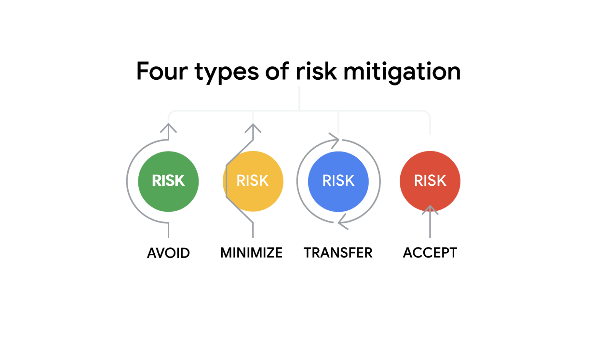

> Managing risks effectively
>
> 有效管理风险

You will learn what risk management is and how it can help prevent project failure, what tools can help identify and manage risks, how to identify different types of risks and measure-衡量 their impact on a project, and how to use a risk management plan to communicate and resolve risks.

> 您将学习什么是风险管理，它如何帮助防止项目失败，什么工具可以帮助识别和管理风险，如何识别不同类型的风险并衡量它们对项目的影响，以及如何使用风险管理计划来沟通和解决风险。

**学习目标**

- Communicate and resolve identified issues in a risk management plan.

	> 沟通和解决风险管理计划中确定的问题。

- Identify types of risks and measure their impact on a project.

	> 识别风险类型并度量它们对项目的影响。

- Examine-检查 tools for identifying, assessing, and managing risks.

	> 检查用于识别、评估和管理风险的工具。

- Explain what risk management is and how it can help prevent project failure.

	> 解释风险管理是什么以及它如何帮助防止项目失败。

# Understanding risk management

> 理解风险管理

## Introduction: Managing risks effectively

> 简介：有效地风险管理

Welcome back.

Earlier, we covered managing costs and a project budget.

We discussed what the components of a project budget are, how the budget process works, and how to track and estimate a budget.

You also learned about the procurement process.

Coming up, we will discuss risk management and why it's important to help prevent project failure.

Knowing how to anticipate-预期,预料 and alleviate-减轻,缓和, (commonly known as mitigate-减轻,缓和,缓解) the potential problems is your **best bet**-最佳选择 for keeping a project on track.

> 了解如何预测和缓解(通常称为缓和)潜在问题是保持项目正常进行的最佳选择。

You will learn how to define and relate risk management concepts and explain how risk management can help protect your project from-（使）免遭 failing.

> 您将学习如何定义和关联风险管理概念，并解释风险管理如何帮助保护您的项目免于失败。

You'll also identify risk types and how to measure-衡量 their impact on a project and communicate and resolve identified risks using a mitigation-减轻,缓和,缓解 plan.

Ready to get started?

Great. Meet me in the next video.

## The importance of risk management

> 风险管理的重要性

Think about a time in your life when you managed a project.

> 想想你一生中管理一个项目的经历。

Maybe it was a professional project, like creating an employee schedule, or a personal project, like planning a family celebration. 

> 也许这是一个专业项目，比如制定员工时间表，或者是个人项目，比如计划一个家庭庆祝活动。

Now ask yourself this: Did everything go according to plan?

> 现在问问你自己：一切都是按计划进行的吗?

If I had to guess-猜测,认为,以为, I would bet-打赌,预计,猜想 there was at least one hurdle-障碍,难关 you had to **deal with**-处理,应对.

> 如果要我猜的话，我打赌你至少要克服一个障碍。

That's because no project goes 100 percent according to plan, even-甚至,即使 when they're run by the most experienced project managers. 

> 这是因为没有一个项目是100%按计划进行的，即使是由最有经验的项目经理管理的项目。

Maybe you planned that employee schedule perfectly, and then someone caught a cold-感冒,伤风, forcing-强迫 you to rearrange-重新整理,重新布置 the schedule at the last minute.

> 也许你把员工的日程安排得很好，然后有人感冒了，迫使你在最后一刻重新安排日程。

Or maybe just as family members started arriving for that celebration, you realized you forgot to buy ice to keep the drinks cold. 

> 或者就在家人开始来参加庆祝活动的时候，你意识到你忘了买冰块来保持饮料的低温。

Hey, these things happen.

As we told you earlier, flexibility is an important skill for managing projects.

> 正如我们之前告诉您的，灵活性是管理项目的一项重要技能。

Due to the nature-性质 of the project and really-事实上 life in general-一般的, it's also important that you identify and plan for risks that could impact your project.

> 由于项目的性质和实际生活的一般情况，识别和计划可能影响项目的风险也很重要。

Let's discuss what a risk actually is.

> 我们来讨论一下风险到底是什么。

A risk is a potential event which can occur and can impact your project.

> 风险是可能发生并影响您的项目的潜在事件。

When you think about risk in the context of project management, you will think about them as hypothetical-假设的,假定的.

> 当你在项目管理的背景下考虑风险时，你会认为它们是假设的。

In other words, these aren't events that will definitely-肯定地,确定的 happen, but because there's a possibility that they could happen, it's your responsibility as the project manager to identify and plan for those risks.

> 换句话说，这些不是一定会发生的事件，但是因为它们有可能发生，所以作为项目经理，识别和计划这些风险是你的责任。

Next, let's discuss issues.

An issue is a known or real problem that can affect the ability to complete a task.

> 问题是可以影响完成任务的能力的已知或实际问题。

What's the difference between a risk and an issue?

Think of it like this: a risk is an event that could potentially happen.

If the event actually happens, then the risk becomes an issue.

> 如果事件真的发生了，那么风险就变成了一个问题。

In other words, risks are the big what-ifs and issues are things that currently-现时,当前 impact a project.

> 换句话说，风险是大的假设，问题是当前影响项目的事情。

It is clear that risks and issues can pose-造成,引起 a threat-威胁,恐吓 to your project.

> 很明显，风险和问题可能对您的项目构成威胁。

How you manage those risks is known as risk management.

> 你如何管理这些风险就是风险管理。

Risk management is the process of identifying and evaluating potential risks and issues that could impact a project.

> 风险管理是识别和评估可能影响项目的潜在风险和问题的过程。

It's not a one-time exercise; it's something that you'll need to do regularly to address potential risks.

> 这不是一次性的练习;这是你需要定期做的事情，以应对潜在的风险。

Risk management is a crucial part of the planning process by giving you an understanding of what could go wrong with your project.

> 风险管理是计划过程中至关重要的一部分，它使您了解项目可能出现的问题。

It also tells you who you need to consult about the risk.

> 它还会告诉你需要向谁咨询风险。

It helps you determine how the potential risk could be mitigated.

> 它可以帮助您确定如何减轻潜在风险。

This way, if or when something goes wrong, you'll have a plan prepared and ready to go.

> 这样，如果出现问题，你就会有一个准备好的计划，随时准备出发。

Part of being proactive-积极主动的 and planning ahead-提前 is identifying potential risks and how to solve for them.

> 积极主动和提前计划的一部分是识别潜在的风险以及如何解决它们。

This way, you'll set up your project with better chances for success.

> 这样，你的项目就有更大的成功机会。

Failing-未能做 to engage-参加,从事 in meaningful risk management can have a few big consequences-结果,后果 for your project.

> 未能参与有意义的风险管理可能会对您的项目产生一些重大后果。

First, if you don't plan ahead, you may put your project at risk of not meeting its project goal, its timelines, or success criteria.

> 首先，如果你不提前计划，你可能会把你的项目置于无法达到项目目标、时间线或成功标准的风险之中。

For example, if your goal is to publish a research report and your research analyst-分析者 quits-退出 halfway-在中间 through the project, you will likely miss the deadline if you don't have a backup plan ready to go.

> 例如，如果你的目标是发布一份研究报告，而你的研究分析师在项目中途退出，如果你没有准备好备用计划，你很可能会错过最后期限。

Additionally, by failing to plan for risks, you also fail to think through the many different ways that your project could pivot-转向 and still meet its goals.

> 此外，由于未能对风险进行计划，您也无法考虑到项目可以转向的许多不同方法，并且仍然可以实现其目标。

Even if an issue does arise, there often isn't just one way to meet your project goals and success can come in many forms.

> 即使出现了问题，通常也不是只有一种方法可以实现项目目标，成功可以以多种形式出现。

Risk management helps you determine how flexible or rigid-刚性,严格的 your plan is and then make necessary adjustments.

> 风险管理可以帮助您确定您的计划的灵活性或刚性，然后进行必要的调整。

For example, if your project requires a large product shipment-运输,运送, having a backup supplier ready means you could quickly pivot if a main supply is unable to fulfill your order.

> 例如，如果您的项目需要大量的产品运输，那么准备一个备用供应商意味着如果主要供应商无法满足您的订单，您可以快速转向。

Finally, risks can affect projects in a variety of ways that are difficult to foresee-预见,预知.

> 最后，风险会以各种难以预见的方式影响项目。

For example, a supplier you've hired may not have adequate-足够的,适当的 stock to cover your purchasing needs, or the budget for your project could be cut-削减 unexpectedly.

> 例如，你雇佣的供应商可能没有足够的库存来满足你的采购需求，或者你的项目预算可能会意外地被削减。

The risk management process helps reduce the impact of unexpected events, **freeing up**-释放,腾出 resources to focus on activities that benefit the project.

> 风险管理过程有助于减少意外事件的影响，将资源释放出来，专注于有利于项目的活动。

Let's imagine risk management in the context of Plant Pals at Office Green, which is a new service that will provide customers with small, low-maintenance desk plants.

> 让我们想象一下“绿色办公室植物伙伴”的风险管理，这是一项为客户提供小型、低维护的桌面植物的新服务。

One potential project risk is the possibility that the web page for the new service won't be live in time for the launch.

> 一个潜在的项目风险是，新服务的网页可能无法及时上线。

Another potential risk could be a fulfillment shortage-短缺,不足.

> 另一个潜在的风险可能是配送不足。

What would you do if the plant supplier runs low on the cacti and ferns that you need?

> 如果植物供应商没有你需要的仙人掌和蕨类植物，你该怎么办?

To prepare for these potential risks, you will need to think about ways to mitigate these issues before they happen, or how you will address these issues if they actually occur.

> 要为这些潜在的风险做好准备，您需要考虑在这些问题发生之前减轻它们的方法，或者如果它们真的发生了，您将如何处理这些问题。

Hopefully, these things won't be a problem, but if they are, you'll be prepared.

> 希望这些事情不会成为问题，但如果是，你要做好准备。

I also want to stress-强调 that issues will come up throughout the project you did not or could not have planned for, and that's okay. 

> 我还想强调，在整个项目中，你没有或无法计划的问题会出现，这没关系。

When these moments arise, it is important to keep calm-镇静的,沉着的, figure out the root cause of the problem, and come up with a solution. 

> 当这些时刻出现时，重要的是要保持冷静，找出问题的根本原因，并提出解决方案。

Risk management is a really important topic for project managers to understand.

> 风险管理是项目经理需要了解的一个非常重要的话题。

Identifying risks and issues prepares you for the unknown.

> 识别风险和问题为你应对未知做好了准备。

It also positively-乐观地,自信地 impacts you as the project manager because you'll feel more prepared, less stressed, and more confident-自信的,充满信心的 in your approach if an issue does occur.

> 作为项目经理，它也会对你产生积极的影响，因为当问题发生时，你会觉得自己准备得更充分，压力更小，对自己的方法更有信心。

Up next, we will discuss ways that you can identify risks.

I'll meet you there.

## Stanton: Managing my first project

> 斯坦顿:管理我的第一个项目

Hi, I'm Stanton, and I'm a program manager at YouTube.

Thinking back to one of the first projects I ever-曾经 worked on, we were actually in charge-责任 of building this sports highlight-集锦,重头戏 app.

> 回想一下我参与的第一个项目，我们实际上负责构建这个体育集锦应用程序。

But it wasn't just an app, it was an iOS app, it was an Android app, it was a website.

> 但它不仅仅是一个应用，它是一个iOS应用，它是一个Android应用，它是一个网站。

And I remember the very first meeting I went to, I was just furiously-疯狂地,猛烈地,狂暴地 taking down notes and trying to understand what the heck-糟糕,见鬼 was going on.

> 我记得我参加的第一次会议，我只是疯狂地记笔记，试图理解到底发生了什么。

And immediately after I thought-想法,看法: okay, this is my first project, I have to get all the details right.

> 我立刻想到:好吧，这是我的第一个项目，我必须把所有的细节都做好。

I have to make sure we know every little thing that was going to happen.

> 我得确保我们知道将要发生的每一件小事。

The launch date needed to be perfect-完美的,无暇的.

> 发布日期必须是完美的。

We had to get all the bugs down to zero.

> 我们得把所有的漏洞都消除。

I was just totally consumed with getting everything right the first time.

> 我只是一心想着第一次就把事情做好。

I think what I've realized since then is you're probably not going to get your first project plan correct because there's just so many things that can change.

> 我想从那以后我意识到的是，你可能不会把你的第一个项目计划做好，因为有太多的事情可能会改变。

You might find a bug last minute before launch.

> 你可能会在发布前最后一分钟发现一个bug。

Your client might come in and say they want different requirements like, "The screen-屏幕 needs to be blue instead of red."

> 你的客户可能会进来说他们想要不同的要求，比如，“屏幕需要是蓝色而不是红色。”

And then you find out that it's not really that easy to change from blue to red.

> 然后你会发现从蓝色变成红色并不是那么容易。

If I could go back and tell myself what to do at that point or what I could have done differently, I would have just told myself: don't worry so much—changes happen.

> 如果我能回到过去，告诉自己在那个时候应该做什么，或者我可以做些什么不同的事情，我只会告诉自己:不要担心太多——变化会发生。

It's how you react-反应,起化学反应 and respond-回应 to those changes that's more important.

> 更重要的是你如何应对这些变化。

I think one of the best compliments-赞扬,问候 I've gotten is, "Even throughout all this mess, you're cool, you're calm, and you're collected-镇静的." 

> 我认为我得到的最好的赞美之一是，“即使在所有这些混乱中，你很酷，你很冷静，你很镇定。”

You think through what are the issues that have happened, how do we resolve them, and you do your program management thing.

> 你想清楚发生了什么问题，我们如何解决它们，然后你做你的项目管理。

You're not always going to have the right answer the very first time; things can change at the last minute.

> 你不可能第一次就得到正确答案;事情可能在最后一刻发生变化。

If you're able to stay cool and calm, make sure you understand everything else that's going on on the project.

> 如果你能保持冷静，确保你了解项目中发生的所有事情。

All these years have taught me that, you can always reuse-再次使用,重复使用 some things.

> 这些年来教会了我，你总是可以重复使用一些东西。

You're always going to have to react to some things, but no matter what, try to think proactively, try to figure out what those issues are going to be, and you'll be the better for it.

> 你总是要对一些事情做出反应，但无论如何，试着积极思考，试着弄清楚这些问题会是什么，你会因此变得更好。

## Phases of risk management

> 风险管理的阶段

In a previous video, you learned that **risk management** is the process of identifying and evaluating potential risks and issues that could impact your project.

> 在之前的视频中，您了解了风险管理是识别和评估可能影响项目的潜在风险和问题的过程。

Risk management is an ongoing-持续存在的,进行中的 practice throughout the life cycle of your project.

> 风险管理是贯穿项目生命周期的持续实践。

It typically involves some variation of these five steps:

> 它通常包括以下五个步骤的一些变化:

1. Identify the risk.
2. Analyze the risk.
3. Evaluate the risk.
4. Treat-处理 the risk. 
5. Monitor and control the risk.

Let’s break these down:

1. **Identify the risk.** The first phase of the risk management process is to identify and define potential project risks with your team. **After all**-毕竟,终究, you can only manage risks if you know what they are. 

	> **识别风险**。风险管理过程的第一阶段是与团队一起识别和定义潜在的项目风险。毕竟，只有知道风险是什么，你才能管理风险。

2. **Analyze the risk**. After identifying the risks, determine their likelihood-可能,可能性 and potential impact to your project. Serious-严重的,危急的 risks with a high probability of occurring pose-造成,引起 the greatest threat-威胁,恐吓.

	> **分析风险**。在确定风险之后，确定它们的可能性和对项目的潜在影响。具有高发生概率的严重风险构成的最大威胁。

3. **Evaluate the risk**. Next, use the results of your risk analysis to determine which risks to prioritize.

	> **评估风险**。接下来，使用风险分析的结果来确定要优先处理哪些风险。

4. **Treat the risk**. During this phase, make a plan for how to treat and manage each risk. You might choose to ignore minor risks, but serious-严重的,危急的 risks need detailed mitigation-缓解 plans.

	> **对待风险**。在这个阶段，制定一个如何处理和管理每个风险的计划。您可以选择忽略较小的风险，但严重的风险需要详细的缓解计划。

5. **Monitor and control the risk.** Finally, assign team members to monitor, track, and mitigate risks if the need arises.

	> **监控和控制风险。**最后，如果需要，分配团队成员监视、跟踪和减轻风险。

In the upcoming videos and activities, you will learn about each of these phases in more detail and use tools and templates to navigate the risk management process. 

> 在接下来的视频和活动中，您将更详细地了解这些阶段，并使用工具和模板来导航风险管理流程。

## Uncover-揭露,发现 opportunities using risk management

> 利用风险管理发现机会

When you think about risks, it is likely that you automatically-自然地,不假思索地 think of potential negative-消极的,负面的 events.

> 当你想到风险时，你很可能会自动想到潜在的负面事件。

But when identifying risks, it is important to also consider the good things that could happen, which are considered **opportunities**.

> 但在识别风险时，重要的是也要考虑到可能发生的好事，也就是所谓的机遇。

An opportunity is a potential positive outcome of a risk.

> 机会是风险的潜在积极结果。

It is important to recognize opportunities and to **capitalize on**-利用 them as they appear so you can reach your project goals faster, more cheaply-便宜地,廉价地, or with less effort.

> 重要的是要认识到机会，并在它们出现时利用它们，这样您就可以更快、更便宜或更少地实现项目目标。

Some examples of opportunities include: 

- Completing a milestone ahead of schedule

	> 提前完成一个里程碑

- Discounted-打折 materials 

	> 打折的材料

- Availability of additional resources (people, investments-投资, equipment) 

	> 额外资源(人员、投资、设备)的可用性

**How to recognize an opportunity**

An **opportunity** is a potential positive outcome that may bring additional value to a project.

> 机会是一种可能为项目带来额外价值的潜在积极结果。

You can use the same tools and techniques that you use in risk management—identify, analyze, evaluate, treat, and control—to add potential opportunities to your risk management plan.

> 您可以使用在风险管理中使用的相同工具和技术—识别、分析、评估、处理和控制—来为您的风险管理计划添加潜在的机会。

You need to know what to do if things go wrong, but you should also make plans to seize-抓住,捉住 opportunities.

> 你需要知道如果事情出了问题该怎么做，但你也应该制定计划抓住机会。

By using techniques such as brainstorming-头脑风暴 and drawing on project history or prior experience, you can identify potential opportunities and outline how you will take advantage-优势,有利条件 of them if they occur.

> 通过使用诸如头脑风暴和绘制项目历史或先前经验之类的技术，您可以识别潜在的机会，并概述如果它们出现，您将如何利用它们。

---

As a project manager, you should always be on the lookout-监视,警戒 for potential opportunities when developing your risk management plan.

> 作为一名项目经理，在制定风险管理计划时，你应该时刻关注潜在的机会。

Review the following article for further information on using risk management strategies to identify and take advantage of opportunities that may occur during your projects: [Effective strategies for exploiting opportunities](https://www.pmi.org/learning/library/effective-strategies-exploiting-opportunities-7947)

> 关于使用风险管理策略来识别和利用项目中可能出现的机会的进一步信息，请参阅以下文章:[利用机会的有效策略](https://www.pmi.org/learning/library/effective-strategies-exploiting-opportunities-7947)

# Identifying and assessing risks

> 识别和评估风险

## Tools to help identify risks

> 帮助识别风险的工具

Hello, and welcome back.

Hopefully, you're beginning to notice how important it is to plan for risks.

> 希望你已经开始注意到为风险做计划是多么的重要。

Even-甚至,即使 the simplest projects can carry-携带,带来 some kind of risks.

> 即使是最简单的项目也会带来某种风险。

Remember, those risks shouldn't deter-阻止,使打消念头,防止 you from pursuing-追求,致力于 the project's goals.

> 记住，这些风险不应该阻止你追求项目的目标。

The key is to be prepared.

> 关键是要做好准备。

Let's discuss tools and techniques you can use to identify risks, including brainstorming and risk assessment.

> 让我们讨论可以用来识别风险的工具和技术，包括头脑风暴和风险评估。

---

Brainstorming is one of the most effective techniques for identifying risks with the team because it allows groups to spontaneously-自发地,不由自主地 share ideas without judgment-判断,看法.

> 头脑风暴是识别团队风险的最有效技术之一，因为它允许团队在没有判断的情况下自发地分享想法。

As a project manager, you will be responsible for bringing a group of people together to imagine potential risks.

> 作为一名项目经理，你将负责召集一群人一起想象潜在的风险。

Have your RACI chart at the ready to **refer to**-参考 when you decide who to invite-邀请 to this meeting.

> 准备好RACI图表，作为决定邀请谁参加会议的参考。

Speaking from experience, the best team for this task is a diverse-不同的,各式各样的 one, which includes individuals from various roles, backgrounds, and experiences.

> 从我的经验来看，完成这项任务的最佳团队是一个多元化的团队，其中包括来自不同角色、背景和经验的人。

Diverse-不同的,各式各样的 teams bring different perspectives-视角,观点, experiences, and skill sets, and this may help you to identify risks that you may not have thought of on your own.

> 不同的团队带来不同的观点、经验和技能，这可以帮助您识别您自己可能没有想到的风险。

For example, one member of your team might have experience working on multiple projects, while another newer team member, might bring a fresh-新鲜的,新的,不同的 perspective from their previous experience on other teams.

> 例如，您的团队中的一个成员可能有多个项目的工作经验，而另一个新团队成员可能会从他们以前在其他团队中的经验中带来新鲜的观点。

A great tool that you can use during brainstorming is called a cause-and-effect diagram, also sometimes known as a fishbone-鱼骨 diagram.

> 你可以在头脑风暴中使用的一个很好的工具是因果图，有时也被称为鱼骨图。

Cause-and-effect diagrams show the possible causes of an event or risk and are very useful at risk management.

> 因果关系图显示了事件或风险的可能原因，在风险管理中非常有用。

For example, in the diagram seen here, the effect listed is a supplier missing its deadlines.

> 例如，在下图中，所列出的影响是供应商错过了最后期限。

This is a risk to your project.

On the left, you'll brainstorm potential causes that would lead to the effect, like poor-不理想的,不合理的 delegation-授权,委派 or a lack of tracking tools.

> 在左边，您将集思广益可能导致这种结果的原因，比如糟糕的授权或缺乏跟踪工具。

In other words, cause-and-effect diagrams can help identify all the ways that things could go wrong by identifying a potential risk, known as the effect, and working backwards-倒退的 to consider the potential causes of that risk.

> 换句话说，因果关系图可以通过识别潜在的风险(称为效果)，并向后工作以考虑该风险的潜在原因，来帮助识别事情可能出错的所有方式。

By categorizing-将…分类 and breaking them down into further causes, you are able to identify areas that could lead to a potential problem, like exceeding-超过,超出 your budget or allowing scope creep to impact your timeline.

> 通过分类并将其分解为进一步的原因，您可以识别可能导致潜在问题的区域，例如超出预算或允许范围蔓延影响您的时间表。

As a reminder, scope creep refers to changes, growth, and uncontrolled factors that affect the project's scope at any point after the project begins.

> 提醒一下，范围渐变是指在项目开始后的任何时刻影响项目范围的变化、增长和不受控制的因素。

During these brainstorming sessions, you might find that your list of potential risks is quite long, and that's okay.

> 在这些头脑风暴会议中，您可能会发现您的潜在风险列表相当长，这没关系。

It is a reality-真实,现实 you and your team cannot account-解释 for every single problem that can occur during your project.

> 这是一个现实，你和你的团队无法解释项目中可能出现的每一个问题。

So how do you decide which risks to focus on?

> 那么，你如何决定关注哪些风险呢?

List the outcomes from the brainstorm in a risk register-登记表.

> 在风险登记册中列出头脑风暴的结果。

A risk register is a table or chart that contains your list of risks.

> 风险登记簿是包含风险列表的表格或图表。

---

Next, you will adopt a risk assessment technique.

> 接下来，您将采用风险评估技术。

Risk assessment is the stage of risk management where qualities of a risk are estimated or measured.

> 风险评估是风险管理的一个阶段，在这个阶段对风险的质量进行估计或测量。

By qualities, we're mainly **referring to**-指的是 how likely the risk is to occur and its potential impact on a project.

> 通过质量，我们主要指的是风险发生的可能性以及它对项目的潜在影响。

We'll come back to this point in a moment.

> 我们一会儿再回到这一点。

There are a few ways to assess risks, but one we'll focus on is creating a probability and impact matrix.

> 有几种评估风险的方法，但我们将重点关注的是创建概率和影响矩阵。

A probability-概率,几率 and impact matrix is a tool used to prioritize project risks.

> 概率和影响矩阵是用于确定项目风险优先级的工具。

I personally love this technique and use it all the time in my role at Google.

> 我个人很喜欢这个技巧，并且在谷歌工作期间一直使用它。

Earlier, I mentioned that you need to assess the likelihood-可能性 that a risk will happen and its potential impact.

> 前面我提到，你需要评估风险发生的可能性及其潜在影响。

This matrix will help you do just that.

> 这个矩阵将帮助你做到这一点。

To create a probability and impact matrix, you will need to think about the level of impact.

> 要创建一个概率和影响矩阵，你需要考虑影响的程度。

Impact refers to the damage-损坏,损失 a risk could cause if it occurs.

> 影响是指如果发生这种情况，可能造成的损害风险。

Impact is also determined on a scale-等级 of high, medium, and low.

> 影响也被确定为高、中、低的等级。

High means that if the risk occurs, it will substantially-本质上 alter-改变,改动 the project.

> 高意味着如果风险发生，它将从本质上改变项目。

Low means if the risk occurs, it will have a slight impact but it's not likely to derail-（使）脱轨,破坏,阻挠 the project.

> 低意味着如果风险发生，它会有轻微的影响，但它不太可能使项目脱轨。

You will also need to think about probability.

> 你还需要考虑概率。

Probability is the likelihood that a risk will occur.

We also determine probability on a scale of high, medium, and low.

In this case, high probability means there's a high likelihood of this happening.

> 在这种情况下，高概率意味着这件事发生的可能性很大。

Low probability means you've identified a risk that could happen, but it isn't likely that the risk will occur.

> 低概率意味着您已经确定了可能发生的风险，但风险不太可能发生。

These two considerations come together to determine the inherent-内在的,固有的 risk rating-等级,级别.

> 这两个考虑因素共同决定了固有风险评级。

Inherent risk is the measure of a risk calculated by its probability and impact.

> 固有风险是对风险的度量，通过其概率和影响来计算。

Measuring the inherent risk gives us a method for understanding a risk.

> 测量固有风险为我们提供了一种理解风险的方法。

Inherent risk is also determined on a high, medium, and low scale.

> 固有风险也在高、中、低三个尺度上确定。

Basically, if a risk has a low impact and low probability, it has a low inherent risk rating.

> 基本上，如果风险具有低影响和低概率，则其固有风险等级较低。

These are the types of risks you don't need to worry too much about.

> 这些类型的风险你不需要太担心。

But if a risk has a high impact and a high probability, then it carries a high inherent risk rating.

> 但是，如果一个风险具有高影响和高概率，那么它就具有高固有风险等级。

Medium to high risks are the risks you should focus on and create detailed mitigation plans for.

> 中高风险是您应该关注的风险，并为其制定详细的缓解计划。

When you're creating a probability and impact matrix, it's important to ensure you create a matrix that meets accessibility-可访问性,易使用性,易懂性 guidelines and has information and formatting-规定…的格式 that everyone can easily and quickly understand.

> 当你创建一个概率和影响矩阵时，重要的是要确保你创建的矩阵符合可访问性准则，并且包含每个人都能轻松快速理解的信息和格式。

One way to do this is to use both color and distinct shapes-形 or text to communicate levels of risk.

> 一种方法是使用颜色和不同的形状或文本来传达风险级别。

You can learn more about accessibility communication by visiting course resources.

> 您可以通过访问课程资源了解更多有关无障碍通信的信息。

The way you view and manage each risk will be determined based on your organization's risk appetite-偏好,欲望,爱好, which refers to the willingness-乐意,意愿 of an organization to accept the possible outcomes of a risk.

> 您查看和管理每个风险的方式将根据您的组织的风险偏好来确定，风险偏好指的是组织接受风险可能结果的意愿。

You, your team, and your stakeholders may have different appetites for each risk.

> 您、您的团队和您的涉众可能对每种风险有不同的偏好。

We'll discuss how risk appetite plays into risk mitigation in just a bit.

> 稍后我们将讨论风险偏好如何在风险缓解中发挥作用。

Certain low-level risks that could result in minor setbacks-挫折,阻碍 are much more tolerable-可接受的,可忍受的 than high-level risks that have the potential to completely-完全地,彻底地 derail-阻挠,破坏 your project.

> 某些可能导致小挫折的低级别风险比可能使项目完全脱轨的高级别风险要容易忍受得多。

Once you've completed your risk assessment, you will update the risk register to include high, medium, and low ratings for some examples of risks that you've identified for this project.

> 一旦您完成了您的风险评估，您将更新风险登记册，以包括您为该项目确定的一些风险示例的高、中、低评级。

Great.

Now that we've covered how to identify and assess risks, we'll go on to the next video, where we'll discuss some of the types of risks you'll run into during your role as a project manager.

> 既然我们已经介绍了如何识别和评估风险，我们将继续下一个视频，在那里我们将讨论您在担任项目经理期间可能遇到的一些类型的风险。

Meet you there.

## How to create a fishbone diagram

> 如何创建鱼骨图

Previously, you learned about some tools to help you identify risks.

In this reading, we will dive deeper into how to create and use one of those tools: the **fishbone diagram**.

---

Fishbone diagrams—also known as **Ishikawa diagrams** or **cause-and-effect diagrams**—were developed by Japanese organizational theorist-理论家 Kaoru Ishikawa in the 1960s to measure quality control processes in the shipbuilding-造船 industry-工业.

鱼骨图——也被称为石川图或因果图——是由日本组织理论家石川薰在20世纪60年代开发的，用来衡量造船工业的质量控制过程。

Fishbone diagrams are a visual way to look at cause and effect.

> 鱼骨图是一种观察因果关系的可视化方法。

They are called fishbone diagrams because they have a similar shape to a fish skeleton-骨骼,骨架. 

> 它们被称为鱼骨图，因为它们的形状与鱼的骨骼相似。

---

Fishbone diagrams help the team to brainstorm potential causes of a problem or risk and sort-把…分类 them into useful categories-类别,范畴.

> 鱼骨图帮助团队对问题或风险的潜在原因进行头脑风暴，并将它们分类为有用的类别。

These categories show the areas that you should focus on to mitigate that risk.

> 这些类别显示了您应该关注以减轻风险的领域。

Fishbone diagrams are also very helpful in finding the root cause of a problem.

A **root cause** is the initial cause of a situation that introduces a problem or risk.

> 根本原因是导致问题或风险的最初原因。

The purpose of using fishbone diagrams in risk management is to identify the root cause of a potential problem for a project or program. 

> 在风险管理中使用鱼骨图的目的是识别项目或计划潜在问题的根本原因。

---

**Case study: Using a fishbone diagram to identify causes of risks** 

> 案例研究:使用鱼骨图来识别风险的原因

Miguel is a project manager at Office Supply Inc-公司.

> 米格尔是办公用品公司的项目经理。

He is in the planning phase for an upcoming summer promotion-促销,推销 project, which will include free-免费 delivery-递送,投递 of products. 

> 他正在计划一个即将到来的夏季促销项目，其中包括免费送货。

Unfortunately-不幸地,遗憾地, in the past, the company has had trouble delivering its products to downtown-市中心的,商业区的 office buildings on time.

> 不幸的是，在过去，该公司一直无法按时将产品送到市中心的办公楼。

Miguel builds a fishbone diagram to see if he can identify some of the possible causes of this problem in order to mitigate this risk on the current project.

> Miguel 构建了一个鱼骨图，看看他是否能识别出这个问题的一些可能原因，以便减轻当前项目中的风险。

He follows these steps to build his diagram:

> 他遵循以下步骤来构建他的图表:

**Step 1) Define the problem** 

First, Miguel clearly defines what the problem entails.

> 首先，Miguel 清楚地定义了问题的本质。

In this case, Miguel states-陈述 the problem as “trouble delivering products to downtown office buildings on time.”

> 在这种情况下，Miguel 将问题描述为“难以按时将产品交付到市中心的办公楼”。

Then he adds the problem to the head of his fishbone diagram. 

> 然后，他将问题添加到鱼骨图的头部。

**Step 2) Identify the categories** 

> 步骤2)确定类别

In this step, Miguel thinks of the types of categories that could be causing the problem.

> 在这一步中，Miguel 考虑可能导致问题的类别类型。

These categories will change depending on the type of problem or industry.

> 这些分类将根据问题或行业的类型而变化。

Some common examples of categories include “people,” “technology,” “materials,” “transportation,” “money,” “time,” “environment,” and “procedures.” 

For the delivery problem at Office Supply Inc.,

Miguel lists the categories “people,” “technology,” “materials,” “transportation,” and “environment” at the top and bottom of the lists to the left of the problem in his fishbone diagram. 

> Miguel 将“人”、“技术”、“材料”、“运输”和“环境”等类别列在鱼骨图中问题左侧列表的顶部和底部。

Fishbone diagram with the categories and problem filled out listed in the reading.

> 鱼骨图与类别和问题填写在阅读中列出。

Categories include “people,” “technology,” “materials,” “transportation,” “money,” “time,” “environment,” and “procedures.”

**Step 3) Brainstorm the causes** 

> 头脑风暴原因

Now that Miguel has identified possible categories that relate to the risk, he brainstorms areas of concern-关心,关注 within each category. 

> 既然 Miguel 已经确定了与风险相关的可能类别，他就对每个类别中的关注领域进行头脑风暴。

He reaches out to his team for help in identifying these possible causes.

>  他向他的团队寻求帮助，以确定这些可能的原因。

Then, Miguel fills in the lists with some of the causes that could be related to each category.

> 然后，Miguel 用可能与每个类别相关的一些原因填充列表。

**Pro tip:** 

Brainstorming should be a judgment-free zone.

> 头脑风暴应该是一个没有评判的区域。

Encourage the flow of information related to the categories and try not to rule things out.

> 鼓励与分类相关的信息流动，尽量不要排除某些情况。

When dealing-对付,对待 with human factors, **steer-引导,带领 clear**-避开,躲避 of naming individuals; instead, focus solely-单独地,仅有地 on behaviors.

> 在处理人为因素时，避免指名道姓;相反，只关注行为。

Fishbone diagram with the categories, possible causes, and problem filled out listed in the reading.

> 鱼骨图与类别，可能的原因，和问题填写在阅读材料中列出。

New causes for "people" include lack of training, distractions-分心, lack of people.

> “人”的新原因包括缺乏训练、分心、人手不足。

For "technology" include overcomplicated-过于复杂的,过于难懂的 and outdated-过时的,陈旧的.

> 对于“技术”包括过于复杂和过时。

For "materials" include fragile-易碎的 packaging and lack of forklifts-叉车,铲车.

> 对于“材料”包括易碎的包装和缺乏叉车。

For "transportation" includes trucks too small, trucks too big, and lack of trucks.

> 因为“运输”包括卡车太小，卡车太大，以及缺乏卡车。

For "environment" includes city traffic-交通, busy elevators-电梯, and long distances.

> 因为“环境”包括城市交通、繁忙的电梯和长距离。

**Step 4) Analyze the causes**

Now that Miguel has discovered several possible causes for the delivery problems to downtown offices, he analyzes those causes.

> 现在米格尔已经发现了几个可能导致市区办公室送货问题的原因，他对这些原因进行了分析。

He needs to identify the root cause of the existing problem so he can figure out how to mitigate it for the current project.

> 他需要确定现有问题的根本原因，这样他就可以找出如何减轻当前项目的问题。

Note that *one* cause of a problem isn’t necessarily the *root cause*.

> 请注意，问题的“一个”原因不一定是“根本原因”。

For example, Miguel has identified that a lack of forklifts-叉车,铲车 is a problem.

> 例如，Miguel 发现缺少叉车是一个问题。

Having more forklifts would allow the company to get the products on and off of the trucks more quickly.

> 拥有更多的叉车将使公司能够更快地将产品装上和卸下卡车。

However, after calculating the amount of time it takes to **unload and load**-卸荷与加载 the products, Miguel realizes that adding more forklifts won’t significantly reduce the amount of time to get the products from the warehouse-仓库 to downtown offices.

> 然而，在计算了货物装卸所需的时间后，Miguel意识到增加更多的叉车并不能显著减少将货物从仓库运送到市中心办公室的时间。

Therefore, this is one cause of the problem, but it is not the root cause.

On the other hand, Miguel has noticed that there is no set-固定的 schedule for sending out deliveries.

> 另一方面，Miguel 注意到没有固定的送货时间表。

Since the problem only exists in the city instead of in the suburban-郊区的,城郊的 areas, he realizes that traffic-交通 must also be playing a role in the late deliveries.

> 由于这个问题只存在于城市而不存在于郊区，他意识到交通一定也在延迟交货方面发挥了作用。

Therefore, changing the schedule so that the delivery times are before the city’s rush-高峰时间 hour may help fix the problem.    

> 因此，改变计划，使送货时间早于城市的高峰时间，可能有助于解决这个问题。

**Pro tip**: 

Fishbone diagrams are tools that can be useful during any phase of the project.

> 鱼骨图是在项目的任何阶段都有用的工具。

When you use them in risk planning, you are trying to identify the possible causes of a problem that may or may not occur.

> 当您在风险计划中使用它们时，您是在试图确定可能发生或可能不发生的问题的可能原因。

When you use them in the execution phase, you are trying to find the root cause of an issue that has already occurred. 

> 当您在执行阶段使用它们时，您试图找到已经发生的问题的根本原因。

**Key takeaway**

Identifying risks and measuring their potential impact on a project can be a complex task.

> 识别风险并度量它们对项目的潜在影响可能是一项复杂的任务。

You can help visualize these issues by creating fishbone diagrams.

> 您可以通过创建鱼骨图来帮助可视化这些问题。

To recap, the steps to create a fishbone diagram are:

> 总而言之，创建鱼骨图的步骤如下:

- Define the problem
- Identify the categories
- Brainstorm the causes
- Analyze the causes

Once you’ve developed a fishbone diagram to help find a problem’s root cause and measure its potential impact on the project, you can then move on to determining how to mitigate the risk. 

> 一旦您开发了鱼骨图来帮助找到问题的根本原因并度量其对项目的潜在影响，您就可以继续确定如何降低风险。

## Types of risk

> 风险类型

Hi again.

Let's discuss some common types of risks that you might plan for while-当…的时候 managing a project.

> 让我们来讨论一些常见的风险类型，您可能会在管理项目时计划这些风险。

Though-虽然,尽管 there are many different types of risks that could impact your project, the big ones that you want to be aware of are: time risks, budget risks, and scope risks.

> 尽管有许多不同类型的风险可能会影响您的项目，但您需要意识到的主要风险是：时间风险、预算风险和范围风险。

Let's break those down.

---

First, we have time risks.

Time risks refers to the possibility that project tasks will take longer than anticipated-预期,预料 to complete.

> 时间风险指的是项目任务将花费比预期更长的时间来完成的可能性。

You'll need to be aware of time risks because time is money.

> 你需要意识到时间风险，因为时间就是金钱。

Poor time management may deplete-大量减少,耗尽 your budget and upset-不安 your stakeholders by causing delays.

> 糟糕的时间管理可能会耗尽你的预算，并因延误而让利益相关者感到不安。

---

Next, we have budget risks.

Budget risk refers to the possibility that the cost of a project will increase due to poor planning or expanding-扩大,扩展 the project scope.

> 预算风险是指由于计划不周或扩大项目范围而导致项目成本增加的可能性。

You need to be aware of budget risk since budgeting provides the basis for project costs control.

> 您需要意识到预算风险，因为预算是项目成本控制的基础。

For example, if you overspend, you might not be able to pay your suppliers.

> 例如，如果你超支，你可能无法支付你的供应商。

This could result in some reputational-信誉的,声誉的 damage-损失,损害,代价 for the company.

> 这可能会对公司的声誉造成损害。

---

Then we have scope risk.

Scope risk refers to the possibility that a project won't produce the results outlined in the project goals.

> 范围风险是指项目无法产生项目目标中概述的结果的可能性。

You need to be aware of scope risks because the deliverables of your project might not be acceptable to your stakeholders or customers, and that may defeat-失败,破坏 the purpose of the entire project.

> 您需要意识到范围风险，因为您的项目的可交付成果可能无法被您的涉众或客户接受，这可能会破坏整个项目的目的。

---

While time, budget, and scope risks are very common, there are other types of external risks that you should be aware of.

> 虽然时间、预算和范围风险非常常见，但还有其他类型的外部风险需要注意。

By external risks, we're referring to risks that result from factors outside of the company that you have little to no control over.

> 所谓外部风险，我们指的是由公司之外的因素造成的风险，这些因素你几乎无法控制。

For example, your project could be impacted by an environmental risk, like a major-严重的 storm-暴风雨,暴风雪, or a legal risk, like a change in regulatory-监管的 requirements.

> 例如，您的项目可能受到环境风险(如大风暴)或法律风险(如法规要求的变更)的影响。

And it's also important to know that there are endless-无止境的,无穷尽的 types of risks.

> 同样重要的是要知道，风险有无穷无尽的类型。

There will never-不会,不可能 be a prescription-解决方法,诀窍 for how to identify and manage every single possible risk.

> 对于如何识别和管理每一个可能的风险，永远不会有一个处方。

But if you have a plan, you'll be better set up to **deal with**-应对 whatever-无论什么 comes your way.

> 但如果你有一个计划，你就能更好地应对任何事情。

---

Okay, now let's discuss a certain type of risk known as a single point of failure.

> 好了，现在我们来讨论一种被称为单点故障的风险。

A single point of failure is a risk that has the potential to be catastrophic-灾难性的 and halt-停止,中止 work across a project.

> 单点故障是一种风险，有可能是灾难性的，并使整个项目停止工作。

These are risks that have the power to stop an entire team in its tracks, meaning that no one can make progress on their tasks until the issue is resolved.

> 这些风险可能会让整个团队停滞不前，这意味着在问题解决之前，没有人能够在任务上取得进展。

For example, in our Office Green scenario, a single point of failure might be a **power outage**-电力中断,停电 that takes down the internal database-数据库,资料库 where every piece of information about the project is stored.

> 例如，在我们的Office Green场景中，单点故障可能是断电，导致存储有关项目的每条信息的内部数据库关闭。

Until the database is back up and running, your team won't have access-访问 to any of the information they need to do their jobs.

> 在数据库备份并运行之前，您的团队将无法访问完成工作所需的任何信息。

As a result, your team won't be able to complete any of their assigned tasks.

> 因此，你的团队将无法完成分配给他们的任何任务。

To mitigate this risk, you might budget for a separate cloud service to serve as your backup for all of your project documentation and information.

> 为了降低这种风险，您可能需要预算一个单独的云服务作为所有项目文档和信息的备份。

As the project manager, you'll need to identify and monitor potential single points of failure in your project, since they can be detrimental-有害的,不利的 to the project timeline, budget, and scope.

> 作为项目经理，您需要识别和监控项目中潜在的单点故障，因为它们可能对项目的时间表、预算和范围有害。

---

Another source of risk to be aware of are dependencies.

> 另一个需要注意的风险来源是依赖关系。

A dependency is a relationship between two project tasks, where the start or completion of one depends on the start or completion of the other.

> 依赖关系是两个项目任务之间的关系，其中一个项目任务的开始或完成取决于另一个项目任务的开始或完成。

In other words, dependencies are like links that connect one project task to another.

> 换句话说，依赖关系就像连接一个项目任务到另一个项目任务的链接。

A dependency must be addressed before the task can be completed or before another task can begin.

> 必须在任务完成之前或在另一个任务开始之前解决依赖项。

Because dependencies are the links that connect one project task to another, they are often a huge source of risk to a project.

> 因为依赖关系是将一个项目任务连接到另一个项目任务的链接，所以它们通常是项目的巨大风险来源。

For example, imagine that you've tasked a teammate with hiring a local plant supplier.

> 例如，假设您给一个队友分配了雇用当地植物供应商的任务。

Until-直到…为止 they've signed a contract with the supplier, your team can't place any orders.

> 在他们与供应商签订合同之前，你的团队不能下任何订单。

That's a dependency.

Now here's where the risk comes in.

> 这就是风险所在。

If your teammate doesn't meet the hiring deadline and then goes on vacation for a week, this could delay your project timeline. 

> 如果你的队友没有在招聘截止日期前完成，然后去度假一周，这可能会推迟你的项目进度。

Not great right?

> 不是很好，对吧?

If you don't plan for dependencies, you might risk and impact your budget schedule or project outcome.

> 如果您不为依赖关系做计划，您可能会冒险并影响您的预算进度或项目结果。

To prevent something like this from happening, you might ask a teammate to share their out-of-office plans with you at the start of the project.

> 为了防止类似的事情发生，您可以在项目开始时要求团队成员与您分享他们的外出计划。

This helps you to stay aware of everyone's schedules, ensuring that there are backup plans in place to maintain your project schedule.

> 这可以帮助您了解每个人的日程安排，确保有适当的备用计划来维护您的项目日程安排。

There are two types of dependencies: internal and external.

> 有两种类型的依赖：内部的和外部的。

Internal dependencies refer to dependencies within the project that you and your team have control over.

> 内部依赖关系是指项目中您和您的团队可以控制的依赖关系。

For example, you'll need to secure-获得,得到 approval on a website design before development can begin.

> 例如，在开始开发之前，你需要确保网站设计得到批准。

On the other hand, external dependencies are dependencies that you have no control over.

> 另一方面，外部依赖关系是您无法控制的依赖关系。

For example, the farm-农场 that your plant vendor works at might have experienced-经历,遭遇 a lighter-更轻的 rain-雨,雨水 season-季节 this year, meaning that they'll have fewer plants to sell.

> 例如，你的植物供应商工作的农场今年可能经历了一个较少的雨季，这意味着他们将有更少的植物出售。

There are many different risks that can impact your project, from time risks to budget risks to scope risks.

> 有许多不同的风险会影响您的项目，从时间风险到预算风险再到范围风险。

But remember, no project is risk-free.

> 但是请记住，没有一个项目是没有风险的。

And with careful, upfront-先期得 planning, you can do your best to prevent risks from occurring.

> 通过仔细的预先计划，您可以尽最大努力防止风险的发生。

In the next video, we'll discuss how to mitigate risks.

I'll meet you there.

## Managing single point of failure risks

> 管理单点故障风险

Previously, you learned how to use various tools and strategies-策略,战略 to identify and manage risks as you plan your project.

> 在此之前，您学习了如何在计划项目时使用各种工具和策略来识别和管理风险。

In this reading, we will discuss how to manage risks with the highest potential of impacting your project.

> 在这篇阅读中，我们将讨论如何管理影响项目的最大潜力的风险。

**Single point of failure risks**

> 单点故障风险

Once you have identified your risks and ranked-排名,归类于 them, give special attention to the risks that could have a catastrophic-灾难性的,极糟的 effect on your team’s ability to complete the project.

> 一旦您确定了风险并对它们进行了排序，请特别注意可能对您的团队完成项目的能力产生灾难性影响的风险。

A **single point of failure** is a risk that, if it were to materialize-实现,成为现实, could cause a significant amount of disruption-扰乱,中断 to your project and could even shut it down.

> 单点故障是一种风险，如果它成为现实，可能会对您的项目造成大量中断，甚至可能导致项目关闭。

You should plan for these risks early on in the project. 

> 您应该在项目的早期就为这些风险做好计划。

---

For example, a lot of projects use **subject matter experts** (**SMEs**)—team members with a deep understanding of a particular job, process, department, function, technology, machine, material, or type of equipment.

> 例如，许多项目使用**主题专家** (SMEs)——对特定工作、过程、部门、功能、技术、机器、材料或设备类型有深刻理解的团队成员。

SMEs are involved to advise you throughout the project life cycle.

> SMEs 将在整个项目生命周期内为您提供建议。

Having only one SME familiar with a critical system on your team is an example of a single point of failure risk.

> 团队中只有一个熟悉关键系统的SME就是单点故障风险的一个例子。

This SME will only offer one perspective-视角,观点, and if they are the only person advising-劝告,建议 on the system, there is no one to offer another perspective. 

> 这个 SME 将只提供一种观点，如果他们是唯一对系统提出建议的人，就没有人可以提供另一种观点。

**Case study: Using mitigation strategies to manage single point of failure risks**

> **案例研究：使用缓解策略管理单点故障风险**

Let’s imagine that Office Green uses plant seeds-种子 from a company in South America for the majority-大多数 of its offerings.

> 让我们想象一下，Office Green 在其大部分产品中使用了来自南美一家公司的植物种子。

The plants produced by these seeds are in high demand-需要,需求 by Office Green’s customers.

> 由这些种子生产的植物在 Green 办公室的客户中需求量很大。

However, the local government on the suppliers’ end just announced-宣布,公布 that it would be imposing-强制推行 a new tax on the exporting-出口 of seeds and produce.

> 然而，供应方的当地政府刚刚宣布，将对种子和农产品的出口征收一项新税。

As a result, the price of the seeds suddenly-突然地,出乎意料地 becomes so high that it is difficult for the company to supply-供应,补给 the seeds to Office Green, putting the project at risk of not having these seeds available to purchase.

> 结果，种子的价格突然变得如此之高，以至于公司很难向绿色办公室提供种子，使项目面临无法购买这些种子的风险。

---

Let’s look at how these four risk mitigation strategies can be used for managing single point of failure risks in the Office Green example:

> 让我们看看如何在Office Green示例中使用这四种风险缓解策略来管理单点故障风险:

**Avoid** 

This strategy seeks to sidestep-回避—or avoid—the situation as a whole.

> 这种策略试图回避——或避免——整个形势。

In the Office Green example, the team could avoid this risk entirely-完全地,完整地 by considering using another seed that is widely-普遍地,广泛地 available in several locations.

> 在“绿色办公室”的例子中，团队可以通过考虑使用在几个地方广泛可用的另一种种子来完全避免这种风险。

**Minimize** 

Mitigating a risk involves trying to minimize the catastrophic-灾难性的,极糟的 effects that it could have on the project.

> 降低风险包括尽量减少它可能对项目造成的灾难性影响。

The key to minimizing risk starts with realizing that the risk exists.

> 最小化风险的关键是从意识到风险的存在开始的。

That is why you will usually hear mitigation strategies referred to as *workarounds-应变方法,变通方法,替代方法*.

> 这就是为什么你通常会听到缓解策略被称为“变通方法”。

What if the Office Green team decided to use both the original South American supplier and another supplier from a neighboring-邻近的,附近的 country?

> 如果Office Green团队决定同时使用原来的南美供应商和来自邻国的另一个供应商怎么办?

More than likely, the change in taxation-税收,税务 and regulation-规章制度,规则 wouldn’t affect both companies, and this would provide Office Green some flexibility without having to completely eliminate-排除 their preferred-首选,更合意的,更好的 supplier.

> 更有可能的是，税收和监管方面的变化不会影响到两家公司，这将为Office Green提供一些灵活性，而不必完全淘汰他们首选的供应商。

**Transfer** 

The strategy of transferring shifts the responsibility of handling the risk to someone else.

> 转移策略将处理风险的责任转移给其他人。

The Office Green team could find a supplier in North America that uses the seeds from several other South American countries-国家 and purchase the seeds from them instead.

> 绿色办公室团队可以在北美找到一家供应商，该供应商使用来自其他几个南美国家的种子，并从他们那里购买种子。

This transfers the ownership of South-南 American regulatory-管理的,控制的,监管的 risks and costs to that supplier.

> 这将南美监管风险和成本的所有权转移给了该供应商。

**Accept** 

Lastly, you can accept the risk as the normal cost of doing business.

> 最后，你可以接受风险作为做生意的正常成本。

**Active** **acceptance of risk** usually means setting aside extra funds to pay your way out of trouble.

> **积极** **接受风险**通常意味着留出额外的资金来支付你摆脱困境的方式。

**Passive** **acceptance of risk** is the “do nothing” approach.

> **被动** **接受风险**是“什么都不做”的方法。

While passive acceptance may be reasonable-合情理的 for smaller risks, it is not recommended-建议 for most single point of failure risks.

> 虽然被动接受对于较小的风险可能是合理的，但不建议对大多数单点故障风险进行被动接受。

It is also important to be proactive and mitigate risks ahead of time whenever-无论何时 possible, as this may save-避免 you from having to accept risks.

> 在任何可能的情况下，积极主动地降低风险也很重要，因为这可以避免你不得不接受风险。

In the Office Green scenario, the project manager could schedule a meeting with project stakeholders to discuss the increase in South American taxes and how it could impact the project cost.

> 在Office Green场景中，项目经理可以安排与项目干系人的会议，讨论南美税收的增加以及它如何影响项目成本。

Then, they might decide to actively accept the risk by setting aside additional funds to source the seeds from another supplier, if necessary, or to passively accept the risk of not receiving the seeds at all this season.

> 然后，如果有必要，他们可能会决定主动接受风险，拨出额外的资金从其他供应商那里采购种子，或者被动接受整个季节都收不到种子的风险。

**Key takeaway**

If you have strategies you can rely on for avoiding, minimizing, transferring, and accepting project risks—including single point of failure risks—you will be in a better position to protect your project from the possible impact of these risks.      

> 如果您有可以依赖的策略来避免、最小化、转移和接受项目风险——包括单点故障风险——您将处于更好的位置，以保护您的项目免受这些风险的可能影响。

## Visualizing dependency relationships

> 可视化依赖关系

In the video, you learned to identify several types of risks.

In this reading, we will be discussing the different types of dependencies that can play a critical role in our project’s success. 

> 在本文中，我们将讨论在项目成功中扮演关键角色的不同类型的依赖关系。

**Types of dependencies**  

> 依赖的类型

**Dependencies** are a relationship between two project tasks in which the completion or the initiation of one is reliant-依赖的,依靠的 on the completion or initiation of the other.

> 依赖关系是两个项目任务之间的关系，其中一个项目任务的完成或启动依赖于另一个项目任务的完成或启动。

Let’s explore four common types of dependencies:

**Finish to Start (FS)**

In this type of relationship between two tasks, Task A must be completed before Task B can start.

This is the most common dependency in project management.

It follows the natural progression from one task to another.

> 它遵循从一个任务到另一个任务的自然进程。

**Example:** Imagine you are getting ready to have some friends over for dinner.You can’t start putting on your shoes (Task B) until you’ve finished putting on your socks-袜子 (Task A). 

> 假设你正准备邀请一些朋友过来吃晚饭。在你穿完袜子(任务A)之前你不能开始穿鞋(任务B)。

Task A: **Finish** putting on your socks. →Task B: **Start** putting on your shoes.

**Finish to Finish (FF)**

In this model, Task A must finish before Task B can finish. (This type of dependency is not common.)

**Example:** Earlier in the day, you baked-烘焙 a cake. You can’t finish decorating-装饰,装点 the cake (Task B) until you finish making the icing-糖衣 (Task A).

> 今天早些时候，你烤了一个蛋糕。你不能完成蛋糕的装饰(任务B)，直到你完成糖衣(任务A)。

Task A: **Finish** making the icing. →Task B: **Finish** decorating the cake.

**Start to Start (SS)**

In this model, Task A can’t begin until Task B begins. This means Tasks A and B start at the same time and run in parallel.

**Example:**  You need to take the train home after work. You can’t get on the train-火车 (Task B) until you pay for the train ride (Task A). 

> 例:下班后你需要乘火车回家。你不能上火车(任务B)，直到你付了火车车费(任务A)。

Task A: **Start** by paying for your train ride. →Task B: **Start** going home by boarding the train.

**Start to Finish (SF)**

In this model, Task A must begin before Task B can be completed. 

**Example:**  One of your friends calls to tell you he’ll be late. He can’t finish his shift-班次 (Task B) and leave work until his coworker-同事,合作者 arrives to start her shift (Task A). 

> 你的一个朋友打电话告诉你他会晚到。他不能完成他的班次(任务B)，直到他的同事来开始她的班次(任务A)才离开工作。

Task A: Your friend’s coworker **starts** her shift. →Task B: Your friend **finishes** his shift.

**Dependency graphs**

As a project manager, you will use these dependencies to visually represent-表示,代表 the flow of work during your project.

> 作为项目经理，您将使用这些依赖关系来直观地表示项目期间的工作流程。

Let’s examine how to use a dependency graph with an everyday-日常的,每天的 example.

> 让我们通过一个日常示例来研究如何使用依赖关系图。

Imagine you are making **peanut butter**-花生酱 and jelly-果冻 sandwiches for the kids who will be coming to your dinner, and you want to use dependency relationships to map your activities on a graph. 

> 想象一下，你正在为将要来你家吃饭的孩子们制作花生酱和果冻三明治，你想用依赖关系把你的活动映射到一个图表上。

Activity A: Gather Materials. Relationship: After starting the project

Activity B: Put jelly-果冻 on a piece of bread. Relationship: After A

Activity C: Put **peanut butter**-花生酱 on a piece of bread. Relationship: After A

Activity D: Put both pieces of bread together. Relationship: After B and C

Activity E: Serve to kids. Relationship: After activity D

Let’s break each task down to create your dependency graph:

1. When you start your sandwiches, you need to gather your materials: bread, knife-刀具, jelly, peanut butter, plates, and napkins-餐巾纸 (Task A). 

	> 当你开始做三明治时，你需要收集材料:面包、小刀、果冻、花生酱、盘子和餐巾纸(任务A)。

2. At this point, you can put jelly on one piece of bread (Task B) and peanut butter on the other piece of bread (Task C). 

3. Now you need to put both pieces of bread together (Task D).

4. Finally, you can put the sandwich on a plate and serve it (Task E).

**Key takeaways**

There are four types of task dependencies:

- Finish to Start
- Finish to Finish
- Start to Start
- Start to Finish

A dependency graph can help you visualize these different dependencies and the flow of the work that needs to be done on a project.

> 依赖关系图可以帮助您可视化这些不同的依赖关系以及需要在项目中完成的工作流程。

They can also help you identify any risk associated with them. 

> 它们还可以帮助您识别与之相关的任何风险。

# Mitigating and communicating risks

> 缓解和交流风险

## Risk mitigation strategies

> 风险缓解策略

Hi, and welcome back.

Okay, so you've learned how to identify your project's risks and assess them using a probability-概率 and impact matrix.

> 好了，你已经学会了如何识别项目的风险，并使用概率和影响矩阵来评估它们。

Now that you know which risks require your attention, how do you determine what to do about them?

> 既然你知道了哪些风险需要你关注，那么你如何决定如何应对它们呢?

This is where risk mitigation planning comes in.

> 这就是风险缓解计划发挥作用的地方。

---

Risk mitigation planning is about finding ways to eliminate-剔除,排除 or reduce the impact of potential risks to your project.

> 风险缓解计划是关于寻找消除或减少潜在风险对项目影响的方法。

There are four common ways to mitigate risk.

> 有四种常见的方法可以降低风险。

You can avoid it, accept it, reduce or control it, or transfer it.

Let's discuss each option using the Office Green example.

Sometimes you can avoid the risk altogether.

> 有时你可以完全避免风险。

For example, if you learn that a certain-某个 contractor you've considered working with on your Office Green project has a poor reputation-名誉,名声 for meeting deadlines, then you might choose to avoid that risk by hiring a different contractor.

> 例如，如果您了解到您曾考虑在Office Green项目中与某个承包商合作，但该承包商在按时完成任务方面的声誉不佳，那么您可能会选择雇用其他承包商来避免这种风险。

You can also accept the risk, especially ones that you deem low in probability and impact.

> 你也可以接受风险，尤其是那些你认为概率和影响都很低的风险。

In this case, you're accepting the possibility-可能性 that this risk can happen.

> 在这种情况下，您接受了这种风险发生的可能性。

You've agreed to monitor it throughout the project, and you'll ultimately be okay with the risk if it does happen.

> 你已经同意在整个项目中监控它，如果它真的发生了，你最终会接受风险。

For instance, maybe your plant supplier tells you that one of the planter-花盆 styles you've requested is back-ordered-缺货订购.

> 例如，也许您的植物供应商告诉您，您所要求的一种花盆款式缺货。

The supplier is confident that they'll have time to restock-补足 the planters without delaying your project schedule, but if there is an issue with every stock shipment, this could delay deliveries to your clients by up to two days.

> 供应商有信心他们有时间在不耽误你的项目进度的情况下补充种花盆的库存，但如果每次库存发货都有问题，这可能会延迟交付给你的客户最多两天。

Rather-而不是 than starting over with a new supplier, you decide that it makes more sense to accept the risk.

> 你决定接受风险，而不是与新的供应商重新开始。

It wouldn't be ideal for this delay to occur, but you're flexible and you know that accepting this risk will save you and your team the headache of onboarding-管理 a new supplier, which could take two weeks.

> 出现这种延迟是不理想的，但你很灵活，你知道接受这种风险将为你和你的团队省去新供应商的麻烦，这可能需要两周时间。

Another way to mitigate a risk is to reduce or control it.

> 减轻风险的另一种方法是减少或控制风险。

Personally, I like to use a decision tree when building mitigation plans.

> 就我个人而言，我喜欢在制定缓解计划时使用决策树。

A decision tree is a flowchart-流程图 that helps visualize the wider-更宽的,更广阔的 impact of a decision on the rest-剩余部分 of your project.

> 决策树是一个流程图，它有助于可视化决策对项目其余部分的更广泛影响。

For example, you decide to hire the contractor with a reputation-名誉,名声 for missing deadlines because you know they do great work.

> 例如，你决定雇佣一个因错过最后期限而名声在外的承包商，因为你知道他们做得很好。

In this case, you might create a quick flowchart that visualizes the risks and potential options for addressing it, like checking in with the contractor daily, either by email or through meetings.

> 在这种情况下，您可以创建一个快速流程图，将风险和潜在的解决方案可视化，例如每天通过电子邮件或会议与承包商进行检查。

Ultimately, you might then choose to have daily check-in meetings with the team to ensure that they're staying on top of their tasks.

> 最终，您可能会选择与团队进行每日检查会议，以确保他们始终处于任务的顶端。

Finally, you can choose to transfer the risk.

> 最后，你可以选择转移风险。

For example, you've determined that it's too risky-有危险的,有风险的 to attempt-努力,尝试 to grow plants on site-现场 at Office Green due to the possibility that bad weather or pests-害虫 could negatively-消极地,否定地 impact your product.

> 例如，由于恶劣的天气或害虫可能会对您的产品产生负面影响，您已经确定尝试在Office Green现场种植植物的风险太大。

Instead, you've made a decision to transfer the risk to another party or parties.

> 相反，你已经决定将风险转移给另一方或多方。

By outsourcing-外包 plant production to local suppliers, you have the power to change suppliers if there's an issue with quality.

> 通过将工厂生产外包给当地供应商，如果出现质量问题，你就有权力更换供应商。

When you transfer the risk, you don't risk **losing out**-损失 on time, resources, and money.

> 当你转移风险时，你不会冒时间、资源和金钱损失的风险。

---

To recap, four common ways to mitigate a risk are: to avoid it, accept it, reduce or control it, or transfer it.

Using one of these four strategies can help you effectively take control of the risks to your project.

Coming up, we'll discuss how to document these risks in a risk management plan.

## Building a risk management plan

> 建立风险管理计划

Now that you know your options for mitigating potential risks, let's discuss how to document your risk-planning decisions.

> 既然您已经了解了减轻潜在风险的选择，那么让我们讨论如何记录风险计划决策。

As you've been learning throughout this program, documentation is a crucial part of your role as a project manager.

> 正如您在本课程中所学到的，文档是您作为项目经理角色的关键部分。

This is especially true when identifying risks and creating a plan to mitigate them.

> 在识别风险并制定减轻风险的计划时尤其如此。

---

A risk management plan is a living document that contains information regarding-有关,关于 high-level risks and the mitigation plan for each of those risks.

> 风险管理计划是一份动态文件，其中包含有关高级风险的信息以及针对每种风险的缓解计划。

This plan helps ensure that teammates and stakeholders have a clear understanding of potential problems and a plan to address them should they occur.

> 该计划有助于确保团队成员和涉众清楚地了解潜在的问题，并在问题发生时制定解决问题的计划。

Risk management is an ongoing practice that you'll take **part in**-参与 throughout the planning and execution of a project.

> 风险管理是一种持续的实践，您将参与到整个项目的计划和执行中。

Since risk management evolves-进化,演化,逐步发展,逐渐演变 throughout the project, the plan should be updated regularly to add newly-identified risks, remove risks that are **no longer**-不再 relevant, and include any changes in the mitigation plans.

> 由于风险管理在整个项目中不断发展，因此应定期更新计划，以添加新识别的风险，删除不再相关的风险，并将任何更改包括在缓解计划中。

Let's review an example of a risk management plan similar to the one we sometimes use here at Google.

> 让我们回顾一个风险管理计划的例子，类似于我们在谷歌有时使用的计划。

At the top of the document, we include the name of the company, and below it, the name of the project.

> 在文档的顶部，我们包括公司的名称，下面是项目的名称。

We also include the document author so that anyone reviewing the plan knows exactly who to **reach out**-提供援助 to if they have any questions.

> 我们还包括文件作者，这样任何审查计划的人都知道如果他们有任何问题可以联系谁。

This template also designates-指定,标明,标示 a spot-位置 for the document status.

> 该模板还为文档状态指定了一个位置。

As you're building your plan, you can list the status as "in progress."

> 在构建计划时，可以将状态列为“正在进行中”。

Once the plan is complete, you can change the status to "final."

We've also included helpful details like when the document was created and when it was last updated.

> 我们还包含了一些有用的细节，比如文档创建的时间和最后更新的时间。

Details like these might seem small, but it's best practice to include them.

> 像这样的细节可能看起来很小，但最好的做法是包含它们。

That's because being transparent-透明的,清澈的 about dates provides stakeholders with a sense of how up-to-date-最新的 the document is.

> 这是因为对日期的透明可以让利益相关者了解文档的最新程度。

Below these details, we have the document objective.

> 在这些细节下面，我们有文档目标。

Here, we've written that our objective is to outline mitigation plans for Project Plant Pals.

> 在这里，我们写道，我们的目标是概述植物伙伴项目的缓解计划。

Below that, we've added an executive summary of our project.

> 在下面，我们添加了项目的执行摘要。

Executive summaries should include a brief introduction to the normal conditions-情况 of a project and an outline of the potential risks that could impact the project.

> 执行摘要应包括对项目正常情况的简要介绍和可能影响项目的潜在风险的概述。

Now onto the really important stuff-事情: the risks and how we'll mitigate them.

> 现在进入真正重要的问题:风险以及我们将如何减轻风险。

This document also includes the risk register you learned about earlier, which is a table or a chart that contains your list of possible risks.

> 该文件还包括您之前了解的风险记录，这是一个包含可能风险列表的表格或图表。

Here, we've outlined one of the potential risks to Project Plant Pals, which is the potential for the vendor to fall behind on a deadline.

> 在这里，我们概述了Plant Pals项目的一个潜在风险，即供应商可能会落后于最后期限。

We've given this risk a medium inherent-内在的,固有的 risk rating.

> 我们给这种风险的固有风险评级为中等。

Remember that inherent risk is the measure of a risk calculated by its probability and impact.

> 记住，内在风险是对风险的度量，通过其概率和影响来计算。

A mitigation plan has also been included for this risk, which is to hold-举行 daily meetings with the vendor to help them stay on task. 

> 针对这种风险，还包括了一项缓解计划，即与供应商举行每日会议，以帮助他们完成任务。

Down in the appendix-附录 of the document, you'll find the probability and impact charts as well as the probability and impact matrix that we use to assess our risks.

> 在文件的附录中，你会发现概率和影响图表，以及我们用来评估风险的概率和影响矩阵。

Once you've filled out the risk management plan, you'll share it with your team and stakeholders to get their input and to ensure that they are aligned with your plans.

> 一旦您填写了风险管理计划，您将与您的团队和利益相关者分享该计划，以获得他们的意见，并确保他们与您的计划保持一致。

Coming up, we'll dig-搜寻,寻找 deeper into the topic of communicating risks to stakeholders.

> 接下来，我们将深入探讨与利益相关者沟通风险的主题。

See you there.

## Communicating risks to stakeholders

> 与利益相关者沟通风险

Hello.

As you've learned in the past few videos, identifying and assessing risks is a crucial part of the project planning process.

> 正如您在过去的几个视频中了解到的那样，识别和评估风险是项目规划过程的关键部分。

These exercises help clarify-澄清,阐明 the most-最 important risks for you and your team and ensure that everyone agrees on which risks to plan for.

> 这些练习有助于为您和您的团队澄清最重要的风险，并确保每个人都同意计划哪些风险。

But it's not enough for you and your teammates to simply be aware of the biggest risks to a project.

> 但是，对于您和您的团队来说，仅仅意识到项目的最大风险是不够的。

You also need to communicate these risks to your project stakeholders, whether through documentation, e-mail, meetings, or other forms of communication you've deemed-认为,相信 appropriate-合适的,相称的.

> 您还需要将这些风险传达给您的项目涉众，无论是通过文档、电子邮件、会议，还是其他您认为合适的沟通形式。

Your stakeholders need to be aware of the risks facing a project, because if you don't tell your stakeholders about important risks, they may be less equipped-使有所准备 to help you if an issue does arise.

> 您的涉众需要了解项目面临的风险，因为如果您不告诉涉众重要的风险，那么当问题出现时，他们可能无法帮助您。

For example, they might not be able to provide you with more budget should you need it or with more resources should you require them.

> 例如，他们可能无法在你需要的时候为你提供更多的预算，或者在你需要的时候为你提供更多的资源。

Even worse-更糟的,更坏的, your stakeholder might **be caught off guard**-措手不及 by an issue.

> 更糟糕的是，你的涉众可能会对某个问题猝不及防。

Unpleasant-令人不快的,不舒服的 surprises like these can erode-削弱,降低 that trust in you as a leader of the project.

> 像这样令人不快的意外会削弱人们对你作为项目领导者的信任。

They'll likely want to know if you were aware of the possibility that this risk could occur, and they might wonder-想知道,好奇 why you didn't share this information with them sooner-更快地,更早地.

> 他们可能会想知道你是否意识到这种风险可能发生的可能性，他们可能会想知道你为什么不早点和他们分享这个信息。

That's why it's important to communicate early and often with stakeholders about medium- and high-level risks.

> 这就是为什么早期和经常与利益相关者就中、高层风险进行沟通是很重要的。

It sets expectations with stakeholders about what to potentially expect during the project execution phase and demonstrates-展示 that you've taken steps to mitigate and plan for those risks should they come up.

> 它为涉众设定了在项目执行阶段可能发生的事情的期望，并展示了您已经采取措施来减轻和计划这些风险，以防它们出现。

It also gives you the opportunity to suggest-建议 ways they might be able to help you if a risk does arise.

> 这也让你有机会向他们提出建议，如果风险确实出现，他们可能会帮助你。

How do you communicate risks to stakeholders during the planning phase?

> 在计划阶段，您如何向涉众传达风险?

Well, that depends on the severity-严重,严重性 of the identified risk.

> 这取决于风险的严重程度。

For low-level risks, something as simple as an e-mail might suffice-足够,足以.

> 对于低级别风险，发送一封电子邮件就足够了。

For example, when sending out weekly planning updates to a project stakeholder, you might list a few low-level risks that are relevant to their interests and briefly explain how you'll address these risks if they arise.

> 例如，当向项目涉众发送每周计划更新时，您可能会列出一些与他们的利益相关的低级别风险，并简要解释如果风险出现，您将如何处理这些风险。

For medium level risks, you might increase your level of communication to a direct e-mail between yourself and the stakeholder in which you outline the risk with more specifics and provide a detailed explanation of your plan to mitigate the risk.

> 对于中等级别的风险，您可能会将您的沟通级别提高到您与涉众之间的直接电子邮件，其中您将更详细地概述风险，并提供您减轻风险的计划的详细解释。

You might also link to your risk management plan to provide them with more information.

> 你也可以链接到你的风险管理计划，为他们提供更多的信息。

You might write "urgent-紧急的,急迫的" in the subject line to stress the e-mail's importance.

> 你可以在标题栏写上“紧急”来强调邮件的重要性。

The serious严重的 nature-性质 of high-level risks requires a thorough-彻底的 and direct level of communication.

> 高度风险的严重性要求进行彻底和直接的沟通。

When you're meeting with stakeholders to go over the project plan, you might add an agenda-议事日程 item to present-展示 serious-严重的 risks and your plans to mitigate these risks.

> 当您与涉众开会讨论项目计划时，您可能会添加一个议程项来展示严重的风险以及您减轻这些风险的计划。

You can also use this time to collect feedback on your risk management plan and ask for insights from stakeholders on how they suggest handling these high-level risks.

> 您还可以利用这段时间收集有关您的风险管理计划的反馈，并询问涉众关于他们建议如何处理这些高级风险的见解。

Your stakeholders might have prior-先前的,事先的 experience planning for similar risks and strategies that you hadn't considered before.

> 您的涉众可能有您之前没有考虑过的类似风险和策略的规划经验。

Risk communication is a big part of my role here at Google.

As a program manager, I'm constantly-总是,经常地,不断地 writing e-mails and delivering-发表 presentations-演示文稿 on the status of my projects, often with the goal of sharing known risks and my risk mitigation plans.

> 作为一名规划经理，我经常写电子邮件并发表关于我的项目状态的演示文稿，通常是为了分享已知的风险和我的风险缓解计划。

In discussing these plans with my stakeholders, we often uncover-揭露,发现 other risks that I hadn't even considered.

> 在与涉众讨论这些计划时，我们经常发现我甚至没有考虑到的其他风险。

For example, in a recent-最近的,最新的 meeting, I was presenting a potential new product to a stakeholder on a different team.

> 例如，在最近的一次会议上，我向不同团队的一个利益相关者展示了一个潜在的新产品。

In the meeting, the stakeholder flagged-标记 their concerns-关注点 that my solution might create time and resource risks that could have a negative impact on their team.

> 在会议中，涉众标记了他们的关注点，即我的解决方案可能会产生时间和资源风险，从而对他们的团队产生负面影响。

This discussion gave me deeper insights of my colleagues'-同事,同僚 potential risks and of the product's users' needs, which made me realize that I needed to ask my project sponsors for additional budget and resources.

> 这次讨论让我更深入地了解了我同事的潜在风险和产品用户的需求，这让我意识到我需要向我的项目发起人申请额外的预算和资源。

It's always a good idea to discuss your plans with your stakeholders.

They may have a different perspective-视角,观点.

---

To recap, it's important to communicate risks to stakeholders so that they're better able to help you should one arise, and you should tailor-迎合,使适应 your communication style according to the severity-严重,严重性 of the risk.

> 综上所述，与涉众沟通风险是很重要的，这样当风险出现时，他们就能更好地帮助你，你应该根据风险的严重程度来调整你的沟通风格。

Up next, we'll review and wrap up all that we've covered.

Meet me there.

# Review: Managing risks effectively

> 回顾：有效管理风险

## Aji: Risk management at Google

> 阿吉：谷歌的风险管理

My name is Aji, and I'm a Senior Program Manager at Google.

Program management spans-贯穿,涵盖 a lot of different industries, a lot of different applications.

> 项目管理涉及很多不同的行业，很多不同的应用。

At its core, it means that we bring order to chaos-混乱,无秩序状态.

> 它的核心意思是，我们将秩序带入混乱。

At Google for me, I work on product launches.

> 在谷歌，我的工作是产品发布。

I also develop new processes and procedures for teams.

> 我还为团队开发新的流程和程序。

I work across-遍及 different functional areas, so that could be engineering, it could be UX, it could even be People Ops to help launch products.

> 我在不同的职能领域工作，可能是工程，可能是用户体验，甚至可能是帮助发布产品的人员运营。

To me, risk management means looking ahead and trying to anticipate-预期,预料 issues.

> 对我来说，风险管理意味着向前看，并试图预测问题。

I liken-比拟,把…比作 it to the analogy-用类比方法 of being on a ship-船 and being the person looking ahead to make sure there's no rocks-岩石,礁石, right?

> 我把它比作在船上的人，作为一个向前看确保没有岩石的人，对吧?

A lot of our projects, I would say for the most part, at least in my experience, are never just done in a silo.

> 我们的很多项目，至少从我的经验来看，从来都不是在孤岛中完成的。

There are other dependencies, right, and other teams that are depending on you to execute.

> 还有其他依赖关系，对吧，还有其他团队依赖你来执行。

It is very important to de-risk-降低风险, to look ahead, to manage those risks, to communicate those risks to the appropriate stakeholders, to make sure that you're delivering-履行 on your commitments-承诺.

> 消除风险、向前看、管理这些风险、将这些风险传达给适当的利益相关者、确保你履行了自己的承诺，这些都非常重要。

I think that the first step is identifying the problems, bringing in the right people, so that you know that you have a good, kind of, comprehensive-综合性的,全面的 list, and then from there, trying to figure out how to manage those issues, and again, that can be, and that should be, a very collaborative-合作的,协作的 thing, right?

> 我认为第一步是识别问题，引入合适的人，这样你就知道你有一个好的，全面的清单，然后从那里，试图找出如何管理这些问题，再说一遍，这可以，也应该是一个非常合作的事情，对吗?

Because everybody on your team needs to be equally vested-授予,赋予 in making sure that the project executes successfully.

> 因为团队中的每个人都需要平等地确保项目的成功执行。

I have a project right now that I'm working on, and with this project, after we determined what our strategy was going to be and what our end state was going to be from a product strategy perspective-视角,观点, the next step was creating what we call "UX mocks" or "UX designs," and so basically, that's just pictures of what we want our end state to be like, what's our ideal state, right, in a visual format.

> 我现在有一个项目,我在工作,这个项目,我们决定我们的策略是什么,我们的最终状态是要从产品策略的角度来看,视角,观点,下一步是创建我们称之为“用户体验模拟”或“用户体验设计”,所以基本上,这就是我们想要我们的最终状态的照片,我们的理想状态,用一种视觉样式。

As a program manager, my job is to kind of take a step back and make sure, okay, what are the potential landmines-地雷?

> 作为一名项目经理，我的工作是退后一步，确定哪些是潜在的地雷?

What could go wrong?

> 会出什么问题呢?

As I started going through the designs and looking at them, I realized that in my mind it was hard for me to reconcile-调和,使协调一致 and say, "Okay, this is what we're doing today.

> 当我开始浏览这些设计并看着它们时，我意识到，在我的脑海中，我很难调和并说，“好吧，这就是我们今天所做的。

This is what's going to change."

> 这就是将要改变的。”

It wasn't very clear to me, and I'm less of a visual person and more of like a, you know, I like spreadsheets and all of that and have things in detail, and so in my mind, I was like, okay, if I'm having this issue trying to reconcile-调和,使协调一致 between, okay, visually we say we're going to design this, but this is where we are, what's the difference?

> 这对我来说不是很清楚，我不是一个视觉上的人，更像是一个，你知道，我喜欢电子表格和所有的东西，有详细的东西，所以在我的脑海里，我想，好吧，如果我有这个问题试图调和，好吧，视觉上我们说我们要设计这个，但这是我们在哪里，有什么区别?

If I'm having this issue, then maybe other people are having this issue, as well.

> 如果我有这个问题，那么也许其他人也有这个问题。

And okay, if other people are having this issue, maybe our engineers are having this issue as well.

And so, when I set up the meeting, within five minutes, we started to realize that there were differences in how they were interpreting-解释,说明 what we were supposed to do, that we had gone down this road where these two teams were executing on things in a different way.

> 所以，当我安排会议的时候，不到五分钟，我们就开始意识到他们对我们应该做的事情的理解是不同的，我们已经走上了这条路，这两个团队以不同的方式执行事情。

We wouldn't have realized it until the end, and then it would have been too late.

> 我们到最后才会意识到，那就太晚了。

I love program management.

I love coming into a problem, being given a problem that's very ambiguous-模棱两可的,有歧义的 and not well thought through, right?

And it's a huge pain point, and then coming up with a solution to that problem.

> 这是一个巨大的痛点，然后想出解决这个问题的办法。

## Wrap-up

Nice work. 

Let's recap what we've discussed so far.

You learned about risks, which are potential events that could impact your project.

You also learned how risks differ from issues, which are known and real problems that may affect the ability-能力 to complete a certain task.

> 您还了解了风险与问题的区别，问题是可能影响完成特定任务的能力的已知和实际问题。

I introduced you to risk management, which is the process of identifying potential risks and issues that could impact a project, and evaluating and applying steps to address their effects.

> 我向您介绍了风险管理，这是识别可能影响项目的潜在风险和问题，并评估和应用步骤来解决其影响的过程。

We've discussed brainstorming as a technique for identifying risks, and I introduced you to tools you can use to identify, assess, and document risks, like a probability and impact matrix, a risk register, and a risk management plan.

> 我们已经讨论了头脑风暴作为一种识别风险的技术，并且我向您介绍了可以用来识别、评估和记录风险的工具，比如概率和影响矩阵、风险登记和风险管理计划。

Finally, we discussed the importance of communicating risks to your stakeholders in order to set expectations and demonstrate your work to plan for and mitigate potential problems with the project.

> 最后，我们讨论了与涉众沟通风险的重要性，以便设定期望并展示您的工作，以计划并减轻项目中的潜在问题。

Coming up, we'll discuss documentation and communication.

> 接下来，我们将讨论文档和沟通。

See you soon.

