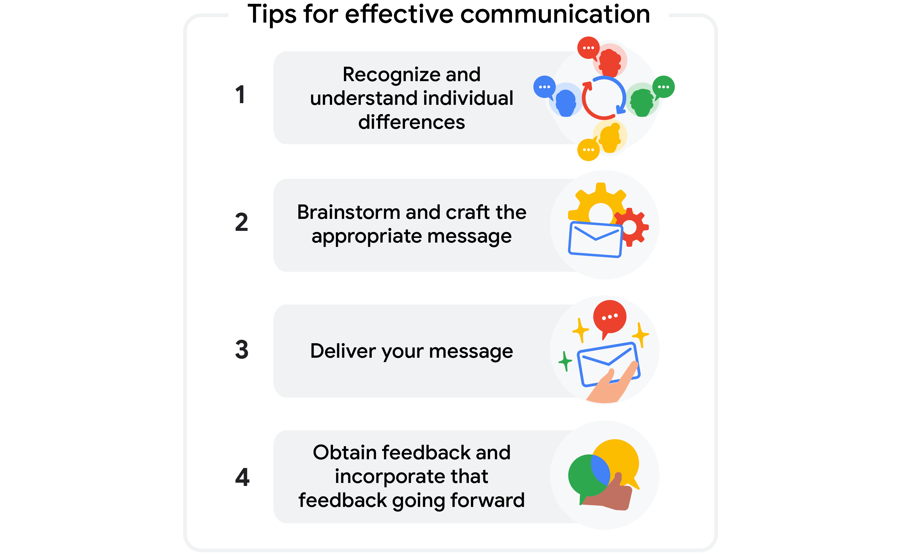

> Organizing communication and documentation
>
> 组织沟通和文件

You will learn the elements of a simple communication plan and how to draft-起草,草拟 and manage one, why documentation helps create project team visibility and accountability, how to organize documents in one central place, and how to prepare for a job search by documenting experience and highlighting transferable skills.

> 您将学习简单沟通计划的要素以及如何起草和管理计划，为什么文档有助于创建项目团队的可见性和问责制，如何在一个中心位置组织文档，以及如何通过记录经验和突出可转移技能来为求职做准备。

**学习目标**

- Draft a simple communication plan and explain how to manage it

	> 起草一个简单的沟通计划，并解释如何管理它

- Examine the elements of a communication plan that are vital-至关重要的,必不可少的 to project success.

	> 检查沟通计划中对项目成功至关重要的要素。

- Explain the value of documentation in creating visibility and accountability for team members.

	> 解释文档在为团队成员创建可见性和问责制方面的价值。

- Organize-整理 project documents in one centralized place.

	> 将项目文件集中整理。

- Prepare for a job search by documenting career-relevant experience and highlighting transferable skills. (Optional)

	> 通过记录与职业相关的经验和突出可转移的技能来为找工作做准备。(可选)

# Creating an effective communication plan

> 制定有效的沟通计划

## Introduction: Organizing communication and documentation

> 简介：组织沟通和文档

Welcome back.

We're in the last section of this course on planning, and it's finally time to tie-联系 together everything you've been working on.

> 这门课程的最后一部分是关于计划的，现在是时候把你一直在做的事情联系起来了。

So far, we've covered the key components of the planning stage: how to set a schedule, create and manage a budget, and how to identify and manage risks.

> 到目前为止，我们已经涵盖了计划阶段的关键组成部分：如何设置时间表，创建和管理预算，以及如何识别和管理风险。

Up next, I'll discuss the importance of project communication plans.

> 接下来，我将讨论项目沟通计划的重要性。

There are many ways to effectively communicate during the planning phase and beyond-到…之后.

> 在计划阶段及之后，有许多有效沟通的方法。

Here, I'll teach you some great communication strategies, and I'll show you how to create a successful communication plan for any project.

> 在这里，我将教你一些伟大的沟通策略，我将向你展示如何为任何项目创建一个成功的沟通计划。

Let's get started.

## Why communication is critical

> 为什么沟通很重要

Okay.

Let's start with an example.

Imagine you've planned a surprise party for your best friend's birthday.

> 想象一下，你为你最好的朋友的生日计划了一个惊喜派对。

You've been working on it for a month, and finally, it's the big day.

> 你已经准备了一个月了，终于到了重要的日子。

You show up at the restaurant-餐馆,饭店 where the party is happening, but there's an issue.

> 你出现在派对举行的餐厅，但有一个问题。

The host-主人 says the reservation was canceled because no one confirmed.

> 主人说预订被取消了，因为没有人确认。

A friend shows up with the birthday cake, but you'd asked them to bring cupcakes-纸杯蛋糕.

> 一个朋友带着生日蛋糕来了，但你让他们带纸杯蛋糕。

Another friend texts you saying they're **looking forward**-期待 to seeing everyone tomorrow night.

> 另一个朋友给你发短信说他们很期待明天晚上和大家见面。

Tomorrow?

And then, in the middle of all the confusion, you look over to see that your best friend has already been seated on the other side of the restaurant.

> 然后，在所有的混乱中，你看了看，你最好的朋友已经坐在餐厅的另一边。

Not exactly the surprise party you had in mind.

> 不是你想要的惊喜派对。

What happened?

Poor communication happened.

> 沟通不畅。

The friend who made the reservation-预订 forgot to tell you to confirm 24 hours in advance-预先的,事先的.

> 预定的朋友忘记告诉你提前24小时确认了。

The friend who ordered the cake never saw your email asking them to get cupcakes, and you assumed-假定,假设,认为 everyone in the group text message got the update that the party was on Friday, not Saturday.

> 预定蛋糕的朋友从来没有看到过你让他们买蛋糕的邮件，你以为短信群里的每个人都收到了聚会在周五而不是周六的最新消息。

Fortunately-幸运地, your best friend appreciate-理解,感激 the effort and was surprised anyway-而且.

> 幸运的是，你最好的朋友很感激你的努力，而且很惊讶。

But whilst-然而 you and your best friend can have a good laugh-笑料 about the party-planning breakdown-失败, if something like this happens at work, your boss and coworkers might not think the same.

> 但是，当你和你最好的朋友可以对派对计划的失败开怀大笑时，如果在工作中发生类似的事情，你的老板和同事可能不会这么想。

---

Communication is very important to every project.

> 沟通对每个项目都非常重要。

I'd even argue-主张,认为 that it's the most important tool in making sure your project runs smoothly.

> 我甚至认为，这是确保项目顺利进行的最重要的工具。

Many times, what contributes to the success or failure of a project team **comes down to**-归结为 whether or not everyone understands what's happening and how their tasks contribute to the project's goals.

> 很多时候，项目团队成功或失败的原因归结为是否每个人都理解正在发生的事情以及他们的任务如何为项目目标做出贡献。

As project manager, you play a big part in making sure everyone knows what their roles and tasks are.

> 作为项目经理，你在确保每个人都知道他们的角色和任务是什么方面发挥着重要作用。

You're also the person that team members come to when they're just in need of a quick answer.

> 当团队成员需要一个快速的答案时，你也是他们会去找的人。

Being able to communicate clearly and effectively is key.

> 能够清晰有效地沟通是关键。

It's important to remember that without effective communication, the project is at risk of missing important opportunities or even failing altogether-完全地.

> 重要的是要记住，如果没有有效的沟通，项目就有可能错过重要的机会，甚至完全失败。

During a project I recently-最近,不久前 worked on, my stakeholders allocated a few design specialists-专家 to work with me.

> 在我最近参与的一个项目中，我的利益相关者分配了一些设计专家与我一起工作。

In the first week of the project, I noticed that one specialist wasn't attending-出席,参加 any of the project meetings.

> 在项目的第一周，我注意到一个专家没有参加任何项目会议。

I decided to approach-交谈 the individual about their absence-缺席,缺勤.

> 我决定找那个人谈谈他们缺席的事。

When asked, they stated that they were well over capacity with the current workload and were unable to commit to the short deadlines I had been assigning.

> 当被问到这个问题时，他们说他们的工作量远远超过了他们的能力，而且无法在我指定的短期限内完成任务。

There were a couple of breakdowns in communication here.

> 这里的沟通出现了几次故障。

First, between a specialist and their manager, and second, between a specialist and me, the project manager.

> 首先，专家和他们的经理之间，其次，专家和我，项目经理之间。

Ideally, the specialist-专家 and their manager would have communicated better with each other about the specialist's ability to take on the workload.

> 理想情况下，专家和他们的经理应该就专家承担工作量的能力进行更好的沟通。

If I had not communicated with the specialist, their continued absence at meetings could have resulted in lots of lost time, the project being delayed, or not being able to deliver the project in a satisfactory-令人满意的,合适的 way.

> 如果我没有与专家沟通，他们继续缺席会议可能会导致大量的时间浪费，项目被推迟，或者不能以令人满意的方式交付项目。

As it turned out, we only ended up losing a week of work **due to**-由于,因为 the lack of communication.

> 事实证明，由于缺乏沟通，我们最终只损失了一个星期的工作。

However, since I followed up quickly, we were able to pivot-转动 and assign another specialist to the project.

> 然而，由于我跟进得很快，我们能够调整方向，指派另一名专家负责这个项目。

We know communication is very important, but what is communication exactly-究竟,到底?

> 我们知道沟通非常重要，但沟通到底是什么呢?

To put it simply, communication is the flow-流动 of information.

> 简单地说，沟通就是信息的流动。

It includes everything that's shared, how it's shared, and with whom. 

> 它包括所有共享的内容，如何共享，以及与谁共享。

Good effective communication is always clear, honest, relevant, and frequent, but not too frequent.

> 良好有效的沟通总是清晰、诚实、相关和频繁的，但不要过于频繁。

There is such a thing as information overload-超载.

> 信息超载是存在的。

Effective communication makes it possible for your project to run on time and up to the expectations outlined in the project plan. 

> 有效的沟通可以使你的项目按时运行，并达到项目计划中概述的期望。

Take **full advantage**-充分利用 of tools like meetings, emails, phone calls, written documents, and formal presentations-陈述,报告, and make sure they are accessible by everyone.	

> 充分利用会议、电子邮件、电话、书面文件和正式演示等工具，确保每个人都能访问它们。

It's also important to remember that communication is not a one-time event or one-way route-路线.

> 同样重要的是要记住，沟通不是一次性的事件或单向的路线。

It needs to happen throughout the entire life cycle of the project, from the project team and stakeholders, as well as from you.

> 它需要在项目的整个生命周期中发生，从项目团队和涉众，以及从您。

Be sure to clarify goals and client expectations, follow up on action items, and communicate delays as the project progresses. 

> 确保明确目标和客户期望，跟进行动项目，并在项目进展中沟通延迟。

This will help you avoid issues and setbacks-挫折,阻碍.

> 这将帮助你避免问题和挫折。

As the project manager, you're responsible for creating a consistent flow of communication throughout the project, setting the tone-风格,基调 for team communication and working to make sure everyone's on the same page, every step of the way, gives your project the best chance to succeed.

> 作为项目经理，你有责任在整个项目中建立一个一致的沟通流程，为团队沟通定下基调，并确保每个人都在同一页上，每一步都在努力，让你的项目有最好的成功机会。

Okay.

Hopefully, it's clear that communication is incredibly-难以置信地,非常地 important to manage a project.

> 希望大家都清楚，沟通对于管理项目是非常重要的。

Coming up, I'll show you how to make a communication plan that will help you manage all important communication.

> 接下来，我将向你展示如何制定一个沟通计划来帮助你管理所有重要的沟通。

See you in a bit.

## Tips for effective communication

> 有效沟通的技巧

In the previous videos, you learned that communication is key to any successful project.

As a project manager, you are central to that communication, which is an ongoing-持续存在的 process throughout the life cycle of a project.

> 作为一个项目经理，你是沟通的中心，这是一个贯穿项目生命周期的持续过程。

A good project manager must be effective in communicating with all stakeholders and team members through various mediums-媒介,方法,手段.

> 一个好的项目经理必须通过各种媒介与所有利益相关者和团队成员进行有效的沟通。

---

As the project manager, it is important to develop a communication plan for the duration of your project.

> 作为项目经理，在项目期间制定沟通计划是很重要的。

Good communication helps your project run smoothly, leads to better outcomes, and supports a healthy team culture.

> 良好的沟通有助于项目顺利进行，产生更好的结果，并支持健康的团队文化。

You can use these four tips to foster-促进,培养 effective communication within your team: 

> 你可以使用以下四个技巧来促进团队内部的有效沟通:

**Recognize and understand individual differences**

> 认识和理解个体差异

You can encourage open, inclusive-包括的,包含的 communication by:

> 你可以通过以下方式鼓励开放、包容的沟通:

- Not making assumptions about your audience’s-观众,听众 backgrounds, identities, or experiences. 

	> 不要对听众的背景、身份或经历做出假设。

- Being mindful-留心的,记住的 of your own biases-偏见,成见.

	> 注意自己的偏见。

- Using appropriate-合适的,相称的, professional, and neutral-中立的 language.

	> 使用适当的、专业的、中立的语言。

- Including, respecting, and being curious-好奇的,求知欲强的 about diverse-不同的,各式各样的 points of view.

	> 包容、尊重和好奇不同的观点。

As the project manager, you will undoubtedly-无疑,肯定 work with a diverse-不同的,各式各样的 group of team members and stakeholders on each project.

> 作为项目经理，您无疑将在每个项目中与不同的团队成员和利益相关者一起工作。

You will need to understand each team member’s background, experiences, perspectives-视角,观点, and biases--偏见,成见—as well as your own—to communicate effectively. 

> 你需要了解每个团队成员的背景、经验、观点和偏见——以及你自己的——才能有效地沟通。

**Brainstorm and craft-精心制作 the appropriate message**

> 集思广益，构思出合适的信息

Communicate the right message by thinking about your intended audience.

> 通过考虑你的目标受众来传达正确的信息。

With whom are you communicating?

> 你在和谁交流?

In your communications, always be clear about your reasons for reaching out:

> 在你的沟通中，一定要清楚你联系的原因:

- What channels can your audience use to contact you or the team? 

	> 你的受众可以通过什么渠道与你或团队联系?

- Are you conveying-输送,传输 information?

	> 你在传递信息吗?

- Are you asking for input?

	> 你是在征求意见吗?

- Are you clarifying an issue?

	> 你是在澄清一个问题吗?

- Are you resolving a problem?

	> 你是在解决问题吗?

Some team members may require detailed information, while others may only need an overview of the situation.

> 一些团队成员可能需要详细的信息，而其他人可能只需要对情况进行概述。

No matter your audience, you should be sure to identify the purpose of the message, state-陈述,说明 the information or request clearly and concisely-简明地,简洁地, and stay on topic. 

> 无论你的听众是谁，你都应该确定信息的目的，清楚而简洁地陈述信息或要求，并保持主题。

**Deliver your message**

> 传递你的信息

As you craft your message, think about which methods are available and appropriate for communicating with various members of your team, whether that is in person, in a video conference-会议,商讨,讨论, over the phone, via email, or in a meeting.

> 当你构思你的信息时，考虑一下哪些方法是可用的，适合与团队的不同成员沟通，无论是面对面、视频会议、电话、电子邮件还是在会议上。

Choosing the right method is especially important if you have team members or stakeholders in different regions and time zones.

> 如果您的团队成员或涉众在不同的地区和时区，那么选择正确的方法尤为重要。

Also, be sure to:

- Avoid including any sensitive-敏感的 or potentially private information. 

	> 避免包含任何敏感或潜在的私人信息。

- Assume everyone at the company will receive the communication.

	> 假设公司的每个人都会收到这封邮件。

**Obtain feedback and incorporate-包含,合并 that feedback going forward**

> 获得反馈，并将反馈纳入未来

Communication doesn’t end when you deliver your message, so be sure to follow up with your audience by:

> 沟通并不会在你传达信息后就结束，所以一定要通过以下方式跟进:

- Checking to make sure your message was clear.

	> 确认你的信息是否清楚。

- Asking them for feedback.

- Encouraging open communication.

	> 鼓励开诚布公的交流。

- Responding to questions quickly.

	> 快速回答问题。

In this final step, you will obtain feedback from your audience to ensure that your message was received as you intended-预期的,打算中的. 

> 在最后一步，你将从你的听众那里获得反馈，以确保你的信息被你想要的那样接收。

**Key takeaways**

You now have the steps to communicate effectively as a project manager!

You have learned how to foster-促进,培养 open, inclusive-包容 communication by recognizing and understanding individual differences among your team members.

> 你已经学会了如何通过认识和理解团队成员之间的个体差异来促进开放、包容的沟通。

You know how to craft and deliver an appropriate message and the importance of obtaining and addressing-处理 feedback.

> 你知道如何构思和传达合适的信息，以及获取和处理反馈的重要性。

Most importantly, make sure your communications are clear, honest, relevant, and frequent.

> 最重要的是，确保你的沟通清晰、诚实、相关且频繁。

Following these guidelines will set you up for successful communication throughout your projects. 

> 遵循这些指导方针将使您在整个项目中成功地进行沟通。

## Starting a communication plan

> 制定沟通计划

So far, you've learned some common ways of communicating during a project.

> 到目前为止，您已经学习了项目中一些常见的沟通方式。

Let's take that a step further by learning how to create a communication plan.

> 让我们进一步学习如何制定沟通计划。

That will help you manage all the different kinds of communication that will happen during a project.

> 这将帮助你管理项目中可能发生的各种交流。

Trust me, there's going to be a lot of communication, so you'll need a plan to help you stay aware of it all and to use as a tool for communicating effectively.

> 相信我，会有很多沟通，所以你需要一个计划来帮助你保持意识，并将其作为有效沟通的工具。

A communication plan organizes and documents the process, types, and expectations of communication for the project.

> 沟通计划组织并记录项目沟通的过程、类型和期望。

The size and complexity of your communication plan will be different for every project, but it is always good to have one. 

> 每个项目的沟通计划的大小和复杂程度都会有所不同，但有一个沟通计划总是好的。

Especially with multiple stakeholders, different phrases-短语,词组 and change management are involved.

> 特别是对于多个涉众，涉及到不同的短语和变更管理。

It will really help you, your project, and the stakeholders.

> 它将真正帮助您、您的项目和涉众。

Just like other plans related to the project, your communication plan needs to address these questions: what needs to be communicated, who needs to communicate, when communication needs to happen, why and how to communicate, and where the information communicated is stored-储存.

> 就像其他与项目相关的计划一样，您的沟通计划需要解决这些问题:需要沟通什么，谁需要沟通，何时需要沟通，为什么以及如何沟通，以及沟通的信息存储在哪里。

Let's break down each question with a sample communication plan that I've created for our Plant Pals project.

> 让我们用我为我们的植物伙伴项目创建的一个示例沟通计划来分解每个问题。

---

First off, your communication plan should include what you're communicating on, or in other words, the type of communication. 

> 首先，你的沟通计划应该包括你要沟通的内容，或者换句话说，沟通的类型。

This could include things like status updates, issues, feedback from users, daily check-ins, and other types of project meetings. 

> 这可能包括状态更新、问题、用户反馈、每日签到和其他类型的项目会议。

Then, you need to identify who you communicate with.

> 然后，你需要确定你的沟通对象。

These are recipients-接受的,容纳的 of the information, like key stakeholders and the core project team.

> 这些是信息的接收者，如关键涉众和核心项目团队。

For each type of communication, record when to communicate.

> 对于每种类型的通信，记录何时进行通信。

This includes the frequency-频繁,频率, which is how often you'll communicate, and key dates like deadlines or major meetings.

> 这包括频率，也就是你沟通的频率，以及关键的日期，比如截止日期或重要会议。

---

One thing to keep in mind is that not everyone needs to receive the same amount of information at the same time.

> 要记住的一件事是，不是每个人都需要在同一时间接收相同数量的信息。

Generally speaking, your key stakeholders will get their information less often, like in a monthly, high-level summary, email, or project review meeting,but your core project team could receive more detailed info through daily email updates or quick virtual-虚拟的,模拟的 check-ins.

> 一般来说，您的关键干系人获得信息的频率较低，比如通过每月的高层总结、电子邮件或项目评审会议，但您的核心项目团队可以通过每日电子邮件更新或快速虚拟签到获得更详细的信息。

---

Next, include how you're communicating or what delivery method you'll use.

> 接下来，包括你是如何沟通的，或者你将使用什么交付方式。

This could be email, in-person, or virtual meetings, or a formal presentation.

> 这可以是电子邮件、面对面、虚拟会议或正式的演示。

Your plan also needs to include the goal of communicating.

This is your "why."

So ask yourself: why are you communicating?

> 所以问问你自己:你为什么要交流?

Is it to give a progress update, identify a risk, and address barriers?

> 是更新进度、识别风险和解决障碍吗?

Or perhaps-可能 you need to figure out next steps, detailed preparation-准备 plans, and reflect-反省 on lessons learned.

> 或者，你需要想出下一步，详细的准备计划，并反思吸取的教训。

The goal of communication could be a combination of any of these or some other reason altogether.

> 交流的目标可能是上述任何一个原因的结合，也可能是其他一些原因的结合。

---

In either case, there must be a purpose for communicating, otherwise-否则,不然 you risk wasting valuable time. 

> 无论哪种情况，都必须有一个交流的目的，否则你可能会浪费宝贵的时间。

Finally, include where communication resources are located, along with any other notes.

> 最后，包括通信资源的位置，以及任何其他注释。

I'll talk more about best practices for storing information in the next video, but for now, try to remember that relevant information should be easily accessible.

> 我将在下一个视频中更多地讨论存储信息的最佳实践，但是现在，请记住相关信息应该易于访问。

So that you, your stakeholders, and your team can quickly find the resources they need to make decisions, work on tasks, get caught up, or provide updates.

> 这样，您、您的涉众和您的团队就可以快速找到他们需要的资源，以便做出决策、完成任务、赶上进度或提供更新。

One more benefit to an effective communication plan is that it allows for continuity of the project's operations.

> 有效的沟通计划的另一个好处是，它允许项目操作的连续性。

If a new project manager comes on to the project and sees the plan, they should be able to quickly access past meeting notes and documentation, as well as current and upcoming communications.

> 如果新的项目经理进入项目并看到计划，他们应该能够快速访问过去的会议记录和文档，以及当前和即将进行的通信。

The communication plan also helps with effective change management, the process of delivering your final project and getting it successfully implemented.

> 沟通计划还有助于有效的变更管理，交付最终项目并使其成功实施的过程。

When others have access to the communication plan after you leave the project, they'll be able to fix any problems that might come up, make decisions, or apply similar processes to a new project.

> 当其他人在你离开项目后可以访问沟通计划时，他们将能够解决可能出现的任何问题，做出决策，或者将类似的过程应用到新项目中。

Hopefully, by now you're feeling more familiar with the ways a communication plan can lead your project to success.

> 希望到目前为止，您已经对沟通计划如何引导您的项目取得成功感到更加熟悉。

Keep in mind this is just a basic plan, and there are lots of other ways to structure one.

> 记住，这只是一个基本的计划，还有很多其他的方法来构建一个计划。

It all depends on what kind of project you're working on.

> 这完全取决于你在做什么样的项目。

Up next, I'll take you through the details of a communication plan and show you how to use it to manage project communications effectively and efficiently.

> 接下来，我将带你了解沟通计划的细节，并向你展示如何使用它来有效地管理项目沟通。

## Developing a communication plan

> 制定沟通计划

Now that you know what a communication plan is and the basic categories that go in it, the next step is filling in your plan.

> 既然你知道了什么是沟通计划，以及沟通计划的基本类别，下一步就是填写你的计划。

In this video, you'll learn how to set up a communication plan that works best for all the different people involved with your project and what kind of information to include in your plan.

> 在这段视频中，你将学习如何制定一个沟通计划，最适合参与你项目的所有不同的人，以及你的计划中应该包括什么样的信息。

Things like: who needs to be involved in the project communication?

> 比如：谁需要参与项目沟通?

What's the best way to communicate?

> 最好的沟通方式是什么?

Why are you communicating?

> 你为什么要交流?

How often should you communicate?

> 你应该多久沟通一次?

There are few key benefits to planning your communications **up front**-预先,在最前面.

> 提前计划沟通有几个关键的好处。

Creating a communication plan helps improve the overall effectiveness-有效性,效力 of communication, keeps people engaged and motivated throughout the project, and gets stakeholders involved in effective conversations-谈话,交谈.

> 创建沟通计划有助于提高沟通的整体有效性，在整个项目中保持人们的参与和积极性，并使涉众参与到有效的对话中。

Let's try building a sample communication plan so you can see how it helps with managing the different aspects of project communication.

> 让我们尝试构建一个示例沟通计划，这样您就可以看到它如何帮助管理项目沟通的不同方面。

We'll continue with the Office Green Plant Pals Project.

> 我们将继续办公室绿色植物伙伴计划。

Here's an example of a basic communication plan using a spreadsheet.

> 下面是一个使用电子表格的基本沟通计划的例子。

Before anything else, think about what types of communication you'll be using throughout your project.

> 在做其他事情之前，考虑一下在整个项目中你将使用什么类型的沟通。

**Feel free**-随意 to refer back to your RACI chart and stakeholder map, which are tools that will help you figure out what type of communication might work best for each person, group, or role.

> 请随意参考您的RACI图表和涉众图，这些工具将帮助您确定哪种类型的沟通可能最适合每个人、团队或角色。

In this example, let's say the stakeholders are busy senior executives-主管,经理 who may not need day-to-day details.

> 在这个例子中，假设涉众是忙碌的高级管理人员，他们可能不需要日常细节。

Instead of daily meetings, it's better to send a newsletter-通讯,简报 that summarizes key milestones and project progress to date.

> 与其每天开会，不如发送一份简报，总结到目前为止的关键里程碑和项目进展。

Let's type that in.

> 我们把它输入。

The core team, on the other hand, may benefit from a daily stand-up, which is a daily meeting **designed to**-旨在 bring everyone up to date on key information.

> 另一方面，核心团队可能会受益于每日站立会议，这是一种旨在使每个人都了解关键信息的每日会议。

Here, each team member briefly describes any completed work and any barriers that stand in their way.

> 在这里，每个团队成员简要地描述任何完成的工作和任何阻碍他们的障碍。

This is common in Agile project management, as it helps the team stay coordinated and move quickly throughout the project.

> 这在敏捷项目管理中很常见，因为它有助于团队保持协调，并在整个项目中快速移动。

We will go ahead and enter daily stand-ups in this row.

> 我们将继续在这一行输入每日站会。

But sometimes daily meetings aren't possible, given time zone restrictions-限制,约束 or other obligations-责任,义务.

> 但有时由于时区限制或其他义务，每天开会是不可能的。

Don't worry, there are other ways to keep communication flowing.

> 别担心，还有其他方法可以保持沟通顺畅。

For example, the project team that created this program had daily email status updates for the whole team to report which action items were being worked on for the day.

> 例如，创建此计划的项目团队每天都有电子邮件状态更新，供整个团队报告当天正在处理的操作项。

They also used a project tracker for tasks and milestones to make sure everyone is on the same page.

> 他们还对任务和里程碑使用了项目跟踪器，以确保每个人都在同一页面上。

---

Next up, think about who needs to receive information about your project.

> 接下来，想想谁需要收到关于你的项目的信息。

These are the communication recipients.

> 这些是沟通的接受者。

It helps to look back to the stakeholder map and RACI chart again.

> 再次回顾涉众图和RACI图会有所帮助。

Ask yourself, who needs to be heavily-大量地 involved in the details?

> 问问你自己，谁需要大量参与细节?

Who has high interest in the project?

> 谁对这个项目有很高的兴趣?

Who needs only to be informed of major milestones?

> 谁只需要被告知主要的里程碑?

I already mentioned that key stakeholders would be receiving a monthly newsletter, so I'll type that in now.

> 我已经提到过，关键的利益相关者将会收到一份每月的时事通讯，所以我现在就把它输入。

Also, we know that the core team will be participating in daily stand-ups, so I'll add that in as well.

> 此外，我们知道核心团队将参与日常的站立对话，所以我也将添加这一点。

Excellent-太好了,极好的,卓越的.

We're moving right along.

> 我们一直在前进。

Next up in recipients are the project subgroups-子组,分成小组 for marketing, procurement-采购, and product development.

> 接下来的接收者是营销、采购和产品开发的项目子组。

Let's add separate-单独的,分开的 meetings in for each of those groups **in addition to**-除了...之外 the core team meetings.

> 除了核心团队会议之外，让我们为每个小组添加单独的会议。

Since those subgroups are not part of the core team, you might only want to meet with them weekly instead of every day.

> 由于这些子小组不是核心团队的一部分，您可能只想每周与他们会面，而不是每天。

Let's add weekly check-in to each of these.

> 让我们将每周签到添加到每一个。

Great.

Another best practice is to list contact information and time zones in your communication plan.

> 另一个最佳做法是在沟通计划中列出联系方式和时区。

That way, you know when people are available for communicating.

> 这样，你就知道人们什么时候可以交流。

Let's add that in.

Feel free to hide this column since it contains sensitive-敏感的,保密的 information about people involved in your project.

> 请随意隐藏此专栏，因为它包含有关项目中涉及的人员的敏感信息。

There are other ways to list contact information privately and link it for easy reference.

> 还有其他方法可以私下列出联系信息，并将其链接起来以方便参考。

I'll teach you how to do that in another video.

If you're having trouble deciding which type of communication to use, one way to help you choose is by thinking about the frequency.

> 如果你在决定使用哪种类型的交流时遇到困难，一个帮助你选择的方法就是考虑频率。

As I mentioned earlier, a senior stakeholder probably won't be able to attend-参加 daily meetings, and they don't need every piece of information.

> 正如我前面提到的，高级涉众可能无法参加每天的会议，他们也不需要每一条信息。

Instead-反而,相反, you can communicate with a senior stakeholder on a weekly or monthly basis and you can focus on high-level status updates like overall progress, recent-最近的,最新的 wins, or milestones reached, and current metrics.

> 相反，您可以每周或每月与高级利益相关者进行沟通，您可以关注高级状态更新，如总体进展，最近的胜利，或达到的里程碑，以及当前的指标。

In this case, let's send out the project newsletter once a month.

> 这样的话，我们每月发一次项目通讯吧。

If you're unsure, it's always great to ask senior stakeholders which method of communication works best for them.

> 如果你不确定，最好问问高级利益相关者，哪种沟通方式最适合他们。

When you work with your core team on a project, you need to get into more of the day-to-day details.

> 当你和你的核心团队在一个项目上合作时，你需要了解更多的日常细节。

Check in regularly and ask how everything is going.

> 定期检查并询问一切进展如何。

How they're doing on tasks?

> 他们完成任务的情况如何?

Do they need your help with anything?

> 他们需要你帮忙吗?

Add in a daily meeting for your core team and a weekly meeting for the subgroups.

> 为核心团队添加每日会议，为子小组添加每周会议。

Let's make that happen.

Great.

Meeting more frequently can help un-block issues and keep the project on the right track.

> 更频繁地会面可以帮助解决问题，并使项目保持在正确的轨道上。

---

This leads-引出 us to key dates.

> 这就引出了关键的日期。

Listing key dates and times are important for coordination.

> 列出关键的日期和时间对协调很重要。

For example, if you're launching a product or new process or giving a presentation, you should list the key dates.

> 例如，如果你要发布一个产品或新流程，或者要做一个演讲，你应该列出关键日期。

Keep in mind, not every type of communication needs a specific key date listed.

> 请记住，并不是每种类型的通信都需要列出特定的关键日期。

For example, with daily or weekly communications, you might not need to specify the actual date every week.

> 例如，对于每日或每周通信，您可能不需要指定每周的实际日期。

You could just list every Monday or something like that.

> 你可以只列出每周一或类似的时间。

Let's add in key dates to our plan.

For the monthly newsletter, let's send that on the first Monday of every month.

> 对于每月的时事通讯，让我们在每个月的第一个星期一发送。

Let's schedule the daily stand-ups at noon-正午,中午 and the weekly check-ins are on Wednesdays at two, three, and four o'clock.

> 让我们把每天的站立活动安排在中午，每周的报到安排在星期三的两点、三点和四点。

Wonderful.

---

Now let's talk about delivery methods, like email, in-person and virtual meetings, a shared document that gets updated regularly, or a progress report that gets presented-递交.

> 现在让我们谈谈交付方法，比如电子邮件、面对面和虚拟会议、定期更新的共享文档，或者提交的进度报告。

Deciding the best way to communicate is a skill.

> 决定最好的沟通方式是一项技能。

One thing I continuously-连续不断地,不断 need to adapt-适应,调整 and work to improve in my role as project manager is communicating among different teams and levels of authority.

> 作为项目经理，我需要不断适应和改进的一件事是不同团队和不同级别的权威之间的沟通。

A director-董事 or executive-主管 may only have five minutes, so I need to be concise-简明的,简洁的 and know exactly what I need from them.

> 董事或高管可能只有五分钟的时间，所以我需要简洁明了，并确切地知道我需要从他们那里得到什么。

Likewise-同样地,类似地, I might be used to communicating via-通过,经由 instant-立刻的,马上的 message and video chat with my core team.

> 同样，我可能习惯于通过即时消息和视频聊天与我的核心团队进行交流。

However, one of the subgroups on the project might respond-回应 better to emails and in-document comments.

> 然而，项目中的一个小组可能会对电子邮件和文档中的评论做出更好的回应。

Let me add in these methods for our communication plan, starting with email.

> 让我在我们的沟通计划中加入这些方法，从电子邮件开始。

Emails are a very common way to get people in sync, but write too much and you may lose your audience.

> 电子邮件是让人们保持同步的一种非常常见的方式，但写得太多可能会失去你的听众。

**After all**-毕竟,终究, no one really wants to read a two-page email.

> 毕竟，没有人真的想阅读两页纸的电子邮件。

One way to get around this is by adding a note at the top of your email.

> 解决这个问题的一个方法是在你的电子邮件顶部添加一个注释。

This will alert readers that some details of a long email may not be relevant to them.

> 这将提醒读者，长邮件的某些细节可能与他们无关。

With this kind of email, lead with key points and action items limited to two to three sentences-句子,句.

> 对于这种类型的电子邮件，以两到三句话为重点和行动项目。

Then include a longer section at the bottom for those who want or need additional details.

> 然后在底部为那些想要或需要更多细节的人提供更长的部分。

The goal of communicating is getting your point across-遍及 effectively.

> 沟通的目标是有效地表达你的观点。

Think carefully about what you need to accomplish with each type of communication.

> 仔细考虑你需要通过每种类型的沟通来完成什么。

For high-level stakeholders in particular, I'm constantly trying to answer, so what?

> 特别是对于高层利益相关者，我一直在试图回答，那又怎样?

Why should they care about my project?

> 他们为什么要关心我的项目?

The same goes for my core team.

> 我的核心团队也是如此。

What information is going to help make sure they complete tasks on time and stay motivated?

> 什么样的信息可以帮助他们按时完成任务并保持积极性?

Thinking about these questions helps me focus on the most important bits of information to share.

> 思考这些问题有助于我把注意力集中在最重要的信息上。

Let's fill this in in the communication plan.

The goal of the monthly newsletter for stakeholders is to give a status update overview.

> 为利益相关者提供月度通讯的目标是提供状态更新概述。

Great.

Goals for the daily stand-ups with the core team would be to report progress updates, blockers, and determining next steps.

> 与核心团队的日常站立会议的目标是报告进度更新、障碍和确定下一步。

Let's add those in as well.

> 把这些也加进去。

All set.

---

Next, you need to make sure you're able to reach everyone you need to communicate with.

> 接下来，你需要确保你能够接触到每一个你需要沟通的人。

It helps if communication is a team effort, especially on more complex projects.

> 如果沟通是一个团队的努力，尤其是在更复杂的项目中，这是有帮助的。

You shouldn't be the only one communicating.

> 你不应该是唯一一个交流的人。

You want to enable other team members to be involved in communications, based on their expertise in the project.

> 您希望其他团队成员能够基于他们在项目中的专业知识参与交流。

I'll add a column for sender and owner to indicate who is responsible for each communication.

> 我将为发件人和所有者添加一列，以指示谁负责每个通信。

Then highlight the sender or owner for each of these communication types, starting with the project manager as the sender for the newsletter.

> 然后突出显示每种通信类型的发送者或所有者，从项目经理作为新闻通讯的发送者开始。

---

Great.

We are all done.

Keep in mind, it's always a good idea to check in with everyone to make sure communications meet their needs.

> 请记住，与每个人联系以确保沟通满足他们的需求总是一个好主意。

Everyone absorbs-吸收,汲取 information differently; what works best for you doesn't always work best for others.

> 每个人吸收信息的方式不同;对你最有效的并不总是对别人最有效。

Some people are more visual-视觉的,视力的 and want to see charts and graphs.

> 有些人更注重视觉，想看图表。

Some people might prefer to listen to information through a presentation or a meeting.

> 有些人可能更喜欢通过演示或会议来听取信息。

Some people may want to review and analyze information on their own first, and then speak with someone about what they've read.

> 有些人可能想先自己复习和分析信息，然后和别人谈谈他们读过的东西。

If you're only presenting-出现,呈现 information in just one or two ways, you risk engaging some people but not others.

> 如果你只以一种或两种方式呈现信息，你可能会吸引一些人，而不是其他人。

Your goal as project manager is to optimize-优化,充分利用 and streamline-精简 communications.

> 作为项目经理，你的目标是优化和简化沟通。

A great way to optimize your communications for everyone on the team is by sending a brief email or survey-考察,调查 that asks three questions.

> 为团队中的每个人优化沟通的一个好方法是发送一个简短的电子邮件或调查，询问三个问题。

What is working in how we communicate with you about the project?

> 我们与您就项目进行沟通的方式是什么?

What is not working or is not effective in our communications?

> 在我们的沟通中，什么是不起作用或无效的?

Where can we improve our communications with you?

> 我们在哪些方面可以改善与您的沟通?

This will give you plenty-富裕,充裕 of useful information on how you can adapt the communication style to cater-满足,迎合 to each team member. 

> 这将给你提供大量有用的信息，告诉你如何调整沟通风格以迎合每个团队成员。

Communication plans contain a lot of important information and there are so many different ways to set one up, depending on the size of your team and the needs of your project.

> 沟通计划包含很多重要的信息，根据团队的规模和项目的需要，有很多不同的方法来制定沟通计划。

Whichever system you choose to use, the most important thing is to make sure your communication plan clearly identifies who needs to be involved in project communication.

> 无论您选择使用哪种系统，最重要的是确保您的沟通计划清楚地确定谁需要参与项目沟通。

What methods are being used to communicate, why are you communicating, and how often you are communicating?

> 用什么方法进行沟通，为什么要沟通，多久沟通一次?

That **wraps up**-结束,完成 our discussion on how to effectively fill in a communication plan.

> 关于如何有效填写沟通计划的讨论到此结束。

---

In the next video, I'll share with you some best practices for documenting all the information you and your team will be communicating throughout the project.

> 在下一个视频中，我将与您分享一些最佳实践，用于记录您和您的团队将在整个项目中交流的所有信息。

See you in a bit.

## Best practices for building a communication plan

> 制定沟通计划的最佳实践

In the previous video, you learned how to develop a basic communication plan.

You also learned how to document who needs to be involved in project communication, how to communicate with them, why you are communicating, and how often that communication should occur. 

In this reading, we will reinforce-加强,强化 the top tips to keep in mind when creating a communication plan to ensure that it is an effective tool for you and your project team.

> 在本文中，我们将强调在制定沟通计划时要牢记的重要提示，以确保它对你和你的项目团队来说是一个有效的工具

**Tips for creating your communication plan** 

**Identify, identify, identify**

> 认同，认同，再认同

Before you begin creating the plan, answer these questions to ensure that you have all of the relevant information:

> 在开始制定计划之前，请先回答以下问题，以确保掌握所有相关信息:

- **Project stakeholders**: Have you created a RACI chart or stakeholder map of all your stakeholders? Who is your audience? Who will need to be informed at different points during the project life cycle?

	> **项目干系人**:您是否创建了所有干系人的RACI图表或干系人地图?谁是你的听众?在项目生命周期的不同阶段，需要通知哪些人?

- **Communication frequency and method**: When and how often should you check in with your stakeholders? What methods of communication do they prefer? How much detail does each stakeholder need? 

	> **沟通频率和方法**:何时以及多久与利益相关者进行一次沟通?他们喜欢什么样的交流方式?每个涉众需要多少细节?

- **Goals**: What is the goal of your communication? Do you need a response? Are you trying to encourage engagement or simply providing an update? 

	> **目标**:你沟通的目标是什么?你需要回复吗?你是想鼓励用户参与还是只是提供更新?

- **Barriers**: Are there any time zone limitations? Language barriers? Do some stakeholders require time to reply-回答,答复 or respond (e.g., an executive)? Are there any privacy-隐私 or internet access issues? 

	> **障碍**:是否有时区限制?语言障碍吗?是否有些干系人需要时间来回复或回应(例如，执行人员)?是否有隐私或上网问题?

**Document and develop**

> 文档和开发

Choose a tool or template to document all of your communication needs, and begin developing your plan.

Once you understand the basic elements (stakeholders, communication methods, goals, and barriers), it’s time to work out the details! Here are some tips:

> 一旦你理解了基本要素(涉众、沟通方法、目标和障碍)，就该研究细节了!以下是一些建议:

- **Add a column for notes.**  Project management is not one-size-fits-all, and there are a lot of pieces that need to be tracked. For instance, if you are reaching out to a senior leader or executive, do you need to copy anyone else on the email? If a stakeholder is out of office or unavailable on certain dates, do you have a backup plan? Add notes to set reminders and any additional relevant details.

	> **增加一列笔记。**项目管理不是放之四海而皆准的，有很多部分需要跟踪。例如，如果你要联系一位高级领导或高管，你是否需要在电子邮件中复制其他人的邮件?如果某个干系人不在办公室或在特定日期无法使用，你是否有备用计划?添加备注设置提醒和任何额外的相关细节。

- **Use formatting to highlight any key details in the plan.**  Is there a launch announcement-公告,宣布 or an urgent-紧急的,急迫的 decision needed for the project to move forward? Highlight these pivotal-中枢的,关键的 elements in a different font color or size to stress their importance.

	> **使用格式来突出显示计划中的任何关键细节。**是否需要发布公告或紧急决定来推进项目?用不同的字体颜色或大小来突出这些关键元素，以强调它们的重要性。

- **Ensure that the team can access your document.**  Share the plan with your team. Allowing your team to review the document ensures that they are aware of the plan and gives them a chance to offer feedback. Sharing the document also **serves as**-作为…的用途 an extra check to make sure you aren’t missing any crucial pieces.

	> **确保团队可以访问您的文档。**与你的团队分享计划。允许你的团队审查文档，确保他们了解计划，并给他们提供反馈的机会。分享这份文件还可以作为额外的检查，确保你没有遗漏任何关键的部分。

- **Test your plan.**  If you are sending a team-wide email or link, send a test email to yourself or a colleague-同事,同僚. If you are planning a virtual presentation, be sure to test the visual, audio, and other technical aspects in advance. That way, you can minimize any technical problems. 

	> **测试你的计划。**如果你要发送一个团队范围的邮件或链接，给你自己或同事发一封测试邮件。如果您计划进行虚拟演示，请务必提前测试视觉、音频和其他技术方面的内容。这样，您可以最小化任何技术问题。

**Check in**

> 登记

Once your communication plan is out in the world, check in with your audience about the effectiveness of your plan.

> 一旦你的沟通计划在世界上发布，与你的听众确认你的计划的有效性。

Scheduling routine-常规,惯例 check-ins will help you understand what is and is not working so you can improve your plan.

> 安排例行检查将帮助你了解什么是有效的，什么是无效的，这样你就可以改进你的计划。

You want to ensure that your communication plan gets the right information to the right stakeholders at the right time. 

> 您希望确保您的沟通计划在正确的时间将正确的信息传递给正确的涉众。

Additionally, make sure to double check that key stakeholders have not changed over time. 

> 此外，要确保反复检查关键利益相关者没有随着时间的推移而改变。

Evaluate where you may be over- or under-sharing information or missing stakeholders.

> 评估你可能在哪些方面分享信息过多或不足，或者遗漏了利益相关者。

You can do this through:

- Anonymous-匿名的,不知名的 survey forms 

	> 匿名调查表格

- Polls or open feedback sessions during team meetings

	> 在团队会议期间进行投票或公开反馈

- One-on-one conversations and check-ins-签到 with key stakeholders

	> 与关键涉众进行一对一的对话和签到

Keep these tips in mind as you build your next communication plan and you will be set for communication success! 

> 当你制定下一个沟通计划时，请记住这些建议，你将为沟通成功做好准备!

# Documenting project planning resources

> 记录项目计划资源

## The value of project documentation

> 项目文档的价值

Great to see you again.

Now that you're here, let's talk about the importance of documentation and how it serves as a form of communication for others to reference and contribute to.

> 既然您已经到了这里，让我们来谈谈文档的重要性，以及它如何作为一种交流形式供其他人参考和贡献。

I'll share an example with you.

Once I worked on a project that involved several teams from quality assurance-保证,确保,保险, testing, design, partner engineering, and program managers.

> 有一次，我参与了一个项目，涉及到来自质量保证、测试、设计、合作伙伴工程和项目经理的几个团队。

Each team was responsible for their own set of deliverables.

> 每个团队负责他们自己的可交付成果集。

To keep all teams on the same page, it was important for everyone to store their plans and reports in one centralized place.

> 为了让所有团队保持一致，每个人都将他们的计划和报告存储在一个集中的地方是很重要的。

This allowed any team member to quickly find the documents they needed.

> 这允许任何团队成员快速找到他们需要的文档。

Documentation storage and sharing is very important.

> 文档存储和共享非常重要。

Having plans in one place makes communication quicker, easier-更简单, and more streamlined-顺畅的 because everyone knows where to find any information they need.

> 把计划放在一个地方会让沟通更快捷、更容易、更流畅，因为每个人都知道在哪里找到他们需要的任何信息。

Just as important is making sure your files are stored with clear labels or organized into folders.

> 同样重要的是确保你的文件有清晰的标签或组织到文件夹中。

For example, on my team, we have certain reports stored in one central place.

> 例如，在我的团队中，我们将某些报告存储在一个中心位置。

This makes it easier for teams in different countries to find and share their research with each other, which optimizes workflow and reduces duplicate work.

> 这使得不同国家的团队更容易找到并相互分享他们的研究，从而优化了工作流程并减少了重复工作。

Documenting and organizing plans also provides visibility and accountability.

> 记录和组织计划还提供了可见性和责任性。

Your project plan is a great example of this.

> 你的项目计划就是一个很好的例子。

Each task has an owner and a due date.

This creates visibility for the members of the project team and accountability for the task owner.

> 这为项目团队成员创建了可见性，并为任务所有者创建了责任制。

It's common for members of the team and senior stakeholders to reference your project plan and associated-相关的 documents when they need a refresher-补习课程,复习 on timelines or milestones.

> 当团队成员和高级干系人需要对时间表或里程碑进行复习时，他们通常会参考您的项目计划和相关文档。

Having up-to-date plans will help ensure there's no room for misinterpretation-误解,误释 or miscommunication.

> 有最新的计划将有助于确保没有误解或误解的余地。

---

Once you've created a centralized location for your documents, it's time to think about managing permissions of your files and folders.

> 一旦为文档创建了一个集中的位置，就该考虑管理文件和文件夹的权限了。

If someone isn't a core part of the project team, you might not want them to have full access to all of the meeting notes.

> 如果有人不是项目团队的核心成员，您可能不希望他们完全访问所有会议记录。

Instead, summarize the relevant information into a status report for those who need to stay informed of final outcomes but don't need all background information.

> 相反，将相关信息总结成一份状态报告，供那些需要了解最终结果但不需要所有背景信息的人使用。

There's another big benefit to setting up your project plans and centralizing them in one place: continuity-连续性.

> 建立项目计划并将其集中在一个地方还有一个很大的好处:连续性。

As the project manager, there could be times when you need to suddenly-突然地,出乎意料地 leave the project.

> 作为项目经理，有时您可能需要突然离开项目。

Say you got sick, transferred to another project, or needed to take **a leave of absence**-休假.

> 比如说你生病了，被调到另一个项目，或者需要请假。

Another project manager may need to step in, and if all the project information is scattered-分散的,零散的 across unorganized-无组织的,无条理的 personal notes, it's not very helpful.

> 另一个项目经理可能需要介入，如果所有的项目信息都分散在杂乱无章的个人笔记中，这不是很有帮助。

But if you documented all the plans in one place, the new project manager can find everything they need and pick up right where you left off.

> 但是如果你在一个地方记录了所有的计划，新的项目经理可以找到他们需要的一切，并从你离开的地方开始。

It's always useful to store guides, manuals-使用手册,说明书, meeting notes, plans, and processes all in a centralized place and clearly labeled. 

> 把指南、手册、会议记录、计划和流程都放在一个集中的地方，并清晰地贴上标签，总是很有用的。

You'll also want to make sure the people in relevant roles are granted-授予,给予 access to those documents.

> 您还需要确保具有相关角色的人员被授予访问这些文档的权限。

So even if you're not present, the project can carry on.

> 所以即使你不在场，项目也可以继续进行。

As project manager, it's your job to ensure that project data can be accessed in the future by others.

> 作为项目经理，确保项目数据在未来可以被其他人访问是你的工作。

Documenting your plans and making them available is part of a project management best practice called knowledge management.

> 记录您的计划并使其可用是称为知识管理的项目管理最佳实践的一部分。

If someone needs to review this project for making decisions or planning similar projects, they should be able to easily access the information they need.

> 如果有人需要审查这个项目以做出决策或计划类似的项目，他们应该能够轻松地访问他们需要的信息。

It also helps set the tone for future projects and future project managers, which can be incredibly-难以置信地,非常地 helpful if you happen to be the one jumping onto a new project.

> 它还有助于为未来的项目和未来的项目经理定下基调，如果你恰好是一个新项目的发起人，这将非常有帮助。

For example, if an architect-建筑师,设计师 is working on a kitchen-厨房 remodel and they want to make a decision about the design, they can look at the old project plans to understand why the decision was made to put the sink-水槽,水池 in a certain location.

> 例如，如果建筑师正在进行厨房改造，他们想要对设计做出决定，他们可以查看旧的项目计划，以了解为什么决定将水槽放在某个位置。

Or if a new architect comes in halfway through the remodel, they might want to know why the other architect designed the plumbing-管路系统,管道设备 a certain way.

> 或者，如果一个新建筑师在改造过程中进来，他们可能想知道为什么其他建筑师会以某种方式设计管道。

By looking at the old plans, they can go back and get the information and context they need to move forward with more informed-明智的 decisions.

> 通过查看旧的计划，他们可以回过头来获取他们需要的信息和背景，从而做出更明智的决定。

It's also important to determine what kind of information to share with whom and when.

> 决定什么时候和谁分享什么样的信息也很重要。

Focus on the key information related to what specific individuals need to know.

> 关注与特定个人需要知道的相关的关键信息。

Think about this scenario: a project manager who is working with all the VPs at their company decides to send out daily updates. 

> 考虑一下这个场景：一个项目经理与公司的所有副总裁一起工作，他决定发送每日更新。

From a communication standpoint-立场,观点,角度, what could be the potential impact of the project manager's decision?

> 从沟通的角度来看，项目经理决策的潜在影响是什么?

Well, since VPs get lots of e-mails, they're not likely to read the updates.

> 因为副总裁会收到很多电子邮件，他们不太可能会阅读更新。

That ends up being a waste of time for you.

> 这对你来说就是浪费时间。

Also, when you send a lot of unnecessary information, then it's hard to tell what's really important.

> 此外，当你发送大量不必要的信息时，就很难分辨出什么是真正重要的。

Figuring out the right information to share is even more important when you're working on projects that have sensitive data.

> 当您在处理包含敏感数据的项目时，找出要共享的正确信息更为重要。

In those cases, you need to be very careful of how you share information about your project with stakeholders who do not have permissions to view sensitive data.

> 在这些情况下，您需要非常小心如何与没有权限查看敏感数据的涉众共享项目信息。

For example, financial-财务 data or user survey results are often highly sensitive and should never be made available to unauthorized viewers.

> 例如，财务数据或用户调查结果通常是高度敏感的，不应该向未经授权的查看者提供。

Here's another scenario: let's say your team is working on a high-profile launch of a brand new product, say, an electric car.

> 下面是另一个场景：假设你的团队正在高调发布一款全新的产品，比如一款电动汽车。

Most people don't need to know all of the thinking behind-在…背后 the project or see all the draft versions, but they do need to know what the final design will look like.

> 大多数人不需要知道项目背后的所有想法，也不需要看到所有的草稿版本，但他们确实需要知道最终的设计是什么样子。

The project is legally sensitive, and you want to avoid leaks-泄露 and over-sharing classified-机密的,保密的 data.

> 这个项目在法律上是敏感的，你想避免泄露和过度共享机密数据。

If you share the entire project folder with everyone who needs to know only the end result, you risk doing just that: revealing-揭示,透露 highly sensitive and classified data.

> 如果您与每个只需要知道最终结果的人共享整个项目文件夹，那么您就有可能这样做：泄露高度敏感和机密的数据。

If this information gets leaked to the wrong people, project plans and company data could be made public, ruining-毁坏,毁灭 the big launch of the electric car.

> 如果这些信息泄露给错误的人，项目计划和公司数据可能会被公开，从而破坏电动汽车的盛大发布。

You also risk violating-违反,违背 company policy and damaging-损害,伤害 your reputation-名誉,名声 as a trustworthy-值得信赖的,可信的 and responsible project manager.

> 你也有可能违反公司政策，损害你作为一个值得信赖和负责任的项目经理的声誉。

Only share information on a need-to-know basis.

> 只在需要知道的基础上分享信息。

It's your job to present the right information at the right time to the right people.

> 在正确的时间向正确的人提供正确的信息是你的工作。

Let me show you an example.

In this sample communication plan, one of the resources is user feedback surveys.

> 在这个示例通信计划中，资源之一是用户反馈调查。

This resource contains raw data collected from surveys submitted by Plant Pals test users, which means it has personally identifiable information or PII.

> 此资源包含从Plant Pals测试用户提交的调查中收集的原始数据，这意味着它具有个人身份信息或PII。

PII is anything that possibly reveal-透露,表明,证明 someone's identity, like a screen name, password, phone number, e-mail address, first or last name, anything like that.

> PII是任何可能泄露某人身份的东西，比如屏幕名、密码、电话号码、电子邮件地址、姓或名，诸如此类。

For that reason, only share that resource with the members of the project team who are approved to access this level of information.

> 出于这个原因，只与被批准访问该级别信息的项目团队成员共享该资源。

Then if anyone else tries to open the document, they will be alerted that they need to request permission to access it.

> 然后，如果其他人试图打开该文档，则会提醒他们需要请求访问权限。

If you need to share results of these surveys, those can be presented in a graph, chart, or summarized in a report without any PII included.

> 如果您需要共享这些调查的结果，则可以在不包含任何PII的情况下以图形、图表或总结的形式显示这些结果。

Then you can share that information with the broader-更广泛,广大的 team.

> 然后你可以与更广泛的团队分享这些信息。

Now you have a better understanding of how important documentation is to project management.

Coming up next, we'll learn the best way to put your plan together and stay organized-有条理的,有安排的.

> 接下来，我们将学习把你的计划放在一起并保持有序的最好方法。

See you later.

## Organizing project documentation

> 组织项目文件

Hi again.

So far in this course, you filled in or created some different project planning resources, like the project plan, budget, RACI chart, risk management plan, and now a communications plan.

> 到目前为止，在本课程中，您填写或创建了一些不同的项目计划资源，如项目计划，预算，RACI图表，风险管理计划，现在是沟通计划。

We also discussed the importance of organizing your communications and having easy and appropriate access to project plans. 

> 我们还讨论了组织沟通以及轻松、适当地访问项目计划的重要性。

Now, I'll show you one way you can organize all your project information in one centralized place.

> 现在，我将向您展示一种在一个集中位置组织所有项目信息的方法。

You'll be able to apply these same general techniques to almost any type of project management style or system.

> 您将能够将这些相同的通用技术应用于几乎任何类型的项目管理风格或系统。

Organizing your project plans makes everyone's job easier and eliminates-消除,剔除 opportunity for confusion-混乱,困惑.

> 组织项目计划可以使每个人的工作更容易，并消除混乱的机会。

As a project manager, your goal is to have all of your project resources documented and linked in a way to where you or anyone on the project can access what they need quickly.

> 作为项目经理，您的目标是将所有的项目资源文档化，并以一种您或项目中的任何人都可以快速访问所需资源的方式进行链接。

A couple of handy-有用的,方便的 ways to get organized are using a shared file drive, like Google Drive, and creating one resource like a document or spreadsheet that links all of the files and resources that your project uses.

> 有几个方便的方法可以组织使用共享的文件驱动器，如Google drive，并创建一个资源，如文档或电子表格，将项目使用的所有文件和资源链接起来。

Here's an example of how to organize your files in Google Drive, but it doesn't matter which shared system your project team uses, you can use the same process for pretty much all of them.

> 下面是一个如何在Google Drive中组织文件的示例，但无论您的项目团队使用哪种共享系统，您都可以对几乎所有文件使用相同的过程。

First, create a new folder and label it with the name of your project.

> 首先，创建一个新文件夹，并将其标记为项目名称。

Use this folder to store all your project files.

> 使用此文件夹存储所有项目文件。

You can even create sub-folders and store them in the main project folder.

> 您甚至可以创建子文件夹并将它们存储在主项目文件夹中。

You can also stay organized by creating a centralized planning document that links-联系,关系 everything together.

> 你也可以通过创建一个集中的计划文件来把所有的事情联系在一起。

This can serve as a quick reference guide that you can use to find all your frequently accessed files in one place.

> 这可以作为一个快速参考指南，您可以使用它在一个地方找到所有经常访问的文件。

Here's an Office Green example that's already been started.

> 这是一个已经开始的绿色办公的例子。

One at a time, select a resource name, then link it.

> 一次一个，选择一个资源名，然后链接它。

Now you can access the file directly from the centralized document.

> 现在您可以直接从集中式文档访问该文件。

If your project uses multiple spreadsheets and you want to avoid having to open lots of separate files, you can group them within one sheet like this.

> 如果您的项目使用多个电子表格，并且您希望避免打开大量单独的文件，则可以将它们分组在一个工作表中，如下所示。

This sheet has tabs for all the other sheets that contain project information.

> 此工作表具有包含项目信息的所有其他工作表的选项卡。

You can add a new sheet at any time.

It's helpful to include an overview sheet and link any non-spreadsheet files.

> 包含概述表并链接任何非电子表格文件是很有帮助的。

This is also a good place to provide a brief description of the project, instructions for how to use the sheet, or communication expectations.

> 这也是提供项目简要描述、如何使用表格的说明或沟通期望的好地方。

In this example, the overview sheet is called the dashboard, which is the same thing.

> 在本例中，概览表称为仪表板，两者是一样的。

You can decide how to label yours.

> 你可以决定如何给你的标签。

There you have it.

> 就是这样

Now you're organized and ready to show everyone what an awesome-非常棒的,极佳的 project manager you are.

> 现在你已经组织好了，准备好向大家展示你是一个多么棒的项目经理。

## Chris: Organizing artifacts for a job interview

> 克里斯：为面试整理物品

Hi, I'm Chris.

I'm a diversity-多元化,多样性,多样化 program manager here at Google.

> 我是谷歌的多元化项目经理。

So I lead diversity programming and strategy for one of our business units-部门 here at Google.

> 我在谷歌的一个业务部门负责多元化编程和战略。

I focus in on diversity programming for our most underrepresented-未被充分代表的 Googlers like our Black plus our Latinx and our Native populations here at Google.

> 我专注于为我们最不被充分代表的谷歌员工制定多元化计划，比如我们的黑人员工、拉丁裔员工和谷歌的土著员工。

In a manager world where every single day I'm thinking about who needs to be involved in the projects that I work on, who will care to invest in the programs that I want to **roll out**-推出,展开, right?

> 在一个管理者的世界里，我每天都在想谁需要参与我的项目，谁会关心投资我想要推出的项目，对吧?

Because I need to get buy in for certain programs to get green lit.

> 因为我需要得到某些项目的支持才能获得批准。

Right, so I'm always thinking about how I'm organizing my materials.

> 是的，所以我总是在考虑如何组织我的材料。

I'm always thinking about packaging and telling a story behind all of it so I can continue to do the great work that I do.

> 我一直在考虑包装和讲述背后的故事，这样我就可以继续做我所做的伟大的工作。

An artifact is anything that you physically put together that describes or showcases the work that you're doing.

> 工件是您将描述或展示您正在做的工作的任何物理组合在一起的东西。

So that could be a document that is, say, an executive brief or just an overview of the work that you're doing or it could be something as tactical as a roles and responsibilities sheet, right?

> 这可以是一份文件，比如一份执行简报或者只是对你正在做的工作的概述也可以是像角色和职责表这样的战术文件，对吧?

So breaking down who on your team is handling what and to whom you need to present, it's really important to keep that organized because it's not just for my own use, but it's also for anyone who I engage, right?

> 所以分解你的团队中谁在处理什么，你需要向谁展示，保持组织是非常重要的，因为这不仅仅是为了我自己，也是为了我所接触的任何人，对吧?

So a stakeholder or someone who needs to sign off on a project or it might be my teammates on something.

> 因此，一个利益相关者或需要在项目上签字的人，或者可能是我的队友。

I often bring in either volunteers-志愿者 or **full-time**-全职 help to help build the programs that I run.

> 我经常请志愿者或全职人员来帮助我建立我运行的项目。

Lastly, say we have an outside vendor, they need to understand where they fit into to the larger picture but also what they tactically-战术性地,策略高明地 need to do to make the program successful.

> 最后，假设我们有一个外部供应商，他们需要了解他们在更大的图景中的位置，以及他们在战术上需要做些什么才能使项目成功。

So keeping artifacts allows you to have the best possible outcome and all program management elements.

> 因此，保留工件允许您拥有最好的可能结果和所有的项目管理元素。

And regardless-不管怎样,无论如何 of that piece, you also want to be able to showcase your work at the end, so that when it comes time to possibly get more budget for a program or to take the program's next level, you have a good base line to really understand from where you started and how far you've come.

> 不管那部分内容是什么，你也希望能够在最后展示你的作品，这样当你需要为项目获得更多预算或进入下一个阶段时，你就有了一个很好的基线，可以真正了解你从哪里开始以及你已经走了多远。

When you have all those artifacts, it's really important to be able to speak to how those artifacts allowed you to be successful.

> 当你拥有所有这些工件时，能够说出这些工件是如何让你成功的是非常重要的。

The artifacts are really what tangibly-有形地 show someone during a job interview that you were the one that did the work to make the program or the project successful, right?

> 工件实际上是在工作面试中有形地向某人展示你是为使程序或项目成功所做工作的人，对吗?

So if you just talk about a project or a program at a high level, in a job interview, the interviewer might want to know more detail, and the artifacts allow you to show that detail.

> 因此，如果您只是在高层次上谈论一个项目或一个程序，在工作面试中，面试官可能想知道更多的细节，而工件允许您显示这些细节。

Allow you to show not only what happened with the project and how far it came, but also your contributions to it.

> 允许您不仅展示项目发生了什么以及它走了多远，还展示您对它的贡献。

And it physically-按自然规律,实际上 shows your ability to conduct the entire process from start to finish.

> 它能从身体上显示出你从头到尾掌控整个过程的能力。

You're the quarterback-指挥进攻,领导,操纵, right, and the quarterback also holds the playbook-比赛战术.

> 你是四分卫，四分卫也掌握着战术手册。

And if you don't have the playbook, who on the team is going to know what to do other than you?

> 如果你没有剧本，除了你，团队里还有谁知道该怎么做?

You run the show.

> 你说了算。

And so effectively, you want to make sure that you're able to showcase, in any setting, whether it be while you're currently working on the project or later or during an interview.

> 所以有效地说，你要确保你能够在任何环境下展示自己，无论是在你正在做项目的时候，还是在之后的面试中。

All that you did to make the program or project successful.

> 你为使计划或项目成功所做的一切。

# Course review: Project planning: Putting it all together

## Dan: The importance of project documentation

> 丹：项目文件的重要性

I'm Dan, and I'm a program manager at Google Research.

> 我是丹，是谷歌研究院的项目经理。

As a program manager at Research, I work to make sure that all of the teams I work with are on the same page.

> 作为Research的项目经理，我努力确保与我合作的所有团队都在同一页上。

Whether that's product teams who are implementing the research or research teams who need to understand how to define their research agenda-议事日程 for future projects.

> 无论是实施研究的产品团队，还是需要了解如何为未来项目定义研究议程的研究团队。

A lot of what I do is effective communication and trying to create detailed documentation so that everyone can connect the dots-点. 

> 我所做的很多事情都是有效的沟通，并试图创建详细的文档，以便每个人都能将这些点联系起来。

One thing that I've observed-观察,遵守 as a program manager is a proliferation-激增,剧增 of documents, or what I like to call, "death by a thousand documents."

> 作为一名项目经理，我观察到的一件事是文档的激增，或者我喜欢称之为“千百份文档的死亡”。

So it becomes really important to have one master document where you centralize all the sub-documents or smaller docs that you might need to execute a project, and then you can just go to the master document and find what you need, even if that lives somewhere else.

> 所以有一个主文档非常重要，你可以集中所有子文档或执行项目时可能需要的小文档，然后你可以到主文档找到你需要的东西，即使它在别的地方。

I can go into my master tracker and I can find the program charter, I can find the budget, I can find the agreed upon scope, any document that has approval matrices, which is a list of all the approvals I need, things like that.

> 我可以进入我的主跟踪器，我可以找到项目章程，我可以找到预算，我可以找到商定的范围，任何有批准矩阵的文件，这是我需要的所有批准的列表，诸如此类。

If I can link out to everything from just one place, I know that I'll always be able to start there and find what I need.

> 如果我能从一个地方链接到所有的东西，我知道我总能从那里开始找到我需要的东西。

There's not a one-size-fits-all-通用的 approach to project or program management.

> 没有放之四海而皆准的项目或计划管理方法。

You might need a risk management plan for one project but not another, and there might be some other type of documentation you need.

> 您可能需要一个项目的风险管理计划，而不需要另一个项目的风险管理计划，并且可能还需要其他类型的文档。

Really, keeping everything organized and starting from one place is the most helpful tip I can give.

> 真的，保持一切井井有条，从一个地方开始是我能给出的最有用的建议。

The broader trend-趋势,动态 in program management or project management documentation is that you don't just take one pass at a document, you don't finish your project plan or your project charter in one go, you have to constantly-经常地,不断地 return to it, revise-修改,修订 it, and continue.

> 在计划管理或项目管理文档中，更广泛的趋势是你不能只看一遍文档，你不能一次完成你的项目计划或项目章程，你必须不断地回到它，修改它，然后继续。

It's living and breathing document.

> 这是活生生的文件。

The more detailed you can be in your documentation, the fewer-较少的 iterations-迭代 you're going to need to go through later on because they're more likely to get things right the first time.

> 你的文档越详细，你以后需要进行的迭代就越少，因为他们更有可能在第一次就把事情做好。

