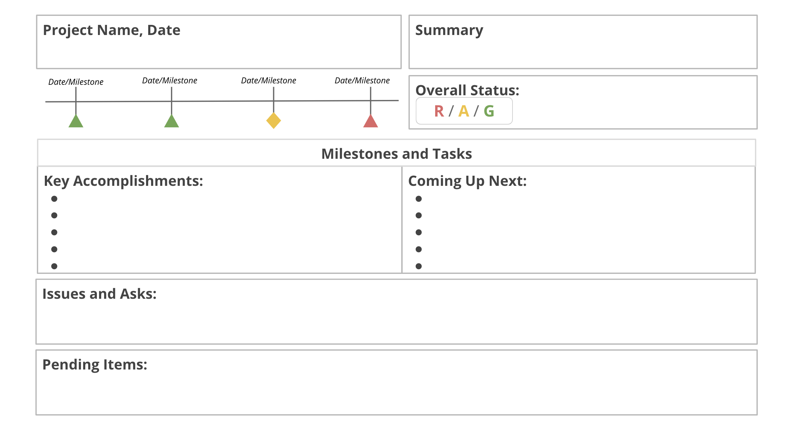
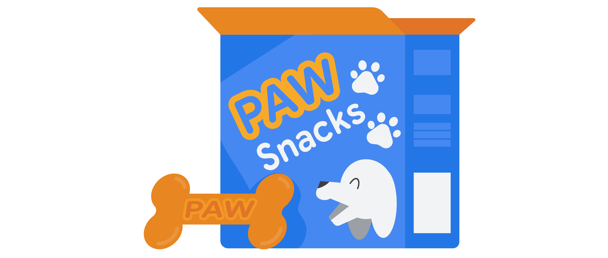

> Introduction to project execution
>
> 项目执行简介

You will learn how the course is structured, what aspects of a project to track, and how to track them.

> 您将了解课程的结构，跟踪项目的哪些方面，以及如何跟踪它们。

You will also learn how to effectively manage changes, dependencies, and risks and how to communicate critical risks to stakeholders.

> 您还将学习如何有效地管理变更、依赖关系和风险，以及如何与涉众沟通关键风险。

**学习目标**

- Explain the Project Management certificate program structure and course functionality-功能.

	> 解释项目管理证书课程结构和课程功能。

- Explain the importance of project tracking and identify what aspects of a project to track.

	> 解释项目跟踪的重要性，并确定需要跟踪项目的哪些方面。

- Identify and compare different tracking methods.

	> 识别和比较不同的跟踪方法。

- Identify reasons why risks and changes might occur during a project.

	> 确定风险和变更在项目中可能发生的原因。

- Manage dependencies and risks in an active project.

	> 管理活动项目中的依赖关系和风险。

- Address critical risks though escalation-升级,恶化 and negotiation-谈判,协商.

	> 通过升级和谈判解决关键风险。

# Getting started with the course

> 开始课程

## Introduction to Course 4

> 课程四简介

Hi there.

If you've gone through our previous courses, you've spent a lot of time digging into the intricacies-错综复杂的事物 and significance of setting up a project for success.

> 如果你已经通过我们以前的课程，你已经花了很多时间挖掘到建立一个成功的项目的复杂性和意义。

And now, we're at the project execution stage where all of that hard work comes together.

> 现在，我们正处于项目执行阶段，所有艰苦的工作都汇集在一起。

If you haven't gone through our previous courses yet, we recommend checking them out.

> 如果你还没有学习过我们之前的课程，我们建议你去看看。

Before we get started, let me introduce myself.

My name's Elita, and I'll be your instructor for this course.

I work as a Senior Engineering Program Manager at Google, where I currently lead the team behind routing-路线 and navigation on Google Maps.

> 我在谷歌担任高级工程项目经理，目前领导谷歌地图上的路由和导航团队。

I joined the company in 2007, working on teams across Google's engineering organization in New York, London, and Seattle.

In 2013, I joined the Google Maps team and launched popular features like holiday hours and attributes on businesses, while leading global teams from New York to Sydney to Hyderabad.

> 2013年，我加入了谷歌地图团队，推出了假日时间和企业属性等流行功能，同时领导着从纽约到悉尼再到海德拉巴的全球团队。

Generally, I like solving problems and learning new things.

> 总的来说，我喜欢解决问题和学习新事物。

Every new project and team allows me to do both.

> 每一个新项目和新团队都能让我做到这两点。

I'm excited to lead you through this course and demonstrate-示范,演示 how to put a project plan into action.

> 我很高兴能带领你完成这门课程，并展示如何将项目计划付诸行动。

First step, you'll learn more about risks and unforeseen-无法预料的,意料之外的 changes through the project.

> 第一步，您将通过项目了解更多风险和不可预见的变化。

If you've taken our previous courses, you might recall that change is inevitable-必然发生的,不可避免的.

> 如果你上过我们之前的课程，你可能会记得，变化是不可避免的。

And to combat-防止,减轻,争论 that, we've covered the concept of risk mitigation during the planning phase.

> 为了解决这个问题，我们已经讨论了在计划阶段降低风险的概念。

And now we'll take it one step further and discuss what to do when a risk actually materializes-成为现实,奇怪地出现.

> 现在我们将进一步讨论当风险真正出现时该怎么做。

---

Next, I'll discuss tracking and quality.

> 接下来，我将讨论跟踪和质量。

You'll learn how to track and measure your project's progress, and you'll learn how to use continuous improvement and quality management techniques to keep the project on track and running smoothly.

> 您将学习如何跟踪和衡量项目的进度，您将学习如何使用持续改进和质量管理技术来保持项目的轨道和顺利运行。

These best practices are valuable to just about any role, and I'm looking forward to taking you through them.

> 这些最佳实践几乎对任何角色都有价值，我期待着带您了解它们。

---

Other big aspects of running a project include decision-making.

> 运行项目的其他重要方面包括决策。

You'll learn to both use and analyze data to inform your decision-making, and then, in turn, use that data to explore and explain key aspects of your project.

> 你将学习使用和分析数据来为你的决策提供信息，然后，反过来，使用这些数据来探索和解释你的项目的关键方面。

---

I'll also discuss team management and the fundamentals-基本原理 of influencing.

> 我还将讨论团队管理和影响的基本原理。

So much of the success of a project relies-依靠,信赖 on teamwork, and you'll learn more about how you, as a project manager, can effectively lead your team to the finish line.

> 一个项目的成功很大程度上依赖于团队合作，你会学到作为一个项目经理，如何有效地带领你的团队到达终点。

---

Speaking of teamwork-团队合作,协力, I'll share some of the tools that provide effective team communication along with tips for organizing and facilitating-促进,使更容易,使便利 meetings.

> 说到团队合作，我将分享一些提供有效团队沟通的工具，以及组织和促进会议的技巧。

And then, we'll wrap up by discussing how to close a project.

> 然后，我们将讨论如何结束一个项目。

You'll learn the steps required to finish a project and the importance of celebrating a job well done with your team.

> 你将学习完成项目所需的步骤，以及与团队一起庆祝工作完成的重要性。

Sounds kind of fun, right?

> 听起来很有趣，对吧?

After all that planning, this is the point in the project life cycle where work gets done and everything comes together.

> 在所有这些计划之后，这是项目生命周期中工作完成和所有事情结合在一起的点。

Ready to get started?

Meet me in the next video, where you'll learn about the importance of tracking and measuring project progress.

# Tracking and measuring project progress

> 跟踪和测量项目进度

## The importance of tracking

>  跟踪的重要性

Hi again.

In previous courses, we've discussed the importance of breaking your project down into milestones and tasks and assigning those tasks to different members of your team.

> 在以前的课程中，我们讨论了将项目分解为里程碑和任务并将这些任务分配给团队不同成员的重要性。

We've also discussed setting a schedule and budget.

> 我们还讨论了制定时间表和预算。

---

But once the project execution phase gets going, how do you actually know that the work is getting done?

> 但是一旦项目执行阶段开始了，你怎么知道工作已经完成了呢?

Well, you can do this in a few ways, but primarily, you can keep **tabs on**-标签上 project progress by tracking and measurement.

> 你可以用几种方法来做到这一点，但最主要的是，你可以通过跟踪和测量来密切关注项目的进展。

This is actually a big part of project management.

Tracking, by definition, is a method of following the progress of a project's activities.

> 根据定义，跟踪是跟踪项目活动进展的一种方法。

Measuring project performance-绩效,履行,执行 regularly-有规律地,频繁地 to identify deviations-离差,偏差 from the project plan can help ensure that the project stays on track.

> 定期度量项目绩效以识别偏离项目计划的偏差有助于确保项目保持在正轨上。

A deviation-偏差,偏离 is anything that alters-改变 your original course-道路,路线 of action.

> 偏离是任何改变你最初行动路线的东西。

Deviations from the project plan can be positive or negative-消极的.

> 偏离项目计划可以是积极的，也可以是消极的。

Are you ahead-提前,预先 of schedule because a technical problem is less complex than you estimated?

> 你是否因为技术问题没有你估计的那么复杂而提前完成了计划?

Thumbs up.

> 表示赞许

Did a natural disaster-灾难,灾害,祸患 shut down your testing team?

> 是自然灾害关闭了您的测试团队吗?

Big thumbs down.

> 拇指向下。

Both of these are examples of deviations.

> 这两个都是偏差的例子。

They're also examples of why tracking is such a crucial part of your role during the project execution phase.

> 这些例子也说明了为什么在项目执行阶段，跟踪是您角色中如此重要的一部分。

Let's examine some of the ways that tracking is beneficial-有益的,有利的 for your project's success.

> 让我们检查一些跟踪对项目成功有益的方法。

To start, tracking makes key project information transparent-透明的,清澈的, and transparency-透明的,清澈的 is essential for accurate-准确的,精确的 decision-making.

> 首先，跟踪使关键项目信息透明化，而透明化对准确决策至关重要。

Even the strongest project managers make poor decisions when they lack information or context.

> 即使是最强大的项目经理在缺乏信息或背景时也会做出糟糕的决策。

Tracking centralizes project information so that everyone can understand the status of each part of the project, which can then help you identify gaps in your knowledge.

> 跟踪集中了项目信息，以便每个人都可以了解项目每个部分的状态，这可以帮助您确定知识中的差距。

Also, projects have so many little details.

> 此外，项目有很多小细节。

It's hard to keep everything straight-清晰的.

> 把每件事都弄清楚是很困难的。

Tracking helps ensure that you don't risk forgetting something.

> 跟踪有助于确保你不会有遗忘的风险。

Second, tracking helps keep all team members and stakeholders in touch with deadlines and goals.

> 其次，跟踪可以帮助所有团队成员和利益相关者了解最后期限和目标。

To ensure that everyone has visibility into project progress, you should have a project plan that works both for you and your team.

> 为了确保每个人都能看到项目进展，你应该有一个对你和你的团队都有效的项目计划。

This way you're all on the same page about how the project is progressing.

> 这样你们就能对项目的进展保持一致。

You will learn about different ways to track a project later in this module.

> 您将在本模块后面学习跟踪项目的不同方法。

Tracking is also crucial for recognizing risks and issues that can derail-阻挠,破坏 your progress.

> 跟踪对于识别可能阻碍您的进度的风险和问题也至关重要。

With effective tracking, you will be able to identify issues in a timely-及时的,适时的 fashion-方式 and work with your team to take corrective-纠正的,矫正的 action.

> 通过有效的跟踪，您将能够及时识别问题，并与您的团队一起采取纠正措施。

By providing visibility into the various parts of the project, tracking helps you and your team identify and focus on areas at risk. 

> 通过提供对项目各个部分的可见性，跟踪可以帮助您和您的团队识别并关注风险区域。

And finally, tracking helps build confidence-自信,信心 that the project is set to be delivered on time, in-scope, and within budget.

> 最后，跟踪有助于建立项目按时、在范围内、在预算内交付的信心。

Having a clear, up-to-date picture of the overall project status keeps the team motivated and focused on staying the course.

> 对整个项目状态有一个清晰的、最新的了解，可以让团队保持动力，并专注于坚持到底。

So to recap, tracking is important for a few key reasons, like transparency-透明的,清澈的, risk management, and keeping the project on track. 

> 综上所述，跟踪之所以重要，有几个关键原因，比如透明度、风险管理和保持项目在正轨上。

Coming up, we'll take you through some of the key items to track during project execution.

> 接下来，我们将带您了解项目执行过程中需要跟踪的一些关键项目。

Meet you there.

## Common items to track

> 跟踪的常见项目

So we've discussed that tracking monitors the progress of project activities.

> 因此，我们已经讨论了跟踪监视项目活动的进度。

But you may still be wondering, what specifically-明确地,具体地 should you be tracking?

> 但你可能还在想，你到底应该跟踪什么?

I'll take you through a few of the most commonly tracked items that I found helpful when managing projects at Google.

> 我将带你浏览一些我发现在谷歌管理项目时很有用的最常被跟踪的项目。

First, you should always track the project schedule.

> 首先，您应该始终跟踪项目进度。

This is **made up of**-由...组成 tasks and activities that ensure that the project is effectively heading toward its completion date.

> 这是由任务和活动组成的，确保项目有效地朝着其完成日期前进。

After all, your ultimate-最终的,最后的 goal is to complete your deliverables on time.

> 毕竟，你的最终目标是按时完成可交付成果。

---

Equally important is tracking the status of action items, key tasks, and activities to ensure that that work is actually getting done. 

> 同样重要的是跟踪行动项、关键任务和活动的状态，以确保工作实际完成。

Tracking tasks also helps to track your team's progress toward milestones.

> 跟踪任务也有助于跟踪团队朝着里程碑的进度。

We learned a bit more about tracking progress toward milestones earlier in the course, and we stressed-强调,着重 the importance of creating tasks and milestones to keep everyone on track.

> 我们学到了更多的关于跟踪进度朝着里程碑的过程中早些时候，我们强调了创建任务和里程碑的重要性，让每个人都在轨道上。

When you're in the middle of a project, new tasks will come up all the time.

> 当你在一个项目中，新的任务会不断出现。

In order to avoid missing deadlines, it's imperative-极重要的,必要的 to track tasks as they progress and as you approach-靠近,接近 key milestones.

> 为了避免错过最后期限，必须在任务进展和接近关键里程碑时跟踪任务。

---

Next, you'll also need to track costs to ensure that you don't overspend-超支,过度使用 or underspend-支出过少 on project tasks.

> 接下来，您还需要跟踪成本，以确保您不会在项目任务上超支或超支。

As I mentioned earlier, all projects have budgets, and whether or not you're overseeing the entire budget, you may be overseeing tasks and resources that have budget implications-含意,牵连,涉及.

> 正如我前面提到的，所有项目都有预算，无论您是否监督整个预算，您都可能监督具有预算含义的任务和资源。

Finally, you'll need to track key decisions, changes, dependencies, and risks to the project, including any agreed upon scope changes.

> 最后，您需要跟踪项目的关键决策、变更、依赖关系和风险，包括任何商定的范围变更。

This way, your team and stakeholders are aligned on what needs to be done for the project to succeed.

> 通过这种方式，您的团队和涉众就项目成功所需要做的事情达成一致。

We will cover this in more detail throughout the course since it's a big part of running the project.

> 我们将在整个课程中更详细地介绍这一点，因为它是运行项目的重要组成部分。

---

To recap, the items that are helpful to track throughout the project execution phase include the project schedule, which contains the key tasks and activities, the status of action items, progress toward milestones, costs, and key decisions and changes.

> 概括地说，在整个项目执行阶段中有助于跟踪的项目包括项目进度表，其中包含关键任务和活动、行动项目的状态、里程碑的进度、成本以及关键决策和变更。

There are many moving parts to be aware of once a project is underway-在进行中的.

> 一旦一个项目正在进行中，有许多移动的部分需要注意。

Tracking them closely-紧密地,密切地 benefits you and your team as you head toward the project goal.

> 在您朝着项目目标前进的过程中，密切跟踪它们对您和您的团队都有好处。

I've taken you through an introduction to tracking, and coming up, we'll discuss project management tools and templates you can use to track project activities.

> 我已经向您介绍了跟踪，接下来，我们将讨论项目管理工具和模板，您可以使用它们来跟踪项目活动。

Meet me in the next video to expand-扩展,增加 your toolkit-工具包,工具箱.

> 下个视频见，扩展你的工具箱。

## Different tracking methods

> 不同的跟踪方法

Welcome back.

Now that you understand how essential tracking is, let's explore and compare various types of tracking methods.

> 现在您已经了解了跟踪的重要性，让我们来探索和比较各种类型的跟踪方法。

The purpose of your project plan is to guide you through the execution of your project.

> 项目计划的目的是指导您完成项目的执行。

Therefore, it will always include at least one type of tracking method, and sometimes you might use more than one depending on what your team needs.

> 因此，它将总是包括至少一种类型的跟踪方法，有时您可能会根据您的团队需要使用多种跟踪方法。

---

The tracking methods we'll discuss in this video are a Gantt chart, a roadmap-路线图, and a burndown-燃尽 chart.

> 我们将在本视频中讨论的跟踪方法是甘特图、路线图和燃尽图。

There are many others, but these are the few that I'm going to focus on.

> 还有很多其他的，但这些是我要关注的几个。

Whichever-无论哪个 type you choose depends on what you deem-认为,相信 suitable-适宜的,合适的 for your project.

> 你选择哪种类型取决于你认为哪种类型适合你的项目。

It's important to remember to select something that the entire team can easily understand, reference, and keep up to date.

> 重要的是要记住选择一些整个团队都能容易理解、参考和保持更新的内容。

Let's compare the tracking methods I mentioned.

> 让我们比较一下我提到的跟踪方法。

---

Perhaps the most common tracking method of all is the Gantt chart.

> 也许最常用的跟踪方法是甘特图。

It's a tried-可靠的 and true tool to keep your project on track.

> 这是一个行之有效的工具，可以让你的项目走上正轨。

A Gantt chart measures tasks against-以…为背景 time and includes useful information, like who will own each task and what the order of the tasks should be.

> 甘特图根据时间来衡量任务，并包含有用的信息，比如谁将拥有每个任务，任务的顺序应该是什么。

For this reason, it's a useful chart for staying **on schedule**-按时 and for projects with many dependencies or tasks or activities or milestones that are reliant-依赖的,依靠的 on one another.

> 由于这个原因，这是一个很有用的图表，可以帮助你按时完成工作，也可以帮助你完成有很多相互依赖的项目、任务、活动或里程碑。

It's also a helpful chart for teams with a lot of people, because ownership and responsibilities are explicitly-明确地,清楚明确地,直截了当地 laid out visually.

> 对于有很多人的团队来说，这也是一个很有用的图表，因为所有权和责任是明确的可视化布局。

As you track and move along sequentially-继续地,循序地 **over time**-随着时间的推移, this starts to look like a waterfall-瀑布; hence, why Gantt charts are commonly used in Waterfall project management.

> 随着时间的推移，当你追踪和移动时，这开始看起来像一个瀑布;因此，为什么甘特图通常用于瀑布式项目管理。

Each task is represented by a horizontal-水平的,统一的 progress bar, and the length of the bar is dependent on how much time is allotted-分配,分派 to the task.

> 每个任务由一个水平进度条表示，进度条的长度取决于分配给任务的时间。

The bars are stacked-堆叠 on top of each other to denote-表示,标志,预示 that the task at the top must be completed before the next one below it can be completed.

> 这些条形图彼此堆叠在一起，表示上面的任务必须在它下面的任务完成之前完成。

Gantt charts typically-一般,通常 live in your project plan and are updated as the project progresses.

> 甘特图通常存在于项目计划中，并随着项目的进展而更新。

---

Another common tracking method we have here at Google is a roadmap-路线图.

> 另一种常见的追踪方法是路线图。

A roadmap is best suited-适合,适宜 for when you need a way to track big milestones in your project.

> 当你需要一种方法来跟踪项目中的重大里程碑时，路线图是最适合的。

It's useful for illustrating how a project should evolve-逐步发展 over time to a team and key stakeholders.

> 它有助于向团队和关键干系人说明项目应该如何随着时间的推移而发展。

Here's an example: a roadmap might list your project's goals at the top and a description of the approach we'll be taking to meet those goals.

> 这里有一个例子:路线图可能会在顶部列出项目的目标，并描述我们将采取的方法来实现这些目标。

In this example, the goals are to increase online business-to-consumer sales by 20 percent year-over-year and to increase holiday sales to existing customers by eight percent over last year.

> 在本例中，目标是使在线企业对消费者的销售额比去年增加20%，并使对现有客户的假日销售额比去年增加8%。

The approach details the main tactics-策略,战术 your team will use to reach your goal.

> 该方法详细说明了团队为实现目标将使用的主要策略。

A roadmap also includes a high-level project overview.

> 路线图还包括高层次的项目概述。

High-level in this context means a concise-简明的,简洁的 summary, usually three-to-four sentences, to clearly state-陈述,说明 the objectives and priorities for your project.

> 在这种情况下，高级意味着简洁的总结，通常是三到四个句子，以清楚地说明项目的目标和优先级。

Below the goals, approach, and overview is a table that maps out what the process-过程 will entail-需要.

> 在目标、方法和概述下面是一个表，它列出了过程将需要的内容。

In this example, our table is divided-分开 into quarters that reflect-反应 the project timeline.

> 在这个例子中，我们的表格被划分为反映项目时间轴的部分。

A quarter-季度 is a three-month period on a company's financial calendar.

> 一个季度是公司财务日历上三个月的时间段。

Key milestones are listed for each quarter.

> 每个季度都列出了关键的里程碑。

Then, there are tasks that each team member or department needs to complete.

> 然后，每个团队成员或部门都需要完成一些任务。

Most tasks may map to a milestone due within the same quarter.

> 大多数任务可能会在同一季度内映射到一个里程碑。

In our example, the project as a whole has a key milestone in Q1 to finalize-最后决定,敲定 inventory-清单 for the holiday season-季节.

> 在我们的示例中，整个项目在第一季度有一个关键的里程碑，以确定假日季节的库存。

The work of product testing and finalizing suggestions for offerings mainly falls to the marketing and sales teams.

> 产品测试和最终提供建议的工作主要落在市场和销售团队身上。

However, sometimes the tasks may need to be completed in advance-提前,预先 to unblock another team or milestone in future quarters. 

> 然而，有时这些任务可能需要提前完成，以便在未来的季度中打开另一个团队或里程碑。

The product and engineering team is working on tasks in Q1 and in Q2 that lead up to the launch of the refreshed online store in Q3.

> 产品和工程团队正在完成第一季度和第二季度的任务，以便在第三季度推出更新后的在线商店。

In order to reach that milestone, each department needs to complete specific tasks, and the roadmap tracks both individual and project progress toward milestones.

> 为了达到那个里程碑，每个部门需要完成特定的任务，路线图跟踪个人和项目朝着里程碑的进展。

---

Finally, there's the burndown chart, the most granular-颗粒的,粒状的 of the three tracking methods.

> 最后是燃尽图，这是三种追踪方法中最精细的一种。

A burndown chart measures time against the amount of work done and the amount of work remaining-剩余.

> 燃尽图根据已完成的工作量和剩余的工作量来衡量时间。

Their main uses are to keep the project team on top of targeted completion dates and to keep the team aware of scope creep as it occurs.

> 它们的主要用途是使项目团队保持在目标完成日期之上，并使团队意识到范围蔓延的发生。

Burndown charts are best suited for projects that require a detailed, broken-down review of each task associated with a project, and they're great for projects where finishing on time is the top priority.

> 燃尽图最适合那些需要对项目相关的每项任务进行详细、分解的回顾的项目，它们非常适合那些以按时完成任务为首要任务的项目。

The y-axis or the vertical-垂直的 axis symbolizes-象征,代表 the number of tasks left to complete, and the x-axis or the horizontal axis signifies-表示 time. 

> y轴或纵轴表示待完成的任务数量，x轴或横轴表示时间。

Progress gets tracked from the upper left-hand corner-角 of the chart.

> 进度从图表的左上角开始跟踪。

As the project goes along, you'll track down, working your way towards zero remaining tasks, and to the right, working your way toward your end date.

> 随着项目的进行，你会追踪，朝着零剩余任务的方向努力，向右，朝着你的结束日期努力。

There's typically a dotted-点,小圆点 line for your expected or projected progress based on the rate your team's expected to close tasks, and a solid line representing your actual progress.

> 通常有一条虚线代表你的预期或计划进展，这是基于你的团队预期完成任务的速度，一条实线代表你的实际进展。

---

Before you continue on with your project, you'll need to decide which tracker-追踪者,追踪器 makes the most sense.

> 在继续您的项目之前，您需要决定哪个跟踪器是最有意义的。

If you need to communicate milestones to a large team, you might choose a roadmap.

> 如果您需要与大型团队沟通里程碑，您可能会选择路线图。

If you have a project with multiple dependencies, you might choose a Gantt chart.

> 如果您的项目有多个依赖项，则可以选择甘特图。

If tracking tasks against your deadline is especially important, then the burndown chart might be your best option.

> 如果在截止日期前跟踪任务特别重要，那么燃尽表可能是你最好的选择。

And you may even decide to use more than one.

> 你甚至可能决定使用不止一个。

Because the tracking method will be determined by the type of project you're working on, your resources, and the project scope, you'll probably end up using several types of tracking methods at some point-阶段 in your career.

> 由于跟踪方法将由您正在从事的项目类型、您的资源和项目范围决定，因此在您的职业生涯的某个阶段，您可能最终会使用几种类型的跟踪方法。

In my time at Google, I've regularly combined methods and used a few different types together.

> 在谷歌工作期间，我经常将不同的方法组合在一起使用。

For example, using a Gantt chart to scope work at the beginning of a project, then switching to a burndown chart in the weeks before a launch to make sure we're good to go.

> 例如，在项目开始时使用甘特图来确定工作范围，然后在发布前几周切换到燃尽图，以确保我们能够顺利进行。

Now you know a bit more about the various types of tracking methods, including a roadmap, Gantt chart, and burndown chart. 

> 现在您对各种类型的跟踪方法有了更多的了解，包括路线图、甘特图和燃尽图。

Next step, we'll focus on understanding continuous improvement and process improvement.

> 下一步，我们将关注于理解持续改进和过程改进。

## Belinda: tracking and managing a budget

> 贝琳达：跟踪和管理预算

Hi my name is Belinda and I'm a program manager with Google.

My role with Google has been building budgets for the last several years, there's a lot that goes into building data center budgets. 

> 在过去的几年里，我在谷歌的工作一直是建立预算，建立数据中心的预算有很多。

It can take quite some time, and they're due every year for the renewal-延长,续订 of the following year by September 1st.

> 这可能需要一段时间，他们每年都要在9月1日之前续借。

The budget is entailed of anything you can think of down to janitorial-管理的,保洁用品 services for the data center site, all the way to UPS units to have to run it's battery-电池 backup, **in case**-以防万一 we lose power.

> 预算涉及到你能想到的任何事情，包括数据中心站点的清洁服务，以及UPS设备的备用电池，以防断电。

So the role that I have had for several years has been to not only build the budget but to figure out and work with the team and also vendors, on what money is needed funding as we grow as a site as well.

> 所以几年来，我的职责不仅是制定预算，还要与团队和供应商合作，确定在网站发展过程中需要多少资金。

And for me what I've always done is built a Google sheet, and I've used that year over year line item by line item, and I break it down per the account GL, account code, and also with the D channel that references to that.

> 对我来说，我一直做的是建立一个谷歌表格，我年复一年地逐行逐项使用它，我根据账户GL，账户代码，以及引用它的D通道来分解它。

And basically that is just the categories of whether we're **dealing with**-处理,对待 mechanical electrical chillers, maintenance-维护,保养 for the lawn-草坪,草地 RTU units, mechanical concepts, labor, repairing-修理,修补 services to the elevators-电梯, lifts, golf carts, generators-发电机.

> 基本上，这就是我们是否在处理机械，电气冷却器，维护草坪RTU单元，机械概念，劳动力，维修电梯，升降机，高尔夫球车，发电机的类别。

You do a line by line item for anything that takes a data center to run.

> 您可以逐行执行需要数据中心运行的任何内容。

So it can be very convoluted-复杂的 and quite difficult, but I have always found that the Google Sheet is the best method for my base structure if where I start, currently-现时,当前 there's four managers that I build that budget with.

> 这可能会很复杂，很困难，但我一直发现Google Sheet是基础结构的最佳方法，如果我开始的时候，目前有四个管理器来构建预算。

We have a meeting and go over the budgets to be clear and as transparent-透明的,清澈的 you can be to make sure that you've got everything in there that was requested.

> 我们会开个会，审查预算，尽可能地清晰透明，以确保你得到了所有要求的东西。

What has happened over the years is what we'll have is we'll have a manager, that will be the lead with me on the budget.

> 这些年来发生的事情是我们将会有一个经理，他将和我一起领导预算。

So that when we go to submit the budget, and we're at a director level meeting, when we're submitting this, I have a FM manager from the site that is actually overseeing that budget.

> 所以当我们提交预算的时候，我们在一个主管级别的会议上，当我们提交这个的时候，我有一个现场的FM经理负责监督预算。

It depends on who you're working with, but they're going to know what their needs are and they can help you understand when they need those needs, and how much money they need.

> 这取决于你和谁一起工作，但他们会知道他们的需求是什么，他们可以帮助你了解他们什么时候需要这些需求，以及他们需要多少钱。

So for anyone that's looking to go into project management, budget management, I think that that they really need to know that they they love math.

> 所以对于任何想要从事项目管理，预算管理的人来说，我认为他们真的需要知道他们喜欢数学。

And they need to also love change because change happens so often with project management and dealing with budgets because they change hourly, sometimes they change daily.

> 他们也需要喜欢变化因为变化经常发生在项目管理和处理预算上因为它们每小时都在变化，有时每天都在变化。

Sometimes you have a really, really calm-平静的,稳定的 week where everything went like it was supposed-预期 to, and then sometimes it's chaos-混乱.

> 有时你会度过非常非常平静的一周，一切都按照预期进行，但有时又会陷入混乱。

For me, I like being busy and I like change, I'm not afraid of it, but I think that people that would be interested in this type of role would need to understand that that's going to be there.

> 对我来说，我喜欢忙碌，我喜欢变化，我不害怕变化，但我认为对这类角色感兴趣的人需要明白这一点。

So anyone who's starting to build budgets with Google, it can be quite overwhelming-使不知所措 even though with the experience that I had it was overwhelming-压倒性的 for me.

> 所以任何一个开始为谷歌做预算的人，这可能会让人不知所措，尽管以我的经验来说，这对我来说是压倒性的。

And I had to figure out a platform for me and the sheet that made sense so I could track it.

> 我必须找到一个适合我的平台和一张合理的纸，这样我才能追踪它。

But I think that the advice I would give anyone that's starting out with budgets would be take it one day at a time, you don't learn all in one day it can be overwhelming, but to break it down maybe and in smaller pieces. 

> 但我想给那些刚开始做预算的人的建议是，一次做一天，你不可能在一天内学会所有的东西，这可能会让你不知所措，但你可以把它分解成更小的部分。

## Choose the right tracking method for your project

> 为您的项目选择正确的跟踪方法

So far, you've learned about the importance of tracking project progress.

> 到目前为止，您已经了解了跟踪项目进度的重要性。

You’ve also reviewed some of the different tracking methods used by project managers, like project plans, Gantt and Burndown charts, and Roadmaps.

> 您还回顾了项目经理使用的一些不同的跟踪方法，如项目计划、甘特图和燃尽图以及路线图。

This reading will explore and compare these popular tracking methods in more detail so you can feel more confident-自信的,充满信心的 choosing the best method for your projects.

> 本文将更详细地探讨和比较这些流行的跟踪方法，以便您可以更自信地为您的项目选择最佳方法。

**Gantt charts**

> 甘特图表

The Gantt chart is one of the most popular tracking methods and can be used for all types of projects.

> 甘特图是最流行的跟踪方法之一，可用于所有类型的项目。

Gantt charts typically live in your project plan and are updated as the project progresses.

> 甘特图通常存在于项目计划中，并随着项目的进展而更新。

Gantt charts are useful for:

- Helping a team stay on schedule

	> 帮助团队按时完成任务

- Projects with lots of tasks, dependencies, and milestones

	> 具有大量任务、依赖项和里程碑的项目

- Projects with large teams, because ownership-所有权 and responsibilities are explicitly-清楚明确地 laid out visually

	> 拥有大型团队的项目，因为所有权和责任被明确地可视化地布置

Asana, one of the work management software tools featured in this certification-证明, has useful resources for getting started with Gantt charts.

> Asana是本认证中的工作管理软件工具之一，它提供了有用的甘特图入门资源。

Practice working with Gantt charts on your own with a [free Asana trial](https://asana.com/create-account) or by downloading a free Gantt chart template from [Google Sheets](https://docs.google.com/spreadsheets/d/1W3Z0uFZTf-HKjZFY7S-1NvglFBUDpcaFZ8gRuehcb8Y/template/preview?usp=drive_link) or [Microsoft Excel](https://templates.office.com/en-us/simple-gantt-chart-tm16400962). 

| Want to learn more? Check out these resources:               |
| :----------------------------------------------------------- |
| Asana help article: [New to Gantt charts? Start here.](https://asana.com/resources/gantt-chart-basics) |

**Roadmaps**

> 路线图

Roadmaps are another common tracking method.

Like Gantt charts, Roadmaps also track both individual and project progress toward-趋向,朝着 milestones.

> 像甘特图一样，路线图也跟踪个人和项目朝着里程碑的进展。

However, Roadmaps are best suited for tracking big milestones in your project. 

> 然而，路线图最适合于跟踪项目中的重大里程碑。

Roadmaps are useful for:

- High-level tracking of large milestones. Roadmaps outline-概述 the project as a whole and provide an overall snapshot of key points—just like an actual roadmap contains points of interest and mile markers. 

	> 大型里程碑的高层跟踪。路线图概述了整个项目，并提供了关键点的总体快照——就像实际的路线图包含了兴趣点和里程标记一样。

- Illustrating to your team or key stakeholders how a project should evolve over time

	> 向您的团队或关键干系人说明项目应该如何随着时间的推移而发展

Roadmaps can be built using different tools.

> 路线图可以使用不同的工具来构建。

You can create a Roadmap in a document (like this [example](https://docs.google.com/document/d/1z-UTxMCbx-s11TuArnzz4iykBesG434YFTBerFrqMFI/template/preview?resourcekey=0-9hyu73SuoUe2RRv_tf5LOA#heading=h.iw90cjfk1m4e)). 

Smartsheet has useful resources for getting started with Roadmaps. Practice working with Roadmaps on your own with a [free Smartsheet trial](https://www.smartsheet.com/try-it?lpv=stkcta&trp=8749&lx=2sgpTbF12suoPxu20v5CoABAgeTPLDIL8TQRu558b7w) or by downloading this [Roadmap template](https://docs.google.com/spreadsheets/d/1mtRKyj4nS5fja25lFNsCC8ZMnd7Z81yx_z-MtOEj5HM/template/preview?resourcekey=0-pEIsQsu6t8oHR5WWlMHYvw#gid=1672256879) created with Google Sheets.

| **Want to learn more? Check out these resources:**           |
| :----------------------------------------------------------- |
| Smartsheet help article: [Everything you need to know about Project Roadmaps](https://www.smartsheet.com/answers-all-your-project-roadmap-questions) |
| [Free Product Roadmap templates from Smartsheet](https://www.smartsheet.com/free-product-roadmap-templates-smartsheet) |

**Burndown charts**

> 燃尽图

Burndown charts are typically used by Agile Scrum teams.

> 燃尽图通常由敏捷Scrum团队使用。

Burndown charts reveal-揭示,透露 how quickly your team is working by displaying how much work is left and how much time remains to complete the work.

> 燃尽图通过显示剩余的工作量和完成工作的剩余时间来显示团队的工作速度。

The main uses of a Burndown chart are to keep the project team on top of targeted completion dates and make them aware of scope creep if it occurs.

> 燃尽图的主要用途是让项目团队保持在目标完成日期的顶端，并让他们意识到范围蔓延的情况。

The chart should be displayed so everyone can see it and needs to be updated regularly in order to be effective-有效的.

> 图表应该显示出来，这样每个人都可以看到它，并且需要定期更新，以便有效。

Burndown charts are useful for:

- Projects that require a detailed review of tasks

	> 需要对任务进行详细回顾的项目

- Projects where finishing on time is the top priority-最重要的事

	> 按时完成的项目是最重要的

***Note**: If you'd like to learn about Agile and Scrum, which are popular project management approaches, check out Course 5 of this certificate, [Agile Project Management](https://www.coursera.org/learn/agile-project-management?specialization=google-project-management).

> ***注**:如果你想学习敏捷和Scrum，这是流行的项目管理方法，请查看本证书的课程5，[敏捷项目管理](https://www.coursera.org/learn/agile-project-management?specialization=google-project-management)。

A Burndown chart helps you, as a project manager, understand how your team works and what influences their ability to complete tasks on time.

> 燃尽图可以帮助作为项目经理的您了解团队的工作方式以及影响他们按时完成任务的因素。

This way, you can address issues right away, before they become major problems.

> 这样，你就可以在问题变成大问题之前立即解决它们。

They also help you plan more efficiently for the next project by identifying potential problem areas.

Jira is a work management software tool that has useful resources for getting started with Burndown charts.

> Jira是一个工作管理软件工具，它有有用的资源来开始使用燃尽图。

Practice working with Burndown charts on your own with a [free Jira trial](https://www.atlassian.com/software/jira/free) or by downloading this [Burndown chart template](https://docs.google.com/spreadsheets/d/1KTRguVRxejznvLWGov7-WsSQ4U5uPYl4jLQLyiIAIU4/template/preview) created with Google Sheets.

| **Want to learn more? Check out these resources:**           |
| :----------------------------------------------------------- |
| Jira help article: [Learn how to use burndown charts in Jira software](https://www.atlassian.com/agile/tutorials/burndown-charts) |
| ProjectManager.com article: [Burndown Chart: What Is It & How Do I Use It?](https://www.projectmanager.com/blog/burndown-chart-what-is-it) |

## Pranjal: Managing multiple tracks

> Pranjal：管理多个追踪

Hi, my name is Pranjal, and I work as a program manager in the Site Reliability-可靠性,可信度 Engineering org.

> 嗨，我的名字是Pranjal，我是站点可靠性工程组织的项目经理。

You can also call it SRE.

> 你也可以称之为SRE。

What SRE does is they are primarily responsible for all the critical services within Google, and in case something goes wrong, we are the first line of defense-防御,保卫.

> SRE主要负责谷歌内部的所有关键服务，如果出现问题，我们是第一道防线。

I think I can talk about the first big project I managed at Google.

> 我想我可以谈谈我在谷歌管理的第一个大项目。

My tech lead and I co-founded-共同建立 this project about three years ago, and I continue to work on it as of right now.

> 我和我的技术主管大约在三年前共同创立了这个项目，到现在我还在继续做这个项目。

So the project of what we wanted to do in terms of ambition-追求,抱负 was we wanted to generalize-推广,概括,归纳 some tooling to help mobile apps be reliable-可靠的,可信赖的 in production-生产,制造.

> 所以我们想要做的项目是我们想要推广一些工具来帮助手机应用在生产中变得可靠。

So what that means is, let's say you're using a mobile app.

> 这意味着，假设你在使用一个移动应用。

We want to make sure that in case something goes wrong, we detect-检测,识别 it before the user does, and we take action before the user even knows that something's wrong behind the scenes-场景,幕后, right?

> 我们要确保在出现问题的情况下，我们能在用户之前检测到它，并且在用户知道幕后有问题之前采取行动，对吧?

So we started out with this project, and my biggest fear-恐惧 in terms of working on this project was managing a **trade off**-权衡 between ambition-追求,雄心 and project quality.

> 所以我们从这个项目开始，我在这个项目中最大的恐惧是在野心和项目质量之间进行权衡。

So when we did our brainstorming sessions, and we wrote out a roadmap, it just seemed a bit too overwhelming—the scale-天平 at which we were planning to work.

> 所以当我们进行头脑风暴会议时，我们写了一个路线图，我们计划的工作规模似乎有点太大了。

I think I would be really thankful to my manager at the time.

> 我想当时我会非常感谢我的经理。

She said, she gave me some really good advice, she said, "In case you have, let's say, five different tracks going on in a very big project, not all five tracks have to be worked on every single day.

> 她说，她给了我一些非常好的建议，她说，“如果你有，比如说，在一个非常大的项目中，五个不同的轨道同时进行，并不是每一天都要处理这五个轨道。

You could probably take out a quarter and make super-good progress on maybe track three and track five, whereas-但是,然而 you can bootstrap the other tracks to make progress on it in the next quarter." 

> 你可以拿出四分之一的时间在追踪3和追踪5上取得非常好的进展，而你可以引导其他追踪在下一个季度取得进展。

So that gave me a bit of **peace of mind**-安心.

> 所以这给了我一点安心。

And she also empowered-授权,给予 me to think in terms of—I'm in a position as a program manager to push and pull on those priorities.

> 她还赋予了我思考问题的能力——我是项目经理，可以推动和拉动这些优先事项。

**As long as**-只要 people are aware of what we're working on, what risks need to be identified and mitigated, and if everything's being tracked properly-正确地,适当地, it's okay to maybe accelerate-加快,促进 sometimes and pause sometimes In fact, I learned that zooming out and pausing sometimes can result-发生,产生 in original ideas and then also gives people a little bit of a breather.

> 只要人们知道我们在做什么，哪些风险需要识别和缓解，如果一切都得到了正确的跟踪，那么有时加速，有时暂停是可以的。事实上，我了解到，有时缩小和暂停可以产生原创的想法，然后也给人们一点喘息的机会。

## Project status reports

> 项目状态报告

In this lesson, you are learning to identify and compare various types of tracking methods.

This reading will cover **project status reports** and how you can use them to track and communicate common project elements in a snapshot.

> 本阅读将涵盖项目状态报告，以及如何使用它们来跟踪和交流快照中的公共项目元素。

**Key components of a project status report**

> 项目状态报告的关键组成部分

A project status report gives an overview of all of the project’s common elements and summarizes them in a snapshot.

> 项目状态报告概述了项目的所有公共元素，并在快照中对它们进行了总结。

It is an efficient communication tool to convey-传送,表达 the latest status in one place for the team and stakeholders.

> 它是一种有效的沟通工具，可以在一个地方为团队和涉众传达最新的状态。

Most status reports contain the following components:

> 大多数状态报告包含以下组件:

- **Project name:** The project name should be specific to the purpose of the project so that the overall goal of the project can be understood-明白,懂得 at-a-glance-一瞥,一眼. 

	> 项目名称：项目名称应具体到项目的目的，以便可以一目了然地了解项目的总体目标。

- **Date:** You will create project status reports many times during the course of a project’s implementation phase.Reports can be created weekly or monthly—it all depends on the stakeholders’ needs and pace-速度 of the project. Adding the date to each status report acts as a reference point for your audience and also creates a history log of the project’s status over time. 

	> 日期：在项目实施阶段的过程中，您将多次创建项目状态报告。报告可以每周或每月创建，这完全取决于干系人的需求和项目的进度。将日期添加到每个状态报告中，可以作为受众的参考点，还可以创建项目随时间变化状态的历史日志。

- **Summary:** The summary condenses-压缩 the project’s goals, schedule, highlights, and lowlights in one central place for easy stakeholder visibility. Usually, the summary section will be followed by, or grouped with, the timeline summary and the overall project status.

	> 摘要：摘要在一个中心位置浓缩了项目的目标、进度、重点和次要内容，以便于干系人看到。通常，总结部分之后是时间轴总结和整体项目状态。

- **Status:** As you can imagine, status is a crucial piece. The status of the project illustrates your actual progress versus your planned progress. In project management, a common way to depict-描述,描绘 this is through **RAG** (red, amber, green), or Red-Yellow-Green, status reporting**.** RAG follows a traffic light pattern to indicate progress and status. Red indicates that there are issues that need resolution and that the project may be delayed or go significantly-大大地,显著地 over budget. Amber/Yellow means that there are potential issues with schedule or budget, but that the issues can likely be resolved with corrective-纠正的,矫正的 actions. And green means the schedule and budget are doing fine and that the project is on track. You can use RAG to indicate the overall project status, as well as milestone status. Every project team and stakeholder may have a slightly-稍微,轻微地 different perspective-视角,观点 on what the colors mean and how urgent-紧急的,急迫的 it is to escalate-升级,变得严重 issues when they see an amber/yellow or red status, so it’s important to make sure everyone understands what the different color statuses mean for your project.

	> **地位:你可以想象，地位是一个至关重要的因素。项目的状态说明了您的实际进度与计划进度的对比。在项目管理中，描述这一点的常用方法是通过RAG(红色、琥珀色、绿色)，或者红-黄-绿状态报告**。** RAG遵循交通灯模式来指示进度和状态。红色表示有问题需要解决，项目可能会延迟或大大超出预算。琥珀色/黄色表示在进度或预算方面存在潜在问题，但这些问题可能通过纠正措施得到解决。绿色表示进度和预算都很好，项目正在进行中。您可以使用RAG来指示整个项目状态，以及里程碑状态。每个项目团队和涉众可能对颜色的含义以及当他们看到琥珀色/黄色或红色状态时升级问题的紧迫性有稍微不同的看法，所以确保每个人都理解不同颜色状态对项目的意义是很重要的。

- **Milestones and tasks:** A summary of the project’s major milestones thus-因此 far and current tasks helps the team and stakeholders easily visualize the progress of those elements. In a project plan, you will typically depict-描述,描绘 the tasks and milestones as ‘not started,’ ‘in progress’ or ‘completed*’* at an item-by-item level. But, in the project status report, it is common to summarize these items into two categories to better communicate the status. You’ll use **key accomplishments** to detail what has happened, and **upcoming** to detail what big milestones you will accomplish next.

	> **里程碑和任务:**迄今为止项目的主要里程碑和当前任务的总结有助于团队和涉众轻松地可视化这些元素的进展。在项目计划中，您通常会逐项将任务和里程碑描述为“未开始”、“进行中”或“完成”。但是，在项目状态报告中，为了更好地传达状态，通常将这些项目总结为两类。你可以用“关键成就”来详细描述已经发生的事情，用“即将发生的事情”来详细描述你接下来将完成的重大里程碑。

- **Issues:** The issues include your project's current roadblocks-路障,障碍物 and potential risks. Status reports are an important opportunity to set expectations with your stakeholders. If your project status is red or amber, you can flag what is preventing you from being where you planned to be. You can also use this opportunity to state your plan to get the project back to green, and ask for any resources or help you may need to do so. You will learn more about communicating big risks and issues in the upcoming videos.

	> **问题:**问题包括项目当前的障碍和潜在风险。状态报告是与涉众设定期望的重要机会。如果你的项目状态是红色或琥珀色，你可以标记是什么阻碍了你的计划。你也可以利用这个机会陈述你的计划，让项目回到绿色，并要求任何资源或帮助，你可能需要这样做。在接下来的视频中，您将了解更多关于重大风险和问题的沟通。

**Project status report types** 

> 项目状态报告类型

With those key elements in mind, you can format your report in a variety of ways depending on your audience and what you need to communicate. 

> 记住这些关键元素，您就可以根据您的受众和需要交流的内容以各种方式格式化报表。

If you need to share a status report with your team for a project that contains multiple layers of complexity, it may be best to format the report in a **spreadsheet** in order to keep track of all the moving parts. 

> 如果您需要与团队共享包含多层复杂性的项目的状态报告，那么最好将报告格式化为电子表格，以便跟踪所有移动部分。

If you simply need to communicate updates to senior stakeholders, your status report may be best formatted as a **slideshow-幻灯片**, like the one below, containing only an overview of the most key points.

> 如果您只是需要与高级涉众沟通更新情况，那么您的状态报告最好以幻灯片的形式呈现，就像下面这样，只包含最关键要点的概述。

**Key takeaways**

To recap, project status reports are a powerful tool to:

> 总而言之，项目状态报告是一个强大的工具，可以:

- Improve and simplify communication across the team.

	> 改善和简化整个团队的沟通。

- Keep everyone, including key stakeholders, informed.

	> 让每个人，包括关键的利益相关者，都了解情况。

- Request more resources and support (if needed).

	> 请求更多的资源和支持(如果需要)。

- Create structure and transparency-透明,透明性 by recording the project status in a centralized place.

	> 通过在一个集中的地方记录项目状态来创建结构和透明度。

# Managing changes, risk and dependencies

> 管理变更、风险和依赖关系

## Why risks and changes occur

> 为什么会出现风险和变化

Welcome back.

In an earlier video, we learned about how to identify risks when planning projects.

> 在之前的视频中，我们学习了在规划项目时如何识别风险。

In this module, we'll learn why risks and changes might occur during a project and how that can impact your project's scope.

> 在这个模块中，我们将学习为什么风险和变化可能发生在一个项目中，以及它如何影响你的项目范围。

You may remember that a risk is a potential event that might occur and could impact your project.

> 您可能记得风险是可能发生并可能影响您的项目的潜在事件。

When you think about risks in the context of project management, you'll think about them as hypothetical-假设的,假定的.

> 当你在项目管理的背景下考虑风险时，你会认为它们是假设的。

In other words, these might not be events that will definitely-肯定地,确定地 happen, but because there's a possibility that they could happen, it's your responsibility as a project manager to identify and plan for those risks.

> 换句话说，这些可能不是一定会发生的事件，但是因为它们有可能发生，所以作为项目经理，识别和计划这些风险是您的责任。

Let's revisit some examples of risks.

> 让我们回顾一些风险的例子。

A project risk might be a contractor missing a deadline, or introducing a tool that may lead to communication breakdown-故障,损坏 within your team, or unexpected, additional work because of an unforeseen policy being put in place.

> 项目风险可能是承包商错过了最后期限，或者引入了可能导致团队内部沟通中断的工具，或者由于无法预见的政策而导致的意外的额外工作。

When any risk occurs, the consequence-结果,后果 is a change to the project plan.

> 当任何风险发生时，后果就是项目计划的变更。

A change is anything that alters or impacts the tasks, structures, or processes within a project.

> 变更是改变或影响项目中的任务、结构或过程的任何事情。

Changes are typically unexpected.

> 变化通常是意料之外的。

More often than not, they have a negative-消极的 impact on the project, and you'll have to learn to navigate-处理 that.

> 通常情况下，它们会对项目产生负面影响，你必须学会驾驭它们。

But sometimes, and I'm placing a heavy emphasis-重要性,强调 on sometimes, changes can have a positive impact.

> 但有时候，我特别强调的是有时候，改变会产生积极的影响。

Changes can encompass-包含,包括 any variance-分歧,不一致 from the original project plan **in regards**-关于 to the triple constraint.

> 变更可以包含与三重约束相关的原始项目计划的任何差异。

This may entail-使必要,需要 changing priorities and scope, budget and resources, or changes to the project timeline.

> 这可能需要更改优先级和范围、预算和资源，或者更改项目时间表。

We'll discuss how the internal and external dependencies of a project impact each other and bring about change.

> 我们将讨论项目的内部和外部依赖关系如何相互影响并带来变更。

---

Let's go through a few types of changes that can affect your project.

> 让我们看一下可能影响项目的几种类型的更改。

Some examples of changes may include new or changing dependencies.

> 一些更改示例可能包括新的或正在更改的依赖项。

Dependencies are tasks, activities, or milestones that are reliant on one another.

> 依赖关系是相互依赖的任务、活动或里程碑。

So if one task isn't completed on time, it may put your other tasks behind.

> 所以如果一项任务没有按时完成，它可能会把你的其他任务抛在后面。

You might be in charge of renovations-翻新,整修 on a home where there are dependencies.

>  你可能会负责装修一个有依赖关系的房子。

In a bathroom remodel, for instance, a new sink cannot be installed until the vanity-梳妆台 and plumbing-管路系统 are in place.

> 例如，在浴室改造中，在梳妆台和管道安装到位之前，不能安装新的水槽。

---

Next, is changing priorities.

The scope of the remodel-改造,改变 changes if your client's in-laws suddenly have to move in, and you have to move up planned work on the spare-空闲的 bedroom before completing the bathroom-浴室 remodel.

> 如果你的客户的姻亲突然要搬进来，那么改造的范围就会发生变化，你必须在完成浴室改造之前提前完成对备用卧室的计划工作。

Next up, the capacity and people available could change.

> 接下来，产能和可用人员可能会发生变化。

Maybe you have to replace the plumber-水管工人 because you had issues on the job site.

> 也许你必须更换水管工，因为你在工作现场遇到了问题。

Another type of change could include a new limitation on your budget or resources.

> 另一种类型的改变可能包括对预算或资源的新限制。

For example, you need to reduce design costs in the new bathroom-浴室 by 10 percent because your quotes for electrical-电气设备 work come in higher than expected.

> 例如，你需要将新浴室的设计成本降低10%，因为你对电气工作的报价高于预期。

Another change could be scope creep.

> 另一个变化可能是范围蔓延。

Scope creep is when changes, growth, and other factors affect the project scope.

> 范围蠕变是指变更、增长和其他因素影响项目范围。

For instance, your clients are so happy with the tile-瓷砖,地砖 in the new bathroom that they'd like to replace the tile in all of their bathrooms.

> 例如，你的客户对新浴室的瓷砖非常满意，他们想把所有浴室的瓷砖都换掉。

Finally, force majeure-无可抗拒的力量.

> 最后，不可抗力。

This is another change that could occur due to a national-国家的 or international-国际的 crisis-危机.

> 这是另一种可能由于国家或国际危机而发生的变化。

If you aren't familiar with this term, it means an unforeseen circumstance-条件,情况 that prevents-阻止,预防 someone from fulfilling-履行,执行 the contract due to a major crisis.

> 如果你不熟悉这个术语，它的意思是由于重大危机而导致某人无法履行合同的不可预见的情况。

Force majeure-无可抗拒的力量 is pretty uncommon.

> 不可抗力是相当罕见的。

But for instance, if a union goes on strike-罢工, certain vendors won't be able to fulfill their contracts.

> 但是，例如，如果工会罢工，某些供应商将无法履行合同。

If there's a pandemic-瘟疫, all production on your new product might be halted-停止,中止.

> 如果发生大流行，你的新产品的所有生产都可能停止。

Changes should be measured against the baseline estimates of scope, budget, and time allotted for your project, given the original requirements.

> 在给定原始需求的情况下，应该根据项目范围、预算和分配时间的基线估计来度量变更。

Be mindful that when you change any one of those things, there may be knock-on-间接影响 effects which could be positive or negative-消极的.

> 要注意，当你改变其中任何一件事时，可能会产生积极或消极的连锁反应。

For instance, your clients may believe they have beautiful hardwood-硬木 floors hiding underneath old living room carpet-地毯 and want to pull up the old carpet-地毯 and use the original hardwood floors underneath.

> 例如，你的客户可能认为他们有漂亮的硬木地板藏在旧的客厅地毯下面，想把旧地毯拉起来，在下面使用原来的硬木地板。

You, the project manager on this particular construction-建筑 job—you've budgeted to have the carpet removed and the old floors sanded and stained.

> 你，这个建筑项目的项目经理，你的预算是把地毯移走，把旧地板磨砂和染色。

Bad news.

You pull up the carpet and find the floors are in bad shape and rotting-腐败.

> 你掀开地毯，发现地板很糟糕，正在腐烂。

They'll need to be replaced-取代,替换 or repaired, which could be costly-昂贵的,代价大的, so your timeline and budget are likely to take a hit.

> 它们需要更换，或者修理，这可能会很贵，所以你的时间和预算可能会受到影响。

When it comes to who takes on the responsibility of managing the changing scope, it'll be you—the project manager.

> 当谈到谁来承担管理不断变化的范围的责任时，那就是你——项目经理。

But depending on the project, you probably won't do it alone.

> 但根据项目的不同，你可能不会独自完成。

In order to properly-正确地,适当地 manage changes, you'll want to refer to documents like your Statement of Work and the RACI chart.

> 为了正确地管理变更，您将需要参考文档，例如您的工作陈述和RACI图表。

But you might also have to create some new documentation.

> 但是您可能还需要创建一些新的文档。

You'll want to create or familiarize yourself with the processes for requesting changes for your team or organization.

> 您需要创建或熟悉为您的团队或组织请求更改的流程。

These processes might include a change request form-表单.

> 这些流程可能包括变更请求表单。

---

Let's discuss change request forms.

You and your stakeholders will use these forms in order to stay on top of, and adequately-充分地,足够地 manage, any changes.

> 您和您的涉众将使用这些表单，以便掌握并充分管理任何更改。

Since a lot of people with different roles on the project can fill out these forms, it's important for the forms to be self-explanatory-不需加以说明的 and very thorough-彻底的,全面的.

> 由于许多在项目中扮演不同角色的人都可以填写这些表格，因此让这些表格能够自我解释并非常全面是很重要的。

In the provided template, which uses a 2-by-10 table, you'll need to include information in the cells, such as: the project name, the discussion owner, who's taking the lead on this discussion from the team, discussion type.

> 在所提供的模板中(它使用一个2 × 10的表)，您需要在单元格中包含信息，例如:项目名称、讨论所有者、谁在团队中领导这次讨论、讨论类型。

You'll want to let your audience know if you'll be discussing a risk, opportunity, or anything else.

> 你要让你的听众知道你是在讨论风险、机会还是其他任何事情。

You'll want to identify the teams involved and the expected outcome of the discussion, which might be a change in priorities, schedule change, or an official call on how to proceed-开始行动,开展 with an issue.

> 您将需要确定所涉及的团队和讨论的预期结果，这可能是优先级的更改，时间表的更改，或者关于如何处理问题的正式呼叫。

Add the target date for discussion, and identify which milestones or goals might be impacted.

Provide a short description of the current situation, the change, and any difference you expect to make to the plan of record, like a snapshot of the before and after.

> 提供对当前情况、变更以及您期望对记录计划做出的任何不同的简短描述，就像前后的快照一样。

Then go into in-depth proposal for the necessary changes and address any **trade-offs**-权衡.

> 然后深入地提出必要的更改建议，并处理任何权衡。

Finally, provide any background information so that everyone shares the same context.

> 最后，提供任何背景信息，以便每个人都共享相同的上下文。

You can also refer to your statement of work, or SOW, for more information about who needs to be involved in that conversation. 

> 你也可以参考你的工作陈述(SOW)，了解更多关于谁需要参与对话的信息。

If you find that one or more of your milestones are at risk of not being completed, then you'll need to get a customer sign-off before the scope, deadline, or budget are changed, and all parties involved need to be informed.

> 如果你发现你的一个或多个里程碑有无法完成的风险，那么你需要在范围、截止日期或预算改变之前获得客户的批准，并且需要通知所有相关方。

---

Great work.

We've reviewed how to define risk and know more about how to identify the reasons why risks and changes might occur during a project.

> 我们已经回顾了如何定义风险，并了解了更多关于如何确定风险和变更在项目中可能发生的原因。

And now we can explain the impact of increasing a project scope.

> 现在我们可以解释增加项目范围的影响。

In the next video, we're going to discuss the role dependencies play and how to properly manage them.

> 在下一个视频中，我们将讨论依赖关系所扮演的角色以及如何正确地管理它们。

We'll meet you there.

## Identifying and tracking dependencies

> 识别和跟踪依赖项

So we've covered risks and how they affect a project, but we haven't fully discussed dependencies—arguably-可论证地,按理 one of the biggest factors in a project.

> 因此，我们已经涵盖了风险以及它们如何影响项目，但是我们还没有完全讨论依赖关系——可以说是项目中最大的因素之一。

In this video, we'll discuss dependencies—both internal and external—how to identify and track them, **as well as**-和,以及 their importance.

> 在本视频中，我们将讨论内部和外部的依赖关系，以及如何识别和跟踪它们，以及它们的重要性。

There are a few different types of dependencies, and we'll discuss a few examples of each one.

> 有几种不同类型的依赖关系，我们将讨论每种依赖关系的几个示例。

So what exactly-究竟,到底 are dependencies?

> 那么依赖关系到底是什么呢?

Dependencies are the links that connect one project task to another, and as we mentioned, they're often the greatest-最大的 source of risk to a project.

> 依赖关系是将一个项目任务连接到另一个项目任务的链接，正如我们提到的，它们通常是项目最大的风险来源。

Two or more project tasks may have a relationship with one another in which the completion of one task is reliant-依赖的,依靠的 on the initiation of another task, and 反之亦然.

> 两个或两个以上的项目任务可能彼此有关系，其中一个任务的完成依赖于另一个任务的启动，反之亦然。

Think of these tasks like a line of dominoes-多米诺骨牌 toppling-倒塌,推翻 each other over, one by one.

> 把这些任务想象成一排多米诺骨牌，一个接一个地相互推倒。

If one domino falls, it'll knock the next one over and so on and so on.

> 如果一张多米诺骨牌倒下，它会把下一张撞倒，以此类推。

---

For instance, a construction company may have a number of jobs across the city.

> 例如，一家建筑公司可能在整个城市有很多工作。

Each project requires a foreman-领班 and a project manager to be chosen before the requirements, timeline, and budget get signed off and the crew-组员 is chosen.

> 每个项目都需要在需求、时间线和预算得到批准和团队选定之前选择一个工头和一个项目经理。

You wouldn't choose a crew and tell them to get to work before the work has been clearly scoped and the contracts were signed. 

> 你不会选择一个团队，然后告诉他们在工作明确范围和合同签署之前就开始工作。

That's an example of an internal dependency, which describes the relationship between two tasks within the same project.

> 这是一个内部依赖的例子，它描述了同一项目中两个任务之间的关系。

External dependencies, on the other hand, refer to tasks that are reliant on outside factors, like regulatory-监管的,管理的 agencies-代理,代理商 or other projects.

> 另一方面，外部依赖是指依赖于外部因素的任务，如监管机构或其他项目。

For instance, if a construction company is scheduled to demolish-拆毁,拆除 a building site, they'll have to wait until their project is approved by the city.

> 例如，如果一家建筑公司计划拆除一个建筑工地，他们必须等到他们的项目得到城市的批准。

External dependencies aren't always in the project manager's control, but it's important to be aware of them so that the project stays on track.

> 外部依赖并不总是在项目经理的控制之下，但是重要的是要意识到它们，以便项目保持在轨道上。

---

Mandatory-强制性的 dependencies are tasks that are legally-法律上,合法地 or contractually-合约地,合同性地 required.

> 强制依赖是法律或合同要求的任务。

For instance, when that construction company finishes the demolition-拆毁,拆除 and starts the rebuild, they'll first have to pour-灌,注 a concrete-混凝土的 foundation and then have it inspected-检查,审视 by the city to ensure it meets their standards before the construction company can continue to build.

> 例如，当建筑公司完成拆除并开始重建时，他们首先必须浇筑混凝土基础，然后由城市检查以确保其符合标准，然后建筑公司才能继续建造。

Lastly, discretionary-自由决定的 dependencies are defined by the project team.

> 最后，可自由支配的依赖关系由项目团队定义。

These are dependencies that could occur on their own, but the team saw a need to make those dependencies reliant on one another.

> 这些依赖关系可以独立出现，但是团队认为需要使这些依赖关系相互依赖。

For instance, the construction company may be using concrete from a new supplier and want to run a test, pouring-浇筑 a portion-一部分 of the foundation to get a better estimate of the total amount of product they'll need to complete the foundation, rather than buying too much or too little product up front.

> 例如，建筑公司可能正在使用来自新供应商的混凝土，并希望进行测试，浇筑一部分基础，以更好地估计完成基础所需的产品总量，而不是预先购买过多或过少的产品。

The task of pouring a portion of the foundation comes first, because the team needed more information before making a decision.

> 浇筑一部分地基是首要任务，因为团队在做决定之前需要更多的信息。

---

A project manager has to work diligently-勤奋地,勤勉地 to incorporate-混合,包含 dependency management.

> 项目经理必须勤奋地工作，以纳入依赖项管理。

Dependency management is the process of managing all of these interrelated-相互关连 tasks and resources within the project to ensure that your overall project is completed successfully on time and in budget.

> 依赖关系管理是管理项目中所有这些相互关联的任务和资源的过程，以确保您的整个项目按时并在预算范围内成功完成。

To pursue-追求,致力于 effective dependency management, there are four important steps that a project manager can take: proper-正确的,合理的 identification, recording dependencies, continuous monitoring and control, and efficient communication.

> 为了追求有效的依赖关系管理，项目经理可以采取四个重要的步骤:适当的识别、记录依赖关系、持续的监视和控制，以及有效的沟通。

The first step is proper-正确的 identification.

> 第一步是正确的识别。

A project manager will have to brainstorm all possible project dependencies with their team and categorize them accordingly. 

> 项目经理必须与团队一起集思广益，对所有可能的项目依赖进行分类。

Next step is recording dependencies.

After all dependencies are identified, a risk register should be created.

> 在确定了所有的依赖关系之后，应该创建一个风险登记册。

A risk register is a table or chart that contains your list of risks and dependencies.

> 风险记录是一个表格或图表，其中包含风险和依赖项的列表。

The risk register should include a description of the dependency, the date, and all activities or tasks that may be impacted by the dependency.

> 风险记录应该包括依赖性的描述、日期，以及可能受依赖性影响的所有活动或任务。

Then, a project manager will want to maintain-保持,维持,保养 continuous monitoring and control.

> 然后，项目经理将希望保持持续的监视和控制。

This means you will want to schedule regular meetings to check in on the interrelated tasks, staying up-to-date on any progress being made and double checking for changes that will impact other tasks.

> 这意味着你需要安排定期的会议来检查相关的任务，保持最新的进展，并仔细检查会影响其他任务的变化。

Last step is efficient communication.

> 最后一步是有效的沟通。

Keeping the project team and stakeholders updated can help resolve dependencies and keep the project going strong.

> 保持项目团队和涉众的更新可以帮助解决依赖关系并保持项目的强大。

---

To recap, we just discussed how to define dependencies, both internal and external, and we learned the importance of managing and tracking dependencies.

> 回顾一下，我们刚刚讨论了如何定义内部和外部的依赖关系，并且我们了解了管理和跟踪依赖关系的重要性。

We also discussed the importance of clearly defining dependencies at the project outset, like in our foundation example, and learned about dependency management.

> 我们还讨论了在项目开始时明确定义依赖项的重要性，就像我们的基础示例一样，并了解了依赖项管理。

In the next video, we'll give you concrete-具体的 techniques to manage the risks in your project.

> 在下一个视频中，我们将向您介绍管理项目风险的具体技术。

I'll meet you there.

## Techniques to help manage risks

> 帮助管理风险的技术

Earlier we talked at length about identifying and managing risks.

> 前面我们详细讨论了识别和管理风险。

Risk management is absolutely-绝对地,完全地 critical to a project success.

> 风险管理对项目的成功至关重要。

So in this video, we'll introduce additional techniques for managing risks.

> 因此，在本视频中，我们将介绍管理风险的其他技术。

Let's start with a reminder-提醒 of the definition of risk management: Risk management is the process of identifying potential risks and issues which could impact a project, then evaluating and applying steps to address the effects of the identified risks and issues.

> 让我们从风险管理的定义开始:风险管理是识别可能影响项目的潜在风险和问题的过程，然后评估并应用步骤来处理已识别的风险和问题的影响。

One way to manage risks, and hopefully, prevent any risks from materializing-实现,成为现实 is to focus on managing the changes and dependencies, as well as any scope creep in your project.

> 管理风险的一种方法是关注于管理变更和依赖关系，以及项目中的任何范围蔓延。

If you can manage those two things, both changes and dependencies and scope creep, other types of risks become much easier to manage.

> 如果您能够管理这两件事，即变更、依赖关系和范围蔓延，那么其他类型的风险就会变得更容易管理。

If your dependencies are met on time, your team is less likely to fall behind schedule.

> 如果您的依赖关系按时得到满足，您的团队就不太可能落后于计划。

If your scope is tightly-managed-严格管理, you're less likely to incur-招致,遭受 changes to your budget or be forced to extend your timeline.

> 如果你的范围管理得很严格，你就不太可能改变你的预算或被迫延长你的时间表。

Brainstorming with your team is one of the most effective techniques for identifying risks in a project.

> 与团队进行头脑风暴是识别项目中风险的最有效技术之一。

Your teammates likely bring skills and experience from previous projects, which can help suss-意识到,推测 out similarities and keep you from repeating-重复出现的 any issues.

> 你的队友可能会从以前的项目中获得技能和经验，这可以帮助找出相似之处，防止你重复任何问题。

As we brainstorm with our team, it's best to create a risk register.

> 当我们与团队进行头脑风暴时，最好创建一个风险记录。

As a refresher-补习课程, a risk register is a table or chart that contains your team's list of risks.

> 作为复习，风险登记是一个包含团队风险列表的表格或图表。

You want to pose-提出,造成,引起 questions to your team, like what could improve the outcome of the project, or what could hurt-伤害 or hinder-阻碍,妨碍 it? 

> 你想向你的团队提出问题，比如什么可以改善项目的结果，或者什么会伤害或阻碍它?

You'll list them all as if/then statements-语句.

> 你将把它们都作为if/then语句列出。

For example, if a given event happens, then here's how the project is impacted.

> 例如，如果一个给定的事件发生了，那么项目是如何受到影响的。

To help prioritize risks within your risk register, you can calculate your risk exposure-暴露.

> 为了帮助在风险登记册中确定风险的优先级，您可以计算风险暴露。

Risk exposure-暴露 is a way to measure the potential future loss resulting from a specific activity or event.

> 风险暴露是一种衡量特定活动或事件造成的潜在未来损失的方法。

A good method to calculate risk exposure is to build a matrix like this one.

> 计算风险敞口的一个好方法是建立一个像这样的矩阵。

When building out your matrix, you'll use two variables: risk impact and probability.

> 在构建矩阵时，您将使用两个变量:风险影响和概率。

Write "risk impact" at the top, horizontal axis, and write "probability" on the side, vertical axis.

> 在顶部(横轴)写“风险影响”，在侧面(纵轴)写“概率”。

Mark high, medium, and low along each axis as well, across the top from left to right and down the side from top to bottom, because that's how you're going to chart risk exposure.

> 在每个坐标轴上都标上高，中，低，从左到右，从上到下，因为这就是你如何绘制风险暴露图表。

Add each risk to the chart at the cross section of the impact the risk might have on your project and probability or likelihood-可能,可能性 of the risk coming to pass.

> 将每个风险添加到图表中，在风险可能对您的项目产生影响的横截面上，以及风险通过的概率或可能性。

This is one technique, but whatever strategy you use to examine your risk exposure, your risks will need to be prioritized so that you know and your team knows which ones to give immediate-立刻的 attention to.

> 这是一种技术，但是无论您使用何种策略来检查风险暴露，都需要对风险进行优先排序，以便您和您的团队知道应该立即关注哪些风险。

For anything that has a high impact on your project, even if it has a low probability of occurring, make sure to have a mitigation plan in place.

> 对于任何对您的项目有很大影响的事情，即使它发生的可能性很低，也要确保有一个适当的缓解计划。

How will you handle this risk if it actually materializes?

> 如果这种风险真的发生了，你将如何处理?

While a risk register is a great tool, it's still likely that some unforeseen risk will arise.

> 虽然风险记录是一个很好的工具，但仍有可能出现一些不可预见的风险。

It's almost impossible-不可能的,办不到的 to account-解释 for every single risk over the course of a project.

> 几乎不可能对项目过程中的每一个风险进行解释。

That's where the ROAM technique can help.

> 这就是ROAM技术可以提供帮助的地方。

The ROAM technique—which stands for resolved, owned, accepted, and mitigated—is used to help manage actions after risks arise.

> ROAM技术——代表解决、拥有、接受和减轻——用于在风险出现后帮助管理行动。

Once a risk has materialized, you need to decide what to do with it.

> 一旦风险成为现实，你需要决定如何处理它。

If a risk has been eliminated-消除 and will not be a problem, it goes into your "resolved" category.

> 如果一个风险已经被消除并且不会成为一个问题，那么它就进入了“已解决”的类别。

If you give a team member ownership over a certain risk and entrust-委托,交托 them to handle it, that risk goes into the "owned" category and is monitored through to completion.

> 如果你让一个团队成员拥有某种风险的所有权，并委托他们来处理它，那么这个风险就属于“拥有”的类别，并被监控到完成。

If the risk has been "accepted," it has been agreed that nothing will be done about it.

> 如果风险被“接受”了，那就表示同意对此不采取任何措施。

Finally, if some action has been taken such that the risk has been mitigated, either reducing the likelihood-可能,可能性 of it occurring or reducing the impact to the project, it goes into the "mitigated" category.

> 最后，如果采取了一些行动，从而降低了风险，或者降低了风险发生的可能性，或者降低了对项目的影响，那么它就进入了“已减轻”的类别。

After each risk is placed into a category, the team will discuss each risk and decide which should be prioritized.

> 在将每个风险放入一个类别之后，团队将讨论每个风险并决定哪个应该优先考虑。

Awesome.

> 非常棒的，极佳的

Now you've learned a bit more about how to differentiate-区别 risks and issues, as well as some new techniques to manage various risks.

> 现在您已经更多地了解了如何区分风险和问题，以及管理各种风险的一些新技术。

Next, we'll learn about how to share these risks with your stakeholders and a technique called escalation.

> 接下来，我们将学习如何与涉众分享这些风险，以及一种称为“升级”的技术。

Sound intriguing-非常有趣的,引人入胜的?

> 听起来有趣的

Head to the next video to learn more.

## Case study: Using risk management tools

> 案例研究:使用风险管理工具

**Thus far**-迄今为止, you have learned that **risk management**—the process of identifying, evaluating, and addressing potential risks and issues that could impact a project—is a core part of a project manager's role.

> 到目前为止，您已经了解了风险管理——识别、评估和处理可能影响项目的潜在风险和问题的过程——是项目经理角色的核心部分。

You also learned about techniques to identify potential risks and address their effects, including creating risk registers and building mitigation plans.

> 您还了解了识别潜在风险和处理其影响的技术，包括创建风险登记册和制定缓解计划。

In the following case study, we will imagine how a project manager might utilize these tools.

> 在下面的案例研究中，我们将设想项目经理如何利用这些工具。

**The project: Paw Snacks-零食 Puppy Treats**

> 项目名称:Paw Snacks Puppy Treats

Paw Snacks is an online retailer-零售商,零售店 of tasty-美味的,有趣的 and nutritious-有营养的,营养丰富的 pet treats.

> Paw Snacks 是一家提供美味和营养宠物零食的在线零售商。

Over the course of three years, the business has grown from a small startup-初创公司 to a 350-person organization.

> 在三年的时间里，这家公司已经从一家小型初创公司发展成为一家拥有350名员工的公司。

Paw Snacks wants to expand its offerings-产品 even further by adding a new line of treats for puppies. 

> Paw Snacks希望进一步扩大其产品范围，为小狗们增加一系列新的零食。

**The issue**

Six weeks before the new product line is scheduled to debut-首次登台, Naja, the project manager leading the launch, receives a frantic-疯狂的 phone call from a manager at the commercial-商业的 bakery hired to produce the treats.

> 在新产品线计划首次亮相的前六周，领导发布的项目经理Naja，接到了一个来自商业面包店经理的疯狂电话。

The bakery manager informs Naja that the **bone-shaped**-骨头形状的 cookie-饼干 cutters required to shape the treats have not yet arrived.

> 面包店经理告诉娜佳，用来制作饼干的骨头形状的饼干切割器还没有到。

Naja knows that baking-烘烤,烘焙 needs to start the following day in order to stay on schedule for the launch. 

> Naja知道烘焙需要在第二天开始，这样才能按计划进行发布。

---

Naja thanks the bakery manager for the warning and asks her teammate, Abe, to call the cookie cutter-刀具,切割机 manufacturer-生产商 to check on the status of their order.

> 娜佳感谢面包店经理的警告，并让她的队友阿贝打电话给饼干制造商，检查他们的订单状态。

Abe learns that the order is delayed due to a product shortage-短缺,不足 and that the cookie cutters are now expected to arrive at the bakery two days after the original expected delivery date.

> 安倍得知，由于产品短缺，订单被推迟了，饼干切割器现在预计将在原定交货日期后两天到达面包店。

---

Naja recognizes that this delay threatens-威胁 her team’s ability to launch their product on time.

> Naja意识到这种延迟会威胁到她的团队按时发布产品的能力。

Even worse, her team doesn’t have the option to push the launch date, since the Paw Snacks marketing team has already purchased nonrefundable-不可归还的 advertising-为…做广告 placements-布置 for the day of the launch.

> 更糟糕的是，她的团队无法推迟发行日期，因为Paw Snacks的营销团队已经在发行当天购买了不可退款的广告位置。

Luckily, Naja and her team are already prepared for an issue like this one. 

> 幸运的是，娜佳和她的团队已经为这样的问题做好了准备。

**Planning for risks ahead of time**

> 提前计划风险

Months earlier, long before the team started work on the project, Naja and her team brainstormed potential risks that could impact the project.

> 几个月前，早在团队开始项目工作之前，Naja和她的团队就对可能影响项目的潜在风险进行了头脑风暴。

They created a **risk register**, a table or chart that contains a list of risks and is often paired with a probability and impact matrix.

> 他们创建了一个风险登记册，一个包含风险列表的表格或图表，通常与概率和影响矩阵配对。

During the process, the team determined that a delay in the cookie cutter order had a medium probability of occurring and would result in a high impact on the project.

> 在这个过程中，团队确定，在饼干切割命令中的延迟有中等概率发生，并将导致对项目的高影响。

Naja added the risk to the risk register and assigned Abe to create a **mitigation plan**, which outlines steps to decrease-减少,降低 the chances of a risk occurring or decrease the impact of a risk if it does occur.

> Naja 将这一风险添加到风险登记册中，并责成安倍制定一项缓解计划，其中概述了减少风险发生的机会或在风险确实发生时减少风险影响的步骤。

This plan would indicate how the team would handle an issue if it were to materialize.

> 这个计划将表明如果问题成为现实，团队将如何处理问题。

The mitigation plan was then approved by the project sponsor and other stakeholders.

**Managing the issue**

> 管理问题

Now that the cookie cutter issue has occurred, Naja and Abe consult-商讨 the mitigation plan for this particular risk.

> 既然饼干问题已经发生，娜贾和安倍就这一特殊风险的缓解计划进行了磋商。

In this case, Abe identified two options for handling the risk: The first option is to work with the bakery to slightly-稍微,轻微地 increase the number of treats-甜食 produced in order to make up for the two days they have lost due to the cookie cutter delay.

> 在这种情况下，安倍提出了两种应对风险的选择:第一种选择是与面包店合作，略微增加点心的产量，以弥补因饼干切割器延迟而损失的两天。

The second option is to place an order with a second bakery to help **speed up**-加速 the pace of production.

> 第二种选择是向第二家面包店下订单，以帮助加快生产速度。

Naja and Abe discuss the two plans and settle-决定 on option one to avoid the work of bringing in a second bakery.

> 娜佳和安倍讨论了这两个计划，并决定选择第一种方案，以避免开设第二家面包店的工作。

---

Before moving ahead with the plan, Naja and Abe meet to brainstorm potential risks associated with the new plan.

> 在推进该计划之前，Naja和安倍会面，集思广益与新计划相关的潜在风险。

Together, they determine that a smaller order of dog treats will likely have a minor—but manageable—impact on the organization’s projected growth for 2021.

> 他们共同确定，较小的狗粮订单可能会对该组织2021年的预期增长产生微小但可控的影响。

They determine that the best course of action is to accept the risk to avoid delaying the project further.

> 他们决定，最好的做法是接受风险，以避免进一步推迟项目。

To ensure that the project stakeholders are aware of and comfortable-令人舒适的,感到舒服的 with this change, Naja requests a meeting with her project sponsor to communicate the plan, outline the minor risk to projected growth, and recommend accepting the risk.

> 为了确保项目涉众意识到并适应这种变化，Naja要求与她的项目发起人召开会议，沟通计划，概述计划增长的次要风险，并建议接受风险。

The sponsor agrees and approves-批准 Naja’s new plan.

> 担保人同意并批准了娜佳的新计划。

Naja tasks-派给…任务 Abe with communicating the adjusted plan to the bakery manager.

> Naja要求Abe将调整后的计划传达给面包店经理。

Though baking begins two days behind schedule, Naja’s new plan helps ensure that the team is prepared to launch the new line on time. 

> 虽然烘焙工作比原计划晚了两天，但纳佳的新计划有助于确保团队为新生产线的按时投产做好准备。

**Pro tip**: 

While the term mitigation plan is used more often in project management, you may also hear the term **contingency-应急措施 plan**.

> 虽然术语缓解计划更常用于项目管理，但您也可能听到术语应急计划。

These terms are often used interchangeably-可交换地, but there are some key differences.

> 这些术语通常可以互换使用，但有一些关键的区别。

A mitigation plan is a planned risk response strategy.

> 缓解计划是计划好的风险应对战略。

If a project manager is able to identify the potential known risks that impact any of the key project parameters (schedule, cost, or scope), they should make a plan to mitigate those risks early in the project.

> 如果项目经理能够识别影响任何关键项目参数(进度、成本或范围)的潜在已知风险，他们应该在项目的早期制定一个计划来减轻这些风险。

A contingency plan, on the other hand, is mostly related to funds the project manager keeps aside (outside of the planned project budget ) to support any of these known risk response plans if they go beyond the planned amount or to manage any unforeseen risks during execution.

> 另一方面，应急计划主要与项目经理保留的资金(在计划的项目预算之外)有关，如果这些已知的风险响应计划超出了计划的数量，或在执行期间管理任何不可预见的风险。

**Key takeaway**

In this case study, early risk management planning enabled Naja to act quickly when an issue presented itself at a pivotal-关键的 time during the project execution phase. 

> 在这个案例研究中，早期的风险管理计划使Naja能够在项目执行阶段的关键时刻出现问题时迅速采取行动。

By consulting an existing mitigation plan and weighing two options for moving forward, Naja and Abe were able to make an informed-明智的 decision about the best path forward.

> 通过咨询现有的缓解计划并权衡两种前进的选择，娜贾和安倍能够就最佳前进道路做出明智的决定。

Naja also communicated the growth-related risks associated with the plan to the project sponsor in a **timely fashion**-及时地.

> Naja还及时向项目发起人传达了与计划相关的增长相关风险。

As you manage projects of your own, issues will come up again and again.

> 当你管理自己的项目时，问题会一次又一次地出现。

When you do the heavy lifting of risk management planning before starting work on the project, you will be better equipped-使有所准备 to respond to problems quickly.

> 当您在开始项目工作之前完成风险管理计划的繁重工作时，您将能够更好地快速响应问题。

# Communicating issues to stakeholders

> 与利益相关者沟通问题

## Escalating issues

> 升级问题

Hi again.

In this video, we're going to learn about a common strategy used to resolve problems in a project.

> 在这个视频中，我们将学习解决项目中问题的常用策略。

On top of several other tasks, it's a project manager's responsibility to resolve problems and remove constraints that are a detriment-损害,伤害 to the project's success.

> 在其他几个任务之上，项目经理的责任是解决问题并消除对项目成功不利的约束。

---

One way to do this is to escalate.

> 一种方法是升级。

Escalation is the process of enlisting-争取,谋取 the help of higher-level project leadership-领导 or management to remove an obstacle-障碍,阻碍, clarify or reinforce-加强,强化 priorities, and validate next steps.

> 升级是寻求高层项目领导或管理的帮助，以消除障碍，澄清或加强优先级，并验证后续步骤的过程。

Escalation may seem to have a negative-消极的,负面的 connotation-隐含意义, but that's not the case in project management.

> “升级”似乎有负面的含义，但在项目管理中并非如此。

In project management, escalation should be encouraged, used often, and even celebrated.

> 在项目管理中，应该鼓励、经常使用、甚至庆祝升级。

Escalations are healthy and act as a checks and balances tool to make sure appropriate action is being taken.

> 升级是健康的，并作为一种检查和平衡工具，以确保采取适当的行动。

They can result in speedy decision-making, and generally, the quicker a problem is resolved, the better off a project will be. 

> 它们可以导致快速决策，通常，问题解决得越快，项目就会越好。

Instead of going back and forth between two team members who can't agree, an objective-客观的 third party might help make the call and reduce frustrations-懊恼,沮丧 within the team.

> 与其在两个意见不一致的团队成员之间来回推诿，一个客观的第三方可能会帮助做出决定，减少团队内部的挫败感。

Finally, escalations encourage participation-参加,参与.

> 最后，升级鼓励参与。

Encouraging others to participate-参加,参与 in solving or owning problems can promote trust and shared responsibility among teammates, which are signs of a healthy, functional-实用的,有效的 team.

> 鼓励其他人参与解决或拥有问题可以促进团队成员之间的信任和责任分担，这是一个健康、有效的团队的标志。

Before starting work on a project, the project manager, the team, and the project sponsor should establish-建立,设立 escalation standards and practices.

> 在开始项目工作之前，项目经理、团队和项目发起人应该建立升级标准和实践。

This means they'll specify who the issues will be raised-提出 to, how issues are raised, and the forum for discussion.

> 这意味着他们会指定问题将向谁提出，如何提出问题，以及讨论的论坛。

A little upfront work will help escalations run smoothly when and if they're needed.

> 一些前期工作将有助于升级在需要的时候顺利进行。

So you know what an escalation is and when to set the framework for managing escalations, but how do you know when to escalate?

> 因此，您知道什么是升级以及何时设置管理升级的框架，但是您如何知道何时升级呢?

A project manager should escalate an issue at the first sign of critical problems in the project.

> 项目经理应该在项目中出现关键问题的第一个迹象时就将问题升级。

Critical problems are issues that may cause a delay to a major project milestone, issues that cause budget overruns-超支, issues that can result in the loss of a customer, and issues that **push back**-推迟 the estimated project completion date.

> 关键问题是可能导致主要项目里程碑延迟的问题，导致预算超支的问题，可能导致客户流失的问题，以及推迟项目预计完成日期的问题。

Basically, anything that will affect your triple constraint, time, budget, and scope is something that should be escalated.

> 基本上，任何会影响您的三重约束，时间，预算和范围的事情都应该升级。

Escalation is great for preventing two common issues within a project: trench wars and bad compromises-妥协,让步.

> 升级对于防止项目中的两个常见问题非常有用：堑壕战和糟糕的妥协。

Trench-战壕 wars-战争 occur when two peers or groups can't seem to come to an agreement, and neither party is willing to give in.

> 当两个同伴或团体似乎无法达成一致，双方都不愿让步时，就会发生堑壕战。

This leads to a standstill-停止,停顿 of the project and will likely delay certain aspects of the project's progress.

> 这将导致项目停滞，并可能延迟项目进度的某些方面。

Typically, we think of compromises as a positive way to resolve issues, but there is such a thing as a bad compromise.

> 通常，我们认为妥协是解决问题的积极方式，但也有不好的妥协。

A bad compromise occurs when two parties settle-解决 on a so-called solution, but the end product still suffers-经受,遭受.

> 当双方达成了一个所谓的解决方案，但最终产品仍然受到影响时，就会出现糟糕的妥协。

When it comes to compromising on important project goals, it's not productive-有效益的,富有成效的 for either party to settle simply because it's a means to an end.

> 当涉及到在重要的项目目标上妥协时，对于任何一方来说，仅仅因为这是达到目的的一种手段而达成妥协都是没有成效的。

Yes, compromise while also keeping the larger project goals in mind and working towards those together.

> 是的，在妥协的同时也要牢记更大的项目目标，并共同努力。

You may have to help your team or stakeholders make hard choices for the greater good.

> 为了更大的利益，你可能不得不帮助你的团队或利益相关者做出艰难的选择。

So now we've defined escalation, how to use the triple constraints model when communicating to stakeholders and negotiating-谈判,磋商 changes, and we learned about trench wars and bad compromises, which are two common issues on a project.

> 所以现在我们已经定义了升级，如何在与涉众沟通和协商变更时使用三重约束模型，并且我们了解了堑壕战和糟糕的妥协，这是项目中的两个常见问题。

In the next video, we'll explain some more techniques for communicating with your team, including timeouts-暂停,超时 and retrospectives-回顾的,回想的.

> 在下一个视频中，我们将解释更多与团队沟通的技巧，包括暂停和回顾。

I'll meet you there.

## Communicating changes to the team

> 与团队沟通变更

In the last video, we defined escalations and their benefits and went over when to execute them.

> 在上一集视频中，我们定义了升级及其好处，并讨论了何时执行它们。

In this video, we're going to cover how to communicate change to your project team.

> 在本视频中，我们将介绍如何与项目团队沟通变更。

You've probably-大概,或许 come to an understanding that effective communication leads to positive outcomes in every aspect of your life. 

> 你可能已经明白，有效的沟通会在你生活的方方面面带来积极的结果。

The same is true for communicating changes in projects.

> 在项目中沟通变更也是如此。

---

Communicating change to project team members and stakeholders isn't just a matter of keeping your tracking documents up to date.

> 与项目团队成员和涉众沟通变更不仅仅是保持跟踪文档更新的问题。

Even the smallest changes will be meaningful to someone on your team and should be communicated.

> 即使是最小的变化也会对团队中的某些人有意义，并且应该进行沟通。

It's also true that you'll need to tailor-迎合,使适应 your communication tactics-策略,战术 based on the subject matter and recipient-接受者.

> 你也需要根据主题和收件人来调整你的沟通策略。

As a project manager, sometimes you're going to want to have a meeting with your whole team, while other times an email might suffice-足够,足以,满足…的需求.

> 作为一名项目经理，有时候你想和整个团队开个会，而有时候一封电子邮件就足够了。

Personally, I prefer having a quick coffee or hallway chat with my teammates and then following up with an email, noting what we agreed upon.

> 就我个人而言，我更喜欢和队友一起喝杯咖啡或在走廊里聊天，然后发封电子邮件，指出我们达成的共识。

This is particularly-尤其 useful when you need quick agreement or if the subject is a little sensitive-敏感的.

> 当你需要快速达成一致或者话题有点敏感时，这尤其有用。

How will you know which communication tactic is appropriate?

> 你如何知道哪种沟通策略是合适的?

Ultimately-最终,最后, you'll have to use your own judgment, but here are some ways you can decide which route to take.

> 最终，你必须自己判断，但这里有一些方法可以让你决定走哪条路。

---

As a project manager, when communicating a small change that will affect an individual, it's a good idea to send an email.

> 作为一个项目经理，当沟通一个会影响到个人的小变化时，发送电子邮件是一个好主意。

Be sure to avoid emotional-情感的,情绪的 topics or anything that needs to be discussed in depth.

> 一定要避免情绪化的话题或任何需要深入讨论的话题。

Just give them a **heads up**-提醒 and set a meeting time.

> 提醒他们一下，然后定个见面时间。

Weekly meetings may not be necessary, particularly if your agenda is short.

> 每周的会议可能没有必要，特别是如果你的议程很短。

If you set a meeting and then decide against it, you can either pivot-支点,枢轴 to an email or move the topic to a different forum.

> 如果你安排了一个会议，然后决定不开，你可以转向电子邮件，或者把话题转移到另一个论坛。

When there's a big change within your project that impacts more than one person and is likely to change the budget, deadline, or scope of the project, you'll probably want to have a team meeting.

> 当你的项目发生重大变化，影响到不止一个人，并且可能改变预算、截止日期或项目范围时，你可能需要召开一个团队会议。

One useful tactic to keep in mind when navigating these changes in your project is called a timeout.

> 在项目中导航这些更改时要记住的一个有用策略称为暂停。

A timeout means taking a moment away from the project in order to take a breath, regroup, and adjust the game plan.

> 暂停意味着从项目中抽出一点时间来喘口气，重新组织，调整比赛计划。

A timeout may temporarily disrupt-中断,扰乱 your momentum-动力,势头, but it may be absolutely necessary to set you up for success in the long run. 

> 暂停可能会暂时破坏你的动力，但从长远来看，它可能是为你的成功奠定基础的绝对必要的。

You may want to take a timeout when the client wants to redefine the scope of the project or if team members get reassigned to other projects and you need a plan to backfill-回填,装填 them.

> 当客户想要重新定义项目的范围，或者如果团队成员被重新分配到其他项目，而你需要一个计划来填补他们，你可能想要暂停一下。

This timeout is a chance for the project team to evaluate the changes so they can adjust the plan as needed.

> 这个超时是项目团队评估变更的机会，这样他们就可以根据需要调整计划。

Throughout the process, you will want to hold meetings in order to discuss successes, setbacks-挫折,阻碍, and possible future improvements to the project.

> 在整个过程中，你会想要召开会议来讨论项目的成功、挫折和未来可能的改进。

These meetings are called retrospectives-回顾.

> 这些会议被称为回顾会议。

Retrospectives are held throughout the project's life cycle.

> 回顾会议贯穿于项目的整个生命周期。

A retrospective focuses on identifying the contributing causes of an incident-事件,事故 or pattern of incidents without blaming-归咎,谴责 one individual.

> 回顾的重点是找出事件或事件模式的原因，而不是责怪某一个人。

While conducting a retrospective, you should always assume that everyone has good intentions-意图,目的 and did the right thing with the information they had, whether or not it worked out well in the end.

> 在进行回顾时，你应该始终假设每个人都有良好的意图，并且根据他们掌握的信息做了正确的事情，无论最终结果是否良好。

There's always a chance to learn and do better.

> 学习和做得更好总是有机会的。

As a project manager, it's important to identify effective techniques for communicating changes to an individual teammate or to your whole team.

> 作为项目经理，重要的是要确定有效的技术，以便与单个队友或整个团队沟通变更。

You now know a bit more about taking a timeout and the idea of a retrospective to have productive conversations about incidents that arise during your project, and we will discuss this more towards the end of the course.

> 你们现在了解了更多关于暂停和回顾的概念，以便对项目中出现的事件进行富有成效的对话，我们将在课程结束时讨论更多。

All of these things will help you on your journey to become a successful project manager.

> 所有这些都会帮助你成为一名成功的项目经理。

Let's keep going.

## Writing an effective escalation email

> 写一封有效的升级邮件

In this lesson, you are learning how to communicate risks and changes to your team and stakeholders.

In the previous video, you were introduced to **escalation**: the process of enlisting-争取,谋求 the help of higher level project leadership or management to remove an obstacle-障碍,阻碍, clarify or reinforce-加强,强化 priorities, and validate next steps.

> 在前面的视频中，我们向您介绍了“升级”:寻求更高级别项目领导或管理人员的帮助，以消除障碍，澄清或加强优先级，并验证下一步的过程。

---

There are many ways to escalate a risk, and it is important to set escalation standards with your stakeholders before beginning work on a project.

> 有许多方法可以升级风险，在开始项目工作之前，与涉众一起设置升级标准是很重要的。

In this reading, we will focus on the **escalation email**, and go over best practices for writing one.

> 在这篇阅读中，我们将重点关注“升级电子邮件”，并讨论编写电子邮件的最佳实践。

**Escalation email best practices**

> 升级邮件最佳实践

All projects—even those managed by experienced project managers—occasionally-偶然,偶尔 have problems.

> 所有的项目——即使是那些由经验丰富的项目经理管理的项目——偶尔也会出现问题。

Your role as the project manager is to help resolve problems and remove barriers that prevent your team from making progress toward your goals.

> 作为项目经理，你的角色是帮助解决问题，消除阻碍团队朝着目标前进的障碍。

While many problems might be small enough to resolve within your core team, other problems—like a major change in your budget or timeline—may need to be brought to stakeholders for a final decision.

> 虽然许多问题可能足够小，可以在你的核心团队内部解决，但其他问题——比如预算或时间表的重大变化——可能需要让利益相关者做出最终决定。

Detailing these problems, their potential impact, and the support you need in a clear and direct email to your audience can be an effective communication tool.

> 详细说明这些问题，它们的潜在影响，以及你需要的支持，在一个清晰和直接的电子邮件给你的听众是一个有效的沟通工具。

Effective escalation emails:

- Maintain a friendly tone

	> 保持友好的语气

- State-陈述,说明 your connection to the project

	> 说明你与项目的关系

- Explain the problem

	> 解释问题

- Explain the consequences

	> 解释后果

- Make a request

	> 提出请求

Let’s discuss these five keys to writing a strong escalation email.

> 让我们来讨论一下写一封强有力的升级邮件的五个关键。

**Maintain a friendly tone**

> 保持友好的语气

When drafting an escalation email, you may feel tempted-引诱,诱惑 to get straight to the point, especially when **dealing with**-处理 a stressful-紧张的,压力大的 and time-sensitive problem.

> 在起草一封升级邮件时，你可能会想开门见山，尤其是在处理一个压力大、时间敏感的问题时。

But keep in mind that it is important to address issues with grace-优雅.

> 但请记住，优雅地解决问题很重要。

Consider opening your email with a simple show of goodwill-友善,善意, such as “I hope you’re doing well.”

> 考虑用简单的善意来打开你的邮件，比如“我希望你过得很好。”

When describing the issue, aim for a blameless-无可责备的,无过失的 tone.

> 在描述问题的时候，尽量用一种无可指责的语气。

**Above all**-最重要的,尤其是, keep the email friendly and professional.

> 最重要的是，保持邮件的友好和专业。

**After all**-毕竟,终究, you are asking for the recipient’s help.

> 毕竟，你是在请求对方的帮助。

Be sure to close your email by thanking the recipient for their time.

> 在结束邮件时，一定要感谢收信人的时间。

**State your connection to the project**

> 说明你与项目的关系

Introduce yourself early in the email if you have less familiarity with the project stakeholders. 

> 如果你对项目干系人不太熟悉，在邮件中尽早介绍自己。

Be sure to clearly state your name, role, and relationship to the project.

> 一定要清楚地说明你的名字、角色以及与项目的关系。

This helps the reader understand why you are reaching out.

> 这有助于读者理解你为什么要联系他们。

Keep your introduction brief and to the point—a single sentence should suffice.

> 你的自我介绍要简明扼要，一句话就足够了。

If you know the person on the receiving end of the escalation email, you can simply reinforce-加强,强化 your responsibility on the project before getting straight to the problem.

> 如果你认识收到升级邮件的人，你可以在直接解决问题之前，简单地强化你在项目中的责任。

**Explain the problem**

> 解释问题

Once you greet-问候 your recipient and briefly introduce yourself, explain the issue at hand.

> 一旦你问候了收信人并简要介绍了自己，解释一下手头的问题。

Clearly state the problem you need to solve.

> 清楚地说明你需要解决的问题。

Provide enough context for the reader to understand the issue, but aim to keep your message as concise-简明的,简洁的 as possible.

> 为读者提供足够的上下文来理解问题，但要尽量保持信息的简洁。

Avoid long, dense-难懂的 paragraphs that may obscure-难以说清楚的,模糊的 your message and tempt-引诱,诱惑 the reader to skim.

> 避免冗长、密集的段落，否则会模糊你的信息，诱使读者略读。

**Explain the consequences**

> 解释后果

After explaining the problem, clearly outline the consequences.

> 在解释问题之后，清楚地概述后果。

Describe specifically how this issue is negatively-消极地,否定地 impacting the project or how it has the potential to negatively impact the project later in the project timeline.

> 具体描述这个问题是如何对项目产生负面影响的，或者它是如何在项目时间轴上对项目产生负面影响的。

Again, keep your explanation concise-简明的,简洁的 and your tone friendly.

> 同样，保持你的解释简洁，语气友好。

**Propose-提出 a course of action and make a request**

> 提出行动方案并提出要求

This is the central piece of a strong escalation email.

> 这是一封强有力的升级邮件的核心部分。

In this section, you propose a solution (or solutions) and state what you need from the recipient.

> 在这个部分，你提出一个(或多个)解决方案，并说明你需要从收件人那里得到什么。

A thoughtful-深思熟虑的,考虑周到的 solution accompanied by a clear request lets the recipient know how they can help and moves you toward a resolution.

> 一个深思熟虑的解决方案，加上一个明确的要求，可以让对方知道他们可以如何帮助你，并让你朝着解决问题的方向前进。

**Putting it all together**

Let’s see how these best practices come together to form a strong escalation email.

> 让我们看看这些最佳实践是如何结合在一起形成一个强大的升级电子邮件的。

In the scenario that prompts the email, Sayid, a project manager from a company that sells gift baskets, is having a quality control issue with one of the items in a line of holiday baskets.

> 在提示这封电子邮件的场景中，Sayid是一家销售礼品篮公司的项目经理，他的一款节日礼品篮产品出现了质量控制问题。

If the issue is not rectified-矫正,纠正 soon, the product launch will have to be delayed and the company will lose money.

> 如果这个问题不尽快解决，产品发布将不得不推迟，公司将亏损。

In the annotated email example below, Sayid explains the issue to his internal stakeholders and requests a meeting with them.

> 在下面的注释电子邮件示例中，Sayid向他的内部利益相关者解释了这个问题，并要求与他们会面。

*Alternate text of email:*

To: knelson@graciousgiftbaskets.com, gabrielmendoza@graciousgiftbaskets.com ***[Your stakeholders]***

Subject: ***[Action required]***  Decision needed to make progress on Holiday Scents project

Hi Karen and Gabriel,

***[Keep it friendly and state your connection to the project]*** I hope you are doing well. As you may know, I have been managing our Holiday Scents product line, which is scheduled to launch in October. 

***[Explain the problem]*** I would like to bring an issue to your attention. The baskets in this product line will include scented candles, and we placed an order with Candlemakers, Inc. for 5,000 candles to be delivered to the warehouse by Friday to prepare for our first customer shipment. To date, we have received 3,000 of the 5,000 candles. Unfortunately, many of the candles we have received so far fail to meet our quality standards. The packaging is damaged, or the candles themselves are broken. 

***[Explain the consequences]*** This puts our customer satisfaction rates at risk. Failure to meet the quality requirements for the candles by Friday will result in postponing the product launch by three weeks. If this delay occurs, we will incur-带来,遭受 an additional cost of $20,000 because we will need to order a new shipment of candles-蜡烛 and review the quality standards of each to ensure that they meet our contractual agreements. 

***[Propose a course of action and make a request]*** I have sourced two backup suppliers that have five-star reviews and a track record of on-time deliveries. I propose we meet with them both right away so we can onboard one of them quickly. That way, we can avoid major delays. Are you available for a meeting tomorrow to discuss options and come to an agreement on next steps? Please respond with the times that work best for you. 

Thank you in advance for your consideration and insight,

Sayid

 *End of email*

**Key takeaway**

In this example, Sayid maintains a friendly tone, clearly explains the problem and its potential consequences, and makes a clear request of the recipients.

> 在这个例子中，Sayid保持了友好的语气，清楚地解释了问题及其潜在的后果，并向接受者提出了明确的要求。

The email is also brief and to the point. 

> 这封邮件也很简短，切中要害。

To recap, effective escalation emails apply these five best practices:

- Maintain a friendly tone
- State your connection to the project
- Explain the problem
- Explain the consequences
- Make a request

Escalation is a useful skill for solving problems quickly, and sending a strong escalation email that applies these best practices can help get your team the help it needs.

> 升级是快速解决问题的一项有用技能，发送应用这些最佳实践的强大升级电子邮件可以帮助您的团队获得所需的帮助。

# Review: Introduction to project execution

> 回顾:项目执行简介

## Wrap-up

Congrats!

You've reached the end of this section.

We've covered some really important aspects of implementation, tracking, and quality in this course.

> 在本课程中，我们已经涵盖了一些非常重要的实施，跟踪和质量方面。

We discussed why the tracking process is essential to building confidence-信心,自信 in your team and how important knowing the progress of a project is.

> 我们讨论了为什么跟踪过程对于在团队中建立信心至关重要，以及了解项目进展的重要性。

To communicate this, you learned how to use various types of tracking methods, like Gantt charts, roadmaps, and burndown charts.

> 为了传达这一点，您学习了如何使用各种类型的跟踪方法，如甘特图、路线图和燃尽图。

You also learned that roadmaps are suitable for tracking high-level milestones, Gantt charts are useful for projects with many dependencies, and burndown charts are better for more granular-颗粒的,粒状的, task-oriented projects that are on a tight-绷紧的 schedule.

> 您还了解到，路线图适用于跟踪高级里程碑，甘特图适用于具有许多依赖关系的项目，燃尽图更适用于时间表紧的更细粒度、面向任务的项目。

You learned which items to track using these charts, including costs, the status of key tasks, progress toward milestones, incoming action items, and important decisions.

> 您了解了使用这些图表跟踪哪些项目，包括成本、关键任务的状态、里程碑的进展、即将到来的行动项目和重要决策。

We explored risks and dependencies, including techniques like brainstorming to create risk registers, and we took you through the ROAM technique, which stands for resolved, owned, accepted, and mitigated.

> 我们探索了风险和依赖关系，包括像头脑风暴这样的技术来创建风险记录，并且我们带您了解了ROAM技术，它代表解决、拥有、接受和减轻。

You also learned about changes and dependencies and how they impact a project.

> 您还了解了变更和依赖关系，以及它们如何影响项目。

We also discussed managing and communicating those risks, changes, and dependencies. 

> 我们还讨论了管理和沟通这些风险、变更和依赖关系。

Whew, that is a lot!

Well done!

Coming up, we'll take you through managing quality and continuous improvement.

> 接下来，我们将带您了解质量管理和持续改进。

Meet you there.

