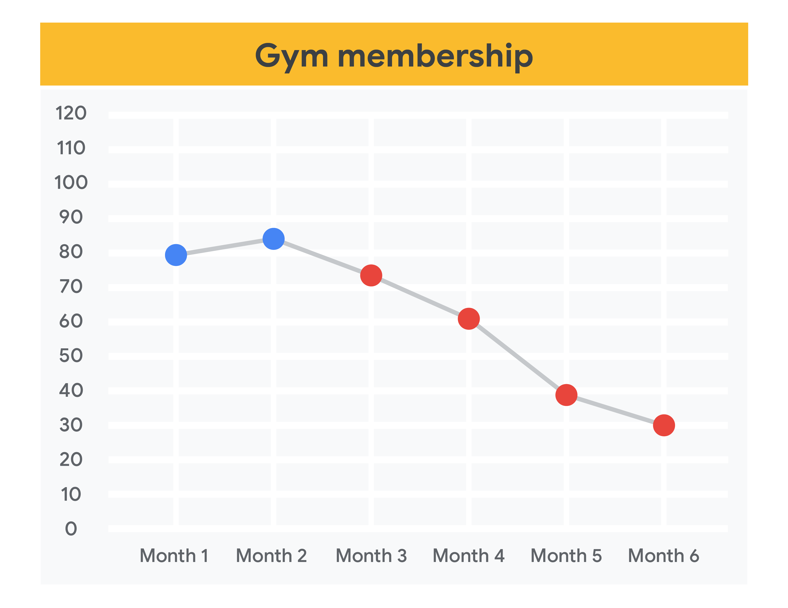
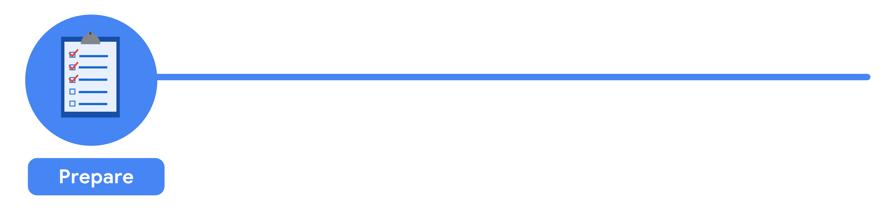
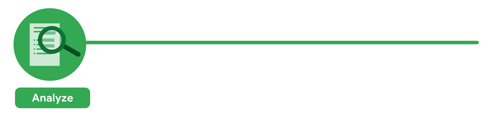
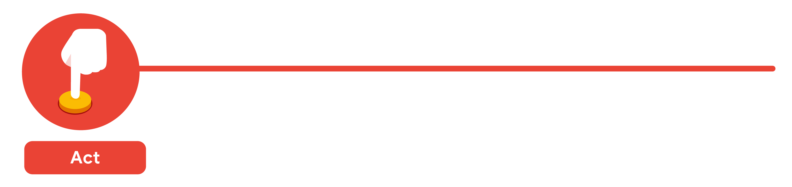
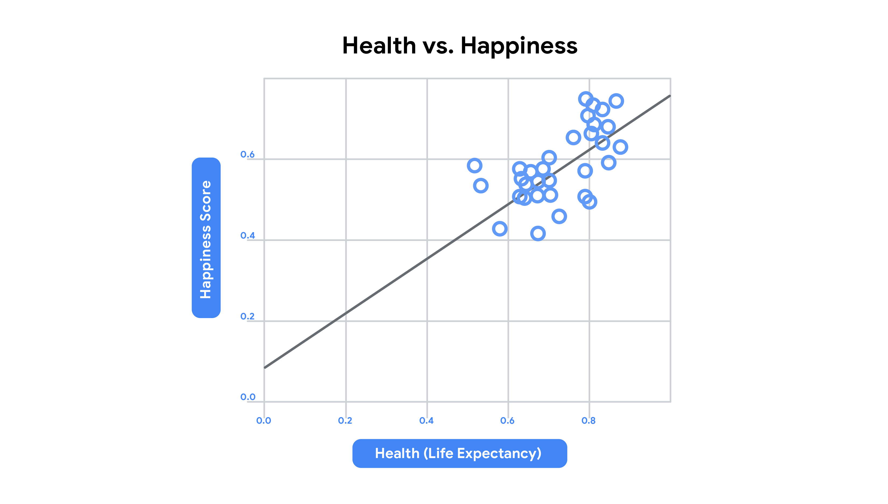
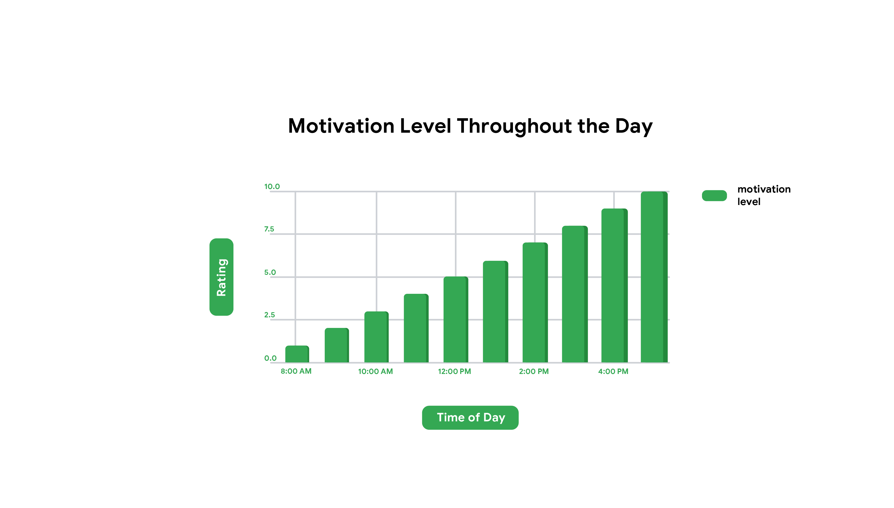
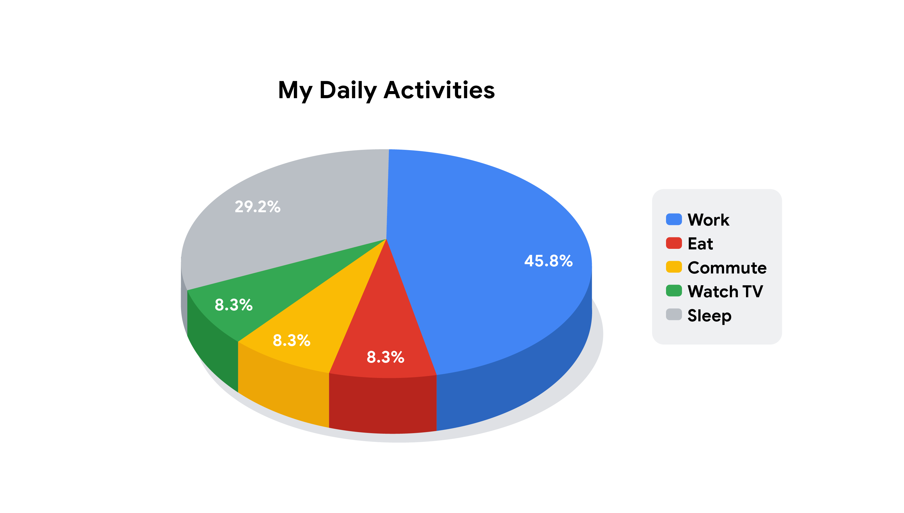

> Data-informed decision-making
>
> 基于数据的决策

You will learn the value of gathering data, how to prioritize data to meet project needs, and how to use data to inform your decision-making.

> 您将了解收集数据的价值，如何优先考虑数据以满足项目需求，以及如何使用数据为您的决策提供信息。

You will also learn how to explain your project data to stakeholders and team members using effective visuals and presentation-掩饰 techniques.

> 您还将学习如何使用有效的视觉和演示技术向利益相关者和团队成员解释您的项目数据。

**学习目标**

- Explain the value of data for a project manager and discuss the common types of project data.

	> 向项目经理解释数据的价值，并讨论项目数据的常见类型。

- Explain how to identify and prioritize the data a project requires to meet business needs.

	> 解释如何识别和确定项目所需数据的优先级，以满足业务需求。

- Demonstrate-证明,示范,演示 how to analyze data to inform project decision-making.

	> 演示如何分析数据，为项目决策提供信息。

- Tell a project’s data-informed story to stakeholders and project team members.

	> 向涉众和项目团队成员讲述项目的数据故事。

- Describe what types of visuals and demonstration techniques make an effective and accessible-易懂的 presentation.

	> 描述什么类型的视觉效果和演示技术使一个有效的和容易理解的演讲。

# Gathering data for a project

> 为项目收集数据

## Introduction: Data-informed decision-making

> 引言:数据决策

Hi there!

It's great to have you back.

So far, we've talked about tracking and measuring project progress.

> 到目前为止，我们已经讨论了跟踪和度量项目进度。

We've also discussed how to manage quality through different techniques and the benefits of continuous improvement.

> 我们还讨论了如何通过不同的技术和持续改进的好处来管理质量。

---

Now, I'm going to tell you all about data and data-informed decision making.

> 现在，我要告诉你们所有关于数据和基于数据的决策。

You'll learn how data impacts decisions, some of which occur during a project journey.

> 您将了解数据如何影响决策，其中一些是在项目过程中发生的。

You'll get answers to questions like: How do I use data in my project?

> 您将获得以下问题的答案:如何在项目中使用数据?

Which types of data should I search for?

> 我应该搜索哪些类型的数据?

And how do I determine what stakeholders need to know?

> 我如何确定利益相关者需要知道什么?

Now, more than ever, we have access to data at our fingertips-唾手可得 on our computers, tablets, and phones.

> 现在，我们比以往任何时候都更容易通过电脑、平板电脑和手机获取数据。

We use data every day to view the stats-统计 of our favorite athletes-运动员, examine our screen time on social media, and monitor our health.

> 我们每天都使用数据来查看我们最喜欢的运动员的统计数据，检查我们在社交媒体上的屏幕时间，并监控我们的健康状况。

Data is a part of our daily lives.

> 数据是我们日常生活的一部分。

Take, for example, online job search sites.

> 以在线求职网站为例。

These companies collect basic data you enter-输入—like your previous experience, location, maybe any degrees-学位 or certificates you might hold—and use that information to determine potential job matches for you.

> 这些公司会收集你输入的基本数据，比如你以前的工作经历、工作地点、你可能持有的学位或证书，然后利用这些信息为你确定潜在的工作匹配。

Jobs that don't fit the criteria of what you entered aren't likely to appear in your suggestions-建议,推荐.

> 不符合你输入标准的工作不太可能出现在你的推荐中。

This is just one way data is used to inform and influence our decisions.

> 这只是数据用于告知和影响我们决策的一种方式。

In this module, we'll discuss project data and how it informs decision-making and helps to prevent-防止,预防,阻碍 both major and minor-次要的 issues. 

> 在本模块中，我们将讨论项目数据，以及它如何为决策提供信息，并帮助预防重大和次要问题。

We'll also discuss how project-related data can be used to reach success metrics.

> 我们还将讨论如何使用与项目相关的数据来达到成功度量标准。

We'll go over common project data, such as tasks and issues, and discuss how analyzing this data and other metrics impacts project productivity and quality.

> 我们将讨论常见的项目数据，例如任务和问题，并讨论分析这些数据和其他度量如何影响项目的生产力和质量。

Finally, we'll demonstrate how data isn't just about numbers.

> 最后，我们将演示数据如何不仅仅是数字。

You can also tell a unique story using the power of data.

> 你也可以利用数据的力量讲述一个独特的故事。

Storytelling-讲故事 offers a memorable-难忘的,值得纪念的 way to communicate important aspects of your project.

> 讲故事提供了一种令人难忘的方式来传达项目的重要方面。

Pairing-配对 storytelling with data can convince-说服,劝服 stakeholders of ways to resolve problems and ensure a successful outcome.

> 将讲故事与数据相结合可以说服利益相关者解决问题的方法，并确保成功的结果。

So data certainly-确定,当然 has its benefits.

> 所以数据当然有它的好处。

There's a lot to learn about data, and we'll lay out some of the basics so you can confidently tackle-应付,解决 your projects.

> 关于数据有很多东西需要学习，我们将列出一些基础知识，以便您可以自信地处理您的项目。

Ready to get started?

Let's get to it in the next video.

## The value of data

> 数据的价值

Hi there!

In this video, we'll explain the value of data and how it impacts your projects.

> 在本视频中，我们将解释数据的价值以及它如何影响您的项目。

We'll also cover-覆盖,涉及 how you'll use data to communicate with stakeholders.

> 我们还将介绍如何使用数据与涉众进行通信。

Data is a big business.

> 数据是一门大生意。

There are 2.5 quintillion bytes of data created each day.

> 每天会产生2.5万亿字节的数据。

That's a lot of data and a lot of information!

> 这是大量的数据和信息!

Let's start by talking about what data is.

> 让我们先来谈谈什么是数据。

---

Data is a collection of facts or information, and through data analysis, you'll learn how to use data to draw conclusions-结论,推论 and make predictions-预测 and decisions.

> 数据是事实或信息的集合，通过数据分析，你将学习如何使用数据得出结论，做出预测和决策。

We use data daily to help us make decisions and improve performance.

> 我们每天都使用数据来帮助我们做出决策并提高绩效。

For example, my friend is a runner who participates in annual-年度的,一年一度的 five-kilometer and ten-kilometer runs.

> 例如，我的朋友是一个跑步者，每年参加五公里和十公里的跑步。

When she's training for a run, she uses the data on her GPS watch to measure her time and distance.

> 当她在训练跑步时，她使用GPS手表上的数据来测量她的时间和距离。

She can even calculate her pace by measuring the minutes-per-kilometer.

> 她甚至可以通过测量每公里的分钟数来计算自己的速度。

She uses the minutes-per-kilometer data to track her performance over time so that she can focus on improving for the future. 

> 她使用每公里数分钟的数据来跟踪自己的表现，这样她就可以专注于未来的改进。

Similarly, companies use data and data analysis to improve and bring value to their organization in a variety of ways.

> 类似地，公司使用数据和数据分析以各种方式改进并为其组织带来价值。

For example, companies source data on customer behavior and customer demand-强烈要求,需要,需求 to provide better services and create new products.

> 例如，公司获取有关客户行为和客户需求的数据，以提供更好的服务和创造新产品。

Netflix is a great example of a company that uses data intelligence-情报 to predict-预计,预测 what customers want.

> Netflix就是一个很好的例子，它利用数据智能来预测客户的需求。

By observing data points surrounding-周围的,附近的 types of genres-类型, ratings-收视率, and number of repeated viewings, Netflix recommends TV shows that they believe customers might like, therefore-因此,所以 improving the customer's viewing experience.

> 通过观察有关类型、收视率和重复观看次数的数据点，Netflix推荐他们认为客户可能会喜欢的电视节目，从而改善客户的观看体验。

In the same way, as a project manager, you can use data daily to make better decisions, solve problems, understand performance, improve processes, and understand your users.

> 同样，作为项目经理，您可以每天使用数据来做出更好的决策、解决问题、了解性能、改进流程并了解用户。

---

Let's examine how these benefits can impact a project.

> 让我们来看看这些好处是如何影响项目的。

Let's talk about how this can play out in our Plant Pals project at Office Green.

> 让我们来谈谈如何在绿色办公室的植物伙伴项目中发挥作用。

If you have the data on customer buying patterns and identify that your best-selling products are all tropical-热带的 plants, you'll be able to make better decisions when placing new plant orders with your supplier.

> 如果你有客户购买模式的数据，并确定你最畅销的产品都是热带植物，你就能在向供应商下新的植物订单时做出更好的决定。

You'll also be able to better understand your users and their preferences to improve your offerings and performance-性能.

> 您还可以更好地了解您的用户及其偏好，从而改进您的产品和性能。

Another daily benefit of data within your project team is the opportunity to improve processes.

> 数据在项目团队中的另一个日常好处是有机会改进流程。

If you have the data from your project tracker of the number of tasks completed, the number of escalations, or the number of issues that come up surrounding an internal process, you'll be able to deduce-推断,推论 where the majority-大多数 of issues are **stemming from**-源于.

> 如果您拥有来自项目跟踪器的数据，包括已完成的任务数量、升级数量或围绕内部流程出现的问题数量，那么您将能够推断出大多数问题的根源。

This data will help inform your decision on where to focus your attention to improve the process.

> 这些数据将帮助您决定将注意力集中在何处以改进流程。

While these are simple examples, through critical analysis, application, and execution, data becomes a powerful tool to guide any project in the right direction.

> 虽然这些都是简单的例子，但通过严格的分析、应用和执行，数据将成为引导任何项目朝着正确方向发展的强大工具。

Coming up, we'll discuss the types of project data you can use to do just that.

> 接下来，我们将讨论您可以使用的项目数据类型。

## Common types of project data

> 常见的项目数据类型

Hi again.

In the previous video, you learned about the value of data.

In this lesson, we'll discuss the common types of data that project managers collect and analyze regularly.

> 在本课中，我们将讨论项目经理定期收集和分析的常见数据类型。

We'll also discuss the tools you'll need to organize this data for your projects.

> 我们还将讨论为项目组织这些数据所需的工具。

Ready to get started? Okay, let's go!

---

As we discussed earlier, data is the collection of facts that can help inform decisions.

> 正如我们前面所讨论的，数据是有助于为决策提供信息的事实的集合。

You may start to notice how the project data impacts the team's daily activities and the overall progress and the success of the project.

> 您可能开始注意到项目数据是如何影响团队的日常活动以及项目的整体进展和成功的。

This is done by using various types of metrics.

> 这是通过使用各种类型的指标来完成的。

A metric is a quantifiable-可以计量的,可量化的 measurement-测量,计量 that is used to track and assess a business objective.

> 衡量标准是一种可量化的度量，用于跟踪和评估业务目标。

Metrics are based on selected goals.

> 度量标准基于选定的目标。

They vary per-每一,每个 project and serve as a key type of project data.

> 它们因项目而异，并作为项目数据的关键类型。

There are many types of project data you can use to determine progress and efficiency.

> 您可以使用许多类型的项目数据来确定进度和效率。

---

You can group project metrics into productivity metrics and quality metrics.

> 您可以将项目度量分组为生产力度量和质量度量。

Productivity typically measures progress and output over time.

> 生产力通常衡量一段时间内的进展和产出。

Productivity metrics allow you to track the effectiveness-有效性 and efficiency-效率,效能 of your project and include metrics like milestones, tasks, projections-估算,预测, and duration-持续时间.

> 生产力指标允许您跟踪项目的有效性和效率，并包括里程碑、任务、预测和持续时间等指标。

Let's break down each metric.

> 让我们分解每个指标。

As you may recall from an earlier course, a milestone is an important point within the project schedule that indicates progress and usually signifies completion of a deliverable or phase of the project.

> 正如您在前面的课程中所记得的，里程碑是项目进度表中的一个重要点，它指示进度，通常表示项目的可交付成果或阶段的完成。

And a project task is an activity that needs to be accomplished within a set period of time.

> 项目任务是需要在规定的时间内完成的活动。

A projection-体现,估算,预测 is how you predict-预言,预计 an outcome based on the information you have now.

> 预测是你如何根据你现在掌握的信息预测结果。

For example, you can predict-预言,预计 that with the resources you have at the start of the project, the project will be completed in six months.

> 例如，你可以预测，根据项目开始时的资源，项目将在六个月内完成。

The duration of a project is the total time it takes to complete a project from start to finish.

> 项目的持续时间是指从开始到结束完成一个项目所需要的总时间。

Duration can also be used for milestones and determining if you'll meet project deadlines.

> 持续时间也可以用于里程碑，并确定您是否能够满足项目截止日期。

This data is broken down into hours, days, weeks, months, and sometimes years.

> 这些数据被分解成小时、天、周、月，有时甚至是年。

So to recap, productivity metrics include milestones, tasks, projections, and duration.

> 总结一下，生产力指标包括里程碑、任务、预测/估算和持续时间。

---

Now let's discuss quality metrics.

> 现在让我们讨论质量度量。

Quality metrics relates to achieving acceptable outcomes and can include metrics such as the number of changes, issues, and cost variance-分歧,不一致, which all affect quality.

> 质量度量标准与实现可接受的结果相关，并且可以包括诸如变更、问题和成本差异的数量等度量标准，这些都影响质量。

Let's discuss each metric.

> 我们来讨论一下每个指标。

The number of changes during the project or project scope helps to monitor risks.

> 项目或项目范围内的变更数量有助于监控风险。

Changes show any inconsistencies from the initial requirements of the project.

> 变更显示了与项目初始需求的任何不一致。

A series of compounding-合成,混合 small changes may indicate a bigger issue and provide early warning signs-信号 of these issues.

> 一系列复杂的小变化可能表明一个更大的问题，并提供这些问题的早期预警信号。

Using a change log to keep a record of these changes is a useful tool for communicating with stakeholders about why something is taking a long time or costs more than expected.

> 使用变更日志来保存这些变更的记录是与涉众沟通的有用工具，可以了解为什么某些事情花费的时间较长或成本高于预期。

A change log is a record of all of the notable-显要的,值得注意的 changes on a project.

> 变更日志是项目中所有重要变更的记录。

---

An issue is a known and real problem that may affect the ability to complete a task.

> 问题是一个已知的、真实的问题，它可能会影响完成任务的能力。

For example, an issue might be the delay-推迟,延期 of legal approval for an advertisement-广告 you were hoping to launch or the missing number of confirmed seats-座位 to secure-确保,保证 a venue-发生地点,场所 for a business conference-研讨会.

> 例如，问题可能是您希望发布的广告的法律批准延迟，或者缺少确定的座位数量以确保商务会议的场地。

Another quality metric is cost variance-差额,分歧,不一致.

> 另一个质量度量是成本差异。

It illustrates the difference between the actual cost and the budget cost.

> 它说明了实际成本和预算成本之间的差异。

Simply put, cost variance compares what you plan to spend versus what you actually spent.

> 简单地说，成本差异比较的是你计划的花费和你实际的花费。

Let's put it in an example.

If you budgeted to only host 250 attendees-出席者 at an upcoming business conference but 275 people showed up and the venue-发生地点,场所 charges-费用 you for those additional guests-客人, the actual costs will be higher than your initial budget or estimate.

> 如果在即将举行的商务会议上，你的预算是只接待250名与会者，但有275人出席，而且会场向你收取了额外客人的费用，那么实际成本将高于你最初的预算或估计。

So to recap, quality metrics can include things like number of changes, issues, and cost variance.

> 因此概括一下，质量度量可以包括诸如变更数量、问题和成本差异之类的内容。

While these data points are commonly tracked by project managers, there are dozens more that you can **leverage-影响力,手段 to**-利用 inform decisions in your project.

> 虽然这些数据点通常由项目经理跟踪，但您可以利用更多的数据点来为项目中的决策提供信息。

The great news is that there's a lot of sophisticated-复杂的 software and tools dedicated-致力于,献身于 to project management and data analysis, so you'll have help keeping track of all of these different types of data in one centralized location.

> 好消息是，有很多复杂的软件和工具专门用于项目管理和数据分析，所以你可以在一个集中的位置跟踪所有这些不同类型的数据。

Project management tools like Workfront and JIRA track activity and provide readable results so you can measure the overall health of your project.

> 像Workfront和JIRA这样的项目管理工具可以跟踪活动并提供可读的结果，这样您就可以衡量项目的整体健康状况。

Data analysis tools like Tableau are useful for data visualization.

> 像Tableau这样的数据分析工具对于数据可视化非常有用。

---

Now you know a bit more about how to identify common types of data.

> 现在您了解了更多关于如何识别常见数据类型的信息。

You can also ID common project management software and tools that can help you manage and analyze data.

> 您还可以识别可以帮助您管理和分析数据的常见项目管理软件和工具。

In the next lesson, we'll cover how data helps you to make informed decisions.

> 在下一课中，我们将介绍数据如何帮助您做出明智的决策。

Meet you there.

## Common data metrics for project management

> 用于项目管理的通用数据度量

There are many types of project data you can use to determine your team’s progress and efficiency, evaluate the success of your project, and inform project decisions.

> 您可以使用许多类型的项目数据来确定团队的进度和效率，评估项目的成功，并为项目决策提供信息。

While you don't need to be a data expert, knowing how to measure, track, and evaluate the right kind of data will help you deliver the most value and impact. 

> 虽然你不需要成为数据专家，但知道如何衡量、跟踪和评估正确的数据类型将帮助你提供最大的价值和影响。

This reading will recap some of the common types of data from the previous video and introduce a few more key data points that can help you manage projects and work with stakeholders.

> 本文将回顾上一视频中的一些常见数据类型，并介绍一些可以帮助您管理项目和与利益相关者合作的关键数据点。

This reading will also introduce a few ways to interpret-解释,说明 the data so that you can reduce risks and make the right decisions about your teams and projects.

> 本文还将介绍一些解释数据的方法，以便您可以减少风险，并对您的团队和项目做出正确的决策。

**The benefits of analyzing data in project management**

> 在项目管理中分析数据的好处

As a project manager, you can use data daily to make better decisions, solve problems, improve performance and processes, and understand your users. 

> 作为项目经理，您可以每天使用数据来做出更好的决策、解决问题、改进性能和流程，并了解您的用户。

For example, if you have data on customer buying patterns, you can identify your best-selling products, and you'll be able to make smarter decisions when placing new product orders with your suppliers.

> 例如，如果您有客户购买模式的数据，您可以确定最畅销的产品，并且您可以在向供应商下新产品订单时做出更明智的决策。

This data will also help you better understand your users and their preferences so you can improve your product offerings and performance. 

> 这些数据还将帮助您更好地了解用户及其偏好，从而改进产品提供和性能。

You can also use project team data to help you refine your processes.

> 您还可以使用项目团队数据来帮助您改进流程。

For example, if your team is experiencing-经历 an issue, analyzing data from your project tracker about the number of tasks completed, escalations, or internal process problems can help you find the source.

> 例如，如果您的团队遇到了一个问题，那么分析来自项目跟踪器的有关已完成任务数量、升级或内部流程问题的数据可以帮助您找到问题的根源。

This will allow you to make an informed decision about where to focus your efforts to improve processes.

> 这将使您能够做出明智的决定，决定在哪里集中精力改进流程。

Through critical-批判的 analysis, application, and execution, data becomes a powerful tool to guide any project in the right direction.

> 通过批判性的分析、应用和执行，数据成为引导任何项目朝着正确方向发展的强大工具。

**Data, metrics, and analytics**

> 数据、指标和分析

Three images:

Numbers grouped in a circle to represent-代表 data;

> 组成圆圈的数字表示数据;

a graph with rulers lining the x and y axis to represent metrics;

> 一种用标尺排列x轴和y轴来表示度量的图形;

two people working on a puzzle-难题 to represent analytics.

> 两个人一起解决一个谜题来代表分析。

**Data** is information.

It’s the numbers and feedback available to you about different aspects of your project.

> 它是关于项目不同方面的数字和反馈。

**Metrics** are how you measure your data.

> **指标**是你衡量数据的方式。

They define the important or specific information (data) you need to know about your project, such as productivity, quality, or engagement.

> 它们定义了您需要了解的关于项目的重要或特定信息(数据)，例如生产力、质量或参与度。

Once you determine your project's metrics, you analyze the data according to those metrics to find patterns and answer questions about your project.

> 一旦确定了项目的度量标准，就可以根据这些度量标准分析数据，以找到模式并回答有关项目的问题。

This process is called **analytics**: using data to answer questions, discover relationships, and predict-预测,预言 unknown outcomes. 

> 这个过程被称为分析：使用数据来回答问题，发现关系，预测未知的结果。

When analyzing data, ask: What do the metrics mean to you?

> 在分析数据时，要问:这些指标对你来说意味着什么?

How do you want to use the metrics you've chosen?

> 你希望如何使用你所选择的指标?

Can you find patterns to make predictions-预测 about your project?

> 你能找到模式来预测你的项目吗?

Can you find ways to improve—or **optimize-优化**—certain aspects of your project?

> 你能找到改进或优化项目某些方面的方法吗?

What lessons can you draw from your project's data?

> 你能从项目数据中得出什么教训?

What follows are some common categories of metrics used in project management and a brief explanation of what they are and how they're useful to a project.

> 以下是项目管理中使用的一些常见的度量标准类别，并简要解释了它们是什么以及它们如何对项目有用。

Keep in mind that your use of different metrics isn’t limited to these categories.

> 请记住，您使用的不同指标并不局限于这些类别。

All of your project data is interrelated-相互关连.

> 所有的项目数据都是相互关联的。

The same metric can also provide different information when applied to different aspects of your project.

> 当应用于项目的不同方面时，相同的度量也可以提供不同的信息。

**Productivity metrics**

> 生产力指标

Productivity metrics typically measure progress and output over time.

> 生产力指标通常衡量一段时间内的进度和产出。

They allow you to track—or predict—the effectiveness-有效性,效力 and efficiency of your project team. 

> 它们允许您跟踪—或预测—项目团队的有效性和效率。

To track your team's productivity-生产率,生产力 over time, analyze the **number of tasks or milestones completed** in a given time frame.

> 要跟踪团队的生产力，请分析在给定时间框架内完成的任务或里程碑的数量。

Ask questions like, what percentage of tasks are completed on time, and how long do they usually take?

> 问一些问题，比如按时完成任务的比例是多少，完成任务通常需要多长时间?

Or, if tasks were not completed on time, how much longer than anticipated-预期,预料 did it take to complete all the tasks?

> 或者，如果任务没有按时完成，完成所有任务所需的时间比预期长多少?

**On-time completion rates** can help illustrate to clients and stakeholders how the project is progressing and when they can expect certain deliverables to be ready.

> **准时完成率**有助于向客户和利益相关者说明项目的进展情况，以及他们何时可以期望某些可交付成果准备就绪。

If your project's completion rates are high, it means you're doing a good job of meeting your completion goals.

> 如果你的项目完成率很高，这意味着你在完成目标方面做得很好。

If the rates are low, it means you're missing deadlines.

> 如果费率低，就意味着你错过了截止日期。

Analyzing data can help you make decisions about things like improving or implementing new processes, or re-evaluating how you estimate project scope, complexity, and timeline.

> 分析数据可以帮助您做出诸如改进或实施新流程之类的决策，或者重新评估如何估计项目范围、复杂性和时间线。

Calculating **duration** (how long something takes) can be useful for setting and evaluating tasks and milestones and determining if you'll meet project deadlines.

> 计算持续时间(某件事需要多长时间)对于设置和评估任务和里程碑以及确定你是否能在项目截止日期前完成任务非常有用。

Tracking task duration can improve the accuracy-准确性,精确性 of estimating a project's timeline.

> 跟踪任务持续时间可以提高估算项目时间轴的准确性。

This data is broken down into hours, days, weeks, months, and sometimes years. 

> 这些数据被分解成小时、天、周、月，有时甚至是年。

You can also analyze current information to predict future outcomes and make **projections-估算,预测** (or **forecasts**) about productivity trends-趋势,动态, project durations, costs, performance or quality.

> 您还可以分析当前信息来预测未来的结果，并对生产力趋势、项目持续时间、成本、性能或质量做出预测(或预测)。

This kind of data empowers-授权 you to proactively-主动地,积极 manage your project and its resources and measure the accuracy of your projections over time.

> 这种类型的数据使您能够主动管理项目及其资源，并随着时间的推移度量您的预测的准确性。

For example, analyzing your team's overall **performance** or **velocity-速度,速率** can answer questions such as, is the team completing its tasks and milestones?

> 例如，分析团队的整体绩效或速度可以回答以下问题:团队是否完成了任务和里程碑?

What percentage of tasks is the team finishing on time?

> 团队按时完成任务的比例是多少?

Predicting the future may be impossible-不可能的, but building a better understanding of it and refining your method for making projections is achievable and valuable.

> 预测未来可能是不可能的，但更好地理解它并改进你的预测方法是可以实现的，也是有价值的。

**Quality metrics**

> 质量指标

Quality metrics relate to achieving acceptable outcomes and can include metrics such as number of changes, issues, and cost variance, all of which affect quality.

> 质量度量标准与实现可接受的结果相关，并且可以包括诸如变更数量、问题和成本差异等度量标准，所有这些都影响质量。

**Changes** refer to differences in any aspect of the project from what was originally planned or required.

> **变更**是指项目在任何方面与最初计划或要求的差异。

**Issues** are problems that may affect task completion—and often result in a change.

> **问题**是可能影响任务完成的问题，通常会导致变更。

Track the number of changes and issues to identify patterns, refine processes, and share information about the project with stakeholders.

> 跟踪变更和问题的数量，以确定模式，改进过程，并与涉众共享项目信息。

**Cost** or **budget variance** is the difference between the actual amount of money spent on a project and the amount that was budgeted for the project.

> 成本或预算差异是指在项目上实际花费的金额与项目预算金额之间的差额。

Over time, this data can help you understand how well you're estimating budgets for your projects.

> 随着时间的推移，这些数据可以帮助您了解您对项目预算的估计情况。

A low variance means you've estimated your project budget accurately.

> 低方差意味着您已经准确地估算了项目预算。

A high variance means you should reevaluate your estimation process.

> 高方差意味着您应该重新评估您的估计过程。

You could be under- or over-estimating costs for your budget, or you may not be tracking expenses-开销 effectively.

> 你可能低估或高估了你的预算成本，或者你可能没有有效地跟踪开支。

**Happiness and satisfaction**

> 幸福和满足

Project managers at Google use a sub-set of metrics called **happiness metrics** that also relate to quality**.**

> 谷歌的项目经理使用一种称为“幸福指标”的指标子集，它也与质量有关

These are metrics that relate to different aspects of the user's overall satisfaction with a product or service, like **visual appeal-吸引力**, how likely they are to **recommend**, and **ease-容易,舒适 of use**. 

> 这些指标与用户对产品或服务的整体满意度的不同方面有关，如**视觉吸引力**，**推荐**的可能性**和**易用性**。

Happiness metrics can generally-通常 be captured with a well-designed survey or by tracking revenue-收入,收益 generated, customer retention, or product returns. 

> 幸福指标通常可以通过精心设计的调查或跟踪产生的收入、客户留存率或产品退货来获得。

**Customer satisfaction scores** reflect user **attitudes-态度,看法**, **satisfaction**, or perceived **ease of use.**

> **用户满意度得分**反映用户**态度**、**满意度**或感知**易用性**

These scores measure how well the project delivered what it set out to do and how well it satisfies customer and stakeholder needs.

> 这些分数衡量项目交付的效果，以及满足客户和涉众需求的效果。

Customer satisfaction scores generally represent a combined-结合 metric—the sum of several different happiness metrics.

> 客户满意度得分通常代表一个综合指标——几个不同的幸福指标的总和。

For example, on a satisfaction survey, a customer might separately rate a product's appearance-外表,外观 as 6/10, ease of use as 7/10, and likeness-相似 to recommend or use again as 8/10.

> 例如，在满意度调查中，客户可能分别将产品的外观评为6/10，易用性为7/10，推荐或再次使用的可能性为8/10。

The overall customer satisfaction score would then be 7/10. 

> 那么整体客户满意度得分将是7/10。

You will need to determine what scores are acceptable for your project by discussing with stakeholders what the most important aspects of the project are. 

> 您需要通过与涉众讨论项目中最重要的方面来确定您的项目可以接受的分数。

**Adoption-采用,采纳 and engagement**

> 采用和参与

Another set of metrics related to quality are adoption and engagement.

> 另一组与质量相关的指标是采用率和参与度。

**Adoption** refers to whether or not a product, service or process is accepted and used.

> **采用**是指产品、服务或过程是否被接受和使用。

**Engagement** refers to the degree-程度 to which it is used—the frequency-频繁,频率 of use, amount of time spent using it, and the range of use. 

> **参与度**指的是使用的程度——使用的频率、使用的时间和使用的范围。

It might help to think of these in terms of throwing a party: your adoption metrics would reveal-表明,证明 to you whether or not people accepted the invitation-邀请 and showed up.

> 用举办派对的方式来考虑这些可能会有所帮助:你的采纳指标将向你显示人们是否接受邀请并出席。

The engagement metrics would tell you how active they were at the party—whether they participated in activities or interacted-相互作用,相互影响 with other attendees, if they invited their friends to come with them, and how long they stayed. 

> 参与度指标会告诉你他们在聚会上有多活跃——他们是否参与活动或与其他参与者互动，他们是否邀请朋友一起来，以及他们待了多长时间。

**Adoption metrics** for a product or service release, like an app, software program, delivery service, or gym-健身房 membership, would be similar to the party example.

> 产品或服务发布(如应用程序、软件程序、交付服务或健身房会员资格)的采用指标将类似于聚会的例子。

However, they can be a bit more complex-复杂 if you need to track metrics for more than one thing, like whether users make additional purchases or sign up for premium-高品质的 features. 

> 然而，如果你需要追踪不止一件事的参数，比如用户是否进行额外购买或注册高级功能，情况就会变得复杂一些。

Each project will need to define its own set of successful adoption metrics, such as:

> 每个项目都需要定义自己的一套成功采用的度量标准，例如:

- Conversion-转换,转换 rates

- Time to value (TTV)

	> 时间价值比(TTV)

- Onboarding-入职 completion rates

	> 入职完成率

- Frequency of purchases

	> 采购频率

- Providing feedback (rating the product or service)

	> 提供反馈(评价产品或服务)

- Completing a profile

	> 完成曲线图

**Engagement metrics** tell you to what degree a product, service, or process is being used.

> 用户粘性指标告诉你产品、服务或流程的使用程度。

They reveal-揭示,透露 the frequency and type of customer interaction and participation over time.

> 随着时间的推移，它们揭示了客户互动和参与的频率和类型。

Engagement metrics might include the daily usage-使用 rate of a design feature or tracking orders and customer interactions. 

> 用户粘性指标可能包括设计功能的每日使用率或跟踪订单和客户交互。

As a project manager, you're not only concerned-关心 with the end user's level of engagement.

> 作为项目经理，您不仅要关心最终用户的参与程度。

It's just as important to monitor stakeholder and team member engagement as well.

> 监控涉众和团队成员的参与也同样重要。

Measuring stakeholder participation by tracking the **frequency of communication**, **responses** to emails or updates, **attendance-出席,出勤** at meetings, or **level of input** can give you a sense of whether or not stakeholders are finding value in the project.

> 通过跟踪沟通的频率、对电子邮件或更新的回应、出席会议的人数或投入的水平来衡量干系人的参与，可以让您了解干系人是否在项目中发现了价值。

A lack of meaningful engagement could put your project at risk.

> 缺乏有意义的参与可能会使你的项目处于危险之中。

Stakeholders may not be aware of changes or the overall progress of the project, and therefore-因此,所以 the final outcome of the project may not meet their expectations.

> 干系人可能不知道项目的变化或整体进展，因此项目的最终结果可能不符合他们的期望。

Measuring team member engagement is vital to the success of your project because the more engaged they are, the more productive they are, and the more likely they are to produce high-quality results. 

> 衡量团队成员的参与度对于项目的成功是至关重要的，因为他们的参与度越高，他们的生产力就越高，他们就越有可能产生高质量的结果。

Ideally-理想地,观念上地, you want your adoption and engagement metrics to increase or to at least meet the goal metrics that were established with stakeholders earlier in the project.

> 理想情况下，您希望您的采用和参与度量增加，或者至少满足项目早期与涉众建立的目标度量。

If there is no increase, or the metrics drop-下降, then your rates are low and therefore not as successful.

> 如果没有增加，或者参数下降，那么你的比率就很低，因此不成功。

Check out the resources below for a more in-depth understanding of how and why to measure adoption and engagement.

>请查看下面的参考资料，以更深入地了解如何以及为什么度量采用率和参与度。

**Key takeaway**

Data, metrics and analytics are all important to the success of your project.

> 数据、参数和分析对于项目的成功都很重要。

You'll need to have some familiarity with how to collect and measure data, and how to use the data to tell you about different aspects of your project.

> 您需要熟悉如何收集和测量数据，以及如何使用数据来告诉您项目的不同方面。

Depending on the project and its unique goals, some metrics will be more important than others.

> 根据项目及其独特的目标，一些指标将比其他指标更重要。

It's your job to make sure you understand which metrics your stakeholders are most interested in and what elements impact your team's ability to deliver quality results on time and within budget.

> 你的工作是确保你了解你的涉众最感兴趣的指标，以及哪些因素会影响你的团队按时在预算范围内交付高质量结果的能力。

| **Want to learn more? Check out the following resources:**   |
| :----------------------------------------------------------- |
| [A Comprehensive Guide To Project Management Metrics](https://www.wrike.com/blog/what-are-project-management-performance-metrics/) |
| [Data-Driven Project Management: The 4 Most Important Data Points to Look At](https://top5projectmanagement.com/articles/data-driven-project-management-the-4-most-important-data-points-to-look-at/) |
| [Project Analytics: Benefits, Challenges and First Steps](https://www.ecosys.net/blog/project-analytics-benefits-challenges-and-first-steps/) |
| [Project Analytics to Improve Project and Portfolio Decision Making](https://www.pmi.org.in/conference2017/pdfs/papers-pdfs/theme-3-rapidly-changing-world/21-Project-Analytics-to-Improve-Project.pdf) |
| [Project Management Metrics ](https://www.workfront.com/project-management/metrics) |
| [Productivity Metrics: Why They’re Important & 4 Examples](https://www.ringcentral.com/us/en/blog/productivity-metrics/) |

# Prioritizing and analyzing data

> 对数据进行优先排序和分析

## Discerning-辨别,识出 important data

> 辨别重要数据

Welcome back.Let's get back to discussing all things data.

欢迎回来。让我们继续讨论有关数据的一切。

Earlier, we learned about what data is, its value to the project manager, and the different types of data a project manager works with.

> 早些时候，我们了解了数据的定义，以及它对项目经理的价值，以及项目经理在工作中会处理不同类型的数据。

In this lesson, we'll discuss how to identify the most important data for your project, how to prioritize the data you collect, and how to effectively gather-收集,采集 priorities from your stakeholders so that you're meeting your goals.

> 在这节课中，我们将讨论如何确定项目中最重要的数据，如何对你收集的数据进行优先排序，以及如何有效地从利益相关者那里获取他们的优先事项，以确保你能够实现项目的目标。

Let's get started.

> 让我们开始吧。

---

Did you know that the average temperature-温度,体温 for most humans-人们 is 98.6 degrees Fahrenheit-华氏度? So if your temperature-温度,体温 reached 100.4 degrees Fahrenheit or higher, there would likely be signals that something's not quite right, like a sweaty-出汗的 forehead-前额, muscle-肌肉,力气 aches-疼痛, or even dehydration-脱水.

> 你知道吗，大多数人的平均体温是华氏98.6度吗？所以，如果你的体温达到华氏100.4度或更高，很可能会出现信号表明有些不太对劲，比如额头出汗、肌肉疼痛，甚至脱水。

Your brain-大脑 would begin to receive signals that something is off because it's the brain's job to pay attention to the signals that indicate there's a problem threatening-威胁,危及 your overall health. That's how you should think about data when it comes to managing your project.

> 你的大脑会开始接收这些信号，表明有问题正在威胁你的整体健康。这就是你在管理项目时应该思考数据的方式。

There are all kinds of information and facts that you can gather as a project manager, but it's important for you to be aware of the signals that threaten the overall success of the project.

> 作为项目经理，你可以收集各种信息和事实，但重要的是要了解威胁项目整体成功的信号。

A signal is an observable-看得见的,显著的 change, and it can help you to determine the overall health of your project and identify early signs that something isn't quite right.

> 信号是可观察到的变化，它可以帮助你确定项目的整体健康状况，并识别早期出现的问题迹象。

Being aware of the different types of data you have access to and knowing which signals to respond to are key to deciding what data is most important.

> 了解你可以访问的不同类型的数据以及知道应该如何响应的信号对于决定哪些数据最重要至关重要。

Maybe you're asking yourself, "How do I determine what data is important?" Great question.

> 也许你会问自己：“如何确定哪些数据重要？”这是一个很好的问题。

As a project manager, it's up to you to look for signals and to prioritize data to deliver positive-积极的,乐观的 results. There are a couple of ways you can begin to do this.

> 作为项目经理，需要由你来寻找信号并优先考虑数据以提供积极的结果。你可以开始有几种方法。

One way is to observe your team's productivity and output. Identify which tasks contribute most to the overall goal. This will help you determine the importance of which data points—in this case, tasks and activities—you should focus on.

> 其中一种方法是观察你的团队的生产力和产出。确定哪些任务对整体目标的贡献最大。这将帮助你确定哪些数据点的重要性，比如任务和活动，你应该关注。

Secondly, prioritize the data or metrics that are most valuable to stakeholders. For example, let's say you have an ongoing project at a manufacturing-生产,制造 company to release a portable-便携式的,轻便的 home appliance-家用电器 by the third quarter. Your stakeholder is concerned-担心,忧虑 about whether or not you'll meet the deadline. Okay, start by thinking, what data do you have about the project?

> 其次，优先考虑对利益相关者最有价值的数据或指标。例如，假设你在一个制造公司进行一个到第三季度发布便携家电的持续项目。你的利益相关者担心你是否能按期完成项目。好的，首先思考一下，关于这个项目你有哪些数据？

You know that it's the first quarter and you're already $2,000 over budget. But you also know that you're 30 days ahead of schedule according to your burndown-燃尽图 chart, which measures time against-与…相比,反对,违背 the amount of work done and the amount of work remaining-剩下的,遗留的. You may think your project is running as scheduled, but there are additional things to consider.

> 你知道现在是第一季度，你的预算已经超支了2,000美元。但你也知道，根据你的燃尽图表，即度量时间与已完成的工作量和剩余工作量的比较，你的进度比计划提前30天。你可能认为你的项目按计划进行，但还有其他要考虑的事情。

For one, the number of tasks has increased by ten percent over the last three weeks because your stakeholders want to add more features to the appliance-家用电器,装置. And now your team's productivity is slowing down because they're starting to **burn out**-精疲力竭 from the late nights and long hours required to add in those new features. Now how do you feel about meeting that third quarter deadline? Not so good, right? What do you do?

> 首先，过去三周内任务数量增加了百分之十，因为你的利益相关者希望为这个家电增加更多功能。现在，你的团队的生产力正在下降，因为他们为了添加新功能而通宵达旦工作，时间长了，他们开始感到疲倦。现在对于达到第三季度的截止日期你有什么感觉？感觉不太好，对吧？你会怎么做？

You might be tempted-引诱,诱惑 to focus on the signal that you're $2,000 over budget, but if your stakeholders communicated that they're more concerned with meeting the deadline than they were about being over budget, then you'll want to keep an eye on key signals related to time and scope rather than budget, and then **hone-磨练,训练 in**-聚焦,专注 on those signals to identify and prioritize areas to improve.

> 你可能会倾向于关注你的预算超支这个信号，但如果你的利益相关者传达他们更担心截止日期而不是预算超支，那么你将希望关注与时间和范围相关的关键信号，而不是预算，然后集中精力识别和优先处理改进的领域。

The relevant data tells you you'll be able to meet the deadline, provided that stakeholders stop requesting new product features that result in more tasks for your team to complete. You can use your productivity metrics to forecast how you'll manage an increase in scope with your team's current productivity rate and communicate this to your stakeholder.

> 相关数据告诉你，只要利益相关者不再要求添加新的产品功能，从而导致团队需要完成更多任务，你将能够按时完成截止日期。你可以使用生产率指标来预测如何在当前生产率的情况下管理范围的增加，并将这一信息传达给利益相关者。

To avoid having to reset-调整,重新设置 expectations with stakeholders again and again, you can keep your project plan up to date with the project's priorities and ensure that this information is accessible to everyone. Stakeholders can look to your project plan for a high-level overview of answers to important questions, success criteria, artifacts-文物, and the overall health of your project.

> 为了避免不断与利益相关者重新设定期望，你可以保持项目计划与项目的优先级保持一致，并确保这些信息对每个人都是可访问的。利益相关者可以查看你的项目计划，以获取关于重要问题、成功标准、文物以及项目整体状况的高级概述。

Remember, there are a lot of data points available to you. Using signals, focusing on the tasks that have the biggest impact on the project goal, and aligning to your stakeholders' priorities are a good way to help you prioritize the right tasks. Now that you identified data and prioritized it so that you're working to meet business needs, the next thing to determine is how to use the data to make better decisions. We'll cover that when we connect in the next video.

> 请记住，有很多数据点可供你使用。使用信号，关注对项目目标影响最大的任务，以及与利益相关者的优先事项保持一致，这是帮助你优先考虑正确任务的好方法。既然你已经确定了数据并为了满足业务需求进行了优先级排序，下一步要确定如何使用数据做出更好的决策。我们将在下一个视频中讨论这个问题。

## Data ethics-行为准则,道德规范 considerations

> 数据道德考虑

In the previous video, you learned how to use knowledge to discern data and how signals help prioritize data.

> 在之前的视频中，您学习了如何使用知识来识别数据以及信号如何帮助确定数据的优先级。

This reading will cover the importance of **data ethics** and two key principles: **data privacy** and **data bias-倾向,偏差**.

> 本阅读将涵盖**数据伦理**的重要性和两个关键原则:**数据隐私**和**数据偏差**。

**Data ethics**

> 数据道德

As a project manager, data collection and analysis will be a key part of your projects.

> 作为项目经理，数据收集和分析将是您项目的关键部分。

As you’ve learned, you’ll collect data from a variety of sources, including focus groups, interviews and questionnaires-问卷调查.

> 正如你所了解的，你将从各种来源收集数据，包括焦点小组、访谈和问卷调查。

The data you collect will usually hold **PII (personally identifiable information)**—information that could be used to directly identify, contact, or locate an individual-单独的,个人的.

> 您收集的数据通常会包含 PII(个人身份信息)-可用于直接识别、联系或定位个人的信息。

A lot of times, you will also need to report on the data you collect to stakeholders, customers, and your project team.

> 很多时候，您还需要向涉众、客户和项目团队报告收集到的数据。

Collecting, analyzing, and sharing this data in an ethical-道德的 way is extremely-极度,非常 important for maintaining the integrity-完整,完全 of your organization, your projects, and your position.

> 以合乎道德的方式收集、分析和共享这些数据，对于维护组织、项目和职位的完整性至关重要。

**Data ethics** is the study-研究,调查 and evaluation-评估 of moral-有道德的 challenges-挑战 related to data collection and analysis.

> **数据伦理学**是对与数据收集和分析相关的道德挑战的研究和评估。

This includes generating, recording, curating, processing, sharing, and using data in order to come up with ethical solutions.

> 这包括生成、记录、整理、处理、共享和使用数据，以便提出合乎道德的解决方案。

Businesses apply data ethics practices so they can:

> 企业应用数据道德实践，以便他们可以:

- Comply-遵从,服从 with regulations-规章制度,规则

	> 遵守法规

- Show that they are trustworthy

	> 表现出他们是值得信赖的

- Ensure fair and reasonable-合情理的,合适的 data usage

	> 确保公平合理的数据使用

- Minimize biases-偏见

	> 减少偏见

- Develop a positive public perception-感觉,认识

	> 树立积极的公众形象

Data ethics is rooted in several principles.

> 数据伦理植根于几个原则。

In this reading, we will focus on two of these principles: **data privacy** and **data bias**.

> 在本文中，我们将重点关注其中两个原则:**数据隐私**和**数据偏差**。

**Data privacy**

> 数据隐私

**Data privacy** is a key part of data ethics.

> **数据隐私**是数据道德的关键部分。

Data privacy **deals with**-处理,应对,涉及 the proper-正确的 handling of data.

> 数据隐私涉及数据的正确处理。

This includes the purpose-目的,意图 of data collection and processing-处理, privacy preferences, the way organizations manage personal data, and **the rights**-权利 of individuals.

> 这包括数据收集和处理的目的、隐私偏好、组织管理个人数据的方式以及个人的权利。

It focuses on making sure the ways we collect, process, share, archive, and delete data are all in accordance-按照,依据 with the law.

> 它的重点是确保我们收集、处理、共享、存档和删除数据的方式都符合法律规定。

As a project manager, it is your responsibility to protect the data you collect.

> 作为一个项目经理，保护你收集的数据是你的责任。

You can help ensure the privacy of data collected from users, stakeholders, and others for your projects by:

> 您可以通过以下方式帮助确保从您的项目的用户、利益相关者和其他人那里收集的数据的隐私:

- **Increasing data privacy awareness-意识,感悟能力**. Make sure every member of your project team—plus the vendors, contractors, and other stakeholders from outside of your company—are made aware of your organization's data security and privacy protocols.

	> **提高数据隐私意识**。确保项目团队的每个成员——加上供应商、承包商和公司外部的其他利益相关者——都了解组织的数据安全和隐私协议。

- **Using security tools**. Free security tools, like encrypted storage solutions and password managers, can decrease-减少,降低 your project’s vulnerability-弱点 to a data breach-破坏. In a lot of applications, like ones that are part of Google Workspace and Microsoft OneDrive, privacy settings can be adjusted to only give access to specific individuals.

	> **使用安全工具**。免费的安全工具，如加密存储解决方案和密码管理器，可以减少你的项目对数据泄露的脆弱性。在很多应用程序中，比如谷歌Workspace和Microsoft OneDrive的一部分，隐私设置可以调整为只允许特定的个人访问。

- **Anonymizing data**. Data anonymization refers to one or more techniques such as blanking-使模糊不清, hashing-散列, or masking-掩蔽,隐蔽 personal and identifying-识别 information to protect the identities-身份,特性 of people included in the data. This helps protect individuals’ personal information by keeping them anonymous. Once the information has been anonymized, it can then be used and shared freely. Types of data that should be anonymized include names, telephone numbers, social security numbers, email addresses, photographs, and account numbers.

	> 匿名数据。数据匿名化是指一种或多种技术，如消隐、散列或屏蔽个人和识别信息，以保护数据中包含的人的身份。这有助于通过保持匿名来保护个人信息。一旦信息被匿名化，它就可以被自由使用和共享。应该匿名化的数据类型包括姓名、电话号码、社会安全号码、电子邮件地址、照片和帐号。

**Data bias**

> 数据偏差

Another important data ethics practice is making sure that the data you collect does not indicate any biases.

> 另一个重要的数据伦理实践是确保您收集的数据不显示任何偏见。

**Data bias** is a type of error that **tends to**-倾向于 skew-歪曲 results in a certain direction.

> 数据偏差是一种使结果向某个方向倾斜的错误。

Maybe the questions on your survey had a particular slant-倾斜 to influence answers, or maybe your sample group was not fully representative-代表,代理人 of the population-人群 you want to study.

> 也许你调查中的问题对答案有特别的影响，或者你的样本组不能完全代表你想研究的人群。

Bias can also happen if a sample group lacks inclusivity-包容性.

> 如果样本群体缺乏包容性，也可能出现偏见。

For example, if your sample does not include people with disabilities.

> 例如，如果您的样本不包括残疾人。

The way you collect data can also bias a dataset.

> 收集数据的方式也会对数据集产生偏差。

Say you give people only a short time to answer questions, this can lead to rushed-仓促 responses.

> 比如你只给人们很短的时间来回答问题，这可能会导致匆忙的回答。

When people are rushed, they tend to make more mistakes, which can affect the quality of their data and create biased outcomes.

> 当人们匆忙时，他们往往会犯更多的错误，这可能会影响他们的数据质量，并产生有偏见的结果。

As a project manager, you have to think about bias and fairness-公平,公平性 from the moment you start collecting data to the time you present-提出,陈述 your conclusions-结论,推论. 

> 作为一名项目经理，从你开始收集数据的那一刻起，到你提出结论的那一刻，你必须考虑偏见和公平性。

**Types of biases**

> 偏见的类型

There are different types of biases to keep in mind when setting up your data collection processes.

> 在设置数据收集过程时，需要记住不同类型的偏差。

Here are four of the most common types of biases that could impact your data:

> 以下是可能影响数据的四种最常见的偏差:

- **Sampling bias** is when a sample is not representative of the population as a whole. For example, maybe your sample did not include people above-超过 the age of 65. Or maybe you excluded people from certain socioeconomic-社会经济学的 groups.

	> 抽样偏差是指一个样本不能代表总体。例如，也许你的样本不包括65岁以上的人。或者你把人们排除在某些社会经济群体之外。

- **Observer bias** is the tendency-趋势,趋向 for different people to observe-注意到,观察到 things differently. For example, stakeholders from different parts of the world might view the same data differently and draw different conclusions from it. 

	> 观察者偏见是指不同的人观察事物的方式不同。例如，来自世界不同地区的利益相关者可能会以不同的方式查看相同的数据，并从中得出不同的结论。

- **Interpretation-解释,理解 bias** is the tendency-趋势,趋向 to always interpret-解释,说明 situations that don’t have obvious answers in a strictly-严格地,确切地 positive or negative way, when, in fact there is more than one way to understand the data. Data that does not provide an obvious set of conclusions makes some people feel anxious-焦虑的,担心的, which can lead to interpretation bias. For example, a team member might interpret inconclusive-不确定的,非决定性的 survey results negatively-消极地,否定地, while other team members might be able to think more carefully and assess the data from different angles-角度,视角. 

	> 解释偏差是指人们总是倾向于用严格的积极或消极的方式来解释没有明显答案的情况，而实际上，有不止一种理解数据的方式。没有提供一套明显结论的数据会让一些人感到焦虑，这可能导致解释偏差。例如，一个团队成员可能会消极地解释不确定的调查结果，而其他团队成员可能会更仔细地思考并从不同的角度评估数据。

- **Confirmation bias** is the tendency-趋势,趋向 to search for or interpret information in a way that confirms pre-existing beliefs-信念,观点. For example, you might ask only specific stakeholders for feedback on parts of your project because you know they are the most likely to have the same perspective as you.

	> 确认偏误是指人们倾向于以一种确认已有信念的方式来搜索或解释信息。例如，您可能只要求特定的涉众对项目的某些部分进行反馈，因为您知道他们最有可能与您有相同的观点。

Each of these types of bias affect the way you collect and **make sense of**-理解,弄懂 the data, so it is important to be aware of them when setting up your data collection processes. 

> 每一种类型的偏见都会影响你收集和理解数据的方式，所以在设置数据收集过程时，了解这些偏见是很重要的。

**Key takeaway**

According to the Project Management Institute’s [Code of Ethics & Professional Conduct](https://www.pmi.org/about/ethics/code#:~:text=Ethics is about making the,absolutely dependent on ethical choices.), “Ethics is about making the best possible decisions concerning-涉及,关于,有关 people, resources, and the environment.

> 根据项目管理协会(Project Management Institute)的《道德与职业行为准则》(https://www.pmi.org/about/ethics/code#:~:text=Ethics是关于做出绝对依赖于道德的选择)，“道德是关于在人、资源和环境方面做出最好的决定。

Ethical choices diminish-减弱,降低 risk, advance-促进 positive results, increase trust, determine long term success, and build reputations-名誉,名声. 

> 道德选择减少风险，促进积极结果，增加信任，决定长期成功，并建立声誉。

Leadership is absolutely dependent on ethical choices."

> 领导力绝对取决于道德选择。”

A key way you can show your leadership skills is by exercising sound-合理的 judgment when it comes to data ethics.

> 展示领导技能的一个关键方法是在数据道德方面做出合理的判断。

In order to tell a project’s data-informed story to stakeholders, project team members, and others in an ethical way, you have to make sure you think about both privacy and bias-related concerns-担心,担忧 in how you conduct-管理, analyze, and share that data.

> 为了以合乎道德的方式向利益相关者、项目团队成员和其他人讲述项目的数据故事，您必须确保在如何管理、分析和共享数据时考虑到隐私和与偏见相关的问题。

## Using data analysis to inform decisions

> 使用数据分析来为决策提供信息

Hi again! In this video, we'll go into data analysis and how project managers use it to make informed-明智的 decisions throughout a project.

>  在这个视频中，我们将深入探讨数据分析以及项目经理如何在整个项目中使用数据来做出明智的决策。

We use data every day to help us make both simple and important decisions in our lives.

> 我们每天都使用数据来帮助我们在生活中做出简单和重要的决策。

For example, imagine that you're saving-储蓄 money for a big purchase. Maybe you decided that the best way to reach your goal sooner-更快地,更早地 is to create a budget. After spending time reviewing your budget, perhaps you find that your weekly expenses are higher than your weekly allowances-津贴,补助 and that many of your expenses are from **ordering food**-点餐,外卖 and **dining out**-外出就餐. You realize that in order for you to reach-实现,实现 your goal, you'll need to start spending less money on eating out and find more cost-effective ways to buy food. With this new information, you've found a way to save up for your big purchase.

> 例如，想象一下，你正在为一笔大购物储钱。也许你决定更快地实现目标的最佳方式是制定一个预算。在花时间审查预算后，也许你发现你的周支出高于周津贴，并且许多支出都用于外卖和外出就餐。你意识到为了实现目标，你需要开始花更少的钱在外出就餐，并找到更经济的购买食物的方式。有了这些新信息，你找到了一种储钱以实现大购物的方法。

Similar to how you might create an adjusted budget to reach a desired outcome, it's your role as a project manager to select appropriate-合适的,相称的 data to help inform your decision-making. You can do this using a process called data analysis. Data analysis is the process of collecting and organizing information to help draw conclusions-结论,推论. It's used to solve problems, make informed decisions, and support goals.

> 就像你可能会制定一个调整后的预算来实现期望的结果一样，作为项目经理，你的角色是选择适当的数据来帮助指导你的决策。你可以使用一种称为数据分析的过程来实现这一点。数据分析是收集和组织信息以帮助得出结论的过程。它用于解决问题，做出明智的决策，并支持目标。

Businesses use data analysis to reveal-揭示,透露 important insights and patterns within their data that help inform actions and drive results. Gathering data is only part of the process. The other part is analyzing the data. What you learn from your analysis becomes knowledge that powers smart solutions for your project.

> 企业使用数据分析来揭示数据中的重要见解和模式，以帮助指导行动并推动结果。收集数据只是过程的一部分。另一部分是分析数据。你从分析中学到的知识将成为推动项目智能解决方案的动力。

Project managers will often apply data analysis to look for repeated behaviors and to find a solution based on data predictions-预测.

> 项目经理通常会应用数据分析来寻找重复的行为并基于数据预测找到解决方案。

For example, let's imagine that a ride-share-拼车 company has a group of data analysts-分析者 working on using patterns in rider-乘客 behavior to improve customer support. They noticed a high demand-强烈要求,需要,需求 for drivers midweek during rush hour in one specific city. As a result, riders are having a hard time getting drivers-司机 to pick them up during peak hours. As a project manager, you've been asked to come up with a solution to help meet the increased demand for drivers. You work with your team to determine which data points would be most appropriate to review. You might decide to track peak-巅峰 traffic-交通 times, the number of average daily rider requests, and the number of available drivers. These data points can help inform how to solve for the high demand during rush-高峰时间 hour.

> 例如，让我们想象一下，一家共乘公司有一组数据分析师，他们致力于利用乘客行为中的模式来改善客户支持。他们注意到，在特定城市的工作日高峰时段，对司机的需求很高。因此，乘客在高峰时段很难找到司机接送。作为项目经理，你被要求提出解决办法，以满足对司机的增加需求。你与团队合作确定了哪些数据点最适合审查。你可以决定跟踪高峰交通时间、平均每日乘客请求的数量以及可用司机的数量。这些数据点可以帮助指导如何解决高峰时段的高需求。

After analyzing the data, your team realizes that one solution could be to offer incentives-激励,刺激 to drivers to pick up riders in the city during peak-巅峰,高峰 times. The new incentives make drivers feel appreciated-欣赏,重视, and the increase in drivers increases customer satisfaction. And you came to this solution thanks to the insights gleaned-收集 from data analysis.

> 在分析数据后，你的团队意识到一个解决方案可能是向司机提供激励，以在高峰时段接送乘客。新的激励措施使司机感到受到赞赏，司机的增加提高了客户满意度。而且，由于从数据分析中获取的见解，你提出了这个解决方案。

In this example, you collected types of data: qualitative-定性的 and quantitative-定量的. Quantitative data includes statistical-统计的 and numerical-数字的 facts about the number of rider requests that came in. Requests in the city increased at specific points over a period of time. The other data is qualitative data, which describes the subjective-主观的 qualities-特征,特质 or things that can't be measured with numerical data, like user feedback about the service or product.

> 在这个示例中，你收集了不同类型的数据：定性数据和定量数据。定量数据包括有关乘客请求数量的统计和数值事实。城市内的请求在一段时间内的特定时间点有所增加。另一种数据是定性数据，它描述了主观特质或无法用数值数据测量的事物，比如关于服务或产品的用户反馈。

In project management, you will use both qualitative data and quantitative data points to inform decisions, make improvements, and share insights-见解.

> 在项目管理中，你将使用定性数据和定量数据点来指导决策，进行改进和分享见解。

Coming up, you'll learn how to tell stories using data and effective ways to present. Meet you there.

> 接下来，你将学习如何使用数据讲述故事以及有效的呈现方式。我们在那里见面。

## The six steps of data analysis

> 数据分析的六个步骤

In an earlier video, you learned that **data analysis** is the process of collecting and organizing information to help draw conclusions-结论,推论, solve problems, make informed decisions, and support your goals.

> 在之前的视频中，你了解到数据分析是收集和组织信息的过程，以帮助得出结论，解决问题，做出明智的决定，并支持你的目标。

In this reading, we will **go over**-回顾 the key parts of the data analysis process. 

> 在这篇阅读中，我们将回顾数据分析过程的关键部分。

There are six main steps involved in data analysis: **Ask, prepare, process, analyze, share** and **act**.

> 数据分析涉及六个主要步骤:**询问、准备、处理、分析、分享**和**行动**。

Let’s break these down one by one. 

During the **Ask** phase, ask key questions to help frame-构架,勾勒出 your analysis, starting with: What is the problem?

> 在**Ask**阶段，问一些关键问题来帮助构建你的分析，首先是:问题是什么?

When defining the problem, look at the current state of the business and identify how it is different from the ideal-理想的,最佳的 state.

> 在定义问题时，查看业务的当前状态，并确定它与理想状态有何不同。

Usually, there is an obstacle-障碍,阻碍 in the way or something wrong that needs to be fixed.

> 通常情况下，会有一个障碍或一些错误需要解决。

At this stage, you want to be as specific as possible.

> 在这个阶段，您希望尽可能具体。

You also want to stay focused on the problem itself, not just the symptoms-症状,迹象,征兆.

> 你也要关注问题本身，而不仅仅是症状。

For example, imagine you are doing data analysis for a gym-体育馆 that is losing memberships.

> 例如，假设您正在为一家正在流失会员的健身房做数据分析。

You could ask: Why do we keep losing members?

> 你可能会问:为什么我们的会员不断流失?

But a better and more specific question would be: What factors are negatively impacting the member experience?

> 但一个更好、更具体的问题应该是:哪些因素对会员体验产生了负面影响?

That way, when you **set off to do**-开始做某事 your research, you know exactly what to look for. 

> 这样，当你开始做研究时，你就知道要找什么了。

Another part of the **Ask** stage is identifying your stakeholders and understanding their expectations.

> **Ask**阶段的另一部分是确定你的利益相关者并了解他们的期望。

There can be lots of stakeholders on a project, and each of them can make decisions, influence actions, and weigh-权衡 in on strategies.

> 一个项目中可能有很多利益相关者，他们中的每个人都可以做出决定，影响行动，并权衡策略。

Each stakeholder will also have specific goals they want to meet.

> 每个涉众也会有他们想要达到的具体目标。

It is pretty common for a stakeholder to come to you with a problem that needs solving.

> 一个涉众带着一个需要解决的问题来找你是很常见的。

But before you begin your analysis, you need to be clear about what they are asking of you.

> 但是在你开始分析之前，你需要弄清楚他们对你的要求是什么。

For example, if your manager assigns you a project related to analyzing the gym’s business risk, it would be a good idea to confirm whether they want you to analyze all types of risks that could affect the gym or just risks related to weather-天气 or seasonal-季节 trends-趋势,动态.

> 例如，如果您的经理分配给您一个与分析健身房的业务风险相关的项目，那么确认他们是否希望您分析可能影响健身房的所有类型的风险，或者只是与天气或季节趋势相关的风险，这将是一个好主意。

After you have a clear direction, it is time to move to the **Prepare** stage.

> 在你有了明确的方向之后，是时候进入准备阶段了。

This is where you collect and store the data you will use for the upcoming analysis process. 

> 这是您收集和存储将用于即将到来的分析过程的数据的地方。

Let’s turn back to our gym membership example.

> 让我们回到健身房会员的例子。

To collect data on the member experience, you decide to send surveys to the gym’s members asking for feedback about their experience.

> 为了收集会员体验方面的数据，您决定向健身房的会员发送调查问卷，询问他们对体验的反馈。

To make sure you get specific answers, you ask them to offer feedback in three distinct-不同的,明显的,确切的 categories: upkeep-维持,保养 of the facility-设施,设备, customer service, and membership cost**.**

> 为了确保你得到具体的答案，你要求他们在三个不同的方面提供反馈:设施维护、客户服务和会员费用。

You also leave room for them to write in a response.

> 你也要给他们留下回复的空间。

When you get the member surveys back, it is important that you have an organized system for tracking and filing-存档,归档 them.  

> 当你收到会员调查问卷时，重要的是你要有一个有组织的系统来跟踪和归档它们。

This stage is when it is time to **Process** your data.

> 这个阶段是**处理**数据的时候。

In this step, you will “clean” your data, which means you will enter your data into a spreadsheet, or another tool of your choice, and eliminate-消除,排除 any inconsistencies-不一致矛盾 and inaccuracies-错误,不精确 that can **get in the way of**-妨碍,阻碍 results.

> 在这个步骤中，你将“清理”你的数据，这意味着你将把你的数据输入到电子表格中，或者你选择的其他工具中，并消除任何可能妨碍结果的不一致和不准确。

While collecting data, be sure to get rid of any duplicate-重复 responses or biased data.

> 在收集数据时，一定要去掉任何重复的回答或有偏差的数据。

This helps you know that any decisions made from the analysis are based on facts and that they are fair and unbiased.

> 这可以帮助你知道，从分析中做出的任何决定都是基于事实的，而且是公平和无偏见的。

For example, if you noticed duplicate responses from a single gym member when sorting through the surveys, you would need to get rid-摆脱,消除 of the copies to be sure your data set is accurate. 

> 例如，如果您在整理调查时注意到来自单个健身房会员的重复回复，则需要删除副本以确保数据集的准确性。

During this stage, it is also important to check the data you prepared to make sure it is complete and correct-正确的 and that there are no typos-打字错误 or other errors. 

> 在此阶段，检查您准备的数据以确保它是完整和正确的，并且没有打字错误或其他错误也很重要。

Now it is time to **Analyze**.

In this stage, you take a close look at your data to draw conclusions, make predictions, and decide on next steps.

> 在此阶段，您将仔细查看数据以得出结论、做出预测并决定下一步。

Here, you will transform and organize the data in a way that highlights the full scope of the results so you can figure out what it all means.

> 在这里，您将以一种突出显示结果的全部范围的方式转换和组织数据，以便您可以弄清楚这一切意味着什么。

You can create visualizations using charts and graphs to determine if there are any trends-趋势,动向 or patterns within the data or any need for additional research. 

> 您可以使用图表和图形创建可视化，以确定数据中是否存在任何趋势或模式，或者是否需要进行额外的研究。

In our gym membership example, let’s say you notice 50% of the members wrote in an additional response on the survey citing that the equipment-设备,用具 is outdated-过时的,陈旧的.

> 在我们的健身房会员的例子中，假设你注意到50%的会员在调查问卷上写了一个额外的回复，说设备已经过时了。

The survey also showed that 75% of the responses cited “expensive membership fees.”

> 调查还显示，75%的受访者提到了“昂贵的会员费”。

When looking at the 50% of responses citing-引用,引证 “outdated equipment” and 75% of responses citing “expensive membership fees” side by side on a graph, you may be able to deduce-推断,演绎 that these responses inform one another.

> 当把50%的回答提到“过时的设备”和75%的回答提到“昂贵的会员费”并排放在一张图表上时，你可能会推断出这些回答是相互联系的。

Members feel like the experience just isn’t worth-值得 the price.

> 会员们觉得这种体验不值这个价钱。

You might conclude that the gym should invest in new equipment if they want to keep members and add value to the membership fee. 

> 你可能会得出这样的结论:如果健身房想留住会员，增加会员费的价值，就应该投资购买新设备。

Once you have asked questions to figure out the problem—then prepared, processed, and analyzed the data—it is time to **Share** your findings.

> 一旦你提出问题来找出问题所在——然后准备、处理和分析数据——是时候分享你的发现了。

In this stage, you use **data visualization** to organize your data in a format that is clear and digestible-易消化的 for your audience.

> 在这个阶段，你使用数据可视化，以一种清晰易懂的格式来组织你的数据。

When sharing, you can offer the insights you gained during your analysis to help stakeholders make effective, data-driven decisions for solving the problem. 

> 在分享时，您可以提供在分析过程中获得的见解，以帮助利益相关者做出有效的、数据驱动的决策来解决问题。

And finally, you are ready to **Act**!

In the final stage of your data analysis, the business takes all of the insights you have provided and puts them into action to solve the original business problem. 

> 在数据分析的最后阶段，业务将采用您提供的所有见解，并将其付诸行动，以解决最初的业务问题。

Conducting a data analysis is an essential-必不可少的,基本的 process for understanding a business’ needs and challenges and determining effective solutions.

> 进行数据分析是了解业务需求和挑战并确定有效解决方案的基本过程。

These six foundational steps—**ask, prepare, process, analyze, share,** and **act**—will help set you up for success! 

> 这六个基本步骤——询问、准备、处理、分析、分享、**和**行动——将帮助你走向成功!

# Presenting and visualizing data

> 呈现和可视化数据

## Presenting data to tell a project's story

> 展示数据来讲述一个项目的故事

Welcome back. In this video, we'll discuss how to tell a powerful story using data.

> 欢迎回来。在这个视频中，我们将讨论如何使用数据讲述有力的故事。

We'll teach you how to gather and organize your project data to present-呈现,陈述 it to others within your organization. Presenting is a powerful way to communicate your ideas and support your decisions throughout the project journey.

> 我们将教你如何收集和组织项目数据，以便向组织内的其他人进行展示。展示是在整个项目过程中传达你的想法并支持你的决策的强大方式。

Think of presenting as telling the story of your project. Storytelling is the process of turning facts into narrative-叙述 to communicate something to your audience. Storytelling is how you bring data to life and is a useful way to tell stakeholders within your organization about your project. In a way, we're all storytellers using information and experiences to share ideas with others.

> 将展示看作是讲述你的项目故事。讲故事是将事实转化为叙述的过程，以向观众传达信息。讲故事是如何让数据生动起来的方式，也是向组织内的利益相关者讲述项目的有用方式。在某种程度上，我们都是使用信息和经验来与他人分享想法的讲故事者。

Stories usually have a beginning, middle, and end. To tell a great story using data, we'll go over some best practices to make sure your story is complete, accurate, and compelling-令人信服的,有说服力的.

> 故事通常有一个开头、中间和结尾。为了使用数据讲述一个出色的故事，我们将介绍一些最佳实践，以确保你的故事完整、准确和引人入胜。

In general, there are six main steps to storytelling. First, define your audience. Then, collect the data. Next, filter and analyze the data. Fourth, choose a visual representation. Then, shape-塑造 the story. And finally, gather your feedback. Now let's review each one.

> 总的来说，讲故事有六个主要步骤。首先，确定你的受众。然后，收集数据。接下来，过滤和分析数据。第四，选择视觉呈现方式。然后，塑造故事。最后，收集反馈。现在让我们逐一回顾每一步。

Step 1: Define your audience. In this first step, it's important to know who you're presenting to. Are you presenting to project sponsors or executives-高管? Or to team members? Define your audience and find out what matters most to them. Begin by asking yourself qualifying-有资格,限定 questions like: What would my audience want to know about the project? Or, what are their most urgent-紧急的,急迫的 concerns? Which key data points influence the story and project outcome? This will set you up to know the type of story you want to tell and the type of data you should use to tell it.

> 步骤1：定义你的受众。在这第一步中，了解你要向谁进行展示非常重要。你是向项目赞助商或高管进行展示吗？还是向团队成员？明确定义你的受众并找出对他们最重要的事项。从自问一些资格问题开始，比如：我的受众想了解项目的什么信息？或者，他们最紧急的关注点是什么？哪些关键数据点影响了故事和项目的结果？这将帮助你知道你想要讲述的故事类型以及应该使用的数据类型。

For example, years ago, I was working on a project for Google Maps. Our goal was to apply a label to every business in the world: restaurants, hotels, **gas stations**-加油站—you name it. There are many, many, many businesses in the world, and I only had a small team of engineers to work with. For this project, we tailored-迎合,使适应 our storytelling to an audience of vice-副的 presidents-总裁 from Google Maps and Google Search. Both were important to consider, because we were helping users find and connect to businesses through the Google Maps app and through Google Search. I'll return to this example as I take you through the steps of storytelling.

> 例如，多年前，我曾经参与了一个Google Maps的项目。我们的目标是为世界上的每家企业都标上标签：餐馆、酒店、加油站——你名字都有。世界上有很多很多企业，而我只有一个小团队的工程师可以合作。对于这个项目，我们根据Google Maps和Google搜索的副总裁受众来定制了我们的讲故事方式。考虑到这两方面都很重要，因为我们正在帮助用户通过Google Maps应用和Google搜索找到并连接到企业。在我带你逐步讲故事的过程中，我将回到这个例子。

Next step is Step 2: Find the data that connects to the question you want to answer. You'll need to begin searching for data from trustworthy-值得信赖的,可信的 resources to support the point you're trying to make. Leverage the relevant-切题的,相关的 project resources in documents like your project plan or work management software to download and analyze key data points. For my Google Maps project, the question we were trying to answer was: Where should we focus our attention first? So to find the right data for this question, we turned to the many businesses in our internal database and the available information about what types of businesses users were searching for.

> 下一步是第二步：找到与你要回答的问题相关的数据。你需要开始搜索来自可信资源的数据，以支持你要表达的观点。利用项目计划或工作管理软件等文档中的相关项目资源，下载并分析关键数据点。对于我的Google Maps项目，我们试图回答的问题是：我们应该首先关注哪里？因此，为了找到这个问题的合适数据，我们查阅了内部数据库中的众多企业以及关于用户搜索的企业类型的可用信息。

That brings us to Step 3: Filter and analyze the data. Now that you've collected your data, you'll need to vet-仔细检查 it for credibility-可靠性,可信度 and filter the information. For my Maps project, we used search queries to determine the types of businesses that users searched for most often, which included restaurants, cafes, and hotels. There were other categories—gas stations, museums-博物馆, etc-等等.—but they collectively-集体地,共同地 made up a much smaller percentage of geo-specific-地理特定的 search traffic.

> 这将我们带到第三步：过滤和分析数据。现在你已经收集了数据，你需要对其进行核查以确保可信度并过滤信息。对于我的地图项目，我们使用搜索查询来确定用户最常搜索的企业类型，包括餐厅、咖啡馆和酒店。还有其他类别——加油站、博物馆等——但它们共同占据了地理特定搜索流量的很小比例。

Step 4: Choose a visual representation. Visualizations are a great way to help people remember the information you're presenting and are an essential piece of storytelling. You can use data in different ways to tell a story, like using dashboards, charts, infographics-信息图, and mappings, and we'll go over these examples in more detail in the next video. For my Maps project, we decided on a pie-馅饼 chart to help tell our story.

> 第四步：选择视觉呈现方式。可视化是帮助人们记住你呈现的信息的绝佳方式，也是讲故事的重要组成部分。你可以使用不同的方式来使用数据来讲述故事，比如使用仪表板、图表、信息图表和地图，我们将在下一个视频中更详细地讨论这些例子。对于我的地图项目，我们决定使用饼图来帮助讲述我们的故事。

Which brings me to Step 5: Shape the story. After you've analyzed your data and know how you'd like to visualize it, it's time to tie-联系,打结 it all together into one cohesive-团结的,有凝聚力的 narrative-叙述. Take some time to think about what you're hoping to achieve, the points you want to make, and the questions and concerns you want to answer. For the Maps project, we used the pie chart to show that most geo-specific search queries are covered by a relatively-相当地,相对地 small number of businesses. So we built a story about that data. We wanted agreement from our VPs to work on improving the data behind this set of categories in a few major markets. It needed to illustrate that if we improved the category data, we'd succeed in improving the search results for more than 50% of geo searches.

> 这将我们带到第五步：塑造故事。在你分析了数据并知道如何将其可视化之后，是时候将所有内容汇集成一个连贯的叙述了。花些时间考虑你希望实现什么，你想提出哪些观点，以及你想回答的问题和关切。对于地图项目，我们使用饼图来展示大多数地理特定搜索查询由相对较少的企业涵盖。因此，我们建立了关于这些数据的故事。我们希望我们的副总裁同意致力于改善几个主要市场中这一类别背后的数据。它需要说明，如果我们改进了类别数据，我们将成功改进超过50%的地理搜索的搜索结果。

Lastly is Step 6: Gather your feedback. Similar to how you may ask a friend to practice with you before an interview, you want to be sure that before you present, you do a trial-试验,试用 run. Try getting feedback from someone who's not connected to the project. Find out if it was interesting. Did it make sense? What questions did they have? Their feedback can help you identify areas of your story that were unclear or unmemorable-不值得注意的 and give you a final chance to make adjustments.

> 最后是第六步：收集反馈。与你在面试前可能会请朋友练习一样，你需要确保在你展示之前进行试运行。尝试从与项目无关的人那里获得反馈。看看它是否有趣。是否讲得通？他们有什么问题？他们的反馈可以帮助你确定你的故事中不清楚或不易记忆的部分，并给你最后一个调整的机会。

To recap, you want to define your audience, collect the data, filter and analyze the data, choose a visual representation, shape the story, and finally, gather your feedback. The key to effective storytelling is to be organized, intentional-有意的, and prepared.

> 总结一下，你需要明确定义你的受众，收集数据，过滤和分析数据，选择视觉呈现方式，塑造故事，最后，收集反馈。有效讲故事的关键是组织有序，有意识，并做好准备。

Coming up, we'll talk more about Step 4: effective visualization. See you there.

> 接下来，我们将更多地讨论第四步：有效的可视化。我们下次见。

## Data visualization tools

> 数据可视化工具

Hi there. In this video, we'll discuss data visualization and how it helps inform decisions for your project.

> 你好。在这个视频中，我们将讨论数据可视化以及它如何帮助项目决策。

Data visualization is the graphical representation of information to facilitate understanding. That can include graphs, maps, and tables, to name a few.

> 数据可视化是信息的图形表示，以促进理解。它可以包括图形、地图和表格等等。

Project managers use these visual representations for a few reasons. They're useful for communicating data to others because they help filter information by focusing the audience on the most important data points and insights. Visualizations are also a more efficient way to summarize information because they condense long ideas and facts into a single image or representation-陈述, and crucially-关键地,至关重要地, they help the viewer make sense of and remember-记住 the information being presented-呈现. Visualizations help aid-促进,有助于,帮助,援助 information processing and enhance memory. It plays an active role in the storytelling process by helping communicate project insights to your audience.

> 项目经理使用这些视觉表示有几个原因。它们用于将数据传达给他人，因为它们通过让观众关注最重要的数据点和见解来帮助过滤信息。可视化还是一种更高效的方式来总结信息，因为它将复杂的想法和事实压缩成单个图像或表示，最重要的是，它有助于观众理解和记住所呈现的信息。可视化有助于信息处理和增强记忆。它在讲故事过程中发挥了积极的作用，帮助将项目见解传达给你的受众。

Let's go into some familiar types of data visualizations that project managers use throughout the entire life cycle of the project.

> 让我们来看看项目经理在整个项目生命周期中使用的一些常见数据可视化类型。

First, let's discuss a common data visualization tool used when running the project: a dashboard. A dashboard is a type of user interface-界面, typically a graph or summary chart, that provides a snapshot-快照,简要说明 view of your project's progress or performance. It acts as a centralized location for project stakeholders to draw quick insights. It can display a tight-严格的 summary of metrics, stats, and key performance indicators-标志,迹象, or KPIs. A KPI is a measurable value or metric that demonstrates how effective an organization is at achieving key objectives. They serve as a great aid-促进,有助于 in helping your team and stakeholders understand if you're on the right track. In other words, they signal-预示 if you're making progress to reach your success criteria. In your dashboard-仪表盘, you may have a summary of your top KPIs or metrics and your progress to date. For instance, if one of your objectives is for your project to reach a 95% customer satisfaction score at the end of a three-month period, you may track that goal via thousands of customer satisfaction surveys. Rather than displaying a spreadsheet of each response, a dashboard is a good place to summarize those results and showcase the average customer satisfaction score to see how you are pacing to your goal.

> 首先，让我们讨论一种在项目运行中常见的数据可视化工具：仪表板。仪表板是一种用户界面，通常是图形或摘要图表，它提供了项目进展或绩效的快照视图。它充当项目利益相关者汲取快速见解的集中位置。它可以显示指标、统计数据和关键绩效指标（KPI）的紧凑摘要。KPI是可衡量的值或指标，用来展示组织在实现关键目标方面的效能。它们对于帮助你的团队和利益相关者了解你是否在正确的轨道上起到了很大的帮助。换句话说，它们表示你是否正在取得进展以达到你的成功标准。在你的仪表板上，你可以总结你的顶级KPI或指标以及到目前为止的进展。例如，如果你的一个目标是在三个月后将项目的客户满意度得分达到95%，你可以通过成千上万份客户满意度调查来跟踪这一目标。与显示每份回应的电子表格不同，仪表板是一个很好的地方，可以总结这些结果并展示平均客户满意度得分，以了解你是否在赶上你的目标。

Similarly, you could also include other key KPIs that signify-意味着,象征,表示 progress, like a countdown-倒计时 that shows the number of days until project launch or the percentage of the number of issues resolved. Many project dashboards-仪表盘 may also summarize project plans, documents, and reports in one place and provide a visual of the status of each of them. For example, if your project plan has hundreds of tasks with varying degrees-度 of completion, your dashboard may summarize the amount of tasks or milestones completed at that point in time and the percentage of tasks that are in progress, complete, or not started. As you may start to notice, dashboards are great visualizations for efficient status updates because they enable you to group, summarize, and highlight top project data points.

> 同样，你还可以包括其他表示进展的关键KPI，比如倒计时显示距离项目启动还有多少天，或者解决的问题数量的百分比。许多项目仪表板还可以总结项目计划、文档和报告，并提供每个项目的状态的可视化。例如，如果你的项目计划有数百个任务，完成度各不相同，你的仪表板可以总结在那个时间点完成的任务或里程碑的数量，以及正在进行、已完成或未开始的任务的百分比。正如你可能开始注意到的，仪表板是高效的状态更新的出色可视化，因为它们使你能够对顶级项目数据点进行分组、总结和突出显示。

Another visualization that does this is one that we mentioned earlier: a burndown chart. A burndown chart is a line chart that measures the time against-以…为背景,与…相比 the amount of work done and the amount of work remaining. The outstanding-杰出的,优秀的 work is usually on the vertical-垂直的 axis-轴线, with the time visualized horizontally-水平地,地平地. This serves as a strong visualization to help the team picture the amount of tasks left to complete. Similar to line charts, column charts are another popular graph used to signal project performance and progress. Column-柱状物 charts are useful for comparing different activities or comparing progress over time. For instance, you can show different outputs, like the number of customers and the number of plants delivered, year-over-year, to demonstrate growth in change.

> 另一个也做到这一点的可视化工具是我们之前提到的：燃尽图。燃尽图是一种线状图，它度量了所花时间与已完成的工作量以及剩余的工作量之间的关系。未完成的工作通常位于垂直轴上，时间横向可视化。这是一个强大的可视化工具，有助于团队了解剩下的任务量。与线状图类似，柱状图是另一种用于指示项目绩效和进展的常见图表。柱状图适用于比较不同的活动或比较随时间的进展。例如，你可以展示不同的输出，比如年度客户数量和交付的植物数量，以展示变化中的增长。

Pie charts are useful when showing the composition-成分构成,成分 of something or the parts-to-whole-部分到整体的关系 relationship.

> 饼图在展示某物的构成或部分与整体的关系时非常有用。

All of these simple charts offer visualizations that enable you to draw quick insights and help tell stories. There are many more in the following reading that I recommend **checking out**-查阅 and practicing.

> 所有这些简单的图表都提供了可视化，可以帮助你迅速获取见解并讲述故事。我建议你查阅和练习以下内容中的更多内容。

Before that, there is a final visual tool that I want you to know about, which is an infographic-信息图表. Infographics are visual representations of information, such as data or facts, and are typically in the form of what we call at Google a "one-pager" or a "one-sheeter." The difference is that they're typically concise-简明的,简洁的 summaries of that data. This is often done primarily through graphics or drawings, emphasizing-强调,着重,使突出 the biggest points with added text for further-进一步 explanation. Use infographics to present complex information quickly, professionally-专业地, and clearly, especially when you may not be present to share all the details yourself. Infographics should be able to communicate strong information without the need for extra support and explanation.

> 在此之前，有一个最后的可视化工具我想让你知道，那就是信息图。信息图是信息（如数据或事实）的视觉表示，通常以我们在谷歌称之为“一页纸”或“一张纸”的形式呈现。不同之处在于它们通常是对这些数据的简明摘要。这通常是通过图形或图画来完成的，强调了通过附加的文本来进一步解释的要点。使用信息图可以快速、专业和清晰地呈现复杂信息，尤其是当你可能无法亲自分享所有细节时。信息图应该能够在不需要额外支持和解释的情况下传达强有力的信息。

These are just a few examples of data visualization in project management. Remember, you'll want to use visuals to demonstrate and illustrate situations like changes over time, frequency, relationship correlations-相关性, and to analyze value and risks.

> 这只是项目管理中数据可视化的一些示例。请记住，你需要使用可视化来演示和说明随时间变化、频率、关系相关性以及分析价值和风险等情况。

Another important tip is to make sure that these visualizations are accessible. As we mentioned before, you'll want to ensure that your data story is understood by everyone. Check out the resources tab on some of the best practices for accessible visualizations and communications.

> 另一个重要的提示是要确保这些可视化是可访问的。正如我们之前提到的，你需要确保每个人都能理解你的数据故事。查看关于一些可访问的可视化和通信最佳实践的资源选项卡。

Nice job! Now that you're noticing how to use data to effectively tell your story, we'll continue on to the final piece of this lesson: learning about presentation-表示 techniques to present-呈现 your data. Meet you in the next video.

> 做得好！现在你已经注意到如何使用数据来有效地讲述你的故事，我们将继续本课的最后一部分:学习展示数据的表示技术。下个视频见。

## Different ways to visualize data

> 可视化数据的不同方式

Earlier, we discussed best practices for collecting and analyzing data.

> 前面，我们讨论了收集和分析数据的最佳实践。

When it is time to present your data to your audience, you don’t just want to tell them about your findings and what they mean, you want to *show* them. 

> 当你向观众展示你的数据时，你不只是想告诉他们你的发现和它们的意义，你还想“展示”它们。

**Data visualization** helps us organize data and turn it into information that is clear and easy for our audience to digest-理解,领悟.

> **数据可视化**帮助我们组织数据，并将其转化为清晰、易于受众消化的信息。

In this reading, we will go over a variety of charts and graphs you can use to visually-形象化地,在视觉上地 represent data. 

> 在本文中，我们将介绍各种图表和图形，您可以使用它们直观地表示数据。

---

**Visualizing your data**

> 可视化数据

Before translating your data into a chart or graph, you should be clear on what you want to show your audience.

> 在把你的数据转换成图表之前，你应该清楚你想要向你的观众展示什么。

Figure out what data you want to use and *why.*

> 弄清楚你想要使用什么数据以及“为什么”

You might want to **inform** your audience about a new trend or a valuable piece-条 of information, or **show relationships** between data sets.

> 你可能想要**告知你的受众一个新的趋势或一条有价值的信息，或者**显示数据集之间的关系。

Or maybe you need to **compare values,** understand the **composition-成分构成,成分** of something, or **analyze trends and behaviors over set periods of time.** 

> 或者你需要**比较价值，**了解某物的**组成，或**分析特定时期的趋势和行为

The type of data you have, and the information you want to show or understand, will help you figure out the right data visualization to use.

> 您拥有的数据类型以及您想要显示或理解的信息将帮助您确定要使用的正确数据可视化。

Let's go over some scenarios and discuss which charts and graphs would be best for each. 

> 让我们浏览一些场景，并讨论哪种图表和图形最适合每种场景。

---

**Show relationships**

> 显示关系

A **scatter-分散 plot - 散点图**, sometimes referred to as a scatter chart or scatter graph, uses dots-点,小圆点 to represent-代表,表示 values for two different variables-变量.

> 散点图，有时被称为散点图或散点图，用点来表示两个不同变量的值。

The position of each dot on the horizontal-水平的 and vertical-垂直的 axis indicates values for an individual data point.

> 每个点在水平和垂直轴上的位置表示单个数据点的值。

Scatter plots will sometimes have a line drawn across its center.

> 散点图有时会在其中心画一条线。

This line is known as the trend line and highlights the direction the points are trending towards. 

> 这条线被称为趋势线，突出了点的趋势方向。

Scatter plots show the relationship between data sets, and can help us understand the impact of one factor on another.

> 散点图显示了数据集之间的关系，可以帮助我们理解一个因素对另一个因素的影响。

For example, the scatterplot below shows the relationship between the life expectancy-期待,期望 of people living-寿命 in a country and how happy those people are.

> 例如，下面的散点图显示了居住在一个国家的人们的预期寿命与这些人的幸福程度之间的关系。

The first variable, the happiness score, is reflected on the vertical axis —also called the **y-axis.** 

> 第一个变量，幸福指数，反映在纵轴上——也被称为y轴

The second variable, life expectancy, is on the horizontal axis —also called the **x-axis.**

> 第二个变量，预期寿命，在横轴上，也称为x轴

By looking at this scatterplot, we can tell that as a person’s happiness score increases, so does their life expectancy. 

> 通过观察这张散点图，我们可以看出，一个人的幸福指数越高，他的预期寿命也越长。

**Scatter plot best practices:** 

> 散点图最佳实践

- Start the y-axis at 0 to represent data accurately.

	> y轴从0开始，以准确地表示数据。

---

**Comparing values**

> 比较值

**Bar graphs** use size contrast-差异,对比 to compare-比较 two or more values.

> **条形图**使用大小对比来比较两个或多个值。

In the example below, the time of day is compared to someone’s level of motivation-动力,积极性 throughout the whole work day.

> 在下面的例子中，将一天中的时间与某人在整个工作日中的动力水平进行比较。

By comparing this data, we can tell that this person’s motivation is low at the beginning of the work day, and gets higher and higher by the end.

> 通过比较这些数据，我们可以看出，这个人的动机在工作日开始时很低，到最后会越来越高。

Bar graphs are also a great way to clarify-阐明,澄清 trends and identify patterns. 

> 条形图也是一个很好的方式来阐明趋势和识别模式。

**Bar graph best practices:**

> 柱状图最佳实践

- Use consistent colors throughout the chart

	> 在整个图表中使用一致的颜色

- Use accent-强调,突出 colors to highlight important data points or changes over time

	> 使用重音颜色突出显示重要的数据点或随时间的变化

- Use horizontal labels so it is easier to read 

	> 使用水平标签，这样更容易阅读

---

**Demonstrating composition** 

> 展示构成

Now let’s check out another visualization you will probably recognize—the **pie chart.** 

> 现在让我们来看看另一个你可能会认识的可视化图——饼状图

Pie charts show us the **composition** of something.

> 饼状图向我们展示了某物的组成。

In other words, how much each part of something makes up the whole.

> 换句话说，就是某物的每个部分构成整体的程度。

The **pie chart** below shows us all the activities that make up someone’s day.

> 下面的饼状图向我们展示了组成一个人一天的所有活动。

Half of it is spent working, which is shown-解释,表明 by the amount of space that the blue section takes up.

> 一半的时间用于工作，这可以通过蓝色部分所占的空间来显示。

From a quick glance-浏览 at this pie chart, you can easily tell which activities make up a good chunk-组块,数据块 of the day and which ones take up less time.

> 快速浏览一下这个饼状图，你可以很容易地分辨出哪些活动占了一天的大部分时间，哪些活动占用的时间较少。

**Pie chart best practices:** 

> 饼状图最佳实践

- Avoid including too many categories so it is easy to compare slices-片

	> 避免包含太多的类别，以便于比较切片

- Make sure that the slice values add up to 100%

	> 确保切片值加起来等于100%

- Order slices according to their size

	> 根据大小来点切片

---

**Analyzing trends and behaviors** 

> 分析趋势和行为

Tracking trends can help us understand shifts-改变,转变 or changes in our data.

> 跟踪趋势可以帮助我们了解数据的变化或变化。

**Line graphs** are a great tool for visually showing change over time, but they can be paired-使成对,配对 with other factors, too.

> 折线图是一个很好的工具，可以直观地显示随时间的变化，但它们也可以与其他因素配对。

In the line graph below, we are using two lines to compare the popularity of cats and dogs over a period of time.

> 在下面的线形图中，我们用两条线来比较猫和狗在一段时间内的受欢迎程度。

Because the graph is using two different line colors, we can instantly-立刻,马上 tell that dogs are more popular than cats.

> 由于图表使用了两种不同的线条颜色，我们可以立即看出狗比猫更受欢迎。

We will talk more about using colors and patterns to make visualizations more accessible to audiences later, too.

> 稍后，我们还将更多地讨论如何使用颜色和图案来使可视化更容易为观众所接受。

Even as the lines move up and down, there is a general trend upwards, and the line for dogs always stays higher than the line for cats.

> 尽管这条线上下移动，但总的趋势是向上的，而且狗的线总是比猫的线高。

**Line graph best practices:**

> 线图最佳实践:

- To avoid clutter-杂乱的东西,杂乱, don't show more than four categories.

	> 为了避免混乱，不要显示超过四个类别。

- Organize highly-高度 variable-易变的,可变的 data at the top of the chart to make it easy to read

	> 在图表顶部组织高度可变的数据，使其易于阅读

---

Scatterplots, bar graphs, pie charts, and line graphs are common data visualizations you will use throughout your career as a project manager.

> 散点图、条形图、饼图和线形图是你作为项目经理的职业生涯中常用的数据可视化。

To practice creating these charts, check out [this step-by-step overview for creating charts using Google Sheets](https://support.google.com/docs/answer/63824?co=GENIE.Platform%3DDesktop&hl=en) or this [resource](https://support.microsoft.com/en-us/office/create-a-chart-from-start-to-finish-0baf399e-dd61-4e18-8a73-b3fd5d5680c2) for Microsoft Excel. 

> 要练习创建这些图表，请查看[使用谷歌表格创建图表的分步概述](https://support.google.com/docs/answer/63824?co=GENIE.Platform%3DDesktop&hl=en)或Microsoft Excel的[资源](https://support.microsoft.com/en-us/office/create-a-chart-from-start-to-finish-0baf399e-dd61-4e18-8a73-b3fd5d5680c2)。

## Effective presentation techniques

Hi. You've learned the process of crafting-精心制作 a narrative-记叙文,叙述 about your project, and you've learned how to visualize key data points that help you to tell that story. Now it's time to bring it all together.

> 你好。你已经学会了如何构建关于你的项目的叙述过程，以及如何可视化帮助你讲述这个故事的关键数据点。现在是时候把一切都整合在一起了。

In this video, we'll highlight some useful presentation techniques. Think about one of your favorite public speakers and why you enjoy their presentations so much. Is it their voice, their knowledge, or the confidence they exude-散发,流出 while speaking? Brene Brown is one of my favorite speakers. She's widely known for her 2010 TED Talk, The Power of Vulnerability, which received 60 million views worldwide. Brown didn't begin her career as a public speaker, but as a research professor-教授 at the University of Houston. Today, she uses public speaking as a way to teach executives-主管,经理 and leaders about courage-勇气,胆量 and empathy-同理心.

> 在这个视频中，我们将强调一些有用的演讲技巧。想想你最喜欢的一位公开演讲者，以及你为什么那么喜欢他们的演讲。是他们的声音、知识，还是他们在演讲时流露出的自信？布伦·布朗（Brene Brown）是我最喜欢的演讲者之一。她因其2010年的TED演讲《脆弱的力量》而广为人知，在全球获得了6000万次观看。布朗并不是从事公开演讲而开始她的职业生涯，而是作为休斯敦大学的研究教授。今天，她利用公开演讲的方式教导高管和领导者有关勇气和同理心。

Public speakers spend a lot of time working on their craft-技艺. Speaking to an audience—whether to inform, entertain-娱乐,使有兴趣,使快乐, or share—isn't always easy, and data alone isn't enough to convince-说服,劝服 people that you've made the right decisions or that your project was impactful. An effective presentation helps convey-表达,传递 the important work that you and your team are accomplishing on your project. And throughout the project, you'll likely have many opportunities to present—from your initial kickoff meeting to your weekly status updates to your final project presentation-演示.

> 公开演讲者花费大量时间来磨练他们的技艺。向观众演讲，无论是为了提供信息、娱乐还是分享，都并不总是容易的，仅凭数据并不足以说服人们你已经做出了正确的决策或者你的项目具有重大影响。一个有效的演示可以帮助传达你和你的团队在项目上所做的重要工作。而在整个项目过程中，你可能会有很多机会进行演讲，从最初的启动会议到每周的状态更新，再到最后的项目演示。

As you begin to craft your narrative-记叙文,叙述, think about your audience. Ask yourself: What do I want my audience to know, think, or do as a result of this presentation? Create your presentation around the big picture, and keep it simple.

> 当你开始构建你的叙述时，要考虑你的观众。问问自己：我希望我的观众在这次演示之后知道、思考或做什么？围绕大局来创建你的演示，保持简单。

Now let's discuss three ways to help you give an effective presentation. Those are being precise-精确的,准确的, flexible, and memorable-难忘的,值得纪念的.

> 现在让我们讨论三种帮助你进行有效演示的方法。那就是要准确、灵活和令人难忘。

First, to give an effective presentation, you need to be precise about your key points. Identify the problem you're solving for your audience and remove any content that dilutes-削弱,降低 your narrative. One way I ensure that my slideshow-幻灯片 presentations are as precise-精确的,准确的 as they can be is by using a technique called "designing for five seconds." The idea is that your audience should be able to understand a slide-幻灯片 within five seconds. So I keep my presentation slides simple, including only the most relevant data points, to avoid overloading my audience with text they don't have time to read.

> 首先，为了进行有效的演示，你需要准确地了解你的要点。确定你要为观众解决的问题，并删除任何削弱你叙述的内容。我确保我的幻灯片演示尽可能精确的一种方法是使用一种称为“五秒钟设计”的技巧。这个想法是你的观众应该能够在五秒钟内理解一张幻灯片。所以我让我的演示幻灯片保持简单，只包括最相关的数据点，以避免用他们没有时间阅读的文本来过度加载我的观众。

To give an effective presentation, you also need to be flexible. Flexibility is a huge part of your job as a project manager. For example, it's possible that a stakeholder may have to leave your presentation unexpectedly or that other attendees-出席者,在场者 may arrive late. Consider the approach you'd take if you had to shorten your presentation from an hour to 30 minutes, or even just five. Know the most important points you want to make, and be prepared to share only those points, should the unexpected-想不到的,意外的 occur.

> 为了进行有效的演示，你还需要具备灵活性。灵活性是作为项目经理工作的重要组成部分。例如，可能会有利益相关者不得不突然离开你的演示，或者其他与会者可能会迟到。考虑一下，如果你不得不将演示从一个小时缩短到30分钟，甚至只有五分钟，你将采取什么样的方法。知道你想要表达的最重要的观点，并准备在意外发生时只分享这些观点。

Preparing ahead of time also helps you be more flexible when presenting. Ample-充足的,充裕的 preparation helps you to avoid small mistakes that can potentially distract-使分心,使转移注意力 from your narrative, like stumbling-障碍的 over sentences-句子 or struggling-奋斗 to pull up a slideshow presentation. To prepare ahead of time, you might practice delivering your presentation to members of your team and invite them to offer feedback, ask questions, or share concerns. Preparing ahead of time also gives you space to identify and come up with answers to the types of questions your audience might have about your presentation. It also gives you time to imagine and prepare for possible objections-反对,异议 your audience might have to the decisions you want to make.

> 提前准备还有助于在演示时更加灵活。充分的准备可以帮助你避免小错误，这些错误可能会分散你叙述的注意力，比如句子结结巴巴或者努力打开幻灯片演示。提前准备时，你可以练习将你的演示交付给团队成员，并邀请他们提供反馈、提问或分享顾虑。提前准备还给了你时间去回答你的观众可能对你的演示提出的问题。它还给了你时间去想象和为你想要做出的决定可能会遇到的可能的反对意见做准备。

Lastly, be memorable. Develop a strategy that helps make your narrative unforgettable. Think back to effective storytelling. This is the point where you want to tie-联系 in your data analysis, effective visualization, and put the finishing touches-润色 on your narrative to bring it all together. Use stories or include repetition-重复,重说 to help your audience remember the information moving forward.

> 最后，要让人难忘。制定一个帮助你叙述令人难忘的策略。回想一下有效的叙述。这是你想要将数据分析、有效的可视化紧密结合，为你的叙述做最后的润色，使它变得完美无瑕的时刻。使用故事或重复来帮助你的观众记住信息。

Another helpful tip is to be aware of your body language when presenting. Maintain an upright-挺直的 posture-姿势,态度 and rest your hands at your side. When making a point, try elevating-提高 your tone of voice for emphasis-重要性,重点强调. Pace yourself by using intentional-故意的,蓄意的 pauses-暂停,停顿 and speak about half the speed you would normally speak while keeping your sentences short. Make eye contact with your audience and keep your facial-面部的 expressions-表情,神情 warm-友好的 and friendly. Finally, have confidence. You've done the research and are well-prepared, you can set your worries aside. If you're precise, flexible, and memorable, you'll give a great presentation.

> 在演示时，另一个有用的提示是要注意你的身体语言。保持挺直的姿势，把手放在身体两侧。在表达观点时，尝试提高音调以突出重点。通过使用有意的暂停来调整自己的语速，以及保持句子简洁，来控制自己的语速。与观众保持眼神接触，保持面部表情温暖和友好。最后，要有信心。你已经做了研究，并做好了充分的准备，你可以放下担忧。如果你做到了准确、灵活和令人难忘，你将做出出色的演示。

Now that you've analyzed the data and crafted your story, your job is to present your findings effectively. Use these tips to deliver a presentation worthy of a standing-起立 ovation-鼓掌. In the next video, we'll wrap up and review what we've recently-最近,不久前 learned. I'll meet you over there.

> 现在你已经分析了数据并构建了你的故事，你的任务是有效地呈现你的发现。使用这些建议来进行一个值得掌声的演示。在下一个视频中，我们将总结并回顾我们最近学到的内容。我会在那里见你。

## Preparing an effective presentation

> 准备一次有效的演讲

At various points throughout a project, you will likely be required to deliver a presentation to team members, key stakeholders, senior leaders, or customers.

> 在整个项目的不同阶段，您可能需要向团队成员、关键涉众、高级领导或客户交付演示文稿。

Use the following tips and best practices to help you prepare an effective presentation.

> 使用以下技巧和最佳实践来帮助你准备一个有效的演讲。

**Preparation** 

**Get clear on your goals and the purpose of your presentation.**

> 明确你的目标和你演讲的目的

Be clear and specific about what you want to get out of the meeting, then frame the discussion with that goal in mind.

> 明确你想从会议中得到什么，然后把这个目标放在讨论的框架里。

For instance, “We need two engineers who have worked in this industry before,” instead of “We need more resources.” 

> 例如，“我们需要两名以前在这个行业工作过的工程师”，而不是“我们需要更多的资源”。

**Seek-寻求,谋求 input and set expectations.**

> 寻求意见并设定期望

Ask your manager or check with stakeholders regarding-涉及 your presentation goals.

> 向你的经理或利益相关者询问你的演讲目标。

Get their input and feedback ahead of time.

> 提前获得他们的意见和反馈。

- If you were invited to present, make sure you understand in advance exactly what the requestor is hoping to gain from your presentation.

	> 如果你被邀请做演讲，确保你事先确切地了解请求者希望从你的演讲中获得什么。

**Create a delivery plan.**

> 制定交付计划

Identify a headline-标题 for each slide, which is the one-sentence main point that you are trying to illustrate with that slide.

> 为每张幻灯片确定一个标题，这是你试图用幻灯片说明的一句话要点。

- Create a couple of supporting points that add interest to the headline, such as anecdotes-轶事,趣闻, charts, data, etc.

	> 创建几个支撑点来增加标题的趣味性，比如轶事、图表、数据等。

- Build in signposts-指示牌. These are ways to clue-线索,提示 the audience in to where you are going and what to expect with your presentation.

	> 建立路标。这些方法可以让听众知道你要去哪里，以及你的演讲会带来什么。

- Limit the number of slides in the main presentation. At the same time, consider creating backup slides for potential challenges, difficult questions, trade-offs-权衡, or alternative-替代物 solutions. You can hide these backup slides at the end of your presentation if you don’t need them, or add them into your presentation if you do.

	> 限制主演示文稿中的幻灯片数量。同时，考虑为潜在的挑战、难题、权衡——或者替代——解决方案创建备份幻灯片。如果不需要这些备份幻灯片，可以在演示文稿结束时隐藏它们，如果需要，也可以将它们添加到演示文稿中。

**Be mindful of your audience’s time.**

> 注意听众的时间

Invite only participants who need to be there.

> 只邀请需要出席的参与者。

- Send the presentation ahead of time, if possible.

	> 如果可能的话，提前发送演示文稿。

**Develop a strategy for making your presentation memorable.**

> 制定一个让你的演讲令人难忘的策略

Use stories and repeat key points. 

> 使用故事并重复要点。

- Start with a strong intro-介绍,介绍. Spend extra prep time on the beginning. The beginning is when your nerves-神经 are typically the highest-最高的, and delivering the introduction successfully can help you quickly gain confidence.

	> 以强有力的自我介绍开始。在开始的时候多花些准备时间。开始的时候通常是你最紧张的时候，成功地介绍自己可以帮助你迅速获得信心。

---

**Practice**

> 实践、练习

**Guide your audience through your presentation.** 

> 引导你的听众完成你的演讲。

Help them notice what you notice, and transition-过渡,转变 between slides by using phrases-短语,词组 like “Building on this point . . .” or “As I mentioned before . . .”

> 帮助他们注意到你注意到的东西，并在幻灯片之间使用诸如“建立在这一点上……”或“正如我之前提到的……”之类的短语来过渡。

**Do a mock presentation with your team.**

> 和你的团队做一个模拟演示。

If there will be more than one presenter, coordinate what each person will cover and how you will manage handoffs-交接,传递.

> 如果演讲者不止一个，协调好每个人的演讲内容，以及如何处理交接。

- Practice a question-and-answer (Q&A) session, anticipating-预期,预料 the kinds of questions your participants might ask so you are prepared with a quick and confident response. In addition, practice what you will say if you are asked a question that you don’t know the answer to.

	> 练习提问和回答(Q&A)环节，预测你的参与者可能会问的问题，这样你就可以准备一个快速而自信的回答。另外，练习一下当你被问到一个你不知道答案的问题时你会怎么回答。

- Be prepared to run the whole meeting yourself. If a co-presenter-共同主持,搭档 fails to show up, are you prepared to **step in**-叉手,介入?

	> 准备好亲自主持整个会议。如果共同主持的人没有出现，你准备好介入了吗?

**Schedule-安排 time to practice.**

> 安排时间练习

- Once you’ve outlined what you want to say, practice it—ideally-理想地,观念上地 in front of a mirror-镜子—or record yourself. This may help you identify awkward-令人尴尬的,使人难堪的 phrasing that could be improved and other issues.

	> 一旦你勾勒出你想说的话，练习一下——最好是在镜子前——或者自己录下来。这可以帮助你找出可以改进的尴尬措辞和其他问题。

**Be prepared for surprises.** 

> 准备好迎接惊喜

Show that you can adapt and that you know your subject matter-情况. 

> 表现出你可以适应，并且你了解你的主题。

- If time runs short, can you quickly summarize the key points?

	> 如果时间紧迫，你能快速总结要点吗?

- Can you pivot the content **according to**-根据,按照 what is most important to your audience?

	> 你能根据对你的听众最重要的内容来调整内容吗?

---

**Presentation and pace**

> 表达和节奏

**Get right to the point.** 

> 开门见山

Identify what problem you are solving and state it up front.

> 确定你要解决的问题，并提前说明。

- Tell the audience why you are in the room with them and what you will be covering.

	> 告诉听众你为什么和他们在一起，以及你将要报道什么。

- Lay down the ground rules. For example, how do you want to handle questions and comments? Will you take them throughout your presentation or afterwards-以后,后来?

	> 制定基本规则。例如，您希望如何处理问题和评论?你会在整个演讲过程中还是演讲结束后使用它们?

**Check your pace.** 

> 检查你的速度

Be mindful of clues-暗示,提示,线索 from your audience and adjust accordingly-相应地.

> 注意听众的暗示并做出相应调整。

**Follow up**

> 跟进

- If appropriate, send a follow up email with summary notes, action items, and time frames.

	> 如果合适的话，发送一封带有总结笔记、行动项目和时间框架的后续邮件。

- Debrief with your manager or key audience members on what they heard from the presentation. Ask them what went well and what could have gone better.

	> 向你的经理或主要听众汇报他们从演讲中听到的内容。问问他们哪些进展顺利，哪些可以做得更好。

- Review next steps.

	> 回顾接下来的步骤。

## Making presentations-演示文稿 accessible

> 使演示文稿易于访问

Hello again. You just learned a lot about presentation best practices from my colleague-同事,同僚. Just like you need to be strategic-战略性的, prepared, and clear about which data you want to share, you also need to be intentional-故意的,蓄意的 about ensuring your presentations are accessible and can be consumed and understood by everyone.

> 你好，又回来了。你刚刚从我的同事那里学到了很多有关演示的最佳实践。就像你需要在分享哪些数据时要有战略、做好准备并保持清晰一样，你还需要刻意确保你的演示具有可访问性，并可以被每个人消化和理解。

Let's dive into some accessibility tips to set you up for success, starting with the design of your presentation. First, create clear, simple slides. Avoid using too many graphics, too much text, or too much animation-动画. Visual complexity makes it harder for people to absorb-吸收,汲取 information during your presentation, especially for those with a visual or cognitive-认识的,认知的 impairment-缺陷,障碍. If your slide uses animation, make sure that you don't leave people behind by making important content disappear-消失,失踪. If people read more slowly-缓慢地,慢慢地 or rely on an interpreter-口译者, they might need a bit more time to absorb the content. Avoid using repetitive animation, like flashing-闪光 or flickering-闪烁, since it can be distracting and can trigger seizures-癫痫. Simple doesn't have to mean boring-乏味的,无趣的, though-不过,可是. A simple slide can still be beautiful and informative. Just don't try to crowd-聚集,群集 too much information or activity into a single slide. If you generally-通常 don't use slides when giving a talk, consider giving it a try—even if you create just one slide with your main points. If you rely only on your voice, that is, you don't provide any visual accompaniment-伴奏,伴随物, some people might have difficulty understanding, whether because of a language barrier or hearing or cognitive-认识的,认知的 impairment-缺陷,障碍.

> 让我们深入探讨一些可访问性提示，以帮助你取得成功，首先从你的演示设计开始。首先，创建清晰、简洁的幻灯片。避免使用过多的图形、过多的文本或过多的动画。视觉复杂性会使人们在你的演示过程中更难吸收信息，特别是对于那些有视觉或认知障碍的人。如果你的幻灯片使用了动画，确保重要内容不会因此而消失，以免让人落后。如果人们阅读速度较慢或依赖翻译，他们可能需要更多的时间来吸收内容。避免使用重复的动画，比如闪烁或闪烁，因为这可能会分散注意力并引发癫痫。然而，简单并不意味着无聊。简单的幻灯片仍然可以既美观又信息丰富。只是不要试图将太多的信息或活动拥挤到一个幻灯片中。如果你通常在演讲时不使用幻灯片，考虑尝试一下，即使你只创建一个包含主要观点的幻灯片。如果你只依赖你的声音，也就是说，你不提供任何视觉伴随效果，一些人可能会难以理解，无论是因为语言障碍还是听力或认知障碍。

Another tip is to include alternative-可替代的 text, also called "alt text," for any images, drawings, or diagrams. Doing so describes the information relayed-传递,传达 in a graphic to make it accessible to people who rely on screen readers. To add alt text in Google Slides or PowerPoint, simply select the object, right-click, and then select "alt text." The same consideration applies to charts. Charts can be difficult to decipher-理解,破译,辨认, especially if they use a small font in order to fit more data. If your slide includes data-heavy charts or graphs, be sure to specify-明确指出,具体说明 the takeaway-要点 either on the slide itself or in the speaker notes.

> 另一个提示是为任何图像、图画或图表包括替代文本，也称为“alt文本”。这样做可以描述图形中传达的信息，以使依赖屏幕阅读器的人能够访问。要在Google幻灯片或PowerPoint中添加替代文本，只需选择对象，右键单击，然后选择“alt文本”。相同的考虑也适用于图表。图表可能很难解读，特别是如果它们使用小字体以适应更多的数据。如果你的幻灯片包含数据密集的图表或图形，请确保在幻灯片本身或演讲者备注中指定要点。

Next, always use text for critical information. Never rely only on color or other visual formatting to convey-表达,传递 critical information on a chart or slide. Relying too heavily on visual formatting excludes anyone who is color-blind-色盲的 or unable to see the screen. For example, to highlight a new section of a flowchart, don't simply use a different color. **Along with**-除了 the color change, add a textual-本文的 cue-暗示,提示, such as the word "new."

> 此外，始终使用文本来传达关键信息。永远不要仅仅依赖颜色或其他视觉格式来在图表或幻灯片上传达关键信息。过于依赖视觉格式会排斥任何色盲或无法看到屏幕的人。例如，要突出显示流程图的新部分，不要仅仅使用不同的颜色，除了颜色的改变，添加一个文本提示，比如“新”这个词。

If your presentation relies heavily on images, consider including a written summary at the end of the presentation so that people can read your main points easily in one place. Another tip is to include captions-字幕 for video-录像 content and in real-time. Provide captions for all audio-音频的 or video recordings shared in your presentation. If you're using a YouTube video, check that the YouTube automatic captioning-字幕 is accurate. If it's not, request closed captioning through a captioning service. Use real-time captioning for your presentation, if available. Along with helping deaf-聋的 or hard-of-hearing audience members, real-time captioning is useful if there are diverse-不同的,各式各样的 accents-口音 and languages in the room, if the presenter speaks too quickly, if there are microphone-扩音器,麦克风 issues, or if you have chatty-饶舌的,爱讲闲话的 audience members who are distracting-使分心,使转移注意力 their neighbors-邻居,邻近的.

> 如果你的演示高度依赖图像，考虑在演示的最后包括一个书面摘要，以便人们可以在一个地方轻松阅读你的主要观点。另一个提示是为视频内容和实时内容提供字幕。为演示中共享的所有音频或视频记录提供字幕。如果你使用YouTube视频，请检查YouTube自动字幕是否准确。如果不准确，可以通过字幕服务请求封闭字幕。如果有可能的话，使用实时字幕进行演示。除了帮助聋人或听觉有障碍的听众，实时字幕还在以下情况下很有用：如果房间里有不同的口音和语言，如果演讲者说得太快，如果有麦克风问题，或者如果你有闲话多的听众分散了他们的邻居的注意力。

Another thing to remember is for contrast-对比度,对比,对照 and text size, more is better. The difference between text and its background color is called contrast ratio. A high-contrast ratio makes it easier for people to read text or decipher-理解,破译 images, especially if they're sitting far away or have low vision-视力,愿景 or color blindness-失明,盲区. An ideal contrast ratio is 7:1. There are contrast checker tools available online, so be sure to check those out. Recommendations for text size vary, but bigger is usually better. Before your presentation begins, go to the back of the room and make sure you can read your slides. Also, the use of all capital-大写的,资本 letters-字幕 makes reading texts more difficult for some people, such as people with dyslexia-阅读障碍. When possible, avoid using all caps-大写. This is a simple change that can go a long way.

> 另一个要记住的是，对比度和文本大小，越多越好。文本和其背景颜色之间的差异被称为对比度比例。高对比度比例使人们更容易阅读文本或解读图像，特别是如果他们坐得离屏幕很远，或者视力不佳或色盲。理想的对比度比例是7:1。网上有对比度检查工具，所以一定要检查一下。关于文本大小的建议各不相同，但通常来说，更大通常更好。在你的演示开始之前，走到房间的后面，确保你能够阅读你的幻灯片。另外，使用全大写字母会使一些人，比如患有阅读障碍的人，阅读文本更加困难。在可能的情况下，避免使用全大写。这是一个简单的改变，但可以走很远。

My final tip is to share your content in advance. If possible, send slides to your audience a few days before your presentation. This gives the audience a chance to review the content, and if needed, make arrangements-安排,筹备 to accommodate-考虑到,顾及 their own needs and preferences-偏爱,偏好. For example, visually-impaired-视力损伤的 audience members might want to follow along with your slides on their own device with screen-reading software. If you aren't able to share your slides in advance, consider sending a document with a bulleted outline of your presentation. If you're using acronyms-首字母缩略词 or technical or obscure-难以说清楚的,模糊的 terminology-术语, include a glossary with definitions. This information is especially helpful for sign language interpreters-口译者,译员 and captioners-字幕制作者. All of these best practices you just learned will help make your presentations accessible to all of your audience members. Remember, you can't communicate information effectively if your audience can't easily access it. For these and other best practices on how to make your documents and presentations more accessible, check out the resources tab. Coming up, you will learn about team communication and best practices. Good work so far! You're making real progress, and I'm excited to be a part of your journey.

> 我的最后一个提示是提前分享你的内容。如果可能的话，将幻灯片提前几天发送给你的听众。这给了观众审查内容的机会，如果需要的话，可以安排以满足他们自己的需求和偏好。例如，视障听众可能希望在自己的设备上使用屏幕阅读软件跟踪你的幻灯片。如果你无法提前分享你的幻灯片，考虑发送一个带有演示大纲的文档。如果你使用首字母缩写、技术术语或晦涩的术语，包括一个包含定义的词汇表。这些信息对手语口译员和字幕制作者尤为有用。你刚刚学到的所有这些最佳实践都将有助于使你的演示对所有听众都具有可访问性。请记住，如果你的听众无法轻松获取信息，你将无法有效地传达信息。关于如何使你的文件和演示更具可访问性的这些和其他最佳实践，请查看资源选项卡。接下来，你将学习团队沟通和最佳实践。到目前为止，你做得非常出色！你正在取得实质性的进展，我很高兴能参与你的旅程。

# Review: Data-informed Decision-making

> 基于数据的决策

## Wrap-up

Congrats on reaching the end of this module. So what did we learn? We learned that data plays a key part in the success of any organization and it impacts your role as a project manager. We've learned what data is, the value that data provides for your projects, and how it empowers-授权 you to achieve your project's goals. You learned about the different types of data, like metrics and projections-预测,预计, and how to identify and discern-辨别,识别 what information to watch for and to communicate to stakeholders. We also discussed how important data is to help you make informed decisions and showcase areas where you and your team are being most effective, flagging-给…做标记 potential risks, and opportunities to advance. We reviewed data visualization and data tools and learned that facts are usually easier to remember when there's a visual alongside it. We also discussed ways for you to present all of your insights to stakeholders, colleagues, and customers. So let's pause so you can give yourself a high five for coming this far. Next up, we'll discuss leadership-领导力 and the fundamentals of teamwork. Keep up the great work, and we'll meet you there when you're ready.

> 恭喜你完成了这个模块。那么我们学到了什么呢？我们学到了数据在任何组织的成功中都起着关键作用，它影响着你作为项目经理的角色。我们了解了数据是什么，数据为你的项目提供了什么价值，以及如何使你能够实现项目的目标。你学到了不同类型的数据，比如指标和预测，以及如何识别和区分要关注的信息，并向利益相关者传达。我们还讨论了数据对于帮助你做出明智决策以及展示你和你的团队效果最好的领域，标志潜在风险和推进机会的重要性。我们回顾了数据可视化和数据工具，并了解到，通常情况下，有可视化效果的数据更容易记住。我们还讨论了如何向利益相关者、同事和客户呈现所有你的见解。所以让我们停下来，好让你能够给自己来一个高潮，感受一下你已经走了这么远。接下来，我们将讨论领导力和团队合作的基本原则。继续保持出色的工作，我们将在你准备好时见面。

