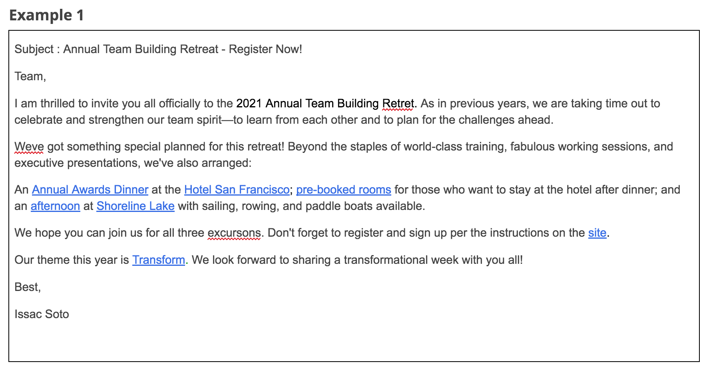
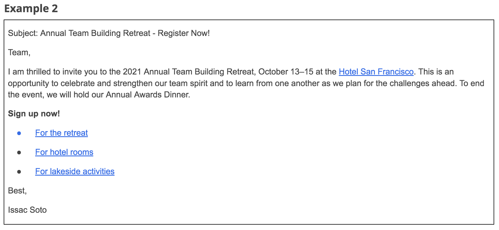

> Effective project communication
>
> 有效的项目沟通

You will learn what tools provide effective project team communication, how to organize and facilitate-促进,推动 meetings to ensure project success, and how to effectively communicate project status updates to project stakeholders and team members.

> 您将学习哪些工具提供有效的项目团队沟通，如何组织和促进会议以确保项目成功，以及如何有效地将项目状态更新传达给项目干系人和团队成员。

- Describe tools that provide effective project team communication.

	> 描述提供有效项目团队沟通的工具。

- Explain how to organize and facilitate meetings to ensure project success.

	> 解释如何组织和促进会议以确保项目成功。

- Explore best practices for communicating project status updates to project stakeholders and team members.

	> 探索与项目涉众和团队成员沟通项目状态更新的最佳实践。

# Communication tools and techniques

> 沟通工具和技术

## Introduction: Effective project communication

> 介绍：有效的项目沟通

Hi, and welcome back.

In the last section, you learned all about team management, the stages of team development, how to motivate team members, and setting expectations for your team.

> 在上一部分，你学习了所有关于团队管理的知识，团队发展的阶段，如何激励团队成员，以及为团队设定期望。

One thing that is incredibly-难以置信地,非常地 important to teamwork and managing projects is strong communication.

> 对于团队合作和项目管理来说，强有力的沟通是非常重要的。

Over the next few videos, we'll discuss the importance of project communication, how to effectively communicate, and different methods and tools for communicating.

> 在接下来的几个视频中，我们将讨论项目沟通的重要性，如何有效沟通，以及沟通的不同方法和工具。

Ready?

Let's get to it.

## Communicating in different ways

> 用不同的方式交流

By now, you should be aware that effective team communication is necessary to help ensure a successful project outcome.

> 到目前为止，您应该意识到有效的团队沟通对于确保成功的项目结果是必要的。

In this video, I'll share more tips for communicating with your team and introduce you to tools that will help you and your team communicate even more effectively.

> 在本视频中，我将分享更多与团队沟通的技巧，并向您介绍有助于您和团队更有效沟通的工具。

As the project manager, you are the one who connects your team to the information they need.

> 作为项目经理，你是将你的团队与他们需要的信息联系起来的人。

Throughout the project, you'll serve as the main resource for your team when it comes to communicating and clarifying goals, action items, progress, and updates.

> 在整个项目中，当涉及到沟通和澄清目标、行动项、进度和更新时，你将成为团队的主要资源。

It's important to make sure that you are carrying information forward consistently and coherently-连贯地,凝聚性地 so that everyone understands what the current state of the project is and what happens next.

> 重要的是要确保你将信息连贯一致地传递下去，这样每个人都能理解项目的当前状态以及接下来会发生什么。

Teams communicate in a myriad-无数的,大量的 of ways.

> 团队以无数种方式进行沟通。

Though-虽然,尽管 project managers are constantly-经常地,不断地 communicating through check-ins and meetings, project documents such as project plans including schedules, trackers, and meeting notes, they're also hubs-中心 for team communication.

> 虽然项目经理经常通过签到和会议、项目文档(如项目计划，包括时间表、跟踪器和会议记录)进行沟通，但它们也是团队沟通的中心。

It's your responsibility to be clear about how those documents get used, who has access to those documents, and how often the documents get updated.

> 你有责任弄清楚这些文档是如何使用的，谁有权访问这些文档，以及文档更新的频率。

Of course, in addition to those responsibilities, you'll also have to field-处理,回应 e-mails, instant messages, and attend-出席,参加 meetings.

> 当然，除了这些职责之外，你还必须处理电子邮件、即时消息和参加会议。

All of these things are critical in driving a project forward.

> 所有这些都是推动项目向前发展的关键因素。

As a project manager, you are the one who coordinates incoming and outgoing information.

> 作为一个项目经理，你是协调传入和传出信息的人。

You connect individuals to the necessary details and context and track who needs to receive what information and when.

> 您将个人与必要的细节和上下文联系起来，并跟踪谁需要在何时接收什么信息。

You'll need to communicate certain information to your team multiple times and in various ways.

> 你需要以不同的方式与你的团队多次沟通某些信息。

Some people learn by listening, some people learn by watching, and others learn by doing.

> 有些人通过听来学习，有些人通过看来学习，还有一些人通过做来学习。

Communicating in various ways ensures that you're sharing knowledge to your team in a format-形式 that's digestible-易消化的,可摘要的 and easy for them to take in.

> 通过各种方式进行交流可以确保你以一种易于理解和易于接受的形式与团队分享知识。

Your team will have a lot of tasks to focus on.

> 你的团队将有很多任务需要关注。

Be proactive-积极主动的 and reinforce-加强,强化 important information multiple times, in multiple ways so that no one is left out of the loop.

> 要积极主动，以多种方式多次强调重要信息，这样就不会有人被排除在外。

There are many tools for communicating with your team to make it easy to keep in contact and be on the same page throughout the duration of the project.

> 有很多工具可以帮助你与团队沟通，让你在整个项目过程中保持联系并保持一致。

Some of these include: e-mail and messaging, in-person meetings, video conferencing-会议,讨论会, and work management and collaboration tools.

> 其中包括：电子邮件和消息传递、面对面会议、视频会议以及工作管理和协作工具。

Your organization might have some of these tools in place already, or you might have the opportunity to select some for a project.

> 您的组织可能已经有了其中的一些工具，或者您可能有机会为项目选择一些工具。

In either case, it's good to be familiar with what's out there.

> 在任何一种情况下，熟悉外面的情况都是很好的。

We'll explore tools that provide effective project team communication in more detail in the next video.

> 在下一个视频中，我们将更详细地探讨提供有效项目团队沟通的工具。

Meet you there.

## Principles of effective email writing

> 有效撰写电子邮件的原则

Email has long been the primary method of communication for many people in business, yet-然而,但是 messages are easy to misunderstand or ignore.

> 长期以来，电子邮件一直是许多商务人士的主要沟通方式，但信息很容易被误解或忽视。

In this reading, we will discuss four principles of effective email writing that will help your emails to stand out, be remembered, and elicit-引出,得到 the response you need.

> 在这篇阅读中，我们将讨论有效的电子邮件写作的四个原则，这些原则将帮助你的电子邮件脱颖而出，被记住，并引起你需要的回应。

These principles are:

- State what you want clearly.

	> 把你想要的说清楚。

- Keep the content short and concise-简明的,简洁的.

	> 保持内容短小精悍。

- Structure your writing.

	> 组织你的写作

- Check grammar-语法,文法, punctuation-标点符号, and spelling-拼写.

	> 检查语法、标点和拼写。

---

**Principles of effective email writing**

> 有效撰写电子邮件的原则

**State what you want clearly**

> 把你想要的说清楚

When you **set out**-开始,出发 to compose-撰写 an email, it is because there is something that you want from your reader.

> 当你开始写电子邮件时，那是因为你想从你的读者那里得到一些东西。

You might want to receive a simple answer, to persuade-说服,劝服 someone of something, or to arrange-安排,筹备 a meeting.

> 你可能想要得到一个简单的答案，说服某人某事，或者安排一次会面。

Before composing an email, think about what you want, when you need what you want, and the best way to get what you want when you want it. 

> 在写邮件之前，想想你想要什么，什么时候你需要你想要的东西，以及当你想要的时候得到你想要的东西的最好方法。

Here are some tips on how to clearly state what you want in your email:

> 这里有一些关于如何在邮件中清楚地表达你想要的东西的建议:

- Include your request in the subject line of your email.

	> 把你的要求写在邮件的主题栏里。

- State your request within the first two paragraphs of your email message.

	> 在邮件的前两段陈述你的要求。

- Indicate the specific call-to-action associated with your request (for example, reply, review, RSVP).

	> 指出与您的请求相关联的具体号召行为(例如，回复、审查、RSVP)。

- Write clear, concise-简明的,简洁的 sentences when providing details.

	> 提供细节时，句子要清晰、简洁。

- Define terms. Avoid using acronyms-缩写 and terminology-术语 that users may not know. Provide additional information as necessary to avoid misunderstanding. 

	> 定义术语。避免使用用户可能不知道的缩写词和术语。提供必要的额外信息以避免误解。

**Keep the content concise**

> 保持内容简洁

Make your words work for you.

> 让你的语言为你工作。

Remove any writing that doesn’t help to define what you want or contribute to your reader's needs.

> 删除任何无助于定义你想要什么或无助于读者需求的内容。

- Summarize the content you want to convey-表达,传递, and remove anything in your email that doesn’t contribute to your goal.

	> 总结你想要传达的内容，删除邮件中任何与你的目标无关的内容。

- Aim to write “question-less” and “self-standing” emails. This means that the message contains enough information to stand on its own. The reader shouldn’t have any questions about what you want and when you want it.

	> 目标是写“无问题”和“自立”的电子邮件。这意味着消息本身包含足够的信息。读者不应该问你想要什么，什么时候想要。

- Know your audience. Some people—such as executives and other busy leadership—may not want to read emails of more than a few sentences or click on external links for further information. Try to tailor-迎合,使适应 your emails accordingly.

	> 了解你的听众。有些人——比如高管和其他忙碌的领导——可能不想阅读超过几句话的电子邮件，也不想点击外部链接获取更多信息。试着相应地调整你的邮件。

**Structure your writing**

> 组织你的写作

Structure has to do with the visual flow, or aesthetics-美学,美感, of your email.

> 结构与电子邮件的视觉流或美学有关。

A well-structured email conveys-表达,传递 critical information to the reader quickly and allows them to scan the explanatory-解释的,说明的 text—or ignore it altogether.

> 一封结构良好的电子邮件能快速地向读者传达关键信息，并让他们浏览解释性文本，或者完全忽略它。

Here are some tips for effectively structuring your email:

> 下面是一些有效组织邮件的技巧:

- **Use bullets**. 

	Bullets break up the visual flow. If you have more than one of something, consider using bullets. Write strong-强烈的 action verbs-动作,动词 at the start of each bullet.

	> 子弹打破了视觉流。如果你有一个以上的东西，考虑使用子弹。在每个项目的开头写一些强烈的行为动词。

- **Use labels**. 

	Labels help guide the reader to what information is most important. 

	> 标签有助于引导读者了解哪些信息是最重要的。

- **Add hyperlinks-超链接**. 

	Hyperlinks allow readers to directly access additional information, rather than adding lengthy details to your email.

	> 超链接允许读者直接访问额外的信息，而不是在你的电子邮件中添加冗长的细节。

- **Write a strong topic sentence**.

	> 写一个强有力的主题句。

	Place the main idea of the paragraph-段落 in the topic sentence. 

	> 把段落的中心思想放在主题句中。

**Check grammar, punctuation, and spelling**

> 检查语法、标点和拼写

Grammar, punctuation, and spelling are critical.

Turning grammar and spelling suggestions on in your email application can help you quickly identify errors.

> 在电子邮件应用程序中启用语法和拼写建议可以帮助您快速识别错误。

Be sure to correct-改正,纠正 any errors before sending off. 

> 请务必在离场前改正错误。

---

**Applying effective email writing principles**

> 运用有效的电子邮件写作原则

In order to learn how to apply these principles, let’s check out the following example email:

> 为了学习如何应用这些原则，让我们看看下面的例子:

Issac was given the task of sending an email about the company’s annual-年度的 team building retreat-活动.

> 伊萨克的任务是发送一封关于公司年度团队建设活动的电子邮件。

*Please note: Blue, underlined text indicates a hyperlink to an external site or document.*

> 请注意:蓝色下划线文本表示指向外部网站或文档的超链接

Subject : Annual Team Building Retreat - Register Now!

> 主题:年度团队建设务虚会-立即报名!

Team, I am thrilled-兴奋,激动 to invite you all officially to the 2021 Annual Team Building Retret.

> 团队，我很激动地正式邀请你们所有人参加2021年度团队建设静修会。

As in previous years, we are taking time out to celebrate and strengthen-巩固,加强 our team spirit-精神—to learn from each other and to plan for the challenges ahead.

> 和往年一样，我们抽出时间来庆祝和加强我们的团队精神——相互学习，为未来的挑战做准备。

Weve got something special planned for this retreat!

> 我们为这次静修计划了一些特别的东西!

Beyond the staples of world-class training, fabulous working sessions, and executive-主管,经历 presentations, we've also arranged:

> 除了世界级的培训、精彩的工作会议和高管演讲，我们还安排了:

An Annual Awards Dinner at the Hotel San Francisco;

> 在旧金山酒店举行的年度颁奖晚宴;

pre-booked rooms for those who want to stay at the hotel after dinner;

> 晚餐后入住酒店的客人可提前预订房间;

and an afternoon at Shoreline Lake with sailing, rowing, and paddle boats available.

> 下午在海岸线湖(Shoreline Lake)玩帆船、划船和桨船。

We hope you can join us for all three excursions - 短途旅行.

> 我们希望你能参加我们的三次短途旅行。

Don't forget to register and sign up per the instructions on the site.

> 不要忘记按照网站上的说明进行注册和注册。

Our theme this year is Transform.

> 今年我们的主题是“转变”。

We look forward to sharing a transformational week with you all!

> 我们期待着与大家分享一个转变的一周!

Best, Issac Soto

This email example is not as effective as it could be.

> 这个电子邮件的例子并没有达到它应该达到的效果。

The date and location of the event are not included.

> 活动的日期和地点不包括在内。

The main link Issac wants the reader to click—to register for the event—is buried-埋藏,隐藏 at the bottom of the email.

> Issac希望读者点击的主链接——注册事件——隐藏在邮件的底部。

The other links in the message are also overwhelming-使应接不暇 because there are so many.

> 邮件中的其他链接也让人眼花缭乱，因为链接太多了。

There are no bullets or labels to help organize the information.

> 没有项目符号或标签来帮助组织信息。

Additionally, there are a few spelling and punctuation-标点符号 errors. 

> 此外，还有一些拼写和标点错误。

Let’s examine how Issac’s email could be revised to be more effective.

> 让我们来看看如何修改伊萨克的电子邮件，使其更有效。

Subject: Annual Team Building Retreat - Register Now!

Team,

I am thrilled-兴奋,激动 to invite you to the 2021 Annual Team Building Retreat, October 13–15 at the Hotel San Francisco.

This is an opportunity to celebrate and strengthen our team spirit-精神 and to learn from one another as we plan for the challenges ahead.

> 这是一个庆祝和加强我们团队精神的机会，在我们为未来的挑战做计划时，我们可以相互学习。

To end the event, we will hold our Annual Awards Dinner.

Sign up now! 

- For the retreat
- For hotel rooms
- For lakeside activities 

Best, Issac Soto

In this example, there is a clear, concise-简明的,简洁的 description of what the email is about at the very beginning of the email. 

> 在这个例子中，在邮件的开头有一个清晰、简洁的描述。

The dates and location of the event are clearly stated at the beginning of the email.

> 活动的日期和地点在邮件的开头有明确的说明。

The opening paragraph-段落 is directly followed by a label in bold-粗体: **Sign up now!**

> 开头段落后面直接跟着一个粗体标签:**立即注册!**

Then, bullet points help set apart-分开,区分 the hyperlinks for better visibility, and the hyperlinks clearly state what the reader will access when they click.

> 然后，项目符号有助于区分超链接以获得更好的可见性，并且超链接清楚地说明了读者点击时将访问的内容。

Lastly, the grammar, spelling, and punctuation are all accurate.

> 最后，语法、拼写和标点都是准确的。

---

**Key takeaway**

When you write an email, think about the people you are sending it to and what they need in order to quickly read and correctly understand it.

> 当你写邮件的时候，想想你的收件人，他们需要什么才能快速阅读和正确理解。

Remember to:

1. State what you want clearly.

	> 把你想要的说清楚。

2. Keep the content concise.

	> 保持内容简洁。

3. Structure your writing.

	> 组织你的写作。

4. Check grammar, punctuation, and spelling.

	> 检查语法、标点和拼写。

Keeping these principles in mind when you draft emails will help you communicate more effectively with your team members, stakeholders, customers, and others.

> 当你起草电子邮件时，记住这些原则将帮助你更有效地与你的团队成员、利益相关者、客户和其他人沟通。

It can also demonstrate your level of professionalism and competence-能力 and inspire-激励,鼓舞 others’ confidence-信心,信任 in your abilities. 

> 它还可以展示你的专业水平和能力，并激发别人对你的能力的信心。

## Common communication tools

> 常用沟通工具

Hi again, let's explore some of the common tools for effectively communicating with your project team and stakeholders.

> 嗨，再一次，让我们探索一些与项目团队和涉众有效沟通的常用工具。

In this video, we'll focus on messaging, virtual-虚拟的 meetings and work management and collaboration tools.

> 在本视频中，我们将重点介绍消息传递、虚拟会议、工作管理和协作工具。

---

Let's start with messaging and email.

> 让我们从短信和电子邮件开始。

Email is standard for business communications, so it's important to streamline-精简 the number of emails that you send out.

> 电子邮件是商务交流的标准方式，所以精简你发出的电子邮件的数量是很重要的。

At Google, I get tons of emails a day.

> 在谷歌，我每天都会收到大量的电子邮件。

It's a lot of work to figure out which ones I need to read immediately, which ones can wait and which ones require a reply-回答,答复 **right away**-立即、马上.

> 要弄清楚哪些需要立即阅读，哪些可以稍后阅读，哪些需要立即回复，这需要做很多工作。

It's important that you understand how to use email in a professional context.

> 了解如何在专业环境中使用电子邮件是很重要的。

A quick internet search will provide you with lots of tips and examples.

> 在网上快速搜索一下，你会得到很多提示和例子。

Here's some of my key tips for you to keep in mind, carefully select who you're sending an email to, and most importantly, be conscious-意识到的,慎重的 of why you're sending it.

> 下面是我给你的一些重要建议，你要记住，仔细选择你的收件人，最重要的是，要知道你为什么要发邮件。

Make sure the subject field-信息栏 clearly states what the email is about.

> 确保邮件的主题栏清楚地说明了邮件的内容。

If it's urgent-紧急的,急切的 or requires a response, add that to the subject and the first line of the email.

> 如果是紧急或需要回复的邮件，把它加到邮件的主题和第一行。

Keep your messages as short as possible and stay on topic.

> 让你的信息尽可能简短，切题。

If there's a lot of information to share, consider placing the information into a digital document you can link or attach-附上,附上 to the email.

> 如果有很多信息需要分享，可以考虑把这些信息放在电子文档中，这样你就可以链接或附加到电子邮件中。

Then summarize what you want readers to focus on.

> 然后总结你希望读者关注的内容。

If there's a specific action you need from the recipient, state it clearly so that they understand what's expected of them and when. 

> 如果你需要收信人做什么具体的事情，要说清楚，让他们明白你对他们的期望和时间。

Your language choices matter, so avoid slang-俚语, acronyms-首字母缩略词, and shortcuts-捷径,快捷方法 for words that might be more appropriate-合适的,相称的 for texts.

> 你的语言选择很重要，所以要避免俚语、首字母缩略词和更适合文本的缩略词。

And one more thing, write in an appropriate tone for the person receiving the email.

> 还有一件事，用合适的语气给收件人写邮件。

It's generally best practice to be friendly, motivating, clear, and specific.

> 一般来说，最好的做法是友好、激励、清晰和具体。

---

As I mentioned earlier, most people, especially other managers, directors and executive get lots of emails.

> 正如我之前提到的，大多数人，尤其是其他经理、董事和高管都会收到很多电子邮件。

With that in mind, you may want to consider instant messaging tools like Google Meet or Slack.

> 考虑到这一点，你可能会考虑使用谷歌Meet或Slack等即时通讯工具。

This can be an alternative-替代物 to email when you just have a quick question, or update or as a way to alert someone to please check their inbox-收件箱.

> 当你有一个快速的问题，或更新或提醒某人检查他们的收件箱时，这可以作为电子邮件的替代品。

Instant messaging helps reduce **back and forth**-来回 emails or phone calls that can quickly clear up miscommunications-错误传达 or let you know if and when you should take an issue to a meeting.

> 即时通讯有助于减少来回的电子邮件或电话，这些可以快速消除误解，或者让你知道是否以及何时应该把问题带到会议上。

Be mindful of when you decide to use instant messaging.

> 当您决定使用即时消息传递时，请注意。

This kind of quick communication could lead to distraction-干扰,使人分心 and informality-非正式,不拘礼节.

> 这种快速的交流可能会导致分心和不正式。

It can easily become an outlet-出口,发泄方式 to share non work related information or information that sensitive-敏感的,保密的 or confidential-机密的,保密的.

> 它很容易成为分享与工作无关的信息或敏感或机密信息的出口。

It can also be difficult to track instant messages.

> 跟踪即时消息也很困难。

Later on, if you need to reference information that you chatted about, you might not be able to easily find it with instant messaging.

> 稍后，如果您需要引用您聊天过的信息，您可能无法通过即时消息轻松找到它。

It's a good idea to ask people's preferences on how they like to be communicated with.

> 询问人们喜欢的沟通方式是个好主意。

Even if instant messaging is faster the person might prefer to use email.

> 即使即时通讯更快，这个人可能更喜欢使用电子邮件。

With experience-经验,经历, you'll be able to determine the most effective ways to communicate with your team.

> 有了经验，你就能确定与团队沟通的最有效方式。

---

Next up, we'll discuss some tools for remote meetings.

> 接下来，我们将讨论一些用于远程会议的工具。

Virtual meeting tools like Google Meet and Zoom are great for communicating, especially as remote work becomes more standard.

> 谷歌Meet和Zoom等虚拟会议工具非常适合沟通，尤其是在远程工作变得越来越标准的情况下。

Better yet, each of these tools are easy to access and easy to learn how to use.

> 更好的是，这些工具都很容易访问，也很容易学习如何使用。

Well run online meetings can be extremely effective, they allow you and your team to interact in real-time.

> 运行良好的在线会议非常有效，它们允许你和你的团队实时互动。

Which can help boost morale-士气,精神面貌 and create a sense of team when it's not possible to be together in person.

> 这有助于提高士气，并在无法面对面的情况下创造一种团队感。

Virtual meetings can be highly-极其,非常 engaging-吸引,参加, as attendees-出席者,在场者 can access and share files during the meeting.

> 虚拟会议可以非常吸引人，因为与会者可以在会议期间访问和共享文件。

---

And then there are work management and collaboration tools like Google Drive, Asana, and Smartsheet. 

> 还有谷歌Drive、Asana和Smartsheet等工作管理和协作工具。

These kinds of tools make it easier to share information among-在…当中 teams, even better with work management and collaboration tools information sharing goes both ways.

> 这些类型的工具使得在团队之间共享信息变得更容易，甚至更好地使用工作管理和协作工具，信息共享是双向的。

Team members can easily update their progress without the need for extra meetings or phone calls.

> 团队成员可以轻松地更新他们的进度，而不需要额外的会议或电话。

These tools can accomplish many different things like tracking progress on tasks, deliverables, and milestones.

> 这些工具可以完成许多不同的事情，比如跟踪任务进度、交付成果和里程碑。

They can also help you to manage a budget, build helpful charts and diagrams, manage contracts and licenses and keep stakeholders informed.

> 他们还可以帮助你管理预算，建立有用的图表和图表，管理合同和许可证，并让利益相关者了解情况。

Work management and collaboration tools allow you to focus your communications within the context of specific tasks, project details and timeline.

> 工作管理和协作工具允许您在特定任务，项目细节和时间表的背景下集中您的通信。

Rather than writing an email and linking to the relevant information when you're working and communicating in a tool, the information is already there in one place for easy reference and decision making.

> 而不是写一封电子邮件，链接到相关信息，当你在一个工具中工作和交流，信息已经在一个地方，方便参考和决策。

Another great aspect of these kinds of tools is that the work gets done in real time.

> 这类工具的另一个优点是工作可以实时完成。

These tools allow remote teams to collaborate and communicate as though they're physically-身体上,实际上 working in the same office together.

> 这些工具允许远程团队进行协作和交流，就好像他们在同一个办公室一起工作一样。

Encouraging your teams to check in and update their progress regularly helps to maintain the real-time feel of interacting with coworkers-同事,合作者.

> 鼓励你的团队定期检查和更新他们的进度有助于保持与同事互动的实时感觉。

There are many different types of work management software that automatically-自然地,自动地 make project planning and tracking a lot easier. 

> 有许多不同类型的工作管理软件可以自动使项目计划和跟踪变得更加容易。

And they are much more efficient than manual project tracking.

> 它们比手工项目跟踪更有效。

A quick word of caution-谨慎,提醒 before we move on the use, access or sharing of confidential or need to know information externally, including financial and business data, user data and information about our products and services is likely prohibited-禁止 unless-除非,除非在…情况下 you're given explicit-明确的,清晰的 permission.

> 在我们继续使用、访问或共享机密或需要知道的外部信息之前，这里有一个简短的警告，包括财务和商业数据、用户数据以及有关我们产品和服务的信息，除非您得到明确的许可，否则可能会被禁止。

When using shared work management tools, just be mindful of who wants and needs access versus who doesn't need access, to do your part in keeping important data safe.

> 在使用共享工作管理工具时，只需注意谁想要和需要访问权限，谁不需要访问权限，以尽自己的一份力量保证重要数据的安全。

---

There are so many different ways to share information to your team, whether if through meetings, emails, instant messages, spreadsheets, and trackers-追踪器.

> 与团队共享信息的方式有很多，无论是通过会议、电子邮件、即时消息、电子表格还是跟踪器。

By becoming familiar with some of the more common communication tools, you can choose the right one for your project needs.

> 通过熟悉一些更常见的通信工具，您可以根据您的项目需求选择合适的工具。

Now you've learned a bit more about the importance of team communication and some tools that effectively communicate and foster collaboration within your team.

> 现在，您已经了解了团队沟通的重要性，以及一些有效沟通和促进团队协作的工具。

In the next video, we'll learn how to organize and facilitate team meetings to ensure project success.

> 在下一个视频中，我们将学习如何组织和促进团队会议，以确保项目成功。

I'll meet you there.

# Organizing and facilitating project meetings

> 组织和促进项目会议

## How to organize effective meetings

> 如何组织有效的会议

Welcome back.

Meetings can be an effective method to distribute information, communicate with your team and stakeholders, and help keep a project on track.

> 会议可以是一种有效的方法来分发信息，与你的团队和利益相关者沟通，并帮助保持项目的正轨。

In this video, you'll learn how to organize and facilitate effective team meetings that will lead to a successful project.

While the size, purpose, and format of meetings may differ, effective meetings always have the following elements in common. 

> 虽然会议的规模、目的和形式可能不同，但有效的会议总是有以下共同点。

They're structured-有结构的,有组织的, intentional-有意图的,故意的,蓄意的, collaborative, and inclusive.

> 它们是有组织的、有意识的、协作的、包容的。

Let's study these elements in more detail.

---

First, effective meetings are structured.

This means they start and end on time.

> 这意味着他们准时开始和结束。

The attendees have been carefully selected.

> 与会者都是经过精心挑选的。

The meeting topics are prioritized.

> 设置会议主题的优先级。

And the designated-任命,指定 **note taker**-记录员 has been assigned.

> 指定的记录员已经被指派。

Managing the meeting time and audience lets participants-参加者,参与者 know that they're valued and appreciated-欣赏,鉴赏.

> 管理好会议时间和听众，让参与者知道他们是被重视和欣赏的。

Remember that everyone's time is valuable.

> 记住，每个人的时间都是宝贵的。

If someone's presence-出席,存在 is unnecessary, you don't need to invite them to the meeting.

> 如果某人的存在是不必要的，你不需要邀请他们参加会议。

Maybe you can share the notes.

Include people who can contribute to the discussion and anyone who will be directly affected by the topics discussed.

> 包括那些可以参与讨论的人，以及任何会直接受到讨论主题影响的人。

Structured meetings also have an agenda-议事日程 with prioritized topics.

> 结构化的会议也有一个议程，其中有优先考虑的主题。

So the most important items are given appropriate-适当的 attention.

> 因此，最重要的项目给予适当的关注。

It's good to think about and set expectations for how long you expect the group to spend on a given topic.

> 考虑并设定你希望小组在给定主题上花多长时间的预期是很好的。

This is defined as timeboxing-时间盒, which just means you're setting a time limit for discussion.

> 这被定义为时间限制，这意味着你为讨论设定了一个时间限制。

In a timebox, you give each topic a buffer of a few minutes to make sure you're not over packing your agenda.

> 在一个时间盒里，你给每个话题留出几分钟的缓冲时间，以确保你没有把你的日程安排得太满。

Keep the meeting time in mind and make sure you schedule enough time for the topic you need to cover.

> 记住会议时间，确保你为你需要讨论的话题安排了足够的时间。

If there are several topics you need to address consider scheduling a few shorter meetings with just one or two topics as their focus.

> 如果你有几个主题需要讨论，可以考虑安排一些较短的会议，只讨论一两个主题。

After your first few team meetings, think about the pacing-节奏 to know if you need to be more generous-慷慨的,大方的,大量的 with the time given to each topic or if the group has time for a little more.

> 在你最初的几次团队会议之后，考虑一下节奏，看看你是否需要在每个主题上花更多的时间，或者团队是否有更多的时间。

If you get through your topics before your time is up, don't be afraid to call a meeting early.

> 如果你在时间到之前完成了你的主题，不要害怕提前召开会议。

Everybody loves having their time back.

> 每个人都喜欢拥有自己的时间。

Finally, a structured meeting should have a designated note taker.

> 最后，一个结构化的会议应该有一个指定的记录员。

So you or anyone else can **refer to**-参考,查阅 the meeting notes later and find out what was discussed.

> 所以你或其他人稍后可以参考会议记录，了解讨论的内容。

The note taker could be you or another meeting attendee.

> 记录者可以是你，也可以是其他与会者。

For this reason be clear about how, when, and to whom the meetings outcomes are shared.

> 出于这个原因，要清楚如何、何时以及向谁分享会议成果。

Again, this all depends on the type of meeting you're having and who is attending.

> 再说一次，这完全取决于你要开的会议的类型和参加会议的人。

I'll loop-循环 back to describe some different types of project meetings in the next video.

> 在下一个视频中，我将回顾介绍一些不同类型的项目会议。

---

The next point to consider is that effective meetings are also intentional-有意的,故意的.

> 下一点要考虑的是，有效的会议也是有意的。

This means they have a clearly stated purpose and expectations, which should be in the meeting agenda **as well as**-和,还有 the meeting invite.

> 这意味着他们有一个明确的目的和期望，这应该在会议议程和会议邀请中。

So everyone understands why they're attending-参加,出席.

> 所以每个人都明白他们为什么要参加。

The agenda needs to set clear expectations for what needs to occur before and during the meeting.

> 议程需要对会议之前和会议期间需要发生的事情设定明确的预期。

It helps attendees prepare, keeps everyone focused on the right topics, and clarifies meeting expectations and goals.

> 它可以帮助与会者做好准备，让每个人都专注于正确的主题，并明确会议的期望和目标。

The purpose of your meeting might be to make a decision, assign tasks, propose/ invent-发明,创造 an idea, or something else.

> 会议的目的可能是做一个决定，分配任务，提出/发明一个想法，或者别的什么。

Your meeting's purpose, or goal, describes the reason you're meeting and what you'd like to achieve.

> 会议的目的或目标描述了开会的原因和你想要达到的目标。

A well designed agenda increases the group's ability to address problems and prevents wasting time.

> 精心设计的议程可以提高团队解决问题的能力，防止浪费时间。

For example, you may be reviewing last month's business sales and setting goals for the next month.

> 例如，您可能正在回顾上个月的业务销售并为下个月设定目标。

Maybe your group needs to choose coordinators-协调员,协调者 for an upcoming event.

> 也许你的团队需要为即将到来的活动选择协调员。

Or your goal could be to have your supervisor-管理者 prioritize a list of tasks.

> 或者你的目标可以是让你的上司为你列出一系列任务的优先级。

The purpose might change from meeting to meeting, or it could stay the same.

> 每次会议的目的可能会改变，也可能保持不变。

If input is needed by attendees, be sure to send any pre-reading materials in advance of the meeting so that everyone shows up prepared to participate.

> 如果与会者需要输入，一定要在会议前发送任何预读材料，这样每个人都准备好参加会议。

Depending on the purpose meetings can be formal or informal, have **as few as**-仅仅,只有 two or three group members or have hundreds of attendees.

> 根据目的，会议可以是正式的或非正式的，只有两三个小组成员或有数百名与会者。

Whatever it is, make sure you state a clear thoughtful-考虑周到的,深思熟虑的 purpose and strive-努力,力争 to achieve that purpose by the end of the allotted time. 

> 不管是什么，确保你陈述了一个清晰、深思熟虑的目标，并努力在规定的时间内实现这个目标。

---

Another element of effective meetings is encouraging a collaborative environment.

> 有效会议的另一个要素是鼓励合作环境。

Collaboration is when people work together to produce or create something.

> 协作是指人们一起工作来生产或创造一些东西。

There are lots of ways to make your meetings collaborative, even if the purpose is for one person to share important information with the rest of the group.

> 有很多方法可以让你的会议具有协作性，即使目的是让一个人与小组的其他人分享重要信息。

One easy way to do this is to be sure the agenda isn’t just full of presentations-报告,演讲 where participants are talked at.

> 要做到这一点，一个简单的方法是确保议程不只是充满了参与者被谈论的演讲。

Be sure the agenda is clear about the objectives of the session-会议.

> 确保会议议程清楚地说明了会议的目标。

Will a decision be made, or is the session for information and discussion?

> 会议将作出决定，还是进行信息和讨论?

Second, have a digital shared meeting document and encourage participants to write any comments or thoughts directly in the document.

> 其次，有一个数字共享的会议文件，并鼓励参与者直接在文件中写下任何评论或想法。

But more importantly, remind them that the notes will be shared.

> 但更重要的是，提醒他们笔记将被共享。

This encourages active listening and participation in real time during the meeting.

> 这鼓励在会议期间积极倾听和实时参与。

Last, it's important to respect and embrace-接受,拥抱,包括,涉及 each individual's preferred-更合意的,更好的 communication style even in meetings, especially in collaborative meetings.

> 最后，即使是在会议中，尤其是在协作会议中，尊重和接受每个人喜欢的沟通方式也是很重要的。

Let folks-人们 know they're welcome to respond verbally-口头上地, through the chat, in the meeting notes, or in any other format you'd like to include.

> 让大家知道，我们欢迎他们通过口头、聊天、会议记录或其他任何你想要的方式来回应。

---

The final element of an effective meeting is that it's inclusive.

> 有效会议的最后一个要素是包容性。

Inclusivity is the practice or policy of including people who might otherwise-用别的方法be excluded-把…排除在外 or marginalized-排斥,忽视.

> 包容性是包容那些可能被排斥或边缘化的人的做法或政策。

When it's done well, inclusion leads to excellent-极好的,卓越的 collaboration, ensuring that every participants contributions are valued.

> 如果做得好，包容会带来出色的合作，确保每个参与者的贡献都得到重视。

As a project manager, you play a critical role in ensuring that meeting attendees feel supported and included.

> 作为一名项目经理，你在确保与会者感到被支持和包容方面发挥着关键作用。

So offering additional resources for ways to participate is helpful.

> 所以提供额外的参与资源是有帮助的。

For both in-person and virtual meetings, consider appointing a meeting moderator-主持人,仲裁人 or facilitator-促进者.

> 无论是面对面的会议还是虚拟会议，都要考虑任命一位会议主持人或主持人。

This person will guide the meeting and help participants ask questions in real-time, while someone else is presenting.

> 这个人将指导会议，并在其他人发言时帮助参与者实时提问。

This way the presenter-主持人 can stay focused on their topic while the moderator-调解人 pays attention to the participants and can help guide participants on when they can chime-协调,一致 in.

> 这样一来，主持人可以专注于自己的主题，而主持人则可以关注参与者，并帮助指导参与者何时可以插话。

It's also a good idea to leave space-空间 in the meeting for participants who've been quiet-安静的.

> 在会议中给那些安静的与会者留点空间也是个好主意。

At the close of a topic or before the meeting ends, you might consider going around the room once in a while and asking each person to comment on a particular-特定的 issue or question.

> 在一个主题结束或会议结束之前，你可以考虑在房间里绕一圈，让每个人对一个特定的问题或问题发表评论。

I like to call this a final flight check before everyone takes off and goes their separate ways.

> 我喜欢把这叫做每个人起飞前的最后一次飞行检查，然后各走各的。

A key component of inclusivity is ensuring that your meetings and presentations are accessible.

> 包容性的一个关键组成部分是确保您的会议和演示是可访问的。

You'll find more information on this in the course resources.

> 你可以在课程资源中找到更多相关信息。

Another thing to consider is the level of internet access when conducting virtual meetings.

> 另一件要考虑的事情是进行虚拟会议时的互联网接入水平。

For those without strong internet access, provide a phone dialing-拨号,主叫 option.

> 对于那些没有强大互联网接入的人，提供电话拨号选项。

Most online meeting tools, including Google Meet and Zoom, have this option.

> 大多数在线会议工具，包括Google Meet和Zoom，都有这个选项。

Let participants know it's okay to turn off their cameras-摄像头 if they need to improve the connection or adjust the video quality. 

> 让参与者知道，如果他们需要改善连接或调整视频质量，可以关闭摄像头。

Focusing on inclusion helps build a sense of belonging-归属,归...所有 and serves as a reminder that we live in a world with many different kinds of people.

> 注重包容有助于建立归属感，并提醒我们生活在一个有许多不同类型的人的世界里。

Creating a meeting space-空间 where people have different views, backgrounds, and experiences can do their best work and be there for one another is key.

> 创造一个会议空间，让拥有不同观点、背景和经历的人能最好地工作，互相帮助是关键。

These tips aren't exhaustive-详尽的,彻底的 by any means, but hopefully they can be useful to start empowering-授权,赋予权利 others to meaningfully join in and contribute.

> 这些建议无论如何都不是详尽无遗的，但希望它们能对开始授权他人有意义地加入和贡献有用。

When done right, meetings can be incredibly-难以置信地,非常地 useful communication tools.

> 如果处理得当，会议可以成为非常有用的沟通工具。

That's why it's important to be purposeful when designing meetings that are structured, intentional, collaborative, and inclusive.

> 这就是为什么在设计有组织的、有意的、协作的和包容的会议时，有目的是很重要的。

This will earn-赢得,博得 you a reputation-名誉,名声 for writing efficient, inclusive, successful meetings where everyone feels appreciated-欣赏, which is great for your project and your career.

> 这将为你赢得高效、包容、成功的会议的声誉，让每个人都感到受到赞赏，这对你的项目和事业都有好处。

---

Great job, so now we know a bit more about the effective methods to distribute information, communicate with your team and stakeholders, and keep a project on track.

> 干得好，现在我们知道了更多有效的方法来分发信息，与团队和利益相关者沟通，并保持项目在正轨上。

We've also learned some of the elements of creating an effective meeting like including a clear agenda, attendee list, taking detailed notes, and more.

> 我们还学习了一些创建有效会议的要素，比如包括清晰的议程、与会者名单、做详细的笔记等等。

In the next video, we'll learn all about the most common types of project meetings.

> 在下一个视频中，我们将学习所有最常见的项目会议类型。

## Facilitating inclusive and accessible meetings

> 促进包容和无障碍的会议

In the previous video, we discussed how to organize an effective meeting.

> 在前面的视频中，我们讨论了如何组织有效的会议。

Recall that effective meetings generally have four elements in common: they are structured, intentional, collaborative, and inclusive.

> 回想一下，有效的会议通常有四个共同的要素:它们是结构化的、有意的、协作的和包容的。

In this reading, you will explore the fourth element: how to make your meetings more inclusive. 

> 在本文中，你将探索第四个要素:如何使你的会议更具包容性。

---

**Creating an inclusive environment**

> 创造包容的环境

Inclusion of employees from different backgrounds and identities is extremely-极度,非常 important for any organization looking to build a strong sense of connection in the workplace.

> 包容来自不同背景和身份的员工对于任何希望在工作场所建立强烈联系感的组织来说都是极其重要的。

Also, when team members feel included, they tend to want to do their best work.

> 此外，当团队成员感到被包容时，他们倾向于把工作做到最好。

This is great for the organization, too.

> 这对公司来说也很好。

Creating an inclusive environment can be particularly-非常,尤其 challenging in meetings because they can be intimidating-令人紧张不安的,令人胆怯的 for participants. 

> 在会议中创造一个包容的环境尤其具有挑战性，因为参与者可能会感到害怕。

As a project manager, it is part of your job to facilitate meetings that are inclusive of all participants and that create a sense of emotional-情感的,情绪的 safety and value for everyone’s active input.

> 作为一名项目经理，促进所有参与者参与的会议，并为每个人的积极投入创造一种情感安全感和价值，这是你工作的一部分。

In order to help facilitate inclusive meetings that feel empowering to everyone, you should put procedures-步骤,程序 in place that are consistently followed and predictable-可预测的,可预料的. 

> 为了帮助促进包容的会议，让每个人都觉得有权力，你应该把程序放在适当的地方，始终遵循和可预测的。

- **Formalize-使形式化,使正式 initial check-ins for the group that build understanding and ensure everyone knows their input is needed.** 

	> 为团队建立理解，并确保每个人都知道他们的投入是需要的

	Create a process that consistently asks each person for an update on their work and/or how they are doing in their daily lives. 

	> 创建一个流程，持续地询问每个人关于他们的工作和/或他们在日常生活中的表现。

	Questions should be **open-ended**-开放式的 and vary over time to include some humor-幽默,诙谐, analogies-类比,类推法, and “finish the sentence” opportunities.

	> 问题应该是开放式的，并且随着时间的推移而变化，包括一些幽默、类比和“完成句子”的机会。

	As the project manager, your modeling will set the tone for the team dynamic, so always check-in with your team and model professionalism-专业化, vulnerability-弱点, and empathy.

	> 作为项目经理，您的建模将为团队动态定下基调，因此始终与您的团队和模型的专业性、脆弱性和同理心保持一致。

	Popular check-ins include: “A highlight of my week has been . . .” and “This week I have gratitude-感激之情,感谢 for . . .” 

	> 流行的签到包括:“我这周的亮点是……”和“这周我要感谢……”

- **Give everyone your full attention**.

	> 给每个人你的全部注意力。

	Listen carefully to what everyone has to say and be careful not to interrupt someone who is speaking.

	> 仔细听每个人说的话，小心不要打断别人说话。

	Body language—such as maintaining eye contact and turning your body in the direction of a speaker—can help someone feel safe in voicing their opinion.

	> 肢体语言——比如保持眼神交流和把身体转向说话人的方向——可以让别人在表达自己的观点时感到安全。

	Avoid head shaking, **looking away**-转移目光, or looking at your phone when someone is speaking.

	> 当别人说话时，不要摇头，不要看别处，也不要看手机。

- **Help all participants to be heard**.

	> 帮助所有参与者的声音被听到

	Solicit-请求,索求 ideas from participants, and ask questions to encourage participation.

	> 向参与者征求意见，并提出问题鼓励他们参与。

	If someone gets interrupted, redirect everyone’s attention to that person and prompt them to finish their thought.

	> 如果有人被打断了，把所有人的注意力转移到那个人身上，并提示他们完成自己的想法。

	If someone has not spoken yet, ask them what they think.

	> 如果有人还没有说话，问问他们的想法。

	It is important to note that, for some people, speaking up in meetings can be daunting-使人畏惧的,使人气馁的.

	> 需要注意的是，对一些人来说，在会议上发言可能会让人望而生畏。

	This can be especially true in virtual meetings or conference calls-电话.

	> 在虚拟会议或电话会议中尤其如此。

	This is also true for people who are not the majority in the room and may feel like they are representing an entire group of people who look, sound, or present like them.

	> 对于那些不是房间里大多数人的人来说也是如此，他们可能会觉得自己代表了一群看起来、听起来或表现得像他们的人。

	You may also find that people who are entry-level may be nervous-神经紧张的,担忧的 about speaking up too since they are just beginning their careers.

	> 你可能还会发现，那些刚入职的人也会因为刚刚开始他们的职业生涯而对发表意见感到紧张。

	You can help people feel more comfortable and supported by letting them know ahead of time that they will be asked to share during a meeting so that they can prepare in advance.

	> 你可以让人们提前知道他们会被要求在会议中分享，这样他们就可以提前做好准备，让他们感觉更舒服，更受支持。

	You can also solicit input after a meeting from anyone who did not speak.

	> 你也可以在会议结束后向没有发言的人征求意见。

- **Help participants feel comfortable sharing different perspectives.**

	> 帮助参与者轻松地分享不同的观点

	Encourage differing or opposing-对抗的,反对的 ideas by making clear that alternate viewpoints are valued.

	> 鼓励不同或反对的观点，明确表示不同的观点是有价值的。

	To set the tone for this, start the meeting by encouraging competing-竞争,对抗 perspectives.

	> 要为此定下基调，会议一开始就要鼓励不同的观点。

	Try to get at least three points of view on an issue that might have some variation in the room.

	> 试着在一个问题上获得至少三个观点，这个问题可能在房间里有一些变化。

	Follow up after the meeting with a request for additional thoughts. 

	> 会议结束后，请对方提供更多的想法。

- **Use images that reflect the diversity-多样性,多样化 of the world.**

	> 使用能反映世界多样性的图片

	In your presentation materials and handouts-讲义,宣传资料, select images that illustrate diversity in race-种族,民族, gender, age, ability, cultural background, religion-宗教,教派, geographical location, and so on.

	> 在你的演讲材料和讲义中，选择能够说明种族、性别、年龄、能力、文化背景、宗教、地理位置等多样性的图片。

	The people in your images should represent diverse backgrounds to further-进一步 support inclusion, allowing everyone in the room to feel welcome and represented. 

	> 照片中的人应该代表不同的背景，以进一步支持包容性，让房间里的每个人都感到受欢迎和有代表性。

---

**Making meetings accessible to everyone**

> 让每个人都能参加会议

Meetings can’t be inclusive if not everyone can fully participate.

> 如果不是每个人都能充分参与，会议就不可能具有包容性。

It is important to make sure that your meetings are accessible to everyone.

> 确保每个人都能参加你的会议是很重要的。

Accessible means that something is easily used, accessed, or adapted for use by people experiencing disabilities.

> 无障碍的意思是某物很容易被残疾人使用、获取或改造。

In meetings, this means that people experiencing disabilities are not excluded from participating or understanding the information shared. 

> 在会议中，这意味着残障人士不会被排除在参与或理解共享的信息之外。

When planning your meetings, you should consider the needs of people experiencing the following types of disabilities:

> 在安排会议时，你应该考虑到下列残疾人士的需要:

- **Visual impairments-损伤,缺陷 and blindness-失明**

	> 视力障碍和失明

- **Hearing loss and deafness**

	> 听力损失和耳聋

- **Mobility disabilities**, which means having difficulty getting around, such as people who require wheelchairs or canes-拐杖

	> 行动不便，即行动不便，如需要轮椅或手杖的人

- **Neurological-神经病学的,神经学上的 disorders-紊乱,疾病**

	> 神经障碍

These tips can help you ensure that the following participants have full access to your meetings:

> 这些提示可以帮助您确保以下与会者可以完全访问您的会议:

**People with visual impairments**

> 视力障碍者

**Presentation materials**

> 演示材料

- Use a large font size (minimum 22 points).

- Use **high-contrast**-高对比度 colors.

	> 使用高对比度的颜色。

- Provide alternative-可替代的,替代物 text descriptions for all images, pictures, graphics, tables, and so on.

	> 为所有图像、图片、图形、表格等提供替代文本描述。

- Provide low-vision or blind attendees with an accessible electronic format of the presentation.

	> 为弱视或盲人与会者提供可访问的电子演示文稿格式。

- Provide presentation materials in an accessible electronic format to participants ahead of time.

	> 提前将演示材料以易于使用的电子格式提供给与会者。

- Describe all meaningful graphics in your presentation (such as photos, images, charts, and illustrations).

	> 描述演示文稿中所有有意义的图形(如照片、图像、图表和插图)。

**Handouts-讲义,宣传资料 and printed materials**

> 讲义和印刷材料

- Use a large font size (minimum 18 points).

	> 使用大一点的字体(最小18号)。

- Use black lettering on white, matte paper.

	> 在白色的哑光纸上使用黑字。

- Use a simple font and avoid compressed-压缩 fonts and italics-斜体的.

	> 使用简单的字体，避免压缩字体和斜体。

- Use 1.25 to double spacing between lines.

	> 使用1.25来加倍行距。

**People who are deaf-聋的 or hard of hearing**

> 聋人或重听人

- Always face the person you are communicating with. This is especially helpful for audience members who are speech readers.

	> 永远面对与你交流的人。这对读演讲稿的听众特别有帮助。

- Speak clearly, at a moderate pace and volume-音量, and allow the other person time to respond. Avoid exaggerating-夸大, slowing your speech-演说,发言, or speaking loudly.

	> 说话清晰，语速适中，音量适中，给对方回应的时间。避免夸张、放慢语速或大声说话。

- Ask for clarification if you don’t understand something the person is communicating.

	> 如果你不明白对方在说什么，就要求对方澄清。

- Include all of the information presented in a spoken presentation on slides-幻灯片.

	> 把演讲中所有的信息都包含在幻灯片上。

- Add closed captions or subtitles to videos. [YouTube Help](https://support.google.com/youtube/answer/2734796?hl=en) provides instructions for adding your own closed captions to your videos. 

	> 为视频添加封闭字幕或字幕。[YouTube帮助]提供了为视频添加自己的封闭字幕的说明。

**People with mobility-活动性,灵活性 impairments-缺陷,障碍**

> 行动不便的人

- Provide ample-充足的,充裕的 circulation-流通 space in your meeting room so that people using mobility devices can easily pass through. 

	> 在会议室提供足够的流通空间，让使用移动设备的人可以方便地通过。

- Offer accessible seating locations throughout the room. 

	> 在整个房间提供方便的座位。

- For presentations, use half-round-半圆形的 seating so that all participants may face in the direction of the speaker. 

	> 在演讲中，使用半圆形座位，这样所有的参与者都可以面对演讲者的方向。

**People with neurological disorders**

> 患有神经系统疾病的人

- Provide an agenda or task list to allow time for participants to understand content and expectations

	> 提供一个议程或任务列表，让参与者有时间了解内容和期望

- Make sure any video call platform you use allows closed captioning

	> 确保您使用的任何视频通话平台都允许封闭字幕

- Be sure to record the meeting, and provide easy access to the recording to all meeting participants

	> 请确保录制会议，并为所有会议参与者提供方便的访问记录

- For handouts-讲义,宣传材料 or presentations, use simple page layouts-布局,设计 that are easy to understand and use.

	> 对于讲义或演示文稿，使用易于理解和使用的简单页面布局。

- For resource materials, break up passages-段 of text with images, graphs, or illustrations to highlight the context

	> 对于资源材料，用图像、图表或插图来分割文本段落，以突出上下文

- Avoid using presentations with moving or flickering-闪烁 content, or background audio that cannot be **turned off**-关闭

	> 避免使用带有移动或闪烁内容的演示文稿，或无法关闭的背景音频

**Key takeaway**

Creating meetings that are inclusive and accessible to all participants will improve your team’s engagement-参加, productivity, and morale-士气,精神面貌.

> 创建对所有参与者都具有包容性和可访问性的会议将提高团队的参与度、生产力和士气。

## Checklist for productive-富有成效的 meetings

> 富有成效的会议清单

You may have attended a few meetings that you did not think were the best use of your time.

> 你可能参加过一些你认为没有充分利用时间的会议。

Frequent and unproductive meetings tend to have a negative impact on individual and team productivity and well-being-幸福.

> 频繁而低效的会议往往会对个人和团队的生产力和幸福感产生负面影响。

In this reading, you will learn best practices for ensuring productivity before, during and after meetings.

> 在本文中，您将学习确保会议之前、期间和之后的生产力的最佳实践。

---

Plenty-大量,许多 of things can make meetings unproductive, but an internal study at Google revealed-显示,透露,揭示 that productive meetings have three elements in common:

> 很多因素都会导致会议没有成效，但谷歌的一项内部研究显示，有成效的会议有三个共同点:

1. Active participation from attendees

	> 与会者的积极参与

2. A clear and concise-简明的,简洁的 agenda that is followed throughout

	> 贯穿始终的清晰、简明的议程

3. The correct attendees (meaning the participants can contribute to achieving the meeting’s goal)

	> 正确的参与者(意味着参与者可以为实现会议目标做出贡献)

Follow this checklist to help achieve these aims and facilitate more productive meetings for you and your project team:

> 遵循以下清单来帮助实现这些目标，并为您和您的项目团队促进更富有成效的会议:

**Before the meeting**

- Prepare an agenda that states the purpose and goals of the meeting, and share the agenda with participants.

	> 准备一份议程，说明会议的目的和目标，并与与会者分享议程。

- Only invite people who need to be there and who can help reach the goals of the meeting. Make participants’ roles and responsibilities for the meeting clear. Add non-essential participants as optional to the meeting invitation.

	> 只邀请那些需要出席会议的人，以及那些能够帮助达成会议目标的人。明确与会者在会议中的角色和职责。将非必要的参与者作为可选选项添加到会议邀请中。

- If you are working with people in different time zones, share the time zone burden by alternating-交替的 recurring-反复出现 meeting times.

	> 如果您与不同时区的人一起工作，可以通过交替重复的会议时间来分担时区负担。

- Evaluate the need for the meeting and cancel if it isn’t necessary. Consider whether the meeting content can be covered via-通过,经过 email. 

	> 评估一下会议的必要性，如果没有必要就取消。考虑会议内容是否可以通过电子邮件传达。

- Schedule shorter meetings. Meetings tend to expand to the time allotted-分配,指派 to them, so try to get more done in a shorter amount of time.

	> 安排较短的会议。会议往往会超出分配给他们的时间，所以尽量在更短的时间内完成更多的工作。

- Set aside time to prepare for the meeting. Read the necessary materials, review the agenda, and come ready to participate. 

	> 留出时间为会议做准备。阅读必要的材料，回顾议程，准备好参加会议。

---

**During the meeting**

- At the beginning of the meeting, clearly state the meeting goals. Stick to the agenda throughout the meeting to avoid getting derailed-脱轨,出轨. For recurring meetings, review the action items from the previous meeting to ensure accountability. 

	> 在会议开始时，清楚地陈述会议目标。在整个会议过程中都要坚持议程，以免脱轨。对于反复召开的会议，回顾上一次会议的行动项目，以确保责任。

- Encourage participants to put phones and laptops-便携式电脑 away during meetings and silence-寂静,无声 notifications, if possible.

	> 鼓励参与者在会议期间把手机和笔记本电脑放在一边，如果可能的话，将通知静音。

- Practice and demonstrate active listening. Respond verbally (e.g., “That makes sense. Tell us more.”) and non-verbally (through head nodding and eye contact) to show engagement-参加. 

	> 练习并表现出积极的倾听。口头回应(例如，“有道理。告诉我们更多”)和非语言(通过点头和眼神交流)来表示参与。

- Encourage participation and give everyone a chance to speak**,** including remote participants. Ask open-ended questions like, “What does everyone think?” instead of “Does everyone agree?”

	> 鼓励参与，给每个人发言的机会，包括远程参与者。问一些开放式的问题，比如“大家怎么想?”，而不是“大家都同意吗?”

- Help everyone relax-放松,镇定 and feel more comfortable by starting meetings with open-ended, personal questions like, “How was your weekend?”

	> 以一些开放式的私人问题开始会议，让每个人都放松下来，感觉更舒服，比如“周末过得怎么样?”

- Capture key points, action items, and decisions from the meeting, and assign action items to the appropriate meeting participants.

	> 从会议中获取关键点、行动项目和决策，并将行动项目分配给适当的会议参与者。

**After the meeting**

- Recap key decisions, action items, timelines, and notes and send out to participants.

	> 重述关键决策、行动项目、时间表和备注，并发给参与者。

- Schedule necessary follow-up meetings with relevant context.

	> 根据相关背景安排必要的后续会议。

- Assess the need for and frequency of recurring meetings. Schedule meetings less frequently, if possible.

	> 评估定期会议的需求和频率。如果可能的话，尽量少安排会议。

**Pro Tip**: If you are new to the company or team, find out about and try to apply their typical meeting practices before making any major changes.

> 专业提示:如果你是公司或团队的新人，在做出任何重大改变之前，找出并尝试应用他们的典型会议惯例。

---

**Key takeaway**

Productive meetings generally require active participation from attendees, a clear and concise agenda that is followed throughout, and the correct attendees.

> 富有成效的会议通常需要与会者的积极参与，一个贯穿始终的清晰简明的议程，以及正确的与会者。

Following the best practices for before, during, and after meetings described here can help you have more productive meetings. 

> 遵循本文描述的会议之前、期间和之后的最佳实践可以帮助您提高会议的效率。

When less time is needed for meetings because meetings are more productive, more time can be devoted-献身,致力,用于 to project tasks. 

> 当开会所需的时间更少时，因为开会更有成效，更多的时间可以用于项目任务。

## Common types of project meetings

> 常见的项目会议类型

Hi again.

Now that you've learned the key components for organizing and facilitating an effective team meeting, we'll explore the specifics of some of the most common types of meetings you'll need to have during a project.

> 既然您已经了解了组织和促进有效团队会议的关键组成部分，我们将探索项目中需要的一些最常见会议类型的细节。

Every project has meetings, lots of meetings.

While every meeting is unique, being familiar with the most common types of project management meetings will help you better identify the goals, structure, and activities best suited for each one.

> 虽然每个会议都是独特的，熟悉最常见的项目管理会议类型将帮助您更好地确定最适合每个会议的目标、结构和活动。

There are four general types of project management meetings, project kick-off, status updates, stakeholder reviews, and project reviews.

> 有四种一般类型的项目管理会议:项目启动、状态更新、涉众评审和项目评审。

---

The first one we'll talk about is the project kick-off meeting.

> 我们首先要讨论的是项目启动会议。

This is often considered the official beginning of a project and serves as a way to align the team's understanding of the project goals with actual plans and procedures.

> 这通常被认为是项目的正式开始，并作为一种将团队对项目目标的理解与实际计划和过程结合起来的方法。

Members of your team are the major attendees of your kickoff meeting. 

> 团队成员是启动会议的主要参与者。

But the participation of senior management and key stakeholders is also required for securing-确保 buy-in and ensuring alignment with project goals.

> 但是高级管理层和关键涉众的参与也需要确保参与并确保与项目目标保持一致。

---

The next type of meeting we'll discuss, are status update meetings.

> 我们要讨论的下一种会议是状态更新会议。

Status update meetings are one of the most common types of meetings.

> 状态更新会议是最常见的会议类型之一。

This category includes regular team meetings where the primary goal is to align the team on updates, progress, challenges, and next steps.

> 这个类别包括定期的团队会议，主要目标是使团队在更新、进展、挑战和下一步上保持一致。

During the meeting, the project manager may distribute or present project performance reports and formal-正式的,规范的 status updates on key elements of the project.

> 在会议期间，项目经理可以分发或提交项目绩效报告以及项目关键要素的正式状态更新。

This allows the team and stakeholders to gain visibility into current performance levels and task progress.

> 这允许团队和涉众获得当前性能水平和任务进度的可见性。

One of the project manager's key responsibilities is to be aware of the status of the project at any given time and to ensure that others are up to speed or know where to find the latest information.

> 项目经理的主要职责之一是在任何给定的时间了解项目的状态，并确保其他人跟上进度或知道在哪里可以找到最新的信息。

In order to do that, status updates become a critical tool throughout the life cycle of a project to check in on the project.

> 为了做到这一点，状态更新在整个项目生命周期中成为检查项目的关键工具。

Typically, you'll assess the status of each of the following topics during this meeting.

> 通常，您将在本次会议中评估以下每个主题的状态。

First, are task updates.

> 首先是任务更新。

It is important for the attendees to know, what is the status of the most urgent-紧急的,急迫的 tasks?

> 重要的是要让与会者知道，最紧急的任务是什么?

How many tasks have been completed, and how many open items remain-剩余,遗留?

> 有多少任务已经完成，还有多少未完成的项目?

Next, is schedule status.

> 接下来是进度状态。

Are we behind schedule?

Ahead of schedule?

Or on pace with our projections-估算,预测?

> 还是与我们的预测同步?

Similarly, it's common to discuss the budget status and any new items that impact your bottom line.

> 同样，讨论预算状况和任何影响底线的新项目也是很常见的。

Then you should discuss current or anticipated-预期,预料 issues.

> 然后你应该讨论当前或预期的问题。

For example, changes, risks, resource issues, vendor issues, and so on.

> 例如，变更、风险、资源问题、供应商问题等等。

Particularly-尤其,特别是 changes to quality and scope.

> 特别是对质量和范围的改变。

It's always a good idea to raise these items on a recurring basis so that no one is **caught off guard**-措手不及 and you can discuss solutions together.

> 经常提出这些问题总是一个好主意，这样就不会有人措手不及，你们可以一起讨论解决方案。

Lastly, you'll want to discuss action items.

> 最后，你需要讨论行动项目。

An action item is a task on your list that needs to be completed.

> 行动项是你清单上需要完成的任务。

Assigning action items is a great way to wrap up the meeting and make sure the project keeps forging ahead.

> 分配行动项目是结束会议并确保项目继续向前发展的好方法。

Remember, every action item has an owner and a due date.

> 记住，每个行动项都有一个所有者和一个截止日期。

The status meeting is a fundamental project tool that keeps the project on track.

> 状态会议是一个基本的项目工具，它使项目保持在轨道上。

Most project managers recommend using a relatively-相当地,相对地 fixed agenda and time with this meeting.

> 大多数项目经理建议在会议中使用相对固定的议程和时间。

To keep the team engaged, follow the agenda, and hold the meeting to a tight-紧凑的 schedule.

> 为了保持团队的积极性，请遵循议程，并按照紧凑的时间表召开会议。

Because the project manager should be able to report up-to-date information to the project sponsors or clients at any time, it's important to conduct status meetings regularly.

> 因为项目经理应该能够随时向项目发起人或客户报告最新的信息，所以定期召开状态会议是很重要的。

Status meetings are beneficial because they provide an opportunity for recognizing milestones, sharing information, and raising concerns to the team.

> 状态会议是有益的，因为它们提供了认识里程碑、共享信息和向团队提出关注事项的机会。

How often you decide to schedule these meetings depends on several factors, such as the project's complexity, number of team members, and the level of information required by the project sponsor, clients, or others.

> 您决定安排这些会议的频率取决于几个因素，例如项目的复杂性、团队成员的数量，以及项目发起人、客户或其他人所需的信息级别。

Don't be afraid to change up the cadence-节律,节拍 as your project progresses.

> 随着项目的进展，不要害怕改变节奏。

---

Another type of project management meeting, is a stakeholder meeting.

> 另一种类型的项目管理会议是干系人会议。

Stakeholder engagement is essential for a successful project management.

> 涉众参与对于成功的项目管理是必不可少的。

The goal of a stakeholder meeting is to get buy-in and support.

> 涉众会议的目标是获得支持。

Stakeholders, each have their own set of tools, know-how, and expertise-专业知识.

> 涉众，每个人都有自己的一套工具、技术诀窍和专业知识。

Stakeholder meetings are where these contributions are outlined and utilized.

> 利益相关者会议是概述和利用这些贡献的地方。

You'll need to start by understanding a stakeholder's challenges or problems.

> 您需要从了解涉众的挑战或问题开始。

Then respond accordingly and make necessary adjustments to resolve those challenges.

> 然后做出相应的反应，做出必要的调整来解决这些挑战。

Winning and sustaining-维持,保持 the support of your stakeholders is important to your project's success.

> 赢得并维持涉众的支持对项目的成功非常重要。

In some cases, you might want to have stakeholder meetings on a one-on-one basis.

> 在某些情况下，您可能希望在一对一的基础上召开涉众会议。

This allows you to dive deeper on relevant details with each stakeholder.

> 这可以让你更深入地了解每个涉众的相关细节。

Then you can cover the topics that are most interesting and concerning to that particular person.

> 然后你可以写那个人最感兴趣和最关心的话题。

Other times you'll need to engage stakeholders in groups.

> 其他时候，你需要让利益相关者参与到小组中。

If you have a large number of stakeholders to manage, focus the meeting on your project's most influential stakeholders.

> 如果您有大量的涉众需要管理，那么将会议的重点放在项目中最具影响力的涉众上。

Identify appropriate stakeholders for high touch communication.

> 确定合适的利益相关者进行高接触沟通。

For example, you may focus the meeting on senior managers from each of the groups you need to engage.

> 例如，你可以把会议的重点放在你需要参与的每个小组的高级经理身上。

Other stakeholders can be informed using other methods, such as email or meeting notes.

> 其他利益相关者可以使用其他方法获得通知，例如电子邮件或会议记录。

While there are a number of potential topics to cover when meeting with stakeholders, most meetings are limited to communicating critical information.

> 虽然在与涉众会面时有许多潜在的主题要讨论，但大多数会议仅限于沟通关键信息。

You should always be able to present a project update.

> 您应该始终能够呈现项目更新。

Start the meeting with a short overall project's status update of 2-5 minutes.

> 会议以简短的2-5分钟的整体项目状态更新开始。

Another key reason to meet with stakeholders is to seek out and listen to feedback.

> 与利益相关者会面的另一个关键原因是寻求并听取反馈。

Or you might meet with stakeholders to make a decision or resolve a major issue surrounding your project.

> 或者，您可能会与利益相关者会面，以做出决定或解决围绕您的项目的主要问题。

In this case, you'll often meet with senior leaders and the project sponsor.

> 在这种情况下，您将经常与高层领导和项目发起人会面。

Decisions could include go, or no-go decisions, a choice between options, or signing off on investments.

> 决策可以包括去或不去的决定，选项之间的选择，或签署投资。

Stakeholder meetings are generally more formal.

> 涉众会议通常更为正式。

It's normal to prepare reading materials and documents to review ahead of time to help get people in the right mindset-观念模式,思维倾向 for the meeting.

> 提前准备阅读材料和文件来帮助人们在会议前保持正确的心态是很正常的。

Stakeholder meetings can be regular and recurring, or just a one-off project meeting.

> 涉众会议可以是定期的和重复的，或者只是一次性的项目会议。

The frequency-频繁,频率 will depend on why the stakeholder is involved in the project.

> 频率将取决于干系人参与项目的原因。

Are they playing an advisory-顾问的,咨询的 role such as a consultant in a RACI, or just someone to inform and keep in the loop?

> 他们是扮演顾问的角色，比如RACI中的顾问，还是只是通知和保持在循环中的人?

Does their involvement center around just one activity on the project, or do they need to stay involved on a longer-term basis? 

> 他们的参与是只围绕项目中的一个活动，还是需要长期参与?

You'll need to decide on a case-by-case basis.

> 你需要根据具体情况来决定。

---

The end of the project or the end of the project phase is an excellent opportunity to review how the project unfolded-发展.

> 项目结束或项目阶段结束是回顾项目如何展开的绝佳机会。

This is called a retrospective, and you'll learn more about this in other sections of this course.

> 这被称为回顾，你会在本课程的其他部分学到更多。

A typical retrospective meeting agenda includes reviewing lessons learned about what's going well, what you should keep doing, and what can be improved.

> 典型的回顾会议议程包括回顾经验教训，了解哪些进展顺利，哪些应该继续做，哪些可以改进。

Equally important to reviewing lessons learned is taking the opportunity to celebrate the project's success.

> 回顾经验教训同样重要的是抓住机会庆祝项目的成功。

---

Knowing the difference between these project meeting types allows you to maximize productivity and ensure that you're not wasting time.

> 了解这些项目会议类型之间的区别可以让你最大限度地提高效率，并确保你没有浪费时间。

You'll get the right outcome for each type of meeting, which will help drive decisions and lead to proactive positive actions. 

> 你会在每一种会议中得到正确的结果，这将有助于推动决策并导致积极主动的行动。

Amazing, you just learned about the common types of project meetings and how to make them effective for everyone in the room.

> 太棒了，你刚刚了解了项目会议的常见类型，以及如何让会议对房间里的每个人都有效。

In the next video, we'll recap what you've learned in the past few videos.

I'll meet you there.

# Review: Effective project communication

> 评审:有效的项目沟通

## Wrap-up

Welcome back!

In this section, you learned about some common project management tools that are helpful for communicating with your team. 

You also learned about the importance of effective meetings, how to create a meeting agenda, and the common types of meetings that you'll organize, and facilitate as a project manager.

> 您还了解了有效会议的重要性，如何创建会议议程，以及您将组织和促进作为项目经理的常见会议类型。

And we discussed how you can increase your chances of achieving a project's goals if you develop successful strategies for keeping everyone informed about the project status and major updates.

> 我们还讨论了如果您制定了让每个人都了解项目状态和主要更新的成功策略，您将如何增加实现项目目标的机会。

Kudos, you've completed this module, nice job.

Coming up, you'll learn all about the final phase of project management: closing the project.

