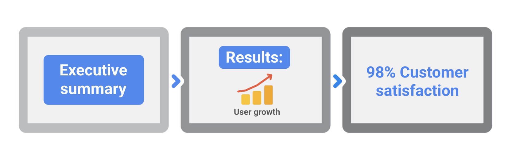

> Closing a project

You will learn how to determine when a project is finished and why closing a project is important.

> 你将学习如何确定一个项目何时结束，以及为什么结束一个项目很重要。

You will examine the steps of the closing process and how to create and share project closing documentation.

> 您将了解结帐过程的步骤，以及如何创建和共享项目结帐文档。

**学习目标**

- Determine when a project is complete and explain why closing a project is important.

	> 确定项目何时完成，并解释为什么结束项目很重要。

- Describe the steps of the closing process for stakeholders, the project team, and project managers.

	> 向干系人、项目团队和项目经理描述结束过程的步骤。

- Create project closing documentation and communicate it with the project team and stakeholders.

	> 创建项目收尾文件，并与项目团队和干系人进行沟通。

# Understanding project closure

> 理解项目结束

## Introduction: Closing a project

> 介绍:关闭一个项目

Welcome to our new module.

> 欢迎来到我们的新模块。

Here, we'll be learning about how to close a project.

In this set of videos, you'll learn to explain why closing a project is important, determine when a project is complete, and outline the project closing process.

> 在这组视频中，你将学习解释为什么结束一个项目是重要的，确定一个项目何时完成，并概述项目结束过程。

We'll learn that closing serves as an integral-必需的,必要的 aspect of the project and helps avoid unfavorable-令人不快的,不顺利的 scenarios.

> 我们将了解到，关闭是项目的一个组成部分，有助于避免不利的情况。

We'll also learn that completing a project and closing a project are two very different things.

We'll talk about how your stakeholders and clients fit into the closing process.

> 我们将讨论你的利益相关者和客户如何融入结案过程。

We'll cover how your team can help you close a project and how you can use retrospective meetings to improve your procedures and processes.

> 我们将介绍您的团队如何帮助您完成一个项目，以及您如何使用回顾会议来改进您的程序和流程。

We've touched on retrospectives a bit in the previous module, but you'll learn about them here in a new context.

> 在前面的模块中，我们已经触及了一些回顾，但在这里，您将在新的上下文中了解它们。

You will also learn that a project isn't fully closed until you've celebrated your team for a job well done.

> 你还将了解到，在你为团队的出色工作庆祝完之前，项目并没有完全结束。

Then, we'll explore how the closing process works specifically for you as a project manager.

> 然后，我们将探讨作为项目经理的收尾过程是如何具体工作的。

We'll learn what kinds of presentations and documentation are required for project managers to properly close the project. 

> 我们将学习项目经理需要什么样的演示文稿和文档才能正确地结束项目。

There's a lot to cover, so let's start with an overview of the closing process.

> 有很多内容要介绍，所以让我们从结案过程的概述开始。

Meet me in the next video.

## The importance of project closure-结尾,闭包

> 项目收尾的重要性

Welcome back.

In this video, we're going to discuss project closing.

We'll answer the questions, what does project closing mean, why is it important, and when does it occur?

Project closing consists-由…组成,由…构成 of the process performed to formally-正式地 complete the project, the current phase, and contractual-依据合同的,合同规定的 obligations-义务,责任.

> 项目收尾包括正式完成项目的过程、当前阶段和合同义务。

---

The first thing you should know is that completing a project is not the same thing as closing a project.

> 你应该知道的第一件事是，完成一个项目和结束一个项目是不一样的。

Just because a project is done doesn't mean it's closed.

> 一个项目完成了并不意味着它就结束了。

In a restaurant, just because you've ordered your meal and finished it, doesn't mean your dining experience is over.

> 在餐馆里，仅仅因为你点了餐并吃完了，并不意味着你的用餐体验就结束了。

You have to pay the bill before you leave.

> 你必须在离开之前把帐结清。

It's the same idea with projects.

> 项目也是同样的道理。

---

What does it actually take for a project to be closed?

> 一个项目到底需要什么才能结束?

There are three criteria-标准 that make up a project closing.

> 项目结案有三个标准。

You'll want to assure all work is done.

> 你要确保所有的工作都完成了。

Ensure that the agreed upon project management processes are executed and get formal recognition from stakeholders that the project is done.

> 确保商定的项目管理过程得到执行，并得到干系人对项目完成的正式认可。

---

First, you must assure-确保,使确定 all work is done.

> 首先，你必须确保所有的工作都完成了。

There's a chance-可能性 one of your tasks may have been overlooked-忽视,忽略.

> 你的某项任务可能被忽略了。

Let's say there was a change made that called for reprioritizing work during the project.

> 假设在项目期间发生了一个要求重新确定工作优先级的变更。

For instance, when your team completed user acceptance testing for Project Plant Pals, everything was finished and wrapped up. 

> 例如，当您的团队完成Project Plant Pals的用户验收测试时，一切都结束了。

But months later, a customer searches for allergy-过敏反应,过敏症 information about the plants on Office Green's site, but that information is nowhere to be found.

> 但几个月后，一位顾客在“绿色办公室”网站上搜索有关这些植物的过敏信息，但这些信息无处可寻。

If you did a review before wrapping the project, you might have found that this task, creating allergy-过敏反应,过敏症 documentation, was overlooked and therefore not completed.

> 如果您在包装项目之前做了一次审查，您可能会发现这个创建过敏症文档的任务被忽略了，因此没有完成。

In doing a review of the project, you double- and triple-check that all work is done to avoid having to revisit the project later on. 

> 在对项目进行回顾时，您需要反复检查所有工作是否已经完成，以避免以后不得不重新审视项目。

---

Next, you must ensure that all agreed upon project management processes are executed.

> 接下来，您必须确保所有商定的项目管理过程都得到执行。

Sometimes, managerial-经理的,管理人的 tasks get overlooked.

> 有时候，管理任务会被忽视。

If the task itself is finished, the procedural or administrative work that needs to take place afterwards-以后,后来 might slip-被遗忘,被忽略 your mind.

> 如果任务本身完成了，之后需要进行的程序或管理工作可能会忘记。

An example might be getting contracts signed and processed.

> 一个例子可能是签署和处理合同。

It might have been months since the project was completed, but when you revisit the contract with your plant provider, you realize that neither of you ended up actually signing it.

> 项目可能已经完成了几个月，但是当你重新审视与工厂供应商的合同时，你意识到你们俩最终都没有真正签署合同。

This is a crucial misstep that leaves both parties vulnerable-脆弱的, and it's now taking place way after the new services official launch. 

> 这是一个让双方都很脆弱的重大失误，而且是在新服务正式发布之后才发生的。

---

Finally, you'll need formal recognition-承认,接受 and agreement that the project is complete by key stakeholders.

> 最后，您需要正式的认可和协议，即项目是由关键涉众完成的。

If you don't have formal approval from all stakeholders that a project is over, certain stakeholders may still request adjustments to the project because they'll think it's still active.

> 如果你没有得到所有涉众对项目结束的正式批准，某些涉众可能仍然会要求对项目进行调整，因为他们认为项目仍然是活跃的。

This may affect various members of your team.

> 这可能会影响到团队中的个别成员。

For instance, if Office Green's contracted web developers believe that the project is still active, they may still be dedicating-致力于,献身于 time and even billing hours of work on this project, which means wasted money for Office Green.

> 例如，如果Office Green的签约网络开发人员认为该项目仍然活跃，他们可能仍然在这个项目上投入时间，甚至计费小时数，这意味着Office Green浪费了钱。

In the same way that all of the previous phases of the process, like initiation, planning, executing, monitoring, and controlling serve a purpose, closing serves its own, equally important purpose.

> 与流程的所有前几个阶段(如启动、计划、执行、监视和控制)都有其目的一样，收尾也有其自身的重要目的。

Closing a project is important because it ensures that nothing has **fallen through the cracks**-被忽略、被遗漏、被忘记.

> 结束一个项目是很重要的，因为它可以确保没有遗漏任何东西。

If a project isn't closed, your team's efforts, time, and credibility-信誉,可信度 may be negatively impacted.

> 如果一个项目没有结束，你的团队的努力、时间和信誉可能会受到负面影响。

To avoid negative impacts to your team, there are a couple of different types of projects that you'll want to know about and avoid.

> 为了避免对你的团队产生负面影响，你需要了解和避免一些不同类型的项目。

These are the never-ending project and the abandoned-中止 project.

> 这些是永无止境的项目和被放弃的项目。

The never-ending project exists when, for whatever-无论什么 reason, the project deliverables and tasks cannot be completed.

> 当由于某种原因，项目可交付成果和任务无法完成时，就存在永无止境的项目。

This may occur when tasks are delegated-授权,把…委托给 to team members who don't have the skills necessary to complete the tasks or when deadlines aren't properly communicated, maybe when user acceptance testing yields too many non-launch blocking bugs, or when your client is unsatisfied, despite-尽管,即使 meeting their requirements.

> 当任务被委派给不具备完成任务所需技能的团队成员时，或者当截止日期没有得到适当的沟通时，或者当用户验收测试产生太多无法启动的错误时，或者当您的客户不满意时，尽管满足了他们的要求，这可能会发生。

Pay special attention to protecting the scope of your project, and you're much more likely to close a project successfully.

> 特别注意保护项目的范围，你就更有可能成功地结束一个项目。

If it feels like the customer wants much more from you than this project is slated-预定,计划 to deliver, maybe the best option is to commit to a follow-up project and close the current one.

> 如果感觉客户对你的要求远远超过这个项目的预期交付，也许最好的选择是承诺一个后续项目，并结束当前的项目。

The abandoned project exists when inadequate-不充分的,不足的 handoff-交接 of the project deliverables occurs.

> 当项目可交付成果的交接不充分时，就存在被放弃的项目。

Basically, the final deliverable never makes it to your customer.

> 基本上，最终交付的产品永远不会到达你的客户手中。

It wouldn't make sense to build a product and then not be able to market it or sell it.

> 开发出一款产品却无法进行市场推广或销售，这是没有意义的。

Making plans to ensure an adequate-足够的,适当的 handoff-交接 or transition-过渡,转变 deliverables is crucial to ensure customers are happy and projects are properly closed.

> 制定计划以确保足够的移交或过渡交付成果是确保客户满意和项目正确结束的关键。

---

In summary, you'll want to do everything you can to properly close a project because it may leave you on the hook-挂钩 for incomplete contracts, incomplete scope, or non-compliant practices.

> 总而言之，您会想要尽您所能正确地结束一个项目，因为它可能会让您陷入不完整的合同、不完整的范围或不合规的实践。

In the next video, we'll discuss the necessary steps included in a comprehensive-全面的,综合性的 closing process for clients and stakeholders.

> 在下一个视频中，我们将讨论客户和利益相关者全面关闭过程中包括的必要步骤。

## Case study: The impact of skipping project closure steps

> 案例研究:跳过项目结束步骤的影响

In the video, we discussed the importance of the last phase of the project life cycle: closing the project.

> 在视频中，我们讨论了项目生命周期最后阶段的重要性:结束项目。

You learned that, in order to close a project, you must ensure that:

> 你了解到，为了结束一个项目，你必须确保:

- All work is done.
- All agreed-upon project management processes have been executed.
- You have received formal recognition and agreement from key stakeholders that the project is done.

In this reading, we will discuss the impact of skipping important project closure steps. 

> 在这篇阅读中，我们将讨论跳过重要项目结束步骤的影响。

Sometimes project closure is improperly-不适当地,错误地 conducted or never happens at all.

> 有时，项目关闭的操作不当或根本没有发生。

This can have a major impact on your organization’s overall profitability-盈利能力 and success.

> 这可能会对组织的整体盈利能力和成功产生重大影响。

Skipping the closure phase can compromise-危及,损害 a project that had otherwise been running smoothly.

> 跳过结束阶段可能会危及原本顺利运行的项目。

No matter how successful the project may look in its final stages, your job as a project manager is not complete until all steps of the closure phase have been completed.

> 无论项目在最后阶段看起来多么成功，在结束阶段的所有步骤完成之前，你作为项目经理的工作都没有完成。

---

**Case study: Tilly’s Toys**

> 案例研究:Tilly’s Toys

In order to better understand what can happen when a project is not properly closed out, let’s examine a possible scenario:

> 为了更好地理解当项目没有正确结束时会发生什么，让我们检查一个可能的场景:

Tilly’s Toys, a small children’s toy manufacturer-生产商,制造商, developed a new interactive-交互式的,互动的 piggy-小猪 bank that speaks and plays songs to help children learn number recognition, counting, and adding.

> Tilly 's Toys是一家小型儿童玩具制造商，它开发了一种新的互动式储蓄罐，可以说话和播放歌曲，帮助孩子们学习数字识别、计数和加法。

Below are several oversights-监督,失察,疏忽 that occurred as a result of not properly closing out the project.

> 下面是由于没有正确结束项目而出现的几个疏忽。

---

**Oversight #1: Not all of the work was completed.**

> 疏忽1:不是所有的工作都完成了

**What happened**: 

When Tilly’s Toys received the final toy box from the packager, they realized that it did not include the safety disclaimer-不承诺,免责声明 that the toy includes small parts and should not be used by children under the age of three.

> 当Tilly 's Toys从包装商那里收到最终的玩具盒时，他们意识到它没有包括安全免责声明，即玩具包含小部件，不应由三岁以下的儿童使用。

The design of this disclaimer had been included in the original Statement of Work but was never completed. 

> 本免责声明的设计已包括在原始的工作声明中，但从未完成。

**Impact on the organization**:

When the missing disclaimer was discovered, Tilly’s Toys was not able to use any of the boxes that had been created.

> 当丢失的免责声明被发现时，Tilly 's Toys无法使用任何已创建的盒子。

They incurred-带来,招致 significant costs to have the packager create all new boxes including the disclaimer.

> 为了让包装商制作包括免责声明在内的所有新盒子，他们付出了巨大的成本。

Having to recreate the boxes also meant that they were not able to meet their original launch date, which would have had the toys in stores before the holiday season.

> 不得不重新制作包装盒也意味着他们无法赶上原定的上市日期，也就是玩具在假日季节之前上市的日期。

This oversight-监督,失察,疏忽  cost-使丧失,使损失 the organization additional revenue-收益,收入,税收 and extended the project timeline and resources.

> 这种疏忽使组织损失了额外的收入，并延长了项目的时间和资源。

---

**Oversight #2: The organization did not complete an important agreed upon project management process.** 

> 疏忽#2:组织没有完成一个重要的商定的项目管理过程

**What happened**:

Tilly’s Toys customer, a regional-地区的,区域的 chain of toy stores, required that all contractors-承包商,立约人 working on the project sign a non-disclosure-不披露 agreement (NDA).

> Tilly 's Toys的客户，一家地区性的玩具连锁店，要求所有参与该项目的承包商签署一份保密协议(NDA)。

The NDA stated that the contractors would not disclose-透露,公开,揭开 any information about the toy until its launch date.

> NDA表示，承包商不会透露任何有关该玩具的信息，直到其发布日期。

One of the educational-教育的,有教育意义的 experts contracted-签合同 to review the toy was never given this NDA.

> 签约审查该玩具的一位教育专家从未得到过这份保密协议。

Not having received—or signed—this important form, the contractor posted about the new toy on social media months before the toy’s launch date.

> 由于没有收到或签署这份重要的表格，承包商在玩具上市前几个月就在社交媒体上发布了关于新玩具的消息。

**Impact on the organization**:

Sharing information with the public before the toy was launched was a breach-违反,破坏 of contract-合同 between Tilly’s Toys and their customer.

> 在玩具推出之前与公众分享信息违反了Tilly 's Toys与其客户之间的合同。

This breach put Tilly’s Toys at significant legal risk.

> 这一违规行为使蒂莉玩具公司面临重大法律风险。

---

**Oversight #3: Stakeholders and the project manager did not provide formal recognition and agreement that the project was done.**

> 疏忽#3:涉众和项目经理没有正式承认并同意项目已经完成。

**What happened**:

Ames, the project manager, communicated with the customer throughout the toy’s development about their objectives for the toy.

> 在整个玩具开发过程中，项目经理Ames与客户就玩具的目标进行了沟通。

After the previous oversights were rectified-纠正,矫正 and Ames assumed his team was done with the project, he released the team to work on other projects.

> 在纠正了之前的疏忽之后，Ames认为他的团队已经完成了这个项目，他让团队去做其他项目。

Shortly after, the customer sent a list of additional changes they wanted to see in the toy’s design.

> 不久之后，客户发来了一份清单，列出了他们希望看到的玩具设计的其他变化。

**Impact on the organization**:

Ames had to tell the customer that it was too late to implement their design requests.

> Ames不得不告诉客户，现在执行他们的设计要求已经太迟了。

The customer was unhappy and told Ames that they may consider using a different toy manufacturer-生产商,制造商 in the future.

> 这位顾客很不高兴，并告诉艾姆斯，他们将来可能会考虑换一家玩具制造商。

---

**Avoiding the impact of project closure oversights**

> 避免项目结束疏忽的影响

 Oversights or skipping steps in the closing phase of a project can:

> 在项目结束阶段的疏忽或跳过步骤可能会:

- Impact the product’s or service’s scheduled launch dates.

	> 影响产品或服务的预定发布日期。

- Put your organization at legal risk.

	> 让你的组织面临法律风险。

- Result in significant financial losses to your organization.

	> 给您的组织造成重大的经济损失。

- Undermine-逐渐削弱,破坏 your team's credibility, and yours.

	> 破坏你的团队和你自己的信誉。

- Damage your relationship with the customer or client.

	> 破坏与顾客或客户的关系。

All of the steps of the project life cycle—initiating the project, making a plan, executing and completing tasks, and closing the project—are essential for a successful outcome.

> 项目生命周期的所有步骤——启动项目，制定计划，执行和完成任务，以及结束项目——对于一个成功的结果是必不可少的。

Unfortunately-不幸地,遗憾地, closing the project is a phase that too often gets skipped, which can negatively impact both the project manager and their organization.

> 不幸的是，结束项目是一个经常被跳过的阶段，这可能会对项目经理和他们的组织产生负面影响。

To avoid these issues, make sure to plan for this phase just as you would any of the other project life cycle phases.

> 为了避免这些问题，请确保对这个阶段进行计划，就像您对任何其他项目生命周期阶段进行计划一样。

# The steps of the closing process 15min 

> 关闭过程的步骤

## The closing process for clients and stakeholders

> 为客户和利益相关者的关闭过程

In the last video, we talked about why the closing process is important in general.

> 在上一个视频中，我们讨论了为什么结案过程通常很重要。

We'll get more specific in this video as we discuss why closing is important for clients and stakeholders.

> 在这个视频中，我们将更具体地讨论为什么成交对客户和利益相关者很重要。

A formal closing process is important not only because improper-不正确的,错误的 closing may leave you on the hook for incomplete contracts or incomplete scope, but also because you want stakeholders to feel like their needs were met.

> 一个正式的结束过程很重要，不仅因为不恰当的结束可能会让你陷入不完整的合同或不完整的范围，还因为你希望利益相关者觉得他们的需求得到了满足。

As we mentioned earlier, a project team's relationship with customers, users, vendors, and so on can be impacted by loose-松散的 ends. 

> 正如我们前面提到的，项目团队与客户、用户、供应商等的关系可能会受到松散的结果的影响。

If relationships are impacted negatively, your team's credibility may be impacted.

> 如果人际关系受到负面影响，团队的可信度也会受到影响。

---

Typically, stakeholders set the goals and scope of the project alongside-与…一起 the project manager, so a good project manager will always want to make sure those stakeholders are satisfied with the quality of deliverables and the end product too.

> 通常，干系人会与项目经理一起设定项目的目标和范围，所以一个好的项目经理总是希望确保这些干系人对可交付成果和最终产品的质量感到满意。

So how can you make sure that clients and key stakeholders are happy with the project closing?

> 那么，您如何确保客户和关键干系人对项目结束感到满意呢?

First, you'll want to decide if your project warrants-需要,值得 a small closing process at the end of each milestone or a formal and more comprehensive closing phase near the very end.

> 首先，你需要决定你的项目是否需要在每个里程碑结束时进行一个小的结束过程，或者在接近尾声时进行一个正式的、更全面的结束阶段。

You may even decide to do both the small closing process at the end of each milestone and a more formal closing phase at the very end.

> 您甚至可以决定在每个里程碑结束时进行小的结束过程，并在最后进行更正式的结束阶段。

You'll determine this by asking yourself if a particular milestone is final, meaning the milestone will not need to be readdressed-重新处理,重新考虑 at a later time in the project.

> 您可以通过询问自己某个特定的里程碑是否是最终的来确定这一点，这意味着该里程碑将不需要在项目的稍后时间重新设置。

If so, having a short, formal closeout will ensure that everyone is clear on the outcomes of that particular milestone.

> 如果是这样，一个简短、正式的结束将确保每个人都清楚这一特定里程碑的结果。

---

For example, let's put this in the context of the Project Plant Pals website launch.

> 例如，让我们把它放在植物伙伴项目网站启动的背景下。

Launching the website is an official milestone, so having a formal close out to the website launch might make sense.

> 推出网站是一个官方里程碑，所以有一个正式的结束网站的推出可能是有意义的。

Yes, there will still be ongoing updates and maintenance to the site, but it won't be launched again.

> 是的，仍然会有持续的更新和维护的网站，但它不会再次启动。

The launch is a one-time event.

> 这次发布会是一次性的。

You need to make sure you're handing over deliverables, putting together the proper documentation, and alerting all stakeholders that you've reached that milestone and that that portion-一部分 of the project is now closed.

> 你需要确保你交付了可交付成果，整理了适当的文档，并提醒所有的利益相关者你已经达到了那个里程碑，项目的那个部分现在已经结束了。

---

If you decide to conduct closing processes after each phase or milestone, here is what that will look like for your team.

> 如果你决定在每个阶段或里程碑之后进行收尾过程，那么你的团队应该这样做。

First, you'll ensure that the project has satisfied-满意的,满足的 the strategic-战略的,策略的 goals that it was intended to meet.

> 首先，您要确保项目已经满足了它想要达到的战略目标。

To begin, you'll want to refer to prior documentation such as your statement of work, request for proposal, risk register, and RACI chart.

> 首先，您需要参考先前的文档，例如您的工作说明、提案请求、风险登记和RACI图表。

You recall that these documents were discussed in previous sections, so feel free to revisit those as a refresher-补习课程.

> 您记得在前面的小节中讨论过这些文档，因此可以随意重新访问它们作为复习。

While doing so, ask yourself, was all of the required work in the elapsed-消逝 phase done?

> 在这样做的时候，问问你自己，在经过的阶段中所有需要的工作都完成了吗?

Were all identified issues addressed?

> 所有确定的问题都解决了吗?

Did every team member complete their assigned tasks?

> 每个团队成员都完成了分配给他们的任务吗?

Then you'll put together closing documentation such as creating closeout-收尾,平仓 reports, which we'll cover in depth later.

> 然后将结帐文档放在一起，例如创建结帐报告，我们将在后面深入介绍。

You'll build and review that documentation with team members to make sure that every aspect of the project has been discussed.

> 您将与团队成员一起构建并审查该文档，以确保项目的每个方面都得到了讨论。

You'll also review notes from any retrospectives you and your team participated in.

> 您还将回顾您和您的团队参加的任何回顾会议的记录。

This way, your team members will get a chance to speak about the aspects they liked or didn't like, and they'll leave with a sense of closure.

> 这样，你的团队成员将有机会谈论他们喜欢或不喜欢的方面，他们将带着一种结束感离开。

Next, you'll conduct administrative-管理的,行政的 closure of the procurement-采购,购买 process.

> 接下来，你将对采购流程进行行政收尾。

Close any contracts necessary, deliver the payments to vendors, and retrieve-找回,收回,检索 all final deliverables from contracted workers.

> 完成任何必要的合同，向供应商付款，并从合同工人那里取回所有最终交付物。

This is really important so that external stakeholders and contracted workers can understand that the phase or the project is officially over.

> 这一点非常重要，这样外部利益相关者和合同工就能明白，这个阶段或项目正式结束了。

Then you'll want to formally recognize-认可,承认 the completion of the phase, if necessary.

> 然后，如果有必要，您将需要正式确认该阶段的完成。

Make sure all stakeholders are aware that a phase or project is ending.

> 确保所有涉众都知道某个阶段或项目即将结束。

This may be as simple as sending out an email notifying them that you've achieved this milestone or may warrant-需要,值得 a larger meeting.

> 这可能很简单，比如发一封电子邮件通知他们你已经达到了这个里程碑，或者可能需要召开一次更大的会议。

Finally, you'll complete any necessary follow-up work.

> 最后，您将完成任何必要的后续工作。

This includes things like gathering final feedback and conducting closing surveys.

> 这包括收集最终反馈和进行结案调查。

This way, you'll proactively-主动地,积极 help stakeholders with future issues by following up and offering support.

> 这样，你就可以通过跟进和提供支持，积极主动地帮助利益相关者解决未来的问题。

---

If ,instead of closing after certain phases or milestones, you've decided to close at the very end of your project, your process may be a little bit different.

> 如果不是在某个阶段或里程碑之后结束，而是决定在项目的最后结束，那么您的过程可能会有所不同。

Here is what that might look like.

> 这可能是这样的。

First, provide the necessary training tools, documentation, and capabilities to use your product.

> 首先，提供必要的培训工具、文档和使用产品的能力。

This includes things like manuals and how-to guides, which gives your customers and users an understanding of how to use your product or service after the project is closed.

> 这包括手册和操作指南，让你的客户和用户了解在项目结束后如何使用你的产品或服务。

Next, ensure that the project has satisfied its goals and desired outcomes.

> 接下来，确保项目已经满足了它的目标和期望的结果。

Review the project to make sure that all tasks and deliverables were completed and nothing is missing.

> 检查项目，确保所有任务和可交付成果都已完成，没有遗漏。

Did you accomplish what you set out to do?

> 你完成你的计划了吗?

Is the full scope of work completed?

You'll also want to document acceptance from all stakeholders like clients and sponsors.

> 您还需要记录所有利益相关者(如客户和赞助商)的接受情况。

Ensuring that you have written proof-证明,证据 that stakeholders are happy with the deliverables and outcomes is very important.

> 确保你有书面证据证明涉众对可交付成果和结果感到满意是非常重要的。

This could be in retrospectives, a project completion document, or any other formal signoff.

> 这可以是回顾，项目完成文档，或任何其他正式的签字。

Then review all contracts and documentation with your project team.

> 然后与项目团队一起审查所有合同和文件。

This includes things like your SOW, RFP, RACI chart, risk register, and the procurement documents that we discussed earlier. 

> 这包括您的SOW、RFP、RACI图表、风险登记以及我们之前讨论过的采购文档。

Including your whole team in this review process will help you make sure that nothing is missed.

> 让你的整个团队都参与到这个审查过程中会帮助你确保没有遗漏任何东西。

Always document your lessons learned by conducting a formal retrospective.

> 总是通过进行正式的回顾来记录你的经验教训。

Include your team, any other teams involved, your stakeholders, and outside vendors in this meeting.

> 包括你的团队，任何其他相关的团队，你的利益相关者，以及外部供应商参加这个会议。

We'll go over this in more detail in the next video.

> 我们将在下个视频中更详细地讨论这个。

Finally, you can disband-解散 and thank the project team.

> 最后，您可以解散并感谢项目团队。

---

The next important step in closing a project for the stakeholders is impact reporting.

> 对涉众来说，结束项目的下一个重要步骤是影响报告。

Impact reporting is a presentation that's given at the end of a project for key stakeholders, which typically includes the stakeholders you had in the initial kick-off meeting.

> 影响报告是在项目结束时为关键利益相关者做的演示，通常包括你在最初的启动会议上遇到的利益相关者。

The purpose of impact reporting is to demonstrate how the project went and discuss the impact of your product or service.

> 影响报告的目的是展示项目的进展情况，并讨论你的产品或服务的影响。

It's important for the project manager because you'll be able to demonstrate the success of your project on your terms and present the work you did to add value to the business.

> 这对项目经理来说很重要，因为你可以用自己的方式展示项目的成功，并展示你为企业增加价值所做的工作。

In this presentation, you'll cover how the project landed-着陆,降落 in terms of time, scope, and budget.

> 在本演示中，您将介绍项目如何在时间、范围和预算方面落地。

You'll state when the new service or product launch and discuss any available feedback from users, and you'll explain how the desired outcomes were achieved.

> 您将说明新服务或产品发布的时间，并讨论来自用户的任何可用反馈，您将解释如何实现预期的结果。

Now you know more about how stakeholders and customers can get a clear understanding that your project is closed.

> 现在您了解了涉众和客户如何清楚地了解您的项目已经结束。

We've discussed why that's necessary and how your reputation and credibility can be affected if you don't do extensive work to close the project completely.

> 我们已经讨论了为什么这样做是必要的，以及如果你不做大量的工作来彻底结束项目，你的声誉和信誉会受到怎样的影响。

In the next video, we'll discuss how your team can be impacted by closing a project properly-正确地,适当地 and improperly.

> 在下一个视频中，我们将讨论如何通过正确和不正确地结束一个项目来影响你的团队。

I'll meet you there.

## Demonstrating project impact to stakeholders

> 向利益相关者展示项目影响

Previously, you learned why completing the closing phase of the project life cycle is important.

> 前面，您了解了为什么完成项目生命周期的结束阶段是重要的。

As we discussed, a formal closing process is essential because improper-不正确的,错误的 closing may leave you at risk for incomplete-不完整的,不完全的 contracts and scope.

> 正如我们所讨论的，一个正式的结案过程是必不可少的，因为不当的结案可能会让你面临合同和范围不完整的风险。

It is also important to make sure that all stakeholders feel like their needs are met and to review areas for improvements in the future.

> 同样重要的是，要确保所有利益相关者都觉得他们的需求得到了满足，并审查未来需要改进的领域。

In this reading, we will further discuss how to demonstrate the impact of your project to your stakeholders through **impact reporting**.

> 在这篇阅读中，我们将进一步讨论如何通过**影响报告**来展示项目对利益相关者的影响。

Impact reporting is a presentation or formal report prepared for key stakeholders at the end of a project. 

> 影响报告是在项目结束时为关键利益相关者准备的演示文稿或正式报告。

---

**Highlight key performance areas**

> 突出主要表现领域

The purpose of your impact report is to show your key stakeholders the impact your project had on the organization.

> 你的影响报告的目的是向你的关键利益相关者展示你的项目对组织的影响。

Goals, objectives, budget, schedules, and key performance indicators-标志,迹象 (KPIs) need to be determined at the beginning of your project.

> 目标、目标、预算、时间表和关键绩效指标(kpi)需要在项目开始时确定。

Your impact report should demonstrate how well you did against those early targets.

> 你的影响报告应该展示你在实现这些早期目标方面做得如何。

In your report, you should also answer the question:

> 在你的报告中，你也应该回答这个问题:

What was the problem we were trying to solve, and how did we solve it?

> 我们试图解决的问题是什么，我们是如何解决的?

This will help you showcase-展示,展现 the value your project outcome brought to the business.

> 这将帮助您展示项目成果给业务带来的价值。

Highlight these key performance areas to demonstrate to your stakeholders how you achieved successful results and outcomes:

> 突出这些关键的表现领域，向你的利益相关者展示你是如何取得成功的成果的:

- First, describe the goals and objectives you set for the project and what you hoped to have achieved by the end. 

	> 首先，描述你为项目设定的目标和目的，以及你希望在项目结束时实现的目标。

- Then, describe how you met those objectives against your KPIs.

	> 然后，根据kpi描述你是如何实现这些目标的。

	A KPI is a measurable value that demonstrates how effective a company is at achieving their objectives.

	> KPI是一个可测量的值，它显示了公司在实现其目标方面的有效性。

	In your impact report, review how you defined the success of your project at the beginning, and highlight the outcomes you achieved that demonstrate this success.

	> 在你的影响报告中，回顾一开始你是如何定义你的项目的成功的，并强调你所取得的成果来证明这一成功。

- Finally, showcase your schedule and budget performance by outlining your cost savings and efficiencies.

	> 最后，通过概述成本节约和效率来展示你的时间表和预算表现。

	Demonstrate that you met the deadlines set in your project scope and that your project was completed within budget.

	> 证明你在项目范围内设定的最后期限内完成了项目，并在预算范围内完成了项目。

---

**Use metrics to showcase your results**

> 使用指标来展示你的结果

Use facts and statistics to highlight the results you achieved related to the performance areas described in the section above. 

> 使用事实和统计数据来突出显示与上面部分中描述的性能领域相关的结果。

Examples of common metrics you might include to demonstrate a positive impact could include: 

> 你可以用来展示积极影响的常见指标包括:

- Improvement in schedule performance

	> 改善进度表现

- Revenue-收入,收益 growth

	> 收入增长

- Positive return on investment (ROI)

	> 积极的投资回报(ROI)

- Increased external user counts

	> 增加外部用户数量

- Increased percentage of internal users 

	> 增加了内部用户的百分比

- Cost vs. margins-盈余,利润

	> 成本与利润

- High percentage of customer satisfaction 

	> 客户满意度高

- Reduction-减小,降低 in overhead-日常开支

	> 减少开销

- Reduction in technical issues

	> 减少技术问题

- Time saved

	> 节省的时间

Metrics and data points are one of the best ways to present impact.

> 指标和数据点是展示影响力的最佳方式之一。

Throughout your project, collect data and track progress in each of the areas you want to measure.

> 在整个项目中，收集数据并跟踪您想要度量的每个领域的进展。

If you can complement-补充,补足 your metrics with the appropriate visuals and tie-联系 them back to the project’s larger goals, you can quickly demonstrate your project’s success and value.

> 如果您可以用适当的视觉效果来补充您的度量标准，并将它们与项目的更大目标联系起来，那么您可以快速展示项目的成功和价值。

---

**Prepare an effective impact report presentation**

> 准备有效的影响报告演示文稿

An effective presentation can help your stakeholders understand your project’s impact.

> 一个有效的演示可以帮助你的利益相关者理解你的项目的影响。

In order to successfully convey-表达,传递 all of the information you have prepared: 

> 为了成功地传达你所准备的所有信息:

- **Be concise-简洁的,简明的**. 

	While you should share metrics that illustrate how you achieved your project goals, you do not need to include extraneous-外来的,没有关联的 details.

	> 虽然您应该共享说明您如何实现项目目标的指标，但您不需要包含无关的细节。

	For clarity, organize information by using bullet-黑圆点 points instead of paragraphs-段落. 

	> 为了清晰，用要点代替段落来组织信息。

- **Understand your audience**. 

	Make sure that your report does not use too much technical language or jargon-行话,术语 to help your stakeholders understand it.

	> 确保你的报告没有使用太多的技术语言或术语来帮助你的利益相关者理解它。

- **Use visuals.** 

	Use a digital presentation application, such as Google Slides, Microsoft PowerPoint, or Canva to present your impact report. 

	> 使用数字演示应用程序(如Google Slides、Microsoft PowerPoint或Canva)来展示您的影响报告。

	Add diagrams, such as charts and graphs, to illustrate your results.

	> 添加图表，如图表和图形，以说明您的结果。

	Use images to add visual interest.

	> 使用图片来增加视觉趣味。

	Add icons to draw attention to information and help your stakeholders quickly understand information.

	> 添加图标来吸引信息的注意力，帮助涉众快速理解信息。

- **Describe your learnings.** 

	Discuss lessons you learned during the course of the project and any areas you have identified for improvement.

	> 讨论你在项目过程中学到的经验教训，以及你认为需要改进的地方。

- **Keep your stakeholders engaged**. 

	Grab and keep your stakeholders’ attention by varying the way that you present your data:

	> 通过改变你展示数据的方式来抓住并保持利益相关者的注意力:

	1. **Show**: Play videos of demos, testimonials-推荐, or case studies.

		> **显示**:播放视频演示，推荐，或案例研究。

	2. **Storytell**: Tell a story or anecdote-轶事,趣闻 related to the data in the report. 

		> **讲故事**:讲一个与报告数据相关的故事或轶事。

	3. **Engage**: Ask for audience participation through questions, surveys, or quizzes.

		> **Engage**:通过提问、调查或小测验邀请观众参与。

---

**Key takeaways**

As a project manager, impact reporting is a great opportunity to demonstrate the impact of your project and the value you bring to your organization.

> 作为一个项目经理，影响报告是一个很好的机会来展示你的项目的影响和你给你的组织带来的价值。

By highlighting key performance areas, using metrics to showcase results, and preparing an effective presentation, you can impress-使钦佩,使留下深刻印象 your stakeholders and convince-使确信,使信服 them of your project’s success.

> 通过突出关键的性能领域，使用指标来展示结果，并准备一个有效的演示，您可以给您的涉众留下深刻印象，并使他们相信您的项目是成功的。

## The closing process for the team

> 团队的收尾过程

Hi again.

In the last video, we focused on how to close out a project for your customer and stakeholders.

> 在上一个视频中，我们重点介绍了如何为客户和利益相关者完成一个项目。

In this video, we'll discuss the best practices for closing a project with your team.

> 在本视频中，我们将讨论与团队结束项目的最佳实践。

You'll also learn to use a retrospective to close your project and celebrate your team's accomplishments-成就.

> 你还将学会用回顾来结束你的项目，庆祝你的团队的成就。

I've talked to you about retrospectives quite a bit throughout this program, and that's because there really is no better tool for reflection and improvement.

> 在整个课程中，我已经多次谈到回顾，这是因为没有比回顾和改进更好的工具了。

Retrospectives are such an important aspect of the project, and it's important to really emphasize-强调,着重 that to you.

> 回顾是项目中非常重要的一个方面，向您强调这一点非常重要。

Throughout the course, I'm referring to the formal practice, but a lot of us conduct informal retrospectives daily without even knowing it.

> 在整个课程中，我指的是正式的实践，但我们很多人每天都在进行非正式的回顾，甚至不知道它。

Whether we're talking about our day with our friends or family or thinking about how we can improve past interactions, we are constantly-总是,经常地 reflecting-深思,反省 and working toward-朝着 progress-进步,进展.

> 无论我们是在与朋友或家人谈论我们的一天，还是在思考如何改善过去的互动，我们都在不断地反思并朝着进步的方向努力。

---

Let's revisit formal retrospectives for a moment to explore how they tie into the formal project closing process.

> 让我们来回顾一下正式的回顾，看看它们是如何与正式的项目结束过程联系在一起的。

You might remember that a retrospective is a meeting aimed to discuss successes, failures, and possible improvements on the project.

> 您可能还记得，回顾会议旨在讨论项目的成功、失败和可能的改进。

They can occur after a major milestone completion and at the end of a project.

> 它们可以发生在主要里程碑完成之后和项目结束时。

In order to understand the importance of closing a project, let's discuss the three main retrospective benefits for your team. 

> 为了理解结束项目的重要性，让我们讨论一下回顾对团队的三个主要好处。

Retrospectives encourage team-building because they allow team members to understand differing perspectives.

> 回顾会议鼓励团队建设，因为它允许团队成员理解不同的观点。

Retrospectives facilitate improved collaboration on future projects, and they promote positive changes in future procedures-程序 and processes.

> 回顾促进了未来项目的协作，并且促进了未来程序和过程的积极变化。

So it's no surprise that a retrospective is a critical part of closing a project.

> 因此，回顾是结束项目的关键部分也就不足为奇了。

Whether your team has chosen to close the project after each phase or comprehensively at the end, you'll conduct retrospectives as a part of that process.

> 无论您的团队是选择在每个阶段之后结束项目，还是在结束时全面结束项目，您都要将回顾作为该过程的一部分。

There may be temptation-引诱,诱惑 within your project team to resist-阻挡,抵制 reflecting before forging ahead into the next phase, but you can't grow and improve if you don't spend time reflecting.

> 在进入下一阶段之前，您的项目团队中可能存在抵制反思的诱惑，但是如果您不花时间反思，您就无法成长和提高。

Reflecting is a great way to learn which practices you should keep doing and which ones you can improve upon.

> 反思是一个很好的方法，可以让你知道哪些是你应该继续做的，哪些是你可以改进的。

As a project manager, you want to build a culture within your team and company to aim for constant-持续不断的 improvements.

> 作为一名项目经理，你希望在你的团队和公司中建立一种文化，以不断改进为目标。

This means that you'll need to solicit-索求,征求 feedback that will help you to do better in your next project.

> 这意味着你需要征求能帮助你在下一个项目中做得更好的反馈。

This feedback might touch on any aspect of the project, from planning, scheduling, execution, communication, or team dynamics. 

> 这些反馈可能涉及项目的任何方面，从计划、调度、执行、沟通或团队动态。

You might receive feedback about processes you led, and that's okay.

> 你可能会收到关于你领导的过程的反馈，这没关系。

Working through feedback is crucial to your growth as a project manager.

> 作为一名项目经理，通过反馈来工作对你的成长至关重要。

It's important to create a safe space for that feedback so that folks can really share what they're thinking and the team can grow together.

> 重要的是要为这些反馈创造一个安全的空间，这样人们才能真正分享他们的想法，团队才能共同成长。

This is a key piece to help improve collaborations on future projects.

> 这是帮助改善未来项目合作的关键部分。

Part of encouraging continuous growth is to recognize-承认,赞赏 and celebrate a job well done.

> 鼓励持续增长的一部分是认可和庆祝工作的出色完成。

The way you celebrate will change depending on where you're at in the project and what feels most appropriate to your team. 

> 你庆祝的方式会根据你在项目中的位置和你的团队感觉最合适的方式而改变。

Taking a moment to reward yourself with a token of appreciation turns the celebration into a team-building exercise.

> 花点时间奖励一下自己，表达一下感激之情，这样庆祝活动就变成了团队建设活动。

Being appreciative-欣赏的,赞赏的 ensures that the work you're doing feels uplifting-令人振奋的,使人开心的 and rewarding, rather than monotonous-单调乏味的,毫无变化的 and tiring-令人疲倦的,累人的.

> 心存感激能确保你所做的工作让你感到振奋和回报，而不是单调和疲惫。

It also fuels-刺激,加剧 positive change.

> 它还能推动积极的变化。

So when closing a project, don't forget the fun elements.

> 所以在结束一个项目时，不要忘记有趣的元素。

Makes sure to play a game, eat some cake, and celebrate some quality time together, because you've earned it.

> 一定要玩游戏，吃蛋糕，一起庆祝一些美好的时光，因为这是你应得的。

---

Let's review.

Retrospectives encourage team-building because they allow team members to understand differing perspectives.

> 回顾会议鼓励团队建设，因为它允许团队成员理解不同的观点。

They facilitate improved collaboration on future projects, and they promote positive changes in future procedures and processes. 

> 它们促进了未来项目的协作，并促进了未来程序和过程的积极变化。

Now that you know how to wrap things up for your team, let's discuss how to wrap everything up for the project manager.

> 既然您知道了如何为您的团队完成工作，那么让我们讨论一下如何为项目经理完成工作。

## Sarah: Why I love retrospectives

> 萨拉:为什么我喜欢回顾

Hi, I'm Sarah and I'm a program manager, on the Engineering Education team at Google.

> 大家好，我是Sarah，是谷歌工程教育团队的项目经理。

As a program manager, I manage cross-穿越,横渡 functional teams on designing, launching and growing Computer Science Education Programs at Google.

> 作为一名项目经理，我在谷歌管理跨职能团队，负责设计、启动和发展计算机科学教育项目。

So right now my primary remit-职权范围 and my scope is essentially working with organizations in New York City to try to provide more tech education experiences and growth opportunities to youth-青少年时期 in the area.

> 所以现在我的主要职责和范围基本上是与纽约市的组织合作，试图为该地区的年轻人提供更多的技术教育经验和成长机会。

During one of our biggest tech education moments of the year, one of the programs that I work on relies on a third party's platform to be able to run our activities and content.

> 在我们今年最大的科技教育时刻之一，我参与的一个项目依赖于第三方平台来运行我们的活动和内容。

And during a moment where 1000s of students and teachers were getting ready to code online, the platform completely broke-打碎,崩溃. 

> 就在成千上万的学生和老师准备在线编程的时候，这个平台完全崩溃了。

And so you can imagine that the number of emails and bugs and requests that were coming into our team were plentiful-丰富的,众多的.

> 所以你可以想象我们团队收到的邮件、bug和请求的数量是非常多的。

Don't panic-恐慌,惊慌.

> 不要恐慌。

Communicate openly and quickly on the latter side of the issue.

> 就问题的后一个方面进行公开而迅速的沟通。

Once you've already, kind of, fixed the problem focus on a retrospective and a clear post-mortem-事后反思 that's going to help your team and then future teams be able to prevent and mitigate-减轻,缓和 something like that from happening in the future.

> 一旦你已经解决了问题，专注于回顾和清晰的事后分析，这将帮助你的团队，然后未来的团队能够防止和减轻类似的事情在未来发生。

I love retrospectives.

I do them all the time at Google just because they're a great way to be able to coalesce-联合,结合 your entire team to look at the great impact that you've had.

> 我在谷歌一直在做这些事情，因为这是一个很好的方式，可以让你的整个团队团结起来，看看你所产生的巨大影响。

But then also reflect on some of the things that you've learned and could potentially do better for the future.

> 但也要反思一些你学到了的东西，以及有可能在未来做得更好的东西。

And particularly-非常,尤其 at Google.

> 尤其是在谷歌。

What I love about retrospectives is that we have in engineering-工程学, and then across a lot of other operational roles, including project management, a culture of blamelessness-无罪, right?

> 我喜欢回顾的原因是，我们在工程领域，以及其他许多运营角色，包括项目管理，都有一种无可指责的文化——对吧?

If something goes wrong and something breaks, instead of pointing at your engineering team to say you weren't prepared, or to point at your comms team and say there was an error, the whole team should be taking responsibility.

> 如果出了问题，出现了故障，不要指责你的工程团队说你没有准备好，或者指责你的通信团队说有错误，整个团队都应该承担责任。

And the whole team can actually look at that as an opportunity to improve and learn for future iterations-迭代 of what you're working on.

> 整个团队实际上可以把它看作是一个改进和学习的机会，为你正在进行的工作的未来迭代做准备。

I've learned everything from big lessons around the way that you should be building more flexibility-灵活性 into your timeline, to very, very small tactical-战术的,策略的 changes that you're going to need to make in order to be running your project more effectively.

> 我学到了很多东西，从你应该在你的时间表中建立更大的灵活性，到为了更有效地运行你的项目而需要做出的非常非常小的战术改变。

And so I think it's critical to be capturing not only these very big strategic level changes that you might want to make.

> 所以我认为重要的是不仅要抓住你可能想要做的这些非常大的战略层面的变化。

But some of these small tactical things you might be able to tweak-微调,稍微调整 to improve efficiency going forward.

> 但这些小的战术上的东西，你也许可以调整，以提高效率。

Sometimes when you have assumptions-假设,假定 or anticipations-预期,预料 about the direction that somethings going to go and then they completely shift the other direction or they show something completely different than what you expected. 

> 有时候，当你对事物的发展方向有假设或预期时，它们完全改变了方向，或者它们显示的东西与你预期的完全不同。

## The closing process for the project manager

> 项目经理的收尾过程

Welcome back.

Let's discuss what the project closure process means for you, the project manager.

> 让我们讨论一下项目结束过程对项目经理来说意味着什么。

For a project manager, it's important to close the project properly-正确地,适当地 for a number of reasons.

> 对于项目经理来说，正确地结束项目是很重要的，原因有很多。

Closing provides an opportunity to reflect on how you and your team performed, ensure every task is completed, and prevent confusion-混乱,不明确 around the project in the future.

> 结题提供了一个机会来反思你和你的团队是如何执行的，确保每一项任务都完成了，并防止未来围绕项目出现混乱。

I'll detail-详细说明,详述 the importance of these closing practices, as well as the necessary documentation to successfully close a project.

> 我将详细说明这些结束实践的重要性，以及成功结束项目所需的文档。

---

One of the most important aspects of thoroughly-完全地,彻底地 closing a project is the project closeout report.

> 彻底结束一个项目最重要的方面之一是项目结束报告。

A project closeout report is a document created by project managers for project managers.

> 项目收尾报告是项目经理为项目经理创建的文件。

A project closeout report serves three major purposes.

> 项目收尾报告有三个主要目的。

First, it's a blueprint-蓝图 to document what the team did, how they did it, and what they delivered.

> 首先，它是一个蓝图，用于记录团队做了什么、如何做以及交付了什么。

Second, it provides an evaluation-评价,评估 of the quality of work.

> 其次，它提供了对工作质量的评估。

And third, it evaluates the project's performance with respect to budget and schedule.

> 第三，它根据预算和进度评估项目的绩效。

Similar to the retrospective, the project closeout report can be used to determine best practices when it comes to future projects. 

> 与回顾类似，项目收尾报告可用于确定未来项目的最佳实践。

Think of it as a transfer of knowledge from you to future project managers.

> 把它看作是从你到未来项目经理的知识转移。

For instance, once a project closes, there's a chance a similar project or a continuation-连续,持续 of that project will come up within the organization, and maybe a different project manager is assigned to this new project while you go on to other things.

> 例如，一旦一个项目结束，就有可能在组织内出现一个类似的项目或项目的延续，可能会给这个新项目分配一个不同的项目经理，而你去做其他事情。

If you create an in-depth closeout report, it will help the newly-assigned project manager immensely-极其,非常 to know what happened previously on a similar project.

> 如果你创建了一份深入的收尾报告，它将极大地帮助新分配的项目经理了解之前类似项目的情况。

Your closeout report could include things that worked out well and things that didn't work out so well.

> 你的结帐报告可以包括成功的事情和不太成功的事情。

Creating a closeout report will also reduce the time you spend answering questions as the new project manager gets up to speed. 

> 当新项目经理跟上进度时，创建一个收尾报告也会减少你回答问题的时间。

It's safe to assume that the people reading your report in the future will be unfamiliar with the project, so be as detailed as possible.

> 可以肯定的是，将来读你报告的人对这个项目并不熟悉，所以要尽可能详细。

That way the new project team will be able to form-形成 an understanding of the purpose, execution, and outcome of the project based on your report alone.

> 这样，新的项目团队将能够单独基于您的报告形成对项目目的、执行和结果的理解。

---

In your project closeout report, you'll want to include the following things: An executive summary: this means a description of the process and what the purpose of the project was.

> 在你的项目总结报告中，你需要包括以下内容:执行摘要:这意味着过程的描述和项目的目的是什么。

This should be short and concise;

> 这应该简短明了;

a few sentences to a paragraph, maximum.

> 一段最多几句话。

If an executive did not have time to read the entire document and only had time to read this executive summary, would they be able to understand the project highlights?

> 如果执行人员没有时间阅读整个文档，而只有时间阅读这个执行摘要，他们能够理解项目的重点吗?

---

A list of key accomplishments-成就,成绩: think of this as a way to highlight the team's accomplishments, as well as the overall impact of the project.

> 关键成就列表:可以将其视为突出团队成就以及项目总体影响的一种方式。

Include any lessons learned, like: what went well, and why?

> 包括学到的经验教训，比如:什么进展顺利，为什么?

What went wrong, and why?

> 出了什么问题，为什么?

What were the major effects of key problem areas, such as scope creep and schedule slip?

> 关键问题区域的主要影响是什么，比如范围蔓延和进度延迟?

Any open items: this could be things you didn't quite get to or ideas for changes you'd make if you'd had the time.

> 任何未完成的项目:这可能是你没有完成的事情，或者如果你有时间的话，你会做出改变的想法。

---

Your next steps: things like, are there expected-预料的,预期的 follow up projects, and is there any ongoing maintenance required?

> 你接下来要做的事情:比如，是否有预期的后续项目，是否需要任何持续的维护?

You also want to include important information about the schedule and important deadlines, like: what were your milestones, and how did you choose them?

> 你还需要包括关于日程安排和重要截止日期的重要信息，比如:你的里程碑是什么，你是如何选择它们的?

How long did the project take?

> 这个项目花了多长时间?

Did the project stay on track?

> 项目是否保持在正轨上?

And any information about major setbacks-挫折,阻碍.

> 以及任何关于重大挫折的信息。

Be sure to list resources and team members.

> 一定要列出资源和团队成员。

Explain who is involved and what their roles were.

> 解释谁参与其中，他们的角色是什么。

This is also a key way to acknowledge people who contributed to the project's completion.

> 这也是表彰为项目完成做出贡献的人的关键方式。

And finally, include a resources and project archive-存档,归档 section.

> 最后，包括资源和项目存档部分。

This will include links to things like your original project plan, any documented stakeholder communication and feedback (like meeting notes), and documentation used to track, monitor, and report, and any technical information related to the project deliverables like user guides and manuals.

> 这将包括链接到您的原始项目计划，任何记录的涉众沟通和反馈(如会议记录)，用于跟踪，监控和报告的文档，以及与项目可交付成果相关的任何技术信息，如用户指南和手册。

Hopefully by now, you understand how project closeout reports are beneficial to not only the organization, but the project manager as well.

> 希望到目前为止，您已经理解了项目收尾报告不仅对组织有益，而且对项目经理也有好处。

Project closeout reports promote visibility among team members and create more efficient future projects.

> 项目结束报告促进了团队成员之间的可见性，并创建了更高效的未来项目。

All right, we've covered a lot of information.

> 好了，我们讲了很多信息。

Great job for sticking-坚持 with it!

> 坚持做得很好!

In the next video, we'll revisit the concepts you've learned as we recap the module.

> 在下一个视频中，我们将重温您在回顾模块时学到的概念。

# Course review: Project Execution: Running the Project

> 课程回顾:项目执行:项目运行

## Course wrap-up

Congratulations on finishing this course.

> 祝贺你完成这门课程。

Making it this far in the program is quite the accomplishment.

> 在这个项目中走到这一步是相当大的成就。

You should be excited about your progress.

> 你应该为你的进步感到兴奋。

You're this much closer to building the know-how you need to be a project manager.

> 你离成为一名项目经理所需的专业知识就差这么多了。

In this last set of videos, I went over how to formally close a project and explained why closing a project is important.

> 在上一组视频中，我介绍了如何正式结束一个项目，并解释了为什么结束一个项目很重要。

I defined what it means for a project to be complete, detailed the steps in the closing phase, and I demonstrated how to create documentation for closing a project.

> 我定义了项目完成的意义，详细说明了结束阶段的步骤，并演示了如何为结束项目创建文档。

We learned that project closing, when applied appropriately-适当地,恰当地, is a combination-结合,联合 of assurance that the work has been completed, confirmation that all agreed upon project management processes have been executed, and formal recognition that the project requirements have been met and everyone agrees that the project is, in fact, done.

> 我们了解到，项目结束，如果应用得当，是对工作已经完成的保证，对所有商定的项目管理过程已经执行的确认，以及对项目需求已经满足和每个人都同意项目实际上已经完成的正式承认的组合。

We discussed different aspects of the closing process, including conducting retrospectives for your team, why impact reporting matters-重要, and the purpose of a project closeout report.

> 我们讨论了结束过程的不同方面，包括为您的团队进行回顾，为什么影响报告很重要，以及项目结束报告的目的。

That was the end.

Throughout the entire course, you learned how to run a project.

> 在整个课程中，您学习了如何运行项目。

This is no small feat-功绩,壮举.

> 这可不是一件小事。

We discussed that tracking a project helps to build and maintain confidence-自信,信心 within your team that the project will be delivered on time, on budget, and in-scope.

> 我们讨论了跟踪项目有助于在团队中建立和维护信心，即项目将按时、按预算和在范围内交付。

We learned about different external factors that impact a project like dependencies, risk, and changes.

> 我们了解了影响项目的不同外部因素，如依赖关系、风险和变更。

We discussed how to communicate those factors to your team members.

> 我们讨论了如何将这些因素传达给您的团队成员。

We covered data, how to gather it, how to use it to inform decision-making processes, and how to discern-了解,认识 and explain project data using effective presentation-介绍,表现 techniques.

> 我们涵盖了数据，如何收集数据，如何使用它来通知决策过程，以及如何使用有效的表示技术来辨别和解释项目数据。

We discussed how projects, programs, and portfolios relate to each other and their key differences.

> 我们讨论了项目、规划和投资组合是如何相互关联的，以及它们之间的主要区别。

We also learned about the elements of teamwork and how a successful project manager leads a team to success with positive influence and ethical considerations.

> 我们还学习了团队合作的要素，以及一个成功的项目经理如何在积极影响和道德考虑的情况下领导一个团队走向成功。

At this point, you should have a good understanding of how to organize and facilitate meetings to ensure project success and how to communicate effective project status updates to stakeholders.

> 在这一点上，您应该很好地理解如何组织和促进会议以确保项目成功，以及如何与涉众有效地沟通项目状态更新。

The next course is all about Agile project management.

> 下一个课程是关于敏捷项目管理的。

Thanks for allowing me to share my knowledge with you.

> 感谢您允许我与您分享我的知识。

