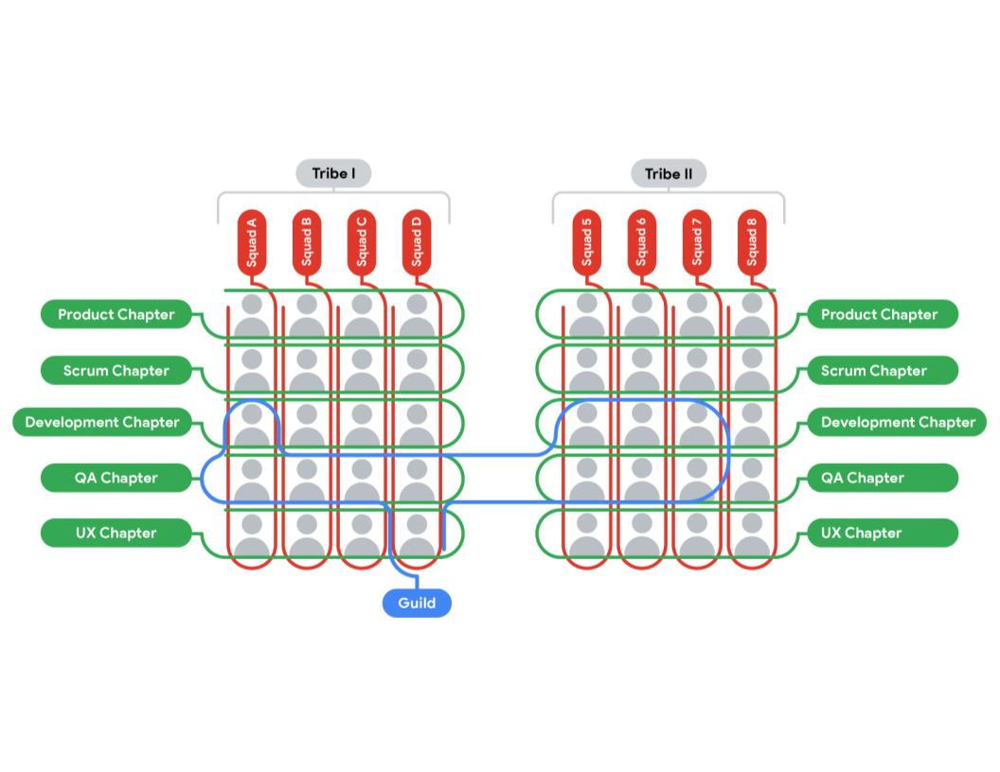

> The fundamentals of Agile
>
> 敏捷的基础

You will learn how the course is structured and explore the history, approach, and philosophy-哲学 of Agile project management and Scrum theory.

> 您将学习课程的结构，并探索敏捷项目管理和Scrum理论的历史，方法和哲学。

You will also learn why Agile is best suited to industries that are susceptible-易受影响的 to change and how to differentiate-使不同,区别 and blend-混合,协调 Agile approaches.

> 您还将了解为什么敏捷最适合易受变化影响的行业，以及如何区分和混合敏捷方法。

**学习目标**

- Explain the Project Management certificate program structure and course functionality.

	> 解释项目管理证书课程结构和课程功能。

- Describe the history and motivation behind-在…后面 the emergence-出现,显现 of Agile and Scrum.

	> 描述一下敏捷和Scrum出现背后的历史和动机。

- Explain the Agile project management approach and philosophy-哲学, including values and principles.

	> 解释敏捷项目管理方法和哲学，包括价值观和原则。

- Explain why Agile is best suited for industries or projects that are susceptible to or that encourage change and uncertainty.

	> 解释为什么敏捷最适合那些易受变化和不确定性影响或鼓励变化和不确定性的行业或项目。

- Discuss the origins-起源,起因 of Scrum and the basics of Scrum theory.

	> 讨论Scrum的起源和Scrum理论的基础。

- Differentiate Agile frameworks and explain when and why to blend-混合,协调 approaches.

	> 区分敏捷框架，并解释何时以及为什么要混合方法。

# Getting started with the course

> 开始课程

## Introduction to Course 5

> 课程5简介

Hello, and welcome to Agile Project Management.

So far this program has covered the foundations of project management and what it takes to be a project manager.

> 到目前为止，本课程已经涵盖了项目管理的基础以及成为项目经理的条件。

We've explored the phases of the project lifecycle, initiation, planning, execution, and closing, and we've reviewed lots of different tools and techniques for managing and communicating your plans.

> 我们已经探索了项目生命周期的各个阶段，启动、计划、执行和结束，并且我们已经回顾了许多用于管理和交流计划的不同工具和技术。

We've also discussed how to handle various challenges, risks, and issues that come up along the way.

> 我们还讨论了如何处理在此过程中出现的各种挑战、风险和问题。

---

If you've completed all the courses so far, congratulations!

> 如果你已经完成了所有的课程，恭喜你!

If you're just now joining, welcome.

> 如果你刚刚加入，欢迎。

Either way, you're on your way to a new or maybe just improved career in project management.

> 无论哪种方式，你都在通往一个新的或者仅仅是改进的项目管理职业的道路上。

Now that you have a solid foundation on what it takes to manage a project, I'm going to share with you one of the most popular approaches to delivering projects: Agile.

> 现在您已经对如何管理项目有了坚实的基础，我将与您分享交付项目的最流行的方法之一:敏捷。

In my opinion, Agile is also the most interesting and flexible-灵活的,柔韧的 approach to project management.

> 在我看来，敏捷也是最有趣、最灵活的项目管理方法。

Agile is not a project management methodology in and of itself but more of an overarching-首要的,支配一切的 approach and philosophy-哲学 to deliver value to customers, which is the goal of most projects.

> 敏捷本身并不是一种项目管理方法，而更像是一种向客户交付价值的总体方法和哲学，这是大多数项目的目标。

Despite-尽管,即使 not being a specific methodology, there are lots of frameworks and methods under the Agile umbrella-伞.

> 尽管不是一种特定的方法，但在敏捷的保护伞下有很多框架和方法。

In this course, I'll help prepare you for a career in Agile project management.

> 在本课程中，我将帮助您为敏捷项目管理的职业生涯做好准备。

I'll provide you with a history of Agile, and introduce you to a specific Agile delivery framework called Scrum.

> 我将向您介绍敏捷的历史，并向您介绍一个名为Scrum的特定敏捷交付框架。

I'll teach you about the core roles that make up a Scrum Team, and finally, I'll cover some best practices and real-world scenarios where you can use the Agile approach to lead your project to success.

> 我将向您介绍组成Scrum团队的核心角色，最后，我将介绍一些最佳实践和现实场景，您可以使用敏捷方法来领导您的项目取得成功。

---

And I should probably introduce myself.

> 我应该自我介绍一下。

My name is Sue, and I'm a Senior Technical Program Manager with Google's support platform.

> 我叫苏，是谷歌支持平台的高级技术项目经理。

We build the products you use to get user support from nearly all of Google's products.

> 我们构建的产品是为了获得几乎所有谷歌产品的用户支持。

I started at Google in 2014, and worked on product reliability-可靠性,可信度, making sure Google's products are up and running all the time for billions of people across the world who depend on them.

> 我从2014年开始在谷歌工作，负责产品可靠性的工作，确保谷歌的产品能够随时为全球数十亿依赖它们的人提供服务。

Before Google, I worked at many companies of different types and sizes where I ran and worked on projects using Waterfall, Agile, and everything in between.

> 在加入谷歌之前，我在许多不同类型和规模的公司工作过，在那里我使用瀑布式、敏捷式以及两者之间的方法来运行和处理项目。

I started my career as a software engineer working on cell phone technology, but I didn't have a degree in computer science. 

> 我的职业生涯始于一名从事手机技术的软件工程师，但我没有计算机科学学位。

Since then, I've had many different roles, but program management is my passion-激情,热情 because it brings all of the disciplines-学科 together to deliver amazing outcomes for the customers and equally amazing results for the business.

> 从那以后，我担任过许多不同的角色，但项目管理是我的激情所在，因为它将所有的学科结合在一起，为客户提供了惊人的结果，也为业务提供了同样惊人的结果。

I still remember the "aha" moment I had when I discovered Agile, and I'm excited to share it with you.

> 我仍然记得当我发现敏捷时的“啊哈”时刻，我很高兴与您分享它。

I hope you're ready to discover Agile and experience your own "aha" moment.

> 我希望您已经准备好发现敏捷并体验自己的“啊哈”时刻。

In the next video, we'll start learning the basics of Agile.

> 在下一个视频中，我们将开始学习敏捷的基础知识。

Meet you there.

# Introduction to Agile

> 敏捷介绍

## A brief history of Agile

Hi again.

You may remember earlier courses in this program that provided an introduction to Waterfall and Agile project management methodologies.

> 你可能还记得这个项目的早期课程，它提供了瀑布和敏捷项目管理方法的介绍。

Now, we're going to get more in-depth and really-真正地,事实上 expand your understanding of these popular approaches.

> 现在，我们将更深入地扩展你对这些流行方法的理解。

In this video, I'm going to give you a brief history of Agile and introduce you to the Agile values and principles.

> 在这段视频中，我将向您简要介绍敏捷的历史，并向您介绍敏捷的价值观和原则。

And you'll learn that Agile can be and is used in lots of different industries.

> 您将了解到敏捷可以并且已经在许多不同的行业中使用。

Ready?

Let's get started.

---

To quickly review, Waterfall is a popular project management methodology that refers to the sequential or linear ordering of phases.

> 快速回顾一下，瀑布法是一种流行的项目管理方法，它指的是阶段的顺序或线性顺序。

You complete one phase at a time, not proceeding-开始行动,开展 to the next until it is done.

> 每次完成一个阶段，直到完成才进行下一个阶段。

Then you move down the line like a waterfall, starting at the top of the mountain and traveling to the bottom.

> 然后你像瀑布一样沿着这条线向下移动，从山顶开始，一直流到山脚下。

---

The term "agile" refers to being able to move quickly and easily.

> “敏捷”一词指的是能够快速而轻松地移动。

It also refers to flexibility and the willingness-乐意,意愿 and ability to change and adapt.

> 它也指灵活性和改变和适应的意愿和能力。

Projects that adopt-采取 an Agile project management take an iterative-迭代的,重复的 approach, which means the project processes are repeated often many times during the life cycle of the project.

> 采用敏捷项目管理的项目采用迭代方法，这意味着项目过程在项目的生命周期中经常重复多次。

In this case, the team operates within many shorter blocks of time, called iterations.

> 在这种情况下，团队在许多更短的时间块内进行操作，称为迭代。

Individual iterations might get repeated depending on the feedback received.

> 个别迭代可能会根据收到的反馈而重复。

During each iteration, the team takes a subset of all the project's activities and does all the work required to complete that subset of activities.

> 在每次迭代过程中，团队获取所有项目活动的子集，并完成完成该子集活动所需的所有工作。

You can think of it as a lot of mini waterfalls for each activity.

> 你可以把它想象成每个活动的许多迷你瀑布。

This iterative approach enables the project to move quickly, as well as making it much more adaptive to change.

> 这种迭代方法使项目能够快速移动，并使其更能适应变化。

---

So the term "agile" means flexibility, repetition-重复, and openness to change, but what do we mean by Agile project management? 

> 因此，术语“敏捷”意味着灵活性、重复性和对变化的开放性，但是我们所说的敏捷项目管理是什么意思呢?

Agile project management is an approach to project and team management based on the Agile Manifesto-宣言,声明.

> 敏捷项目管理是一种基于敏捷宣言的项目和团队管理方法。

The manifesto-宣言,声明 is a collection of four values and 12 principles that define the mindset-心态,观念模式,思维倾向 that all Agile teams should strive-努力,力争 for.

> 宣言包含了四个价值观和12条原则，定义了所有敏捷团队都应该为之奋斗的心态。

So in very basic terms, Waterfall is linear and sequential and does not encourage changing up the process once it is started.

> 所以从最基本的角度来看，瀑布式开发是线性的和顺序的，不鼓励在开始后改变过程。

Agile, on the other hand, is iterative, flexible, and incorporates-包含,混合 necessary changes throughout the process.

> 另一方面，敏捷是迭代的，灵活的，并且在整个过程中包含必要的更改。

---

Now, a bit of a history lesson so you can have a better sense of how and why Agile has become such a popular approach to project management.

> 现在，让我们来回顾一下历史，这样您就可以更好地理解敏捷是如何以及为什么会成为一种如此流行的项目管理方法。

Agile methodologies emerged-浮现,出现 organically-有机地,有组织地 during the 1990s as the software industry was booming.

> 敏捷方法在20世纪90年代随着软件行业的蓬勃发展而有机地出现。

Software startups-初创公司 like Google were blazing-熊熊燃烧,闪耀 a trail-道路 to get more software products built in less time.

> 像谷歌这样的软件初创公司开辟了一条道路，在更短的时间内开发出更多的软件产品。

Meanwhile-与此同时, the tech giants-巨人 of the time were experimenting-实验,尝试 with faster ways to build better software and stay competitive-竞争的,好竞争的.

> 与此同时，当时的科技巨头正在尝试更快的方法来开发更好的软件并保持竞争力。

And, by the way, software isn't just the apps and websites that we all use every day.

> 顺便说一下，软件不仅仅是我们每天都在使用的应用程序和网站。

Software also includes the code behind innovations in agriculture-农业, medical-医学的,医疗的 devices, manufacturing-制造业, and more.

> 软件还包括农业、医疗设备、制造业等领域创新背后的代码。

So in this competitive growing environment, companies couldn't just create new, innovative products.

> 因此，在这个竞争激烈的成长环境中，公司不能仅仅创造新的、创新的产品。

They also needed to innovate the very processes they were using to develop these new products.

> 他们还需要创新他们用来开发这些新产品的过程。

In 2001, the thought leaders-领袖 and creators of some of these new processes, also called methodologies, came together to find common ground between their methods and solve a problem.

> 2001年，其中一些新过程(也称为方法论)的思想领袖和创造者聚在一起，寻找他们的方法之间的共同点，并解决一个问题。

The problem, they agreed, was that companies were so focused on planning and documenting their project that they lost-忽略 sight-视野 of what really mattered: pleasing-令人高兴的,令人满意的 their customers.

> 他们一致认为，问题在于公司过于专注于计划和记录项目，而忽略了真正重要的事情:取悦客户。

So these leaders came up with the Agile Manifesto to guide others on what they believe really matters when developing software, which is keeping the process flexible and focusing on people—both the team and the users—over the end products or deliverables.

> 因此，这些领导者提出了敏捷宣言，以指导其他人在开发软件时他们认为真正重要的是什么，即保持过程的灵活性，关注人——团队和用户——而不是最终产品或可交付成果。

Now, here's where Agile gets even more interesting.

> 现在，敏捷变得更加有趣了。

You can still use Agile, even if you're not planning to work on software projects.

> 即使您不打算从事软件项目，您仍然可以使用敏捷。

Agile has been so successful in the software industry that its values, principles, and frameworks have been applied to nearly-几乎,差不多 every industry.

> 敏捷在软件行业非常成功，它的价值、原则和框架几乎被应用到每一个行业。

In fact, the Agile methods that you're going to learn also draw heavily on Lean manufacturing-制造业 principles that originated-起源 in Toyota's car factories in the 1930s.

> 事实上，您将要学习的敏捷方法也大量借鉴了精益制造原则，该原则起源于20世纪30年代的丰田汽车工厂。

You'll also find Agile methods being adopted-采取,采纳 in the aeronautical-航空的, healthcare-医疗保健服务, education, finance industries, and even more.

> 您还会发现敏捷方法被应用于航空、医疗、教育、金融等行业。

Cool, right?

Agile is everywhere.

> 敏捷无处不在。

Now you know a little bit about the history of Agile, the origin of the Agile Manifesto-宣言,声明, and some of the industries that use Agile for project management.

> 现在您对敏捷的历史、敏捷宣言的起源以及一些使用敏捷进行项目管理的行业有了一些了解。

Coming up next, we'll compare more of the differences between Waterfall and Agile to really familiarize yourself with these project management styles.

> 接下来，我们将比较瀑布和敏捷之间的更多差异，以真正熟悉这些项目管理风格。

## Distinguishing Agile from Waterfall

> 区分敏捷和瀑布

Hello.

In the last video, I gave you a brief history lesson of Agile and introduced the Agile Manifesto-宣言,声明, which states the Agile values and principles.

> 在上一个视频中，我简要介绍了敏捷的历史，并介绍了敏捷宣言，它陈述了敏捷的价值观和原则。

We'll get into the Manifesto, values, and principles in more detail coming up.

> 接下来，我们将更详细地讨论宣言、价值观和原则。

---

But before we do that, let's spend some more time comparing Agile and Waterfall.

> 但在此之前，让我们花更多时间比较一下敏捷和瀑布。

I want to really illustrate the key elements of Agile that distinguish it from Waterfall.

> 我想真正说明敏捷与瀑布的区别。

Then you'll be able to build on this knowledge when we get into the Manifesto later on.

> 之后我们学习宣言的时候你们就可以在这些知识的基础上继续学习了。

So, as I mentioned in the history lesson, Agile was created in response to the strict-严格的 linear process of Waterfall.

> 所以，正如我在历史课上提到的，敏捷是为了响应瀑布式的严格线性过程而创建的。

While Waterfall aims for predictability-可预测性,可预言 and tries to avoid change, Agile embraces-拥抱,接受,设计 the reality-现实 that the world, markets, and users are uncertain and unpredictable.

> 瀑布的目标是可预测性，并试图避免变化，而敏捷则接受了这样一个现实世界、市场和用户都是不确定和不可预测的。

For example, your customer might say they want feature A, but when the final result is delivered, they realize they actually wanted feature B.

> 例如，您的客户可能会说他们想要功能A，但是当交付最终结果时，他们意识到他们实际上想要功能B。

Agile aims to solve that problem by getting customer feedback more quickly to make sure that the team is building what the customer really wants.

> 敏捷旨在通过更快地获得客户反馈来解决这个问题，以确保团队正在构建客户真正想要的东西。

Part of working with an Agile mindset-思维模式 is always seeking out ways to work more efficiently.

> 用敏捷思维工作的一部分就是总是寻找更有效的工作方式。

We do this by finding ways to streamline processes without reducing product quality or value.

> 我们通过寻找在不降低产品质量或价值的情况下简化流程的方法来做到这一点。

The key to streamlining is to reduce waste.

> 精简的关键是减少浪费。

For example, unnecessary documentation is a form of waste.

> 例如，不必要的文档就是一种浪费。

Another form of waste is spending weeks or months working on a feature, only to find out that the customers, who could also be users or stakeholders, don't like the feature after all.

> 另一种形式的浪费是花费数周或数月的时间研究一个功能，却发现客户(也可能是用户或利益相关者)根本不喜欢这个功能。

You could reduce or eliminate-剔除,根除 both of these forms of waste by increasing team and stakeholder collaboration.

> 您可以通过增加团队和涉众的协作来减少或消除这两种形式的浪费。

More collaboration means less documentation and earlier feedback about the product.

> 更多的协作意味着更少的文档和更早的产品反馈。

Let's consider some more differences between Waterfall and Agile.

> 让我们考虑一下瀑布和敏捷之间的更多区别。

---

Three important aspects of a project are requirements, documentation, and deliverables.

> 项目的三个重要方面是需求、文档和可交付成果。

Requirements are conditions that must be met or tasks that must be finished to ensure the successful completion of the project.

> 需求是必须满足的条件或必须完成的任务，以确保项目的成功完成。

Think of these as the set of criteria-标准,准则 that fall within the scope of your project, or a list of specifications-规格,规范 that must be met.

> 可以把它们看作是项目范围内的一组标准，或者是必须满足的规范列表。

In a Waterfall project, you'll probably need a product requirements document, which lists the scope and requirements of the project.

> 在瀑布式项目中，你可能需要一个产品需求文档，它列出了项目的范围和需求。

You need to have several formally approved project plans, and you might have a team of people whose job it is just to write and approve these plans.

> 您需要有几个正式批准的项目计划，并且您可能有一个团队，其工作就是编写和批准这些计划。

You might also set up a change control board—a formal and rigorous-严密的,缜密的 process to manage any changes to requirements.

> 您还可以建立一个变更控制委员会——一个正式而严格的过程来管理需求的任何变更。

All this is designed to protect the team from building something that the client or stakeholders don't want and aims to minimize any changes that could lead to scope creep.

> 所有这些都是为了保护团队免受构建客户或涉众不想要的东西，并旨在最小化可能导致范围蔓延的任何更改。

Formally-approved project plans work well when the desired end product is known and understood-被充分理解的,明白.

> 当期望的最终产品是已知和理解的时候，正式批准的项目计划会很有效。

An example of this might be leading a project that has clear requirements and goals based on mandated-强制执行 regulation-符合规定的,正规的.

> 这方面的一个例子可能是领导一个基于强制规定的具有明确需求和目标的项目。

But if that's not the case, a Waterfall team risks building out an entire deliverable only to find out later that the customer doesn't like the final result.

> 但如果情况并非如此，瀑布式团队就有可能构建出一个完整的可交付成果，但后来却发现客户不喜欢最终结果。

---

In Agile, requirements are treated as more dynamic and expected to change as the team receives feedback and new information. 

> 在敏捷中，需求被视为更动态的，并且随着团队收到反馈和新信息而变化。

There's usually an initial set of requirements or feature ideas when the project kicks off, but that list of requirements and features is continuously growing and changing throughout the project.

> 当项目开始时，通常会有一组初始的需求或特性想法，但是在整个项目中，需求和特性列表会不断增长和变化。

The team works with stakeholders to prioritize the requirements, always moving the most urgent-紧急的,急迫的 or valuable items to the top of the list.

> 团队与涉众合作确定需求的优先级，总是将最紧急或最有价值的项目移到列表的顶部。

Then, the team goes down the list, working on the requirements in iterations.

> 然后，团队沿着列表向下，在迭代中处理需求。

By going down the list, the team is able to get feedback on their work quickly and frequently.

> 通过列表，团队能够快速而频繁地获得关于他们工作的反馈。

At the end of each iteration, the team gets feedback and can make necessary adjustments to the requirements before continuing on.

> 在每次迭代结束时，团队得到反馈，并且可以在继续之前对需求进行必要的调整。

---

Okay, the second aspect is documentation.

> 好的，第二个方面是文档。

All projects require documentation, project plans, stakeholder maps, schedules, charters, contracts—the list goes on and on. 

> 所有的项目都需要文件、项目计划、利益相关者地图、时间表、章程、合同等等。

Waterfall projects use lots of documentation because there are lots of handoffs between phases and handoffs among different teams within the project.

> 瀑布式项目使用大量的文档，因为在各个阶段之间和项目中不同团队之间有大量的交接。

Also, because the work is done in bigger chunks, you'll need to leave behind more pieces of documentation at each stage in the project.

> 此外，由于工作是分成更大的块来完成的，因此您需要在项目的每个阶段留下更多的文档。

But in Agile, there's an emphasis-重要性,重点强调 on real- time, person-to-person conversations.

> 但是在敏捷中，强调的是实时的、人与人之间的对话。

This doesn't mean that there's zero documentation; it's just in a different form.

> 这并不意味着没有文档;只是形式不同而已。

Instead of big, formal documents with a rigorous-严格的 change management and approval process, there are shorter documents that have just enough detail to achieve their purpose.

> 代替具有严格的变更管理和批准过程的大的、正式的文档，有一些较短的文档，它们有足够的细节来实现它们的目的。

These documents are much more focused on what the reader needs to know to get the job done and are written only as needed. 

> 这些文档更侧重于读者完成工作所需要知道的内容，并且只在需要时编写。

---

Finally, let's explore deliverables. 

> 最后，让我们来探讨一下可交付成果。

A deliverable is a tangible-明确的,可感知的 outcome from a project.

> 可交付成果是项目的有形成果。

In Waterfall projects, you often don't release the deliverable until the very-末端的 end.

> 在瀑布式项目中，您通常直到最后才发布可交付成果。

The final product release feels like a big event, major announcement-公告,宣布, lots of hoopla-喧闹, and is often super fun and exciting.

> 最终的产品发布感觉就像一个大事件，重大公告，许多喧嚣，通常是超级有趣和令人兴奋的。

Agile is just as exciting, but has smaller more frequent releases.

> 敏捷同样令人兴奋，但它的发布更小、更频繁。

So each release has a less formal celebration, but it builds up to be just as exciting.

> 所以每次发布都有一个不那么正式的庆祝活动，但它也同样令人兴奋。

When there's lots of uncertainty in a project, such as in a new emerging-浮现,显露 industry or market, the steady-平稳的,稳步的 release of project deliverables enables an Agile team to get feedback and learn as they go.

> 当一个项目有很多不确定性时，比如在一个新兴的行业或市场中，项目可交付成果的稳定发布使敏捷团队能够在进行中获得反馈和学习。

Without regular feedback, the team could end up delivering something that the customer doesn't want.

> 如果没有定期的反馈，团队最终可能会交付客户不想要的东西。

So, now you have a better idea of some key elements of Agile that distinguish-看清,区分 it from Waterfall.

> 所以，现在你对敏捷的一些关键元素有了更好的了解，这些元素区别于瀑布。

Three differences between these two project management approaches are the way each one **deals with**-处理,应对 requirements, documentation, and deliverables.

> 这两种项目管理方法的三个不同之处在于它们处理需求、文档和可交付成果的方式。

Follow me to the next video, where you'll get to know the Agile Manifesto-宣言,声明 up close and personal.

> 跟着我看下一个视频，在那里你将近距离了解敏捷宣言。

## The four values of the Agile Manifesto-宣言,声明

> 敏捷宣言的四个价值

Hi there.

Now that you're more familiar with the history of Agile and how it's applied to project management, let's discuss the inspiration-灵感,妙计 behind-在...背后 this Agile movement-运动,移动,转移: the Agile Manifesto-宣言,声明.

> 现在您已经熟悉了敏捷的历史以及它是如何应用于项目管理的，让我们来讨论一下敏捷运动背后的灵感:敏捷宣言。

In this video, I'll list the four values of Agile and describe how each Agile team needs to strike a balance between the four values. 

> 在这个视频中，我将列出敏捷的四个价值观，并描述每个敏捷团队需要如何在这四个价值观之间取得平衡。

Being familiar with the Agile Manifesto will help you understand the core principles and values of Agile project management so you can put them into practice on a project.

> 熟悉敏捷宣言将帮助你理解敏捷项目管理的核心原则和价值，这样你就可以在项目中实践它们。

The Agile Manifesto was written in 2001 and brings together the collective-集体的,共同的 wisdom-智慧,才智 of the people who developed it from their vast-巨大的,广大的 experience and thought leadership in the tech industry.

> 敏捷宣言写于2001年，它汇集了开发它的人们的集体智慧，这些人从他们在科技行业的丰富经验和思想领导中获得了丰富的经验。

If you'd like to find the Manifesto, it's easy—just type in agilemanifesto.org in your search browser.

> 如果你想找到这个宣言，很容易——只需在搜索浏览器中输入agilemanifesto.org。

We've made it available for you here in the course readings-阅读材料 as well.

> 我们在课程阅读材料中也提供给你们了。

Let's check it out.

> 让我们来看看。

---

The Manifesto for Agile software development states: We are uncovering better ways of developing software by doing it and helping others do it.

> 敏捷软件开发宣言(Manifesto for Agile software development)指出:我们正在通过自己开发软件和帮助他人开发软件来发现更好的方法。 

Through this work, we have come to value-重视 individuals and interactions-交互 over-而不是,剩下的 processes and tools, working software over comprehensive-综合性的,全面的 documentation, customer collaboration over contract negotiation-谈判,协商, responding to change over following a plan.

> 通过这项工作，我们开始重视个人和交互，而不是过程和工具，重视工作软件而不是全面的文档，重视客户协作而不是合同谈判，重视响应变更而不是遵循计划。

That is, while there is value in the items on the right, we value the items on the left more.

> 也就是说，虽然右边的项目有价值，但我们更看重左边的项目。

There you have it—the Agile Manifesto and the four values of Agile.

> 这就是敏捷宣言和敏捷的四个价值。

It's a short list, but it packs-塞满 a punch-力量.

> 虽然名单很短，但却很有分量。

The Manifesto is saying that it's helpful for every Agile team to think about both sides of each statement during the execution of a project but should find ways to ensure that they're always placing more value and emphasis on the things on the left over the things on the right.

> 宣言说，对于每个敏捷团队来说，在项目执行过程中考虑每个陈述的两个方面是有帮助的，但应该找到方法来确保他们总是把更多的价值和重点放在左边的事情上，而不是右边的事情上。

---

---

From the four values, a set of 12 principles were developed that reinforced-巩固,强化 the message of the Manifesto.

> 从这四个价值观出发，发展出了12条原则，强化了《宣言》的信息。

These values and principles inform-说明 the why, how, and what of Agile project management planning and processes.

> 这些价值和原则说明了敏捷项目管理计划和过程的原因、方式和内容。

Let's take it from the top.

> 让我们从头开始。

First, the Manifesto emphasizes individuals and interactions over processes and tools.

> 首先，宣言强调个体和交互，而不是过程和工具。

At its core, this value stresses people communicating with each other over using lots of processes and tools to force-强迫,用力推,使发生 things to happen in a certain way.

> 在其核心，这种价值观强调人们之间的沟通，而不是使用大量的流程和工具来强迫事情以某种方式发生。

For example, have you ever emailed someone with a question and ended up in a long back-and-forth-反复的 exchange due to simple follow-up questions or clarifications-澄清,阐明?

> 例如，你是否曾经给某人发过一个问题的电子邮件，结果因为简单的后续问题或澄清而进行了很长时间的来回交流?

Chances-可能性 are that you could have gotten the same information in less time with a brief conversation.

> 很有可能你可以在更短的时间内通过简短的谈话得到同样的信息。

Agile wants to ensure that teams work together, collaborate, and help each other achieve the best outcomes they can.

> 敏捷希望确保团队一起工作、协作，并相互帮助，以达到他们所能达到的最佳结果。

Agile also values individual perspectives and creativity.

> 敏捷也重视个人观点和创造力。

This does not mean that every team is chaotic-混乱的;

> 这并不意味着每个团队都是混乱的;

the value just means that processes and tools should be used to facilitate and drive good project management and improved collaboration within the team and should never be used as a barrier to teams working well with each other.

> 这个价值仅仅意味着过程和工具应该被用来促进和推动良好的项目管理和改进团队内部的协作，而不应该被用作团队之间良好合作的障碍。

---

The second value emphasizes-强调,着重 working software over comprehensive documentation, meaning that teams should prioritize spending time working on things that actually create value and avoid spending any more time than they really need on debating-讨论,辩论, writing, and reviewing documents.

> 第二个价值观强调工作软件而不是全面的文档，这意味着团队应该优先把时间花在真正创造价值的事情上，避免花更多的时间在讨论、编写和审查文档上。

Now this value might seem like it only applies to software projects, but just replace the term "working software" with whatever your project is trying to deliver.

> 现在这个值看起来似乎只适用于软件项目，但是只需将术语“工作软件”替换为您的项目试图交付的任何内容。

Maybe the project is writing a legal brief-摘要,概要, designing an office layout-布局, or preparing a sales presentation.

> 也许这个项目是写一份法律摘要，设计一个办公室布局，或者准备一个销售演示。

Whatever your project is trying to deliver is the thing that creates value.

> 无论你的项目试图交付什么，都是创造价值的东西。

In other words, it's more important to deliver the product the customer wants than to comprehensively document the process that you used.

> 换句话说，交付客户想要的产品比全面记录您使用的过程更重要。

---

On to the third value: customer collaboration over contract negotiation.

> 第三个价值:客户协作胜过合同谈判。

In Agile projects, the customer's satisfaction is considered the highest priority of building a high quality and valuable product. 

> 在敏捷项目中，客户的满意度被认为是构建高质量和有价值产品的最高优先级。

After all, if it's not valuable to the customer, then there's little point spending time on it.

> 毕竟，如果它对客户没有价值，那么花时间在它上面就没有什么意义了。

When the Manifesto discusses contracts, it refers to the official documents that require sign off and formal agreement with the customer, such as those huge requirement documents or formal change requests.

> 当Manifesto讨论合同时，它指的是需要签字和与客户达成正式协议的正式文件，例如那些庞大的需求文档或正式的变更请求。

Agile values having the freedom-自由权,自主权 to collaborate with customers early and often.

> 敏捷重视尽早和经常与客户协作的自由。

In doing so, teams can quickly react and adapt to what customers need, rather than waiting out the process of negotiating contract terms just to make a few changes or request resources.

> 通过这样做，团队可以快速响应并适应客户的需求，而不是等待谈判合同条款的过程只是为了进行一些更改或请求资源。

There will still be contracts with Agile project management, but the focus is on identifying what's really needed and leaving space for collaborative, customer-focused work.

> 敏捷项目管理仍然会有合同，但重点是确定真正需要的是什么，并为协作、以客户为中心的工作留出空间。

Agile teams are encouraged to seek out every opportunity to include the customer or stakeholder during project execution.

> 敏捷团队被鼓励在项目执行过程中寻找包括客户或涉众在内的每一个机会。

This could be presenting early prototypes, asking questions, or bringing them in to do some initial product testing.

> 这可能是展示早期的原型，提出问题，或者带他们来做一些最初的产品测试。

---

And finally, we have the fourth value: responding to change over following a plan.

> 最后，我们有第四个价值:响应变化而不是遵循计划。

This last value is crucial to an Agile project, as I explained in the history overview, Agile grew out of a world that was changing so fast that organizations couldn't adapt and struggled-奋斗,努力 to survive-活下来,幸存.

> 最后一个价值对于敏捷项目来说是至关重要的，正如我在历史概述中所解释的那样，敏捷产生于一个变化如此之快的世界，以至于组织无法适应并努力生存。

As a result, this value stresses that every Agile team needs to acknowledge that change is inevitable-必然发生的,不可避免的.

> 因此，这个值强调每个敏捷团队都需要承认变更是不可避免的。

The larger or longer and more complex your project is, the more uncertainty there is.

> 项目越大、越长、越复杂，不确定性就越大。

For many projects, finalizing a well-established plan at the beginning of the project will likely lead to an on-time delivery within budget but may run the risk of not meeting customer needs or adding maximum value.

> 对于许多项目，在项目开始时确定一个完善的计划可能会导致在预算范围内按时交付，但可能会冒着不能满足客户需求或增加最大价值的风险。

As a project manager, the key takeaway to remember here is that the most successful projects are the ones that are able to smoothly-顺利地 integrate-使结合 change.

> 作为项目经理，这里要记住的关键是，最成功的项目是那些能够顺利集成变更的项目。

Agile project managers still create and value their plans, but they can cope-对付,处理 with and are able to adapt if the plans need revising at any time during the project.

> 敏捷项目经理仍然创建并重视他们的计划，但是如果计划在项目期间的任何时候需要修改，他们可以处理并能够适应。

So there you have it: the four Agile values.

> 现在你知道了:敏捷的四个价值观。

Individuals and interactions over processes and tools, working software over comprehensive documentation, customer collaboration over contract negotiation, and responding to change over following a plan.

> 个人和交互重于过程和工具，工作软件重于综合文档，客户协作重于合同谈判，响应变更重于遵循计划。

What's great about Agile is that it gives us these values and also let's us find the right balance between the two sides.

> 敏捷的伟大之处在于，它给了我们这些价值观，也让我们在两者之间找到了正确的平衡。

You may have to fine-tune-调整 your project style to meet industry needs, team dynamics, and organizational goals to find the healthy balance that works for you and your team.

> 你可能需要调整你的项目风格，以满足行业需求、团队动态和组织目标，从而找到适合你和团队的健康平衡。

And that's why you're here.

> 这就是你来这里的原因。

---

By familiarizing yourself with different project management approaches, values, and principles, you will be more equipped-使能够胜任 to manage all types of projects in all types of industries.

> 通过熟悉不同的项目管理方法、价值观和原则，你将更有能力管理所有类型行业的所有类型的项目。

Awesome!

> 让人惊叹的,令人敬畏的

Let's keep going.

> 让我们继续。

Meet me in the next video to learn more about the principles of Agile.

> 在下一个视频中见我，了解更多关于敏捷原则的知识。

## The 12 principles of the Agile Manifesto

> 敏捷宣言的12条原则

Hey there.

In the last video, I introduced the Agile Manifesto and the four values of Agile.

> 在上一个视频中，我介绍了敏捷宣言和敏捷的四个价值观。

Next, I'm going to tell you about the 12 principles of Agile.

> 接下来，我将告诉你敏捷的12条原则。

These principles reinforce-强化,加固 the message of the four values and provide some additional clarity-清晰度.

> 这些原则强化了这四个价值观的信息，并提供了一些额外的清晰度。

There's definitely-明确地,确定地 a benefit in studying each of these independently-独立地,自立地, and I've provided supplemental resources for you to study on your own.

> 独立学习这些内容绝对是有好处的，我已经为你提供了补充资源，供你自己学习。

For this course, I've grouped the 12 principles into four themes-主题.

> 在本课程中，我将这12条原则分为四个主题。

These are different from the four values.

> 这些不同于四个价值观。

---

The four themes of the Agile principles are:

> 敏捷原则的四个主题是:

Value delivery, or how do Agile teams deliver highly valuable products to their customers?

> 价值交付，或者敏捷团队如何向客户交付高价值的产品?

Business collaboration, or how do Agile teams collaborate with their business partners and stakeholders to create business value to the organization and their users?

> 业务协作，或者敏捷团队如何与他们的业务伙伴和涉众协作，为组织及其用户创造业务价值?

Team culture, or how does a team create and maintain the right interpersonal-人际关系的 and team dynamics to deliver value for the customers and the business?

> 团队文化，或者团队如何创造和维护正确的人际关系和团队动态，为客户和业务提供价值?

And retrospectives, or how does the project learn to continuously increase performance of an organization and business?

> 以及回顾，或者项目如何学习不断提高组织和业务的性能?

As I said, I've grouped each of the 12 principles under these themes so they're easier-更容易 to learn and remember.

> 就像我说的，我把这12条原则都归入了这些主题，这样更容易学习和记忆。

Let's dive in.

---

The first theme is value delivery and includes five principles.

> 第一个主题是价值交付，包括五个原则。

Take a few seconds to review them.

> 花几秒钟复习一下。

This theme is about delivering the work as quickly as possible.

> 这个主题是关于尽快完成工作。

And remember why?

> 还记得为什么吗?

So that we can get feedback and mitigate the risk that we spend too much time building the wrong thing.

> 这样我们就可以得到反馈，减少我们花太多时间做错误事情的风险。

Also, no one gets any value from your work, including your company, until you deliver it.

> 此外，没有人能从你的工作中获得任何价值，包括你的公司，直到你交付它。

So the longer you take to deliver, the longer you wait to get revenue-收入,收益, and maybe the more time the competition-竞争对手 has to get ahead of you.

> 所以你交付的时间越长，你等待获得收益的时间就越长，也许竞争对手就有更多的时间领先你。

These may look very software-oriented, but if you replace the word "software" with "deliverables" or "solutions," these can apply to almost any project.

> 这些可能看起来非常面向软件，但是如果您将“软件”一词替换为“可交付成果”或“解决方案”，这些几乎可以应用于任何项目。

For example: deliver working solutions frequently.

> 例如:频繁地交付工作解决方案。

See?

The value theme is also about simplicity-简单,容易.

> 价值主题也是关于简单。

How much time do you think it takes engineers to add all the buttons and features to products that ultimately end up confusing the user?

> 你认为工程师们要花多少时间才能把所有的按钮和功能添加到最终会让用户感到困惑的产品中?

Simplicity allows a team to focus and work on the things that matter the most.

> 简单可以让团队专注于最重要的事情。

An example of this theme in action might be prioritizing getting feedback on a product prototype-原型 so you know which features really matter, or it might mean ensuring the team only works on approved features and doesn't spend time on unnecessary ones.

> 这个主题的一个实际例子可能是优先获得产品原型的反馈，这样你就知道哪些功能是真正重要的，或者这可能意味着确保团队只在批准的功能上工作，而不是在不必要的功能上花费时间。

Another example might be reserving-保留 ten percent of the team's time to work on bug fixing or polishing-改进,使完美 a process, which should help you go faster in future iterations. 

> 另一个例子可能是保留10%的团队时间来修复bug或完善流程，这将帮助您在未来的迭代中更快地进行。

---

---

The next theme is business collaboration and includes two more principles.

> 下一个主题是业务协作，包括另外两个原则。

Quick note: one of the principles uses the term "business people" to refer to those involved with things like sales, marketing, customer support, and account management.

> 快速提示:其中一条原则使用“业务人员”一词来指那些涉及销售、市场营销、客户支持和账户管理等工作的人。

We'll use the term "developers" to refer to those who are involved with making and creating products.

> 我们将使用“开发人员”一词来指代那些参与制作和创造产品的人。

Ok, so we discussed customer collaboration during the values discussion, and here we are again.

> 好的，我们在价值观讨论中讨论了客户合作，现在我们又来了。

Collaborating with your customers helps the team get critical business information immediately by allowing them to adjust and  adapt to any new information instantly.

> 通过允许团队立即调整和适应任何新信息，与客户协作可以帮助团队立即获得关键的业务信息。

No matter if it's realized early or late in the project, customers will get what they want to achieve their business goals.

> 无论它是在项目的早期还是后期实现的，客户都将得到他们想要的东西来实现他们的业务目标。

You can achieve collaboration by making sure that business people work near the development team, ideally-理想地,观念上地 in the same office or virtual space.

> 您可以通过确保业务人员在开发团队附近工作来实现协作，理想情况下是在同一个办公室或虚拟空间中。

If that's not possible, maybe co-locating a day a week, encouraging instant messaging, or blocking off time on your team calendars each day or week to collaborate.

> 如果这是不可能的，也许每周在同一地点工作一天，鼓励即时通讯，或者每天或每周在团队日历上留出时间进行协作。

The goal is to enable easy access between business people and developers.

> 其目标是使业务人员和开发人员之间能够轻松访问。

Another example might be how you handle feedback and changes in priorities.

> 另一个例子可能是你如何处理反馈和优先级的变化。

Rather than trying to keep the customer away from developers due to concerns about scope creep, create a weekly huddle-开会 where customers and business people can explore feedback and new ideas with the team.

> 不要因为担心范围蔓延而试图让客户远离开发人员，而是要每周召开一次会议，让客户和业务人员与团队一起探讨反馈和新想法。

This could be a great way to discover that one really valuable feature is super easy to build, whereas another feature the users thought would be easy is actually really hard. 

> 这可能是发现一个真正有价值的功能非常容易构建的好方法，而另一个用户认为很容易的功能实际上很难构建。

---

---

Our third theme is team dynamics and culture and includes four more principles.

> 我们的第三个主题是团队动力和文化，包括另外四个原则。

Remember, the first Agile value stresses individuals and interactions over processes and tools.

> 记住，第一个敏捷价值观强调个体和交互，而不是过程和工具。

Notice that the principles in this theme reflect that value.

> 注意，这个主题中的原则反映了这个价值。

This theme emphasizes creating an effective team culture that is inclusive, supportive, and empowering.

> 这个主题强调创造一个包容、支持和授权的有效团队文化。

Having an effective team culture is essential to a project's success.

> 拥有有效的团队文化对项目的成功至关重要。

These principles really **boil down**-归结为,总结为 to making sure your team is motivated-有…动机的 to do the right thing, feels trusted to do the right thing, has the resources and space to work closely together on their goals, and works at a sustainable pace.

> 这些原则实际上可以归结为确保你的团队有动力去做正确的事情，感到被信任去做正确的事情，有资源和空间来为他们的目标紧密合作，并以可持续的速度工作。

An example of emphasizing effective team culture would be to ask the team what kind of equipment they need to do their job and then giving them those tools.

> 强调有效团队文化的一个例子是询问团队需要什么样的设备来完成他们的工作，然后给他们这些工具。

Another manifestation-表现形式,表现 of this theme is letting teams write their own processes and templates rather than forcing them to use something from headquarters-总部.

> 这个主题的另一个表现是让团队编写自己的流程和模板，而不是强迫他们使用总部的东西。

Teams work best when they feel like their input is valued, so you, as the project manager, should make space for your team to engage and actively contribute to the team culture.

> 当团队觉得自己的投入受到重视时，他们的工作表现最好。因此，作为项目经理，你应该为你的团队创造空间，让他们积极参与并为团队文化做出贡献。

You'll build trust and empower-授权 them to approach their work in a way that suits them best, which in turn will allow them to work more productively.

> 你将建立信任，并授权他们以最适合自己的方式来处理工作，这反过来又会让他们更有效率地工作。

---

Finally, the fourth theme is retrospectives and continuous learning.

> 最后，第四个主题是回顾和持续学习。

The last principle stands alone in this theme, so I'll read it aloud-大声地.

> 最后一条原则在这个主题中是单独存在的，所以我将大声朗读出来。

At regular intervals, the team reflects on how to become more effective, then tunes and adjusts its behavior accordingly.

> 每隔一段时间，团队就会反思如何变得更有效，然后相应地调整和调整其行为。

This one sits on its own because I want to draw attention to how important it is for Agile teams to continuously learn and adapt to what's working and what's not working for them.

> 这是一个独立的问题，因为我想让大家注意到，对于敏捷团队来说，不断学习和适应什么对他们有效，什么对他们无效是多么重要。

Teams should always be figuring out better ways to work, and it's really valuable to set this time aside after each iteration, to focus entirely on how to improve.

> 团队应该总是找出更好的工作方式，并且在每次迭代之后留出这段时间来完全专注于如何改进是非常有价值的。

In these sessions, the team can step back and consider questions like:

> 在这些会议中，团队可以退后一步，考虑以下问题:

How is the team doing?

Are the customers happy?

Are there processes we could optimize?

> 有没有我们可以优化的流程?

Are our tools working for us?

> 我们的工具为我们工作了吗?

Are we following the values?

> 我们是否遵循价值观?

Are we accumulating-积累,积攒 any debt-债务?

> 我们是否积累了债务?

And by "debt" I mean processes or technology that slows us down.

> 所谓“债务”，我指的是减慢我们速度的流程或技术。

---

We've officially finished discussing the Agile Manifesto.

> 我们已经正式结束了对敏捷宣言的讨论。

It's amazing to think that these four values and 12 principles are the foundations of so many advances-进步 in project management.

> 想到这四个价值观和12个原则是项目管理中如此多进步的基础，真是令人惊讶。

I'll come back to these values and principles throughout the rest of this course to demonstrate how these connect to the day-to-day activities of an Agile project.

> 在本课程的其余部分中，我将回到这些价值观和原则，以演示它们如何与敏捷项目的日常活动联系起来。

In the next video, we'll explore what types of industries benefit the most from an Agile approach.

> 在下一个视频中，我们将探讨从敏捷方法中获益最多的行业类型。

## Adopting an Agile mindset: The Agile Manifesto

> 采用敏捷思维:敏捷宣言

In the previous video, we described Agile project management as an approach to project and team management based on the Agile Manifesto.

> 在之前的视频中，我们将敏捷项目管理描述为一种基于敏捷宣言的项目和团队管理方法。

In this reading, we will introduce you to that manifesto, which is made up of four values and 12 principles that define the mindset that all Agile teams should strive-努力,力争 for. 

> 在这篇文章中，我们将向你介绍这个宣言，它由四个价值观和12个原则组成，这些原则定义了所有敏捷团队都应该为之奋斗的心态。

**The history of Agile**

> 敏捷的历史

Agile as a project management approach was introduced to the world in 2001 in the United States.

> 敏捷作为一种项目管理方法于2001年在美国被引入世界。

At a ski resort in the Wasatch mountains of Utah, 17 self-proclaimed-自称的 organizational anarchists-无政府主义者 came together and combined several lightweight-轻量的 processes to create what we know today as the **Agile Manifesto**.

> 在犹他州瓦萨奇山脉的一个滑雪胜地，17名自称为组织无政府主义者的人聚集在一起，将几个轻量级过程结合在一起，创造了我们今天所知的“敏捷宣言”。

The creators of Agile intended it to be a set of values and principles that would improve upon and transform existing software development processes, but companies in various industries quickly saw the value of Agile, too.

> 敏捷的创造者希望它成为一套价值和原则，可以改进和转变现有的软件开发过程，但是不同行业的公司也很快看到了敏捷的价值。

Soon, Agile was adopted across all fields. 

> 很快，所有领域都采用了敏捷。

---

**Agile values and principles**

> 敏捷的价值和原则

In the last video, you explored the [Agile Manifesto](http://agilemanifesto.org/)—the guiding force behind all Agile teams—in-depth.

> 在上一个视频中，您深入探讨了[敏捷宣言](http://agilemanifesto.org/)——所有敏捷团队背后的指导力量。

You learned that Agile is a highly collaborative approach suited for very complex and competitive-竞争激烈的 projects.

> 您了解到敏捷是一种高度协作的方法，适用于非常复杂和竞争激烈的项目。

In this reading, we’ll briefly explore the four values and 12 principles of the Agile Manifesto. 

> 在这篇文章中，我们将简要探讨敏捷宣言的四个价值观和12条原则。

The Agile values refer to the following four statements: 

> 敏捷价值指的是以下四个陈述:

- **Individuals and interactions** over processes and tools

	> **个人和相互作用**高于过程和工具

- **Working software** over comprehensive documentation

	> **工作软件**超过全面的文档

- **Customer collaboration** over contract negotiation

	> 客户协作优先于合同谈判

- **Responding to change** over following a plan

	> 对变化做出反应，而不是遵循计划

Agile experts see these values as important underpinnings-基础,支撑 of the highest performing teams, and every team member should strive-努力,力争 to live by these values to apply the full benefits of Agile.

> 敏捷专家将这些价值观视为最优秀团队的重要基础，每个团队成员都应该努力遵循这些价值观，以充分利用敏捷的好处。

---

The same is true for the 12 principles, which are at the core of every Agile project:

> 这12条原则也是如此，它们是每个敏捷项目的核心:

- **“Our highest priority is to satisfy-使满意,使满足 the customer through early and continuous delivery of valuable software.”**  

	> 我们的最高优先级是通过早期和持续交付有价值的软件来满足客户。

	Whether you are working to create a product for your company or for a customer, chances are that someone is awaiting its delivery.

	> 无论你是为公司还是为客户开发产品，都有可能有人在等待产品的交付。

	If that delivery is delayed, the result is that the customer, user, or organization is left waiting for that added value to their lives and workflows.

	> 如果交付延迟，结果是客户、用户或组织只能等待为他们的生活和工作流程增加价值。

	Agile emphasizes that delivering value to users early and often creates a steady-平稳的,稳步的 value stream, increasing you and your customer’s success.

	> 敏捷强调尽早向用户交付价值，并经常创建稳定的价值流，从而增加您和您的客户的成功。

	This will build trust and confidence through continuous feedback as well as early business value realization-实现.

	> 这将通过持续的反馈以及早期的业务价值实现来建立信任和信心。

- **“Welcome changing requirements, even late in development. Agile processes harness change for the customer’s competitive advantage-优势,有利条件.”**

	> 欢迎需求的变化，即使是在开发后期。敏捷过程利用变化来获得客户的竞争优势。

	When working in Agile, it’s important to *be* agile.

	> 在敏捷中工作时，保持敏捷是很重要的。

	That means being able to move swiftly-很快地,敏捷地, shifting direction whenever necessary.

	> 这意味着能够迅速行动，在必要时改变方向。

	That also means that you and your team are constantly scanning your environment to make sure necessary changes are **factored into**-考虑到 the plans.

	> 这也意味着您和您的团队不断地扫描您的环境，以确保必要的更改被考虑到计划中。

	Acknowledging-承认 and embracing-接受 that your plans may change (once, twice, or several times) ensures that you and your customers are maximizing your success.

	> 承认并接受你的计划可能会改变(一次、两次或几次)，确保你和你的客户最大限度地获得成功。

- **“Deliver working software frequently, from a couple of weeks to a couple of months, with a preference to the shorter timescale.”**

	> 频繁地交付可工作的软件，从几周到几个月不等，时间越短越好。

	Delivering your product in small, frequent increments is important because it allows time and regular opportunities for stakeholders—including customers—to give feedback on its progress.

	> 以小的、频繁的增量交付产品是很重要的，因为它为涉众(包括客户)提供了时间和定期的机会来反馈产品的进展。

	This ensures that the team never spends too much time going down the wrong path.

	> 这确保了团队不会在错误的道路上花费太多时间。

- **“Business people and developers must work together daily throughout the project.”** 

	> 业务人员和开发人员必须在整个项目中每天一起工作

	Removing barriers between developers and people focused on the business side of the project, builds trust and understanding and ensures that the developers, or those building the solution, are in tune-调整,使适合 with the needs of the users. 

	> 消除开发人员和专注于项目业务方面的人员之间的障碍，建立信任和理解，并确保开发人员或构建解决方案的人员与用户的需求保持一致。

- **“Build projects around motivated individuals. Give them the environment and support they need, and trust them to get the job done.”**

	> 围绕有动力的人建立项目。给他们所需的环境和支持，相信他们能完成工作。

	 A successful Agile team includes team members that not only trust each other to get the work done but are also trusted by their sponsors and executives-主管,经理,行政的 to get the work done.

	> 一个成功的敏捷团队包括团队成员，他们不仅相互信任完成工作，而且还得到他们的赞助人和主管的信任来完成工作。

	Teams build better solutions when they are empowered and motivated to deliver difficult projects.

- **“The most efficient and effective method of conveying-表达,传递 information to and within a development team is face-to-face conversation.”**

	> 向开发团队传达信息以及在开发团队内部传递信息的最有效和最有效的方法是面对面的交谈。

	There isn’t anything quite like face-to-face communication.

	> 没有什么比面对面的交流更好的了。

	Face-to-face communication allows us to catch certain cues-线索,提示, body language, and facial expressions that are sometimes lost when using forms of communication like email, chat, or the phone.

	> 面对面的交流使我们能够捕捉到某些线索、肢体语言和面部表情，而这些在使用电子邮件、聊天或电话等交流方式时有时会丢失。

	However, we can’t always be face-to-face.

	> 然而，我们不可能总是面对面。

	Establishing effective communication norms-标准,行为规范—no matter the format—is essential to effective teams. 

	> 建立有效的沟通规范——无论形式如何——对有效的团队至关重要。

- **“Working software is the primary measure of progress.”**

	> 工作软件是进度的主要度量。

	In Agile teams, the main way to demonstrate meaningful completion of work is to show a working piece of the solution.

	> 在敏捷团队中，演示有意义的工作完成的主要方法是展示解决方案的工作部分。

	In software teams, that might mean a functional piece of software.

	> 在软件团队中，这可能意味着软件的一个功能部分。

	In non-software teams, that might mean a critical-关键的,严重的 portion-一部分 of the solution that is ready to be demonstrated to users or their representatives-代表 in order to collect feedback.

	> 在非软件团队中，这可能意味着解决方案的关键部分已经准备好向用户或他们的代表演示，以便收集反馈。

	This is in contrast-对比,对照 to traditional or Waterfall projects, where the completion of project documents could be used to measure progress.

	> 这与传统的或瀑布式项目形成对比，在传统项目中，项目文档的完成可以用来衡量进度。

	In Agile project management, it is not enough to say that the team is 80% done with an activity if there is no working, demonstrable artifact available to review-审查.

	> 在敏捷项目管理中，如果没有可用的、可演示的工件可供审查，那么说团队完成了活动的80%是不够的。

- **“Agile processes promote sustainable-可持续的,持续性的 development. The sponsors, developers, and users should be able to maintain a constant-持续不断的,经常发生的 pace-速度,节奏 indefinitely.”**

	> 敏捷过程促进可持续开发。赞助商、开发者和用户应该能够无限期地保持恒定的速度。

	Maintaining a steady but careful pace will prevent errors along the way.

	> 保持稳定而谨慎的步伐可以防止出现错误。

	Also, you never want your team to feel overworked or overwhelmed-不堪重负.

	> 此外，你永远不希望你的团队感到过度劳累或不堪重负。

	On the flip side, a team that is underutilized-未充分使用 may become bored-使厌烦,使讨厌 and lose the creative spark-火花,引发,触发 to innovate-革新,创新.

	> 另一方面，一个未被充分利用的团队可能会感到无聊，失去创新的创意火花。

	The Agile ideal is to achieve a steady pace of effort for the team that avoids overtime and burnout-精疲力竭.

	> 敏捷的理想是为团队实现稳定的工作节奏，避免加班和精疲力竭。

- **“Continuous attention to technical excellence and good design enhances agility-敏捷.”** 

	> 持续关注卓越的技术和良好的设计，提高敏捷性。

	This principle conveys-表达,传达 that just because the team is working fast doesn’t mean they sacrifice-牺牲,献出 quality.

	> 这个原则传达的意思是，仅仅因为团队工作速度快并不意味着他们牺牲了质量。

	By emphasizing quality and design throughout the project development phase, the agility, efficiency, and speed of the team will be increased.

	> 通过在整个项目开发阶段强调质量和设计，团队的敏捷性、效率和速度将得到提高。

	When a team delivers a well-built solution, they can quickly respond to user feedback and new information.

	> 当团队交付构建良好的解决方案时，他们可以快速响应用户反馈和新信息。

	However, if the product is low quality, implementing changes can become problematic-有困难的, complex, and slow down the entire team. 

	> 然而，如果产品是低质量的，实现变更就会变得有问题、复杂，并且拖慢整个团队的速度。

- **“Simplicity—the art of maximizing the amount of work not done—is essential.”** 

	> 简化——将未完成的工作量最大化的艺术——是必不可少的。

	The team should avoid implementing extra features into the solution that weren’t explicitly-直截了当地,坦率地 requested by the user or product owner. This includes removing procedures that are no longer necessary, and reducing unnecessary documentation. 

	> 团队应该避免在解决方案中实现用户或产品所有者没有明确要求的额外功能。这包括删除不再需要的过程，减少不必要的文档。

- **“The best architectures, requirements, and designs emerge-出现,浮现 from self-organizing teams.”** 

	> 最好的架构、需求和设计来自自组织的团队。

	Team members should be able to get their work done by designing their own work processes and practices, without a manager dictating-命令,规定 how they operate.

	> 团队成员应该能够通过设计他们自己的工作流程和实践来完成他们的工作，而不需要经理来指示他们如何操作。

	Team members should also feel empowered to speak up with questions, concerns, or feedback.

	> 团队成员也应该感到有权利提出问题、担忧或反馈。

- **“At regular intervals, the team reflects on how to become more effective, then tunes-调整,调节 and adjusts its behavior accordingly.”**

	> 每隔一段时间，团队就会反思如何变得更有效，然后相应地调整和调整其行为

	In Agile, it is important to acknowledge-承认,认可 that learning from successes and failures is continuous.

	> 在敏捷中，重要的是要承认从成功和失败中学习是连续的。

	No team is perfect.

	> 没有一个团队是完美的。

	There will be mistakes, challenges, trials-考验,磨练, and triumphs-狂喜.

	> 会有错误、挑战、考验和胜利。

	Teams should reflect on all of these different aspects of their activities so that they can make necessary adjustments. 

	> 团队应该反思他们活动的所有这些不同方面，以便他们可以做出必要的调整。

For additional information, read more on the [12 principles here](http://agilemanifesto.org/principles.html).

## Adopting an Agile mindset

> 采用敏捷思维

Hi there.

Every project exists within organizations and settings-环境 with different cultures, business objectives, and industry dynamics.

> 每个项目都存在于具有不同文化、业务目标和行业动态的组织和环境中。

In this video, we'll discuss some different scenarios in which you'd want to adopt an Agile mindset.

> 在这个视频中，我们将讨论一些不同的场景，在这些场景中，您可能希望采用敏捷思维。

I'll also introduce you to a concept called VUCA that can help you decide which management approach is best for your project. 

> 我还将向您介绍一个称为VUCA的概念，它可以帮助您决定哪种管理方法最适合您的项目。

Remember, Agile is about delivering value in a world with high degrees of uncertainty, risk, and competition.

> 请记住，敏捷是关于在一个高度不确定性、风险和竞争的世界中交付价值。

It sets a team up to react-反应 as quickly as possible to new information, new market opportunities, and even new technologies.

> 它建立了一个团队，以尽可能快地对新信息、新市场机会甚至新技术做出反应。

Agile works best in industries or projects that are susceptible-易受影响的,敏感的 to or that encourage change and uncertainty.

> 敏捷在易受变化和不确定性影响或鼓励变化和不确定性的行业或项目中效果最好。

What kinds of businesses or industries besides-除…以外 software come to mind that deal with lots of change?

> 除了软件之外，你还能想到哪些需要处理大量变化的业务或行业?

A few that I think of are biotechnology-生物技术 with emerging-新兴的 vaccines-疫苗, treatments and technologies, media with endless-无穷尽的 new ways to share content.

> 我想到的一些是新兴疫苗、治疗方法和技术的生物技术，以及有无穷无尽的新方式分享内容的媒体。

The food industry with celebrity-名声,名望 chefs-厨师,主厨 and the latest food craze and fashion, an industry built on keeping up with shifting-不断变化的 trends. 

> 食品行业拥有名厨和最新的食品热潮和时尚，这是一个建立在不断变化的趋势上的行业。

Did any of these surprise you?

> 这些让你感到惊讶吗?

On the flip side, here are some industries that you might think of as fairly stable-稳定的,牢固的, agriculture-农业, aerospace-航空航天工业, manufacturing-制造, and mining-采矿业.

> 另一方面，这里有一些你可能认为相当稳定的行业，如农业、航空航天、制造业和采矿业。

But even these industries with rigorous-严格的,苛刻的 supply-供应,补给 chains and codes-行为规范, have to adapt to change due to new laws and regulations-规则, natural disasters-灾难,灾害, and other unforeseen issues.

> 但即使是这些拥有严格供应链和规范的行业，也必须适应新的法律法规、自然灾害和其他不可预见的问题所带来的变化。

One thing that the year 2020 taught all of us, is that no industry is truly-真实地,真正地 immune-不受影响的 to change and uncertainty.

> 2020年教会我们所有人的一件事是，没有哪个行业能真正免受变化和不确定性的影响。

We're going to explore a concept for categorizing and thinking about these forces-力量 that shape our world, no matter what industry we're in.

> 我们将探索一个概念，用于分类和思考这些塑造我们世界的力量，无论我们身处哪个行业。

That concept is called VUCA, and it can help you decide which project management approach is best for you.

> 这个概念被称为VUCA，它可以帮助您决定哪种项目管理方法最适合您。

---

The US military-军事的,军队的 War College-学院,大学 developed a concept called VUCA, spelled V-U-C-A.

> 美国军事战争学院提出了一种叫做VUCA的概念，拼写为V-U-C-A。

VUCA is an acronym-缩略词 that defines the conditions-条件,环境,状况 that affect organizations in a changing and complex world.

> VUCA是一个缩略词，它定义了在一个不断变化和复杂的世界中影响组织的条件。

It was designed to help us **factor in**-考虑进来 the forces of change and uncertainty in our projects and businesses.

> 它的目的是帮助我们在项目和业务中考虑变化的力量和不确定性。

VUCA stands for volatility-波动性,挥发性, uncertainty, complexity, and ambiguity-模棱两可,不明确.

> VUCA代表波动性、不确定性、复杂性和模糊性。

I'll explain each one and what that could entail in projects and business settings.

> 我将逐一解释它们，以及它们在项目和商业环境中可能涉及的内容。

---

First step is volatility-波动性.

> 第一步是波动性。

Volatility refers to the rate of change and churn-流失 in a business or situation.

> 波动性指的是业务或情况的变化和流失的速度。

In a volatile-易变的 project, you would discuss how the next disruption-扰乱,中断 to your operations is always right around the corner.

> 在一个不稳定的项目中，您将讨论下一个对您的操作的中断如何总是近在眼前。

Or it feels like things never have time to settle-解决,结束 into a normal rhythm-节奏.

> 或者感觉事情从来没有时间进入正常的节奏。

---

Next is uncertainty.

Uncertainty refers to the lack of predictability-可预测性,可预言 or high potential for surprise.

> 不确定性指的是缺乏可预测性或意外发生的可能性很大。

In an uncertain environment, it would be difficult to create plans for the future that we're not based on a large number of assumptions that could turn out to be incorrect-错误的,不真实的.

> 在一个不确定的环境中，我们很难为未来制定计划，而不是基于大量可能被证明是错误的假设。

---

Then there's complexity.

Complexity refers to the high number of interrelated-相互关联 forces, issues, organizations, and factors that would influence the project. 

> 复杂性是指会影响项目的大量相互关联的力量、问题、组织和因素。

For example, if one product being worked on relied on diverse-不同的,各式各样的 and global suppliers, that would add to the complexity of the project.

> 例如，如果一个产品依赖于不同的全球供应商，这将增加项目的复杂性。

---

Finally, we have ambiguity.

> 最后，我们有模糊性,歧义。

Ambiguity refers to the possibility of misunderstanding the conditions-条件 and root causes of events or circumstances-条件,情况.

> 歧义是指对事件或情况的条件和根本原因存在误解的可能性。

A project that suffered-遭受,经受 from ambiguity would have difficulty pinpointing-准确解释 the causes of project delays, making it difficult to design mitigation plans to reduce the risks.

> 存在模糊性的项目将难以确定项目延迟的原因，从而难以设计缓解计划以降低风险。

---

Let's recap.

VUCA **stands for**-代表,象征 volatility, uncertainty, complexity, and ambiguity.

> VUCA代表波动性、不确定性、复杂性和模糊性。

It's a concept that was developed to deal with these forces in a changing and uncertain world.

> 这个概念是为了在一个不断变化和不确定的世界中应对这些力量而发展起来的。

Businesses can apply the concept of VUCA as a tool for determining how best to approach-处理,对付 projects.

> 企业可以将VUCA的概念应用于确定如何最好地处理项目的工具。

That's a lot of info, but it's all good stuff-东西.

> 这是很多信息，但都是好东西。

Having an understanding of these concepts will help with decision-making in all kinds of projects.

> 了解这些概念将有助于在各种项目中做出决策。

Adopting an Agile approach increases your chances of success despite-尽管,即使 this uncertainty.

> 尽管存在这种不确定性，但采用敏捷方法可以增加成功的机会。

These concepts **apply to**-适应于 the business world at large, not just projects.

> 这些概念适用于整个商业世界，而不仅仅是项目。

Let's **take a little break**-休息一下 then we'll **wrap up**-结束,完成 this section by checking in with Office Green, the example business for this course, to find out how they can apply these new concepts from Agile and VUCA to a new project.

> 让我们休息一下，然后我们将通过检查Office Green(本课程的示例业务)来结束本节，以了解他们如何将这些新概念从敏捷和VUCA应用到新项目中。

## Applying Agile in a VUCA environment

> 在VUCA环境中应用敏捷

Welcome back.

In the last video, I taught you about VUCA.

Can you remember what it stands for?

Volatility, uncertainty, complexity, and ambiguity.

Great.

---

In this video, we'll examine a pr oject scenario with high VUCA parameters and how the Office Green team applied an Agile approach.

> 在本视频中，我们将研究一个具有高VUCA参数的项目场景，以及Office Green团队如何应用敏捷方法。

Now, let's discuss why it's important to understand VUCA as it relates to project management.

> 现在，让我们讨论一下为什么理解与项目管理相关的VUCA很重要。

When we get started on a new project, it's helpful to examine the environment and conditions in which the project exists before we decide the best approach to use.

> 当我们开始一个新项目时，在我们决定使用最佳方法之前，检查项目存在的环境和条件是很有帮助的。

If your project environment has high levels of volatility, uncertainty, complexity, and ambiguity, then it's a good sign that you should consider an Agile approach.

> 如果您的项目环境具有高度的易变性、不确定性、复杂性和模糊性，那么您就应该考虑采用敏捷方法了。

While an Agile approach is not a perfect solution that will get rid-摆脱,消除 of VUCA, it will lead to better outcomes by giving you and your team tools and systems to mitigate the risks that VUCA presents.

> 虽然敏捷方法并不是摆脱VUCA的完美解决方案，但它会给您和您的团队提供工具和系统来减轻VUCA带来的风险，从而带来更好的结果。

When you consider Agile values and principles, it's clear that Agile is a proven-被证明的,已证实的 and well-documented solution to the challenges VUCA presents to your project.

> 当您考虑敏捷的价值和原则时，很明显，敏捷是一个经过验证的、文档完备的解决方案，可以应对VUCA给您的项目带来的挑战。

---

Okay, let's revisit the Office Green scenario we introduced earlier in the program.

> 好了，让我们回顾一下我们在节目早些时候介绍的Office Green场景。

We'll use this scenario throughout this course as well, to illustrate the power of an Agile approach to project management.

> 我们将在整个课程中使用这个场景，来说明敏捷方法在项目管理中的力量。

If you're just joining us now, I'll give you a quick recap.

In previous courses, learners acted as the lead-首席 project manager at Office Green LLC, a commercial-商业的,商务的 landscaping-景观美化 company focused on interior-室内的 plant design for offices, restaurants, and hotels.

> 在之前的课程中，学习者担任Office Green LLC的首席项目经理，这是一家专注于办公室，餐厅和酒店室内植物设计的商业景观公司。

For this Agile course, we'll come back to Office Green as they pursue-追求,致力于 a new business opportunity.

> 对于这个敏捷课程，我们将回到Office Green，因为他们追求新的商业机会。

The Office Green market research team noticed a major shift to more workers setting up and working from a home office.

> 绿色办公市场研究团队注意到一个重大转变，即越来越多的员工在家里办公。

They wanted to react fast to a potentially huge market opportunity and not lose revenue-收入,收益 if businesses had less need for their previous office service.

> 他们希望对潜在的巨大市场机会做出快速反应，并且在企业减少对他们以前的办公服务的需求时不损失收入。

Instead of offering indoor-室内的,户内的 landscaping designs for businesses, Office Green wants to find a way to capture this new market full of home offices.

> Office Green不打算为企业提供室内景观设计，而是想找到一种方法来占领这个充满家庭办公室的新市场。

I don't know about you all, but I have a hard time keeping plants alive.

> 我不知道你们大家的情况，但我很难让植物存活。

I can't keep a cactus-仙人掌 alive.

But I love all those video conference-会议 backgrounds that are so nicely-漂亮地 decorated-装饰 with beautiful live plants.

> 但我喜欢所有这些视频会议的背景，它们被漂亮的活植物装饰得如此漂亮。

This shift to working from home came about suddenly, so Office Green didn't have any project plans to start from.

> 这种在家办公的转变来得很突然，所以Office Green没有任何项目计划可以开始。

They didn't have time to do a lot of prep work, but they wanted to maximize this opportunity before it was too late.

> 他们没有时间做很多准备工作，但他们想在为时已晚之前最大限度地利用这个机会。

To do this, Office Green assigned you to be the project manager of a scrappy-生气勃勃的 new Agile team.

> 为了做到这一点，Green办公室任命你为一个新组建的敏捷团队的项目经理。

Your goal is to deliver their new service, called Virtual Verde.

> 你的目标是提供他们的新服务，叫做Virtual Verde。

What environment did Office Green face?

Volatility, uncertainty, complexity, and ambiguity.

They experienced volatility in the form of a major disruptive-颠覆性的,创新的,开拓性的 change to their business plans;

> 他们经历了商业计划的重大颠覆性变化;

uncertainty through a lack of predictability-可预测性, which made it difficult to create concrete-具体的,实在的 plans for the future;

> 由于缺乏可预测性而产生的不确定性，这使得为未来制定具体计划变得困难;

a high level of complexity, due to interrelated factors like suppliers and the economy-经济;

> 由于供应商和经济等相互关联的因素，复杂性很高;

and they experienced-经历 ambiguity by not being able to determine or control what might cause future changes.

> 由于无法确定或控制可能导致未来变化的因素，他们经历了模棱两可。

By using an Agile approach to their project, Office Green was able to address high VUCA factors that were affecting-影响 their business.

> 通过对他们的项目使用敏捷方法，Office Green能够处理影响他们业务的高VUCA因素。

Instead of business slowly or quickly eroding-削弱,降低 due to market forces, Office Green embraced-拥抱,接受 the changing market and remained-保持,剩余 flexible-灵活性 in how they approached their next project.

> Office Green没有因为市场力量而导致业务缓慢或迅速地萎缩，而是拥抱了不断变化的市场，并在处理下一个项目时保持了灵活性。

We'll follow along with Office Green and your work as a project manager of Virtual Verde throughout this course and find out how you do.

> 我们将在整个课程中跟随Office Green和您作为Virtual Verde项目经理的工作，并了解您的做法。

# Popular Agile Frameworks

> 流行的敏捷框架

## Introduction to Scrum

> Scrum 简介

Welcome back.

So far we've explored a little bit of Agile history, the Agile Manifesto, and some of the types of projects that benefit from an Agile approach.

> 到目前为止，我们已经探索了一些敏捷的历史、敏捷宣言，以及一些从敏捷方法中受益的项目类型。

Up next, I'll introduce you to some specific methodologies under the Agile umbrella.

> 接下来，我将向您介绍敏捷框架下的一些特定方法。

The most popular of these by far is Scrum.

> 其中最流行的是Scrum。

In this video, I'll briefly recount-叙述,说明 the origins-起源,出身 of Scrum and discuss the basics of Scrum methodology.

> 在这个视频中，我将简要叙述Scrum的起源，并讨论Scrum方法论的基础。

---

So what the heck is Scrum?

> 那么Scrum到底是什么?

Well, I'll tell you first that it's not an acronym.

> 好吧，我先告诉你，这不是首字母缩写。

If any of you have ever played or watched the sport of rugby-橄榄球, you may recognize the term.

> 如果你们中有人玩过或看过橄榄球运动，你可能知道这个词。

For those that aren't familiar with rugby, it's similar to American football, a full-contact-全接触 sport, played on a field with a similar shaped ball.

> 对于那些不熟悉橄榄球的人来说，它和美式足球很相似，是一种全身体接触的运动，在一个类似形状的球的场地上进行。

Scrum refers to a formation-队形 in rugby where all of the players on the team lean-倾斜 forward, lock their heads together, and then work as one unit to try and gain precious-宝贵的,珍贵的 yards-码 towards the scoring line.

> Scrum指的是英式橄榄球中的一种队形，队员身体前倾，头靠在一起，然后作为一个整体努力向得分线上争取宝贵的码数。

The originators-创始人,发明者 of the Scrum methodology saw their team as a heads-down group working very closely together to get that ball down the field, just like a scrum in a rugby match.

> Scrum方法论的创始人将他们的团队视为一个埋头工作的团队，紧密合作，把球拿到场地上，就像橄榄球比赛中的争抢一样。

So how does the Scrum methodology work as a project management methodology?

> 那么Scrum方法作为一种项目管理方法是如何工作的呢?

I'll give you a brief overview here, and we'll dive into it more throughout this course.

> 我会在这里给你一个简短的概述，我们将在整个课程中深入研究它。

If you work in Agile project management, it's highly likely that you'll use Scrum or an approach that is based on Scrum.

> 如果你从事敏捷项目管理，你很可能会使用Scrum或基于Scrum的方法。

In the 2019 State of Agile report, 72% of teams using Agile methods were using Scrum or a hybrid-混合方法.

> 在2019年的敏捷状态报告中，72%使用敏捷方法的团队正在使用Scrum或混合方法。

When you use Scrum for project management, you form-形成,构成,建立 a team that will work together to quickly develop and test a deliverable. 

> 当你使用Scrum进行项目管理时，你组建了一个团队，他们将一起工作，快速开发和测试可交付产品。

The work is completed in short cycles-周期, and the team meets daily to discuss current tasks and clear up anything that's blocking their progress.

> 工作在很短的周期内完成，团队每天开会讨论当前的任务，清除任何阻碍他们进展的东西。

---

First, let's review some terms and concepts specific to Scrum.

> 首先，让我们回顾一些特定于Scrum的术语和概念。

The Backlog is the central-主要的 artifact-人工制品 in Scrum, where all possible ideas, deliverables, features, or tasks are captured for the team to work on.

> 待办事项列表是Scrum中的核心工件，所有可能的想法、可交付成果、特性或任务都被捕获，供团队进行工作。

It's prioritized and proactively-主动地,积极主动地 managed by the team continuously throughout the life of the project.

> 在项目的整个生命周期中，团队会对其进行优先级排序和主动管理。

The Sprint is the name of the time-boxed period in Scrum where work is done.

> 在Scrum中，Sprint 是完成工作的时间框。

This Sprint can be between one and four weeks long, but most Sprints are around two weeks.

> 这个Sprint可能会持续一到四周，但大多数Sprint都在两周左右。

This is often called the "iteration."

> 这通常被称为“迭代”。

And then there's a practice called the Daily Scrum, also called the Stand-up.

> 还有一种练习叫做每日Scrum，也叫站立式会议。

This is where the team meets for 15 minutes or less every day of the Sprint to inspect-检查,审视 their progress toward their goal.

> 这是团队每天在Sprint中开会15分钟或更少的地方，以检查他们朝着目标的进展。

---

Next are the roles, the first of which is the Scrum Master.

> 接下来是角色，第一个是Scrum Master。

This role is responsible for ensuring that the team lives Agile values and principles, follows the processes and practices that the team agreed to, sharing information to the larger project team, and they also help the team focus on doing their best work.

> 这个角色负责确保团队遵循敏捷的价值观和原则，遵循团队同意的过程和实践，与更大的项目团队共享信息，并且他们还帮助团队专注于完成他们最好的工作。

The other notable-值得注意的,非常成功的 role in Scrum is the Product Owner, who is responsible for maximizing the value of the product and the work of the team.

> Scrum中另一个值得注意的角色是产品负责人，他负责最大化产品和团队工作的价值。

The Product Owner owns-承认,拥有 the inventory-详细目录,清单 of work and has the final say-决定权 on how to prioritize the work.

> 产品负责人拥有工作清单，并对如何确定工作的优先级有最终决定权。

And the Development Team is responsible for how a team will deliver that product.

> 开发团队负责团队如何交付该产品。

---

Scrum is popular for many reasons.

> Scrum的流行有很多原因。

First, it has clear roles and responsibilities for the folks on the team while continuously emphasizing the power of the team as a whole.

> 首先，它明确了团队成员的角色和责任，同时不断强调团队作为一个整体的力量。

Scrum has very regular-频繁的 and predictable meetings and delivery schedules with predefined agendas and outcomes for the meetings, making it easy to teach new team members.

> Scrum有非常定期和可预测的会议和交付时间表，其中包含预先定义的议程和会议结果，这使得教授新团队成员变得很容易。

It supports and reinforces-强化,加固 the Agile values and principles while adding some structure and foundations that help new Agile teams get started and more experienced teams get better, and it's all free and open for all to use.

> 它支持并强化了敏捷的价值观和原则，同时增加了一些结构和基础，帮助新的敏捷团队入门，更有经验的团队变得更好，而且它是免费的，所有人都可以使用。

Since it's the most commonly-used Agile delivery framework, there's also a huge amount of guidance and support online, as well as Scrum-specific training and certifications.

> 由于它是最常用的敏捷交付框架，因此在线上也有大量的指导和支持，以及特定于scrum的培训和认证。

Scrum lends-使适合 itself best to the following types of projects and teams.

> Scrum最适合于以下类型的项目和团队。

Ideally, a Scrum team should be cross-functional-跨职能的, with around three to nine team members.

> 理想情况下，Scrum团队应该是跨职能的，大约有3到9个团队成员。

Some call this a "pizza-size team" because it has the same amount of people who could share a large pizza.

> 有些人称之为“披萨大小的团队”，因为它有相同数量的人可以分享一个大披萨。

If the team is too small, you might not have the diversity-多样化 of skills to get work done.

> 如果团队太小，你可能没有多样化的技能来完成工作。

If the team is too large, it gets hard to distribute information.

> 如果团队太大，就很难分发信息。

Lastly, Scrum works best for projects where the team and management are open-minded, adaptable-适应性强的, and value continuously learning how to be a better team.

> 最后，Scrum最适用于团队和管理层思想开放、适应性强、重视不断学习如何成为一个更好的团队的项目。

Trying to force-强迫 a team to do Scrum will almost always fail.

> 试图强迫团队采用Scrum几乎总是会失败。

Note that in all of these examples, I never once mentioned-提到,谈到 the word "software."

> 请注意，在所有这些例子中，我从来没有提到过“软件”这个词。

Although Scrum emerged-浮现,出现 from software projects, people have adapted Scrum to suit all kinds of projects—from wedding-婚礼 planning to house moves to building rockets.

> 尽管Scrum起源于软件项目，但人们已经将Scrum适应了各种各样的项目——从婚礼计划到搬家，再到建造火箭。

---

Great! You now know some of the key characteristics of Scrum and which types of projects can really benefit from it.

> 太棒了!现在你已经了解了Scrum的一些关键特征，以及哪些类型的项目可以真正从Scrum中受益。

It's an exciting method, and while we have much more to discuss before you can fully implement Scrum, we'll first discuss a few other popular Agile methodologies.

> 这是一种令人兴奋的方法，虽然在完全实现Scrum之前我们还有很多要讨论，但我们将首先讨论其他一些流行的敏捷方法。

Learning about these approaches will help you become a well-rounded-丰满的,面面俱到的, versatile-多才多艺的,有多种技能的 member of any project team.

> 学习这些方法将帮助您成为任何项目团队中全面的、多才多艺的成员。

So what are you waiting for?

Meet me in the next video.

## The founding-以……为基础 principles of Scrum

> Scrum的基本原则

In this reading, you will learn to define the characteristics of Scrum as we review-检查,回顾,复习 what makes Scrum different from other frameworks.

> 在本文中，我们回顾了Scrum与其他框架的不同之处，你将学习如何定义Scrum的特征。

Although **Scrum** was first used to describe Agile content in 1986 in the Harvard Business Review, the term originates from the internationally-国际性地,在国际上 loved sport, rugby.

> 虽然1986年《哈佛商业评论》(Harvard Business Review)首次使用Scrum来描述敏捷内容，但这个术语起源于国际上喜爱的运动——橄榄球。

In rugby, a “scrum” involves players huddling-挤在一起的人 closely together with their heads down while trying to gain possession of the ball. 

> 在橄榄球比赛中，队员们低着头紧紧挤在一起，试图获得球权。

Then, the players work together in order to achieve their shared goal: to get the ball across-跨过 the line and score!

> 然后，球员们一起工作，以实现他们的共同目标:让球越过线并得分!

The original Harvard Business Review paper, written by Hirotaka Takeuchi and Ikujiro Nonaka and titled [*The New New Product Development Game*](https://hbr.org/1986/01/the-new-new-product-development-game), introduces Scrum in the chapter “Moving the Scrum downfield-在前场的.”

> 最初的哈佛商业评论论文是由Hirotaka Takeuchi和Ikujiro Nonaka撰写的，题为“*新产品开发游戏*”(https://hbr.org/1986/01/the-new-new-product-development-game)，在“将Scrum推向前台”一章中介绍了Scrum。

Throughout the paper-论文, the authors continue to point out which characteristics of a team help to move the Scrum downfield. 

> 在整篇文章中，作者继续指出团队的哪些特征有助于推动Scrum的发展。

Those are: 

- **Built-in instability-不稳定:**

	> 内置的不稳定

	In the Scrum world, teams are given the freedom-自由权,自主权 to achieve important outcomes with “challenging requirements.”

	> 在Scrum世界中，团队可以自由地通过“具有挑战性的需求”实现重要的结果。

	Takeuchi and Nonaka explain that this gives teams “an element of tension-紧张,焦虑” necessary to “carry out a project of strategic importance to the company.” 

	> Takeuchi和Nonaka解释说，这给团队带来了“一种紧张的因素”，这是“执行对公司具有战略重要性的项目”所必需的。

- **Self-organizing teams:**

	> 自组织的团队

	Scrum Teams were **intended to**-本打算 operate like their own start-up, with a unique order that lacks true hierarchy.

	> Scrum团队的目的是像他们自己的初创公司一样运作，有一个独特的秩序，缺乏真正的层次结构。

	These teams are considered self-organizing when they exhibit-表现出,展出 autonomy-独立自主,自主权, continuous growth, and collaboration. 

	> 当这些团队表现出自治、持续增长和协作时，它们被认为是自组织的。

- **Overlapping-重叠 development phases:**

	> 重叠的开发阶段

	Individuals on a Scrum Team must “work toward synchronizing their pace to meet deadlines.”

	> Scrum团队中的个人必须“努力使他们的步伐同步，以满足最后期限”。

	At some point throughout the process, each individual’s pace starts to overlap-重叠 with others, and eventually-最终,结果, a collective pace is formed within the team.

	> 在整个过程中的某个时刻，每个人的节奏开始与其他人重叠，最终，团队内部形成了集体节奏。

- **Multi-learning:**

	> 重学习

	Scrum is a framework that relies heavily on trial-试验 and error.

	> Scrum是一个非常依赖于试错的框架。

	Scrum Team members also aim to stay up-to-date with changing market conditions and can then respond quickly to those conditions. 

	> Scrum团队成员还致力于跟上不断变化的市场状况，然后对这些情况做出快速反应。

- **Subtle-微妙的,敏锐的,灵活的 control:**

	> 微妙的控制

	As we mentioned, Scrum Teams are self-organizing and operate like a start-up, but that doesn’t mean there is no structure at all.

	> 正如我们提到的，Scrum团队是自组织的，像初创公司一样运作，但这并不意味着没有结构。

	By creating checkpoints throughout the project to analyze team interactions and progress, Scrum Teams maintain control without hindering-妨碍 creativity. 

	> 通过在整个项目中创建检查点来分析团队交互和进度，Scrum团队在不妨碍创造力的情况下保持控制。

- **Organizational transfer of learning:**

	> 学习的组织迁移

	On Scrum Teams, everyone is encouraged to learn skills that may be new to them as they support other team members. 

	> 在Scrum团队中，每个人都被鼓励学习对他们来说可能是新的技能，因为他们支持其他团队成员。

The authors’ main point was that “each element, by itself, does not bring about speed and flexibility.

> 作者的主要观点是，“每个元素本身并不能带来速度和灵活性。

But taken as a whole, the characteristics can produce a powerful new set of dynamics that will make a difference.”

> 但从整体上看，这些特征可以产生一套强大的新动力，从而产生影响。”

Though these concepts were first introduced in 1986, they still remain-保持不变 remarkably-不寻常地,惊人地 true for Scrum Teams today. 

> 尽管这些概念是在1986年首次引入的，但它们仍然非常适用于今天的Scrum团队。

## Introduction to Kanban, XP, and Lean

> 看板、XP和精益简介

Hi again. 

There are many popular agile methodologies that are still around from the 90s, when Agile was invented-发明,创造.

> 有许多流行的敏捷方法仍然存在于上世纪90年代，也就是敏捷被发明的时候。

These methodologies share agile values and principles but have very specific practices and applications.

> 这些方法共享敏捷的价值和原则，但有非常具体的实践和应用。

In this video, I'll touch on a few of the most popular ones besides scrum, which we covered in the last video.

> 在这个视频中，我将涉及一些最流行的scrum，除了我们在上一个视频中介绍的scrum。

---

First one of my personal favorites is Kanban.

> 第一个我个人最喜欢的是看板。

This is a methodology that can be applied in a very simple way, or it can be used to drive the entire project.

> 这是一种可以以非常简单的方式应用的方法，或者它可以用来驱动整个项目。

The Kanban name comes from two japanese words.

> 看板这个名字来自两个日语单词。

"Kan" meaning "sign," and "ban" meaning "board."

> “侃”的意思是“标志”，“禁”的意思是“板”。

You may have already used a Kanban board because it's the most famous-著名的,出名的 feature adopted by the majority-大多数 of Agile enthusiasts-热衷者,爱好者. 

> 您可能已经使用过看板，因为它是大多数敏捷爱好者采用的最著名的特性。

The reason Kanban is so popular is that it provides transparent-透明的,清澈的 visual feedback to everyone who might be interested about the status of work in progress.

> 看板如此受欢迎的原因是它为每个可能对正在进行的工作状态感兴趣的人提供了透明的视觉反馈。

Kanban boards or charts display the progress of a project as to do in progress and done.

> 看板或图表显示项目的进度，如正在进行的工作和已完成的工作。

Also, just so, there are software tools that create digital Kanban boards for you.

> 同样，也有一些软件工具可以为你创建数字看板。

The Kanban method ensures that the project team only accepts a sustainable-可持续的,持续性的 amount of in progress work.

> 看板方法确保项目团队只接受持续数量的正在进行的工作。

This means the amount of in progress tasks are limited to what the team can actually handle during a certain amount of time. 

> 这意味着正在进行的任务的数量受到团队在一定时间内实际可以处理的数量的限制。

This is called the work-in-progress limit, or WIP limit.

> 这被称为在制品限制，或WIP限制。

The WIP limit is decided on by the team.

> 在制品限制由团队决定。

This is a reflection of agile in that teams are both self organizing and empowered, and they're operating at a sustainable-可持续的,持续性的 pace. 

> 这是敏捷的反映，因为团队都是自组织和授权的，并且他们以可持续的速度运行。

The team members add new tasks to be completed only after they finished their previous task and are below the WIP limit.

> 团队成员只有在完成之前的任务并且低于WIP限制后才能添加新任务。

This approach means that once a task is started to be worked on, it becomes a priority for the whole team to get it to done.

> 这种方法意味着，一旦开始处理任务，整个团队就会优先完成它。

By focusing on less work, the work gets done faster.

> 通过专注于更少的工作，工作完成得更快。

This goal of trying to maximize efficiency is called flow, and is a core principle of Kanban.

> 这种试图最大化效率的目标被称为流程，是看板的核心原则。

---

---

Another Agile methodology is extreme-极限的 programming or XP.

> 另一种敏捷方法是极限编程或XP。

It was named that because it took traditional software development activities to an extreme level.

> 之所以这样命名，是因为它将传统的软件开发活动提升到了极致。

But I also believe it's because it emerged-浮现,出现 at the same time as extreme sports like snowboarding.

> 但我也相信这是因为它与滑雪等极限运动同时出现。

XP is another one of my personal favorites.

> XP是我个人的另一个最爱。

It was the first Agile methodology I was introduced to back in my days working on some of the original cell phones at Qualcomm: 

> 这是我在高通(Qualcomm)工作时接触到的第一个敏捷方法:

the company behind the radio-无线电,收音机 technology we all use in our phones today.

> 这家公司开发的无线电技术如今我们的手机都在使用。

Since XP came out of the software industry, it refers to specific software terms and activities like coding-编码 and programming-编程, but the XP method can be used in lots of non software environments as well.

> 由于XP来自软件行业，它指的是特定的软件术语和活动，如编码和编程，但XP方法也可以用于许多非软件环境。

The XP methodology aims to improve product quality and the ability to respond to changing customer needs.

> XP方法旨在提高产品质量和响应不断变化的客户需求的能力。

It does this by taking best practices for the development process to extreme levels.

> 它通过将开发过程的最佳实践发挥到极致来实现这一点。

For example, one best practice is the idea of test first development.

> 例如，一个最佳实践是测试优先开发的思想。

This means testing out parts of the product before building them in full.

> 这意味着在完整构建产品之前先测试产品的一部分。

Often only the larger features get tested, which is still good but means some details might get missed.

> 通常只测试较大的功能，这仍然很好，但意味着可能会遗漏一些细节。

XP takes this practice to the extreme by finding ways to test more and smaller features of the product to get even more feedback. 

> XP将这种实践发挥到了极致，通过寻找方法测试产品的更多和更小的特性，以获得更多的反馈。

---

There are four basic activities that are performed during the product development process that the XP method tries to enhance. 

> 在产品开发过程中，有四个基本的活动是XP方法试图加强的。

Designing: in software development, this is where you write a design document describing the parts of the code or instructions for the product and how it will function-工作,运转.

> 设计:在软件开发中，这是你写设计文档的地方，描述代码的部分或产品的说明，以及它将如何工作。

In non-software environments.

> 在非软件环境中。

This would be describing the various pieces and parts for whatever it is you're trying to deliver.

> 这将描述你想要传递的各个部分。

For example, if you're delivering an ad-广告 campaign, maybe the main pieces are the artwork-艺术品, the copy-素材 and the ad by plan.

> 例如，如果你正在发布一个广告活动，可能主要部分是艺术作品，文案和广告计划。

XP wants to ensure that all of the pieces of the product will fit-适合 together properly-正确地,适当地.

> XP想要确保产品的所有部分都能恰当地组合在一起。

So it stresses-强调 simplicity-简单,容易.

> 所以它强调简单。

Start with a simple design to meet the most basic and important requirements.

> 从一个简单的设计开始，以满足最基本和最重要的需求。

Simple designs also take less time to complete.

> 简单的设计也需要较少的时间来完成。

Once the basic model is designed and has been tested, then you can think about adding on other features.

> 一旦基本模型设计完成并经过测试，您就可以考虑添加其他功能。

---

Coding: code is the language that's used to write software programs.

> 编码:代码是用来编写软件程序的语言。

It's the instructions-指示,指令 that tell the computer what to do.

> 它是告诉计算机该做什么的指令。

In software development writing clear code is crucial.

> 在软件开发中，编写清晰的代码是至关重要的。

Just like clear writing is crucial in any situation where you want to be understood.

> 就像清晰的书写在任何你想被理解的情况下都是至关重要的。

XP demands-强烈要求,需要 clear and concise code, so that others can easily read and understand the program.

> XP要求代码清晰简洁，以便其他人可以轻松地阅读和理解程序。

This makes it easier to troubleshoot-解决重大问题,排除…的故障 problems and **come up with**-提出,想出 solutions.

> 这使得排除问题和提出解决方案变得更加容易。

In non software environments, code would be similar to writing clear and concise processes or instructions for how to build or use your product.

> 在非软件环境中，代码类似于为如何构建或使用您的产品编写清晰而简洁的过程或说明。

---

Testing: like I described earlier means checking the product for flaws-缺点,缺陷 so they don't end up in the final product.

> 测试:就像我之前描述的，意味着检查产品的缺陷，这样它们就不会出现在最终产品中。

In XP, more is better.

> 在XP中，越多越好。

So if a little bit of testing can eliminate-剔除,根除 a few flaws-缺陷,缺点, lots of testing will eliminate even more.

> 因此，如果少量测试可以消除一些缺陷，那么大量测试将消除更多缺陷。

The goal is to test for and eliminate any flaws in a feature before building it and continuing on.

> 目标是在构建和继续之前测试并消除功能中的任何缺陷。

Testing also means checking to make sure the product features, meet the customer's requirements.

> 测试也意味着检查，以确保产品的功能，满足客户的要求。

Which leads us to listening.

> 这就引导我们去倾听。

Which is about listening to the customer and ensuring that the requirements are integrated into the product.

> 这是关于倾听客户并确保需求集成到产品中。

This relates to agile in the way that it values customer collaboration, frequent communication and regular feedback.

> 这与敏捷有关，因为敏捷重视客户协作、频繁沟通和定期反馈。

XP features some other innovative-革新的,新颖的 practices that are used across many agile teams, regardless-不管怎样,无论如何 of the specific methodology being used.

> XP以其他一些创新实践为特色，这些实践被许多敏捷团队所使用，而不管所使用的具体方法是什么。

First, there's pair programming, which is when two team members Work together at the same time on one task.

> 首先是结对编程，即两个团队成员在同一时间一起完成一个任务。

Usually this is done in the same physical location, but with the use of digital collaboration tools, this can happen remotely, too. 

> 通常这是在相同的物理位置完成的，但通过使用数字协作工具，也可以远程完成。

Another practice is continuous integration and continuous refactoring-重构.

> 另一个实践是持续集成和持续重构。

This is the practice of merging product changes into a shared version several times a day in order to get quick feedback on the quality of the code or product.

> 这是一种每天多次将产品变更合并到共享版本中的做法，以便快速获得关于代码或产品质量的反馈。

Then there's avoid big design up front.

> 然后是避免预先设计大的设计。

This relates to designing and means the design should be just enough to get started and should be continuously improved as the product evolves-进化,逐步发展.

> 这与设计有关，意味着设计应该足以开始，并且应该随着产品的发展而不断改进。

---

And finally, there's write tests, not requirements.

> 最后，是编写测试，而不是编写需求。

This means that instead of writing a product requirements document and then later writing a test plan.

> 这意味着不是先编写产品需求文档，然后再编写测试计划。

Your test plan can serve two purposes by A.

> 您的测试计划可以达到两个目的。

telling the team what to build, and B.

> 告诉团队要做什么;

comparing what they built to what was supposed to be built.

> 比较他们所建造的和应该建造的。

---

---

Okay, so we've got Scrum, Kanban and XP.

> 好的，我们有Scrum，看板和XP。

Let's explore one more.

> 让我们再探索一个。

For those of you who took the earlier courses in this program, you already learned a little bit about this final methodology, called Lean.

> 对于那些上过这个项目早期课程的人来说，你们已经学过一些最后的方法论，叫做精益。

In the context-背景,上下文 of Lean 6 Sigma.

> 在精益六西格玛的背景下。

Lean methodology consists-由...组成 of five principles that serve as a recipe-配方,秘诀 for improving project outcomes.

> 精益方法论由五个原则组成，作为改进项目成果的配方。

They are: define value, map value stream, create flow, establish pull-拉力 and pursue-追求,致力于 perfection-完美.

> 它们是:定义价值、绘制价值流、创造流程、建立拉力和追求完美。

Let's break these down.

> 让我们来分析一下。

Define value means identifying and focusing on what the customer wants and including the customer in the process.

> 定义价值意味着识别和关注客户的需求，并将客户纳入到过程中。

A product's value is the sum of all the things the customer wants.

> 一个产品的价值是顾客想要的所有东西的总和。

Map value stream, means mapping out the process or stream, including all the steps involved in producing value for the customer.

> 绘制价值流，是指绘制出过程或流，包括为客户创造价值所涉及的所有步骤。

It also means challenging any steps that can be considered-认为,视为 wasteful-浪费的 or unnecessary-不必要的.

> 这也意味着挑战任何可能被认为是浪费或不必要的步骤。

Create flow, means ensuring the product flows through the value stream efficiently, continuing to eliminate-剔除,根除 waste throughout the cycle.

> 创造流，意味着确保产品在价值流中高效流动，在整个周期中持续消除浪费。

Work to remove interruptions-打断,中断, delays and barriers to the work stream.

> 努力消除工作流程中的中断、延迟和障碍。

Establish pull: think of asking someone to pull something off the shelf-搁板,架子.

> 建立吸引力:想想让别人从架子上拿东西。

You want to make sure the customer is pulling on the product or **asking for**-要求,请求 it throughout the value stream.

> 你要确保客户在整个价值流中都对产品感兴趣或提出要求。

They might pull or ask for features and incremental deliveries.

> 他们可能会拉出或要求功能和增量交付。

The idea is to make your process as smooth as possible so that the customer can pull on the product at any time and you'll be able to present what you've been working on or add a feature request.

> 这样做的目的是让你的开发过程尽可能顺畅，这样客户就可以在任何时候打开产品，你就可以展示你一直在做的东西，或者增加一个功能请求。

Finally, there's pursue perfection.

> 最后是追求完美。

This means pushing your team to continuously improve the first four process steps.

> 这意味着推动您的团队不断改进前四个过程步骤。

So how does this relate to Agile?

> 那么，这与敏捷有什么关系呢?

Well, Agile emerged after Lean, and the inventors-发明者,发明家 of Agile were inspired-受鼓舞的,受启发的 to apply Lean manufacturing principles to software development.

> 嗯，敏捷是在精益之后出现的，敏捷的发明者受到启发，将精益制造原则应用于软件开发。

Like Agile, Lean is a set of principles and a value system.

> 和敏捷一样，精益也是一套原则和价值体系。

Many of the differences are really just in the wording.

> 许多不同之处实际上只是在措辞上。

Awesome, now we know more about some other methodologies that are considered Agile.

> 太棒了，现在我们更多地了解了其他一些被认为是敏捷的方法。

There are several more, but the reality is that many teams evolve and blend-混合,调和 methods to create the tools and processes that work **best for**-最适合 them.

> 还有更多的方法，但现实是许多团队发展和混合方法，以创建最适合他们的工具和过程。

We'll discuss more about how to do this, blending in the next video.

> 我们将在下个视频中详细讨论如何做到这一点。

## Blending project management approaches

> 混合项目管理方法

Hello.

In the last video, we reviewed a few of the more popular methods for applying Agile values and principles to your projects.

> 在上一个视频中，我们回顾了一些比较流行的将敏捷价值和原则应用到项目中的方法。

We explored Kanban, which focuses on visualization-可视化 and managing flow;

> 我们探索了看板，它侧重于可视化和流程管理;

XP, which is concerned-关注 with taking product development best practices to an extreme degree-程度;

> XP，它关注的是将产品开发最佳实践发挥到极致;

and Lean, which actually predates-早于 Agile and aims to capture core principles that eliminate waste and deliver value to customers. 

> 精益，它实际上早于敏捷，旨在捕捉消除浪费和向客户交付价值的核心原则。

We've also compared Agile to Waterfall to form a better understanding of what each approach values or tries to accomplish-完成,实现 and what kinds of projects they work best with.

> 我们还比较了敏捷和瀑布，以便更好地理解每种方法的价值或试图实现的目标，以及它们最适合哪种类型的项目。

Throughout these videos, we've explored Agile project management in a couple of different ways.

> 在这些视频中，我们以几种不同的方式探索了敏捷项目管理。

First, we explored Agile as a way of thinking about the project-delivery process through the values and principles outlined in the Agile Manifesto.

> 首先，我们探讨了敏捷作为一种思考项目交付过程的方式，通过敏捷宣言中概述的价值和原则。

Second, we explored Agile through different project delivery frameworks and methods like Kanban, XP, and Lean, and especially through Scrum.

> 其次，我们通过不同的项目交付框架和方法探索了敏捷，比如看板、XP和精益，尤其是Scrum。

These two ways of applying Agile demonstrate that the real power of Agile comes from not only adopting certain processes or strategies but also from adopting a certain kind of mindset—one that is necessarily different from the traditional Waterfall models.

> 这两种应用敏捷的方法表明，敏捷的真正力量不仅来自于采用某些过程或策略，还来自于采用某种思维方式——一种必然与传统瀑布模型不同的思维方式。

This means that you can still get some benefits from thinking in an Agile way and seek to apply those Agile values and principles from the Agile Manifesto, even when you need to use a Waterfall delivery approach.

> 这意味着，即使您需要使用瀑布交付方法，您仍然可以从敏捷方式的思考中获得一些好处，并寻求应用敏捷宣言中的敏捷价值和原则。

So with all this Agile stuff-特质,基本特征 bubbling around your heads, let's do a quick recap on some of the key tenets-原则,信条 of traditional Waterfall project management.

> 既然敏捷的概念在你的脑海中萦绕，让我们快速回顾一下传统瀑布式项目管理的一些关键原则。

Then we'll explore some of the ways you can blend the methods and approaches you've just learned about to best fit the needs of a specific product.

> 然后，我们将探索一些方法，您可以将您刚刚学习的方法和方法混合在一起，以最适合特定产品的需求。

---

As we learned in earlier courses, a Waterfall project life cycle is made up of the following phases: initiation, planning, executing and completing tasks, and closing out the project, and all of the tasks within each of these phases, like identifying goals and scope, scheduling, budgeting, and risk management.

> 正如我们在早期的课程中所学到的，瀑布项目生命周期由以下阶段组成:启动，计划，执行和完成任务，结束项目，以及每个阶段中的所有任务，如确定目标和范围，调度，预算和风险管理。

Agile project management includes most of the same phases and tasks; they're just done in different ways.

> 敏捷项目管理包括大多数相同的阶段和任务;只是方法不同而已。

So even though these two approaches have clear differences, blending them might make a lot of sense, depending on the type of project or project team you're working with.

> 因此，尽管这两种方法有明显的差异，但根据项目的类型或与您一起工作的项目团队，将它们混合起来可能会很有意义。

Here are some reasons you might want to blend Agile and Waterfall styles.

> 这里有一些你可能想要混合敏捷和瀑布风格的原因。

Your stakeholders, customers, or sponsors are more comfortable with traditional approaches and using workflows, or delivering traditional work products is easier for them to understand and follow, but your project team is already established in Scrum and they wish to continue.

> 你的干系人、客户或赞助人更习惯使用传统的方法和工作流程，或者交付传统的工作产品对他们来说更容易理解和遵循，但是你的项目团队已经在Scrum中建立起来了，他们希望继续下去。

Maybe there are regulatory-监管的 requirements that insist-坚决要求 on certain traditional work processes, such as large requirement documents for certifications-证书,认证.

> 可能存在坚持某些传统工作流程的法规需求，例如认证的大型需求文档。

Or it could be that one of the vendors involved in a large project is already following a traditional approach and the integration between the teams require some blending of methods.

> 或者，参与大型项目的供应商之一已经遵循传统方法，团队之间的集成需要一些方法的混合。

In these cases, a project manager might choose to blend aspects of Waterfall and Agile so that different parts of the project can be worked on in ways that meet project requirements but don't negatively-消极地,否定地 impact other parts of the project or the project as a whole.

> 在这些情况下，项目经理可能会选择混合瀑布和敏捷的各个方面，以便项目的不同部分可以以满足项目需求的方式工作，但不会对项目的其他部分或整个项目产生负面影响。

Let's explore some more examples of how to blend methods.

> 让我们探索一些如何混合方法的更多示例。

Let's say your project is to develop a software product.

> 假设您的项目是开发一个软件产品。

During the retrospective for the last Sprint, a team member says, "I need to implement a certain feature, but I don't have much experience building that particular feature."

> 在最后一个Sprint的回顾中，一个团队成员说:“我需要实现一个特定的功能，但是我没有太多的经验来构建那个特定的功能。”

Someone else on the team is an expert on that feature, so you decide to pair them up so they can work on building the feature together during the next Sprint.

> 团队中的其他人是该功能的专家，因此您决定将他们配对，以便他们可以在下一个Sprint中一起构建该功能。

You've just blended XP and Scrum.

> 你刚刚混合了XP和Scrum。

XP provides the basis for working in pairs from Pair Programming, and retrospectives are a key component of Scrum.

> XP为结对编程提供了结对工作的基础，而回顾是Scrum的关键组成部分。

---

Here's another incredibly-难以置信地,非常地 common example.

> 这是另一个非常常见的例子。

Most Scrum teams I know use a Kanban board to track their progress through their Sprint.

> 我知道的大多数Scrum团队都使用看板来跟踪他们在Sprint中的进度。

One word of warning, though: Watch out for too much change in how you do things.

> 不过，有一句话要提醒你:注意你做事的方式不要改变太多。

Teams work best when they can build up some consistency-一致性,稳定性.

> 当团队能够建立一些一致性时，他们的工作效果最好。

---

Let's come back to Office Green.

As project manager of Virtual Verde, what types of methods might you want to use to get the project started?

> 作为Virtual Verde的项目经理，您希望使用哪些类型的方法来启动项目?

Where would you blend some traditional methods and Agile methods?

> 你会把传统方法和敏捷方法结合在一起吗?

Here are some factors to consider.

The existing plant suppliers are used to dealing with the original Plant Pals office delivery team.

Some of them might be interested in experimenting-试验,尝试 with an Agile approach, but not all.

> 他们中的一些人可能对尝试敏捷方法感兴趣，但不是全部。

In this case, you'll want to include those vendors in discussions early on to gain buy-in and address any concerns.

> 在这种情况下，您将希望在早期讨论中包括这些供应商，以获得支持并解决任何问题。

Office Green also needs to really watch their costs, so you'll want to use traditional budget management controls to make sure they don't go over budget on their program.

> Office Green还需要真正关注他们的成本，所以你需要使用传统的预算管理控制来确保他们的项目不会超出预算。

Well, that brings us to the end of this video.

> 好了，这节课就到此结束了。

---

Let's review the key points I want you to take with you.

> 让我们回顾一下我希望你们随身携带的要点。

First, Agile is a mindset—a way of thinking about the project delivery process through the values and principles outlined-概述,轮廓 in the Agile Manifesto.

> 首先，敏捷是一种心态——一种通过敏捷宣言中概述的价值和原则来思考项目交付过程的方式。

Second, Agile values and principles can be achieved through certain frameworks and delivery methods like Scrum, Kanban, XP, and Lean.

> 其次，敏捷的价值和原则可以通过特定的框架和交付方法来实现，比如Scrum、看板、XP和精益。

And finally, Agile and Waterfall are both effective ways of approaching project management that add specific value.

> 最后，敏捷和瀑布都是项目管理的有效方法，可以增加特定的价值。

There are times when blending these styles will add even more value than **sticking with**-坚持使用 just one, so don't be afraid to mix things up.

> 有时候，混合这些风格会比只坚持一种风格更有价值，所以不要害怕把它们混在一起。

**As long as**-只要 different parts of the project can benefit from certain processes without negatively impacting the project as a whole, go for it.

> 只要项目的不同部分可以从某些过程中受益，而不会对整个项目产生负面影响，那么就去做吧。

Coming up, I'll teach you all about Scrum Teams and how to use Scrum as a framework for running a successful project.

> 接下来，我将教你所有关于Scrum团队的知识，以及如何使用Scrum作为一个框架来运行一个成功的项目。

It's going to be fun to take you on this journey.

> 带你踏上这段旅程会很有趣。

## The Spotify model

> Spotify模式

Because of their flexible approach, Spotify—a music streaming company with millions of listeners—is known in the Agile project management field for setting the standard pretty high.

> 由于他们灵活的方法，spotify——一家拥有数百万听众的音乐流媒体公司——在敏捷项目管理领域以设定相当高的标准而闻名。

In this reading, you will learn about the Spotify model and the importance of being flexible when scaling-缩放 an Agile team. 

> 在本文中，您将了解Spotify模型以及在扩展敏捷团队时保持灵活性的重要性。

---

Spotify has been able to do what so many other companies dream of doing, and they’ve done it as their team size scaled.

> Spotify能够做到许多其他公司梦寐以求的事情，而且随着团队规模的扩大，他们也做到了。

How did they do it?

Agile coaches-教练 Henrik Kniberg and Anders Ivarsson have instilled-逐渐灌输 an overall approach of the constant-持续不断的,经常发生的 blending of methods and adapting as time goes on. 

> 敏捷教练Henrik Kniberg和Anders Ivarsson灌输了一种随着时间的推移不断混合方法和适应的整体方法。

**The Spotify model**

[The Spotify model](https://blog.crisp.se/wp-content/uploads/2012/11/SpotifyScaling.pdf) encourages innovation, collaboration, and productivity while maintaining autonomy, quality, and necessary communication.

> (Spotify模式)(https://blog.crisp.se/wp-content/uploads/2012/11/SpotifyScaling.pdf)鼓励创新、协作和生产力，同时保持自主性、质量和必要的沟通。

It does so by using a unique organization system that features Squads-小队, Tribes-部落, Chapters, and Guilds-协会.

> 它使用了一个独特的组织系统，包括小队、部落、章节和协会。

---

At Spotify, teams are broken down into what they call **Squads**.

> 在Spotify，团队被分成了他们所谓的“小队”。

A Squad is like a Scrum Team and is supposed-假定,设想,认为 to feel like its own start-up within the company.

> Squad就像Scrum团队，应该感觉像是公司内部的初创公司。

Squads are self-organizing and collocated-配置.

> 小队是自组织和配置的。

They work together to achieve a long-term mission-使命,职责.

> 他们共同努力实现一个长期的使命。

At Spotify, a Squad may be **in charge of**-负责 a task such as improving the app’s usability for Android, improving the Spotify radio experience, or providing payment solutions.

> 在Spotify，一个Squad可能负责一项任务，比如改善应用程序在Android上的可用性，改善Spotify的广播体验，或者提供支付解决方案。

Just like a Scrum Team, the Squad doesn't have a formal leader, but they do have a Product Owner.

> 就像Scrum团队一样，小组没有正式的领导，但他们有一个产品负责人。

Product Owners collaborate with one another to maintain a roadmap to track Spotify’s progress as a whole.

> 产品负责人相互协作，维护一个路线图，以跟踪Spotify的整体进展。

Each team also has access to an Agile coach to encourage continuous improvements. 

> 每个团队还可以访问敏捷教练，以鼓励持续改进。

**Tribes** are collections of squads that work in a specific area and are meant to have less than 100 people.

> **部落**是在特定区域工作的小队的集合，意味着少于100人。

**Chapters** are small groups of people across a tribe that have similar skills and work in the same general competency-能力,本领 area. 

> **章节**是部落中具有相似技能并在相同一般能力领域工作的一小群人。

**Guilds** are the largest group, comprised-包括,包含,构成,组成 of people across the organization who want to share knowledge, tools, code, and practices.

> **行会**是最大的群体，由组织中想要共享知识、工具、代码和实践的人组成。

**Be inspired by the Spotify model, but don’t emulate-仿效,模仿 it**

> 从Spotify的模式中获得灵感，但不要模仿它

Each team requires differences in their workflow and systems.

> 每个团队需要不同的工作流程和系统。

It is never a good idea to try to copy and paste an exact model to your team just because it worked for another team.

> 仅仅因为一个模型适用于另一个团队，就把它复制粘贴到你的团队中，这绝不是一个好主意。

In fact, some people have tried copying Spotify’s model and found that it was not a suitable model for their team at all. 

> 事实上，有些人尝试过复制Spotify的模式，但发现它根本不适合他们的团队。

**Key takeaways** 

> 关键要点

- **You must always be able to adapt based on your team’s preferences and goals.**

	> 你必须始终能够根据团队的偏好和目标进行调整

	The Spotify team started in Squads, but as they scaled, they added new types of groups within the organization—without disrupting the existing Squads.

	> Spotify的团队从“小队”开始，但随着规模的扩大，他们在组织内增加了新类型的团队，而不会破坏现有的“小队”。

	They continued to do so until they found the perfect balance of collaboration and ownership-所有权. 

	> 他们继续这样做，直到他们找到了合作和所有权的完美平衡。

- **Always examine the needs of your project and organization.**

	> 始终检查您的项目和组织的需求。

	What works for Spotify may not be an exact fit for your team.

	> 适用于Spotify的方法可能并不完全适合你的团队。

	If you are on a team that needs scaling, be inspired by this model, but use the aspects that work best for your organization. 

	> 如果你所在的团队需要扩大规模，可以从这个模型中得到启发，但要使用最适合你的组织的方面。

- **Don’t be afraid of trial and error.**

	> 不要害怕尝试和错误

	If you try something and it doesn’t feel quite right, you can easily adjust.

	> 如果你尝试了一些事情，感觉不太对，你可以很容易地调整。

- **You should never consider yourself done improving.**

	> 你永远不应该认为自己已经完成了进步

	There are always changes that can be made for the better. 

	> 总有一些改变可以变得更好。

# Review: The fundamentals of Agile

> 回顾:敏捷的基础

## Wrap-up

> 小结

Way to go!

> 就该这么做

You made it through a whirlwind-旋风般的,快速的 introductory tour-观光,旅行,旅游 of Agile.

> 您完成了敏捷的旋风式介绍。

We covered the history of Agile, the Agile Manifesto, and the four values and 12 principles of Agile.

> 我们涵盖了敏捷的历史、敏捷宣言以及敏捷的四个价值观和12条原则。

We explored when and why to adopt an Agile mindset.

> 我们探讨了何时以及为什么采用敏捷思维。

You learned about VUCA and how to use the concept to assess which approach to take with your project.

> 您了解了VUCA以及如何使用该概念来评估在项目中采用哪种方法。

You also learn some Agile friendly methodologies: Kanban, XP, and Lean.

> 您还将学习一些敏捷友好的方法:看板、XP和精益。

Finally, you learn how to blend these methods with traditional Waterfall practices.

> 最后，您将学习如何将这些方法与传统的瀑布实践相结合。

Then, you returned to Office Green as the project manager of a new Agile project: Virtual Verde.

> 然后，您回到Office Green，担任一个新的敏捷项目Virtual Verde的项目经理。

That's a lot.

> 那太多了

Congrats on making it through the first part of your Agile journey, and there's more fun to be had.

> 祝贺你完成了敏捷之旅的第一部分，接下来会有更多的乐趣。

I'll meet up with you in the next set of videos.

