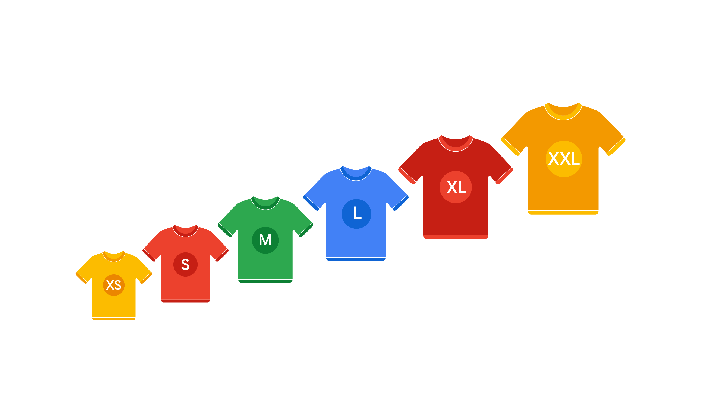
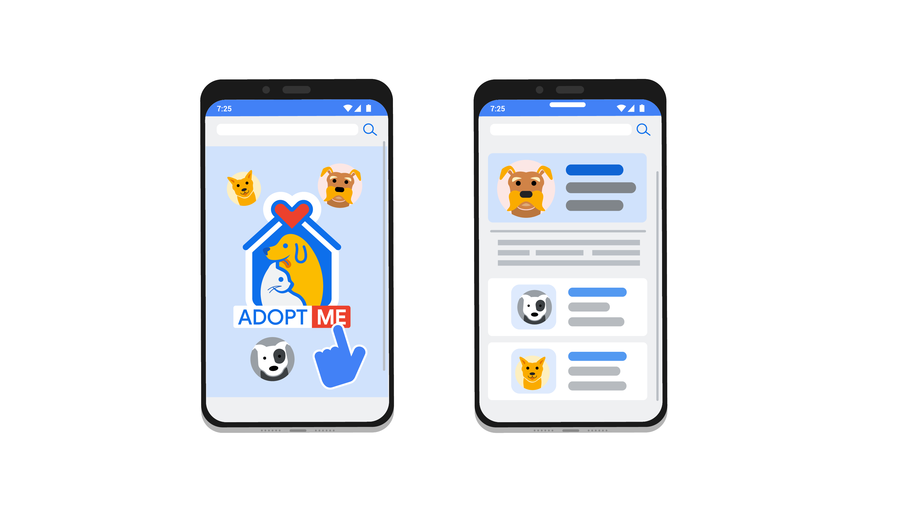

> Implementing Scrum
>
> 实现Scrum

You will learn how to build and manage a Product Backlog and develop user stories and epics.

> 您将学习如何构建和管理产品待办事项列表，并开发用户故事和史诗。

You will also explore how to set up the five important Scrum events and use tools to plan and visualize sprint workflows and progress.

> 您还将探索如何设置五个重要的Scrum事件，并使用工具来计划和可视化sprint工作流和进度。

**学习目标**

- Apply communication tools to help plan and visualize sprint workflow and progress.

	> 运用沟通工具来帮助规划和可视化sprint工作流程和进度。

- Develop and break down user stories and epics.

	> 开发和分解用户故事和史诗。

- Perform Product Backlog refinement-精炼,细化 by relative-相对的 effort estimation, determining acceptance criteria, and prioritization.

	> 通过相对工作量估算、确定验收标准和优先级来细化产品待办事项列表。

- Describe the five important Scrum events and how to set up each event for a Scrum Team.

	> 描述五个重要的Scrum事件，以及如何为Scrum团队设置每个事件。

- Explain how to build and manage a Product Backlog.

	> 解释如何构建和管理产品待办事项列表。

# The Product Backlog

> 产品待办事项列表

## Introduction: Implementing Scrum

> 简介：实施Scrum

Hi there.

In the previous section, we introduced you to Scrum.

We learned about Scrum values and explained the roles that are essential for all Scrum Teams.

> 我们学习了Scrum价值观，并解释了Scrum团队中必不可少的角色。

---

In this video, we'll complete our overview of Scrum and dive deep into the setup and day-to-day execution of a Scrum Team.

> 在本视频中，我们将完成对Scrum的概述，并深入了解Scrum团队的设置和日常执行。

We will go beyond-超出 what is provided in the official Scrum Guide and share the most popular tools, methods, tips, and tricks for working with a Scrum Team.

> 我们将超越官方Scrum指南所提供的内容，并分享与Scrum团队合作的最流行的工具、方法、技巧和技巧。

I'll discuss how to manage your Product Backlog, which contains all of the features, requirements, and activities associated with deliverables to achieve the goal of the project.

> 我将讨论如何管理您的产品待办事项列表，它包含与可交付成果相关的所有特性、需求和活动，以实现项目的目标。

Once we have a Backlog, one of the trickiest-难对付的,棘手的 parts of Scrum is estimation.

> 一旦我们有了Backlog, Scrum 中最棘手的部分之一就是评估。

We'll learn what T-shirt sizes and story points have to do with Scrum as we discuss a technique called relative-相对的,相关联的 effort estimation. 

> 当我们讨论一种称为相对工作量估算的技术时，我们将了解t恤大小和故事点与Scrum的关系。

---

Next, you'll learn about the five important Scrum events.

> 接下来，您将了解五个重要的Scrum事件。

Those are the Sprint, the Sprint Planning, the Daily Scrum, the Sprint Review, and finally, the Sprint Retrospective.

> 它们是Sprint、Sprint计划、每日Scrum、Sprint评审，最后是Sprint回顾。

We'll learn what velocity-速度,速率 means and how your team can use tools like **burndown charts**-燃尽图 to manage their progress.

> 我们将学习速度意味着什么，以及你的团队如何使用燃尽图等工具来管理他们的进度。

I'll show you some other useful tools like Google Docs, JIRA, Asana, Trello, Kanban boards, and more, which will help your workflow stay organized and transparent.

> 我将向您展示其他一些有用的工具，如Google Docs, JIRA, Asana, Trello，看板等，这将有助于您的工作流程保持组织和透明。

So let's get started.

We'll begin by discussing the Product Backlog, which is a critical artifact for Scrum Teams.

Meet you in the next video.

- Setup and day-to-day execution of a Scrum Team

	> Scrum团队的设置和日常执行

- Popular tools, methods, tips, and tricks for working with aScrum Team

	> Scrum团队合作的最流行的工具、方法、技巧和技巧。

- Product Backlog

	> 产品待办事项

- Estimation

	> 估算

- Relative effort Estimation

	> 相对工作量估算

- Scrum events

	> Scrum事件

	- Sprint
	- Sprint Planning
	- Daily Scrum
	- Sprint Review
	- Sprint Retrospective

## Building a Product Backlog

> 构建产品待办事项列表

In this program, we've introduced you to lots of project management artifacts, such as project plans, statements of work, RACI charts, and more.

> 在本节目中，我们向您介绍了许多项目管理工件，例如项目计划、工作报表、RACI图表等等。

Now, we'll review an important artifact of the Scrum framework, the Product Backlog.

> 现在，我们来回顾一下Scrum框架的一个重要组成部分——产品待办事项列表。

In an earlier video, we defined the Product Backlog as the single authoritative-权威的 source for things that a team works on.

> 在之前的视频中，我们将产品待办事项列表定义为团队工作的唯一权威来源。

It contains all of the features, requirements, and activities associated with deliverables to achieve the goal of the project.

> 它包含与可交付成果相关的所有特性、需求和活动，以实现项目的目标。

The traditional non-Agile project management equivalent-等同的,等效的 would be the set of project requirements.

> 传统的非敏捷项目管理等同于项目需求集。

---

There are three key features of a Product Backlog.

> 产品待办列表有三个关键特征。

First, the Product Backlog is a living artifact, meaning that items are added to the Backlog at any time.

> 首先，产品待办事项列表是一个活的工件，这意味着项目可以随时添加到待办事项列表中。

The Product Backlog evolves throughout the whole life cycle of the project and serves as a central guide for the team to know what to work on next.

> 产品待办事项列表在项目的整个生命周期中不断发展，并作为团队了解下一步工作的中心指南。

Second, the Product Backlog is owned and adjusted by the product owner.

> 其次，产品待办事项列表由产品负责人拥有和调整。

And finally, the Product Backlog is always a prioritized list of features.

> 最后，产品待办列表总是一个按优先级排序的功能列表。

So when there's new information or new features, those are added to the Backlog in order of importance.

> 因此，当出现新信息或新特性时，它们会按照重要性的顺序添加到Backlog中。

The items at the very top of the list are very specific and well-defined, leaving the more vague-不明确的,不清楚的 items for the bottom of the list. 

> 列表顶部的项目非常具体且定义良好，将更模糊的项目留在列表底部。

Remember, the Product Backlog is the guide and roadmap of your product.

> 记住，产品待办事项列表是产品的指南和路线图。

It's the central artifact in Scrum, where all possible ideas, deliverables, features, or tasks are captured for the team to work on. 

> 它是Scrum中的核心工件，所有可能的想法、可交付成果、特性或任务都被捕获，供团队进行工作。

---

Because the backlog is so central, there are a few best practices and pieces of data to capture when working with Product Backlogs.

> 因为待办事项安排是如此重要，所以在处理产品待办事项安排时需要获取一些最佳实践和数据。

There's the description, the value, the order, and the estimate.

> 有描述、价值、顺序和估计。

Let's go through how to build a sample Backlog with these best practices in mind.

> 让我们了解一下如何使用这些最佳实践来构建样例Backlog。

First, there's the item description.

> 首先是项描述。

The item description is exactly what it sounds like, it describes an item.

> 商品描述就像它听起来的那样，它描述了一件项目。

When you're writing an item description, it's a good idea to be really clear when adding Product Backlog items so the details are encouraged.

> 当你在写一个项目描述时，最好在添加产品待办事项列表项目时非常清楚，这样可以鼓励详细信息。

For instance, on Office Green's new project, Virtual Verde, here's an example of an item description: as a Virtual Verde client, I plan to grow my choice of vegetables-蔬菜 while I work from home in my New York City apartment-公寓.

> 例如，在Office Green的新项目Virtual Verde中，这里有一个项目描述的例子:作为Virtual Verde的客户，我计划在纽约的公寓里在家工作时种植我选择的蔬菜。

This item description includes essential details, such as an action and a location from the perspective of the customer.

> 该项目描述包括基本细节，例如从客户的角度来看的操作和位置。

This ensures that the Development Team has enough information to meet the users' needs.

> 这确保了开发团队有足够的信息来满足用户的需求。

---

Next up, we have the value field.

> 接下来，我们有值字段。

This is the field that tells us how much business value the item delivers to the customers, to the team, or to the users.

> 这个字段告诉我们项目向客户、团队或用户交付了多少业务价值。

How to indicate value is a choice the Scrum Team should make together.

> 如何显示价值是Scrum团队应该共同做出的选择。

I like to set value by using dollar signs, ranging from one dollar sign for low value, **all the way up to**-一直到 four dollar signs for high, added business value.

> 我喜欢用美元符号来设定价值，从1美元符号表示低价值，一直到4美元符号表示高的、附加的商业价值。

---

Next, we have to add in an estimate.

> 接下来，我们必须加上一个估计。

An estimate is how much effort the Scrum Team thinks an item will take to complete.

> 估算是指Scrum团队认为完成一个项目需要付出多少努力。

We'll explore how to do relative effort estimation coming up.

> 我们将探讨如何进行相对的工作量评估。

But for now, it's important to know that the relative effort estimate is captured in each Backlog item.

> 但是现在，重要的是要知道相对的工作量估计是在每个Backlog项中捕获的。

This field in the Backlog is owned by the Development Team.

> 待办事项列表中的这个字段由开发团队拥有。

---

The next attribute of each Backlog item is the order.

> 每个Backlog项的下一个属性是顺序。

As we mentioned, the Backlog should always be prioritized.

> 正如我们所提到的，待办事项列表应该始终是优先级的。

Both the estimate and value fields we just discussed help the Product Owner figure out where to place an item in the Backlog's order of hierarchy.

> 我们刚刚讨论的估计和值字段都可以帮助产品负责人确定在待办事项列表的层次顺序中放置项目的位置。

A Product Owner may ask themselves-他们自己, how important is this Backlog item compared to all the other items?

> 产品负责人可能会问自己，与所有其他待办事项相比，这个待办事项有多重要?

Product Backlogs order items from highest to lowest priority.

> 产品待办事项按优先级从高到低排序。

This is called a stacked-堆叠 rank.

> 这就是所谓的叠排。

Ordering items this way allows teams to operate more efficiently.

> 以这种方式订购物品可以让团队更有效地运作。

For example, our Virtual Verde market research team learned that people who work from home would much rather have plants that are easy to take care of, versus a more high-maintenance plant like orchids-兰花.

> 例如，我们的Virtual Verde市场研究团队了解到，在家工作的人更愿意拥有易于照顾的植物，而不是像兰花这样需要更多维护的植物。

Then, the team prioritizes the simple and easy plants on the Backlog, like succulents-多肉植物, higher than the orchids.

> 然后，团队优先考虑待办事项中简单和容易的植物，比如多肉植物，而不是兰花。

So their Product Backlog lists one: succulents, two: orchids.

> 因此，他们的产品待办列表中列出了一种:多肉植物，二种:兰花。

But say, for example, Support gets an email from a user who says they'd love to have bonsai-盆景 trees, which are also hard to take care of.

> 但是，比如说，支持部门收到一封用户的电子邮件，用户说他们想要盆景树，盆景树也很难打理。

Where do we put it in the order, before orchids or after?

> 我们应该把它放在哪个顺序，在兰花之前还是之后?

The Product Owner does some research and decides that the team will do orchids first because they find that many more users have requested orchids versus bonsai trees.

> 产品负责人做了一些研究，并决定团队首先做兰花，因为他们发现更多的用户要求兰花而不是盆景树。

The Product Owner gives orchids a two dollar sign value rating, bonsai trees a one dollar sign value rating, and puts bonsai trees last on their list.

> 产品负责人给兰花一个2美元的价值评级，盆景树一个1美元的价值评级，并把盆景树放在他们的列表的最后。

---

Awesome-让人惊叹的,令人敬畏的, let's move on.

> 太棒了，我们继续。

When creating Backlog items, the goal is to include as much as you can while not stressing about the unknowns too much.

> 在创建待办事项项时，目标是尽可能多地包含内容，同时不要过多地强调未知的内容。

For example, the Product Owner in Virtual Verde doesn't know yet how much bonsai trees cost compared to succulents-多肉植物, so they don't know if they serve a high-end market or a low-end market.

> 例如，Virtual Verde的产品负责人还不知道盆景树与多肉植物相比的成本是多少，所以他们不知道盆景树是面向高端市场还是低端市场。

They document an assumption in the bonsai tree description and **move on**-继续前进.

> 他们在盆景树描述中记录了一个假设，然后继续前进。

They can study that in more detail when it is higher on the priority list.

> 他们可以在优先级更高的时候进行更详细的研究。

---

Now you know a bit more about defining the Product Backlog and who owns it.

> 现在您对定义产品待办事项列表以及谁拥有它有了更多的了解。

We also discussed how the various roles work with the Product Backlog, and we can identify and describe each field in a Product Backlog.

> 我们还讨论了各种角色如何与产品待办事项列表一起工作，我们可以识别和描述产品待办事项列表中的每个字段。

In the next video, we'll learn how to manage the Backlog which changes throughout the Scrum practices.

> 在下一个视频中，我们将学习如何管理在Scrum实践中不断变化的Backlog。

Meet you there.

**Product Backlog**

The single authoritative source for things that a team works on.It contains all of the features, requirements, and activities associated with deliverables to achieve the goal of the project.

> 团队工作的唯一权威来源。它包含与可交付成果相关的所有特性、需求和活动，以实现项目的目标。

- Living artifact 
- Owned and adjusted by the Product Owner
- Prioritized list of features

The Product Backlog is the guide and roadmap of your product.

> 记住，产品待办事项列表是产品的指南和路线图。

Product backlog  best practices：

- The description
- The value
- The order
- The estimate

## Product Backlog: The Scrum Guide overview

> 产品待办事项列表:Scrum指南概述

**Product Backlog and Product Goal**

> 产品待办事项列表和产品目标

In this lesson, you are learning about an important Scrum artifact: the **Product Backlog**.

> 在本课中，您将学习一个重要的Scrum工件:产品待办事项列表。

To recap, the Product Backlog is an ordered list of what needs to be done to improve a product.

> 概括地说，产品待办事项列表是一个有序的列表，列出了改进产品需要做的事情。

It is the single authoritative source for items the Scrum Team works on.

> 它是Scrum团队工作项目的唯一权威来源。

During Product Backlog refinement-细化,精炼, items are broken down and further defined by adding details.

> 在Product Backlog细化过程中，条目被分解，并通过添加细节进一步定义。

These details can vary, but often include such attributes as description, value, order, estimate, and size. 

> 这些细节可以变化，但通常包括描述、价值、顺序、估计和大小等属性。

The **Product Goal** is the long-term objective for the Scrum Team, and it is included in the Product Backlog.

> 产品目标是Scrum团队的长期目标，它包含在产品待办事项列表中。

The rest of the Product Backlog defines what tasks will fulfill the Product Goal.

> 产品待办事项列表的其余部分定义了哪些任务将实现产品目标。

To learn more about the Product Backlog and Product Goal, please read this overview from the [2020 Scrum Guide](https://www.scrumguides.org/scrum-guide.html#product-backlog).

## Writing user stories

> 编写用户故事

In the last video, you learned about a Product Backlog.

We discussed that in order to properly build the Backlog, the project manager must consider factors like descriptions, value, order, and estimations.

> 我们讨论过，为了正确地构建Backlog，项目经理必须考虑诸如描述、价值、顺序和评估等因素。

This ensures that you, as the project manager, will include enough information to meet the Product Owner's vision for user value. 

> 这可以确保你，作为项目经理，将包含足够的信息来满足产品负责人对用户价值的愿景。

Now that you know about the various fields associated with each item in your Backlog, let's discuss a popular way to capture and manage those Backlog items, user stories.

> 现在您已经了解了与Backlog中的每个项目相关联的各种字段，让我们讨论一种捕获和管理这些Backlog项目的流行方法，即用户故事。

---

User stories are short, simple descriptions of a feature told from the perspective of the user.

> 用户故事是从用户的角度对功能进行简短的描述。

This helps the team create a solution that's always centered around the user and the user experience.

> 这有助于团队创建始终以用户和用户体验为中心的解决方案。

User stories might start off large and broad or may be broken down to be as small or as specific as possible.

> 用户故事可能从大而广泛的部分开始，也可能被分解成尽可能小或尽可能具体的部分。

In this lesson, we're going to give you some ideas on how to write user stories and how to break them down.

> 在这一课中，我们将给你一些关于如何编写用户故事以及如何分解它们的想法。

---

User stories are made up of three different elements: the user, the action they will take, and the benefit to them.

> 用户故事由三个不同的元素组成:用户，他们将要采取的行动，以及给他们带来的好处。

These elements might have a few different formats, but the most common is "As a user role, I want this action so that I can get this value."

> 这些元素可能有几种不同的格式，但最常见的格式是“作为一个用户角色，我想要这个操作，这样我才能获得这个值。”

When writing effective user stories, the team must have a user in mind.

> 在编写有效的用户故事时，团队必须考虑到用户。

Imagine that the user will interact with the product in order to achieve a specific outcome.

> 想象一下，用户将与产品进行交互，以实现特定的结果。

What I really like to do at this stage is create personas-人物,角色 or detailed descriptions of my different users.

> 在这个阶段，我真正喜欢做的是创建不同用户的角色或详细描述。

Sometimes I even give them names.

> 有时我甚至给它们起名字。

In Virtual Verde, we could give our users some names and some information about them.

> 在Virtual Verde中，我们可以为用户提供一些名称和有关他们的一些信息。

Here are some user persona ideas.

> 以下是一些用户角色的想法。

Leo is my plant vendor, who manages acquiring the plants, the supply-供应,补给 chain, and delivery logistics.

> 利奥是我的植物供应商，负责植物供应商、供应链和配送物流。

Felicity is my gardening-园艺 expert, who helps my support team give our customers really excellent advice-忠告,劝告,建议 on how to take care of their plants.

> 费利西蒂是我的园艺专家，她帮助我的支持团队在如何照顾他们的植物方面给我们的客户提供了非常好的建议。

Zach is my amateur-业余爱好者 vegetable-蔬菜 gardener, who wants to use the plants they purchase to make dinner.

> 扎克是我的业余蔬菜园丁，他想用他们买的植物做晚餐。

Nia is my management consultant, who works from home and wants to set up a professional backdrop-背景 for video conferences in their home office.

> 妮娅是我的管理顾问，她在家工作，想在家里的办公室里设置一个专业的视频会议背景。

Reena is my flower aficionado-狂热爱好者, who wants to have a different flower arrangement-布置 each week to brighten-使明亮,使鲜艳 up their home.

> Reena是我的花迷，她希望每周都有不同的插花来照亮他们的家。

By giving these users a name and a backstory, we can imagine them in our minds-头脑,心思 and we will design better products for them as a result.

> 通过给这些用户一个名字和背景故事，我们可以在脑海中想象他们，从而为他们设计更好的产品。

I really enjoyed writing user stories because it puts me in the shoes of my users.

> 我真的很喜欢写用户故事，因为它让我站在用户的角度考虑问题。

---

Each user story should meet six different criteria, represented by the acronym I.N.V.E.S.T., or invest.

> 每个用户故事都应该满足六个不同的标准，用首字母缩略词I.N.V.E.S.T表示，即投资。

I, for independent-独立的,自治的: the story should be able to be started and finished by itself.

> I，代表独立:故事应该能够自己开始和结束。

It's not dependent on another story to finish it.

> 它不依赖于另一个故事来完成它。

The N stands for negotiable: there's room for negotiation and discussion about this item.

> N代表可协商的(negotiating)：这件事还有协商和讨论的余地。

The V is for valuable: this means that completing the user story has to deliver value.

> V代表有价值:这意味着完成用户故事必须传递价值。

E is for estimable: our Definition of Done must be clear so that the team can give each user story an estimate.

> E是可估计的:我们的完成定义必须是清晰的，这样团队才能给每个用户故事一个估计。

The S is for small: each user story needs to be able to fit within a planned Sprint.

> S代表小:每个用户故事都需要能够适应计划好的Sprint。

If that user story is too big, it should be broken down into smaller stories.

> 如果用户故事太大，就应该把它分解成更小的故事。

Stories that are a low priority on the Backlog can stay big until they become a priority for an upcoming Sprint.

> 在待办事项列表中优先级较低的故事可以保持较大的优先级，直到它们成为即将到来的Sprint的优先级。

Finally, the T is testable: a test can be written to check and make sure that it meets the acceptance criteria.

> 最后，T是可测试的:可以编写测试来检查并确保它符合验收标准。

While the Product Owner is the main person responsible for writing user stories, the team has a responsibility to give feedback on whether the user story is clear and fits the invest criteria before they invest any time into it.

> 虽然产品负责人是负责编写用户故事的主要人员，但团队有责任在投入任何时间之前就用户故事是否清晰并符合投资标准提供反馈。

---

In addition to user stories, you need to know the term epic, which simply represents a group or collection of user stories.

> 除了用户故事之外，您还需要知道术语“史诗”，它只是表示一组或一组用户故事。

Some epics for Virtual Verde might be live plant delivery, office plant advice service, vendor management, or client data management.

> Virtual Verde的一些典型应用可能是现场工厂交付、办公室工厂建议服务、供应商管理或客户数据管理。

Let's come up with a sample user story for our Virtual Verde clients in the live plant delivery epic.

> 让我们在现场植物交付史诗中为Virtual Verde客户端提供一个示例用户故事。

As a Virtual Verde client, I would like to acquire a bonsai-盆景 tree so that I can have a beautiful plant and I can meditate-冥想 as I trim the branches.

> 作为一个虚拟的Verde客户端，我想获得一棵盆景树，这样我就可以有一个美丽的植物，我可以冥想，因为我修剪树枝。

I thought of this one because I bought a bonsai tree for my 12-year-old nephew-侄子,外甥 last year.

> 我想到这个是因为去年我给我12岁的侄子买了一棵盆景树。

He did some research and learned that in Japan, pruning-修剪 bonsai trees is a meditative practice.

> 他做了一些研究，了解到在日本，修剪盆景树是一种冥想练习。

He's learning how to do that.

> 他正在学习怎么做。

With that sample user story, the Product Owner creates something called the acceptance criteria, which is essentially the checklist you will use to decide whether the user story is done.

> 有了这个样例用户描述，产品负责人创建了一个叫做验收标准的东西，它本质上是一个检查表，您将使用它来决定用户描述是否完成。

To have a completed user story, you must meet the acceptance criteria checklist.

> 要获得一个完整的用户描述，您必须满足验收标准检查表。

Here's an example of acceptance criteria for the bonsai tree user story.

> 下面是盆景树用户故事的验收标准示例。

Users can: Browse for three different types of bonsai trees to purchase.

> 用户可以:浏览三种不同类型的盆景树进行购买。

Compare the three trees to know which is easiest and hardest to grow in their home.

> 比较这三棵树，知道哪棵最容易在他们家里种植，哪棵最难。

Maybe each plant has a beginner, intermediate, and advanced gardener notation-符号 next to it.

> 也许每种植物旁边都有初级、中级和高级园丁符号。

Can purchase specific bonsai tree care packages like fertilizer-肥料,化肥, trimming-修剪,修整 shears-大剪刀, etc.

> 可以购买特定的盆景树护理包，如肥料，修剪剪刀等。

Access-获取,访问 online to a bonsai booklet-小册子 sheet, as well as having a care booklet packaged with the tree.

> 在线获取盆景小册子，以及与树一起包装的护理小册子。

Can find a troubleshooting-故障排查,疑难解答 bonsai tree issues page on Virtual Verde's FAQ page.

> 可以在Virtual Verde的FAQ页面上找到盆景树问题的故障排除页面。

Sounds like an amazing story, doesn't it?

> 听起来很神奇，不是吗?

It feels like a real thing that a user can interact with and get excited about.

> 它感觉就像一个真实的东西，用户可以与之互动，并感到兴奋。

Each user story in the Backlog should be written this way.

> 待办事项列表中的每个用户描述都应该这样写。

It's natural for items higher on the priority list to have more detail and fewer gray areas.

> 在优先级列表中较高的项目自然会有更多的细节和更少的灰色区域。

By leaving these low-priority items vague-不明确的,不清楚的, this saves the team time from working on items that may end up getting deprioritized-降低…优先级别 down the road.

> 通过让这些低优先级的项目变得模糊，这可以节省团队的时间，使他们免于处理那些最终可能被降低优先级的项目。

---

Fantastic.

> 极好的，非常棒的

Now you know how to explain user stories, the criteria for assessing user stories readiness-准备就绪状态 for the team, and you can explain epics and user stories acceptance criteria.

> 现在您知道了如何解释用户故事，以及为团队评估用户故事准备情况的标准，并且您可以解释史诗和用户故事接受标准。

In the next video, we'll discuss Backlog refinement and explain relative effort estimation, T-shirt sizes, and story points.

> 在下一个视频中，我们将讨论Backlog的细化，并解释相关的工作量估计、t恤大小和故事点。

Meet you there.

User stories：

- Short, simple descriptions of a feature told from the perspective of the user.

	> 从用户的角度对功能进行简短的描述。

User stories are made up of three different elements：

> 用户故事由三个不同的元素组成

- User - 用户
- Action - 行动
- Benefit - 好处

most common format："As a user role, I want this action so that I can get this value."

Each user story should meet six different criteria：

> 每个用户故事都应该满足六个不同的标准

- Independent
- Negotiating
- Valuable
- Estimable
- Small
- Testable

Epic：A group or collection of user stories.

> Epic：一组用户故事。

Acceptance criteria：The checklist you will use to decide whether the user story is done.

> 验收标准：检查表，您将使用它来决定用户描述是否完成。

## The elements of user stories and epics

> 用户故事和史诗的元素

In the previous video, we introduced user stories and epics.

**User stories** are short, simple descriptions of a deliverable told from the perspective of the user.

> **用户故事**是从用户的角度对可交付成果进行的简短描述。

Creating user stories helps the team develop a solution that is always centered around the user’s needs and overall experience. 

> 创建用户故事可以帮助团队开发始终以用户需求和整体体验为中心的解决方案。

You also learned that **epics** are a collection of user stories.

> 您还了解到，史诗是用户故事的集合。

Think of the concept of user stories **in terms of**-从…角度来看 books or films-电影,影片.

> 从书籍或电影的角度来考虑用户故事的概念。

A story is one single narrative-记叙文,叙述, while an epic is a set of several related, independent stories.

> 故事是一个单一的叙述，而史诗是几个相互关联的独立故事的集合。

Each story tells a specific chronicle-记事,叙述, while an epic gives a high-level view of the overall arc-弧线. 

> 每个故事都讲述了一个特定的编年史，而史诗则给出了一个整体弧线的高级视图。

**User stories**

The driving factor behind every Scrum project is putting the customer first.

> 每个Scrum项目背后的驱动因素都是把客户放在第一位。

User stories are a key component of ensuring that customers are satisfied with the product.

> 用户故事是确保客户对产品满意的关键组成部分。

A team writes a user story from the perspective of the user.

> 团队从用户的角度编写用户故事。

Not only do user stories provide insight into what goals the user wants to achieve, but they enable collaboration, inspire-激励,鼓舞 creative solutions, and create momentum-冲力,推力 by giving the team a small win when the stories are developed. 

> 用户故事不仅提供了对用户想要实现的目标的洞察，而且还促进了协作，激发了创造性的解决方案，并在开发用户故事时给团队带来了小小的胜利，从而创造了动力。

When writing user stories, you will need to include the following elements: 

> 在编写用户故事时，您需要包含以下元素:

- **User persona-人物,角色.** What is your user like? What is their relation to the project? What goals do they have? 

	> 用户角色：你的用户是什么样的？他们和这个项目有什么关系？他们有什么目标？

- **Definition of Done.** This refers to an agreed upon set of items that must be completed before a user story can be considered complete. 

	> 完成定义：这是指在用户描述被认为是完整之前必须完成的一组商定的项目。

- **Tasks.** What are the key activities needed to complete the user story?

	> 任务：完成用户故事所需的关键活动是什么?

- **Any feedback already provided.** If you are adding features to an existing product and you have already received feedback from customers on a past iteration, make sure to consider this feedback. 

	> 任何反馈已经提供：如果您正在向现有产品添加功能，并且您已经从过去的迭代中收到了客户的反馈，请确保考虑这些反馈。

**I.N.V.E.S.T.** 

Recall from the video that your user stories should meet the **I.N.V.E.S.T.** criteria: 

> 回顾视频，你的用户故事应该符合 I.N.V.E.S.T 标准：

- **Independent:** The story’s completion is not dependent on another story.

	> **独立：**故事的完成不依赖于其他故事。

- **Negotiable-可协商的，可讨论的:** There is room for discussion about this item.

	> 可协商的：这个项目还有讨论的余地。

- **Valuable:** Completing the user story has to deliver value. 

	> 有价值：完成用户故事必须传递价值。

- **Estimable:** The Definition of Done must be clear so that the team can give each user story an estimate. 

	> 可评估的：完成的定义必须是清晰的，这样团队才能给每个用户故事一个评估。

- **Small:** Each user story needs to be able to fit within a planned Sprint.

	> 小：每个用户故事都需要能够适应一个计划好的Sprint。

- **Testable**: A test can be conducted to check that it meets the criteria.

	> 可测试：可以进行测试以检查它是否符合标准。

Let’s imagine you are working on a project for a local library-图书馆,软件库,文库.

> 让我们假设您正在为当地图书馆做一个项目。

The library hopes to launch a website so that customers can read reviews-评论 before they check out books from the branch.

> 该图书馆希望建立一个网站，以便顾客在从分馆借书之前可以阅读书评。

The typical template for a user story looks like this：

> 用户故事的典型模板是这样的：

​	**As a** ***<user role>*****, I want this** ***<action>*** **so that I can get this** ***<value>.*** 

Therefore, an example user story for this situation might read：

> 因此，这种情况的示例用户故事可能如下：

​	***As an avid-热心的,渴望的,渴求的 reader, I want to be able to read reviews before I check out a book from my local branch so that I know I am getting a book I am interested in.***

> 作为一个狂热的读者，我希望在我从当地的分店借出一本书之前能看到书评，这样我就知道我买到了一本我感兴趣的书。

**Epics**

An epic’s purpose-目的,意图 is to help manage related user stories.

> 史诗的目的是帮助管理相关的用户故事。

In this [post](https://www.mountaingoatsoftware.com/blog/stories-epics-and-themes), Mike Cohn, the inventor of the term “epic” as it relates to Scrum, describes epic as a “very large user story”—one that could not be delivered within a single iteration and may need to be split into smaller stories.

> 在这篇文章(https://www.mountaingoatsoftware.com/blog/stories-epics-and-themes)中，Mike Cohn，这个与Scrum相关的术语“史诗”的发明者，将史诗描述为一个“非常大的用户故事”——一个不能在一次迭代中交付的故事，可能需要分成更小的故事。

The team should discuss together and reach a shared view of how to write and capture their user stories and epics.

> 团队应该一起讨论，并就如何编写和捕获他们的用户故事和史诗达成共识。

Keep in mind, epics are just larger user stories that are there to help organize the project. 

> 请记住，史诗只是用于帮助组织项目的更大的用户故事。

---

Let’s imagine you are creating user stories and epics based on the previous example.

> 假设您正在基于前面的示例创建用户故事和史诗。

User stories may include customers wanting to read reviews of books on the website or wanting to add books to their cart.

> 用户故事可能包括想要阅读网站上的图书评论或想要将图书添加到购物车中的客户。

These user stories could fall into the “website creation” epic. 

> 这些用户故事可以归入“网站创建”的史诗。

Another user story could be that customers want to walk into the library and easily find the non-fiction-非小说 section.

> 另一个用户故事可能是，客户希望走进图书馆，轻松找到非小说类图书。

This would fall under the “organization of the physical space” epic.

> 这将属于“物理空间的组织”史诗。

So rather than those various user stories appearing in a list together, they are organized into sections, or epics.

> 因此，这些不同的用户故事不是一起出现在一个列表中，而是被组织成章节或史诗。

It’s important to note that while the Product Owner can write user stories and epics, a Developer can also write them **as long as**-只要,在...的时候 the Product Owner remains-剩余,遗留,保持不变 accountable for the Product Backlog item.

> 需要注意的是，虽然产品负责人可以编写用户故事和史诗，但只要产品负责人对产品待办事项项负责，开发人员也可以编写它们。

**Key takeaway**

Epics allow you to keep track of large, **loosely-defined**-定义模糊的 ideas, while user stories are a much smaller unit of work, inspired directly from the end user or customer.

> 史诗允许您跟踪大的、松散定义的想法，而用户故事是一个更小的工作单元，直接来自最终用户或客户。

Both user stories and epics help teams ensure they are delivering value to the customer.

> 用户故事和史诗都可以帮助团队确保他们正在向客户交付价值。

## Activity Exemplar: Create a Product Backlog

**Assessment of Exemplar**

> 范例评估

Compare the exemplar to your completed approach plan. Review your work using each of the criteria in the exemplar. What did you do well? Where can you improve? Use your answers to these questions to guide you as you continue to progress through the course. 

***Note:*** *Your user stories, titles, and acceptance criteria will differ in some ways from the ones below. That’s okay--the most important thing is that your user stories are concise, actionable, and deliver value to the user role.*

Let’s examine the exemplar:

1. **Low-maintenance options:** The user story follows the correct structure and meets the I.N.V.E.S.T. criteria: “*As a potential customer, I want to find out which plants are easiest to care for so that I can purchase low-maintenance options.”* The acceptance criteria enable customers to sort plants by difficulty on the website and find out which plants have similar care needs.
2. **Plant care tips:** The user story follows the correct structure and meets the I.N.V.E.S.T. criteria: *“As a plant owner, I want to access care instructions easily so that I can keep my plant alive longer.”* The acceptance criteria enable customers to consult a plant care leaflet and sign up for monthly emails with seasonal tips.
3. **Plant care tools:** The user story follows the correct structure and meets the I.N.V.E.S.T. criteria: *“As a plant owner, I want to have the right tools to care for my plant so that I can keep it healthy and beautiful.”* The acceptance criteria enable customers to purchase plant care starter kits or buy tools individually.
4. **Watering reminders:** The user story follows the correct structure and meets the I.N.V.E.S.T. criteria: “*As a plant owner, I want to remember when to water my plants so that I don't under- or overwater them.”* The acceptance criteria enable customers to sign up to receive watering reminders and purchase reminder stickers for their calendars.
5. **Expert help and advice:** The user story follows the correct structure and meets the I.N.V.E.S.T. criteria: *“As a plant owner, I want to get expert help and advice quickly so that I know what to do if my plant gets sick.”* The acceptance criteria enable customers to access live chat support and call phone support during extended hours.
6. **Return policy:** The user story follows the correct structure and meets the I.N.V.E.S.T. criteria: *“As a customer, I want a hassle-free way to return my order so that I can be sure I have the right plant for me.”* The acceptance criteria enable customers to easily find credit and return information on the website and ship their returns with a pre-printed label.

Finally, because the stories all relate to helping customers care for their plants, they all belong to an epic titled “Plant Care Initiatives.”

**Apply what you’ve learned using Asana:**

In addition to spreadsheets, many Scrum teams use more advanced project management tools and software to manage Scrum events and related processes. These tools can help you and your team stay organized, save time, and streamline tasks. Continue to [the next course item](https://www.coursera.org/learn/agile-project-management/lecture/ouv1h/create-a-product-backlog-in-asana) to learn how to complete this activity using [Asana](https://asana.com/create-account?utm_campaign=growgoogle&utm_medium=growgoogle&utm_source=growgoogle), a work management tool that helps teams organize their work all in one place. Then, in [an upcoming activity](https://www.coursera.org/learn/agile-project-management/item/lVGQh), you’ll be able to apply what you’ve learned in Asana yourself.

Many organizations adopt similar work management tools, so familiarizing yourself with the various options will help set you up for success. Ready to get started? Head to the next course [item](https://www.coursera.org/learn/agile-project-management/lecture/ouv1h/create-a-product-backlog-in-asana) to begin.

## Create a product backlog in Asana

> 在Asana中创建产品待办事项列表

Hi there.

My name's Carla and I'm on the customer education team at Asana.

> 我叫卡拉，是Asana客户教育团队的一员。

In this course, I'm excited to show you some ways you can streamline your team's work and maximize your productivity using Asana for work management.

> 在这个过程中，我很高兴向你展示一些方法，你可以简化你的团队的工作，并最大限度地提高你的生产力使用Asana的工作管理。

Workers across industries lose countless-无数的,数不尽的 hours to work about work: the time wasted on searching for information, switching between apps and holding-召开,举行 status meetings.

> 各行各业的员工在工作上浪费了无数的时间：搜索信息、在应用程序之间切换和召开状态会议浪费了时间。

Work management tools like Asana are designed to reduce wasted time by empowering project managers to focus on project planning, team alignment, and resource allocation.

> 像Asana这样的工作管理工具旨在通过授权项目经理专注于项目规划、团队协调和资源分配来减少浪费的时间。

Many organizations use these types of tools to manage everything from simple projects with small teams, to complex projects with multiple stakeholders.

> 许多组织使用这些类型的工具来管理从小型团队的简单项目到多个涉众的复杂项目的一切。

The thing I love most about Asana is it gives me complete peace-平静,太平 of mind-内心 that nothing is going to fall through the cracks-裂缝,缝隙.

> 我最喜欢Asana的一点是，它给了我完全的内心平静，没有什么会从裂缝中掉下来。

I can keep track of all my own to-dos in one place and my teammates and I are always clear about who's responsible for what, and when it needs to get done.

> 我可以在一个地方记录我所有的待办事项，我和我的队友总是很清楚谁负责什么，什么时候需要完成。

I'll be popping in throughout-遍及,到处 this course to demo common project management activities using Asana.

> 我将在整个课程中使用Asana演示常见的项目管理活动。

In this video, I'll demonstrate how to build the same Product Backlog for Virtual Verde that you just created.

> 在本视频中，我将演示如何为您刚刚创建的Virtual Verde构建相同的产品待办事项列表。

This time, you'll use projects, tasks, sub tasks, and custom-自定义,风俗,习惯 fields in Asana.

> 这一次，您将在Asana中使用项目、任务、子任务和自定义字段。

I'll show you an example of each step, so you know exactly how it's done.

> 我将向您展示每个步骤的示例，以便您确切地了解如何完成。

And in the activity that follows, we'll provide you with a detailed overview and instructions-指令,说明 for each step, so you can try it out in Asana yourself.

> 在接下来的活动中，我们将为您提供每个步骤的详细概述和说明，以便您可以自己在Asana中尝试。

---

Ready? Let's get started.

First things first, I'll log into my Asana account.

> 首先，我要登录我的Asana账户。

Next, I'll create a project for my Product Backlog using the sprint planning template in Asana.

> 接下来，我将使用 Asana 中的 sprint 计划模板为我的产品待办事项列表创建一个项目。

Asana has lots of helpful templates for all kinds of projects, so you can explore some other options-选择,选项 on your own.

> Asana为各种项目提供了很多有用的模板，所以你可以自己探索一些其他的选择。

Next, I'll fill in the project details.

> 接下来，我将填写项目细节。

---

In this case, I'm going to update the name to Virtual Verde and create the project.

> 在本例中，我将把名称更新为Virtual Verde并创建项目。

I don't need to update anything else for this activity, but if you'd like to, you can select options for your team.

> 我不需要为这个活动更新任何东西，但如果你愿意，你可以为你的团队选择选项。

Once you've created the project, you'll be directed-管理,指导 to the board view, where you can start adding project details.

> 一旦您创建了项目，您将被引导到董事会视图，在那里您可以开始添加项目详细信息。

Board view can help you track your team Sprint plans similar to using a Kanban board.

> 板视图可以帮助您跟踪团队Sprint计划，类似于使用看板板。

Most teams make projects at the beginning of each Sprint and then track their work through each stage, to make sure they know where their Sprint work stands-位于（某处或某位置）.

> 大多数团队在每个Sprint开始时制定项目，然后在每个阶段跟踪他们的工作，以确保他们知道Sprint工作的位置。

In this template, those stages are represented by sections which appear as column headers in the board view.

> 在此模板中，这些阶段由在板视图中显示为列标题的部分表示。

You'll notice that many of the Asana templates, like this Sprint planning one have tasks already added.

> 你会注意到许多Asana模板，比如这个Sprint计划模板已经添加了任务。

For the purposes of this demo I'll remove these but you can review on your own if you want to learn more about how to use this template.

> 出于演示的目的，我将删除这些，但如果您想了解更多关于如何使用此模板的信息，您可以自己查看。

Now that I've created my Product Backlog project, I'm going to enter user story titles by adding tasks to the Backlog column for the Virtual Verde project.

> 现在我已经创建了我的Product Backlog项目，我将通过向Virtual Verde项目的Backlog列中添加任务来输入用户故事标题。

My first user story title is "low-maintenance options," then "plant care tools" and I'll do one more, "expert help and advice."

> 我的第一个用户故事标题是“低维护选项”，然后是“植物护理工具”，然后是“专家帮助和建议”。

Great, all set.

> 太好了，都准备好了。

Here's my completed list of user story titles.

> 下面是我完整的用户故事标题列表。

---

Next, I'm going to add the user stories.

> 接下来，我将添加用户故事。

To do that, I'll need to open the task detailed pane-子窗口 and update the task description with the story.

> 为此，我需要打开任务详细窗格并用故事更新任务描述。

Remember creating user stories in the last activity?

> 还记得在上一个活动中创建用户故事吗?

I'll add in one of those as an example here under "description."

> 我将在“描述”下面添加其中一个作为示例。

I'll choose this user story: As a potential customer, I want to find out which plants are easiest to care for so that I can purchase low-maintenance options.

> 我将选择这个用户故事：作为一个潜在客户，我想知道哪些植物最容易照顾，这样我就可以购买低维护的选项。

Next, I need to add acceptance criteria for the user story.

> 接下来，我需要为用户描述添加可接受标准。

Since you entered your user story titles as tasks, you'll add your acceptance criteria as sub tasks.

> 既然您将用户故事标题作为任务输入，那么您将把验收标准作为子任务添加。

For the first acceptance criteria, I'll add "ability to sort plants by beginner, intermediate-中级的 and advanced-高级的,高等的."

> 对于第一个验收标准，我将添加“按初级、中级和高级分类植物的能力”。

For the next criteria, "ability to search for plants with similar care needs."

> 下一个标准是“寻找有类似护理需求的植物的能力”。

When I'm done adding sub tasks, I'll close the detailed pane so I can access all the tasks in the Backlog.

> 添加完子任务后，我将关闭详细窗格，这样我就可以访问Backlog中的所有任务。

As a quick tip, I can expand-扩展,扩大 the list of sub tasks and view my acceptance criteria without opening the details pane.

> 作为一个快速提示，我可以展开子任务列表，并在不打开详细信息窗格的情况下查看我的接受标准。

And last but not least for this activity, I'm going to add a custom field for the epic title.

> 最后但同样重要的是，对于这个活动，我将为史诗标题添加一个自定义字段。

Custom fields let you add additional details to the tasks in a project.

> 自定义字段允许您向项目中的任务添加额外的详细信息。

You can think of them like tags or columns in a spreadsheet.

> 你可以把它们想象成电子表格中的标签或列。

For this activity, I'll choose a drop down field and use "epic" as the field title and add "plant care initiatives-措施,倡议" as the first option.

> 对于这个活动，我将选择一个下拉字段，并使用“epic”作为字段标题，并添加“plant care initiatives”作为第一个选项。

I only need one option for this activity, so I'll delete option two.

> 对于这个活动我只需要一个选项，所以我将删除选项2。

And finish creating the field.

> 完成字段的创建。

Since all of these stories are part of the same epic, I can update the epic for all the user stories at once.

> 因为所有这些故事都是同一个故事的一部分，所以我可以一次更新所有用户故事的故事。

Now that I've added all these project details, I can check the completed task card which shows me the user story acceptance criteria and epic all in one place.

> 现在我已经添加了所有这些项目细节，我可以检查已完成的任务卡，它在一个地方显示了用户故事验收标准和史诗。

Once I finished adding in the acceptance criteria for all of my user stories, my Asana board appears like this.

> 一旦我为我所有的用户故事添加了接受标准，我的Asana板就会变成这样。

I have successfully created my Product Backlog for the Virtual Verde project.

> 我已经成功地为Virtual Verde项目创建了产品待办事项列表。

Now it's your turn.

Head to the next course item where you'll find detailed instructions to complete this activity in Asana yourself.

> 转到下一个课程项目，在那里你会找到在Asana中自己完成这个活动的详细说明。

As you continue to progress through the course, you'll have the opportunity to complete more project actions in Asana.

> 随着课程的不断进步，您将有机会在Asana中完成更多的项目操作。

I'll check in with you soon to share how you can use Asana in those cases too.

> 我很快就会和你分享如何在这些情况下使用Asana。

## Backlog refinement-细化,精炼 and effort estimation

> 待办事项的细化和工作量估计

Welcome back, we've been exploring everything there is to know about a Product Backlog.

> 欢迎回来，我们一直在探索关于产品待办事项列表的所有知识。

Although the product owner owns or is in charge of the data in the Backlog, the team must work together to keep the living document up to date.

> 尽管产品所有者拥有或负责待办事项列表中的数据，但团队必须共同努力，使活文档保持最新状态。

In this video, we'll discuss how to do that through a process called Backlog refinement.

> 在这个视频中，我们将讨论如何通过一个称为待办事项细化的过程来做到这一点。

---

Backlog refinement refers to the act of keeping the Backlog described, estimated and prioritized, so that the scrum team can operate effectively.

> 待办事项细化指的是保持待办事项的描述、评估和优先级排序，以便scrum团队能够有效地运作。

After the product owner has added the Backlog items with a description and a value statement-声明,说明, they do Backlog refinement.

> 在产品所有者添加了带有描述和值声明的待办事项项之后，他们进行待办事项细化。

It is when the Product Owner and some or all of the Scrum team review the Backlog to ensure: it contains the appropriate-合适的,相称的 items and that nothing new is needed or nothing needs to be removed, that the items are prioritized by the Product Owner, (this is also called setting the order field) that the items at the top of the Backlog are ready for delivery with clear acceptance criteria, and that the Backlog items include estimates, or an informed assessment about how much work a particular Backlog item will be.

> 这是产品负责人和部分或全部Scrum团队审查待办事项列表以确保：它包含适当的项目，不需要任何新项目，也不需要删除任何项目，这些项目由产品负责人确定优先级，(这也称为设置订单字段)，待办事项列表顶部的项目已准备好交付，并具有明确的接受标准，待办事项列表项目包括估计，或对特定待办事项列表项目将完成多少工作的知情评估。

---

Let's discuss estimates since they're crucial in Backlog refinement.

> 让我们来讨论一下评估，因为它们在Backlog细化中是至关重要的。

We add estimates to Backlog items to inform our planning practices about how much effort it will be to finish each item or user story.

> 我们向Backlog项添加估算，以告知我们的计划实践完成每个项或用户描述需要多少努力。

Through estimation, we can find out how much work we have ahead of us.

> 通过估算，我们可以知道我们还有多少工作要做。

It can be difficult to estimate the amount of time it takes to complete a task.

> 估计完成一项任务所需的时间是很困难的。

**More often than not**-大多数情况下, we human beings tend to underestimate-低估,对…估计不足 the time until completion.

> 通常情况下，我们人类倾向于低估完成任务的时间。

When it comes to big projects, this effect can be multiplied-增加 many times and can be the root cause of projects being late and over budget.

> 当涉及到大项目时，这种影响可能会成倍增加，并且可能是项目延迟和超出预算的根本原因。

So in Scrum, we try to overcome-克服,解决,征服 this problem by practicing relative estimation, instead of absolute estimation.

> 所以在Scrum中，我们试图通过实践相对估算来克服这个问题，而不是绝对估算。

Absolute estimation is also called time and effort estimation in traditional project management.

> 在传统的项目管理中，绝对估算也被称为时间和工作量估算。

Relative estimation means that instead of trying to determine exactly how long a task will take, we compare the effort-工作量 of that task, to the effort for another task, and that becomes the estimate.

> 相对估计意味着，我们不是试图确定一项任务将花费多长时间，而是将该任务的工作量与另一任务的工作量进行比较，这就成为了估计。

That estimation is not done in traditional units of hours, days or weeks, instead we assign each Backlog item of value that is a relative unit or size.

> 这种评估不是在传统的小时、天或周的单位中完成的，相反，我们分配每个待办事项项的价值是一个相对的单位或大小。

---

There are two common relative estimation methods that I find most useful when estimating user stories.

> 我发现有两种常见的相对评估方法在评估用户场景时最有用。

These are T-shirt sizes and story points.

> 这些是t恤的尺寸和故事要点。

Let's start with the simpler of the two: T-shirt sizes.

> 让我们从两者中比较简单的一个开始：t恤的尺寸。

To get started, the team simply picks one item on the Backlog that seems to be about a medium size workload, and simply calls that a "medium" in the estimate field.

> 为了开始，团队简单地在Backlog中选择一个似乎是中等规模工作量的项目，并简单地将其称为估算字段中的“中等”。

After that they take another item on the Backlog and compare it to the medium item they just identified, and answer the question: if that first item was a medium, what size would I give this one?

> 之后，他们拿出待办事项清单上的另一个项目，并将其与他们刚刚确定的中型项目进行比较，然后回答这个问题：如果第一个项目是中型项目，我该给这个项目多大尺寸?

The team will repeat this process on each additional item or user story on the Backlog until they're all addressed and done.

> 团队将在Backlog中的每个附加项目或用户描述上重复这个过程，直到它们全部被处理和完成。

For example, let's take four items from Virtual Verde's Product Backlog.

> 例如，让我们从Virtual Verde的产品待办事项列表中选择四个项目。

Adding bonsai trees to the catalog, creating a mobile app, launching a new logo, and creating the new account page.

> 将盆景树添加到目录中，创建移动应用程序，启动新徽标，并创建新帐户页面。

The team decides that launching a new logo is their medium.

> 团队决定推出一个新标志是他们的中等。

The team, together, compares the other three items to that medium item, which gives them their relative effort estimate.

> 团队一起将其他三个项目与中间项目进行比较，从而给出他们的相对工作量估计。

---

Then, there's my favorite method for estimating user stories, tasks and Backlog items known as story points.

> 然后是我最喜欢的评估用户故事、任务和待办事项的方法，即故事点。

Story points are a bit more advanced than T-shirt sizes, but the concept is similar.

> 故事点比t恤尺寸更高级，但概念是相似的。

The first step is the same: The team picks an item as their anchor-锚,支柱 item and they'll conduct their estimations relative to that item. 

> 第一步是相同的：团队选择一个项目作为他们的锚项目，他们将对该项目进行评估。

Instead of using t shirt sizes, this process uses what are called story points.

> 这个过程使用的不是t恤的尺寸，而是所谓的故事点。

Most teams use a famous-著名的,出名的 mathematical-数学模型 sequence of numbers called the Fibonacci sequence.

> 大多数团队使用著名的数学数列斐波那契数列。

The sequence is 0,1,1,2,3,5,8,13, 21 continues on to infinity-无限,无穷.

> 数列是0,1,1,2,3,5,8,13,21，一直到无穷。

For the **sake of**-为了 story points, we skip zero and the first 1.

> 为了故事点，我们跳过0和第一个1。

These numbers are special in that they start out close to one another, but as the numbers get higher, they spread farther and farther out.

> 这些数字的特殊之处在于，它们开始时彼此很接近，但随着数字越来越大，它们分布得越来越远。

This is helpful because as the estimate gets higher, the uncertainty and risk also gets higher.

> 这是有帮助的，因为随着估算的增加，不确定性和风险也会增加。

This number combines both effort and risk into one number.

> 这个数字将工作量和风险合并为一个数字。

In other words, there's not much use in debating-讨论,辩论 estimation values between 21 and 25 points, but choosing between 21 and 34 is a real conversation-谈话,交谈,对话.

> 换句话说，在21和25分之间争论估计值没有多大用处，但在21和34之间选择是一个真正的对话。

This concept can be tricky at first and practice is the best way to learn it to explain this concept.

> 这个概念一开始可能会很棘手，练习是学习它来解释这个概念的最好方法。

In the classes that I teach at google, we use this example, let's say you want to measure-衡量 the effort to completely consume different kinds of fruit.

> 在我在谷歌教的课上，我们用了这个例子，假设你想要衡量完全消耗不同种类水果的努力。

You have in front of you: an orange, a strawberry-草莓, a banana, a mango, a pineapple-菠萝 and a cherry.

> 你面前有：一个橙子、一个草莓、一个香蕉、一个芒果、一个菠萝和一个樱桃。

What are the factors that go into that estimate?

> 估算的因素有哪些?

Are there seeds-种子 to deal with, do I need to eat it with a napkin-餐巾纸?

> 有种子需要处理吗，我需要用餐巾吃吗?

Can I eat in one bite?

> 我能一口吃完吗?

Do I have to peel-剥掉,除去,剥去 it or do I need any tools to prepare it?

> 我需要削皮吗?或者我需要什么工具来准备吗?

Okay, let's try it, if I choose a mango as our starting fruit at five points, how might you estimate the rest?

> 好的，我们来试一下，如果我在五个点上选择一个芒果作为开始的水果，你怎么估计剩下的?

I would rate-评价,评定 them this way: Orange is three, because the peel is easier than cutting a mango.

> 我会这样给它们打分：橙子三分，因为削皮比切芒果容易。

Strawberry: one, because I don't mind eating stems-茎,干; low effort.

> 草莓：一个，因为我不介意吃茎;较低的工作。

Banana: three, because I have to peel it similar to oranges.

> 香蕉:三个，因为我要像剥橘子一样去皮。

Pineapple 13, because it's giant-巨大的, I can't eat it in one sitting.

> 菠萝，因为它太大了，我一次吃不完。

Cherry: two. stems, seeds-种子, you know what I mean.

> 樱桃:两个。茎，种子，你知道我的意思。

It's really fun to learn how differently people have learned how to cut up a pineapple.

> 了解人们如何用不同的方法切菠萝真的很有趣。

But more importantly, what estimation exercises do for a team is uncover-揭露,发现 great ideas on how to get something done, as well as surfacing-表面 where the riskiest-危险的 parts of the project are.

> 但更重要的是，评估练习为团队所做的是揭示关于如何完成某些事情的伟大想法，以及揭示项目中最危险的部分。

Why do I like story points better than t shirt sizes?

> 为什么我更喜欢故事点而不是t恤尺寸?

Let's apply them to our Virtual Verde Backlog.

> 让我们将它们应用到 Virtual Verde 待办事项列表。

Now we can see that adding a new user and adding bonsai-盆景 trees to our catalogue aren't quite the same Size, which the T-shirt sizes might have implied-暗示,暗指,意味着.

> 现在我们可以看到，添加一个新用户和添加盆景树到我们的目录不是完全相同的尺寸，这可能是t恤尺寸所暗示的。

Using story points, a new user is eight points and the bonsai trees are 13.

> 使用故事点数，新用户得8分，盆景树得13分。

Why would I mark them this way?

> 我为什么要这样标记?

Well, implementing a new user page is a simple software update.

> 嗯，实现一个新的用户页面是一个简单的软件更新。

Adding bonsai trees is more than just software, it includes finding vendors building a supply chain and more.

> 添加盆景树不仅仅是软件，它还包括寻找供应商，建立供应链等等。

I mentioned earlier that Backlog refinement, which includes adding estimates and updating the order field, should take place regularly.

> 我在前面提到过，应该定期进行Backlog细化，其中包括添加估算和更新订单字段。

---

Just as it's up to the team to choose which estimation method they select, it's up to the team to decide when and how often to conduct Backlog refinement.

> 正如团队可以选择他们所选择的评估方法一样，团队也可以决定何时以及多久进行一次Backlog细化。

Some teams prefer to set up special meetings just to refine-精炼,提纯,细化 the Backlog.

> 有些团队更喜欢召开专门的会议来细化待办事项列表。

Others will simply refine the Backlog continuously in conversations or emails.

> 其他人只是在对话或电子邮件中不断完善待办事项列表。

And finally, some teams will conduct Backlog refinement as part of a scheduled event, like their Sprint planning meeting.

> 最后，一些团队将Backlog细化作为计划活动的一部分，比如他们的Sprint计划会议。

Now, you know how to define Backlog refinement and you can explain relative effort estimation, T-shirt sizes and story points.

> 现在，您知道了如何定义Backlog 细化，并且可以解释相关的工作量估计、t恤大小和故事点。

In the next video, we're going to learn more about Sprint planning, meet you there.

> 在下一个视频中，我们将学习更多关于 Sprint 计划的知识，到时候见。

## Agile effort estimation techniques

> 敏捷工作量估算技术

There are all kinds of techniques to use when estimating effort in an Agile way.

> 在以敏捷方式估算工作量时，有各种各样的技术可以使用。

Effective relative effort estimation leads to successful and predictable-可预测的,可预料的 sprint outcomes, which leads to a successful project overall.

> 有效的相对工作量估算会导致成功和可预测的冲刺结果，从而导致整个项目的成功。

Generally speaking, the main steps to Agile estimation are the same, even if the specific-明确的,具体的 approach varies-不同,改变.

> 一般来说，敏捷评估的主要步骤是相同的，即使具体的方法有所不同。

Some examples of Agile estimation techniques are: 

> 敏捷评估技术的一些例子如下:

- Planning Poker™

	> 规划扑克：一种敏捷软件开发中用于估算任务工作量的技术，团队成员通过对任务进行讨论和投票来达成共识。

- Dot Voting

	> 点投票

- The Bucket System

	> 桶式系统

- Large/Uncertain/Small

	> 大/不确定/小

- Ordering Method

	> 排序方法

- Affinity-匹配度 Mapping

	> 关联映射

**Planning Poker™**

> 规划扑克

This particular method is well-known and commonly used when Scrum teams have to make effort estimates for a small number of items (under 10).

> 当Scrum团队必须对少量项目(少于10个)进行工作量估算时，这种特殊的方法是众所周知的，并且通常被使用。

Planning Poker is consensus-based-以共识为基础的, meaning that everyone has to agree on the number chosen.

> 计划扑克是基于共识的，这意味着每个人都必须同意所选择的数字。

In this technique, each individual has a deck of cards with numbers from the Fibonacci sequence on them.

> 在这种技术中，每个人都有一副牌，上面有斐波那契数列中的数字。

The Fibonacci sequence is where a number is the sum of the last two numbers (e.g., 0, 1, 1, 2, 3, 5, 8, 13, and so on). 

> 在斐波那契数列中，一个数字是最后两个数字的和(例如，0、1、1、2、3、5、8、13，等等)。

---

Sometimes, Planning Poker decks also include cards with coffee cups and question marks-符号,记号 on them.

> 有时候，《计划扑克》还包括带有咖啡杯和问号的纸牌。

The question mark card means that the person doesn’t understand what is being discussed or doesn’t have enough information to draw a conclusion-结论,推论.

> 问号卡意味着这个人不理解正在讨论的内容，或者没有足够的信息来得出结论。

The coffee cup card means that the person needs a break.

> 咖啡杯卡片意味着这个人需要休息一下。

---

The Planning Poker strategy is used in Sprint Planning meetings.

> 计划扑克策略用于Sprint计划会议。

As each Product Backlog item/user story is discussed, each team member lays-安放,放置 a card face down on the table.

> 在讨论每个产品待办事项项/用户描述时，每个团队成员都将一张卡片面朝下放在桌子上。

Then, everyone turns their card over at the same time and the team discusses the estimates, particularly when they are far apart-相隔,相距 from one another.

> 然后，每个人同时把他们的卡片翻过来，团队讨论估算，特别是当他们彼此相距很远的时候。

By first hiding the estimates, the group avoids any bias-偏见 that is presented when numbers are said aloud.

> 通过首先隐藏估计，该小组避免了大声说出数字时出现的任何偏见。

Sometimes, when hearing numbers aloud, people react to that estimate or the estimator themselves, and it changes what their initial thought may have been.

> 有时，当听到大声的数字时，人们会对这个估计或估计者自己做出反应，这可能会改变他们最初的想法。

In Planning Poker, teams can easily avoid that bias.

> 在《Planning Poker》中，团队可以很容易地避免这种偏见。

**Dot Voting** 

> 点投票

Dot Voting, like Planning Poker, is also good for sprints with a low number of Sprint Backlog items.

> 像计划扑克一样，点投票也适用于Sprint待办事项较少的Sprint。

In Dot Voting, each team member starts with small dot stickers-贴纸, color-coded by the estimated effort required (e.g., S=green, M=blue, L=orange, XL=red).

> 在点投票中，每个团队成员从小点贴纸开始，根据所需的估计工作量进行颜色编码(例如，S=绿色，M=蓝色，L=橙色，XL=红色)。

The items or user stories are written out on pieces of paper placed around a table or put up on the wall.

> 项目或用户故事写在一张纸上，放在桌子周围或挂在墙上。

Then, team members walk around the table and add their colored stickers to the items. 

> 然后，团队成员绕着桌子走一圈，把他们的彩色贴纸贴在项目上。

**The Bucket System**

> 桶式系统

The Bucket System is helpful for backlogs with many items since it can be done very quickly.

> Bucket System对于有很多待办事项的待办事项很有帮助，因为它可以很快完成。

In fact, a couple hundred items can be estimated in just one hour with the Bucket System.

> 事实上，使用Bucket System一小时内就能完成几百件物品。

The Bucket System is an effective strategy for sizing items because it explores each item in terms of pre-determined "buckets" of complexity.

> 桶系统是一种有效的调整项目大小的策略，因为它根据预先确定的复杂性“桶”来探索每个项目。

Keep in mind that these buckets are metaphorical-比喻的,隐喻的,象征的; this strategy doesn't require the use of actual buckets, and instead uses sticky notes-便条 or note cards as buckets.

> 请记住，这些桶是隐喻性的;这个策略不需要使用实际的桶，而是使用便利贴或便签卡作为桶。

---

In this technique, the team starts by setting up a line of note cards down the center of the table, each marked with a number representing a level of effort.

> 在这种技术中，团队首先在桌子的中央放置一排记事卡，每张卡片上都标有代表努力程度的数字。

Then, the team writes each item or user story on a card.

> 然后，团队将每个项目或用户故事写在一张卡片上。

Each person draws and reads a random item, then places it somewhere along the line of numbered note cards.

> 每个人随机画一张并读一张，然后把它放在一排编号卡片上的某个地方。

There is no need to discuss further with the team.

> 没有必要与团队进一步讨论。

If a person draws an item that they do not understand, then they can offer it to someone else to place.

> 如果一个人画了一件他们不理解的东西，那么他们可以把它提供给其他人来放置。

Additionally, if a person finds an item that they think does not fit where it was placed, they can discuss it with the team until a consensus-一致看法,共识 about a more accurate placement is reached.

> 此外，如果有人发现他们认为不适合放置的物品，他们可以与团队讨论，直到就更准确的放置达成共识。

Team members should spend no more than 120 seconds on each item. 

> 团队成员在每个项目上的时间不得超过120秒。

**Large/Uncertain/Small** 

Large/Uncertain/Small is another quick method of rough-粗略的,大致的 estimation.

> 大/不确定/小是粗略估计的另一种快速方法。

It is great for product backlogs that have several similar or comparable items. 

> 对于有几个类似或可比项目的产品积压来说，这是很好的。

This is the same general idea as the Bucket System, but instead of several buckets, you only use three categories: large, uncertain, and small.

> 这与 Bucket System 的一般思路是一样的，但不是使用几个Bucket，而是使用三个类别:大的、不确定的和小的。

Starting with the simpler, more obvious-明显的,显然的 user stories, the team places the items in one of the categories.

> 从更简单、更明显的用户场景开始，团队将项目放在其中一个类别中。

Then, the team discusses and places more complex items until each is assigned to a category.

> 然后，团队讨论并放置更复杂的项目，直到每个项目被分配到一个类别。

**Ordering Method**

> 排序方法

The Ordering Method is ideal for projects with a smaller team and a large number of Product Backlog items.

> 排序方法对于团队较小且产品待办事项列表项较多的项目是理想的。

First, a scale is prepared and items are randomly placed ranging from low to high.

> 首先，准备一个量表，将物品从低到高随机放置。

Then, one at a time, each team member either moves any item one spot lower or higher on the scale or passes their turn.

> 然后，每次一个，每个团队成员要么将任何物品移低或移高一个点，要么通过他们的回合。

This continues until team members no longer want to move any items. 

> 这将持续到团队成员不再想要移动任何物品为止。

**Affinity Mapping**

> 关联映射

Affinity Mapping is useful for teams that have more than 20 items in their Product Backlog. 

> 对于产品待办事项列表中有超过20个项目的团队来说，关联映射非常有用。

A best practice is to conduct this technique using sticky notes placed onto a wall, whiteboard, or table.

> 最佳实践是使用贴在墙上、白板或桌子上的便利贴来执行此技术。

Each sticky note features a different user story or item.

> 每个便利贴都有一个不同的用户故事或项目。

Using sticky notes allows the team to move user stories around in order to group them by similar theme, group, and pattern.

> 使用便利贴允许团队移动用户故事，以便按照相似的主题、组和模式对它们进行分组。

The team begins by placing one sticky note on the board.

> 小组首先在黑板上放一张便利贴。

Then, the team takes the next sticky note and discusses whether it is similar to the first item.

> 然后，团队拿起下一张便利贴，讨论它是否与第一个项目相似。

Based on the team’s assessment, the second sticky note is placed in the first group or into its own group. 

> 根据团队的评估，第二张便利贴被放在第一组或单独的组中。

After all of the items are grouped (there should be anywhere from 3–10 groups total), the team gives a name to each group that represents the general-普遍的,一般的 theme of the items.

> 在所有的项目分组之后(总共应该有3-10组)，团队给每一组命名，代表项目的一般主题。

Then, the groups are prioritized by importance so that the team knows which items to tackle-应付,解决 first. 

> 然后，根据重要性对组进行优先级排序，以便团队知道首先处理哪些项。

**Characteristics of effective estimation**

> 有效估计的特点

Regardless of which technique your team chooses, there are several important characteristics the techniques share that lead to effective estimation:

> 无论您的团队选择哪种技术，这些技术都有几个重要的特征，可以导致有效的评估:

- **Avoids gathering false precision-精度 of estimates.**

	> 避免收集错误的估计精度

	In Scrum, assigning rough-粗略的,大致的 estimates results in more accuracy across the project.

	> 在Scrum中，分配粗略的估算可以提高整个项目的准确性。

	Therefore, if the team focuses on identifying relative estimates—rather than a team having a lengthy debate-讨论,辩论 about whether a task will take seven or 10 days of work—the team saves time and avoids potentially missing deadlines.

	> 因此，如果团队专注于确定相对的估计——而不是一个团队就一项任务是需要7天还是10天的工作进行冗长的辩论——团队可以节省时间并避免潜在的错过截止日期。

- **Avoids anchoring bias**.

	> 避免锚定偏差

	Many of these techniques (e.g., Planning Poker) keep the initial estimate private, which allows team members to form an independent opinion on the estimate before sharing their thoughts with the team.

	> 许多这样的技术(例如，Planning Poker)保持了初始评估的私密性，这允许团队成员在与团队分享他们的想法之前形成对评估的独立意见。

	This prevents a known phenomenon-现象 called *anchoring bias*, where individuals find themselves compelled-强迫,迫使 to put forth estimates similar to others in the room to avoid embarrassment-尴尬,难堪. 

	> 这防止了一种被称为“锚定偏见”的现象，即个体发现自己被迫做出与房间里其他人相似的估计，以避免尴尬。

- **Promotes inclusivity-包容性**.

	> 促进包容性

	These group estimation techniques not only lead to better estimates but also help the team develop trust and cohesiveness-凝聚力,内聚力.

	> 这些团队评估技术不仅可以带来更好的评估，还可以帮助团队建立信任和凝聚力。

- **Leads to effort discovery-发现,探索**. 

	> 导致努力发现

	Estimating in these dynamic ways can help the team uncover strategies to get items completed which might otherwise-否则,不然 not have been revealed-揭示,透露.

	> 以这些动态的方式进行评估可以帮助团队发现完成项目的策略，否则这些策略可能不会被发现。

**Key takeaway**

> 关键要点

There are several strategies to enlist-赞助,支持 when it comes to estimating effort and ordering your Product Backlog.

> 当涉及到估算工作量和排序产品待办事项列表时，有几种策略可以使用。

Any one of these techniques are useful.

> 这些技术中的任何一种都是有用的。

Choosing a particular strategy is just a matter of what your team prefers. 

> 选择一个特定的策略只是你的团队喜欢什么。

## T-shirt sizes and story points

> t恤尺寸和故事要点

In the previous videos, you learned about T-shirt sizes and story points—the two most common units-单位 used to help teams estimate user stories in Agile projects.

> 在前面的视频中，您了解了t恤大小和故事点——这是敏捷项目中帮助团队评估用户故事的两个最常用的单位。

In this reading, we will explore the processes of estimating user stories in these units. 

> 在本文中，我们将探讨在这些单元中评估用户故事的过程。

As a recap, **relative estimation** means to compare-比较 the effort estimated for completing a backlog item to the effort estimated for another backlog item.

> 作为总结，相对估算意味着将完成一个待办事项项的估算工作量与完成另一个待办事项项的估算工作量进行比较。

Doing this instead of trying to determine exactly how long a task will take allows your comparisons-比较,对照 and estimates to be more accurate relative to one another.

> 这样做，而不是试图确定一项任务需要多长时间，可以让你的比较和估计相对更准确。

**T-shirt sizes**

> t恤尺寸

At first, T-shirt sizes may seem like a somewhat-稍微,有点 unusual way to measure an item or user story.

> 乍一看，t恤的尺寸似乎是衡量产品或用户故事的一种不寻常的方式。

But when you think about assigning estimations to items based on sizes (e.g., XS, S, M, L, XL, XXL), it is actually very helpful and easy.

> 但是当你考虑根据尺寸(例如XS, S, M, L, XL, XXL)对物品进行估计时，它实际上非常有用且简单。

Some of the benefits to using this technique are that it is quick, well understood by Agile experts, and a good introduction for teams who are just-恰好,刚刚 learning relative estimation. 

> 使用这种技术的一些好处是，它是快速的，被敏捷专家很好地理解，并且是刚刚学习相对评估的团队的一个很好的介绍。

So what does the process of assigning T-shirt sizes entail-使必要,需要?

> 那么，确定t恤尺码的过程需要做些什么呢?

There are several specific techniques a team can try, but each generally follows these steps.

> 团队可以尝试几种特定的技术，但通常都遵循以下步骤。

The team: 

- Agrees on the chosen scale and metrics-度量,指标 to be used.

	> 同意要使用的尺度和度量标准。

- Identifies at least one anchor-锚,支柱,使基于 backlog item.

	> 标识至少一个锚定待办事项项。

	That item will be assigned a T-shirt size.

	> 该项目将分配一个t恤尺寸。

	Some teams will choose two anchor items—one at the top of the range and one at the bottom of the range.

	> 有些队伍会选择两个锚项目——一个在范围的顶部，一个在范围的底部。

- Sorts through the remaining-剩余,保持不变,留下 backlog items and agrees on T-shirt sizes for each of them. 

	> 对剩余的待办事项进行分类，并就每个待办事项的t恤尺寸达成一致。

**Story points**

> 故事点

Using story points as the estimate unit is a little more advanced than T-shirt sizes, but it is essentially-本质上,大体上 the same concept.

> 使用故事点作为评估单位比t恤的尺寸要高级一些，但本质上是相同的概念。

This method is good for experienced teams.

> 这种方法适用于经验丰富的团队。

When using story points, teams usually use the Fibonacci sequence.

> 当使用故事点时，团队通常使用斐波那契数列。

As a reminder, this sequence comes from adding the two previous numbers in the sequence together.

> 提醒一下，这个序列来自于将序列中的前两个数字相加。

For example, 1 + 2 = 3 and 2 + 3 = 5.

The important thing to notice about this sequence is that, as the list continues on, the numbers spread further apart from each other.

> 关于这个序列，需要注意的重要一点是，随着列表的继续，数字之间的距离越来越远。

Because of this, story points provide more accuracy and specificity-特殊性,特异性 than T-shirt sizes. 

> 正因为如此，故事点比t恤尺寸提供了更多的准确性和特异性。

So what does the process of assigning story points entail-使必要,需要?

> 那么分配故事点的过程需要做些什么呢?

There are several specific techniques a team can try, but the basic steps are the same as with T-shirt sizes.

> 团队可以尝试几种特定的技术，但基本步骤与t恤尺寸相同。

The team: 

- Agrees on the permitted-批准,许可 points values.

	> 同意允许的积分值。

	Some teams **cap the size**-设置大小上限 at a certain number, like 21.

	> 有些球队将球员人数限制在一定的数字，比如21人。

	Some teams decide to jump from 21 to 100 as the next larger value.

	> 有些团队决定从21跳到100，作为下一个更大的值。

	This is a team decision.

	> 这是团队的决定。

- Identifies at least one anchor backlog item and agrees to assign it a points value.

	> 确定至少一个锚定待办事项项，并同意为其分配一个点数值。

	Some teams will choose two anchor items, one at the top of the range and one at the bottom of the range.

	> 有些队伍会选择两个锚项目，一个在范围的顶部，一个在范围的底部。

- Sorts through the remaining backlog items as a team, agrees on an estimate for each item, and captures it in the backlog management system. 

	> 作为一个团队，对剩余的待定项进行排序，就每个项目的估计达成一致，并在待定项管理系统中获取它。

**Best practices**

> 最佳实践

Some best practices, regardless of the technique you use, include:

> 一些最佳实践，不管你使用什么技术，包括:

- Asking the Product Owner questions about the user story or item to ensure that there is enough information to estimate it.

	> 向产品负责人询问有关用户故事或项目的问题，以确保有足够的信息来评估它。

- Discussing divergent-不同的,分歧的 estimates from various team members so that everyone has a chance to understand how to implement the item.

	> 讨论来自不同团队成员的不同评估，以便每个人都有机会了解如何实现项目。

- Agreeing on the final T-shirt sizes or points value and capturing it in the system.

	> 商定最终的t恤尺寸或积分值，并将其记录在系统中。

- If certain items fall into the larger T-shirt size or story points value range, discussing whether it makes sense to break them down into smaller pieces before moving on.

	> 如果某些元素属于较大的t恤尺寸或故事点价值范围，那么在继续之前讨论将它们分解成较小的部分是否有意义。

**Key takeaway**

Either of these effort estimation units are effective at estimating your items and user stories.

> 这两种工作评估单元都可以有效地评估您的项目和用户场景。

As a team, it is important to spend the appropriate-相应的,相称的 amount of time deciding which is better for you.

> 作为一个团队，花适当的时间来决定哪一个更适合你是很重要的。

If you are a less experienced team, try starting out with T-shirt sizes, but more advanced teams should feel free to use either method. 

> 如果你是一个经验不足的团队，尝试从t恤尺寸开始，但更高级的团队应该可以随意使用任何一种方法。

## Activity: Add estimation

## Adding estimation in Asana

Hi again, if you missed my last video where I showed you how to create a Backlog in Asana, go check it out.

> 嗨，如果你错过了我上一个视频，我向你展示了如何在Asana中创建待办事项列表，那就去看看吧。

In this video I'll, demonstrate-演示,证明,示范 how to add effort estimates in Asana, just like you did for the Virtual Verde Backlog spreadsheet.

> 在本视频中，我将演示如何在Asana中添加工作量估算，就像您在Virtual Verde Backlog电子表格中所做的那样。

I'll take you through an example of each step so you know exactly how it's done.

> 我将向您展示每个步骤的示例，以便您确切地知道如何完成。

Then, in the activity that follows, we'll provide you with a detailed overview and instructions for each step so you can try it out in Asana yourself.

> 然后，在接下来的活动中，我们将为您提供每个步骤的详细概述和说明，以便您可以在Asana中自己尝试。

Ready to get started?

Let's go.

This time I'm going to create the Virtual Verde project using an existing spreadsheet, and Asana's CSV importer tool to input the project details.

> 这一次，我将使用一个现有的电子表格创建Virtual Verde项目，并使用Asana的CSV导入工具输入项目详细信息。

A CSV file uses a comma-逗号 to separate values.

> CSV文件使用逗号分隔值。

That's where the CSV name comes from.

> 这就是CSV名称的来源。

This file holds-保存 a spreadsheet's data.

> 该文件保存电子表格的数据。

So the CSV importer tool is a great option to move your workflow out of a spreadsheet software, like Excel or Google Sheets, directly-直接地 to Asana.

> 因此，CSV导入工具是一个很好的选择，可以将工作流从Excel或Google Sheets等电子表格软件直接转移到Asana。

That way you can get started **right away**-立即,马上 on any project.

> 这样你就可以立即开始任何项目。

I've already downloaded the Adding Estimation Spreadsheet from the last activity as a CSV file.

> 我已经从最后一个活动下载了添加估算电子表格作为CSV文件。

And now I'm going to upload that here.

I'm going to import my spreadsheet, that's the CSV file.

I'll name the project Virtual Verde Backlog and select a CSV file to import.

When the preview-预览,预习 appears, I'll go to my project.

> 当预览出现时，我将转到我的项目。

By default, the Backlog appears in list view.

> 默认情况下，Backlog显示在列表视图中。

Asana automatically generated some custom fields for me from the spreadsheet I was using.

> Asana根据我使用的电子表格自动为我生成了一些自定义字段。

Epic, value, and estimate.

I'll add effort estimations to the empty fields in the estimate column.

> 我将把工作量估算添加到估算列中的空白字段中。

I'll add eight for low maintenance options, 13 for plant care tools, and eight for expert help and advice.

> 我将添加8个低维护选项，13个植物护理工具，8个专家帮助和建议。

Next, I'm going to sort the user stories.

> 接下来，我将对用户故事进行排序。

Depending on how you want to organize the stories in your Backlog, you might choose to sort by any of the custom fields.

> 根据您希望如何组织Backlog中的故事，您可以选择按任何自定义字段进行排序。

For now, I'm going to sort by value and save as default.

> 现在，我将按值排序并保存为默认值。

Now that my stories are organized, I'll switch to board view, to review the Backlog and save this as my default view.

> 现在我的故事已经组织好了，我将切换到董事会视图，查看Backlog并将其保存为默认视图。

The beauty-优点,漂亮 of using a tool like Asana to manage a Backlog is how quickly and easily you can convert your plans into action.

> 使用Asana这样的工具来管理待办事项的美妙之处在于，你可以快速、轻松地将计划转化为行动。

You can give each user story an assignee, and a due date to make it clear who is responsible for what, and when it needs to get done.

> 您可以为每个用户故事指定一个受让人，以及一个截止日期，以明确谁负责什么，以及何时需要完成。

Then, keep everyone on the same page by publishing weekly status updates and highlighting accomplishments-成就,成绩, progress, and blockers.

> 然后，通过每周发布状态更新，突出成就、进展和障碍，让每个人都保持一致。

Now it's your turn.

Head to the next course item where you'll find detailed instructions to complete this activity in Asana yourself.

> 转到下一个课程项目，在那里你会找到在Asana中自己完成这个活动的详细说明。

I'll check in with you soon to share more ways you can use Asana to help manage your projects.

> 我将很快与您联系，分享更多使用Asana来帮助管理项目的方法。

# Scrum Events

> Scrum事件

## Introduction to the Sprint

> Sprint简介

Welcome back.

As you learned earlier, Sprints, which we also called iterations, provide the whole rhythm-节奏,韵律 for the team and is one of the five Scrum events.

> 正如你之前所了解到的，我们也称之为迭代的sprint为团队提供了整个节奏，是五个Scrum事件之一。

They allow us to get feedback quicker, encourage team collaboration, and provide more focus for Scrum teams.

> 它们允许我们更快地获得反馈，鼓励团队协作，并为Scrum团队提供更多的关注。

Within a Sprint, the amount of work is planned based on the historical capacity of the team and is made ready for the Sprint Planning event.

> 在Sprint中，根据团队的历史能力来计划工作量，并为Sprint Planning事件做好准备。

It might help to think of each Sprint as a mini-project with planning, execution, delivery, closing, and a retrospective all wrapped-包,裹,包装 into this bite-sized-很小的 package.

> 将每个Sprint视为一个小型项目，将计划、执行、交付、结束和回顾都包含在这个小包中，这可能会有所帮助。

Sprints are so important to Scrum, that the other four Scrum events **revolve-围绕 around**-以…为中心 the Sprint.

> Sprint对Scrum非常重要，其他四个Scrum事件都围绕着Sprint展开。

The Scrum Guide technically defines five events: the Sprint itself, Sprint Planning, Daily Scrum, Sprint Review, and the Sprint Retrospective.

> Scrum指南从技术上定义了五个事件：Sprint本身、Sprint计划、每日Scrum、Sprint评审和Sprint回顾。

Throughout this section of videos, I'll share what the recommended-建议,劝告,推荐 duration-持续时间, or timebox, is for each of these events.

> 在本节视频中，我将分享这些事件的推荐持续时间或时间框。

Timeboxes are an important concept in Scrum.

> 时间盒是Scrum中的一个重要概念。

Some examples of benefits are that they create a sense of urgency-紧急,迫切 which will drive prioritization, provide a window of focus which improves productivity, and they help the team develop a predictable rhythm-节奏,韵律 to their work.

> 好处的一些例子是，它们创造了一种紧迫感，这将推动优先级，提供了一个关注的窗口，提高了生产力，它们帮助团队开发一个可预测的工作节奏。

A Sprint's timebox can range-范围 anywhere from one to four weeks.

> Sprint的时间范围从一到四周不等。

How do you choose?

Well, there are three considerations.

> 有三点需要考虑。

First, think about what you expect the frequency-频繁,频率 of changes to be.

> 首先，考虑您期望的更改频率是多少。

How often do you think your requirements might change?

> 你认为你的需求多久会改变一次?

If you expect your project to have new requests popping up each week, you may want to make your Sprint length one week, so that you can adapt more often-常常,时常,经常.

> 如果你希望你的项目每周都有新的请求出现，你可能想把你的Sprint长度定为一周，这样你就可以更频繁地适应。

If the needs are more stable, perhaps longer will be just fine.

> 如果需求更稳定，也许时间更长就好了。

Second, think about how much focus time your solution developers might need to build a Backlog item.

> 其次，考虑您的解决方案开发人员可能需要多少时间来构建待办事项项。

If the baseline effort for most of your activities requires at least a week to create something valuable, then your Sprint length should be at least two weeks to give the team room to execute without feeling the crunch-不足,短缺 mode.

> 如果你的大多数活动的基线工作至少需要一周的时间来创造一些有价值的东西，那么你的Sprint长度应该至少为两周，这样才能给团队足够的空间来执行，而不会感到紧张。

Third, think about how much overhead-日常开支 goes into a delivery of your product.

> 第三，想想你的产品交付需要多少日常开支。

If your deliverable or solution requires a large review with many stakeholders or goes through a rigorous-严密的,缜密的 testing and quality assurance process that takes several days, you should factor-把…包括在内 that into your Sprint length and choose a longer Sprint, such as three or four weeks instead.

> 如果您的可交付成果或解决方案需要与许多涉众进行大量的审查，或者需要花费数天时间进行严格的测试和质量保证过程，那么您应该将其考虑到Sprint的长度，并选择更长的Sprint，例如3或4周。

Like most things in Scrum, there's no one-size-fits-all.

> 就像Scrum中的大多数事情一样，没有放之四海而皆准的方法。

If you set a Sprint length and decide it's too long or too short after a few Sprints, you can always change it.

> 如果你设定了一个Sprint长度，并在几个Sprint之后决定它太长或太短，你可以随时更改它。

For example, my current team has Sprints that are one week long because we expect a lot of change and new requests coming into our Backlog every week, but often our work takes longer than a week to complete.

> 例如，我目前的团队有一个为期一周的sprint，因为我们预计每周都会有大量的变更和新请求进入我们的Backlog，但我们的工作通常需要超过一周的时间才能完成。

We're currently reflecting-反映,深思,反省 on that contradiction-矛盾,不一致 and considering changing our Sprint length to two weeks.

> 我们目前正在考虑这个矛盾，并考虑将Sprint的长度改为两周。

Great.

Now you know more about defining the Sprint.

In the next few videos, we'll discuss the relationship between the other Scrum events and the Sprint.

We'll start with the events leading up to the Sprint, conducting Sprint Planning, and compiling-编译,收集,搜集,汇编 the Sprint Backlog.

> 我们将从导致Sprint的事件开始，执行Sprint计划，并编译Sprint Backlog。

Meet you there.

## The Sprint: The Scrum Guide overview

> Sprint: Scrum指南概述

As a recap, please read this overview of the Sprint taken directly from the [2020 Scrum Guide](https://www.scrumguides.org/scrum-guide.html#the-sprint):

> 作为回顾，请阅读直接取自[2020 Scrum指南](https://www.scrumguides.org/scrum-guide.html#the-sprint):)的Sprint概述

**The Sprint**

Sprints are the heartbeat of Scrum, where ideas are turned into value.

> sprint是Scrum的核心，在这里想法被转化为价值。

They are fixed length events of one month or less to create consistency.

> 它们是固定长度的事件，一个月或更短，以保持一致性。

A new Sprint starts immediately after the conclusion-结论,结尾 of the previous Sprint.

> 新的 Sprint 在前一个 Sprint 结束后立即开始。

---

All the work necessary to achieve the Product Goal, including Sprint Planning, Daily Scrums, Sprint Review, and Sprint Retrospective, happen within Sprints.

> 实现产品目标所需的所有工作，包括Sprint计划、每日scrum、Sprint评审和Sprint回顾，都在Sprint中进行。

During the Sprint:

> 冲刺阶段:

- No changes are made that would endanger-使处于险境,危及 the Sprint Goal;

	> 不做任何危及“冲刺目标”的改变;

- Quality does not decrease;

	> 质量不降低;

- The Product Backlog is refined as needed; and,

	> 根据需要对产品待办事项列表进行细化;而且,

- Scope may be clarified and renegotiated with the Product Owner as more is learned.

	> 当了解到更多信息时，可以澄清范围并与产品负责人重新协商。

Sprints enable predictability by ensuring inspection and adaptation of progress toward a Product Goal at least every calendar month.

> sprint通过确保至少每个日历月对产品目标的进展进行检查和调整来实现可预测性。

When a Sprint’s horizon-眼界 is too long the Sprint Goal may become invalid, complexity may rise, and risk may increase.

> 当Sprint的范围太长时，Sprint目标可能会失效，复杂性可能会上升，风险可能会增加。

Shorter Sprints can be employed-雇用,使用,利用 to generate more learning cycles and limit risk of cost and effort to a smaller time frame.

> 可以使用更短的sprint来生成更多的学习周期，并将成本和努力的风险限制在更短的时间框架内。

Each Sprint may be considered a short project.

> 每个Sprint都可以看作是一个短项目。

---

Various practices exist to forecast progress, like burn-downs, burn-ups, or cumulative-积累的,累积的 flows.

> 存在各种各样的实践来预测进展，如燃尽、燃尽或累积流。

While proven-被证明的,已证实的 useful, these do not replace-取代,替换 the importance of empiricism-经验主义,经验论.

> 虽然被证明是有用的，但这些并不能取代经验主义的重要性。

In complex environments, what will happen is unknown.

> 在复杂的环境中，会发生什么是未知的。

Only what has already happened may be used for **forward-looking**-前瞻性 decision making.

> 只有已经发生的事情才能用于前瞻性决策。

A Sprint could be cancelled if the Sprint Goal becomes obsolete-淘汰的,废弃的.

> 如果Sprint目标变得过时，Sprint可能会被取消。

Only the Product Owner has the authority to cancel the Sprint.

> 只有产品负责人有权取消Sprint。

## Sprint planning

Hi again.

In the last video, we discussed the parameters for a Sprint.

> 在上一个视频中，我们讨论了Sprint的参数。

We learned that a Sprint is one of five Scrum events and creates the frame around all other Scrum events.

> 我们了解到，Sprint是五个Scrum事件之一，并围绕所有其他Scrum事件创建框架。

---

Next up is Sprint Planning, the first event within the Sprint that sets your team up for success for the next one to four weeks, depending on the length you chose.

> 接下来是Sprint计划，这是Sprint中的第一个活动，根据您选择的时间长短，为您的团队在接下来的一到四周内取得成功做好准备。

For Sprint Planning, the entire Scrum team comes together and meets to confirm how much capacity, meaning time and people, are available during this Sprint, and then they identify what items from the Backlog will be done during the Sprint.

> 对于Sprint Planning，整个Scrum团队聚集在一起，开会确认在这个Sprint期间有多少能力，也就是时间和人员，然后他们确定在Sprint期间将完成待办事项列表中的哪些项目。

This becomes the Sprint Backlog, and ultimately, the Sprint goal.

> 这就变成了Sprint Backlog，并最终成为Sprint的目标。

This is a time for the Scrum Master to facilitate team communication and answer the following questions throughout the event: 

> 这是Scrum Master促进团队沟通的时间，并在整个活动中回答以下问题:

Who is available during this Sprint?

Are there any vacations or conflicts that we should know about?

> 有没有我们应该知道的假期或冲突?

What has been our average-平均 velocity-速度,速率, meaning how many points or Backlog items have we been able to complete in a single Sprint in the past?

> 我们的平均速度是多少，这意味着在过去的一个Sprint中我们能够完成多少个点或待办事项?

What can and should be accomplished by the team in this upcoming Sprint?

> 在即将到来的Sprint中，团队可以并且应该完成什么?

What is the ultimate Sprint goal?

How will the work get done?

> 这项工作将如何完成?

Throughout the Sprint, who is responsible for what tasks?

> 在整个Sprint中，谁负责哪些任务?

We've discussed Sprint lengths and story sizes.

> 我们已经讨论了Sprint的长度和故事的大小。

---

So let's explore the meaning of Definition of Done.

> 那么让我们来探讨一下“完成”的定义。

Definition of Done refers to an agreed upon set of items that must be completed before our user story or Backlog item can be considered complete.

> 完成的定义是指在我们的用户描述或待办事项被认为完成之前必须完成的一组商定的项目。

Some things that may be within your Definition of Done are the code or solution itself is reviewed by an independent peer-同行,同龄人,同等地位的人 group. 

> 一些事情可能在你的完成定义中，代码或解决方案本身是由一个独立的同行小组审查的。

The product or unit passes all testing requirements, which could include security or performance testing. 

> 产品或单元通过了所有测试需求，其中可能包括安全性或性能测试。

Documentation is completed.

> 文档已完成。

All user story acceptance criteria specified by the product owner is met.

> 满足产品所有者指定的所有用户描述接受标准。

And finally, the product owner accepts the user story.

> 最后，产品负责人接受用户故事。

This list isn't comprehensive-综合性的,全面的, and the team should determine what should be on this list and improve it as needed.

> 这个列表并不全面，团队应该确定列表中应该包含哪些内容，并根据需要对其进行改进。

A key deliverable of the Sprint Planning event is the Sprint Backlog.

> Sprint计划事件的一个关键交付物是Sprint Backlog。

The Sprint Backlog is the set of product Backlog items that are identified for completion during the upcoming Sprint.

> Sprint待办事项列表是一组产品待办事项列表项，它们被确定为在即将到来的Sprint期间完成。

In other words, the Sprint Backlog is a subset of items from the Product Backlog that you'll aim to finish during that particular Sprint.

> 换句话说，Sprint待办事项列表是产品待办事项列表中的一个子集，您将在特定的Sprint期间完成这些待办事项列表。

For example, Virtual Verde's product Backlog might have 50 Backlog items, and Virtual Verde has created four week Sprints that are named by month: May Sprint, June Sprint, July Sprint, and so on.

> 例如，Virtual Verde的产品Backlog可能有50个Backlog项，并且Virtual Verde创建了按月命名的四周Sprint: 5月Sprint、6月Sprint、7月Sprint，等等。

For the May Sprint, the team has determined that they can complete the top five of those items based on the capacity of the team for May and the size of the effort of those items.

> 对于五月冲刺，团队已经确定他们可以根据团队在五月的能力和这些项目的工作量来完成前五个项目。

Those five items now make up the Sprint Backlog.

> 这五个项目现在构成了Sprint Backlog。

The Sprint goal is the overarching-首要的,支配一切的 objective-目的,目标 that the team aims to achieve and helps the team understand the why of the Sprint. 

> Sprint目标是团队旨在实现的首要目标，并帮助团队理解为什么要进行Sprint。

This should be taken from a big picture view of the items on the Sprint Backlog.

> 这应该从Sprint待办事项列表项目的全局视图出发。

The benefit of having a bigger Sprint goal identified is that it helps the team focus on a broader-广大的,更广泛 team objective, rather than putting them into separate work streams.

> 确定一个更大的Sprint目标的好处是，它可以帮助团队专注于更广泛的团队目标，而不是将它们放入单独的工作流中。

For example, let's say Virtual Verde has identified these five items as the Sprint Backlog for May.

> 例如，假设Virtual Verde已经将这五个项目确定为5月份的Sprint Backlog。

Virtual Verde users can purchase bonsai trees.

> Virtual Verde用户可以购买盆景树。

Virtual Verde users can access an online discussion forum-讨论会,论坛 about home office decor-装饰,布置.

> Virtual Verde用户可以访问一个关于家庭办公室装饰的在线讨论论坛。

Virtual Verde vendor management team can add audit results for vendors.

> Virtual Verde供应商管理团队可以为供应商添加审计结果。

Virtual Verde users can use a coupon to purchase home office accessories-配件,附件,装饰.

> Virtual Verde用户可以使用优惠券购买家庭办公配件。

Virtual Verde customer support can connect products to support tickets.

> Virtual Verde客户支持可以连接产品以支持票据。

So the Sprint goal is to provide a comprehensive experience to the user who wishes to install a bonsai tree in their home office. 

> 因此，Sprint的目标是为希望在家庭办公室安装盆景树的用户提供全面的体验。

All of these Backlog items can be connected to this Sprint goal in some way.

> 所有这些待办事项都可以以某种方式与这个Sprint目标联系起来。

For example, there is a new coupon for bonsai, the vendors are audited for bonsai tree quality, and so on.

> 例如，有一个新的盆景优惠券，供应商被审核盆景树的质量，等等。

---

To recap, we just learned that Sprint Planning will result in a well-defined and estimated Sprint Backlog, **as well as**-和,以及,还有 a Sprint goal to keep the team motivated towards that final achievement-成绩,成就.

> 综上所述，我们刚刚了解到Sprint计划将导致一个定义良好的和估计的Sprint Backlog，以及一个Sprint目标，以保持团队朝着最终成就的动力。

See you in the next video, where we'll cover more Sprint events.

## Create and manage Sprints in Asana

> 在 Asana 中创建和管理 sprint

Hey there.

If you missed my last two videos where I showed you how to create a Backlog and add estimations in Asana, go check them out. 

> 如果你错过了我上两个视频，我向你展示了如何在Asana中创建待办事项列表和添加评估，请去看看。

In this video.

I'll demonstrate how to create and manage sprints in Asana.

I'll take you through an example of each step so you know exactly how it's done.

> 我将向您展示每个步骤的示例，以便您确切地知道如何完成。

By planning Sprints in Asana, teams can have full clarity-清晰,清楚 on Sprint plans, milestones, launch dates and Backlog, with work efforts and communication together in one place.

> 通过在 Asana 中规划 Sprint，团队可以完全清楚 Sprint 计划、里程碑、发布日期和待办事项，将工作成果和沟通集中在一起。

Then, in the activity that follows we'll provide you with detailed instructions so you can try it out yourself.

> 然后，在接下来的活动中，我们将为您提供详细的说明，以便您可以自己尝试。

Let's get started.

I'll start by opening the Virtual Verde Backlog I created in the previous activity, adding estimation in Asana.

In this activity we'll be prioritizing and scheduling each item in the Backlog to an upcoming Sprint.

> 在这个活动中，我们将对待办事项列表中的每个项目进行优先级排序，并将其安排到即将到来的Sprint中。

So I'll add a custom field for Sprints, which will allow me to easily find out which Sprint each task is scheduled for.

> 因此，我将为Sprint添加一个自定义字段，这将使我能够轻松地找到每个任务安排在哪个Sprint。

I'll add "Sprint" to the field title and confirm the field type as drop down.

> 我将在字段标题中添加“Sprint”，并确认字段类型为下拉列表。

Then I'll change option one to "Current Sprint" and option two to "Next Sprint."

> 然后我将选项1改为“当前Sprint”，选项2改为“下一个Sprint”。

Now I'm going to assign items to the Sprint Backlog for the first two Sprints.

> 现在我要为前两个Sprint的Sprint Backlog分配项目。

For this step, I recommend switching-切换,转变 over to list view, since it's easier to see all your tasks at once.

> 对于这一步，我建议切换到列表视图，因为它更容易一次看到所有的任务。

I'll assign items to the current Sprint or next Sprint, using the drop downs in the Sprint column.

And then I'll re-sort the project by Sprint, to group my Sprint items together.

> 然后我将按Sprint重新排序项目，将Sprint项目组合在一起。

By default, Asana will sort my tasks within the sections I've created.

> 默认情况下，Asana将在我创建的部分中对我的任务进行排序。

If I disable-使丧失能力,使无效 sorting within sections, I'll see my tasks grouped by the custom field that I'm using to sort.

> 如果我在部分中禁用排序，我将看到我的任务按照我用来排序的自定义字段分组。

In this case, by Sprint.

I'll also see a sum of any numeric custom fields at the bottom of each group.

> 我还将在每个组的底部看到任何数字自定义字段的总和。

This makes it easy to keep track of how many points I've assigned to each Sprint so I make sure I don't exceed my team's capacity.

> 这样就可以很容易地跟踪我给每个Sprint分配了多少分，这样我就可以确保我没有超出团队的能力。

And finally, I'll add due dates for each task.

There's so much more you can do with Asana for Sprint planning.

> 你可以用 Asana 做更多的Sprint计划。

You can customize your project details, plan your Sprint with a timeline, manage Sprint workloads and monitor Sprint project progress.

> 您可以自定义您的项目细节，用时间表计划您的Sprint，管理Sprint工作负载并监控Sprint项目进度。

Sprint planning is just one of the ways Asana can help you manage team projects and tasks.

> Sprint 计划只是 Asana 帮助您管理团队项目和任务的方法之一。

From hitting goals and deadlines to tracking progress and troubleshooting, automating and streamlining your work, and tying all your work streams together in one place, Asana has lots of resources to make sure all your projects are set up for success.

> 从完成目标和截止日期到跟踪进度和故障排除，自动化和简化您的工作，以及将所有工作流程整合在一起，Asana拥有大量资源，可确保您的所有项目都能获得成功。

Now it's your turn, head to the next course item where you'll find detailed instructions to complete this activity in Asana yourself.

> 现在轮到你了，转到下一个课程项目，在那里你会找到详细的说明，让你自己在Asana中完成这个活动。

## The Daily Scrum and Sprint Review

> 每日 Scrum 和 Sprint 评审

As a refresher-补习课程,复习, one of the principles from the Agile manifesto states: the most efficient and effective method of conveying-运输,表达,传递 information to and within a Development Team is face to face conversation.

> 作为复习，敏捷宣言中的一条原则指出：向开发团队传达信息以及在开发团队内部传递信息的最有效和最有效的方法是面对面的对话。

So in this video will discuss communicating with the team through two kinds of face to face events that occur during and after the Sprint, the Daily Scrum and the Sprint Review.

> 因此，在本视频中，我们将讨论在Sprint期间和之后通过两种面对面的活动与团队进行沟通，即每日Scrum和Sprint Review。

First, the Daily Scrum, which is sometimes referred to as stand up, is a time for the Scrum Team to synchronize and prioritize activities for the day.

> 首先，每日Scrum，有时也被称为站立会议，是Scrum团队同步当天活动并确定优先级的时间。

In 15 minutes, and at the same time and place every day, each team member answers the following questions: What did I do yesterday that helped the Development Team, meet the Sprint goal?

> 在15分钟内，在每天的同一时间和地点，每个团队成员回答以下问题：我昨天做了什么帮助开发团队实现了Sprint目标?

What will I do today to help the Development Team meet the Sprint goal?

> 我今天要做些什么来帮助开发团队实现Sprint目标?

Do I notice any impediment-妨碍,障碍 that prevents me or the Development Team from meeting-实现 our goals?

> 我是否注意到任何阻碍我或开发团队实现目标的障碍?

Daily stand ups should provide the Scrum Master with the opportunity to quickly unblock-清除…的障碍 the team with little delay.

> 每天的站立会议应该为Scrum Master提供一个机会，让他在不耽误时间的情况下快速解开团队的障碍。

And Daily Stand-ups are an opportunity to reinforce-强化,加固 focus on the Sprint Backlog and Sprint Goal.

> 每日站立会议是一个加强对Sprint待办事项和Sprint目标的关注的机会。

The official Scrum Guide says that Daily Stand-ups must happen every single day, though I will say I have had successful Scrum Teams who meet less frequently-经常地,频繁地 than that.

> 官方的Scrum指南说，每天必须举行站立会议，尽管我要说，我有过一些成功的Scrum团队，他们开会的频率比这个要少。

My current Scrum Team has a one week Sprint and we have stand-ups two days during the week.

> 我目前的Scrum团队有一个为期一周的Sprint，我们每周有两天的站立活动。

We found that this works really well for us.

> 我们发现这对我们来说非常有效。

Try it out and see what works best for your team.

> 尝试一下，看看什么最适合你的团队。

---

At the closing of a Sprint, the team will complete another event, known as the Sprint Review.

> 在Sprint结束时，团队将完成另一个事件，即Sprint Review。

This Sprint event is crucial to the Scrum Pillars of inspection and adaptation, and demonstrates the values of openness, courage, and respect.

> 这个Sprint事件对于Scrum的检查和适应支柱至关重要，并展示了开放、勇气和尊重的价值观。

Let's discuss what I mean by that.

> 我们来讨论一下我的意思。

The Sprint Review is a meeting with the entire Scrum Team where the product is demonstrated in order to determine which aspects are finished and which aren't.

> Sprint Review是整个Scrum团队的会议，在会上演示产品，以确定哪些方面完成了，哪些方面没有完成。

During a Sprint Review, the Development Team and Product Owner will play a heavy role in this inspection and discussion.

> 在Sprint评审期间，开发团队和产品负责人将在检查和讨论中扮演重要角色。

They will also cover an exploration-研究,探究 of which items should be considered done in the Product Backlog, and they'll demonstrate and inspect the product.

> 他们还将探讨哪些项目应该在产品待办事项列表中完成，他们将演示和检查产品。

Sprint Reviews should be really fun and uplifting-令人振奋的,使人开心的.

> Sprint评论应该是非常有趣和令人振奋的。

The Sprint Review is when the team gets to impress-使钦佩,使留下深刻印象 each other with the cool things they've accomplished over the last 1 to 4 weeks.

> 在Sprint Review中，团队成员可以互相展示他们在过去1到4周内完成的出色工作。

These time-boxed meetings should not exceed four hours and they're a good opportunity for the team to practice the Scrum Values of openness and respect, as they give feedback about the completed work.

> 这些有时间限制的会议不应该超过4个小时，这是团队实践开放和尊重Scrum价值观的好机会，因为他们会对完成的工作给出反馈。

Often, some of the greatest product ideas come out of the Sprint Review. 

Let's look at an example.

With the new service, the Virtual Verde team needs to launch their new website page featuring home office plants.

> 有了这项新服务，Virtual Verde团队需要推出以家庭办公工厂为特色的新网站页面。

Let's imagine that the Scrum Team has a marketing specialist on the team.

Remember Scrum Teams are cross-functional.

During the August Sprint Review meeting one of the Sprint Backlog items was to create a launch email to send out to their existing Plant Pals corporate-公司的,共同的 customers about their brand new adventure-冒险,奇遇.

> 在8月的Sprint Review会议上，Sprint待办事项之一是创建一个启动电子邮件，发送给他们现有的Plant Pals公司客户，介绍他们的全新冒险。

During the Sprint Review meeting, the team gets a demo of the email.

They pull up the email onto the shared screen and give the specialist feedback right there in the meeting, such as: I love that **opening line**-开场白, it really draws them in; let's make the opening image bigger; can we make it easier for the recipient to forward this to their friends; Can we make this text shorter? It's a bit long.

> 他们把电子邮件放到共享屏幕上，并在会议上给专家反馈，比如:我喜欢这个开场白，它真的吸引了他们;让我们把开始的图像放大;我们能不能让收件人更容易地转发给他们的朋友?我们能把这篇文章写短一点吗? 他太长了。

This group inspection of a work product from the team has many benefits that **go way beyond**-远远超出 just a better marketing email.

> 团队对工作产品进行小组检查有很多好处，而不仅仅是一封更好的营销电子邮件。

First, it makes the feedback as immediate as possible.

> 首先，它使反馈尽可能迅速。

No need to wait for people to review on their own and sending their feedback later on.

> 不需要等待人们自己进行审查并稍后发送他们的反馈。

Feedback and adjustments might be made right there in the meeting.

> 反馈和调整可能会在会议中进行。

Second, everyone has a voice, leading to a shared sense of ownership-所有权 of every aspect of their product launch.

> 其次，每个人都有发言权，这让他们对产品发布的各个方面都有共同的主人翁意识。

Last, **but not least**-但重要的是, the team learns more about how their marketing teammate does their job, leading to greater trust and understanding between team members.

> 最后，但并非最不重要的是，团队更多地了解他们的营销团队如何完成他们的工作，从而在团队成员之间建立更大的信任和理解。

The Sprint Review is a time for the team to demonstrate what they've accomplished.

> Sprint Review是团队展示他们所完成的工作的时候。

---

The Sprint Review is also where team members unveil-公开,揭示 what is called the Product Increment.

> Sprint评审也是团队成员揭示所谓产品增量的地方。

The Product Increment is what's produced after a given Sprint and is considered releasable.

> 产品增量是在给定的Sprint之后产生的，并且被认为是可发布的。

A product is releasable when the team has developed a Minimum Viable-可望成功的,切实可行的 Product, which has a set of implemented features or requirements.

> 当团队开发出最小可行产品时，产品就可以发布了，该产品具有一组已实现的功能或需求。

A Minimum Viable Product is a version of a product with just enough features to satisfy early customers.

> 最小可行产品是产品的一个版本，其功能刚好满足早期用户。

At the end of each Sprint, only items that have met the definition of done are considered part of the Product Increment.

> 在每个Sprint结束时，只有满足完成定义的项目才被认为是产品增量的一部分。

Anything that is not done goes back to the Product Backlog.

> 任何没有完成的事情都会回到产品待办事项列表中。

---

Great work.

We've now covered the activities that happened during a Sprint to ensure that the team is focused and is building valuable solutions.

> 我们现在已经介绍了Sprint期间发生的活动，以确保团队集中精力并构建有价值的解决方案。

In the next video, we'll discuss another important meeting that takes place on a Scrum Team: the Sprint Retrospective.

> 在下一个视频中，我们将讨论Scrum团队中的另一个重要会议：Sprint回顾会议。

Meet you there.

---

Daily Scrum：Time for the Scrum Team to synchronize and prioritize activities for the day.

> 每日Scrum，有时也被称为站立会议，是Scrum团队同步当天活动并确定优先级的时间。

Each team member answers the following questions: 

- What did I do yesterday that helped the Development Team, meet the Sprint goal?

	> 我昨天做了什么帮助开发团队实现了Sprint目标?

- What will I do today to help the Development Team meet the Sprint goal?

	> 我今天要做些什么来帮助开发团队实现Sprint目标?

- Do I notice any impediment-妨碍,障碍 that prevents me or the Development Team from meeting-实现 our goals?

	> 我是否注意到任何阻碍我或开发团队实现目标的障碍?

The Sprint Review： A meeting with the entire Scrum Team where the product is demonstrated in order to determine which aspects are finished and which aren't.

> Sprint Review：是整个Scrum团队的会议，在会上演示产品，以确定哪些方面完成了，哪些方面没有完成。

Sprint Review covers：

- exploration-研究,探究 of which items should be considered done in the Product Backlog

	> 探讨哪些项目应该在产品待办事项列表中完成

- demonstrate and inspect the product.

	> 演示和检查产品。

benefits by Sprint Review：

- First, it makes the feedback as immediate as possible.

	> 首先，它使反馈尽可能迅速。

- Second, everyone has a voice, leading to a shared sense of ownership-所有权 of every aspect of their product launch.

	> 其次，每个人都有发言权，这让他们对产品发布的各个方面都有共同的主人翁意识。

- Last, **but not least**-但重要的是, the team learns more about how their marketing teammate does their job, leading to greater trust and understanding between team members.

	> 最后，但并非最不重要的是，团队更多地了解他们的营销团队如何完成他们的工作，从而在团队成员之间建立更大的信任和理解。

The Product Increment：what's produced after a given Sprint and is considered releasable.

> 产品增量是在给定的Sprint之后产生的，并且被认为是可发布的。

Release/Releasable： When the team has developed a Minimum Viable-可望成功的,切实可行的 Product, which has a set of implemented features or requirements.

> 当团队开发出最小可行产品时，产品就可以发布了，该产品具有一组已实现的功能或需求。

Minimum Viable Product：Version of a product with just enough features to satisfy early customers.

> 最小可行产品是产品的一个版本，其功能刚好满足早期用户。

## Sarah: The benefits of a Daily Standup

> Sarah：每日站会的好处

Hi, I'm Sarah, and I'm a program manager on the Engineering Education Team at Google.

One way that I go about centralizing and organizing that I think is not spoken about as regularly-定期的,频繁的 as documentation is honestly-真诚地,公正地 just having a Daily Standup or a weekly Standup with your cross-functional project team.

> 关于集中和组织，我认为不像文档那样经常被提及的一种方法是，与你的跨职能项目团队开一次每日脱口秀或每周脱口秀。

Sometimes as the project manager you're inclined-倾向于,倾斜 to just be like, "Well, our data analyst might not need to know what our marketer is doing just because they're so separate."

> 有时候，作为项目经理，你可能会想，“嗯，我们的数据分析师可能不需要知道我们的营销人员在做什么，因为他们是分开的。”

But honestly, giving everybody the opportunity to come into a meeting week over week and just talk through very quickly, "This is what I just finished.This is what I'm working on" creates a certain amount of visibility-可见性,关注度, transparency, and creates a sense of camaraderie-友情 and teamwork in a way that just documenting all of that without having a conversation about it doesn't really solve-解决,处理 for. 

> 但老实说，每周给每个人机会参加会议，然后快速地讨论，“这是我刚刚完成的。这就是我正在做的事情”创造了一定程度的可见性，透明度，并创造了一种同志情谊和团队合作的感觉，这种方式只是记录所有这些而不进行讨论并不能真正解决问题。

The goal of a Standup isn't to be something at the length of a retrospective or like a town hall.

> 单口相声的目标并不是要像回顾一样长，或者像市政厅一样。

These are meant to be as short as possible.

> 这些都是尽可能短的。

I usually schedule them for 15 to 20 minutes, and I'm happy if it's shorter.

> 我通常安排15到20分钟，如果时间短一点我就很高兴了。

We really want people to just quickly get through what they're working on right now and if they have any blockers—anything that might be getting in the way for a particular teammate or project, part of the project and making progress, then you might need to set up additional time with that particular person or workstream owner to work through those tasks and see what you can do to help unstick-分开,扯开 them.

> 我们真的希望人们能够快速完成他们现在正在做的事情，如果他们有任何障碍——任何可能阻碍特定团队成员或项目、项目的一部分和取得进展的东西，那么你可能需要与特定的人或工作流所有者建立额外的时间来完成这些任务，看看你能做些什么来帮助解决这些问题。

Another thing to think about with a Daily Standup is that you're likely going to be working with people across a lot of different time zones, a lot of different locations.

> 另一件需要考虑的事情是，你可能会和来自不同时区、不同地点的人一起工作。

My recommend is sending out a gut-感情的,本能的 check or survey to be like, "Are we going to be okay with doing 11:00 am ET? Are we going to be okay with doing 4:00 pm ET?," and then sticking with it to make sure that it feels like it's a consensus before you just put it on calendar and expect everybody to show up every single time.

> 我的建议是发出一份直觉检查或调查，比如，“我们能接受东部时间上午11点的工作吗?我们能接受东部时间下午4点吗?，然后坚持下去，确保在你把它写在日历上并期望每个人每次都出席之前，感觉这是一个共识。

If you're working on a project with a very tight-牢固的,紧密的 deadline, if you're doing a Standup every single day, I try not to create a culture where it's mandatory-强制性的,义务的 that everybody's there.

> 如果你在做一个截止日期很紧的项目，如果你每天都要做站会，我尽量不去创造一种强制所有人都在那里的文化。

It's happening every day, and there might be some components of a project that are moving quicker at other times than others.

> 这种情况每天都在发生，项目的某些组成部分可能在其他时间比其他时间进展得更快。

A great way to keep people within their timebox within a Daily Standup or any type of meeting is to, before the meeting, create an agenda and actually write out next to it how many minutes you're hoping to allocate to whatever update it is.

> 在每日站立会议或任何类型的会议中，让人们在自己的时间范围内保持良好状态的一个好方法是，在会议之前，创建一个议程，并在议程旁边写下你希望分配多少分钟来更新它。

But if something **comes up**-发生, I generally try to say, don't cut-打断 them off **mid-sentence**-中途.

> 但如果有什么事情发生，我通常会说，不要中途打断他们。

It's never, never a nice way to work with your stakeholders or with your project team to just be like, "Two minutes are up—you're done."

> 与你的利益相关者或项目团队合作，“两分钟到了，你完成了。”这绝不是一种好的方式。

But just say at some point when there's a natural-合理的,非人为的 break in conversation that, "Hey, we actually needed to give this other thing another 10 to 15 minutes, so can we put a pin in that and come back to it if we have time later and if not in the next meeting?"

> 但只要在谈话自然中断的时候说，“嘿，我们实际上需要再给另一件事10到15分钟，所以我们可以先把这件事放在一边，如果我们有时间，或者下次会议没有时间，我们可以再回来讨论吗?”

## Releasable Increment versus Minimum Viable Product

> 可发布增量vs最小可行产品

You have learned that the **Product Increment** is what is produced after a given Sprint and is considered releasable.

> 您已经了解到，产品增量是在给定的Sprint之后产生的，并且被认为是可发布的。

The Scrum Guide states that “An Increment is a concrete-确实的,具体的 stepping stone toward the Product Goal.

> Scrum指南指出:“增量是实现产品目标的坚实垫脚石。

Each Increment is additive-添加剂,添加物 to all prior-先前的,事先的 Increments and thoroughly-完全地,彻底地 verified-核实,证实, ensuring that all Increments work together.

> 每个增量都添加到所有先前的增量中，并经过彻底验证，确保所有增量一起工作。

In order to provide value, the Increment must be usable.”

> 为了提供价值，增量必须是可用的。”

**Potentially releasable product increment**

> 潜在的可发布产品增量

Potentially **releasable** (or shippable-可装运的,可运输的) Product Increment is a handy-有用的,方便的 way for teams to think about the desired-渴望 result of a Sprint. 

> 潜在的可发布(或可交付)产品增量是团队考虑Sprint期望结果的一种方便方法。

The goal for every Sprint is to result in a completed, tested, ready-to-ship addition-增加 to the product or solution.

> 每个Sprint的目标都是在产品或解决方案中添加一个完整的、经过测试的、可以发布的产品。

This doesn’t mean the product will actually ship to customers—that is why they use the word “potentially.” Consider, for example, building an application for finding and adopting-收养,采取,采纳 pets.

> 这并不意味着产品真的会交付给客户——这就是他们使用“潜在”这个词的原因。例如，考虑构建一个寻找和收养宠物的应用程序。

Three features on the product backlog could be: 

1. Presenting information about available pets

	> 显示可用宠物的信息

2. Rating-划分等级 potential matches based on adopters

	> 基于收养者对潜在匹配进行评级

3. Allowing user to contact the adoption center

	> 允许用户联系收养中心

It doesn’t make sense to ship any one of those features in isolation-隔离,独立, but finishing a potentially releasable Product Increment is helpful because it enables the team to see one feature in its entirety rather than to work on bits and pieces of all three features with none of them actually completed.

> 单独发布这些特性中的任何一个都是没有意义的，但是完成一个潜在的可发布产品增量是有帮助的，因为它使团队能够看到一个完整的特性，而不是在没有一个真正完成的情况下对所有三个特性进行零零碎碎的工作。

With a potentially releasable Product Increment, you will create a complete, working, tested implementation of one feature in a single sprint.

> 有了潜在的可发布产品增量，您将在一个sprint中创建一个功能的完整的、可工作的、经过测试的实现。

Having a potentially releasable Increment also allows the team to get early feedback on the product, ensure that the work is high quality, and have the opportunity to respond to change.

> 拥有一个潜在的可发布增量还允许团队获得关于产品的早期反馈，确保工作是高质量的，并有机会对变化做出反应。

You should always focus on a potentially releasable product increment as your sprint goal.

> 你应该始终把潜在的可发布产品增量作为你的冲刺目标。

**Definition of Done**

A related term is the **Definition of Done**.

> 一个相关的术语是完成的定义。

The Definition of Done is a formal-正式的,规范的 description of the state of the potentially releasable Product Increment and what it means when it meets the quality measures-衡量 required for the product.

> 完成定义是对潜在可发布产品增量状态的正式描述，以及当它满足产品所需的质量度量时的含义。

It is the team’s agreed-upon requirements for any backlog item that is considered “done.”

> 对于任何被认为“完成”的待办事项项，这是团队一致同意的需求。

In software projects, teams often decide that “done” means the software has been completed, reviewed, and has passed testing. 

> 在软件项目中，团队通常认为“完成”意味着软件已经完成、审查并通过了测试。

In a non-software project, a Definition of Done may be a document including a legal review with approval or a formalized closeout report.

> 在非软件项目中，完成定义可能是一份文档，包括经批准的法律审查或正式的收尾报告。

The important part of figuring out your team’s Definition of Done is to have an explicit, shared understanding of what being “done” entails.

> 确定团队“完成”定义的重要部分是对“完成”意味着什么有一个明确的、共享的理解。

But how do you know when a solution is shippable or releasable?

> 但是，您如何知道解决方案何时可以交付或发布呢?

In a Scrum Team, it is ultimately the decision of the Product Owner to ensure there is value before releasing an item.

> 在Scrum团队中，产品负责人最终决定在发布项目之前确保其价值。

To determine this, they may consider a few things: 

> 为了确定这一点，他们可能会考虑一些事情:

1. Is the increment complete? 

	> 增量完成了吗?

2. Will it bring value and does it meet quality measures? Has it been well-tested? 

	> 它会带来价值吗?它是否符合质量标准?它经过充分测试了吗?

3. Is it usable by the end user? Can we use their direct or indirect feedback to improve future versions of the product?

	> 最终用户是否可以使用它?我们能否利用他们的直接或间接反馈来改进产品的未来版本?

**Comparing Releasable Product Increment to Minimum Viable Product**

> 比较可发布产品增量和最小可行产品

As you learned in the previous video, a **minimum viable product (MVP)** is a version of a product with just enough features to satisfy early customers.

> 正如你在之前的视频中所了解到的，最小可行产品(MVP)是产品的一个版本，具有足够的功能来满足早期客户。

Eric Ries, an entrepreneur-企业家,创业者 and author, coined-创造新词 the term in this [guide](http://www.startuplessonslearned.com/2009/08/minimum-viable-product-guide.html) and defined an MVP as “that version of a new product which allows a team to collect the maximum amount of validated learning about customers with the least effort.”

> 企业家兼作家Eric Ries在本指南(http://www.startuplessonslearned.com/2009/08/minimum-viable-product-guide.html)中创造了这个术语，并将MVP定义为“新产品的那个版本，它允许团队以最少的努力收集最多的关于客户的有效信息。”

In other words, gathering insights from an MVP enables quicker feedback from users than developing a full-featured product that may not be 100% tested or secure.

> 换句话说，从MVP那里收集见解可以更快地从用户那里获得反馈，而不是开发一个可能没有经过100%测试或安全的全功能产品。

Some examples of an MVP could be a landing page for your website or a “buy now” button that doesn't do anything other than register that someone has clicked it.

> MVP的一些例子可能是你网站的登陆页面或“立即购买”按钮，它除了记录有人点击它之外没有任何作用。

A minimum viable product is a package of features that may take several sprints to develop, but every sprint’s goal is to produce a **product increment**.

> 最小可行产品是一个功能包，可能需要几个sprint来开发，但每个sprint的目标都是产生一个产品增量。

To differentiate-区别 between a potentially releasable increment and a MVP, let’s take our example of the online pet adoption app and the three features we discussed previously.

> 为了区分潜在的可发布增量和MVP，让我们以在线宠物收养应用程序和我们之前讨论的三个功能为例。

We noted that each of these features on their own wasn’t a useful release of the solution.

> 我们注意到，这些功能本身并不是解决方案的有用版本。

However, the Product Owner may decide that the MVP for this user experience is to implement these three requirements for cats only.

> 然而，产品负责人可能会决定这个用户体验的MVP是只对猫实现这三个需求。

By reducing the scope of the MVP, the Product Owner is able to release the solution into the marketplace and collect feedback from the users who wish to adopt cats.

> 通过缩小MVP的范围，产品负责人能够将解决方案发布到市场上，并从希望收养猫的用户那里收集反馈。

This feedback will be valuable not only for the cat adoption process but for any type of pet adoption in future iterations of the product. 

> 这些反馈不仅对猫的收养过程很有价值，而且对未来产品迭代中任何类型的宠物的收养都很有价值。

**Key takeaway**

So can a releasable increment be an MVP? Yes! Does it always have to be an MVP? Not necessarily-必然,必要地.

> 那么，一个可发布增量可以成为MVP吗?是的!一定要有MVP吗?不一定。

A Scrum Master or Product Owner is always making sure that the team is building potentially releasable increments of the solution or product.

> Scrum主管或产品负责人总是确保团队正在构建解决方案或产品的潜在可发布增量。

Then, the Product Owner uses those product increments and business insights to determine what will make up a valuable and viable release of the product to their customers.

> 然后，产品负责人使用这些产品增量和业务洞察力来决定什么将构成一个有价值和可行的产品发布给他们的客户。

This is based on both user value delivered and the ability to gather feedback that will continuously improve the product.

> 这是基于交付的用户价值和收集反馈的能力，这些反馈将持续改进产品。

## The Sprint Retrospective

> Sprint回顾

If you've been following this program, you've learned a lot about retrospectives, an important part of project management, regardless of the approach you're taking.

> 如果您一直遵循这个程序，那么无论您采用何种方法，您都已经学到了很多关于回顾的知识，这是项目管理的重要组成部分。

In this video, we'll cover the last of the five events of Scrum: the Sprint Retrospective.

> 在这个视频中，我们将介绍Scrum五项活动中的最后一项:Sprint回顾。

The Sprint Retrospective is an essential meeting of up to three hours for the Scrum Team to take a step back, reflect, and identify improvements about how to work together as a team.

> Sprint回顾会议是Scrum团队退后一步，反思和确定如何作为一个团队一起工作的改进的重要会议，时间长达三个小时。

In a Sprint Retrospective, the Scrum Team will reflect on what's working or not working for the team regarding-关于,看待,认为 the people, the processes, and the tools.

> 在Sprint回顾中，Scrum团队将反思团队中关于人员、流程和工具的哪些工作有效，哪些工作不有效。

What improvements are worth exploring in the next Sprint?

> 哪些改进值得在下一个Sprint中探索?

What improvements were put in place for the last Sprint?

> 在上一次Sprint中有哪些改进?

Were they helpful or not, and why?

> 他们是否有帮助，为什么?

In my experience, there are some key measures to take to ensure Sprint Retrospectives are a success.

> 根据我的经验，有一些关键的措施可以确保Sprint回顾会议的成功。

First, it's important to demonstrate the Scrum value of respect and always allow the team to remain blameless-无可责备的,无过失的.

> 首先，重要的是要展示Scrum尊重的价值，并始终允许团队保持无可指责的状态。

If any team member is worried there may be negative consequences-结果 for providing feedback, your outcome won't be as beneficial.

> 如果任何团队成员担心提供反馈可能会产生负面后果，那么你的结果就不会那么有益。

You'll need to create a safe space for candor-坦白,直率 by acknowledging-承认,认可,感谢 potential awkwardness-尴尬,笨拙 and, if needed, create a space for anonymous or private feedback.

> 你需要通过承认潜在的尴尬来为坦诚创造一个安全的空间，如果需要，还需要为匿名或私人反馈创造一个空间。

Participation is key because retrospectives only work if participants feel like their input matters.

> 参与是关键，因为只有当参与者觉得他们的投入很重要时，回顾才会有效。

If you notice folks aren't volunteering-自愿做,主动提供 their perspectives, search for ways to generate new ideas, such as asking them: What is one thing we could try in the next Sprint?

> 如果你注意到人们没有主动提出自己的观点，那就想办法提出新的想法，比如问他们:我们可以在下一个Sprint中尝试什么?

What slowed us down?

> 是什么让我们慢下来的?

What happened that we didn't expect?

> 发生了什么我们没有预料到的事?

The answers to these questions can help you understand how to improve.

> 这些问题的答案可以帮助你了解如何提高。

For example, just recently-最近,不久前, my team discovered-发现,查明 that having dependencies on stakeholders outside of our Scrum Team was slowing us down.

> 例如，就在最近，我的团队发现依赖Scrum团队之外的利益相关者会拖慢我们的速度。

In our retrospective, we decided to increase awareness-认识,意识,感悟能力 of our priorities with these external stakeholders through some new communication channels.

> 在我们的回顾中，我们决定通过一些新的沟通渠道来提高对这些外部涉众的优先级的认识。

Next, balance the negative with the positive.

> 接下来，平衡消极和积极。

Don't just ask where you can improve, but also ask things like, where did we notice success?

> 不要只问自己哪里可以提高，还要问一些问题，比如我们在哪里注意到了成功?

You want your team to feel like they were successful, and you also want to recreate-再创造 these successful outcomes.

> 你希望你的团队觉得他们是成功的，你也希望重现这些成功的结果。

Finally, make sure to act on it.

> 最后，确保行动起来。

Teams can get discouraged-使泄气,使灰心 from participating in future retrospectives if it feels like their feedback won't inspire-激发,导致,激励 change.

> 如果团队觉得他们的反馈不能激发变革，那么他们就不愿意参加未来的回顾。

Search for improvements, or simply convert the things that worked best into your team's habits and norms-行为规范,标准.

> 寻找改进，或者简单地将最有效的东西转化为团队的习惯和规范。

Facilitating conversation-谈话,交谈,对话 among the Scrum Team, both during retrospectives and in everyday workflows, is an incredibly-难以置信地,非常地 important aspect of being the Scrum Master and a project manager.

> 促进Scrum团队之间的对话，无论是在回顾中还是在日常工作流程中，都是Scrum Master和项目经理不可思议的重要方面。

---

In the next video, we'll discuss how to remain transparent with your workflow through the use of essential Scrum tools.

> 在下一个视频中，我们将讨论如何通过使用基本的Scrum工具来保持工作流程的透明度。

These will also help facilitate good communication within the team.

> 这也将有助于促进团队内部的良好沟通。

Meet you there.

---

The Sprint Retrospective：An essential meeting of up to three hours for the Scrum Team to take a step back, reflect, and identify improvements about how to work together as a team.

> Sprint回顾会议是Scrum团队退后一步，反思和确定如何作为一个团队一起工作的改进的重要会议，时间长达三个小时。

In a Sprint Retrospective, the Scrum Team will reflect：

- what's working or not working for the team regarding-关于,看待,认为 the people, the processes, and the tools.

	> 团队中关于人员、流程和工具的哪些工作有效，哪些工作不有效。

- What improvements are worth exploring in the next Sprint?

	> 哪些改进值得在下一个Sprint中探索?

- What improvements were put in place for the last Sprint?

	> 在上一次Sprint中有哪些改进?

- Were they helpful or not, and why?

	> 他们是否有帮助，为什么?

Key measures to take to ensure Sprint Retrospectives are a success：

- Blameless-无可责备的,无过失的

	- Create a safe space for candor-坦白,直率 by acknowledging-承认,认可,感谢 potential awkwardness-尴尬,笨拙 and, if needed, create a space for anonymous or private feedback.

		> 通过承认潜在的尴尬来为坦诚创造一个安全的空间，如果需要，还需要为匿名或私人反馈创造一个空间。

- Participation is key

	- retrospectives only work if participants feel like their input matters.

		> 因为只有当参与者觉得他们的投入很重要时，回顾才会有效。

- Balance the negative with the positive.

	- Don't just ask where you can improve, but also ask things like, where did we notice success?

		> 不要只问自己哪里可以提高，还要问一些问题，比如我们在哪里注意到了成功?

- Act on it.

	- Search for improvements, or simply convert the things that worked best into your team's habits and norms-行为规范,标准.

		> 寻找改进，或者简单地将最有效的东西转化为团队的习惯和规范。

## Sprint Retrospectives: Pitfalls-隐患,陷阱 and best practices

> Sprint回顾：陷阱和最佳实践

Throughout this program, we have discussed **retrospectives**.

> 在整个节目中，我们讨论了回顾。

Retrospectives are an integral-必需的,必要的,作为组成部分的 aspect of project management, especially true when it comes to working in Scrum.

> 回顾是项目管理中不可或缺的一部分，尤其是在Scrum中。

As we mentioned in the previous video, retrospectives are one of the five Sprint events in Scrum.

> 正如我们在之前的视频中提到的，回顾是Scrum中的五个Sprint事件之一。

In this reading, you will learn some best practices to implement and pitfalls to avoid when conducting Sprint Retrospectives. 

> 在本文中，您将学习一些在进行Sprint回顾时要实现的最佳实践和要避免的陷阱。

**Sprint Retrospectives**

As a refresher-复习, retrospectives are workshops-研讨会 or meetings that give project teams time to reflect on a project and brainstorm potential future improvements.

> 作为复习，回顾会议是给项目团队时间来反思项目并集思广益的讨论会或会议。

In the Scrum framework, **Sprint Retrospectives** occur at the end of each Sprint, which is usually every one-to-four weeks. 

> 在Scrum框架中，Sprint回顾发生在每个Sprint的末尾，通常是每1 - 4周。

Sprint Retrospectives are a key practice that supports the Scrum theory and values.

> Sprint回顾是支持Scrum理论和价值观的关键实践。

They are a critical moment to inspect-检查,审视 and adapt to the outcomes produced within the Sprint timebox.

> 它们是检查和适应Sprint时间框内产生的结果的关键时刻。

Retrospectives occur much more often in Scrum than in traditional project management, so it is important to consider some best practices and pitfalls to avoid to help make them engaging and productive-富有成效的,多产的 for the entire team.

> 回顾在Scrum中比在传统的项目管理中更常见，因此考虑一些最佳实践和陷阱来帮助整个团队参与和富有成效是很重要的。

**Pitfalls**

> 陷阱

- **Avoid too many gimmicks-噱头**. 

	> 避免太多的噱头

	There are many fun games and exercises that can be used by a Scrum Master when facilitating a Sprint Retrospective. 

	> Scrum Master在推动Sprint回顾时可以使用许多有趣的游戏和练习。

	However-然而,可是, not all teams enjoy this style.

	> 然而，并不是所有的团队都喜欢这种风格。

	Consider using these exercises only occasionally-偶然,偶尔 or when the team asks for new ways of doing retrospectives.

	> 考虑只偶尔使用这些练习，或者当团队要求新的回顾方法时。

- **Try not to only focus on the negative.** 

	> 尽量不要只关注消极的方面。

	Not only is it necessary for the team to recognize what’s not working well, it is also important to highlight where they exceeded expectations.

	> 团队不仅有必要认识到哪些地方工作得不好，而且强调他们超出预期的地方也很重要。

	This ensures that the team both avoids failures and repeats successes as well.

	> 这确保了团队既避免了失败，又重复了成功。

- **Avoid changing processes** **after each retrospective.** 

	> 避免在每次回顾后更改流程

	It is okay to keep a new process in place for a few Sprints before deciding whether it was useful or not.

	> 在确定新流程是否有用之前，将其保留几个sprint是可以的。

	You can always make note of opportunities for change, but try to wait a few Sprints before implementing new changes.

	> 你总是可以记下改变的机会，但是在实施新的改变之前，尽量等待几个sprint。

**Best practices**

- **Ask open-ended, probing-探索 questions.** 

	> 问一些开放性的、探索性的问题

	Ask questions that require thoughtful-深思熟虑的 discussion rather than a yes-or-no answer.

	> 问一些需要深思熟虑的问题，而不是一个“是”或“不是”的答案。

	For example, ask, “How could we have better achieved our Sprint Goal?” rather than “Did we achieve the Sprint Goal?””

	> 例如，你可以问:“我们怎样才能更好地实现我们的冲刺目标?”而不是“我们实现了Sprint目标吗?"

- **Consider diverse-不同的,各式各样的 styles** **of communication and participation.** 

	> 考虑不同的沟通和参与方式

	Make it easy for all team members to contribute their ideas and feedback.

	> 让所有团队成员都能很容易地贡献他们的想法和反馈。

	For example, not everyone feels comfortable **speaking up**-表达意见 in a large group.

	> 例如，不是每个人都能在一大群人面前畅所欲言。

	Try things like starting the retrospective with silent-安静的,无声的 reflection by journaling-日志,日记,记录 or putting the team into pairs before starting a larger group conversation.

	> 试着做一些事情，比如在回顾开始时，通过写日记来进行沉默的反思，或者在开始更大的小组对话之前，把团队分成两组。

- **Cover the many aspects** **of the Sprint when conducting a retrospective.**

	> 在进行回顾时涵盖Sprint的许多方面

1. The productivity-生产率,生产力 and efficiency of the team

	> 团队的生产力和效率

2. The scope and understanding of the definition of done

	> 完成定义的范围和理解

3. Communication and interactions within the team

	> 团队内部的沟通和互动

4. Stakeholder communication

	> 利益相关方沟通

5. Progress-进步,进展 towards more **long-range**-长期的,远大的 release-发布,公布 plans

	> 朝着更长期的发布计划前进

- **Consider reflecting periodically-定期地,周期性地 on Scrum theory and values** **by asking specific questions.**  

	> 考虑通过提出具体问题来定期反思Scrum理论和价值观

	For example, ask, “How could the team become more transparent?” or “How did we **abide by**-遵守 our Scrum values in this Sprint?”

	> 例如，你可以问:“团队怎样才能变得更加透明?”或者“我们在这个Sprint中是如何遵守Scrum价值观的?”

## Activity: Recap a Sprint Retrospective

# Scrum tools

## Velocity-速度,速率 and burndown charts

> 速度和燃尽图表

In this video, we'll explore two very important concepts that allow a Scrum Team to manage their work as they progress through a Sprint and the entire Product Backlog.

> 在这个视频中，我们将探讨两个非常重要的概念，这两个概念允许Scrum团队在Sprint和整个产品待办事项列表中管理他们的工作。

These two concepts are burndown charts and velocity.

> 这两个概念是燃尽图和速度。

---

Let's start with what a burndown chart's purpose is and how a Scrum Team uses it.

> 让我们从燃尽图的目的是什么以及Scrum团队如何使用它开始。

A burndown chart measures time against-以…为背景 the amount of work done and the amount of work remaining.

> 燃尽图根据已完成的工作量和剩余的工作量来衡量时间。

The goal of using a burndown chart is to keep the team aware of how they're doing against-违背… their overall goals.

> 使用燃尽图的目的是让团队意识到他们是如何与总体目标相违背的。

In a Scrum Team, burndown charts reflect how the team is doing with completing user stories during the Sprint.

> 在Scrum团队中，燃尽图反映了团队在Sprint期间完成用户故事的情况。

The Scrum Master will review the burndown chart, sometimes daily, to examine if the team will hit their goals or not.

> Scrum管理员会检查燃尽图，有时是每天一次，以检查团队是否达到了他们的目标。

There are some simple math-数学 and numbers here.

> 这里有一些简单的数学和数字。

Now is a good time to mention what to do if your team is using T-shirt sizes rather than story points.

> 如果您的团队使用的是t恤尺寸而不是故事点，那么现在是时候说明该怎么做了。

In that case, simply map the sizes to a number and use that number for the burndown and velocity calculations.

> 在这种情况下，只需将大小映射到一个数字，并使用该数字进行燃尽和速度计算。

For example, maybe an extra-特别,格外 small is one point, a small is two points, a medium is five, a large is eight, and so on.

> 例如，可能特小号是1分，小号是2分，中号是5分，大号是8分，以此类推。

Here's an example, let's imagine our Virtual Verde team's Sprints are four weeks long, which will count as 20 **business days**-工作日.

> 举个例子，假设我们的Virtual Verde团队的sprint是4周，也就是20个工作日。

In their July Sprint, the Sprint Backlog had stories that added up to a total of 200 points to be completed.

> 在他们7月的Sprint中，Sprint Backlog中的故事加起来总共需要完成200个点。

If you assumed an even-使平均 burn of points over the business days, you'd expect 10 points to be burned each day.

> 如果你假设在工作日内平均消耗积分，那么你预计每天会消耗10个积分。

By day five in their Sprint, 22 points had been burned or completed.

> 到他们冲刺的第五天，已经消耗或完成了22个点。

It's only 25 percent of their Sprint, so maybe things are on track.

> 这只是他们Sprint的25%，所以事情可能在正轨上。

By day ten, 45 points had been completed.

We should have been approximately-大约,大概 halfway done by now, which would be 100 points.

> 我们现在应该已经完成一半了，也就是100分。

According to the burndown chart, we're running late, according to our Sprint goal.

> 根据燃尽表，我们已经迟到了，根据我们的冲刺目标。

Now this isn't the time to panic-恐慌,惊慌 and stress out the team.

> 现在不是恐慌和给团队施加压力的时候。

At this point, as Scrum Master, you should already be discussing with your team to find out how you can help and unblock-解决,清除…的障碍 them. 

> 在这一点上，作为Scrum Master，你应该已经和你的团队讨论，找出如何帮助他们并解除阻碍。

By day 15, the burndown is 140 points.

> 到第15天，燃尽是140点。

Phew!

The team is back to humming-活跃,繁忙 along.

> 球队又开始活跃起来了。

By day 20, the burndown is 188 points completed.

> 到第20天，燃尽了188点。

Great job.

Let's discuss what happened in the retrospective.

In Scrum, there's a term for how many points a team burns down in a Sprint on average.

> 在Scrum中，有一个术语表示团队在Sprint中平均消耗了多少点。

---

That term is velocity.

> 这一项是速度。

In other words, velocity is a measure of how many points a team burns down during a single Sprint on average.

> 换句话说，速度是衡量团队在单个Sprint中平均消耗了多少点的指标。

When the team is conducting Sprint Planning, they're using their average velocity over at least three Sprints to determine how many items they can safely add to their Sprint Backlog.

> 当团队进行Sprint计划时，他们使用至少三个Sprint的平均速度来确定他们可以安全地将多少项添加到Sprint Backlog中。

There are a few things worth noting-注意 when it comes to calculating velocity.

> 在计算速度时，有几件事值得注意。

First, there's no such thing as a good velocity or bad velocity.

> 首先，没有所谓的好速度或坏速度。

Velocity is simply what the team has historically-历史上地,在历史上 been able to achieve in a predetermined-预先确定,预先决定 timebox.

> 速度仅仅是团队在历史上能够在预定的时间范围内实现的东西。

The next thing is that each team will have a different velocity, especially since-因为 each team decides their own point system calibration-标定,校准.

> 其次，每个团队都有不同的速度，特别是因为每个团队都决定自己的点系统校准。

It's impossible to compare your team's velocity to another team's.

> 将你的团队的速度与另一个团队的速度进行比较是不可能的。

For example, I'm currently on a team of three people and we're burning down 70 points in a one-week Sprint, so our velocity is 70.

> 例如，我目前在一个三人团队中，我们在一周的Sprint中消耗了70个点，所以我们的速度是70。

But on a previous five-person team, our velocity for a two-week Sprint was only a 120 points.

> 但在之前的五人团队中，我们在两周的Sprint中速度只有120点。

Was one team better or worse-更糟的,更坏的 than the other?

> 一支球队比另一支好还是差?

Nope-不是,没有. 

Just different.

Once you have a stable velocity and a refined-精炼,改善 Backlog with prioritization and estimates, this unlocks-开启,提供 an incredibly-非常地 valuable superpower-超级力量.

> 一旦你有了稳定的速度和经过优化的优先级和估算的待办事项列表，这就开启了一个非常有价值的超能力。

You can now tell your stakeholders and sponsors two important things.

> 现在，您可以告诉您的利益相关者和赞助商两件重要的事情。

You can tell them approximately-大概,大约 how long it will take to complete the entire Product Backlog and how much of your Backlog will be completed by a particular time.

> 你可以告诉他们完成整个产品待办事项列表大约需要多长时间，以及在特定时间内完成待办事项列表的数量。

This ability to confidently predict when things can get done is one of the most powerful tools in Agile and Scrum, in my opinion. 

> 在我看来，这种自信地预测事情何时可以完成的能力是敏捷和Scrum中最强大的工具之一。

Let's imagine that our Virtual Verde team has averaged 200 points in each monthly Sprint for the last three months.

> 让我们想象一下，我们的Virtual Verde团队在过去三个月每个月的Sprint中平均获得200个积分。

The team knows they have 1500 points left in their Product Backlog.

> 团队知道他们的产品待办事项列表中还剩下1500点。

They can now can say that it will take them approximately seven or eight Sprints to complete the entire Product Backlog.

> 他们现在可以说他们需要大约七到八个sprint来完成整个产品待办事项列表。

What if it's July and the team wants to know what will be available by January first? No problem—that's five months away.

> 如果现在是7月，团队想知道1月1号会有什么可用的呢?没问题，还有五个月呢。

Just go down the Backlog from the top and draw a line when you hit 1000 points.

> 从上往下看，当你到达1000点时画一条线。

That's a pretty confident estimate based on the past performance-表现 of the team.

> 基于团队过去的表现，这是一个相当有信心的估计。

Pretty powerful.

> 相当强大

If you want to pull in the dates, you can use this information to decide to add people to the team and increase velocity, rearrange the priorities, or make other key project decisions.

> 如果您想要拉入日期，您可以使用此信息来决定向团队中添加人员并提高速度，重新安排优先级，或者做出其他关键的项目决策。

On any given team, it can take multiple Sprints to reach-到达,抵达 a stable velocity, and that's perfectly-完全地,完美地,极佳地 normal.

> 在任何给定的团队中，可能需要多个sprint才能达到稳定的速度，这是完全正常的。

As the team gets used to estimating and working together, the velocity should begin to stabilize.

> 当团队习惯于评估和一起工作时，速度应该开始稳定下来。

---

Now you know how to define velocity, velocity trends, and burndown charts.

> 现在你知道如何定义速度、速度趋势和燃尽图了。

You also learned a bit about how an Agile team reaches a stable velocity and what that entails-使必要,需要.

> 您还了解了敏捷团队如何达到稳定的速度以及这需要做些什么。

Using these tools is essential to any high-performing Scrum Team.

> 使用这些工具对于任何高效的Scrum团队来说都是必不可少的。

They are powerful means to achieve execution predictability-可预测性,可预言.

> 它们是实现执行可预测性的有力手段。

I'll demonstrate another useful visualization tool in the next video.

> 在下一个视频中，我将演示另一个有用的可视化工具。

Meet me there.

## Interpreting-口译,解释,说明 velocity: Dos and Don'ts

> 口译速度:该做和不该做

In the previous video, we defined **velocity** as “The measure of how many points the team burns down in a given Sprint on average.”

> 在之前的视频中，我们将“速度”定义为“团队在给定的Sprint中平均消耗多少点的度量”。

Velocity measures the amount of work a single team can be expected to complete during an iteration.

> 速度度量单个团队在迭代期间可以期望完成的工作量。

When we refer to story points, we are referring to a unit of measurement that expresses-表示,表达,体现 the estimated effort required to implement that Product Backlog item.

> 当我们提到故事点时，我们指的是一个度量单位，它表示实现产品待办事项项所需的估计工作量。

These story points are calibrated-校准,准确估量 and decided on by the team.

> 这些故事点是由团队校准和决定的。

---

**Calculating velocity**

> 计算速度

As described in the video and readings, estimating effort can be done in a variety of units.

> 正如在视频和阅读材料中所描述的，工作量的估算可以用不同的单位来完成。

Most often in Agile teams, story points or T-shirt sizes are used to estimate effort.

> 在敏捷团队中，通常使用故事点或t恤大小来评估工作量。

If you use T-shirt sizes, your team will map those sizes to a numeric value for the purpose of calculating a team velocity. 

> 如果您使用t恤的尺寸，您的团队将把这些尺寸映射到一个数值，以便计算团队速度。

---

When your team begins running Sprints or iterations, they won’t be able to accurately determine velocity because they will have no historical-历史的,历史学的 basis-基础,根据 on which to calculate an average number of points completed in a Sprint.

> 当您的团队开始运行Sprint或迭代时，他们将无法准确地确定速度，因为他们将没有历史基础来计算Sprint中完成的平均点数。

In their very first Sprint, your team will make a rough-粗略的 guess-猜测,推测 as to how many items they can complete just to get started.

> 在他们的第一个Sprint中，你的团队会粗略地猜测他们可以完成多少个项目。

Once a few Sprints have been completed, your team will have a good measure of their velocity, and they will use that number to determine which items to include in their Sprint Backlog.

> 一旦完成了几个Sprint，您的团队将对他们的速度有一个很好的度量，并且他们将使用这个数字来确定将哪些项目包含在Sprint Backlog中。

This should be easy to do if your team has a properly prioritized and estimated backlog to work from.

> 如果你的团队有一个适当的优先级和估计的积压工作，这应该很容易做到。

As you will recall-记起,回想起 from the videos, this process is called **backlog refinement**.

> 正如您在视频中所回忆的那样，这个过程称为待办事项列表细化。

---

**Using velocity for good** 

> 用速度做好事

When interpreting-口译,解释,说明 velocity, it is important to keep a few things in mind.

> 在解释速度时，记住一些事情是很重要的。

You may feel inclined-倾向于,倾斜,斜坡 to share velocity with members outside of your team or to use velocity as a performance or comparison metric-衡量标准,度量.

> 您可能倾向于与团队之外的成员共享速度，或者使用速度作为性能或比较度量。

You may also feel inclined to use it to determine a projected delivery date.

> 您也可能倾向于使用它来确定预计的交付日期。

However, some Agile experts warn against-反对,防备,抵御 these practices.

> 然而，一些敏捷专家对这些实践提出了警告。

Let’s discuss why. 

---

Velocity can be helpful for individuals outside of the Scrum team, but when sharing it with non-team members, be very careful. 

> 速度对于Scrum团队之外的个人来说是有帮助的，但是当与非团队成员分享时，要非常小心。

Since velocity is different for every team, a stakeholder may not have enough context to interpret-解释,说明,口译 it.

> 由于每个团队的速度不同，涉众可能没有足够的背景来解释它。

Be sure to share relevant supporting materials to help add context.

> 一定要分享相关的支持材料，以帮助添加上下文。

A good example of this is sharing the velocity with a corresponding date range and visualization that indicates trends-趋势,动态 **over time**-随着时间的过去. 

> 这方面的一个很好的例子是与相应的日期范围和显示随时间变化趋势的可视化共享速度。

There may be dips-低谷 and spikes-高峰 in velocity that draw insights and encourage improvements in future projects. 

> 在速度上可能会有低谷和高峰，从而吸引洞察力并鼓励在未来的项目中进行改进。

It is natural for individuals to want to quantify-量化 performance-绩效 through data, but it can be detrimental-有害的,不利的 for a team to feel that kind of pressure-压力,挤压 within their Sprints.

> 个人想要通过数据量化绩效是很自然的，但在sprint中感受到这种压力对团队来说可能是有害的。

There may be executives-主管, sponsors, or stakeholders that want to use velocity as a performance metric, but this will only hurt-使受伤,损害 the team by encouraging tactics-策略,战术 like intimidation-恫吓,威胁.

> 可能会有高管、赞助商或利益相关者想要使用速度作为绩效指标，但这只会通过鼓励诸如恐吓之类的策略来伤害团队。

If the team is worried about their velocity making it seem like they are underperforming-表现不佳的, the team’s culture can become harmed-伤害,损害 as a result. 

> 如果团队担心他们的速度会让人觉得他们表现不佳，那么团队的文化就会因此受到损害。

If you are leading a few different Scrum teams, you may be tempted to compare the two teams’ productivity based on their velocity.

> 如果你领导着几个不同的Scrum团队，你可能会比较两个团队基于他们的速度的生产力。

You may have the impulse-冲动,推动 to check which teams are completing the most story points per-每,每一 iteration.

> 您可能会有冲动去检查哪个团队在每次迭代中完成了最多的故事点。

However, the weight of different story points is subjective-个人的,主观的 because they are created by the team**.**

> 然而，不同故事点的权重是主观的，因为它们是由团队创造的。

One team may consider a story to be five points, but another team might consider it to be closer to three points.

> 一个团队可能认为一个故事是5分，但另一个团队可能认为它接近3分。

Therefore, judging productivity solely on velocity isn’t accurate-准确的,精确的 or fair-公平的.

> 因此，仅仅根据速度来判断生产力是不准确或不公平的。

Additionally, velocity is not a measure of value.

> 另外，速度不是衡量价值的标准。

One team’s velocity might differ from another team’s, but this variability-可变性,变化性 is fine **as long as**-只要 both teams are delivering value to your stakeholders.

> 一个团队的速度可能与另一个团队不同，但只要两个团队都向涉众交付价值，这种可变性就没有问题。

Using velocity to estimate the delivery date of a project spanning numerous Sprints can be tricky-难对付的,棘手的.

> 使用速度来估计跨越多个sprint的项目的交付日期可能很棘手。

Velocity can be used as a pressure-压力,紧张 point by external stakeholders who want to set a date for their product launch.

> 对于想要为产品发布设定日期的外部利益相关者来说，Velocity可以作为一个压力点。

Velocity can also create false expectations and a harshly-严厉地,苛刻的 competitive-竞争的,有竞争力的 culture when the team doesn’t hit the estimated dates. 

> 当团队没有达到预期的日期时，速度也会产生错误的期望和激烈的竞争文化。

Projecting deliverable dates is harmful-有害的,造成伤害的 because it can take a team several Sprints to really understand what they are capable of delivering in each iteration.

> 规划可交付日期是有害的，因为它可能需要团队花费几个sprint来真正理解他们在每次迭代中能够交付的内容。

Also, if you map out too many dates in advance, you aren’t able to account for the changes and issues that will arise.

> 此外，如果你提前规划了太多的日期，你就无法解释可能出现的变化和问题。

Therefore, make sure you are being careful not to use the estimated delivery dates as commitments-承诺. 

> 因此，请确保您非常小心，不要将预计的交付日期用作承诺。

## Utilizing Kanban boards

> 使用看板

We learned about the importance of visualizing progress using burndown charts in the last video.

And good news—there are other visual tools that can also help a team progress throughout their Sprint.

The tool we cover in this video may be familiar to you since we briefly covered it in a previous video.

It's the Kanban board.

Some teams refer to this as the Scrum board rather than the Kanban board.

> 有些团队将其称为Scrum板，而不是看板。

While-虽然 the two do have minor differences, they're referring to the same basic tool.

> 虽然两者确实有细微的差异，但它们指的是相同的基本工具。

The Scrum Guide doesn't specify exactly what a Scrum board is, but some Scrum tools available in the market provide a board that add some features to a Kanban board.

> Scrum指南并没有详细说明Scrum板是什么，但是市场上一些可用的Scrum工具提供了一种可以向看板板添加一些功能的板。

These features make it suitable specifically for Scrum.

> 这些特性使得它特别适合Scrum。

Both boards have three main features that make it a great Sprint tracking tool for Scrum Teams.

> 这两个板都有三个主要特性，使其成为Scrum团队的优秀Sprint跟踪工具。

There's visualization, work-in-progress limits (also known as WIP limits), and flow of work.

> 有可视化、在制品限制(也称为在制品限制)和工作流程。

Visualization can be an important strategy for learning and tracking.

> 可视化是学习和跟踪的重要策略。

This Kanban board communicates everything we need to know at a glance-浏览.

> 这个看板可以一目了然地传达我们需要知道的一切。

We can point at specific work items on the board we want to discuss, use images with variation-变化,变动 and colors and sizes as we check in on work items, and we can notice where the challenges are in our team.

> 我们可以指出我们想要讨论的特定工作项，在检查工作项时使用带有变化、颜色和大小的图像，并且我们可以注意到我们团队中的挑战在哪里。

Without this visualization, it's not as easy to find out where we can make improvements.

> 如果没有这种可视化，就不容易找到我们可以改进的地方。

These boards make it easy to notice where WIP limits break-打破.

> 这些板可以很容易地注意到在制品限制打破的地方。

We learned earlier in this course that common WIP limits are constraints on how many work items the team actively works on at any given time.

> 我们在本课程的前面学习到，常见的在制品限制是对团队在任何给定时间内积极工作的工作项数量的约束。

This provides focus for the team, which is one of our Scrum values.

> 这为团队提供了焦点，这是我们的Scrum价值观之一。

Have you heard the idea that there's no such thing as multitasking-多任务处理?

> 你有没有听说过根本没有多任务处理这回事?

In Scrum, it can be very true.

And the more work you have, the less efficient you can become.

> 你的工作越多，你的效率就越低。

When you use a Kanban, or Scrum board, each team may set a WIP limit based on their configuration and context.

> 当你使用看板或Scrum板时，每个团队可能会根据他们的配置和上下文设置一个在制品限制。

This way, it's really obvious-明显的,显然的,显而易见的 to notice when the team is going beyond the WIP limit.

> 这样，当团队超出在制品数量限制时，就很容易注意到。

And finally, using a Kanban board can give you a better sense of the flow of work through the team's execution processes. 

> 最后，使用看板可以让你更好地了解团队执行过程中的工作流程。

Physical Post-it notes or even virtual versions of Kanban or Scrum boards allows the team to experience the movement-行踪,运动 of work from one phase to another.

> 物理的便利贴，甚至虚拟版本的看板或Scrum板，都可以让团队体验工作从一个阶段到另一个阶段的移动。

Using a Kanban or Scrum board, the team will move the items through the following stages: to do, doing, and done.

> 使用看板或Scrum板，团队将把项目移动到以下阶段:做，做，完成。

This action often takes place during the Daily Scrum, but the team can move items at any time.

> 这个动作经常发生在每日Scrum中，但是团队可以在任何时候移动项目。

For example, with our Virtual Verde team, let's say that Leo our plant vendor has finished the item to finalize-最后决定,敲定 contracts with the three top plant vendors we plan to use for our initial launch.

> 例如，对于我们的Virtual Verde团队，假设我们的植物供应商Leo已经完成了与我们计划用于初始发布的三个顶级植物供应商签订合同的项目。

Leo will go to the Kanban board and move his item from doing to done, and find out what's next to work on.

> Leo会走到看板前，将他的项目从“正在做”移到“已完成”，并找出下一步要做的工作。

If for some reason that was the last thing for him in the Sprint, he may reach-与…联系 out to his team to see where he can help a teammate with their work.

> 如果由于某种原因，这是他在Sprint中的最后一件事，他可能会联系他的团队，看看他可以在哪里帮助队友完成他们的工作。

---

So to recap, Kanban and Scrum boards are really useful because they help you visualize your progress, set and maintain your team's workload and WIP limits, and give you a sense of the flow of work throughout the team's execution process.

> 综上所述，看板和Scrum板非常有用，因为它们可以帮助您可视化进度，设置和维护团队的工作量和在制品限制，并让您了解整个团队执行过程中的工作流程。

Awesome-真了不起.

I'll see you in the next video, where we'll review a few software products that help a Scrum Team manage all of this information.

> 下个视频再见，我们将回顾一些帮助Scrum团队管理所有这些信息的软件产品。

## Tools for transparency and collaboration

> 透明度和协作的工具

Welcome back.

We've covered a lot of ground in this section.

We've learned all about the various Scrum events and what each of them does to ensure a Scrum Team's success.

To wrap up this section, we'll review the tools available to implement and facilitate the Scrum and Agile workflows.

These can help improve collaboration and keep your workflow transparent.

> 这些可以帮助改进协作并保持工作流的透明性。

As a refresher, one of Scrum's pillars is transparency. 

> 作为复习，Scrum的支柱之一是透明度。

So a Scrum Team's success is very dependent on transparency within the team, and tools encourage everyone to be fully aware of progress and updates.

> 因此，Scrum团队的成功很大程度上取决于团队内部的透明度，而工具鼓励每个人都充分了解进度和更新。

These tools will be used to store the Product Backlog, Sprint Backlog, and any other essential documentation.

Using Scrum tools will help your team keep all of your progress organized and in one centralized place.

> 使用Scrum工具将帮助你的团队将所有的进度组织起来，并集中在一个地方。

We've already heard about scheduling and work management, collaboration, and productivity tools.

> 我们已经听说过日程安排和工作管理、协作和生产力工具。

Let's revisit those tools now from the perspective of a Scrum Team.

> 现在让我们从Scrum团队的角度重新审视这些工具。

---

Let's talk about scheduling and work management tools.

> 让我们谈谈日程安排和工作管理工具。

In traditional project management, applications like Microsoft Project provide you with very powerful schedule and resource management capabilities.

> 在传统的项目管理中，像Microsoft project这样的应用程序为您提供了非常强大的时间表和资源管理功能。

In a Scrum Team, though, the most critical tool you'll need is something to manage your Backlog and your Sprints.

> 然而，在Scrum团队中，你需要的最关键的工具是管理Backlog和sprint的工具。

Jira by Atlassian is a popular Agile team project management tool, and it supports all aspects of team and backlog management. 

> Atlassian 的 Jira 是一个流行的敏捷团队项目管理工具，它支持团队和待办事项管理的各个方面。

It can be customized for your team and will provide you with the central place to find all things related to your Scrum Team, your Product Backlog, your Sprint definitions, your velocity, your burndown charts, and much more.

> 它可以为你的团队定制，并为你提供一个中心位置，让你找到与Scrum团队、产品待办事项列表、Sprint定义、速度、燃尽图等相关的所有内容。

After Jira, there are other tools in the market that your team can purchase that provide similar capabilities.

> 在Jira之后，您的团队可以购买市场上提供类似功能的其他工具。

Some teams build their own Agile tooling inside of spreadsheets, too.

> 一些团队也在电子表格中构建他们自己的敏捷工具。

When it comes time to choose a tool, most of these tools will let you have a free trial period before you make a permanent-长期的,固定的 choice.

> 当你选择一个工具的时候，这些工具中的大多数都会让你在做出永久的选择之前有一个免费的试用期。

If you're searching for something simple and fun to try, I recently started using Trello's Kanban capabilities just for my own personal projects.

> 如果你正在寻找一些简单而有趣的尝试，我最近开始在我自己的个人项目中使用Trello的看板功能。

It's helped me plan a move and organize a big birthday party for my dad.

> 它帮助我计划搬家，并为我爸爸组织了一个盛大的生日派对。

Asana is another tool we've referenced in this program that works great for Sprint Planning and Backlog management.

> Asana是我们在这个项目中提到的另一个工具，它对Sprint计划和待办事项管理非常有用。

Asana helps teams plan and coordinate their work—from daily tasks to strategic initiatives-措施,倡议,主动性.

> Asana帮助团队计划和协调他们的工作——从日常任务到战略计划。

With Asana, everyone can view, discuss, and manage team priorities.

> 有了Asana，每个人都可以查看、讨论和管理团队的优先事项。

This allows teams to understand who's doing what and their time frame for each task.

> 这允许团队了解谁在做什么，以及每个任务的时间框架。

It's great for assigning tasks, automating workflows, tracking progress, and communicating with stakeholders.

> 它非常适合分配任务、自动化工作流、跟踪进度以及与涉众沟通。

These applications are built specifically to help a team manage a Backlog and their Sprints, but there are many activities that these products can't perform.

> 这些应用程序是专门用来帮助团队管理Backlog和sprint的，但是有很多活动是这些产品无法执行的。

This is where additional tools for documentation, collaboration, and productivity come in.

> 这就是用于文档、协作和生产力的其他工具的用武之地。

You'll want to use some form of documentation or word processing tool.

> 您将需要使用某种形式的文档或文字处理工具。

This ensures that you capture key information about your project in a long format.

> 这可以确保您以较长的格式捕获有关项目的关键信息。

Many products in this space feature both the documentation and the collaboration, all in one tool.

> 这个领域的许多产品都以文档和协作为特色，它们都在一个工具中。

Google Docs is a great example of this, but it's not the only one.

> 谷歌文档就是一个很好的例子，但它不是唯一的一个。

Spreadsheets, such as Microsoft Excel or Google Sheets, are useful for most teams.

> 电子表格，如Microsoft Excel或Google Sheets，对大多数团队都很有用。

You can use spreadsheets to capture Backlogs and Backlog item information or any number of other pieces of information for your project.

> 您可以使用电子表格来获取项目的Backlog和Backlog项信息或任何数量的其他信息。

You may also want a tool to create presentations, either using Google Slides or the Microsoft equivalent-等同的,等效的.

> 您可能还需要一个工具来创建演示文稿，可以使用Google Slides或微软的同类工具。

These presentation tools are used all the time to—you guessed it—present information to the team.

> 这些展示工具一直在使用——您猜对了——向团队展示信息。

And finally, since it's Agile, we value individuals and interactions, so it's essential that we have excellent tools for collaboration and communication.

> 最后，由于是敏捷，我们重视个体和交互，因此我们必须拥有优秀的协作和沟通工具。

The types of collaboration you'll experience on a Scrum Team are video conferencing, team and one-on-one online chats, and e-mails.

> 在Scrum团队中，您将体验到的协作类型包括视频会议、团队和一对一在线聊天以及电子邮件。

These tools will result in huge productivity improvements for your team.

> 这些工具将为您的团队带来巨大的生产力改进。

They allow teammates to communicate more effectively, get quicker answers, and unblock themselves long before the next day's Daily Scrum.

> 他们允许团队成员更有效地沟通，更快地得到答案，并在第二天的每日Scrum之前解开自己的障碍。

There are so many useful applications out there to help Scrum Teams maintain the desired-渴望,愿望 transparency between team members.

> 有很多有用的应用程序可以帮助Scrum团队保持团队成员之间所需的透明度。

In Scrum, they decide what to use together.

> 在Scrum中，他们决定一起使用什么。

Just like that, you're almost at the end of the module.

> 就这样，这个模块就快结束了。

In the next video, we'll review and wrap up what you've learned so far.

> 在下一个视频中，我们将回顾和总结你到目前为止学过的东西。

# Review: Implementing Scrum

> 回顾:实施Scrum

## Wrap-up

Congrats on finishing another set of videos.

I hope you're feeling as excited about Scrum and Agile as I do every day.

> 我希望你每天都能像我一样对Scrum和敏捷感到兴奋。

We spent a lot of time covering one of the most important parts of Scrum: the Product Backlog.

> 我们花了很多时间讨论Scrum中最重要的部分之一:产品待办事项列表。

We learned about refining the Backlog and the importance of relative effort estimation using methods like T-shirt sizes and story points.

> 我们学习了使用t恤大小和故事点等方法来细化Backlog和相对工作量评估的重要性。

We identified the five important Scrum events, which are the Sprint itself, Sprint Planning, the Daily Scrum, the Sprint Review, and Sprint Retrospective.

> 我们确定了五个重要的Scrum事件，分别是Sprint本身、Sprint计划、每日Scrum、Sprint评审和Sprint回顾。

We learned about when each of these take place and what their purposes entail.

> 我们了解了它们发生的时间以及它们的目的。

We discussed visual learning by using tools like burndown charts and Kanban boards.

> 我们通过使用燃尽图和看板等工具讨论了视觉学习。

We also explored tools like Jira, Asana, and Trello, which make it easy to keep your workflow transparent and keep every team member up-to-date on the progress made throughout the Sprint.

> 我们还探索了像Jira、Asana和Trello这样的工具，这些工具可以很容易地保持您的工作流程透明，并使每个团队成员在整个Sprint期间保持最新的进度。

I really want to congratulate you on making it this far.

> 我真的想祝贺你能走到这一步。

You've already learned and accomplished so much, and I'm excited for you to continue learning.

> 你已经学到了很多，也取得了很多成就，我很高兴你能继续学习。

Next step, we'll learn about using Agile and Scrum to adapt in real-life situations.

> 下一步，我们将学习如何使用敏捷和Scrum来适应现实生活中的情况。

## Optional: Agile in a nutshell

We’ve covered a lot of material on Agile and Scrum. This YouTube video, [Agile Product Ownership in a Nutshell,](https://www.youtube.com/watch?v=502ILHjX9EE) is a great recap of some of the key terms and concepts we have covered in this course. 

