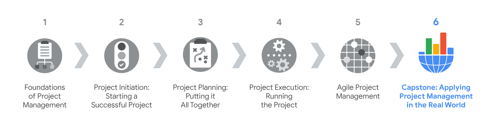

> Initiating a project
>
> 启动一个项目

You will learn to analyze project documents and supporting materials to identify project requirements, evaluate stakeholders, and problem-solve.

> 您将学习分析项目文件和支持材料，以确定项目需求，评估利益相关者，并解决问题。

You’ll complete a project charter and use it as a tool to align project scope and goals among-在…当中 stakeholders.

> 你将完成一份项目章程，并将其作为一种工具，在利益相关者之间协调项目范围和目标。

You will also add specificity to project goals to make them SMART and apply effective negotiation skills with stakeholders to prioritize project goals.

> 您还将为项目目标添加具体内容，使用 SMART，并应用与利益相关者的有效谈判技巧来确定项目目标的优先级。

**学习目标**

- Explain the Project Management certificate program structure and course functionality.

	> 解释项目管理证书课程结构和课程功能。

- Analyze materials to identify project requirements, evaluate stakeholders, and problem-solve.

	> 分析材料以确定项目需求，评估利益相关者，并解决问题。

- Complete a project charter, filling out key information including a project summary, goals, scope, benefits, and costs.

	> 完成项目章程，填写关键信息，包括项目总结、目标、范围、收益和成本。

- Add specificity to project goals to make them SMART.

	> 为项目目标添加具体内容，使用 SMART。

- Use the project charter as a tool to align project scope and goals among project stakeholders.

	> 将项目章程作为在项目干系人之间协调项目范围和目标的工具。

- Apply effective negotiation-谈判,协商 skills with stakeholders to prioritize project goals.

	> 运用有效的谈判技巧与利益相关者确定项目目标的优先级。

# Getting started with the course

> 开始课程

## Introduction to Course 6

> 课程 6 简介

Hi there.

Welcome to Applying Project Management in the Real World.

> 欢迎《在现实世界中应用项目管理》。

If you've joined us for this program's previous courses, then you've developed a solid foundation of project management knowledge and skills.

> 如果你已经加入了我们这个项目以前的课程，那么你已经开发了项目管理知识和技能的坚实基础。

Those courses covered how a project progresses through the initiation, planning, execution, and closing stages.

> 这些课程涵盖了项目如何通过启动、计划、执行和结束阶段进行。

They also taught how to manage projects using different methodologies and approaches, like Agile and Scrum.

> 他们还教授如何使用不同的方法和方法来管理项目，比如敏捷和Scrum。

If you haven't completed the previous courses, we recommend checking them out before starting this course to ensure that you're ready to work through all of the upcoming activities.

> 如果你还没有完成以前的课程，我们建议你在开始这门课程之前检查一下，以确保你已经准备好完成所有即将到来的活动。

---

As you progress through this course, you'll create project documents based on an imagined scenario.

> 当你在本课程中取得进展时，你将根据想象的场景创建项目文档。

You'll learn details through conversations, emails, and other materials, just as you would in a real-world scenario.

> 您将通过对话、电子邮件和其他材料了解细节，就像在现实世界中一样。

By the end of this course, you'll have developed a portfolio of project management documents that will demonstrate your ability to manage stakeholders and teams, organize plans, and communicate project details.

> 在本课程结束时，您将开发一个项目管理文件组合，这将证明您管理利益相关者和团队，组织计划和沟通项目细节的能力。

All of this can be valuable when applying for jobs or working on projects in your current line of work.

> 当你申请工作或从事当前行业的项目时，所有这些都是有价值的。

Before we go any further, I want to take a few minutes to introduce myself.

> 在我们进一步讨论之前，我想花几分钟时间介绍一下我自己。

---

My name is Dan, and I'm a Program Manager here at Google, and I'll be your instructor for this course.

> 我叫丹，是谷歌的项目经理，我将是你们这门课的导师。

At Google, I work on a team that promotes responsible practices in designing, building, and applying artificial-人工的,人为的 intelligence-智能—also known as AI—and machine learning.

> 在谷歌，我所在的团队提倡在设计、构建和应用人工智能(也称为ai)和机器学习方面负责任的做法。

I support teams in adopting tools and techniques they can use to evaluate their machine learning models and determine whether they are performing equitably-公正地,公平地.

> 我支持团队采用工具和技术来评估他们的机器学习模型，并确定他们是否公平地执行。

I love this role because I get to support teams in building products that work for our users.

> 我喜欢这个职位，因为我可以支持团队开发为用户服务的产品。

Before my current role, I worked on the Google AI Residency Program team.

> 在担任目前的职位之前，我曾在谷歌AI常驻人员计划团队工作。

This is a rotational-轮流的 program for people who are interested in doing AI research but who come from nontraditional backgrounds. 

> 这是一个轮岗项目，面向那些对人工智能研究感兴趣但来自非传统背景的人。

This work was compelling-令人信服的,有说服力的,强迫,迫使 to me because I personally didn't have any experience with AI or machine learning before coming to Google.

> 这项工作对我来说很有吸引力，因为我个人在来谷歌之前没有任何人工智能或机器学习的经验。

This just goes to show that if you have strong project management skills, you often don't need to be a subject matter expert in a given domain to work in that field.

> 这只是表明，如果您拥有强大的项目管理技能，您通常不需要成为给定领域的主题专家就可以在该领域工作。

Prior to my time at Google, I worked outside of tech—first as a math teacher, and then as a sponsorship-赞助 coordinator for a professional soccer-英式足球 team.

> 在谷歌工作之前，我在科技领域之外工作——先是当数学老师，然后是一个职业足球队的赞助协调员。

Throughout my career, I've always been passionate-热情的 about education, whether that's teaching students in the classroom or teaching developers how to ethically-合乎伦理地 implement AI systems, so I'm pretty excited about leading you through this course.

> 在我的职业生涯中，我一直对教育充满热情，无论是在课堂上教学生，还是教开发人员如何合乎道德地实施人工智能系统，所以我很高兴能带领你们完成这门课程。

It should be a lot of fun.

Now let's get right into the scenario that will apply to all of the activities in this course.

> 现在让我们直接进入将适用于本课程所有活动的场景。

---

In this imagined scenario, a small restaurant chain called Sauce and Spoon wants to meet their annual growth and expansion-扩大,扩张 goals.

> 在这个想象的场景中，一家名为Sauce and Spoon的小型连锁餐厅希望实现其年度增长和扩张目标。

As one way to meet these goals, they have decided to launch a pilot-试点的 project to test out the impact of installing new tabletop-桌面,台面 menu tablets.

> 为了实现这些目标，他们决定启动一个试点项目，测试安装新的桌面菜单平板电脑的影响

The new menu tablets will allow the restaurant to serve more guests-客人,顾客 in less time and will provide valuable data that will help Sauce and Spoon meet its business goals.

> 新的菜单平板电脑将使餐厅能够在更短的时间内为更多的客人提供服务，并将提供有价值的数据，帮助Sauce and Spoon实现其业务目标。

The company just hired Peta as their first in-house-内部的 project manager to oversee the tablet rollout-首次展示 at two of the restaurant chain's five locations.

> 该公司刚刚聘请了Peta作为他们的第一个内部项目经理，负责监督平板电脑在该连锁餐厅五家分店中的两家的推出。

Throughout the course, you'll observe Peta as she guides her team through planning and executing the project deliverables.

> 在整个课程中，您将观察Peta，因为她通过规划和执行项目可交付成果指导她的团队。

 Although she has five years of project management experience, Peta hasn't managed a restaurant project before.

> 虽然她有五年的项目管理经验，但Peta以前从未管理过餐厅项目。

You'll get to follow the project through its life cycle as Peta learns about the restaurant industry, determines the goals of the project, negotiates with stakeholders, and much more.

> 在Peta了解餐饮业、确定项目目标、与利益相关者谈判等过程中，你将跟随项目的整个生命周期。

Along the way, you'll record details of the project to use in course activities.

> 在此过程中，您将记录项目的细节，以便在课程活动中使用。

You'll also evaluate Peta's project management skills as she works to complete this project in scope, on time, and within budget. 

> 你还将评估Peta的项目管理技能，因为她努力在范围内、按时、在预算内完成这个项目。

You'll learn what works and what doesn't, and how to problem solve your way through a project.

> 你将学习什么可行，什么不可行，以及如何通过项目解决问题。

As you progress through the course, we'll review and practice key project management concepts, which include analyzing materials to identify project requirements, solve problems, and manage stakeholders, applying important negotiation techniques and influencing skills, listening with empathy-同理心,感同身受,产生共鸣 when working with a team, and practicing your stakeholder communication skills. 

> 随着课程的进展，我们将回顾和实践关键的项目管理概念，包括分析材料以确定项目需求，解决问题，管理利益相关者，应用重要的谈判技巧和影响技巧，在与团队合作时用同理心倾听，以及练习利益相关者沟通技巧。

We'll explore these concepts in more depth, and I'll explain how each concept applies to the Sauce and Spoon project.

> 我们将更深入地探讨这些概念，并解释如何将每个概念应用于Sauce and Spoon项目。

Each activity will contain guiding questions to help you create common project documents that you can speak to in a job interview and utilize throughout your career.

> 每个活动都包含指导性问题，帮助你创建通用的项目文件，你可以在面试中使用，并在你的职业生涯中使用。

As you work through these activities, you may want to take notes on some of the information you learn.

> 当你完成这些活动时，你可能想要记下你学到的一些信息。

Feel free to use whichever-任何一个,无论哪个 tool you prefer, whether that's the Coursera note-taking system or another method.

> 你可以随意使用你喜欢的工具，无论是Coursera的笔记系统还是其他方法。

In the upcoming videos, I'll explain the project in more detail and share project management best practices so that you can complete the associated course activities.

> 在接下来的视频中，我将更详细地解释这个项目，并分享项目管理最佳实践，以便您可以完成相关的课程活动。

Are you ready?

Let's go.

## Course 6 Capstone-顶点,课程 overview

> 课程6顶点概述

Hello!

Welcome to the **capstone** **course** in the Google Project Management Certificate, where you will practice applying the project management knowledge and skills you have learned so far. 

> 欢迎来到谷歌项目管理证书的**顶点** **课程**，在这里你将练习应用到目前为止所学到的项目管理知识和技能。

By the end of this course, you will have developed a **portfolio-作品集 of project management artifacts-人工制品** that will demonstrate the skills you have learned throughout the entire program, such as your ability to manage stakeholders and teams, organize plans, and communicate project details.

> 在本课程结束时，您将开发一个项目管理工件的投资组合，这将展示您在整个程序中学到的技能，例如您管理利益相关者和团队，组织计划和沟通项目细节的能力。

These artifacts can exhibit-表现出,展示 your career readiness-准备就绪状态 when applying for jobs in the field.

> 在申请该领域的工作时，这些物品可以展示你的职业准备。

To further prepare you to interview for project management jobs, you will reflect on past projects, develop an “elevator-电梯 pitch-表演场所,” and anticipate-预期,期望 common interview questions.

> 为了进一步为项目管理工作的面试做准备，你将回顾过去的项目，制定“电梯演讲”，并预测常见的面试问题。

Current Google project managers will continue to instruct and provide you with the strategies, tools, and resources to meet your goals.

> 当前的Google项目经理将继续指导并为您提供策略、工具和资源，以实现您的目标。

**If you haven’t taken Courses 1–5 yet, we highly recommend doing so in the order in which they are presented, as they provide the foundation necessary to complete the activities in this course**. 

> **如果你还没有修过课程1-5，我们强烈建议你按照课程的先后顺序修完课程1-5，因为它们是完成本课程活动的基础**。

As you progress through this course, you will “observe” a project manager in a real-world scenario and complete dozens-大量,许多,十多个 of hands-on activities, such as:

> 当你在本课程中取得进展时，你将在现实世界的场景中“观察”项目经理，并完成数十个实践活动，例如:

- analyzing project documents to identify project requirements and evaluate stakeholders 

	> 分析项目文件以确定项目需求并评估干系人

- completing a project charter and using it as a tool to align project scope and goals among stakeholders

	> 完成项目章程，并将其作为一种工具，在干系人之间协调项目范围和目标

- identifying tasks and milestones and documenting and prioritizing them in a project plan

	> 确定任务和里程碑，并在项目计划中记录和确定优先级

- defining quality management standards and exploring how to effectively share qualitative-定性的,质量的 data

	> 定义质量管理标准，探索如何有效共享定性数据

- demonstrating your project’s impact through effective reporting 

	> 通过有效的报告来展示项目的影响

**About the course**

> **关于课程**

This **capstone** course covers four modules of material.

> 这个顶点课程包括四个模块的材料。

Like the previous courses, each module includes a series of lessons with many types of learning opportunities, such as:

> 与之前的课程一样，每个模块包括一系列具有多种学习机会的课程，例如:

- **Videos** with a Google employee as your instructor. 

	> **视频**与谷歌员工作为你的教练。

- **Readings** to introduce new ideas and case studies and to build on the concepts from the videos. 

	> **阅读**介绍新的想法和案例研究，并建立在视频的概念。

- **Discussion forums** to explore course topics for better understanding and chat with peers in the program. 

	>**讨论论坛**探索课程主题，以便更好地理解和与项目中的同龄人聊天。

- **In-video questions** that will pop up from time to time. They’re designed for you to check your learning as you go! 

	> **视频问题**将不时弹出。它们是为你在学习过程中检查你的学习而设计的!

- **Practice quizzes** to check your understanding and give you valuable feedback. **Practice activities** will provide you with a hands-on opportunity to apply skills you are working to master. You will assess your work by answering quiz questions about it or by comparing it to an exemplar built by our course team. *Note: practice activities will not count towards your final course grade, but you are strongly encouraged to complete them as they will help prepare you for the graded quizzes and peer reviews.*

	> **练习测验**来检查你的理解并给你有价值的反馈。**实践活动**将为你提供一个实践的机会来应用你正在努力掌握的技能。你将通过回答关于它的测试问题或将其与我们的课程团队建立的范例进行比较来评估你的工作。*注意:练习活动不会计入你的期末成绩，但我们强烈建议你完成这些活动，因为它们将帮助你为评分测验和同行评议做准备

- **Graded quizzes** on video and reading content to measure your progress. 

	> **分级测验**视频和阅读内容，以衡量你的进步。

- Ungraded-不评分,不标准的 **peer-review activities** on video and reading content that provide you the opportunity to practice applying skills you are working to master-精通,掌握. Other learners in your course will see the work you submit and give you feedback based on a rubric-标题. 

	> 通过视频和阅读内容进行不评分的同行评议活动，为您提供练习应用您正在努力掌握的技能的机会。您课程中的其他学习者将看到您提交的作业，并根据标题给您反馈。

- **Graded peer-review activities** on video and reading content that assess your ability to apply skills you are working to master. Other learners in your course will grade your work and give you feedback based on a rubric.

	> **对视频和阅读内容进行分级的同行评议活动**，评估你应用你正在努力掌握的技能的能力。您课程中的其他学习者将根据评分标准对您的作业进行评分并给出反馈。

Everyone learns differently, so we designed this program to let you work at your own pace.

> 每个人学习的方式都不一样，所以我们设计了这个项目，让你按照自己的节奏学习。

Although your personalized deadlines start when you enroll, they’re just a guide.

> 虽然你的个性化截止日期从你注册时就开始了，但它们只是一个指导。

Feel free to move through the program however it works best for you.

> 你可以随意选择最适合自己的方法。

Keep in mind, you can always reset your deadlines by clicking the blue **reset my deadlines** button.

> 记住，你可以通过点击蓝色的“重置我的截止日期”按钮来重置你的截止日期。

There’s no penalty-处罚 for late assignments-作业,任务.

> 迟交作业不会被扣分。

To earn your certificate, all you have to do is complete all of the work.

> 要获得证书，你所要做的就是完成所有的工作。

**Tips**

- As mentioned previously, we strongly recommend you **take all six courses** **in the order in which they appear**—and complete the items in each lesson— as new information and concepts build on previous ones. 

	> 正如前面提到的，我们强烈建议你**按照出现的顺序学习所有的六门课程**并完成每一课的项目-作为新的信息和概念建立在以前的基础上。

- Make the most of the readings and additional resources throughout the program. They’re designed to support your learning. 

	> 在整个课程中充分利用阅读材料和其他资源。它们是用来支持你的学习的。

- If something is confusing, don’t hesitate-犹豫,不愿意 to rewatch a video, go through a reading again, or ask your classmates for advice in the discussion forum. 

	> 如果有什么让人困惑的地方，不要犹豫，重新看一遍视频，再看一遍阅读材料，或者在论坛上向你的同学寻求建议。

- Take part in all learning opportunities to gain as much knowledge and experience possible. 

	> 参加所有的学习机会，以获得尽可能多的知识和经验。

## Helpful resources to get started

> 有用的入门资源

The Google Project Management Certificate will provide you with new lessons in each module.

> 谷歌项目管理证书将为您提供每个模块的新课程。

As you’ve learned, each lesson includes a series of videos, readings, activities, in-video questions, practice quizzes, and graded quizzes.

> 正如你所了解的，每节课都包括一系列的视频、阅读、活动、视频中的问题、练习测验和评分测验。

In this reading, you’ll learn about providing feedback on course content, obtaining the Google Project Management Certificate, and acquiring helpful habits for successfully completing this certificate program. 

> 在这篇阅读中，你将学习如何对课程内容提供反馈，获得谷歌项目管理证书，以及获得成功完成该证书课程的有用习惯。

**Providing feedback on course content**

> **对课程内容提供反馈**

Please remember to give feedback on videos, readings, and materials.

> 请记得对视频、阅读和材料给予反馈。

Just open the resource and look for the thumbs-up-赞扬 and thumbs-down-责备 symbols. 

> 只要打开资源并查找拇指向上和拇指向下的符号。

- Click thumbs-up for materials that are helpful. 

	> 点击大拇指查看有用的材料。

- Click thumbs-down for materials that are not helpful.

	> 单击拇指向下的材料是没有帮助的。

If you want to flag a specific issue with the item, click the flag icon, select a category, and then optionally type an explanation in the text box.

> 如果要标记项目的特定问题，请单击标记图标，选择类别，然后可选地在文本框中键入解释。

This feedback goes to the course developers, not other learners, and helps create even better programs in the future. 

> 这些反馈反馈给了课程开发者，而不是其他学习者，并有助于在未来创建更好的课程。

For technical help, visit the [Learner Help Center](https://learner.coursera.help/hc/en-us). 

> 如需技术帮助，请访问[学习者帮助中心](https://learner.coursera.help/hc/en-us)。

**Obtaining the Google Project Management Certificate**

> 获得Google项目管理证书

To receive your official Google Project Management Certificate, you must:

> 要获得官方的Google项目管理证书，您必须:

- Pass all graded assignments in all 6 courses of the certificate program. Each graded assignment is part of a cumulative-积累的,累计的 graded score for the course, and the passing grade for each course is 80%. 

	> 通过证书项目所有6门课程的所有分级作业。每个评分作业都是课程累积评分的一部分，每门课程的及格分数为80%。

AND **one** of the following:

> - 及**下列**项之一:

- Pay the [course certificate fee](https://www.coursera.support/s/article/209818963-Payments-on-Coursera?language=en_US),

	> 支付【课程证书费】(https://www.coursera.support/s/article/209818963-Payments-on-Coursera?language=en_US);

- Be approved for [Coursera Financial Aid-援助,帮助](https://www.coursera.support/s/article/209819033-Apply-for-Financial-Aid-or-a-Scholarship?language=en_US), **or**

	> 获得[Coursera Financial Aid](https://www.coursera.support/s/article/209819033-Apply-for-Financial-Aid-or-a-Scholarship?language=en_US)的批准

- Complete the certificate through an educational institution-机构, employer, or agency that's sponsoring your participation. 

	> 通过赞助你参加的教育机构、雇主或代理机构完成证书。

**Helpful habits to successfully complete the certificate**

> 帮助习惯顺利完成证书

As a learner, you’re bringing all of your past experiences and best learning practices to this program.

> 作为一名学习者，你将把你过去的所有经验和最佳学习实践带到这个项目中。

The designers of this course have also put together a list of helpful habits that they believe will help you to be successful: 

> 这门课程的设计者还列出了一系列他们认为能帮助你成功的好习惯:

1. **Plan your time:** Setting regular study times and sticking-坚持 with them each week can help you make learning a part of your routine-常规,惯例.

	> **计划你的时间:**设定有规律的学习时间，每周坚持下去，可以帮助你把学习变成你日常生活的一部分。

	Use a calendar or timetable to create a schedule, and list what you plan to do each day in order to break your work down into achievable goals.

	> 使用日历或时间表来创建一个时间表，列出你每天计划做的事情，以便将你的工作分解成可实现的目标。

	Create a quiet place to watch the videos, review the readings, and complete the activities so you can really focus on the material.

	> 创造一个安静的地方看视频，复习阅读材料，完成活动，这样你才能真正专注于材料。

2. **Be curious-好奇的,求知欲强的:** If you find an idea that gets you excited, act on it!

	> **保持好奇心:**如果你发现一个让你兴奋的想法，那就付诸行动吧!

	Ask questions, search for more details online, check out the links that interest you, and take notes on your discoveries-发现.

	> 提出问题，在网上搜索更多细节，查看你感兴趣的链接，并记下你的发现。

	The little things you do to support your learning along the way will take your knowledge even further, open more doors in this high-growth field, and help you qualify-取得资格,达到标准 for jobs. 

	> 在学习的过程中，你所做的一些小事会让你的知识走得更远，在这个高增长的领域打开更多的大门，并帮助你获得工作资格。

3. **Take notes:** Notes are useful-to-remember information that you think might be important in the future, especially as you’re preparing to enter a new job field.

	> **做笔记:**笔记对记住你认为将来可能重要的信息很有用，尤其是当你准备进入一个新的工作领域时。

	In addition, taking notes is an effective way to make connections between topics and gain a better understanding of those topics.

4. **Chat (responsibly) with other learners**: If you have a question, chances are, you’re not alone.

	> **与其他学习者(负责任地)交谈**:如果你有问题，很有可能，你并不孤单。

	Reach out in the [discussion forum](https://www.coursera.org/learn/applying-project-management/discussions) to ask for help from other learners taking this program.

	> 到[讨论论坛](https://www.coursera.org/learn/applying-project-management/discussions)向其他参加这个课程的学习者寻求帮助。

	You can also visit Coursera’s[ Global Online Community](https://coursera.community/).

	> 你也可以访问Coursera的“全球在线社区”(https://coursera.community/)。

	Other important things to know while you’re making friends can be found in the [Coursera Honor Code](https://learner.coursera.help/hc/en-us/articles/209818863-Coursera-Honor-Code) and [Code of Conduct](https://learner.coursera.help/hc/en-us/articles/208280036-Coursera-Code-of-Conduct).

	> 你在交朋友时要知道的其他重要事情可以在[Coursera荣誉准则](https://learner.coursera.help/hc/en-us/articles/209818863-Coursera-Honor-Code)和[行为准则](https://learner.coursera.help/hc/en-us/articles/208280036-Coursera-Code-of-Conduct)中找到。

5. **Update your profile**: Consider [updating your profile](https://www.coursera.org/account/profile) on Coursera.

	> **更新你的个人资料**:考虑在Coursera上[更新你的个人资料](https://www.coursera.org/account/profile)。

	This link appears in the menu when you click on your name at the top-right corner of this screen.

	> 当您单击屏幕右上角的姓名时，此链接将出现在菜单中。

	When classmates find you in the discussion forums, they can click on your name to view your profile and get to know you more.

	> 当同学们在论坛上找到你时，他们可以点击你的名字来查看你的个人资料，并进一步了解你。

**Finding more information**

Throughout this course, you will learn the basics of project management. We will provide a lot of information through videos and readings. But sometimes, you may need to look things up on your own for additional learning. Things change fast in this growing field, so it is critical to do your own research so you can stay up-to-date on what is new. 

Here are some helpful project management resources available online:

- The [Project Management Institute](https://www.pmi.org/) is the leading association for those in project, program, or portfolio management professions. Their website provides guides, industry standards, articles, templates, job boards, certifications, and more to help support professionals in these careers.
- The [Scrum Guide](https://www.scrumguides.org/index.html) defines Scrum, a technique used in Agile project management. This guide describes Scrum’s roles, events, artifacts, and the rules that bind them together. You can also find hundreds of free resources to learn more about Scrum at [Scrum.org Resources](https://www.scrum.org/resources).

**Glossary**

> 术语表

This course will cover a lot of terms and concepts, some of which you may already know and some of which will be new.

> 本课程将涵盖许多术语和概念，其中一些你可能已经知道，其中一些将是新的。

To remind yourself about what a term means, refer to this [Glossary](https://www.coursera.org/learn/applying-project-management/resources/h26Qh).

> 为了提醒自己一个术语的意思，可以参考[词汇表](https://www.coursera.org/learn/applying-project-management/resources/h26Qh)。

## Program surveys

During this certificate program, you may have been asked to complete a few short surveys.

> 在这个证书课程中，你可能会被要求完成一些简短的调查。

These are part of a research study to understand how effective the certificate has been for you.

> 这些是一项研究的一部分，旨在了解该证书对您的有效性。

Please see below for a summary-摘要 of what each survey will cover.

> 请参阅下面每个调查将涵盖的摘要。

Your survey participation is optional but extremely helpful in making this course as effective as possible.

> 您的调查参与是可选的，但对使本课程尽可能有效非常有帮助。

There are no correct answers, and your responses and personal data will:

> 没有正确答案，你的回答和个人资料将:

- Not affect your course experience, scores, or ability to receive a certificate or job in any way.

	> 不会以任何方式影响您的课程经验，分数或获得证书或工作的能力。

- Be kept confidential-保密的, with your name separated from your data.

	> 保密，把你的名字和你的资料分开。

- Not be shared outside of our research team, except where you give permission to share contact-联系 information with hiring partners.

	> 不得在我们的研究团队之外共享，除非您允许与招聘合作伙伴共享联系信息。

Thanks for your consideration and time! 

> 感谢您的考虑和时间!

**Certificate completion survey**

> 证书完成检验

After you complete the last graded assignment in this final course of the certificate, you will be asked to answer a survey that revisits some earlier questions and asks what you have learned throughout the duration of the program.

> 在你完成证书最后一门课程的最后一次评分作业后，你将被要求回答一项调查，该调查将重新审视之前的一些问题，并询问你在整个课程期间学到了什么。

This survey also asks if you would like to share your contact information with prospective-有希望的,潜在的 employers.

> 这项调查还询问了你是否愿意与潜在雇主分享你的联系方式。

Both filling out the survey and sharing your contact information with prospective employers is completely optional and will not affect your course experience, scores, or ability to receive a certificate or job in any way.

> 填写调查问卷和与潜在雇主分享你的联系信息都是完全可选的，不会影响你的课程经历、分数或以任何方式获得证书或工作的能力。

**Delayed post survey**

> 延迟后调查

Those who successfully complete the full, six-course program will also receive an email follow-up survey six months after their last course to see if their objectives were realized.

> 那些成功完成完整的六门课程的学员，在最后一门课程结束六个月后，还将收到一封跟踪调查的电子邮件，以了解他们的目标是否实现了。

## Project management artifacts

> 项目管理工件

In the introduction video to this course, you learned that you will record project details and create project documents as you observe Peta, Sauce & Spoon’s new project manager, planning and executing project deliverables for the pilot-试点的 tablet rollout-推广,试运行.

> 在本课程的介绍视频中，您了解到您将记录项目细节并创建项目文件，因为您观察 Peta, Sauce & Spoon’s 的新项目经理，规划和执行试点平板电脑推出的项目可交付成果。

By the end of this course, you’ll have developed a portfolio-投资组合 of project management documents that will demonstrate your ability to manage stakeholders and teams, organize plans, and communicate project details. 

> 在本课程结束时，您将开发一个项目管理文件组合，这将证明您管理利益相关者和团队，组织计划和沟通项目细节的能力。

But what does this mean?

> 但这意味着什么呢?

Throughout the activities in this course, you will be building and creating project management documents, commonly referred to as **artifacts**, to apply what you have learned.

> 在本课程的整个活动中，您将构建和创建项目管理文档，通常称为**工件**，以应用您所学到的知识。

Many of these artifacts may be applicable to projects in your current line of work or helpful in showcasing your skills when applying for a new project management role. 

> 这些工件中的许多可能适用于您当前工作中的项目，或者在申请新的项目管理角色时有助于展示您的技能。

We recommend saving these templates and completed artifacts in a digital folder or online storage drive for future reference. 

> 我们建议将这些模板和完成的工件保存在数字文件夹或在线存储驱动器中，以备将来参考。

Organizing your work in one place will enable you to easily share your artifacts with future project managers, team members, and employers, as needed.

> 在一个地方组织您的工作将使您能够根据需要轻松地与未来的项目经理、团队成员和雇主共享您的工件。

# Creating a project charter

> 创建项目章程

## Project charters: Purpose and components

> 项目章程:目的和组成部分

Hi again.

Ready to get started?

> 准备开始?

In this next set of videos, you'll apply strategic thinking and effective business writing to initiate a project.

> 在下一组视频中，你将运用战略思维和有效的商业写作来启动一个项目。

You'll analyze project documents and supporting materials to identify project requirements, evaluate stakeholders, and problem solve.

> 您将分析项目文件和支持材料，以确定项目需求，评估利益相关者，并解决问题。

You'll use a project charter as a tool to align project scope and goals among stakeholders.

> 您将使用项目章程作为工具来协调项目范围和利益相关者之间的目标。

And you'll apply effective negotiation skills with stakeholders to prioritize project goals.

> 你将运用有效的谈判技巧与利益相关者确定项目目标的优先级。

In this video, I'll review the purpose and main components of a project charter, so you can get started creating one for the Sauce and Spoon tablet rollout.

> 在这个视频中，我将回顾项目章程的目的和主要组成部分，这样你就可以开始为 Sauce and Spoon 平板电脑的推出创建一个。

After this video, you'll review supporting materials that will enable you to observe Peta as she initiates the project.

> 在这个视频之后，您将回顾支持材料，使您能够在Peta启动项目时观察她。

Then you'll apply strategic thinking to create a project charter based on what you observed.

> 然后，您将根据您所观察到的情况应用战略思维来创建项目章程。

Strategic thinking involves analyzing documentation and talking with stakeholders to inform decisions based on the information available to you.

> 战略思维包括分析文档和与利益相关者交谈，以根据您可以获得的信息做出决策。

---

Okay, let's review the purpose and main components of a project charter.

> 好了，让我们回顾一下项目章程的目的和主要组成部分。

A project charter is a formal document that clearly defines the project and outlines the necessary details to reach the project's goals.

> 项目章程是一份正式的文件，它清楚地定义了项目，并概述了实现项目目标所需的细节。

The project manager creates the charter during the initiation phase, which is the first phase of the project life cycle.

> 项目经理在启动阶段创建章程，启动阶段是项目生命周期的第一阶段。

The project charter helps you organize vital-至关重要的,必不可少的 project information, create a framework for the work that needs to be done, and communicate those details to the necessary people.

> 项目章程帮助您组织重要的项目信息，为需要完成的工作创建一个框架，并将这些细节传达给必要的人员。

It's also useful as a reference throughout the project's life cycle, since it can help stakeholders realign-重新对齐 on the project scope, goals, and costs.

> 它在整个项目生命周期中作为参考也很有用，因为它可以帮助涉众重新调整项目范围、目标和成本。

The project charter contains key information about a project, like the summary, goals, and deliverables.

> 项目章程包含关于项目的关键信息，如总结、目标和可交付成果。

The goal of the summary is to provide an overview of the project and to outline the goals you hope to accomplish.

> 摘要的目的是提供项目的概述，并概述您希望实现的目标。

Summaries should be brief—just a few sentences at most, and to the point.

> 摘要应该简短——最多只有几句话，而且要切中要害。

After the summary comes project goals and deliverables.

> 总结之后是项目目标和可交付成果。

Project goals refer to the desired results of the project, and deliverables refer to specific tasks and tangible-明确的,真实的 outcomes that enable the team to meet project goals.

> 项目目标是指项目的预期结果，可交付成果是指使团队能够实现项目目标的具体任务和有形成果。

In general, project goals address the overall result that stakeholders are aiming to achieve.

> 一般来说，项目目标处理涉众想要达到的总体结果。

They are determined by input from stakeholders and the project manager.

> 它们由涉众和项目经理的输入决定。

For example, part of Sauce and Spoon's annual growth and expansion-扩大,扩张 goals is launching the tablet roll out project, and one deliverable of the project is the successful installation of working tablets at two restaurant locations.

> 例如，Sauce and Spoon的年度增长和扩张目标之一是推出平板电脑项目，该项目的一个成果是在两家餐厅成功安装了可工作的平板电脑。

---

The last part of a project charter that will cover here is scope.

> 项目章程的最后一部分是范围。

Remember that scope refers to the boundaries of a project.

> 记住，范围指的是项目的边界。

Along with the scope, the charter contains information about work that's out-of-scope.

> 除了范围之外，章程还包含了范围之外的工作信息。

Details that don't contribute to the project's goals are considered out of scope.

> 对项目目标没有贡献的细节被认为超出了范围。

Scope was covered in a previous course, and I'll continue to discuss it in more detail in an upcoming video.

> 在之前的课程中介绍了范围，我将在接下来的视频中继续更详细地讨论它。

---

Let's recap what we just covered.

> 让我们回顾一下我们刚刚讲过的内容。

A project charter is a formal document that clearly defines the project and outlines the necessary details to reach the project's goals.

> 项目章程是一份正式的文件，它清楚地定义了项目，并概述了实现项目目标所需的细节。

The primary components of a project charter are the summary, goals, deliverables, and scope.

> 项目章程的主要组成部分是总结、目标、可交付成果和范围。

A charter can include other sections as well, such as budget and cost and success metrics.

> 章程还可以包括其他部分，如预算、成本和成功指标。

I'll discuss those sections in another video.

> 我将在另一个视频中讨论这些部分。

In the upcoming activity, you'll identify and document the project name, summary, goals, and deliverables of the Sauce and Spoon tablet pilot in a project charter.

> 在接下来的活动中，您将在项目章程中确定并记录项目名称，摘要，目标和酱勺平板试验的可交付成果。

Ready to get started?

Go on to the activity to begin the project charter.

> 继续到活动开始项目章程。

 Once you've finished, meet me in the next video to continue learning about the project and adding to the charter.

> 一旦你完成了，在下一个视频中与我见面，继续学习项目并添加章程。

## Activity: Draft a project charter

> 活动:起草项目章程

**Activity Overview**

> 活动概述

In this activity, you will begin drafting the project charter for Sauce & Spoon’s tabletop menu tablets project by reviewing related project and company documents.

> 在本次活动中，您将通过查阅相关项目和公司文件，开始起草Sauce & Spoon桌面菜单平板电脑项目的项目章程。

Keep in mind that project charters can differ significantly from project to project and company to company.

> 请记住，项目章程可能因项目和公司的不同而有很大差异。

However, most charters include some variation-变化 of the components described in this activity.

> 但是，大多数章程都包括本活动中所述组件的一些变体。

No matter what form they take, charters lay out project goals, highlight benefits, and help keep stakeholders aligned.

> 无论采取何种形式，章程都列出了项目目标，突出了利益，并帮助利益相关者保持一致。

---

**Scenario**

Review the scenario below.

> 回顾下面的场景。

Then complete the step-by-step instructions-指示,说明.

> 然后完成一步一步的说明。

Sauce & Spoon is a small restaurant chain that wants to meet its annual growth and expansion-扩大,扩张 goals.

> Sauce & Spoon是一家希望实现年度增长和扩张目标的小型连锁餐厅。

As one way to meet these goals, they’ve decided to launch a pilot project to test out the impact of installing new tabletop menu tablets.

> 为了实现这些目标，他们决定启动一个试点项目，测试安装新的桌面菜单平板电脑的影响。

The new menu tablets will allow the restaurant to serve more guests in less time and will also provide valuable data that will help Sauce & Spoon meet its business goals.

> 新的菜单平板电脑将使餐厅能够在更短的时间内为更多的客人提供服务，还将提供有价值的数据，帮助Sauce & Spoon实现其业务目标。

The company just hired Peta as their first in-house project manager to oversee the tablet rollout.

> 该公司刚刚聘请了Peta作为他们的第一个内部项目经理来监督平板电脑的推出。

To get started on the project charter, Peta spends some time reviewing the documents provided by Sauce & Spoon and meets with some of the project’s stakeholders to get familiar-熟悉的 with the project and the company.

> 为了开始制定项目章程，Peta花了一些时间审查Sauce & Spoon提供的文件，并与项目的一些利益相关者会面，以熟悉项目和公司。

**Note:**

In this activity and throughout the course, you will follow Peta as she guides her team through planning and executing the project deliverables and follow the project throughout its life cycle.

> 在这项活动和整个过程中，您将跟随Peta，因为她指导她的团队通过规划和执行项目可交付成果，并在整个生命周期中遵循项目。

As you do, you’ll record details of the project to help you complete course activities.

> 当你这样做的时候，你会记录项目的细节来帮助你完成课程活动。

You will learn what works and what doesn’t, and how to problem-solve your way through a project.

> 你将学习什么可行，什么不可行，以及如何在项目中解决问题。

---

**Step-By-Step Instructions**

> 逐步说明

**Step 1: Access the template**

> 步骤1:访问模板

To use the template for this course item, click the link below and select “Use Template.” 

> 要使用本课程项目的模板，请点击下面的链接并选择“使用模板”。

Link to template: [Project Charter Template](https://docs.google.com/document/d/1q4g1X3LecR4HKee80ynUdmugQxXz4JFqvgbg7GtGIvo/template/preview?resourcekey=0-Z6b_fo7jwxfB2OmenWV1Rw)

OR

If you don’t have a Google account, you can download the template directly from the attachment below.

**Step 2: Access the supporting materials** 

> 步骤2:获取支撑材料

The following supporting materials will help you complete this activity.

> 以下支持材料将帮助您完成此活动。

Keep them open as you proceed to the next steps. Each link will open a new Coursera tab.

> 在进行下一步时，请保持打开状态。每个链接都会打开一个新的Coursera标签。

- [Sauce & Spoon Menu Tablets Project Proposal](https://www.coursera.org/learn/applying-project-management/resources/hHiP1)
- [Meeting: Clarifying Project Goals](https://www.coursera.org/learn/applying-project-management/resources/6jcbL)

**Step 3: Review the supporting materials**

> 第三步:检查辅助材料

Review the project proposal and meeting transcript-文字记录.

> 审阅项目建议书和会议记录。

Take notes, keeping in mind you will be responsible for drafting the following sections of the project charter:

> 记笔记，记住你将负责起草项目章程的以下部分:

- Project summary
- Goals
- Deliverables

You should make note of any other relevant project information as well.

> 你也应该记下任何其他相关的项目信息。

You may add this information to your notes or the project charter.

> 您可以将这些信息添加到您的笔记或项目章程中。

**Step 4: Add the project name and date to your project charter draft**

> 第四步:将项目名称和日期添加到您的项目章程草案

Refer to the supporting materials and add an appropriate project name and today’s date to the project charter.

> 参考支持材料，并在项目章程中添加适当的项目名称和今天的日期。

**Step 5: Add the project summary to your project charter draft**

Draft a project summary, drawing on the supporting materials. The goal of the summary is to describe the project and give a high-level overview of its aims. It should be brief and to the point—no longer than a short paragraph, or one to three sentences.

You can leave your summary in draft form for now. You will have the opportunity to finalize it as you progress through the upcoming activities.

**Step 6: Identify the project goals**

Draft a list of 4-8 project goals found in the supporting materials. Some goals are stated explicitly, while others are suggested or implied. Review the materials carefully to identify as many goals as you can.

Project goals answer the question “why are we doing this project?” Ask yourself:

- Why do stakeholders want to do this project?
- What will the project resemble when completed?
- How will you know the project is done and when it is done?
- How will you know the project has been completed successfully?

You can leave your list of goals in draft form for now. You will have the opportunity to add to them and make them more specific as you progress through the upcoming activities.

**Step 7: Determine the deliverables**

Refer to the supporting materials and draft a list of 5-9 deliverables. Deliverables are specific tasks and tangible (or intangible) outcomes that enable the team to meet project goals. 

You can leave your list of deliverables in draft form for now. You will have the opportunity to add to them and make them more specific as you progress through the upcoming activities.

**Step 8: Save your work** 

Be sure to save the project charter you drafted for this activity. You will revise and refine project artifacts, including the project charter, as you progress through the course. 

**Pro Tip: Save the template**

Finally, be sure to save the template you used to complete this activity for further practice or to use in your own personal or professional projects. These templates will be useful as you put together a portfolio of project management artifacts that you can speak to in an interview to demonstrate your experience to potential employers.

---

**What to Include in Your Response**

Be sure to include the following elements in your project charter draft:

- A project name and date
- A 1-3 sentence summary that provides an overview of the project 
- 4-8 project goals found in the supporting materials
- 5-9 project deliverables found in the supporting materials

## Project charters: Stakeholder alignment

> 项目章程:利益相关者的一致性

Welcome back.

So far, you should have added the project name, the project summary, and some goals and deliverables to your project charter.

> 到目前为止，您应该已经将项目名称、项目摘要以及一些目标和可交付成果添加到您的项目章程中。

In this video, we'll discuss how to use the charter as a tool to get the project stakeholders in alignment about the project's scope and goals.

> 在本视频中，我们将讨论如何使用章程作为工具，使项目干系人对项目的范围和目标保持一致。

Then in the upcoming activity, you'll review supporting materials containing information about the Sauce and Spoon tablet rollout.

> 然后在接下来的活动中，您将查看包含Sauce and Spoon平板电脑推出信息的辅助材料。

You'll also observe how Peta guides a conversation among disagreeing stakeholders to get alignment on the project charter details.

> 您还将观察Peta如何引导持不同意见的利益相关者之间的对话，以就项目章程细节达成一致。

Then you'll identify key aspects of the conversation that will help you revise-改变,修正 and clarify details in the charter you drafted in the last activity.

> 然后，你将确定对话中有助于你修改的关键方面，并澄清你在上一个活动中起草的章程中的细节。

Let's get into it.

> 让我们开始吧。

---

Any time you're communicating the details of your project, you need to think about your audience and what information is important to them.

> 任何时候你在交流项目细节的时候，你都需要考虑你的受众，以及哪些信息对他们来说是重要的。

When adding details to a project charter, ask yourself the following questions about your audience, and if it's helpful, try answering these questions in your notes.

> 在给项目章程添加细节时，问自己以下关于听众的问题，如果有帮助，试着在笔记中回答这些问题。

Who are your stakeholders?

> 谁是你的利益相关者?

In this case, your audience includes all of your key stakeholders.

> 在这种情况下，你的受众包括你所有的关键利益相关者。

What details are most important to them?

> 哪些细节对他们来说是最重要的?

Are there project details that they might disagree with?

> 是否有他们可能不同意的项目细节?

Once you've identified what you believe are important details, review your charter and ensure all of those details are included. 

> 一旦你确定了你认为重要的细节，检查你的章程，并确保所有这些细节都包括在内。

From there, you'll be able to present the charter to your stakeholders and confirm that everyone agrees with the project information.

> 在此基础上，您将能够向利益相关者展示章程，并确认每个人都同意项目信息。

Think of the project charter this way—in addition to serving as a formal document that defines the project, a project charter is also an alignment-一致,对准 tool.

> 以这种方式考虑项目章程——除了作为定义项目的正式文档之外，项目章程也是一种校准工具。

Here, alignment refers to reaching agreement between two or more parties.

> 在这里，结盟指的是在两方或多方之间达成协议。

A common cause of project failure is misalignment among stakeholders about the details of the project.

> 项目失败的一个常见原因是涉众对项目细节的不一致。

Misalignment can also happen between you and your stakeholders when you have differing visions for the project.

> 当您对项目有不同的愿景时，您和您的涉众之间也可能发生不一致。

That's why it's so important to align with your stakeholders before the work begins.

> 这就是为什么在工作开始之前与利益相关者保持一致是如此重要。

Stakeholders generally aren't involved in the day-to-day tasks of project execution, so it's crucial to take time during the initiation phase to create a project charter that clearly lays out the details of a project.

> 干系人通常不参与项目执行的日常任务，因此在启动阶段花时间创建一个清晰地列出项目细节的项目章程是至关重要的。

This helps ensure that the team is working toward the outcomes expected by all of the stakeholders and not just some of them. 

> 这有助于确保团队朝着所有涉众所期望的结果而工作，而不仅仅是其中的一部分。

Usually, the initiation phase is the most ideal-理想的,最佳的 time to make changes to the project.

> 通常，初始阶段是对项目进行更改的最理想的时间。

As the project progresses into the planning and execution phases, substantive-大量的,真实的 changes might require undoing-撤销 work that's already been completed.

> 随着项目进入计划和执行阶段，实质性的更改可能需要撤销已经完成的工作。

So in this early phase of the project life cycle, you shouldn't be afraid to make adjustments-调整,调节.

> 因此，在项目生命周期的早期阶段，您不应该害怕做出调整。

---

Here's an example of how you might experience misalignment.

> 下面是一个您可能会遇到的错位的例子。

Let's say you're discussing the main goals of the Sauce and Spoon project.

> 假设您正在讨论Sauce and Spoon项目的主要目标。

One stakeholder has a vision of being able to fully automate the ordering experience with the tablets over time.

> 一个利益相关者的愿景是，随着时间的推移，能够完全自动化平板电脑的订购体验。

Another stakeholder has a different goal.

> 另一个利益相关者有不同的目标。

Rather than fully automating ordering, they want the tablet rollout project to improve order accuracy-准确性,精确性.

> 他们希望平板电脑的推出项目能够提高订单的准确性，而不是完全自动化订购。

To help resolve this situation, a project manager might facilitate a discussion between the two stakeholders to try and reach an agreement to confirm alignment on the project's goals.

> 为了帮助解决这种情况，项目经理可能会促进两个涉众之间的讨论，以尝试达成协议，以确认项目目标的一致性。

When you present a project charter to your stakeholders, it's important to collect feedback and identify where there are misalignments.

> 当您向涉众展示项目章程时，收集反馈并确定哪里存在不一致是很重要的。

Then you can make changes to address those misalignments.

> 然后，您可以进行更改以解决这些不一致。

If you and your stakeholders take the time early on to clearly define the project, then you're much more likely to deliver the outcomes your stakeholders expect at the end of the project.

> 如果您和您的涉众尽早花时间清楚地定义项目，那么您就更有可能在项目结束时交付涉众期望的结果。

As a project manager, it is important to record the feedback you receive and document any misalignments and their resolutions. 

> 作为项目经理，记录您收到的反馈并记录任何不一致及其解决方案是很重要的。

This allows you and your project team to reference those decisions later on.

> 这允许您和您的项目团队稍后引用这些决策。

One way to document misalignments and resolutions is to create an appendix-附录 with a time stamp for new or updated information.

> 记录不一致和分辨率的一种方法是创建一个带有新信息或更新信息时间戳的附录。

An appendix-附录 is a section of additional content at the end of a document.

> 附录是文档末尾的附加内容部分。

A time stamp includes the date, and sometimes the time, of when the new content was created or added to the document. 

> 时间戳包括创建新内容或将新内容添加到文档的日期，有时还包括时间。

---

Awesome.

Let's review some of the main ideas we've discussed.

> 让我们回顾一下我们讨论过的一些主要观点。

Any time you communicate the details of a project, you need to think about your audience and what information is important to them.

> 任何时候你在交流项目的细节时，你都需要考虑你的听众，以及哪些信息对他们来说是重要的。

In the case of a project charter, your audience is made up of your stakeholders.

> 在项目章程的情况下，您的受众由您的涉众组成。

A common cause of project failure is misalignment among stakeholders about the project details.

> 项目失败的一个常见原因是涉众对项目细节的不一致。

It's important to take the time during the initiation phase to create a project charter that clearly lays out the key details of a project and to align with your stakeholders before the work begins.

> 重要的是，在启动阶段花时间创建一个项目章程，清楚地列出项目的关键细节，并在工作开始之前与涉众保持一致。

And finally, document any misalignments and their resolutions in your notes and the project charter to reference later on.

> 最后，在你的笔记和项目章程中记录任何不一致及其解决方案，以供以后参考。

---

Great job.

In the next activity, you'll review supporting materials highlighting how Peta works with stakeholders to reach alignment on the project charter's details.

> 在下一个活动中，您将回顾支持材料，强调Peta如何与利益相关者合作，以达成项目章程细节的一致性。

Then you'll edit your project charter summary, goals, and deliverables based on the additional information you learn.

> 然后，您将根据您了解的其他信息编辑项目章程摘要、目标和可交付成果。

This activity will demonstrate your ability to select key details from conversations that are relevant to a well-written project charter.

> 这个活动将展示你从对话中选择关键细节的能力，这些细节与一个写得很好的项目章程相关。

You'll also have the opportunity to observe and learn as Peta guides the conversation toward an agreement.

> 你也将有机会观察和学习Peta如何引导对话达成协议。

Once you've completed the activity, meet me in the next video.

> 一旦你完成了这个活动，在下一个视频中见我。

## Activity: Revise your project charter

**Activity Overview**

In this activity, you will update your project charter draft for Sauce & Spoon’s table top menu tablets project based on new information.

> 在本次活动中，您将根据新信息更新Sauce & Spoon桌面菜单平板电脑项目的项目章程草案。

You will also identify misalignments among stakeholders on certain aspects of the project.

> 您还将在项目的某些方面确定涉众之间的不一致。

### Scenario

Review the scenario below.

> 回顾下面的场景。

Then complete the step-by-step instructions-指示,说明.

> 然后完成一步一步的说明。

After drafting the project charter, Peta emails and meets with a few project stakeholders to clarify some of the project details.

> 在起草项目章程后，Peta通过电子邮件与一些项目利益相关者会面，以澄清项目的一些细节。

In addition to providing more information, these discussions reveal-揭示,透露 some misalignments between two of the project’s stakeholders. 

> 除了提供更多的信息之外，这些讨论还揭示了两个项目涉众之间的一些不一致。

---

**Misalignment** occurs when stakeholders are not in agreement about the details of the project.

> 当干系人对项目的细节意见不一致时，就会出现不一致。

It can happen between the project manager and any stakeholder at any stage of the project, and is a common cause of project failure. 

> 它可以在项目的任何阶段发生在项目经理和任何利益相关者之间，并且是项目失败的常见原因。

### Step-By-Step Instructions

## Project charters: Drafting SMART goals

> 项目章程:起草SMART目标

Welcome back. 

By now you've drafted the project summary, goals, and deliverables in the project charter, and you've identified details in the project charter where stakeholders need to be in alignment.

> 到目前为止，您已经在项目章程中起草了项目摘要、目标和可交付成果，并且您已经确定了项目章程中涉众需要一致的细节。

In this video, I'll review SMART goals and discuss how to add specificity-特异性,特征 to your project goals.

> 在这个视频中，我将回顾SMART目标，并讨论如何为项目目标添加特异性。

I'll also share some tips for researching industry success metrics which are helpful in adding specificity to your goals and deliverables.

> 我还将分享一些关于研究行业成功指标的建议，这些建议有助于为你的目标和可交付成果添加特异性。

Being able to write specific, measurable goals is an important part of project management and a great way to demonstrate your project management skills to potential employers.

> 能够写出具体的、可测量的目标是项目管理的重要组成部分，也是向潜在雇主展示你的项目管理技能的好方法。

Then, in the following activity, you'll review supporting materials and update the goals and deliverables you've drafted in the project charter to make them SMART.

> 然后，在接下来的活动中，您将回顾支持性材料，并更新您在项目章程中起草的目标和可交付成果，使其变得SMART。

Ready to begin?

Let's go.

---

During the initiation phase, some of the project goals might be broad because not all of the project details have been determined.

> 在启动阶段，一些项目目标可能是广泛的，因为并非所有的项目细节都已确定。

While it's okay to have broader goals, it's helpful to add specificity where possible.

> 虽然有更广泛的目标是可以的，但在可能的情况下增加特异性是有帮助的。

That's because clarifying project goals early on can help you avoid misalignment and gain a clearer understanding of the project's scope, budget, and timeline.

> 这是因为尽早澄清项目目标可以帮助您避免不一致，并更清楚地了解项目的范围、预算和时间。

Remember, project goals are the desired outcomes of the project.

> 记住，项目目标是项目期望的结果。

Outlining clear and specific goals is an important step in creating an effective project charter and crucial to launching a successful project, so you'll need to be able to accurately identify whether or not a goal has been met.

> 概述清晰具体的目标是创建有效的项目章程的重要一步，也是启动一个成功项目的关键，所以你需要能够准确地确定目标是否已经实现。

When your goals are clear, you'll be able to determine your project deliverables.

> 当你的目标明确时，你就能确定你的项目可交付成果。

Project deliverables are specific tasks or outcomes that contribute to the completion of a goal.

> 项目可交付成果是有助于完成目标的特定任务或结果。

In your career as a project manager, you will likely encounter stakeholders who only vaguely-不详细地,粗略地 describe the outcomes they want for a given project.

> 在您作为项目经理的职业生涯中，您可能会遇到只模糊地描述他们对给定项目的期望结果的干系人。

For example, a stakeholder might tell you that they'd like more customers to use a certain service or they'd like to sell more units of a particular product.

> 例如，利益相关者可能会告诉您，他们希望更多的客户使用某种服务，或者他们希望销售更多的特定产品。

These are fine goals, but they're not very specific.

> 这些都是很好的目标，但不是很具体。

You don't know how many more customers, what kind of customers, or how many units-单位 that you'll need in order to meet goals. 

> 你不知道还需要多少客户，什么样的客户，或者你需要多少单位才能达到目标。

As a project manager, it's your role to ensure that the project goals are well-defined so that you and your team have a clear roadmap.

> 作为项目经理，您的职责是确保项目目标是明确定义的，以便您和您的团队有一个清晰的路线图。

This not only allows you to focus, but also eliminates wasted time and miscommunication going forward.

> 这不仅可以让你集中精力，还可以消除浪费的时间和错误的沟通。

You can create clearly-outlined goals with the help of the SMART method we discussed earlier in this program.

> 你可以在我们之前讨论过的SMART方法的帮助下创建清晰的目标。

---

---

The SMART method helps turn your project goals into SMART goals.

> SMART方法帮助你把项目目标变成SMART目标。

Remember, this means your goals are specific, measurable, attainable-可以达到的,可以获得的, relevant, and time-bound.

> 记住，这意味着你的目标是具体的、可衡量的、可实现的、相关的、有时间限制的。

These qualities can help you measure your success more accurately and allow you to make more precise-精确的,准确的 adjustments along the way.

> 这些品质可以帮助你更准确地衡量你的成功，并让你在前进的道路上做出更精确的调整。

Let's review some best practices for ensuring your project goals are also SMART goals.

> 让我们回顾一些确保您的项目目标也是SMART目标的最佳实践。

---

To make a goal more specific, make sure that it provides answers to questions like "What am I aiming to accomplish?" and "What are the requirements and constraints of this goal?"

> 为了使目标更具体，确保它提供了诸如“我的目标是什么?”和“这个目标的要求和限制是什么?”

Here's a tip I like to use to add specificity to goals.

> 这里有一个我喜欢用来给目标增加特殊性的技巧。

Look for words in your goals that might be subjective or based on an opinion, such as bigger, better, or faster.

> 在你的目标中寻找那些可能是主观的或基于个人观点的词语，比如更大、更好或更快。

Once you've identified subjective-个人的,主观的 words, connect with your stakeholders to agree on a definition of what it actually means to make something bigger or better or faster.

> 一旦你确定了主观词汇，与你的利益相关者联系，就什么是更大、更好或更快的定义达成一致。

What does bigger or better entail-使必要,需要 in practice?

> 在实践中，“更大”或“更好”意味着什么?

Faster by how much, specifically-明确地,具体地?

> 具体快多少?

The SMART method helps you make your goals more specific by making them measurable.

> SMART方法通过使目标可测量来帮助你使目标更具体。

For example, if your stakeholder wants to increase company profits, ask, "By how much?"

> 例如，如果你的股东想要增加公司利润，你就问:“增加多少?”

Do they want to increase profits by five percent? By 30 percent?

> 他们想增加百分之五的利润吗?30% ?

Adding numbers and figures to your goal makes it a lot easier to know when you've achieved it.

> 在你的目标上加上数字和图形会让你更容易知道你什么时候实现了目标。

If you're having trouble making a goal measurable, research how others in your industry quantify-量化 success.

> 如果你很难制定一个可衡量的目标，那就研究一下你所在行业的其他人是如何衡量成功的。

This is called benchmarking-标杆管理,标记, which refers to evaluating success against the standard.

> 这被称为基准测试，指的是根据标准来评估成功。

For example, there are lots of ways to measure success in the restaurant industry.

> 例如，衡量餐饮业成功的方法有很多。

You might search online for information using queries like "How do restaurants measure success?" or "How do you evaluate employee training sessions?"

> 你可以在网上搜索一些信息，比如“餐馆如何衡量成功?”或者“你如何评估员工培训课程?”

You'll likely find a number of results.

> 你可能会发现很多结果。

Some common metrics include table turnover-人员流动率 rate, or the average length of time that a guest spends at their table; prime-主要的,首要的 cost, which is the labor-劳工 cost plus the total cost of goods like food and drink; and average check amount, which is the average amount of money guests spend on a given meal.

> 一些常见的指标包括桌子的流动率，或者客人在桌子上停留的平均时间;主要成本，即人工成本加上食品、饮料等商品的总成本;平均支票金额，也就是客人在一顿饭上花费的平均金额。

Most industries—from the hospitality-酒店业,服务业 industry to the entertainment-娱乐 industry to the construction-建筑 industry—will have their own metrics for success.

> 大多数行业——从酒店业到娱乐业再到建筑业——都有自己的成功标准。

That includes the tech industry too.

> 这也包括科技行业。

Metrics are a big part of how we measure success here at Google.

> 在谷歌，指标是衡量成功的重要标准。

---

SMART goals are also attainable, which means that the goal is challenging but not impossible to reach.

> 聪明的目标也是可以实现的，这意味着目标是具有挑战性的，但并非不可能实现。

Ask yourself and the team, "Can it be done?" Do you have the time, resources, and people available to complete the goal on time and within budget? If not, you'll need to make some changes to your goals.

> 问问你自己和你的团队，“这能做到吗?”你是否有足够的时间、资源和人员在预算内按时完成目标?如果不是，你需要对你的目标做一些改变。

---

And all project goals should be relevant.

> 所有的项目目标都应该是相关的。

Ask yourself, "Does it make sense for us as a company or as a project team to pursue this goal?"

> 问问你自己，“作为一个公司或一个项目团队，追求这个目标是否有意义?”

One best practice for determining the relevance of your project goals is to notice how closely your project goals align with the wider goals of your company or organization.

> 确定项目目标相关性的一个最佳实践是注意您的项目目标与公司或组织的更广泛目标的一致程度。

Here at Google, we use a tool for organization-wide goal setting called objectives and key results, or OKRs.

> 在谷歌，我们使用一种工具来设定组织范围内的目标，叫做目标和关键结果，简称okr。

Other organizations might use a different term for their own goal setting.

> 其他组织可能会使用不同的术语来描述他们自己的目标设定。

For us, OKRs combine a goal and a metric to determine a measurable outcome.

> 对我们来说，okr结合了一个目标和一个度量来确定一个可度量的结果。

For example, one of Sauce and Spoon's broader objectives is to make fresh, quick food for the working families in its community. 

> 例如，Sauce and Spoon更广泛的目标之一是为社区的工薪家庭制作新鲜、快捷的食品。

So a relevant goal for the Sauce and Spoon tablet rollout might be to decrease customer checkout-结账 time by 10 percent, on average, in the first six weeks after implementation.

> 因此，Sauce and Spoon平板电脑推出的一个相关目标可能是在实施后的前六周内平均减少10%的客户结帐时间。

This project goal helps the restaurant chain reach its larger goal: to provide quick meals for guests.

> 这个项目的目标有助于连锁餐厅实现更大的目标:为客人提供快捷的饭菜。

---

The last part of the SMART framework is to make your goal time-bound.

> SMART框架的最后一部分是让你的目标有时间限制。

You'll want to add a deadline to your goal so that you know when it's supposed to be completed.

> 你会想给你的目标加上一个截止日期，这样你就知道什么时候应该完成。

---

Okay.

Let's review.

SMART stands for specific, measurable, attainable, relevant, and time-bound.

> SMART代表具体的、可衡量的、可实现的、相关的和有时限的。

If your goals are SMART, you can feel confident about including them in your project charter.

> 如果你的目标是SMART，你可以自信地将它们包含在你的项目章程中。

In the upcoming activity, you'll collect information from the supporting materials that will help you turn the goals you drafted into SMART goals.

> 在接下来的活动中，你将从支持材料中收集信息，这些信息将帮助你把你起草的目标变成SMART目标。

You'll also identify any additional goals and add them to the project charter.

> 您还将确定任何额外的目标，并将它们添加到项目章程中。

Ready to get started?

Let's get to work on the activity.

Then, meet me in the next video to discuss scope, benefits, and costs.

## Project charters: Defining scope, benefits, and costs

> 项目章程:定义范围、收益和成本

Welcome back.

Now that you've updated the project charter and edited some of the project goals to make them SMART, it's time to discuss scope, benefits, and cost.

Coming up, we'll explore what to think about when adding these items to your project charter.

> 接下来，我们将探讨在将这些条款添加到项目章程时应该考虑什么。

After this video, you'll review new supporting materials and use what you've learned to identify benefits and costs, which you'll add to your charter.

> 在本视频之后，您将回顾新的支持材料，并使用您所学到的知识来确定收益和成本，这将添加到您的章程中。

---

Let's get started.

When thinking about what kind of information to include in a project charter, it's always good to consider the primary audience who will be reading it.

> 当考虑在项目章程中包含什么样的信息时，最好考虑一下将阅读它的主要受众。

Since the goal of creating a project charter is to communicate with your stakeholders, they're your primary audience.

> 由于创建项目章程的目标是与您的涉众进行沟通，因此他们是您的主要受众。

Here's an example.

If you know that one of the benefits of your project would be of particular interest to a key stakeholder, you'll want to make sure to emphasize this benefit in your project charter.

> 如果您知道您的项目的一个好处会引起关键涉众的特别兴趣，那么您将希望确保在您的项目章程中强调这个好处。

The stakeholders reading your charter might not see more detailed project plans in other documents later on, so it's important to get consensus-一致看法,共识 on the critical elements now while the project details are still being finalized.

> 阅读你的章程的干系人可能不会在以后的其他文档中看到更详细的项目计划，所以在项目细节还没有最终确定的时候，就关键元素达成共识是很重要的。

You've already identified, and hopefully resolved, any misalignments about the project vision and goals.

> 您已经确定并解决了项目愿景和目标的任何偏差。

---

Next, you need to get aligned with your stakeholders on scope, benefits, and cost.

> 接下来，您需要在范围、收益和成本方面与您的涉众保持一致。

We talked about scope earlier, but as a quick refresher, scope refers to the boundaries of the project; for example, the number of restaurants taking part in the pilot.

> 我们之前讨论过范围，但作为快速复习，范围指的是项目的边界;例如，参与试点的餐厅数量。

Details that don't contribute to the project's goals are considered out-of-scope.

> 对项目目标没有贡献的细节被认为超出了范围。

To determine what's in- and out-of-scope, think about what's needed to achieve the project goal.

> 要确定哪些在范围内，哪些在范围外，请考虑实现项目目标需要什么。

Keep the following questions in mind: 

> 记住以下问题:

Which project details are your stakeholders aligned on that would be considered in-scope? 

> 哪些项目细节是你的利益相关者一致的，将被认为是在范围内的?

Do your stakeholders disagree on any elements?

> 你的利益相关者是否在某些方面存在分歧?

Are there any details you should designate-指定,标明 as out-of-scope for this particular project?

> 对于这个特殊的项目，有没有什么细节你应该指定为超出范围的?

As you think about these questions, take notes on what you find and refer to them as you complete the scope section of your project charter in the upcoming activity.

> 当你思考这些问题时，把你发现的做个笔记，并在接下来的活动中完成项目章程的范围部分时参考它们。

---

After you've figured out the scope of your project, you'll need to focus on project benefits and costs.

> 在你弄清楚项目的范围之后，你需要关注项目的收益和成本。

Benefits are the expected gains of a project.

> 收益是项目的预期收益。

These can be direct, monetary gains, or indirect benefits, like an improvement in customer engagement or satisfaction.

> 这些可以是直接的、金钱上的收益，也可以是间接的收益，比如客户参与度或满意度的提高。

Costs refer to the money spent on project tasks and the prices of things like time, resources, and labor.

> 成本是指花费在项目任务上的钱，以及时间、资源和劳动力等的价格。

Costs can be evaluated and managed using a project budget.

> 成本可以用项目预算来评估和管理。

A budget is an estimate of the amount of money allocated to complete the project.

> 预算是对完成项目所需资金的估计。

In the next activity, you'll need to review the supporting materials and take notes on details that can help you identify the benefits and costs of the tablet rollout.

> 在接下来的活动中，您需要回顾支持性材料并记录细节，这些细节可以帮助您确定平板电脑推出的收益和成本。

You'll use that information to add two lists to your project charter: a list of benefits and a list of costs.

> 您将使用这些信息在项目章程中添加两个列表:收益列表和成本列表。

Usually you can find the benefits the project will bring in the business case or project proposal.

> 通常你可以在商业案例或项目提案中发现项目将带来的好处。

For example, your list of benefits for the tablet rollout might include its potential to speed up service and increase sales by an estimated percent.

> 例如，你列出的平板电脑推出的好处可能包括它加速服务和增加销售额的潜力。

Here's another benefit.

> 这是另一个收益。

The tablets will provide the restaurant with clear data points on customer ordering and an integrated point-of-sale system to help guide decision-making in the future.

> 这些平板电脑将为餐厅提供关于顾客点餐的清晰数据点，以及一个集成的销售点系统，以帮助指导未来的决策。

A list of benefits can help you identify potential project goals you might have missed.

> 好处列表可以帮助您确定可能错过的潜在项目目标。

A list of costs will include items the organization will have to pay for in order to get the job done, like the price of labor or materials.

> 成本清单将包括组织为完成工作而必须支付的项目，如劳动力或材料的价格。

Listing out costs helps your stakeholders weigh the benefits against the amount of money required to realize those benefits.

> 列出成本可以帮助您的涉众权衡收益与实现这些收益所需的资金数量。

You can build a list of costs by working with stakeholders to get estimates on labor, materials, and any other factors that might cost the business money during the project.

> 您可以通过与涉众合作来构建成本列表，以获得对人工、材料和任何其他可能在项目期间花费业务资金的因素的估计。

Earlier, I told you that the benefits of a project should outweigh the costs.

> 早些时候，我告诉过你项目的收益应该大于成本。

This is almost always the case when a project is initiated or proposed.

> 当一个项目启动或提出时，几乎总是会出现这种情况。

When you add these details to the charter, it helps visualize them in one place and makes the costs and benefits crystal-清澈透明的 clear to the stakeholders.

> 当您将这些细节添加到章程中时，它有助于在一个地方将它们可视化，并使利益相关者清楚地了解成本和收益。

This section is used a lot as an aid to help make sure stakeholders agree that it's worth the money to pursue the project.

> 这个部分经常被用作辅助工具，以帮助确保涉众同意项目的投资是值得的。

---

Let's recap.

Scope refers to the boundaries of the project.

Benefits refer to the expected gains of the project.

> 效益是指项目的预期收益。

And costs refer to the money spent on project tasks, plus the prices of things like time, resources, and labor.

> 成本是指花费在项目任务上的钱，加上时间、资源和劳动力的价格。

Ready to get back to your project charter?

Head over to the activity where you'll review and analyze the supporting materials to identify the appropriate scope, benefits, and costs for the Sauce and Spoon tablet rollout.

> 在此活动中，您将审查和分析支持材料，以确定酱勺片剂推出的适当范围、收益和成本。

Then, meet me in the next video where we'll discuss techniques for negotiating with stakeholders.

> 然后，在下一个视频中见我，我们将讨论与利益相关者谈判的技巧。

See you soon.

## Afsheen: Initiating a project effectively

The common problem that I see when you're in the initial phase of establishing a project is getting alignment between the key stakeholders. Also, securing the right people to take on the project to incentivize your really talented project managers to want to join the project. I find that attraction is much more effective than promotion. I want talent to come towards the project versus just assigning the project work. That takes a lot of work. It's worth it because you're laying a good foundation for a successful project, and ultimately, the best velocity you could expect. During the initiation phase, when I'm trying to refine the success criteria, I ask a lot of questions. There's probably a list of 20 of them. A couple examples could be understanding the environment. What are some of the pitfalls or risks in the ecosystem? I will also try to do survey interviews, people in the environment, asking them, "What do you see as a problem?" Also, I ask a series of quantitative questions where applicable to understand what am I dealing with in terms of measurables? "There are a lot of reasons why projects may fail. In my opinion, it comes down to: one, really poor project definition: two, disorganization, the project lead is not establishing a framework to manage the project: and three, there's too many people." Often, you have this effect where everyone will want to work on the project and then you don't have accountability. Not every stakeholder is going to come at the problem with the same perspective. So I step back and understand, who are my key stakeholders? Let's just say for example there's two sponsors, the key stakeholders, and they're apples and oranges. That's a problem. In that case, I'm going to have to meet with them a lot, understand broker compromise, and really work through that initial project formation problem.

# Negotiating effectively with stakeholders

> 与利益相关者进行有效谈判

## Completing a stakeholder analysis

> 完成利益相关者分析

Hi again.

By now, you filled in most of your project charter: the summary, goals and deliverables, scope, benefits, and costs.

> 到目前为止，您已经填写了大部分项目章程:摘要、目标和可交付成果、范围、收益和成本。

You've also learned more about the project and your stakeholders, who are the core audience of the charter.

> 您还了解了更多关于项目和您的利益相关者的信息，他们是章程的核心受众。

In this video, you'll learn how to prepare for some of the negotiations you'll have with stakeholders about your projects.

> 在本视频中，你将学习如何准备与利益相关者就项目进行的一些谈判。

We'll spend some time exploring stakeholders' individual interests, involvement-参与,介入, and contributions to the project.

> 我们将花一些时间探索涉众的个人兴趣、参与和对项目的贡献。

Then we'll figure out how to use stakeholder influence to benefit the project and how to effectively work with stakeholders. 

> 然后，我们将弄清楚如何利用利益相关者的影响来使项目受益，以及如何有效地与利益相关者合作。

Almost every part of a project requires input and agreement from multiple stakeholders.

> 几乎项目的每个部分都需要多个干系人的输入和同意。

Of course, not all stakeholders will value-重视 the same input or agree on the same things.

> 当然，并不是所有的涉众都会重视相同的投入或同意相同的事情。

That's why a successful project manager needs to be a skilled-熟练的 negotiator-谈判者 too.

> 这就是为什么一个成功的项目经理也需要成为一个熟练的谈判者。

After this video, you'll review supporting materials about the Sauce and Spoon project stakeholders to write a persuasive-有说服力的,能使人信服的 email demonstrating your negotiation skills.

> 在这个视频之后，你将回顾关于酱勺项目利益相关者的支持材料，写一封有说服力的电子邮件来展示你的谈判技巧。

---

Let's get started.

As we discussed earlier in the program, some common project aspects that are negotiated during the course of a project include scope, costs, and benefits, timeline, success criteria, roles and responsibilities, and resources.

> 正如我们之前在计划中所讨论的，在项目过程中协商的一些常见项目方面包括范围、成本和收益、时间线、成功标准、角色和责任，以及资源。

This is another reason getting aligned with stakeholders early on is helpful.

> 这是尽早与利益相关者保持一致是有帮助的另一个原因。

Good alignment can help prevent-阻止,阻碍 some of these types of negotiations **down the road**-将来,未来.

> 良好的协调可以帮助防止在未来的谈判中出现这些类型的谈判。

Early in the project, it's important to agree on the scope.

> 在项目的早期，就范围达成一致是很重要的。

Take note of how Peta focuses on securing-得到,获得 stakeholder buy-in for that.

> 请注意Peta是如何专注于确保利益相关者同意的。

It's good to remember that a lot of the skills she'll apply here will be useful to negotiating other elements throughout the project's life cycle, whether that's the budget, timeline, or product requirements.

> 最好记住，她在这里应用的许多技能将有助于在整个项目生命周期中协商其他元素，无论是预算、时间线还是产品需求。

You'll prepare for this and future negotiations by creating a stakeholder analysis.

> 你将通过创建利益相关者分析为这次和未来的谈判做好准备。

A stakeholder analysis is a visual representation-表示,代表 of all of the stakeholders.

> 干系人分析是所有干系人的可视化表示。

It helps you understand who your stakeholders are, what their priorities are, and how they **prefer to**-更喜欢,喜欢 communicate.

> 它可以帮助您了解您的涉众是谁，他们的优先事项是什么，以及他们喜欢如何沟通。

It can help you determine how strongly you need to prioritize particular-特定的,特殊的 stakeholder's needs or goals on the project.

> 它可以帮助您确定对项目中特定涉众的需求或目标进行优先级排序的必要性。

Stakeholders have a vested-既定的 interest-利益 in the project success.

> 干系人对项目的成功有着既得利益。

Understanding your stakeholders helps you figure out the right people to include in important conversations and how to prioritize the different needs of the different stakeholders.

> 了解你的涉众可以帮助你找出合适的人参与重要的对话，以及如何优先考虑不同涉众的不同需求。

This is key to getting the support you need throughout the project.

> 这是在整个项目中获得所需支持的关键。

As part of your analysis, try to answer as many questions as you can about each stakeholder.

> 作为分析的一部分，试着回答尽可能多的关于每个利益相关者的问题。

Then as you review your list, identify which stakeholders directly influence the project and the level of interest each one has.

> 然后，当你回顾你的清单时，确定哪些干系人直接影响项目，以及每个干系人的兴趣程度。

A stakeholder's influence is related to how much power they have and how much their actions affect the project outcome. 

> 干系人的影响力与他们拥有多少权力以及他们的行为对项目结果的影响程度有关。

Interest refers to how much the stakeholders' needs will be affected by project operations and outcomes.

> 利益是指干系人的需求将在多大程度上受到项目运作和结果的影响。

For example, if a stakeholder has high interest and high influence, it might be very important that you keep them informed and make sure their goals for the project are top priority.

> 例如，如果一个涉众有很高的兴趣和影响力，那么让他们了解情况并确保他们的项目目标是最优先考虑的，这可能是非常重要的。

If they have low interest and low influence, then you might be able to deprioritize one of their personal preferences-偏好 for the project.

> 如果他们的兴趣和影响力都不高，那么你就可以降低他们对项目的个人偏好的优先级。

Mapping these out on a power-interest grid-网格,方格 will give you even more clarity about whom to prioritize and how best to approach negotiations with each stakeholder.

> 在权力利益网格上绘制这些图会让你更清楚地知道优先考虑谁，以及如何最好地与每个利益相关者进行谈判。

You'll find a stakeholder analysis template in power interest grid and the supporting materials of the upcoming activity.

> 您将在权力利益网格中找到利益相关者分析模板和即将开展的活动的支持材料。

Once you have a good idea of who your stakeholders are and what role they play in the project's success, you can use this information to support your project negotiations.

> 一旦你很好地了解了谁是你的涉众以及他们在项目成功中扮演的角色，你就可以使用这些信息来支持你的项目谈判。

One of the most important negotiations will deal with defining and maintaining project scope.

> 最重要的谈判之一是定义和维护项目范围。

Stakeholders might push to add more into the scope, and it's your job as the project manager to negotiate what's realistic-现实的 within the given budget and timeline expectations.

> 涉众可能会要求增加更多的范围，作为项目经理，你的工作是在给定的预算和时间预期范围内协商什么是现实的。

---

Let's review.

Some common project negotiations you're likely to have with stakeholders include aspects of the charter, like costs and benefits and success criteria, as well as other project aspects like roles and responsibilities and project resources.

> 您可能与利益相关者进行的一些常见项目谈判包括章程的各个方面，如成本和收益以及成功标准，以及其他项目方面，如角色和责任以及项目资源。

You can prepare for these negotiations by conducting a stakeholder analysis using a power-interest grid.

> 您可以通过使用权力-利益网格进行利益相关者分析来为这些谈判做好准备。

Coming up, you'll review supporting materials and complete a stakeholder analysis for the Sauce and Spoon tablet rollout.

> 接下来，您将回顾支持材料，并完成 Sauce and Spoon 平板电脑推出的利益相关者分析。

After you complete the activity, meet me in the next video.

## Stakeholder management: Tips and takeaways

> 利益相关者管理:提示和要点

**Stakeholder management** is the process of maintaining good relationships with the people who have the most influence on your work.

> 利益相关者管理是与对你的工作影响最大的人保持良好关系的过程。

Efficiently managing stakeholders is an integral-必需的,必要的 part of every project because it encourages good communication, teamwork, trust among members, and so much more.

> 有效地管理利益相关者是每个项目不可或缺的一部分，因为它鼓励良好的沟通、团队合作、成员之间的信任等等。

Without-没有,缺乏 effective stakeholder management, a project is less likely to be successful.

> 没有有效的干系人管理，项目就不太可能成功。

Read on for some tips and best practices for effective stakeholder management.

> 下面是一些有效管理利益相关者的技巧和最佳实践。

**Stakeholder management during project initiation**

> 项目启动期间的干系人管理

- **Identify all the stakeholders at the beginning of your project or initiative**.

	> 在项目或计划开始时确定所有利益相关者

	Get everyone involved as early as possible to set clear expectations, responsibilities, and boundaries.

	> 尽早让每个人都参与进来，设定清晰的期望、责任和界限。

	Identifying your stakeholders early on gives them ample-充足的,充裕的 time to voice any concerns they may have about the project or their role within it.

	> 尽早确定你的利益相关者会给他们充足的时间来表达他们对项目或他们在项目中的角色的任何担忧。

	If they feel a sense of ownership-所有权 from the beginning, your stakeholders may be more likely to embrace their roles, give appropriate input, and help remove barriers to allow the project to move forward. 

	> 如果他们从一开始就有一种所有权的感觉，你的涉众可能更有可能接受他们的角色，给予适当的输入，并帮助消除障碍，使项目向前发展。

- **Keep the project vision clear**.

	> 保持项目愿景清晰

	The **project vision** describes the need the project is fulfilling.

	> **项目愿景**描述了项目正在满足的需求。

	It is important to have a clear, specific project vision because, as we have learned, stakeholders may apply pressure-压力 to increase the requirements, shorten the timeline, or cut resources.

	> 有一个清晰、具体的项目远景是很重要的，因为，正如我们所了解到的，涉众可能会施加压力来增加需求，缩短时间线，或者削减资源。

	Ensuring that stakeholders have agreed upon the vision—and, more specifically, what "done" looks like—provides clarity for everyone involved with the project. 

	> 确保涉众对愿景达成一致——更具体地说，“完成”是什么样子——为参与项目的每个人提供了清晰的信息。

	Including highly-influential stakeholders in the strategic planning processes will make sure that all team members are aligned with project vision. 

	> 在战略规划过程中包括极具影响力的利益相关者将确保所有团队成员与项目愿景保持一致。

- **Equip-提供设备 your stakeholders with user-friendly resources at all times.**

	> 随时为利益相关者提供用户友好的资源

	This could mean creating a **one-pager** (a one-page document that provides an overview of your project) or weekly status report with the latest information and links to the main project artifacts.

	> 这可能意味着创建一个单页文件(提供项目概览的单页文档)或每周状态报告，其中包含最新信息和指向主要项目工件的链接。

	It may also mean ensuring everyone has access to necessary documentation. 

	> 这也可能意味着确保每个人都能获得必要的文件。

**Stakeholder management throughout the project life cycle**

> 整个项目生命周期的干系人管理

As you work your way through the project life cycle, you will have to maintain good relationships with all of your stakeholders to ensure they are satisfied and contributing to the team.

> 当您在项目生命周期中工作时，您必须与所有涉众保持良好的关系，以确保他们满意并为团队做出贡献。

The following strategies can help you get to know your stakeholders’ interests, concerns, and communication preferences and enlist-争取,谋取 their help throughout your project’s life cycle:

> 以下策略可以帮助您了解干系人的兴趣、关注点和沟通偏好，并在项目的整个生命周期中获得他们的帮助:

- **Find out what stakeholders care about and why**.

	> 找出利益相关者关心什么以及为什么

	Ask your stakeholders: What are your most important priorities and goals?

	> 问你的利益相关者:你最重要的优先事项和目标是什么?

	What role would you like to play in this project?

	> 你想在这个项目中扮演什么角色?

	How will this project support you and your most important priorities?

	> 这个项目将如何支持你和你最重要的优先事项?

- **Adjust your communication frequency and approach based on stakeholder roles and preferences.**

	> 根据利益相关者的角色和偏好调整你的沟通频率和方法

	Tell your stakeholders: Here’s how I plan to keep you informed—does that work for you?

	> 告诉你的利益相关者:这是我计划让你了解情况的方式——你觉得这样行吗?

- **Enlist the help of senior stakeholders when necessary.**

	> 必要时寻求高级利益相关者的帮助。

	Ask your stakeholders: Who else do you recommend I reach out to regarding-关于 this project? 

	> 问你的利益相关者:关于这个项目，你还推荐我联系谁?

- **Once stakeholders have a vested interest, bring project problems to them**.

	> 一旦利益相关者有了既得利益，就把项目问题带给他们。

	Ask your stakeholders: How would you handle this situation? What solutions come to mind?

	> 问问你的利益相关者:你会如何处理这种情况?想到了什么解决方案?

**Key takeaway**

Stakeholders can be your biggest allies-盟友 as a project manager.

> 作为项目经理，利益相关者可能是你最大的盟友。

Practicing your stakeholder management skills can help you enlist-争取,谋求 your stakeholders' support and keep them engaged throughout your project.

> 练习干系人管理技能可以帮助你获得干系人的支持，并在整个项目中保持他们的参与。

## Finding mutually-相互地,共同地 beneficial solutions

> 寻找互惠互利的解决方案

Great to see you again.

In the last activity, you completed the stakeholder analysis and mapped out which stakeholders have the most power, influence, and interest in the project's outcome.

> 在最后一个活动中，您完成了干系人分析，并绘制出哪些干系人对项目的结果最有权力、影响力和兴趣。

Having a better understanding of the people who will be evaluating the success of your project makes it so much easier to strategize-制定战略,形成战略 the best ways to communicate with them and get the support you need.

> 更好地了解那些将评估你的项目是否成功的人，可以让你更容易制定出与他们沟通的最佳策略，并获得所需的支持。

So coming up, we'll learn more about how to successfully navigate-导航,处理 a negotiation with stakeholders.

> 接下来，我们将学习更多关于如何成功地与利益相关者进行谈判的知识。

As a project manager, you've got a lot of helpful tools at your disposal, but even the most skilled-熟练的 negotiators have to put their skills to the test in order to meet project goals and gain stakeholder satisfaction.

> 作为一名项目经理，您可以使用很多有用的工具，但是即使是最熟练的谈判者也必须测试他们的技能，以实现项目目标并获得涉众的满意。

There will be times when you need to negotiate a sensitive-敏感的,机密的 aspect of the project's goals or scope, or there could be a disagreement among stakeholders, or you might disagree with something that stakeholders want.

> 有时您需要协商项目目标或范围的敏感方面，或者涉众之间可能存在分歧，或者您可能不同意涉众想要的东西。

You'll need to use negotiating techniques to move a disagreement from stalemate-僵局,陷于困境 to solution.

> 你需要运用谈判技巧将分歧从僵局转化为解决方案。

After this video, you'll identify shared benefits for your stakeholders that you'll eventually-最终,结果 use to write a negotiation email.

> 在这个视频之后，你将确定你的利益相关者的共同利益，你最终会用它来写谈判电子邮件。

---

Let's get started.

When it comes to project management, persuasion-说服,劝服 and negotiation are constructive-建设性的,有助益的 tools you can use to enhance communication, clarify wants and needs, and achieve workable solutions for everyone involved.

> 当涉及到项目管理时，说服和谈判是建设性的工具，您可以使用它们来加强沟通，明确愿望和需求，并为每个参与者实现可行的解决方案。

Being skilled at persuasion and negotiation will also boost-使增长,推动 your level of influence.

> 善于说服和谈判也会提高你的影响力。

It's important that you view the people you're negotiating with as your colleagues and peers, not as opponents-对手,竞争者.

> 重要的是，你要把和你谈判的人看作你的同事和同伴，而不是对手。

That's why you do a stakeholder analysis—so you can get to know your stakeholders as people, with their own jobs and responsibilities, and as partners who want the project to succeed.

> 这就是为什么你要做干系人分析——这样你就可以了解你的干系人，他们有自己的工作和责任，他们是希望项目成功的合作伙伴。

When you experience conflict or disagreement among your stakeholders, it's in your best interest to address those challenges, build consensus-一致看法,共识 among the stakeholder groups, and deescalate conflict.

> 当你在涉众中遇到冲突或分歧时，解决这些挑战、在涉众群体中建立共识、降低冲突是最符合你利益的。

One way to do this is to find solutions that are mutually-相互地,共同地 beneficial.

> 要做到这一点，方法之一是找到对双方都有利的解决方案。

Mutual benefit is when all parties involved gain some kind of benefit or advantage-优势.

> 互惠互利是指所有相关方都获得某种利益或优势。

For example, let's say there's a disagreement over how many people to hire for a project.

> 例如，假设在为一个项目雇佣多少人的问题上存在分歧。

You'd like to hire five, but a stakeholder wants to limit the head count to three.

> 你想要雇佣5个人，但是一个利益相关者想要把人数限制在3个人。

A solution that would offer mutual benefit might be to install automated software to pick up some of the work.

> 提供互惠互利的解决方案可能是安装自动化软件来完成一些工作。

Or another solution might be to adjust the timeline or expectations so that five people aren't needed in order to reach the project goal.

> 或者另一种解决方案可能是调整时间表或期望，这样就不需要五个人来达到项目目标。

The stakeholder gets to have their desired smaller team size, and you're able to complete tasks with fewer people.

> 涉众得到了他们想要的更小的团队规模，你可以用更少的人完成任务。

The goal here is to reach a solution that maximizes benefits, minimizes losses, and is fair for all.

> 这里的目标是达成一种解决方案，使利益最大化，损失最小化，并且对所有人都公平。

Brainstorm all possible options that meet this criteria.

> 头脑风暴所有符合这个标准的可能选择。

Then, during your negotiations, you'll be able to present-提出 multiple alternatives and choose one that benefits everyone to some degree.

> 然后，在谈判过程中，你将能够提出多个备选方案，并选择一个在某种程度上对每个人都有利的方案。

---

Now, as much as you want to satisfy your stakeholders, it's just as important to think about what tradeoffs-权衡 you're willing to make. 

> 现在，就像你想要满足你的利益相关者一样，考虑你愿意做出什么样的权衡也同样重要。

To do this successfully, you need a clear understanding of project priorities.

> 要成功地做到这一点，您需要清楚地了解项目优先级。

You have to know what's most important when it comes to scope, timeline, and budget.

> 当涉及到范围、时间和预算时，你必须知道什么是最重要的。

For example, if there's a specific deadline that has to be met, then you'll need to negotiate any changes to the scope that might cause the project to go past that deadline.

> 例如，如果有一个必须满足的特定截止日期，那么您将需要协商任何可能导致项目超过该截止日期的范围更改。

If the product needs to look or function a certain way, then the requirements are a top priority, and you could negotiate aspects of the budget or timeline in order to adhere-坚持 to the scope.

> 如果产品需要以某种方式外观或功能，那么需求是最优先考虑的，您可以协商预算或时间表的各个方面，以坚持范围。

A common tool used for determining priorities is the triple constraint model, or the iron-铁的 triangle-三角形, which we covered in an earlier course.

> 用于确定优先级的常用工具是三重约束模型，或铁三角，我们在前面的课程中介绍过。

The triple constraint will help you decide if a project request is acceptable and what impact-影响 it'll have.

> 三重约束将帮助您决定项目请求是否可接受以及它将产生什么影响。

---

Okay, let's review.

Persuasion and negotiation are constructive-建设性的,有助益的 tools you can use to enhance communication, clarify wants and needs, and achieve workable solutions for everyone involved.

> 说服和谈判是建设性的工具，你可以用它来加强沟通，明确愿望和需求，并为每个人找到可行的解决方案。

The goal is to reach a mutual benefit, which is when all parties involved gain some kind of benefit or advantage.

> 目标是达到互惠互利，即所有相关方都获得某种利益或优势。

That's it for now.

Coming up, you'll prepare for negotiations about the project scope.

> 接下来，你们要为项目范围的谈判做准备。

To do this, you'll identify the mutual benefits and evaluate the impact of compromising-折中,妥协 on scope.

> 要做到这一点，您将确定双方的利益，并评估妥协对范围的影响。

Once you're done, I'll meet up with you in the next video.

See you soon.

## Negotiating scope with stakeholders

> 与利益相关者协商范围

Even after you’ve established the project’s scope, some stakeholders may want to discuss adjusting it.

> 甚至在您确定了项目范围之后，一些涉众可能想要讨论调整它。

They may feel that the project’s current scope will require too much work with too few resources, that the timeline isn’t realistic given the scope, or that the project requires additional tasks and objectives.

> 他们可能会觉得项目当前的范围需要用太少的资源做太多的工作，时间表在范围内是不现实的，或者项目需要额外的任务和目标。

When your stakeholders ask to revisit a project’s scope, you should meet with them so they can raise-提出,提起 their concerns.

> 当你的涉众要求重新审视项目的范围时，你应该与他们会面，这样他们就可以提出他们的担忧。

Knowing how to effectively facilitate scope negotiations will allow you to reach solutions that are suitable for everyone. 

> 了解如何有效地促进范围谈判将使您能够达成适合每个人的解决方案。

**Tips for navigating scope with stakeholders**

> 与涉众一起导航范围的技巧

- **Understand motivations.**

	> 理解动机

	Before your discussion, consider each stakeholder's motivations for wanting to adjust the project’s scope.

	> 在讨论之前，考虑每个涉众想要调整项目范围的动机。

	Some of those motivations are budgetary-预算的 (such as wanting to reduce the project’s costs), some are interpersonal-人际关系的 (such as wanting more time to complete tasks), and some are related to personal career goals (such as maintaining their current position or striving-努力,力争 for a promotion-提拔,晋升).

	> 其中一些动机是预算的(比如想要减少项目的成本)，一些是人际关系的(比如想要更多的时间来完成任务)，还有一些是与个人职业目标有关的(比如保持他们目前的职位或争取升职)。

	Understanding your stakeholders’ motivations can help you work together to find a compromise-妥协,折中. 

	> 了解你的利益相关者的动机可以帮助你一起找到一个妥协。

- **Set the scene.**

	> 设置场景

	Start the discussion with a reflection on why you are meeting.

	> 以反思你们为什么要开会开始讨论。

	Remind your stakeholders why you are engaged in this project, and assure them that you all share a common goal.

	> 提醒你的利益相关者你为什么参与这个项目，并向他们保证你们都有一个共同的目标。

- **Listen first.**

	> 倾听

	Hear what your stakeholders have to say before you present-表达 your views.

	> 在表达自己的观点之前，先听听利益相关者的意见。

	This will demonstrate your desire-愿望,要求,请求 to understand the other party’s perspective.

	> 这将表明你想要理解对方的观点。

	Acknowledging-承认,认可 their point of view may make it easier for them to accept your suggestions or solutions when their ideas or opinions differ from yours.

	> 当他们的想法或意见与你不同时，承认他们的观点可能会使他们更容易接受你的建议或解决方案。

- **Ask questions to define goals.**

	> 问问题来定义目标。

	Be thorough-彻底的,全面的 and ask as many questions as you feel necessary to understand what the stakeholder wants.

	> 要彻底，问尽可能多的问题，你认为有必要了解利益相关者想要什么。

	This might include getting them to define their customer or business goals.

	> 这可能包括让他们定义他们的客户或业务目标。

	Strive for getting specific, measurable details from your stakeholders, so that later, you’ll be able to determine whether you’ve successfully met their goals.

	> 努力从你的涉众那里获得具体的、可衡量的细节，这样以后，你就能确定你是否成功地达到了他们的目标。

	Eliciting-引出,得到 language that is measurable (rather than subjective or unclear) will help you define goals.

	> 使用可测量的语言(而不是主观的或不明确的)可以帮助你确定目标

	An example of a specific, measurable goal could be: “We want to cut the amount of time it takes customers to sign up for our newsletter-通讯,简报 by at least 30 percent.”

	> 一个具体的、可衡量的目标可以是:“我们希望将客户注册我们的时事通讯所需的时间减少至少30%。”

- **Explain the “why” before the “what.”**

	> 在“是什么”之前解释“为什么”

	When attempting-努力,尝试 to persuade stakeholders—or anyone, for that matter—to see things your way, explain the reasons for your request *before* describing what you want.

	> 当你试图说服利益相关者——或者任何人——以你的方式看待事情时，在描述你想要什么之前，先解释你的要求的原因。

	For instance, start by explaining the value that could be added to your company or project by defining scope in a certain way. 

	> 例如，通过以某种方式定义范围来解释可以为您的公司或项目增加的价值。

	If stakeholders understand where you’re coming from first, they’re more likely to grant-承认 your request when you ask for it.

	> 如果利益相关者首先了解你的想法，他们更有可能在你提出要求时同意你的要求。

- **Do not oversell.**

	> 不要过度推销。

	Sometimes it’s best to state your case and give others some time to respond.

	> 有时最好先陈述自己的情况，给别人一些时间来回应。

	After you have presented your reasons, position, and request, withdraw-后退 slightly-稍微,轻微地 to give your audience time to process what you have said.

	> 在你陈述完你的理由、立场和要求之后，稍微后退一点，给听众时间来消化你所说的话。

	Think of your silence-沉默, in this situation, as a sign of respect for your stakeholders; it shows them you want to hear from them. 

	> 在这种情况下，把你的沉默看作是对利益相关者的尊重;这表明你想听到他们的声音。

	And, if they are quiet for a while, it means that you have stimulated-促进,激发 thought. 

	> 而且，如果他们安静了一会儿，这意味着你已经激发了思想。

- **Be creative.**

	> 是创造性的

	Working to find alternative solutions can quickly turn a heavy negotiation into an inspiring-激励,鼓舞 team effort.

	> 努力寻找替代解决方案可以迅速将繁重的谈判转变为鼓舞人心的团队努力。

	To find real solutions to negotiation stalemates-僵局,陷于困境, think creatively about all the aspects of the project.

	> 为了找到谈判僵局的真正解决方案，创造性地思考项目的各个方面。

	You may find that there is more than one solution to differing opinions. 

	> 你可能会发现，对于不同的意见，有不止一种解决方案。

- **Do not make it personal.**

	> 不要针对个人

	Always focus on what is good for the project.

	> 始终关注对项目有益的内容。

	If personal considerations enter into the discussion, reframe-重新框架 the conversation by bringing up objective-客观的 facts-事实,真相.

	> 如果讨论中涉及到个人因素，那就提出客观事实，重新组织对话。

- **Seek a win-win outcome.**

	> 寻求双赢的结果。

	Finally, consider what it will take for the other side to be satisfied.

	> 最后，考虑怎样才能让对方满意。

	Then, try to identify a way to ensure you are satisfied as well.

	> 然后，试着找出一种方法来确保你也满意。

	There will be times when one party may have to compromise-妥协,折中 more than the other, but a **mutually beneficial agreement** (an agreement that benefits all parties involved) should always be the goal.

	> 有时候，一方可能不得不做出比另一方更多的妥协，但一个互利的协议(对所有相关方都有利的协议)应该永远是目标。

	The next reading will cover strategies-策略,战略 for achieving mutually beneficial agreements with stakeholders. 

	> 下一次阅读将涉及与利益攸关方达成互利协议的战略。

## Achieving a win-win outcome

> 实现双赢

In the last reading, you learned about effective ways to negotiate a project’s scope with stakeholders.

> 在上一篇阅读中，你学习了与涉众协商项目范围的有效方法。

The goal when negotiating with stakeholders should always be achieving a win-win outcome, or a **mutually beneficial agreement-协议**.

> 与利益相关者谈判的目标应该始终是实现双赢的结果，或者是一个互利的协议。

This is an agreement that benefits all parties involved. 

> 这是一项对各方都有利的协议。

Mutually beneficial agreements aren’t only for internal stakeholders, though.

> 不过，互利协议并不仅仅适用于内部利益相关者。

They are an important part of the process for negotiating with vendors, contractors, suppliers, and more. 

> 它们是与供应商、承包商、供应商等进行谈判过程中的重要组成部分。

**Best practices for reaching a mutually beneficial agreement**

> 达成互利协议的最佳做法

- **Share information.**

	> 共享信息

	Sometimes in negotiations, one or both parties might think they need to withhold-保留,隐瞒 information in order to not give too much away.

	> 有时在谈判中，一方或双方可能认为他们需要保留信息，以免泄露太多信息。

	This isn’t very effective, though-可是,不过.

	> 但这并不是很有效。

	It is best to strive-努力,力争 for open lines-渠道 of communication, where each party shares their worries and preferences.

	> 最好是争取开放的沟通渠道，让双方分享他们的担忧和偏好。

	For instance, if your team’s last supplier provided you with low quality products, you might voice this as a concern so your expectations around quality are clear. 

	> 例如，如果你的团队的最后一个供应商为你提供了低质量的产品，你可能会表达出你的担忧，这样你对质量的期望就会很清楚。

- **Ask questions and listen actively to responses.**

	> 提出问题并积极倾听对方的回答

	Just like you shared your concerns and expectations, you can ask the other party questions to clarify what their concerns and expectations are.

	> 就像你分享了你的担忧和期望一样，你可以问对方一些问题来澄清他们的担忧和期望是什么。

	That way, both parties will have shared all the necessary information to achieve a mutually beneficial agreement. 

	> 这样，双方将共享所有必要的信息，以达成互利的协议。

- **Propose-提议,建议 multiple options whenever-无论何时 possible.**

	> 尽可能提出多种方案

	In negotiations, presenting only one option or solution can set you up for failure because the other person might think your first offer is the only one.

	> 在谈判中，只提出一个选项或解决方案可能会让你失败，因为对方可能会认为你的第一个提议是唯一的。

	If the other party rejects all of your proposals, ask them to communicate which one they like best, as that may point you in the direction of finding a solution that works for everyone.

	> 如果对方拒绝了你所有的提议，让他们沟通一下他们最喜欢哪一个，因为这可能会给你指明找到一个对每个人都有效的解决方案的方向。

## Stanton: Managing scope changes with stakeholders

> Stanton:与涉众一起管理范围变更

Hi.

I'm Stanton, and I'm a Program Manager at YouTube.

A Program Manager at YouTube basically works on a lot of different projects but puts them all together into a program that can help people understand what's going on at any given time—whether that's development or product requirements or testing—all that needs to come together for a project to work well.

> YouTube的项目经理基本上负责许多不同的项目，但将它们整合到一个程序中，这个程序可以帮助人们在任何给定的时间了解正在发生的事情——无论是开发、产品需求还是测试——所有这些都需要汇集在一起，使项目顺利进行。

A scope change can happen at any time, and I've found that often happens when you don't want it to happen—usually right before a launch.

> 范围变化随时都可能发生，我发现这通常发生在你不希望它发生的时候——通常是在发布之前。

This is a project that I was working on at a startup-初创公司 before I came to YouTube.

> 这是我来YouTube之前在一家初创公司做的一个项目。

We were implementing a new app that had to do with body weight percentages.

> 我们当时正在开发一款与体重百分比有关的新应用。

Managing stakeholders is really important as a program manager because the stakeholders might not always know what's going on.

> 作为一个项目经理，管理涉众是非常重要的，因为涉众可能并不总是知道发生了什么。

In this case, with our CEO, he was really focused on getting us to launch, thinking about all the PR and the marketing and everything that he was going to announce-宣布 once everything went live.

> 在这种情况下，我们的首席执行官非常专注于让我们发布，考虑所有的公关和营销以及他将在所有内容发布后宣布的所有内容。

He saw that specific thing with the graphs-图表 and really wanted it changed.

> 他看到了图表中具体的东西，非常想改变它。

This is something that happens a lot.

> 这种情况经常发生。

You can get a requirements' change at the very last minute.

> 您可以在最后一刻更改需求。

You kind of find some ways to make sure that your client or stakeholders are still happy with what you can produce.

> 你会找到一些方法来确保你的客户或利益相关者仍然对你的产品感到满意。

In this case, what we ended up doing is we went back to our developers, we got an estimate for how long they thought making that change would actually take, and that actually brought us way beyond the timelines that we had in mind.

> 在这种情况下，我们最终做的是回到我们的开发者那里，我们得到了他们认为做出改变实际需要多长时间的估计，这实际上使我们远远超出了我们的时间表。

So we came up with a few different proposals, and what ended up happening was because the launch date was set, there was no way we'd be able to make all the changes that he wanted in time for launch.

> 所以我们提出了一些不同的建议，最终的结果是因为发布日期已经确定，我们不可能在发布前及时做出他想要的所有改变。

So instead, we negotiated and said, "Hey, we'll have it this way at launch, but based on the estimates that we received, we'll be able to get this done in another two weeks, and we'll just do another release after that. It shouldn't be a big deal. It will just be a change after the initial launch."

> 所以，我们协商说，“嘿，我们在发行时就这么做，但根据我们收到的估计，我们可以在两周内完成，然后我们再做另一个发行。”这没什么大不了的。这只是初始发布后的一个变化。”

When you're dealing with stakeholders, there's always going to be some things that they want to get done more than other things.

> 当你与利益相关者打交道时，总会有一些事情是他们最想做的，而不是其他事情。

When you're managing scope, especially if something last-minute comes along, you can kind of try to stack rank it within that priority level.

> 当你在管理范围的时候，尤其是在最后一分钟出现的时候，你可以试着把它放在优先级里。

The one thing I would also add and caution-小心,谨慎 about too is, you can't get anything for free, so if you do have a change in scope, you need to make sure to go back and look at that priority and see what actually gets pushed out because of the new thing getting brought in.

> 我还想补充和提醒的一点是，你不能免费获得任何东西，所以如果你确实要改变范围，你需要确保回去看看优先级，看看由于新事物的引入而实际上被推迟了什么。

They come to you because you're a project manager or a program manager.

> 他们来找你是因为你是项目经理或项目经理。

You understand all the things that are happening on the ground, and I think that's the power that you have in this role.

> 你了解当地正在发生的所有事情，我认为这就是你在这个角色中所拥有的力量。

## Applying influence in negotiations

> 在谈判中运用影响力

Welcome back.

So far, you've identified mutual benefits and their impacts to scope, timeline, and budget.

> 到目前为止，您已经确定了共同利益及其对范围、时间和预算的影响。

In this video, you'll learn how to apply influence and constructive-建设性 power to stakeholder negotiations.

> 在本视频中，你将学习如何在利益相关者谈判中运用影响力和建设性力量。

Then, you'll use this knowledge to identify stakeholders who'd be helpful in supporting your position in upcoming negotiations. 

> 然后，你将利用这些知识来确定在即将到来的谈判中有助于支持你立场的利益相关者。

We talked earlier about how the ability to influence is such a key element of effective project management.

> 我们在前面讨论了影响能力如何成为有效项目管理的关键因素。

You might remember an earlier video where we covered four steps to effective influencing.

> 你可能还记得之前的一个视频，我们介绍了有效影响的四个步骤。

Dr. Jay Conger lists these four steps to effectively influence: establish credibility-可靠性,可信度, frame for common ground, provide evidence-证据,证明 and connect emotionally-情感.

> 杰伊·康格博士列出了有效影响的四个步骤:建立可信度、建立共识框架、提供证据和情感联系。

One way to apply all four of these steps is to form-形成,构成 a coalition-联盟.

> 应用这四个步骤的一个方法是组建一个联盟。

A coalition-联盟 is a temporary alliance-联盟,结盟 or partnering of individuals or groups in order to achieve a common purpose or to engage in a joint activity.

> coalition 是指个人或团体为了达到共同目的或参与联合活动而结成的临时联盟或伙伴关系。

When two or more people advocate-拥护,提倡 together for an idea, they're able to exert-运用,施加 more influence than if they attempted-努力,尝试 to act alone. 

> 当两个或两个以上的人一起倡导一个想法时，他们能够发挥比单独行动更大的影响力。

Forming a coalition with the right group of people is a powerful and effective negotiation technique.

> 与合适的人组成联盟是一种强大而有效的谈判技巧。

For example, think about some of the key stakeholders you identified earlier from the Sauce and Spoon project.

> 例如，考虑您先前从 Sauce and Spoon 项目中确定的一些关键涉众。

Which ones could you form a coalition with to help you negotiate one of the out-of-scope items that was requested?

> 你可以和哪些人组成联盟来帮助你协商要求的超出范围的项目之一?

Creating a coalition boosts-增加 your credibility by involving others who support your goal.

> 通过让支持你目标的人参与进来，建立一个联盟可以提高你的可信度。

The people in your coalition can help you find common ground and provide evidence-证据,证明.

> 你联盟中的人可以帮助你找到共同点并提供证据。

Plus, you can connect emotionally by including someone who either has a positive relationship with the stakeholder or understands the stakeholder and the goal well enough to make a connection.

> 另外，你可以通过包括与利益相关者有积极关系或了解利益相关者和目标的人来建立情感联系。

An effective coalition-联盟 includes people with the right mix of influence or power and interest.

> 一个有效的联盟包括具有正确的影响力或权力和利益组合的人。

In other words, identify people who can help you achieve your goal through their vested-既得的 interest-利息 and expertise-专业知识 on the subject of your project.

> 换句话说，确定可以通过他们对项目主题的既得利益和专业知识来帮助您实现目标的人。

You'll also want to balance your coalition with people who have a high level of power in your organization to help influence and get things done.

> 你也会想要平衡你的联盟与那些在你的组织中有高层次权力的人，以帮助影响和完成事情。

A stakeholder analysis is a useful tool to help guide coalition-building.

> 利益相关者分析是帮助指导联盟建设的有用工具。

Once you've decided who's a good fit for your coalition, reach out to them and ask for their support.

> 一旦你决定了谁适合你的联盟，就去找他们，寻求他们的支持。

A good way to do this is through a well-crafted email, but you could also ask in person or with a phone call, whichever method you think is most appropriate.

> 一个好的方法是通过精心设计的电子邮件，但你也可以亲自或打电话问，无论哪种方式你认为是最合适的。

When you make your request, clearly state the issue you're attempting-努力,尝试 to resolve, explain which aspect of the project is being negotiated.

> 当你提出要求时，要清楚地说明你试图解决的问题，解释正在谈判的项目的哪个方面。

Then, ask if they might consider supporting your position or solution and state what that is.

> 然后，询问他们是否会考虑支持你的立场或解决方案，并说明是什么。

And of course, refer to that person's sources of power or interest you identified.

> 当然，要提到你确定的那个人的权力或利益来源。

For example, if you're negotiating the timing of the project, you might say something like, "The timing of the launch will affect business hours, and your experience managing restaurant projects year-round could be helpful in explaining why this factor needs to be reconsidered."

> 例如，如果你在协商项目的时间，你可以这样说:“启动的时间会影响营业时间，你全年管理餐厅项目的经验可能有助于解释为什么这个因素需要重新考虑。”

This will let them know that you value-重视 them, why it impacts them, and why you think they can be of specific help to you.

> 这会让他们知道你重视他们，为什么这会影响他们，为什么你认为他们可以对你有特别的帮助。

---

Let's recap the main ideas.

The ability to influence is a big part of project management.

> 影响能力是项目管理的重要组成部分。

There are four steps to effective influencing, as identified by Dr. Jay Conger: establish credibility-可靠性,可信度, frame for common ground-观点,立场,优势, provide evidence-证据,证明, and connect emotionally.

> 正如杰伊·康格博士所指出的，有效影响有四个步骤:建立可信度、建立共识框架、提供证据和情感联系。

One way to gain influence is to form a coalition.

> 获得影响力的一种方法是组建联盟。

A coalition is a temporary alliance or partnering of groups in order to achieve a common purpose or to engage in a joint-联合的 activity. 

> 联盟是指为了达到共同目的或参与联合活动而结成的临时联盟或伙伴关系。

An effective coalition includes people with the right mix of power and interest.

> 一个有效的联盟包括拥有正确权力和利益组合的人。

You will want to play to those strengths-优势 when forming a coalition and influencing members of the coalition.

> 在组建联盟和影响联盟成员时，你会想要发挥这些优势。

Great.

Now, you've prepared for future negotiations.

Up next, you'll use what you learned about coalition-building-构建联盟 and write a persuasive-有说服力的,能使人信服的 email to influence these stakeholders to join the coalition.

> 接下来，你将使用你所学到的关于联盟建设的知识，并写一封有说服力的电子邮件来影响这些利益相关者加入联盟。

Once you're finished, meet me in the next video.

# Review: Initiating a project

## Wrap-up

Hi.

Congrats on making it to the end of this section.

> 祝贺你完成了本节。

Let's take a moment to review what you've accomplished so far.

> 让我们花点时间回顾一下你到目前为止所完成的工作。

You started by analyzing documents, conducting research, and applying strategic thinking to complete the project charter for Sauce and Spoon's tablet rollout project.

> 您首先分析文档，进行研究，并运用战略思维来完成Sauce and Spoon平板电脑推出项目的项目章程。

Next, you use the project charter as a tool to align the project's scope and goals among key stakeholders.

> 接下来，您使用项目章程作为在关键涉众之间协调项目范围和目标的工具。

Then you completed your own stakeholder analysis and learned how to use one when preparing for project negotiations.

> 然后你完成了自己的利益相关者分析，并学会了如何在准备项目谈判时使用它。

You also identified aspects of a project that often require negotiation, along with aspects that provide benefits that could support a mutually beneficial agreement that works for all stakeholders.

> 您还确定了项目中经常需要协商的方面，以及可以提供利益的方面，这些方面可以支持对所有涉众都有效的互利协议。

Finally, you applied your knowledge of power and interest to identify people to be part of a coalition aimed at persuading stakeholders to a certain viewpoint.

> 最后，你运用你的权力和利益的知识来确定人们是联盟的一部分，旨在说服利益相关者的某种观点。

Defining and getting stakeholders aligned with the details, negotiating project scope and goals, and being able to effectively influence others are super important to getting off to a successful start in any project.

> 定义并让利益相关者与细节保持一致，协商项目范围和目标，以及能够有效地影响他人，对于任何项目的成功开始都是非常重要的。

It's here in the beginning that you want to get clear on what you're setting out to accomplish with the project.

> 在开始的时候，你需要弄清楚你要通过项目完成什么。

That way, you'll be able to accurately track the project's progress and feel confident you're working within the time frame and budget allowed.

> 这样，你就能准确地跟踪项目的进度，并确信你在允许的时间框架和预算范围内工作。

Being able to practice these concepts, create project documentation, and apply this knowledge will help you prepare for job interviews and become a great project manager.

> 能够实践这些概念，创建项目文档，并应用这些知识将帮助您为工作面试做好准备，并成为一名出色的项目经理。

Coming up next, you'll continue to learn from Peta in her role as project manager for Sauce and Spoon.

> 接下来，你将继续向Peta学习她作为Sauce and Spoon项目经理的角色。

In the upcoming activities, you'll take the work you've done here and move into the planning phase of the project to build out a project plan with tasks and milestones-里程碑.

> 在接下来的活动中，您将把这里所做的工作转移到项目的计划阶段，以构建包含任务和里程碑的项目计划。

Meet you there.

# Resource

## Week 1 - Document: Project Proposal

**Sauce & Spoon Project Proposal: Menu Tablets**

*Author: Deanna Coleman, Director of Operations*

**TABLE OF CONTENTS:**

> **目录:**

Executive Summary - 执行摘要

Opportunity Statement - 机会声明

Project Overview - 项目概述

Proposed Next Steps and Timeline - 建议的后续步骤和时间表

[Sauce & Spoon OKRs](https://www.coursera.org/learn/applying-project-management/resources/fp3OX) 

**Executive Summary**

> 执行摘要

Sauce & Spoon is a local restaurant chain specializing in scratch-to-table cuisine-烹饪,菜肴 and committed to partnering with local farmers and suppliers. 

> Sauce & Spoon 是一家当地的连锁餐厅，专门从事从刮到餐桌的美食，并致力于与当地农民和供应商合作。

**Company Mission and Objectives**

> 公司使命及目标

Sauce & Spoon exists to enrich-使充实,使丰富 our community:

> Sauce & Spoon的存在是为了丰富我们的社区:

- Make fresh-新鲜的, quick food for the working families-家庭 of our community

	> 为我们社区的工薪家庭制作新鲜、快捷的食物

- Prioritize our customer needs and wants

	> 优先考虑客户的需求和愿望

- Run an efficient, profitable-盈利的,有利的 business model so we can continue to grow in our community

	> 运行一个高效、盈利的商业模式，这样我们才能在社区中继续成长

- Support local businesses through our sourcing and partnerships-合作关系,伙伴关系

	> 通过我们的采购和合作伙伴关系支持当地企业

The restaurant group is growing in annual sales (+28%) each year and wants to meet demand by improving current restaurant operations.

> 该餐厅集团的年销售额每年都在增长(+28%)，并希望通过改善现有的餐厅运营来满足需求。

These are the greatest areas of opportunity to reduce costs: staffing-人员配置, order size and amount, improving customer satisfaction and retention, and providing timely and quality service.

> 这些是降低成本的最大机会领域：人员配置、订单大小和数量、提高客户满意度和保留率，以及提供及时和优质的服务。

To address this, we propose implementing a digital menu and point-of-sale (POS) system that will be **guest-facing**.

> 为了解决这个问题，我们建议实施一个面向客人的数字菜单和销售点(POS)系统。

This initiative-措施,倡议 will take the form of a fully integrated tablet system located at each table to offer guests a seamless-无缝的,无缝合线的 ordering experience—and at the same time provide the restaurant with a more effective ticketing system.

> 这一举措将在每张桌子上安装一个完全集成的平板电脑系统，为客人提供无缝的点餐体验，同时为餐厅提供一个更有效的票务系统。

**Opportunity Statement**

> 机会声明

In our first three years of business, Sauce & Spoon was able to exceed revenue-收益 goals and keep up with the customer demand without letting quality suffer.

> 在我们最初的三年里，Sauce & Spoon能够超额完成收入目标，在不影响质量的情况下满足客户需求。

However, we faced “burnout” among our staff which led to high employee turnover (50% front-of-house reduction).

> 然而，我们面临着员工的“倦怠”，这导致了员工的高流动率(前台减少了50%)。

We also risked profitability-盈利能力 due to human error in ticketing and little-to-no focus on new employee onboarding. 

> 由于票务上的人为错误以及对新员工入职的关注很少，我们也面临着盈利风险。

Today, we have increased the number of restaurant locations and customer sales continue to grow.

> 今天，我们增加了餐厅的数量，客户的销售额也在持续增长。

But, we have failed to create more efficient procedures or address issues of quality. 

> 但是，我们未能建立更有效的程序或解决质量问题。

Internal data shows that the time it takes for customers to receive their orders has increased (+20%) and we have seen a connection to negative customer satisfaction reviews due to “delay in service.”

> 内部数据显示，客户收到订单所需的时间增加了(+20%)，我们已经看到了“服务延迟”与负面客户满意度评价之间的联系。

Our research also shows that, despite-尽管,即使 an increase in sales, we have maintained a flat profit margin-盈余,利润 year-over-year. 

> 我们的研究还表明，尽管销售额有所增加，但我们的利润率与去年同期持平。

We’re confident this initiative will be well-received by customers and help reduce errors and sunken-沉没的 costs. 

> 我们相信这一举措将受到客户的欢迎，并有助于减少错误和沉没成本。

**Project Overview**

> 项目概述

**What?** 

Rolling out tabletop menu tablets to assist customers with quick, easy ordering options. 

> 推出桌面菜单平板电脑，以帮助客户快速，轻松的订购选项。

**Why?**

Implementing menu tablets at tables and digitizing the ordering process will speed up service and other processes.

> 在餐桌上安装菜单平板电脑，并将点餐过程数字化，将加快服务和其他流程。

It will allow us to turn tables more quickly and serve more guests.

> 这将使我们能够更快地转桌，服务更多的客人。

Additionally, it will give us clear data points to track metrics so that we can help ensure the restaurant’s success.

> 此外，它将为我们提供清晰的数据点来跟踪指标，这样我们就可以帮助确保餐厅的成功。

It will also help us keep up with the growing digital presence-出席,存在 in the restaurant industry, allowing us to provide customers with a familiar digital experience. 

> 它还将帮助我们跟上餐饮行业不断增长的数字存在，使我们能够为客户提供熟悉的数字体验。

**Proposed Next Steps and Timeline**

> 建议的后续步骤和时间表

- Further scope project and create charter outlining scope, metrics, etc. 

	> 进一步确定项目范围，并创建概述范围、指标等的章程。

- Establish pilot plan for tablet rollout

	> 建立平板电脑推出的试点计划

**Sauce & Spoon OKRs**

Through this project, we hope to support and further our progress toward Sauce & Spoon's [company-wide OKRs](https://www.coursera.org/learn/applying-project-management/resources/fp3OX).

## Week 1 - Meeting: Clarifying Project Goals

**Below is the transcript-文字记录 of the first Sauce & Spoon project meeting with the following people:** 

> 以下是Sauce & Spoon项目第一次与以下人员的会议记录

- Peta (Project Manager)
- Deanna (Director of Operations) - 运营总监
- Gilly (General Manager, North) - 北区总经理
- Alex (General Manager, Downtown-市中心的,商业区的) - 市区总经理
- Seydou (Restaurant Consultant) - 餐厅顾问

**Peta (Project Manager):** Hi, everyone. Thanks for meeting today. I’m so excited to get started, and to find out more about what we’re hoping to achieve with this project. I’ve reviewed the existing project documents and I’m in the process of drafting the project charter. Once it’s finalized and approved by all the stakeholders, we can move into the planning stage! So, I’d like to take this time to review the information I have so far and make sure we’re off to a successful start. 

> **佩塔(项目经理):**大家好。谢谢今天的会议。我很兴奋能开始，并找到更多关于我们希望通过这个项目实现的目标。我已经审阅了现有的项目文件，正在起草项目章程。一旦最终确定并得到所有利益相关者的批准，我们就可以进入计划阶段了!所以，我想利用这段时间回顾一下我目前掌握的信息，确保我们有一个成功的开始。

**Deanna (Director of Operations):** Welcome to the Sauce & Spoon team, Peta! We’re happy to have you. How can we help?

> **迪安娜(运营总监):**欢迎加入 Sauce & Spoon 团队，佩塔!我们很高兴你能来。我们能帮什么忙?

**Peta:** Thanks, Deanna! Since you worked on the business proposal for this project, do you want to start by just giving a general overview of the project idea for everyone? 

> 佩塔:谢谢，迪安娜!既然你参与了这个项目的商业提案，你想不想从给每个人一个项目想法的总体概述开始?

**Deanna:** Sure! Sauce & Spoon would like to launch a pilot rollout of tabletop menu tablets at two of our restaurant locations, Sauce & Spoon North and Sauce & Spoon Downtown. That way, guests can place their orders on the tablets as soon as they arrive at the restaurant, rather than waiting for a server to attend-出席,参加 to them, which has been an issue in the past. I think these two locations will work well for the pilot, because each has the right sized staff and volume of guests to test this new concept. Gilly and Alex are the general managers of these locations—do either of you have anything to add?

> 迪安娜：当然!Sauce & Spoon希望在我们的两家餐厅——Sauce & Spoon North和Sauce & Spoon Downtown试点推出桌面菜单平板电脑。这样，客人一到餐厅就可以在平板电脑上下单，而不是等待服务员来为他们服务，这在过去一直是个问题。我认为这两个地方会很适合试点，因为每个地方都有合适的员工规模和客人数量来测试这个新概念。Gilly和Alex是这些店的总经理，你们有什么要补充的吗?

**Gilly (General Manager, North):** Yes! I’m excited our location has been selected for this pilot. I was wondering which section of the restaurant we want to use for the tablet rollout. Or will we be piloting the entire restaurant? Personally, I think the bar area is an ideal location. It’s the section where we’re always hoping to drive faster turnover. Plus, I think guests in the bar area would appreciate a faster dining experience.

> 吉利(北区总经理):是的!我很高兴我们的地点被选为试点地点。我想知道我们应该在餐厅的哪个区域推出平板电脑。还是我们要驾驶整个餐厅?就我个人而言，我认为酒吧区是一个理想的位置。这是我们一直希望能加快营业额的部分。另外，我认为酒吧区的客人会喜欢更快的用餐体验。

**Alex (General Manager, Downtown):** I agree, Gilly. The bar area is my pick for testing out the tablets, too. 

> 亚历克斯(市区总经理):我同意，吉莉。酒吧区也是我测试平板电脑的地方。

**Deanna:** Great points—yes, we’d intended to pilot the tablets in just one section of the restaurant, and setting them up in the bar area makes sense.

> 迪安娜:很好的观点——是的，我们本来打算在餐厅的一个区域试用平板电脑，把它们放在酒吧区是有意义的。

**Peta:** Okay, great. We'll roll the tablets in the bar section of each restaurant. Deanna, can you discuss some of the major outcomes you’re hoping to achieve with this project?

> 佩塔:好，太好了。我们会在每家餐厅的酒吧区推出。迪安娜，你能谈谈你希望通过这个项目实现的一些主要成果吗?

**Deanna**: Well, one of our biggest company-wide goals is to increase our product mix. We’re thinking one way this project can help us do that is upselling-超额促销 appetizers-前菜 or promoting certain entrees-主菜. Seydou, I’ve seen on some of the different tablet vendor websites that there’s a feature to promote specific items. Does this seem fairly standard and like something we could incorporate-包含,合并?

> 迪安娜:嗯，我们公司最大的目标之一就是增加我们的产品组合。我们认为这个项目可以帮助我们做到这一点，那就是追加销售开胃菜或推广某些主菜。Seydou，我在一些不同的平板电脑供应商网站上看到有推广特定商品的功能。这看起来是不是很标准，像是我们可以加入的东西?

**Seydou (Restaurant Consultant):** Yes! Several models out there allow you to suggest any menu item as an add-on, and you can display a coupon for that item as well.

> **Seydou(餐厅顾问):**是的!有几个模型允许您建议任何菜单项作为附加项，并且您也可以显示该项目的优惠券。

**Deanna**: Excellent. Peta, we definitely want to try out the menu item add-on feature and the coupons, so we’ll need to figure out which tablet package has those features. I think we also want to decrease our average table turn time by about 30 minutes, since delays in service have been a source of customer frustration-懊恼,沮丧. I know this is an ambitious goal, but I’m hopeful we can achieve it, since guests can use the tablets to order immediately and pay their own checks without having to wait for a server. 

> 迪安娜:太好了。Peta，我们肯定想尝试一下菜单项附加功能和优惠券，所以我们需要弄清楚哪个平板电脑包有这些功能。我想我们还想把平均转桌时间减少大约30分钟，因为服务延误一直是顾客感到沮丧的一个原因。我知道这是一个雄心勃勃的目标，但我希望我们能实现它，因为客人可以使用平板电脑立即点餐，自己付账，而不必等待服务员。

**Peta:** Got it! As someone who’s new to the restaurant industry, I may need a little help with definitions. Can you please clarify what you mean by *table turn time*?

> 佩塔:明白了!作为一个刚进入餐饮业的人，我可能需要一些关于定义的帮助。你能解释一下你所说的“桌子转动时间”是什么意思吗?

**Deanna**: Oh, sure! Table turn time is the amount of time a party occupies a table, including the time it takes to get the table ready for the next party. Right now, our average turn time at these locations is about 95 minutes for most sections, and 80 minutes at the bar. 

> 迪安娜:哦，当然!换桌时间是指一方占用一张桌子的时间，包括为下一位客人准备桌子所花费的时间。现在，我们在这些地方的平均周转时间大约是95分钟，在酒吧是80分钟。

**Peta:** Thanks—so you think reducing average table turn times by 30 minutes is a reasonable-有道理的,合情理的 goal?

> **佩塔:**谢谢——所以你认为把平均转桌时间减少30分钟是一个合理的目标?

**Gilly**: Yes! Our dinner hours are 5-10 p.m., and we believe each table should be able to serve at least four parties in that time. We want our guests to have a great experience, so we don’t want them to feel rushed. But we do think the tablets can help us cut down on wait time on the time they spend waiting for tables and servers. Reducing table turn time should also help with some of our other goals, like increasing our average daily guest counts by 10%.

> \* *吉莉* *:是的!我们的晚餐时间是下午5点到10点，我们相信每张桌子在这段时间里至少能容纳4个人。我们希望我们的客人有一个伟大的经验，所以我们不希望他们感到匆忙。但我们确实认为平板电脑可以帮助我们减少等待时间，减少他们等待餐桌和服务的时间。减少桌位周转时间也有助于实现我们的其他目标，比如每天平均增加10%的客人数量。

**Peta:** I see. Thanks for sharing more of the context. Are there any other goals you’d like to discuss?

> 佩塔:我明白了。感谢你分享更多的背景知识。你还有其他想讨论的目标吗?

**Alex:** At my location, we’ve noticed a growing amount of food waste. I think part of the reason for this is that we comp meals when customers send food back. 

> 亚历克斯:在我工作的地方，我们注意到越来越多的食物浪费。我认为这样做的部分原因是，当顾客把食物退回时，我们会对食物进行补偿。

**Peta**: Comp?

> Peta : Comp ?

**Alex**: *Comping* means not charging. Our current policy is to prepare new meals-膳食 for any guests who report that their orders are prepared incorrectly. The problem is this can get cumbersome-繁琐的,复杂的 and expensive if it happens too frequently.

> **Alex**: 竞争意味着不收费。我们目前的政策是，如果客人报告说他们点的菜做错了，我们会为他们准备新的饭菜。问题是，如果这种情况发生得太频繁，可能会变得麻烦和昂贵。

**Gilly:** That’s been a problem for us as well. I’m wondering if the tablets will help us communicate specific guest requests to the kitchen more directly? That way, if a guest modifies a menu item in any way, we’ll have a record of it.

> 吉莉:这对我们来说也是个问题。我想知道平板电脑是否能帮助我们更直接地向厨房传达客人的具体要求?这样，如果客人以任何方式修改了菜单项，我们就会有记录。

**Peta:** Got it. Do you have a specific goal around cutting food waste?

> 佩塔:明白了。你有减少食物浪费的具体目标吗?

**Alex:** Not really. It would be great if we could get some estimates of how much we can expect to cut with this project, and formulate-制定,规划 a reasonable goal from there.

> 阿莱克斯:不完全是。如果我们能估算出这个项目可以削减多少成本，并据此制定一个合理的目标，那就太好了。

**Peta:** Okay, I’ll see what I can do. So, I’m adding to the charter that we’re going to roll out the pilot in the bar, check on tablet packages that include menu add-ons and coupons, and get some estimates on a goal of reducing food waste. Now, is there anything you’re worried about with the tablet rollout?

> 佩塔:好吧，我看看我能做什么。所以，我在章程中补充说，我们将在酒吧推出试点，检查包括菜单附加组件和优惠券在内的平板电脑包装，并对减少食物浪费的目标进行一些估计。现在，你对平板电脑的推出有什么担心吗?

**Gilly:** Change can sometimes be challenging for the staff. There's always a learning curve when you’re adopting new technology, and people can sometimes be resistant-抵制的,反抗的.

> 吉莉:改变有时对员工来说是一种挑战。当你采用新技术时，总会有一个学习曲线，人们有时会有抵触情绪。

**Peta:** Yes, of course. We’ll definitely include a plan for how we train the staff on the new system. What else?

> 佩塔:当然可以。我们一定会制定一个计划，说明如何培训员工使用新系统。还有什么？

**Deanna**: It’s not totally clear how the tablets will integrate with our existing POS system and host software.

> 迪安娜:目前还不清楚平板电脑将如何与我们现有的POS系统和主机软件整合。

**Peta:** Sorry, can you tell me a bit more about what these two pieces of software do?

> 佩塔:对不起，你能多告诉我一点这两个软件是做什么的吗?

**Deanna:** The host software tracks table usage and wait lists, while the point-of-sale or POS software manages prices, tracks orders, and generates the check at the end of a meal. The tablet software should be compatible with our existing systems, but we’ll need to configure them properly to make the integration as seamless as possible. **Seydou:** The account services teams I’ve worked with have a lot of experience with this. Peta, let me know when you are ready to research tablet packages and I can work with you on that.

> 迪安娜:主机软件跟踪餐桌使用情况和等待名单，而销售点或POS软件管理价格，跟踪订单，并在用餐结束时生成支票。平板电脑的软件应该与我们现有的系统兼容，但我们需要对它们进行适当的配置，以使集成尽可能无缝。Seydou:与我合作过的客户服务团队在这方面有很多经验。佩塔，当你准备好研究药片包装时告诉我，我可以和你一起研究。

**Peta:** Thanks, Seydou! That will be really helpful. 

> 佩塔:谢谢，赛杜!那真的很有帮助。

**Deanna:** Excellent! Peta, what other questions do you have?

> \* *迪安娜:* *太棒了!佩塔，你还有什么问题吗?

**Peta:** Let’s see, I wanted to review the timeline for this rollout.

> 佩塔:让我看看，我想回顾一下这次推出的时间表。

**Deanna:** We’d like to start the pilot at the beginning of quarter two, which gives us next quarter to get everything ready. If we can do it sooner, that’s even better since we tend to be less busy in January and February.

> 迪安娜:我们想在第二季度初开始试运行，这样我们就可以在下个季度把一切准备好。如果我们能早点做，那就更好了，因为我们在1月和2月往往不那么忙。

**Peta:** This is great! Thanks, everyone, for answering all my questions. I may have more later, but I think I have what I need for now. I’ll start drafting a project charter, which will summarize the project and explain the goals, the scope, and any future deliverables that might be necessary.

> 佩塔:这太棒了!谢谢大家回答我所有的问题。我以后可能会有更多，但我想我现在需要的已经有了。我将开始起草一份项目章程，它将总结项目并解释目标、范围和未来可能需要的任何可交付成果。

