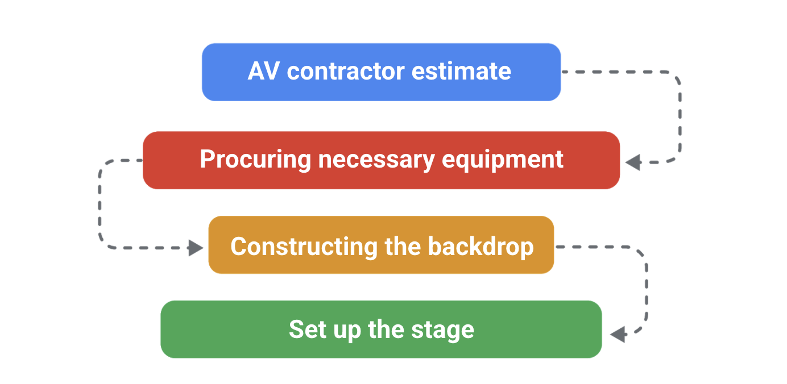
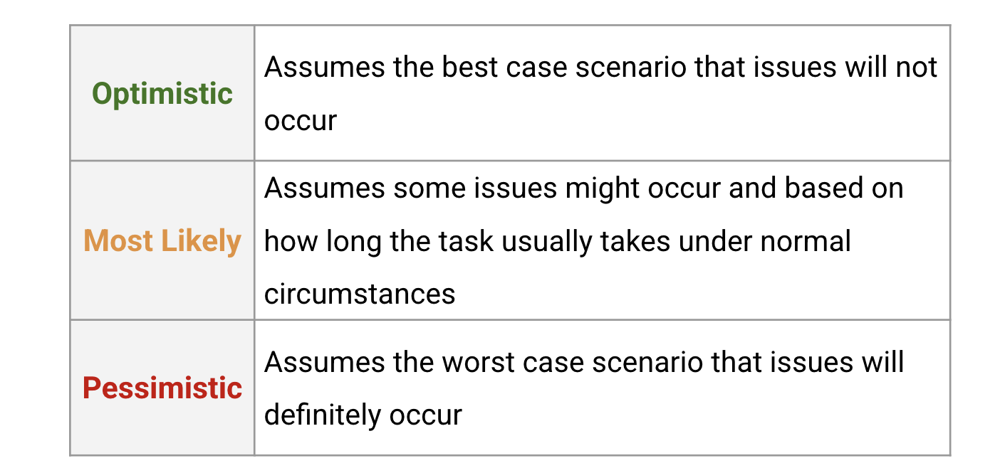
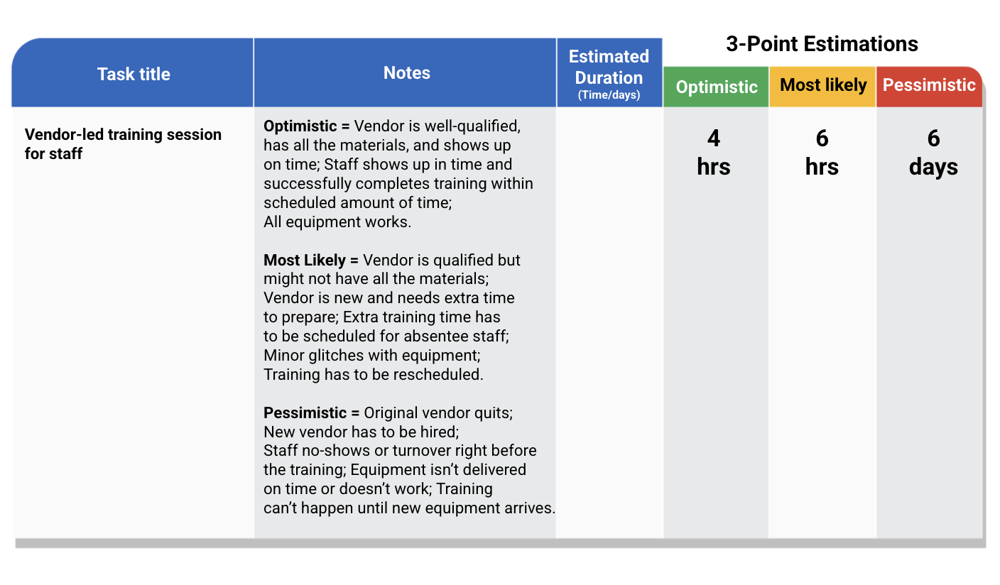
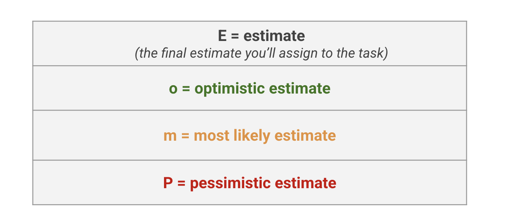
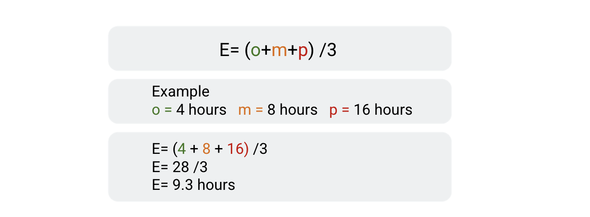

> Building out a project plan
>
> 构建出一个项目计划

You will examine project documentation, conduct online research, and analyze key conversations to identify tasks and milestones and then document and prioritize them in a project plan.

> 您将检查项目文档，进行在线研究，并分析关键对话，以确定任务和里程碑，然后在项目计划中记录并优先考虑它们。

You will also demonstrate effective communication techniques for making accurate time estimates for project tasks.

> 您还将演示有效的沟通技巧，以便为项目任务做出准确的时间估计。

**学习目标**

- Examine project documentation, conduct online research, and analyze key conversations to identify tasks for a project.

	> 检查项目文档，进行在线研究，并分析关键对话，以确定项目的任务。

- Document, prioritize, and organize project tasks and milestones in a project plan.

	> 在项目计划中记录、排序和组织项目任务和里程碑。

- Apply different techniques for determining time estimates and add confidence-置信度 ratings-等级,级别.

	> 应用不同的技术来确定时间估计并添加置信度评级。

- Recognize effective strategies for negotiating with empathy to develop accurate time estimates.

	> 认识到与同理心谈判的有效策略，以制定准确的时间估计。

# Identifying tasks and milestones

> 确定任务和里程碑

## Introduction: Building out a project plan

> 引言：制定项目计划

Welcome back.

So far, you should have completed a project charter for Sauce and Spoon's tablet rollout.

> 到目前为止，您应该已经完成了 Sauce and Spoon 平板电脑推出的项目章程。

The project charter helps you organize vital project information, create a framework for the work that needs to be done, and communicate those details to the necessary people.

> 项目章程帮助您组织重要的项目信息，为需要完成的工作创建一个框架，并将这些细节传达给必要的人员。

Once the project charter is created and confirmed, you'll use it to start the project planning stage.

> 一旦创建并确认了项目章程，您将使用它开始项目规划阶段。

In the upcoming activities, we'll be progressing from the initiation phase of the project life cycle to the planning phase.

> 在接下来的活动中，我们将从项目生命周期的启动阶段进入计划阶段。

Here, you'll put your knowledge and skills to work on a project plan, which is the central artifact a project manager builds during the planning phase.

> 在这里，您将把您的知识和技能用于项目计划，这是项目经理在计划阶段构建的中心工件。

Most projects capture-捕获 requirements in this artifact.

> 大多数项目在此构件中捕获需求。

The project plan you build for Sauce and Spoon will be a critical part of your project management portfolio.

> 您为 Sauce and Spoon 构建的项目计划将是您的项目管理组合的关键部分。

It will demonstrate your ability to break a large project into a set of achievable, smaller tasks.

> 它将展示你将一个大项目分解成一系列可实现的小任务的能力。

---

Before we get started, let's review the project scenario.

> 在开始之前，让我们回顾一下项目场景。

Sauce and Spoon is a small but growing chain of restaurants with five locations.

> Sauce and Spoon 是一家拥有五家分店的小型但正在成长中的连锁餐厅。

They've hired Peta as their first in-house project manager to launch the pilot of tabletop tablet menus at two of their locations. 

> 他们已经聘请Peta作为他们的第一个内部项目经理，在他们的两个地方推出桌面平板电脑菜单试点。

Throughout the course, you'll observe Peta as she works to complete this project in-scope, on time, and within budget.

> 在整个过程中，你会观察Peta，因为她的工作，以完成这个项目的范围内，按时，并在预算范围内。

You'll create project management documents based on the scenario, just as you would if you were the project manager.

> 您将根据场景创建项目管理文档，就像您是项目经理时所做的那样。

As you work through these materials, you may want to take notes about project details in order to complete some of the activities.

> 当你阅读这些材料时，你可能想要记录项目细节，以便完成一些活动。

The project management documents you create will help you practice your skills by applying them to a real-world scenario.

> 您创建的项目管理文档将通过将其应用于实际场景来帮助您练习技能。

These documents will also provide you with a portfolio to speak to during a future job interview.

> 这些文件也将为你在未来的工作面试中提供一个作品集。

In the next group of activities, you'll analyze conversations, emails, and other forms of documentation to build out a project plan. 

> 在下一组活动中，您将分析对话、电子邮件和其他形式的文档，以构建项目计划。

As you continue on, you'll identify tasks and milestones within the Sauce and Spoon tablet rollout.

> 在继续学习的过程中，您将确定Sauce and Spoon平板电脑推出中的任务和里程碑。

You'll also demonstrate effective communication techniques, like asking the right questions and practicing empathy, which will help you make accurate time estimates for each task.

> 你还将展示有效的沟通技巧，比如问正确的问题和练习同理心，这将帮助你对每项任务做出准确的时间估计。

Ready to get started?

Meet me in the next video.

## Identifying project tasks: Analyzing documentation

> 确定项目任务：分析文档

Hi there.

In this video, you'll learn to analyze project documentation, including documents from previous projects, to identify tasks for a new project.

> 在本视频中，您将学习分析项目文档，包括以前项目的文档，以确定新项目的任务。

This documentation includes project charters, emails, and old project plans which a business may have available when you join a new organization or switch to a new project.

> 此文档包括项目章程、电子邮件和旧项目计划，当您加入新组织或切换到新项目时，企业可能会提供这些文件。

Then, in the upcoming activity, you'll begin building the project plan for Sauce and Spoon's tablet rollout by adding project tasks to a spreadsheet that will serve as your project plan.

> 然后，在接下来的活动中，您将开始通过将项目任务添加到将作为您的项目计划的电子表格中，为Sauce and Spoon的平板电脑推出构建项目计划。

I recommend that you use the provided project plan template to start your document, but you're also welcome to create your own spreadsheet or use your preferred project management software.

> 我建议您使用所提供的项目计划模板来开始您的文档，但也欢迎您创建自己的电子表格或使用您首选的项目管理软件。

---

Let's get started.

First, we'll review the purpose and function of a project plan.

> 首先，我们将回顾项目计划的目的和功能。

A project plan is useful for any project, big or small, since it helps you document the scope, tasks, milestones, budget, and overall activities in order to keep the project on track.

> 项目计划对任何项目都很有用，无论大小，因为它可以帮助您记录范围，任务，里程碑，预算和总体活动，以保持项目的轨道。

At the center of the project plan is the project schedule.

> 项目计划的核心是项目进度。

The schedule is your guide for making time estimates for project tasks, determining milestones, and monitoring the overall progress of the project.

> 进度表是您对项目任务进行时间估计、确定里程碑和监控项目整体进度的指南。

One of your main jobs as a project manager is to identify all of the project tasks, estimate how much time each task will take, and track each task's progress.

> 作为项目经理，您的主要工作之一是确定所有的项目任务，估计每个任务将花费多少时间，并跟踪每个任务的进度。

So how do you go about adding tasks and milestones to the plan for the very first time?

> 那么，你第一次在计划中添加任务和里程碑时该怎么做呢?

The first thing I do is review the goals and deliverables in the project charter.

> 我做的第一件事是回顾项目章程中的目标和可交付成果。

Then, I make a list of all the items that have tasks or milestones associated with them.

> 然后，我列出所有与任务或里程碑相关的项目。

As a reminder, milestones are important points within the schedule that indicate progress.

> 作为提醒，里程碑是时间表中指示进度的重要点。

They usually signify the completion of a deliverable or phase of the project.

> 它们通常表示项目的可交付成果或阶段的完成。

And project tasks refer to activities that need to be accomplished within a set period of time.

> 项目任务是指需要在规定的时间内完成的活动。

They're assigned to different members of the team according to each person's role and skills.

> 根据每个人的角色和技能，他们被分配给团队的不同成员。

In order to reach a milestone, you and your team must complete certain tasks.

> 为了达到一个里程碑，你和你的团队必须完成某些任务。

For example, one of the deliverables of the Sauce and Spoon project is promoting-推广,促销 the new tablet menus with table signs and email blasts.

> 例如，Sauce and Spoon项目的成果之一就是通过桌子标志和电子邮件来推广新的平板电脑菜单。

In this instance, a milestone could be the completion of this deliverable, which would include all of the tasks that are required for getting sign offs on the final versions of the marketing materials and confirming the dates of the email blasts.

> 在这种情况下，里程碑可以是完成这个可交付的成果，它将包括所有的任务，这些任务需要在营销材料的最终版本上签字，并确认电子邮件爆炸的日期。

Some of these tasks would include writing multiple drafts of the different marketing materials, generating an email list, and programming the emails to be sent on the correct dates.

> 其中一些任务包括为不同的营销材料撰写多个草稿，生成电子邮件列表，并编写在正确日期发送的电子邮件。

For each deliverable, ask yourself: What steps do we need to take in order to achieve this?

> 对于每一个可交付的成果，问自己:为了实现这一目标，我们需要采取哪些步骤?

The steps will become the individual tasks that need to be completed.

> 这些步骤将成为需要完成的单个任务。

Let's turn our attention to another deliverable for Sauce and Spoon: the implementation of a post-dining-餐后 survey to assess customer satisfaction.

> 让我们把注意力转向Sauce and Spoon的另一个可交付产品:餐后调查的实施，以评估客户满意度。

What steps do you need to take in order to achieve this deliverable?

> 你需要采取哪些步骤来实现这个可交付成果?

You might need to assign a team member to develop a survey.

> 您可能需要指派一名团队成员来进行调查。

You'll also need to determine how you'll deliver the survey and create a process for carrying it out.

> 您还需要确定如何交付调查，并创建执行过程。

These are just a couple of examples of the many tasks you'll need to complete in order to achieve the deliverable.

> 这些只是你需要完成的许多任务中的几个例子，以实现可交付的成果。

It's your job to help uncover the rest of the tasks.

> 你的工作是帮助发现剩下的任务。

How do you uncover more tasks?

> 你如何发现更多的任务?

**In addition to**-除了…之外 the project charter, there are other common forms of documentation that can help you identify tasks.

> 除了项目章程之外，还有其他常见形式的文档可以帮助您确定任务。

For example, you might ask your stakeholders or colleagues to share emails or an older project plan for a similar project.

> 例如，您可能会要求您的涉众或同事共享电子邮件或类似项目的旧项目计划。

Let's discuss how these might be useful as you build your list of tasks.

> 让我们来讨论一下，在构建任务列表时，这些功能是如何发挥作用的。

Emails that relate to the project can provide lots of helpful information for you to pull tasks from.

> 与项目相关的电子邮件可以为你提供很多有用的信息，让你从中提取任务。

Since so much communication in the workplace happens over email, ask to have relevant emails that contained discussions about the project's details forwarded-转发 to you.

> 由于工作中有很多沟通都是通过电子邮件进行的，所以要求将包含项目细节讨论的相关电子邮件转发给你。

These emails can help you uncover tasks, and they can also help you identify team members to connect with further if you have additional questions.

> 这些邮件可以帮助你发现任务，如果你有其他问题，它们还可以帮助你确定团队成员，以便进一步联系。

---

It's also helpful to review an older project plan for a similar initiative-计划,措施,倡议 to find out what kind of tasks were included.

> 回顾一个类似计划的旧项目计划，找出包括了哪些类型的任务，也是有帮助的。

For example, if you are a project manager tasked with launching a new product, you might ask a colleague with experience launching other products for the same company to share their project plan as an example.

> 例如，如果您是负责发布新产品的项目经理，您可能会要求在同一公司发布其他产品的经验丰富的同事分享他们的项目计划作为示例。

Or, if your project includes some construction-建筑,结构 work, you might ask colleagues about unrelated projects that also had construction components.

> 或者，如果您的项目包括一些建筑工作，您可能会向同事询问同样具有建筑组件的不相关项目。

Previous project plans can provide helpful inspiration as you create your own list of tasks.

> 以前的项目计划可以为您创建自己的任务列表提供有用的灵感。

They can also help you identify possible task durations-持续,持续时间, subject matter experts, and even suppliers-供应商,供应者 that may be helpful to your project.

> 他们还可以帮助您确定可能的任务持续时间、主题专家，甚至可能对您的项目有帮助的供应商。

As you review project documentation, take note of information that suggests other tasks your team will need to complete in order to execute on project deliverables.

> 当您查看项目文档时，请注意建议您的团队需要完成其他任务以执行项目可交付成果的信息。

During this process, ask yourself questions like: Is there a large task being worked on by many people that could be broken into smaller tasks assigned to individuals?

> 在这个过程中，问自己这样的问题:是否有一项由许多人共同完成的大任务，可以分解成更小的任务分配给个人?

Are there signals that imply-暗示,暗指 prior tasks need to be completed first?

> 是否存在暗示需要先完成先前任务的信号?

For example, a deliverable like "install tablets" might imply selecting a tablet vendor as a prior task.

> 例如，像“安装平板电脑”这样的可交付内容可能意味着将选择平板电脑供应商作为优先任务。

---

Great!

We've covered a lot in this video, so let's review.

The project plan helps document the scope, tasks, milestones, budget, and overall activities in order to keep the project on track. 

> 项目计划有助于记录范围、任务、里程碑、预算和总体活动，以便保持项目的轨道。

To add tasks to your plan, search for useful information from existing project documentation, such as the project charter, email threads, and old project plans from a similar project.

> 若要向计划中添加任务，请从现有项目文档(如项目章程、电子邮件线程和类似项目的旧项目计划)中搜索有用信息。

As you review project documentation, take note of information that suggests additional tasks and milestones that your team will need to complete in order to meet project deliverables.

> 当您查看项目文档时，请注意建议您的团队为满足项目可交付成果而需要完成的额外任务和里程碑的信息。

Great!

In the next activity, you'll review the supporting materials to start building the Sauce and Spoon project plan.

> 在下一个活动中，您将回顾开始构建酱勺项目计划的支持材料。

Once you're finished, I'll meet you in the next video.

## Tips for defining project tasks

> 定义项目任务的提示

The process of identifying project tasks and defining them is one that requires-需要,要求做 practice.

> 确定项目任务并定义它们的过程需要实践。

Breaking tasks down into workable parts is challenging because you have to decide which tasks may require additional subtasks and which tasks do not.

> 将任务分解为可操作的部分是具有挑战性的，因为您必须决定哪些任务可能需要额外的子任务，哪些任务不需要。

For instance, if you are managing a cross-country-越野的 move, you do not need to break down the task of unloading-卸货 boxes from the car into which box should be moved first.

> 例如，如果您正在管理一次越野移动，您不需要将从汽车上卸下箱子的任务分解到应该首先移动的箱子中。

However, you may need to break down the movers’ tasks into smaller, more detailed steps.

> 但是，您可能需要将搬运工的任务分解为更小、更详细的步骤。

As you progress in your career, you will get better at breaking tasks down.

> 随着你在事业上的进步，你会越来越擅长分解任务。

In the interim-过渡期,中间期, here are some guidelines to help you improve this very important project management skill. 

> 在此期间，这里有一些指导方针可以帮助您提高这项非常重要的项目管理技能。

**Define project tasks in one or two sentences**

> 用一两句话定义项目任务

When writing descriptions of project tasks, keep them to one or two sentences long.

> 当写项目任务的描述时，把它们控制在一到两句话之内。

If you find that a certain task description needs to be longer than one or two sentences, this indicates that the task is complex and could be broken down into smaller tasks or that it may need further clarification.

> 如果你发现某个任务的描述需要超过一两句话，这表明这个任务很复杂，可以分解成更小的任务，或者可能需要进一步澄清。

**Look at project task dependencies**

> 查看项目任务依赖关系

When looking at how you might break certain parts of the project down into tasks, consider task **dependencies**, or what has to be completed or handed off from one person to another before work on each task can begin.

> 当考虑如何将项目的某些部分分解成任务时，请考虑任务的依赖性，或者在每个任务开始工作之前必须完成或移交给另一个人的内容。

Identifying dependencies can help you decide how much a task needs to be broken down.

> 确定依赖关系可以帮助您决定需要分解多少任务。

For instance, if you are managing a project that includes an awards-授予,颁发 ceremony-仪式,典礼 and one of the tasks is to set up the stage-舞台, the dependencies for this task could include getting estimates from an audiovisual-视听的 (AV) contractor-承包商,立约人, procuring necessary equipment, and constructing the stage backdrop-背景.

> 例如，如果您正在管理一个包括颁奖典礼的项目，其中一项任务是设置舞台，则该任务的依赖项可能包括从视听(AV)承包商处获得估算、采购必要的设备和构建舞台背景。

**Enlist-争取,谋取 help from team members**

> 寻求团队成员的帮助

It is often helpful for your team to be involved in the task breakdown process.

> 让你的团队参与到任务分解过程中通常是有帮助的。

You might have a meeting where you discuss each broad goal or major task with the team.

> 你可能会召开会议，与团队讨论每个大目标或主要任务。

This way, team members can present varying perspectives as they work together to break down tasks.

> 通过这种方式，团队成员可以在一起工作以分解任务时呈现不同的观点。

For example, if someone on your team has had experience on a similar project, they may suggest a certain task actually be broken down into three different tasks. 

> 例如，如果你的团队中有人有过类似项目的经验，他们可能会建议将某个任务分解为三个不同的任务。

**Define project tasks by the amount of time they will take to complete**

> 根据完成任务所需的时间来定义项目任务

Defining project tasks by the amount of time they’re expected to take will reveal-揭示,透露 any especially lengthy tasks.

> 通过预计花费的时间来定义项目任务将揭示任何特别冗长的任务。

If a task is expected to take a long time, it could indicate that there are additional subtasks that need to be defined.

> 如果一个任务预计将花费很长时间，则可能表明需要定义额外的子任务。

Identifying tasks by time is helpful for scheduling other tasks or events around the longer tasks.

> 按时间确定任务有助于围绕较长的任务安排其他任务或事件。

This strategy also helps you determine appropriate milestones, as milestones are often the culmination-终点,高潮 of a series of tasks. 

> 此策略还可以帮助您确定适当的里程碑，因为里程碑通常是一系列任务的高潮。

Acknowledging the completion of a large and lengthy task is also a great way to celebrate success, learn from the process, and keep the project on track.

> 承认完成了一项庞大而漫长的任务也是庆祝成功、从过程中学习和保持项目正轨的好方法。

**Identify project tasks by their “done” factors**

> 根据“已完成”的因素确定项目任务

Begin with the end in mind: What does it mean for the task to be considered “done”?

以终为始:任务被认为“完成”意味着什么?

From there, you can work backwards-向后,倒转 to see if you’ve missed any steps and identify checkpoints for completion along the way. 

> 从那里，您可以向后工作，看看您是否错过了任何步骤，并在此过程中确定完成的检查点。

## Identifying project tasks: Conducting online research

> 确定项目任务:进行在线研究

Welcome back!

By now, you should have analyzed existing project documentation to identify a list of tasks related to the Sauce and Spoon tablet pilot.

> 到目前为止，您应该已经分析了现有的项目文档，以确定与Sauce and Spoon平板试验相关的任务列表。

In this video, I'll share a few tips for conducting online research, which is a helpful strategy for gathering domain knowledge. 

> 在这个视频中，我将分享一些进行在线研究的技巧，这是收集领域知识的有用策略。

Domain knowledge refers to knowledge of a specific industry, topic, or activity.

> 领域知识是指特定行业、主题或活动的知识。

If you're unfamiliar with a new project's domain, then analyzing supporting project documentation will help you broaden-增长,变宽 your knowledge.

> 如果您不熟悉新项目的领域，那么分析支持性项目文档将帮助您扩展知识。

There will be times throughout your career when you'll be new to an organization or industry.

> 在你的职业生涯中，有时你会对一个组织或行业感到陌生。

You might be assigned to a project that's unlike anything you've ever managed before, and that's okay.

> 你可能会被分配到一个不同于你以前管理过的项目，这没关系。

New challenges can be a really exciting part of the job.

> 新的挑战是工作中令人兴奋的一部分。

So how do you identify tasks and monitor progress for a project or industry that you're not familiar with?

> 那么，对于一个你不熟悉的项目或行业，你是如何确定任务并监控进度的呢?

Another key to success when working on an unfamiliar project is knowing where to find useful information that can help you increase your domain knowledge.

> 在一个不熟悉的项目上工作时，成功的另一个关键是知道在哪里可以找到有用的信息，这些信息可以帮助你增加你的领域知识。

---

Here's an example.

Let's say you've been hired to manage projects in the private banking industry.

> 假设你被雇佣来管理私人银行业的项目。

In order to successfully manage these projects, you'll need a basic understanding of how private banking works.

> 为了成功地管理这些项目，你需要对私人银行业务如何运作有一个基本的了解。

This includes things like how clients open accounts, back office operations, and how trade confirmations are verified.

> 这包括客户如何开立账户、后台操作以及如何验证交易确认。

And, in the case of Sauce and Spoon, you'll need a base level understanding of the restaurant industry, some of which you've already come across during this course, like knowing about guest averages and table turn times.

> 而且，在 Sauce and Spoon 的情况下，你需要对餐饮业有一个基本的了解，其中一些你在本课程中已经遇到过，比如了解客人的平均水平和桌子轮换时间。

Again, you don't need to be an expert on your project, but becoming more familiar with different industries and types of projects is a valuable skill that demonstrates your versatility-多功能性,多才多艺.

> 同样，你不需要成为你项目的专家，但熟悉不同的行业和项目类型是一项有价值的技能，可以展示你的多功能性。

Having industry knowledge can also save you time on future projects within that industry, since you won't have to ask as many questions or do as much research.

> 拥有行业知识还可以为你在该行业的未来项目节省时间，因为你不必问那么多问题或做那么多研究。

That said, if you're new to an industry or organization, no one will expect you to have all the answers right away.

> 也就是说，如果你是一个行业或组织的新手，没有人会指望你马上得到所有的答案。

One way to help build up your domain knowledge when you get started with project planning is through online research.

> 当你开始进行项目规划时，一个帮助你建立领域知识的方法是通过在线研究。

Online research can help increase your knowledge of industry terms, techniques, processes, and more, all of which can be helpful as you embark-着手,开始 on a new project.

> 在线研究可以帮助你增加对行业术语、技术、流程等方面的知识，所有这些都对你开始一个新项目有帮助。

This allows you to read up on how other organizations have managed similar projects.

> 这可以让你了解其他组织是如何管理类似项目的。

It's also an opportunity to draw inspiration-灵感,启发 from their successes and to learn from their mistakes.

> 这也是一个从成功中汲取灵感，从错误中吸取教训的机会。

---

So what should you be aiming for as you do research for a given project?

> 那么，当你为一个给定的项目做研究时，你的目标应该是什么?

Let's go over a few tips that can help you get started.

> 让我们回顾一些可以帮助你开始的建议。

First, try searching online for news coverage-新闻报道 of similar projects at other companies.

> 首先，试着在网上搜索其他公司类似项目的新闻报道。

For example, you might search for news articles that focus on restaurant groups who've added tablet ordering capabilities to their restaurant locations.

> 例如，你可能会搜索有关餐厅集团的新闻文章，这些餐厅集团在其餐厅位置添加了平板电脑点餐功能。

Experiment-尝试,实践,实验 with search terms like "menu tablet news" or "restaurant tablet news" to find relevant news articles.

> 尝试使用“菜单平板电脑新闻”或“餐厅平板电脑新闻”等搜索词来查找相关的新闻文章。

As you read, take notes on interesting findings.

> 阅读时，记下有趣的发现。

Did the company experience any surprising outcomes following their product's launch?

> 在他们的产品发布之后，公司有没有遇到什么令人惊讶的结果?

Did they come across any unanticipated-意料之外的 roadblocks-障碍,路障,障碍物?

> 他们有没有遇到任何意想不到的障碍?

If so, make note of these, and decide if there are tasks that you should add to your project in order to achieve similar results or to avoid similar roadblocks.

> 如果是这样，请记下这些，并决定是否应该将这些任务添加到项目中，以实现类似的结果或避免类似的障碍。

Identifying where similar successes or mistakes might play out in your own project can help you uncover tasks that you may have otherwise-除此以外 overlooked-忽视,忽略.

> 识别在你自己的项目中可能出现的类似成功或错误可以帮助你发现你可能忽略的任务。

It's also helpful to search online for research on topics related to your project.

> 在网上搜索与你的项目相关的研究也很有帮助。

For example, you might search for phrases like "restaurant tablet research" or "digital menu ordering."

> 例如，你可能会搜索“餐厅平板电脑研究”或“数字菜单订购”这样的短语。

Adding search tags like "best practices" or "key takeaways" can help streamline your search results.

> 添加诸如“最佳实践”或“关键要点”之类的搜索标签可以帮助简化搜索结果。

Then, you can review the relevant research for information that might help inform your project planning.

> 然后，你可以回顾相关的研究信息，可能有助于告知你的项目计划。

You could also try researching similar projects in other industries.

> 你也可以尝试研究其他行业的类似项目。

This can be especially helpful when you're new to a project or industry.

> 当你刚接触一个项目或行业时，这一点尤其有用。

For example, even-甚至,即使 though-虽然,尽管 your project may center around tablet usage in a restaurant setting, you can also learn about the installation process from research on tablet usage in similar settings, like retail stores or coffee shops.

> 例如，即使你的项目可能围绕着平板电脑在餐厅的使用情况展开，你也可以通过研究类似环境(如零售店或咖啡店)的平板电脑使用情况来了解安装过程。

The details will be different, but similar projects in other industries can be a helpful source of ideas.

> 细节会有所不同，但其他行业的类似项目可能是一个有用的想法来源。

Once you've done some initial online research, review the list of tasks that you've identified so far and research the specifics-细节,详情 of executing that work.

> 一旦你在网上做了一些初步的研究，回顾一下到目前为止你已经确定的任务列表，研究一下执行这项工作的细节。

For example, maybe one of the tasks on your list is choosing the tablet model-型号 that you'll ultimately install in the restaurants.

> 例如，也许你的任务之一是选择你最终将在餐厅安装的平板电脑型号。

Are there any smaller sub-tasks your team will need to complete to decide on a tablet model?

> 你的团队是否需要完成更小的子任务来决定平板电脑模式?

Searching online can help to uncover any additional tasks you'll need to account for-解决,处理.

> 在线搜索可以帮助你发现任何你需要考虑的额外任务。

---

Well done!

Let's recap what we learned in this video.

> 让我们回顾一下这个视频。

Online research can help you increase your domain knowledge of industry terms, techniques, processes, and more.

> 在线研究可以帮助你增加对行业术语、技术、流程等领域的知识。

When you conduct your online research, keep the following tips in mind.

> 当你进行在线调查时，请记住以下提示。

Search for news articles about similar projects in other companies.

> 搜索其他公司类似项目的新闻报道。

Research similar projects in other industries.

> 研究其他行业的类似项目。

And finally, review your list of tasks and research the specifics of executing that work.

> 最后，回顾一下你的任务清单，研究一下执行任务的细节。

Ready to get started?

Head over to the next activity, where you'll perform online research to identify more tasks and milestones for the Sauce and Spoon tablet rollout.

> 前往下一个活动，在那里你将执行在线研究，以确定更多的任务和里程碑的 Sauce and Spoon 平板电脑的推出。

I'll meet you in the next video.

## Identifying project tasks: Analyzing key conversations

> 确定项目任务:分析关键对话

Welcome back.

In the last video, I shared some tips for conducting online research to help improve your domain knowledge and discover tasks to add to your project plan.

> 在上一个视频中，我分享了一些进行在线研究的技巧，以帮助提高您的领域知识并发现要添加到项目计划中的任务。

In this video, you'll learn how to identify more tasks by analyzing key conversations related to the project.

> 在本视频中，您将学习如何通过分析与项目相关的关键对话来识别更多任务。

The Sauce and Spoon project is fairly-相当地,颇,公平地 complex and will result in a project plan with many tasks.

> Sauce and Spoon项目相当复杂，会产生一个包含许多任务的项目计划。

Populating-输入数据,充满 your plan with a set of tasks can indicate to future employers that you're able to identify key areas of work based on documentation, research, conversations, and more.

> 用一系列任务填充你的计划可以向未来的雇主表明，你能够根据文件、研究、对话等来确定工作的关键领域。

It can also demonstrate that you're able to synthesize-综合,结合 these tasks into a single, organized document, which is a critical part of project management.

> 它还可以证明您能够将这些任务综合到一个单独的、有组织的文档中，这是项目管理的关键部分。

Reviewing project documentation and researching your project online can help you identify tasks, but that won't tell you everything you need to know.

> 查看项目文档和在线研究项目可以帮助你确定任务，但这并不能告诉你需要知道的一切。

Discussions with other people working on the project, from stakeholders to team members, can help you uncover tasks that you're still missing or clarify the smaller subtasks.

> 与项目中的其他人进行讨论，从涉众到团队成员，可以帮助您发现您仍然遗漏的任务或澄清较小的子任务。

---

Let's start with tips for identifying tasks through group conversations with members of your project team.

> 让我们从通过与项目团队成员的小组对话来确定任务的提示开始。

One way to discover more tasks is to hold a group brainstorm session with team members who will likely work on those tasks. 

> 发现更多任务的一种方法是与可能从事这些任务的团队成员举行集体头脑风暴会议。

For example, Peta might meet with the Sauce and Spoon project team to brainstorm potential challenges that the waitstaff-服务人员 and guests might have with the tablets.

> 例如，Peta可能会与Sauce and Spoon项目团队会面，集思广益，讨论服务员和客人在使用平板电脑时可能遇到的潜在挑战。

Discussing these as a group can help identify ideas for tasks that may have been overlooked.

> 作为一个小组来讨论这些问题可以帮助我们找出可能被忽视的任务的想法。

Another way to discover tasks is to hold one-on-one conversations with team members about tasks they'll likely be responsible for completing.

> 发现任务的另一种方法是与团队成员进行一对一的对话，讨论他们可能负责完成的任务。

For example, you might have a discussion with a vendor who specializes in training restaurant employees to determine how to prepare for the training, or you might reach-与…联系 out to a graphic designer to discuss creating new marketing materials.

> 例如，您可能会与专门培训餐厅员工的供应商进行讨论，以确定如何准备培训，或者您可能会与图形设计师联系，讨论如何创建新的营销材料。

Your team, outside vendors, and company executives have specific expertise and job experience that gives them a deeper understanding of the work required to complete tasks or reach milestones.

> 您的团队、外部供应商和公司高管拥有特定的专业知识和工作经验，使他们对完成任务或达到里程碑所需的工作有更深入的了解。

Through conversations with teammates, you might learn that certain tasks are more complex than you assumed, or that you're missing a key step of a given process.

> 通过与队友的对话，您可能会了解到某些任务比您想象的要复杂，或者您错过了给定流程的关键步骤。

In this case, leverage-充分利用,影响力,手段 the expertise of your teammates to discover what you don't know and to fill in gaps in your list of tasks.

> 在这种情况下，利用队友的专业知识来发现您不知道的内容，并填补任务列表中的空白。

In addition to connecting with teammates to uncover project tasks, it may also be helpful to consult with other people in your organization who are experts on given tasks.

> 除了与团队成员联系以发现项目任务之外，与组织中对给定任务具有专业知识的其他人进行咨询也会有所帮助。

Though these people may not be involved in your project, they may be able to provide valuable expertise that can help you identify processes and fill in gaps.

> 虽然这些人可能不参与您的项目，但他们可能能够提供有价值的专业知识，帮助您确定过程并填补空白。

Once you've connected with members of your project team and other experts in your organization, examine your list of tasks. 

> 一旦你与项目团队成员和组织中的其他专家建立了联系，检查一下你的任务清单。

Are there still areas where you need more information?

> 还有什么地方需要更多的信息吗?

If so, it may be helpful to have a conversation with your key stakeholders to fill in any gaps.

> 如果是这样的话，与你的关键利益相关者进行一次对话来填补任何空白可能会有所帮助。

As we've discussed, senior stakeholders are often busy with other aspects of their jobs, so you should be strategic about who to ask for a conversation.

> 正如我们所讨论的，高级利益相关者经常忙于他们工作的其他方面，所以你应该有策略地找谁谈话。

Stakeholders who have high- or medium-level interest or influence in the project are most likely to provide the information you need.

> 对项目有高级或中级兴趣或影响的干系人最有可能提供您需要的信息。

Some examples include stakeholders who are subject matter experts and those who are directly affected by the outcome of the project, like your team's leadership.

> 一些例子包括作为主题专家的涉众和直接受项目结果影响的涉众，比如你的团队领导。

You can refer back to your stakeholder analysis for help deciding who would be best to connect with.

> 你可以参考你的利益相关者分析来帮助你决定谁是最好的联系对象。

Once you've identified which stakeholders would be most helpful, make sure you're prepared by gathering as much information as possible ahead of your conversation and outlining clear outstanding-突出的,未解决的 questions that you still need answers to.

> 一旦你确定了哪些利益相关者最有帮助，确保你准备好了在谈话前收集尽可能多的信息，并明确列出你仍然需要回答的突出问题。

During the conversation, present your research and your current list of tasks and explain exactly how they can help you move forward.

> 在谈话中，展示你的研究和你当前的任务清单，并准确地解释它们如何帮助你前进。

This will give your stakeholder a clear picture of what you've accomplished so far and help them to identify gaps or missing tasks that are required to achieve your goal.

> 这将使你的利益相关者清楚地了解到目前为止你已经完成了什么，并帮助他们确定实现目标所需的差距或缺失的任务。

Ample-充足的,充裕的 preparation helps ensure that you can get the information you need while respecting the limited time of your stakeholders.

> 充分的准备有助于确保您在尊重涉众有限时间的情况下获得所需的信息。

Keep in mind that conversations you have about project tasks will often contain more details and information than you need to create a thorough-彻底的,全面的 list, but you may want to note some of this extra information since it may be useful later in the project.

> 请记住，关于项目任务的对话通常会包含比创建一个完整列表所需的更多细节和信息，但是您可能需要注意一些额外的信息，因为它可能在项目的后期有用。

Each task on your list should be detailed enough that you'll be able to check in on progress and identify problems early on, but not so detailed that you're endlessly-不断地,无穷尽地 revising-修改,修订 your project plan and burdening-负担,负荷 your team with the need to update you constantly-经常地,不断地 on their work.

> 你清单上的每项任务都应该足够详细，这样你就可以尽早检查进度并发现问题，但也不要太详细，否则你就会无休止地修改项目计划，给团队带来负担，让他们需要不断地向你汇报他们的工作情况。

The right level of detail to include in your task list will vary from project to project and team to team.

> 任务列表中包含的正确详细级别因项目和团队而异。

Striking the right balance is a skill you'll develop over the course of your career.

> 保持适当的平衡是你在职业生涯中需要培养的技能。

---

Let's do a quick recap.

Discussions with other people working on the project can help you uncover missing tasks or clarify smaller subtasks.

> 与其他从事该项目的人进行讨论可以帮助您发现遗漏的任务或澄清较小的子任务。

Some ways to uncover tasks include brainstorming with team members assigned to similar or related tasks.

> 发现任务的一些方法包括与分配到类似或相关任务的团队成员进行头脑风暴。

Holding one-on-one conversations with team members about tasks, consulting with other people in your organization who are experts on given tasks, and having conversations with stakeholders.

> 与团队成员就任务进行一对一的对话，与组织中擅长特定任务的其他人员进行磋商，并与涉众进行对话。

The right level of detail to include in your task list will vary from project to project and team to team.

> 任务列表中包含的正确详细级别因项目和团队而异。

As a project manager, a key part of your role is identifying the right level of detail and then synthesizing-综合,结合 it into a clear, concise-简明的,简洁的 list of tasks in the project plan.

> 作为一个项目经理，你的角色的一个关键部分是确定适当的细节级别，然后将其综合成一个清晰，简洁的项目计划任务列表。

In the upcoming activity, you'll review the supporting materials to uncover more task details and add them to the Sauce and Spoon project plan.

> 在接下来的活动中，您将回顾支持材料以发现更多任务细节，并将其添加到酱勺项目计划中。

**Head to**-前往 the activity to get started, and then meet me in the next video.

> 前往活动开始，然后在下一个视频中与我见面。

## Ordering-安排 tasks and identifying milestones

>安排任务和确定里程碑

Welcome back.

So far you've identified and added tasks to your project plan.

> 到目前为止，您已经确定并将任务添加到项目计划中。

You've gathered information from relevant project documentation, online research, and other people on the project team.

> 您已经从相关的项目文档、在线研究和项目团队中的其他人那里收集了信息。

In this video, I'll discuss how to order your task list and share several techniques for identifying milestones.

> 在这个视频中，我将讨论如何排序你的任务列表，并分享几种确定里程碑的技术。

Maybe you've already identified a few milestones on your own.

> 也许你自己已经确定了一些里程碑。

These techniques will be helpful to keep in mind when you're working through the activity after this video.

> 这些技巧将有助于你在看完这段视频后进行练习。

---

Let's start with ordering your task list.

> 让我们从安排任务列表开始。

By now, you should have a long list of project tasks.

> 到目前为止，您应该有一个长长的项目任务列表。

To finalize-最后决定,敲定 the list, review what you have so far.

> 为了最终确定这个清单，回顾一下你目前所拥有的。

Check for any remaining-剩余,遗留 larger tasks that could still be broken down into smaller subtasks, and add those tasks to your list.

> 检查一下是否还有其他更大的任务可以分解成更小的子任务，并将这些任务添加到你的列表中。

When you think you've listed all the necessary project tasks in your project plan, the next step is to arrange-整理,排列 the tasks in the order that they need to be completed.

> 当你认为你已经在项目计划中列出了所有必要的项目任务时，下一步就是按照需要完成的顺序安排任务。

Determining the proper task order will help you assign start and end dates for each task.

> 确定适当的任务顺序将帮助您为每个任务分配开始和结束日期。

When determining priority, first consider the basic order of operations.

> 在确定优先级时，首先要考虑操作的基本顺序。

In other words, what is the natural sequence of tasks?

> 换句话说，任务的自然顺序是什么?

Are there any dependencies or prerequisites-先决条件?

> 是否有任何依赖关系或先决条件?

For example, you can't train staff on how to use the tablets before they've been installed and tested.

> 例如，在安装和测试平板电脑之前，你不能培训员工如何使用它们。

To help you order tasks, you can have a conversation with your team to uncover dependencies or prerequisites from each person who owns a task.

> 为了帮助您安排任务，您可以与团队进行对话，从拥有任务的每个人那里发现依赖关系或先决条件。

You might ask each person what needs to happen before they can start their work.

> 你可以问每个人在他们开始工作之前需要做些什么。

Similarly, you can search the internet for information with terms such as "prerequisites for launching new hardware-硬件."

> 类似地，您可以在internet上搜索包含“启动新硬件的先决条件”等术语的信息。

After you've thought-考虑,思考 through the order, adjust the tasks in your project plan to reflect this.

> 考虑完顺序后，调整项目计划中的任务以反映这一点。

To do this, simply rearrange-重新整理 the spreadsheet rows to set the order for your tasks.

> 要做到这一点，只需重新排列电子表格行，为您的任务设置顺序。

For example, the task of researching different models of menu tablets needs to happen before the task of signing a contract with the menu tablet supplier.

> 例如，研究不同型号的菜单平板电脑的任务需要发生在与菜单平板电脑供应商签订合同的任务之前。

Makes sense, right?

> 很有道理，对吧?

You probably wouldn't want to sign a contract with the supplier before you'd researched every possible option.

> 在你研究了所有可能的选择之前，你可能不想和供应商签订合同。

---

Once your tasks are in order, you'll begin identifying milestones.

> 一旦你的任务井然有序，你就会开始确定里程碑。

Remember that milestones are important points within the project schedule that indicate progress.

> 记住，里程碑是项目进度表中指示进度的重要点。

Milestones usually signify the completion of the deliverable or phase of the project.

> 里程碑通常表示项目的可交付成果或阶段的完成。

To determine milestones within your list of tasks, identify points in the project plan where you and your team can evaluate the work completed so far.

> 要确定任务列表中的里程碑，请在项目计划中确定您和您的团队可以评估到目前为止完成的工作的点。

For example, if there are multiple tasks related to menu tablet installation, a milestone might be the first internal test run of the tablet's ordering capabilities.

> 例如，如果有多个与菜单平板电脑安装相关的任务，那么里程碑可能是平板电脑订购功能的首次内部测试运行。

These types of milestones may be the same as some of the deliverables you listed earlier.

> 这些里程碑类型可能与您前面列出的一些可交付成果相同。

Another way to determine milestones is to identify important tasks that your stakeholders have a particular interest in.

> 确定里程碑的另一种方法是确定涉众特别感兴趣的重要任务。

To do this, review your notes from previous conversations with stakeholders, and identify tasks that stakeholders seemed eager to know more about or wanted to review when complete.

> 要做到这一点，回顾之前与涉众对话的记录，并确定涉众似乎渴望了解更多或想要在完成时回顾的任务。

If your stakeholder has a high interest in a given task or point in the project, label that task as a milestone.

> 如果您的涉众对项目中给定的任务或点非常感兴趣，请将该任务标记为里程碑。

For example, one of the Sauce and Spoon stakeholders might be interested in knowing when a tablet supplier has been selected since that decision will impact the budget.

> 例如，Sauce and Spoon的一个利益相关者可能想知道平板电脑供应商何时被选中，因为这个决定将影响预算。

As you review your list, you should also identify tasks that carry a high risk or signal the completion of a phase or major task. 

> 当你回顾你的清单时，你还应该确定哪些任务具有高风险，或者标志着某个阶段或主要任务的完成。

These tasks are often considered milestones because they have a major impact on the project's overall progress.

> 这些任务通常被认为是里程碑，因为它们对项目的整体进度有重大影响。

For example, the first successful test run of the menu tablet's ordering capabilities might be considered a milestone.

> 例如，菜单平板电脑的订购功能的首次成功测试可能被视为一个里程碑。

---

Amazing job.

> 惊人的工作

Let's review.

Once you've listed all of the necessary tasks in your project plan, you'll need to rearrange the tasks in the order in which your team needs to complete them.

> 一旦你在项目计划中列出了所有必要的任务，你就需要按照团队需要完成的顺序重新安排任务。

It's also important to consider the natural sequence of tasks, as well as the dependencies or prerequisites for each task.

> 考虑任务的自然顺序以及每个任务的依赖关系或先决条件也很重要。

Once your tasks are in order, you'll need to identify milestones.

> 一旦你的任务井然有序，你就需要确定里程碑。

When determining milestones, it's crucial to identify the points in the project plan where you can evaluate the work completed so far, identify the tasks that stakeholders have a particular interest in, and identify tasks that carry a high risk or signal the completion of a phase or major task.

> 在确定里程碑时，确定项目计划中可以评估到目前为止完成的工作的点是至关重要的，确定涉众特别感兴趣的任务，以及确定具有高风险或标志着阶段或主要任务完成的任务。

Okay, ready to get back into your project plan?

> 好了，准备好继续你的项目计划了吗?

Head to the next activity to reorder your list of project tasks and identify your project milestones.

> 转到下一个活动，重新排序项目任务列表并确定项目里程碑。

Then, meet me in the next video where I'll take you through adding time estimates to each task.

> 然后，在下一个视频中与我见面，我将带您了解如何为每个任务添加时间估计。

# Making accurate time estimates

## Time estimation: Asking the right questions

> 时间估计:问正确的问题

Hi again.

In the last few videos, you learned how to identify project tasks and milestones by analyzing project documents, conducting online research, and having conversations with teammates, stakeholders, and subject matter experts.

> 在前几个视频中，您学习了如何通过分析项目文档、进行在线研究以及与团队成员、利益相关者和主题专家进行对话来确定项目任务和里程碑。

In this video, I'll review some strategies for getting accurate time estimates for your tasks and milestones.

> 在这个视频中，我将回顾一些为你的任务和里程碑准确估计时间的策略。

Then, in the upcoming activities, you'll analyze supporting materials and apply strategic thinking to get estimates for the Sauce and Spoon tablet project.

> 然后，在接下来的活动中，您将分析支持材料并应用战略思维来获得 Sauce and Spoon 平板电脑项目的估算。

---

Let's get started.

Time estimation is a prediction of the total amount of time required to complete a task.

> 时间估计是对完成一项任务所需总时间的预测。

Providing time estimates for each task gives you a better sense of the overall project timeline in relation to individual deadlines and milestones.

> 为每个任务提供时间估计，可以让您更好地了解与单个截止日期和里程碑相关的整个项目时间表。

Knowing the estimated duration of a task also lets you easily track its progress so you can recognize if the task is likely to go over the estimated time.

> 了解任务的估计持续时间还可以让您轻松跟踪其进度，以便您可以识别任务是否可能超过估计的时间。

That way, you'll be better able to project the timeline and quickly make any necessary adjustments.

> 这样，你就能更好地规划时间表，并迅速做出必要的调整。

As I mentioned earlier, you won't necessarily be an expert on the projects you manage initially-开始,最初.

> 正如我前面提到的，你不一定是你最初管理的项目的专家。

On top of reviewing project documentation and doing some research, you'll also need the help of your team and other subject matter experts to fill in some of the details and provide input.

> 除了审查项目文档和做一些研究之外，你还需要团队和其他主题专家的帮助来填写一些细节并提供输入。

Asking the right questions can help your experts get to the most accurate time estimates possible.

> 提出正确的问题可以帮助您的专家获得最准确的时间估计。

Let's go over some strategies for getting accurate time estimates from your task experts.

> 让我们回顾一下从任务专家那里获得准确时间估计的一些策略。

First, check their understanding of the task.

> 首先，检查他们对任务的理解。

Ask the expert to explain all the detailed steps involved in the task.

> 请专家解释任务中涉及的所有详细步骤。

You won't include every detail in the project plan, but by having the expert do this, you're getting them to thoroughly-彻底地,完全地,仔细地 think through the work involved before providing you with an estimate.

> 您不会在项目计划中包含每个细节，但是通过让专家这样做，您可以让他们在向您提供评估之前彻底考虑所涉及的工作。

Next, ask for estimates of the sub-steps and make note of them.

> 接下来，询问子步骤的估计并记下它们。

Then add them all up and compare that total with the experts estimate of the total time needed to complete the task.

> 然后将它们全部加起来，并将总数与专家估计的完成任务所需的总时间进行比较。

---

Another strategy is to discuss the assumptions the expert might be making when they give you an estimate.

> 另一个策略是讨论专家在给你估计时可能做出的假设。

For example, what equipment do they assume-假设,认为 they'll have?

> 例如，他们认为自己会拥有什么设备?

What kind of supplies?

> 什么样的供给?

How many people do they assume are working on the task?

> 他们认为有多少人在做这项任务?

What are their assumptions about the skill and experience level of the people working alongside them on the task?

> 他们对与他们一起工作的人的技能和经验水平有什么假设?

Then ask the task expert to consider how likely it might be that all or some of these assumptions might not work out and how that might impact their estimate.

> 然后让任务专家考虑所有或部分假设不成立的可能性有多大，以及这会如何影响他们的估计。

One important detail to clarify here is the difference between an effort estimate and a total duration estimate.

> 这里需要澄清的一个重要细节是工作量估计和总持续时间估计之间的区别。

An effort estimate only takes into account the actual time it takes to complete a task.

> 工作量评估只考虑完成任务所需的实际时间。

A total duration estimate accounts for the effort, estimation, and any other factors, like getting approvals, prep work, testing, and so on.

> 总持续时间估计考虑了工作量、估计和任何其他因素，如获得批准、准备工作、测试等等。

For example, imagine one of your tasks is designing and launching the **check out**-结账 page for the tablet.

> 例如，假设您的任务之一是设计并启动平板电脑的结账页面。

The effort estimation for designing the page might be eight hours, which is the amount of time it takes to mock up and implement the design, but the total duration of the task includes testing, feedback, and approvals needed to launch.

> 设计页面的工作量估计可能是8小时，这是模拟和实现设计所需的时间，但任务的总持续时间包括启动所需的测试、反馈和批准。

That means that the total time estimate for the check out page is actually more than eight hours.

> 这意味着结账页面的总时间估计实际上超过8小时。

---

Finally, another strategy for getting accurate estimates is to compare the expert's estimates against-与…相比 the actual time spent on similar tasks in previous work.

> 最后，获得准确估计的另一个策略是将专家的估计与以前工作中在类似任务上花费的实际时间进行比较。

Ask the expert to think about a similar project they worked on and describe what was different and what was the same.

> 让专家回想一下他们做过的一个类似的项目，并描述一下它们的不同之处和相同之处。

Ask how long that project took and whether thinking about that project changes their estimate all.

> 询问这个项目花了多长时间，考虑这个项目是否会改变他们的估计。

---

Okay, let's review what we just covered.

Time estimation is a prediction of the total amount of time required to complete a task, providing estimates for each task gives you a big picture sense of the project timeline in relation to individual deadlines and milestones, and asking the right questions can help your experts get to the most accurate estimate possible.

> 时间估计是对完成一项任务所需的总时间的预测，为每个任务提供估计，可以让您对项目时间轴与单个截止日期和里程碑的关系有一个总体的认识，并且提出正确的问题可以帮助您的专家获得最准确的估计。

Try checking their understanding of the task or ask for estimates of the sub-steps.

> 试着检查他们对任务的理解，或者询问他们对子步骤的估计。

Discuss assumptions and compare the expert's estimates against the actual time spent on similar tasks in previous work.

> 讨论假设，并将专家的估计与以前工作中在类似任务上花费的实际时间进行比较。

In the next video, I'll share another strategy for getting accurate time estimates called the three point method.

> 在下一集视频中，我将分享另一种获得准确时间估计的策略叫做三点法。

Then, in an upcoming activity, you'll add time estimates to the Sauce and Spoon project plan.

> 然后，在即将到来的活动中，您将在Sauce and Spoon项目计划中添加时间估计。

Meet you there.

## Time estimation: Three-point estimating

> 时间估计：三点估计

Hi again.

I've got one more technique for figuring out accurate time estimates.

> 我还有一个估算准确时间的技巧。

It's called three-point estimating.

> 这叫做三点估计。

Three-point estimating is used to help determine the most realistic time estimate for a task.

> 三点估计用于帮助确定任务的最实际的时间估计。

It uses optimistic-乐观的,乐观主义的 and pessimistic-悲观的,悲观主义的 calculations, meaning calculations based on the best-case and worst-case scenarios.

> 它使用乐观和悲观的计算，即基于最佳情况和最坏情况的计算。

A side benefit to this strategy is that it takes into account potential risks that could impact not only the task estimation, but other aspects of the project, like budget and resources.

> 这种策略的一个附带好处是，它考虑了潜在的风险，这些风险不仅会影响任务评估，还会影响项目的其他方面，比如预算和资源。

Just as the name implies-暗示,蕴含, in three-point estimating, there are three parts of the estimate to examine.

> 顾名思义，在三点评估中，有三个评估部分需要检查。

Here's how it works.

> 这是它的工作原理。

Each task receives three time estimates: optimistic, most likely, and pessimistic.

> 每个任务接收三种时间估计：乐观、最有可能和悲观。

Each estimate indicates the projected amount of time a task will take under that category and how likely any potential risks are to occur.

> 每一项估计都表明了在该类别下任务将花费的预计时间量，以及任何潜在风险发生的可能性。

---

An "optimistic" estimate assumes the best-case scenario: Issues will not occur and the task will be completed within the estimated time.

> “乐观”的估计假设了最好的情况:问题不会发生，任务将在估计的时间内完成。

In other words, it's how long you hope the task will take, assuming everything goes as planned.

> 换句话说，就是假设一切按计划进行，你希望完成任务所需的时间。

For example, if all the supplies needed for a task come in early and everything works the way it's supposed to.

> 例如，如果一项任务所需的所有物资都提前到位，并且一切都按照预期的方式进行。

---

A "most likely" estimate assumes some issues might occur.

> “最可能”的估计假设可能会发生一些问题。

Another way to think about a most likely estimate is that it is based on how long the task usually takes under normal circumstances-条件,情况,环境, like if the supplies-物资 arrive at the expected time and you only need to make some slight adjustments before everything eventually-最终,结果 works the way it's supposed-预期的 to.

> 另一种考虑最有可能的估计的方法是，它是基于任务在正常情况下通常需要多长时间，比如如果补给在预期时间到达，你只需要在一切最终按预期方式工作之前做一些轻微的调整。

---

And finally, a "pessimistic" estimate assumes that issues will definitely occur.

> 最后，“悲观”的估计假设问题肯定会发生。

This is where everything that could go wrong does go wrong; for example, if the supplies are late or the order is incorrect and nothing works the way it's supposed to.

> 这就是所有可能出错的事情都出错的地方;例如，如果供应迟到或订单不正确，一切都不正常。

When determining estimates using this technique, you'll need to ask your task experts questions or conduct research that will help you understand best- and worst-case scenarios.

> 当使用此技术确定评估时，您需要向任务专家询问问题或进行研究，以帮助您了解最佳和最坏情况。

Then add these notes to the plan for each task.

> 然后将这些笔记添加到每个任务的计划中。

---

Let's **try out**-试用,尝试 three-point estimating with an example from the Sauce and Spoon project: the task of training the staff to use the tablets.

> 让我们以Sauce and Spoon项目中的一个例子来尝试三点评估:培训员工使用平板电脑的任务。

You ask the person tasked with arranging the staff training to give you a time estimate in each category and to describe the conditions for each.

> 你要求负责安排员工培训的人给你每个类别的时间估计，并描述每个类别的条件。

The task expert tells you that the conditions for an optimistic estimate would mean the vendor who is hired to do training is well-qualified, has all the materials they need, and shows up on time to deliver the training.

> 任务专家告诉您，乐观估计的条件意味着被雇用来进行培训的供应商是合格的，拥有他们需要的所有材料，并准时出现以交付培训。

All of the staff shows up on time and successfully completes the training within the scheduled amount of time.

> 所有员工准时到场，并在规定时间内顺利完成培训。

All of the equipment works for the staff to practice on.

> 所有的设备都是供员工练习的。

In this best-case scenario, your task expert estimates four hours—two hours to conduct the training, and one hour each for setup and post-training-岗位培训 review on the originally-scheduled date.

> 在这个最佳情况下，您的任务专家估计需要4个小时，其中2个小时用于进行培训，1个小时用于在原计划日期进行设置和培训后检查。

In a most likely scenario, the task expert assumes that the vendor is qualified-取得资格,有资格的 but might not have all the necessary materials. 

> 在最可能的情况下，任务专家假设供应商是合格的，但可能没有所有必要的材料。

They'll need to modify something or someone on the restaurant staff will need to find some supplies-物资, or the vendor might be new and need extra time to prepare or take longer to deliver the training.

> 他们需要修改一些东西，或者餐厅员工需要找到一些供应品，或者供应商可能是新的，需要额外的时间来准备或需要更长的时间来提供培训。

Usually, a couple of staff members can't attend-出席,参加 or be on time, so extra training time would need to be scheduled.

> 通常情况下，有几个工作人员不能参加或不能准时，所以需要安排额外的培训时间。

There could also be some minor glitches-小故障 with the equipment and the training might need to be rescheduled for a different day later in the week.

> 设备也可能出现一些小故障，训练可能需要重新安排在本周晚些时候的另一天。

The time estimate in this case is closer to six hours, and the date is likely to get changed to two or three days later than originally planned.

> 在这种情况下，时间估计接近6个小时，并且日期可能会更改为比原计划晚两到三天。

Under pessimistic conditions, you could have a situation where the original training vendor quits and a new vendor has to be hired.

> 在悲观的情况下，您可能会遇到这样的情况:原来的培训供应商退出，而必须雇用新的供应商。

There could be several unexpected staff no-shows or turnover-人员流动率 right before the training.

> 在培训前可能会有一些意想不到的员工缺席或离职。

Or possibly the equipment doesn't get delivered on time or doesn't work, so the training can't happen until the new equipment arrives.

> 或者可能设备没有按时交付或不能工作，所以在新设备到达之前，培训无法进行。

In this case, the actual training time is still around six hours, but the date has to be rescheduled for up to a full week later than originally planned.

> 在这种情况下，实际的培训时间仍然在6个小时左右，但是日期必须重新安排，比原计划推迟整整一周。

When conducting your own research or having conversations with task experts, be mindful of the three points so that you can determine the outcomes of optimistic, most likely, and pessimistic timing.

> 在进行自己的研究或与任务专家交谈时，请注意这三点，以便您可以确定乐观，最有可能和悲观的时机。

If someone quotes-引用 you a time estimate, don't just take their word for it without understanding the context they're estimating from.

> 如果有人向你引用了一个时间估计，不要在没有理解他们估算的背景的情况下只相信他们的话。

Think about it this way—if someone is being optimistic, they might estimate that a task will only take them two days to complete. 

> 这样想吧——如果有人很乐观，他们可能会估计完成一项任务只需要两天的时间。

If you go with that estimate and it ends up taking a whole week, your schedule is off.

> 如果你按照这个估计去做，结果花了整整一周的时间，你的计划就被取消了。

But if someone is being pessimistic and quotes one month and the task only takes a week, then you've got extra time in your schedule that could have gone toward other tasks or led to an earlier product release.

> 但如果有人悲观地说需要一个月，而任务只需要一周，那么你的日程安排中就有了额外的时间，可以用于其他任务或提前发布产品。

Always accounting for a worst-case scenario might seem like a good thing, but it's actually wasteful if you calculate most of your estimates this way.

> 总是考虑最坏的情况似乎是一件好事，但如果您以这种方式计算大多数估计，实际上是浪费的。

You want to examine the best- and worst-case scenario timing and compare these with the most likely scenario.

> 您需要检查最佳和最坏情况的时机，并将它们与最可能的情况进行比较。

From there, you can build in a buffer that accounts for risks that are likely but still keeps the project progressing at an efficient rate.

> 在此基础上，您可以建立一个缓冲区，以应对可能出现的风险，但仍能保持项目以有效的速度进行。

---

Okay, let's review.

Three-point estimating is a technique to help determine the most realistic time estimate for a task.

> 三点估计是一种帮助确定任务最实际的时间估计的技术。

It uses optimistic, most likely, and pessimistic calculations.

> 它使用乐观、最可能和悲观的计算。

Three-point estimating takes a little more work, but it gives you a clearer sense of what's possible with each task so you can make a more realistic and accurate estimate.

> 三点评估需要更多的工作，但它可以让你更清楚地了解每个任务的可能性，这样你就可以做出更现实、更准确的评估。

There are even formulas-公式 to help you quantify-量化 these estimates that we won't get into here, but we encourage you to check out in the course readings.

> 甚至有公式可以帮助你量化这些估计，我们在这里不讨论，但我们鼓励你在课程阅读材料中查看。

In the next activity, you'll review the supporting materials, where Peta has had conversations with some of the Sauce and Spoon project task experts.

> 在下一个活动中，您将回顾支持材料，Peta已经与一些Sauce and Spoon项目任务专家进行了对话。

Then you'll come up with time estimates for the tasks they discussed and add them to your project plan.

> 然后你就可以估算出他们讨论过的任务的时间，并将其添加到你的项目计划中。

## The three-point estimating technique

> 三点估计技术

Estimating is a crucial aspect of project management.

> 评估是项目管理的一个重要方面。

Project managers are expected to accurately estimate essential elements of the project, such as costs, scope, and time.

> 项目经理被期望准确地估计项目的基本要素，如成本、范围和时间。

There are many different estimation techniques that can be used, depending on what aspect of the project needs an estimate. 

> 有许多不同的评估技术可以使用，这取决于项目的哪个方面需要评估。

Estimation techniques allow project managers to provide better forecasts-预测,预报 to stakeholders and clients and more accurately budget the funds and resources they need for project success. 

> 估算技术使项目经理能够向利益相关者和客户提供更好的预测，并更准确地预算项目成功所需的资金和资源。

The three-point estimating technique can be used to help determine the most realistic time estimate for a task.

> 三点估计技术可用于帮助确定任务的最实际的时间估计。

It uses **optimistic**, **pessimistic**, and **most likely** calculations, meaning calculations are based on the “best case” (optimistic), “worst case” (pessimistic), and most probable scenarios. 

> 它使用**乐观**、**悲观**和**最可能**计算，这意味着计算是基于“最佳情况”(乐观)、“最坏情况”(悲观)和最可能的情况。

**Three-point estimation**

> 三时估计法

In this technique, each task receives three estimates: optimistic, most likely, and pessimistic.

> 在这种技术中，每个任务接受三种估计:乐观、最有可能和悲观。

Each of these three estimates is then associated-有关联的,相关的 with the corresponding amount of time that task is expected to take.

> 然后，这三个估计中的每一个都与任务预期花费的相应时间量相关联。

**The three-point estimating process**

> 三点估计过程

For each task, add a duration estimate in each category: optimistic, most likely, and pessimistic.

> 对于每个任务，在每个类别中添加持续时间估计:乐观、最有可能和悲观。

You can get these estimates by doing research on the task or by asking a task expert.

> 你可以通过对任务进行研究或询问任务专家来获得这些估计。

As a best practice, add notes about the conditions that determine each estimate.

> 作为最佳实践，添加关于确定每个估计的条件的注释。

**Determining a final estimate**

> 确定最终估计

To determine your final estimate—the estimate you’re going to use in your project plan—examine the optimistic and pessimistic timing, then compare it with the most likely timing.

> 为了确定您的最终估计——您将在项目计划中使用的估计——检查乐观和悲观的时间安排，然后将其与最可能的时间安排进行比较。

Consider the conditions that are likely to exist while the task is being completed.

> 考虑任务完成时可能存在的条件。

Does it seem reasonable that the most likely time can be met?

> 最可能满足的时间似乎合理吗?

If your team has never completed this task before, or if dependencies for the task are unknown, then the final estimate should be closer to the pessimistic estimate.

> 如果您的团队以前从未完成过这个任务，或者任务的依赖关系是未知的，那么最终的估计应该更接近于悲观的估计。

If your team is familiar with the task and you’re able to confirm the conditions for an optimistic estimate, then the final estimate can be closer to the optimistic estimate.

> 如果您的团队熟悉任务，并且您能够确认乐观估计的条件，那么最终的估计可以更接近于乐观估计。

Alternatively, simply use the most likely estimate, especially if the difference between the optimistic and pessimistic estimates is minimal-极小的,极少的 (a few hours or no more than one or two days).

> 或者，简单地使用最可能的估计，特别是如果乐观估计和悲观估计之间的差异很小(几个小时或不超过一两天)。

A good practice is to build in a “buffer” that accounts for risks that are likely but still keeps the project progressing at an efficient rate.

> 一个好的实践是建立一个“缓冲”，考虑可能发生的风险，但仍然保持项目以有效的速度进行。

**Three-point estimation formulas**

> 三点估计公式

Some projects will require you to calculate specific numeric values for task time estimates.

> 有些项目将要求您为任务时间估计计算特定的数值。

There are many online resources that provide more instruction-指导 for how to calculate estimates, but we’ve provided two popular formulas: the Triangular Distribution and the Beta (PERT) Distribution-分布.

> 有许多在线资源提供了关于如何计算估计的更多指导，但是我们提供了两个流行的公式:三角形分布和Beta (PERT)分布。

For each formula: E is Estimate (the final estimate you’ll assign to the task), o = optimistic-乐观的 estimate, p = pessimistic estimate, and m = most likely estimate.

> 对于每个公式:E是估计值(您将分配给任务的最终估计值)，o =乐观估计值，p =悲观估计值，m =最可能估计值。

**The Triangular Distribution**

> 三角分布

The weight of each estimate in this equation-等式,方程（式） is identical-完全相同的,同一的,恒等的, which means the most likely case does not affect the final estimate more than the optimistic or pessimistic estimates.

> 这个等式中每个估计的权重是相同的，这意味着最可能的情况对最终估计的影响并不比乐观或悲观估计的影响大。

**The Beta (PERT) Distribution**

> Beta (PERT)分布

The Beta (PERT) distribution-分布 is a weighted average.

> Beta (PERT)分布是一个加权平均值。

The most likely estimate receives a multiplier-乘数 of four, while the overall divisor-除数,因子 is increased to six. 

> 最可能的估计值的乘数为4，而整体除数增加到6。

This method takes into account that the most likely case is more likely to occur, so it’s given more weight.

> 这种方法考虑到最有可能发生的情况更有可能发生，所以它被赋予了更大的权重。

The added weight is reflected in the multiplier-乘数 of four.

> 增加的重量反映在4的乘数上。

Placing more weight on the most likely estimate increases the accuracy-准确性,精确性 of the estimate.

> 将更多的权重放在最可能的估计上，可以提高估计的准确性。

In most cases, the Beta (PERT) Distribution has been proven-被证明的,已证实的 to be more accurate than three-point estimating and is often used to calculate both cost and time estimates.

> 在大多数情况下，Beta (PERT)分布已被证明比三点估计更准确，并且经常用于计算成本和时间估计。

## Time estimation: Applying confidence level ratings

> 时间估计:应用置信水平评级

Welcome back.

Earlier, we discussed how to get accurate time estimates from your experts.

> 前面，我们讨论了如何从专家那里获得准确的时间估计。

In this video, we'll discuss how to determine a confidence level rating for each of your estimates.

> 在本视频中，我们将讨论如何确定每个估计的置信水平评级。

A confidence level rating indicates how confident you are in an estimate's accuracy.

> 置信度等级表明你对估计的准确性有多自信。

Being able to share these ratings with stakeholders is helpful because they indicate how likely it is that a task will be completed in the amount of time estimated.

> 能够与涉众分享这些评级是有帮助的，因为它们表明任务在估计的时间内完成的可能性有多大。

Estimating is not a perfect science-科学, so adding a confidence level rating for a task allows you to address any uncertainty.

> 估算并不是一门完美的科学，因此为任务添加置信度等级可以让您解决任何不确定性。

In an upcoming activity, you'll finish calculating your time estimates and add confidence level ratings to your tasks in the Sauce and Spoon project plan.

> 在即将到来的活动中，您将完成计算时间估计，并在Sauce and Spoon项目计划中为您的任务添加置信度评级。

---

Let's get started.

A confidence level rating ranges from high, meaning you're very confident in your estimate, to low, meaning you're not very confident in your estimate.

> 置信度等级的范围从高到低，意味着你对你的估计非常有信心，意味着你对你的估计不太有信心。

Knowing the confidence level of your estimate and adding notes about any risks or issues that might affect the estimate can help you identify whether you should ask the project team for their input.

> 了解估算的置信度，并添加可能影响估算的任何风险或问题的注释，可以帮助您确定是否应该向项目团队询问他们的输入。

They might be able to point out the estimates or tasks you should track more closely.

> 他们可能会指出你应该更密切地跟踪的估计或任务。

Additionally, if you notice that your confidence is low across a large percentage of task estimates, you might want to communicate your uncertainty about the project timeline to stakeholders.

> 此外，如果您注意到您的信心在大部分任务估计中都很低，您可能想要与涉众沟通您对项目时间表的不确定性。

---

There are a few ways to determine a confidence level rating.

> 有几种方法可以确定置信度评级。

Using the three-point technique we just discussed is one way of gaining confidence in your estimates.

> 使用我们刚才讨论过的三点技巧是在评估中获得信心的一种方法。

If you can show that you've considered the best- and worst-case conditions for a task, then your confidence level rating for that task's time estimate would be high, since you have a thorough understanding of the task.

> 如果你能表现出你已经考虑了一项任务的最佳和最坏情况，那么你对这项任务的时间估计的信心水平就会很高，因为你对这项任务有一个彻底的了解。

Another way to determine a confidence rating is by polling-投票 your team about the tasks they're assigned and coming to a consensus-一致看法,共识 about your collective-集体的,共同的 confidence.

> 确定信心等级的另一种方法是通过对团队分配的任务进行调查，并就集体信心达成共识。

To do this, you could calculate their level of confidence as a percentage, which means polling everyone on their estimates and calculating the average confidence level.

> 要做到这一点，您可以将他们的信心水平计算为百分比，这意味着对每个人的估计进行投票，并计算平均信心水平。

You might find that they're 90% confident, which would mean you have an overall high confidence rating.

> 你可能会发现他们有90%的信心，这意味着你的整体信心评级很高。

Or maybe they're only 60% confident, which would mean you have a medium confidence rating.

> 或者他们只有60%的信心，这意味着你的信心评级为中等。

Or you could define categories for the team.

> 或者您可以为团队定义类别。

For example, we've never done a project like this before, we've done this once before, we've done this a handful-少数,少量 of times, and we've done this a ton of times already.

> 例如，我们以前从来没有做过这样的项目，我们以前做过一次，我们做过几次，我们已经做过很多次了。

Each category correlates-相互关联 to your confidence level.

> 每个类别都与你的自信水平相关。

If they've never done the project before or have only done it once, then the confidence rating for the time estimate might be low.

> 如果他们以前从未做过这个项目，或者只做过一次，那么对时间估计的信心评级可能很低。

Estimating is far from an exact-精确的 science-科学, particularly in project management when there are so many unknowns.

> 评估远不是一门精确的科学，特别是在项目管理中，当存在如此多的未知数时。

Implementing a system that accounts for those unknowns and ensures an accurate picture of the project timeline means everyone will be better off over the long term.

> 实施一个考虑到这些未知因素并确保准确了解项目时间表的系统，意味着从长远来看，每个人都会过得更好。

---

Okay, let's review what we've covered.

> 好吧，让我们回顾一下我们学过的内容。

A confidence level rating indicates how confident you are in an estimate's accuracy.

> 置信度等级表明你对估计的准确性有多自信。

You can determine confidence ratings in a few ways, including polling your team on the tasks they're assigned to or by defining categories.

> 您可以通过几种方式确定信心等级，包括对分配给团队的任务进行轮询，或者通过定义类别来确定。

And remember, estimating is far from an exact science, particularly in project management when there are so many unknowns. 

> 记住，评估远不是一门精确的科学，特别是在项目管理中，因为有很多未知因素。

Implementing a system that accounts for those unknowns and ensures an accurate picture of project costs means everyone will be better off over the long term.

> 实施一个考虑到这些未知因素并确保准确了解项目成本的系统，意味着从长远来看，每个人都将受益。

In the next activity, you'll review supporting materials and add confidence level ratings to each of your time estimates.

> 在下一个活动中，您将回顾支持材料，并为每个时间估计添加置信度评级。

Coming up, we'll discuss effective negotiation techniques to get even more accurate time estimates.

> 接下来，我们将讨论有效的谈判技巧，以获得更准确的时间估计。

## Time estimation: Effective time estimate negotiation

> 时间估计：有效的时间估计协商

Hi.

Now that you've added tasks, time estimates, and confidence ratings to your project plan, let's prepare for upcoming negotiations concerning-有关,关于 time estimates.

> 现在您已经在项目计划中添加了任务、时间估计和信心评级，让我们为即将到来的关于时间估计的谈判做好准备。

Peter has to negotiate with team members about some of the tasks that have low confidence level ratings or that are estimated to take longer than she hoped.

> 彼得必须与团队成员协商一些可信度较低的任务，或者估计需要比她希望的更长时间的任务。

You'll help by analyzing the supporting materials, recording notes, and identifying some effective negotiation techniques.

> 你可以通过分析支持性材料、记录笔记和确定一些有效的谈判技巧来提供帮助。

Earlier, you applied some negotiation skills to discussions about the project scope.

> 之前，你在讨论项目范围时运用了一些谈判技巧。

Negotiation skills can also help you get accurate time and effort estimates, but the skills you use and the approach you take will be a little different.

> 谈判技巧也可以帮助你得到准确的时间和工作量估计，但你使用的技巧和你采取的方法会有所不同。

In this case, you're negotiating with a task expert, not a stakeholder.

> 在这种情况下，你是在与任务专家谈判，而不是与利益相关者谈判。

Your goal is to try to determine an accurate time and effort estimate for a task, instead of persuading them to agree with a certain outcome, you're trying to arrive in an objectively-客观地 accurate estimate together.

> 您的目标是尝试为一项任务确定一个准确的时间和工作量估计，而不是说服他们同意一个特定的结果，您正在尝试一起得出一个客观准确的估计。

On any project, you'll have to work with people who have a tendency-倾向,趋势 to over-超过 or underestimate-低估 time, costs or resources.

> 在任何项目中，你都必须与那些倾向于高估或低估时间、成本或资源的人一起工作。

People don't do this intentionally-故意地,有意地.

> 人们并不是有意这么做的。

Usually they're just being optimistic or trying to please-取悦 you by providing what they think you want to hear rather than what's realistic.

> 通常他们只是很乐观，或者试图通过提供他们认为你想听的东西来取悦你，而不是提供现实的东西。

Or sometimes they might be overly cautious-小心的,谨慎的 and give you an extreme-极限的 estimate in case something doesn't go according to plan.

> 或者有时他们可能过于谨慎，给你一个极端的估计，以防事情没有按计划进行。

In some situations, using negotiation skills to get accurate time estimates might be critical to the success of the project.

> 在某些情况下，使用协商技巧来获得准确的时间估计可能对项目的成功至关重要。

There are lots of different negotiation techniques out there, but let's focus on a few that are specific to negotiating a time estimate.

> 有很多不同的谈判技巧，但让我们专注于一些具体的谈判时间估计。

They are say no without saying no.

> 他们没有说不就说不。

Focus on interests, not positions-立场, present-正式提交 mutually-相互地,共同地 beneficial options and insist-坚持 on objective-客观的 criteria.

> 关注利益，而不是立场，提出互利的选择，并坚持客观标准。

If a task expert gives you a time estimate that's different from what you hoped for.

> 如果一个任务专家给你的时间估计和你希望的不一样。

There are a few techniques you can use to try and reach an estimate that works for both of you.

> 你可以使用一些技巧来尝试达成一个对你们双方都有效的估计。

---

Let's start with the first technique, saying no without saying no.

> 让我们从第一个技巧开始，不说不就说不。

The idea behind this technique is to get the other person to start working out in alternative-替代物 solution with you.

> 这个技巧背后的想法是让其他人开始与你一起制定替代解决方案。

Here's how.

> 这是如何做的。

First, think about the ways we usually tell someone no, that won't work.

> 首先，想想我们通常对别人说不的方式，那是行不通的。

That's not going to happen.

> 这是不可能发生的。

I can't do that.

> 我不能那样做。

Or there's no way.

> 或者根本没有办法。

Statements like these can make the person you're communicating with feel defensive-防御的,戒备的, and shut down the conversation.

> 这样的话会让和你交流的人产生戒心，然后停止对话。

Instead, ask open-ended questions like, how would you like me to proceed?

> 相反，问一些开放式的问题，比如，你希望我怎么做?

How can we solve this problem?

> 我们如何解决这个问题?

And what can I do to help?

> 我能帮什么忙吗?

Questions like these invite the other person to collaborate with you.

> 像这样的问题邀请其他人与你合作。

This keeps the conversation focused on reaching a resolution that works for both of you.

> 这样可以使谈话集中在达成一个对你们双方都有效的解决方案上。

---

Let's explore the next technique.

> 让我们探索下一个技术。

Focus on interests, not positions.

> 关注利益，而不是立场。

Here, the goal is not to win.

> 在这里，目标不是赢。

Instead, try to identify the other person's interests, their basic needs, wants, and motivations around completing a certain task. 

> 相反，试着确定对方的兴趣，他们的基本需求，想要的，以及完成某项任务的动机。

You might be working with a task expert who cares deeply about completing the task with a high degree of quality.

> 你可能正在和一个任务专家一起工作，他非常关心高质量地完成任务。

But you're concerned that if you don't meet the deadline, the quality of the work won't matter.

> 但是你担心如果你不能在最后期限前完成，那么工作的质量就无关紧要了。

You can ask if there are any areas of quality they'd be willing to compromise-妥协,让步 on, that would shorten the schedule estimate, but still allow them to complete the task to an acceptable degree.

> 你可以询问他们是否愿意在质量方面做出让步，这样可以缩短进度估计，但仍然允许他们在可接受的程度上完成任务。

---

A third technique is to present-正式提交 mutually beneficial options.

> 第三个技巧是提供互利的选择。

We covered this a little already, but here's how you can apply this concept when negotiating time estimates.

> 我们已经介绍了一点，但这里是如何在协商时间估计时应用这个概念。

Imagine both you and your task expert want to complete the task as quickly as possible.

> 假设你和你的任务专家都想尽快完成任务。

But the expert's time estimate is still longer than you'd like.

> 但是专家估计的时间仍然比你希望的要长。

Asking some open-ended questions, like the ones listed earlier, can help you figure out if there's a solution that will satisfy both of your goals.

> 问一些开放式的问题，就像前面列出的那样，可以帮助你弄清楚是否有一个解决方案可以满足你的两个目标。

Maybe there's information the expert is missing, or a resource that you could commit to finding and supplying to make the estimate lower.

> 也许专家遗漏了一些信息，或者你可以致力于寻找和提供资源以降低估计。

---

The last technique is to insist-坚持 on using objective criteria to define a time estimate.

> 最后一个技巧是坚持使用客观标准来定义时间估计。

Objective criteria is based on neutral-中立的 information like market value, research findings-发现,调查结果, previously documented experience or laws and regulations-规章制度,规则.

> 客观标准是基于市场价值、研究成果、先前记录的经验或法律法规等中性信息。

When you use objective criteria, you're basing the agreement on known or shared principles.

> 当你使用客观标准时，你是将协议建立在已知的或共同的原则之上。

The key is to agree in advance about which objective criteria to consult and then to use the information to determine your estimates.

> 关键是事先就要参考的客观标准达成一致，然后使用这些信息来确定您的估计。

You might have an expert who insists on following their instincts-直觉 when coming up with time estimates.

> 你可能会遇到一位专家，他在估算时间时坚持按照直觉行事。

If you ask them in advance to provide clear, objective data that supports their instincts-直觉, you can get them to arrive at a more accurate estimate.

> 如果你事先要求他们提供清晰、客观的数据来支持他们的直觉，你可以让他们得出更准确的估计。

---

Let's review what we've covered.

> 让我们回顾一下我们已经讲过的内容。

There are many scenarios where negotiation skills for a time estimate might be critical to the success of the project.

> 在许多情况下，时间估算的谈判技巧可能对项目的成功至关重要。

A few techniques that are specific to negotiating a time estimate are say no without saying no, focus on interests, not positions, present mutually beneficial options and insist on objective criteria.

> 一些特定于协商时间估计的技巧是，不说不就说不，关注利益，而不是立场，提出互利的选择，坚持客观的标准。

Great.

Now you have a few new negotiation techniques for your project management toolbox.

> 现在，您的项目管理工具箱中有了一些新的谈判技巧。

## Time estimation: Negotiating with empathy

> 时间估计：用同理心进行谈判

Welcome back.

Asking for time estimates or questioning why an aspect of the project is delayed can be a difficult conversation.

> 询问时间估计或质疑为什么项目的某个方面被推迟可能是一个困难的对话。

That's why practicing-练习 empathy is so important when negotiating and when communicating in general.

> 这就是为什么在谈判和一般沟通时练习同理心是如此重要。

Empathy is the ability to understand and feel what others are feeling.

> 同理心是一种理解和感受他人感受的能力。

It's when you make the effort to imagine yourself in the other person's position and experience things from their perspective. 

> 当你努力想象自己站在别人的立场上，从他们的角度去体验事情的时候。

Approaching a conversation with empathy can make the discussion much easier.

> 带着同理心进行对话可以让讨论变得容易得多。

You've learned about how to bring empathy into project management in general, including being present, listening, and asking questions.

> 你已经学会了如何将同理心引入项目管理，包括在场、倾听和提问。

In this video, we'll discuss how you can bring empathy to conversations about task estimates and timelines.

> 在这个视频中，我们将讨论如何在关于任务估计和时间表的对话中引入同理心。

---

Asking questions about how long a task will take could make some people feel insecure-不安全的.

> 询问一项任务需要多长时间可能会让一些人感到不安全。

They might feel like you don't trust them, that you think they're not competent-能干的,能胜任的, that you believe you know more than they do about their own work, and so on.

> 他们可能会觉得你不信任他们，你认为他们没有能力，你认为你比他们更了解他们自己的工作，等等。

Have you ever-曾经 felt like someone didn't trust you or questioned your ability to complete your work?

> 你是否曾经觉得有人不信任你或者质疑你完成工作的能力?

Even-甚至,即使 when you're just trying to get a clear understanding of a task you don't understand, asking questions without empathy can leave team members with the sense that you're micromanaging-微管理,微处理 them.

> 即使你只是想清楚地了解一项你不理解的任务，没有同理心地问问题也会让团队成员觉得你在微观管理他们。

Micromanaging is when a manager too closely observes, controls, or continuously reminds-提醒,使想起 the people they're managing of the work they've been assigned.

> 微观管理是指管理者过于密切地观察、控制或不断地提醒他们所管理的人他们被分配的工作。

This has a negative impact because it demonstrates the manager's lack of trust and confidence in the people they oversee.

> 这有负面影响，因为这表明管理者对他们监督的人缺乏信任和信心。

----

There are several ways you can bring empathy to your conversations.

> 有几种方法可以让你在谈话中融入同理心。

One way is to listen with curiosity-好奇心,求知欲.

> 一种方法是带着好奇心去倾听。

Ask questions to demonstrate your interest in what people have to say.

> 问问题，表现出你对别人要说的话感兴趣。

Rather than making assumptions or suggestions, start the conversation with a question.

> 与其做出假设或建议，不如用一个问题来开始对话。

For example, you might ask the person how long a particular task took them on a previous project, rather than suggesting a time frame to complete a similar task.

> 例如，你可能会问他们在之前的项目中某项任务花了多长时间，而不是建议他们完成类似任务的时间框架。

---

Another way to show empathy is to periodically-定期地,周期性地 repeat what you think the other person said.

> 另一种表达同理心的方式是定期重复你认为对方说过的话。

Noticing you restate-重申 their message in your own words will encourage them to confirm their intent-目的,意图 and will ensure you understand what they're communicating-传达.

> 注意到你用自己的话重申了他们的信息，这会鼓励他们确认他们的意图，并确保你理解他们在传达什么。

It might also help them view the issues you're discussing from a different perspective.

> 这也可以帮助他们从不同的角度看待你正在讨论的问题。

You can also demonstrate empathy by trying to connect with their experience.

> 你也可以通过试着与他们的经历联系起来来表达同理心。

Let the person know that you understand that making estimations can be difficult for anyone, yourself included.

> 让这个人知道你理解做评估对任何人来说都是困难的，包括你自己。

You might share a time on a project when you struggled with making a time estimate for a task, or misestimated it altogether-完全地,总之. 

> 当你为一个任务做时间估计时，你可能会分享一个项目的时间，或者完全错误地估计了它。

Make it clear that you know they want to do the best job possible and you want to support them.

> 明确表示你知道他们想把工作做到最好，你想支持他们。

Practicing empathy also means you're able to recognize your own judgments.

> 练习同理心也意味着你能够认识到自己的判断。

Acknowledge to yourself if you're making internal judgments about the person you're communicating with, like if you're having doubts-怀疑,不确定 about their work quality, for example.

> 如果你对与你沟通的人有内在的判断，比如你对他们的工作质量有怀疑，你要对自己承认。

Then find ways to view the situation more compassionately-同情地,富有同情心地.

> 然后找到更有同情心地看待情况的方法。

Even if you don't speak your judgments aloud, people are very good at reading body language and facial-面部的,面部用的 expressions and interpreting-解释,说明 the tone of others.

> 即使你不大声说出你的判断，人们也很擅长阅读肢体语言和面部表情，并解读他人的语气。

Try to put yourself in the other person's position and find out about any barriers they might be facing.

> 试着设身处地地为对方着想，找出他们可能面临的任何障碍。

---

Another strategy for practicing empathy is recognizing buffering.

> 练习同理心的另一个策略是认识到缓冲。

A team member might add a buffer to their time estimate for a task without communicating why they added the buffer.

> 团队成员可能会在他们的任务时间估计中添加一个缓冲区，而不会传达他们添加缓冲区的原因。

Ask them up front if they've included a buffer to account for holidays, sickness, childcare, or emergencies-紧急事件,紧急需要.

> 事先询问他们是否为假期、生病、照顾孩子或紧急情况预留了准备金。

This can demonstrate your empathy for their situation and can also help you get a more accurate estimate.

> 这可以表明你对他们的处境感同身受，也可以帮助你得到更准确的估计。

Encourage them to open up about this extra buffer by assuring them that you want an honest answer, even if it's not ideal-理想.

> 通过向他们保证你想要一个诚实的答案来鼓励他们敞开心扉，即使这个答案并不理想。

And finally, in order to effectively employ-使用,利用 all of these strategies for practicing empathy in your conversations, you need to be able to fully focus on what the other person is communicating.

> 最后，为了在对话中有效地运用所有这些策略来练习同理心，你需要能够完全专注于对方在传达什么。

This means avoiding distractions-使人分心的事物,干扰.

> 这意味着避免分心。

Putting your phone on silent-安静的,沉默的, not looking at phone notifications or texting, and closing your laptop-便携式电脑 are some ways to show the person that you're giving them your undivided-专心的,专一的 attention and that what they're sharing is important to you.

> 把手机调成静音，不看手机通知或短信，关掉笔记本电脑，这些都是向对方表明你在全神贯注地关注他们，他们分享的东西对你很重要的方式。

---

Let's do a quick review.

> 让我们快速回顾一下。

Empathy is the ability to understand and feel what others are feeling.

> 同理心是一种理解和感受他人感受的能力。

Some tips for bringing empathy to your conversations are: listen with curiosity-好奇心,求知欲, repeat what you think you heard, connect with their experience, recognize judgments, recognize buffering, and avoid distractions.

> 在谈话中引入同理心的一些建议是:带着好奇心倾听，重复你认为听到的内容，与他们的经验相联系，认识到判断，认识到缓冲，避免分心。

Excellent.

Consider these tips for practicing empathy in the upcoming activity.

> 在即将到来的活动中，考虑一下这些练习同理心的技巧。

Then I'll meet you in the next video to recap everything we've covered thus far.

> 下个视频再见，我们将回顾到目前为止所讲的内容。

## Torie: Practicing empathy as a program manager

> 托里:作为项目经理练习同理心

Hi.

I'm Torie, and I'm an Education Program Manager at Google.

> 我是托里，我是谷歌的教育项目经理。

Specifically-具体来说, I work on our digital literacy-素养 curriculum-课程, called Applied Digital Skills, that helps learners of all ages learn the practical digital skills needed for the jobs of today and tomorrow.

> 具体来说，我负责我们的数字素养课程，名为“应用数字技能”，帮助所有年龄段的学习者学习当今和未来工作所需的实用数字技能。

Empathy can be really important with project management because a lot of times, you're dealing with a lot of different potential work styles and communication styles with various members of the team and various stakeholders, so you have to learn how to communicate with those different styles and potentially tailor-迎合,使适应 your messaging to different audiences.

> 同理心在项目管理中非常重要，因为很多时候，你要处理很多不同的潜在工作风格和沟通风格，与不同的团队成员和不同的利益相关者打交道，所以你必须学会如何与这些不同的风格沟通，并可能为不同的受众量身定制你的信息。

It's really important to be able to understand how different people may feel, how they may like to be communicated to, so that you can ensure that you are communicating your project goals and your impact in a very impactful-有效的,有力的 way.

> 理解不同人的感受，了解他们想要的沟通方式是非常重要的，这样你才能确保以一种非常有效的方式传达你的项目目标和影响。

So one example where I've had to practice empathy as a program manager is when I was leading a project with about five different people on the program team.

> 作为一个项目经理，我必须练习同理心的一个例子是，当我领导一个项目时，项目团队中有五个人。

We were running into some issues with some missed deadlines, actually.

> 实际上，我们遇到了一些问题，错过了一些截止日期。

I had to end up communicating with one of the project team members just to try to understand what was going on, why were some of the deadlines being missed?

> 我最后不得不和一个项目团队成员沟通，只是为了了解发生了什么，为什么有些截止日期被错过了?

Ultimately, we discovered that there were some things personally that were going on that we ultimately ended up having to re-shift some of our resources and get help from other teammates.

> 最终，我们发现有一些个人的事情正在发生，我们最终不得不重新调整我们的一些资源，并从其他队友那里获得帮助。

So that's an example of just trying to meet people where they are.

> 这是一个试着去了解人们的例子。

Understand that there's lots of things outside of work that are also going on, and sometimes you can adjust your timelines and your deadlines as needed or get help from other team members along the way.

> 要明白工作之外还有很多事情在进行，有时候你可以根据需要调整你的时间表和截止日期，或者在此过程中向其他团队成员寻求帮助。

When you are negotiating task estimates, I think a really good thing to do right from the beginning is just ask a lot of questions. 

> 当你在谈判任务估计时，我认为从一开始就做的一件很好的事情就是问很多问题。

Just talk to different people on the team.

> 跟团队里不同的人谈谈。

Maybe you're even new to the team and you want to get some different experience from folks who've been on the team a little longer, and just try to figure out if there are any examples of past projects that are similar to the one that you're leading.

> 也许你是团队的新成员，你想从在团队中工作了一段时间的人那里获得一些不同的经验，然后试着找出是否有任何过去项目与你所领导的项目相似的例子。

Try to see if there are other projects that may be a little different but have a different timeline.

> 试着看看是否有其他项目可能有点不同，但有不同的时间表。

I think that can really help in the beginning.

> 我认为这在一开始会很有帮助。

Just ask a lot of questions and collect as much data and information as you can from the beginning.

> 从一开始就多问问题，收集尽可能多的数据和信息。

# Review: Building out a project plan

## Wrap-up

Great job making it to the end of this section.

> 很好地完成了这一节。

In this last series of activities, you transitioned from the initiation phase of the project life cycle to the planning phase, putting your knowledge and skills to work on a project plan, you analyzed project documentation to improve your domain knowledge and identify project tasks, and you uncovered more tasks by conducting online research and analyzing key communications with the project team and task experts.

> 在最后的一系列活动中，您从项目生命周期的启动阶段过渡到计划阶段，将您的知识和技能用于项目计划，您分析项目文档以提高您的领域知识并确定项目任务，并且您通过进行在线研究和分析与项目团队和任务专家的关键沟通来发现更多任务。

Then you determined accurate time estimates for each task by knowing which questions to ask and practicing effective negotiation techniques, you added confidence level ratings to your estimates by using the three-point estimating method, and you learned how to demonstrate empathy in your conversations about task estimates.

> 然后你通过知道该问哪些问题和练习有效的谈判技巧来确定每个任务的准确时间估计，你通过使用三点估计方法为你的估计增加了信心水平评级，你学会了如何在关于任务估计的对话中表现出同理心。

The project plan you've built for Sauce and Spoon will be an important part of your project management portfolio.

> 您为Sauce and Spoon构建的项目计划将是项目管理组合的重要组成部分。

It demonstrates your ability to break a large project into a set of achievable-可完成的,可实现的, smaller tasks.

> 它展示了你将一个大项目分解成一系列可实现的小任务的能力。

You can also use your project plan during an interview to discuss how you approach project management work.

> 你也可以在面试中使用你的项目计划来讨论你是如何进行项目管理工作的。

Up next, we'll get ready to move into the execution stage of the Sauce and Spoon tablet rollout project by creating a quality management plan.

> 接下来，我们将通过创建质量管理计划，准备进入Sauce and Spoon平板电脑推出项目的执行阶段。

Talk to you soon.

> 很快再和你聊天。

